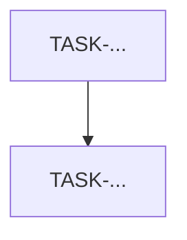

# EventFlow Skill — User Story to Development Tasks

## Purpose

This skill transforms an approved EventFlow User Story into a complete, implementation-ready set of **Development Tasks**.

The tasks must be clear enough for Backend Engineers, Frontend Engineers, QA, DevOps, AI Engineers, and AI coding agents to execute.

The skill must preserve traceability, MVP scope, security, architecture, testing expectations, and demo readiness.

---

## When to Use This Skill

Use this skill when the user provides an approved EventFlow User Story and asks to:

* Generate Development Tasks.
* Break down the story into technical tasks.
* Prepare the story for sprint execution.
* Create backend/frontend/API/QA tasks.
* Create implementation tasks from a User Story.
* Prepare tasks for AI coding agents.
* Generate tasks for the backlog item.

---

## Required Input

The User Story should be approved or ready for implementation.

Expected fields:

* User Story ID.
* Title.
* Epic.
* Backlog Item.
* Priority.
* Status.
* User Story statement.
* Business Context.
* Acceptance Criteria.
* Traceability.
* Dependencies.
* Assumptions.
* Technical Notes.
* QA Notes.
* Out of Scope.

If the story is not approved, warn the user and still provide a best-effort task breakdown only if it is safe. Mark uncertain tasks as:

`Requires PO/Tech Lead Validation`.

---

## Source of Truth

Generate tasks aligned with:

* `/management/artifacts/Product-Backlog-Prioritized.md`
* `/management/artifacts/EventFlow-Epic-Map.md`
* `/management/templates/user-story.tpl.md`
* `/docs/3-MVP-Scope-Definition.md`
* `/docs/4-Business-Rules-Document.md`
* `/docs/5-User-Roles-Permissions-Matrix.md`
* `/docs/6-Domain-Data-Model.md`
* `/docs/7-AI-Features-Specification.md`
* `/docs/8-Use-Cases-Specification.md`
* `/docs/9-Functional-Requirements-Document.md`
* `/docs/10-Non-Functional-Requirements.md`
* `/docs/11-Data-Seed-Strategy.md`
* `/docs/12-Architecture-Vision-and-Principles.md`
* `/docs/13-System-Architecture-Document.md`
* `/docs/14-Backend-Technical-Design.md`
* `/docs/15-Frontend-Architecture-Design.md`
* `/docs/16-API-Design-Specification.md`
* `/docs/17-AI-Architecture-and-PromptOps-Design.md`
* `/docs/18-Database-Physical-Design.md`
* `/docs/19-Security-and-Authorization-Design.md`
* `/docs/20-Testing-Strategy.md`
* `/docs/21-Deployment-and-DevOps-Design.md`
* `/docs/22-Architecture-Decision-Records.md`

---

## EventFlow Technical Constraints

Always follow the approved EventFlow architecture:

### Backend

* Node.js.
* Express.js.
* TypeScript.
* Modular Monolith.
* Clean / Hexagonal Architecture.
* Prisma ORM.
* PostgreSQL.
* REST JSON API.
* Zod validation.
* Backend is the source of truth for RBAC, ownership, and business rules.

### Frontend

* Next.js.
* TypeScript.
* App Router.
* Feature-first structure.
* TanStack Query.
* React Hook Form + Zod.
* next-intl.
* Tailwind + design tokens.
* Server Components for public SEO-ready pages.
* Client Components for authenticated workflows, forms, interactivity, and state.

### AI

* `LLMProvider` abstraction.
* `OpenAIProvider` as principal MVP provider.
* `MockAIProvider` mandatory for tests and demo.
* `AnthropicProvider` as stub/future only.
* `AIRecommendation` persistence.
* Prompt versioning.
* Strict JSON validation.
* Timeout and fallback.
* Human-in-the-loop always.

### Security

* HTTP-only cookies.
* RBAC + ownership.
* Assignment-based authorization where applicable.
* Admin-scoped authorization where applicable.
* Captcha and rate limiting for sensitive flows.
* No secrets in frontend.
* No tokens in localStorage.
* Backend validates all protected actions.

### Testing

* Vitest.
* Supertest.
* Playwright.
* MSW.
* MockAIProvider for AI tests.
* Negative authorization tests.
* Accessibility checks for UI.
* Seed-based E2E where applicable.

---

## MVP Guardrails

Do not generate tasks that introduce:

* Real payments.
* Commissions.
* Contracts or e-signature.
* WhatsApp integration.
* Real-time chat.
* Native mobile app.
* Push notifications in MVP.
* Automatic currency conversion.
* AI autonomous decisions.
* AI review moderation.
* RAG or vector databases.
* Enterprise multi-tenancy.
* Functional AnthropicProvider beyond stub.
* Google OAuth if marked Future.
* Vendor AI bio/package generation if marked Future.
* Vendor response to reviews if marked Future.

---

## Task Categories

Generate only relevant categories:

* Product / Analysis
* Backend
* Frontend
* API Contract
* Database / Prisma
* AI / PromptOps
* Security / Authorization
* QA / Testing
* Seed / Demo Data
* DevOps / Environment
* Documentation / Traceability

Always include QA tasks.

Include Security tasks whenever the story touches protected resources, roles, ownership, assignment, admin actions, authentication, file upload, AI, or sensitive flows.

Include Seed/Demo tasks when the story impacts demo, E2E, admin metrics, events, vendors, quotes, bookings, reviews, notifications, or AI output.

---

## Task ID Format

Use this format:

`TASK-<USER_STORY_ID>-<AREA>-<NNN>`

Examples:

* `TASK-US-001-BE-001`
* `TASK-US-001-FE-001`
* `TASK-US-001-QA-001`
* `TASK-US-001-SEC-001`

Area codes:

* `PO`
* `BE`
* `FE`
* `API`
* `DB`
* `AI`
* `SEC`
* `QA`
* `SEED`
* `OPS`
* `DOC`

---

## Estimate Scale

Use only:

* XS
* S
* M
* L

If a task is larger than `L`, split it.

---

## Output Language

Always produce the final output in **Spanish LATAM neutral**.

Use English only for identifiers, code names, file paths, endpoint names, enums, and official technical terms.

---

## Output Format

# Development Tasks Breakdown — `<USER_STORY_ID>`

## 1. Resumen Ejecutivo

| Campo                 | Valor          |
| --------------------- | -------------- |
| User Story ID         |                |
| Título                |                |
| Epic                  |                |
| Backlog Item          |                |
| Prioridad             |                |
| Rol principal         |                |
| Estado de la historia |                |
| Complejidad estimada  | XS / S / M / L |
| Áreas impactadas      |                |

## 2. Interpretación de la User Story

Explain:

* What must be implemented.
* What must be persisted.
* What must be displayed.
* What must be validated.
* What must be tested.
* What is out of scope.

## 3. Matriz de Trazabilidad

| Fuente              | Referencias | Impacto en tareas |
| ------------------- | ----------- | ----------------- |
| Epic                |             |                   |
| Backlog Item        |             |                   |
| User Story          |             |                   |
| Acceptance Criteria |             |                   |
| FRD                 |             |                   |
| Use Cases           |             |                   |
| Business Rules      |             |                   |
| Permissions         |             |                   |
| Data Model          |             |                   |
| API Spec            |             |                   |
| Backend Design      |             |                   |
| Frontend Design     |             |                   |
| AI Design           |             |                   |
| Security Design     |             |                   |
| Testing Strategy    |             |                   |
| ADRs                |             |                   |

## 4. Resumen de Tareas

| Task ID | Área | Título | Prioridad | Estimación | Depende de | Responsable |
| ------- | ---- | ------ | --------- | ---------- | ---------- | ----------- |

## 5. Tareas Detalladas

For each task:

## TASK-<USER_STORY_ID>-<AREA>-<NNN> — <Task Title>

| Campo        | Valor                 |
| ------------ | --------------------- |
| Área         |                       |
| Prioridad    | Must / Should / Could |
| Estimación   | XS / S / M / L        |
| Depende de   |                       |
| Responsable  |                       |
| Trazabilidad |                       |

### Objetivo

Describe the task objective.

### Alcance

Incluye:

* ...

Excluye:

* ...

### Notas de Implementación

Provide implementation guidance aligned to EventFlow architecture.

### Acceptance Criteria Cubiertos

* AC1
* AC2

### Definition of Done

* [ ] Implementación completada.
* [ ] Validaciones agregadas.
* [ ] Pruebas agregadas o actualizadas.
* [ ] Seguridad/autorización considerada.
* [ ] i18n considerado si aplica.
* [ ] No se viola ningún guardrail MVP.
* [ ] Trazabilidad actualizada.

## 6. Tareas QA Requeridas

Include a QA-focused table:

| QA Task | Tipo de prueba                                              | Qué valida | Herramienta                                    |
| ------- | ----------------------------------------------------------- | ---------- | ---------------------------------------------- |
|         | Unit / Integration / API / E2E / Contract / Security / A11Y |            | Vitest / Supertest / Playwright / MSW / Manual |

## 7. Security Checklist

If security applies:

* [ ] Auth required.
* [ ] Correct role enforced.
* [ ] Ownership enforced.
* [ ] Assignment-based access enforced.
* [ ] Admin-scoped access enforced.
* [ ] Negative 401 test.
* [ ] Negative 403 test.
* [ ] Sensitive logs redacted.
* [ ] No secrets exposed to frontend.

If security does not apply, write:

`No aplica para esta User Story.`

## 8. AI Checklist

If AI applies:

* [ ] Uses `LLMProvider`.
* [ ] Supports `MockAIProvider`.
* [ ] Persists `AIRecommendation`.
* [ ] Uses prompt versioning.
* [ ] Validates JSON with Zod.
* [ ] Applies timeout/fallback.
* [ ] Human-in-the-loop enforced.
* [ ] Does not make autonomous decisions.

If AI does not apply, write:

`No aplica para esta User Story.`

## 9. Seed / Demo Impact

Explain whether seed/demo updates are required.

If yes, include:

* Required seed entities.
* Demo scenario impacted.
* E2E data requirements.
* `is_seed=true` considerations.

If no, write:

`No requiere cambios de seed/demo.`

## 10. Dependency Graph

Provide a Mermaid graph:

## 11. Orden Sugerido de Implementación

Group tasks by phase:

### Fase 1 — Análisis / Contrato

### Fase 2 — Backend / DB

### Fase 3 — Frontend

### Fase 4 — QA / Seguridad

### Fase 5 — Seed / Demo / Docs

Only include phases that apply.

## 12. Riesgos y Mitigaciones

| Riesgo | Impacto | Mitigación | Responsable |
| ------ | ------- | ---------- | ----------- |

## 13. Confirmación de Fuera de Alcance

List what must not be implemented for this story.

## 14. Readiness Final

* [ ] ACs cubiertos por tareas.
* [ ] QA cubierto.
* [ ] Seguridad cubierta si aplica.
* [ ] IA cubierta si aplica.
* [ ] Seed/demo cubierto si aplica.
* [ ] Dependencias identificadas.
* [ ] No hay scope creep.
* [ ] Lista para Sprint Planning.

---

## Quality Rules

Before finalizing:

* Every Acceptance Criterion must map to at least one task.
* Every protected backend action must have auth and negative tests.
* Every UI story must include loading, error, empty, success, and accessibility considerations where relevant.
* Every AI story must include HITL, fallback, schema validation, and persistence.
* Every admin action must consider `AdminAction`.
* Every task must be actionable.
* No task should exceed `L`.
* Do not invent out-of-scope features.
* Do not generate code unless explicitly requested.
