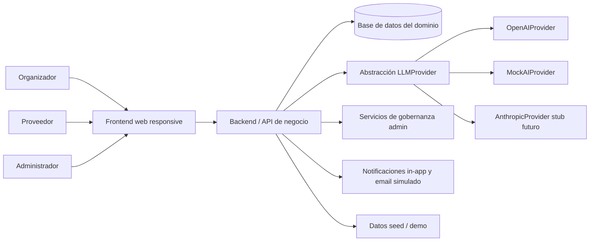

# 2. Arquitectura del Sistema

## 2.1. Diagrama de arquitectura:

Propuesta preliminar basada en documentación de Planning y Analysis.

La documentación describe una arquitectura por capas donde el frontend web consume una API de negocio que concentra la lógica de eventos, presupuesto, proveedores, cotizaciones, reseñas y administración. La IA se desacopla mediante una interfaz `LLMProvider` para evitar dependencia rígida con un único proveedor. El principal beneficio de este enfoque es la separación clara entre interfaz, lógica, persistencia y proveedor de IA; el sacrificio es que la arquitectura definitiva de despliegue e implementación aún no está cerrada.

## 2.2. Descripción de componentes principales:

- `Frontend web responsive`: interfaz para organizadores, proveedores y administradores. La tecnología específica de implementación no está definida en la documentación actual.
- `Backend / API`: concentra autenticación, reglas de negocio, ownership de recursos, flujos de cotización, lógica de booking simulado, moderación y trazabilidad.
- `Base de datos del dominio`: persiste entidades como `Event`, `EventTask`, `Budget`, `VendorProfile`, `QuoteRequest`, `Quote`, `BookingIntent`, `Review`, `AIRecommendation` y `AdminAction`.
- `LLMProvider`: capa de abstracción para capacidades de IA del MVP.
- `OpenAIProvider`: proveedor principal documentado para las funcionalidades de IA del MVP.
- `MockAIProvider`: componente obligatorio para demo, tests automatizados, fallback y operación determinista.
- `AnthropicProvider`: preparación contractual futura; no se documenta como proveedor funcional del MVP.
- `Módulo administrativo`: aprobación de proveedores, gestión de categorías, moderación de reseñas, lectura de eventos y métricas operativas.
- `Notificaciones`: bandeja in-app y email simulado por log estructurado; no hay WhatsApp, push ni SMS en el MVP.
- `Seed/demo`: conjunto reproducible de datos y escenarios para demostrar flujos end-to-end sin depender de datos reales.

Nota: el Domain Data Model considera realista una implementación compatible con una base relacional y herramientas tipo Prisma/PostgreSQL, pero eso aparece como orientación técnica, no como stack final implementado.

## 2.3. Descripción de alto nivel del proyecto y estructura de ficheros

Pendiente de implementación del repositorio de aplicación.

En el estado actual, el repositorio documenta principalmente las fases de análisis y preparación del producto:

- `docs/`: documentos fuente de discovery, decisiones de producto, alcance MVP, reglas de negocio, modelo de datos, IA, casos de uso, FRD, NFR y seed strategy.
- `prompts/`: prompts de trabajo utilizados para generar y alinear la documentación del proyecto.
- `deliverables/`: paquete de entrega final generado a partir de la documentación disponible.

La estructura definitiva de carpetas de frontend, backend, base de datos, tests y despliegue debe completarse cuando exista implementación.

## 2.4. Infraestructura y despliegue

Pendiente de despliegue.

No disponible en la documentación actual una definición cerrada de proveedor cloud, ambientes, pipeline CI/CD, contenedorización, dominios ni estrategia operativa. La documentación sí exige que la futura solución sea desplegable en un ambiente académico o demo, con variables de entorno para IA y seed reproducible, pero la infraestructura concreta queda por definir en la fase de implementación.

## 2.5. Seguridad

Las prácticas de seguridad documentadas para el MVP son las siguientes:

- Autenticación obligatoria para funcionalidades protegidas.
- Autorización por rol con tres perfiles activos: `organizer`, `vendor` y `admin`.
- Control de ownership: un organizador solo puede operar sus eventos; un proveedor solo ve solicitudes dirigidas a su perfil; el administrador opera con privilegios acotados de gobernanza.
- Captcha y medidas anti-bot en registro e inicio de sesión.
- Hash de contraseñas y prohibición de almacenar credenciales en texto plano.
- Minimización de datos personales: no se solicitan documentos de identidad, datos fiscales ni medios de pago.
- Minimización de datos enviados al proveedor LLM y uso de IA bajo validación humana obligatoria.
- Trazabilidad obligatoria de salidas IA mediante `AIRecommendation` y de acciones administrativas mediante `AdminAction`.
- Soft delete y auditoría para reseñas moderadas y attachments eliminados.
- Exclusión explícita de pagos reales, contratos firmados, WhatsApp, chat en tiempo real y automatizaciones IA de alto riesgo.

## 2.6. Tests

Pendiente de ejecución.

Con base en FRD, NFR y reglas de negocio, la documentación recomienda cubrir al menos:

- Tests de autenticación, autorización por rol y ownership de recursos.
- Tests de inmutabilidad de moneda por evento.
- Tests del límite de 5 `QuoteRequest` activas por categoría y evento.
- Tests de validez por defecto de cotizaciones y expiración automática.
- Tests de cierre automático del evento 2 días después de `event_date`.
- Tests de fallback y timeout de IA con `MockAIProvider`.
- Tests de moderación de reseñas y registro en `AdminAction`.
- Tests de seed reproducible e idempotente.
