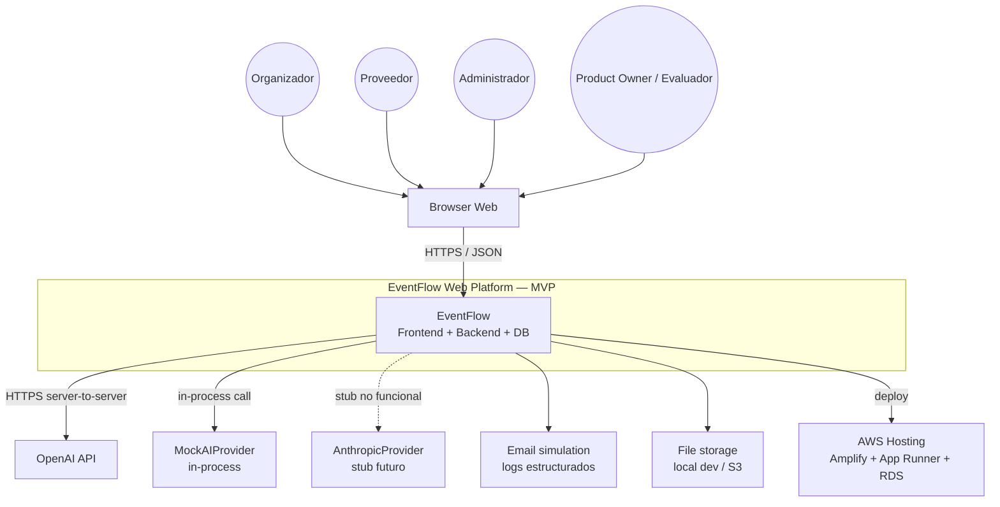
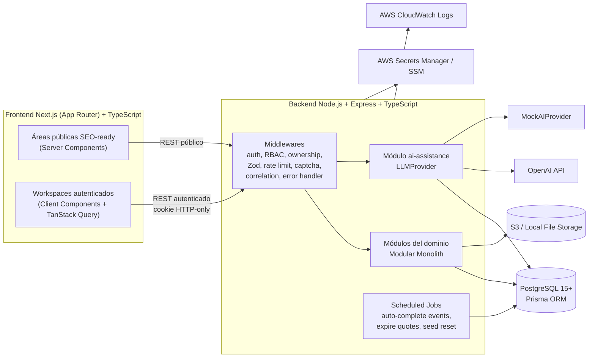
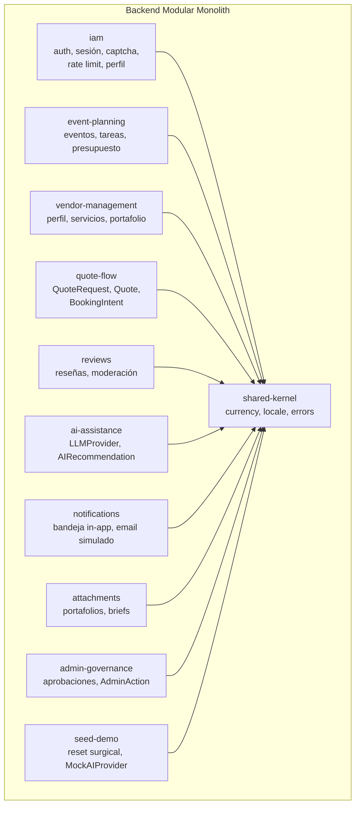

# 2. Arquitectura del Sistema

Este documento resume la arquitectura de EventFlow alineada con los documentos técnicos vigentes en `/docs/12` a `/docs/22`. La arquitectura está formalmente aprobada por los ADRs registrados en [`/docs/22-Architecture-Decision-Records.md`](../docs/22-Architecture-Decision-Records.md), pero **no existe implementación funcional ni despliegue** en este repositorio aún.

## 2.1. Estilo arquitectónico

- **Modular Monolith** (ADR-ARCH-001): un único artefacto desplegable de backend, dividido internamente por bounded contexts.
- **Clean / Hexagonal Architecture** dentro de cada módulo (ADR-ARCH-002): capas Interface, Application, Domain, Ports, Infrastructure y Shared Kernel.
- **REST JSON** como contrato de API (ADR-ARCH-003, ADR-API-001), versionado en `/api/v1`.
- **PostgreSQL** como sistema de registro (ADR-DB-001), accedido via **Prisma** aislado en Infrastructure (ADR-BE-002).
- **Frontend Next.js (App Router)** desacoplado, consumiendo el backend via REST (ADR-FE-001, ADR-FE-002).
- **Abstracción `LLMProvider`** con adapters intercambiables (ADR-AI-001 a ADR-AI-008).
- **Human-in-the-loop estricto** para todas las salidas IA (ADR-AI-005).
- **Sin marketplace transaccional** en MVP (ADR-ARCH-004).

## 2.2. Diagrama de arquitectura — C4 Level 1 (System Context)



## 2.3. Diagrama de arquitectura — C4 Level 2 (Containers)



## 2.4. Diagrama de arquitectura — C4 Level 3 (Módulos backend)



Detalle completo en [`/docs/13-System-Architecture-Document.md`](../docs/13-System-Architecture-Document.md) y [`/docs/14-Backend-Technical-Design.md`](../docs/14-Backend-Technical-Design.md).

## 2.5. Descripción de componentes principales

| Componente | Responsabilidad | Documento fuente |
|---|---|---|
| Browser web | Único cliente soportado en MVP. | `/docs/13`, `/docs/15` |
| Frontend Next.js (App Router) | Áreas autenticadas por rol + áreas públicas SEO-ready. Consumo REST via TanStack Query. No es BFF, no llama directo a OpenAI ni a Postgres. | `/docs/15` |
| Backend Node.js + Express + TypeScript | Modular Monolith con Clean/Hex. Atiende `/api/v1`, aplica RBAC + ownership, valida con Zod, persiste via Prisma. | `/docs/14`, `/docs/16` |
| Módulo `ai-assistance` | Concentra lógica IA: `LLMProvider`, schemas de entrada/salida (Zod), persistencia de `AIRecommendation`, prompt registry y human-in-the-loop. | `/docs/17` |
| `LLMProvider` (puerto) | Abstracción de proveedor LLM. | ADR-AI-001, `/docs/17` |
| `OpenAIProvider` | Adapter principal del MVP. | ADR-AI-002 |
| `MockAIProvider` | Obligatorio para tests, demo y fallback determinista. | ADR-AI-003 |
| `AnthropicProvider` | Stub no funcional para validar sustituibilidad del puerto. | ADR-AI-004 |
| PostgreSQL 15+ (Prisma) | Persistencia de todas las entidades MVP. UUID v4, enums nativos, JSONB acotado, índices query-driven. | `/docs/18` |
| Scheduled jobs | Auto-cierre de eventos, expiración de cotizaciones, seed reset administrativo. | `/docs/14`, ADR-BE-004 |
| Notificaciones | Bandeja in-app + email simulado por logs estructurados. Sin SMTP real en MVP. | `/docs/14` |
| Attachments | Portafolios de proveedor y briefs. `LocalFileStorageAdapter` en dev, `S3` en cloud. | `/docs/14`, ADR-DEVOPS-005 |
| Gobernanza admin | Aprobación / rechazo de proveedores, gestión de categorías, moderación de reseñas, auditoría (`AdminAction`). | `/docs/19` |
| Seed & demo | Reset surgical via `DELETE WHERE is_seed = true`, `LLM_PROVIDER=mock`, `AI_DEMO_MODE`. | `/docs/11`, `/docs/17`, `/docs/21` |

## 2.6. Descripción de alto nivel del proyecto y estructura de ficheros

Pendiente de implementación del repositorio de aplicación.

En el estado actual, el repositorio documenta exclusivamente las fases de análisis, planificación y diseño arquitectónico:

```
/
├── README.md                        # Índice ejecutivo de la entrega final
├── deliverables/                    # Paquete académico final (este documento incluido)
├── docs/                            # Documentación técnica del proyecto (1 a 22)
├── prompts/                         # Prompts AAA usados para generar la documentación
└── eventflow-domain-discovery/      # Borrador inicial del discovery de dominio
```

La estructura final de carpetas de **frontend** y **backend** debe completarse cuando exista implementación. Los lineamientos están en `/docs/14` (estructura backend feature-by-bounded-context) y `/docs/15` (estructura frontend feature-first).

## 2.7. Infraestructura y despliegue

Definidos en [`/docs/21-Deployment-and-DevOps-Design.md`](../docs/21-Deployment-and-DevOps-Design.md) y formalizados por ADR-DEVOPS-001 a ADR-DEVOPS-007. **Sin implementación / sin URL pública**.

```text
Browser
   │
   ▼
Frontend Next.js  ──►  AWS Amplify Hosting
   │ (REST / HTTPS, cookies HTTP-only)
   ▼
Backend Node.js + Express (Docker)  ──►  AWS App Runner
   │
   ├──►  Amazon RDS PostgreSQL
   ├──►  Amazon S3                  (portfolios, attachments)
   ├──►  AWS Secrets Manager / SSM  (secretos)
   ├──►  Amazon CloudWatch          (logs)
   └──►  OpenAI API / MockAIProvider
CI/CD: GitHub Actions  ──►  Despliega frontend a Amplify y backend a App Runner.
```

- **Entornos planeados:** Local, CI, QA/Staging, Demo.
- **Quality gates en CI:** lint, typecheck, build, tests unitarios + integración + E2E mínimos, validación de migraciones Prisma.
- **MockAIProvider** habilitable por bandera para demo sin OpenAI (`LLM_PROVIDER=mock`, `AI_DEMO_MODE=true`).
- **Sin Kubernetes, sin microservicios, sin multi-región, sin Terraform/CDK obligatorio**.

## 2.8. Seguridad

Lineamientos completos en [`/docs/19-Security-and-Authorization-Design.md`](../docs/19-Security-and-Authorization-Design.md). Resumen:

- **Backend como fuente de verdad** de autorización; el frontend solo aporta UX guards (ADR-FE-003).
- **Sesión por cookie HTTP-only firmada**, sin tokens en `localStorage` (ADR-SEC-002).
- **RBAC + ownership + assignment-based** enforced en backend (ADR-SEC-003).
- **Captcha y rate limiting** en flujos sensibles (registro, login, password reset, captcha en `/api/v1/quote-requests`) (ADR-SEC-004).
- **Validación Zod obligatoria** en el límite del controlador (ADR-API-003).
- **CSRF, CORS, headers de seguridad y manejo de errores sin fuga de información** (ADR-SEC-006).
- **Secretos solo en backend / Secrets Manager / SSM** (ADR-SEC-005).
- **Auditoría administrativa via `AdminAction`** y trazabilidad IA via `AIRecommendation`.
- **AI privacy:** minimización de payloads enviados al LLM, mitigación de prompt injection, redacción en logs.
- **Soft delete** para `reviews`, `attachments`, `service_categories`, `event_types`, `vendor_profiles` via status (ADR-DB-004).
- **Sin pagos, KYC, MFA, SSO, multi-tenant, WAF avanzado ni SIEM** en MVP.

## 2.9. Tests

Lineamientos completos en [`/docs/20-Testing-Strategy.md`](../docs/20-Testing-Strategy.md). Resumen:

- **Backend:** Vitest + Supertest. Tests unitarios por capa, integración use case + Prisma, API tests con DTO/Zod, contract tests con MSW.
- **Frontend:** Vitest + Testing Library + MSW. Tests de componentes, formularios y flows críticos con TanStack Query.
- **E2E:** Playwright sobre entorno con seed, ejecutado con `LLM_PROVIDER=mock`.
- **IA:** tests deterministas obligatorios con `MockAIProvider` (ADR-TEST-003).
- **Seguridad:** tests negativos de autorización (RBAC, ownership, assignment) como quality gate (ADR-TEST-004).
- **Accesibilidad:** verificación de teclado, foco, labels, contraste y ARIA básicos.
- **i18n y currency:** validación de `es-LATAM`, `es-ES`, `pt`, `en` y de inmutabilidad de moneda.
- **Seed:** idempotencia, reset surgical y verificación de `is_seed = true`.

**Estado:** estrategia definida, ejecución pendiente. No hay reportes de cobertura ni runs de CI en este repositorio.

## 2.10. Documentos fuente

- [Architecture Vision & Principles](../docs/12-Architecture-Vision-and-Principles.md)
- [System Architecture Document](../docs/13-System-Architecture-Document.md)
- [Backend Technical Design](../docs/14-Backend-Technical-Design.md)
- [Frontend Architecture Design](../docs/15-Frontend-Architecture-Design.md)
- [AI Architecture & PromptOps Design](../docs/17-AI-Architecture-and-PromptOps-Design.md)
- [Security & Authorization Design](../docs/19-Security-and-Authorization-Design.md)
- [Deployment & DevOps Design](../docs/21-Deployment-and-DevOps-Design.md)
- [Architecture Decision Records](../docs/22-Architecture-Decision-Records.md)
