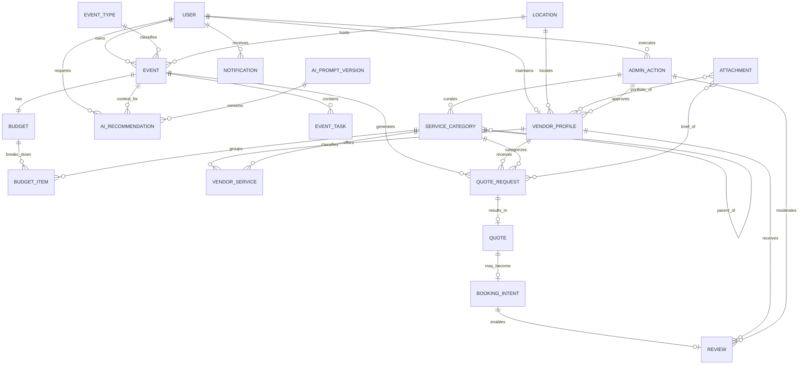

# 3. Modelo de Datos

Este documento resume el modelo de datos del MVP, basado en [`/docs/6-Domain-Data-Model.md`](../docs/6-Domain-Data-Model.md) y operacionalizado por [`/docs/18-Database-Physical-Design.md`](../docs/18-Database-Physical-Design.md), con apoyo de [`/docs/11-Data-Seed-Strategy.md`](../docs/11-Data-Seed-Strategy.md) y [`/docs/17-AI-Architecture-and-PromptOps-Design.md`](../docs/17-AI-Architecture-and-PromptOps-Design.md).

## 3.1. Diagrama ER del MVP

El esquema físico aprobado vive en `/docs/18-Database-Physical-Design.md`; incluye tipos físicos, enums nativos, índices query-driven, índices parciales para soft delete, JSONB acotado, restricciones únicas parciales y reglas transaccionales con `prisma.$transaction`.

## 3.2. Reglas clave del modelo

Trazables a `/docs/4-Business-Rules-Document.md`, `/docs/8.1-Product-Owner-Decisions-Use-Cases-Addendum.md`, `/docs/17` y `/docs/18`:

- **Ownership de evento:** un `Event` pertenece a un único `owner_id`; solo el owner edita el evento.
- **Currency inmutable:** la moneda se fija al crear el evento y no se puede modificar.
- **Validez de cotización:** `Quote.valid_until` es 15 días calendario por defecto si el proveedor no la define.
- **Límites de cotización:** máximo 5 `QuoteRequest` activas por categoría y por evento; una activa por `(evento, proveedor)`.
- **Auto-cierre de evento:** el evento se cierra automáticamente 2 días calendario después de `event_date`.
- **Portafolio:** un proveedor puede subir hasta **10 imágenes por trabajo/evento** mostrado.
- **Rating:** entero entre **1 y 5**; una reseña por `(evento, proveedor)`; solo permitida con `BookingIntent` confirmado.
- **Soft delete obligatorio** en `reviews`, `attachments`, `service_categories`, `event_types`, `vendor_profiles` via columna de status (ADR-DB-004).
- **Trazabilidad IA:** toda invocación a IA persiste un `AIRecommendation` con `llm_provider`, `prompt_version_id`, payloads, `accepted`, `edited`, `fallback_used`, `timeout_ms`, `language_code`.
- **Seed determinista:** todas las tablas operativas llevan `is_seed boolean`. Reset surgical via `DELETE WHERE is_seed = true`.
- **Catálogo cerrado de tipos de evento:** `wedding`, `xv`, `baptism`, `baby_shower`, `birthday`, `corporate`.
- **Catálogo de moneda:** `GTQ`, `USD`, `EUR`, `MXN`, `COP`, sin conversión automática.
- **Catálogo de idioma:** `es-LATAM`, `es-ES`, `pt`, `en`.

## 3.3. Entidades principales

| Entidad | Descripción | Atributos principales | Relaciones y restricciones clave |
|---|---|---|---|
| `User` | Persona registrada con rol `organizer`, `vendor` o `admin`. | `id`, `email` (único), `name`, `role`, `preferred_language`, `password_hash`, `status`, `created_at` | Mono-rol en MVP; admins no se crean por registro público. |
| `EventType` | Catálogo cerrado de tipos de evento. | `code`, `display_name`, `description`, `is_active`, `sort_order` | PK `code`; soft delete via `is_active`; no hard delete si existen eventos asociados. |
| `Event` | Evento creado por un organizador; núcleo del workspace. | `id`, `owner_id`, `event_type_code`, `name`, `event_date`, `guests_count`, `estimated_budget`, `currency_code`, `language_code`, `status`, `auto_completed`, `completed_at` | `currency_code` inmutable post-creación; estados `draft`/`active`/`completed`/`cancelled`; auto-cierre 2 días tras `event_date`. |
| `Location` | Ubicación normalizada para eventos y proveedores. | `id`, `country_code`, `city`, `region`, `display_name` | Reutilizable por `Event` y `VendorProfile`. |
| `EventTask` | Tarea del checklist del evento. | `id`, `event_id`, `title`, `description`, `status`, `due_date`, `ai_generated`, `is_confirmed` | Estados `pending`/`in_progress`/`done`/`skipped`; tareas IA requieren confirmación para contar en progreso. |
| `Budget` | Presupuesto general 1:1 con el evento. | `id`, `event_id`, `total_amount`, `currency_code`, `committed_total` | Misma moneda que el evento; warnings si comprometido supera planificado. |
| `BudgetItem` | Línea de presupuesto por categoría. | `id`, `budget_id`, `service_category_id`, `planned_amount`, `committed_amount`, `paid_amount`, `ai_generated` | `committed_amount` se actualiza con booking confirmado. |
| `ServiceCategory` | Catálogo curado de categorías de proveedor/presupuesto. | `id`, `name`, `slug`, `parent_id`, `depth_level`, `status` | Gestión exclusiva de admin; jerarquía máxima 2 niveles; soft delete preferente. |
| `VendorProfile` | Perfil operativo del proveedor. | `id`, `user_id`, `location_id`, `business_name`, `bio`, `status`, `average_rating`, `category_change_count`, `requires_admin_review` | Estados `pending`/`approved`/`rejected`/`hidden`; solo `approved` aparece en directorio público. |
| `VendorService` | Servicio o paquete del proveedor. | `id`, `vendor_profile_id`, `service_category_id`, `name`, `description`, `base_price`, `ai_generated_description` | Un proveedor ofrece múltiples servicios. |
| `QuoteRequest` | Solicitud estructurada de cotización. | `id`, `event_id`, `vendor_profile_id`, `service_category_id`, `brief`, `status`, `expires_at`, `ai_generated_brief` | Solo owner del evento la crea; una activa por `(evento, proveedor)`; máx 5 activas por categoría/evento; estados `sent`/`viewed`/`responded`/`expired`/`cancelled`. |
| `Quote` | Respuesta del proveedor. | `id`, `quote_request_id`, `total_price`, `breakdown` (JSONB), `conditions`, `valid_until`, `status`, `is_preferred` | `valid_until` default 15 días si no se define; estados `draft`/`sent`/`accepted`/`rejected`/`expired`; enviado no vuelve a draft. |
| `BookingIntent` | Intención de reserva simulada. | `id`, `event_id`, `quote_id`, `status`, `confirmed_at`, `cancelled_at`, `cancelled_by`, `cancellation_reason` | Sin pago real ni contrato; requiere confirmación del proveedor; puede cancelarse incluso confirmado. |
| `Review` | Reseña verificada posterior al evento. | `id`, `event_id`, `vendor_profile_id`, `booking_intent_id`, `rating`, `comment`, `status`, `moderated_by`, `moderated_at`, `moderation_reason` | Solo con `BookingIntent` confirmado; una por `(evento, proveedor)`; rating 1–5; moderación manual con soft delete. |
| `Notification` | Notificación in-app y trazabilidad de avisos. | `id`, `user_id`, `type`, `title`, `body` (JSONB), `read_at`, `created_at` | Email simulado por logs estructurados. |
| `AIRecommendation` | Registro persistente de toda salida IA. | `id`, `event_id`, `requested_by_user_id`, `type`, `input_payload` (JSONB), `output_payload` (JSONB), `accepted`, `edited`, `llm_provider`, `prompt_version_id`, `language_code`, `fallback_used`, `timeout_ms`, `status` | `accepted=false` por defecto; lifecycle `pending`/`accepted`/`edited`/`rejected`/`discarded`. |
| `AIPromptVersion` | Registro híbrido de versiones de prompt (catálogo en código + tabla opcional). | `id`, `feature`, `version`, `language_code`, `template_snapshot`, `effective_from` | Trazabilidad histórica de prompts; promovido a tabla cuando se requiere auditoría. |
| `Attachment` | Archivo adjunto polimórfico. | `id`, `owner_type`, `owner_id`, `url`, `mime_type`, `status`, `deleted_at` | Soft delete obligatorio; usado para portafolio y briefs. |
| `AdminAction` | Bitácora inmutable de acciones de admin. | `id`, `admin_user_id`, `action`, `entity_type`, `entity_id`, `reason`, `created_at` | Append-only; registra aprobaciones, moderaciones, cambios de catálogo y lecturas de soporte. |
| Catálogos `Language`, `Currency` | Catálogos auxiliares MVP. | `code`, `display_name`, `is_active` | Listas cerradas; sin conversión automática de moneda. |

## 3.4. Diseño físico — resumen

Detalle en [`/docs/18-Database-Physical-Design.md`](../docs/18-Database-Physical-Design.md):

- **Motor:** PostgreSQL 15+, un solo schema `public`.
- **ORM:** Prisma; mappings via `@map`, `@@map`, `@@index`, `@@unique`; `Decimal` para montos; `Json` para JSONB.
- **IDs:** UUID v4 para todas las tablas operativas.
- **Naming físico:** snake_case en tablas/columnas.
- **Enums:** nativos PostgreSQL (`event_status`, `quote_status`, `review_status`, etc.).
- **JSONB:** restringido a payloads IA, `Quote.breakdown`, `Notification.body`, metadata de `AdminAction`, brief de `QuoteRequest` y metadata de attachments.
- **Constraints:** PK, FK, unique parciales (para soft delete + activos), checks (rango de rating, no negativos en montos).
- **Índices:** query-driven, derivados directamente de los endpoints listados en `/docs/16-API-Design-Specification.md`. Índices parciales para registros activos (`WHERE status <> 'hidden'`).
- **Auditoría:** `admin_actions` append-only; `ai_recommendations` trazabilidad end-to-end.
- **Soft delete:** obligatorio en `reviews`, `attachments`, `service_categories`, `event_types`, `vendor_profiles`.
- **Seed:** `is_seed boolean` en todas las tablas operativas; reset via `DELETE WHERE is_seed = true`; idempotencia obligatoria.
- **Sin** stored procedures, triggers, materialized views, particionado, sharding ni multi-tenant en MVP.

## 3.5. Documentos fuente

- [Domain Data Model](../docs/6-Domain-Data-Model.md)
- [Database Physical Design](../docs/18-Database-Physical-Design.md)
- [Data Seed Strategy](../docs/11-Data-Seed-Strategy.md)
- [AI Architecture & PromptOps Design](../docs/17-AI-Architecture-and-PromptOps-Design.md)
- [Business Rules Document](../docs/4-Business-Rules-Document.md)
- [PO Decisions — Use Cases Addendum](../docs/8.1-Product-Owner-Decisions-Use-Cases-Addendum.md)
