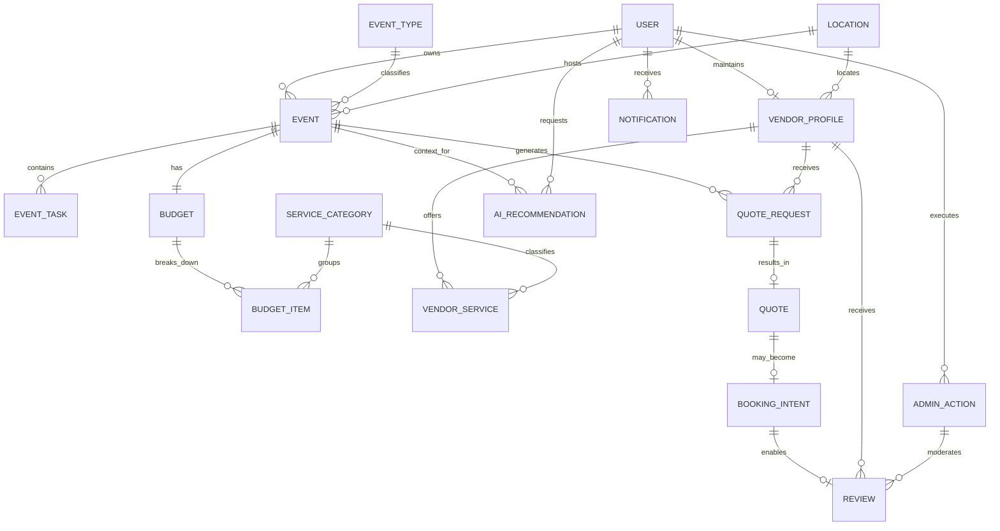

# 3. Modelo de Datos

## 3.1. Diagrama del modelo de datos:

El diagrama anterior resume las entidades núcleo documentadas para el MVP. Se basa en el Domain Data Model y conserva únicamente relaciones clave para evaluación funcional; la implementación física detallada y el esquema definitivo de base de datos quedan pendientes de la fase técnica.

## 3.2. Descripción de entidades principales:

| Entidad | Descripción | Atributos principales | PK / FK | Relaciones y restricciones clave |
|---|---|---|---|---|
| `User` | Persona registrada en la plataforma con rol `organizer`, `vendor` o `admin`. | `id`, `email`, `name`, `role`, `preferred_language`, `password_hash`, `status`, `created_at` | PK: `id` | `email` único; un usuario es mono-rol en MVP; no se permite crear admins desde registro público. |
| `EventType` | Catálogo cerrado de tipos de evento del MVP. | `code`, `display_name`, `description`, `is_active`, `sort_order` | PK: `code` | Catálogo restringido a `wedding`, `xv`, `baptism`, `baby_shower`, `birthday`, `corporate`; no admite hard delete si existen eventos asociados. |
| `Event` | Evento creado por un organizador y núcleo del workspace. | `id`, `owner_id`, `event_type_code`, `name`, `event_date`, `guests_count`, `estimated_budget`, `currency_code`, `language_code`, `status`, `auto_completed`, `completed_at` | PK: `id`; FK: `owner_id -> User`, `event_type_code -> EventType` | Todo evento pertenece a un único owner; solo el owner puede editarlo; moneda inmutable después de la creación; estados `draft`, `active`, `completed`, `cancelled`; auto-cierre 2 días después del evento. |
| `Location` | Ubicación normalizada para eventos y proveedores. | `id`, `country_code`, `city`, `region`, `display_name` | PK: `id` | Reutilizable por `Event` y `VendorProfile`; sirve para filtros de búsqueda y contexto cultural/idiomático. |
| `EventTask` | Tarea del checklist del evento. | `id`, `event_id`, `title`, `description`, `status`, `due_date`, `ai_generated`, `is_confirmed` | PK: `id`; FK: `event_id -> Event` | Toda tarea pertenece a un evento; puede ser manual o generada por IA; estados `pending`, `in_progress`, `done`, `skipped`; las tareas IA deben confirmarse antes de contar en progreso. |
| `Budget` | Presupuesto general asociado 1:1 con un evento. | `id`, `event_id`, `total_amount`, `currency_code`, `committed_total` | PK: `id`; FK: `event_id -> Event` | Un presupuesto por evento; comparte moneda del evento; soporta warnings si lo comprometido supera lo planificado. |
| `BudgetItem` | Línea de presupuesto por categoría de servicio. | `id`, `budget_id`, `service_category_id`, `planned_amount`, `committed_amount`, `paid_amount`, `ai_generated` | PK: `id`; FK: `budget_id -> Budget`, `service_category_id -> ServiceCategory` | Se usa para distribuir gasto por categoría; puede provenir de IA; `committed_amount` se actualiza con booking confirmado. |
| `ServiceCategory` | Catálogo curado de categorías de proveedor y presupuesto. | `id`, `name`, `slug`, `parent_id`, `depth_level`, `status` | PK: `id`; FK: `parent_id -> ServiceCategory` | Gestión exclusiva del admin; jerarquía máxima de 2 niveles; soft delete preferente; coherencia cultural LATAM. |
| `VendorProfile` | Perfil público/operativo del proveedor. | `id`, `user_id`, `location_id`, `business_name`, `bio`, `status`, `average_rating`, `category_change_count`, `requires_admin_review` | PK: `id`; FK: `user_id -> User`, `location_id -> Location` | Estados `pending`, `approved`, `rejected`, `hidden`; solo proveedores aprobados aparecen en el directorio; cambios de categoría limitados; sujeto a aprobación admin. |
| `VendorService` | Servicio o paquete ofrecido por un proveedor. | `id`, `vendor_profile_id`, `service_category_id`, `name`, `description`, `base_price`, `ai_generated_description` | PK: `id`; FK: `vendor_profile_id -> VendorProfile`, `service_category_id -> ServiceCategory` | Un proveedor ofrece múltiples servicios; cada servicio pertenece a una categoría existente del catálogo. |
| `QuoteRequest` | Solicitud estructurada de cotización enviada por el organizador a un proveedor. | `id`, `event_id`, `vendor_profile_id`, `service_category_id`, `brief`, `status`, `expires_at`, `ai_generated_brief` | PK: `id`; FK: `event_id -> Event`, `vendor_profile_id -> VendorProfile`, `service_category_id -> ServiceCategory` | Solo el owner del evento puede crearla; una activa por `(evento, proveedor)`; máximo 5 activas por categoría y evento; estados `sent`, `viewed`, `responded`, `expired`, `cancelled`. |
| `Quote` | Respuesta estructurada del proveedor a una `QuoteRequest`. | `id`, `quote_request_id`, `total_price`, `breakdown`, `conditions`, `valid_until`, `status`, `is_preferred` | PK: `id`; FK: `quote_request_id -> QuoteRequest` | El proveedor responde con una cotización vigente; `valid_until` por defecto es 15 días calendario si no se especifica; estados `draft`, `sent`, `accepted`, `rejected`, `expired`. |
| `BookingIntent` | Intención de reserva simulada derivada de una cotización aceptada. | `id`, `event_id`, `quote_id`, `status`, `confirmed_at`, `cancelled_at`, `cancelled_by`, `cancellation_reason` | PK: `id`; FK: `event_id -> Event`, `quote_id -> Quote` | No implica pago, contrato ni captura de tarjeta; requiere confirmación del proveedor; puede cancelarse incluso si ya está confirmada. |
| `Review` | Reseña verificada posterior al evento. | `id`, `event_id`, `vendor_profile_id`, `booking_intent_id`, `rating`, `comment`, `status`, `moderated_by`, `moderated_at`, `moderation_reason` | PK: `id`; FK: `event_id -> Event`, `vendor_profile_id -> VendorProfile`, `booking_intent_id -> BookingIntent` | Solo puede crearla un organizador con `BookingIntent.confirmed_intent`; una reseña por evento y proveedor; rating entero de 1 a 5; moderación manual con soft delete. |
| `Notification` | Notificación in-app y trazabilidad de avisos del sistema. | `id`, `user_id`, `type`, `title`, `body`, `read_at`, `created_at` | PK: `id`; FK: `user_id -> User` | Cubre avisos de cotizaciones, booking, tareas y gobernanza; el email real puede simularse por log. |
| `AIRecommendation` | Registro persistente de toda salida IA del MVP. | `id`, `event_id`, `requested_by_user_id`, `type`, `input_payload`, `output_payload`, `accepted`, `edited`, `llm_provider`, `prompt_version_id`, `language_code`, `fallback_used`, `timeout_ms` | PK: `id`; FK: `event_id -> Event`, `requested_by_user_id -> User` | Toda salida IA debe persistirse con trazabilidad; `accepted=false` por defecto; permite auditoría, fallback y reproducción. |
| `Attachment` | Archivo adjunto polimórfico para portafolios o briefs. | `id`, `owner_type`, `owner_id`, `url`, `mime_type`, `status`, `deleted_at` | PK: `id` | Soporta soft delete obligatorio; se usa especialmente para portafolio del proveedor y otros adjuntos documentados. |
| `AdminAction` | Bitácora inmutable de acciones del administrador. | `id`, `admin_user_id`, `action`, `entity_type`, `entity_id`, `reason`, `created_at` | PK: `id`; FK: `admin_user_id -> User` | Registra aprobaciones, moderaciones, cambios de catálogo y accesos de solo lectura a eventos; soporta auditoría del MVP. |

Además de estas entidades núcleo, la documentación recomienda catálogos auxiliares para `Language`, `Currency` y `AIPromptVersion`, así como el uso del flag `is_seed` para distinguir datos precargados de datos operativos futuros.
