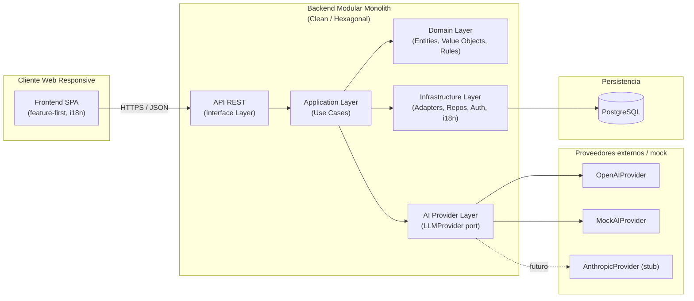

# EventFlow — Architecture Vision & Principles

> **Versión:** 1.0
> **Fecha:** 2026-06-08
> **Producto:** EventFlow — plataforma asistida por IA para planificación de eventos y gestión simplificada de cotizaciones de proveedores
> **MVP target:** AI-assisted event planning workspace + simplified vendor quote flow
> **Idioma del documento:** Español LATAM neutral
> **Estado:** Listo para uso como base de los documentos técnicos de arquitectura, diseño backend, diseño frontend, diseño de IA, persistencia, seguridad, testing, DevOps y ADRs.
> **Audiencia:** Software Architect, Tech Lead, Backend/Frontend/AI Engineers, DevOps, QA, Product Owner, evaluadores académicos, agentes de IA generadores de tareas, historias y diseños técnicos.

---

## 1. Propósito del documento

Este documento establece la **visión arquitectónica inicial** de EventFlow y los **principios técnicos** que deben gobernar todas las decisiones de diseño e implementación del MVP.

Sus objetivos son:

- Definir el **estilo arquitectónico recomendado** para el MVP y justificarlo frente a alternativas.
- Establecer los **principios técnicos** que deben aplicarse de forma transversal (dominio primero, IA desacoplada, human-in-the-loop, ownership por defecto, testabilidad, observabilidad, i18n, no overengineering).
- Servir como **puente** entre la documentación funcional ya aprobada (Discovery → FRD → NFR → Seed Strategy) y los documentos técnicos posteriores (System Architecture, Backend Technical Design, Frontend Architecture, API Spec, AI Architecture, Database Physical Design, Security Design, Testing Strategy, DevOps Design, ADR Log).
- Fijar los **límites técnicos del MVP**, alineados con el alcance funcional declarado.
- Identificar los **ADRs** que deben formalizarse a continuación.
- Habilitar la generación de **user stories, backlog y tareas de desarrollo** sobre una base técnica estable.

Este documento es **planificación arquitectónica**, no contiene código de implementación.

---

## 2. Alcance del documento

### 2.1 Incluye

- Decisión arquitectónica principal del MVP y su justificación.
- Comparación frente a alternativas arquitectónicas evaluadas y descartadas.
- Principios arquitectónicos transversales.
- Vista conceptual de alto nivel.
- Definición de capas lógicas recomendadas.
- Módulos backend recomendados, con responsabilidades y riesgos.
- Lineamientos de arquitectura frontend.
- Lineamientos de arquitectura de IA, incluyendo `LLMProvider`, `OpenAIProvider`, `MockAIProvider` y `AnthropicProvider` (stub).
- Lineamientos de persistencia y base de datos.
- Lineamientos de seguridad y autorización (RBAC + ownership).
- Lineamientos de observabilidad, auditoría y trazabilidad.
- Lineamientos de testing desde arquitectura.
- Lineamientos de deployment y ambientes.
- Límites explícitos del MVP.
- Escalabilidad futura.
- Riesgos técnicos y mitigaciones.
- ADRs recomendados.
- Documentos técnicos siguientes y su propósito.

### 2.2 No incluye

- Diseño detallado del API REST (lo cubrirá `/docs/16-API-Design-Specification.md`).
- Diseño físico de la base de datos (lo cubrirá `/docs/18-Database-Physical-Design.md`).
- Selección final de proveedor de hosting o pipeline CI/CD concreto (lo cubrirá `/docs/21-Deployment-and-DevOps-Design.md`).
- Prompts productivos ni PromptOps detallados (lo cubrirá `/docs/17-AI-Architecture-and-PromptOps-Design.md`).
- Plan de testing detallado por caso de uso (lo cubrirá `/docs/20-Testing-Strategy.md`).
- Decisiones formales ADR firmadas (las formalizará `/docs/22-Architecture-Decision-Records.md`).
- Funcionalidades fuera de alcance del MVP (pagos reales, contratos digitales, chat real-time, app móvil nativa, moderación IA autónoma, conversión automática de moneda, gestión multi-colaborador, marketplace transaccional completo).

---

## 3. Fuentes utilizadas

Este documento deriva exclusivamente de la documentación aprobada del proyecto:

| # | Documento | Aporte principal a este documento |
|---|-----------|------------------------------------|
| 1 | `/docs/1-Domain-Discovery-Report.md` | Dominio del negocio, perfiles de usuario, dolores y oportunidades. |
| 2 | `/docs/2-Product-Owner-Decisions.md` | Decisiones de producto que delimitan el MVP. |
| 3 | `/docs/3-MVP-Scope-Definition.md` | Alcance MVP, módulos incluidos/excluidos. |
| 4 | `/docs/4-Business-Rules-Document.md` | Reglas de negocio críticas que la arquitectura debe respetar. |
| 5 | `/docs/5-User-Roles-Permissions-Matrix.md` | Roles, permisos y base para RBAC + ownership. |
| 6 | `/docs/6-Domain-Data-Model.md` | Entidades del dominio, relaciones, base para módulos backend. |
| 7 | `/docs/7-AI-Features-Specification.md` | Capacidades de IA, abstracciones requeridas y human-in-the-loop. |
| 8 | `/docs/8-Use-Cases-Specification.md` | Casos de uso del sistema, flujos críticos. |
| 8.1 | `/docs/8.1-Product-Owner-Decisions-Use-Cases-Addendum.md` | 19 decisiones formales del PO sobre alcance, IA, roles, currency, i18n. |
| 8.2 | `/docs/8.2-Documentation-Alignment-Review-Before-FRD.md` | Validación de consistencia previa al FRD. |
| 9 | `/docs/9-Functional-Requirements-Document.md` | Requerimientos funcionales por módulo. |
| 10 | `/docs/10-Non-Functional-Requirements.md` | NFRs (performance, seguridad, IA, i18n, testabilidad, observabilidad, deploy). |
| 11 | `/docs/11-Data-Seed-Strategy.md` | Datasets seed y demo readiness reproducible. |

Cualquier afirmación de este documento es trazable a uno o más de los anteriores.

---

## 4. Contexto arquitectónico del producto

EventFlow es una **plataforma web responsive asistida por IA** cuyo MVP se materializa como:

```text
AI-assisted event planning workspace + simplified vendor quote flow
```

El sistema debe soportar tres roles funcionales:

- **Organizador:** planifica un evento, recibe sugerencias de IA, gestiona tareas, presupuesto y cotizaciones.
- **Proveedor:** publica perfil/servicios, recibe solicitudes de cotización, responde con propuestas.
- **Administrador:** gobierna el sistema, modera contenido, revisa logs, gestiona categorías y datos seed.

Características técnicas no negociables, derivadas de la documentación:

- IA **copiloto**, nunca decisor autónomo (`/docs/7`, `/docs/8.1`).
- Toda salida de IA requiere **validación humana explícita** antes de convertirse en dato oficial.
- Abstracción `LLMProvider`, con `OpenAIProvider` (principal) y `MockAIProvider` (obligatorio para test/fallback/demo). `AnthropicProvider` queda como stub o futuro (`/docs/7`, `/docs/10`).
- Multi-idioma `es-LATAM`, `es-ES`, `pt`, `en` (`/docs/8.1`, `/docs/10`).
- Moneda fijada al crear el evento, **sin conversión automática** (`/docs/8.1`).
- Autorización combinando **RBAC + ownership** (`/docs/5`, `/docs/10`).
- Demo reproducible mediante **seed data** (`/docs/11`).
- Backend modular, testable, preparado para crecer.
- Frontend feature-first, mantenible y no frágil al crecer.

Este contexto define las restricciones que la arquitectura debe respetar y descarta cualquier estilo que las viole o las haga excesivamente costosas.

---

## 5. Resumen ejecutivo de la visión arquitectónica

EventFlow MVP se implementa como un **Modular Monolith** desarrollado bajo principios de **Clean Architecture / Hexagonal Architecture**, expuesto al frontend mediante un **API REST**, soportado por **PostgreSQL** como base de datos relacional y por una **abstracción `LLMProvider`** que desacopla el dominio de cualquier proveedor de IA específico.

Esta combinación entrega:

- **Velocidad de entrega** propia de un monolito, requerida por un MVP académico con timeline acotado.
- **Disciplina de diseño** propia de Clean/Hexagonal: dominio puro, casos de uso explícitos, infraestructura intercambiable.
- **Modularidad interna** que permite, en el futuro, **extraer módulos** específicos (por ejemplo Quote Flow o AI Assistance) sin reescribir el sistema.
- **Operabilidad simple**: un único servicio backend, un frontend SPA responsive, una base de datos relacional, un proveedor de IA con fallback mockeado.
- **Demo readiness**: seed reproducible, `MockAIProvider` y modo offline para presentaciones académicas.
- **Cumplimiento explícito** de los NFR de seguridad, IA, i18n, testabilidad y observabilidad.

La arquitectura es **realista**, **buildeable** y **no introduce overengineering**.

---

## 6. Decisión arquitectónica principal

### 6.1 Arquitectura recomendada

```text
Modular Monolith
+ Clean Architecture / Hexagonal Architecture
+ PostgreSQL como base relacional
+ REST API
+ LLMProvider abstraction (OpenAIProvider + MockAIProvider, AnthropicProvider stub)
```

Componentes complementarios recomendados:

- **Frontend:** SPA responsive con estructura **feature-first**, i18n desde el inicio.
- **ORM:** Prisma (o equivalente con migraciones versionadas).
- **Autenticación:** sesiones/JWT estándar con expiración y refresh controlados.
- **Autorización:** RBAC + ownership-based access.
- **Observabilidad:** logging estructurado, métricas básicas, trazas en endpoints críticos y en llamadas a IA.
- **Seed/Demo:** script seed reproducible alineado con `/docs/11`.

### 6.2 Justificación

| Criterio | Por qué encaja Modular Monolith + Clean/Hexagonal |
|----------|----------------------------------------------------|
| Alcance del MVP | El MVP es un workspace con flujos acotados; no requiere descomposición distribuida. |
| Velocidad académica | Un solo proceso reduce fricción de despliegue, debugging y demo. |
| Disciplina técnica | Clean/Hexagonal separa dominio, casos de uso e infraestructura, evitando "monolitos lodosos". |
| IA copiloto | La abstracción `LLMProvider` queda en la capa de infraestructura; el dominio no conoce a OpenAI. |
| Human-in-the-loop | Casos de uso explícitos para "aplicar/descartar sugerencia IA". |
| RBAC + ownership | Una sola política de autorización aplicada en una sola Application Layer. |
| Seed/demo | Un único backend simplifica seed, reset y reproducibilidad. |
| Costo operativo | Un servicio + una base + un proveedor IA = costo y complejidad mínimos. |
| Evolución futura | La modularidad interna habilita extraer módulos sin reescribir. |

### 6.3 Decisión resumida

> **EventFlow MVP se construye como Modular Monolith con Clean/Hexagonal Architecture, expuesto por REST, soportado por PostgreSQL y desacoplado de proveedores de IA mediante `LLMProvider`. Microservicios, event-driven completo, serverless-first y BaaS-only quedan descartados para el MVP.**

---

## 7. Alternativas arquitectónicas evaluadas

### 7.1 Monolito simple

- **Descripción:** una sola aplicación sin separación clara de capas ni módulos.
- **Ventajas:** velocidad inicial máxima.
- **Desventajas:** acoplamiento alto, dificultad para testear el dominio, IA acoplada al código de negocio, frontend frágil al crecer, futuro reescritura forzada.
- **Decisión:** **rechazado**. No cumple con los NFR de mantenibilidad, testabilidad ni con el principio de IA desacoplada.

### 7.2 Modular Monolith

- **Descripción:** un único deployable interno organizado por módulos del dominio, con fronteras explícitas y separación por capas Clean/Hexagonal.
- **Ventajas:** simplicidad operativa de un monolito + disciplina arquitectónica; habilita extracción futura.
- **Desventajas:** exige disciplina sostenida del equipo para no romper fronteras internas.
- **Decisión:** **recomendado para el MVP**.

### 7.3 Microservicios

- **Descripción:** descomposición en servicios independientes con bases de datos separadas y comunicación de red.
- **Ventajas:** escalabilidad e independencia de despliegue.
- **Desventajas:** sobrecosto de infra, observabilidad distribuida, consistencia eventual, complejidad de transacciones, fricción CI/CD, fricción para una demo académica reproducible, tiempo de entrega significativamente mayor.
- **Decisión:** **rechazado para el MVP**. Habilitado como **opción futura** vía extracción dirigida de módulos.

### 7.4 Serverless-first

- **Descripción:** funciones como unidad principal de despliegue.
- **Ventajas:** escalabilidad automática, costo por uso.
- **Desventajas:** cold starts impactan UX de IA, observabilidad fragmentada, lock-in del proveedor, dificultad para flujos transaccionales del dominio (events, tasks, quotes), seed/demo más complejos, pruebas locales más frágiles.
- **Decisión:** **rechazado para el MVP**. Algunas piezas (notifications, tareas asíncronas) pueden eventualmente ejecutarse como funciones en el futuro, sin convertir todo el sistema en serverless.

### 7.5 Backend-as-a-Service-only

- **Descripción:** construir el backend principalmente sobre un BaaS (auth, datos, reglas) sin capa de aplicación propia.
- **Ventajas:** velocidad inicial.
- **Desventajas:** acopla el dominio al proveedor, dificulta reglas de negocio complejas, complica ownership + RBAC mixtos, complica la integración del flujo IA copiloto y `LLMProvider`, complica testing reproducible, complica demo offline.
- **Decisión:** **rechazado**. EventFlow tiene reglas de dominio y lógica IA que justifican una capa de aplicación propia.

### 7.6 Event-driven architecture completa

- **Descripción:** todo el sistema comunicado por eventos asíncronos y message brokers.
- **Ventajas:** desacoplamiento extremo, escalabilidad asíncrona.
- **Desventajas:** complejidad operativa muy alta, dificultad de razonamiento, costo de observabilidad, baja relación valor/complejidad para un MVP académico.
- **Decisión:** **rechazado para el MVP**. Patrones puntuales de eventos internos (por ejemplo notificación in-app) son aceptables, pero **no** como columna vertebral.

### 7.7 Tabla comparativa de alternativas

| Alternativa | Velocidad MVP | Mantenibilidad | Costo operativo | Encaje con IA copiloto | Encaje con RBAC+ownership | Demo readiness | Veredicto MVP |
|-------------|---------------|----------------|------------------|------------------------|---------------------------|----------------|---------------|
| Monolito simple | Alta | Baja | Bajo | Baja | Media | Media | Rechazado |
| **Modular Monolith + Clean/Hex** | **Alta** | **Alta** | **Bajo** | **Alta** | **Alta** | **Alta** | **Recomendado** |
| Microservicios | Baja | Alta | Alto | Media | Media | Baja | Rechazado |
| Serverless-first | Media | Media | Medio | Baja | Media | Media | Rechazado |
| BaaS-only | Alta | Baja | Medio | Baja | Baja | Media | Rechazado |
| Event-driven completo | Baja | Alta | Alto | Media | Media | Baja | Rechazado |

---

## 8. Principios arquitectónicos

### 8.1 Domain-first architecture

El dominio del evento (Event, Task, Budget, Vendor, Quote, BookingIntent, Review) es el corazón del sistema. Las capas externas dependen del dominio, **nunca al revés**. Frameworks, ORM, proveedores de IA y APIs son detalles intercambiables.

### 8.2 Modularidad antes que distribución

La modularidad se logra **dentro** del monolito mediante fronteras de módulos claras. La distribución (microservicios, colas externas, brokers) solo se considera cuando un módulo aislado lo justifique con métricas reales.

### 8.3 IA desacoplada del dominio

El dominio no conoce a OpenAI ni a Anthropic. Toda interacción IA pasa por la abstracción `LLMProvider`. Esto permite reemplazar proveedores, mockear en testing y operar en modo offline para demos.

### 8.4 Human-in-the-loop by design

Toda recomendación de IA se persiste como `AIRecommendation` con estado `pending|applied|discarded`. **Ninguna sugerencia se aplica al dominio sin acción explícita de un humano autorizado** (organizador, proveedor o admin según el caso).

### 8.5 Security and ownership by default

- Cada endpoint exige autenticación salvo los explícitamente públicos.
- Cada recurso valida **rol** (RBAC) y **propiedad** (ownership) antes de permitir la operación.
- Las acciones administrativas quedan auditadas.

### 8.6 Demo readiness

El sistema debe poder presentarse de forma reproducible y consistente. El seed de `/docs/11` es la fuente de verdad de la demo. El `MockAIProvider` garantiza que la demo funcione sin red ni cuotas externas.

### 8.7 Testability first

Las capas Application y Domain se diseñan para ser testeables sin red, sin base de datos real (o con base en memoria/Docker) y sin LLM real. Los puertos (ports) se mockean en tests; los adaptadores (adapters) se prueban en integración.

### 8.8 Observabilidad y trazabilidad

Logs estructurados, métricas básicas, identificadores de correlación por request y por interacción IA, y trazabilidad de cada `AIRecommendation` desde el prompt versionado hasta su resultado y validación humana.

### 8.9 Internacionalización desde el inicio

i18n no se agrega "después". El backend nunca emite mensajes hardcodeados al usuario; el frontend usa un sistema de claves traducibles para `es-LATAM`, `es-ES`, `pt`, `en`.

### 8.10 No overengineering

No se introducen patrones, capas, brokers, microservicios ni proveedores adicionales si no responden a una necesidad documentada en `/docs/9` o `/docs/10`. La regla es: **menos piezas, mejor diseñadas**.

---

## 9. Vista conceptual de arquitectura



El diagrama muestra el flujo direccional Cliente → API → Application → Domain, con Infrastructure y AI Provider como adaptadores que sirven a la Application Layer. El dominio queda en el centro y no depende de nadie.

---

## 10. Capas lógicas recomendadas

### 10.1 Presentation Layer

Frontend SPA responsive. Renderiza vistas, captura input del usuario, llama al API REST, gestiona estado de UI, i18n y muestra explícitamente cuándo un dato proviene de una sugerencia IA pendiente de validación.

### 10.2 API / Interface Layer

Capa de entrada del backend. Recibe HTTP, valida payloads, traduce DTOs a comandos/queries y delega a la Application Layer. **No contiene lógica de negocio.**

### 10.3 Application Layer

Casos de uso explícitos (`CreateEvent`, `AddTaskToEvent`, `RequestQuote`, `ApplyAIRecommendation`, `ModerateReview`, etc.). Orquesta el dominio, repositorios y proveedores externos vía puertos. Es la capa donde se aplican RBAC + ownership y se invoca al `LLMProvider`.

### 10.4 Domain Layer

Entidades, value objects, agregados, invariantes y reglas de negocio. **Sin dependencias hacia frameworks, HTTP, ORM o IA.** Es el activo más estable y más reutilizable del sistema.

### 10.5 Infrastructure Layer

Implementaciones concretas: repositorios sobre PostgreSQL/Prisma, adaptadores de autenticación, captcha, envío de notificaciones in-app, i18n loader, logging estructurado, configuración.

### 10.6 AI Provider Layer

Implementa la abstracción `LLMProvider`. Contiene `OpenAIProvider`, `MockAIProvider` y el stub `AnthropicProvider`. Maneja prompts versionados, timeouts, fallback y serialización de salidas a `AIRecommendation`.

### 10.7 Persistence Layer

PostgreSQL como base relacional. Migraciones versionadas. Constraints, índices, soft delete donde aplique y auditoría mínima de acciones admin. Soporte de seed reproducible (`/docs/11`).

---

## 11. Módulos backend recomendados

Cada módulo expone su API interna mediante puertos. El acoplamiento entre módulos se evita: si el módulo A necesita capacidades de B, lo hace vía un puerto explícito, no accediendo a sus tablas o repos.

| Módulo | Responsabilidad | Entidades principales | Reglas críticas | Riesgos técnicos |
|--------|------------------|------------------------|------------------|------------------|
| Auth & Identity | Registro, login, sesión, recuperación de password, captcha | User, Session, Credential | Captcha en registro/login, expiración de sesión, hashing seguro | Errores de hashing, sesiones largas, ausencia de captcha |
| Users & Preferences | Perfil, idioma preferido, datos básicos | User, UserProfile, UserPreferences | i18n preference persistente, edición solo por el dueño | Inconsistencia entre i18n backend/frontend |
| Event Planning | Ciclo de vida del evento, currency fijo, datos base | Event | Currency definido al crear y **no convertible**; ownership por organizador | Filtraciones de eventos ajenos, currency editable por error |
| Tasks | Tareas del evento, asignación, estado | Task | Solo el organizador puede crear/editar tareas de su evento | Cascada de borrado, fechas inconsistentes |
| Budget | Presupuesto y partidas | Budget, BudgetItem | Sumatoria coherente, moneda del evento | Cálculo incorrecto, currency mezclada |
| Vendor Management | Perfil de proveedor, servicios, categorías | Vendor, VendorService | Solo el vendor puede editar su perfil; admin puede gobernar estado | Spam de vendors, perfiles inválidos |
| Service Categories | Catálogo de categorías | ServiceCategory | Gobernadas por admin; seed obligatorio | Categorías duplicadas, claves i18n faltantes |
| Quote Flow | Solicitud y respuesta simplificada de cotización | QuoteRequest, QuoteResponse | Sin pagos, sin contratos digitales; flujo informativo | Pretender convertirlo en marketplace |
| Booking Intent | Intención de contratación simulada | BookingIntent | No es contrato legal ni transacción real | Confundir intent con booking real |
| Reviews & Moderation | Reseñas con moderación humana | Review | Moderación humana (no IA autónoma) | Contenido inapropiado sin moderar |
| Notifications | Notificaciones in-app | Notification | Solo in-app en el MVP (no email/WhatsApp obligatorios) | Backlog excesivo, ruido al usuario |
| AI Assistance | Orquestación de sugerencias IA | AIRecommendation, AIPromptVersion | Toda sugerencia requiere validación humana; timeout y fallback | Acoplar IA al dominio, ausencia de fallback |
| Admin & Governance | Gobernanza, moderación, auditoría | AdminAction, AuditLog | Auditoría de acciones admin, RBAC estricto | Acciones admin sin trazabilidad |
| Seed & Demo | Seed reproducible y reset de ambiente | SeedManifest | Datos no sensibles, reproducibles | Drift entre seed y dominio real |

> **Trazabilidad:** los módulos derivan de `/docs/6`, `/docs/8`, `/docs/9` y `/docs/11`. No se introducen módulos no respaldados por la documentación funcional.

---

## 12. Arquitectura frontend recomendada

### 12.1 Principios frontend

- **Feature-first**, no técnica-first.
- **Estado local primero**, estado global solo donde aplique.
- **Componentes presentacionales separados de contenedores** con lógica.
- **i18n obligatorio** desde la primera vista.
- **Sugerencias IA siempre visualmente distinguibles** de datos confirmados (`/docs/10`).
- **Accesibilidad mínima razonable** (foco, contrastes, etiquetas).

### 12.2 Estructura feature-first

```text
/src
  /features
    /auth
    /events
    /tasks
    /budget
    /vendors
    /quotes
    /bookings
    /reviews
    /admin
    /ai-assistance
  /shared
    /ui
    /lib
    /i18n
    /api-client
    /guards
```

Cada feature contiene sus rutas, vistas, componentes, hooks/servicios y mensajes i18n.

### 12.3 Routing y guards

- Rutas públicas: landing, login, registro.
- Rutas privadas: protegidas por guard de sesión.
- Rutas por rol: organizador, proveedor, admin.
- Guards basados en RBAC y, cuando aplique, en ownership reportado por el backend.

### 12.4 Manejo de estado

- Estado de UI local por componente.
- Estado de sesión y usuario en un store ligero.
- Caché de datos remotos vía una capa tipo "data fetching" (por ejemplo SWR/React Query), no estado global manual.
- **Evitar stores monolíticos** y reductores gigantes.

### 12.5 i18n frontend

- Cuatro locales obligatorios: `es-LATAM`, `es-ES`, `pt`, `en`.
- Claves agrupadas por feature.
- Fallback a `es-LATAM` si la clave no existe en el locale elegido.
- Locale persistido en el perfil del usuario.

### 12.6 Componentes compartidos y design system

- Catálogo mínimo de componentes (botones, inputs, modales, tablas, badges, banners IA).
- Componentes accesibles y consistentes con los estados "pending/applied/discarded" de IA.
- **No** construir un design system enterprise: lo suficiente para mantener consistencia visual del MVP.

### 12.7 UX para salidas IA

- Toda sugerencia IA se muestra en un contenedor visualmente identificable.
- Acciones explícitas: **Aplicar**, **Descartar**, **Editar y aplicar**.
- Mensaje claro de "Esta es una sugerencia generada por IA; revísala antes de aceptar."
- Indicador de espera con timeout máximo (1 min según `/docs/10`).
- Mensaje de fallback claro cuando `MockAIProvider` esté activo o cuando la IA real falle.

---

## 13. Arquitectura de IA recomendada

### 13.1 LLMProvider abstraction

Un puerto único en la Application Layer:

```text
LLMProvider {
  generateSuggestion(context, promptVersion) -> AIRecommendation
}
```

El dominio no conoce a OpenAI ni a Anthropic. Cualquier proveedor concreto se inyecta vía configuración.

### 13.2 OpenAIProvider

- Implementación principal funcional del MVP.
- Lee credenciales desde configuración segura (no hardcodeadas).
- Aplica timeout de 1 minuto (`/docs/10`).
- Maneja errores y los traduce a un resultado controlado para la Application Layer.

### 13.3 MockAIProvider

- Implementación obligatoria.
- Activable por configuración para:
  - Tests unitarios e integrales.
  - Demos académicas reproducibles.
  - Fallback cuando el proveedor real falla o supera el timeout.
- Devuelve respuestas deterministas alineadas con el seed.

### 13.4 AnthropicProvider stub

- Stub no funcional para el MVP.
- Permanece como **punto de extensión documentado** para futuro.
- Su existencia valida que la abstracción `LLMProvider` no esté acoplada a un único proveedor.

### 13.5 Prompt versioning

- Cada prompt se versiona (`AIPromptVersion`).
- Toda `AIRecommendation` referencia la versión del prompt que la generó.
- Permite auditoría, A/B futuro y reproducibilidad académica.

### 13.6 AIRecommendation persistence

- Toda salida de IA se persiste antes de devolverse al usuario.
- Estados: `pending`, `applied`, `discarded`.
- Persiste el contexto mínimo necesario, sin datos sensibles innecesarios.
- Es la base de la trazabilidad y de las métricas de utilidad de IA.

### 13.7 Fallback and timeout strategy

- Timeout duro de 1 minuto en la llamada al proveedor real.
- Ante timeout o error controlado: caída al `MockAIProvider` o devolución de un mensaje claro al usuario (según política configurable).
- No reintentos agresivos: máximo uno, registrado.

### 13.8 Human validation flow

- Ningún `AIRecommendation` modifica el dominio directamente.
- El usuario autorizado decide **Aplicar**, **Descartar** o **Editar y aplicar**.
- La acción humana queda registrada para auditoría.

---

## 14. Persistencia y base de datos

### 14.1 Recomendación principal

Una única base relacional para el MVP, gobernada por migraciones versionadas y un ORM con tipado fuerte.

### 14.2 PostgreSQL como base relacional

- Soporta integridad referencial, transacciones, tipos avanzados y constraints.
- Suficiente performance para el volumen esperado del MVP.
- Ecosistema maduro para hosting académico y local.

### 14.3 Prisma ORM

- ORM recomendado por tipado, migraciones declarativas y desarrollador-friendly.
- No bloquea futuras decisiones: el dominio sigue desacoplado por puertos.

### 14.4 Índices y constraints

- Índices en claves de búsqueda críticas: `userId`, `eventId`, `vendorId`, `categoryId`, fechas.
- Unicidad en email, slugs públicos y combinaciones lógicas (por ejemplo `(eventId, taskOrder)`).
- Constraints de integridad referencial sobre todas las relaciones del dominio.

### 14.5 Soft delete y auditoría

- Soft delete (`deletedAt`) en entidades sensibles (Event, Vendor, Review) para auditoría y recuperación.
- Auditoría mínima de acciones admin (`AuditLog` con `actorId`, `action`, `targetId`, `timestamp`).
- Sin PII innecesaria; alineado con privacidad por minimización.

---

## 15. Seguridad y autorización

### 15.1 Authentication

- Registro y login con email + password.
- Captcha/anti-bot en formularios sensibles (`/docs/10`).
- Hashing de password con algoritmo moderno y salting.
- Sesión con expiración y posibilidad de revocación.

### 15.2 RBAC

- Roles: `organizer`, `vendor`, `admin`.
- Permisos definidos en `/docs/5`.
- Aplicación de permisos en la Application Layer, no en el frontend (el frontend solo oculta UI, no autoriza).

### 15.3 Ownership-based access

- Cada operación valida que el recurso pertenezca al usuario autenticado (cuando aplique).
- Ejemplos: un organizador solo puede ver/editar sus eventos; un proveedor solo sus servicios; un admin puede ver todo, registrado en auditoría.

### 15.4 Admin auditability

- Las acciones administrativas se registran en `AuditLog`.
- No se permite borrado físico de logs por usuarios admin estándar.

### 15.5 Captcha / anti-bot

- En registro, login y formularios públicos sensibles.
- Configurable por entorno (deshabilitado en local con `MockCaptchaProvider` para tests/demo).

### 15.6 Privacy by minimization

- Solo se solicita la PII estrictamente necesaria.
- Seed data no contiene PII real (`/docs/11`).
- Logs no incluyen contenido sensible (passwords, tokens, payloads completos).

---

## 16. Observabilidad, auditoría y trazabilidad

- **Logging estructurado** con niveles (`info`, `warn`, `error`) y campos comunes (`requestId`, `userId`, `module`).
- **Correlación**: cada request HTTP genera un `requestId` propagado a la Application Layer y al `LLMProvider`.
- **Métricas básicas**: latencia de endpoints críticos, tasa de error, latencia y tasa de éxito/fallback de IA.
- **Trazas IA**: cada llamada a `LLMProvider` registra `promptVersion`, latencia, éxito/fallback, sin loggear contenido sensible.
- **Auditoría**: acciones admin y validaciones humanas sobre `AIRecommendation` quedan registradas.
- **No** se exige APM enterprise para el MVP; sí se exige base suficiente para diagnosticar en demo y en QA.

---

## 17. Testing strategy desde arquitectura

- **Unit tests** sobre Domain y Application Layer, sin red ni DB real.
- **Integration tests** sobre Infrastructure Layer (repos, auth, i18n).
- **Contract tests** mínimos sobre el API REST para garantizar estabilidad de payloads.
- **AI tests** ejecutados siempre con `MockAIProvider`.
- **E2E happy-path** sobre los flujos críticos: crear evento, agregar tareas, solicitar cotización, aplicar sugerencia IA, moderar reseña.
- **Seed reproducible** como precondición de tests E2E y de demo.
- Cobertura: priorizar dominio, casos de uso, autorización y `LLMProvider`. **No** perseguir cobertura cosmética del 100%.

---

## 18. Deployment y ambientes

- **Ambientes recomendados**: `local`, `qa/demo`, `prod-academic`.
- **Un solo deployable backend** (Modular Monolith) + **un frontend** + **una base PostgreSQL**.
- **Configuración por variables de entorno**: credenciales IA, modo de proveedor (`openai|mock`), captcha provider, locale por defecto, seed mode.
- **Seed reproducible** ejecutable como script (alineado con `/docs/11`).
- **Modo demo offline**: `MockAIProvider` + `MockCaptchaProvider` + seed activo.
- CI/CD mínimo: build, lint, tests, migraciones, deploy. El detalle queda para `/docs/21`.

---

## 19. Límites explícitos del MVP

La arquitectura **no** debe habilitar las siguientes capacidades en el MVP. Cualquier propuesta de incluirlas debe rechazarse hasta una revisión formal de scope.

| Capacidad fuera de alcance | Razón arquitectónica |
|----------------------------|------------------------|
| Pagos reales | Implica PCI, integradores, conciliación; convertiría a EventFlow en marketplace transaccional. Fuera de scope (`/docs/3`, `/docs/8.1`). |
| Contratos digitales | Requiere firma electrónica, validez legal, almacenamiento jurídico; no es planning workspace. |
| Integración WhatsApp | Requiere proveedor externo y cumplimiento; no necesaria para validar el MVP. |
| Chat real-time | Exige infraestructura realtime (WebSockets/eventos), no justificada por el MVP. |
| App móvil nativa | El MVP es web responsive; nativo duplicaría esfuerzo de plataforma. |
| Moderación IA autónoma | Viola "human-in-the-loop"; moderación es humana en el MVP. |
| Aprobación autónoma de vendors por IA | Viola "AI copiloto, nunca decisor". |
| Conversión automática de moneda | Currency se fija al crear el evento (`/docs/8.1`); no hay conversión. |
| Gestión multi-colaborador del evento | Un evento tiene un solo organizador en el MVP. |
| Marketplace transaccional completo | EventFlow MVP es planning workspace + quote flow simplificado, no marketplace. |

---

## 20. Escalabilidad futura

### 20.1 Qué queda preparado para crecer

- Dominio puro y casos de uso explícitos: estables ante cambios de framework, DB o IA.
- Abstracción `LLMProvider`: cambiar de proveedor no toca el dominio.
- Fronteras de módulos: cada módulo puede crecer internamente sin contaminar a otros.
- API REST versionable.
- PostgreSQL: escalable verticalmente y con réplicas de lectura cuando aplique.

### 20.2 Qué módulos podrían extraerse en el futuro

Candidatos naturales a microservicio o función dedicada, **solo cuando lo demanden datos reales**:

- **AI Assistance**: si crece en throughput, costo o variantes de prompt.
- **Quote Flow**: si evoluciona a marketplace transaccional con pagos.
- **Notifications**: si pasa de in-app a multicanal (email, WhatsApp, push).
- **Reviews & Moderation**: si requiere pipelines de moderación más complejos.

### 20.3 Cuándo considerar microservicios

- Cuando un módulo tenga **ciclos de vida de release independientes** y dolor real por compartir el deploy del monolito.
- Cuando un módulo escale en **carga, costo o equipo** de forma desproporcionada al resto.
- Cuando exista **observabilidad y plataforma** internas suficientes para sostenerlos.
- **No antes.**

### 20.4 Cuándo considerar event-driven architecture

- Cuando flujos asíncronos legítimos (notificaciones multicanal, procesamiento batch de IA, integraciones externas) superen el costo de mantenerlos in-process.
- Para eventos internos del MVP, basta con un patrón de "domain events" sin broker externo.

---

## 21. Riesgos técnicos y mitigaciones

| Riesgo | Impacto | Probabilidad | Mitigación | Documento o regla relacionada |
|--------|---------|--------------|-------------|--------------------------------|
| Acoplar el dominio al proveedor de IA | Alto | Media | `LLMProvider` obligatorio; revisar PRs que importen SDK de IA fuera de Infra | `/docs/7`, principio 8.3 |
| Sugerencias IA aplicadas sin validación humana | Alto | Media | Estados `pending/applied/discarded`; UI exige acción explícita | `/docs/7`, `/docs/8.1`, principio 8.4 |
| Conversión automática de moneda introducida por error | Alto | Baja | Currency inmutable en Event; validación en backend y UI | `/docs/8.1`, módulo Event Planning |
| Convertir Quote Flow en marketplace transaccional | Alto | Media | Límites explícitos del MVP; revisión de scope en cada feature | `/docs/3`, sección 19 |
| Frontend monolítico y frágil al crecer | Medio | Media | Feature-first, sin store global gigante, hooks por feature | Principio 8.1, sección 12 |
| Falta de fallback IA en demo | Alto | Media | `MockAIProvider` obligatorio activado por configuración | `/docs/10`, sección 13.3 |
| RBAC sin ownership | Alto | Media | Ownership validado en Application Layer; tests específicos | `/docs/5`, principio 8.5 |
| Logs con datos sensibles | Medio | Media | Política de logging estructurado sin payloads sensibles | Sección 16, principio 15.6 |
| Drift entre seed y dominio | Medio | Alta | Seed versionado con cada cambio del modelo; tests de seed | `/docs/11`, principio 8.6 |
| i18n incompleto o inconsistente | Medio | Media | i18n desde el inicio en backend y frontend; fallback a `es-LATAM` | `/docs/10`, principio 8.9 |
| Sobreingeniería temprana (microservicios, brokers) | Alto | Media | Principio 8.10; cualquier propuesta requiere ADR | Sección 8.10 |

---

## 22. ADRs recomendados

Los siguientes ADRs deben formalizarse en `/docs/22-Architecture-Decision-Records.md`:

- **ADR-001:** Choose Modular Monolith for MVP.
- **ADR-002:** Use Clean/Hexagonal Architecture.
- **ADR-003:** Use PostgreSQL as primary database.
- **ADR-004:** Use REST API for MVP.
- **ADR-005:** Use `LLMProvider` abstraction.
- **ADR-006:** Use `OpenAIProvider` + `MockAIProvider`.
- **ADR-007:** Keep `AnthropicProvider` as stub/future.
- **ADR-008:** Avoid microservices in MVP.
- **ADR-009:** Use ownership-based authorization (RBAC + ownership).
- **ADR-010:** Use seed-based demo strategy.

ADRs adicionales sugeridos (no obligatorios para empezar, pero recomendados):

- **ADR-011:** Use Prisma as ORM.
- **ADR-012:** i18n keys structure and fallback policy.
- **ADR-013:** AI timeout and fallback policy.
- **ADR-014:** Audit log policy for admin actions.

---

## 23. Documentos técnicos siguientes

| Documento | Propósito |
|-----------|------------|
| `/docs/13-System-Architecture-Document.md` | Vista de sistema, componentes, despliegues lógicos y físicos del MVP. |
| `/docs/14-Backend-Technical-Design.md` | Diseño detallado de módulos backend, casos de uso, puertos y adaptadores. |
| `/docs/15-Frontend-Architecture-Design.md` | Estructura feature-first, routing, guards, manejo de estado, i18n y UX IA. |
| `/docs/16-API-Design-Specification.md` | Contrato REST: endpoints, payloads, errores, versionado. |
| `/docs/17-AI-Architecture-and-PromptOps-Design.md` | `LLMProvider`, prompts versionados, fallback, métricas IA, PromptOps. |
| `/docs/18-Database-Physical-Design.md` | Esquema físico, índices, constraints, soft delete, migraciones. |
| `/docs/19-Security-and-Authorization-Design.md` | Auth, RBAC + ownership, captcha, auditoría, privacidad. |
| `/docs/20-Testing-Strategy.md` | Pirámide de tests, estrategia IA mockeada, E2E, seed para tests. |
| `/docs/21-Deployment-and-DevOps-Design.md` | Ambientes, CI/CD, configuración, seed reset, modo demo offline. |
| `/docs/22-Architecture-Decision-Records.md` | Registro formal de ADRs listados en la sección 22. |

---

## 24. Criterios de calidad del documento

Este documento se considera de calidad suficiente si cumple:

- Cada recomendación es **trazable** a la documentación fuente.
- Cada límite del MVP está **justificado arquitectónicamente**.
- Las alternativas rechazadas se descartan con **criterios explícitos**, no por opinión.
- Los principios son **accionables** (un revisor puede usarlos para aprobar/rechazar un PR).
- La vista conceptual y las capas permiten al equipo construir sin **ambigüedad estructural**.
- Los riesgos están **mapeados a mitigaciones**.
- Los ADRs propuestos cubren las decisiones **irreversibles o costosas**.
- El documento es **comprensible** por un perfil técnico promedio sin contexto previo del proyecto.

---

## 25. Checklist de readiness arquitectónico

| # | Pregunta | Respuesta esperada |
|---|----------|--------------------|
| 1 | ¿Está definido el estilo arquitectónico del MVP? | Sí — Modular Monolith + Clean/Hexagonal. |
| 2 | ¿Está justificado frente a alternativas? | Sí — sección 7. |
| 3 | ¿Están definidos los principios arquitectónicos? | Sí — sección 8. |
| 4 | ¿Está identificada la abstracción de IA? | Sí — `LLMProvider`, sección 13. |
| 5 | ¿Está garantizado human-in-the-loop? | Sí — principio 8.4 y sección 13.8. |
| 6 | ¿Están definidos RBAC + ownership? | Sí — secciones 8.5 y 15. |
| 7 | ¿Está definida la base de datos? | Sí — PostgreSQL + Prisma, sección 14. |
| 8 | ¿Están definidos los módulos backend? | Sí — sección 11. |
| 9 | ¿Está definida la estructura frontend feature-first? | Sí — sección 12. |
| 10 | ¿Está soportada la demo reproducible? | Sí — sección 18 y `/docs/11`. |
| 11 | ¿Están definidos los riesgos y mitigaciones? | Sí — sección 21. |
| 12 | ¿Están listados los ADRs a formalizar? | Sí — sección 22. |
| 13 | ¿Están listados los documentos técnicos siguientes? | Sí — sección 23. |
| 14 | ¿Están definidos los límites del MVP? | Sí — sección 19. |
| 15 | ¿Se evita el overengineering? | Sí — principio 8.10. |

---

## 26. Conclusión

EventFlow MVP debe construirse como un **Modular Monolith** disciplinado bajo **Clean/Hexagonal Architecture**, expuesto al frontend mediante un **API REST**, soportado por **PostgreSQL** y desacoplado de cualquier proveedor de IA específico mediante la abstracción **`LLMProvider`** (con `OpenAIProvider` como implementación principal, `MockAIProvider` como fallback/demo obligatorio y `AnthropicProvider` como stub).

Esta visión:

- Respeta el alcance funcional acordado.
- Mantiene a la IA como **copiloto** y nunca como decisor.
- Garantiza **human-in-the-loop** por diseño.
- Aplica **RBAC + ownership** desde la Application Layer.
- Soporta **demo reproducible** vía seed y `MockAIProvider`.
- Evita **overengineering** y descarta microservicios para el MVP.
- Preserva una **ruta clara de evolución** futura, sin reescritura.

Con esta visión aprobada, el proyecto está listo para producir los documentos técnicos siguientes (`/docs/13` a `/docs/22`) y para iniciar la generación de **user stories, backlog y tareas de desarrollo** sobre una base arquitectónica estable, trazable y defendible.
