# EventFlow — System Architecture Document

> **Versión:** 1.0
> **Fecha:** 2026-06-08
> **Producto:** EventFlow — plataforma asistida por IA para planificación de eventos y gestión simplificada de cotizaciones de proveedores
> **MVP target:** AI-assisted event planning workspace + simplified vendor quote flow
> **Idioma del documento:** Español LATAM neutral
> **Estado:** Listo para guiar el diseño detallado de backend, frontend, API, IA, base de datos, seguridad, testing, deployment y ADRs.
> **Audiencia:** Software Architect, Tech Lead, Backend Engineers, Frontend Engineers, AI Engineers, DevOps, QA, Product Owner, evaluadores académicos, agentes IA generadores de tareas, historias y diseños técnicos.

---

## 1. Propósito del documento

Este **System Architecture Document** traduce la **Architecture Vision & Principles** (`/docs/12`) en un mapa de implementación concreto para el MVP de EventFlow. No reinventa decisiones de producto ni de arquitectura: las **operacionaliza** mediante vistas C4, módulos backend, responsabilidades, integraciones, flujos de ejecución y guardrails arquitectónicos.

Sus objetivos son:

- Describir el sistema EventFlow a nivel de **contexto, contenedores y módulos** usando el modelo C4.
- Definir las **responsabilidades de cada componente** (frontend, backend, base de datos, capa IA, notificaciones, seed, gobernanza admin).
- Establecer **cómo Clean Architecture / Hexagonal** se aplica dentro del Modular Monolith.
- Documentar **flujos de ejecución (runtime flows)** críticos del MVP.
- Capturar las **integraciones internas y externas**, distinguiendo MVP / Future / Out of Scope.
- Documentar **concerns transversales**: seguridad, observabilidad, i18n, currency, AI fallback, soft delete, seed/demo, accesibilidad.
- Proteger el **alcance MVP** marcando capacidades explícitamente excluidas.
- Listar **riesgos arquitectónicos y mitigaciones**, así como **ADRs** a formalizar.

Este documento es **insumo directo** para:

- `/docs/14-Backend-Technical-Design.md`
- `/docs/15-Frontend-Architecture-Design.md`
- `/docs/16-API-Design-Specification.md`
- `/docs/17-AI-Architecture-and-PromptOps-Design.md`
- `/docs/18-Database-Physical-Design.md`
- `/docs/19-Security-and-Authorization-Design.md`
- `/docs/20-Testing-Strategy.md`
- `/docs/21-Deployment-and-DevOps-Design.md`
- `/docs/22-Architecture-Decision-Records.md`
- Generación de **User Stories**, **Backlog** y **Tareas de desarrollo**.

---

## 2. Alcance del documento

### 2.1 Incluye

- Contexto del sistema y actores.
- **C4 Level 1 — System Context Diagram.**
- **C4 Level 2 — Container Diagram.**
- **C4 Level 3 — Backend Component / Module Diagram.**
- Diagramas de runtime para flujos críticos.
- Actores y sistemas externos.
- Contenedores principales de la aplicación.
- Módulos backend y sus responsabilidades.
- Responsabilidades del frontend y áreas funcionales (feature areas).
- Responsabilidades de la base de datos.
- Abstracción e integración del proveedor de IA (`LLMProvider`).
- Estrategia de notificaciones.
- Estrategia de seed y demo.
- Responsabilidades de seguridad y autorización.
- Responsabilidades de observabilidad, auditoría y trazabilidad.
- Concerns arquitectónicos transversales.
- Límites del MVP y exclusiones explícitas.
- Riesgos arquitectónicos y mitigaciones.
- Trazabilidad a la documentación fuente.

### 2.2 No incluye

Este documento **no** define:

- Contratos completos del API REST (lo cubre `/docs/16-API-Design-Specification.md`).
- DDL físico de la base de datos (lo cubre `/docs/18-Database-Physical-Design.md`).
- Diseño detallado de UI/UX (lo cubre `/docs/15-Frontend-Architecture-Design.md`).
- Plantillas productivas de prompts (lo cubre `/docs/17-AI-Architecture-and-PromptOps-Design.md`).
- Implementación de pipelines CI/CD (lo cubre `/docs/21-Deployment-and-DevOps-Design.md`).
- Catálogo de casos de prueba (lo cubre `/docs/20-Testing-Strategy.md`).
- Selección final de proveedor cloud para producción.
- Aprobación formal de ADRs (la formaliza `/docs/22-Architecture-Decision-Records.md`).

---

## 3. Fuentes utilizadas

| # | Documento | Aporte a la arquitectura del sistema |
|--:|-----------|--------------------------------------|
| 1 | `/docs/1-Domain-Discovery-Report.md` | Dominio del negocio, perfiles de usuario, dolores, reglas iniciales y entidades preliminares. |
| 2 | `/docs/2-Product-Owner-Decisions.md` | Decisiones estratégicas que delimitan tipos de evento, idiomas, monedas, branding y simulaciones. |
| 3 | `/docs/3-MVP-Scope-Definition.md` | Alcance MVP, módulos funcionales incluidos/excluidos, datos seed mínimos, criterios de éxito. |
| 4 | `/docs/4-Business-Rules-Document.md` | Reglas BR-* que la arquitectura debe respetar (estados, ownership, IA, presupuesto, currency, soft delete). |
| 5 | `/docs/5-User-Roles-Permissions-Matrix.md` | Matriz RBAC + ownership por entidad, base para autorización en Application Layer. |
| 6 | `/docs/6-Domain-Data-Model.md` | Entidades MVP, atributos, estados, relaciones; base para módulos backend y vista de datos. |
| 7 | `/docs/7-AI-Features-Specification.md` | Capacidades IA, `LLMProvider`, prompts versionados, human-in-the-loop. |
| 8 | `/docs/8-Use-Cases-Specification.md` | Casos de uso, flujos críticos, validaciones de entrada y salida. |
| 8.1 | `/docs/8.1-Product-Owner-Decisions-Use-Cases-Addendum.md` | 19 decisiones formales del PO sobre alcance, IA, roles, currency, i18n, captcha. |
| 8.2 | `/docs/8.2-Documentation-Alignment-Review-Before-FRD.md` | Validación de consistencia documental previa al FRD. |
| 9 | `/docs/9-Functional-Requirements-Document.md` | Requerimientos funcionales por módulo, base para responsabilidades por módulo backend. |
| 10 | `/docs/10-Non-Functional-Requirements.md` | NFRs (performance, seguridad, IA, i18n, testabilidad, observabilidad, deploy, AI timeout 60s). |
| 11 | `/docs/11-Data-Seed-Strategy.md` | Estrategia seed reproducible para demo y testing; volúmenes mínimos. |
| 12 | `/docs/12-Architecture-Vision-and-Principles.md` | Decisión arquitectónica principal (Modular Monolith + Clean/Hex + REST + PostgreSQL + LLMProvider). |

Toda afirmación de este documento es trazable a uno o más de los anteriores.

---

## 4. Resumen ejecutivo de arquitectura del sistema

EventFlow MVP se implementa como:

```text
Responsive Web Frontend
→ REST API Backend
→ Modular Monolith con Clean/Hexagonal Architecture
→ PostgreSQL Database
→ LLMProvider abstraction
→ OpenAIProvider (principal) / MockAIProvider (mandatorio) / AnthropicProvider (stub)
```

Esta arquitectura soporta:

- **Workspace del organizador:** creación de eventos, generación de plan/checklist/presupuesto asistida por IA, gestión de tareas y comparación de cotizaciones.
- **Onboarding y flujo de cotización del proveedor:** perfil, paquetes, recepción de `QuoteRequest`, envío de `Quote`, confirmación de `BookingIntent`.
- **Gobernanza admin:** aprobación de proveedores, gestión de categorías, moderación de reseñas, auditoría (`AdminAction`).
- **Asistencia IA copiloto:** sugerencias generadas vía `LLMProvider`, persistidas como `AIRecommendation`, sin decisiones autónomas.
- **Validación humana obligatoria:** ninguna salida IA se materializa en el dominio sin aceptación explícita.
- **Demo readiness seed-based:** seed determinista alineado con `/docs/11`, ejecución vía script, modo `MockAIProvider` para demos offline.
- **RBAC + ownership:** RBAC por rol y validación de propiedad de recurso aplicada en la Application Layer.
- **Internacionalización:** locales `es-LATAM`, `es-ES`, `pt`, `en`, currency configurable por evento e **inmutable** tras su creación.
- **Trazabilidad y auditabilidad:** `AIRecommendation`, `AdminAction`, logs estructurados, correlation IDs.

La arquitectura es **realista**, **buildeable** y respeta los **límites del MVP**: nada de pagos reales, contratos digitales, chat real-time, WhatsApp, SMS, push, app nativa o conversión automática de moneda.

---

## 5. Principios arquitectónicos aplicados

| # | Principio | Significado | Implicación arquitectónica | Ejemplo en EventFlow |
|--:|-----------|-------------|-----------------------------|----------------------|
| 1 | Modular Monolith over microservices | Un único deployable interno modularizado por dominio | Disciplina de fronteras de módulo; no orquestación distribuida | `Quote Flow` y `Event Planning` son módulos internos, no servicios |
| 2 | Clean / Hexagonal boundaries | Separación entre Domain, Application, Ports, Infrastructure e Interface | Dominio puro sin dependencias hacia frameworks o SDKs | `Event` no importa Prisma ni el SDK de OpenAI |
| 3 | Domain-first module design | Los módulos se nombran por dominio, no por capa técnica | El backend se organiza por bounded contexts | Carpetas/módulos como `event-planning`, `vendor-management`, `quote-flow` |
| 4 | AI provider abstraction | El dominio no conoce a OpenAI ni a Anthropic | Puerto `LLMProvider` único; adapters intercambiables | `OpenAIProvider`, `MockAIProvider`, `AnthropicProvider` (stub) |
| 5 | Human-in-the-loop AI | La IA es copiloto, nunca decisor autónomo | Toda salida IA se persiste como `AIRecommendation` y requiere aceptación humana | Generar plan IA → revisar → aceptar/editar/descartar |
| 6 | RBAC + ownership enforcement | Acceso por rol + verificación de propiedad de recurso | Validaciones de autorización en la Application Layer, no en el frontend | Organizer solo edita sus eventos; Vendor solo su perfil |
| 7 | PostgreSQL as system of record | Una sola base relacional con migraciones versionadas | Modelo de datos consistente y transaccional | Todos los datos viven en PostgreSQL; archivos referenciados por metadata |
| 8 | REST API as primary contract | Frontend y backend se comunican mediante REST JSON | Versionable, cacheable, simple de testear | `POST /events`, `POST /events/:id/ai/plan`, `POST /quote-requests` |
| 9 | Feature-first frontend | Carpetas por feature, no por tipo técnico | Mantenibilidad y aislamiento por feature | `/features/events`, `/features/quotes`, `/features/ai-assistance` |
| 10 | Seed/demo reproducibility | Demo siempre reproducible por seed determinista | Script seed obligatorio; `MockAIProvider` para offline | Reset del entorno carga eventos `draft`/`active`/`completed` |
| 11 | Observability & audit by design | Logs estructurados, métricas críticas, auditoría admin | Correlation IDs por request; logs IA con `promptVersion`/`fallback_used` | `AdminAction` registra cada aprobación/rechazo |
| 12 | MVP scope protection & no overengineering | No se introducen patrones/integraciones sin justificación documental | Pull requests que rompan estos límites se rechazan | No WebSockets, no broker externo, no pagos en MVP |

---

## 6. C4 Model — Level 1: System Context Diagram

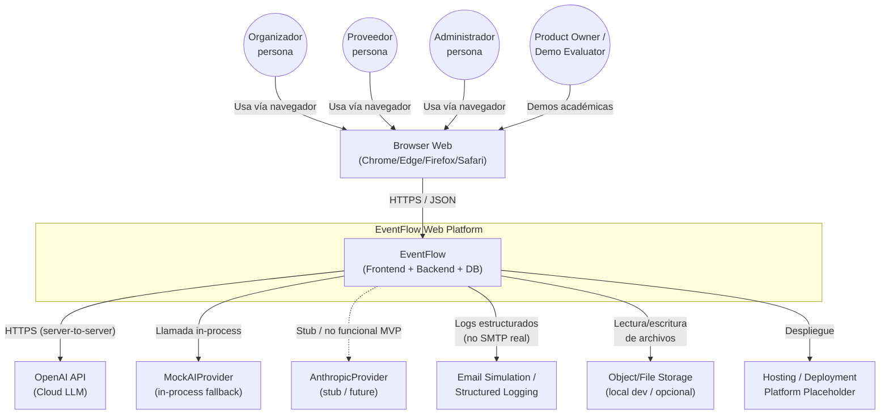

| Elemento | Tipo | Responsabilidad | MVP/Future/Out of Scope | Notas |
|----------|------|-----------------|------------------------|-------|
| Organizador | Persona | Planifica eventos, recibe asistencia IA, gestiona tareas, presupuesto y cotizaciones | MVP | Rol `organizer` |
| Proveedor | Persona | Mantiene perfil aprobado, responde `QuoteRequest`, confirma `BookingIntent` | MVP | Rol `vendor` |
| Administrador | Persona | Aprueba proveedores, gestiona categorías, modera reseñas, audita | MVP | Rol `admin` (creado por seed/config) |
| Product Owner / Demo Evaluator | Persona | Evalúa la demo académica usando seed | MVP (uso operativo) | No es un rol técnico distinto en el sistema |
| EventFlow Web Platform | Sistema | Plataforma completa (frontend + backend + DB) | MVP | Sistema bajo diseño |
| Browser Web | Sistema externo | Entrega responsiva del frontend SPA | MVP | Único cliente soportado |
| OpenAI API | Sistema externo | Proveedor LLM principal | MVP | Llamadas server-to-server desde backend |
| MockAIProvider | Componente in-process | Provider determinista para tests/demo/fallback | MVP (obligatorio) | No es sistema externo; vive dentro del backend |
| AnthropicProvider | Sistema externo (futuro) | Implementación stub para validar la abstracción | Future / Stub | No funcional en MVP |
| Email Simulation / Structured Logging | Componente in-process | Simula envío de emails vía logs estructurados | MVP | "Se habría enviado a X" — no SMTP real |
| Object/File Storage | Sistema externo opcional | Almacenamiento de adjuntos (portafolio, brief) | MVP (opcional local) | Metadata en PostgreSQL |
| Hosting / Deployment Platform | Sistema externo | Donde se despliegan frontend y backend | MVP | No se selecciona proveedor en este documento |

**Excluidos explícitamente** del System Context: WhatsApp, pasarelas de pago, SMS gateways, push notification services, apps móviles nativas, servicios de chat real-time, integraciones de calendario (Google/Outlook), proveedores de moderación IA, APIs de conversión automática de monedas.

---

## 7. C4 Model — Level 2: Container Diagram

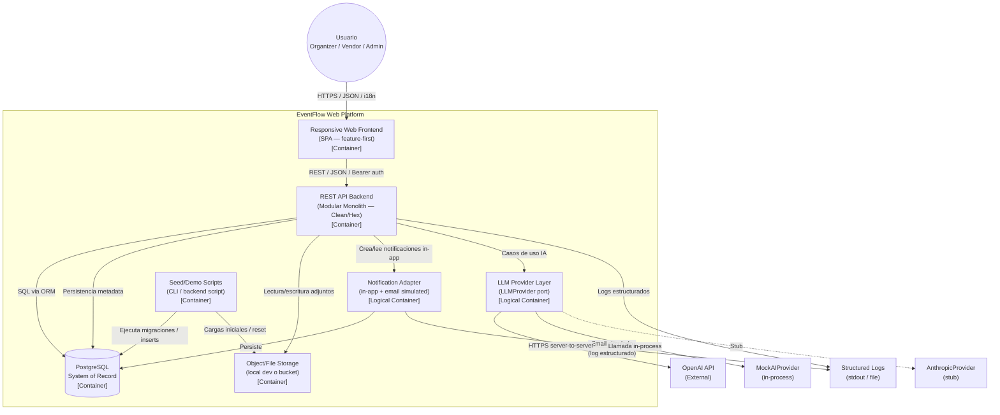

| Container | Responsabilidad principal | Datos que maneja | Interacciones | Notas MVP |
|-----------|---------------------------|------------------|---------------|-----------|
| Responsive Web Frontend | UI, routing, formularios, i18n, pantallas de revisión/aceptación IA | Estado de UI, sesión, cache de queries | Llama al REST API; consume i18n keys | Feature-first, no estado global gigante |
| REST API Backend | Orquestación de casos de uso, RBAC + ownership, validación, llamadas IA, notificaciones, seed | DTOs, comandos/queries, transacciones | Frontend, PostgreSQL, `LLMProvider`, Notification, Storage | Modular Monolith con Clean/Hexagonal |
| PostgreSQL | System of record relacional | Users, Events, Tasks, Budgets, Vendors, Quotes, BookingIntents, Reviews, Notifications, AIRecommendation, AdminAction, Attachments metadata, Seed data | Backend (via ORM Prisma) | Migraciones versionadas; soft delete donde aplica |
| LLM Provider Layer | Abstracción `LLMProvider`; enruta a OpenAI, Mock o Anthropic stub | Prompts versionados, payloads, métricas IA | Backend Application Layer | Toda llamada IA pasa por aquí; nunca desde el frontend |
| Object/File Storage | Persistencia de portafolio e adjuntos | Imágenes, archivos | Backend | Local en dev/QA; opcional bucket en prod-academic |
| Notification Adapter | Crear notificaciones in-app y simular email vía logs | `Notification` (in-app); log "Se habría enviado a X" | Backend; PostgreSQL; Logs | No SMTP real obligatorio en MVP |
| Seed/Demo Scripts | Carga determinista de datos demo; reset reproducible | Datos seed alineados a `/docs/11` | PostgreSQL; Storage | CLI o script backend, no endpoint público |

---

## 8. C4 Model — Level 3: Backend Component / Module Diagram

El backend es **un único deployable** internamente organizado por **bounded contexts modulares**. Estos módulos **no son microservicios**: comparten proceso, base de datos y configuración, pero respetan **fronteras de módulo** estrictas (comunicación vía puertos, no acceso directo a repos de otros módulos).

```mermaid
flowchart TB
    subgraph BACKEND["REST API Backend — Modular Monolith"]
      IAM["Identity & Access Module<br/>(Auth, Session, Captcha)"]
      USR["User / Profile Module<br/>(Profile, Preferences, i18n)"]
      EVT["Event Planning Module<br/>(Event, EventType)"]
      TSK["Task / Checklist Module<br/>(EventTask)"]
      BDG["Budget Module<br/>(Budget, BudgetItem)"]
      VND["Vendor Management Module<br/>(VendorProfile, VendorService)"]
      CAT["Service Category Module<br/>(ServiceCategory)"]
      QUO["Quote Flow Module<br/>(QuoteRequest, Quote)"]
      BKI["Booking Intent Module<br/>(BookingIntent)"]
      REV["Review & Moderation Module<br/>(Review)"]
      NTF["Notification Module<br/>(Notification, email sim)"]
      AIM["AI Assistance Module<br/>(AIRecommendation, AIPromptVersion)"]
      ADM["Admin & Governance Module<br/>(AdminAction, audit)"]
      SED["Seed / Demo Module<br/>(SeedManifest)"]
      LCY["Localization & Currency Module<br/>(Language, Currency catálogos)"]
      ATT["Attachment Module<br/>(Attachment metadata)"]
      OBS["Observability / Audit Support<br/>(logger, correlationId)"]
    end

    IAM --> USR
    USR --> LCY
    EVT --> LCY
    EVT --> TSK
    EVT --> BDG
    EVT --> ATT
    TSK --> AIM
    BDG --> AIM
    VND --> CAT
    VND --> ATT
    VND --> AIM
    QUO --> EVT
    QUO --> VND
    QUO --> AIM
    QUO --> NTF
    BKI --> QUO
    BKI --> BDG
    BKI --> NTF
    REV --> BKI
    REV --> ADM
    ADM --> VND
    ADM --> CAT
    ADM --> REV
    SED --> EVT
    SED --> VND
    SED --> CAT
    SED --> USR

    OBS -. "logs, correlationId, métricas" .- IAM
    OBS -. .- EVT
    OBS -. .- QUO
    OBS -. .- AIM
    OBS -. .- ADM
```

> **Importante:** este diagrama representa **módulos lógicos dentro del mismo deployable**. No implica procesos distribuidos, ni red interna, ni broker. Las flechas indican **dependencias direccionales** entre módulos vía puertos en la Application Layer.

### 8.1 Catálogo de módulos backend

| Módulo | Responsabilidades | Entidades principales | Casos de uso / FR relacionados | Dependencias | Reglas críticas |
|--------|-------------------|-----------------------|--------------------------------|--------------|-----------------|
| Identity & Access | Registro, login, sesión, recuperación de password, captcha | `User`, `Session`, `Credential` | UC-AUTH-01..05, FR-AUTH-* | Captcha provider, Notification (recuperación) | Captcha en registro/login, password hashing, expiración de sesión |
| User / Profile | Perfil, idioma preferido, datos básicos | `User`, `UserProfile`, `UserPreferences` | UC-USER-*, FR-USER-* | IAM, Localization | Solo el dueño edita su perfil |
| Event Planning | Ciclo de vida del evento, currency fijo, datos base | `Event`, `EventType` | UC-EVT-01..06, FR-EVT-* | Localization, Tasks, Budget, Attachment | Currency inmutable; ownership por organizador |
| Task / Checklist | Tareas del evento, asignación, estado | `EventTask` | UC-TSK-*, FR-TSK-* | Event Planning, AI Assistance | Solo organizador del evento crea/edita tareas |
| Budget | Presupuesto y partidas, currency del evento | `Budget`, `BudgetItem` | UC-BUDGET-*, FR-BUDGET-* | Event Planning, AI Assistance | Sumatoria coherente; warning si `committed > total` (no bloquea) |
| Vendor Management | Perfil del proveedor, servicios, categorías | `VendorProfile`, `VendorService` | UC-VND-*, FR-VND-* | Service Category, Attachment, AI Assistance | Solo proveedor edita su perfil; admin aprueba |
| Service Category | Catálogo curado por admin | `ServiceCategory` | UC-CAT-*, FR-CAT-* | Admin | Profundidad máxima 2 niveles; seed obligatorio |
| Quote Flow | Solicitud y respuesta simplificada de cotización | `QuoteRequest`, `Quote` | UC-QUO-*, FR-QUO-* | Event, Vendor, AI Assistance, Notification | Una `QuoteRequest` activa por (evento, vendor); `Quote` con validez 15 días por defecto |
| Booking Intent | Intención de contratación simulada | `BookingIntent` | UC-BKI-*, FR-BKI-* | Quote, Budget, Notification | No es pago ni contrato; requiere confirmación del proveedor |
| Review & Moderation | Reseñas con moderación humana | `Review` | UC-REV-*, FR-REV-* | Booking Intent, Admin | Solo con `BookingIntent.confirmed_intent`; soft delete |
| Notification | Notificaciones in-app + email simulado | `Notification` | UC-NTF-*, FR-NTF-* | (consumidores) | Solo in-app + log; no SMTP real obligatorio |
| AI Assistance | Orquestación de IA: prompts, llamadas, persistencia | `AIRecommendation`, `AIPromptVersion` | UC-AI-*, FR-AI-* | `LLMProvider` (port) | Toda salida persistida; aceptación humana obligatoria; timeout 60s |
| Admin & Governance | Gobernanza, moderación, auditoría | `AdminAction` | UC-ADM-*, FR-ADM-* | Vendor, Category, Review | RBAC estricto; toda acción admin auditada |
| Seed / Demo | Seed determinista y reset de ambiente | `SeedManifest` | `/docs/11` | Casi todos los módulos | No expone endpoints públicos; idempotente |
| Localization & Currency | Catálogos de idiomas y monedas | `Language`, `Currency` | FR-I18N-*, FR-CUR-* | (consumidores) | Sin conversión automática; currency inmutable por evento |
| Attachment | Metadata de archivos adjuntos | `Attachment` | FR-ATT-* | Storage adapter | Soft delete; metadata en DB, archivo en storage |
| Observability / Audit Support | Logger estructurado, correlation IDs, métricas | — | NFR-OBS-* | (consumidores) | No PII ni payloads sensibles en logs |

---

## 9. Internal Architecture Style — Clean / Hexagonal Layers

Cada módulo backend se organiza internamente en **cinco capas lógicas**, siguiendo el estilo Clean / Hexagonal documentado en `/docs/12`.

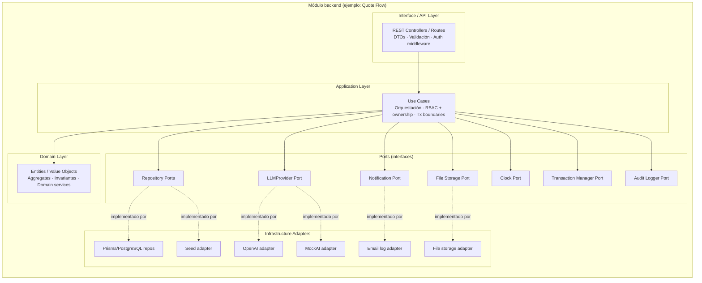

### 9.1 Domain Layer

- Entidades (`Event`, `EventTask`, `Budget`, `Quote`, `Review`, `AIRecommendation`, etc.).
- Value Objects (`Money`, `Currency`, `Locale`, `EventStatus`).
- Reglas de negocio puras (invariantes, transiciones de estado, validaciones).
- **Sin dependencias** hacia frameworks, ORM, HTTP o SDKs externos.

### 9.2 Application Layer

- Casos de uso explícitos (`CreateEvent`, `GenerateAIPlan`, `AcceptAIRecommendation`, `RequestQuote`, `RespondToQuote`, `ConfirmBookingIntent`, `ModerateReview`).
- Orquestación entre dominio y puertos.
- **Autorización RBAC + ownership** aplicada aquí.
- Fronteras de transacción.
- Llamadas a puertos (no a SDKs).

### 9.3 Ports

- `IUserRepository`, `IEventRepository`, `IQuoteRepository`, etc.
- `ILLMProvider` (único puerto IA).
- `INotificationPort`.
- `IFileStoragePort`.
- `IClock` (para tests deterministas).
- `ITransactionManager`.
- `IAuditLogger`.

### 9.4 Infrastructure Adapters

- Repositorios Prisma/PostgreSQL.
- `OpenAIProvider` (SDK de OpenAI vive solo aquí).
- `MockAIProvider` (respuestas deterministas alineadas con seed).
- `EmailLogAdapter` (escribe en log estructurado).
- `FileStorageAdapter` (local o bucket).
- `SeedDataAdapter` (cargas iniciales).

### 9.5 Interface / API Layer

- Controllers REST.
- DTOs de entrada y salida.
- Validación de payloads (Zod/Joi/equivalente).
- Mapeo a DTOs de respuesta.
- Auth middleware/guards (sesión/JWT, role guard).
- Versionado de API (`/api/v1/...`).

### 9.6 Reglas de dependencia clave

- **Domain** no importa Infrastructure ni frameworks.
- **Application** depende solo de **Ports**, no de SDKs.
- **Controllers** llaman a casos de uso (Use Cases), nunca a repositorios directamente.
- **Repositories** implementan ports.
- **SDKs de LLM** viven **únicamente** en `infrastructure/ai/*Adapter`.
- Todas las salidas de IA se persisten como `AIRecommendation` antes de devolverse al frontend.
- Los datos oficiales del dominio (`EventTask`, `BudgetItem`, etc.) solo se crean/actualizan tras **aceptación humana explícita**.

---

## 10. Frontend Architecture Overview

El frontend es una **Single Page Application responsive**, organizada con estructura **feature-first**, consciente de roles, i18n-aware y desacoplada de los detalles del proveedor de IA. Toda interacción con IA se hace contra el backend; el frontend **nunca** invoca OpenAI ni Anthropic directamente.

### 10.1 Áreas funcionales (feature areas)

| Frontend feature area | Responsabilidad | APIs consumidas | Roles | Notas de arquitectura |
|----------------------|-----------------|-----------------|-------|------------------------|
| Auth | Registro, login, recuperación, captcha | `/auth/*` | Público / autenticado | Captcha obligatorio en registro/login |
| Organizer Events | Listado, wizard de creación, edición, dashboard | `/events/*` | Organizer | Currency seleccionable solo al crear |
| Event Dashboard | Progreso del evento, próximas tareas, presupuesto, cotizaciones | `/events/:id/dashboard` | Organizer | Vista agregadora |
| AI Planning Review | Revisión de sugerencias IA (plan, checklist, presupuesto, brief) | `/events/:id/ai/*` | Organizer | Badges "sugerido por IA"; acciones Aplicar / Editar / Descartar |
| Tasks | Listado, edición, estado de tareas | `/events/:id/tasks/*` | Organizer | Filtros por estado y fecha |
| Budget | Distribución, partidas, currency del evento | `/events/:id/budget/*` | Organizer | Muestra warning si `committed > total` |
| Vendor Directory | Búsqueda y filtros del directorio público | `/vendors`, `/categories` | Organizer/Vendor/Admin | Solo proveedores `approved` |
| Vendor Profile Management | Edición de perfil, servicios y portafolio | `/vendor-profile/*` | Vendor | Solo dueño edita; admin aprueba |
| Quote Requests | Brief autocompletado, envío de solicitudes | `/quote-requests/*` | Organizer / Vendor | Organizer crea; Vendor lee/responde |
| Quote Comparison | Vista lado a lado de `Quotes` | `/events/:id/quotes/compare` | Organizer | Resumen IA opcional |
| Booking Intent | Disparo, confirmación, estado | `/booking-intents/*` | Organizer / Vendor | Disclaimer: "Acuerdo final fuera de la plataforma" |
| Reviews | Crear, listar reseñas por proveedor | `/reviews/*` | Organizer (crea) / Público (lee) | Requiere `confirmed_intent` |
| Notifications | Bandeja in-app | `/notifications/*` | Autenticado | Polling razonable; sin push |
| Admin Dashboard | Métricas básicas y accesos al panel | `/admin/*` | Admin | Solo rol admin |
| Admin Vendor Review | Aprobar/rechazar perfiles | `/admin/vendors/*` | Admin | Genera `AdminAction` |
| Admin Categories / EventTypes | CRUD de catálogos | `/admin/categories/*` | Admin | Curado por admin |
| Admin Audit Logs | Consulta de `AdminAction` | `/admin/audit-logs` | Admin | Solo lectura |
| Shared UI / Design System | Componentes reutilizables (botones, inputs, badges IA, banners) | — | Todos | No design system enterprise |
| i18n | Carga y switch de locales | — | Todos | `es-LATAM` (base), `es-ES`, `pt`, `en` |

### 10.2 Route guards y autorización en frontend

- **Rutas públicas:** landing, login, registro, directorio público de proveedores.
- **Rutas autenticadas:** todo lo demás; guard de sesión obligatorio.
- **Rutas por rol:** organizer / vendor / admin; guards verifican rol antes de renderizar.
- **Ownership:** el frontend muestra/oculta UI por conveniencia, pero **la fuente de verdad de autorización es el backend**. Cualquier intento del frontend de saltarse esto es rechazado por el API.
- **Rutas admin:** prefijo `/admin/*`, accesibles solo para rol `admin`.

### 10.3 Manejo de estado

- Estado local por componente para UI efímera.
- Caché de datos remotos vía librería tipo SWR/React Query.
- Store ligero para sesión, usuario, locale.
- **Sin stores monolíticos** ni reductores gigantes.

### 10.4 Internacionalización en frontend

- Cuatro locales obligatorios.
- Claves agrupadas por feature.
- Fallback a `es-LATAM` si la clave no existe.
- Locale persistido en `UserPreferences` y aplicado al login.

### 10.5 UX para salidas IA

- Toda sugerencia IA visible en un contenedor diferenciado.
- Acciones explícitas: **Aplicar**, **Descartar**, **Editar y aplicar**.
- Estado de carga con timeout máximo de 60s.
- Mensaje claro cuando `MockAIProvider` está activo o cuando se aplicó fallback.

---

## 11. Data Architecture Overview

**PostgreSQL** es el **system of record** único del MVP. Todos los datos del dominio viven aquí, salvo los archivos binarios (portafolio, adjuntos) que residen en storage y cuya **metadata** sí vive en PostgreSQL.

### 11.1 Grupos de datos y ownership funcional

| Grupo de datos | Entidades | Owner funcional | Reglas de integridad críticas | Notas |
|----------------|-----------|-----------------|-------------------------------|-------|
| Identity | `User`, `Role`, `Session`, `Credential` | System / Self | Email único; password hashing; expiración de sesión | Roles cerrados: `organizer`, `vendor`, `admin` |
| Events | `Event`, `EventType` | Organizer | Currency inmutable; ownership; estados `draft`/`active`/`completed`/`cancelled` | Un `Event` pertenece a un único organizador |
| Tasks | `EventTask` | Organizer (vía Event) | FK a `Event`; estados; fechas relativas válidas | `ai_generated: true` cuando proviene de IA |
| Budgets | `Budget`, `BudgetItem` | Organizer (vía Event) | Currency del evento; sumatoria coherente | Warning si `committed > total` (no bloquea) |
| Vendors | `VendorProfile`, `VendorService` | Vendor / Admin (aprobación) | Único `VendorProfile` por user vendor; `status` controlado por admin | Visibles públicamente solo si `approved` |
| Categories | `ServiceCategory` | Admin | Profundidad máxima 2 niveles; nombres únicos por nivel | Catálogo curado |
| Quotes | `QuoteRequest`, `Quote` | Organizer / Vendor | Una `QuoteRequest` activa por (evento, vendor); `Quote.valid_until` por defecto 15 días | Estados de ciclo de vida explícitos |
| Booking Intents | `BookingIntent` | Organizer / Vendor (confirma) | Solo desde `Quote.accepted` vigente; `confirmed_intent` requiere acción del vendor | Sin pago real |
| Reviews | `Review` | Organizer (crea) / Admin (modera) | Una reseña por (evento, vendor); requiere `confirmed_intent` | Soft delete |
| Notifications | `Notification` | System / Recipient | FK a usuario; `read_at` nullable | Solo in-app; email simulado vía log |
| AIRecommendations | `AIRecommendation`, `AIPromptVersion` | System (creado) / Owner (acepta) | `accepted` default `false`; `promptVersion` requerido | Trazabilidad IA |
| AdminActions | `AdminAction` | Admin | Inmutable tras creación; `actorId`, `action`, `targetId`, `timestamp` | Auditoría |
| Attachments | `Attachment` | Owner del recurso padre | FK polimórfico (entityType + entityId); soft delete | Metadata en DB; binario en Storage |
| Localization / Currency | `Language`, `Currency` | System / Admin | Catálogos cerrados | Sin conversión automática |
| Seed data | Conjunto reproducible | System (Seed) | Idempotente; sin PII real | Alineado con `/docs/11` |

### 11.2 Invariantes críticas del dominio

- Un `Event` pertenece a un único organizador (ownership absoluto).
- Un `VendorProfile` pertenece a un único vendor.
- Una `QuoteRequest` pertenece a un evento y se dirige a un vendor; única activa por par (evento, vendor).
- Una `Quote` pertenece a una `QuoteRequest`.
- Un `BookingIntent` es **simulado**: no es contrato ni pago.
- Una `Review` requiere un `BookingIntent.confirmed_intent`.
- Un `AIRecommendation` mantiene trazabilidad prompt → output → decisión humana.
- Un `AdminAction` registra cada acción administrativa y es **inmutable**.
- Los `Attachment` usan **soft delete**.
- La **currency** del evento es **inmutable** tras su creación.
- La profundidad máxima de `ServiceCategory` es **2 niveles**.
- La validez por defecto de una `Quote` es **15 días calendario**.
- El **timeout máximo** de cualquier llamada IA es **60 segundos**.

---

## 12. AI Architecture Overview

### 12.1 Principios IA arquitectónicos

- El **AI Assistance Module** es el único orquestador de casos de uso IA del backend.
- `LLMProvider` es la **única abstracción IA** del sistema.
- `OpenAIProvider` es la **implementación funcional principal** del MVP.
- `MockAIProvider` es **obligatorio** para tests, demos académicas, fallback ante timeout o error, y modo offline.
- `AnthropicProvider` permanece como **stub** y punto de extensión futuro (no funcional en MVP).
- El **frontend nunca llama** a OpenAI ni a ningún LLM directamente: todo pasa por el backend.
- Toda salida IA se **persiste como `AIRecommendation`** antes de devolverse al usuario.
- **La aceptación humana es obligatoria** para materializar contenido IA en entidades oficiales (`EventTask`, `BudgetItem`, brief de cotización, bio de proveedor).
- La IA **no aprueba proveedores**, **no modera reseñas**, **no firma contratos**, **no procesa pagos**, **no toma decisiones autónomas**.

### 12.2 AI Event Plan Generation Flow

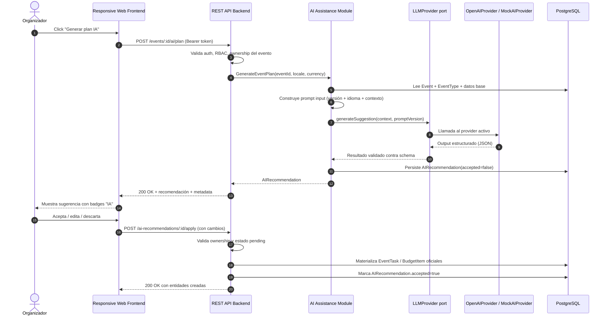

### 12.3 Fallback y timeout (estrategia obligatoria)

- **Timeout duro:** 60 segundos en la llamada al provider real (`/docs/10`).
- **Schema validation:** la salida del provider se valida contra schema esperado.
- **Respuestas inválidas o timeouts** disparan una de las siguientes (configurable por entorno):
  - **Modo demo/testing:** uso de `MockAIProvider` o de una plantilla estática por tipo de evento.
  - **Modo producción-académica:** se devuelve un error controlado al frontend con mensaje claro al usuario.
- **Reintento agresivo prohibido:** máximo un reintento, registrado en logs IA.
- **Métricas IA obligatorias:** `provider`, `latency_ms`, `fallback_used`, `timeout`, `schema_valid`, `promptVersion`.

### 12.4 Persistencia y trazabilidad IA

- Cada `AIRecommendation` referencia su `AIPromptVersion`.
- El payload IA se persiste **sin datos sensibles innecesarios** (minimización de prompts y outputs).
- Estados: `pending` → `applied` | `discarded`.
- Las entidades materializadas a partir de IA llevan flag `ai_generated: true`.

---

## 13. Integration Architecture

| Integración | Tipo | Dirección | MVP/Future/Out of Scope | Propósito | Notas técnicas |
|-------------|------|-----------|-------------------------|-----------|----------------|
| Browser ↔ Frontend | UI | Bidireccional | MVP | Entrega de SPA y captura de input | HTTPS; cualquier navegador moderno |
| Frontend ↔ Backend REST API | API REST/JSON | Bidireccional | MVP | Operación funcional de la plataforma | Bearer auth; versionado `/api/v1/...` |
| Backend ↔ PostgreSQL | Persistencia (SQL via ORM) | Bidireccional | MVP | System of record | Prisma/equivalente; pool de conexiones |
| Backend ↔ OpenAI API | LLM externo | Outbound (server-to-server) | MVP | Provider IA principal | API key en config; timeout 60s |
| Backend ↔ MockAIProvider | Provider in-process | Llamada interna | MVP (obligatorio) | Fallback / demo offline / tests | Sin red; respuestas deterministas |
| Backend ↔ AnthropicProvider | LLM externo (stub) | Outbound (futuro) | Future / Stub | Validar la abstracción `LLMProvider` | No funcional en MVP |
| Backend ↔ File/Object Storage | Almacenamiento | Bidireccional | MVP (opcional local) | Portafolio, adjuntos | Local en dev; bucket opcional |
| Backend ↔ Email simulation/logging | Notificación simulada | Outbound (log) | MVP | "Se habría enviado a X" | No SMTP real obligatorio |
| Backend ↔ Seed scripts / CLI | Carga determinista | Bidireccional | MVP | Demo y testing | Script idempotente |
| Backend ↔ Observability / Logging | Logs estructurados | Outbound | MVP | Diagnóstico y métricas | stdout/file; sin APM enterprise |

### 13.1 Integraciones excluidas explícitamente (no MVP)

| Integración excluida | Razón |
|----------------------|-------|
| WhatsApp Business API | Fuera de scope; ver `/docs/3`, `/docs/8.1`, `/docs/12` |
| Pasarelas de pago (Stripe/PayPal/locales) | No hay pagos reales en MVP |
| SMS gateways | No hay SMS en MVP |
| Push notification services (FCM/APNs) | No hay app nativa ni push |
| Native mobile apps (iOS/Android) | El MVP es web responsive |
| Servicios de chat real-time (WebSockets/SSE para chat) | No hay chat real en MVP |
| Calendar providers (Google Calendar, Outlook) | Futuro |
| APIs de conversión automática de monedas | Currency inmutable por evento |
| Servicios IA de moderación/sentimiento | Moderación es humana en MVP |

---

## 14. Runtime Flows

### 14.1 User Registration and Login Flow

**Trigger:** un visitante quiere crear cuenta o autenticarse.
**Actores:** Usuario, Frontend, Backend (Identity & Access), Captcha provider, PostgreSQL.
**Reglas críticas:** captcha obligatorio (`/docs/10`); password hashing seguro; expiración de sesión.

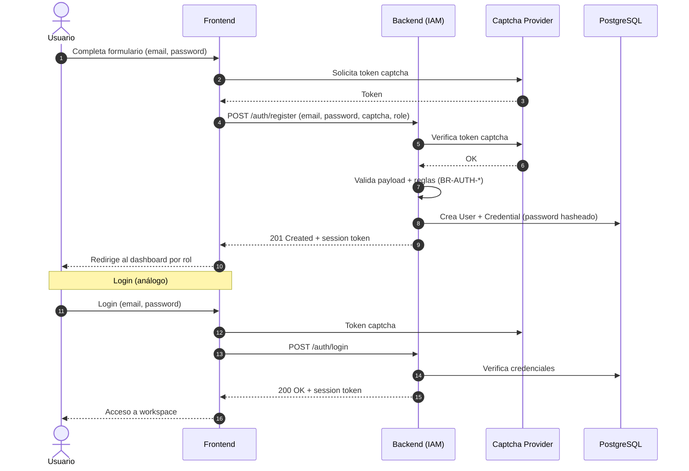

**Datos creados/actualizados:** `User`, `Credential`, `Session`.
**Failure cases:** captcha inválido, email ya registrado, credenciales inválidas, payload inválido.

### 14.2 Organizer Creates Event Flow

**Trigger:** organizador autenticado quiere crear un nuevo evento.
**Actores:** Organizer, Frontend, Backend (Event Planning + Localization), PostgreSQL.
**Reglas críticas:** RBAC (`organizer`); ownership inmediato; **currency seleccionada al crear es inmutable**.

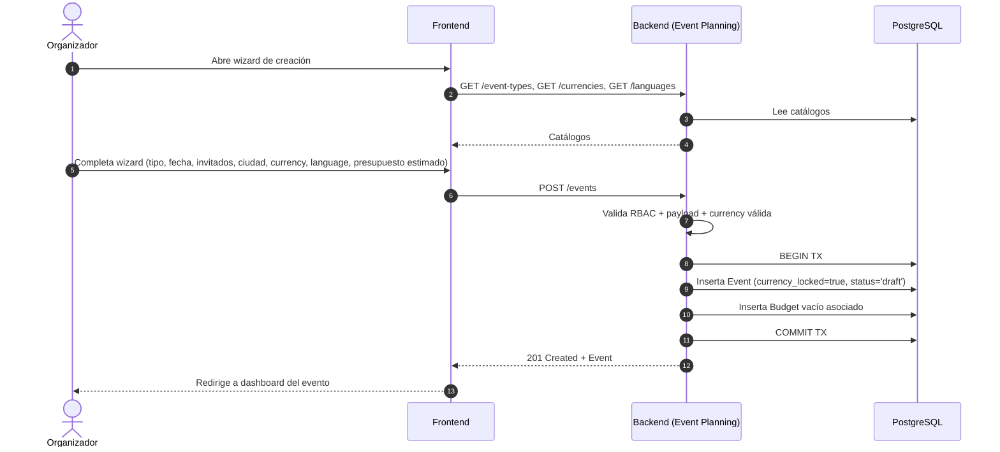

**Datos creados:** `Event` (status `draft`), `Budget` asociado vacío.
**Failure cases:** payload inválido, currency no soportada, language no soportado, fecha en el pasado.

### 14.3 AI Plan Generation and Human Acceptance Flow

Ver detalle en sección **12.2 AI Event Plan Generation Flow**.
**Reglas críticas:** RBAC + ownership; persistencia obligatoria como `AIRecommendation`; aceptación humana antes de materializar entidades; timeout 60s; fallback configurable.

### 14.4 Vendor Profile Approval Flow

**Trigger:** un proveedor recién registrado completó su perfil; un admin lo revisa.
**Actores:** Vendor, Admin, Frontend, Backend (Vendor Management + Admin + Notification), PostgreSQL.
**Reglas críticas:** solo `VendorProfile.status = approved` aparece en directorio público; toda decisión admin se registra como `AdminAction`.

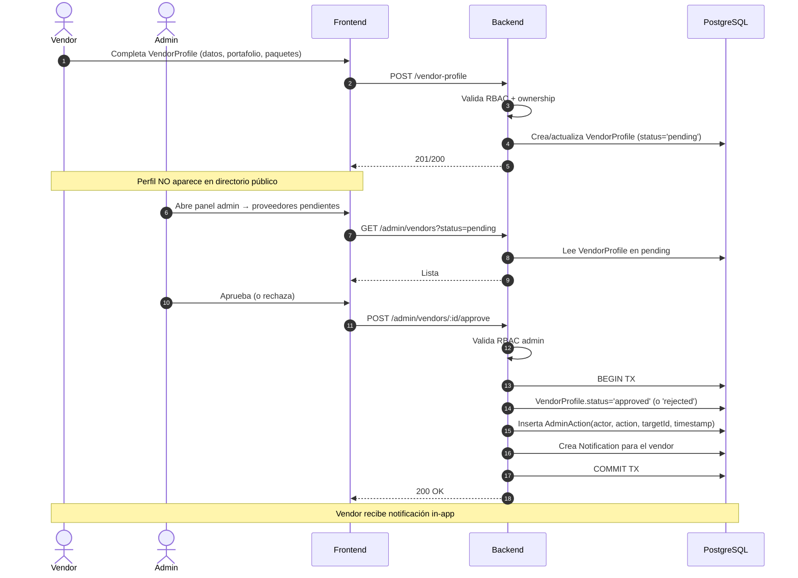

**Datos creados/actualizados:** `VendorProfile.status`, `AdminAction`, `Notification`.
**Failure cases:** perfil incompleto, ya aprobado/rechazado, falta de permisos admin.

### 14.5 Quote Request and Quote Response Flow

**Trigger:** organizador quiere cotización; proveedor responde.
**Actores:** Organizer, Vendor, Frontend, Backend (Quote Flow + Notification + AI Assistance opcional), PostgreSQL.
**Reglas críticas:** una `QuoteRequest` activa por (evento, vendor); `Quote.valid_until` por defecto 15 días; brief autocompletado editable antes de envío.

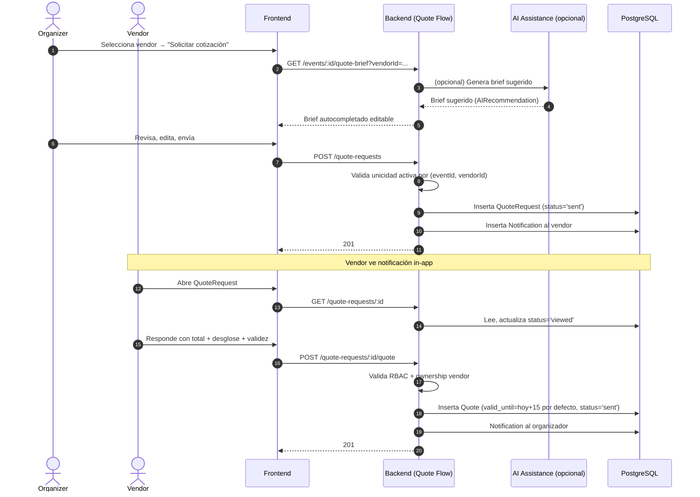

**Datos creados/actualizados:** `QuoteRequest`, `Quote`, `Notification` (organizer y vendor), opcionalmente `AIRecommendation` (brief).
**Failure cases:** ya existe `QuoteRequest` activa, validez vencida, vendor no aprobado, evento no `active`.

### 14.6 Booking Intent Simulated Flow

**Trigger:** organizador acepta una `Quote` vigente; vendor confirma.
**Actores:** Organizer, Vendor, Frontend, Backend (Booking Intent + Budget + Notification), PostgreSQL.
**Reglas críticas:** **no hay pago real, no hay contrato firmado, no hay captura de tarjeta**; disclaimer visible.

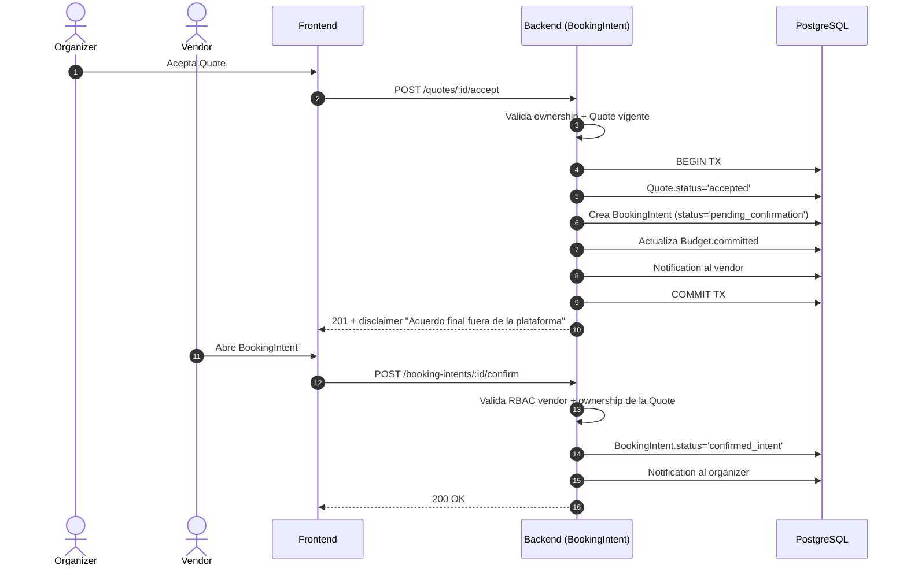

**Datos creados/actualizados:** `Quote.status`, `BookingIntent`, `Budget.committed`, `Notification` (ambos lados).
**Failure cases:** `Quote` vencida o rechazada, vendor no propietario, intento de doble confirmación.

### 14.7 Review Moderation Flow

**Trigger:** un usuario o admin detecta una reseña ofensiva; admin la modera.
**Actores:** Reviewer (organizer), Admin, Frontend, Backend (Review + Admin), PostgreSQL.
**Reglas críticas:** **soft delete / hidden status**, no borrado físico; toda acción admin genera `AdminAction`.

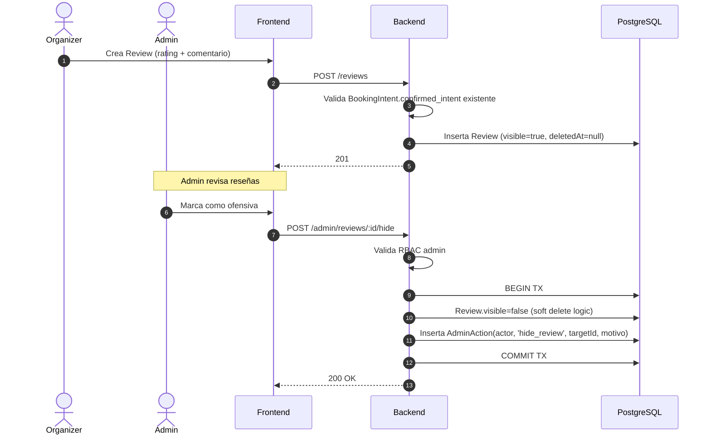

**Datos creados/actualizados:** `Review.visible/deletedAt`, `AdminAction`.
**Failure cases:** review inexistente, no autorización admin, review ya oculta.

### 14.8 Seed/Demo Reset Flow

**Trigger:** equipo o evaluador requiere ambiente de demo reproducible.
**Actores:** Operador (CLI), Backend (Seed Module), PostgreSQL.
**Reglas críticas:** seed determinista; sin PII real; volúmenes mínimos según `/docs/11`; idempotente.

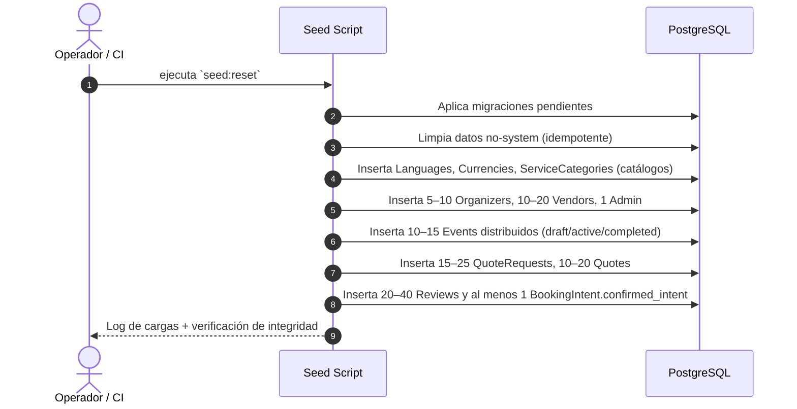

**Datos creados:** alineados con `/docs/11`.
**Failure cases:** migración pendiente, conflicto de claves únicas, drift entre modelo de dominio y seed.

---

## 15. Security and Authorization Architecture

### 15.1 Decisiones de seguridad

| Security concern | Architectural decision | Applied in | Validation approach |
|------------------|------------------------|------------|---------------------|
| Autenticación | Email + password con hashing seguro; sesión/JWT con expiración | Identity & Access Module | Tests integrales en login/refresh; revisión de algoritmo de hashing |
| Captcha / anti-bot | Captcha obligatorio en registro y login | Identity & Access Module | Provider configurable; `MockCaptchaProvider` en dev/test |
| RBAC | Roles cerrados: `organizer`, `vendor`, `admin` | Application Layer (todos los módulos) | Tests por rol; revisión de matriz `/docs/5` |
| Admin user creation | Admins solo se crean por seed/configuración, **no por registro público** | Seed Module / Identity & Access | Endpoint público de registro **no** permite rol `admin` |
| Ownership | Verificación de propiedad de recurso en Application Layer | Casos de uso de cada módulo | Tests de "user A no puede acceder a recurso de user B" |
| Backend como source of truth de autorización | Frontend solo oculta UI; backend siempre valida | API Layer + Application Layer | Tests negativos (frontend manipulado) |
| Password storage | Hashing con algoritmo moderno + salt | Identity & Access | Code review + tests |
| Minimal personal data | Solo se solicita PII estrictamente necesaria | User / Profile Module | Revisión de campos por DPO/PO |
| Sin payment data | No se captura ni almacena información de tarjetas | Todo el sistema | Revisión arquitectónica continua |
| Sin documentos legales | No se almacenan contratos firmados ni PDFs legales | Todo el sistema | Revisión arquitectónica |
| Minimización en prompts IA | Solo el contexto necesario se envía al `LLMProvider` | AI Assistance Module | Code review de builders de prompt |
| Auditoría admin | Toda acción admin queda en `AdminAction` | Admin & Governance Module | Tests de cobertura por acción |
| Soft delete | Reseñas y adjuntos no se borran físicamente | Review / Attachment Modules | Constraint en repos; tests |
| Logging sin PII sensible | Logs estructurados, sin payloads completos | Observability Support | Política de logging documentada |
| Currency inmutable | `Event.currency` no editable tras creación | Event Planning Module | Constraint a nivel dominio + DB |
| AI nunca decide | Toda salida IA requiere aceptación humana | AI Assistance Module + UI | Tests negativos; revisión de UC |

### 15.2 Modelo de autorización

- **RBAC coarse-grained:** decide a qué endpoints/módulos un usuario puede llegar.
- **Ownership fine-grained:** decide a qué recursos puntuales puede acceder dentro de su rol.
- Ambas validaciones viven en la **Application Layer** y se ejecutan **antes** de cualquier operación de dominio o llamada a IA.

---

## 16. Observability, Audit, and Traceability

| Concern | Datos capturados | Propósito | Almacenado en | Prioridad MVP |
|---------|------------------|-----------|---------------|---------------|
| Structured logging | `timestamp`, `level`, `requestId`, `userId`, `module`, `event` | Diagnóstico, soporte, auditoría liviana | stdout / archivo / colector | Alta |
| Correlation IDs | `requestId` propagado a Application Layer y `LLMProvider` | Trazar request end-to-end | Logs | Alta |
| AIRecommendation traceability | `promptVersion`, `input_context`, `output_payload`, `accepted`, `decided_by` | Trazabilidad IA, métricas de utilidad | PostgreSQL | Alta |
| AI call metrics | `provider`, `latency_ms`, `fallback_used`, `timeout`, `schema_valid` | Salud del provider IA, decisión de fallback | Logs + métricas | Alta |
| AdminAction audit | `actorId`, `action`, `targetId`, `motivo`, `timestamp` | Auditoría de gobernanza | PostgreSQL | Alta |
| Notification logs | `recipientId`, `type`, `channel`, `simulated=true` para email | Trazabilidad de avisos | PostgreSQL + Logs | Media |
| Simulated email logs | "Se habría enviado a X" con destinatario y tipo | Demo + auditoría | Logs estructurados | Alta |
| REST endpoint metrics | `status_code`, `latency_ms`, `error_rate` | Salud del API | Logs / métricas | Alta |
| Demo readiness metrics | # eventos, # cotizaciones, # reseñas, # bookings confirmados | Estado de demo | Panel admin + logs | Media |
| Error handling estructurado | Error code, message i18n, `requestId` | UX clara, diagnóstico | API + Logs | Alta |

**Importante:** no se requiere APM enterprise para el MVP. Se exige base suficiente para diagnosticar en QA y en demo académica.

---

## 17. Deployment View

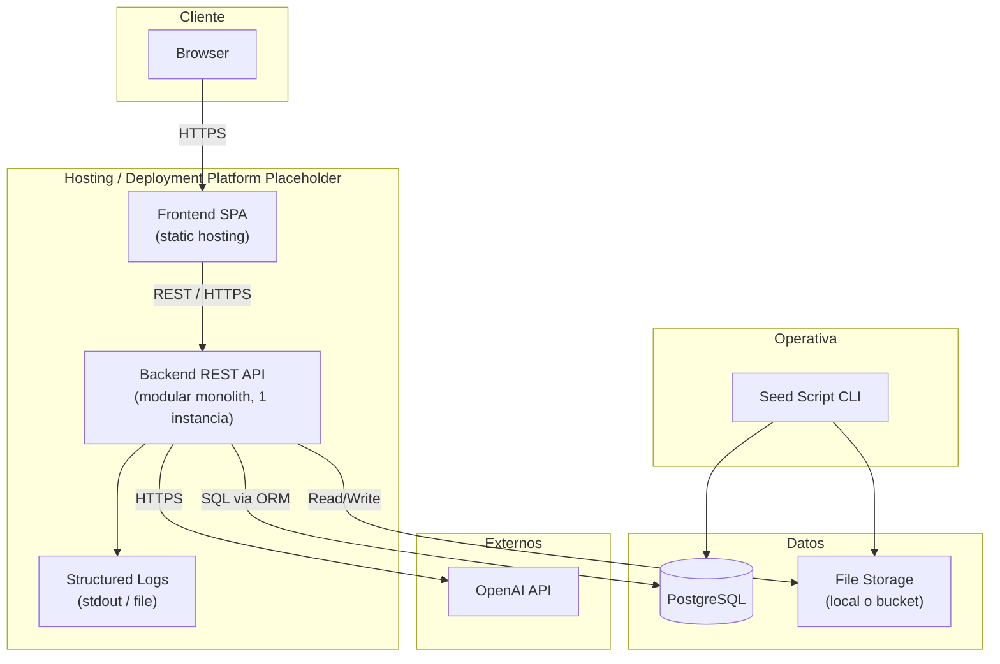

| Ambiente | Propósito | Componentes | Datos | Notas |
|----------|-----------|-------------|-------|-------|
| Local development | Desarrollo y testing local | Frontend dev server + Backend dev + PostgreSQL local (o Docker) + MockAIProvider | Seed local; storage local | Captcha mockeado; `LLMProvider=mock` por defecto |
| QA / demo | Verificación funcional y rehearsal de demo | Frontend desplegado + Backend desplegado + PostgreSQL gestionada o local + `OpenAIProvider` opcional | Seed completo `/docs/11` | Toggle `LLMProvider=openai|mock` por env |
| Academic production / demo | Presentación al comité | Frontend + Backend + PostgreSQL + `OpenAIProvider` (con cuota controlada) | Seed reproducible | Logs accesibles; fallback `MockAIProvider` listo |

### 17.1 Variables de entorno requeridas

- `DATABASE_URL`
- `JWT_SECRET` / `SESSION_SECRET`
- `LLM_PROVIDER` (`openai|mock|anthropic`)
- `OPENAI_API_KEY` (cuando aplica)
- `AI_TIMEOUT_MS` (default `60000`)
- `CAPTCHA_PROVIDER` (`real|mock`)
- `DEFAULT_LOCALE` (`es-LATAM`)
- `FILE_STORAGE_MODE` (`local|bucket`)
- `SEED_MODE` (`on|off`)

### 17.2 Operativa

- **Build:** lint + tests + compilación.
- **Migraciones:** ejecutables idempotentes (`prisma migrate deploy` o equivalente).
- **Seed:** un único comando `seed:reset` reproducible (`/docs/11`).
- **Deploy:** estándar para hosting elegido; este documento no fija el proveedor.
- **Modo demo offline:** `LLM_PROVIDER=mock`, `CAPTCHA_PROVIDER=mock`, seed cargado.

---

## 18. Cross-Cutting Concerns

| Concern transversal | Decisión arquitectónica | Módulos afectados | Riesgo mitigado |
|---------------------|--------------------------|-------------------|------------------|
| Authorization (RBAC + ownership) | Validación en Application Layer; backend = source of truth | Todos | Filtración entre usuarios; bypass por frontend |
| Validation | Esquemas (Zod/Joi/equivalente) en Interface Layer + invariantes en Domain | Todos | Datos inválidos; payloads maliciosos |
| Error handling estructurado | Errores con `code`, `message`, `i18n key`, `requestId` | API Layer | UX inconsistente; diagnóstico difícil |
| i18n | Locales `es-LATAM/es-ES/pt/en`; backend nunca emite mensajes hardcodeados al usuario | Frontend + Localization | Mensajes en idioma incorrecto |
| Currency display | `Event.currency` inmutable; sin conversión automática | Event Planning + Budget + Frontend | Cifras inconsistentes |
| AI fallback | `MockAIProvider` y/o plantilla estática ante timeout/error | AI Assistance | Demo rota por dependencia externa |
| Logging estructurado | Sin payloads sensibles; correlation IDs | Observability Support | PII en logs; trazas perdidas |
| Auditoría admin | `AdminAction` inmutable; toda acción admin registrada | Admin & Governance | Gobernanza no demostrable |
| Soft delete | Para `Review` y `Attachment` | Review + Attachment | Pérdida de historial; auditoría incompleta |
| Data ownership | FK + checks en Application Layer | Todos los módulos del dominio | Acceso cruzado entre usuarios |
| Seed reproducibility | Seed idempotente y versionado | Seed Module | Demo no reproducible |
| Testing | Capas Domain/Application testeables sin red; `MockAIProvider` siempre activo en tests | Todos | Tests frágiles; cobertura cosmética |
| Configuration por entorno | Variables de entorno; sin secretos en código | Todos | Lock-in; credenciales expuestas |
| Rate limiting / anti-abuse | Captcha + rate limiting básico en endpoints sensibles | Identity & Access; API gateway lógico | Abuso de registro/login; brute force |
| Accessibility | Componentes con foco, contraste y labels | Frontend (Shared UI) | Exclusión de usuarios; incumplimiento básico |

---

## 19. MVP Boundaries and Explicit Exclusions

| Capability | Status | Why excluded from MVP | Architectural implication |
|------------|--------|-----------------------|---------------------------|
| Real payments | Out of Scope | No es marketplace transaccional; PCI fuera de alcance | Sin entidades `Payment`/`Invoice`; sin integradores de pago |
| Commissions | Out of Scope | Sin pagos reales no hay comisión real | Sin entidad `Commission` |
| Digital contracts | Out of Scope | Requiere firma electrónica y validez legal | Sin entidad `Contract`; `BookingIntent` deja constancia simulada |
| WhatsApp integration | Out of Scope | Requiere proveedor externo y cumplimiento | Sin adapter de WhatsApp |
| Real-time chat | Out of Scope | No requerido para validar MVP | Sin WebSockets / SSE para chat |
| Native mobile app | Out of Scope | El MVP es web responsive | Sin pipeline iOS/Android |
| Push notifications | Out of Scope | No hay app nativa ni necesidad para demo | Sin FCM/APNs |
| SMS | Out of Scope | Solo in-app + email simulado | Sin gateways SMS |
| Calendar integrations | Future | Requiere OAuth de calendarios externos | Sin adapters Google/Outlook |
| Automatic currency conversion | Out of Scope | Currency fija por evento | Sin tasas dinámicas; sin servicios FX |
| AI moderation | Out of Scope | Moderación humana en MVP | Sin pipelines IA de moderación |
| AI sentiment analysis | Out of Scope | No requerido para MVP | Sin pipelines de sentiment |
| Autonomous vendor approval | Out of Scope | IA es copiloto, nunca decisor | Admin aprueba manualmente |
| Autonomous booking / payment | Out of Scope | Mismo motivo | `BookingIntent` requiere confirmación humana |
| Multi-collaborator event management | Future | Un organizador por evento en MVP | Sin entidad `EventCollaborator` |
| Guest list / RSVP / seating plan | Out of Scope | Fuera del foco workspace + cotización | Sin entidades `Guest`, `RSVP`, `SeatingPlan` |
| Full transactional marketplace | Out of Scope | Estratégico: MVP es planning + quote flow simplificado | Sin pagos, comisión, contratos ni catálogo transaccional |

> **Regla:** ninguna de estas capacidades debe introducirse "por la puerta de atrás" mediante una decisión de arquitectura. Cualquier solicitud de incluirlas exige actualización formal del scope.

---

## 20. Architecture Risks and Mitigations

| Riesgo | Impacto | Probabilidad | Mitigación arquitectónica | Documento fuente relacionado |
|--------|---------|--------------|---------------------------|------------------------------|
| Modular Monolith se convierte en "messy monolith" | Alto | Media | Disciplina de módulos; revisión de PRs; ports obligatorios entre módulos | `/docs/12` §8 |
| Latencia o caída del proveedor IA | Alto | Media | `MockAIProvider` obligatorio; timeout 60s; fallback configurable | `/docs/10`, `/docs/12` §13.7 |
| Salida IA inválida (schema/JSON malformado) | Alto | Media | Validación de schema; persistencia siempre como `AIRecommendation`; aceptación humana | `/docs/7`, `/docs/12` §13 |
| Errores de autorización (cross-tenant) | Alto | Media | RBAC + ownership en Application Layer; tests negativos por rol | `/docs/5`, `/docs/12` §15 |
| Overengineering hacia marketplace transaccional | Alto | Media | Sección 19 como guardrail; revisión PO ante cualquier feature off-scope | `/docs/3`, `/docs/12` §19 |
| Seed/demo inestable o no reproducible | Alto | Media | Seed idempotente, versionado y testeado; `MockAIProvider` + `MockCaptchaProvider` | `/docs/11` |
| Complejidad i18n (claves faltantes, locales inconsistentes) | Medio | Media | Fallback a `es-LATAM`; claves por feature; revisión por locale | `/docs/10`, `/docs/12` §8.9 |
| Adjuntos sin política clara de soft delete | Medio | Media | Soft delete por defecto; metadata en DB; binarios marcados | `/docs/4`, `/docs/12` §14.5 |
| Gaps de auditoría en acciones admin | Alto | Media | `AdminAction` obligatorio en cada acción admin; tests de cobertura | `/docs/5`, `/docs/12` §15.4 |
| Frontend feature coupling | Medio | Media | Estructura feature-first; sin store global gigante; hooks por feature | `/docs/12` §12 |
| Drift de esquema de base de datos | Alto | Media | Migraciones versionadas; seed alineado con modelo | `/docs/11`, `/docs/12` §14 |
| Problemas de entorno y configuración | Medio | Alta | Variables de entorno documentadas; modo demo offline garantizado | `/docs/12` §18 |
| Acoplamiento del dominio a OpenAI | Alto | Media | `LLMProvider` único; SDK solo en infra adapter | `/docs/7`, `/docs/12` §8.3 |
| Sugerencias IA aplicadas sin validación humana | Alto | Media | `AIRecommendation` con `accepted=false`; UC explícito para aceptar | `/docs/8.1`, `/docs/12` §8.4 |
| Currency cambiada por error tras crear evento | Alto | Baja | Inmutable en dominio + DB; validación en backend y UI | `/docs/8.1` |

---

## 21. Architecture Decisions to Formalize as ADRs

| ADR ID sugerido | Decisión | Estado | Justificación breve |
|-----------------|----------|--------|---------------------|
| ADR-001 | Modular Monolith over Microservices for MVP | Propuesto | Velocidad académica + disciplina; evita complejidad distribuida |
| ADR-002 | Clean / Hexagonal Architecture | Propuesto | Aísla dominio; intercambiabilidad de infraestructura |
| ADR-003 | REST API over GraphQL for MVP | Propuesto | Simplicidad, cacheabilidad, ecosistema y testing |
| ADR-004 | PostgreSQL as primary database | Propuesto | Integridad referencial, transacciones, ecosistema |
| ADR-005 | Prisma as ORM and migration strategy | Propuesto | Tipado fuerte, migraciones declarativas |
| ADR-006 | LLMProvider abstraction | Propuesto | Desacoplar dominio de proveedores IA |
| ADR-007 | OpenAIProvider + MockAIProvider + AnthropicProvider stub | Propuesto | Provider principal + fallback obligatorio + extensión futura |
| ADR-008 | Backend-owned AI orchestration | Propuesto | Frontend nunca llama a LLM; seguridad y trazabilidad |
| ADR-009 | RBAC + ownership authorization | Propuesto | Granularidad necesaria por dominio |
| ADR-010 | Seed-first demo strategy | Propuesto | Demo reproducible y modo offline |
| ADR-011 | In-app notifications + simulated email | Propuesto | Evita SMTP real; deja trazas en logs |
| ADR-012 | Soft delete strategy (Reviews, Attachments) | Propuesto | Auditoría y recuperación |
| ADR-013 | i18n from MVP (es-LATAM/es-ES/pt/en) | Propuesto | Diferenciador LATAM + requisito académico |
| ADR-014 | Currency immutable per event | Propuesto | Evita cifras inconsistentes |
| ADR-015 | No real payments / contracts / chat / WhatsApp in MVP | Propuesto | Protege el alcance del MVP |

ADRs adicionales recomendados (no obligatorios para arrancar):

- ADR-016: Estrategia de captcha y `MockCaptchaProvider`.
- ADR-017: Política de timeouts y fallback IA (60 s).
- ADR-018: Política de logging y correlation IDs.

---

## 22. Traceability Matrix

| Sección del System Architecture Document | Documentos fuente principales | Decisiones / reglas relacionadas |
|-------------------------------------------|--------------------------------|----------------------------------|
| §4 Resumen ejecutivo | `/docs/12`, `/docs/3` | Modular Monolith + Clean/Hex + REST + PostgreSQL + LLMProvider |
| §5 Principios | `/docs/12` §8 | 12 principios arquitectónicos |
| §6 C4 Level 1 | `/docs/1`, `/docs/3`, `/docs/5` | Actores, roles, sistemas externos MVP |
| §7 C4 Level 2 | `/docs/12` §9-§10, `/docs/3` | Contenedores del MVP |
| §8 C4 Level 3 (módulos) | `/docs/6`, `/docs/9`, `/docs/12` §11 | Bounded contexts del backend |
| §9 Clean/Hexagonal | `/docs/12` §10, §13 | Capas y dependencias |
| §10 Frontend Architecture | `/docs/12` §12, `/docs/9`, `/docs/3` | Feature areas, guards, i18n, UX IA |
| §11 Data Architecture | `/docs/4`, `/docs/6` | Entidades, invariantes, ownership |
| §12 AI Architecture | `/docs/7`, `/docs/8.1`, `/docs/10`, `/docs/12` §13 | `LLMProvider`, AIRecommendation, fallback, timeout 60s |
| §13 Integration Architecture | `/docs/3`, `/docs/12` §19 | Integraciones MVP / Future / Out of Scope |
| §14 Runtime Flows | `/docs/8`, `/docs/8.1`, `/docs/9`, `/docs/4` | UC y reglas BR-* críticas |
| §15 Security & Authorization | `/docs/5`, `/docs/10`, `/docs/12` §15 | RBAC + ownership, captcha, hashing, auditoría |
| §16 Observability & Audit | `/docs/10`, `/docs/12` §16 | Logs, correlation IDs, AdminAction |
| §17 Deployment View | `/docs/12` §18 | Ambientes y variables de entorno |
| §18 Cross-Cutting Concerns | `/docs/10`, `/docs/12` §8 | i18n, currency, soft delete, fallback, accesibilidad |
| §19 MVP Boundaries | `/docs/3` §9, `/docs/8.1`, `/docs/12` §19 | Exclusiones explícitas |
| §20 Risks | `/docs/12` §21, `/docs/3` §16 | Riesgos y mitigaciones |
| §21 ADRs | `/docs/12` §22 | ADRs propuestos |
| §22 Traceability | Todos | Mapa de trazabilidad |

---

## 23. System Architecture Readiness Checklist

| # | Pregunta | Respuesta esperada |
|--:|-----------|--------------------|
| 1 | ¿Está definido el C4 Level 1 (System Context)? | Sí — §6 |
| 2 | ¿Está definido el C4 Level 2 (Container)? | Sí — §7 |
| 3 | ¿Está definida la vista de módulos backend (C4 Level 3)? | Sí — §8 |
| 4 | ¿Están definidas las responsabilidades del frontend? | Sí — §10 |
| 5 | ¿Está definida la integración con IA y la abstracción `LLMProvider`? | Sí — §12 |
| 6 | ¿Está definida la base de datos como system of record? | Sí — §11 |
| 7 | ¿Está definido el modelo de seguridad (RBAC + ownership + captcha + auditoría)? | Sí — §15 |
| 8 | ¿Están documentados los flujos de runtime críticos? | Sí — §14 |
| 9 | ¿Están documentadas las exclusiones MVP explícitas? | Sí — §19 |
| 10 | ¿Están documentados los riesgos y mitigaciones? | Sí — §20 |
| 11 | ¿Están identificados los ADRs a formalizar? | Sí — §21 |
| 12 | ¿Está incluida la matriz de trazabilidad? | Sí — §22 |
| 13 | ¿El documento está listo como input para backend/frontend/API/AI/DB/testing/DevOps? | Sí — §1 |
| 14 | ¿Se respeta el principio "AI nunca decide; humano valida"? | Sí — §12 |
| 15 | ¿Se respetan los límites MVP (no pagos, no contratos, no WhatsApp, no chat, no app nativa)? | Sí — §13.1, §19 |
| 16 | ¿Currency es inmutable por evento? | Sí — §11.2, §15.1 |
| 17 | ¿Está garantizado el modo demo offline con `MockAIProvider`? | Sí — §12.3, §17 |

---

## 24. Conclusión

Este **System Architecture Document** traduce la visión arquitectónica aprobada (`/docs/12`) en un mapa concreto de implementación para EventFlow MVP:

- **Modular Monolith** como un único deployable, organizado por **bounded contexts** del dominio.
- **Clean / Hexagonal Architecture** como disciplina interna de cada módulo: Domain puro, Application con casos de uso explícitos, Ports estables, Infrastructure intercambiable, Interface REST clara.
- **REST API** como contrato único entre el frontend SPA responsive y el backend.
- **PostgreSQL** como **system of record**, con migraciones versionadas y seed reproducible.
- **`LLMProvider`** como abstracción única para IA, con `OpenAIProvider` funcional, `MockAIProvider` obligatorio para tests/demo/fallback y `AnthropicProvider` como stub futuro.
- **Human-in-the-loop** garantizado: toda salida IA se persiste como `AIRecommendation` y solo se materializa en el dominio tras aceptación humana explícita.
- **RBAC + ownership** aplicados en la Application Layer; el backend es la fuente de verdad de autorización.
- **Seed/demo readiness** mediante datos deterministas alineados con `/docs/11` y modo offline operativo.
- **Límites estrictos del MVP**: sin pagos reales, sin contratos digitales, sin WhatsApp, sin chat real-time, sin app nativa, sin push, sin SMS, sin conversión automática de moneda, sin moderación IA autónoma.

Con esta arquitectura aprobada, el equipo puede avanzar con confianza hacia los documentos `/docs/14` a `/docs/22` y comenzar la generación de **user stories**, **backlog** y **tareas de desarrollo** sobre una base técnica **estable, trazable y defendible**.
