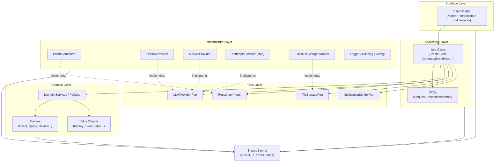
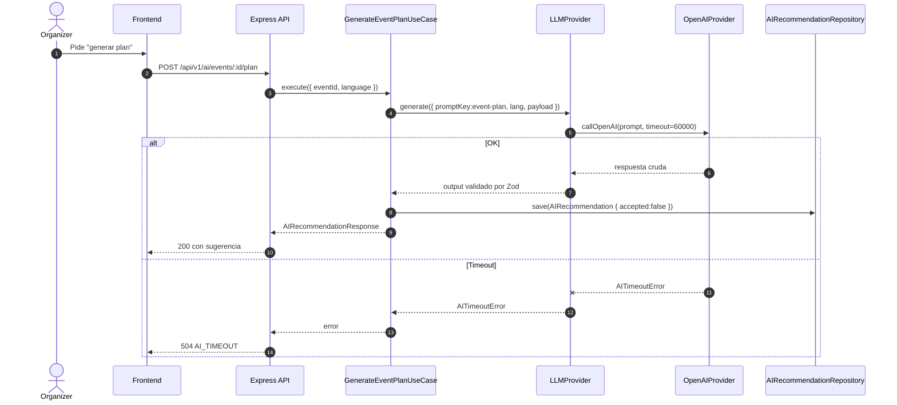
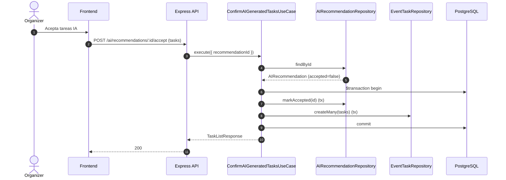
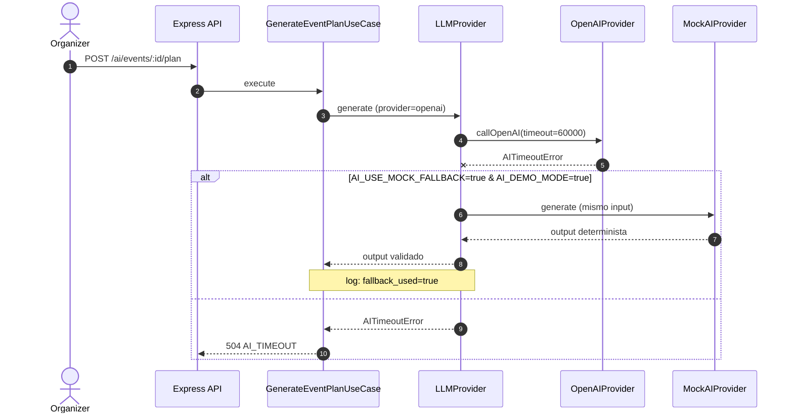

# EventFlow — Backend Technical Design Document

> **Versión:** 1.0
> **Fecha:** 2026-06-08
> **Producto:** EventFlow — plataforma asistida por IA para planificación de eventos y gestión simplificada de cotizaciones de proveedores
> **MVP target:** AI-assisted event planning workspace + simplified vendor quote flow
> **Idioma del documento:** Español LATAM neutral
> **Estado:** Listo para guiar implementación backend con Node.js, Express, TypeScript, Prisma, PostgreSQL, API Design, Database Physical Design, Security Design, Testing Strategy y User Stories técnicas.
> **Audiencia:** Backend Engineers, Tech Lead, Software Architect, AI Engineers, QA, DevOps, Product Owner, agentes IA generadores de código y evaluadores académicos.

---

## 1. Propósito del documento

Este **Backend Technical Design Document** traduce el **System Architecture Document** (`/docs/13`) en un diseño técnico concreto y accionable para implementar el backend del MVP de EventFlow con **Node.js + TypeScript + Express.js + Prisma + PostgreSQL**.

No reinventa decisiones de arquitectura ni de producto: las **operacionaliza** en términos de capas, módulos, casos de uso, puertos, adaptadores Prisma, DTOs, controladores Express, middlewares, autorización, manejo de errores, transacciones, integración IA, notificaciones, attachments, jobs en segundo plano, estructura de carpetas, testing, observabilidad y configuración.

Sus objetivos son:

- Definir cómo **Clean / Hexagonal Architecture** se aplica dentro del **Modular Monolith** usando Node.js y Express.
- Establecer **responsabilidades claras por capa** (Interface, Application, Domain, Ports, Infrastructure, Shared Kernel).
- Catalogar los **casos de uso de aplicación** que el backend debe implementar, con sus DTOs, repositorios, autorización y transacciones.
- Definir **puertos de repositorio** y **adaptadores Prisma** solo donde aportan valor real.
- Justificar **servicios y políticas de dominio** únicamente cuando una regla no encaja en una entidad o use case.
- Diseñar la **integración IA** mediante `LLMProvider` con `OpenAIProvider`, `MockAIProvider` y `AnthropicProvider` stub.
- Especificar **autorización RBAC + ownership** aplicada en backend, no solo en frontend.
- Documentar **error handling, transacciones, jobs, attachments y observabilidad** alineados al MVP.

Este documento es **insumo directo** para:

- `/docs/16-API-Design-Specification.md` (contratos REST formales).
- `/docs/18-Database-Physical-Design.md` (DDL físico y migraciones).
- `/docs/19-Security-and-Authorization-Design.md` (diseño de seguridad).
- `/docs/20-Testing-Strategy.md` (estrategia detallada de QA).
- `/docs/21-Deployment-and-DevOps-Design.md` (pipelines y entornos).
- Generación de **User Stories**, **Backlog** y **Tareas de desarrollo**.
- **Agentes IA generadores de código** (rutas, controladores, use cases, adaptadores Prisma, tests, seeds).

---

## 2. Alcance del documento

### 2.1 Incluye

- Diseño backend con Node.js + Express + TypeScript.
- Convenciones TypeScript backend.
- Uso de Prisma ORM e isolamiento en Infrastructure.
- Estrategia de persistencia con PostgreSQL.
- Capas backend (Interface, Application, Domain, Ports, Infrastructure, Shared Kernel).
- Módulos del Modular Monolith.
- Casos de uso de aplicación.
- Servicios y políticas de dominio solo donde se justifica.
- Puertos de repositorio solo donde se justifica.
- DTOs y estrategia de validación.
- Controladores Express y rutas.
- Middlewares (correlación, logging, auth, RBAC, ownership, validación, rate limit, captcha, error handler, upload).
- Autorización RBAC + ownership + políticas contextuales.
- Estrategia de manejo de errores y modelo de error.
- Fronteras de transacción con Prisma.
- Integración IA (`LLMProvider`, adapters, persistencia `AIRecommendation`, fallback, timeout).
- Notificaciones in-app y email simulado.
- Attachments y `FileStoragePort`.
- Jobs de fondo (auto-completar eventos, expirar cotizaciones, seed reset).
- Estructura de carpetas backend.
- Estrategia de testing (unit, use case, repo, controller, autorización, IA, seed, jobs).
- Observabilidad, auditoría y logging.
- Configuración y variables de entorno.
- Riesgos backend y mitigaciones.
- Trazabilidad a documentación previa.

### 2.2 No incluye

- Contrato REST completo (lo cubre `/docs/16-API-Design-Specification.md`).
- DDL físico definitivo de PostgreSQL (lo cubre `/docs/18-Database-Physical-Design.md`).
- Arquitectura del frontend (lo cubre `/docs/15-Frontend-Architecture-Design.md`).
- Prompts productivos finales (lo cubre `/docs/17-AI-Architecture-and-PromptOps-Design.md`).
- Pipelines CI/CD reales (lo cubre `/docs/21-Deployment-and-DevOps-Design.md`).
- Catálogo completo de casos de prueba QA (lo cubre `/docs/20-Testing-Strategy.md`).
- Pagos, contratos digitales, chat real-time, WhatsApp, push, SMS, app nativa.

---

## 3. Fuentes utilizadas

| # | Documento | Aporte al diseño backend |
|--:|-----------|--------------------------|
| 1 | `/docs/1-Domain-Discovery-Report.md` | Dominio del negocio, JTBD, entidades preliminares; alimenta nombres de módulos y use cases. |
| 2 | `/docs/2-Product-Owner-Decisions.md` | Decisiones de tipos de evento, idiomas, moneda, simulaciones; alimentan localización, validaciones y seed. |
| 3 | `/docs/3-MVP-Scope-Definition.md` | Alcance MVP, features incluidas/excluidas; delimita los módulos backend y prohíbe scope creep. |
| 4 | `/docs/4-Business-Rules-Document.md` | Reglas BR-* que viven en Application/Domain (currency inmutable, validez 15 días, máx 5 quote requests, soft delete, etc.). |
| 5 | `/docs/5-User-Roles-Permissions-Matrix.md` | Matriz RBAC + ownership; base para `roleMiddleware`, `ownershipMiddleware` y políticas de autorización. |
| 6 | `/docs/6-Domain-Data-Model.md` | Entidades, estados, relaciones; base para Prisma schema, repositorios y mappers. |
| 7 | `/docs/7-AI-Features-Specification.md` | Capacidades IA MVP, `LLMProvider`, prompts versionados, human-in-the-loop. |
| 8 | `/docs/8-Use-Cases-Specification.md` | UC-* funcionales; insumo directo para casos de uso de aplicación. |
| 8.1 | `/docs/8.1-Product-Owner-Decisions-Use-Cases-Addendum.md` | Decisiones PO (rating 1–5, validez 15 días, captcha, AI timeout 60s, soft delete, etc.). |
| 8.2 | `/docs/8.2-Documentation-Alignment-Review-Before-FRD.md` | Validación de consistencia previa al FRD. |
| 9 | `/docs/9-Functional-Requirements-Document.md` | Requerimientos funcionales por módulo; base para casos de uso de aplicación. |
| 10 | `/docs/10-Non-Functional-Requirements.md` | NFRs (performance, seguridad, IA timeout, observabilidad, testabilidad). |
| 11 | `/docs/11-Data-Seed-Strategy.md` | Estrategia seed reproducible; base para `seed.ts`, `SeedDemoController` y `SeedResetJob`. |
| 12 | `/docs/12-Architecture-Vision-and-Principles.md` | Visión arquitectónica y principios; base de las restricciones (no microservicios, no overengineering). |
| 13 | `/docs/13-System-Architecture-Document.md` | C4 L1/L2/L3, contenedores, flujos runtime; base directa de capas, módulos y diagramas. |

Toda afirmación de este documento es trazable a uno o más de los anteriores.

---

## 4. Backend technology stack

### 4.1 Stack aprobado

| Tecnología | Categoría | Decisión | Tipo de decisión |
|------------|-----------|----------|------------------|
| Node.js (LTS) | Runtime | Aprobado | Approved |
| TypeScript | Lenguaje | Aprobado | Approved |
| Express.js | HTTP framework | Aprobado | Approved |
| PostgreSQL | Base de datos relacional | Aprobado | Approved |
| Prisma ORM | ORM | Aprobado | Approved |
| REST JSON | Estilo de API | Aprobado | Approved |
| Modular Monolith | Estilo arquitectónico | Aprobado | Approved |
| Clean / Hexagonal | Arquitectura interna | Aprobado | Approved |
| `LLMProvider` (puerto) | Abstracción IA | Aprobado | Approved |
| `OpenAIProvider` | Adapter IA principal | Aprobado | Approved |
| `MockAIProvider` | Adapter IA determinista | Aprobado | Approved |
| `AnthropicProvider` (stub) | Adapter IA futuro | Aprobado | Approved |
| `LocalFileStorageAdapter` | Almacenamiento de archivos dev/demo | Aprobado | Approved |
| `ObjectStorageAdapter` | Almacenamiento de archivos cloud | Future | Future option |
| bcrypt **o** argon2 | Hashing de contraseñas | Aprobado | Approved (decisión final implementation-dependent) |
| **Zod** | Validación de DTOs | **Recomendado** | Recommended implementation choice |
| **Vitest + Supertest** | Testing | **Recomendado** | Recommended implementation choice |
| `node-cron` o `setInterval` controlado | Jobs MVP | Recomendado | Recommended (lightweight Node scheduled jobs) |
| Redis / BullMQ / Kafka / WebSockets | Brokers, queues, real-time | Out of scope MVP | Future |

### 4.2 Detalle por tecnología

#### 4.2.1 Node.js

- **Propósito:** runtime JavaScript del backend.
- **Por qué encaja:** ecosistema maduro, soporta workloads I/O-bound típicos de un backend REST con llamadas a LLM y base de datos.
- **Ubicación arquitectónica:** transversal; ejecuta el proceso del Modular Monolith.
- **Qué no debe depender de Node específicamente:** la lógica de dominio no debe usar APIs específicas de Node (file system, `process`, etc.).
- **Riesgo:** dependencia de versión LTS; degradación si se mezclan versiones.
- **Mitigación:** fijar la versión LTS en `package.json` (campo `engines`) y `.nvmrc`.

#### 4.2.2 TypeScript

- **Propósito:** tipado estático para reducir errores.
- **Por qué encaja:** soporta DTOs tipados, contratos claros entre capas, mejor experiencia con Prisma generated types y Zod.
- **Ubicación arquitectónica:** transversal.
- **Qué no debe depender de TypeScript específicamente:** ningún módulo debería requerir features no portables (decorators experimentales) salvo justificación.
- **Riesgo:** uso de `any` que erosiona el tipado.
- **Mitigación:** `strict: true`, `noImplicitAny: true`, lint que prohíba `any` salvo casos justificados.

#### 4.2.3 Express.js

- **Propósito:** framework HTTP minimalista para exponer endpoints REST.
- **Por qué encaja:** simple, predecible, gran ecosistema de middlewares; alineado con un MVP académico que no requiere features avanzadas de Nest/Fastify.
- **Ubicación arquitectónica:** **Interface Layer únicamente**.
- **Qué no debe depender de Express:** Domain, Application y Ports no deben importar `Request`, `Response`, `NextFunction`, ni middlewares.
- **Riesgo:** controladores con lógica de negocio (anti-pattern habitual en Express).
- **Mitigación:** controladores delgados que solo traducen HTTP ↔ use cases; lint o code review que rechace lógica en controllers.

#### 4.2.4 PostgreSQL

- **Propósito:** sistema de registro relacional único.
- **Por qué encaja:** ACID, soporta JSON, índices, constraints; encaja con entidades transaccionales (Event, Quote, BookingIntent, Review).
- **Ubicación arquitectónica:** **Infrastructure Layer**.
- **Qué no debe depender de PostgreSQL:** Domain y Application no conocen tablas, índices ni tipos PG específicos.
- **Riesgo:** acoplar SQL crudo en use cases.
- **Mitigación:** todas las queries pasan por Prisma adapters en Infrastructure.

#### 4.2.5 Prisma ORM

- **Propósito:** ORM tipado para PostgreSQL.
- **Por qué encaja:** schema declarativo, migraciones, tipos generados, transacciones, raw queries cuando son necesarias.
- **Ubicación arquitectónica:** **Infrastructure Layer**; los Prisma models son **persistence models, no domain entities**.
- **Qué no debe depender de Prisma:** Domain, Application, Ports.
- **Riesgo:** "domain anémico" donde `PrismaClient` se inyecta directamente en use cases.
- **Mitigación:** los use cases dependen de **puertos de repositorio**; los adapters Prisma implementan esos puertos.

#### 4.2.6 REST JSON API

- **Propósito:** contrato HTTP entre frontend y backend.
- **Por qué encaja:** simple, versionable (`/api/v1`), cacheable, fácil de testear con Supertest.
- **Ubicación arquitectónica:** Interface Layer.
- **Qué no debe depender de REST:** lógica de dominio o de aplicación.
- **Riesgo:** filtrar lógica de negocio en endpoints (e.g., reglas en query params).
- **Mitigación:** controladores delgados; reglas en use cases.

#### 4.2.7 OpenAI SDK detrás de adapter

- **Propósito:** llamadas al LLM principal.
- **Por qué encaja:** soporta los casos de uso IA del MVP (plan, checklist, presupuesto, brief, comparación, bio, priorización).
- **Ubicación arquitectónica:** **solo dentro de `OpenAIProvider`** en Infrastructure.
- **Qué no debe depender del SDK:** Domain, Application, otros adapters.
- **Riesgo:** acoplar SDK al use case.
- **Mitigación:** use cases dependen del puerto `LLMProvider`, no del SDK.

#### 4.2.8 MockAIProvider

- **Propósito:** proveedor determinista para tests, demo offline y fallback.
- **Por qué encaja:** garantiza demos reproducibles y tests sin dependencia de red.
- **Ubicación arquitectónica:** Infrastructure (adapter `LLMProvider`).
- **Qué no debe depender de él:** producción real (solo bajo flag `AI_DEMO_MODE` o `AI_USE_MOCK_FALLBACK`).
- **Riesgo:** que el sistema use mock en producción por mala configuración.
- **Mitigación:** logs explícitos cuando se usa Mock; validar `LLM_PROVIDER` en bootstrap.

#### 4.2.9 AnthropicProvider stub

- **Propósito:** mantener la abstracción multi-provider sin implementación funcional MVP.
- **Por qué encaja:** valida que `LLMProvider` es realmente sustituible.
- **Ubicación arquitectónica:** Infrastructure (stub que lanza `NotImplementedError` o registra "not configured").
- **Riesgo:** activarlo accidentalmente.
- **Mitigación:** stub explícito + tests que verifican que `LLM_PROVIDER=anthropic` no rompe el bootstrap pero rechaza llamadas con error controlado.

#### 4.2.10 LocalFileStorageAdapter

- **Propósito:** persistir attachments de portafolio en disco local para dev/demo.
- **Por qué encaja:** simple, sin dependencias cloud; suficiente para demo académica.
- **Ubicación arquitectónica:** Infrastructure (`FileStoragePort` adapter).
- **Qué no debe depender de él:** Application y Domain.
- **Riesgo:** subir archivos sensibles o exceder límites.
- **Mitigación:** validación de tipo/tamaño, lista blanca de mime types, límite de archivos por portafolio.

### 4.3 Technology boundaries

| Capa | Pertenecen | No pertenecen |
|------|-----------|--------------|
| **Interface** | Express, rutas, controladores, middlewares, presenters, validación sintáctica (Zod) | Reglas de negocio, Prisma, OpenAI SDK |
| **Application** | Use cases, DTOs internos, orquestación, puertos de salida | Express, Prisma, OpenAI SDK |
| **Domain** | Entidades, value objects, servicios de dominio, políticas | Express, Prisma, OpenAI SDK, axios |
| **Ports** | Interfaces de repositorio, `LLMProvider`, `FileStoragePort`, `NotificationSenderPort` | Implementaciones concretas |
| **Infrastructure** | Adapters Prisma, OpenAI, Mock, Anthropic stub, Local storage, hashing, logger | Reglas de negocio |
| **Shared Kernel** | Tipos comunes (Result, Id, error types, correlation id) | Lógica de feature |

Reglas inviolables:

- Domain **no** importa Express ni Prisma ni el SDK de OpenAI.
- Application **no** importa `Request`/`Response` de Express ni `PrismaClient` directamente.
- Prisma vive **solo** en `infrastructure/`.
- OpenAI SDK vive **solo** dentro de `OpenAIProvider`.

---

## 5. Resumen ejecutivo del backend

El backend del MVP de EventFlow se implementa como:

```text
Node.js + TypeScript Backend
+ Express REST API (Interface Layer)
+ Modular Monolith (un único deployable, fronteras por dominio)
+ Clean / Hexagonal Architecture (Domain, Application, Ports, Infrastructure)
+ Application Use Cases por feature
+ Domain Model independiente de framework
+ Repository Ports donde se justifican
+ Prisma Repository Adapters en Infrastructure
+ PostgreSQL como sistema de registro
+ LLMProvider abstraction (OpenAIProvider / MockAIProvider / AnthropicProvider stub)
+ FileStoragePort con LocalFileStorageAdapter
+ Jobs ligeros de Node para auto-completar eventos y expirar cotizaciones
```

Este diseño backend encaja con el MVP porque:

- Es **simple de construir** por un equipo pequeño (académico) en un solo deployable.
- Es **buildeable** con tecnologías estándar y ampliamente conocidas.
- **Aísla el cambio**: cambiar OpenAI por otro proveedor solo toca `infrastructure/llm/`.
- **Aísla el dominio**: las reglas BR-* viven en use cases/services y son testeables sin Express ni Prisma.
- **Protege el alcance**: ausencia de queues, brokers, microservicios o real-time evita scope creep.
- **Soporta demo reproducible** vía seed + `MockAIProvider`.
- **Soporta evaluación académica**: cada capa, regla y use case es trazable.

---

## 6. Principios de diseño backend

| # | Principio | Significado | Implicación backend | Ejemplo EventFlow |
|--:|-----------|-------------|---------------------|-------------------|
| 1 | Domain-first modules | Los módulos se nombran por dominio, no por capa técnica | Carpetas `src/modules/<bounded-context>/` | `event-planning`, `quote-flow`, `vendor-management` |
| 2 | Clean / Hexagonal separation | Capas con dependencias hacia adentro | Domain no conoce Express ni Prisma | `Event` entity no importa `PrismaClient` |
| 3 | Use-case driven Application | Cada acción del usuario tiene un use case explícito | Application Layer compuesta de use cases nombrados | `CreateEventUseCase`, `GenerateEventPlanUseCase` |
| 4 | Express controllers must be thin | Controladores solo traducen HTTP ↔ use case | Sin reglas de negocio en controllers | `EventsController.create` solo parsea body y llama `CreateEventUseCase.execute` |
| 5 | Framework-independent domain | Dominio no depende de Express/Prisma/OpenAI | Permite tests sin levantar HTTP/DB | `EventLifecycleService` testeable con objetos puros |
| 6 | Repository ports only where useful | Solo se crean puertos donde aportan valor | Evita interfaces 1:1 con tablas triviales | `CurrencyRepository` no existe; `Currency` es enum |
| 7 | Prisma adapters isolated | Prisma vive solo en Infrastructure | Application depende de puertos | `PrismaEventRepository implements EventRepository` |
| 8 | RBAC + ownership in backend | Autorización en backend, no solo en frontend | Middleware + políticas de aplicación | Organizer solo edita sus eventos |
| 9 | Human-in-the-loop AI | IA es copiloto, nunca decisor autónomo | Toda salida IA se persiste como `AIRecommendation` y requiere aceptación | `AcceptAIRecommendationUseCase` |
| 10 | AI provider abstraction | Domain no conoce a OpenAI/Anthropic | Puerto `LLMProvider`, adapters intercambiables | `OpenAIProvider`, `MockAIProvider`, `AnthropicProvider` |
| 11 | Deterministic demo and tests | Demos y tests reproducibles | `MockAIProvider` determinista, seed determinista | Seed con `is_seed=true` y IDs estables |
| 12 | Input validation at Express boundary | Validación sintáctica en el borde | Middlewares Zod antes del use case | `validateRequestMiddleware(CreateEventSchema)` |
| 13 | Business rules in App/Domain | Reglas BR-* viven en use cases o services | Sin reglas en controllers ni en Prisma adapters | Validez 15 días en `QuoteValidityService` |
| 14 | Auditability by design | Acciones admin se auditan | `AdminAction` por cada acción admin | `ApproveVendorProfileUseCase` registra `AdminAction` |
| 15 | Soft delete for sensitive entities | Borrado lógico con auditoría | `is_deleted`/`hidden_at` + filtro en queries | `Review.hidden_at`, `Attachment.deleted_at` |
| 16 | No automatic technical component per entity | No se crea controller/service/repo por cada tabla | Componentes solo cuando aportan valor | Sin `LanguageController` ni `CurrencyRepository` |
| 17 | No overengineering | MVP simple, sin patrones innecesarios | Sin CQRS, sin event sourcing, sin queues | Sin BullMQ ni Kafka en MVP |
| 18 | No out-of-scope marketplace | Sin pagos, contratos, chat, push, SMS, native | Lint, code review, scope guardrails | Sin `PaymentsController` |

---

## 7. Backend architecture overview

### 7.1 Capas

| Capa | Responsabilidad | Qué pertenece | Qué no pertenece |
|------|-----------------|---------------|------------------|
| **Interface Layer** | Adaptar HTTP ↔ Application | Rutas Express, controladores, middlewares, presenters, validación sintáctica | Reglas BR-*, Prisma, OpenAI SDK |
| **Application Layer** | Orquestar use cases del MVP | Use cases, DTOs internos, command/query handlers, coordinación de puertos | Express, Prisma client, SDK IA |
| **Domain Layer** | Modelar el negocio | Entidades, value objects, servicios y políticas de dominio, errores de dominio | Frameworks, infrastructure |
| **Ports Layer** | Contratos hacia afuera | Interfaces `EventRepository`, `LLMProvider`, `FileStoragePort`, `NotificationSenderPort` | Implementaciones concretas |
| **Infrastructure Layer** | Implementar puertos | Adapters Prisma, OpenAI, Mock, Anthropic stub, Local storage, hashing (bcrypt/argon2), logger | Reglas BR-* |
| **Shared Kernel** | Tipos transversales | `Result<T,E>`, `Id`, `CorrelationId`, errores base, utilidades de fecha/currency safe | Lógica específica de feature |

### 7.2 Diagrama de dependencias entre capas



Regla clave: las flechas sólidas representan dependencias en tiempo de compilación; las flechas punteadas representan implementación de interfaces (inversión de dependencias). **Ninguna flecha apunta de `DL` hacia `INF` o `IL`.**

---

## 8. Express application composition

### 8.1 Componentes

| Archivo / componente | Responsabilidad |
|----------------------|-----------------|
| `src/app.ts` | Factory de la app Express; registra middlewares globales, monta rutas `/api/v1`, registra error handler |
| `src/server.ts` | Bootstrap: carga config, levanta `app`, conecta Prisma, registra jobs, escucha en puerto |
| `src/config/` | Carga y validación de env vars (con Zod) |
| `src/jobs/` | Registro de jobs (`AutoCompletePastEventsJob`, `ExpireQuotesJob`, `ExpireQuoteRequestsJob`, `EmitT7NotificationsJob`, `SeedResetJob`) |
| `src/modules/*/interface/routes/*.routes.ts` | Definición de rutas por módulo, montadas en `app.ts` |
| `src/modules/*/interface/controllers/*.controller.ts` | Controladores delgados |
| `src/shared/interface/middlewares/` | Middlewares globales (correlación, logging, error, 404) |
| `src/shared/interface/middlewares/auth/` | `authMiddleware`, `roleMiddleware`, `ownershipMiddleware` |

### 8.2 Orden de middlewares globales

```text
1. correlationIdMiddleware
2. requestLoggerMiddleware
3. jsonBodyParser (con límite de tamaño)
4. corsMiddleware
5. helmet (security headers, recomendado)
6. rateLimitMiddleware (global laxo; estricto por ruta)
7. /api/v1 routes
   ├── authMiddleware (en rutas protegidas)
   ├── captchaVerificationMiddleware (solo /auth/register y /auth/login)
   ├── roleMiddleware (en rutas con restricción RBAC)
   ├── ownershipMiddleware (en rutas con verificación de propiedad)
   ├── validateRequestMiddleware(schema) (en rutas con DTO)
   ├── fileUploadMiddleware (rutas con multipart)
   └── controller.handler
8. notFoundMiddleware
9. errorHandlerMiddleware
```

### 8.3 Prefijo y health check

- Versionado: **`/api/v1/...`**.
- Health check: **`GET /health`** (público, no autenticado, sin rate limit estricto), devuelve estado de la app, Prisma y `LLMProvider` configurado.
- Documentación interactiva (recomendado, opcional): **`GET /docs`** (Swagger UI) si `OPENAPI_ENABLED=true`.

### 8.4 Reglas clave

- Express **no contiene lógica de negocio**. Si una regla BR-* aparece dentro de un controller o de un middleware de feature, es un anti-pattern y debe moverse a Application/Domain.
- Los controllers solo:
  1. Extraen `req.body`, `req.params`, `req.query`, `req.user`.
  2. Llaman a un use case.
  3. Mapean el resultado a un DTO de respuesta y status HTTP.
- Cualquier flujo que requiera más de una operación de DB y consistencia atómica se delega al use case que coordina la transacción Prisma.

---

## 9. Modular monolith boundaries

| Módulo | Propósito | Entidades / catálogos principales | Use cases principales | Reglas BR-* clave | Dependencias permitidas | Dependencias prohibidas | Notas anti-overengineering |
|--------|-----------|-----------------------------------|-----------------------|-------------------|--------------------------|--------------------------|----------------------------|
| **identity-access** | Registro, login, recuperación, hashing, sesiones | `User`, `Role` (enum) | `RegisterUserUseCase`, `LoginUserUseCase`, `LogoutUserUseCase`, `RequestPasswordResetUseCase` | BR-AUTH-001/002/003/004; captcha | `shared-kernel`, `notifications` (signup), `user-profile` (creación de perfil) | Lógica de eventos, quotes | Sin módulo de `accounts`/`sessions` separado |
| **user-profile** | Datos del usuario y preferencia de idioma | `User` (perfil), `Language` (catálogo) | `GetMyProfileUseCase`, `UpdateMyProfileUseCase`, `ChangePreferredLanguageUseCase` | BR-USER-001, BR-USER-006, BR-I18N-003 | `shared-kernel` | Lógica de eventos, quotes | Sin tabla separada `UserPreference` (vive como atributo de User) |
| **event-planning** | Ciclo de vida del evento y dashboard | `Event`, `EventType` (catálogo), `Location`, `Currency` (enum) | `CreateEventUseCase`, `UpdateEventUseCase`, `ListMyEventsUseCase`, `CancelEventUseCase`, `AutoCompletePastEventsUseCase` | BR-EVENT-001/002/003/005/010, BR-BUDGET-001 (currency immutable), BR-EVENT-009 | `shared-kernel`, `budget-management` (crear budget al crear evento), `task-management`, `notifications` | Pagos, contratos | El "EventPlan" no es entidad; emerge de Tasks + Budget + AIRecommendation |
| **task-management** | Checklist manual e IA | `EventTask` | `CreateManualTaskUseCase`, `UpdateTaskStatusUseCase`, `ConfirmAIGeneratedTasksUseCase`, `DeleteTaskUseCase` | BR-TASK-001/003/005 | `event-planning`, `ai-assistance` (aceptar IA), `shared-kernel` | Pagos, vendors | Sin servicio de "calendario"; las fechas son atributos |
| **budget-management** | Presupuesto e ítems | `Budget`, `BudgetItem` | `CreateBudgetItemUseCase`, `UpdateBudgetItemUseCase`, `DeleteBudgetItemUseCase`, `GenerateBudgetSuggestionUseCase`, `ConfirmAIBudgetSuggestionUseCase` | BR-BUDGET-001/002/006, sin conversión automática | `event-planning`, `ai-assistance`, `shared-kernel` | Pagos | Sin servicio de conversión de monedas |
| **vendor-management** | Perfil de proveedor, servicios y aprobación | `VendorProfile`, `VendorService` | `CreateVendorProfileUseCase`, `UpdateVendorProfileUseCase`, `SubmitVendorProfileForApprovalUseCase`, `CreateVendorServiceUseCase`, `UpdateVendorServiceUseCase`, `DeleteVendorServiceUseCase` | BR-VENDOR-001/002/005/006, max 5 cambios de categoría, máx 10 imágenes por trabajo | `service-catalog`, `attachments`, `admin-governance` (aprobación), `notifications`, `shared-kernel` | Pagos reales | Sin servicio de "subscription billing" |
| **service-catalog** | Categorías de servicio y EventType | `ServiceCategory`, `EventType` | `ListServiceCategoriesUseCase`, `AdminCreateServiceCategoryUseCase`, `AdminUpdateServiceCategoryUseCase`, `AdminDisableEventTypeUseCase` | Profundidad máx 2 (BR-SERVICE-002), EventType controlled | `admin-governance`, `shared-kernel` | Lógica de eventos | Un único repositorio para `ServiceCategory`; `EventType` evaluado como enum + tabla controlada |
| **quote-flow** | Solicitudes y respuestas de cotización | `QuoteRequest`, `Quote` | `CreateQuoteRequestUseCase`, `GenerateQuoteBriefUseCase`, `RespondToQuoteRequestUseCase`, `ExpireQuotesUseCase`, `RejectQuoteUseCase`, `CompareQuotesUseCase` | BR-QUOTE-001/002/006, validez 15 días (BR-QUOTE-004), máx 5 activos por categoría/evento (BR-QUOTE-005) | `event-planning`, `vendor-management`, `service-catalog`, `ai-assistance`, `notifications`, `shared-kernel` | Pagos | Sin "messaging" entre organizer y vendor |
| **booking-intent** | Booking simulado | `BookingIntent` | `CreateBookingIntentUseCase`, `ConfirmBookingIntentUseCase`, `CancelBookingIntentUseCase` | BR-BOOKING-001/002/003, cancelación de `confirmed_intent` sin penalización | `quote-flow`, `event-planning`, `vendor-management`, `notifications`, `shared-kernel` | Pagos, contratos | Sin tabla `Contract` |
| **reviews-moderation** | Reseñas y moderación admin | `Review` | `CreateReviewUseCase`, `ListPublicReviewsUseCase`, `AdminHideReviewUseCase` | BR-REVIEW-001/002 (1–5), BR-REVIEW-004 (solo con booking confirmado), soft delete | `booking-intent`, `vendor-management`, `admin-governance`, `shared-kernel` | Respuestas del proveedor (out of scope) | Sin "thread" de respuestas |
| **notifications** | Notificaciones in-app y email simulado | `Notification` | `CreateNotificationUseCase`, `ListMyNotificationsUseCase`, `MarkNotificationAsReadUseCase` | BR-NOTIF-001/002 | `shared-kernel` | SMS, push, WhatsApp | Sin worker dedicado; envío síncrono en MVP |
| **ai-assistance** | Integración IA y AIRecommendation | `AIRecommendation`, `AIPromptVersion` (evaluado como registry estático) | `GenerateEventPlanUseCase`, `GenerateChecklistUseCase`, `GenerateBudgetSuggestionUseCase`, `RecommendServiceCategoriesUseCase`, `GenerateQuoteBriefUseCase`, `CompareQuotesUseCase`, `AcceptAIRecommendationUseCase`, `DiscardAIRecommendationUseCase` | BR-AI-001 (HITL), BR-AI-010 (versionado), AI timeout 60s | `event-planning`, `task-management`, `budget-management`, `quote-flow`, `shared-kernel` | Aprobación de vendors, moderación de reviews, payments | Sin "chatbot" libre; cada feature IA es un use case con schema validado |
| **admin-governance** | Aprobaciones, moderación, métricas y auditoría | `AdminAction` | `ListPendingVendorsUseCase`, `ApproveVendorProfileUseCase`, `RejectVendorProfileUseCase`, `HideReviewUseCase`, `ListAdminMetricsUseCase`, `ListEventsForAdminUseCase` (US-078), `AdminViewEventUseCase` (US-016 + US-078 counts), `GetAdminMetricsUseCase` (US-079), `ListAdminActionsUseCase` (US-080) | BR-ADMIN-001/002/009, `AdminAction` por cada acción de mutación (list de eventos NO emite AdminAction — Decisión PO US-078 D2; visor de audit log NO emite AdminAction — Decisión PO US-080 D6), FR-EVENT-010 sólo-lectura arquitectónica en `admin/events`, FR-ADMIN-006 sólo-lectura arquitectónica en `admin/admin-actions` | `vendor-management`, `reviews-moderation`, `event-planning` (read-only), `notifications`, `shared-kernel` | Crear usuarios admin desde UI (solo seed/config); mutaciones admin sobre `Event` (FR-EVENT-010); métricas comerciales (SEC-02 US-079); endpoints de mutación sobre `AdminAction` (SEC-02 US-080) | Sin "permissions UI" complejo. **US-078:** el submódulo `admin/events` expone únicamente 2 GETs (`/admin/events` list + `/admin/events/:id` detail); PATCH/DELETE/POST devuelven `403 FORBIDDEN_WRITE` (baseline US-016), preservando invariancia solo-lectura sin ADR nuevo. **US-079:** el submódulo `admin/metrics` expone `GET /admin/metrics` con cache in-memory `MetricsCacheService` TTL 60s (key `admin:metrics:v1`); 7 sub-queries agregadas ejecutadas en `Promise.all`. Sin AdminAction (Decisión PO D4). NO expone campos comerciales (SEC-02 / AC-05) — el DTO `AdminMetricsResponse` es la única fuente del contrato. **US-080:** el submódulo `admin/admin-actions` expone únicamente `GET /admin/admin-actions` (visor inmutable del audit log) con filtros combinados + cursor keyset `(created_at DESC, id DESC)`. Cualquier verbo de escritura cae en el catch-all 404 (inmutabilidad arquitectónica AC-03, verificada por `us080-admin-actions-immutability.spec.ts`). El UseCase NO crea AdminAction al consultar (self-log evitado AC-04 — sólo log estructurado `admin.admin_actions.viewed`). Cierra EPIC-ADM-001. |
| **attachments** | Attachments y FileStoragePort | `Attachment` | `UploadAttachmentUseCase`, `SoftDeleteAttachmentUseCase`, `ListAttachmentsByOwnerUseCase` | Soft delete obligatorio, portfolio limit, allow-list de mime types | `vendor-management` (portfolio), `quote-flow` (brief), `shared-kernel` | Documentos sensibles (no MVP) | Storage abstracto; `LocalFileStorageAdapter` por defecto |
| **localization** | Catálogo de lenguajes/monedas soportadas | `Language`, `Currency` (típicamente enum/config) | `ListSupportedLanguagesUseCase`, `ListSupportedCurrenciesUseCase` | BR-I18N-001/003, BR-BUDGET-006 | `shared-kernel` | Cambio de moneda en eventos existentes (prohibido) | Implementado mayormente como constantes/seed; sin repositorio si no aporta valor |
| **seed-demo** | Seed determinista y reset demo | (transversal) | `SeedDemoDataUseCase`, `ResetDemoUseCase` | BR-SEED-001/002 | Todos los módulos (write controlado) | Producción real | Solo disponible cuando `SEED_DEMO_ENABLED=true` |
| **shared-kernel** | Tipos y utilidades comunes | (sin entidades de feature) | (sin use cases de feature) | Convenciones de errores, `Id`, `Result`, `CorrelationId`, `Clock` (para testear fechas) | Ninguna (no debe depender de otros módulos) | Lógica de feature | Mínimo y estable |

Importante: este listado prohíbe automáticamente crear un controller/repo por entidad. Cada componente técnico se justifica en su sección.

---

## 10. Module responsibility details

### 10.1 Identity & Access

- **Responsabilidad:** identidad de usuarios MVP.
- **In-scope:** registro público (`organizer`/`vendor`), login, logout, recuperación, captcha, hashing seguro de contraseñas.
- **Out-of-scope:** SSO, OAuth con redes, MFA, autocreación de admin desde UI.
- **Main use cases:** `RegisterUserUseCase`, `LoginUserUseCase`, `LogoutUserUseCase`, `RequestPasswordResetUseCase`, `ResetPasswordUseCase`.
- **Domain services / policies:** `AuthorizationPolicyService` (transversal, vive en `shared` o aquí), `PasswordHashingPolicy` (justifica abstraer bcrypt vs argon2).
- **Repository ports:** `UserRepository`.
- **Prisma adapters:** `PrismaUserRepository`.
- **Validaciones:** email único, contraseña con política mínima, rol ∈ {organizer, vendor}, captcha válido.
- **Authorization:** `/auth/*` público (con rate limit); `/auth/me` requiere sesión.
- **Eventos/notificaciones:** `Notification` opcional de bienvenida (in-app); email simulado.
- **Testing focus:** registro/login feliz y negativo, captcha, hashing, rate limit, masking de errores.
- **Simplification notes:** sin tablas de `Session` si se usa JWT firmado; si se usa cookie/sesión server-side, una tabla `Session` mínima en `infrastructure` (no parte del dominio).

### 10.2 User Profile

- **Responsabilidad:** lectura y edición del perfil del usuario logueado.
- **In-scope:** ver perfil, actualizar nombre/avatar opcional, cambiar idioma preferido.
- **Out-of-scope:** ver perfiles de terceros, gestión multi-usuario.
- **Main use cases:** `GetMyProfileUseCase`, `UpdateMyProfileUseCase`, `ChangePreferredLanguageUseCase`.
- **Domain services / policies:** ninguno propio (validación simple).
- **Repository ports:** comparte `UserRepository`.
- **Validaciones:** nombre no vacío, idioma ∈ `Language` soportada.
- **Authorization:** ownership trivial (siempre el propio user via `req.user.id`).
- **Eventos/notificaciones:** ninguno.
- **Testing focus:** ownership, validación de idioma.
- **Simplification notes:** no se separa de `identity-access` salvo por claridad organizativa.

### 10.3 Event Planning

- **Responsabilidad:** ciclo de vida del evento.
- **In-scope:** wizard de creación, edición de campos editables, listado, dashboard, transición de estados (`draft → active → completed/cancelled`), auto-completion 2 días después de `event_date`, currency inmutable.
- **Out-of-scope:** colaboradores múltiples, RSVP, seating, payments.
- **Main use cases:** `CreateEventUseCase`, `UpdateEventUseCase`, `ListMyEventsUseCase`, `GetEventDashboardUseCase`, `ChangeEventStatusUseCase`, `CancelEventUseCase`, `AutoCompletePastEventsUseCase` (job).
- **Domain services / policies:** `EventLifecycleService` (estados y auto-completion), políticas de ownership.
- **Repository ports:** `EventRepository`.
- **Prisma adapters:** `PrismaEventRepository`.
- **Validaciones:** fecha futura para `draft → active`, currency ∈ `Currency` soportada **al crear**, currency NO modificable luego.
- **Authorization:** organizer = owner; admin read-only en `AdminListEventsUseCase`.
- **Eventos/notificaciones:** notificación in-app cuando el evento se auto-completa (opcional).
- **Testing focus:** currency immutability, auto-completion job, ownership.
- **Simplification notes:** sin "EventTemplate" como entidad (curado en seed/código).

### 10.4 Task Management

- **Responsabilidad:** checklist manual e IA-confirmada.
- **In-scope:** creación/edición/eliminación manual de tareas, aceptar tareas IA generadas (individual o por bloque), transiciones de estado.
- **Out-of-scope:** calendarios externos, sub-tareas anidadas multi-nivel.
- **Main use cases:** `CreateManualTaskUseCase`, `UpdateTaskUseCase`, `UpdateTaskStatusUseCase`, `DeleteTaskUseCase`, `ConfirmAIGeneratedTasksUseCase`.
- **Repository ports:** `EventTaskRepository`.
- **Prisma adapters:** `PrismaEventTaskRepository`.
- **Validaciones:** ownership del evento, estados válidos, due_date razonable.
- **Authorization:** organizer = owner del evento.
- **Eventos/notificaciones:** opcional.
- **Testing focus:** confirmación de IA marca `source='ai_confirmed'`, transiciones.
- **Simplification notes:** sin servicio de "recurrencia"; las tareas son atómicas.

### 10.5 Budget Management

- **Responsabilidad:** presupuesto del evento e ítems por categoría.
- **In-scope:** crear/editar/eliminar ítems, sugerencia IA, confirmación de sugerencias, warnings cuando se supera total objetivo.
- **Out-of-scope:** conversión automática de monedas, importación de catálogos externos.
- **Main use cases:** `GetBudgetUseCase`, `CreateBudgetItemUseCase`, `UpdateBudgetItemUseCase`, `DeleteBudgetItemUseCase`, `GenerateBudgetSuggestionUseCase`, `ConfirmAIBudgetSuggestionUseCase`.
- **US-064 cross-domain refresh (PB-P1-037):** `GetBudgetUseCase` amplía su response con `summary.available`, `items[].diff`, `items[].auto_created` (heurística `planned=0 && committed>0`) y `last_updated_at`. La UI del organizador (`BudgetPage` + `BudgetSummary` con `aria-live`) refresca automáticamente al terminar mutaciones de `BookingIntent` (US-061 confirm / US-062 cancel) — los hooks `useConfirmBookingIntent` y `useCancelBookingIntent` reciben `eventId` opcional para invalidar la queryKey canónica `['event', eventId, 'budget']` compartida con US-035/036/037/038.
- **Domain services / policies:** validación de currency = currency del evento (immutable).
- **Repository ports:** `BudgetRepository`, `BudgetItemRepository`.
- **Prisma adapters:** `PrismaBudgetRepository`, `PrismaBudgetItemRepository`.
- **Validaciones:** moneda del item = moneda del evento; montos positivos.
- **Authorization:** organizer = owner.
- **Testing focus:** consistencia de moneda, warnings de overrun.
- **Simplification notes:** `Budget` se crea junto con el evento (1:1).

### 10.6 Vendor Management

- **Responsabilidad:** perfil de proveedor, paquetes/servicios, aprobación.
- **In-scope:** edición de perfil (con límites de cambios de categoría), portafolio (vía attachments), submit para aprobación, gestión de `VendorService`.
- **Out-of-scope:** cobro real, suscripciones reales (atributo simple en `VendorProfile`).
- **Main use cases:** `CreateVendorProfileUseCase`, `UpdateVendorProfileUseCase`, `SubmitVendorProfileForApprovalUseCase`, `ChangeVendorCategoryUseCase`, `CreateVendorServiceUseCase`, `UpdateVendorServiceUseCase`, `DeleteVendorServiceUseCase`.
- **Domain services / policies:** `VendorCategoryChangePolicyService` (límite acumulado de 5), `PortfolioPolicyService` (máx 10 imágenes por trabajo).
- **Repository ports:** `VendorProfileRepository`, `VendorServiceRepository`.
- **Validaciones:** category ∈ catálogo activo, límites, ownership.
- **Authorization:** vendor = owner; admin para `approve/reject`.
- **Eventos/notificaciones:** notificación al vendor cuando se aprueba/rechaza.
- **Testing focus:** límite de cambios, portfolio limit, transición a `approved`.

### 10.7 Service Catalog

- **Responsabilidad:** categorías de servicio (`ServiceCategory`) y `EventType` curado.
- **In-scope:** listar categorías (admin ve inactivas, público solo activas) y EventType activos;
  admin crea/edita/desactiva/reactiva categorías; enforcement de jerarquía 2 niveles.
- **Out-of-scope:** profundidad > 2 niveles, hard delete, bulk reorder, creación de categorías
  por proveedores, AI-generated categories.
- **Main use cases (US-075 / PB-P1-042):**
  - `CreateServiceCategoryUseCase` — crea root o child con validación de jerarquía + AdminAction append-only.
  - `UpdateServiceCategoryUseCase` — patch parcial (name/desc/parent/sort/is_active) con detección `reactivate` y validación de jerarquía al mover.
  - `SoftDeleteServiceCategoryUseCase` — guards (`CATEGORY_IN_USE`, `CATEGORY_HAS_CHILDREN`) + UPDATE `is_active=false` + AdminAction `soft_delete`.
  - `ListServiceCategoriesUseCase` — variante admin/pública; devuelve `{tree, flat}` en orden determinista
    (`parent_id NULLS FIRST, sort_order ASC, label ASC`).
- **Domain services / policies:** enforcement inline de depth ≤ 2 en cada UseCase de mutación
  (Decisión PO D4 + BR-SERVICE-005) — sin `ServiceCategoryHierarchyPolicyService` separado. El
  CHECK SQL `depth_level BETWEEN 1 AND 2` (US-102) es la segunda línea de defensa.
- **Persistencia y campos (post US-075 DB-002):** `service_categories` con `name_i18n jsonb`
  (required `es-LATAM`), `description_i18n jsonb?`, `parent_id uuid?` self-ref FK
  (`ON DELETE RESTRICT`), `sort_order int default 0`, `depth_level`, `is_active`, `deleted_at`.
  `label` / `description` se mantienen como fallback denormalizado desde `es-LATAM` en cada
  write para compat con callers legacy (`VendorService`, `EventTask`, `Quote`).
- **Endpoints (Tech Spec US-075 §7):**
  - `GET  /api/v1/admin/service-categories`    — admin listing (incluye inactivas).
  - `POST /api/v1/admin/service-categories`    — create root / child.
  - `PATCH /api/v1/admin/service-categories/:id` — update / reactivate.
  - `DELETE /api/v1/admin/service-categories/:id` — soft delete con `reason` [10..500].
  - `GET  /api/v1/service-categories`          — público (sesión requerida, cualquier rol).
- **Audit trail:** cada mutación crea un `AdminAction` (`target_entity='service_category'`) con
  acción `create` / `update` / `reactivate` / `soft_delete` (BR-ADMIN-011 / Decisión PO D7).
  No hay chain audit inverso en `service_categories.admin_action_id` (el catálogo es cold; los
  admins consultan `admin_actions.target_entity='service_category'` con index dedicado).
- **Authorization:** admin para mutaciones (`roleMiddleware(['admin'])`); sesión válida para
  lectura pública (Decisión PO D10 + SEC-02 — no anonymous).
- **Testing focus:** depth policy (crear/mover a nivel 3), soft delete guards (vendor_services,
  children activos), reactivate detection, seed cultural LATAM (`SERVICE_CATEGORIES` fixture
  en `latam-data.ts`).

#### 10.7.b Event Catalog (`EventType`, US-076 / PB-P1-043)

Nuevo sub-módulo `backend/src/modules/event-catalog` que espeja la superficie de
`service-catalog` **sin jerarquía** (Decisión PO: catálogo plano):

- **Responsabilidad:** CRUD admin de `EventType` (`wedding`, `xv`, `baptism`,
  `baby_shower`, `birthday`, `corporate` + custom) y endpoint público consumido por el
  wizard de creación de eventos.
- **Main use cases (US-076 / PB-P1-043):**
  - `CreateEventTypeUseCase` — INSERT + AdminAction append-only. Invariantes: es-LATAM
    requerido, code único (detección eager antes del INSERT).
  - `UpdateEventTypeUseCase` — patch parcial (name/desc/sort/is_active) con detección
    `reactivate` (false→true dispara acción `reactivate`).
  - `SoftDeleteEventTypeUseCase` — guard único `EXISTS events` (BR-EVENTTYPE-007) →
    `EVENT_TYPE_IN_USE` con `details.usage_count`. Sin `CATEGORY_HAS_CHILDREN` (no aplica).
    Muta `is_active=false`. Sin hard delete físico.
  - `ListEventTypesUseCase` — variante admin/pública; devuelve `EventTypeView[]` ordenado
    por `sort_order ASC, label ASC`. Público filtra `is_active=true`. Sin `{tree, flat}`
    — el catálogo es plano.
- **Persistencia (post US-076 DB-002):** `event_types` extendida con `name_i18n jsonb`
  (required `es-LATAM`), `description_i18n jsonb?`, `sort_order int default 0`. `label` /
  `description` se mantienen como fallback denormalizado desde `es-LATAM` en cada write
  para compat con callers legacy (`PrismaEventTypeRepository.findActive`, `useEventTypes`
  FE del wizard de creación). Índice parcial `idx_event_types_active_sort (is_active,
  sort_order) WHERE deleted_at IS NULL` en SQL raw (patrón US-066/US-075/US-102 CI drift fix).
- **Endpoints (Tech Spec US-076 §7):**
  - `GET  /api/v1/admin/event-types`      — admin listing (incluye inactivos).
  - `POST /api/v1/admin/event-types`      — create.
  - `PATCH /api/v1/admin/event-types/:id` — update / reactivate.
  - `DELETE /api/v1/admin/event-types/:id` — soft delete con `reason` [10..500].
  - `GET  /api/v1/event-types`            — público (sesión requerida). Reemplaza al
    endpoint de US-009 con shape superset spec-compliant (`EventTypeView[]` vs el legacy
    `{code, label}[]`). Backward-compatible con `EventTypeOption` del wizard.
- **Audit trail:** cada mutación crea un `AdminAction` (`target_entity='event_type'`) con
  acción `create` / `update` / `reactivate` / `soft_delete` (BR-ADMIN-011).
- **Códigos de error:** `EVENT_TYPE_NOT_FOUND` (404), `EVENT_TYPE_IN_USE` (409),
  `DUPLICATE_CODE` (409, compartido con US-075). Los errores compartidos
  `INVALID_NAME_I18N`, `REASON_REQUIRED`, `INVALID_REASON_LENGTH` reusan las clases del
  módulo `service-catalog` para preservar un solo punto de mapeo en el error handler.
- **Seed obligatorio (FR-EVENT-013 / US-076 DB-003):** los 6 EventTypes culturales
  se hidratan con `nameI18n`, `descriptionI18n` (4 locales) y `sortOrder` explícito
  desde `EVENT_TYPES` en `latam-data.ts`. Idempotente: backfill en filas seed pre-US-076.
- **Testing focus:** guard EXISTS events, reactivate detection, i18n es-LATAM required,
  code slug con underscore (`baby_shower`).

### 10.8 Quote Flow

- **Responsabilidad:** ciclo simplificado de cotización.
- **In-scope:** crear `QuoteRequest` con brief (manual o IA), enviar a un proveedor por categoría, recibir `Quote`, comparar, rechazar, expirar.
- **Out-of-scope:** múltiples mensajes entre partes, negociación, contratos.
- **Main use cases:** `CreateQuoteRequestUseCase`, `GenerateQuoteBriefUseCase`, `RespondToQuoteRequestUseCase`, `RejectQuoteUseCase`, `ExpireQuotesUseCase` (job), `CompareQuotesUseCase`, `ListMyQuoteRequestsUseCase` (organizer), `ListIncomingQuoteRequestsUseCase` (vendor).
- **Domain services / policies:** `QuoteRequestLimitService` (máx 5 activos por categoría/evento), `QuoteValidityService` (default 15 días, expiración).
- **Repository ports:** `QuoteRequestRepository`, `QuoteRepository`.
- **Validaciones:** límite atómico (transacción), validez default 15 días si no se provee `valid_until`, currency consistente con el evento.
- **Authorization:** organizer = owner del evento; vendor = recipient del `QuoteRequest`.
- **Eventos/notificaciones:** vendor recibe `QuoteRequest`; organizer notificado en `Quote` recibida; vendor notificado en `Quote rejected/expired`.
- **Testing focus:** límite atómico, validez por defecto, expiración por job.

### 10.9 Booking Intent

- **Responsabilidad:** booking simulado sin pago. Aceptación de Quote atómica con la creación
  del intent (US-060). Confirmación por el vendor asignado. Cancelación bilateral sin penalización.
- **In-scope:** aceptación atómica de un `Quote` vigente → crear `BookingIntent` `pending` + 2
  Notifications al vendor (`booking_intent.created`) en una única `prisma.$transaction` (US-060
  D1..D5); confirmar por el vendor (US-061); cancelar por organizer o vendor incluso desde
  `confirmed_intent` (US-062).
- **Out-of-scope:** pagos reales, captura/almacenamiento de medios de pago (FR-BOOKING-007),
  contratos firmados. El DTO Zod `.strict()` de `POST /booking-intents` rechaza cualquier campo
  de pago; los tests QA-005 lo verifican explícitamente.
- **Main use cases:** `CreateBookingIntentUs060UseCase` (US-060 — transaccional + fan-out
  atómico), `GetBookingIntentUseCase`, `ConfirmBookingIntentUseCase` (US-061 — 3-step
  transaccional: UPDATE intent + sync committed cross-domain via US-039 + 2 notifs organizer con
  `event='booking_intent.confirmed'`; idempotencia AC-03 + warn `budget.committed_exceeds_planned`),
  `CancelBookingIntentUseCase` (US-062 — cancelación bilateral 3-step: UPDATE intent + revert
  committed condicional via US-039 + 2 notifs a contraparte con `event='booking_intent.cancelled'`;
  NO idempotente por contrato + warn `budget.committed_underflow_corrected`; `reason` opcional).
- **Domain services / policies:** `BookingIntentPolicyService` (opcional; transición de estados).
  `QuoteEventNotificationService` (compartido con `quote-flow`) — extendido con
  `booking_intent.created` (6º evento).
- **Repository ports:** `BookingIntentRepository` (extendido con `createdBy`).
- **Validaciones:** disclaimer server-side enforcement (`disclaimer_accepted:true`, US-060 D2);
  Quote `status='sent'` y no vencida (US-060 D6); UNIQUE parcial DB
  `uq_booking_intents_active_per_quote (quote_id) WHERE status IN ('pending','confirmed_intent')`
  (US-060 D4).
- **Authorization:** organizer dueño del evento crea (`404 QUOTE_NOT_FOUND` uniforme si ajeno,
  US-060 D7 / SEC-03); vendor asignado confirma; organizer o vendor asignado cancela.
- **Eventos/notificaciones:** 2 notifs bilaterales por transición vía `QuoteEventNotificationService`
  común (`in_app` + `email_simulated`); log estructurado `booking_intent.created` /
  `booking_intent.confirmed` / `booking_intent.cancelled` con `{correlationId, actorId,
  bookingIntentId, quoteId, quoteRequestId?}` (sin payload — SEC-09).
- **Testing focus:** transiciones, ownership doble (vendor + organizer), atomicidad del path
  US-060 (Quote+BookingIntent+2 notifs en una tx; fallo revierte todo), UNIQUE parcial bajo
  concurrencia (2 POST simultáneos ⇒ uno gana, otro `409 BOOKING_INTENT_ALREADY_EXISTS`),
  disclaimer/no-pagos security tests (QA-005).

### 10.10 Reviews & Moderation

- **Responsabilidad:** reseñas verificadas y moderación admin.
- **In-scope:** crear `Review` solo si existe `BookingIntent.confirmed_intent`, rating 1–5, listar pública; admin oculta vía soft delete.
- **Out-of-scope:** respuesta del proveedor, IA moderation, sentiment.
- **Main use cases:** `CreateReviewUseCase`, `ListVendorReviewsUseCase` (público filtrado por `hidden_at IS NULL`), `AdminHideReviewUseCase`, `AdminListHiddenReviewsUseCase`.
- **Domain services / policies:** `ReviewEligibilityService` (requiere booking confirmado).
- **Repository ports:** `ReviewRepository`.
- **Validaciones:** rating ∈ [1, 5], texto sin enlaces sospechosos (validación simple), una review por booking.
- **Authorization:** organizer = autor; admin hide.
- **Eventos/notificaciones:** notificación al vendor cuando se crea la review.
- **Testing focus:** elegibilidad, soft delete, filtro en listados públicos.
- **US-065 (PB-P1-038):** implementa el endpoint atómico `POST /api/v1/organizer/reviews` que ejecuta en una única `prisma.$transaction`: INSERT `reviews` + recálculo denormalize `AVG(rating)` / `COUNT(*)` con UPDATE de `VendorProfile.rating_avg + reviews_count` (D4) + fan-out `review.published` de 2 Notifications al vendor vía `QuoteEventNotificationService` extendido a 9 eventos (BE-002) + log estructurado `review.published` (§14). El módulo declara el `ReviewEventNotifierPort` (consumer-owned interface) — el composition root del router enlaza el service común como adapter. La unicidad `(event, vendor)` se enforce a nivel aplicación (`findFirst` intra-tx) respaldada transitivamente por `uq_booking_intents_active_per_quote` (US-060). Ver `management/workflows/development-execution/P1/PB-P1-038/US-065-execution.md`.

### 10.11 Notifications

- **Responsabilidad:** notificaciones in-app y email simulado por logs estructurados.
- **In-scope:** persistencia, listado por usuario, marcar leída.
- **Out-of-scope:** SMTP real, SMS, push, WhatsApp.
- **Main use cases:** `CreateNotificationUseCase` (interno; llamado por otros módulos), `ListMyNotificationsUseCase`, `MarkNotificationAsReadUseCase`, `MarkAllAsReadUseCase`.
- **Domain services / policies:** `NotificationRoutingService` (opcional; decide tipos y destinos).
- **Repository ports:** `NotificationRepository`.
- **Adapters:** `NotificationSenderPort` con `InAppNotificationAdapter` (escribe Notification) y `SimulatedEmailAdapter` (escribe log estructurado).
- **Validaciones:** tipo ∈ enum de notificación.
- **Authorization:** lectura sobre las propias.
- **Testing focus:** triggers, masking de PII en logs.

### 10.12 AI Assistance

- **Responsabilidad:** features IA del MVP.
- **In-scope:** `LLMProvider` + adapters; persistencia de `AIRecommendation` con `prompt_version`, `payload`, `accepted`; timeout 60s; fallback controlado o `MockAIProvider` en demo.
- **Out-of-scope:** chatbot libre, moderación IA, sentiment, image gen.
- **Main use cases:** `GenerateEventPlanUseCase`, `GenerateChecklistUseCase`, `GenerateBudgetSuggestionUseCase`, `RecommendServiceCategoriesUseCase`, `GenerateQuoteBriefUseCase`, `CompareQuotesUseCase` (IA), `GenerateVendorBioUseCase`, `PrioritizeTasksUseCase`, `AcceptAIRecommendationUseCase`, `DiscardAIRecommendationUseCase`.
- **Domain services / policies:** `AIRecommendationPolicyService` (qué se considera "aceptable", validación de schema).
- **Repository ports:** `AIRecommendationRepository`.
- **Evaluación de `AIPromptVersion`:** **Static versioned prompt registry** dentro de `infrastructure/llm/prompts/`, con `version`, `template`, `language`. Justificación: no se justifica una tabla mutable; un registry inmutable garantiza reproducibilidad. Si se requiere "release" dinámico, puede promoverse a tabla en una versión futura.
- **Adapters:** `OpenAIProvider`, `MockAIProvider`, `AnthropicProvider` (stub).
- **Validaciones:** schema de output validado con Zod antes de persistir; idioma propagado al prompt.
- **Authorization:** organizer (mayoría); admin para inspección.
- **Eventos/notificaciones:** ninguna obligatoria; opcional log/metric.
- **Testing focus:** timeout, fallback, determinismo del Mock, validación de schemas.

### 10.13 Admin Governance

- **Responsabilidad:** gobernanza y auditoría.
- **In-scope:** aprobación/rechazo de vendors, listar pendientes, ocultar reviews, métricas básicas, lectura read-only de eventos.
- **Out-of-scope:** edición libre de cualquier entidad de cualquier usuario.
- **Main use cases:** `ListPendingVendorsUseCase`, `ApproveVendorProfileUseCase`, `RejectVendorProfileUseCase`, `HideReviewUseCase`, `ListAdminMetricsUseCase`, `AdminListEventsUseCase` (read-only).
- **Domain services / policies:** `VendorApprovalPolicyService` (opcional), `AdminAuditService` (asegura `AdminAction` por cada acción).
- **Repository ports:** `AdminActionRepository`.
- **Validaciones:** transición de status del vendor coherente.
- **Authorization:** rol = admin.
- **Eventos/notificaciones:** notificación al vendor en aprobación/rechazo.
- **Testing focus:** auditoría obligatoria, masking de errores 404 vs 403, métricas precisas.

### 10.14 Attachments

- **Responsabilidad:** archivos del portafolio del vendor y attachments de brief.
- **In-scope:** subida (multipart), metadata, soft delete, listado por owner.
- **Out-of-scope:** documentos legales sensibles, OCR.
- **Main use cases:** `UploadAttachmentUseCase`, `SoftDeleteAttachmentUseCase`, `ListAttachmentsByOwnerUseCase`.
- **Domain services / policies:** validación de tipo/tamaño en `AttachmentPolicy`.
- **Repository ports:** `AttachmentRepository`.
- **Adapter:** `FileStoragePort` con `LocalFileStorageAdapter` (MVP) y `ObjectStorageAdapter` (future).
- **Validaciones:** mime allow-list, size limit, portfolio limit por work/event (máx 10).
- **Authorization:** ownership del recurso al que pertenece.
- **Testing focus:** límite, soft delete, ownership.

### 10.15 Localization

- **Responsabilidad:** lenguajes soportados y display de currency.
- **In-scope:** listar lenguajes y monedas soportadas (read-only).
- **Out-of-scope:** traducción dinámica, conversión de moneda.
- **Main use cases:** `ListSupportedLanguagesUseCase`, `ListSupportedCurrenciesUseCase`.
- **Evaluación de `Currency` y `Language`:**
  - **`Currency`** → **Prisma enum** (`USD`, `MXN`, `GTQ`, `COP`, `PEN`, `CLP`, ...) + helper TS para metadata (símbolo, locale). No repository.
  - **`Language`** → **TypeScript constant** (`es-LATAM`, `es-ES`, `pt`, `en`) + opcionalmente tabla seed para display name. No repository.
- **Authorization:** público autenticado.
- **Testing focus:** listados deterministas.

### 10.16 Seed Demo

- **Responsabilidad:** seed reproducible y reset demo.
- **In-scope:** poblar entidades con `is_seed=true`, IDs estables, datos consistentes con `/docs/11`.
- **Out-of-scope:** correr en producción real sin flag explícito.
- **Main use cases:** `SeedDemoDataUseCase`, `ResetDemoUseCase` (solo si `SEED_DEMO_ENABLED=true`).
- **Authorization:** restringido por env var y por rol admin en runtime.
- **Testing focus:** reproducibilidad (mismo seed ⇒ mismas filas), aislamiento de datos no-seed.

---

## 11. Application use case design

Catálogo representativo. Cada use case sigue la convención:

```text
<Verb><Entity><Suffix>UseCase
Suffix ∈ { UseCase, JobUseCase, AdminUseCase } según contexto.
```

Notación de columnas:

- **Tx**: requiere transacción Prisma (S/N).
- **Repos/Adapters**: repositorios o puertos invocados.
- **Trace**: referencias BR/FR/UC (no exhaustivo).

| # | Use Case | Módulo | Actor | Input DTO | Output DTO | Validaciones principales | Authorization | Repos/Adapters | Tx | Notif/Eventos | Trace |
|---|----------|--------|-------|-----------|------------|--------------------------|---------------|----------------|----|---------------|-------|
| 1 | `RegisterUserUseCase` | identity-access | Público | `RegisterUserRequest` | `RegisterUserResponse` | email único, password policy, role ∈ {organizer, vendor}, captcha | Pública con captcha | `UserRepository`, `PasswordHasher`, `CaptchaVerifier` | S | Email simulado bienvenida | BR-AUTH-001/002 |
| 2 | `LoginUserUseCase` | identity-access | Público | `LoginUserRequest` | `LoginUserResponse` (token) | email existe, password match, no bloqueo por rate limit | Pública con captcha/rate limit | `UserRepository`, `PasswordHasher`, `TokenIssuer` | N | — | BR-AUTH-001 |
| 3 | `LogoutUserUseCase` | identity-access | Autenticado | `LogoutRequest` | `LogoutResponse` | sesión válida | Autenticado | `UserRepository` o `SessionRepository` (si server-side) | N | — | BR-AUTH-003 |
| 4 | `RequestPasswordResetUseCase` | identity-access | Público | `RequestPasswordResetRequest` | `Ack` | email existe (responder igual si no, anti-enumeración) | Pública con rate limit | `UserRepository`, `NotificationSender` | N | Email simulado con link | BR-AUTH-004 |
| 5 | `ResetPasswordUseCase` | identity-access | Público (con token) | `ResetPasswordRequest` | `Ack` | token válido, password policy | Pública con token | `UserRepository`, `PasswordHasher` | S | — | BR-AUTH-004 |
| 6 | `GetMyProfileUseCase` | user-profile | Autenticado | — | `UserProfileResponse` | — | Autenticado | `UserRepository` | N | — | BR-USER-001 |
| 7 | `UpdateMyProfileUseCase` | user-profile | Autenticado | `UpdateProfileRequest` | `UserProfileResponse` | name no vacío, language ∈ soportadas | Autenticado | `UserRepository` | N | — | BR-USER-001 |
| 8 | `ChangePreferredLanguageUseCase` | user-profile | Autenticado | `ChangeLanguageRequest` | `Ack` | language ∈ soportadas | Autenticado | `UserRepository` | N | — | BR-I18N-003, BR-USER-006 |
| 9 | `CreateEventUseCase` | event-planning | Organizer | `CreateEventRequest` | `EventResponse` | currency ∈ soportadas (set & freeze), event_date futuro, type ∈ catálogo | Rol=organizer | `EventRepository`, `BudgetRepository`, `EventTypeRepository (read)` | **S** | — | BR-EVENT-001/003, BR-BUDGET-001 |
| 10 | `UpdateEventUseCase` | event-planning | Organizer (owner) | `UpdateEventRequest` | `EventResponse` | currency NO modificable, ownership | Owner | `EventRepository` | N | — | BR-EVENT-002, BR-BUDGET-001 |
| 11 | `ListMyEventsUseCase` | event-planning | Organizer | `ListEventsQuery` | `EventListResponse` | filtros válidos | Owner | `EventRepository` | N | — | BR-EVENT-009 |
| 12 | `GetEventDashboardUseCase` | event-planning | Organizer (owner) | `EventIdParam` | `EventDashboardResponse` | ownership | Owner | `EventRepository`, `EventTaskRepository`, `BudgetItemRepository` | N | — | BR-EVENT-009 |
| 13 | `ChangeEventStatusUseCase` | event-planning | Organizer (owner) | `ChangeEventStatusRequest` | `EventResponse` | transición válida | Owner | `EventRepository` + `EventLifecycleService` | N | Opcional | BR-EVENT-005 |
| 14 | `CancelEventUseCase` | event-planning | Organizer (owner) | `EventIdParam` | `Ack` | estado permite cancel | Owner | `EventRepository` | N | Opcional | BR-EVENT-010 |
| 15 | `AutoCompletePastEventsUseCase` | event-planning | Sistema (job) | — | `JobReport` | event_date + 2 días ≤ hoy, estado=active | Job sin user | `EventRepository` | S por lote | Opcional in-app | BR-EVENT-005 |
| 16 | `GenerateEventPlanUseCase` | ai-assistance | Organizer (owner) | `GenerateEventPlanRequest` | `EventPlanRecommendationResponse` | ownership, idioma, timeout 60s | Owner | `EventRepository`, `LLMProvider`, `AIRecommendationRepository` | S (persistir recommendation) | — | BR-AI-001/010, UC-AI-001 |
| 17 | `AcceptAIRecommendationUseCase` | ai-assistance | Organizer (owner) | `AcceptAIRecommendationRequest` | `Ack`/lista materializada | recommendation existe, ownership, idempotente | Owner | `AIRecommendationRepository` + repos destino (tasks/budget) | **S** | — | BR-AI-001 |
| 18 | `DiscardAIRecommendationUseCase` | ai-assistance | Organizer (owner) | `RecommendationIdParam` | `Ack` | ownership | Owner | `AIRecommendationRepository` | N | — | BR-AI-001 |
| 19 | `CreateManualTaskUseCase` | task-management | Organizer (owner) | `CreateTaskRequest` | `TaskResponse` | ownership del evento | Owner | `EventTaskRepository` | N | — | BR-TASK-001 |
| 20 | `UpdateTaskStatusUseCase` | task-management | Organizer (owner) | `UpdateTaskStatusRequest` | `TaskResponse` | transición válida, ownership | Owner | `EventTaskRepository` | N | — | BR-TASK-003 |
| 21 | `ConfirmAIGeneratedTasksUseCase` | task-management | Organizer (owner) | `ConfirmAITasksRequest` | `TaskListResponse` | recommendation existe, no duplicar | Owner | `AIRecommendationRepository`, `EventTaskRepository` | **S** | — | BR-TASK-005, BR-AI-001 |
| 22 | `CreateBudgetItemUseCase` | budget-management | Organizer (owner) | `CreateBudgetItemRequest` | `BudgetItemResponse` | currency = currency del evento, monto > 0 | Owner | `BudgetRepository`, `BudgetItemRepository` | N | — | BR-BUDGET-002 |
| 23 | `GenerateBudgetSuggestionUseCase` | ai-assistance | Organizer (owner) | `GenerateBudgetRequest` | `BudgetSuggestionResponse` | ownership, idioma | Owner | `EventRepository`, `LLMProvider`, `AIRecommendationRepository` | S | — | UC-AI-003 |
| 24 | `ConfirmAIBudgetSuggestionUseCase` | budget-management | Organizer (owner) | `ConfirmBudgetSuggestionRequest` | `BudgetResponse` | recommendation existe, currency consistente | Owner | `AIRecommendationRepository`, `BudgetItemRepository` | **S** | — | BR-AI-001 |
| 25 | `CreateVendorProfileUseCase` | vendor-management | Vendor | `CreateVendorProfileRequest` | `VendorProfileResponse` | rol=vendor, no perfil previo | Vendor | `VendorProfileRepository` | N | — | BR-VENDOR-001 |
| 26 | `UpdateVendorProfileUseCase` | vendor-management | Vendor (owner) | `UpdateVendorProfileRequest` | `VendorProfileResponse` | ownership | Owner | `VendorProfileRepository`, `VendorCategoryChangePolicyService` | N | — | BR-VENDOR-002 |
| 27 | `SubmitVendorProfileForApprovalUseCase` | vendor-management | Vendor (owner) | `VendorProfileIdParam` | `Ack` | perfil válido, status ∈ {`draft`, `rejected`} | Owner | `VendorProfileRepository` | N | Notif al admin (opcional) | BR-VENDOR-006 |
| 28 | `ApproveVendorProfileUseCase` | admin-governance | Admin | `ApproveVendorRequest` | `VendorProfileResponse` | status=`pending_approval` | Rol=admin | `VendorProfileRepository`, `AdminActionRepository`, `NotificationRepository` | **S** | Notif al vendor | BR-VENDOR-006, BR-ADMIN-002 |
| 29 | `RejectVendorProfileUseCase` | admin-governance | Admin | `RejectVendorRequest` | `VendorProfileResponse` | razón obligatoria | Rol=admin | `VendorProfileRepository`, `AdminActionRepository`, `NotificationRepository` | **S** | Notif al vendor | BR-VENDOR-006 |
| 30 | `CreateQuoteRequestUseCase` | quote-flow | Organizer (owner) | `CreateQuoteRequestRequest` | `QuoteRequestResponse` | máx 5 activos por categoría/evento (atómico), vendor ∈ aprobados | Owner | `QuoteRequestRepository`, `QuoteRequestLimitService`, `VendorProfileRepository` | **S** | Notif al vendor | BR-QUOTE-005, BR-QUOTE-006 |
| 31 | `GenerateQuoteBriefUseCase` | ai-assistance | Organizer (owner) | `GenerateQuoteBriefRequest` | `QuoteBriefResponse` | ownership, idioma | Owner | `LLMProvider`, `AIRecommendationRepository` | S | — | BR-QUOTE-002, UC-AI-005 |
| 32 | `RespondToQuoteRequestUseCase` | quote-flow | Vendor (recipient) | `RespondQuoteRequest` | `QuoteResponse` | recipient, validez 15 días default, currency del evento | Vendor recipient | `QuoteRequestRepository`, `QuoteRepository`, `QuoteValidityService` | **S** | Notif al organizer | BR-QUOTE-002, BR-QUOTE-004 |
| 33 | `ExpireQuotesUseCase` | quote-flow | Sistema (job) | — | `JobReport` | quotes con `valid_until < now()` y status=active | Job | `QuoteRepository`, `NotificationRepository` | S por lote | Notif vendor (expirada) | BR-QUOTE-004 |
| 34 | `RejectQuoteUseCase` | quote-flow | Organizer (owner) | `RejectQuoteRequest` | `Ack` | ownership, quote ∈ activa | Owner | `QuoteRepository`, `NotificationRepository` | S | Notif al vendor | BR-QUOTE-007 |
| 35 | `CreateBookingIntentUseCase` | booking-intent | Organizer (owner) | `CreateBookingIntentRequest` | `BookingIntentResponse` | quote aceptable, ownership | Owner | `QuoteRepository`, `BookingIntentRepository`, `NotificationRepository` | **S** | Notif al vendor | BR-BOOKING-001 |
| 36 | `ConfirmBookingIntentUseCase` | booking-intent | Vendor (recipient) | `BookingIdParam` | `BookingIntentResponse` | vendor recipient, status=`created` | Vendor recipient | `BookingIntentRepository`, `NotificationRepository` | S | Notif al organizer | BR-BOOKING-002 |
| 37 | `CancelBookingIntentUseCase` | booking-intent | Organizer o Vendor | `CancelBookingRequest` | `BookingIntentResponse` | cualquier estado, sin penalización | Owner u Recipient | `BookingIntentRepository`, `NotificationRepository` | S | Notif a la otra parte | BR-BOOKING-003 |
| 38 | `CreateReviewUseCase` | reviews-moderation | Organizer | `CreateReviewRequest` | `ReviewResponse` | booking confirmado existe, rating ∈ [1,5], una review por booking | Owner | `BookingIntentRepository`, `ReviewRepository`, `ReviewEligibilityService`, `NotificationRepository` | **S** | Notif al vendor | BR-REVIEW-001/004 |
| 39 | `HideReviewUseCase` | reviews-moderation | Admin | `HideReviewRequest` | `Ack` | review existe, no oculta | Rol=admin | `ReviewRepository`, `AdminActionRepository` | **S** | — | BR-REVIEW-005 |
| 40 | `CreateNotificationUseCase` | notifications | Sistema (interno) | `CreateNotificationCommand` | `NotificationResponse` | tipo válido | Interna | `NotificationRepository`, `SimulatedEmailAdapter` (opcional) | N | — | BR-NOTIF-001 |
| 41 | `ListMyNotificationsUseCase` | notifications | Autenticado | `NotificationsQuery` | `NotificationsListResponse` | filtros | Autenticado | `NotificationRepository` | N | — | BR-NOTIF-002 |
| 42 | `MarkNotificationAsReadUseCase` | notifications | Autenticado | `NotificationIdParam` | `Ack` | ownership | Owner | `NotificationRepository` | N | — | BR-NOTIF-002 |
| 43 | `UploadAttachmentUseCase` | attachments | Vendor/Organizer | `UploadAttachmentRequest` (multipart) | `AttachmentResponse` | mime ∈ allow-list, size ≤ límite, portfolio limit | Owner | `AttachmentRepository`, `FileStoragePort` | S | — | BR-ATTACH-001 |
| 44 | `SoftDeleteAttachmentUseCase` | attachments | Owner | `AttachmentIdParam` | `Ack` | ownership | Owner | `AttachmentRepository` | N | — | BR-ATTACH-002 |
| 45 | `SeedDemoDataUseCase` | seed-demo | Admin/sistema (flag) | `SeedConfig` | `SeedReport` | `SEED_DEMO_ENABLED=true` | Admin + flag | Múltiples repos (write) | **S por lote** | — | BR-SEED-001/002 |
| 46 | `ResetDemoUseCase` | seed-demo | Admin (flag) | — | `ResetReport` | flag y rol | Admin + flag | Múltiples repos | **S** | — | BR-SEED-002 |

Notas de simplificación:

- No se incluyen use cases triviales como "GetEventTypesUseCase" si una sola query directa via `ServiceCatalogController` basta.
- Si una operación es puramente lectura sin reglas, el use case puede ser un thin query handler nombrado `Get<X>UseCase` o resolverse en el controller invocando directamente el repositorio cuando no aporta valor pasar por una clase use case. Reservar la clase Use Case para flujos con validaciones o coordinación de puertos.

---

## 12. Domain services and policies

Solo se justifican servicios/políticas cuando la regla no encaja en una entidad/value object/use case.

### 12.1 Servicios y políticas justificadas

| Servicio/política | Por qué existe | Inputs | Outputs | Reglas que aplica | Módulos que lo usan | Testing |
|-------------------|----------------|--------|---------|-------------------|---------------------|---------|
| `AuthorizationPolicyService` | Centraliza decisiones RBAC + ownership; evita duplicar reglas en middlewares y use cases | `actor: User`, `resource`, `action` | `Result<void, AuthorizationError>` | Matriz de roles + ownership (`/docs/5`) | Transversal | Tests por par (rol, recurso, acción) |
| `EventLifecycleService` | Estados de evento y transiciones (`draft → active → completed/cancelled`), auto-completion | `event`, `now`, `targetStatus?` | nuevo estado o error | BR-EVENT-005 | `event-planning` | Estados terminales, idempotencia auto-complete |
| `QuoteRequestLimitService` | El límite "máx 5 activos por categoría/evento" debe ser **atómico**; centralizar evita duplicación | `eventId`, `categoryId`, `currentlyActiveCount` | OK / `BusinessRuleViolation` | BR-QUOTE-005 | `quote-flow` | Concurrencia, edge en 5 |
| `QuoteValidityService` | Aplica default 15 días si `valid_until` no provisto y calcula expiración | `validUntil?`, `createdAt` | `valid_until` final | BR-QUOTE-004 | `quote-flow` | Default, timezone-safe |
| `ReviewEligibilityService` | Solo se reseña si existe `BookingIntent.confirmed_intent`; centraliza la verificación | `organizerId`, `vendorId` | OK / `BusinessRuleViolation` | BR-REVIEW-004 | `reviews-moderation` | Sin booking, con booking, doble review |
| `VendorCategoryChangePolicyService` | Acumula máx 5 cambios de categoría por vendor | `vendor`, `newCategoryId` | OK / `BusinessRuleViolation` | BR-VENDOR-002 | `vendor-management` | Conteo acumulado, idempotencia |
| `PortfolioPolicyService` | Máx 10 imágenes por trabajo/evento del vendor | `vendor`, `workId`, `currentImagesCount` | OK / `BusinessRuleViolation` | BR-VENDOR-005 | `vendor-management`, `attachments` | Edge en 10 |
| `ServiceCategoryHierarchyPolicyService` | Garantiza depth ≤ 2 | `parent?`, `newCategory` | OK / `BusinessRuleViolation` | BR-SERVICE-002 | `service-catalog` | Depth 0,1,2; intento 3 |
| `AIRecommendationPolicyService` | Define qué se considera "aceptable" para persistir y validar antes de aceptar | `output`, `schema`, `language` | OK / `ValidationError` | BR-AI-001/010 | `ai-assistance` | Schema mismatch, idioma |

### 12.2 Servicios opcionales (solo si se justifican durante la implementación)

| Servicio | Cuándo activarlo | Riesgo si no se crea |
|----------|------------------|----------------------|
| `BookingIntentPolicyService` | Si el use case acumula más de 3 estados o reglas complejas | Lógica dispersa entre use cases |
| `VendorApprovalPolicyService` | Si la lógica de aprobación crece (reglas adicionales, scoring) | Reglas en controller/use case |
| `NotificationRoutingService` | Si se introducen múltiples canales o filtros por preferencias | Switch grande en `CreateNotificationUseCase` |
| `AdminAuditService` | Si la creación de `AdminAction` se vuelve repetitiva entre múltiples use cases | Omisiones accidentales |

Regla: **no se crean servicios por defecto solo porque suenan "limpios"**. Si una regla cabe naturalmente en el use case, vive ahí.

---

## 13. Repository ports and Prisma adapters

### 13.1 Repository ports obligatorios

Cada port se justifica por al menos uno de: persistencia con comportamiento de negocio, transaccionalidad, ownership, query compleja, soft delete o auditoría.

| Repository port | Aggregate / entidad | Por qué existe | Métodos principales | Métodos ownership-aware | Adapter Prisma | Soft delete | Notas índices |
|-----------------|--------------------|----------------|---------------------|-------------------------|----------------|-------------|---------------|
| `UserRepository` | `User` | Auth + perfil + uniqueness email | `findById`, `findByEmail`, `save`, `update`, `updateLastLogin` | — | `PrismaUserRepository` | No | Único en `email` |
| `EventRepository` | `Event` | Ownership, listados con filtros, auto-completion | `findById`, `findByIdAndOwner`, `listByOwner(filters)`, `save`, `update`, `findExpiredActive(now)` | Sí | `PrismaEventRepository` | Soft cancel | Index `(owner_id, status)`, `(event_date)` |
| `EventTaskRepository` | `EventTask` | Confirmar IA, transiciones, queries por evento | `findById`, `findByEventId`, `saveMany`, `updateStatus`, `delete` | Sí (via evento) | `PrismaEventTaskRepository` | No | Index `(event_id)` |
| `BudgetRepository` | `Budget` | Creación 1:1 con evento, lookup por evento | `findByEventId`, `save` | Sí (via evento) | `PrismaBudgetRepository` | No | Único en `(event_id)` |
| `BudgetItemRepository` | `BudgetItem` | CRUD por categoría, agregaciones | `findById`, `findByBudgetId`, `save`, `update`, `delete`, `sumByCategory` | Sí (via evento) | No | `PrismaBudgetItemRepository` | Index `(budget_id, category_id)` |
| `VendorProfileRepository` | `VendorProfile` | Aprobación, listados públicos, cambios de categoría | `findById`, `findByUserId`, `findApproved(filters)`, `findPendingApproval`, `save`, `update`, `changeCategory` | Sí | `PrismaVendorProfileRepository` | Soft (hide) | Index `(status)`, `(category_id)` |
| `VendorServiceRepository` | `VendorService` | CRUD por vendor, listados públicos | `findById`, `findByVendorId`, `findActiveByCategory`, `save`, `update`, `delete` | Sí (via vendor) | Soft | `PrismaVendorServiceRepository` | Index `(vendor_id)`, `(category_id, active)` |
| `ServiceCategoryRepository` | `ServiceCategory` | Curado admin, depth check, listados | `findById`, `findActive`, `findChildrenOf`, `save`, `update`, `disable` | — | `PrismaServiceCategoryRepository` | Soft | Único `(slug)`, FK `parent_id` |
| `QuoteRequestRepository` | `QuoteRequest` | Límite atómico, queries por organizer/vendor, ownership | `findById`, `findByOrganizer`, `findByVendor`, `countActiveByEventAndCategory`, `save`, `update` | Sí | `PrismaQuoteRequestRepository` | No | Index `(event_id, category_id, status)`, `(vendor_id, status)` |
| `QuoteRepository` | `Quote` | Validez, expiración, comparación | `findById`, `findByQuoteRequestId`, `findExpired(now)`, `save`, `update` | Sí (via QR) | `PrismaQuoteRepository` | No | Index `(quote_request_id)`, `(valid_until, status)` |
| `BookingIntentRepository` | `BookingIntent` | Transiciones, ownership doble, reviewElig. | `findById`, `findByOrganizer`, `findByVendor`, `existsConfirmed(organizerId, vendorId)`, `save`, `update` | Sí (doble) | `PrismaBookingIntentRepository` | No | Index `(organizer_id, vendor_id, status)` |
| `ReviewRepository` | `Review` | Soft delete (hidden_at), filtro público | `findById`, `findByVendorIdPublic`, `existsForBooking`, `save`, `hide` | Sí | `PrismaReviewRepository` | Sí (`hidden_at`) | Index `(vendor_id, hidden_at)` |
| `NotificationRepository` | `Notification` | Listados por user, marcar leído | `findById`, `findByUserId(filter)`, `markAsRead`, `markAllAsRead`, `save` | Sí | `PrismaNotificationRepository` | No | Index `(user_id, read_at, created_at)` |
| `AIRecommendationRepository` | `AIRecommendation` | Persistencia, lookup, accepted flag | `findById`, `findByContext(eventId, type)`, `save`, `accept`, `discard` | Sí (via evento) | `PrismaAIRecommendationRepository` | No | Index `(event_id, type)` |
| `AttachmentRepository` | `Attachment` | Polimórfico (owner_type/id), soft delete, listados | `findById`, `findByOwner`, `save`, `softDelete`, `countByOwner(workId)` | Sí | `PrismaAttachmentRepository` | Sí (`deleted_at`) | Index `(owner_type, owner_id, deleted_at)` |
| `AdminActionRepository` | `AdminAction` | Auditoría append-only | `save`, `findByAdmin`, `findByTarget` | — | `PrismaAdminActionRepository` | No | Index `(admin_id, created_at)`, `(target_type, target_id)` |

### 13.2 Repository ports opcionales / implementation-dependent

| Candidato | Evaluación MVP | Implementación recomendada |
|-----------|---------------|----------------------------|
| `EventTypeRepository` | No se justifica un puerto completo; sí tabla read-only y helper | **Tabla PostgreSQL** + helper en `service-catalog` (no port dedicado) |
| `LocationRepository` | Atributos simples en `Event`/`VendorProfile`; sin operaciones complejas | **Atributos simples** + lista seed (sin tabla dedicada salvo se justifique posteriormente) |
| `CurrencyRepository` | Catálogo cerrado y estable | **Prisma enum** + constantes TS (sin port) |
| `LanguageRepository` | Catálogo cerrado y estable | **Constantes TypeScript** + seed para display names (sin port) |
| `AIPromptVersionRepository` | Versionado de prompts reproducible | **Static versioned prompt registry** en `infrastructure/llm/prompts/v1/…` (sin port). Promoverlo a tabla solo si se requiere "release" dinámico futuro. |

### 13.3 Reglas para repositorios y mappers

- Los **Prisma models** son persistence models. **No son entidades de dominio**.
- Cada adapter incluye un **mapper** dedicado:
  - `EventPrismaMapper.toDomain(prismaEvent): Event`
  - `EventPrismaMapper.toPersistence(event): Prisma.EventCreateInput`
- Los métodos del puerto retornan **entidades de dominio**, no `Prisma.<Model>`.
- Las **transacciones Prisma** se inician en la Application Layer mediante un `TransactionManager` (puerto) implementado en Infrastructure usando `prisma.$transaction((tx) => ...)`. Use cases compuestos reciben un `tx` para pasar a los métodos de repositorio. Alternativa simple aceptable para MVP: el use case llama directamente a `prisma.$transaction([...])` mediante un helper inyectado, sin filtrar Prisma al dominio.

---

## 14. DTO and validation strategy

### 14.1 Categorías de DTOs

| Categoría | Propósito | Capa | Ejemplo |
|-----------|-----------|------|---------|
| **Request DTO** | Validación sintáctica de entrada HTTP | Interface | `CreateEventRequest` |
| **Response DTO** | Forma estable de salida HTTP | Interface | `EventResponse` |
| **Internal Command DTO** | Input tipado a un use case (no necesariamente igual a Request) | Application | `CreateEventCommand` |
| **Query DTO** | Filtros y paginación | Application/Interface | `ListEventsQuery` |
| **AI Input DTO** | Input al `LLMProvider` | Application | `GenerateEventPlanAIInput` |
| **AI Output DTO** | Output validado del LLM | Application | `EventPlanAIOutput` |
| **Seed DTO** | Datos de seed estructurados | Application/Infra | `SeedEvent` |
| **Admin DTO** | Comandos de gobernanza | Application | `ApproveVendorCommand` |

### 14.2 Capas de validación

| Capa | Validación |
|------|-----------|
| Interface | **Sintáctica** (forma, tipos, formato, longitudes) con Zod en middleware |
| Application | **Semántica** (referencias existen, estado coherente) y orquestación |
| Domain | **Reglas de negocio** (BR-*) |
| Persistence | **Constraints** (unique, FK, NOT NULL) en PostgreSQL |
| AI | **Schema** de output (Zod) antes de persistir y aceptar |
| Authorization | **RBAC + ownership** antes de mutar |

### 14.3 Decisión: Zod

Se recomienda **Zod** para DTOs.

Justificación:

- **Schema-first**: una sola definición produce el tipo TS y el validador en runtime.
- Soporta **transformaciones** seguras (e.g., `string → Date`).
- Permite **reutilizar schemas** entre Interface, Application (AI output validation) y tests.
- Sin decoradores ni `reflect-metadata`; menor configuración.
- Excelentes mensajes de error → fácil mapeo a `ValidationError`.

`class-validator` es alternativa viable, pero requiere decoradores y `reflect-metadata`, lo cual aumenta superficie y se desvía del enfoque mínimo del MVP.

### 14.4 DTOs representativos

#### 14.4.1 `RegisterUserRequest`

| Campo | Tipo | Requerido | Validación | Notas |
|-------|------|-----------|------------|-------|
| `email` | string | Sí | formato email, ≤ 254 chars | normalizar lowercase |
| `password` | string | Sí | ≥ 10 chars, ≥ 1 mayús, ≥ 1 dígito | nunca se loguea |
| `name` | string | Sí | 1–80 chars | trim |
| `role` | enum | Sí | ∈ {`organizer`, `vendor`} | admin no se registra por API |
| `language` | enum | No | ∈ soportadas | default `es-LATAM` |
| `captchaToken` | string | Sí | no vacío | validado por `CaptchaVerifier` |

#### 14.4.2 `LoginUserRequest`

| Campo | Tipo | Requerido | Validación | Notas |
|-------|------|-----------|------------|-------|
| `email` | string | Sí | formato email | normalizar lowercase |
| `password` | string | Sí | no vacío | |
| `captchaToken` | string | Sí | no vacío | validado por `CaptchaVerifier` |

#### 14.4.3 `CreateEventRequest`

| Campo | Tipo | Requerido | Validación | Notas |
|-------|------|-----------|------------|-------|
| `name` | string | Sí | 1–120 chars | |
| `event_type_id` | uuid/slug | Sí | ∈ `EventType` activos | |
| `event_date` | ISO datetime | Sí | ≥ ahora + 1 día (recomendado) | |
| `location_country` | string | Sí | código ISO | |
| `location_city` | string | Sí | 1–80 chars | |
| `currency` | enum | Sí | ∈ `Currency` soportadas | **inmutable después** |
| `language` | enum | No | ∈ soportadas | default = lenguaje del organizer |
| `description` | string | No | ≤ 2000 chars | |

#### 14.4.4 `GenerateEventPlanRequest`

| Campo | Tipo | Requerido | Validación | Notas |
|-------|------|-----------|------------|-------|
| `event_id` | uuid | Sí | ownership | |
| `language` | enum | No | ∈ soportadas | default = lenguaje del evento |
| `prompt_version` | string | No | conocido por registry | default = vigente |

#### 14.4.5 `CreateQuoteRequestRequest`

| Campo | Tipo | Requerido | Validación | Notas |
|-------|------|-----------|------------|-------|
| `event_id` | uuid | Sí | ownership | |
| `vendor_id` | uuid | Sí | vendor aprobado | |
| `category_id` | uuid | Sí | ∈ catálogo activo | |
| `brief` | string | Sí | 10–4000 chars | puede venir de IA |
| `deadline` | ISO datetime | No | ≥ ahora + 1 día | |
| `attachments` | string[] | No | ids de `Attachment` propios | |

#### 14.4.6 `RespondQuoteRequest`

| Campo | Tipo | Requerido | Validación | Notas |
|-------|------|-----------|------------|-------|
| `quote_request_id` | uuid | Sí | recipient | |
| `price` | number | Sí | > 0 | currency = currency del evento |
| `currency` | enum | Sí | == currency del evento | enforcement en use case |
| `valid_until` | ISO date | No | ≥ ahora; default = ahora + 15 días | BR-QUOTE-004 |
| `notes` | string | No | ≤ 2000 chars | |

#### 14.4.7 `CreateBookingIntentRequest`

| Campo | Tipo | Requerido | Validación | Notas |
|-------|------|-----------|------------|-------|
| `quote_id` | uuid | Sí | ownership via QR | |
| `event_id` | uuid | Sí | derivable; redundante para defensa | |

#### 14.4.8 `CreateReviewRequest`

| Campo | Tipo | Requerido | Validación | Notas |
|-------|------|-----------|------------|-------|
| `booking_intent_id` | uuid | Sí | confirmado | |
| `rating` | int | Sí | ∈ [1, 5] | |
| `text` | string | No | ≤ 2000 chars | sanitizar URLs sospechosos |

#### 14.4.9 `ModerateReviewRequest` (`AdminHideReviewRequest`)

| Campo | Tipo | Requerido | Validación | Notas |
|-------|------|-----------|------------|-------|
| `review_id` | uuid | Sí | existe, no oculta | |
| `reason` | string | Sí | 10–500 chars | guardado en `AdminAction` |

#### 14.4.10 `UploadAttachmentRequest`

| Campo | Tipo | Requerido | Validación | Notas |
|-------|------|-----------|------------|-------|
| `file` | multipart | Sí | mime ∈ allow-list; size ≤ límite | |
| `owner_type` | enum | Sí | ∈ {`vendor_portfolio`, `quote_brief`} | |
| `owner_id` | uuid | Sí | ownership del owner | |
| `label` | string | No | ≤ 120 chars | |

#### 14.4.11 `AdminApproveVendorRequest`

| Campo | Tipo | Requerido | Validación | Notas |
|-------|------|-----------|------------|-------|
| `vendor_id` | uuid | Sí | status=`pending_approval` | |
| `notes` | string | No | ≤ 500 chars | |

---

## 15. Express controller and route design

### 15.1 Reglas de oro

- Controllers **delgados**: solo extraer datos, invocar use case y mapear respuesta.
- Sin reglas BR-* en controllers.
- Sin acceso directo a Prisma desde controllers.
- Una ruta no se "salta" middlewares de autorización; si una excepción existe, se documenta.

### 15.2 Catálogo de controllers (MVP)

| Controller | Mandatorio/Opcional | Prefijo | Use cases | Authz | Endpoints ejemplo |
|------------|---------------------|---------|-----------|-------|-------------------|
| `AuthController` | Mandatorio | `/api/v1/auth` | Register, Login, Logout, Reset | Pública con captcha y rate limit | `POST /register`, `POST /login`, `POST /logout`, `POST /password-reset/request`, `POST /password-reset/confirm` |
| `UsersController` | Mandatorio (puede fusionarse con Auth para MVP) | `/api/v1/users` | GetMyProfile, UpdateMyProfile, ChangePreferredLanguage | Autenticado | `GET /me`, `PATCH /me`, `PATCH /me/language` |
| `EventsController` | Mandatorio | `/api/v1/events` | Create, Update, List, Dashboard, ChangeStatus, Cancel | RBAC=organizer + ownership | `POST /`, `GET /`, `GET /:id`, `PATCH /:id`, `POST /:id/status`, `DELETE /:id` |
| `EventTasksController` | Mandatorio | `/api/v1/events/:eventId/tasks` | Create, UpdateStatus, ConfirmAI, Delete | Ownership del evento | `POST /`, `PATCH /:taskId/status`, `POST /confirm-ai`, `DELETE /:taskId` |
| `BudgetsController` | Mandatorio | `/api/v1/events/:eventId/budget` | Get, CreateItem, UpdateItem, DeleteItem, ConfirmAIBudget | Ownership del evento | `GET /`, `POST /items`, `PATCH /items/:itemId`, `DELETE /items/:itemId`, `POST /confirm-ai` |
| `VendorsController` | Mandatorio | `/api/v1/vendors` | CreateProfile, UpdateProfile, Submit, ChangeCategory, ListPublic, GetPublic, Services CRUD | Vendor=owner; público filtrado | `POST /me/profile`, `PATCH /me/profile`, `POST /me/profile/submit`, `POST /me/services`, `GET /` (público), `GET /:vendorId` (público) |
| `ServiceCatalogController` | Mandatorio | `/api/v1/catalog` | ListCategories, ListEventTypes; Admin CRUD | Público lectura; admin mutación | `GET /service-categories`, `GET /event-types`, `POST /service-categories` (admin) |
| `QuoteRequestsController` | Mandatorio | `/api/v1/quote-requests` | Create, ListMine (organizer), ListIncoming (vendor) | Organizer/Vendor según ruta | `POST /`, `GET /` (filtrable por rol), `GET /:id` |
| `QuotesController` | Mandatorio (puede fusionarse con QuoteRequests) | `/api/v1/quote-requests/:qrId/quotes` | Respond, Reject, Compare | Vendor recipient / Organizer | `POST /` (vendor), `POST /:quoteId/reject` (organizer) |
| `BookingIntentsController` | Mandatorio | `/api/v1/booking-intents` | Create, Confirm, Cancel | Organizer u Vendor según acción | `POST /`, `POST /:id/confirm`, `POST /:id/cancel` |
| `ReviewsController` | Mandatorio | `/api/v1/reviews` | Create; List by vendor (público) | Organizer crea; público lee | `POST /`, `GET /vendor/:vendorId` |
| `NotificationsController` | Mandatorio | `/api/v1/notifications` | List, MarkRead, MarkAllRead | Autenticado | `GET /`, `POST /:id/read`, `POST /read-all` |
| `AIAssistanceController` | Mandatorio | `/api/v1/ai` | GeneratePlan, GenerateChecklist, GenerateBudget, RecommendCategories, GenerateBrief, CompareQuotes, GenerateVendorBio, PrioritizeTasks, Accept, Discard | Owner del recurso destino | `POST /events/:id/plan`, `POST /events/:id/checklist`, `POST /events/:id/budget`, `POST /events/:id/categories`, `POST /quote-requests/brief`, `POST /quotes/compare`, `POST /vendors/me/bio`, `POST /events/:id/prioritize`, `POST /recommendations/:rid/accept`, `POST /recommendations/:rid/discard` |
| `AdminController` | Mandatorio | `/api/v1/admin` | ListPendingVendors, ApproveVendor, RejectVendor, HideReview, ListMetrics, ListEvents | Rol=admin | `GET /vendors/pending`, `POST /vendors/:id/approve`, `POST /vendors/:id/reject`, `POST /reviews/:id/hide`, `GET /metrics`, `GET /events` |
| `AttachmentsController` | Mandatorio | `/api/v1/attachments` | Upload, SoftDelete, ListByOwner | Owner del recurso destino | `POST /`, `DELETE /:id`, `GET /` (filtros) |
| `SeedDemoController` | Opcional (solo si `SEED_DEMO_ENABLED`) | `/api/v1/admin/seed` | SeedDemoData, ResetDemo | Admin + flag | `POST /run`, `POST /reset` |
| `LocalizationController` | Opcional (puede fusionarse con `ServiceCatalogController`) | `/api/v1/i18n` | ListSupportedLanguages, ListSupportedCurrencies | Autenticado | `GET /languages`, `GET /currencies` |

Anti-pattern: **un controller por entidad**. Por ejemplo, no se crea `EventTypesController` separado: las consultas viven en `ServiceCatalogController` y las mutaciones en `AdminController`.

---

## 16. Middleware design

| Middleware | Aplicado | Input | Output / enriquecimiento | Falla | Concern de seguridad |
|------------|----------|-------|--------------------------|-------|----------------------|
| `correlationIdMiddleware` | Global | `req.headers['x-correlation-id']` o nuevo UUID | `req.correlationId` + response header | Nunca falla | Trazabilidad |
| `requestLoggerMiddleware` | Global | Request meta | log structured con `correlationId`, método, ruta, status, duración | No falla; warn si error | Observabilidad |
| `jsonBodyParser` | Global | Body raw | `req.body` parseado | 400 si JSON inválido | DoS por body grande (con límite) |
| `corsMiddleware` | Global | Origin | Headers CORS | 403 si origin no permitido | Cross-origin abuse |
| `helmet` (recomendado) | Global | — | Security headers | — | Headers de seguridad |
| `authMiddleware` | Por ruta | `Authorization` o cookie | `req.user = { id, role, ... }` | 401 si token inválido/ausente | AuthN |
| `roleMiddleware(roles[])` | Por ruta | `req.user.role` | — | 403 si rol no permitido | RBAC |
| `ownershipMiddleware(resolver)` | Por ruta | params + repo lookup | `req.resource` opcional | 404 enmascarado o 403 | Ownership |
| `validateRequestMiddleware(schema)` | Por ruta | `req.body`/`params`/`query` | DTO validado en `req.validated` | 400 con detalles | Input safety |
| `rateLimitMiddleware` | Global laxo + por ruta estricto | IP + (user.id opcional) | — | 429 | Anti-abuse |
| `captchaVerificationMiddleware` | `/auth/register`, `/auth/login`, `/auth/password-reset/request` | `req.body.captchaToken` | — | 400 si inválido | Anti-bot |
| `fileUploadMiddleware` | Rutas multipart | multipart | `req.file`/`req.files` | 400 si mime/size inválido | File safety |
| `notFoundMiddleware` | Global (penúltimo) | — | 404 estructurado | — | API consistency |
| `errorHandlerMiddleware` | Global (último) | error | response JSON estandarizado | — | Safe errors |

Reglas:

- `roleMiddleware` se compone con `authMiddleware`.
- `ownershipMiddleware` puede no encontrar el recurso → responder 404 enmascarado para no filtrar existencia.
- Cualquier middleware que arroje un error lo pasa con `next(err)` para que `errorHandlerMiddleware` lo procese.

---

## 17. Authorization design in backend

### 17.1 Modelo

```text
RBAC + ownership + contextual policies
```

- **RBAC**: roles MVP = `organizer`, `vendor`, `admin`. Una sola rol activo por usuario.
- **Ownership**: el actor debe ser dueño del recurso o destinatario explícito (e.g., vendor recipient de un `QuoteRequest`).
- **Contextual policies**: reglas adicionales (e.g., review requiere `BookingIntent.confirmed_intent`).

### 17.2 Reglas operativas

- Backend **es la fuente de verdad** de autorización. El frontend solo oculta UI; el backend rechaza por defecto.
- `admin` se crea **solo por seed o configuración interna**. La API de registro **no acepta `role=admin`**.
- Endpoints públicos están explícitamente marcados en código (`@public` o lista blanca).
- Para evitar enumeración de IDs, las fallas de ownership pueden responder **404** en vez de **403** (mascarado) cuando se trata de recursos privados.

### 17.3 Códigos de respuesta

| Situación | Código | Notas |
|-----------|--------|-------|
| Sin token / token inválido | **401** | "Authentication required" |
| Rol incorrecto en endpoint admin | **403** | "Forbidden" |
| Ownership violado en recurso privado | **404** enmascarado | Evita enumeración |
| Ownership violado en recurso público pero no propietario para mutar | **403** | E.g., editar perfil ajeno |
| Validación falla | **400** | Detalle estructurado |
| Conflicto de estado (e.g., transición inválida) | **409** | `BusinessRuleViolation` |
| Rate limit | **429** | Header `Retry-After` |
| Server-side error | **500** | Mensaje genérico, `correlationId` en respuesta |

### 17.4 Matriz de autorización por módulo (resumen)

| Módulo | Endpoint ejemplo | organizer | vendor | admin | Público |
|--------|------------------|-----------|--------|-------|---------|
| identity-access | `POST /auth/register` | — | — | — | ✅ (captcha) |
| identity-access | `POST /auth/login` | — | — | — | ✅ (captcha) |
| user-profile | `GET /users/me` | ✅ | ✅ | ✅ | ❌ |
| event-planning | `POST /events` | ✅ | ❌ | ❌ | ❌ |
| event-planning | `GET /events/:id` | ✅ (owner) | ❌ | ✅ (read-only) | ❌ |
| task-management | `POST /events/:id/tasks` | ✅ (owner) | ❌ | ❌ | ❌ |
| budget-management | `POST /events/:id/budget/items` | ✅ (owner) | ❌ | ❌ | ❌ |
| vendor-management | `PATCH /vendors/me/profile` | ❌ | ✅ (owner) | ❌ | ❌ |
| vendor-management | `GET /vendors/:id` (aprobado) | ✅ | ✅ | ✅ | ✅ |
| service-catalog | `GET /catalog/service-categories` | ✅ | ✅ | ✅ | ✅ |
| service-catalog | `POST /admin/service-categories` | ❌ | ❌ | ✅ | ❌ |
| quote-flow | `POST /quote-requests` | ✅ (owner del evento) | ❌ | ❌ | ❌ |
| quote-flow | `POST /quote-requests/:id/quotes` | ❌ | ✅ (recipient) | ❌ | ❌ |
| booking-intent | `POST /booking-intents` | ✅ (owner) | ❌ | ❌ | ❌ |
| booking-intent | `POST /:id/confirm` | ❌ | ✅ (recipient) | ❌ | ❌ |
| reviews-moderation | `POST /reviews` | ✅ (con booking conf) | ❌ | ❌ | ❌ |
| reviews-moderation | `POST /admin/reviews/:id/hide` | ❌ | ❌ | ✅ | ❌ |
| notifications | `GET /notifications` | ✅ | ✅ | ✅ | ❌ |
| ai-assistance | `POST /ai/events/:id/plan` | ✅ (owner) | ❌ | ❌ | ❌ |
| admin-governance | `POST /admin/vendors/:id/approve` | ❌ | ❌ | ✅ | ❌ |
| attachments | `POST /attachments` | ✅ (owner) | ✅ (owner) | ❌ | ❌ |
| seed-demo | `POST /admin/seed/run` | ❌ | ❌ | ✅ + flag | ❌ |

### 17.5 Testing de autorización negativa

- Para cada endpoint protegido, al menos: token ausente, token de otro rol, token de otro owner, sin captcha (donde aplique), recurso inexistente.

---

## 18. Error handling strategy

### 18.1 Jerarquía de errores

```text
DomainError (abstract)
 ├── ValidationError                (400)
 ├── AuthenticationError            (401)
 ├── AuthorizationError             (403, o 404 enmascarado)
 ├── NotFoundError                  (404)
 ├── ConflictError                  (409)
 ├── BusinessRuleViolationError     (409 o 422)
 ├── RateLimitError                 (429)

InfrastructureError (abstract)
 ├── AIProviderError                (502)
 ├── AITimeoutError                 (504)
 ├── ExternalIntegrationError       (502)
 ├── PrismaPersistenceError         (500)

UnexpectedError                     (500)
```

### 18.2 Forma estándar de respuesta de error

```json
{
  "error": {
    "code": "string",
    "message": "string",
    "details": {},
    "correlationId": "string"
  }
}
```

Reglas:

- `message` debe ser **safe para el usuario** (sin stack, sin SQL, sin PII).
- `code` es estable (e.g., `VALIDATION_ERROR`, `QUOTE_LIMIT_REACHED`, `AI_TIMEOUT`).
- `details` se usa solo para errores 400 (campos inválidos).
- `correlationId` siempre presente (lo enriquece `errorHandlerMiddleware`).
- `errorHandlerMiddleware` loguea **stack + contexto interno** en log estructurado; **no lo expone al cliente**.

### 18.3 Mapeo de errores a HTTP

| Error de dominio/infra | HTTP | Code ejemplo |
|------------------------|------|--------------|
| `ValidationError` | 400 | `VALIDATION_ERROR` |
| `AuthenticationError` | 401 | `AUTHENTICATION_REQUIRED` |
| `AuthorizationError` | 403 | `FORBIDDEN` |
| `AuthorizationError` (privado, masking) | 404 | `RESOURCE_NOT_FOUND` |
| `NotFoundError` | 404 | `RESOURCE_NOT_FOUND` |
| `ConflictError` | 409 | `CONFLICT` |
| `BusinessRuleViolationError` | 409 o 422 | `QUOTE_LIMIT_REACHED`, `CURRENCY_IMMUTABLE`, etc. |
| `RateLimitError` | 429 | `RATE_LIMIT_EXCEEDED` |
| `AIProviderError` | 502 | `AI_PROVIDER_ERROR` |
| `AITimeoutError` | 504 | `AI_TIMEOUT` |
| `PrismaPersistenceError` | 500 | `PERSISTENCE_ERROR` |
| `UnexpectedError` | 500 | `INTERNAL_ERROR` |

---

## 19. Transaction boundaries with Prisma

Patrón recomendado:

- La Application Layer define la frontera; pide un `tx` al `TransactionManager` (puerto) implementado por `PrismaTransactionManager` que envuelve `prisma.$transaction`.
- Los repositorios aceptan opcionalmente un `tx` (mismo tipo que `PrismaClient`, vía type alias).
- En caso de error, Prisma hace rollback automático del bloque.

| Use case | Entidades tocadas | Razón de consistencia | Aproximación | Rollback | Nota anti-overengineering |
|----------|-------------------|-----------------------|--------------|----------|---------------------------|
| `RegisterUserUseCase` | `User` (+ opcional notificación) | Email único + creación atómica | `$transaction` con `User.create` y opcional `Notification.create` | Automático | Sin saga; sin outbox |
| `CreateEventUseCase` | `Event`, `Budget` | Crear evento sin budget es estado inválido | `$transaction([eventCreate, budgetCreate])` | Automático | Crear budget vacío 1:1 |
| `ConfirmAIGeneratedTasksUseCase` | `AIRecommendation`, `EventTask[]` | Aceptar IA sin materializar = inconsistencia | `$transaction` que marca aceptada y crea tasks | Automático | Idempotencia por `AIRecommendation.accepted` |
| `CreateQuoteRequestUseCase` | `QuoteRequest`, `AIRecommendation?` | Límite atómico de 5 activos | `$transaction(SERIALIZABLE)` o conteo + check + insert dentro de tx | Automático | Para MVP, REPEATABLE READ + recount es suficiente |
| `RespondToQuoteRequestUseCase` | `QuoteRequest`, `Quote`, `Notification` | Estado coherente + notif | `$transaction` | Automático | Notif se inserta junto |
| `RejectQuoteUseCase` | `Quote`, `Notification` | Estado + notif | `$transaction` | Automático | |
| `CreateBookingIntentUseCase` | `Quote`, `BookingIntent`, `Notification` | Estado coherente + audit disclaimer (US-063) | `$transaction` | Automático | Persiste `disclaimer_accepted_at_create` + `disclaimer_copy_version_create='v1'` + emite log `disclaimer.accepted action=create` (FR-BOOKING-006) |
| `ConfirmBookingIntentUseCase` | `BookingIntent`, `Notification` | Transición + notif + audit disclaimer bilateral (US-063 D1) | `$transaction` | Automático | Body exige `disclaimer_accepted:true`; persiste `disclaimer_accepted_at_confirm` + `disclaimer_copy_version_confirm='v1'` + emite log `disclaimer.accepted action=confirm`. Bypass ⇒ 400 DISCLAIMER_REQUIRED (paridad server-side con create) |
| `CreateReviewUseCase` | `Review`, `BookingIntent` (lectura), `Notification` | Atomicidad + elegibilidad | `$transaction` | Automático | |
| `HideReviewUseCase` | `Review`, `AdminAction` | Soft delete + auditoría | `$transaction` | Automático | Reemplazado en US-067 por `ModerateReviewUseCase` (mismo módulo, alcance ampliado a hide/remove con chain audit + denormalize). |
| `ModerateReviewUseCase` (US-067) | `Review`, `AdminAction`, `VendorProfile` | Whitelist transiciones + AdminAction append-only + chain `review.admin_action_id` + recálculo denormalize `rating_avg + reviews_count` | `$transaction` con `SELECT ... FOR UPDATE` sobre `reviews` para bloqueo pesimista (evita doble AdminAction en race, §17) | Automático | Log `review.moderated` sin `reason` (SEC-09). Whitelist Decisión PO D2: `published→hidden|removed`, `hidden→removed`; `removed` terminal (SEC-03 / FR-REVIEW-005 — no hard delete). Sin AI (FR-REVIEW-009), sin notif organizer/vendor MVP (Decisión PO D7). |
| `ListReviewsForAdminUseCase` (US-077) | `Review` (read), `User` (author), `VendorProfile`, `Event` (bookingIntent chain), `AdminAction` (last chain) | Lectura pura — sin transacción; PII completa (Decisión PO D4 · SEC-03); filtros combinados (multi-status, vendor, fechas, rating, `has_admin_action`); cursor keyset paridad US-066. | N/A (consulta pura `findMany`) | — | Distinto del endpoint público US-066 (per-vendor + anonimizado). Auth admin-only. Reusa el helper `encode/decodeVendorReviewsCursor`. Zod query `.strict()` con refines cross-field (rating range + fechas). Sin migración. |
| `SoftDeleteAttachmentUseCase` | `Attachment` | Atomicidad simple | Single-statement | — | Puede no necesitar `$transaction` explícita |
| `ApproveVendorProfileUseCase` | `VendorProfile`, `AdminAction`, `Notification` | Auditoría obligatoria | `$transaction` | Automático | Reemplazado en US-047 por `ModerateVendorUseCase` (mismo módulo `admin-governance`, alcance ampliado a approve/reject/hide/unhide con chain audit + fan-out notifs via service común extendido a 13 eventos). |
| `RejectVendorProfileUseCase` | `VendorProfile`, `AdminAction`, `Notification` | Auditoría | `$transaction` | Automático | Idem — reemplazado por `ModerateVendorUseCase` (US-047). |
| `ModerateVendorUseCase` (US-047) | `VendorProfile`, `AdminAction`, `Notification` (2 rows por acción via service común) | Whitelist transiciones + AdminAction append-only + chain `vendor_profiles.admin_action_id` + 2 notifs vendor + audit columns pobladas (`moderated_by`, `moderated_at`, `moderation_reason`) | `$transaction` con `SELECT ... FOR UPDATE` sobre `vendor_profiles` para bloqueo pesimista (evita doble AdminAction en race, Tech Spec §17) | Automático | Log `vendor.moderated` sin `reason` (SEC-05/09; paridad con `review.moderated` US-067). Whitelist Decisión PO D5: `pending→{approve,reject}`, `approved→{hide (if !is_hidden), unhide (if is_hidden)}`, `rejected→{}` (re-approve OUT of MVP). `is_hidden` es flag ortogonal al `status` (D2): un vendor `approved` puede ocultarse/exponerse sin cambiar de status; el filtro público de US-045/046 exige `status='approved' AND is_hidden=false AND deleted_at IS NULL`. Sin AI (SEC-05), sin bulk, sin notif organizer (Out of Scope). Extiende `QuoteEventNotificationService` con 4 eventos `vendor.approved/rejected/hidden/unhidden`. |
| `ListVendorsForAdminUseCase` (US-074) | `VendorProfile` (read), `User` (owner email), `AdminAction` (last chain) | Lectura pura — sin transacción; PII completa (Decisión PO D4 · SEC-03); filtros combinados (multi-status, is_hidden, rango fechas, business_name ILIKE); cursor keyset paridad US-077. | N/A (consulta pura `findMany` con `select` chain — sin N+1) | — | Distinto del directorio público US-045 (`status='approved' AND is_hidden=false AND deleted_at IS NULL`). Reusa el mismo shape de mapper que `admin-review.mapper.ts` (`last_admin_action.reason` desde `admin_actions.metadata.reason`). Sin migración. Endpoint expuesto en `GET /api/v1/admin/vendors`; guard `sessionAuth + roleMiddleware(['admin'])` reusado de US-016/067. Frontend en `app/[locale]/admin/vendors` (US-074 FE) pre-aplica `status=['pending']` como default operacional (D5); acción "Moderar" abre `<VendorModerationDialog>` que consume el endpoint de US-047 con whitelist client-side espejo de D5. Deuda: `ILIKE` sobre `business_name` — considerar `gin_trgm_ops` post-MVP si el volumen lo exige. |
| `SeedDemoDataUseCase` | Múltiples | Reset consistente | `$transaction` por lote (chunked) | Automático | Chunks de tamaño moderado |
| `ResetDemoUseCase` | Múltiples | Reset consistente | `$transaction` chunked | Automático | |

Para el límite atómico de `QuoteRequest`:

```ts
// pseudocódigo
await prisma.$transaction(async (tx) => {
  const active = await tx.quoteRequest.count({
    where: { event_id, category_id, status: 'active' },
  });
  if (active >= 5) throw new BusinessRuleViolationError('QUOTE_LIMIT_REACHED');
  await tx.quoteRequest.create({ data: { ... } });
});
```

---

## 20. AI backend integration design

### 20.1 Puertos y adapters

```text
ports/llm/LLMProvider.ts          → interfaz única
infrastructure/llm/OpenAIProvider.ts
infrastructure/llm/MockAIProvider.ts
infrastructure/llm/AnthropicProvider.ts   // stub
infrastructure/llm/prompts/v1/
  event-plan.es-LATAM.ts
  checklist.es-LATAM.ts
  budget.es-LATAM.ts
  ...
```

Interfaz mínima del puerto:

```ts
interface LLMProvider {
  generate<TOut>(input: {
    promptVersion: string;
    promptKey: string;
    language: string;
    payload: unknown;
    timeoutMs: number;
    outputSchema: ZodSchema<TOut>;
  }): Promise<TOut>;
}
```

> **US-084 (PB-P1-049) — `LLMProvider.generate({ languageCode })` obligatorio y tipado.**
> El puerto operativo entregado por US-097 (`src/modules/ai-assistance/ports/llm-provider.ts`)
> exige `languageCode: SupportedLanguage` (whitelist `es-LATAM | es-ES | pt | en`). Cualquier
> adapter que omita el binding falla en compile-time (AC-01). Los adapters inyectan al inicio
> del prompt la directiva sistémica que produce `composeLocaleInstruction(locale)` del helper
> compartido `src/shared/i18n/locale-label.ts` (AC-02) — el `LOCALE_LABEL` mapea el locale
> técnico a su nombre humano ("español latinoamericano", "português brasileiro", etc.), más
> efectivo empíricamente que pasar solo el código ISO. El binding real del locale al provider se
> deriva **centralmente** en `GenerateAiRecommendationUseCase` (motor único US-097 + reader
> `EventLanguageReader` de US-082): `effectiveLanguageCode = event.languageCode`, no el
> `languageCode` del body del cliente (AC-03). US-084 emite además los logs de dominio
> `ai.locale.applied` (siempre en éxito) y `ai.locale.fallback` (cuando `aiMeta.fallbackUsed`
> es true) con `feature`/`locale`/`fallbackReason` seguros (nunca prompt/output crudo — SEC-09).

### 20.2 Flujo runtime: Generate event plan



### 20.3 Flujo runtime: Accept AI recommendation



### 20.4 Flujo runtime: AI timeout fallback en modo demo



### 20.5 Configuración por entorno

| Variable | Propósito | Ejemplo |
|----------|-----------|---------|
| `LLM_PROVIDER` | Selecciona adapter | `openai`, `mock`, `anthropic` |
| `OPENAI_API_KEY` | Llave del SDK | (no se commitea) |
| `AI_TIMEOUT_MS` | Timeout | `60000` |
| `AI_DEMO_MODE` | Modo demo | `true`/`false` |
| `AI_USE_MOCK_FALLBACK` | Permite fallback a Mock | `true`/`false` |
| `AI_PROMPT_VERSION` | Versión vigente del registry | `v1` |

Reglas:

- En producción real, `LLM_PROVIDER=openai` y `AI_USE_MOCK_FALLBACK=false` por defecto.
- En demo académica, `AI_DEMO_MODE=true` y `LLM_PROVIDER=mock` suelen ir juntos.
- `AnthropicProvider` rechaza llamadas con `NotImplementedError('AnthropicProvider is a stub')`.

---

## 21. Notification backend design

### 21.1 Diseño

- **Persistencia:** `NotificationRepository` (`PrismaNotificationRepository`).
- **Envío:** `NotificationSenderPort` con dos adapters:
  - `InAppNotificationAdapter`: crea `Notification` en DB.
  - `SimulatedEmailAdapter`: emite log estructurado (`channel=email_sim`, `to`, `subject`, `template`, `payload_masked`).
- **Lectura:** `ListMyNotificationsUseCase`, `MarkNotificationAsReadUseCase`.

### 21.2 Triggers

| Trigger | Tipo notificación | Destinatario | Mecanismo |
|---------|-------------------|--------------|-----------|
| Vendor profile aprobado | `vendor.approved` | Vendor | in-app + email simulado |
| Vendor profile rechazado | `vendor.rejected` | Vendor | in-app + email simulado |
| QuoteRequest recibido | `quote.request.received` | Vendor | in-app |
| Quote recibida | `quote.received` | Organizer | in-app |
| Quote rechazada | `quote.rejected` | Vendor | in-app |
| Quote expirada | `quote.expired` | Vendor | in-app (por job) |
| BookingIntent creado | `booking.created` | Vendor | in-app |
| BookingIntent confirmado | `booking.confirmed` | Organizer | in-app |
| BookingIntent cancelado | `booking.cancelled` | Otra parte | in-app |
| Review creada | `review.created` | Vendor | in-app |
| Admin oculta review | `review.hidden` | Organizer autor (opcional) | in-app |

Exclusiones MVP: SMS, push, WhatsApp.

---

## 22. Attachment backend design

### 22.1 Diseño

- **Persistencia de metadata:** `AttachmentRepository` (`PrismaAttachmentRepository`).
- **Storage:** `FileStoragePort` con `LocalFileStorageAdapter` (MVP) y `ObjectStorageAdapter` (futuro).
- **Soft delete obligatorio:** `deleted_at` (BR-ATTACH-002).
- **Polimorfismo:** `owner_type` ∈ {`vendor_portfolio`, `quote_brief`}; `owner_id`.
- **Validaciones:**
  - Mime allow-list: `image/jpeg`, `image/png`, `image/webp`, `application/pdf` (limitado).
  - Tamaño máximo configurable (ej. 5 MB imágenes, 10 MB PDF brief).
  - Portfolio limit por work/event: máx 10 (BR-VENDOR-005).
- **Ownership:** se verifica vía repositorio del owner_type.
- **Sin documentos legales sensibles en MVP.**

### 22.2 Definición de puertos

```ts
interface FileStoragePort {
  save(input: { stream: Readable; filename: string; mime: string }): Promise<{ storageKey: string }>;
  resolveUrl(storageKey: string): Promise<string>; // firmado opcional, plano en dev
  delete(storageKey: string): Promise<void>; // futuro
}
```

`LocalFileStorageAdapter` escribe en `storage/uploads/<yyyy>/<mm>/<uuid>.<ext>` y resuelve URL como `/api/v1/attachments/raw/<id>` con stream protegido por authz.

`ObjectStorageAdapter`: futuro; por ejemplo S3 con URLs firmadas. No se implementa en MVP.

---

## 23. Background jobs and scheduled tasks

### 23.1 Implementación MVP

- **Recomendación:** `node-cron` o `setInterval` controlado dentro del propio proceso del backend.
- **Sin Redis/BullMQ/Kafka** en MVP. Marcado como futuro.

### 23.2 Jobs

| Job | Propósito | Implementación | Schedule | Entidades | Idempotencia | Errores | Observabilidad |
|-----|-----------|----------------|----------|-----------|---------------|---------|----------------|
| `AutoCompletePastEventsJob` | Marcar `Event.status='completed'` 2 días después de `event_date` | `node-cron` intra-proceso; invoca `AutoCompletePastEventsUseCase` | Configurable vía `JOBS_AUTOCOMPLETE_CRON`; default operativo `30 0 * * *` (00:30 UTC diario, decisión PO 8.1 #6); opción horaria `0 * * * *` | `Event` | Filtro SQL `status='active' AND deleted_at IS NULL AND event_date <= now - 2 días`; reentrante seguro (updateMany defensivo) | try/catch por evento; log `job.autoComplete.error` y continúa (EC-04) | logs canónicos `job.autoComplete.start`/`end`/`error` con `correlationId=job-<runId>` (US-015 §14) |
| `ExpireQuotesJob` | Marcar `Quote.status='sent' AND valid_until < clock_now::date` como `expired` y notificar al vendor asignado (in_app + email_simulated) | `node-cron` intra-proceso (patrón US-015 con `Scheduler` port + `NodeCronScheduler` adapter); invoca `ExpireQuotesUs053UseCase`. US-055 (BE-003) refactorizó el UC para reemplazar `CURRENT_DATE` por `${clock.now()}::date` en la query (tests deterministas con `FrozenClock`) | Configurable vía `JOBS_EXPIRE_QUOTES_CRON`; default `0 1 * * *` (01:00 UTC diario, US-055 BE-005 — reconciliado con `ExpireQuoteRequestsJob`). Jitter `[0..JOBS_EXPIRE_QUOTES_JITTER_MAX_MS]` (default 10 min) evita picos simultáneos entre réplicas y con el `ExpireQuoteRequestsJob` | `Quote`, `Notification` (2 por quote), `VendorProfile` (read) | Filtro `status='sent'` en SELECT y UPDATE — un re-run del mismo día procesa 0 quotes | `SELECT ... FOR UPDATE SKIP LOCKED` con batches de `JOBS_EXPIRE_QUOTES_BATCH_SIZE` (default 100); rollback por batch fallido, corta el loop y espera al próximo run | logs canónicos `quote.expired.run.start`/`.batch`/`.run.end` (info) + `.batch.failed`/`.run.failed` (error) con `correlationId=job-<runId>` (US-053). Métricas se emiten como campos del log `run.end` (`totalExpired`, `batchCount`, `durationMs`, `errorCount`) para agregación futura sin acoplar el runtime a un backend de métricas |
| `ExpireQuoteRequestsJob` | Marcar `QuoteRequest.status IN ('sent','viewed') AND created_at < clock_now::date - INTERVAL '$QR_EXPIRATION_DAYS days'` como `expired`. Sin notificaciones (D5 — BR-NOTIF-002 no exige aviso al vendor/organizer por QR expirada en MVP) | `node-cron` intra-proceso; invoca `ExpireQuoteRequestsUs055UseCase` (US-055 / BE-002) con `ClockPort` inyectado y `qrExpirationDays` configurable | Configurable vía `JOBS_EXPIRE_QUOTE_REQUESTS_CRON`; default `0 1 * * *` (01:00 UTC diario, US-055 D2 — horario unificado con `ExpireQuotesJob`). Jitter `[0..JOBS_EXPIRE_QUOTE_REQUESTS_JITTER_MAX_MS]` (default 5 min) desincroniza réplicas y separa la ejecución real del `ExpireQuotesJob` | `QuoteRequest` | Filtro `status IN ('sent','viewed')` en SELECT y UPDATE — un re-run del mismo día procesa 0 QRs (AC-03). Estados `responded`, `expired`, `cancelled` no se tocan (AC-05) | `SELECT ... FOR UPDATE SKIP LOCKED` con batches de `JOBS_EXPIRE_QUOTE_REQUESTS_BATCH_SIZE` (default 100); rollback por batch fallido, emite `.batch.failed`, corta el loop y espera al próximo run (EC-02). Índice parcial `idx_quote_requests_active_created_at (status, created_at) WHERE status IN ('sent','viewed')` acota el SELECT (DB-001) | logs canónicos `quote_request.expired.run.start`/`.batch`/`.run.end` (info) + `.batch.failed`/`.run.failed` (error) con `correlationId=job-<runId>`. Métricas como campos del log `run.end` (`totalExpired`, `batchCount`, `durationMs`, `errorCount`) |
| `EmitT7NotificationsJob` | Emitir `Notification(type='task_due_soon')` in_app + email_simulated para cada `EventTask` cuya `due_date` cae exactamente en T-7 (`today_in_America_Guatemala + 7 días`). Registrado sólo si `JOBS_EMIT_T7_ENABLED=true` dentro de `JOBS_ENABLED=true` (US-034). | `node-cron` intra-proceso con `ScheduleOptions.timezone` (patrón US-015 con `Scheduler` port + `NodeCronScheduler` adapter extendido). Invoca `EmitT7NotificationsUseCase` (`modules/notifications/application/`) con `PrismaEventTaskT7Repository` (task-management), `PrismaNotificationT7Repository` (notifications), `PrismaOrganizerLanguageLookup` (event-planning; reuso US-082 como `T7LanguagePreferenceReader` structural) y `LoggingSimulatedT7EmailAdapter` (notifications). Ports cross-module en `shared/application/` para preservar boundaries (ADR-ARCH-001). | Configurable vía `JOBS_EMIT_T7_CRON` (default `0 8 * * *`, US-034 D1) + `JOBS_EMIT_T7_TZ` (default `America/Guatemala`, D1). Chunk size vía `JOBS_EMIT_T7_BATCH_SIZE` (default 100). Sin jitter (single-process MVP). | `EventTask` (read), `Event` (read: `status='active'`, `owner_id`, `language`), `User` (read: `preferred_language`), `Notification` (2 INSERT por tarea: canal in_app + email_simulated en `payload`) | Chequeo `SELECT 1 FROM notifications WHERE user_id=$1 AND type='task_due_soon' AND payload->>'taskId'=$2 LIMIT 1` antes de cada INSERT (D2). Sin unique constraint física (US-034 tech spec §10, D-01). Un re-run del mismo día procesa 0 filas. | Captura por chunk en el use case: si un chunk falla, log `job.t7Notifications.chunkFailed` con `correlationId + chunkIndex + firstTaskId/lastTaskId` y continúa con el siguiente chunk. Fallo catastrófico en el use case → `job.t7Notifications.failed`; el `end` log siempre se emite con `affected` real. | logs canónicos `job.t7Notifications.start`/`.end`/`.completed`/`.chunkFailed`/`.failed` con `correlationId=job-emit-t7-<ISO8601(now)>` (AC-05). Log `email_simulated` por tarea con set exacto de claves permitidas (SEC-02: `event, template, correlationId, to, userId, taskId, eventId, dueDate, language, subject, body` — nunca `email`, `displayName`, `taskTitle`, `taskDescription`, `eventNotes`). |
| `SeedResetJob` | Reset demo controlado | Bajo demanda (endpoint admin) | manual | múltiples | Requiere flag `SEED_DEMO_ENABLED` | Falla si flag off | log con `seedVersion`, `rowsAffected` |
| `CleanupDeletedAttachmentsJob` (opcional/futuro) | Eliminar físicamente archivos con `deleted_at < now - retention` | Futuro | `0 3 * * *` | `Attachment`, file storage | Idempotente por `deleted_at` | log y continúa | log con `cleanedCount` |

Reglas:

- Cualquier job persiste un log estructurado con `correlationId` artificial (`job-<name>-<timestamp>`).
- Si el proceso muere mid-job, al reiniciar el job vuelve a ejecutarse en su próxima ventana sin re-procesar entidades ya transicionadas.

---

## 24. Folder structure

### 24.1 Estructura propuesta

```text
backend/
  src/
    app.ts
    server.ts
    config/
      env.ts                 // load + Zod-validate env vars
      logger.ts
    jobs/
      registerJobs.ts
      auto-complete-events.job.ts
      expire-quotes.job.ts
    modules/
      identity-access/
        application/
          use-cases/
            register-user.use-case.ts
            login-user.use-case.ts
          dto/
            register-user.request.ts
            login-user.request.ts
          ports/
            password-hasher.port.ts
            token-issuer.port.ts
            captcha-verifier.port.ts
        domain/
          entities/
            user.entity.ts
          value-objects/
            email.vo.ts
            password.vo.ts
          policies/
            password-policy.ts
          errors/
            authentication.error.ts
        infrastructure/
          prisma/
            prisma-user.repository.ts
            user.prisma-mapper.ts
          hashing/
            bcrypt-password-hasher.ts
          tokens/
            jwt-token-issuer.ts
          captcha/
            captcha-verifier.adapter.ts
        interface/
          controllers/
            auth.controller.ts
          routes/
            auth.routes.ts
          presenters/
            user.presenter.ts
        tests/
          register-user.use-case.spec.ts
          login-user.use-case.spec.ts
          auth.controller.int.spec.ts
      event-planning/
        application/use-cases/
          create-event.use-case.ts
          update-event.use-case.ts
          auto-complete-past-events.use-case.ts
        domain/
          entities/event.entity.ts
          value-objects/event-status.vo.ts
          services/event-lifecycle.service.ts
          errors/...
        infrastructure/prisma/
          prisma-event.repository.ts
          event.prisma-mapper.ts
        interface/
          controllers/events.controller.ts
          routes/events.routes.ts
        tests/
          ...
      task-management/
      budget-management/
      vendor-management/
      service-catalog/
      quote-flow/
      booking-intent/
      reviews-moderation/
      notifications/
      ai-assistance/
        application/use-cases/
          generate-event-plan.use-case.ts
          accept-ai-recommendation.use-case.ts
        infrastructure/llm/
          openai.provider.ts
          mock-ai.provider.ts
          anthropic.provider.ts
          prompts/
            v1/
              event-plan.es-latam.ts
        ports/
          llm.provider.port.ts
      admin-governance/
      attachments/
        infrastructure/storage/
          local-file-storage.adapter.ts
      localization/
      seed-demo/
    shared/
      domain/
        result.ts
        id.ts
        clock.ts
        errors/
          base.error.ts
          validation.error.ts
          authorization.error.ts
      application/
        transaction-manager.port.ts
        notification-sender.port.ts
      infrastructure/
        prisma/
          prisma.client.ts
          prisma-transaction-manager.ts
        logger/
          pino-logger.ts
        correlation/
          correlation-id.ts
      interface/
        middlewares/
          correlation-id.middleware.ts
          request-logger.middleware.ts
          auth.middleware.ts
          role.middleware.ts
          ownership.middleware.ts
          validate-request.middleware.ts
          rate-limit.middleware.ts
          captcha.middleware.ts
          file-upload.middleware.ts
          error-handler.middleware.ts
          not-found.middleware.ts
        presenters/
          base.presenter.ts
  prisma/
    schema.prisma
    migrations/
    seed.ts
  tests/
    e2e/
    fixtures/
  package.json
  tsconfig.json
  .env.example
```

### 24.2 Convenciones de nombrado

| Componente | Convención | Ejemplo |
|------------|------------|---------|
| Use case | `<verb>-<entity>.use-case.ts` | `create-event.use-case.ts` |
| DTO request | `<action>-<entity>.request.ts` | `create-event.request.ts` |
| DTO response | `<entity>.response.ts` | `event.response.ts` |
| Repository port | `<entity>.repository.ts` (interface) | `event.repository.ts` |
| Prisma adapter | `prisma-<entity>.repository.ts` | `prisma-event.repository.ts` |
| Mapper | `<entity>.prisma-mapper.ts` | `event.prisma-mapper.ts` |
| Controller | `<feature>.controller.ts` | `events.controller.ts` |
| Routes | `<feature>.routes.ts` | `events.routes.ts` |
| Middleware | `<name>.middleware.ts` | `auth.middleware.ts` |
| Service de dominio | `<name>.service.ts` | `event-lifecycle.service.ts` |
| Policy | `<name>.policy.ts` | `password-policy.ts` |
| Error | `<name>.error.ts` | `authentication.error.ts` |
| Test unit | `<file>.spec.ts` | `create-event.use-case.spec.ts` |
| Test integración | `<file>.int.spec.ts` | `events.controller.int.spec.ts` |

Nota: si un módulo tiene muy pocos elementos (ej. `localization`), se puede aplanar la estructura.

---

## 25. Testing strategy for backend

### 25.1 Categorías

| Categoría | Qué cubre | Herramienta | Ejemplo |
|-----------|-----------|-------------|---------|
| **Unit tests** | Entidades, value objects, services, policies | Vitest | `EventLifecycleService.spec.ts` |
| **Use case tests** | Use cases con repos mockeados | Vitest + jest-mock-extended | `CreateEventUseCase.spec.ts` |
| **Repository integration** | Prisma adapters contra DB de test | Vitest + Prisma test DB | `PrismaEventRepository.int.spec.ts` |
| **Controller integration** | Rutas Express end-to-end con DB real (test) | Vitest + Supertest | `events.controller.int.spec.ts` |
| **Authorization tests** | Negativos por rol/ownership | Vitest + Supertest | `events.authz.spec.ts` |
| **AI provider contract** | `LLMProvider` adapters cumplen el contrato | Vitest | `openai.provider.contract.spec.ts` |
| **MockAIProvider determinism** | Mismo input ⇒ mismo output | Vitest | `mock-ai.provider.spec.ts` |
| **Seed reproducibility** | Mismo seed ⇒ mismas filas/IDs | Vitest + DB | `seed.spec.ts` |
| **Background job** | Idempotencia, criterios de selección | Vitest | `auto-complete-events.job.spec.ts` |

### 25.2 Stack recomendado

**Vitest + Supertest + Prisma test database + MockAIProvider** para todas las suites del MVP.

Justificación:

- **Vitest** ofrece performance superior y configuración mínima; alineado con TypeScript moderno; soporta watch, coverage y mocks nativos.
- **Supertest** es estándar para tests HTTP sobre Express.
- **Prisma test database**: un schema dedicado (`*_test`) por entorno de test; aislamiento con `BEGIN/ROLLBACK` por test o truncado entre tests.
- **MockAIProvider**: garantiza tests deterministas sin red.

Jest es alternativa válida; se elige Vitest por menor configuración y mejor experiencia DX en proyectos modernos TS.

### 25.3 Prioridades por módulo

| Módulo | Prioridad de cobertura | Foco |
|--------|------------------------|------|
| identity-access | Alta | Login negativo, hashing, captcha, rate limit |
| event-planning | Alta | Currency immutability, auto-completion, ownership |
| quote-flow | Alta | Límite atómico de 5, validez 15 días |
| booking-intent | Alta | Transiciones y ownership doble |
| reviews-moderation | Alta | Elegibilidad, soft delete |
| ai-assistance | Alta | Timeout, fallback, schema validation, persistencia |
| budget-management | Media | Consistencia de moneda |
| task-management | Media | Confirmación de IA, transiciones |
| vendor-management | Media | Cambios de categoría, portafolio |
| admin-governance | Alta | Auditoría obligatoria, RBAC negativo |
| attachments | Media | Mime allow-list, portfolio limit, ownership |
| notifications | Media | Triggers, masking |
| service-catalog | Media | Depth ≤ 2 |
| localization | Baja | Listados deterministas |
| seed-demo | Alta | Reproducibilidad |

### 25.4 Cobertura mínima esperada

- **Critical logic** (use cases con BR-*, policies, servicios de dominio): **≥ 85 % branches**.
- **Adapters Prisma**: **≥ 70 % lines** (priorizar métodos con queries complejas).
- **Controllers**: smoke tests + autorización negativa cubierta al 100 % de endpoints protegidos.
- **AI providers**: contract tests al 100 % de `LLMProvider` methods.

---

## 26. Observability, audit and logging

### 26.1 Correlation ID

- Cada request entra con `X-Correlation-Id` o se genera uno (UUID v4).
- Se propaga a `req.correlationId`, a logs y a `error.correlationId`.
- Jobs usan `job-<name>-<timestamp>` como `correlationId` artificial.

### 26.2 Logging estructurado

- **Pino** recomendado (alto rendimiento, JSON estructurado nativo).
- Cada entrada incluye: `timestamp`, `level`, `correlationId`, `userId?`, `module`, `event`, `payload` (sin PII sensible).

### 26.3 Logs específicos

| Tipo | Qué incluye | Notas |
|------|-------------|-------|
| Request log | método, ruta, status, duración, user opcional | level=info |
| Prisma error log | query, time, error.code, sin SQL crudo | level=error |
| AdminAction audit | `admin_id`, `action`, `target_type`, `target_id`, `reason?` | persistido en `AdminAction` |
| AIRecommendation audit | `prompt_version`, `provider`, `latency_ms`, `fallback_used`, `output_summary` | sin payload completo si trae PII innecesaria |
| Error log | `error.code`, `error.message`, stack, `correlationId` | nunca enviar stack al cliente |
| Security log | failed login, captcha fail, rate limited | level=warn |
| Email simulado | `channel=email_sim`, `to`, `subject`, `template`, `masked_payload` | sin tokens, sin passwords |
| Job log | `job`, `runId`, `affectedCount`, duración, errores | |

### 26.4 Métricas candidatas

- Latencia P50/P95 por endpoint.
- Latencia P50/P95 de `LLMProvider.generate`.
- `fallback_used` rate.
- Failed logins por minuto.
- QuoteRequest creados por hora.

### 26.5 Lo que nunca se loguea

- Contraseñas en cualquier forma.
- Tokens (JWT, reset tokens, captcha tokens).
- API keys.
- Datos sensibles PII no necesarios.
- Prompts completos cuando contienen datos personales innecesarios (resumen o hash).

---

## 27. Configuration and environment variables

### 27.1 Categorías

| Categoría | Variables ejemplo | Propósito |
|-----------|-------------------|-----------|
| **APP** | `NODE_ENV`, `PORT`, `BASE_URL`, `API_PREFIX=/api/v1` | Bootstrap |
| **DATABASE** | `DATABASE_URL` | Prisma |
| **AUTH** | `JWT_SECRET`, `JWT_TTL`, `PASSWORD_HASH_ALG=bcrypt|argon2`, `BCRYPT_COST` | Auth |
| **SECURITY** | `CORS_ORIGINS`, `HELMET_ENABLED=true` | Seguridad |
| **AI** | `LLM_PROVIDER`, `OPENAI_API_KEY`, `AI_TIMEOUT_MS=60000`, `AI_DEMO_MODE`, `AI_USE_MOCK_FALLBACK`, `AI_PROMPT_VERSION=v1` | IA |
| **STORAGE** | `FILE_STORAGE_DRIVER=local`, `FILE_STORAGE_PATH=./storage/uploads` | Attachments |
| **EMAIL_SIMULATION** | `EMAIL_SIMULATION_ENABLED=true`, `EMAIL_FROM_SIM=noreply@eventflow.local` | Simulación |
| **SEED** | `SEED_DEMO_ENABLED=false`, `SEED_VERSION=v1` | Seed/demo |
| **LOGGING** | `LOG_LEVEL=info`, `LOG_FORMAT=json` | Observabilidad |
| **CORS** | `CORS_ORIGINS=http://localhost:5173` | CORS |
| **RATE_LIMITING** | `RATE_LIMIT_WINDOW_MS=60000`, `RATE_LIMIT_MAX=120`, `AUTH_RATE_LIMIT_MAX=10` | Rate limit |
| **PRISMA** | `PRISMA_LOG=info,warn,error` | Logging Prisma |
| **EXPRESS** | `JSON_BODY_LIMIT=1mb`, `TRUST_PROXY=true` | Express |
| **CAPTCHA** | `CAPTCHA_PROVIDER=mock|recaptcha|turnstile`, `CAPTCHA_SECRET` | Anti-bot |

### 27.2 Reglas

- Todas las variables se cargan vía `config/env.ts` y se validan con Zod en bootstrap.
- Sin valores secretos en repo ni en este documento.
- `.env.example` documenta nombres y formatos sin valores reales.

---

## 28. Backend security considerations

| Concern | Decisión |
|---------|----------|
| Password hashing | bcrypt (default) o argon2; coste configurable; nunca SHA crudo |
| Sesiones / tokens | JWT firmado con `JWT_SECRET` (HS256) y TTL razonable; opcional rotación; alternativa: sesión server-side simple |
| Captcha / anti-bot | Obligatorio en `register`, `login`, `password-reset/request`; mock en dev |
| Rate limiting | Por IP global laxo; por IP estricto en endpoints auth y crear QuoteRequest |
| CORS | Lista blanca por env var |
| Input validation | Zod en middleware; sanitización mínima de strings free-form (trim, normalización Unicode) |
| File upload validation | Mime allow-list, size limits, magic-bytes opcional, sin path traversal |
| Ownership enforcement | `ownershipMiddleware` + verificación dentro del use case (defensa en profundidad) |
| Admin-only routes | `roleMiddleware(['admin'])`; admin solo se crea por seed/config |
| Secret management | Variables de entorno; ninguna llave en código |
| Sin payment data | Ningún campo PCI; no se aceptan medios de pago |
| Sin documentos legales sensibles | Attachments solo portafolio y briefs |
| Prompt data minimization | Enviar al LLM solo lo necesario; evitar nombres completos cuando no aportan |
| Mensajes de error seguros | Sin stack, sin SQL; mensajes genéricos para 500 |
| Security headers | helmet + CSP mínima |
| Prisma query safety | Solo APIs tipadas; sin `prisma.$queryRawUnsafe` con input de usuario; usar `prisma.$queryRaw` con template tag |
| Recuperación de password | Tokens de uso único con expiración corta; anti-enumeración (respuesta idéntica si existe o no) |

---

## 29. Backend risks and mitigations

| Riesgo | Impacto | Probabilidad | Mitigación | Módulo |
|--------|---------|--------------|------------|--------|
| Reglas BR-* en controllers Express | Alto (desorden, duplicación) | Media | Code review + lint + tests que invoquen use cases directamente | Todos |
| Ownership checks débiles o solo en frontend | Alto (data leak) | Media | `ownershipMiddleware` + verificación adicional en use cases | event-planning, quote-flow, attachments |
| Tratar Prisma models como entidades de dominio | Medio (acoplamiento) | Alta sin disciplina | Mappers en cada adapter + tipos `Domain<X>` | Todos |
| Crear repos/controllers/services por cada tabla | Medio (sobreingeniería) | Alta | Reglas explícitas, code review | Catalogos |
| Acoplamiento a OpenAI SDK | Alto (cambio de proveedor caro) | Alta sin disciplina | SDK solo dentro de `OpenAIProvider` | ai-assistance |
| AI timeout congela UX | Medio | Media | Timeout 60s, fallback controlado, logs, mock en demo | ai-assistance |
| Seed corrompiendo datos no-seed | Alto | Baja | Flag `SEED_DEMO_ENABLED`, filtros `is_seed=true` para deletes | seed-demo |
| Límite de 5 QuoteRequest no atómico | Alto (regla violada) | Media | Tx con conteo + check + insert | quote-flow |
| Bug de currency mutable | Alto (BR violada) | Baja con tests | Tests de update que verifican rechazo; constraint a nivel use case | event-planning, budget-management |
| Soft delete inconsistente en queries públicas | Medio (datos ocultos visibles) | Media | Helpers de filtro en repos, lints | reviews-moderation, attachments |
| Acciones admin sin auditoría | Alto | Baja con `AdminAuditService` o convenios | Tests obligatorios que verifiquen `AdminAction.save` | admin-governance |
| Tentación de microservicios | Alto (costo, complejidad) | Baja | ADR contraria; Modular Monolith aprobado | Arquitectura |
| Implementación accidental de scope fuera de MVP | Medio | Media | Lista explícita en sección 30; code review | Todos |
| Exposición de stack en respuestas | Medio | Baja | `errorHandlerMiddleware` controla forma | shared |

---

## 30. Out-of-scope backend capabilities

El backend MVP **no implementa** ninguna de las siguientes capacidades:

- Procesamiento de pagos reales.
- Cálculo de comisiones.
- Generación de facturas.
- Contratos firmados / firma electrónica.
- Chat real-time.
- Integración con WhatsApp.
- SMS.
- Push notifications.
- Registro de dispositivos móviles nativos.
- Conversión automática de monedas.
- IA de análisis de sentimiento.
- IA de moderación automática.
- Aprobación autónoma de vendors por IA.
- Booking autónomo por IA.
- Lista de invitados / RSVP / seating plan.
- Colaboración multi-usuario por evento (`EventCollaborator`).
- Cobro real por suscripciones a vendors.

Cualquier intento de implementar lo anterior debe rechazarse en code review y referenciar este documento.

---

## 31. Traceability matrix

| Módulo backend | FRD módulos | Use cases UC-* | Reglas BR-* | Entidades modelo de datos | Features IA | NFR categorías | Componentes arquitectura | Stack |
|----------------|-------------|----------------|-------------|---------------------------|-------------|----------------|--------------------------|-------|
| identity-access | Auth | Registro/Login/Logout/Recovery | BR-AUTH-001..005 | User, Role(enum) | — | Seguridad, Privacidad | Interface+App+Infra | Node, Express, Prisma, bcrypt/argon2, Zod |
| user-profile | Usuario | Profile, Idioma | BR-USER-001..006, BR-I18N-003 | User | — | i18n | Interface+App+Infra | Node, Express, Prisma, Zod |
| event-planning | Eventos | CreateEvent, UpdateEvent, Dashboard, AutoComplete | BR-EVENT-001..010, BR-BUDGET-001 | Event, EventType (catálogo), Location | — | Performance, Testabilidad | Interface+App+Domain+Infra | Node, Express, Prisma |
| task-management | Checklist | Tasks manual/IA | BR-TASK-001..005, BR-AI-001 | EventTask | AI-002 | Testabilidad | Interface+App+Domain+Infra | Node, Express, Prisma |
| budget-management | Presupuesto | Items, sugerencia IA | BR-BUDGET-001..006 | Budget, BudgetItem | AI-003 | Performance | Interface+App+Domain+Infra | Node, Express, Prisma |
| vendor-management | Proveedores | Profile, Services | BR-VENDOR-001..007 | VendorProfile, VendorService | AI-007 (bio) | Seguridad, Performance | Interface+App+Domain+Infra | Node, Express, Prisma |
| service-catalog | Catálogo | Categories, EventType | BR-SERVICE-001..003 | ServiceCategory, EventType | — | Mantenibilidad | Interface+App+Infra | Node, Express, Prisma |
| quote-flow | Cotización | QuoteRequest/Quote/Compare | BR-QUOTE-001..007 | QuoteRequest, Quote | AI-005 (brief), AI-006 (compare) | Performance, Seguridad | Interface+App+Domain+Infra | Node, Express, Prisma |
| booking-intent | Booking | Create/Confirm/Cancel | BR-BOOKING-001..003 | BookingIntent | — | Testabilidad | Interface+App+Domain+Infra | Node, Express, Prisma |
| reviews-moderation | Reseñas | Create, Hide | BR-REVIEW-001..005 | Review | — | Auditabilidad | Interface+App+Domain+Infra | Node, Express, Prisma |
| notifications | Notificaciones | List, MarkRead | BR-NOTIF-001..002 | Notification | — | Observabilidad | Interface+App+Infra | Node, Express, Prisma |
| ai-assistance | IA | Plan/Checklist/Budget/Brief/Compare/Bio/Prioritize, Accept/Discard | BR-AI-001..010 | AIRecommendation, AIPromptVersion (registry) | AI-001..008 | Performance IA, Observabilidad | Interface+App+Infra (LLMProvider) | Node, Express, OpenAI SDK (aislado), Zod |
| admin-governance | Gobernanza | Approvals/Moderation/Metrics | BR-ADMIN-001..009 | AdminAction | — | Auditabilidad, Seguridad | Interface+App+Infra | Node, Express, Prisma |
| attachments | Adjuntos | Upload, SoftDelete | BR-ATTACH-001..002, BR-VENDOR-005 | Attachment | — | Seguridad | Interface+App+Infra | Node, Express, Prisma, FileStorage |
| localization | i18n | Languages, Currencies | BR-I18N-001..003, BR-BUDGET-006 | Language, Currency (enum) | — | i18n | Interface+App | Node, Express |
| seed-demo | Seed | Seed, Reset | BR-SEED-001..002 | (transversal) | — | Testabilidad | Application+Infra | Node, Prisma |
| shared-kernel | — | — | — | — | — | Transversal | Shared | Node, TS |

---

## 32. Backend implementation readiness checklist

### Architecture
- [ ] Capas (Interface, Application, Domain, Ports, Infrastructure, Shared Kernel) implementadas en estructura de carpetas.
- [ ] Dominio no importa Express, Prisma ni OpenAI SDK.
- [ ] Application no importa `Request`/`Response` ni `PrismaClient`.
- [ ] Diagrama de dependencias documentado y vigente.

### Technology stack
- [ ] Node.js LTS fijado vía `engines` y `.nvmrc`.
- [ ] TypeScript `strict: true`.
- [ ] Express + helmet + cors configurados.
- [ ] Prisma client único inyectado.
- [ ] Zod adoptado para DTOs.

### Express application
- [ ] `app.ts` y `server.ts` con orden de middlewares correcto.
- [ ] Prefijo `/api/v1` aplicado.
- [ ] Health check `GET /health` operativo.
- [ ] `errorHandlerMiddleware` global.

### Modules
- [ ] Cada módulo MVP tiene carpeta con sub-carpetas Application/Domain/Infrastructure/Interface.
- [ ] Cada módulo MVP tiene tests asociados.

### Use cases
- [ ] Cada use case del catálogo de la sección 11 está implementado.
- [ ] DTOs request/response definidos y validados.

### Repositories
- [ ] Cada repository port obligatorio definido.
- [ ] Catálogos no obligatorios resueltos como enum/config/static según evaluación.

### Prisma adapters
- [ ] Cada port mandatorio tiene adapter Prisma.
- [ ] Mappers `toDomain/toPersistence` por entidad.

### DTOs
- [ ] Request, Response, Internal, Query, AI Input/Output, Seed, Admin documentados.

### Validation
- [ ] Schemas Zod por endpoint.
- [ ] Output IA validado por Zod antes de persistir.

### Authorization
- [ ] `authMiddleware`, `roleMiddleware`, `ownershipMiddleware` implementados.
- [ ] Matriz de autorización cubierta por tests negativos.

### AI
- [ ] `LLMProvider` definido como puerto.
- [ ] `OpenAIProvider`, `MockAIProvider`, `AnthropicProvider` (stub) implementados.
- [ ] `AIRecommendation` persistida en cada feature IA.
- [ ] Timeout 60s aplicado.

### Persistence
- [ ] PostgreSQL configurado vía `DATABASE_URL`.
- [ ] `prisma/schema.prisma` con todas las entidades MVP.
- [ ] Migrations versionadas.

### Transactions
- [ ] Use cases que requieren transacción explícitamente usan `TransactionManager`/`$transaction`.
- [ ] Tests verifican rollback en errores.

### Testing
- [ ] Vitest + Supertest configurados.
- [ ] Cobertura mínima por módulo definida y medida.

### Observability
- [ ] Correlation ID propagado a logs y errores.
- [ ] Logger estructurado (Pino).
- [ ] Logs de admin/IA/email simulado/job correctamente formateados.

### Seed
- [ ] `prisma/seed.ts` determinista.
- [ ] `SEED_DEMO_ENABLED` y `ResetDemoUseCase` operativos.

### Security
- [ ] Captcha activo en register/login/reset.
- [ ] Rate limit operativo.
- [ ] Headers de seguridad (helmet) habilitados.
- [ ] Mensajes de error no exponen stack.

### Documentation
- [ ] `.env.example` actualizado.
- [ ] README backend con instrucciones de bootstrap, seed y test.

---

## 33. Conclusión

Este **Backend Technical Design Document** convierte la visión arquitectónica del MVP de EventFlow en un plan de implementación realista, modular y disciplinado para un equipo pequeño construyendo con **Node.js + TypeScript + Express.js + Prisma + PostgreSQL** bajo un **Modular Monolith** con **Clean / Hexagonal Architecture**.

El diseño:

- Aísla el dominio de Express, Prisma y el SDK de OpenAI.
- Centraliza las reglas BR-* en use cases, servicios y políticas justificadas.
- Justifica cada repositorio, controlador y servicio incluido y evita componentes por cada entidad.
- Define una integración IA segura, auditada y human-in-the-loop con fallback determinista.
- Protege el alcance MVP frente al scope creep hacia marketplace transaccional.
- Soporta demo reproducible mediante seed y `MockAIProvider`.

Este documento es la base directa para:

- `/docs/16-API-Design-Specification.md` (contratos REST).
- `/docs/18-Database-Physical-Design.md` (DDL, índices, migraciones).
- `/docs/19-Security-and-Authorization-Design.md` (profundización de seguridad).
- `/docs/20-Testing-Strategy.md` (estrategia QA detallada).
- `/docs/21-Deployment-and-DevOps-Design.md` (pipelines, entornos).
- Generación de **User Stories**, **Backlog** y **Tareas de desarrollo**.

Cualquier desviación posterior debe rastrearse hasta este documento y, si corresponde, materializarse como ADR formal en `/docs/22-Architecture-Decision-Records.md`.
