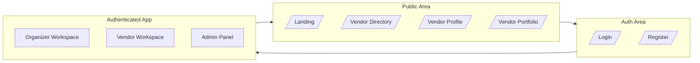
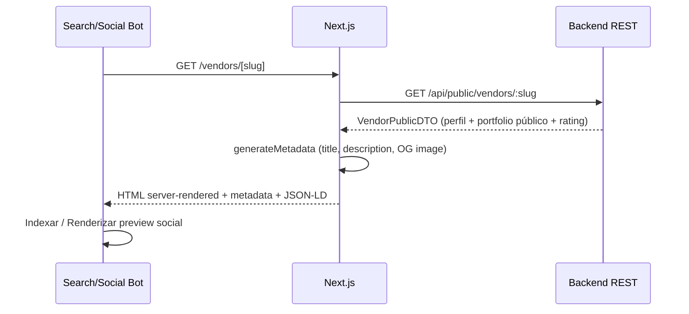
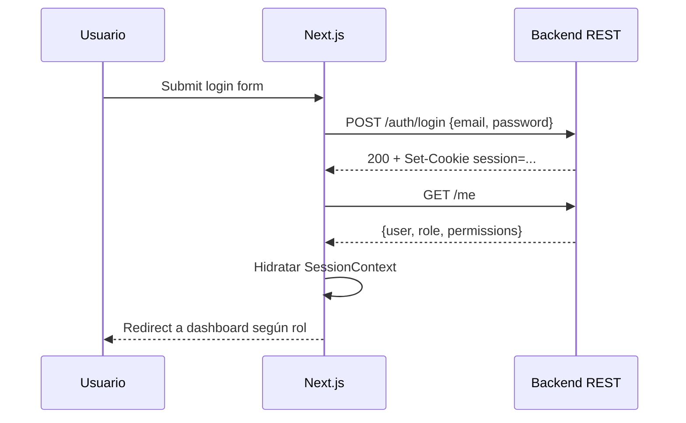
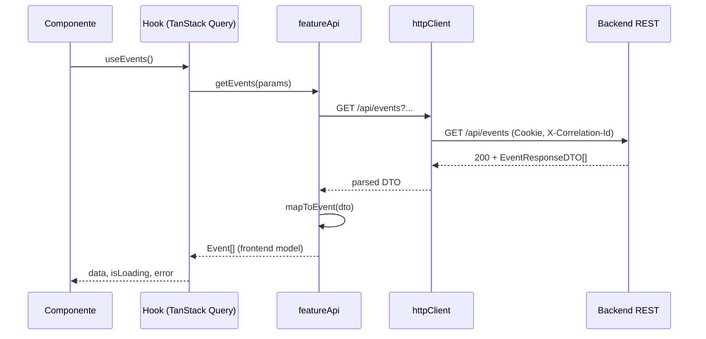
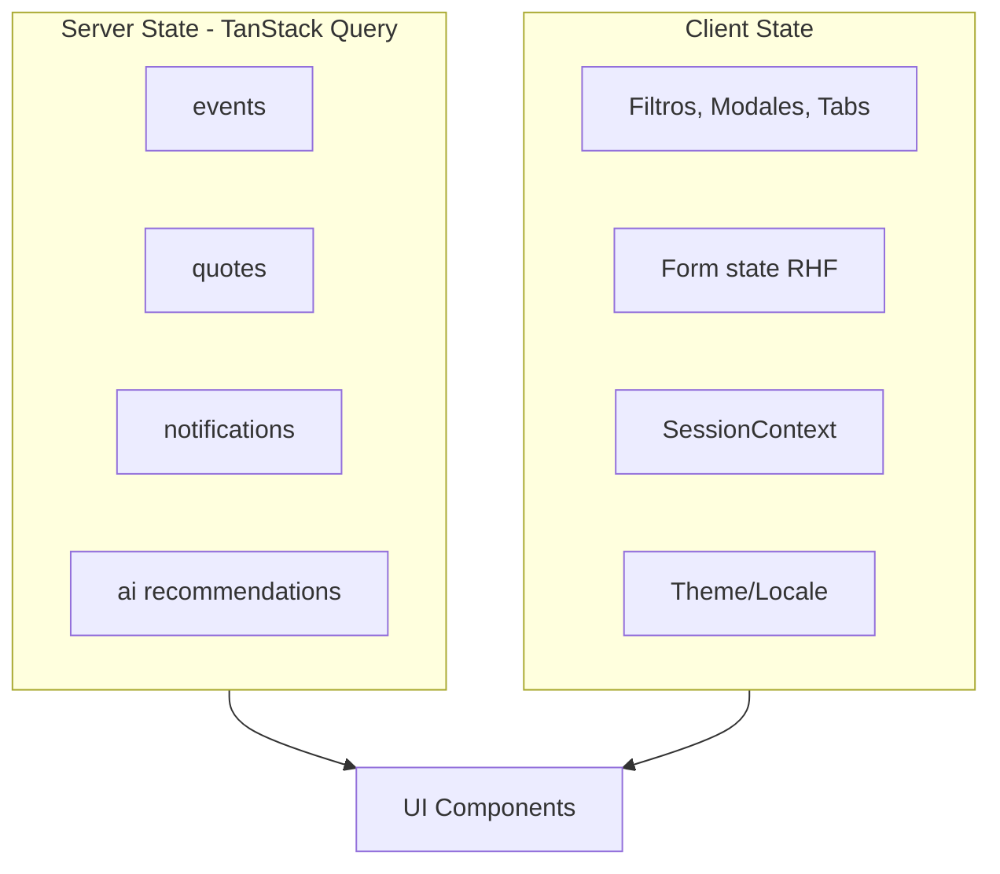
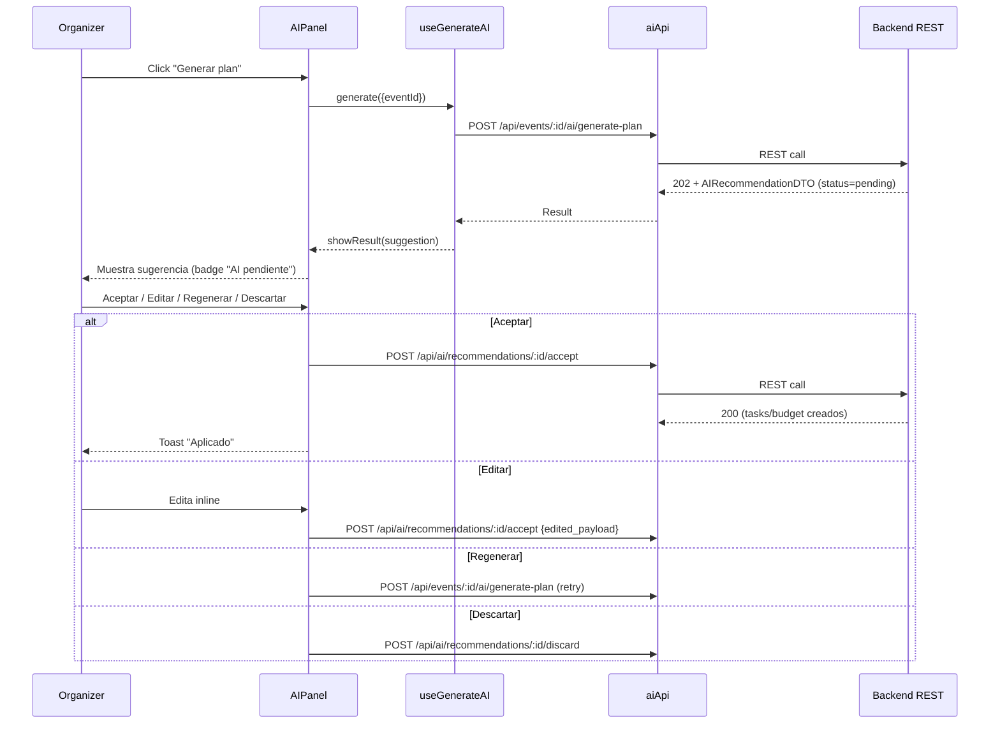
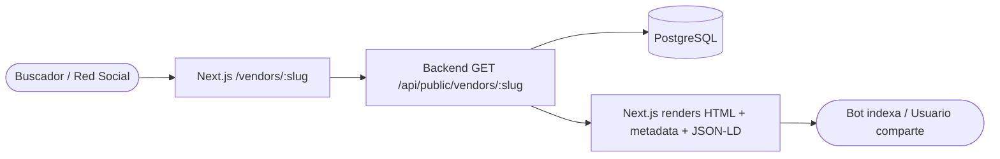

# EventFlow — Frontend Architecture Design Document

> **Versión:** 1.0
> **Fecha:** 2026-06-08
> **Producto:** EventFlow — plataforma asistida por IA para planificación de eventos y gestión simplificada de cotizaciones de proveedores.
> **MVP target:** AI-assisted event planning workspace + simplified vendor quote flow.
> **Idioma del documento:** Español LATAM neutral.
> **Estado:** Listo para guiar implementación frontend, generación de user stories, tareas de desarrollo, escenarios QA y prompts para agentes IA generadores de código.
> **Audiencia:** Frontend Engineers, Tech Lead, Software Architect, UX Engineers, QA, Product Owner, agentes IA generadores de código y evaluadores académicos.

---

## 1. Propósito del documento

Este documento traduce el **Architecture Vision & Principles** (`/docs/12-Architecture-Vision-and-Principles.md`), el **System Architecture Document** (`/docs/13-System-Architecture-Document.md`) y el **Backend Technical Design Document** (`/docs/14-Backend-Technical-Design.md`) en un **diseño técnico frontend concreto** para EventFlow.

Mientras la arquitectura describe **qué** se construye y el backend describe **cómo** se organiza el servidor, este documento describe **cómo** se organiza el frontend a nivel de:

* Decisión de stack (Next.js + TypeScript + App Router).
* Estrategia App Router, Server Components vs Client Components.
* Estructura feature-first y modularización.
* Áreas públicas SEO-ready vs áreas autenticadas.
* Integración REST con el backend.
* Estrategia de estado (server / client / form / sesión).
* UX asistida por IA con confirmación humana.
* i18n, currency, accesibilidad y responsive design.
* Testing, performance, seguridad UX y observabilidad cliente.
* Trazabilidad explícita a FRD, NFR, Use Cases, System Architecture y Backend Technical Design.

El documento es **entrada directa** para:

* `/docs/16-API-Design-Specification.md` (consumo frontend de contratos REST).
* `/docs/17-AI-Architecture-and-PromptOps-Design.md` (qué espera y muestra el frontend de la capa IA).
* `/docs/19-Security-and-Authorization-Design.md` (frontend como UX, backend como fuente de verdad).
* `/docs/20-Testing-Strategy.md` (testing frontend, MSW, Playwright, MockAIProvider).
* `/docs/22-Architecture-Decision-Records.md` (ADRs frontend recomendados).
* **User Stories**, **Backlog** y **Tareas frontend**.
* **AI coding agents** que generen código frontend a partir de esta especificación.

El documento **no** reemplaza la arquitectura ni el FRD: los complementa, agregando suficiente detalle para que un equipo de implementación pueda comenzar a codificar sin reinterpretar decisiones críticas del frontend.

---

## 2. Alcance del documento

### 2.1 Incluye

* Decisión arquitectónica frontend: Next.js + TypeScript + App Router.
* Principios de diseño frontend específicos para EventFlow.
* Estructura de carpetas feature-first.
* Routing, route groups y layout hierarchy.
* Public vs authenticated areas; SEO-ready public vendor architecture.
* Server Components vs Client Components strategy.
* Estrategia de autenticación, sesión y autorización UX.
* Integración REST con el backend modular monolith.
* DTOs, API clients, mappers, frontend models.
* Estrategia de estado: server (TanStack Query), client/UI, form (RHF + Zod), sesión.
* Data fetching, caching, invalidación y optimistic updates.
* Arquitectura de formularios y validación.
* Manejo de errores, empty states, loading states y skeletons.
* AI-assisted UX y human-in-the-loop patterns.
* i18n con next-intl y currency display sin conversión automática.
* Responsive design, accesibilidad y design system con Tailwind + design tokens.
* Page architecture por rol (organizer / vendor / admin) y por módulo MVP.
* Public SEO page architecture (vendor profile, portfolio, futuras categorías/ciudades).
* File upload / attachments, notification UI, observabilidad frontend.
* Testing frontend (Vitest + Testing Library + Playwright + MSW).
* Performance, environment configuration y demo readiness.
* Límites explícitos del MVP en frontend.
* Riesgos, ADRs recomendados, checklist y trazabilidad.

### 2.2 No incluye

Este documento **no** define:

* Wireframes ni mockups detallados (corresponde a UX Design / Figma).
* Catálogo completo de componentes UI con specs de píxeles (corresponde a Design System Detail).
* Contratos REST completos endpoint por endpoint (los cubre `/docs/16-API-Design-Specification.md`).
* Plantillas productivas de prompts IA (las cubre `/docs/17-AI-Architecture-and-PromptOps-Design.md`).
* DDL ni esquema físico de PostgreSQL (lo cubre el Database Physical Design).
* Implementación detallada del backend (la cubre `/docs/14-Backend-Technical-Design.md`).
* Pipelines CI/CD frontend específicos (DevOps Design).
* Plan exhaustivo de pruebas QA (Testing Strategy).
* Funcionalidades fuera del MVP: pagos, chat real-time, contratos firmados, WhatsApp, push, SMS, app móvil nativa, conversión automática de monedas, decisiones autónomas de IA.

---

## 3. Fuentes utilizadas

| Documento | Aporte al diseño frontend |
|---|---|
| `/docs/1-Domain-Discovery-Report.md` | Actores, vocabulario ubicuo y problemas de UX a resolver. |
| `/docs/2-Product-Owner-Decisions.md` | Restricciones de producto: sin pagos, sin chat, sin app nativa. |
| `/docs/3-MVP-Scope-Definition.md` | Frontera del MVP: planning workspace + simplified quote flow. |
| `/docs/4-Business-Rules-Document.md` | Reglas que el frontend visibiliza (límites, validity, currency lock, soft delete). |
| `/docs/5-User-Roles-Permissions-Matrix.md` | Roles, navegación y guardas UX por rol. |
| `/docs/6-Domain-Data-Model.md` | Entidades y relaciones que se mapean a frontend models. |
| `/docs/7-AI-Features-Specification.md` | Features IA y UX human-in-the-loop. |
| `/docs/8-Use-Cases-Specification.md` | Casos de uso que se traducen a páginas y flujos. |
| `/docs/8.1-Product-Owner-Decisions-Use-Cases-Addendum.md` | Refinamientos de use cases que impactan UX. |
| `/docs/8.2-Documentation-Alignment-Review-Before-FRD.md` | Alineación previa al FRD. |
| `/docs/9-Functional-Requirements-Document.md` | FR específicos que mapean a páginas, formularios y validaciones. |
| `/docs/10-Non-Functional-Requirements.md` | NFR: performance, accesibilidad, i18n, observabilidad, seguridad UX. |
| `/docs/11-Data-Seed-Strategy.md` | Soporte demo, `is_seed`, reset visible. |
| `/docs/12-Architecture-Vision-and-Principles.md` | Principios que el frontend respeta. |
| `/docs/13-System-Architecture-Document.md` | C4, contenedores, áreas funcionales del frontend. |
| `/docs/14-Backend-Technical-Design.md` | Módulos, use cases, DTOs, autorización, AI provider, notifications, attachments. |

---

## 4. Resumen ejecutivo de arquitectura frontend

EventFlow Frontend se diseña como:

```text
Next.js (App Router) + TypeScript
+ Server Components por defecto en rutas públicas SEO
+ Client Components donde se requiere interactividad/forms/estado
+ Feature-first folder structure
+ REST consumption via TanStack Query
+ React Hook Form + Zod para forms y validación
+ next-intl para i18n
+ Tailwind CSS + design tokens
+ MSW + Vitest + Testing Library + Playwright
+ Sin Server Actions (REST puro), sin API route handlers como BFF
```

**Por qué este diseño encaja con EventFlow:**

* **Next.js + App Router** permite combinar en un mismo proyecto:
  * **Áreas autenticadas** (organizer / vendor / admin workspaces) renderizadas mayoritariamente como Client Components con datos cargados via TanStack Query.
  * **Áreas públicas SEO-ready** (perfiles públicos de vendor, portafolios, futuras landing pages por categoría/ciudad) renderizadas como Server Components con metadata, Open Graph y soporte de indexación.
* **TypeScript** asegura contratos estables con el backend, especialmente al mapear DTOs.
* **TanStack Query** centraliza data fetching, cache, invalidación, optimistic updates y reintentos sin reinventar patrones.
* **React Hook Form + Zod** permiten formularios performantes y validación tipo-segura compartida.
* **next-intl** habilita los cuatro locales requeridos (`es-LATAM`, `es-ES`, `pt`, `en`) sin acoplar el código.
* **Tailwind + design tokens** ofrece un design system simple, consistente y rápido de implementar, sin overengineering.
* **MSW + Playwright** permiten testing E2E determinista usando los mismos mocks que el frontend, alineado con `MockAIProvider` del backend para demos.

**Lo que el frontend NO hace:**

* No es un BFF: no llama directamente a OpenAI, Anthropic, PostgreSQL ni a servicios de almacenamiento.
* No reimplementa lógica de negocio: solo la visibiliza, valida en el borde UX y delega al backend.
* No es la fuente de verdad de autorización: el RBAC + ownership viven en el backend; el frontend lo refleja como UX.
* No transforma monedas automáticamente.
* No permite que sugerencias IA se conviertan en datos oficiales sin confirmación humana explícita.

---

## 5. Decisión arquitectónica frontend principal

> **Decisión cerrada**: el frontend de EventFlow se construye con **Next.js + TypeScript + App Router**.

Justificación resumida (ampliada en §8 y §9):

1. **EventFlow tiene dos naturalezas simultáneas:**
   * Una aplicación SaaS autenticada (workspace de planificación + flujo de cotizaciones).
   * Un futuro **directorio público SEO-ready** de proveedores con perfiles y portafolios compartibles por URL.
2. Una SPA pura (React + Vite) resolvería bien la primera naturaleza pero **bloquearía o complicaría** la segunda (SEO, metadata dinámica por vendor, Open Graph, indexación, SSR/SSG selectivo).
3. **Next.js App Router** permite:
   * Server Components para páginas públicas con metadata y SSR/SSG selectivo.
   * Client Components donde la interactividad lo exige (forms, drag-and-drop, AI flows).
   * Route groups (`(public)`, `(app)`, `(admin)`) con layouts independientes.
   * Middleware para protección de rutas a nivel edge.
4. Esto **no compromete** el principio de "backend como fuente de verdad": Next.js se usa como **renderer y router**, no como BFF. **No usamos Server Actions ni API Routes** (excepto utilitarias mínimas si fueran necesarias para health-checks o webhooks no funcionales del MVP, lo cual hoy no aplica).

Esta decisión es **vinculante** para todo el documento y para futuros ADRs.

---

## 6. Principios de diseño frontend

| # | Principio | Significado | Implicación frontend | Ejemplo EventFlow |
|---|---|---|---|---|
| 1 | Backend como fuente de verdad | El backend impone reglas, autorización y persistencia. | El frontend nunca asume permisos: valida UX pero confía en respuestas del backend. | Si un organizer manipula DOM y hace click en "aprobar vendor", el backend devuelve 403; el frontend muestra mensaje sin romper. |
| 2 | Feature-first organization | Carpetas por dominio, no por capa técnica. | `features/events/`, `features/quotes/`, `features/ai-assistance/` con su propio UI, hooks, API client y types. | El módulo `quote-flow` agrupa `QuoteRequestList`, `useQuoteRequests`, `quoteRequestApi`, `quoteRequestMappers`. |
| 3 | SEO-aware por defecto en áreas públicas | Las páginas públicas se diseñan para indexación y compartibilidad. | Server Components, metadata dinámica, Open Graph, sitemap, robots. | `/vendors/[slug]` renderiza server-side con metadata específica del vendor. |
| 4 | Human-in-the-loop AI | Toda sugerencia IA requiere confirmación humana antes de oficializarse. | La UI distingue siempre "sugerencia IA pendiente" vs "dato oficial". | Tras `Generate Event Plan`, el organizer ve un panel de revisión con accept / edit / regenerate / discard. |
| 5 | UX progressive disclosure | Mostrar primero lo importante, ocultar complejidad opcional. | Forms multi-paso para creación de eventos; tablas con filtros colapsables. | Crear evento usa wizard: básicos → currency → fecha → resumen. |
| 6 | Loading, empty, error, success siempre | Cada vista cubre los cuatro estados. | Skeletons, empty-state components, error boundaries y toasts de éxito. | `EventListPage` muestra skeleton → empty con CTA → lista. |
| 7 | i18n by design | Toda copy es traducible y locale-aware. | Sin strings hardcoded; locale gestionado por `next-intl`. | `t('events.create.title')`. |
| 8 | Currency lock visible | La moneda del evento es inmutable post-creación. | UI muestra moneda con tooltip explicativo y deshabilita edición. | Después de crear evento en `USD`, el selector queda disabled con texto i18n. |
| 9 | Accesibilidad WCAG AA mínima | Contraste, foco visible, navegación por teclado, ARIA correcto. | Componentes base accesibles; tests automatizados de a11y. | Modals con focus trap; botones IA con `aria-live` para estados. |
| 10 | Performance perceived first | Optimización percibida con skeletons, optimistic UI y prefetch. | Prefetch en navegación; optimistic updates en interacciones de baja consecuencia. | Marcar task como done actualiza UI antes de la confirmación del backend. |
| 11 | Test-friendly architecture | Cada módulo es testeable de forma aislada. | Componentes presentacionales puros; hooks con MSW. | `useEvents` se testea con MSW handlers; `EventCard` con Testing Library. |
| 12 | Observabilidad cliente mínima viable | Errores y eventos críticos quedan trazables. | Error boundaries con logging; correlation IDs propagados. | Si IA timeouts, frontend registra evento `ai.timeout` con eventId. |
| 13 | No overengineering | Preferir simplicidad. Postergar Redux, GraphQL, microfrontends. | TanStack Query + Context API + RHF cubren el MVP. | No hay Redux Toolkit, no hay Zustand, no hay Apollo. |
| 14 | Demo-readiness | El frontend debe demostrarse end-to-end con seed + MockAIProvider. | `NEXT_PUBLIC_DEMO_MODE` flag activa banners y datos seed. | En modo demo, badge "Datos de demostración" en topbar. |
| 15 | No out-of-scope features | El frontend no implementa pagos, chat, WhatsApp, etc. | No hay rutas ni componentes para esas capacidades. | No existe `/checkout`, `/messages`, `/whatsapp-connect`. |

---

## 7. Stack frontend definido

| Concern | Tecnología | Versión objetivo MVP | Justificación |
|---|---|---|---|
| Framework | Next.js | 14.x o superior con App Router estable | Soporta áreas públicas SEO + dashboards privados. |
| Lenguaje | TypeScript | 5.x | Type-safety end-to-end con DTOs del backend. |
| Routing | Next.js App Router | nativo | Route groups, layouts anidados, middleware. |
| Server state | TanStack Query (React Query) | 5.x | Cache, invalidación, optimistic, retries, devtools. |
| Forms | React Hook Form | 7.x | Performante, integrable con Zod. |
| Validation | Zod | 3.x | Schemas compartidos UI + DTO mapping. |
| i18n | next-intl | 3.x | Soporta App Router, RSC y formatos locale-aware. |
| Styling | Tailwind CSS | 3.x | Utility-first, design tokens via `tailwind.config.ts`. |
| Componentes base | Headless UI + Radix UI primitives (selectivo) | últimas estables | Accesibilidad robusta out-of-the-box. |
| Iconos | lucide-react | última estable | Tree-shakeable, consistente. |
| Testing unitario/componente | Vitest + Testing Library | últimas estables | Rápido, ESM-friendly. |
| E2E | Playwright | última estable | Multi-browser, traces, paralelización. |
| Mocking API | MSW (Mock Service Worker) | 2.x | Mismos handlers en tests y demo. |
| Lint/Format | ESLint + Prettier | últimas estables | Standard. |
| Gestión paquetes | pnpm (preferido) o npm | latest | Performance, monorepo-ready. |
| Runtime config | Variables de entorno | — | `NEXT_PUBLIC_*` para cliente, server-only para sensibles. |
| Logging cliente | Console estructurado + opt-in a Sentry (Future) | — | MVP usa logger interno; observabilidad full es Future. |
| Date/time | date-fns | última estable | Liviano, treeshake, locale-aware. |
| Tablas/listas grandes | TanStack Table (selectivo) | 8.x | Solo donde se justifique (admin, vendor directory). |

Cualquier dependencia adicional debe justificarse en un ADR.

---

## 8. Justificación de Next.js para EventFlow

EventFlow tiene **dos naturalezas** que conviven en el mismo dominio:

1. **Aplicación SaaS autenticada**: workspace de planificación de eventos, dashboard de vendors, panel admin. Requiere interactividad rica, forms complejos, AI flows con human-in-the-loop, drag-and-drop ligero, notifications in-app, etc.
2. **Plataforma pública SEO-ready**: aunque el MVP enfoca el workspace autenticado, el dominio (directorio de proveedores de servicios para eventos) **naturalmente evoluciona** hacia un buscador público de vendors donde:
   * Cada vendor tiene una URL pública compartible (`/vendors/[slug]`).
   * Cada portfolio item puede tener su URL pública (`/vendors/[slug]/portfolio/[workSlug]`).
   * Existen futuras landings por categoría (`/services/[categorySlug]`) y por ciudad (`/services/[categorySlug]/[citySlug]`).
   * SEO, metadata, Open Graph, sitemap y rich previews son **diferenciadores de negocio**, no detalles técnicos.

Una SPA tradicional (React + Vite) resuelve bien la naturaleza (1) pero **no es la mejor herramienta para (2)** sin agregar SSR/SSG manualmente, lo que termina recreando lo que Next.js ya ofrece de forma idiomática.

**Beneficios concretos de Next.js + App Router para EventFlow:**

| Beneficio | Aplicación en EventFlow |
|---|---|
| Server Components | Páginas públicas de vendor profile/portfolio renderizan en servidor con datos REST. |
| Metadata API | `generateMetadata` por vendor profile (title, description, OG image). |
| Static / Dynamic rendering selectivo | Vendor profile puede ser ISR; dashboards son dinámicos. |
| Route groups | `(public)`, `(app)`, `(admin)` con layouts y middleware diferenciados. |
| Middleware | Protección de `(app)` y `(admin)` vía session check antes de renderizar. |
| Loading UI nativa | `loading.tsx` por ruta da skeletons sin código extra. |
| Error boundaries por segmento | `error.tsx` aísla fallos por sección. |
| Imágenes optimizadas | `next/image` para portfolio media. |
| Sitemap y robots nativos | `app/sitemap.ts` y `app/robots.ts`. |
| Internacionalización | `next-intl` integra de forma idiomática con App Router. |
| Streaming | Posible para listas largas del vendor directory (futuro). |

**Lo que Next.js NO hace en EventFlow:**

* **No reemplaza al backend**. No es un BFF: no llama a OpenAI/Anthropic, no toca PostgreSQL, no genera reportes.
* **No usa Server Actions**. Toda mutación va vía REST al backend modular monolith. Esto preserva la frontera y permite que el backend sea el contrato único.
* **No usa API Routes como BFF**. El frontend habla directo al backend REST por `NEXT_PUBLIC_API_BASE_URL` (o vía rewrites/proxies en producción si la red lo exige, pero sin lógica de negocio).
* **No reemplaza la autorización**. El middleware solo redirige; la decisión final viene del backend.

---

## 9. Alternativas evaluadas y descartadas

| Alternativa | Por qué se evaluó | Por qué se descartó |
|---|---|---|
| **React + Vite (SPA pura)** | Stack moderno, rápido en desarrollo, simple. | Sin SSR/SSG nativos; SEO de perfiles públicos de vendor requeriría prerendering manual o Vite SSR experimental, recreando capacidades de Next.js. Bloquea/complica la evolución a directorio público. |
| **Remix** | Buen soporte de loaders/actions y forms progresivos. | Curva de aprendizaje del modelo loader/action; menos ecosistema para algunos requisitos (next-intl, dev experience del equipo). App Router de Next ofrece capacidades similares y es más ampliamente conocido por el equipo y los agentes IA. |
| **Astro** | Excelente para sitios estáticos + islands. | EventFlow tiene áreas autenticadas con alta interactividad; Astro brilla más en sitios estáticos/marketing, no en dashboards SaaS. |
| **Next.js Pages Router** | Conocido y estable. | App Router es la dirección oficial; Server Components, layouts anidados y route groups son superiores para la dualidad pública/privada de EventFlow. |
| **GraphQL + Apollo** | Tipado fuerte y queries flexibles. | Backend es REST (decisión cerrada). Introducir GraphQL solo en frontend agregaría capa innecesaria. |
| **Redux Toolkit / Zustand** como store global | Modelo familiar. | TanStack Query cubre 90% (server state); el resto (UI state local) cabe en Context API + useState/useReducer. Sin justificación para overhead adicional. |
| **Server Actions de Next.js** | Reducirían boilerplate de mutaciones. | Romperían la frontera REST y mezclarían responsabilidades. Mantener REST puro hace al backend la única superficie de contrato. |

---

## 10. Arquitectura frontend general

### 10.1 Diagrama de contenedores frontend

```mermaid
flowchart LR
  USER([Usuario]) --> BROWSER[Browser]

  subgraph NEXT[Next.js App]
    direction TB
    APPROUTER[App Router]
    MIDDLEWARE[Middleware]
    PUB[(public) Route Group]
    APP[(app) Route Group]
    ADMIN[(admin) Route Group]
    LAYOUTS[Layouts]
    UI[UI Components]
    FEATURES[Feature Modules]
    HOOKS[Hooks Layer]
    APICLIENT[REST API Client]
    QUERY[TanStack Query Cache]
    I18N[next-intl]
    DESIGN[Design Tokens / Tailwind]
  end

  BROWSER --> APPROUTER
  APPROUTER --> MIDDLEWARE
  APPROUTER --> PUB
  APPROUTER --> APP
  APPROUTER --> ADMIN
  PUB --> LAYOUTS
  APP --> LAYOUTS
  ADMIN --> LAYOUTS
  LAYOUTS --> FEATURES
  FEATURES --> UI
  FEATURES --> HOOKS
  HOOKS --> QUERY
  HOOKS --> APICLIENT
  FEATURES --> I18N
  UI --> DESIGN

  APICLIENT --> BACKEND[(EventFlow REST API)]
  BACKEND --> DB[(PostgreSQL)]
  BACKEND --> LLM[LLMProvider]
```

### 10.2 Vista por capas conceptuales

El frontend se organiza en **capas conceptuales** que conviven dentro de cada feature module:

1. **Routing Layer (Next.js App Router)**: `app/` con route groups y layouts.
2. **Presentation Layer**: páginas, layouts, componentes presentacionales puros.
3. **Feature Layer**: módulos por dominio (`features/events`, `features/quotes`, etc.) que orquestan UI + hooks + API.
4. **Application/Hooks Layer**: hooks de TanStack Query, hooks de UI compartidos.
5. **API Client Layer**: clientes REST tipados por módulo.
6. **Mapper Layer**: conversión DTO ↔ Frontend Model.
7. **Frontend Models / Types**: representaciones tipadas que la UI consume.
8. **Shared / Cross-cutting**: i18n, design system, auth, error handling, observability hooks.

Las dependencias fluyen así:

```text
Routing → Pages → Features → Hooks → API Client → Backend REST
                       ↘ UI Components ↗
                       ↘ Design System ↗
```

---

## 11. Next.js App Router strategy

| Capacidad App Router | Decisión EventFlow | Notas |
|---|---|---|
| Route groups | **Sí**: `(public)`, `(app)`, `(admin)`. | Permite layouts y middleware independientes. |
| Layouts anidados | **Sí**, por área y por rol. | `app/(app)/organizer/layout.tsx`, etc. |
| `loading.tsx` | **Sí** por segmento crítico. | Estandariza skeletons. |
| `error.tsx` | **Sí** por segmento. | Captura errores y permite reset. |
| `not-found.tsx` | **Sí** global + por segmento donde aplique. | 404 i18n. |
| Metadata API | **Sí**, especialmente en `(public)`. | `generateMetadata` para vendor profile. |
| `sitemap.ts` / `robots.ts` | **Sí**, alimentados desde el backend (vendors públicos). | MVP: vendor directory mínimo. |
| Server Components | **Sí**, por defecto en `(public)`. | En `(app)` y `(admin)` predomina Client Components. |
| Client Components | **Sí**, marcadas con `'use client'`. | Para forms, AI flows, TanStack Query, interacciones. |
| Server Actions | **No** en MVP. | Mutaciones van vía REST al backend. |
| API Route Handlers (`app/api/*`) | **No** funcionales en MVP. | Reservado para utilidades técnicas no de negocio (p. ej. health-check del front si fuera necesario en el futuro). |
| Middleware (`middleware.ts`) | **Sí**, para auth/session y locale. | Redirige `(app)` y `(admin)` si no hay sesión. |
| Streaming | **No** prioritario en MVP. | Posible para vendor directory en Future. |
| Parallel routes / Intercepting routes | **Postergado**. | Solo si aparece un caso real (p. ej. modal de detalle sobre lista). No MVP. |

### 11.1 Jerarquía de rutas propuesta

```mermaid
flowchart TD
  ROOT[app/]
  ROOT --> PUBLIC[ (public)/ ]
  ROOT --> APP[ (app)/ ]
  ROOT --> ADMIN[ (admin)/ ]
  ROOT --> AUTH[ (auth)/ ]

  PUBLIC --> LANDING[ / ]
  PUBLIC --> VENDORS_DIR[ /vendors ]
  PUBLIC --> VENDOR_SLUG[ /vendors/:vendorSlug ]
  VENDOR_SLUG --> PORTFOLIO[ /portfolio ]
  PORTFOLIO --> WORK[ /:workSlug ]
  PUBLIC --> SERVICES_CAT[ /services/:categorySlug (Future) ]
  SERVICES_CAT --> SERVICES_CITY[ /:citySlug (Future) ]

  AUTH --> LOGIN[ /login ]
  AUTH --> REGISTER[ /register ]
  AUTH --> FORGOT[ /forgot-password ]

  APP --> ORG[ /organizer ]
  ORG --> ORG_EVENTS[ /events ]
  ORG_EVENTS --> ORG_EVENT_ID[ /:eventId ]
  ORG_EVENT_ID --> ORG_AI[ /ai ]
  ORG_EVENT_ID --> ORG_TASKS[ /tasks ]
  ORG_EVENT_ID --> ORG_BUDGET[ /budget ]
  ORG_EVENT_ID --> ORG_QR[ /quote-requests ]
  ORG --> ORG_PROFILE[ /profile ]
  ORG --> ORG_NOTIF[ /notifications ]

  APP --> VEN[ /vendor ]
  VEN --> VEN_PROFILE[ /profile ]
  VEN --> VEN_PORTFOLIO[ /portfolio ]
  VEN --> VEN_QUOTES[ /quote-requests ]
  VEN --> VEN_REVIEWS[ /reviews ]
  VEN --> VEN_NOTIF[ /notifications ]

  ADMIN --> ADMIN_VENDORS[ /vendors ]
  ADMIN --> ADMIN_REVIEWS[ /reviews ]
  ADMIN --> ADMIN_SEED[ /seed ]
  ADMIN --> ADMIN_USERS[ /users ]
```

---

## 12. Server Components vs Client Components strategy

| Área | Default | Justificación |
|---|---|---|
| `(public)/` (vendor profile, portfolio, landing) | **Server Components** | SEO, metadata, datos públicos del backend. |
| `(public)/vendors` directorio | **Server Components** (lista) + Client Component (filtros). | Filtros interactivos requieren cliente. |
| `(auth)/` login/register | **Client Components** | Forms con RHF + Zod. |
| `(app)/organizer/*`, `(app)/vendor/*` | **Client Components** predominante | Forms, AI, TanStack Query, interactividad. |
| `(admin)/*` | **Client Components** | Tablas con filtros, acciones admin. |
| Layouts | **Server Components** salvo necesidad explícita | Reciben children; pasan locale, theme. |
| `loading.tsx`, `error.tsx`, `not-found.tsx` | **Server o Client según contenido** | Si solo presentacional → Server. Si interactivo → Client. |

**Reglas concretas:**

* Marcar `'use client'` **solo en el componente más cercano que lo necesita**, no en el layout completo.
* Hooks de TanStack Query, RHF y context viven en Client Components.
* Fetch de datos en `(public)` se hace dentro del Server Component vía `fetch` al backend con `revalidate` ISR cuando aplique.
* Fetch en `(app)` y `(admin)` se hace vía TanStack Query (cliente) con `Authorization` header.

---

## 13. Public vs authenticated frontend areas



### 13.1 Áreas públicas (no autenticadas)

* Renderizadas predominantemente **server-side**.
* Pueden indexarse por motores de búsqueda.
* **No exponen** datos privados de organizers (eventos, tasks, budget, quote requests, reviews privadas, datos de contacto sin consentimiento).
* Solo exponen datos que el backend marca como **públicos**: `Vendor.public_profile`, `Vendor.portfolio_items` con flag público, ratings agregados públicos.

### 13.2 Áreas autenticadas

* Protegidas por **middleware** que valida sesión.
* Layout específico por rol (`organizer`, `vendor`, `admin`).
* Datos cargados client-side vía TanStack Query con token de sesión.
* Backend valida cada request (frontend guard es UX, no seguridad).

---

## 14. SEO-ready public vendor architecture

### 14.1 Estructura de rutas públicas

| Ruta | Estado MVP | Render | Indexable |
|---|---|---|---|
| `/` (landing) | MVP (mínimo) | Server, estático | Sí |
| `/vendors` (directorio) | MVP | Server + filtros client | Sí |
| `/vendors/[vendorSlug]` (perfil público) | **MVP** | Server, ISR (revalidate 60s o on-demand) | Sí |
| `/vendors/[vendorSlug]/portfolio` | **MVP** mínimo (placeholder si no hay items) | Server, ISR | Sí |
| `/vendors/[vendorSlug]/portfolio/[workSlug]` | **Should Have** | Server, ISR | Sí |
| `/services/[categorySlug]` | **Future** | Server, ISR/SSG | Sí |
| `/services/[categorySlug]/[citySlug]` | **Future** | Server, ISR/SSG | Sí |
| `/blog` o `/content/*` | **Out of Scope MVP** | — | — |

### 14.2 Reglas SEO

* **Slugs** estables provistos por backend (`vendor.slug`, `portfolio_item.slug`).
* **`generateMetadata`** por página dinámica con title, description y OG image (URL desde backend).
* **`sitemap.ts`** consulta endpoint backend (`GET /vendors/public/sitemap`) que devuelve solo vendors aprobados.
* **`robots.ts`** permite `(public)` y `Disallow` `(app)` y `(admin)`.
* **JSON-LD** estructurado para `LocalBusiness` o `Service` en perfil de vendor (Should Have MVP).
* **Open Graph y Twitter Cards** para previews al compartir URLs.
* **Canonical URLs** para evitar duplicación por locale.

### 14.3 Diagrama de flujo SEO para vendor profile



### 14.4 Privacidad en áreas públicas

* **Nunca** se expone: emails de organizers, contenido de quote requests, montos de cotizaciones, comentarios internos, datos personales de organizers ni de bookings.
* El endpoint `GET /api/public/vendors/:slug` del backend **filtra** y devuelve solo campos públicos.
* Reviews públicas son **agregadas** (rating, count) y/o anonimizadas según `Review.is_public`.

---

## 15. Estructura de carpetas propuesta

```text
/frontend
├── app/
│   ├── layout.tsx
│   ├── globals.css
│   ├── sitemap.ts
│   ├── robots.ts
│   ├── (public)/
│   │   ├── layout.tsx
│   │   ├── page.tsx                            # Landing
│   │   ├── vendors/
│   │   │   ├── page.tsx                        # Directorio
│   │   │   └── [vendorSlug]/
│   │   │       ├── page.tsx                    # Perfil público
│   │   │       └── portfolio/
│   │   │           ├── page.tsx
│   │   │           └── [workSlug]/page.tsx     # Should Have
│   │   └── services/                            # Future
│   ├── (auth)/
│   │   ├── layout.tsx
│   │   ├── login/page.tsx
│   │   ├── register/page.tsx
│   │   └── forgot-password/page.tsx
│   ├── (app)/
│   │   ├── layout.tsx
│   │   ├── organizer/
│   │   │   ├── layout.tsx
│   │   │   ├── page.tsx                        # Dashboard organizer
│   │   │   ├── profile/page.tsx
│   │   │   ├── notifications/page.tsx
│   │   │   └── events/
│   │   │       ├── page.tsx                    # Listado eventos
│   │   │       ├── new/page.tsx                # Crear evento (wizard)
│   │   │       └── [eventId]/
│   │   │           ├── page.tsx
│   │   │           ├── ai/page.tsx
│   │   │           ├── tasks/page.tsx
│   │   │           ├── budget/page.tsx
│   │   │           └── quote-requests/
│   │   │               ├── page.tsx
│   │   │               └── [quoteRequestId]/page.tsx
│   │   └── vendor/
│   │       ├── layout.tsx
│   │       ├── page.tsx                        # Dashboard vendor
│   │       ├── profile/page.tsx
│   │       ├── portfolio/page.tsx
│   │       ├── quote-requests/
│   │       │   ├── page.tsx
│   │       │   └── [quoteRequestId]/page.tsx
│   │       ├── reviews/page.tsx
│   │       └── notifications/page.tsx
│   ├── (admin)/
│   │   ├── layout.tsx
│   │   ├── page.tsx                            # Admin dashboard
│   │   ├── vendors/page.tsx                    # Aprobación vendors
│   │   ├── reviews/page.tsx                    # Moderación
│   │   ├── users/page.tsx
│   │   └── seed/page.tsx                       # Demo seed controls
│   ├── middleware.ts                            # Auth + locale
│   └── not-found.tsx
├── features/
│   ├── auth/
│   │   ├── api/
│   │   ├── components/
│   │   ├── hooks/
│   │   ├── schemas/                            # Zod
│   │   ├── mappers/
│   │   └── types/
│   ├── events/
│   ├── ai-assistance/
│   ├── tasks/
│   ├── budget/
│   ├── vendor-profile/
│   ├── vendor-directory/
│   ├── quote-requests/
│   ├── quotes/
│   ├── booking-intent/
│   ├── reviews/
│   ├── notifications/
│   ├── user-profile/
│   ├── admin/
│   └── seed-demo/
├── shared/
│   ├── api-client/                             # Axios/fetch wrapper + interceptors
│   ├── design-system/                          # Componentes base
│   ├── design-tokens/
│   ├── hooks/
│   ├── i18n/                                   # next-intl config + messages
│   ├── lib/                                    # Utils (date, currency display, slug)
│   ├── observability/
│   ├── providers/                              # QueryProvider, IntlProvider, ThemeProvider
│   ├── auth-session/                           # SessionContext, useSession
│   ├── authorization/                          # Role + ownership guards UX
│   └── error-handling/
├── tests/
│   ├── e2e/                                    # Playwright
│   ├── unit/                                   # Vitest
│   ├── integration/
│   └── msw/                                    # Handlers compartidos
├── public/                                     # Assets estáticos
├── messages/                                   # Catálogos i18n: es-LATAM.json, es-ES.json, pt.json, en.json
├── next.config.mjs
├── tailwind.config.ts
├── tsconfig.json
├── package.json
└── .env.local.example
```

---

## 16. Feature-first architecture

Cada módulo en `/features/<feature>/` sigue esta estructura interna:

```text
features/events/
├── api/
│   ├── eventsApi.ts                # Cliente REST tipado
│   └── eventsApi.types.ts          # DTOs request/response (espejo backend)
├── components/
│   ├── EventCard.tsx
│   ├── EventList.tsx
│   ├── EventCreateWizard.tsx
│   └── EventDetailHeader.tsx
├── hooks/
│   ├── useEvents.ts                # TanStack Query
│   ├── useEvent.ts
│   ├── useCreateEvent.ts           # mutation
│   └── useUpdateEvent.ts
├── schemas/
│   └── eventSchemas.ts             # Zod
├── mappers/
│   └── eventMappers.ts             # DTO ↔ Frontend Model
├── types/
│   └── event.ts                    # Frontend Model (Event, EventStatus, etc.)
├── pages/                          # Componentes que arman la página (consumidos por app/.../page.tsx)
│   ├── EventsListPage.tsx
│   ├── EventDetailPage.tsx
│   └── EventCreatePage.tsx
└── index.ts                        # Public API del módulo
```

**Reglas de feature-first:**

1. **No cross-feature imports profundos**: una feature solo expone su API pública vía `index.ts`.
2. **No duplicar tipos**: tipos compartidos (`UserId`, `Currency`) viven en `shared/lib/types`.
3. **API client por feature**: cada feature tiene su `*Api.ts` que delega en `shared/api-client/httpClient`.
4. **Mappers obligatorios**: ningún componente consume directamente DTOs del backend; siempre pasa por mapper.
5. **Pages consumen features**: `app/(app)/organizer/events/page.tsx` importa `<EventsListPage />` de `features/events`.

---

## 17. Routing architecture

| Aspecto | Decisión |
|---|---|
| Sistema | Next.js App Router con route groups. |
| Locale | Manejado por middleware + `next-intl`. Patrón `/[locale]/...` opcional o detección por header/cookie. **MVP**: detección por cookie/header, sin prefijo en URL para evitar fragmentar SEO. Decisión a confirmar en ADR. |
| Slugs públicos | Provenientes del backend; estables; sin caracteres especiales. |
| IDs en rutas privadas | UUIDs en URL (`/organizer/events/:eventId`); aceptable porque no son indexables. |
| Wildcards / catch-all | Solo `not-found.tsx` y `[...slug]` evitados salvo necesidad. |
| Query params | Para filtros y paginación (`?status=draft&page=2`). |
| Estado de modales | Preferir state local o `?modal=create-event` cuando deba ser linkeable. |

---

## 18. Route groups y layout hierarchy

```text
app/
├── layout.tsx                # RootLayout: <html>, <body>, providers globales
├── (public)/layout.tsx       # PublicLayout: header público, footer público
│   └── vendors/[vendorSlug]/layout.tsx   # VendorPublicLayout: banner + tabs
├── (auth)/layout.tsx         # AuthLayout: minimal, branding
├── (app)/layout.tsx          # AppLayout: requiere sesión, topbar, locale
│   ├── organizer/layout.tsx  # OrganizerLayout: sidebar organizer
│   └── vendor/layout.tsx     # VendorLayout: sidebar vendor
└── (admin)/layout.tsx        # AdminLayout: requiere rol admin, sidebar admin
```

**Reglas:**

* `RootLayout` instala providers globales: `QueryClientProvider`, `IntlProvider`, `SessionProvider`, `ThemeProvider`, `ToastProvider`, `ErrorBoundary` raíz.
* Cada route group puede tener su `loading.tsx`, `error.tsx`, `not-found.tsx` y `template.tsx` (si se requiere re-mount).
* Los layouts privados consultan `useSession()` (Client) o validan en middleware (preferido).

---

## 19. Layout architecture

| Layout | Contenido | Notas |
|---|---|---|
| `RootLayout` | `<html lang>`, providers, fonts, global CSS. | Server Component. |
| `PublicLayout` | Header con logo + nav (Directorio, Login, Register, locale switcher). Footer público. | Server Component salvo locale switcher (Client). |
| `VendorPublicLayout` | Hero del vendor, tabs (Perfil, Portfolio, Reviews públicas). | Server Component. |
| `AuthLayout` | Card centrado, branding, switcher de locale. | Client Components dentro. |
| `AppLayout` | Topbar con notifications, profile menu, locale switcher; sidebar contextual. | Client donde se requiera. |
| `OrganizerLayout` | Sidebar: Eventos, Perfil, Notificaciones. | — |
| `VendorLayout` | Sidebar: Mi perfil, Portfolio, Cotizaciones, Reviews, Notificaciones. | — |
| `AdminLayout` | Sidebar: Aprobación vendors, Moderación reviews, Usuarios, Seed/Demo. | — |

---

## 20. Navegación por rol

### 20.1 Organizer

* **Top-level**: Eventos · Notificaciones · Perfil.
* Dentro del evento: AI · Tasks · Budget · Quote Requests.
* No ve: panel admin, listado de vendors privado de otros organizers.

### 20.2 Vendor

* **Top-level**: Dashboard · Mi perfil · Portfolio · Cotizaciones · Reviews · Notificaciones.
* No ve: eventos de organizers (solo briefs de quote requests que le fueron enviados).

### 20.3 Admin

* **Top-level**: Aprobación vendors · Moderación reviews · Usuarios · Seed/Demo · Logs (Future).
* No ve: workspace de organizer/vendor (puede impersonar vía endpoint admin si se habilita; Future).

### 20.4 Tabla de visibilidad

| Sección | Organizer | Vendor | Admin | Público |
|---|---|---|---|---|
| Landing | ✅ | ✅ | ✅ | ✅ |
| Vendor directory | ✅ | ✅ | ✅ | ✅ |
| Vendor public profile | ✅ | ✅ | ✅ | ✅ |
| Login / Register | ✅ | ✅ | ✅ | ✅ |
| Organizer workspace | ✅ | ❌ | ❌ | ❌ |
| Vendor workspace | ❌ | ✅ | ❌ | ❌ |
| Admin panel | ❌ | ❌ | ✅ | ❌ |
| Notifications | ✅ (propias) | ✅ (propias) | ✅ (propias) | ❌ |

---

## 21. Autenticación y sesión

### 21.1 Modelo

* Autenticación: el frontend hace `POST /auth/login` con email+password al backend.
* Backend retorna **JWT** o **session token** + datos básicos del usuario y rol.
* El frontend almacena el token en **cookie HTTP-only** (preferido, gestionado por el backend) **o** en memoria + refresh, según decisión del Security Design.
* **MVP recomendado**: cookie HTTP-only `Secure; SameSite=Lax`, emitida por el backend; el frontend NO lee tokens del DOM ni del localStorage.
* Para llamadas REST desde el cliente, el navegador envía la cookie automáticamente (mismo dominio o vía CORS con credentials).

### 21.2 Sesión en el frontend

* `SessionContext` provee: `user`, `role`, `permissions`, `isAuthenticated`, `locale`.
* Hidratado en el primer render: el middleware o un endpoint `GET /me` retorna el usuario.
* En Server Components, `cookies()` permite leer el indicador de sesión.

### 21.3 Logout

* `POST /auth/logout` invalida la cookie en el backend.
* Frontend limpia `SessionContext` y redirige a `/login`.

### 21.4 Middleware

```text
middleware.ts
- Si ruta ∈ (app) y no hay cookie de sesión → redirect /login?from=...
- Si ruta ∈ (admin) y rol ≠ admin → redirect /403 o /
- Inyectar `x-locale` desde cookie / accept-language.
```

El middleware **no** valida JWT criptográficamente; solo presencia. La validación real ocurre en el backend en cada request.

### 21.5 Diagrama de login



---

## 22. Autorización frontend: RBAC + ownership-aware UX

> **Principio**: el frontend **muestra/oculta** y **habilita/deshabilita** UI según rol y ownership. **Nunca** es la decisión final. El backend rechaza con 401/403 y el frontend reacciona.

### 22.1 Reglas

1. **Role guards UX**:
   * `<RoleGuard allow={['organizer']}>...</RoleGuard>` oculta secciones no aplicables.
   * Middleware redirige rutas no permitidas.
2. **Ownership-aware UI**:
   * Hooks reciben el recurso y el `userId` actual.
   * `canEdit(event, user)` retorna boolean; deshabilita botones de edición si false.
3. **Defensive UI**:
   * Si el backend devuelve 403, mostrar mensaje claro: "No tienes permiso para esta acción" y refrescar permisos.
   * Si devuelve 401, redirigir a login.
4. **No esconder ≠ seguridad**: cualquier dato sensible debe venir filtrado por el backend; si no se debe ver, **no debe llegar al cliente**.

### 22.2 Matriz frontend RBAC

| Acción | Organizer | Vendor | Admin | Notas |
|---|---|---|---|---|
| Crear evento | ✅ | ❌ | ❌ | UI oculta para vendor/admin. |
| Editar evento propio | ✅ owner | ❌ | ❌ | Ownership check UX + backend. |
| Crear quote request | ✅ owner del evento | ❌ | ❌ | — |
| Responder cotización | ❌ | ✅ vendor invitado | ❌ | Backend valida invitación. |
| Aprobar vendor profile | ❌ | ❌ | ✅ | UI solo en admin. |
| Moderar review | ❌ | ❌ | ✅ | — |
| Ejecutar seed/demo reset | ❌ | ❌ | ✅ | UI con doble confirmación. |

---

## 23. Integración con REST API backend

### 23.1 Cliente HTTP base

`shared/api-client/httpClient.ts`:

* Wrapper sobre `fetch` (preferido) con interceptores para:
  * `Authorization` (cookie automática) o `Bearer` si el Security Design lo decide.
  * `Accept-Language` desde locale activo.
  * `X-Correlation-Id` generado por request (UUID v4) y propagado al backend.
  * Manejo de errores estandarizado (parseo del `ProblemDetails` / `ApiError` del backend).
* Configurable por `NEXT_PUBLIC_API_BASE_URL`.

### 23.2 Diagrama de integración



### 23.3 Reglas de integración

* **Un cliente por feature** (`eventsApi`, `quotesApi`, ...).
* **Todas las funciones del cliente devuelven Frontend Models**, no DTOs crudos.
* **Errores tipados**: `ApiError` con `code`, `message`, `details`, `correlationId`.
* **Retry**: configurado en TanStack Query (no en httpClient) salvo 401/403/422 que no deben reintentar.
* **Timeouts**: 10s por defecto; 30s para endpoints IA.

---

## 24. DTOs, API clients, mappers y frontend models

### 24.1 Patrón

```text
[Backend DTO]  →  [Mapper]  →  [Frontend Model]  →  [UI]
```

* **DTOs** se definen en `features/<feature>/api/<feature>Api.types.ts`, espejando contratos del backend (request/response).
* **Frontend Models** se definen en `features/<feature>/types/`, optimizados para UI (campos derivados, enums, fechas como `Date`).
* **Mappers** son funciones puras: `mapEventResponseToEvent(dto): Event`.

### 24.2 Ejemplo (resumen)

```ts
// eventsApi.types.ts
export interface EventResponseDTO {
  id: string;
  title: string;
  status: 'draft' | 'planning' | 'completed' | 'cancelled';
  event_date: string;          // ISO
  currency: 'USD' | 'EUR' | 'BRL' | 'COP' | 'MXN';
  budget_total?: number;
  ai_recommendations_count: number;
}

// types/event.ts
export interface Event {
  id: string;
  title: string;
  status: EventStatus;
  eventDate: Date;
  currency: Currency;
  budgetTotal?: Money;
  aiRecommendationsCount: number;
}

// mappers/eventMappers.ts
export const mapEventResponseToEvent = (dto: EventResponseDTO): Event => ({
  id: dto.id,
  title: dto.title,
  status: dto.status as EventStatus,
  eventDate: new Date(dto.event_date),
  currency: dto.currency,
  budgetTotal: dto.budget_total != null ? { amount: dto.budget_total, currency: dto.currency } : undefined,
  aiRecommendationsCount: dto.ai_recommendations_count,
});
```

### 24.3 Ventajas

* Aísla cambios del backend.
* Mejora ergonomía en UI (`Date` en lugar de string).
* Permite enriquecer modelos con derivados (`isPastEvent`, `daysUntilEvent`).

---

## 25. Estrategia de estado

### 25.1 Server state

* Manejado por **TanStack Query**.
* Cada feature expone hooks `useXxx` (query) y `useXxxMutation` (mutation).
* **Query keys** estables y jerárquicos: `['events']`, `['events', eventId]`, `['events', eventId, 'tasks']`.
* **Stale time** por defecto: 30s para listas, 60s para detalles, 0 para datos críticos (notifications).
* **Cache time**: 5 minutos.
* **Refetch on window focus**: activado en MVP para sincronización ligera.

### 25.2 Client/UI state

* `useState` / `useReducer` para estado local.
* `Context` para estado compartido por subárbol (filtros de una página, modal abierto).
* **No Redux, no Zustand** en MVP.

### 25.3 Form state

* **React Hook Form** para todo formulario.
* Validación con **Zod** vía `@hookform/resolvers/zod`.
* Schemas compartidos entre validación UI y mapeo a DTO request.

### 25.4 Auth/session state

* `SessionContext` global, hidratado al boot.
* Inmutable durante una sesión; refresh manual tras login/logout.
* Hooks: `useSession()`, `useCurrentUser()`, `useRole()`, `usePermissions()`.

### 25.5 Diagrama de ownership de estado



---

## 26. Data fetching, caching e invalidación

| Operación | Estrategia |
|---|---|
| Lecturas | TanStack Query `useQuery`. |
| Mutaciones | `useMutation` + `invalidateQueries` o `setQueryData`. |
| Listas paginadas | `useInfiniteQuery` o paginación clásica con `page` en queryKey. |
| Detalle tras crear | `setQueryData(['events', newId], created)` para evitar refetch. |
| Optimistic updates | Solo en interacciones de bajo riesgo (toggle task done, marcar notification leída). Si falla, rollback. |
| Polling | Notificaciones in-app: refetch cada 30s o `staleTime: 0` + window focus refetch. **No** real-time websockets en MVP. |
| Prefetching | Hover sobre `EventCard` prefetch detail; antes de navegar a `/events/[id]`. |
| Background refetch | Por defecto en TanStack Query. |
| Cache key normalization | Por feature; documentar en cada hook. |

### 26.1 Invalidación post-mutación

| Mutación | Invalida |
|---|---|
| Create event | `['events']` |
| Update event | `['events']`, `['events', id]` |
| Delete event | `['events']`, `['events', id]` (remove) |
| Accept AI recommendation | `['events', id, 'tasks']`, `['events', id, 'budget']`, `['events', id, 'ai']` |
| Submit quote | `['quotes', quoteRequestId]`, `['quote-requests', quoteRequestId]` |
| Mark notification read | `setQueryData(['notifications'], ...)` optimistic |

---

## 27. Arquitectura de formularios y validación

### 27.1 Stack

* `react-hook-form` + `@hookform/resolvers/zod` + `zod`.

### 27.2 Convenciones

1. **Un schema por form**: `features/events/schemas/createEventSchema.ts`.
2. **Tipos inferidos**: `type CreateEventInput = z.infer<typeof createEventSchema>`.
3. **Mapper schema → DTO**: si el shape difiere, función `mapCreateEventInputToDTO(input)`.
4. **Mensajes i18n**: errores Zod referencian claves de i18n, no strings hardcoded.
5. **Forms accesibles**: labels asociados, `aria-invalid`, `aria-describedby` con error.
6. **Errors del backend (422)**: parseados y aplicados con `setError` por campo cuando posible.

### 27.3 Ejemplo de schema (event creation)

```ts
const createEventSchema = z.object({
  title: z.string().min(3).max(120),
  eventType: z.enum(['wedding', 'birthday', 'corporate', 'other']),
  eventDate: z.date().refine(d => d > new Date(), { message: 'errors.eventDate.future' }),
  currency: z.enum(['USD','EUR','BRL','COP','MXN']),
  budgetTotal: z.number().positive().optional(),
});
```

### 27.4 Wizard multi-paso

* `EventCreateWizard` mantiene estado por paso usando RHF + `FormProvider`.
* Persistencia opcional en `sessionStorage` para tolerar refresh accidental.
* Validación incremental por paso (`trigger(fields)`).

---

## 28. Manejo de errores, empty states y loading states

### 28.1 Estados estándar

Cada vista relevante implementa los 4 estados:

| Estado | Componente |
|---|---|
| Loading | Skeleton específico de la vista (`EventListSkeleton`). |
| Empty | `EmptyState` con ilustración + título + CTA. |
| Error | `ErrorState` con mensaje, código, botón "Reintentar". |
| Success | Contenido real. |

### 28.2 Error boundaries

* `error.tsx` por segmento (Next.js).
* Captura errores no controlados; muestra fallback con botón "Reset".
* Logging vía `shared/observability` con `correlationId`.

### 28.3 Toasts

* Toasts para feedback puntual (mutaciones exitosas o fallidas).
* No abusar: prefiero inline errors para forms.

### 28.4 Códigos de error mapeados

| Backend code | Mensaje UX |
|---|---|
| `VALIDATION_ERROR` | "Revisa los campos marcados" + setError por campo. |
| `UNAUTHORIZED` | Redirect a `/login`. |
| `FORBIDDEN` | "No tienes permiso para esta acción". |
| `NOT_FOUND` | Page 404 o inline "No encontramos este recurso". |
| `AI_TIMEOUT` | "La asistencia IA tardó demasiado. Inténtalo de nuevo." + opción regenerar. |
| `AI_FALLBACK_USED` | Banner: "Se utilizó respuesta de respaldo." |
| `RATE_LIMITED` | "Demasiadas solicitudes; intenta en unos segundos." |
| `INTERNAL_ERROR` | "Ocurrió un error inesperado. Código: {correlationId}." |

---

## 29. AI-assisted UX architecture

### 29.1 Principios

1. **IA es copiloto, no agente autónomo**.
2. **Toda sugerencia es editable y reversible** hasta ser confirmada.
3. **Distinción visual clara** entre "sugerencia pendiente" y "dato oficial".
4. **Estados completos**: idle → loading → result → review → accepted | edited | regenerated | discarded.
5. **Fallback visible**: si el backend usa `MockAIProvider` o fallback, banner UI lo indica.

### 29.2 Componente AI base

`<AIPanel>` genérico provee:

* Botón "Generar sugerencia".
* Estado de carga con `aria-live`.
* Resultado renderizado en componente específico (plan, checklist, budget).
* Acciones: **Aceptar**, **Editar**, **Regenerar**, **Descartar**.
* Badge "Sugerencia IA" hasta confirmación.
* Visualización de `model`, `tokens`, `fallback_used` (debug en DEV).

### 29.3 Features IA y su componente

| Feature IA | Componente |
|---|---|
| Event plan generation | `<AIEventPlanPanel>` |
| Checklist generation | `<AIChecklistPanel>` |
| Budget suggestion | `<AIBudgetPanel>` |
| Vendor category recommendation | `<AIVendorCategoryPanel>` |
| Quote brief generation | `<AIQuoteBriefPanel>` |
| Quote comparison summary | `<AIQuoteCompareSummary>` |
| Vendor bio / package description generation | `<AIVendorBioPanel>` |
| Urgent task prioritization | `<AIUrgentTasksPanel>` |

---

## 30. Human-in-the-loop AI flows



**Reglas:**

* Hasta `accept`, la sugerencia **no** se materializa como tasks/budget oficiales.
* `accept` es un endpoint específico del backend (transacción atómica).
* Frontend nunca llama directamente a OpenAI/Anthropic.
* Si `fallback_used = true`, banner amarillo "Asistencia IA en modo respaldo".

---

## 31. i18n y localización

### 31.1 Tooling

* **next-intl** con catálogos JSON por locale en `/messages/`.
* Locales: `es-LATAM`, `es-ES`, `pt`, `en`.
* Locale por defecto: `es-LATAM`.

### 31.2 Detección de locale

* MVP: cookie `eventflow_locale` + `Accept-Language`.
* Switcher de locale persiste cookie.
* Servidor lee cookie en middleware y propaga al provider.

> **US-081 (2026-07-21) — `LanguageSelector` global:** el header (Topbar, layout `(public)` y layout `(auth)`) monta `<LanguageSelector />` (HeadlessUI `Listbox` accesible: `role="listbox"` + `role="option"` + keyboard nav) que consume el hook `useLocaleSwitcher()`. El hook aplica el cambio de forma **optimista**: (1) escribe la cookie `eventflow_locale` con `SameSite=Lax`, `Max-Age=1y` y `Secure` en producción; (2) llama `router.refresh()` para re-hidratar `next-intl` en el segmento sin recarga completa; (3) si hay sesión autenticada, dispara `PATCH /api/v1/users/me/preferred-language` en background y, ante fallo (5xx / red), **revierte** la cookie al locale previo, hace refresh y expone `error='SAVE_FAILED'` (i18n `common.languageSelector.error`). Los visitantes anónimos NO disparan PATCH — la cookie es la única persistencia.
>
> **US-082 (2026-07-21) — `event.languageCode` en wizard + edición:** el wizard de creación (`CreateEventWizard`) y el formulario de edición (`EditEventForm`) usan el componente reusable `<EventLanguageSelector />` (native `<select>` accesible con labels nativos, `disabled` para eventos `completed`/`cancelled` per AC-04). En creación se precarga con `user.preferredLanguage` como default UI (el backend replica la herencia server-side si el body omite el campo — US-082 D3). En edición, cuando `event.status ∈ {completed, cancelled}` el selector queda deshabilitado y `languageCode` se excluye del payload PATCH para evitar el `409 EVENT_LANGUAGE_NOT_EDITABLE` innecesario. El `event.languageCode` resuelto se usa server-side como `locale` en las llamadas a los AI use cases event-scoped y quote-request-scoped (US-082 D5 / AC-05).

### 31.3 Convenciones

* Claves jerárquicas: `events.create.title`, `errors.validation.required`.
* **Prohibido** hardcodear strings en componentes (lint rule).
* Plurales con ICU MessageFormat.
* Fechas y números con `Intl.DateTimeFormat` / `Intl.NumberFormat` locale-aware (sin conversión de currency, ver §32).

### 31.4 IA y locale

* El frontend envía `locale` activo al backend en requests IA (`POST /api/events/:id/ai/generate-plan` con header `Accept-Language` o body).
* El backend genera contenido en ese locale (o degrada a `es-LATAM`).

> **US-084 (PB-P1-049).** Para features event-scoped y quote-request-scoped el binding del
> locale al provider IA se resuelve **server-side** desde `event.languageCode` (US-082
> `EventLanguageReader`), no desde el `locale` del cliente. El `languageCode` del body/header
> queda como fallback defensivo. El adapter inyecta `composeLocaleInstruction(locale)` como
> primer mensaje `system` del prompt (helper compartido `backend/src/shared/i18n/locale-label.ts`)
> — ver docs/14 §20.1. La `AIRecommendation` persiste `locale` y `locale_fallback` como
> columnas dedicadas (además del blob `ai_meta`) para auditoría i18n.

### 31.5 SEO localizado (Future)

* Estructura prevista: `/en/vendors/[slug]`, `/pt/vendors/[slug]`. **No MVP**.
* MVP: una URL canónica con `hreflang` placeholders preparados.

---

## 32. Estrategia de currency display

### 32.1 Reglas

1. La moneda del evento se define **en su creación** y es **inmutable**.
2. **No** se convierte automáticamente entre monedas.
3. Toda visualización monetaria del evento usa **la moneda del evento**.
4. El selector de currency aparece solo en creación; tras creación se muestra **disabled** con tooltip i18n explicativo.
5. Vendors muestran sus precios en sus propias monedas; el frontend **no** intenta normalizar.
6. Cuando un organizer compara cotizaciones en monedas distintas, la UI lo indica explícitamente sin convertir.

### 32.2 Componente `<Money>`

* Recibe `{ amount, currency, locale?, className?, formatOptions? }`.
* Resuelve el locale efectivo desde el prop `locale` (whitelist) o `useLocale()`; si el input no está en la whitelist degrada al locale activo (defensivo, no lanza).
* Usa `Intl.NumberFormat(locale, { style: 'currency', currency })` via el helper compartido `formatCurrency` (`src/shared/i18n/format.ts`), SSR-compatible.
* No realiza ninguna lógica de conversión FX (BR-BUDGET-007).
* **A11Y** (US-083 AC-01): renderiza `<span title={currencyCode} aria-label="<amount> <currencyName>">` para tooltip nativo del código ISO y anuncio con el nombre completo de la moneda; los nombres viven en `messages/{locale}/common.json` bajo `common.currency.<CODE>` (5 currencies × 4 locales).
* **AC-03 desambiguación USD-en**: cuando `locale === 'en'` y `currency ∈ {USD, MXN, COP}`, se fuerza `currencyDisplay: 'code'` para evitar el `$` ambiguo (`USD 500.00` en vez de `$500.00`). En locales `es-*`/`pt` los formatos ICU ya son inequívocos (Q, €, MX$, COL$, US$).
* **EC-05** (currency inválida): el helper degrada a `"<amount> <code>"` sin lanzar.
* **Overrides puntuales** (`formatOptions`): admite el subset seguro de `Intl.NumberFormatOptions` (por ejemplo `maximumFractionDigits: 0` para vistas IA sin decimales) sin permitir override de `style`/`currency`/`currencyDisplay` (política del componente).

**Audit (US-083 AC-05)**. Todas las superficies con cifras monetarias deben usar `<Money>` (JSX) o `formatCurrency` (interpolación de traducción). Un test unitario (`src/tests/unit/i18n/currency-display-audit.test.ts`) escanea `src/` y falla si detecta `Intl.NumberFormat({ style: 'currency' })` o `Number.prototype.toLocaleString({ style: 'currency' })` fuera de `src/shared/i18n/format.ts` o del directorio de tests.

### 32.3 Mensajes UX

* "La moneda no puede modificarse después de crear el evento."
* "Esta cotización está en MXN y el presupuesto en USD. No realizamos conversión automática."

---

## 33. Responsive design

### 33.1 Breakpoints (Tailwind)

| Nombre | Min width |
|---|---|
| `sm` | 640px |
| `md` | 768px |
| `lg` | 1024px |
| `xl` | 1280px |
| `2xl` | 1536px |

### 33.2 Principios

* **Mobile-first**: estilos base son mobile; se ajusta con prefijos `md:`, `lg:`.
* Layouts colapsan a una columna en mobile.
* Sidebars se transforman en drawer/hamburger en `<md`.
* Tablas grandes (admin, vendor quotes) se transforman en cards/lista en mobile.
* Forms multi-paso usan stepper compacto en mobile.

### 33.3 Touch targets

* Tamaño mínimo 44x44 px.
* Espaciados generosos en CTAs principales.

---

## 34. Accesibilidad

### 34.1 Estándar

* **WCAG 2.1 AA** como mínimo.

### 34.2 Reglas

1. Contraste mínimo 4.5:1 en texto normal; 3:1 en grande.
2. Focus visible en todos los elementos interactivos (anillo de foco consistente con design tokens).
3. Navegación completa por teclado (Tab, Shift+Tab, Enter, Esc, flechas).
4. Labels y `aria-*` correctos en forms.
5. Componentes complejos basados en **Radix UI** / **Headless UI** que ofrecen a11y robusta.
6. Imágenes con `alt` apropiado; decorativas con `alt=""`.
7. Modales con focus trap y restauración de foco al cerrar.
8. `aria-live="polite"` para feedback de IA y notificaciones.
9. Soporte de prefers-reduced-motion: desactivar animaciones intensas.
10. Tests automatizados con `@testing-library/jest-dom` + `axe-core` en componentes críticos.

---

## 35. Design system y componentes UI

### 35.1 Tokens (Tailwind config)

* **Colores**: `brand.primary`, `brand.secondary`, `surface`, `border`, `text`, `success`, `warning`, `danger`, `info`, `ai-accent` (color exclusivo para sugerencias IA).
* **Tipografía**: 1 font sans (`Inter` o similar), escala modular (12 / 14 / 16 / 18 / 24 / 32 / 40).
* **Spacing**: escala 4-base.
* **Radii**: `sm`, `md`, `lg`, `2xl`.
* **Shadows**: `sm`, `md`, `lg`.
* **Z-index**: capas semánticas.

### 35.2 Componentes base (`shared/design-system/`)

| Componente | Notas |
|---|---|
| `Button` | Variantes primary, secondary, ghost, destructive, ai. Estados loading, disabled. |
| `Input`, `Textarea`, `Select`, `Combobox` | Integrables con RHF. |
| `Checkbox`, `RadioGroup`, `Switch` | Accesibles. |
| `DatePicker` | Locale-aware. |
| `Modal`, `Drawer`, `Dialog` | Radix-based; focus trap. |
| `Toast` | Provider global. |
| `Badge`, `Tag`, `Chip` | Para estados (draft, planning, completed). |
| `Skeleton` | Esqueletos por shape. |
| `EmptyState`, `ErrorState` | Estandarizados. |
| `Card`, `Tabs`, `Accordion` | — |
| `Money` | Display de moneda sin conversión. |
| `RoleBadge`, `OwnershipIndicator` | Iconos de rol. |
| `AIBadge`, `AIPanel`, `AIDiff` | Específicos para IA. |
| `NotificationBell`, `NotificationList` | Notificaciones in-app. |
| `Avatar`, `UserMenu`, `LanguageSelector` | `LanguageSelector` (US-081) sustituye al `LocaleSwitcher` heredado — dropdown accesible (Listbox) con optimistic + rollback. |

### 35.3 Documentación visual

* MVP: **README + Storybook opcional** (Should Have).
* Si el tiempo lo permite, Storybook con tokens y componentes base.

---

## 36. Page architecture por rol

### 36.1 Organizer frontend area

| Página | Ruta | Server/Client | Funcionalidad |
|---|---|---|---|
| Dashboard | `/organizer` | Client | Resumen de eventos próximos, KPIs ligeros, notificaciones. |
| Listado eventos | `/organizer/events` | Client | Lista paginada con filtros (estado, fecha, tipo). |
| Crear evento | `/organizer/events/new` | Client | Wizard multi-paso (básicos, currency, fecha, resumen). |
| Detalle evento | `/organizer/events/[eventId]` | Client | Resumen + tabs: AI, Tasks, Budget, Quote Requests. |
| AI assistance | `/organizer/events/[eventId]/ai` | Client | AIPanel por feature. |
| Tasks | `/organizer/events/[eventId]/tasks` | Client | Lista checklist con prioridades, due dates. |
| Budget | `/organizer/events/[eventId]/budget` | Client | Items, totales, en moneda del evento. |
| Quote requests | `/organizer/events/[eventId]/quote-requests` | Client | Crear, listar; ver respuestas; comparar. |
| Notificaciones | `/organizer/notifications` | Client | Bandeja in-app. |
| Perfil | `/organizer/profile` | Client | Datos del usuario, idioma preferido, password. |

### 36.2 Vendor frontend area

| Página | Ruta | Server/Client | Funcionalidad |
|---|---|---|---|
| Dashboard | `/vendor` | Client | Estado del perfil (pending/approved), KPIs. |
| Mi perfil | `/vendor/profile` | Client | Datos públicos, descripción, categoría, ciudad, currency base. |
| Portfolio | `/vendor/portfolio` | Client | CRUD de portfolio items (foto, título, descripción, slug). |
| Cotizaciones | `/vendor/quote-requests` | Client | Briefs recibidos. |
| Detalle cotización | `/vendor/quote-requests/[id]` | Client | Brief + form para responder quote. |
| Reviews | `/vendor/reviews` | Client | Reviews recibidas, ratings. |
| Notificaciones | `/vendor/notifications` | Client | Bandeja in-app. |

### 36.3 Admin frontend area

| Página | Ruta | Server/Client | Funcionalidad |
|---|---|---|---|
| Dashboard admin | `/admin` | Client | KPIs: vendors pendientes, reviews flagged, seed status. |
| Aprobación vendors | `/admin/vendors` | Client | Lista con filtros; aprobar/rechazar. |
| Moderación reviews | `/admin/reviews` | Client | Lista flagged; ocultar/restaurar; razón obligatoria. |
| Usuarios | `/admin/users` | Client | Lista (read-only en MVP); bloquear si necesario. |
| Seed / Demo | `/admin/seed` | Client | Botón "Reset demo" con doble confirmación; estado del seed. |

---

## 37. Public SEO page architecture

### 37.1 Public vendor profile pages

* Ruta: `/vendors/[vendorSlug]`.
* Server Component.
* Datos: `GET /api/public/vendors/:slug` (perfil + portfolio público + rating agregado).
* `generateMetadata`: title, description, OG image, JSON-LD.
* Contenido:
  * Hero (nombre, categoría, ciudad, rating).
  * Bio pública.
  * Galería portfolio (preview).
  * Rating agregado.
  * CTA "Solicitar cotización" → redirige a registro/login si no hay sesión organizer.
* **No expone** emails, eventos privados ni quote requests.

### 37.2 Public vendor portfolio pages

* Listado: `/vendors/[vendorSlug]/portfolio`.
* Detalle (Should Have): `/vendors/[vendorSlug]/portfolio/[workSlug]`.
* Server Component; ISR.
* Datos públicos solo si `is_public = true` en backend.

### 37.3 Future category/city landing pages

* `/services/[categorySlug]` (Future).
* `/services/[categorySlug]/[citySlug]` (Future).
* SSG / ISR con sitemap.
* MVP: estructura de carpetas y rutas no creadas todavía, pero el patrón debe ser obvio.

### 37.4 Public metadata and Open Graph strategy

| Página | Title | Description | OG image |
|---|---|---|---|
| `/` | "EventFlow — Planifica tu evento con IA" | Pitch corto i18n. | Default OG. |
| `/vendors` | "Directorio de proveedores — EventFlow" | i18n. | Default OG. |
| `/vendors/[slug]` | `"{vendor.name} — {category} en {city} — EventFlow"` | Bio recortada. | `vendor.og_image_url` o portfolio cover. |
| `/vendors/[slug]/portfolio/[workSlug]` | `"{work.title} — {vendor.name}"` | Descripción. | `work.image_url`. |

JSON-LD:

* Vendor profile: `LocalBusiness` o `Service` + `aggregateRating`.
* Portfolio item: `CreativeWork`.



---

## 38. Page architecture por módulo MVP

### 38.1 Auth

* **Pages**: `/login`, `/register`, `/forgot-password`, `/reset-password`.
* **Componentes**: `LoginForm`, `RegisterForm`, `ForgotPasswordForm`, `ResetPasswordForm`.
* **Schemas Zod**: email, password (con reglas), role en registro.
* **Hooks**: `useLogin`, `useRegister`, `useForgotPassword`.
* **Captcha**: integración con hCaptcha o reCAPTCHA en registro y forgot-password (Should Have MVP).
* **Estados**: idle, loading, success, error.
* **Post-login redirect**: según rol; respeta `?from=...`.

### 38.2 User profile

* **Pages**: `/organizer/profile`, `/vendor/profile` (datos de usuario, no vendor).
* **Componentes**: `ProfileForm`, `ChangePasswordForm`, `LocalePreference`.
* **Datos**: `GET /api/me`, `PATCH /api/me`.

### 38.3 Events

* Listado, creación, detalle, edición.
* Wizard de creación con currency-lock visible.
* Estados de evento (`draft`, `planning`, `completed`, `cancelled`) con badges.
* Soporte de auto-completion del backend (frontend solo refleja).

### 38.4 AI assistance

* Subpáginas dentro del evento: `/events/[id]/ai` con tabs por feature IA.
* AIPanel reutilizable.
* Diferenciación clara entre **sugerencia pendiente** y **dato oficial**.
* Persistencia de recomendaciones (pueden revisitarse desde `/events/[id]/ai`).

### 38.5 Tasks

* Lista checklist con: title, due date, priority, status, owner (organizer).
* Acciones: marcar done (optimistic), editar, eliminar, priorizar (IA puede sugerir).
* Filtros por estado y prioridad.

### 38.6 Budget

* Lista de items con categoría, descripción, monto, status (estimated, confirmed).
* Totales en moneda del evento.
* IA propone items; organizer acepta/edita/descarta.

### 38.7 Vendor profile (workspace)

* `/vendor/profile`: edición de bio, categoría, ciudad, currency base, idiomas.
* IA puede sugerir bio/package description (human-in-the-loop).
* Estado de aprobación visible (pending / approved / rejected).

### 38.8 Vendor directory

* Privado al organizer (`/organizer/.../vendor-directory` cuando aplique) y público (`/vendors`).
* Filtros: categoría, ciudad, rating, idioma.
* Cards con preview; click → perfil público.

### 38.9 Quote requests

* **Organizer**: crear desde un evento (puede usar IA para brief).
* Listado dentro del evento.
* Detalle: brief + respuestas de vendors.
* **Vendor**: bandeja de quote requests recibidos.

### 38.10 Quotes

* **Vendor**: formulario para responder con monto, breakdown, validez, notas, attachments.
* **Organizer**: ver respuestas, comparar (con AIQuoteCompareSummary opcional).
* Estados: pending, submitted, accepted (no implica pago), rejected, expired.

### 38.11 Booking intent

* **Organizer**: marcar intención de booking sobre un quote aceptado.
* **NO** es pago ni contrato firmado: solo registro de intención.
* UI clara: "Esto registra tu intención. No es un contrato ni pago."

### 38.12 Reviews

* **Organizer**: puede reseñar un vendor con el que tuvo booking intent completado.
* **Vendor**: ve reviews recibidas.
* **Admin**: modera (ocultar con razón).
* Rating agregado público en perfil.

### 38.13 Notifications

* Bandeja in-app por usuario.
* Badge con count no leídas (NotificationBell).
* Tipos: nueva quote request, nueva respuesta de cotización, review nueva, AI recomendación lista, aprobación de vendor, etc.
* Email simulado: el backend marca el evento; frontend visualiza el log de emails simulados en una pestaña debug si modo demo.

### 38.14 Admin dashboard

* KPIs: vendors pendientes, reviews flagged, usuarios activos, seed status.
* Acciones admin auditadas (backend persiste `AdminAction`).
* UI con confirmaciones explícitas para acciones destructivas.

### 38.15 Seed / demo support

* `/admin/seed`: ver estado del seed (`is_seed` items count), botón "Reset demo data" con doble confirmación y razón opcional.
* Banner global en topbar si `NEXT_PUBLIC_DEMO_MODE=true`.
* En componentes, badge sutil para items con flag `is_seed` (opcional, Should Have).

---

## 39. File upload y attachments

### 39.1 Estrategia

* MVP usa `multipart/form-data` directo al backend (`POST /api/attachments`).
* **No** subida directa a S3 desde el cliente (en MVP). El backend media.
* Frontend valida en el cliente: tamaño (≤ 5MB), tipo (jpg, png, pdf), nombre seguro.

### 39.2 Componente `<FileUpload>`

* Drag & drop + selector.
* Preview de imagen (cuando aplica).
* Progreso de subida con `fetch` y `ReadableStream` o XHR para progress events.
* Errores claros (tamaño, tipo, error de red).

### 39.3 Soft delete

* Listas muestran solo no eliminados; backend filtra.
* Acción "Eliminar" llama `DELETE /api/attachments/:id` (soft delete server-side).

---

## 40. Notification UI strategy

### 40.1 Componentes

* `NotificationBell` en topbar (badge con count).
* `NotificationDropdown` con últimas 5–10.
* `NotificationsPage` con listado paginado, filtros por tipo/estado.

### 40.2 Sincronización

* Polling cada 30s o on window focus (TanStack Query).
* MVP **sin** websockets.
* Mark as read: `PATCH /api/notifications/:id` con optimistic update.
* Mark all as read: acción bulk.

### 40.3 Email simulado

* Si la notificación implica email, el backend registra el "envío simulado".
* Frontend (en modo demo) muestra panel `/admin/seed` o `/admin/email-log` (Should Have) para auditar emails simulados.

---

## 41. Observabilidad frontend

### 41.1 Errores

* `error.tsx` por segmento captura.
* `window.onerror` y `unhandledrejection` global logger.
* Logger interno (`shared/observability/logger.ts`) que en DEV imprime a consola y en PROD se prepara para enviar a Sentry/equivalente (Future).

### 41.2 Correlation IDs

* `X-Correlation-Id` generado por request en `httpClient`.
* Si el backend devuelve uno (`X-Correlation-Id` response header), el frontend lo prefiere y lo muestra en mensajes de error: `Código: 7a3f-...`.
* Permite correlacionar bug reports con logs backend.

### 41.3 Métricas UX (Should Have)

* Tiempo de carga inicial (`web-vitals`).
* Tasa de éxito de mutaciones IA (accept vs discard) — métrica de calidad de copiloto.

### 41.4 AI fallback visibility

* Si el backend marca `fallback_used`, el frontend muestra banner sutil "Asistencia IA en modo respaldo" para no engañar al usuario.

### 41.5 Logging eventos clave (no PII)

| Evento | Cuándo |
|---|---|
| `ai.generate.started` | Click "Generar". |
| `ai.generate.completed` | Respuesta recibida (success). |
| `ai.generate.failed` | Timeout/error. |
| `ai.recommendation.accepted` | Aceptar. |
| `ai.recommendation.discarded` | Descartar. |
| `quote.request.created` | Submit. |
| `quote.submitted` | Vendor responde. |
| `error.boundary.captured` | Error UI. |

---

## 42. Seguridad frontend

### 42.1 Reglas

1. **Backend es la fuente de verdad** de autorización y datos.
2. Frontend **no almacena tokens en localStorage**: cookie HTTP-only `Secure; SameSite=Lax`.
3. No exponer claves sensibles en `NEXT_PUBLIC_*`. Solo URLs públicas y feature flags no sensibles.
4. CSP estricta (configurada por backend o por `next.config`): scripts self + nonces si aplica.
5. Sanitización de HTML: no usar `dangerouslySetInnerHTML` salvo con sanitizer (`DOMPurify`) y casos justificados (descripción rich text). Default: texto plano + componentes seguros.
6. CSRF: si se usan cookies session, el backend implementa CSRF tokens o SameSite=Lax basta para el modelo de mutación REST. Confirmar con Security Design.
7. **Captcha** en registro y forgot-password (Should Have).
8. **Rate limiting** se hace en backend; el frontend muestra mensajes claros si `429`.
9. **Role-based rendering** es UX: no es seguridad. Cualquier dato sensible que no debe ver el usuario **no debe llegar** al cliente.
10. **No abrir** ventanas con `target="_blank"` sin `rel="noopener noreferrer"`.
11. **Validación de URL externas**: nunca redireccionar a URL controlada por usuario sin validar dominio (anti open-redirect).

---

## 43. Testing strategy frontend

### 43.1 Pirámide

```text
E2E (Playwright)          ← pocos, cubren happy paths críticos y AI flows
Integration (Vitest + MSW) ← hooks + features con backend mockeado
Component (Testing Library) ← componentes presentacionales
Unit (Vitest)             ← mappers, schemas, utils, hooks puros
```

### 43.2 Cobertura objetivo

| Capa | Objetivo MVP |
|---|---|
| Mappers, schemas, utils | ≥ 90% |
| Hooks de feature | ≥ 80% |
| Componentes críticos (AIPanel, EventCreateWizard) | ≥ 80% |
| E2E happy paths | Login, crear evento, generar plan IA + accept, vendor responde quote, admin aprueba vendor. |

### 43.3 MSW

* Handlers compartidos en `tests/msw/handlers/`.
* Mismos handlers usables en E2E (Playwright + `playwright-msw`) y en componentes.
* **`MockAIProvider` handlers**: respuestas deterministas para AI endpoints, en línea con el `MockAIProvider` del backend.

### 43.4 Accesibilidad automatizada

* `@axe-core/playwright` en E2E sobre rutas clave.
* `jest-axe` en component tests críticos.

### 43.5 Visual regression (Future)

* Postergado a Should Have. No bloqueante para MVP.

### 43.6 Convenciones

* Naming `*.test.ts` (unit/integration) y `*.spec.ts` (E2E Playwright).
* Test data factories en `tests/factories/`.
* Snapshots evitados salvo en componentes muy estables.

---

## 44. Performance strategy

### 44.1 Decisiones de renderizado

| Página | Estrategia |
|---|---|
| Landing `/` | Static (SSG) — contenido público estable. |
| `/vendors` | Server (dinámico) con cache corto; filtros client. |
| `/vendors/[slug]` | ISR (revalidate 60s o on-demand vía webhook desde backend cuando vendor cambia). |
| `(auth)/*` | Client-rendered; layout server. |
| `(app)/*` y `(admin)/*` | Client-rendered; layout server. Datos vía TanStack Query. |

### 44.2 Técnicas

* **Code splitting**: per-route automático por App Router. Carga dinámica (`next/dynamic`) para componentes pesados (charts, AI panels avanzados).
* **Lazy loading** de imágenes (`next/image` con `loading="lazy"`).
* **Prefetch** en `<Link>` (default).
* **Bundle analyzer** en CI (Should Have).
* **Tree-shaking**: imports específicos (`import { foo } from 'lib/foo'`).
* **Caching de TanStack Query** para evitar refetch innecesarios.
* **`useMemo` / `React.memo`** solo donde se mide impacto.
* **Skeletons** y **optimistic UI** para performance percibida.

### 44.3 Métricas objetivo MVP

| Métrica | Objetivo |
|---|---|
| LCP (Landing / Vendor profile público) | < 2.5s en 4G simulada. |
| TTI (Dashboard organizer) | < 3.5s. |
| First mutation success rate | > 99%. |
| AI panel "time to first suggestion" | < 5s (mock) / dependiente del provider real. |

---

## 45. Environment configuration

### 45.1 Variables de entorno

| Variable | Lugar | Ejemplo | Notas |
|---|---|---|---|
| `NEXT_PUBLIC_API_BASE_URL` | Cliente | `https://api.eventflow.example/api` | Necesario. |
| `NEXT_PUBLIC_APP_BASE_URL` | Cliente | `https://app.eventflow.example` | Para OG canonical. |
| `NEXT_PUBLIC_DEMO_MODE` | Cliente | `true`/`false` | Activa banners y datos seed. |
| `NEXT_PUBLIC_DEFAULT_LOCALE` | Cliente | `es-LATAM` | Default. |
| `NEXT_PUBLIC_SUPPORTED_LOCALES` | Cliente | `es-LATAM,es-ES,pt,en` | — |
| `NEXT_PUBLIC_AI_ENABLED` | Cliente | `true` | Para desactivar AI UI en demos selectivas. |
| `NEXT_PUBLIC_CAPTCHA_SITE_KEY` | Cliente | `xxx` | Should Have. |
| `SENTRY_DSN` (Future) | Servidor | — | No MVP. |

### 45.2 Reglas

* No exponer secrets en `NEXT_PUBLIC_*`.
* `.env.local.example` incluido en repo.
* Validación de envs al inicio (`shared/lib/env.ts` con Zod).

---

## 46. Demo readiness

### 46.1 Modo demo

* `NEXT_PUBLIC_DEMO_MODE=true` activa:
  * Banner sutil "Datos de demostración" en topbar.
  * `/admin/seed` visible para admin demo.
  * `MockAIProvider` debe estar activado en backend (frontend lo refleja con badge sutil "AI Mock").
* Flujos demo cubiertos:
  1. Organizer registra, crea evento, genera plan IA, acepta, agrega tasks, crea quote request a vendor seed.
  2. Vendor seed responde cotización.
  3. Organizer revisa, marca booking intent.
  4. Organizer reseña vendor tras booking intent completado.
  5. Admin aprueba un nuevo vendor demo.
  6. Admin modera review demo.
  7. Admin ejecuta "Reset demo" y verifica estado.

### 46.2 Seed alignment

* El frontend respeta `is_seed` flag para presentación si se requiere distinguir; no impone reglas funcionales distintas.

---

## 47. Límites explícitos del MVP en frontend

El frontend **no implementa ni prepara UI** para:

* Pagos / checkout / facturación.
* Contratos firmados / e-sign.
* Chat real-time entre organizer y vendor.
* Integración WhatsApp.
* SMS / push notifications nativas.
* App móvil nativa (PWA tampoco priorizada en MVP).
* Conversión automática de monedas.
* Recomendaciones IA autónomas (sin confirmación humana).
* Moderación IA automatizada.
* Ranking IA de vendors.
* Multi-usuario colaborativo por evento (un evento tiene un solo owner organizer).
* Edición offline / sync offline.
* Theming completo (light/dark switch); MVP solo light theme.

Cualquier funcionalidad solicitada que caiga en estas categorías debe ser rechazada o escalada a Product Owner.

---

## 48. Riesgos y mitigaciones

| # | Riesgo | Impacto | Probabilidad | Mitigación |
|---|---|---|---|---|
| R1 | Mezclar lógica de negocio en frontend (validaciones críticas). | Alto: backend deja de ser fuente de verdad. | Media | Code review estricto; cualquier regla compleja se delega al backend; frontend solo valida UX. |
| R2 | Sugerencias IA modificando datos oficiales sin confirmación. | Crítico: corrompe integridad de eventos. | Baja | Flow obligatorio `accept` explícito; tests E2E cubren el flujo. |
| R3 | Filtración de datos privados en páginas públicas SEO. | Crítico: privacy y legal. | Baja | Backend `/api/public/vendors/:slug` solo devuelve campos públicos; tests automáticos verifican shape. |
| R4 | SEO bloqueado por mal manejo de `robots.ts` o metadata. | Medio: pérdida de potencial de directorio público. | Media | Revisión SEO antes de release; `(public)` indexable, `(app)` y `(admin)` `Disallow`. |
| R5 | Conversión accidental de moneda en UI. | Alto: confusión y errores financieros UX. | Baja | Componente `<Money>` único, sin lógica de conversión; tests de unidad. |
| R6 | Token de sesión en localStorage. | Alto: XSS robaría tokens. | Baja | Cookie HTTP-only obligatoria; lint rule prohíbe `localStorage` para credenciales. |
| R7 | Overengineering con Redux/global state. | Medio: complejidad innecesaria. | Media | TanStack Query + Context API como límite; ADRs requeridos para cambiar. |
| R8 | Performance pobre en vendor directory si crece. | Medio: UX degradada. | Media | Paginación obligatoria; ISR para perfiles; índices en backend. |
| R9 | Frontend rompe si backend cambia DTOs. | Alto: regresiones. | Media | Mappers aíslan; tests de mappers; contract tests con MSW espejando OpenAPI del backend. |
| R10 | Accesibilidad relegada a final del proyecto. | Alto: cumplimiento WCAG. | Media | Axe en CI; checks por PR; componentes base accesibles. |
| R11 | Estados de error IA confunden a usuarios. | Medio: percepción de calidad. | Media | UX standard con fallback visible, regenerar, mensajes claros. |
| R12 | Locale switch incompleto (strings hardcoded). | Medio: experiencia no homogénea. | Media | Lint rule contra strings literales en JSX; revisión por PR. |

---

## 49. ADRs recomendados

Se sugieren los siguientes ADRs en `/docs/22-Architecture-Decision-Records.md`:

| ADR | Decisión |
|---|---|
| ADR-FE-001 | Adoptar Next.js + App Router como framework frontend único. |
| ADR-FE-002 | No usar Server Actions; mutaciones vía REST. |
| ADR-FE-003 | No usar API Route Handlers como BFF en MVP. |
| ADR-FE-004 | Cookie HTTP-only para sesión; sin tokens en localStorage. |
| ADR-FE-005 | TanStack Query como única solución de server state. |
| ADR-FE-006 | React Hook Form + Zod como stack único de forms y validación. |
| ADR-FE-007 | next-intl como sistema de i18n y detección por cookie/header (sin prefijo URL en MVP). |
| ADR-FE-008 | Tailwind CSS + design tokens como sistema de estilos único. |
| ADR-FE-009 | MSW como mocking compartido entre tests y demo. |
| ADR-FE-010 | Currency lock visible; sin conversión automática. |
| ADR-FE-011 | Human-in-the-loop obligatorio para todas las sugerencias IA. |
| ADR-FE-012 | Feature-first folder organization. |
| ADR-FE-013 | Mappers obligatorios entre DTO y Frontend Model. |
| ADR-FE-014 | Public vendor routes (`/vendors/[slug]`) como Server Components con ISR. |
| ADR-FE-015 | Middleware solo para guardas UX; backend valida autorización real. |

---

## 50. Checklist de implementación frontend

### 50.1 Setup

* [ ] Inicializar Next.js + TypeScript + App Router.
* [ ] Configurar Tailwind + design tokens.
* [ ] Configurar ESLint + Prettier + lint rules anti hardcoded strings.
* [ ] Configurar `next-intl` con catálogos vacíos para los 4 locales.
* [ ] Configurar TanStack Query Provider.
* [ ] Configurar MSW para dev/test.
* [ ] Configurar Vitest + Testing Library.
* [ ] Configurar Playwright.
* [ ] Configurar `httpClient` con correlation ID y locale.

### 50.2 Infraestructura compartida

* [ ] `SessionContext` + `useSession`.
* [ ] `RoleGuard` y `OwnershipGuard` UX.
* [ ] Componentes base: Button, Input, Select, Modal, Toast, Skeleton, EmptyState, ErrorState, Money, AIPanel base.
* [ ] Error boundaries por segmento.
* [ ] Logger frontend.

### 50.3 Public area

* [ ] Landing.
* [ ] `/vendors` directory.
* [ ] `/vendors/[slug]` public profile con `generateMetadata` + JSON-LD.
* [ ] `/vendors/[slug]/portfolio` listado.
* [ ] `sitemap.ts`, `robots.ts`.

### 50.4 Auth

* [ ] Login, Register, Forgot, Reset password.
* [ ] Middleware de protección de rutas.
* [ ] Captcha en registro (Should Have).

### 50.5 Organizer workspace

* [ ] Dashboard, listado eventos, crear evento (wizard), detalle, tabs AI/Tasks/Budget/Quote Requests.
* [ ] AIPanel para cada feature IA del organizer.
* [ ] Crear quote request, ver respuestas, comparar.
* [ ] Booking intent UI.
* [ ] Reviews UI.
* [ ] Notifications.

### 50.6 Vendor workspace

* [ ] Dashboard, perfil, portfolio CRUD.
* [ ] Quote requests recibidos, responder quote.
* [ ] Reviews recibidas.
* [ ] AIPanel para bio/package description.
* [ ] Notifications.

### 50.7 Admin panel

* [ ] Aprobación vendors.
* [ ] Moderación reviews.
* [ ] Usuarios.
* [ ] Seed/demo reset.

### 50.8 Testing y calidad

* [ ] Unit tests mappers/schemas/utils ≥ 90%.
* [ ] Integration tests hooks principales con MSW.
* [ ] Component tests AIPanel, EventCreateWizard, FormFields.
* [ ] E2E happy paths con Playwright.
* [ ] Axe a11y en E2E críticos.
* [ ] Bundle analyzer en CI (Should Have).

### 50.9 Performance y demo

* [ ] ISR habilitado en `/vendors/[slug]`.
* [ ] Skeletons en todas las vistas.
* [ ] Optimistic updates donde corresponda.
* [ ] Banner demo mode.
* [ ] `MockAIProvider` reflejado correctamente en UI.

---

## 51. Matriz de trazabilidad

| Documento fuente | Sección frontend que lo refleja |
|---|---|
| FRD `/docs/9` — FR Auth & Identity | §21 Autenticación, §38.1 Auth, §43 Testing E2E login. |
| FRD — FR Events Management | §38.3 Events, §36.1 Organizer pages, §27 Forms wizard. |
| FRD — FR AI Assistance | §29 AI-assisted UX, §30 Human-in-the-loop, §38.4 AI assistance. |
| FRD — FR Tasks & Budget | §38.5 Tasks, §38.6 Budget, §32 Currency display. |
| FRD — FR Quote Flow | §38.9 Quote requests, §38.10 Quotes, §36.1/§36.2 Pages. |
| FRD — FR Vendor Profile / Directory | §14 SEO architecture, §37 Public pages, §38.7/§38.8. |
| FRD — FR Reviews | §38.12 Reviews, §22 Ownership UX. |
| FRD — FR Notifications | §40 Notification UI, §38.13. |
| FRD — FR Admin | §38.14 Admin dashboard, §36.3 Admin pages, §22 RBAC. |
| FRD — FR Seed/Demo | §46 Demo readiness, §38.15 Seed/demo support. |
| NFR `/docs/10` — Performance | §44 Performance strategy. |
| NFR — Accessibility | §34 Accesibilidad. |
| NFR — i18n | §31 i18n, §32 Currency. |
| NFR — Observability | §41 Observabilidad frontend. |
| NFR — Security | §42 Seguridad frontend, §21 Sesión. |
| NFR — Maintainability | §16 Feature-first, §24 Mappers, §43 Testing. |
| Use Cases `/docs/8` | §36 y §38 (pages mapean a UCs). |
| System Architecture `/docs/13` | §10 Arquitectura general, §11 App Router, §23 Integración. |
| Backend Technical Design `/docs/14` | §23 Integración REST, §24 DTOs/Mappers, §29 AI flows, §39 Attachments, §40 Notifications. |
| Architecture Vision `/docs/12` | §6 Principios, §47 Límites MVP, §48 Riesgos. |
| Roles & Permissions `/docs/5` | §20 Navegación por rol, §22 RBAC UX, §36 Pages por rol. |
| Business Rules `/docs/4` | §32 Currency lock, §38 (límites de quote requests, validity), §27 forms. |
| AI Features `/docs/7` | §29 AI UX, §30 Human-in-the-loop, §38.4 AI assistance. |
| Data Seed `/docs/11` | §46 Demo readiness, §38.15 Seed/demo, §41 Observabilidad demo. |

---

## 52. Conclusión

El frontend de EventFlow se construye como una aplicación **Next.js + TypeScript + App Router** que sirve simultáneamente dos naturalezas: un **workspace SaaS autenticado** para organizers, vendors y admin, y un **directorio público SEO-ready** de proveedores con perfiles y portafolios compartibles.

La arquitectura privilegia:

* **Backend como fuente de verdad**: el frontend visualiza, valida UX y delega; nunca reemplaza autorización ni reglas de negocio.
* **Feature-first organization** con mappers, hooks y API clients aislados por dominio.
* **Server Components donde aporta SEO**, Client Components donde aporta interactividad.
* **TanStack Query + RHF + Zod + next-intl + Tailwind** como stack único, simple, testeable y mantenible.
* **Human-in-the-loop obligatorio** para IA: ninguna sugerencia se vuelve oficial sin confirmación.
* **Currency lock visible** y sin conversión automática.
* **Accesibilidad, i18n y observabilidad** integrados desde el día uno.
* **Límites estrictos del MVP**: sin pagos, sin chat, sin app nativa, sin moderación IA, sin conversión de monedas.

El resultado es una arquitectura frontend **pragmática, escalable hacia un directorio público SEO**, alineada con el backend modular monolith, lista para implementación, generación de user stories, tareas de desarrollo y prompts para agentes IA, y verificable por evaluadores académicos contra la documentación fuente.
