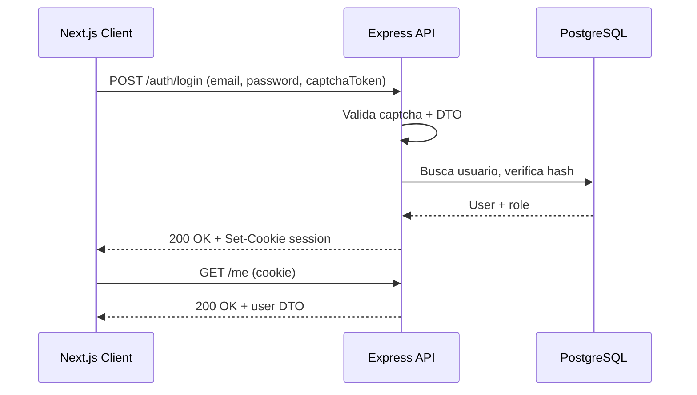
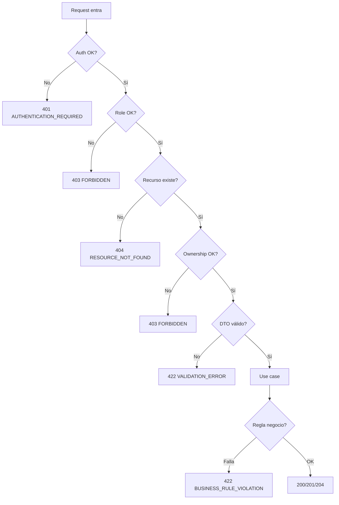
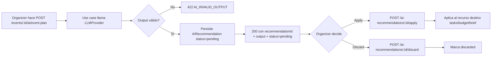

# EventFlow — API Design Specification

> Versión: 1.0
> Estado: Draft académico final
> Idioma: Español LATAM neutral
> Fecha: 2026-06-08
> Autor: Equipo EventFlow

---

## 1. Propósito del documento

Este documento define el **contrato REST oficial** del backend de **EventFlow** para el MVP académico. Su propósito es traducir la documentación funcional, arquitectónica, de dominio, de IA, de seguridad y no funcional previamente aprobada en un **contrato implementable y verificable** entre el frontend Next.js y el backend Node.js + Express + Prisma + PostgreSQL.

El documento sirve como **fuente única de verdad** para:

- Backend Engineers que implementan controladores Express y casos de uso.
- Frontend Engineers que consumen el API desde Server Components, Client Components y TanStack Query.
- QA Engineers que diseñan pruebas Supertest, MSW, contract tests y casos negativos.
- Software Architect que valida adherencia a los principios arquitectónicos.
- Product Owner que valida cobertura funcional respecto al MVP.
- AI coding agents que generan código alineado a los DTOs y reglas de negocio.
- Evaluadores académicos del Master en AI for Developers.
- Mantenedores futuros del proyecto.

El documento es **deliberadamente prescriptivo** sobre convenciones, naming, autorización, formato de error, observabilidad y reglas de negocio aplicadas. No incluye implementación de código.

---

## 2. Alcance del documento

### 2.1 Incluye

1. Principios y convenciones REST de EventFlow.
2. Estrategia de versionado y base URL.
3. Convenciones de naming de recursos, query params y headers.
4. Estrategia de autenticación basada en sesión/cookie HTTP-only.
5. Modelo de autorización **RBAC + ownership** verificado en backend.
6. Convenciones estándar de request y response (envelopes).
7. Modelo unificado de errores y catálogo de códigos.
8. Códigos HTTP usados por el API y cuándo aplicarlos.
9. Paginación, filtrado, ordenamiento y búsqueda.
10. Estrategia de validación de DTOs con Zod.
11. Seguridad del API: rate limit, captcha, CORS, límites de payload, MIME.
12. Observabilidad: correlation ID, logging estructurado, métricas.
13. Catálogo completo de **módulos** del API y sus endpoints.
14. DTOs principales por endpoint.
15. Reglas de negocio enforced por endpoint.
16. Endpoints de IA con flujo **human-in-the-loop**.
17. Endpoints de adjuntos, notificaciones y gobernanza admin.
18. Endpoints de seed/demo.
19. Matriz de autorización por endpoint.
20. Estrategia de pruebas del API.
21. Estrategia de generación de OpenAPI a partir de este documento.
22. Consideraciones para consumo desde Next.js (App Router + TanStack Query).
23. Límites explícitos del MVP y endpoints futuros fuera de alcance.

### 2.2 No incluye

- Implementación concreta de controladores Express, esquemas Prisma o casos de uso.
- Especificación OpenAPI YAML (se incluye **guía de preparación**, no el archivo).
- Diseño UI/UX detallado (cubierto en [`/docs/15-Frontend-Architecture-Design.md`](15-Frontend-Architecture-Design.md)).
- Esquemas SQL o migraciones Prisma (cubierto en [`/docs/6-Domain-Data-Model.md`](6-Domain-Data-Model.md) y [`/docs/14-Backend-Technical-Design.md`](14-Backend-Technical-Design.md)).
- Endpoints de pagos reales, contratos digitales, chat en tiempo real, WhatsApp, SMS, push notifications, calendario.
- APIs GraphQL, gRPC, tRPC, Server Actions o WebSockets.
- Endpoints de administración multi-tenant, federación, SSO empresarial.
- Cualquier endpoint de IA con comportamiento autónomo o sin confirmación humana.

---

## 3. Fuentes utilizadas

Este documento se alinea estrictamente con:

| Documento | Uso principal |
| --- | --- |
| [`/docs/1-Domain-Discovery-Report.md`](1-Domain-Discovery-Report.md) | Lenguaje ubicuo, actores, problemas. |
| [`/docs/2-Product-Owner-Decisions.md`](2-Product-Owner-Decisions.md) | Decisiones de producto inmutables. |
| [`/docs/3-MVP-Scope-Definition.md`](3-MVP-Scope-Definition.md) | Qué entra y qué queda fuera del MVP. |
| [`/docs/4-Business-Rules-Document.md`](4-Business-Rules-Document.md) | Reglas BR-* enforced por API. |
| [`/docs/5-User-Roles-Permissions-Matrix.md`](5-User-Roles-Permissions-Matrix.md) | RBAC + ownership por entidad. |
| [`/docs/6-Domain-Data-Model.md`](6-Domain-Data-Model.md) | Entidades, enums, atributos. |
| [`/docs/7-AI-Features-Specification.md`](7-AI-Features-Specification.md) | AI endpoints, DTOs, fallback. |
| [`/docs/8-Use-Cases-Specification.md`](8-Use-Cases-Specification.md) | Casos de uso por módulo. |
| [`/docs/8.1-Product-Owner-Decisions-Use-Cases-Addendum.md`](8.1-Product-Owner-Decisions-Use-Cases-Addendum.md) | Aclaraciones de PO. |
| [`/docs/8.2-Documentation-Alignment-Review-Before-FRD.md`](8.2-Documentation-Alignment-Review-Before-FRD.md) | Coherencia documental. |
| [`/docs/9-Functional-Requirements-Document.md`](9-Functional-Requirements-Document.md) | Requerimientos funcionales numerados. |
| [`/docs/10-Non-Functional-Requirements.md`](10-Non-Functional-Requirements.md) | Seguridad, performance, accesibilidad. |
| [`/docs/11-Data-Seed-Strategy.md`](11-Data-Seed-Strategy.md) | Seed/demo flow. |
| [`/docs/12-Architecture-Vision-and-Principles.md`](12-Architecture-Vision-and-Principles.md) | Principios arquitectónicos. |
| [`/docs/13-System-Architecture-Document.md`](13-System-Architecture-Document.md) | Vista de sistema. |
| [`/docs/14-Backend-Technical-Design.md`](14-Backend-Technical-Design.md) | Módulos, capas, repository ports, DTOs. |
| [`/docs/15-Frontend-Architecture-Design.md`](15-Frontend-Architecture-Design.md) | Consumo desde App Router + TanStack Query. |

Toda regla de negocio referenciada como `BR-XXX-###` proviene de [`4-Business-Rules-Document.md`](4-Business-Rules-Document.md).

---

## 4. Resumen ejecutivo del API

EventFlow expone un **único API REST JSON** versionado en `/api/v1` servido por un monolito modular Node.js + Express. El API atiende a tres roles —`organizer`, `vendor`, `admin`— y un consumidor anónimo público (directorio de vendors y SEO).

Características principales:

- **REST clásico**: recursos en plural, verbos HTTP estándar, status codes semánticos.
- **JSON only** (excepto endpoints de adjuntos: `multipart/form-data`).
- **Versionado por URL**: `/api/v1`.
- **Autenticación por cookie HTTP-only** emitida por backend (no se almacena token en `localStorage`).
- **Autorización en backend**: RBAC + ownership. Frontend solo provee UX guards.
- **Validación obligatoria con Zod** en el límite del controlador (request DTO).
- **Sobre estándar** de response (`data`, `pagination`, `meta`) y de error (`error`, `meta`).
- **Correlation ID obligatorio** en cada request/response (`X-Correlation-Id`).
- **Human-in-the-loop estricto** para todas las salidas de IA.
- **Sin chat en tiempo real, sin pagos reales, sin contratos digitales**.
- **Health check público** en `/health`.

El API está diseñado para ser **directamente convertible a OpenAPI 3.1** mediante anotación de schemas Zod (ver §43).

---

## 5. Principios de diseño del API

| Principio | Descripción |
| --- | --- |
| **P-API-01** Contrato es la verdad | El contrato definido aquí precede a cualquier implementación. Cualquier desviación requiere actualización de este documento. |
| **P-API-02** REST sin sobre-ingeniería | REST clásico. No HATEOAS, no JSON:API, no GraphQL. |
| **P-API-03** Coherencia sobre creatividad | Un patrón se decide una vez y se aplica en todo el API. |
| **P-API-04** Backend es fuente de verdad de seguridad | Frontend nunca decide autorización: solo mejora UX. |
| **P-API-05** Reglas de negocio enforced en backend | Aunque el frontend valide, el backend re-valida y rechaza. |
| **P-API-06** DTOs explícitos | No se exponen entidades de dominio crudas. Se exponen DTOs específicos por caso de uso. |
| **P-API-07** Errores expresivos pero seguros | Mensajes claros para clientes; sin stack traces, sin datos internos. |
| **P-API-08** IA siempre human-in-the-loop | Ningún output de IA toma efecto sin confirmación humana explícita. |
| **P-API-09** Trazabilidad obligatoria | Todo request lleva `X-Correlation-Id`. Acciones admin se registran en `AdminAction`. |
| **P-API-10** Listo para OpenAPI | DTOs son convertibles a JSON Schema sin reescribirlos. |
| **P-API-11** No filtración de proveedor IA | El frontend nunca habla directo con OpenAI/Anthropic. Las llaves nunca salen del backend. |
| **P-API-12** Idempotencia donde corresponde | Operaciones de creación críticas (intentos de booking, recomendaciones IA confirmadas) son idempotentes cuando se justifica. |
| **P-API-13** Backward compatibility en la versión | Cambios incompatibles requieren `/api/v2`. |
| **P-API-14** Soft delete por defecto | Recursos sensibles (reviews, adjuntos, categorías) usan soft delete. |
| **P-API-15** Datos seed marcados | Cuando aplica, los DTOs exponen `isSeed` para depuración y demo. |

---

## 6. Estilo de API y convenciones REST

EventFlow sigue REST clásico:

- **Verbos HTTP** mapean a operaciones CRUD:
  - `GET` → leer
  - `POST` → crear, ejecutar acciones de negocio
  - `PATCH` → actualización parcial
  - `PUT` → reemplazo total (raro; solo donde aplica)
  - `DELETE` → eliminar (soft delete cuando aplica)
- **Recursos** se nombran con sustantivos en **plural**.
- **Acciones no-CRUD** (aceptar quote, cancelar booking) se modelan como sub-recursos verbo: `/quotes/:id/accept`.
- **Idempotencia**: `GET`, `PUT`, `DELETE`, y las acciones de transición de estado idempotentes (ej. `confirm`) son seguras para reintento.
- **Stateless**: cada request es independiente; el estado de sesión vive en cookie firmada por backend.

No se usan en este MVP:

- HATEOAS.
- Hypermedia links en respuestas.
- JSON:API spec.
- Convenciones GraphQL embebidas en REST.

---

## 7. Versionado del API

| Aspecto | Decisión |
| --- | --- |
| Estrategia | Versionado por **URL prefix**. |
| Base | `/api/v1` |
| Cambios menores | Aditivos (nuevos campos opcionales en response, nuevos endpoints) **no** suben versión. |
| Cambios mayores | Eliminar campos, renombrar paths, cambiar semántica → `/api/v2`. |
| Convivencia | `v1` y `v2` pueden coexistir temporalmente durante migración. |
| Header alterno | No se usa `Accept-Version` ni media-type versioning para el MVP. |

Los endpoints públicos SEO también se versionan: `/api/v1/public/...`.

El health check no se versiona: `GET /health`.

---

## 8. Base URL y ambientes

| Ambiente | Base URL backend | Notas |
| --- | --- | --- |
| Local | `http://localhost:3000/api/v1` | Backend Express en `:3000`. Frontend Next.js en `:4000`. |
| Demo académico | `https://api.eventflow.demo/api/v1` | URL ilustrativa. |
| Producción académica | `https://api.eventflow.app/api/v1` | URL ilustrativa. |

Health check: `GET /health` retorna `200 OK` con `{ status: "ok", version, uptimeMs }`.

---

## 9. Convenciones de naming

### 9.1 Recursos (paths)

- Sustantivos en **plural** y **kebab-case**: `/events`, `/quote-requests`, `/booking-intents`, `/service-categories`.
- Subrecursos cuando expresan composición clara:
  - `GET /events/:eventId/tasks`
  - `POST /events/:eventId/tasks`
  - `GET /events/:eventId/budget`
  - `POST /vendors/:vendorProfileId/services` (admin/owner-only)
- Acciones verbo siempre sobre recurso:
  - `POST /quotes/:quoteId/accept`
  - `POST /quotes/:quoteId/reject`
  - `POST /booking-intents/:bookingIntentId/confirm`
  - `POST /booking-intents/:bookingIntentId/cancel`
  - `POST /ai-recommendations/:aiRecommendationId/apply`
  - `POST /ai-recommendations/:aiRecommendationId/discard`
- Profundidad máxima de anidamiento: **2 niveles** (`/events/:id/tasks/:taskId`).

### 9.2 Identificadores en path

- Siempre **UUID v4** en formato string. Ejemplo: `/events/3f9a8b51-...`
- Slugs públicos para directorios SEO: `/api/v1/public/vendors/:vendorSlug`.

### 9.3 Query parameters

- `camelCase`: `?pageSize=20&languageCode=es-LATAM&sort=createdAt:desc`.

### 9.4 Body JSON

- Claves en `camelCase`.
- Enums en `snake_case` o `kebab-case` según definición canónica de [`6-Domain-Data-Model.md`](6-Domain-Data-Model.md) (ej. `event_plan`, `quote_brief`, `booking_intent`).
- Fechas en **ISO 8601 UTC**: `2026-07-01T00:00:00.000Z`.
- Fechas sin hora en formato `YYYY-MM-DD`.
- Decimales como strings cuando representan dinero: `"total_planned": "12500.00"`.

### 9.5 DTO naming (TypeScript)

- Request DTO: `Create<Recurso>RequestDto`, `Update<Recurso>RequestDto`, `<Accion><Recurso>RequestDto`.
- Response DTO: `<Recurso>ResponseDto`, `<Recurso>ListResponseDto`, `<Recurso>SummaryDto`.
- DTOs de IA: `<Feature>InputDto`, `<Feature>OutputDto`, `AIRecommendationResponseDto`.

### 9.6 Headers

| Header | Dirección | Uso |
| --- | --- | --- |
| `Accept` | request | siempre `application/json` (excepto adjuntos). |
| `Content-Type` | request | `application/json` o `multipart/form-data`. |
| `Accept-Language` | request | `es-LATAM` (default), `es-ES`, `pt`, `en`. Determina el idioma del payload de IA y catálogos. |
| `Cookie` | request | Session cookie HTTP-only emitida por backend. |
| `X-Correlation-Id` | request/response | UUID propagado en logs y respuestas. Si no se envía, backend lo genera. |
| `X-RateLimit-Limit` | response | límite del bucket. |
| `X-RateLimit-Remaining` | response | requests restantes. |
| `Retry-After` | response | segundos a esperar tras `429`. |

---

## 10. Autenticación

### 10.1 Decisión

- **Estrategia**: autenticación basada en **session cookie HTTP-only firmada** emitida por el backend tras `POST /auth/login`.
- **Atributos cookie**: `HttpOnly; Secure; SameSite=Lax; Path=/`.
- **Hashing de contraseña**: `bcrypt` o `argon2` (recomendado argon2id).
- **Captcha** obligatorio en `/auth/register` y `/auth/login` (BR-AUTH-011) usando reCAPTCHA o hCaptcha.
- **No** se almacenan tokens en `localStorage` ni `sessionStorage`.
- **JWT** como alternativa solo si el deploy elegido lo justifica (cookie firmada lleva el JWT como contenido opaco, nunca expuesta a JS).

### 10.2 Endpoints de auth (catálogo resumen)

| Método | Path | Público | Captcha | Propósito |
| --- | --- | --- | --- | --- |
| POST | `/auth/register` | Sí | Sí | Crea `organizer` o `vendor`. |
| POST | `/auth/login` | Sí | Sí | Inicia sesión. Emite cookie. |
| POST | `/auth/logout` | Auth | No | Invalida sesión. |
| POST | `/auth/password/reset-request` | Sí | Sí | Solicita correo de reseteo. |
| POST | `/auth/password/reset` | Sí | No | Aplica reseteo con token de un solo uso. |
| GET | `/me` | Auth | No | Retorna usuario actual y rol. |

Detalles completos en §22.

### 10.3 Flujo de autenticación



### 10.4 Rate limit en auth

- `/auth/login`: máx 10 intentos / IP / 10 min, luego `429`.
- `/auth/register`: máx 5 / IP / 10 min.
- `/auth/password/reset-request`: máx 3 / email / 1 h.

---

## 11. Autorización: RBAC + ownership

EventFlow combina **RBAC** y **ownership**:

- **RBAC**: cada endpoint declara roles permitidos (`organizer`, `vendor`, `admin`, `anonymous`).
- **Ownership**: para recursos de usuario (`event`, `vendor_profile`, `vendor_service`, etc.), el backend valida que el `userId` de la sesión sea propietario.
- **Assignment-based**: vendor solo ve `QuoteRequest` asignadas a su `VendorProfile`.

### 11.1 Cadena de middlewares

```text
correlationId
→ securityHeaders
→ cors
→ rateLimit (en rutas sensibles)
→ bodyParser (con límite)
→ authMiddleware              // verifica cookie/session
→ roleMiddleware([roles])     // verifica role del usuario
→ ownershipMiddleware(opts)   // verifica propiedad del recurso
→ validateRequestMiddleware(zodSchema)  // valida body/params/query
→ controller
→ errorMiddleware
```

### 11.2 Reglas

- Si la sesión no es válida → `401 UNAUTHENTICATED`.
- Si el rol no coincide → `403 FORBIDDEN`.
- Si el recurso no es del usuario (y no es admin) → `403 FORBIDDEN`.
- Si el recurso no existe → `404 NOT_FOUND` (independiente de propiedad para no filtrar existencia salvo en admin).
- **No se filtra** información de recurso pertenecientes a otros usuarios.
- Admin puede leer todo (con excepciones); cualquier acción admin se registra en `AdminAction` (BR-ADMIN-004).

### 11.3 Resumen por rol

| Rol | Características |
| --- | --- |
| `anonymous` | Solo accede a `/health`, `/auth/*`, `/api/v1/public/*`, `/api/v1/event-types`, `/api/v1/service-categories` (read-only). |
| `organizer` | Gestiona sus eventos, tasks, budgets, quote requests, booking intents, reviews, IA, notifications. |
| `vendor` | Gestiona su `VendorProfile`, sus `VendorService`, su portfolio, sus quote requests asignadas, responde quotes, ve sus reviews. |
| `admin` | Aprueba/rechaza vendors, modera reviews, gestiona catálogos (EventType, ServiceCategory), ve métricas, lee eventos en read-only, ejecuta seed/demo. |

---

## 12. Convenciones de request

### 12.1 Content-Type

- `application/json` por defecto.
- `multipart/form-data` solo para `/attachments` y portafolio de vendor.

### 12.2 Body

- JSON UTF-8.
- Tamaño máximo por defecto: **1 MB** (configurable).
- Estricto: campos desconocidos son rechazados con `VALIDATION_ERROR`.

### 12.3 Query

- `camelCase`.
- Parámetros booleanos: `true` / `false` literales.
- Parámetros de enum: valor canónico (ej. `status=active`).

### 12.4 Path

- UUID v4 o slug. Validados por Zod.

### 12.5 Headers obligatorios

- `Accept: application/json`.
- `Accept-Language: es-LATAM` o variantes.
- `X-Correlation-Id` (opcional; backend genera si falta).

### 12.6 Idempotencia

- Para operaciones de creación que pueden reintentar el cliente (ej. `POST /booking-intents`), se acepta `Idempotency-Key` en header como **mejora futura** (no obligatorio en MVP).

---

## 13. Convenciones de response

### 13.1 Sobre éxito (recurso único)

```json
{
  "data": {
    "id": "3f9a8b51-...",
    "title": "Boda Ana y Luis",
    "status": "active",
    "...": "..."
  },
  "meta": {
    "correlationId": "req_3f9a...",
    "timestamp": "2026-06-08T18:30:00.000Z"
  }
}
```

### 13.2 Sobre éxito (lista paginada)

```json
{
  "data": [
    { "id": "...", "title": "...", "status": "active" }
  ],
  "pagination": {
    "page": 1,
    "pageSize": 20,
    "totalItems": 100,
    "totalPages": 5
  },
  "meta": {
    "correlationId": "req_3f9a...",
    "timestamp": "2026-06-08T18:30:00.000Z"
  }
}
```

### 13.3 Sobre éxito sin contenido

- `204 No Content` con cuerpo vacío. El header `X-Correlation-Id` siempre se devuelve.

### 13.4 Convenciones generales

- Toda respuesta incluye `meta.correlationId` y `meta.timestamp` (ISO 8601 UTC).
- Toda respuesta lista incluye `pagination`.
- Toda respuesta de IA incluye `aiMeta` con `provider`, `promptVersion`, `latencyMs`, `fallbackUsed`, `languageCode`, `recommendationId`.
- Decimales monetarios como strings.
- Fechas como ISO 8601 strings.
- Enums siempre como string lowercase canónica.

### 13.5 Cacheability

- `GET` públicos (`/api/v1/public/*`) pueden incluir `Cache-Control: public, max-age=300`.
- Endpoints autenticados: `Cache-Control: no-store`.

---

## 14. Modelo estándar de errores

### 14.1 Sobre

```json
{
  "error": {
    "code": "VALIDATION_ERROR",
    "message": "Uno o más campos son inválidos.",
    "details": [
      { "field": "eventDate", "message": "eventDate debe ser una fecha futura." },
      { "field": "currency", "message": "currency debe ser GTQ o USD." }
    ]
  },
  "meta": {
    "correlationId": "req_3f9a...",
    "timestamp": "2026-06-08T18:30:00.000Z"
  }
}
```

### 14.2 Catálogo de códigos

| Código | HTTP | Categoría | Uso |
| --- | --- | --- | --- |
| `VALIDATION_ERROR` | 400 / 422 | Validación | Input rechazado por Zod. |
| `INVALID_REQUEST` | 400 | Validación | Body malformado o JSON inválido. |
| `MISSING_INPUT` | 400 | Validación | Campo obligatorio ausente en endpoint IA. |
| `AUTHENTICATION_REQUIRED` | 401 | Auth | Sesión faltante o inválida. |
| `FORBIDDEN` | 403 | Authz | Rol no autorizado o no es owner. |
| `RESOURCE_NOT_FOUND` | 404 | Recurso | Recurso solicitado no existe o no es accesible. |
| `CONFLICT` | 409 | Estado | Conflicto de estado (ej. email tomado). |
| `BUSINESS_RULE_VIOLATION` | 422 | Reglas | Regla de negocio rechazó la operación. |
| `CURRENCY_IMMUTABLE` | 409 | Reglas | Intento de cambiar moneda de evento. |
| `MAX_QUOTE_REQUESTS_EXCEEDED` | 409 | Reglas | >5 QuoteRequest activas por categoría/evento. |
| `MAX_PORTFOLIO_IMAGES_EXCEEDED` | 409 | Reglas | >10 imágenes por work/event del portafolio. |
| `MAX_CATEGORY_CHANGES_EXCEEDED` | 409 | Reglas | >5 cambios de categoría del vendor. |
| `DUPLICATE_REVIEW` | 409 | Reglas | Review ya existe para `(event, vendor)`. |
| `DUPLICATE_QUOTE_REQUEST_ACTIVE` | 409 | Reglas | QuoteRequest activa duplicada. |
| `QUOTE_EXPIRED` | 410 | Estado | Quote expirada al intentar aceptar. |
| `EVENT_TYPE_HAS_EVENTS` | 409 | Reglas | Intento de borrar EventType con eventos asociados. |
| `CATEGORY_DEPTH_EXCEEDED` | 409 | Reglas | ServiceCategory excede profundidad máxima (2). |
| `RATE_LIMIT_EXCEEDED` | 429 | Anti-abuso | Límite de requests excedido. |
| `EMAIL_TAKEN` | 409 | Estado | Email ya registrado en `/auth/register` (mensaje neutro anti-enumeración). |
| `CAPTCHA_REQUIRED` | 400 | Anti-abuso | Token de captcha ausente en endpoint protegido por captcha. |
| `CAPTCHA_INVALID` | 400 | Anti-abuso | Token de captcha inválido/expirado (causa exacta nunca se revela). |
| `ALREADY_AUTHENTICATED` | 409 | Estado | Sesión activa invocando un endpoint solo-anónimo (register/login). |
| `AI_PROVIDER_TIMEOUT` | 504 / 503 | IA | Timeout >60s del proveedor LLM. |
| `AI_PROVIDER_UNAVAILABLE` | 503 | IA | LLM no disponible y fallback agotado. |
| `AI_INVALID_OUTPUT` | 422 | IA | Output del LLM no pasó validación JSON Schema. |
| `FILE_UPLOAD_ERROR` | 400 / 413 | Adjuntos | MIME inválido, tamaño excedido, etc. |
| `INTERNAL_ERROR` | 500 | Sistema | Falla inesperada. Detalle solo en logs. |

> **Nota de catálogo (2026-07-10, US-001 / DOC-001):** se formalizan `EMAIL_TAKEN`,
> `CAPTCHA_REQUIRED`, `CAPTCHA_INVALID` y `ALREADY_AUTHENTICATED`, códigos estables ya entregados
> por PB-P0-004/PB-P0-006 (US-094/US-109) y referenciados por las decisiones PO de US-003/US-004.
> El caso "captcha inválido" usa código dedicado en lugar de `VALIDATION_ERROR` genérico.

### 14.3 Reglas

- `message` es **siempre** legible para humanos y traducible (Accept-Language).
- `details` es opcional pero **obligatorio** en `VALIDATION_ERROR` y `BUSINESS_RULE_VIOLATION` con `details[].field`.
- **Nunca** se exponen stack traces ni nombres de archivo internos.
- **Nunca** se exponen IDs internos de proveedor LLM, llaves, etc.
- Errores `500` siempre incluyen `correlationId` para soporte.

### 14.4 Diagrama de manejo



---

## 15. Códigos HTTP

| Código | Significado | Cuándo |
| --- | --- | --- |
| `200 OK` | Éxito lectura/acción | `GET`, `PATCH`, acciones. |
| `201 Created` | Recurso creado | `POST` que crea recurso. Incluye `Location`. |
| `202 Accepted` | Procesamiento aceptado | Operación asíncrona (no usado en MVP, reservado). |
| `204 No Content` | Éxito sin cuerpo | `DELETE`, `mark-as-read`, `logout`. |
| `400 Bad Request` | Solicitud malformada | JSON inválido, body ausente, query inválido. |
| `401 Unauthorized` | Sin sesión válida | Cookie ausente, expirada o firma inválida. |
| `403 Forbidden` | Sin permisos | Rol no autorizado o no es owner. |
| `404 Not Found` | Recurso no existe | Recurso no encontrado o no accesible. |
| `409 Conflict` | Conflicto de estado | Email tomado, currency inmutable, duplicado, excede límites. |
| `410 Gone` | Recurso expirado | `Quote` expirada al aceptar. |
| `413 Payload Too Large` | Tamaño excedido | Adjunto demasiado grande. |
| `415 Unsupported Media Type` | Content-Type no soportado | MIME inválido. |
| `422 Unprocessable Entity` | Validación o regla | Zod rechazó input válido en formato pero inválido semánticamente, o BR violada. |
| `429 Too Many Requests` | Rate limit | Captcha, login, AI. |
| `500 Internal Server Error` | Falla inesperada | Bug, excepción no manejada. |
| `503 Service Unavailable` | Dependencia fuera | LLM no disponible. |
| `504 Gateway Timeout` | Timeout dependencia | Opcional para AI timeout (alternativa a `503 + AI_PROVIDER_TIMEOUT`). |

---

## 16. Paginación, filtros, ordenamiento y búsqueda

### 16.1 Paginación

- Esquema: **page-based**.
- Parámetros: `?page=1&pageSize=20`.
- Default `page=1`, `pageSize=20`.
- Máximo `pageSize=100`.
- Respuesta incluye objeto `pagination` con `page`, `pageSize`, `totalItems`, `totalPages`.

### 16.2 Filtrado

- Filtros por igualdad: `?status=active&type=wedding&city=guatemala`.
- Filtros de rango (eventos por fecha): `?eventDateFrom=2026-07-01&eventDateTo=2026-12-31`.
- Filtros booleanos: `?isPreferred=true`.
- Cada endpoint declara los filtros válidos.

### 16.3 Ordenamiento

- Sintaxis: `?sort=campo:asc|desc`.
- Múltiples campos: `?sort=createdAt:desc,title:asc`.
- Default por endpoint (típicamente `createdAt:desc`).

### 16.4 Búsqueda

- Parámetro `?q=texto`.
- Aplica a campos definidos por endpoint (ej. directorio público de vendors busca en `business_name` y `bio`).
- Búsqueda case-insensitive y normalizada (sin acentos en MVP cuando sea pragmático).

### 16.5 Selección de campos

- No soportada en MVP. Todos los endpoints retornan el DTO completo de su recurso.

---

## 17. Validación de DTOs

- Toda request se valida con **Zod** en el límite del controlador (`validateRequestMiddleware`).
- Validación cubre `body`, `params`, `query`.
- Respuestas no se validan en runtime, pero los DTOs de response están definidos como tipos TypeScript estrictos para coherencia OpenAPI.
- Campos desconocidos en body son **rechazados** (`.strict()` en Zod).
- Coerción de fechas: las strings ISO se convierten a `Date` solo después de validar formato.

### 17.1 Reglas comunes

| Tipo | Regla |
| --- | --- |
| Email | lowercase, regex RFC 5322 simplificada. |
| UUID | v4. |
| Date | ISO 8601 UTC para timestamps, `YYYY-MM-DD` para fechas. |
| Decimal monetario | string con dos decimales, ≥ 0. |
| Strings | `trim`, longitud máxima por campo. |
| Enums | unión cerrada con valores canónicos. |
| Arrays | `minItems`/`maxItems` cuando aplica. |

### 17.2 Validaciones cross-field

Se aplican en el caso de uso (capa Application), por ejemplo:

- `Event.eventDate` debe ser futura al crear.
- `Quote.validUntil` debe ser posterior a `Quote.createdAt`.
- `BudgetItem.committed >= 0`.
- `Review.rating` entero 1–5.

---

## 18. Seguridad del API

### 18.1 Constraints obligatorias

| # | Constraint |
| --- | --- |
| S-01 | HTTPS obligatorio en demo/prod (TLS terminado en LB o app). |
| S-02 | `helmet` para headers de seguridad. |
| S-03 | CORS restringido a origins conocidos (`FRONTEND_URL`). |
| S-04 | Cookies HTTP-only, `Secure`, `SameSite=Lax`. |
| S-05 | No tokens de auth en `localStorage`. |
| S-06 | `bcrypt`/`argon2` para hash de password. |
| S-07 | Captcha en `/auth/register` y `/auth/login` (BR-AUTH-011). |
| S-08 | Rate limit en auth, IA y operaciones costosas. |
| S-09 | Validación estricta de Zod (`.strict()`). |
| S-10 | No filtrar stack traces ni mensajes internos en errores. |
| S-11 | Body limit 1 MB JSON; adjuntos limitados por endpoint (típico 5 MB por archivo, 10 imágenes por trabajo). |
| S-12 | MIME allow-list para adjuntos (`image/jpeg`, `image/png`, `image/webp`). |
| S-13 | Frontend nunca consume llaves de OpenAI/Anthropic. |
| S-14 | Frontend nunca decide autorización: backend re-verifica. |
| S-15 | Logging estructurado **sin** PII más allá de email/role mínimo. |
| S-16 | `AdminAction` registra toda acción admin sensible. |
| S-17 | Soft delete para reviews, attachments, service categories, vendor profiles. |
| S-18 | Email reset token: único uso, expiración corta (15 min). |
| S-19 | Sesión expira (configurable: 24 h por defecto). |
| S-20 | Cookies invalidadas en `/auth/logout`. |

### 18.2 Anti-abuso

- Captcha obligatorio en endpoints públicos sensibles.
- Rate limit por IP y por usuario en endpoints IA.
- Detección básica de inputs maliciosos por longitud y carácter.

---

## 19. Observabilidad y correlation IDs

### 19.1 Correlation ID

- Header `X-Correlation-Id` aceptado en request.
- Si no se envía, backend genera un UUID v4 con prefijo `req_`.
- Se propaga en:
  - logs (`pino` con `correlationId` en cada line).
  - respuesta (`meta.correlationId`).
  - errores (`meta.correlationId`).
  - llamadas al LLM (registrado en `AIRecommendation`).

### 19.2 Logging

- `pino` con redacción de campos sensibles (passwords, tokens, captcha).
- Niveles: `info` (default), `warn`, `error`.
- Cada request se loguea con: método, path, status, duración, correlationId, userId, role.

### 19.3 Métricas

- Latencia por endpoint.
- Conteo de errores por código.
- Conteo de timeouts del LLM.
- Tasa de fallback IA.
- Estado de jobs (auto-complete events, expire quotes).

---

## 20. Catálogo de módulos del API

El backend está dividido en módulos. Cada módulo expone un conjunto de endpoints. Esta sección lista los módulos; las siguientes secciones (§21–§39) definen endpoints, DTOs y reglas.

| # | Módulo | Path raíz típico | Sección |
| --- | --- | --- | --- |
| M01 | Health | `/health` | §21 |
| M02 | Auth | `/auth` | §22 |
| M03 | User / Profile | `/me`, `/users` | §23 |
| M04 | Events | `/events` | §24 |
| M05 | Event Tasks | `/events/:id/tasks` | §25 |
| M06 | Budget | `/events/:id/budget` | §26 |
| M07 | Vendor Profiles | `/vendors` | §27 |
| M08 | Vendor Services | `/vendors/:id/services` | §28 |
| M09 | Service Categories | `/service-categories` | §29 |
| M10 | Quote Requests | `/events/:id/quote-requests`, `/quote-requests` | §30 |
| M11 | Quotes | `/quotes` | §31 |
| M12 | Booking Intents | `/booking-intents` | §32 |
| M13 | Reviews | `/reviews` | §33 |
| M14 | Notifications | `/notifications` | §34 |
| M15 | AI Assistance | varios | §35 |
| M16 | Attachments | `/attachments` | §36 |
| M17 | Admin Governance | `/admin/*` | §37 |
| M18 | Localization / Currency | `/i18n`, `/currencies` | §38 |
| M19 | Seed / Demo | `/admin/seed/*` | §39 |

---

## 21. Health API

### 21.1 Propósito

Verificación de disponibilidad del backend, útil para healthchecks de plataforma y para probes manuales.

### 21.2 Endpoints

| Método | Path | Auth | Roles | Propósito | Success | Errores |
| --- | --- | --- | --- | --- | --- | --- |
| GET | `/health` | No | anonymous | Healthcheck del backend. | 200 | 500 |
| GET | `/health/ready` | No | anonymous | Readiness (DB conectada). | 200 / 503 | 503 |

### 21.3 Response DTO

```ts
type HealthResponseDto = {
  status: "ok" | "degraded" | "error";
  version: string;
  uptimeMs: number;
  timestamp: string; // ISO
};
```

`/health/ready` agrega:

```ts
type ReadyResponseDto = HealthResponseDto & {
  dependencies: {
    postgres: "ok" | "down";
    aiProvider: "ok" | "mock" | "down";
  };
};
```

### 21.4 Notas

- No requiere `X-Correlation-Id` ni sesión.
- No expone configuración interna.

---

## 22. Auth API

### 22.1 Propósito

Registro, autenticación, cierre de sesión y recuperación de contraseña.

### 22.2 Actores

- `anonymous` para todas excepto `/auth/logout` y `/me`.

### 22.3 Endpoints

| Método | Path | Auth | Roles | Propósito | Success | Errores |
| --- | --- | --- | --- | --- | --- | --- |
| POST | `/auth/register` | No | anonymous | Crea `organizer` o `vendor`. | 201 | 400, 409 (EMAIL_TAKEN), 422, 429 |
| POST | `/auth/login` | No | anonymous | Inicia sesión. | 200 + Set-Cookie | 400, 401, 422, 429 |
| POST | `/auth/logout` | Sí | organizer, vendor, admin | Cierra sesión. | 204 | 401 |
| POST | `/auth/password/reset-request` | No | anonymous | Solicita reset por email. | 202 | 400, 429 |
| POST | `/auth/password/reset` | No | anonymous | Aplica reset con token. | 204 | 400, 401, 410 (token expirado), 422 |

### 22.4 DTOs

```ts
type RegisterRequestDto = {
  email: string;
  password: string;
  name: string;
  role: "organizer" | "vendor";
  preferredLanguage: "es-LATAM" | "es-ES" | "pt" | "en";
  captchaToken: string;
};

type LoginRequestDto = {
  email: string;
  password: string;
  captchaToken: string;
};

type PasswordResetRequestDto = {
  email: string;
  captchaToken: string;
};

type PasswordResetDto = {
  token: string;
  newPassword: string;
};

type AuthUserResponseDto = {
  id: string;
  email: string;
  name: string;
  role: "organizer" | "vendor" | "admin";
  preferredLanguage: "es-LATAM" | "es-ES" | "pt" | "en";
  status: "active" | "suspended";
};
```

### 22.5 Reglas de negocio enforced

- **BR-AUTH-002**: registro solo crea `organizer` o `vendor`. Intento de `role=admin` → `403 FORBIDDEN`.
- **BR-AUTH-005**: mono-rol; no se permite alternar rol.
- **BR-AUTH-011**: captcha obligatorio en register y login.
- **BR-USER-002**: email único (case-insensitive). Conflicto → `409 EMAIL_TAKEN`.
- Hash con bcrypt/argon2; nunca devolver hash.

### 22.6 Errores y notas

- Respuesta de login con credenciales incorrectas: `401 AUTHENTICATION_REQUIRED` con mensaje genérico ("credenciales inválidas") para no filtrar existencia de usuario.
- Después de 10 intentos fallidos / IP / 10 min → `429`.
- `/auth/password/reset-request` retorna `202` aun cuando el email no exista, para evitar enumeración.

---

## 23. User / Profile API

### 23.1 Propósito

Lectura y actualización del perfil del usuario autenticado.

> **Nota (US-003 / API-001, 2026-07-10):** el path canónico del perfil propio es `GET /api/v1/users/me` (decisión US-094: recurso plural `users`, sin alias `/me` en la raíz). Las referencias a `GET /me` en este documento deben leerse como `GET /api/v1/users/me`; el frontend consume este path para la hidratación de sesión y el ruteo por rol.

### 23.2 Endpoints

| Método | Path | Auth | Roles | Propósito | Success | Errores |
| --- | --- | --- | --- | --- | --- | --- |
| GET | `/me` | Sí | organizer, vendor, admin | Retorna usuario actual. | 200 | 401 |
| PATCH | `/me` | Sí | organizer, vendor, admin | Actualiza nombre, teléfono, idioma. | 200 | 401, 422 |
| PATCH | `/me/preferred-language` | Sí | organizer, vendor, admin | Actualiza idioma preferido. | 200 | 401, 422 |
| POST | `/me/change-password` | Sí | organizer, vendor, admin | Cambia contraseña. | 204 | 401, 422 |

### 23.3 DTOs

```ts
type UpdateProfileRequestDto = {
  name?: string;
  phone?: string;
  preferredLanguage?: "es-LATAM" | "es-ES" | "pt" | "en";
};

type ChangePasswordRequestDto = {
  currentPassword: string;
  newPassword: string;
};

type UserProfileResponseDto = AuthUserResponseDto & {
  phone: string | null;
  createdAt: string;
  updatedAt: string;
};
```

### 23.4 Reglas

- `BR-USER-006`: idioma preferido configurable y respetado.
- Cambio de email no permitido en MVP.

---

## 24. Events API

### 24.1 Propósito

Crear y administrar eventos del `organizer`. Lectura controlada por admin.

### 24.2 Actores

- `organizer` (CRUD, own).
- `admin` (read-only, todos).

### 24.3 Endpoints

| Método | Path | Auth | Roles | Propósito | Success | Errores |
| --- | --- | --- | --- | --- | --- | --- |
| POST | `/events` | Sí | organizer | Crea evento. | 201 | 400, 401, 403, 422 |
| GET | `/events` | Sí | organizer | Lista eventos propios. | 200 | 401, 403 |
| GET | `/events/:eventId` | Sí | organizer, admin | Detalle de evento. | 200 | 401, 403, 404 |
| PATCH | `/events/:eventId` | Sí | organizer | Actualiza evento (no currency). | 200 | 401, 403, 404, 409 (CURRENCY_IMMUTABLE), 422 |
| POST | `/events/:eventId/activate` | Sí | organizer | Pasa `draft → active`. | 200 | 401, 403, 404, 422 |
| POST | `/events/:eventId/cancel` | Sí | organizer | Pasa estado a `cancelled`. | 200 | 401, 403, 404, 422 |
| GET | `/admin/events` | Sí | admin | Lista eventos read-only. | 200 | 401, 403 |

### 24.4 DTOs

```ts
type CreateEventRequestDto = {
  eventTypeCode: "wedding" | "xv" | "baptism" | "baby_shower" | "birthday" | "corporate";
  name?: string;
  eventDate: string;       // YYYY-MM-DD
  guestsCount: number;
  locationId: string;
  estimatedBudget: string; // decimal as string
  currencyCode: "GTQ" | "EUR" | "MXN" | "COP" | "USD";
  languageCode: "es-LATAM" | "es-ES" | "pt" | "en";
  notes?: string;
};

type UpdateEventRequestDto = Omit<CreateEventRequestDto, "currencyCode"> & {
  // currencyCode is forbidden
};

type EventResponseDto = {
  id: string;
  ownerId: string;
  eventType: { code: string; displayName: string };
  name: string | null;
  eventDate: string;
  guestsCount: number;
  location: { id: string; city: string; countryCode: string };
  estimatedBudget: string;
  currencyCode: string;
  languageCode: string;
  status: "draft" | "active" | "completed" | "cancelled";
  completedAt: string | null;
  autoCompleted: boolean;
  notes: string | null;
  isSeed: boolean;
  createdAt: string;
  updatedAt: string;
};
```

### 24.5 Filtros y ordenamiento

- `GET /events`: `?status=&eventTypeCode=&eventDateFrom=&eventDateTo=&page=&pageSize=&sort=`.
- Default sort: `eventDate:asc`.

### 24.6 Reglas enforced

- **BR-EVENT-001/002**: ownership.
- **BR-EVENT-005**: transiciones válidas.
- **BR-EVENT-006**: solo `active` permite QuoteRequest.
- **BR-EVENT-007**: `currencyCode` inmutable post-creación.
- **BR-EVENT-013**: job de auto-complete corre como job interno (no endpoint).
- **BR-EVENT-014**: admin read-only; cualquier operación admin se registra en `AdminAction`.

### 24.7 Errores

- `409 CURRENCY_IMMUTABLE` si se intenta enviar `currencyCode` en PATCH.
- `422 BUSINESS_RULE_VIOLATION` si la transición de estado es inválida.

---

## 25. Event Tasks API

### 25.1 Propósito

Administrar tareas de un evento, manuales o generadas por IA.

### 25.2 Endpoints

| Método | Path | Auth | Roles | Propósito | Success | Errores |
| --- | --- | --- | --- | --- | --- | --- |
| GET | `/events/:eventId/tasks` | Sí | organizer | Lista tareas. | 200 | 401, 403, 404 |
| POST | `/events/:eventId/tasks` | Sí | organizer | Crea tarea manual. | 201 | 401, 403, 404, 422 |
| PATCH | `/events/:eventId/tasks/:taskId` | Sí | organizer | Actualiza tarea. | 200 | 401, 403, 404, 422 |
| PATCH | `/events/:eventId/tasks/:taskId/status` | Sí | organizer | Cambia estado. | 200 | 401, 403, 404, 422 |
| DELETE | `/events/:eventId/tasks/:taskId` | Sí | organizer | Elimina tarea. | 204 | 401, 403, 404 |

### 25.3 DTOs

```ts
type CreateTaskRequestDto = {
  title: string;
  description?: string;
  dueDate?: string;
  categoryHint?: string;
};

type UpdateTaskRequestDto = Partial<CreateTaskRequestDto>;

type UpdateTaskStatusRequestDto = {
  status: "pending" | "in_progress" | "done" | "skipped";
};

type EventTaskResponseDto = {
  id: string;
  eventId: string;
  title: string;
  description: string | null;
  dueDate: string | null;
  status: "pending" | "in_progress" | "done" | "skipped";
  aiGenerated: boolean;
  aiRecommendationId: string | null;
  categoryHint: string | null;
  isSeed: boolean;
  createdAt: string;
  updatedAt: string;
};
```

### 25.4 Reglas enforced

- **BR-TASK-003**: tareas creadas por IA inician `pending`.
- **BR-TASK-004**: transiciones válidas.
- Solo el owner del evento gestiona sus tasks.

---

## 26. Budget API

### 26.1 Propósito

Gestionar el presupuesto y sus ítems de un evento.

### 26.2 Endpoints

| Método | Path | Auth | Roles | Propósito | Success | Errores |
| --- | --- | --- | --- | --- | --- | --- |
| GET | `/events/:eventId/budget` | Sí | organizer | Obtiene budget. | 200 | 401, 403, 404 |
| GET | `/events/:eventId/budget/items` | Sí | organizer | Lista budget items. | 200 | 401, 403, 404 |
| POST | `/events/:eventId/budget/items` | Sí | organizer | Crea budget item. | 201 | 401, 403, 404, 422 |
| PATCH | `/events/:eventId/budget/items/:itemId` | Sí | organizer | Actualiza item. | 200 | 401, 403, 404, 422 |
| DELETE | `/events/:eventId/budget/items/:itemId` | Sí | organizer | Elimina item. | 204 | 401, 403, 404 |

### 26.3 DTOs

```ts
type CreateBudgetItemRequestDto = {
  serviceCategoryId: string;
  label?: string;
  planned: string;     // decimal
  committed?: string;  // decimal default "0"
  paid?: string;       // decimal default "0"
};

type BudgetResponseDto = {
  id: string;
  eventId: string;
  totalPlanned: string;
  totalCommitted: string;
  currencyCode: string;
  items: BudgetItemResponseDto[];
  createdAt: string;
  updatedAt: string;
};

type BudgetItemResponseDto = {
  id: string;
  budgetId: string;
  serviceCategory: { id: string; code: string; displayName: string };
  label: string | null;
  planned: string;
  committed: string;
  paid: string;
  aiGenerated: boolean;
  aiRecommendationId: string | null;
};
```

### 26.4 Reglas enforced

- **BR-BUDGET-003**: totales = SUM(items.planned/committed).
- **BR-BUDGET-004**: si `committed > totalPlanned`, **warning** en response (campo `warnings: ["committed_exceeds_planned"]`), pero **no** se rechaza.
- **BR-BUDGET-006/007**: moneda fijada por evento; **sin** conversión.
- Decimales ≥ 0.

---

## 27. Vendor Profiles API

### 27.1 Propósito

Gestionar el perfil del proveedor, aprobación admin, directorio público.

### 27.2 Actores

- `vendor` (CRUD propio).
- `admin` (aprobación, moderación).
- `anonymous` (lectura del directorio público).

### 27.3 Endpoints

| Método | Path | Auth | Roles | Propósito | Success | Errores |
| --- | --- | --- | --- | --- | --- | --- |
| GET | `/vendors/me` | Sí | vendor | Obtiene perfil propio. | 200 | 401, 403, 404 |
| POST | `/vendors/me` | Sí | vendor | Crea perfil (primera vez). | 201 | 401, 403, 409, 422 |
| PATCH | `/vendors/me` | Sí | vendor | Actualiza perfil. | 200 | 401, 403, 409 (MAX_CATEGORY_CHANGES_EXCEEDED), 422 |
| POST | `/vendors/me/submit-approval` | Sí | vendor | Envía perfil a admin. | 200 | 401, 403, 422 |
| GET | `/vendors/:vendorProfileId` | No (público si approved) | anonymous, organizer, admin | Detalle público. | 200 | 404 |
| GET | `/api/v1/public/vendors` | No | anonymous | Directorio público. | 200 | — |
| GET | `/api/v1/public/vendors/:vendorSlug` | No | anonymous | Vendor por slug. | 200 | 404 |
| GET | `/api/v1/public/vendors/:vendorSlug/portfolio` | No | anonymous | Portafolio público. | 200 | 404 |

### 27.4 DTOs

```ts
type CreateVendorProfileRequestDto = {
  businessName: string;
  bio: string;
  locationId: string;
  languagesSupported: ("es-LATAM" | "es-ES" | "pt" | "en")[];
  serviceCategoryIds: string[];
};

type UpdateVendorProfileRequestDto = Partial<CreateVendorProfileRequestDto> & {
  availabilitySummary?: string;
};

type VendorProfileResponseDto = {
  id: string;
  userId: string;
  businessName: string;
  bio: string;
  location: { id: string; city: string; countryCode: string };
  languagesSupported: string[];
  status: "pending" | "approved" | "rejected" | "hidden";
  subscriptionStatus: "active" | "inactive";
  availabilitySummary: string | null;
  ratingAvg: number | null;
  reviewsCount: number;
  aiGeneratedBio: boolean;
  approvedAt: string | null;
  categoryChangeCount: number;
  requiresAdminReview: boolean;
  isSeed: boolean;
  createdAt: string;
  updatedAt: string;
};
```

### 27.5 Reglas enforced

- **BR-VENDOR-001**: solo `approved` aparece en directorio público.
- **BR-VENDOR-004**: máximo **5 cambios acumulados** de categorías. Excedido → `409 MAX_CATEGORY_CHANGES_EXCEEDED`.
- Cambios sustantivos disparan `requiresAdminReview=true`.
- Vendors no pueden auto-aprobarse.

---

## 28. Vendor Services API

### 28.1 Propósito

Gestionar servicios/paquetes ofrecidos por un vendor.

### 28.2 Endpoints

| Método | Path | Auth | Roles | Propósito | Success | Errores |
| --- | --- | --- | --- | --- | --- | --- |
| GET | `/vendors/me/services` | Sí | vendor | Lista servicios propios. | 200 | 401, 403 |
| POST | `/vendors/me/services` | Sí | vendor | Crea servicio. | 201 | 401, 403, 422 |
| PATCH | `/vendors/me/services/:serviceId` | Sí | vendor | Actualiza servicio. | 200 | 401, 403, 404, 422 |
| DELETE | `/vendors/me/services/:serviceId` | Sí | vendor | Desactiva servicio (soft). | 204 | 401, 403, 404 |
| GET | `/vendors/:vendorProfileId/services` | Mixto | anonymous (si approved), organizer, admin | Lista pública. | 200 | 404 |

### 28.3 DTOs

```ts
type CreateVendorServiceRequestDto = {
  serviceCategoryId: string;
  packageName: string;
  description: string;
  basePrice: string;          // decimal
  currencyCode: "GTQ" | "EUR" | "MXN" | "COP" | "USD";
};

type VendorServiceResponseDto = {
  id: string;
  vendorProfileId: string;
  serviceCategory: { id: string; code: string; displayName: string };
  packageName: string;
  description: string;
  basePrice: string;
  currencyCode: string;
  aiGeneratedDescription: boolean;
  isActive: boolean;
  isSeed: boolean;
  createdAt: string;
  updatedAt: string;
};
```

### 28.4 Reglas

- Solo vendor dueño del perfil gestiona sus servicios.
- Vendors `pending`/`rejected`/`hidden` pueden tener servicios pero no aparecen en directorio público.

---

## 29. Service Categories API

### 29.1 Propósito

Catálogo de categorías de servicio jerárquico (máx 2 niveles).

### 29.2 Endpoints

| Método | Path | Auth | Roles | Propósito | Success | Errores |
| --- | --- | --- | --- | --- | --- | --- |
| GET | `/service-categories` | No | anonymous | Lista activas con jerarquía. | 200 | — |
| GET | `/service-categories/:id` | No | anonymous | Detalle. | 200 | 404 |
| POST | `/admin/service-categories` | Sí | admin | Crea categoría. | 201 | 401, 403, 409 (CATEGORY_DEPTH_EXCEEDED), 422 |
| PATCH | `/admin/service-categories/:id` | Sí | admin | Actualiza categoría. | 200 | 401, 403, 404, 422 |
| DELETE | `/admin/service-categories/:id` | Sí | admin | Soft delete (`isActive=false`). | 204 | 401, 403, 404 |

### 29.3 DTOs

```ts
type ServiceCategoryResponseDto = {
  id: string;
  code: string;
  displayName: string;
  description: string | null;
  parentId: string | null;
  depthLevel: 1 | 2;
  isActive: boolean;
  sortOrder: number | null;
  isSeed: boolean;
};

type CreateServiceCategoryRequestDto = {
  code: string;
  displayName: { "es-LATAM": string; "es-ES"?: string; "pt"?: string; "en"?: string };
  description?: string;
  parentId?: string;
  sortOrder?: number;
};
```

### 29.4 Reglas

- **BR-SERVICE-005**: profundidad máxima **2**. `parentId` cuyo padre tenga `parentId != null` → `409 CATEGORY_DEPTH_EXCEEDED`.
- **BR-SERVICE-007**: soft delete obligatorio.

---

## 30. Quote Requests API

### 30.1 Propósito

Organizer solicita cotización a vendor sobre una categoría de servicio dentro de un evento `active`.

### 30.2 Endpoints

| Método | Path | Auth | Roles | Propósito | Success | Errores |
| --- | --- | --- | --- | --- | --- | --- |
| GET | `/events/:eventId/quote-requests` | Sí | organizer | Lista quote requests del evento. | 200 | 401, 403, 404 |
| POST | `/events/:eventId/quote-requests` | Sí | organizer | Crea quote request. | 201 | 401, 403, 404, 409 (MAX_QUOTE_REQUESTS_EXCEEDED), 422 |
| GET | `/quote-requests/:quoteRequestId` | Sí | organizer, vendor (asignado), admin | Detalle. | 200 | 401, 403, 404 |
| PATCH | `/quote-requests/:quoteRequestId/cancel` | Sí | organizer | Cancela. | 200 | 401, 403, 404, 422 |
| GET | `/vendors/me/quote-requests` | Sí | vendor | Lista asignadas al vendor. | 200 | 401, 403 |
| PATCH | `/quote-requests/:quoteRequestId/viewed` | Sí | vendor | Marca como vista. | 204 | 401, 403, 404 |

### 30.3 DTOs

```ts
type CreateQuoteRequestRequestDto = {
  vendorProfileId: string;
  serviceCategoryId: string;
  brief: {
    summary: string;
    requirements: string[];
    questions: string[];
    constraints?: string[];
  };
  aiRecommendationId?: string; // si proviene de IA-005
};

type QuoteRequestResponseDto = {
  id: string;
  eventId: string;
  vendorProfileId: string;
  serviceCategoryId: string;
  brief: {
    summary: string;
    requirements: string[];
    questions: string[];
    constraints: string[];
  };
  aiGeneratedBrief: boolean;
  status: "sent" | "viewed" | "responded" | "expired" | "cancelled";
  viewedAt: string | null;
  cancelledAt: string | null;
  createdAt: string;
  updatedAt: string;
};
```

### 30.4 Reglas enforced

- **BR-QUOTE-001**: solo organizer crea, evento debe estar `active`.
- **BR-QUOTE-004 / BR-QUOTE-009**: máximo **5 quote requests activas por categoría/evento**. Estados activos: `sent`, `viewed`, `responded`. Excedido → `409 MAX_QUOTE_REQUESTS_EXCEEDED`.
- **BR-QUOTE-006**: vendor solo ve quote requests asignadas.

---

## 31. Quotes API

### 31.1 Propósito

Vendor responde a un quote request creando una `Quote`. Organizer la acepta, rechaza o marca como preferida.

### 31.2 Endpoints

| Método | Path | Auth | Roles | Propósito | Success | Errores |
| --- | --- | --- | --- | --- | --- | --- |
| GET | `/quote-requests/:quoteRequestId/quote` | Sí | organizer, vendor (asignado), admin | Obtiene quote vigente. | 200 | 401, 403, 404 |
| POST | `/quote-requests/:quoteRequestId/quote` | Sí | vendor | Crea draft. | 201 | 401, 403, 404, 422 |
| PATCH | `/quotes/:quoteId` | Sí | vendor | Edita draft. | 200 | 401, 403, 404, 422 |
| POST | `/quotes/:quoteId/send` | Sí | vendor | Envía al organizer. | 200 | 401, 403, 404, 422 |
| POST | `/quotes/:quoteId/accept` | Sí | organizer | Acepta. | 200 | 401, 403, 404, 410 (QUOTE_EXPIRED), 422 |
| POST | `/quotes/:quoteId/reject` | Sí | organizer | Rechaza. | 200 | 401, 403, 404, 422 |
| POST | `/quotes/:quoteId/prefer` | Sí | organizer | Marca preferida. | 200 | 401, 403, 404, 422 |

### 31.3 DTOs

```ts
type CreateQuoteRequestDto = {
  totalPrice: string;
  breakdown: { label: string; amount: string }[];
  conditions: string;
  validUntil?: string; // YYYY-MM-DD; default created_at + 15 días
  currencyCode: "GTQ" | "EUR" | "MXN" | "COP" | "USD";
};

type QuoteResponseDto = {
  id: string;
  quoteRequestId: string;
  vendorProfileId: string;
  totalPrice: string;
  breakdown: { label: string; amount: string }[];
  conditions: string;
  validUntil: string;
  currencyCode: string;
  status: "draft" | "sent" | "accepted" | "rejected" | "expired";
  isPreferred: boolean;
  sentAt: string | null;
  acceptedAt: string | null;
  rejectedAt: string | null;
  expiredAt: string | null;
  createdAt: string;
  updatedAt: string;
};
```

### 31.4 Reglas enforced

- **BR-QUOTE-013**: una `Quote` vigente por `quoteRequestId`.
- **BR-QUOTE-015**: si `validUntil` se omite, default `createdAt + 15 días calendario`.
- **BR-QUOTE-016**: job de expiración corre periódicamente y mueve a `expired`.
- **BR-QUOTE-017**: solo `draft` editable.
- Aceptar quote expirada → `410 QUOTE_EXPIRED`.

---

## 32. Booking Intents API

### 32.1 Propósito

Simular la intención de contratar al vendor con una `Quote` aceptada. **Sin pagos reales, sin contratos digitales**.

### 32.2 Endpoints

| Método | Path | Auth | Roles | Propósito | Success | Errores |
| --- | --- | --- | --- | --- | --- | --- |
| POST | `/booking-intents` | Sí | organizer | Crea intent desde quote aceptada. | 201 | 401, 403, 404, 422 |
| GET | `/booking-intents/:bookingIntentId` | Sí | organizer, vendor (asignado), admin | Detalle. | 200 | 401, 403, 404 |
| POST | `/booking-intents/:bookingIntentId/confirm` | Sí | vendor | Confirma la intención. | 200 | 401, 403, 404, 422 |
| POST | `/booking-intents/:bookingIntentId/cancel` | Sí | organizer, vendor | Cancela. | 200 | 401, 403, 404, 422 |

### 32.3 DTOs

```ts
type CreateBookingIntentRequestDto = {
  quoteId: string;
};

type CancelBookingIntentRequestDto = {
  cancellationReason: string;
};

type BookingIntentResponseDto = {
  id: string;
  quoteId: string;
  eventId: string;
  vendorProfileId: string;
  status: "pending" | "confirmed_intent" | "cancelled";
  confirmedAt: string | null;
  cancelledAt: string | null;
  cancelledBy: string | null;
  cancellationReason: string | null;
  createdAt: string;
  updatedAt: string;
};
```

### 32.4 Reglas enforced

- **BR-BOOKING-001**: solo desde quote aceptada y vigente.
- **BR-BOOKING-002**: confirmación bilateral (organizer crea, vendor confirma).
- **BR-BOOKING-004**: NO se procesa pago real.
- **BR-BOOKING-009**: cancelable incluso desde `confirmed_intent` sin penalización. Requiere `cancellationReason`.

---

## 33. Reviews API

### 33.1 Propósito

Organizer publica una review tras `BookingIntent.confirmed_intent`.

### 33.2 Endpoints

| Método | Path | Auth | Roles | Propósito | Success | Errores |
| --- | --- | --- | --- | --- | --- | --- |
| POST | `/reviews` | Sí | organizer | Crea review. | 201 | 401, 403, 409 (DUPLICATE_REVIEW), 422 |
| GET | `/vendors/:vendorProfileId/reviews` | No | anonymous, organizer, vendor, admin | Lista pública. | 200 | 404 |
| GET | `/vendors/me/reviews` | Sí | vendor | Reviews recibidas. | 200 | 401, 403 |
| POST | `/admin/reviews/:reviewId/hide` | Sí | admin | Oculta review. | 200 | 401, 403, 404 |
| DELETE | `/admin/reviews/:reviewId` | Sí | admin | Soft delete. | 204 | 401, 403, 404 |

### 33.3 DTOs

```ts
type CreateReviewRequestDto = {
  eventId: string;
  vendorProfileId: string;
  rating: 1 | 2 | 3 | 4 | 5;
  comment: string;
};

type ReviewResponseDto = {
  id: string;
  eventId: string;
  vendorProfileId: string;
  authorUserId: string;
  rating: 1 | 2 | 3 | 4 | 5;
  comment: string;
  status: "published" | "hidden" | "removed";
  hiddenAt: string | null;
  isSeed: boolean;
  createdAt: string;
  updatedAt: string;
};
```

### 33.4 Reglas enforced

- **BR-REVIEW-001**: requiere `BookingIntent.confirmed_intent` para `(event, vendor)`.
- **BR-REVIEW-002**: única por `(eventId, vendorProfileId)`. Duplicado → `409 DUPLICATE_REVIEW`.
- **BR-REVIEW-003**: rating entero **1 a 5**.
- **BR-REVIEW-005**: ocultamiento por admin con auditoría en `AdminAction`.

---

## 34. Notifications API

### 34.1 Propósito

Centralizar notificaciones in-app del usuario. **No** envía SMS, push, WhatsApp ni email real (BR-INFRA-*).

### 34.2 Endpoints

| Método | Path | Auth | Roles | Propósito | Success | Errores |
| --- | --- | --- | --- | --- | --- | --- |
| GET | `/notifications` | Sí | organizer, vendor, admin | Lista paginada. | 200 | 401 |
| PATCH | `/notifications/:notificationId/read` | Sí | organizer, vendor, admin | Marca como leída. | 204 | 401, 403, 404 |
| POST | `/notifications/mark-all-read` | Sí | organizer, vendor, admin | Marca todas. | 204 | 401 |

### 34.3 DTOs

```ts
type NotificationResponseDto = {
  id: string;
  userId: string;
  type:
    | "quote_request_received"
    | "quote_received"
    | "quote_rejected"
    | "quote_expired"
    | "booking_confirmed"
    | "task_due"
    | "vendor_approved"
    | "vendor_rejected"
    | "review_received";
  title: string;
  body: string;
  link: string | null;
  readAt: string | null;
  emailSimulated: boolean;
  createdAt: string;
};
```

### 34.4 Reglas

- `emailSimulated=true` indica que en demo se simula un envío de email (no se envía realmente).
- Endpoints de creación de notificaciones son **internos** (disparados por casos de uso, no expuestos al cliente).

---

## 35. AI Assistance API

### 35.1 Propósito

Endpoints de generación asistida por LLM. **Todas las salidas requieren confirmación humana**. Todo se persiste como `AIRecommendation` y queda `pending` hasta que el usuario las aplique o descarte.

### 35.2 Principios

- **Human-in-the-loop estricto** (BR-AI-001).
- **Timeout 60 s** (BR-AI-009). Si excede:
  - Modo demo (`AI_DEMO_MODE=true`): degrada a `MockAIProvider`.
  - Modo producción-académica: retorna `503 AI_PROVIDER_TIMEOUT`.
- Cada respuesta incluye `aiMeta` con `provider`, `promptVersion`, `latencyMs`, `fallbackUsed`, `languageCode`, `recommendationId`.
- Validación de salida con JSON Schema. Falla → `422 AI_INVALID_OUTPUT`.
- LLM API keys jamás salen del backend.

### 35.3 Endpoints

| Método | Path | Auth | Roles | Propósito | Success | Errores |
| --- | --- | --- | --- | --- | --- | --- |
| POST | `/events/:eventId/ai/event-plan` | Sí | organizer | AI-001: plan de evento. | 200 | 401, 403, 404, 422, 503 |
| POST | `/events/:eventId/ai/checklist` | Sí | organizer | AI-002: checklist. | 200 | 401, 403, 404, 422, 503 |
| POST | `/events/:eventId/ai/budget-suggestion` | Sí | organizer | AI-003: budget. | 200 | 401, 403, 404, 422, 503 |
| POST | `/events/:eventId/ai/vendor-categories` | Sí | organizer | AI-004: categorías. | 200 | 401, 403, 404, 422, 503 |
| POST | `/events/:eventId/ai/quote-brief` | Sí | organizer | AI-005: brief. | 200 | 401, 403, 404, 422, 503 |
| POST | `/quote-requests/:quoteRequestId/ai/comparison-summary` | Sí | organizer | AI-006: comparación. | 200 | 401, 403, 404, 422, 503 |
| POST | `/vendors/me/ai/bio` | Sí | vendor | AI-007: bio. | 200 | 401, 403, 422, 503 |
| POST | `/events/:eventId/ai/task-prioritization` | Sí | organizer | AI-008: prioridades. | 200 | 401, 403, 404, 422, 503 |
| GET | `/ai-recommendations/:aiRecommendationId` | Sí | organizer/vendor (own) | Obtiene recomendación. | 200 | 401, 403, 404 |
| POST | `/ai-recommendations/:aiRecommendationId/apply` | Sí | organizer/vendor (own) | Aplica (acepta). | 200 | 401, 403, 404, 422 |
| POST | `/ai-recommendations/:aiRecommendationId/discard` | Sí | organizer/vendor (own) | Descarta. | 204 | 401, 403, 404 |

### 35.4 DTOs base

```ts
type AIBaseRequestDto<TInput> = {
  input: TInput;
  languageCode?: "es-LATAM" | "es-ES" | "pt" | "en"; // default: organizer/vendor preferred
  preferMock?: boolean;  // demo only
};

type AIRecommendationResponseDto<TOutput> = {
  recommendationId: string;
  type:
    | "event_plan"
    | "checklist"
    | "budget_suggestion"
    | "vendor_categories"
    | "quote_brief"
    | "quote_comparison"
    | "vendor_bio"
    | "task_prioritization";
  output: TOutput;
  aiMeta: {
    provider: "openai" | "anthropic" | "mock";
    promptVersion: string;
    latencyMs: number;
    fallbackUsed: boolean;
    languageCode: "es-LATAM" | "es-ES" | "pt" | "en";
  };
  status: "pending";
  createdAt: string;
};
```

### 35.5 Outputs por feature (resumen)

```ts
type EventPlanOutputDto = {
  summary: string;
  phases: { name: string; description: string; relativeStart: string }[];
  recommendedVendorCategories: string[];
  warnings: string[];
};

type ChecklistOutputDto = {
  tasks: {
    title: string;
    description: string;
    category: string;
    relativeDueDate: string;
    priority: "low" | "medium" | "high";
    source: "ai";
  }[];
};

type BudgetSuggestionOutputDto = {
  currency: string;
  totalBudget: string;
  items: {
    category: string;
    suggestedAmount: string;
    percentage: number;
    priority: "low" | "medium" | "high";
    reason: string;
  }[];
  warnings: string[];
};

type VendorCategoriesOutputDto = {
  categories: {
    category: string;
    priority: "low" | "medium" | "high";
    required: boolean;
    reason: string;
  }[];
};

type QuoteBriefOutputDto = {
  brief: string;
  requirements: string[];
  questions: string[];
  constraints: string[];
};

type QuoteComparisonOutputDto = {
  summary: string;
  quotes: {
    quoteId: string;
    strengths: string[];
    risks: string[];
    missingInformation: string[];
  }[];
  nonBindingRecommendation: string;
};
```

### 35.6 Flujo human-in-the-loop



### 35.7 Errores específicos

- `503 AI_PROVIDER_UNAVAILABLE`: LLM caído sin fallback.
- `503 AI_PROVIDER_TIMEOUT`: timeout >60s en modo producción-académica.
- `422 AI_INVALID_OUTPUT`: LLM devolvió JSON inválido.
- `400 MISSING_INPUT`: input incompleto para el feature.
- `422 UNSUPPORTED_LANGUAGE`: idioma fuera del set soportado.

### 35.8 Notas para frontend

- Cliente debe mostrar **estado `pending`** y opciones **Aplicar / Editar / Descartar**.
- Cliente nunca debe asumir que la IA modifica datos sin confirmación.
- `recommendationId` debe enviarse al crear `QuoteRequest`, `EventTask` o `BudgetItem` derivado para trazabilidad.

---

## 36. Attachments API

### 36.1 Propósito

Subida y administración de adjuntos: portafolio de vendor y archivos de brief de cotización.

### 36.2 Endpoints

| Método | Path | Auth | Roles | Propósito | Success | Errores |
| --- | --- | --- | --- | --- | --- | --- |
| POST | `/attachments` | Sí | organizer, vendor | Sube adjunto (multipart). | 201 | 401, 403, 413, 415, 422 |
| GET | `/attachments/:attachmentId` | Sí | owner, admin | Detalle. | 200 | 401, 403, 404 |
| DELETE | `/attachments/:attachmentId` | Sí | owner, admin | Soft delete. | 204 | 401, 403, 404 |
| GET | `/vendors/me/portfolio` | Sí | vendor | Lista portfolio. | 200 | 401, 403 |
| POST | `/vendors/me/portfolio` | Sí | vendor | Sube imagen a portfolio. | 201 | 401, 403, 409 (MAX_PORTFOLIO_IMAGES_EXCEEDED), 422 |

### 36.3 DTOs

```ts
// Multipart fields:
type UploadAttachmentRequestDto = {
  ownerEntityType: "vendor_portfolio" | "quote_brief";
  ownerEntityId: string;
  workGroupId?: string; // para portafolio
  file: File;           // multipart
};

type AttachmentResponseDto = {
  id: string;
  ownerUserId: string;
  ownerEntityType: "vendor_portfolio" | "quote_brief";
  ownerEntityId: string;
  workGroupId: string | null;
  fileName: string;
  mimeType: string;
  sizeBytes: number;
  url: string;
  deletedAt: string | null;
  createdAt: string;
};
```

### 36.4 Reglas

- MIME allow-list: `image/jpeg`, `image/png`, `image/webp` (portafolio); `application/pdf`, imágenes (brief).
- Tamaño máximo por archivo: **5 MB**.
- **BR-VENDOR-005**: máximo **10 imágenes por `workGroupId`** del portafolio.
- Soft delete obligatorio.

---

## 37. Admin Governance API

### 37.1 Propósito

Aprobaciones, moderación, catálogos y métricas administrativas.

### 37.2 Endpoints

| Método | Path | Auth | Roles | Propósito | Success | Errores |
| --- | --- | --- | --- | --- | --- | --- |
| GET | `/admin/vendors` | Sí | admin | Lista con filtros (status). | 200 | 401, 403 |
| POST | `/admin/vendors/:vendorProfileId/approve` | Sí | admin | Aprueba vendor. | 200 | 401, 403, 404, 422 |
| POST | `/admin/vendors/:vendorProfileId/reject` | Sí | admin | Rechaza con motivo. | 200 | 401, 403, 404, 422 |
| POST | `/admin/vendors/:vendorProfileId/hide` | Sí | admin | Oculta vendor. | 200 | 401, 403, 404, 422 |
| GET | `/admin/event-types` | Sí | admin | Lista catálogo completo. | 200 | 401, 403 |
| POST | `/admin/event-types` | Sí | admin | Crea event type. | 201 | 401, 403, 422 |
| PATCH | `/admin/event-types/:code` | Sí | admin | Actualiza event type. | 200 | 401, 403, 404, 422 |
| POST | `/admin/event-types/:code/deactivate` | Sí | admin | Desactiva event type. | 200 | 401, 403, 404, 409 (EVENT_TYPE_HAS_EVENTS), 422 |
| GET | `/admin/metrics` | Sí | admin | Métricas agregadas. | 200 | 401, 403 |
| GET | `/admin/admin-actions` | Sí | admin | Audit log. | 200 | 401, 403 |

### 37.3 DTOs

```ts
type AdminApproveVendorRequestDto = {
  notes?: string;
};

type AdminRejectVendorRequestDto = {
  reason: string;
};

type AdminMetricsResponseDto = {
  usersByRole: { organizer: number; vendor: number; admin: number };
  vendorsByStatus: { pending: number; approved: number; rejected: number; hidden: number };
  activeEvents: number;
  quoteRequestsLast7Days: number;
  bookingIntentsLast7Days: number;
  aiRecommendationsLast7Days: number;
};

type AdminActionResponseDto = {
  id: string;
  adminUserId: string;
  action: string;
  targetEntityType: string;
  targetEntityId: string;
  metadata: Record<string, unknown>;
  createdAt: string;
};
```

### 37.4 Reglas

- **BR-ADMIN-004**: toda acción admin se registra automáticamente en `AdminAction`.
- **BR-EVENTTYPE-007**: no hard-delete con eventos asociados.
- Admin **no** edita perfiles ajenos (solo lee).
- Cuando un admin "hide" un review, se invoca `/admin/reviews/:id/hide` (ver §33).

---

## 38. Localization / Currency API

### 38.1 Propósito

Listar idiomas y monedas soportadas, para selección en formularios.

### 38.2 Endpoints

| Método | Path | Auth | Roles | Propósito | Success | Errores |
| --- | --- | --- | --- | --- | --- | --- |
| GET | `/i18n/languages` | No | anonymous | Idiomas soportados. | 200 | — |
| GET | `/i18n/event-types` | No | anonymous | Catálogo público de event types activos. | 200 | — |
| GET | `/currencies` | No | anonymous | Monedas permitidas (sin conversión). | 200 | — |

### 38.3 DTOs

```ts
type LanguageResponseDto = {
  code: "es-LATAM" | "es-ES" | "pt" | "en";
  displayName: string;
};

type CurrencyResponseDto = {
  code: "GTQ" | "EUR" | "MXN" | "COP" | "USD";
  symbol: string;
  displayName: string;
};

type EventTypeResponseDto = {
  code: string;
  displayName: string;
  description: string | null;
  isActive: boolean;
};
```

### 38.4 Reglas

- **BR-BUDGET-007**: no se realiza conversión de moneda.
- Los displayNames respetan `Accept-Language` cuando se envía.

---

## 39. Seed / Demo API

### 39.1 Propósito

Cargar y reiniciar datos de demostración. Solo admin.

### 39.2 Endpoints

| Método | Path | Auth | Roles | Propósito | Success | Errores |
| --- | --- | --- | --- | --- | --- | --- |
| POST | `/admin/seed/run` | Sí | admin | Ejecuta seed completo. | 202 | 401, 403, 422 |
| POST | `/admin/seed/reset` | Sí | admin | Resetea datos seed. | 202 | 401, 403, 422 |
| GET | `/admin/seed/status` | Sí | admin | Estado del seed. | 200 | 401, 403 |

### 39.3 DTOs

```ts
type SeedRunRequestDto = {
  preset: "minimal" | "full";
  resetBefore?: boolean;
  language?: "es-LATAM" | "es-ES" | "pt" | "en";
};

type SeedStatusResponseDto = {
  lastRunAt: string | null;
  preset: "minimal" | "full" | null;
  recordCount: Record<string, number>;
};
```

### 39.4 Reglas

- Solo entidades con `isSeed=true` son eliminadas por `reset`.
- Las acciones quedan registradas en `AdminAction`.
- En entornos de demostración el admin tiene capacidad de **idempotencia**: re-ejecutar `run` no duplica datos seed.

---

## 40. Matriz de autorización por endpoint

> Leyenda: ✅ permitido, ⚠️ permitido con ownership/assignment, ❌ denegado.

| Endpoint | anonymous | organizer | vendor | admin |
| --- | --- | --- | --- | --- |
| `GET /health` | ✅ | ✅ | ✅ | ✅ |
| `POST /auth/register` | ✅ | ❌ | ❌ | ❌ |
| `POST /auth/login` | ✅ | ❌ | ❌ | ❌ |
| `POST /auth/logout` | ❌ | ✅ | ✅ | ✅ |
| `GET /me` | ❌ | ✅ | ✅ | ✅ |
| `POST /events` | ❌ | ✅ | ❌ | ❌ |
| `GET /events/:id` | ❌ | ⚠️ own | ❌ | ✅ |
| `PATCH /events/:id` | ❌ | ⚠️ own | ❌ | ❌ |
| `POST /events/:id/quote-requests` | ❌ | ⚠️ own | ❌ | ❌ |
| `GET /quote-requests/:id` | ❌ | ⚠️ own | ⚠️ assigned | ✅ |
| `POST /quote-requests/:id/quote` | ❌ | ❌ | ⚠️ assigned | ❌ |
| `POST /quotes/:id/accept` | ❌ | ⚠️ own event | ❌ | ❌ |
| `POST /booking-intents` | ❌ | ⚠️ own | ❌ | ❌ |
| `POST /booking-intents/:id/confirm` | ❌ | ❌ | ⚠️ assigned | ❌ |
| `POST /reviews` | ❌ | ⚠️ own | ❌ | ❌ |
| `POST /admin/vendors/:id/approve` | ❌ | ❌ | ❌ | ✅ |
| `POST /admin/reviews/:id/hide` | ❌ | ❌ | ❌ | ✅ |
| `POST /events/:id/ai/*` | ❌ | ⚠️ own | ❌ | ❌ |
| `POST /vendors/me/ai/bio` | ❌ | ❌ | ✅ | ❌ |
| `GET /api/v1/public/vendors` | ✅ | ✅ | ✅ | ✅ |
| `POST /admin/seed/run` | ❌ | ❌ | ❌ | ✅ |

---

## 41. Matriz de reglas de negocio por endpoint

| Regla | Endpoint donde se enforce |
| --- | --- |
| BR-AUTH-002 | `POST /auth/register` |
| BR-AUTH-005 | `POST /auth/register`, `PATCH /me` |
| BR-AUTH-011 | `POST /auth/register`, `POST /auth/login` |
| BR-USER-002 | `POST /auth/register`, `PATCH /me` |
| BR-EVENT-001 / 002 | `*/events/*` ownership middleware |
| BR-EVENT-005 | `POST /events/:id/activate`, `POST /events/:id/cancel`, `PATCH /events/:id` |
| BR-EVENT-006 | `POST /events/:id/quote-requests` |
| BR-EVENT-007 | `PATCH /events/:id` (rechaza currencyCode) |
| BR-EVENT-013 | Job interno (no endpoint) |
| BR-EVENT-014 | `GET /admin/events` (read-only); `AdminAction` log |
| BR-TASK-003 / 004 | `POST /events/:id/tasks`, `PATCH /events/:id/tasks/:taskId/status` |
| BR-BUDGET-003 / 004 / 006 / 007 | Endpoints de budget |
| BR-VENDOR-001 | Directorio público filtra por `status=approved` |
| BR-VENDOR-004 | `PATCH /vendors/me` |
| BR-VENDOR-005 | `POST /vendors/me/portfolio` |
| BR-SERVICE-005 / 007 | `/admin/service-categories` |
| BR-QUOTE-001 / 004 / 006 / 009 / 013 / 015 / 016 / 017 | Endpoints de quotes |
| BR-BOOKING-001 / 002 / 004 / 009 | Endpoints de booking-intents |
| BR-REVIEW-001 / 002 / 003 / 005 | `POST /reviews`, `/admin/reviews/*` |
| BR-AI-001 / 005 / 007 / 009 / 010 / 011 | Endpoints `/ai/*` y `/ai-recommendations/*` |
| BR-ADMIN-004 | Middleware admin → registra `AdminAction` |
| BR-EVENTTYPE-007 | `POST /admin/event-types/:code/deactivate` |

---

## 42. Contratos críticos de DTOs

Esta sección lista DTOs **críticos** que el frontend y backend deben mantener sincronizados.

### 42.1 EventResponseDto

Ver §24.4. Notar que `currencyCode` jamás cambia, `autoCompleted` es solo lectura, y `eventType` viene anidado con `displayName` localizado.

### 42.2 QuoteResponseDto

Ver §31.3. `validUntil` es siempre devuelto (default calculado backend).

### 42.3 AIRecommendationResponseDto<TOutput>

Ver §35.4. Es **genérico**; el cliente debe deserializar `output` según `type`.

### 42.4 ErrorEnvelope

Ver §14.1. Cliente debe siempre leer `error.code` para lógica programática y `error.message` para UI.

### 42.5 ListResponse<T>

```ts
type ListResponse<T> = {
  data: T[];
  pagination: { page: number; pageSize: number; totalItems: number; totalPages: number };
  meta: { correlationId: string; timestamp: string };
};
```

### 42.6 EventTaskResponseDto

Ver §25.3.

### 42.7 NotificationResponseDto

Ver §34.3.

---

## 43. Estrategia OpenAPI

Este documento es **OpenAPI-ready**. La conversión a OpenAPI 3.1 se planifica así:

1. **Zod schemas como fuente**: los schemas de Zod del backend serán anotados con `.openapi(...)` mediante `zod-to-openapi` o `@asteasolutions/zod-to-openapi`.
2. **Tags por módulo**: cada sección (§21–§39) corresponde a un `tag` OpenAPI con `description` y `externalDocs`.
3. **Security schemes**: una `cookieAuth` (`type: apiKey, in: cookie, name: <SESSION_COOKIE_NAME>`).
4. **Responses comunes**: definir componentes para `ErrorEnvelope`, `ListResponse`, `Pagination`.
5. **Operación por endpoint**: `operationId` con convención `verbResource` (`getEvent`, `createEvent`, `applyAiRecommendation`).
6. **Versionado**: servidor base `https://api.eventflow.demo/api/v1`.
7. **Generación**: archivo `openapi.yaml` derivado en `/api/openapi.yaml`. Sirve para SDKs y para frontend.
8. **Validación CI**: workflow GitHub Actions ejecuta `redocly lint`.

**Importante**: este documento debe mantenerse como fuente normativa **hasta** que OpenAPI esté autogenerado y validado. A partir de ese punto, OpenAPI YAML pasa a ser fuente y este documento se convierte en su **complemento narrativo**.

---

## 44. Estrategia de pruebas del API

### 44.1 Niveles

| Nivel | Herramienta | Cobertura |
| --- | --- | --- |
| Unit (use cases) | Vitest | Reglas de negocio, mocks de puertos. |
| Integration (API) | Vitest + Supertest | Endpoint con DB real (Testcontainers PostgreSQL). |
| Contract | Vitest + zod-to-openapi | DTOs request/response coinciden con schema. |
| E2E (smoke) | Playwright | Login + crear evento + IA mock. |
| AI mock | MockAIProvider | Determinismo de respuestas. |

### 44.2 Casos mínimos por endpoint

Para cada endpoint el set mínimo de pruebas incluye:

1. **Happy path**: 200/201 con DTO esperado.
2. **Auth**: 401 sin sesión.
3. **Authz por rol**: 403 con rol incorrecto.
4. **Ownership**: 403 al acceder a recurso ajeno.
5. **Validación**: 422 con campos inválidos.
6. **Reglas de negocio**: caso explícito de cada regla aplicable.
7. **Edge cases**: paginación con `pageSize=0` rechazado, `page` fuera de rango, fecha pasada, etc.

### 44.3 MSW en frontend

- Endpoints mockeados en frontend mediante **MSW** usando los mismos DTOs.
- `OpenAPI YAML` (futuro) genera mocks automáticamente.

### 44.4 Datos seed para pruebas

- Set de datos seed reproducible (BR-INFRA-XX) usado en integration y E2E.
- `is_seed=true` para limpieza rápida.

---

## 45. Consideraciones para frontend Next.js

### 45.1 Capa de cliente HTTP

- Cliente HTTP centralizado (`apiClient`) con:
  - `baseUrl` desde env (`NEXT_PUBLIC_API_URL`).
  - Inyección automática de `Accept-Language`, `X-Correlation-Id`.
  - Manejo de cookie HTTP-only (browser maneja automáticamente con `credentials: "include"`).
  - Normalización de errores (extrae `error.code` y `error.message`).

### 45.2 TanStack Query

- Llaves de query consistentes:
  - `["events"]`, `["events", eventId]`, `["events", eventId, "tasks"]`.
  - `["vendors", "me"]`, `["vendors", "me", "services"]`.
  - `["ai-recommendations", recommendationId]`.
- Invalidaciones tras mutaciones (ej. `POST /events/:id/tasks` invalida `["events", eventId, "tasks"]`).
- Reintentos: solo en `GET`, máximo 1 reintento en errores `>=500`.
- Sin reintentos en `POST/PATCH/DELETE`.

### 45.3 Hidratación SSR

- Server Components pueden hacer fetch al backend con cookies forward (helper `serverFetch`).
- Endpoints de IA siempre Client Components con `mutation`.

### 45.4 Formularios

- React Hook Form + Zod schemas **compartidos** con backend (o derivados del mismo contrato).
- Validación client-side es UX; backend re-valida.

### 45.5 Manejo de IA

- Componente `<AIRecommendationCard>` con estados: `idle`, `loading`, `pending`, `applied`, `discarded`.
- Botones de **Aplicar / Editar / Descartar** llaman a `/ai-recommendations/:id/apply`/`/discard`.
- Editar antes de aplicar: el cliente puede modificar `output` y llamar `apply` con el body editado (cuando aplica).

### 45.6 Manejo de errores en UI

- Toasts para errores no críticos.
- Form-level errors mapeados por `details[].field`.
- Página de error global para `500`.

### 45.7 Internacionalización

- Frontend declara idioma en `Accept-Language`.
- Mensajes de error provienen del backend en el idioma solicitado.
- Catálogos (`/i18n/event-types`, etc.) ya vienen localizados.

---

## 46. Límites explícitos del MVP

### 46.1 No incluido en el API del MVP

- **Pagos reales** (Stripe, PayPal, transferencias).
- **Contratos digitales** (firma electrónica).
- **Chat en tiempo real** (WebSockets, Pusher, Ably).
- **WhatsApp Business**.
- **SMS** (Twilio, etc.).
- **Push notifications**.
- **Sincronización de calendario** (Google Calendar, iCal).
- **Conversión automática de moneda**.
- **APIs autónomas de IA** (sin confirmación humana).
- **Moderación automática por IA**.
- **Sentiment analysis**.
- **Generación de imágenes por IA**.
- **Multi-user event collaboration**.
- **Multi-tenant enterprise**.
- **APIs GraphQL, gRPC, tRPC, Server Actions, WebSockets**.
- **Endpoints específicos para apps móviles nativas**.
- **Webhooks externos**.

### 46.2 Endpoints futuros previstos (fuera de alcance MVP)

| Tema | Endpoint futuro previsto |
| --- | --- |
| Pagos | `POST /payments/intents`, `POST /payments/webhooks` |
| Contratos | `POST /contracts`, `POST /contracts/:id/sign` |
| Chat | `POST /threads`, WebSocket `/realtime/...` |
| Push | `POST /devices/register` |
| Calendario | `POST /calendars/sync` |
| Multi-tenant | `GET /organizations`, etc. |

---

## 47. Riesgos del diseño API y mitigaciones

| Riesgo | Impacto | Mitigación |
| --- | --- | --- |
| Frontend evoluciona y rompe DTOs | Alto | DTOs versionados; contract tests; OpenAPI generado. |
| Fugas de PII en logs | Alto | Redacción `pino`; revisión de logs. |
| LLM no devuelve JSON válido | Medio | Validación JSON Schema; fallback Mock; reintento limitado. |
| Abuso de endpoints IA | Medio | Rate limit por usuario; demo-mode con MockAIProvider. |
| Ownership mal aplicado | Alto | Tests unitarios + integración por endpoint sensible. |
| Currency inmutable filtrado por frontend | Bajo | Backend valida y rechaza con `409 CURRENCY_IMMUTABLE`. |
| Endpoint admin sin auditoría | Alto | Middleware admin registra `AdminAction` automáticamente. |
| Paginación inconsistente | Bajo | Helper único de paginación reutilizado. |
| Errores inconsistentes | Medio | Middleware error central con catálogo único de códigos. |
| Tokens auth en `localStorage` accidental | Alto | Code review + ESLint rule; cookie HTTP-only obligatorio. |

---

## 48. Checklist de readiness del API

| # | Item | Estado |
| --- | --- | --- |
| 1 | Convenciones de naming definidas | ✅ |
| 2 | Versionado URL definido | ✅ |
| 3 | Sobre estándar de éxito y error | ✅ |
| 4 | Catálogo de códigos de error | ✅ |
| 5 | Códigos HTTP definidos | ✅ |
| 6 | Paginación / filtro / sort / búsqueda | ✅ |
| 7 | Validación Zod | ✅ |
| 8 | Autenticación cookie HTTP-only | ✅ |
| 9 | Autorización RBAC + ownership | ✅ |
| 10 | Endpoints módulo a módulo | ✅ |
| 11 | DTOs request/response | ✅ |
| 12 | Endpoints IA con human-in-the-loop | ✅ |
| 13 | Endpoints admin con auditoría | ✅ |
| 14 | Endpoints públicos SEO | ✅ |
| 15 | Endpoints adjuntos multipart | ✅ |
| 16 | Matriz de autorización | ✅ |
| 17 | Matriz de reglas de negocio | ✅ |
| 18 | OpenAPI readiness | ✅ |
| 19 | Estrategia de pruebas | ✅ |
| 20 | Consideraciones Next.js | ✅ |
| 21 | Límites MVP explícitos | ✅ |
| 22 | Riesgos y mitigaciones | ✅ |

---

## 49. Trazabilidad a documentos fuente

| Sección | Documento(s) fuente |
| --- | --- |
| §5 Principios | 12-Architecture-Vision-and-Principles, 13-System-Architecture-Document |
| §10 Auth | 4-Business-Rules-Document (BR-AUTH-*), 10-Non-Functional-Requirements |
| §11 RBAC + Ownership | 5-User-Roles-Permissions-Matrix |
| §17 Validación | 14-Backend-Technical-Design (§14 DTOs) |
| §24 Events | 4-Business-Rules-Document (BR-EVENT-*), 6-Domain-Data-Model |
| §27 Vendor | 4-Business-Rules-Document (BR-VENDOR-*), 6-Domain-Data-Model |
| §30/§31 Quotes | 4-Business-Rules-Document (BR-QUOTE-*), 8-Use-Cases-Specification |
| §32 Booking Intents | 4-Business-Rules-Document (BR-BOOKING-*), 8.1 Addendum |
| §33 Reviews | 4-Business-Rules-Document (BR-REVIEW-*) |
| §35 AI | 7-AI-Features-Specification, BR-AI-* |
| §37 Admin | 5-User-Roles-Permissions-Matrix, BR-ADMIN-*, BR-EVENTTYPE-007 |
| §39 Seed | 11-Data-Seed-Strategy |
| §45 Frontend | 15-Frontend-Architecture-Design |
| §46 Límites MVP | 3-MVP-Scope-Definition, 2-Product-Owner-Decisions |

---

## 50. Conclusión

Este documento provee el **contrato REST oficial** de EventFlow para el MVP académico. Su adopción asegura:

1. Un **contrato único de comunicación** entre frontend Next.js y backend Express.
2. **Consistencia** en naming, errores, autorización y observabilidad.
3. **Trazabilidad** a reglas de negocio, casos de uso y entidades de dominio.
4. **Seguridad por defecto**: backend como fuente de verdad, sin tokens en `localStorage`, captcha, rate limit.
5. **IA controlada**: ninguna decisión autónoma; siempre confirmación humana.
6. **Listo para OpenAPI**: los DTOs y reglas aquí descritos se convierten a OpenAPI sin reinventar el contrato.
7. **MVP enfocado**: ninguna funcionalidad fuera del alcance aprobado.

Cualquier endpoint, DTO o regla añadida en el futuro debe pasar por **actualización de este documento** o por la generación auto-mantenida de OpenAPI a partir de los schemas Zod del backend.

> Próximos artefactos esperados después de este documento:
> - `/api/openapi.yaml` generado desde Zod.
> - Casos Supertest por endpoint.
> - Mocks MSW de frontend.
> - User stories y development tasks ordenadas por módulo.

---

**Fin del documento — `/docs/16-API-Design-Specification.md`**
