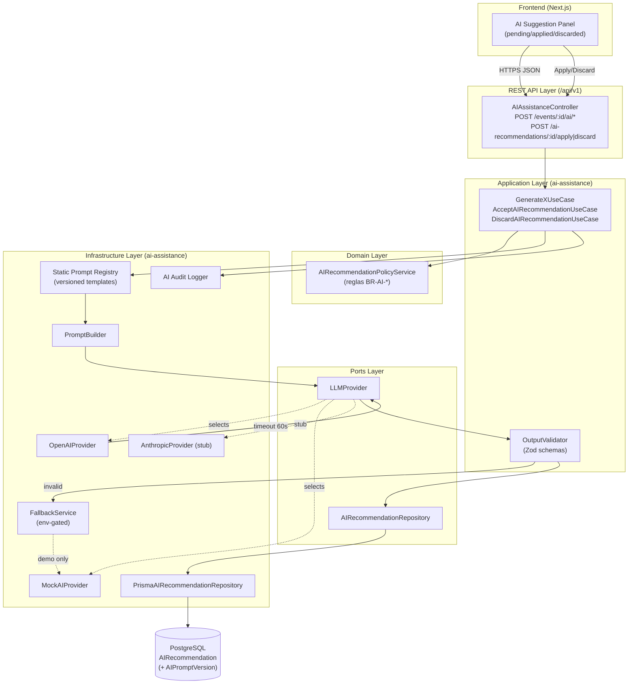
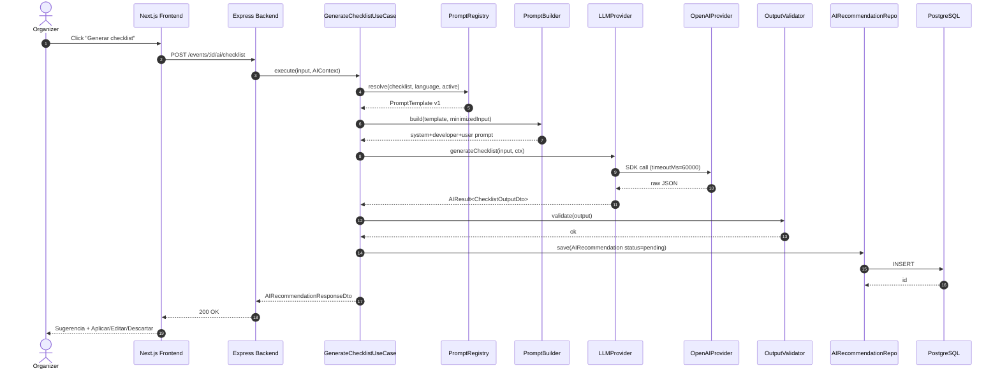
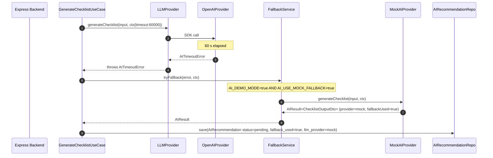

# EventFlow — AI Architecture & PromptOps Design

> **Versión:** 1.0
> **Fecha:** 2026-06-09
> **Producto:** EventFlow — plataforma asistida por IA para planificación de eventos y gestión simplificada de cotizaciones de proveedores
> **MVP target:** AI-assisted event planning workspace + simplified vendor quote flow
> **Idioma del documento:** Español LATAM neutral
> **Estado:** Listo para guiar la implementación del módulo `ai-assistance`, la integración con `LLMProvider`, la persistencia de `AIRecommendation`, la operación de prompts y la estrategia de testing y demo readiness.
> **Audiencia:** AI Solutions Architect, PromptOps Lead, Backend Engineers, Frontend Engineers, QA, Security Reviewer, DevOps, Product Owner, evaluadores académicos, agentes IA generadores de código, tareas y casos de prueba.

---

## 1. Propósito del documento

Este documento define el **diseño de arquitectura de IA y la estrategia de PromptOps** del MVP de EventFlow. Su objetivo es operacionalizar las funcionalidades de IA aprobadas en [`/docs/7-AI-Features-Specification.md`](7-AI-Features-Specification.md) y los principios arquitectónicos de [`/docs/12-Architecture-Vision-and-Principles.md`](12-Architecture-Vision-and-Principles.md) en una arquitectura concreta, segura, testeable y human-in-the-loop.

El documento sirve como **fuente única de verdad** para:

- **Backend Engineers** que implementan el módulo `ai-assistance`, los casos de uso, el puerto `LLMProvider` y los adapters `OpenAIProvider`, `MockAIProvider` y `AnthropicProvider` (stub).
- **PromptOps Lead** que mantiene el registry de prompts, las versiones, los changelogs y las decisiones de promoción/deprecación.
- **Frontend Engineers** que consumen los endpoints de IA y aplican el patrón human-in-the-loop en la UX.
- **Database Physical Designer** que materializa `AIRecommendation` y, opcionalmente, `AIPromptVersion`.
- **Security Reviewer** que valida la minimización de datos en prompts, la mitigación de prompt injection, la gestión de secrets y la trazabilidad.
- **QA / Testing** que diseña tests deterministas con `MockAIProvider`, tests de contrato y E2E del flujo human-in-the-loop.
- **DevOps** que opera variables de entorno, modos demo y configuración por ambiente.
- **Product Owner / evaluadores académicos** que validan que la IA opera como copiloto y nunca toma decisiones autónomas.
- **Agentes IA generadores de código y tareas** que producen prompts, schemas, use cases y tests alineados a este diseño.

Este documento es **insumo directo** para:

- [`/docs/14-Backend-Technical-Design.md`](14-Backend-Technical-Design.md) (refinamiento del módulo `ai-assistance`).
- [`/docs/16-API-Design-Specification.md`](16-API-Design-Specification.md) (validación de los endpoints de IA).
- [`/docs/15-Frontend-Architecture-Design.md`](15-Frontend-Architecture-Design.md) (contrato UX de sugerencias IA).
- `/docs/18-Database-Physical-Design.md` (DDL de `AIRecommendation` y, si se promueve, `AIPromptVersion`).
- `/docs/19-Security-and-Authorization-Design.md` (lineamientos de privacidad de prompts).
- `/docs/20-Testing-Strategy.md` (estrategia de QA del flujo IA).
- `/docs/21-Deployment-and-DevOps-Design.md` (variables de entorno y secrets).
- `/docs/22-Architecture-Decision-Records.md` (ADRs IA listados en §29).
- Generación de **User Stories**, **Backlog** y **Tareas de desarrollo** del módulo IA.

Este documento es **planificación de IA**, no contiene código de producción. Los ejemplos en TypeScript son **pseudocódigo orientativo** para fijar contratos.

---

## 2. Alcance del documento

### 2.1 Incluye

- Arquitectura lógica del módulo `ai-assistance` dentro del Modular Monolith.
- Puerto `LLMProvider` y su contrato.
- Adapter `OpenAIProvider` (principal en MVP).
- Adapter `MockAIProvider` (obligatorio para tests, demo, fallback controlado).
- Adapter `AnthropicProvider` (stub no funcional para validar la sustituibilidad del puerto).
- Prompt registry estático versionado en código.
- Plantillas de prompt por feature IA (anatomía y disciplina).
- Versionado semántico de prompts.
- Schemas de entrada y salida de cada feature IA (Zod recomendado).
- Persistencia de `AIRecommendation` con trazabilidad end-to-end.
- Diseño de `AIPromptVersion` como entidad **recomendada** y su estrategia híbrida (registry en código + opcional tabla).
- Flujo human-in-the-loop (pending → accepted/edited/rejected/discarded).
- Timeout fijo de **60 000 ms** y estrategia de fallback controlada por entorno.
- Estrategia de validación JSON estricta y reintentos acotados.
- Observabilidad: logs estructurados, métricas, correlation ID, audit trail.
- Seguridad y privacidad: minimización de prompts, mitigación de prompt injection, manejo de secrets, RBAC + ownership previos a la llamada IA, redacción de logs.
- Estrategia multi-idioma y manejo de currency en prompts.
- Mapeo entre endpoints REST `/api/v1/...` (definidos en `/docs/16`) y casos de uso de aplicación.
- Contrato UX que el frontend recibe del backend.
- Estrategia de testing (unit, integration, contract, E2E) con mocks deterministas.
- Modo demo (`AI_DEMO_MODE`) y matriz de configuración por ambiente.
- Gobernanza de prompts, revisión y aprobación.
- Riesgos IA y mitigaciones.
- ADRs IA recomendados.
- Checklist de implementación por área.

### 2.2 No incluye

- **Prompts productivos finales**: este documento define la **anatomía**, **versionado**, **gobernanza** y **disciplina** de los prompts. El texto final productivo se crea durante implementación, siguiendo este diseño.
- **Código completo** del módulo `ai-assistance` (use cases, controladores, providers). Vive en backend.
- **OpenAPI YAML** (cubierto en [`/docs/16`](16-API-Design-Specification.md), §43).
- **DDL físico** de `AIRecommendation` y `AIPromptVersion` (cubierto en `/docs/18-Database-Physical-Design.md`).
- **Diseño visual** de las pantallas IA (cubierto en [`/docs/15`](15-Frontend-Architecture-Design.md)).
- **AI para pagos** (sin pagos reales en MVP).
- **AI para contratos digitales** (sin contratos en MVP).
- **Aprobación autónoma de proveedores** (admin manual).
- **Moderación automática de reseñas** (admin manual).
- **Chatbot conversacional libre** o asistente general.
- **Generación de imágenes con IA**.
- **Asistente IA por WhatsApp**.
- **Features IA en app móvil nativa** (sin app móvil en MVP).
- **Routing multi-provider productivo** o failover automático OpenAI ↔ Anthropic.
- **Implementación funcional de Anthropic** (queda como stub).
- **Vector databases, RAG, embeddings** o búsqueda semántica con IA (no aprobado para MVP).
- **Generación de mensajes libres entre organizador y proveedor** (cubierto por brief estructurado).

---

## 3. Fuentes utilizadas

| Documento | Uso en este diseño |
|---|---|
| [`/docs/1-Domain-Discovery-Report.md`](1-Domain-Discovery-Report.md) | Oportunidades IA, pain points del organizador y del proveedor, riesgos IA. Base de los principios y de la priorización de features IA. |
| [`/docs/2-Product-Owner-Decisions.md`](2-Product-Owner-Decisions.md) | Decisiones inmutables de PO: stack, abstracción `LLMProvider`, exclusión de moderación/sentimiento, idiomas, branding premium. |
| [`/docs/3-MVP-Scope-Definition.md`](3-MVP-Scope-Definition.md) | Features IA MVP (§8.1), exclusiones (§8.2), reglas de fallback (§8.4), riesgos IA (§8.5). |
| [`/docs/4-Business-Rules-Document.md`](4-Business-Rules-Document.md) | Reglas BR-AI-001 a BR-AI-015 (HITL, abstracción, fallback, versionado, idioma, sin chat libre, sin imágenes IA). Reglas BR-VENDOR-008, BR-QUOTE-023/024, BR-REVIEW-006. |
| [`/docs/5-User-Roles-Permissions-Matrix.md`](5-User-Roles-Permissions-Matrix.md) | Permisos por rol sobre `AIRecommendation`, RBAC + ownership previo a cada llamada IA. |
| [`/docs/6-Domain-Data-Model.md`](6-Domain-Data-Model.md) | Entidad `AIRecommendation` (§11), entidad recomendada `AIPromptVersion` (§12), flags `ai_generated` en `EventTask`, `BudgetItem`, `QuoteRequest`, `VendorProfile`, `VendorService`. Constraints C-031..C-035, C-046..C-048, C-058, C-062. |
| [`/docs/7-AI-Features-Specification.md`](7-AI-Features-Specification.md) | Catálogo IA MVP (AI-001..AI-008), inputs/outputs, principios IA, estrategia provider, JSON schemas, criterios de aceptación. |
| [`/docs/8-Use-Cases-Specification.md`](8-Use-Cases-Specification.md) | UC-AI-* (use cases IA), flujos human-in-the-loop, validaciones de entrada/salida. |
| [`/docs/8.1-Product-Owner-Decisions-Use-Cases-Addendum.md`](8.1-Product-Owner-Decisions-Use-Cases-Addendum.md) | Decisión #9 (AI timeout 60 s), #15 (OpenAI principal + MockAIProvider + AnthropicProvider stub), #7 (currency inmutable). |
| [`/docs/8.2-Documentation-Alignment-Review-Before-FRD.md`](8.2-Documentation-Alignment-Review-Before-FRD.md) | Validación de consistencia documental previa al FRD. |
| [`/docs/9-Functional-Requirements-Document.md`](9-Functional-Requirements-Document.md) | FR-AI-* (requerimientos funcionales IA), FR-AI-014 (MockAIProvider determinista), FR-AI-017 (idioma parámetro). |
| [`/docs/10-Non-Functional-Requirements.md`](10-Non-Functional-Requirements.md) | NFRs IA: timeout 60 s, fallback, P95 < 8s con streaming, env vars (`LLM_PROVIDER`, `AI_TIMEOUT_MS`), observabilidad, testabilidad. |
| [`/docs/11-Data-Seed-Strategy.md`](11-Data-Seed-Strategy.md) | Datos seed que alimentan las pruebas deterministas del `MockAIProvider` y los escenarios de demo. |
| [`/docs/12-Architecture-Vision-and-Principles.md`](12-Architecture-Vision-and-Principles.md) | Decisión arquitectónica (Modular Monolith + Clean/Hexagonal), principios transversales, lineamientos IA. |
| [`/docs/13-System-Architecture-Document.md`](13-System-Architecture-Document.md) | C4 L1/L2/L3, ubicación del módulo `ai-assistance`, integración con OpenAI/Mock/Anthropic stub. |
| [`/docs/14-Backend-Technical-Design.md`](14-Backend-Technical-Design.md) | Estructura del módulo `ai-assistance`, casos de uso, puerto `LLMProvider`, repositorios, registry estático de prompts, error handling (`AITimeoutError`, `AI_TIMEOUT`). |
| [`/docs/15-Frontend-Architecture-Design.md`](15-Frontend-Architecture-Design.md) | Contrato de consumo de IA desde el frontend, badges "sugerencia IA", flujo apply/discard, manejo de timeouts. |
| [`/docs/16-API-Design-Specification.md`](16-API-Design-Specification.md) | Endpoints REST `/api/v1/events/:eventId/ai/*`, `/ai-recommendations/:id/apply|discard`, DTOs, `aiMeta`, códigos de error. |

Toda afirmación en este documento es trazable a uno o más de los anteriores. Cuando una decisión no aparece de forma explícita en las fuentes, se etiqueta como `Assumption`, `Recommended`, `Future`, `Out of Scope` o `Requires Product Owner Decision`.

---

## 4. Resumen ejecutivo

EventFlow integra IA como **copiloto sugerente y nunca autónomo** sobre el flujo de planificación del organizador y, en menor medida, sobre el onboarding del proveedor. La arquitectura IA se materializa así:

```text
Frontend Next.js (App Router + TanStack Query)
   → REST API Backend (Express + TypeScript)
      → Application Layer: GenerateXUseCase / AcceptAIRecommendationUseCase / DiscardAIRecommendationUseCase
         → LLMProvider (puerto)
            → OpenAIProvider (principal MVP)
            → MockAIProvider (tests, demo, fallback)
            → AnthropicProvider (stub no funcional)
         → Output Validator (Zod) → JSON-only
         → AIRecommendationRepository → PostgreSQL
         → Static Prompt Registry + AIPromptVersion (recomendado)
```

Características no negociables:

- **Backend-only**: el frontend nunca llama a ningún proveedor LLM. Las claves de API jamás cruzan la frontera del backend.
- **Provider abstraction**: todas las llamadas IA pasan por el puerto `LLMProvider`. El dominio no conoce SDKs de proveedor.
- **Human-in-the-loop estricto**: cada salida IA se persiste como `AIRecommendation` con `status='pending'`. No se materializa en `EventTask`, `BudgetItem`, `QuoteRequest.brief`, `VendorProfile.bio` o `VendorService.description` hasta que el usuario aplique explícitamente la sugerencia.
- **Trazabilidad end-to-end**: cada llamada IA registra `user`, `event`/`vendor_profile`, `type`, `prompt_version_id`, `llm_provider`, `language_code`, `input_payload`, `output_payload`, `latency_ms`, `fallback_used`, `correlation_id`, `accepted`, `edited`.
- **Timeout 60 s** (BR-AI-009, decisión PO 8.1 #9). Fallback al `MockAIProvider` **solo** en modo demo/test, controlado por env vars.
- **JSON estricto**: el output del LLM se valida contra schemas Zod; un fallo retorna `422 AI_INVALID_OUTPUT` después de un único reintento controlado.
- **Multi-idioma**: `es-LATAM`, `es-ES`, `pt`, `en`. El idioma viaja como parámetro del prompt.
- **Sin chat libre, sin imágenes, sin moderación IA, sin contratación autónoma**: la IA opera por features acotadas.

El módulo `ai-assistance` es **el único punto del sistema** que conoce qué proveedor LLM está activo, y vive enteramente dentro de la capa de Infrastructure salvo por su Application Layer y su puerto.

---

## 5. Principios de arquitectura IA

| # | Principio | Significado | Implicación técnica | Ejemplo en EventFlow |
|--:|---|---|---|---|
| 1 | IA como copiloto, no decisor | La IA propone, el humano decide | `AIRecommendation.status` arranca en `pending`; nada se materializa sin `apply` | Un checklist generado por IA no crea `EventTask` hasta que el organizador haga POST `/ai-recommendations/:id/apply` |
| 2 | Backend-only AI integration | El frontend no habla con LLMs | API keys solo en backend; el frontend consume `/api/v1/...` | Next.js consume `/events/:id/ai/checklist`; nunca `api.openai.com` |
| 3 | Provider abstraction | El dominio no depende de un vendor | Puerto `LLMProvider` con adapters intercambiables | `OpenAIProvider`, `MockAIProvider`, `AnthropicProvider` (stub) |
| 4 | PromptOps by design | Los prompts son artefactos versionados | Registry estático + `AIPromptVersion` opcional | `PROMPT-CHECKLIST-V1` y `PROMPT-CHECKLIST-V2` coexisten en el código |
| 5 | Human-in-the-loop estricto | Aceptación humana obligatoria | Casos de uso explícitos `AcceptAIRecommendationUseCase` / `DiscardAIRecommendationUseCase` | Aceptar checklist crea `EventTask[]` dentro de una transacción |
| 6 | Salidas estructuradas (JSON-only) | Sin texto libre como API | Schemas Zod validados antes de persistir | `BudgetSuggestionOutputDto` validado por `budgetSuggestionOutputSchema` |
| 7 | Trazabilidad por defecto | Toda llamada IA es auditable | `AIRecommendation` persiste prompt version, provider, payloads, latencias, fallback | Cada `BudgetItem.ai_generated=true` referencia un `ai_recommendation_id` |
| 8 | Privacidad por minimización | Solo enviar lo necesario al LLM | Mappers que filtran campos sensibles antes del prompt | No se envía email, teléfono, ni notas privadas al LLM |
| 9 | Demo y tests deterministas | Reproducibilidad obligatoria | `MockAIProvider` con seeds por feature/locale | El plan de boda de demo siempre se ve igual |
| 10 | Sin acciones autónomas de alto impacto | La IA no contrata, no paga, no aprueba | Lista de operaciones prohibidas explícita | La IA no puede crear `BookingIntent` ni cambiar `VendorProfile.status` |
| 11 | Sin leak del SDK fuera de Infrastructure | Domain y Application puros | `openai` y `@anthropic-ai/sdk` solo en `infrastructure/providers/*` | Importar `openai` en `application/` falla en code review |
| 12 | Sin overengineering para MVP | Lo justo y necesario | Registry estático en código antes que tabla mutable; un proveedor real activo | No hay routing dinámico por costo en MVP |

---

## 6. Arquitectura lógica de IA

El módulo `ai-assistance` aloja toda la lógica IA del MVP. Internamente sigue Clean / Hexagonal con cuatro responsabilidades:

1. **Orquestación de casos de uso IA** (Application Layer): un caso de uso por feature (`GenerateEventPlanUseCase`, `GenerateChecklistUseCase`, etc.) más los casos de uso transversales (`AcceptAIRecommendationUseCase`, `DiscardAIRecommendationUseCase`).
2. **Selección y construcción de prompts** (Infrastructure / Prompt Registry): un `PromptRegistry` estático que resuelve plantillas por `feature_type` + `language_code` + `version`, y un `PromptBuilder` que arma el system/developer/user prompt con el payload minimizado.
3. **Invocación del proveedor LLM** (Infrastructure / Providers): adapters que implementan el puerto `LLMProvider` y traducen al SDK específico del proveedor (OpenAI Responses API, Anthropic Messages API, Mock determinista).
4. **Validación, persistencia y trazabilidad** (Application + Infrastructure): el output del proveedor se valida con Zod, se persiste como `AIRecommendation` con `status='pending'`, y se emiten métricas y logs estructurados.



Notas:

- El `PromptRegistry` no es un servicio dinámico: es código versionado. La existencia de una entrada `(feature_type, language_code, version)` se garantiza en bootstrap.
- El `FallbackService` solo degrada a `MockAIProvider` cuando `AI_DEMO_MODE=true` o `AI_USE_MOCK_FALLBACK=true`. Fuera de esos modos, devuelve un error controlado.
- La aceptación humana (paso `apply`) **no** invoca al LLM; opera sobre `AIRecommendation` ya persistido.

---

## 7. Ubicación dentro del Modular Monolith

EventFlow MVP es un Modular Monolith bajo Clean / Hexagonal Architecture (`/docs/13`, `/docs/14`). El módulo `ai-assistance` se ubica como sigue.

| Layer | AI responsibility | Allowed components | Forbidden dependencies |
|---|---|---|---|
| **Interface Layer** (Express) | Recibir requests `/events/:id/ai/*` y `/ai-recommendations/:id/apply|discard`, validar DTO de entrada con Zod, traducir a use cases, devolver `AIRecommendationResponseDto` | `AIAssistanceController`, middlewares (`authMiddleware`, `roleMiddleware`, `ownershipMiddleware`, `validateBody`), presenters | Lógica de negocio, llamadas directas a SDK de LLM, acceso a Prisma |
| **Application Layer** | Orquestar la generación: cargar contexto, seleccionar prompt version, llamar al puerto `LLMProvider`, validar JSON, persistir `AIRecommendation`, materializar en `apply` | `GenerateEventPlanUseCase`, `GenerateChecklistUseCase`, `GenerateBudgetSuggestionUseCase`, `RecommendVendorCategoriesUseCase`, `GenerateQuoteBriefUseCase`, `CompareQuotesUseCase`, `GenerateVendorBioUseCase`, `PrioritizeTasksUseCase`, `AcceptAIRecommendationUseCase`, `DiscardAIRecommendationUseCase` | Express (`Request`/`Response`), `PrismaClient`, SDK `openai`, SDK `@anthropic-ai/sdk` |
| **Domain Layer** | Reglas invariantes IA y validaciones de aceptación | `AIRecommendation` (entity), `AIRecommendationPolicyService`, enums `AIRecommendationType`, `AIRecommendationStatus`, value objects (`PromptVersionId`, `LanguageCode`) | Express, Prisma, OpenAI/Anthropic SDK, axios |
| **Ports Layer** | Contratos hacia el exterior del módulo | `LLMProvider` interface, `AIRecommendationRepository` interface, `AIPromptVersionRepository` interface (opcional) | Implementaciones concretas |
| **Infrastructure Layer** | Implementación técnica intercambiable | `OpenAIProvider`, `MockAIProvider`, `AnthropicProvider`, `PromptRegistry`, `PromptBuilder`, `OutputValidator`, `FallbackService`, `AIAuditLogger`, `PrismaAIRecommendationRepository` | Reglas de negocio IA (no codificar BR-AI-* en infrastructure) |
| **Shared Kernel** | Tipos comunes IA | `AIContext`, `AIRequestId`, `CorrelationId`, errores IA (`AITimeoutError`, `AIInvalidOutputError`, `AIProviderUnavailableError`) | Lógica específica de feature |

Reglas inviolables:

- **Controllers** (`AIAssistanceController`) **no** contienen lógica de IA: solo traducen HTTP ↔ use case.
- **Domain** no importa `openai`, `@anthropic-ai/sdk`, ni ningún cliente HTTP.
- **Application** depende del puerto `LLMProvider`, **no** de los providers concretos. La inyección la resuelve el composition root del backend.
- **Infrastructure** es el único lugar donde viven los SDK de LLM. `openai` solo se importa en `infrastructure/providers/openai-provider.ts`.
- **Otros módulos** (`event-planning`, `budget-management`, `quote-flow`, `vendor-management`, `task-management`) **no** llaman directamente al `LLMProvider`. Si necesitan IA, invocan a `ai-assistance` o consumen `AIRecommendation` materializado tras `apply`.

---

## 8. Catálogo de funcionalidades IA del MVP

Las 8 features IA se derivan de [`/docs/7-AI-Features-Specification.md`](7-AI-Features-Specification.md) §8 y se materializan como casos de uso en [`/docs/14`](14-Backend-Technical-Design.md) §17. Cada feature tiene una plantilla de prompt versionada en el registry.

| AI ID | Funcionalidad | Actor principal | Prioridad MVP | Entrada principal | Salida esperada | Materializa entidades | Requiere aceptación humana | Prompt template ID |
|---|---|---|---|---|---|---|---|---|
| AI-001 | Generación de plan de evento | Organizer | Must Have | `event_type_code`, `event_date`, `guests_count`, `location`, `estimated_budget`, `currency_code`, `language_code`, `style_preferences?` | `EventPlanOutputDto` (`summary`, `phases[]`, `recommendedVendorCategories[]`, `warnings[]`) | No materializa entidades por sí solo; alimenta AI-002 y AI-004 | Sí (apply/discard sobre `AIRecommendation`) | `PROMPT-EVENT-PLAN-V1` |
| AI-002 | Generación de checklist | Organizer | Must Have | `eventId`, contexto del evento, `language_code` | `ChecklistOutputDto` (`tasks[]` con `title`, `category`, `relativeDueDate`, `priority`) | `EventTask[]` con `ai_generated=true` y `ai_recommendation_id` | Sí | `PROMPT-CHECKLIST-V1` |
| AI-003 | Sugerencia de distribución de presupuesto | Organizer | Must Have | `eventId`, `estimated_budget`, `currency_code`, `guests_count`, `event_type_code`, `language_code` | `BudgetSuggestionOutputDto` (`currency`, `totalBudget`, `items[]` con `category`, `suggestedAmount`, `percentage`, `reason`) | `BudgetItem[]` con `ai_generated=true` y `ai_recommendation_id` | Sí | `PROMPT-BUDGET-SUGGESTION-V1` |
| AI-004 | Recomendación de categorías de proveedor | Organizer | Must Have | `eventId`, contexto del evento, `language_code` | `VendorCategoriesOutputDto` (`categories[]` con `category`, `priority`, `required`, `reason`) | No materializa entidades directamente; el organizador usa la lista para iniciar `QuoteRequest` | Sí (apply opcional como hint persistido) | `PROMPT-VENDOR-CATEGORIES-V1` |
| AI-005 | Generación de brief de cotización | Organizer | Must Have | `eventId`, `category`, `language_code`, restricciones del organizador | `QuoteBriefOutputDto` (`brief`, `requirements[]`, `questions[]`, `constraints[]`) | `QuoteRequest.brief` (campo) + flag `ai_generated_brief=true` y `ai_recommendation_id` | Sí | `PROMPT-QUOTE-BRIEF-V1` |
| AI-006 | Resumen comparativo de cotizaciones | Organizer | Should Have | `quoteRequestId`, `quotes[]` (totales, ítems, vigencia, condiciones), `language_code` | `QuoteComparisonOutputDto` (`summary`, `quotes[]` con `strengths`, `risks`, `missingInformation`, `nonBindingRecommendation`) | **No materializa** (solo recomendación de lectura) | Sí (apply opcional para guardar lectura; discard la archiva) | `PROMPT-QUOTE-COMPARISON-V1` |
| AI-007 | Generación de bio / descripción de paquetes del proveedor | Vendor | Could Have | `vendorProfileId`, datos del proveedor, idioma de la cuenta | Bio sugerida + descripciones de paquetes | `VendorProfile.bio` con `ai_generated_bio=true` y `VendorService.description` con `ai_generated_description=true` | Sí | `PROMPT-VENDOR-BIO-V1` |
| AI-008 | Priorización de tareas urgentes | Organizer | Should Have | `eventId`, `tasks[]` con estado, `event_date`, `language_code` | Top 3 acciones urgentes con razón | **No materializa** (solo recomendación de lectura priorizada) | Sí (apply opcional como recordatorio; discard la archiva) | `PROMPT-TASK-PRIORITIZATION-V1` |

> Las features AI-006 y AI-008 pueden permanecer como recomendaciones de lectura sin materializar entidades. En esos casos, `apply` solo actualiza `AIRecommendation.status='accepted'` y, opcionalmente, marca al usuario como "leída". Las features AI-001 y AI-004 pueden tener `apply` opcional según el flujo del frontend, pero por defecto deben llegar a `accepted` o `discarded`.

---

## 9. Diseño de Provider Abstraction

### 9.1 `LLMProvider` port

El puerto `LLMProvider` es la **única superficie de contacto** entre el dominio EventFlow y cualquier proveedor LLM. Todos los adapters lo implementan.

```ts
// Pseudocódigo orientativo — vive en /modules/ai-assistance/ports/llm-provider.ts

export type LanguageCode = "es-LATAM" | "es-ES" | "pt" | "en";

export interface AIContext {
  language: LanguageCode;
  currency?: string;          // ISO 4217 del evento; nunca convertida automáticamente
  userId: string;
  eventId?: string;
  vendorProfileId?: string;
  promptVersionId: string;    // p. ej. "PROMPT-CHECKLIST-V1"
  correlationId: string;
  timeoutMs: number;          // por defecto 60_000
  preferMock?: boolean;       // honrado solo si AI_DEMO_MODE=true
}

export interface AIResult<TOutput> {
  output: TOutput;
  provider: "openai" | "anthropic" | "mock";
  promptVersionId: string;
  languageCode: LanguageCode;
  latencyMs: number;
  fallbackUsed: boolean;
  rawOutputHash?: string;     // para auditoría sin almacenar el texto crudo
}

export interface LLMProvider {
  generateEventPlan(input: EventPlanInputDto, ctx: AIContext): Promise<AIResult<EventPlanOutputDto>>;
  generateChecklist(input: ChecklistInputDto, ctx: AIContext): Promise<AIResult<ChecklistOutputDto>>;
  generateBudgetSuggestion(input: BudgetSuggestionInputDto, ctx: AIContext): Promise<AIResult<BudgetSuggestionOutputDto>>;
  recommendVendorCategories(input: VendorCategoriesInputDto, ctx: AIContext): Promise<AIResult<VendorCategoriesOutputDto>>;
  generateQuoteBrief(input: QuoteBriefInputDto, ctx: AIContext): Promise<AIResult<QuoteBriefOutputDto>>;
  compareQuotes(input: QuoteComparisonInputDto, ctx: AIContext): Promise<AIResult<QuoteComparisonOutputDto>>;
  generateVendorBio(input: VendorBioInputDto, ctx: AIContext): Promise<AIResult<VendorBioOutputDto>>;
  prioritizeTasks(input: TaskPrioritizationInputDto, ctx: AIContext): Promise<AIResult<TaskPrioritizationOutputDto>>;
}
```

Notas de diseño:

- Una sola interfaz con un método por feature. Esto evita un método genérico `invoke(promptId, input)` que diluiría el tipado.
- `AIContext` viaja en cada llamada y permite trazabilidad sin acoplar al dominio.
- Los errores se modelan como excepciones tipadas: `AITimeoutError`, `AIInvalidOutputError`, `AIProviderUnavailableError`, `AIProviderNotConfiguredError`. El use case decide cómo traducirlas a errores HTTP.
- El puerto **no expone streaming** en MVP. El frontend usa skeletons; el documento `/docs/15` puede agregar streaming opcional sin romper el contrato si se decide en una v1.1.

### 9.2 Provider implementations

| Provider | Estado MVP | Responsabilidad | Uso permitido | Restricciones |
|---|---|---|---|---|
| `OpenAIProvider` | **Approved, principal** | Implementa `LLMProvider` invocando la API de OpenAI (Responses API o Chat Completions). Aplica `timeoutMs`, captura errores transport y los traduce a errores tipados. Construye el body con el prompt provisto por el `PromptBuilder` y exige `response_format: json_schema` o equivalente. | Cuando `LLM_PROVIDER=openai`. Funcional para todas las features IA del MVP. | No incluye lógica de negocio. No persiste nada. No hace fallback por sí mismo. Solo lanza errores tipados. |
| `MockAIProvider` | **Approved, obligatorio** | Implementa `LLMProvider` con outputs deterministas por `(feature_type, language_code, scenario_seed, prompt_version_id)`. Lee fixtures estáticos. | Cuando `LLM_PROVIDER=mock` (tests, demo offline) o cuando el `FallbackService` decide degradar bajo `AI_DEMO_MODE=true` o `AI_USE_MOCK_FALLBACK=true`. | No puede ser el provider por defecto en producción académica. Cada llamada deja `fallbackUsed=true` cuando se invocó vía fallback. |
| `AnthropicProvider` | **Approved, stub no funcional** | Implementa `LLMProvider` con todos los métodos lanzando `AIProviderNotConfiguredError` salvo que se quiera prototipar localmente. Garantiza que la interfaz es realmente sustituible. | Cuando `LLM_PROVIDER=anthropic`. No se promete operación funcional MVP. | No se incluye en demo académica. No participa en fallback automático. No requiere clave configurada. |

> Una decisión PO explícita (8.1 #15) congela este reparto: OpenAI principal + Mock obligatorio + Anthropic stub. Cualquier desviación requiere ADR y nueva decisión PO.

### 9.3 Provider selection

La selección del provider es **estática por bootstrap**, gobernada por variables de entorno. No existe selector dinámico en la UI ni failover automático en runtime.

```env
# Provider selection
LLM_PROVIDER=openai          # openai | mock | anthropic

# OpenAI configuration (solo si LLM_PROVIDER=openai)
OPENAI_API_KEY=
OPENAI_MODEL=                # p. ej. gpt-4o-mini; valor final lo fija PromptOps
OPENAI_BASE_URL=             # opcional, para entornos compatibles

# Anthropic configuration (no se usa en MVP funcional; solo stub)
ANTHROPIC_API_KEY=
ANTHROPIC_MODEL=

# Timeout (BR-AI-009, decisión PO 8.1 #9)
AI_TIMEOUT_MS=60000

# Modos operativos
AI_DEMO_MODE=false           # true habilita preferencia de mock en demo
AI_USE_MOCK_FALLBACK=false   # true permite que el FallbackService degrade a MockAIProvider

# PromptOps
AI_PROMPT_REGISTRY_VERSION=v1

# Logging
AI_LOG_PAYLOADS=false        # true solo en local; en otros ambientes los payloads no se loguean en claro
```

Defaults seguros por ambiente:

- **local-dev**: `LLM_PROVIDER=openai` o `mock` según el desarrollador. `AI_LOG_PAYLOADS=true` permitido para depurar prompts. `AI_DEMO_MODE=false`.
- **test (CI/local)**: `LLM_PROVIDER=mock`. `AI_DEMO_MODE=true`. `AI_LOG_PAYLOADS=false`. Determinismo absoluto.
- **demo-academic**: `LLM_PROVIDER=openai`. `AI_DEMO_MODE=true`. `AI_USE_MOCK_FALLBACK=true`. Así, si OpenAI se cae en demo, el sistema degrada silenciosamente con `fallbackUsed=true` y la demo continúa.
- **production-academic**: `LLM_PROVIDER=openai`. `AI_DEMO_MODE=false`. `AI_USE_MOCK_FALLBACK=false`. Sin fallback silencioso: si OpenAI se cae o devuelve inválido, el sistema responde `503 AI_PROVIDER_TIMEOUT` o `422 AI_INVALID_OUTPUT`.

En bootstrap, el composition root del backend:

1. Lee `LLM_PROVIDER` y valida que el enum sea válido.
2. Construye el adapter correspondiente.
3. Si es `openai` y `OPENAI_API_KEY` está vacío, registra warning y rechaza la llamada en runtime con `AIProviderNotConfiguredError`.
4. Si es `anthropic`, inyecta el stub.
5. Registra en logs el provider activo con `level=info` (no sensible).

---

## 10. PromptOps Strategy

PromptOps es la disciplina de **gestionar prompts como artefactos versionados, revisables y trazables**, equiparable a la gestión de migraciones de base de datos.

### 10.1 Prompt registry

El registry MVP es **estático y vive en código**, decisión avalada por [`/docs/14`](14-Backend-Technical-Design.md) §17.5 ("Static versioned prompt registry") y por [`/docs/6`](6-Domain-Data-Model.md) §12 (`AIPromptVersion` recomendado, no obligatorio). Cada prompt se versiona en un archivo TypeScript con un ID estable.

Estructura de carpetas recomendada:

```text
src/modules/ai-assistance/
  application/
    use-cases/
      generate-event-plan.use-case.ts
      generate-checklist.use-case.ts
      generate-budget-suggestion.use-case.ts
      recommend-vendor-categories.use-case.ts
      generate-quote-brief.use-case.ts
      compare-quotes.use-case.ts
      generate-vendor-bio.use-case.ts
      prioritize-tasks.use-case.ts
      accept-ai-recommendation.use-case.ts
      discard-ai-recommendation.use-case.ts
  domain/
    entities/ai-recommendation.entity.ts
    services/ai-recommendation-policy.service.ts
    enums/ai-recommendation-type.enum.ts
  ports/
    llm-provider.ts
    ai-recommendation-repository.ts
    ai-prompt-version-repository.ts        # opcional
  infrastructure/
    providers/
      openai-provider.ts
      mock-ai-provider.ts
      anthropic-provider.ts
    prompt-registry/
      prompts/
        event-plan.v1.prompt.ts
        checklist.v1.prompt.ts
        budget-suggestion.v1.prompt.ts
        vendor-categories.v1.prompt.ts
        quote-brief.v1.prompt.ts
        quote-comparison.v1.prompt.ts
        vendor-bio.v1.prompt.ts
        task-prioritization.v1.prompt.ts
      prompt-registry.ts
      prompt-version-loader.ts
      prompt-builder.ts
    output-validators/
      event-plan.schema.ts
      checklist.schema.ts
      ...
    fallback/fallback-service.ts
    audit/ai-audit-logger.ts
    persistence/prisma-ai-recommendation.repository.ts
    fixtures/                                # MockAIProvider seeds
      event-plan/
      checklist/
      ...
```

El `PromptRegistry` se inicializa una vez en bootstrap y expone:

```ts
interface PromptRegistry {
  resolve(
    featureType: AIRecommendationType,
    language: LanguageCode,
    versionPolicy: "active" | "specific",
    specificVersion?: string,
  ): PromptTemplate;
}
```

### 10.2 Prompt template anatomy

Cada prompt template debe declarar de forma explícita las siguientes secciones. Esto es **disciplina de PromptOps**, no decoración:

1. **Stable prompt ID** — p. ej. `PROMPT-CHECKLIST-V1`. Inmutable una vez publicado.
2. **Version** — semántico, dentro del ID (`V1`, `V2`).
3. **Feature type** — uno de `AIRecommendationType`.
4. **Status** — `draft | reviewed | approved | active | deprecated | archived`.
5. **Language support** — set de `LanguageCode` soportados.
6. **Input schema reference** — referencia al schema Zod de input.
7. **Output schema reference** — referencia al schema Zod de output.
8. **System instructions** — rol del modelo, restricciones globales (idioma, JSON-only, no decisión autónoma).
9. **Developer/business rules** — reglas de negocio relevantes (p. ej. "no inventes precios de mercado", "respeta la moneda del evento", "fechas relativas con formato `T-DDDd`").
10. **User content boundary** — bloque delimitado donde se inserta el payload minimizado del usuario; el modelo lo trata como **datos**, no instrucciones.
11. **Safety constraints** — qué nunca debe hacer el modelo (sugerir vendors específicos, generar texto legal vinculante, prometer disponibilidad).
12. **JSON-only instruction** — el output debe ser un objeto JSON que cumple el output schema; sin prosa adicional.
13. **Human-in-the-loop reminder** — el modelo debe saber que la salida es una sugerencia editable.
14. **Exclusions / out-of-scope constraints** — sin moderación, sin imágenes, sin chat libre, sin contratación.
15. **Test fixtures** — uno o más fixtures que el `MockAIProvider` y los tests de QA usan como output esperado para esa versión.

Cada prompt template exporta:

```ts
export const promptEventPlanV1 = {
  id: "PROMPT-EVENT-PLAN-V1",
  version: "1",
  featureType: "event_plan",
  status: "active",
  languageSupport: ["es-LATAM", "es-ES", "pt", "en"],
  inputSchemaRef: "EventPlanInputSchema",
  outputSchemaRef: "EventPlanOutputSchema",
  systemInstructions: "...",
  developerRules: "...",
  safetyConstraints: ["no_vendor_recommendation", "no_price_invention", "no_currency_conversion"],
  buildUserPrompt: (input: EventPlanInputDto, ctx: AIContext) => string,
  fixtures: [/* deterministic mock outputs per locale */],
  metadata: {
    createdBy: "promptops-lead",
    approvedBy: "product-owner",
    createdAt: "2026-06-09",
    approvedAt: "2026-06-09",
    changeReason: "Initial MVP version",
    relatedRules: ["BR-AI-001", "BR-AI-008", "BR-AI-010", "BR-AI-011"],
  },
} as const;
```

### 10.3 Prompt versioning

Versionado **semántico simplificado**: una sola dimensión incremental `V1, V2, V3, ...` por prompt ID. No hay minor/patch en el ID. Los cambios sin impacto en comportamiento son refactors no versionables.

**Crear nueva versión cuando:**

- El schema de salida cambia (nuevos campos, renombres, cambio de tipos, cardinalidades).
- Las reglas de negocio que el prompt aplica cambian (p. ej. nuevas categorías de vendor, nueva restricción de moneda).
- Las safety constraints cambian.
- El idioma soportado cambia (se suma `pt`, por ejemplo).
- El feature behavior cambia (`AI-002` empieza a sugerir prioridad y antes no).
- Un test de regresión documenta que el prompt actual produce salidas incorrectas.

**No crear nueva versión cuando:**

- Se corrigen typos sin cambiar el comportamiento.
- Se reorganiza el orden de comentarios internos del archivo.
- Se refactoriza el `buildUserPrompt` sin cambiar el texto efectivamente enviado al modelo.
- Se ajusta formatting que no afecta la salida.

Cuando se crea una nueva versión:

- La versión anterior pasa a `deprecated` y luego a `archived`. Nunca se borra: queda para auditoría.
- La nueva versión arranca en `draft`, requiere review, y promueve a `approved → active` mediante el flujo descrito en §10.4 y §10.5.
- `AIRecommendation` siempre persiste el `prompt_version_id` que usó al generarse, por lo que recomendaciones históricas no se invalidan.

### 10.4 Prompt lifecycle

Cada prompt template avanza por estos estados:

| Estado | Significado | Quién puede mover | Qué desencadena |
|---|---|---|---|
| `draft` | Creado, no revisado. No se carga en runtime. | PromptOps Lead, Backend Engineer | Cambio de feature, bug detectado, nueva feature IA. |
| `reviewed` | Revisado por al menos un revisor según §10.5. Aún no aprobado. | PromptOps Lead, Backend Engineer | Review humano. |
| `approved` | Product Owner ha validado el cambio. Aún no es el activo. | Product Owner | Aprobación final. |
| `active` | Es la versión que se sirve cuando el use case solicita `featureType + language`. | Composition root del backend | Promoción manual mediante constante en el registry o flag. |
| `deprecated` | Existe una versión más nueva en `active`. Aún consultable para auditoría y para servir requests antiguos en debug. | PromptOps Lead | Promoción de una versión más nueva. |
| `archived` | Versión histórica. No se sirve. Permanece en código y, si aplica, en `AIPromptVersion`. | PromptOps Lead | Limpieza programada. |

Reglas:

- En cualquier momento existe **una sola versión `active`** por `(featureType, languageCode)`. El registry rechaza arrancar si encuentra dos.
- Una versión nunca regresa de `archived` a `active`: si se necesita revivirla, se crea una nueva versión que clone el contenido.
- `AIRecommendation.prompt_version_id` puede apuntar a versiones `deprecated` o `archived`: la trazabilidad histórica no requiere que la versión esté `active`.

### 10.5 Prompt ownership and review

Cada cambio de prompt requiere revisores. Para MVP:

| Tipo de cambio | Revisores obligatorios |
|---|---|
| Typo / formatting sin cambio de versión | Backend Engineer (autor) + PromptOps Lead (sign-off ligero). |
| Cambio menor que no toca schema ni reglas | PromptOps Lead + Product Owner (notificación). |
| Cambio que altera output schema o materialización | PromptOps Lead + Backend Engineer + Product Owner. |
| Cambio en safety constraints o en uso de datos sensibles | PromptOps Lead + Backend Engineer + Product Owner + Security Reviewer. |
| Promoción `approved → active` | PromptOps Lead + QA (con evidencia de tests verdes). |
| Deprecación / archivo | PromptOps Lead. |

El **PromptOps Lead** es el rol responsable. En MVP académico, puede ser asumido por el AI Solutions Architect o por el Backend Engineer senior; el documento solo exige que el rol exista y que un cambio no se promueva sin él.

### 10.6 Prompt changelog

Cada versión de prompt **debe** llevar un changelog asociado, ya sea en el propio archivo (`metadata.changeReason`) o en una entrada de `/docs/changelog/prompts.md` (recomendado si crece la cantidad). Cada entrada incluye:

- **ID de prompt y versión**: `PROMPT-CHECKLIST-V2`.
- **Razón del cambio**: descripción técnica y de negocio.
- **FR/BR/UC/NFR relacionados**: e.g. `BR-AI-008`, `FR-AI-005`.
- **Revisor(es)**: nombres o roles.
- **Fecha de creación y aprobación**.
- **Notas de compatibilidad**: ¿cambia el output schema? ¿cómo se migran recomendaciones pendientes?
- **Evidencia de tests**: enlace a PR y a snapshot tests verdes.

> Nota: en MVP, `AIRecommendation` ya guarda `prompt_version_id`, lo que vuelve el changelog **suficiente** para reproducir cualquier salida histórica con la combinación de input persistido + plantilla histórica.

---

## 11. `AIPromptVersion` design

### 11.1 Estado de la entidad

`AIPromptVersion` está definida en [`/docs/6`](6-Domain-Data-Model.md) §12 como **Recommended** (no Explicit). [`/docs/14`](14-Backend-Technical-Design.md) §17.5 propone implementarla como **registry estático en código** para el MVP, con la opción de promoverla a tabla si se requiere consulta admin o versionado dinámico.

Este documento ratifica esa decisión: en MVP, `AIPromptVersion` **no es una tabla mutable obligatoria**; es un **conjunto de entradas estáticas** representadas tanto en código (archivos `*.prompt.ts`) como, opcionalmente, en una tabla de solo lectura para visibilidad.

### 11.2 Modelo lógico (si se persiste)

```text
AIPromptVersion
  id: uuid (PK)
  prompt_id: string                  // p. ej. "PROMPT-CHECKLIST"
  version: string                    // p. ej. "V1"
  feature_type: AIRecommendationType
  status: enum (draft, reviewed, approved, active, deprecated, archived)
  language_support: string[]         // ["es-LATAM", "es-ES", "pt", "en"]
  input_schema_version: string
  output_schema_version: string
  template_hash: string              // hash del template para detectar drift
  change_reason: text
  created_by: string
  approved_by: string?
  created_at: timestamp
  approved_at: timestamp?
  deprecated_at: timestamp?
```

Restricciones lógicas:

- `(prompt_id, version)` es único.
- Solo una entrada con `status='active'` por `(prompt_id)`.
- `AIRecommendation.prompt_version_id` referencia esta tabla cuando existe, o el ID estable del registry cuando no.

### 11.3 Relación con `AIRecommendation`

`AIRecommendation.prompt_version_id` referencia siempre el ID estable del prompt ejecutado. La trazabilidad funciona en dos modos:

- **Modo registry-only (MVP por defecto):** `prompt_version_id` es el string `"PROMPT-CHECKLIST-V1"`. La auditoría reconstruye el prompt desde el repositorio Git por el ID.
- **Modo persistido (recomendado para producción):** `prompt_version_id` es un UUID que referencia una fila en `AIPromptVersion`. La auditoría puede consultar la tabla directamente.

El backend debe poder operar en ambos modos sin cambiar la API REST. La diferencia es interna.

### 11.4 Cuándo promoverla a tabla

Recomendado cuando:

- Se requiere que admin vea/edite prompts desde un panel sin redeploy.
- Se planea soportar A/B testing de prompts.
- Compliance exige inventario de prompts fuera del repositorio.

No se requiere para el MVP académico.

---

## 12. `AIRecommendation` persistence design

### 12.1 Modelo lógico

Cada llamada IA que llega a un output válido o controlado se persiste como una fila en `AIRecommendation`. Esto incluye:

- Outputs exitosos.
- Outputs fallidos por validación (registrados como `failed`).
- Outputs servidos por fallback determinista en modo demo (registrados con `fallback_used=true`).

```text
AIRecommendation
  id: uuid (PK)
  type: enum AIRecommendationType
        (event_plan | checklist | budget_suggestion | vendor_categories |
         quote_brief | quote_comparison | vendor_bio | task_prioritization)
  user_id: uuid (FK User)
  event_id: uuid (FK Event, nullable)
  vendor_profile_id: uuid (FK VendorProfile, nullable)
  llm_provider: enum (openai | anthropic | mock)
  prompt_version_id: string                 // ID estable o UUID si tabla
  language_code: enum LanguageCode
  input_payload: jsonb                      // sin datos sensibles
  output_payload: jsonb                     // tal cual lo devolvió el LLM, ya validado
  validated_output_payload: jsonb?          // canonicalizado por Zod si difiere
  status: enum (pending | accepted | rejected | discarded | failed | expired)
  accepted: boolean                         // derivado: true cuando status='accepted'
  edited: boolean                           // true si el usuario editó antes de aceptar
  fallback_used: boolean
  timeout_ms: int                           // configurado al momento de la llamada
  latency_ms: int                           // medido
  schema_valid: boolean
  retry_count: int                          // 0 o 1
  error_code: string?                       // si status='failed'
  correlation_id: string
  created_at: timestamp
  accepted_at: timestamp?
  rejected_at: timestamp?
  expires_at: timestamp?                    // opcional, para limpieza de pending viejas
```

> El DDL definitivo lo establece `/docs/18-Database-Physical-Design.md`. Este documento fija el **contrato semántico**.

### 12.2 Estados y transiciones

| Estado | Significado | Quién lo provoca | Próximos estados válidos |
|---|---|---|---|
| `pending` | Recommendation persistido tras llamada exitosa al LLM. Output válido contra schema. | `GenerateXUseCase` | `accepted`, `rejected`, `discarded`, `expired` |
| `accepted` | El organizador o vendor aceptó la sugerencia. Las entidades destino se materializan en la misma transacción cuando aplica. | `AcceptAIRecommendationUseCase` | — (terminal) |
| `rejected` | El usuario rechazó explícitamente con feedback (p. ej. "no me sirve") — opcional para MVP. | `RejectAIRecommendationUseCase` (si se implementa) o `AcceptAIRecommendationUseCase` con flag negativo | — (terminal) |
| `discarded` | El usuario descartó sin feedback (cierre de modal, swipe). Equivale a "ignored". | `DiscardAIRecommendationUseCase` | — (terminal) |
| `failed` | La llamada al LLM produjo output inválido tras el reintento permitido, o devolvió error tipado. No se muestra al usuario como sugerencia, pero se persiste para diagnóstico. | `GenerateXUseCase` (en el `catch`) | — (terminal). Excepcionalmente puede regenerarse: el nuevo intento crea otro `AIRecommendation`. |
| `expired` | Recommendation `pending` que excedió una ventana de validez. Limpieza opcional por job. | Job programado | — (terminal) |

> **Por qué `pending` es el default**: porque la regla BR-AI-001 prohíbe materializar sin aceptación humana. Hasta que el usuario actúe, la recomendación existe pero no es dato oficial.

### 12.3 Materialización al aceptar

`AcceptAIRecommendationUseCase` orquesta:

1. Carga `AIRecommendation` por `id` y valida ownership.
2. Valida `status='pending'` (idempotente: si ya está `accepted`, devuelve resultado previo; si ya está `discarded`/`rejected`, retorna `409` o `422 AI_RECOMMENDATION_NOT_PENDING`).
3. Valida el `output_payload` (o el `editedPayload` provisto en la request) contra el output schema vigente.
4. Si el usuario editó el payload, persiste `edited=true` y conserva tanto el `output_payload` original como el `validated_output_payload` editado.
5. Materializa entidades destino dentro de una transacción Prisma (ver §15).
6. Actualiza `AIRecommendation.status='accepted'`, `accepted_at=now()`.
7. Emite métricas y log de auditoría.

### 12.4 Persistencia de ediciones

Las ediciones del usuario antes de aceptar **no se hacen al campo `output_payload`** del LLM. Se persisten en `validated_output_payload` y se marca `edited=true`. Esto preserva la trazabilidad de "qué dijo el modelo" vs. "qué aceptó el humano".

### 12.5 Fallback y outputs `failed`

- Si el provider primario falla y el `FallbackService` degrada a `MockAIProvider`, se persiste `AIRecommendation` con `llm_provider='mock'` y `fallback_used=true`. El status puede ser `pending` (output válido) o `failed` (output inválido).
- Si no hay fallback aplicable y la llamada falla, se persiste un `AIRecommendation` con `status='failed'`, `error_code` (p. ej. `AI_PROVIDER_TIMEOUT`), `latency_ms` medido, `output_payload=null`. Esto preserva el incidente para observabilidad sin contaminar las sugerencias activas del usuario.

---

## 13. Input and Output Schema Strategy

### 13.1 Política general

- **Todo** input y output IA tiene un schema Zod en `infrastructure/output-validators/`.
- La validación de input ocurre en el use case **antes** de invocar el provider.
- La validación de output ocurre **después** de la respuesta del provider y **antes** de persistir `AIRecommendation`.
- Un output inválido habilita **un único reintento** con la misma versión de prompt. Si el segundo intento falla, se devuelve `422 AI_INVALID_OUTPUT` y se persiste `AIRecommendation` con `status='failed'`.
- Los schemas son **fuente de la verdad** del contrato IA. El DTO TypeScript se infiere del schema (`z.infer<typeof X>`), evitando divergencias.

### 13.2 Tabla de schemas por feature

| Feature | Input DTO | Output DTO | Validator | Materialization target |
|---|---|---|---|---|
| AI-001 Event plan | `EventPlanInputDto` | `EventPlanOutputDto` | `eventPlanInputSchema` / `eventPlanOutputSchema` | Lectura; opcionalmente alimenta AI-002 y AI-004 |
| AI-002 Checklist | `ChecklistInputDto` | `ChecklistOutputDto` | `checklistInputSchema` / `checklistOutputSchema` | `EventTask[]` con `ai_generated=true` |
| AI-003 Budget suggestion | `BudgetSuggestionInputDto` | `BudgetSuggestionOutputDto` | `budgetSuggestionInputSchema` / `budgetSuggestionOutputSchema` | `BudgetItem[]` con `ai_generated=true` |
| AI-004 Vendor categories | `VendorCategoriesInputDto` | `VendorCategoriesOutputDto` | `vendorCategoriesInputSchema` / `vendorCategoriesOutputSchema` | Lectura |
| AI-005 Quote brief | `QuoteBriefInputDto` | `QuoteBriefOutputDto` | `quoteBriefInputSchema` / `quoteBriefOutputSchema` | `QuoteRequest.brief` |
| AI-006 Quote comparison | `QuoteComparisonInputDto` | `QuoteComparisonOutputDto` | `quoteComparisonInputSchema` / `quoteComparisonOutputSchema` | Lectura |
| AI-007 Vendor bio | `VendorBioInputDto` | `VendorBioOutputDto` | `vendorBioInputSchema` / `vendorBioOutputSchema` | `VendorProfile.bio`, `VendorService.description` |
| AI-008 Task prioritization | `TaskPrioritizationInputDto` | `TaskPrioritizationOutputDto` | `taskPrioritizationInputSchema` / `taskPrioritizationOutputSchema` | Lectura |

### 13.3 Ejemplo: schema de output de budget suggestion

```ts
// Pseudocódigo — vive en infrastructure/output-validators/budget-suggestion.schema.ts
import { z } from "zod";

export const budgetSuggestionOutputSchema = z.object({
  currency: z.string().regex(/^[A-Z]{3}$/),
  totalBudget: z.string().regex(/^\d+(\.\d{1,2})?$/),
  items: z.array(
    z.object({
      category: z.string().min(1).max(64),
      suggestedAmount: z.string().regex(/^\d+(\.\d{1,2})?$/),
      percentage: z.number().int().min(0).max(100),
      priority: z.enum(["low", "medium", "high"]),
      reason: z.string().min(1).max(280),
    }),
  ).min(1).max(20),
  warnings: z.array(z.string().min(1).max(280)).max(10).default([]),
});

export type BudgetSuggestionOutputDto = z.infer<typeof budgetSuggestionOutputSchema>;
```

Reglas adicionales aplicadas en el use case tras validar el schema:

- `Σ items[].suggestedAmount` debe estar cerca de `totalBudget` (tolerancia configurable, p. ej. ±5 %).
- `Σ items[].percentage` debe estar entre 95 y 105.
- `currency` debe coincidir con `Event.currency_code`.
- Si alguna falla: `422 AI_INVALID_OUTPUT` con detalle.

---

## 14. AI Runtime Flow

### 14.1 Flujo estándar

```text
Usuario hace clic en "Generar checklist"
→ Next.js: POST /api/v1/events/:eventId/ai/checklist
→ Express: authMiddleware → roleMiddleware(organizer) → ownershipMiddleware(event) → validateBody(checklistRequestSchema)
→ AIAssistanceController llama GenerateChecklistUseCase
→ Use case carga Event y context (Locale, Currency) desde EventRepository
→ Use case construye ChecklistInputDto (payload minimizado, sin datos sensibles)
→ Use case pide a PromptRegistry el template activo (PROMPT-CHECKLIST-V1, es-LATAM)
→ PromptBuilder ensambla system + developer + user prompt + JSON-only directive
→ Use case llama LLMProvider.generateChecklist(input, AIContext{ timeoutMs:60000, ... })
→ OpenAIProvider invoca SDK con timeout 60s, retorna texto crudo
→ OpenAIProvider parsea JSON y devuelve AIResult<ChecklistOutputDto>
→ OutputValidator valida con checklistOutputSchema
   ↳ Inválido: reintentar 1 vez. Si falla de nuevo → AIInvalidOutputError
→ Use case persiste AIRecommendation con status='pending', prompt_version_id, latency_ms, fallback_used=false
→ Controller responde 200 con AIRecommendationResponseDto<ChecklistOutputDto>
→ Frontend muestra panel con badge "Sugerencia IA" y botones Aplicar / Editar / Descartar
→ Organizador edita (opcional) y presiona "Aplicar"
→ Next.js: POST /api/v1/ai-recommendations/:id/apply { editedOutput? }
→ Express: authMiddleware → roleMiddleware → ownershipMiddleware(AIRecommendation)
→ AcceptAIRecommendationUseCase carga AIRecommendation, valida pending, valida ownership
→ En una transacción: crea EventTask[] con ai_generated=true y ai_recommendation_id=:id
→ Actualiza AIRecommendation.status='accepted', accepted_at=now(), edited=?
→ Devuelve TaskListResponse
→ Frontend refresca el checklist
```

### 14.2 Diagrama de secuencia



---

## 15. Human-in-the-loop Materialization

Cada feature IA define una **regla clara de materialización** al hacer `apply`. La materialización ocurre dentro de una transacción Prisma para garantizar consistencia.

| AI feature | AIRecommendation type | Accepted target entity | Materialization use case | Editable before accepting |
|---|---|---|---|---|
| AI-001 Event plan | `event_plan` | Ninguna directamente; el plan informa AI-002/AI-004 | `AcceptAIRecommendationUseCase` (sin side effects) | Sí (puede editar `summary`, `phases`, advertencias) |
| AI-002 Checklist | `checklist` | `EventTask[]` con `ai_generated=true`, `ai_recommendation_id`, fechas absolutas calculadas desde `relativeDueDate` y `event_date` | `ConfirmAIGeneratedTasksUseCase` invocado por el flujo `apply` | Sí (editar títulos, fechas, prioridades; eliminar tareas) |
| AI-003 Budget suggestion | `budget_suggestion` | `BudgetItem[]` con `ai_generated=true`, `ai_recommendation_id` | `ConfirmAIBudgetSuggestionUseCase` invocado por el flujo `apply` | Sí (montos, categorías; respetando `currency_code` del evento) |
| AI-004 Vendor categories | `vendor_categories` | Lista persistida como recomendación; el organizador la usa como hint al crear `QuoteRequest` | `AcceptAIRecommendationUseCase` (sin side effects) | Sí (descartar categorías) |
| AI-005 Quote brief | `quote_brief` | `QuoteRequest.brief` actualizado + flag `ai_generated_brief=true` + `ai_recommendation_id` | `AcceptAIRecommendationUseCase` orquesta `UpdateQuoteRequestBriefUseCase` | Sí |
| AI-006 Quote comparison | `quote_comparison` | Ninguna (lectura) | `AcceptAIRecommendationUseCase` (sin side effects) | Sí (solo lectura) |
| AI-007 Vendor bio | `vendor_bio` | `VendorProfile.bio` con `ai_generated_bio=true`, `VendorService.description` con `ai_generated_description=true` | `AcceptAIRecommendationUseCase` orquesta `UpdateVendorProfileUseCase` y/o `UpdateVendorServiceUseCase` | Sí |
| AI-008 Task prioritization | `task_prioritization` | Ninguna (lectura priorizada); puede marcar tareas como "destacadas" si el frontend lo expone | `AcceptAIRecommendationUseCase` opcional | Sí (descartar elementos) |

Reglas transversales:

- La materialización siempre se realiza con la identidad del usuario que aceptó (`accepted_by`), no con la del LLM.
- Las entidades materializadas referencian `ai_recommendation_id` para que el panel de auditoría pueda reconstruir la cadena.
- AI-006 y AI-008 no necesitan `apply` para crear nada, pero igual usan `AIRecommendation` para auditoría; `discard` archiva la sugerencia.

---

## 16. Timeout, Retry, and Fallback Design

### 16.1 Decisiones inmutables

- **Timeout fijo: 60 000 ms** (decisión PO 8.1 #9, BR-AI-009, [`/docs/14`](14-Backend-Technical-Design.md) §17.5, C-058 en [`/docs/6`](6-Domain-Data-Model.md)).
- **Reintento máximo: 1** y **solo** cuando la falla fue `AIInvalidOutputError` (JSON no parsea o no cumple schema). No se reintenta sobre `AITimeoutError` ni sobre 5xx del provider.
- **Sin bucles agresivos**: nunca más de un reintento por llamada.
- **Fallback a `MockAIProvider`**: permitido **solo** bajo `AI_DEMO_MODE=true` o `AI_USE_MOCK_FALLBACK=true`. Fuera de esos flags, el sistema devuelve un error controlado.
- **Sin failover automático OpenAI → Anthropic**. Anthropic es stub.

### 16.2 Decisión por escenario

| Scenario | `AI_DEMO_MODE` | `AI_USE_MOCK_FALLBACK` | Behavior | User-facing result | Trace fields |
|---|---|---|---|---|---|
| OpenAI success | false | false | Llamada OpenAI exitosa, output válido | `200` con `AIRecommendationResponseDto`, `aiMeta.fallbackUsed=false` | `provider=openai`, `fallback_used=false`, `schema_valid=true` |
| OpenAI timeout en producción-academic | false | false | Aborta a 60 s, lanza `AITimeoutError` | `503 AI_PROVIDER_TIMEOUT` | `provider=openai`, `fallback_used=false`, `error_code=AI_PROVIDER_TIMEOUT`, `latency_ms=60000` |
| OpenAI timeout en demo con fallback habilitado | true | true | Aborta a 60 s, `FallbackService` invoca `MockAIProvider` | `200` con output de mock, `aiMeta.fallbackUsed=true` | `provider=mock`, `fallback_used=true`, `error_code=AI_FALLBACK_USED` (info) |
| Invalid JSON, retry success | false | false | Primera llamada inválida, segunda válida | `200` con output, `aiMeta.fallbackUsed=false`, `retry_count=1` | `schema_valid=true`, `retry_count=1` |
| Invalid JSON, retry failure (prod) | false | false | Ambas inválidas | `422 AI_INVALID_OUTPUT` | `schema_valid=false`, `error_code=AI_INVALID_OUTPUT_SCHEMA`, `retry_count=1`, persistido con `status=failed` |
| Invalid JSON, retry failure (demo con fallback) | true | true | Ambas inválidas, `FallbackService` invoca `MockAIProvider` | `200` con output de mock | `provider=mock`, `fallback_used=true` |
| Provider not configured (`OPENAI_API_KEY` vacío en runtime) | * | * | `OpenAIProvider` lanza `AIProviderNotConfiguredError` | `503 AI_PROVIDER_UNAVAILABLE` (sin fallback) o `200` con mock si `AI_USE_MOCK_FALLBACK=true` | `error_code=AI_PROVIDER_NOT_CONFIGURED` |
| `LLM_PROVIDER=anthropic` por error | * | * | `AnthropicProvider` stub lanza `AIProviderNotConfiguredError` en cada llamada | `503 AI_PROVIDER_UNAVAILABLE` | `error_code=AI_PROVIDER_NOT_CONFIGURED`, `provider=anthropic` |

### 16.3 Diagrama de secuencia: timeout y fallback en demo



### 16.4 Visibilidad

- `aiMeta.fallbackUsed=true` se devuelve siempre en el response cuando hubo fallback. El frontend puede mostrar un indicador discreto ("modo demo" o equivalente) si se desea.
- En logs, cada uso de fallback emite un log estructurado `level=warn` con `event=ai.fallback_used`, `feature_type`, `correlation_id` y la razón (`timeout`, `invalid_output`, `provider_unavailable`).

---

## 17. Error Handling Strategy

### 17.1 Códigos IA

| Código | HTTP | Mensaje al usuario | Detalle interno | Retry permitido | Fallback permitido |
|---|---|---|---|---|---|
| `AI_PROVIDER_TIMEOUT` | `504` (o `503` según mapping del API) | "La asistencia IA tardó demasiado en responder. Intenta de nuevo en unos momentos." | `provider`, `latency_ms`, `feature_type`, `correlation_id` | No (mismo intento) | Sí, si `AI_USE_MOCK_FALLBACK=true` |
| `AI_PROVIDER_UNAVAILABLE` | `503` | "La asistencia IA no está disponible en este momento." | `provider`, `error_class`, `correlation_id` | No | Sí, si fallback habilitado |
| `AI_INVALID_OUTPUT_SCHEMA` | `422` | "No pudimos procesar la sugerencia. Por favor intenta de nuevo." | `feature_type`, `schema_errors[]` (truncados), `retry_count`, `correlation_id` | Sí, una vez (interno) | Sí, si fallback habilitado |
| `AI_PROMPT_VERSION_NOT_FOUND` | `500` | "Ha ocurrido un error de configuración IA." | `prompt_id`, `language_code`, `requested_version`, `correlation_id` | No | No |
| `AI_PROVIDER_NOT_CONFIGURED` | `503` | "La asistencia IA no está disponible en este momento." | `provider`, `missing_var`, `correlation_id` | No | Sí, si fallback habilitado |
| `AI_FALLBACK_USED` | n/a (info) | (no se muestra como error; aparece como flag `aiMeta.fallbackUsed=true`) | `provider`, `original_error_code` | n/a | n/a |
| `AI_RECOMMENDATION_NOT_PENDING` | `409` | "Esta sugerencia ya fue procesada." | `recommendation_id`, `current_status` | No | No |
| `AI_UNAUTHORIZED_CONTEXT` | `403` | "No tienes permiso para usar esta asistencia IA." | `feature_type`, `user_id`, `entity_id` | No | No |
| `AI_INPUT_POLICY_VIOLATION` | `400` | "El contenido del evento no cumple las reglas para usar esta asistencia." | `feature_type`, `violation_type` | No | No |

### 17.2 Mensajes al usuario

- Los mensajes mostrados al usuario son **genéricos y seguros**. Nunca incluyen stack traces, nombres de prompt, nombres de provider, ni payloads.
- El `aiMeta` que se devuelve al frontend incluye solo metadatos no sensibles (`provider`, `promptVersion`, `latencyMs`, `fallbackUsed`, `languageCode`, `recommendationId`).
- El `error.code` se devuelve estable para permitir lógica del frontend (p. ej. mostrar CTA de reintentar).

### 17.3 Logging interno

- Cada error IA emite log `level=warn` (esperado) o `level=error` (inesperado) con `event=ai.error`, `code`, `feature_type`, `provider`, `prompt_version_id`, `correlation_id`, `latency_ms`. Los payloads completos solo se registran cuando `AI_LOG_PAYLOADS=true`.

---

## 18. Observability and Traceability

### 18.1 Correlation ID

- Cada request del API lleva `X-Correlation-Id` (asignado por el frontend o generado por el backend). Esta ID se propaga al `AIContext` y se persiste en `AIRecommendation.correlation_id`.
- Permite cruzar logs HTTP + logs IA + filas de `AIRecommendation` sin ambigüedad.

### 18.2 Logs estructurados

Eventos clave (estructura recomendada JSON):

| Evento | Nivel | Campos clave |
|---|---|---|
| `ai.request.started` | info | `feature_type`, `provider`, `prompt_version_id`, `language_code`, `correlation_id`, `user_id` |
| `ai.request.success` | info | `feature_type`, `provider`, `latency_ms`, `schema_valid`, `retry_count`, `fallback_used`, `correlation_id` |
| `ai.request.failed` | warn/error | `feature_type`, `provider`, `error_code`, `latency_ms`, `correlation_id` |
| `ai.fallback_used` | warn | `feature_type`, `original_error_code`, `provider=mock`, `correlation_id` |
| `ai.recommendation.accepted` | info | `feature_type`, `recommendation_id`, `edited`, `materialized_entities`, `correlation_id` |
| `ai.recommendation.discarded` | info | `feature_type`, `recommendation_id`, `correlation_id` |
| `ai.prompt.registry.bootstrap` | info | `version`, `loaded_prompts`, `loaded_languages` |

Reglas:

- **No** loguear `input_payload` ni `output_payload` por defecto. Cuando `AI_LOG_PAYLOADS=true` (solo dev local), aplicar redacción de campos.
- **No** loguear `OPENAI_API_KEY`, `ANTHROPIC_API_KEY` ni ningún token.
- Truncar campos largos (`>2 KB`) en logs.

### 18.3 Métricas

| Metric | Description | Dimension | Purpose |
|---|---|---|---|
| `ai_request_total` | Conteo de llamadas IA emitidas al provider | `feature_type`, `provider`, `language_code` | Volumen y mix por feature |
| `ai_request_latency_ms` | Histograma de latencia | `feature_type`, `provider` | Performance, SLOs |
| `ai_timeout_total` | Conteo de timeouts | `feature_type`, `provider` | Detectar degradación del provider |
| `ai_fallback_total` | Conteo de fallback al mock | `feature_type`, `reason` | Vigilancia de demo y producción |
| `ai_schema_validation_failed_total` | Conteo de outputs inválidos | `feature_type`, `retry_count` | Calidad del prompt |
| `ai_recommendation_accepted_total` | Conteo de `apply` | `feature_type` | Adopción humana |
| `ai_recommendation_rejected_total` | Conteo de `discard`/`reject` | `feature_type` | Insatisfacción |
| `ai_provider_error_total` | Errores tipados del provider | `provider`, `error_code` | Confiabilidad |

### 18.4 Audit trail

- `AIRecommendation` es por sí mismo el audit trail por llamada.
- Para cambios sensibles (promoción de un prompt a `active`, deprecación), se recomienda registrar en `AdminAction` cuando exista panel admin de PromptOps.

### 18.5 Privacidad

- Métricas y logs nunca contienen secretos.
- Los payloads completos no se almacenan fuera de `AIRecommendation.input_payload`/`output_payload`, donde ya están sujetos a las reglas de minimización (§19).

---

## 19. Security and Privacy Design for AI

### 19.1 Data minimization

Antes de invocar al LLM, el `PromptBuilder` aplica un **mapper de minimización** específico por feature. Solo viajan los campos necesarios.

**Prohibido enviar al LLM:**

- Contraseñas, hashes, salts.
- Tokens de sesión, JWT, cookies.
- API keys (de cualquier proveedor).
- Datos de pago (CC, CVV, IBAN, números de cuenta).
- Documentos de identidad, CURP/RFC/RUT/NIT.
- Direcciones físicas completas si no son indispensables para la feature.
- Emails y teléfonos personales completos del organizador y del proveedor, salvo cuando una feature lo exija (no aplica a ninguna de las 8 features MVP).
- Notas administrativas internas.
- Contenido legal sensible.

**Datos permitidos** por feature: los mínimos enumerados en `/docs/7` para cada AI-XXX.

### 19.2 Prompt injection mitigation

EventFlow recibe **contenido provisto por el usuario** (notas del evento, estilo, mensajes a vendors). Ese contenido se trata como **datos**, nunca como **instrucciones**.

Técnicas obligatorias:

- **Delimitación explícita** del contenido del usuario en el prompt mediante etiquetas únicas, p. ej.:

  ```text
  <user_content>
  {{notas del organizador minimizadas}}
  </user_content>
  ```

- **System/developer prompt boundary fuerte**: el system prompt instruye explícitamente al modelo a ignorar cualquier instrucción dentro de `<user_content>`.
- **Output schema validation**: incluso si el modelo "obedece" a inyección, el output debe seguir el JSON schema, lo que limita la superficie de ataque.
- **Sin ejecución de herramientas** desde la salida: el modelo no opera tools. Su salida es exclusivamente JSON validado.
- **Sin trust del output**: el output del modelo nunca se ejecuta como código ni como SQL ni como template engine.
- **Validación server-side** de todo dato materializado: aunque el modelo proponga un `BudgetItem`, el use case valida moneda, monto, suma, ownership.
- **Lista negra de patrones**: el `PromptBuilder` puede rechazar o sanitizar inputs que contengan secuencias sospechosas conocidas (`<|im_start|>`, `<system>`, `### Instruction`, etc.) antes de enviarlas.

### 19.3 Output safety

- Validación JSON estricta con Zod.
- Validación de **reglas de dominio adicionales** después del schema (suma de presupuesto, moneda coincidente, fechas dentro de rango, sin URLs externas no permitidas).
- **Sin side effects directos**: el use case orquesta side effects con la identidad del usuario tras `apply`, no como reacción al output del provider.
- **Mensajes de error genéricos** al usuario; el detalle interno se queda en logs.

### 19.4 Secrets management

- `OPENAI_API_KEY` y `ANTHROPIC_API_KEY` viven **únicamente** como variables de entorno del backend.
- Nunca se envían al frontend, ni siquiera vía `aiMeta`.
- `.env.example` contiene placeholders documentados, jamás claves reales.
- En CI/CD y en demo, las claves se inyectan desde el secret manager del proveedor de hosting; no se commitean.
- Los logs nunca incluyen las claves; las máscaras de redacción se prueban en tests.

### 19.5 Authorization before AI calls

Cada endpoint `/api/v1/.../ai/*` aplica, **en orden**:

1. `authMiddleware`: usuario autenticado vía cookie HTTP-only.
2. `roleMiddleware`: rol esperado (`organizer` para la mayoría, `vendor` para AI-007).
3. `ownershipMiddleware`: el recurso (`Event`, `QuoteRequest`, `VendorProfile`) pertenece al usuario.
4. **Feature permission**: el estado del recurso permite IA (e.g., `Event.status='active'`, `VendorProfile.status='approved'`).
5. `validateBody`: el DTO de entrada cumple su schema Zod.

Solo entonces el use case llama al `LLMProvider`. Cualquier salto en este orden es un bug.

### 19.6 Logging privacy

- `AI_LOG_PAYLOADS=false` por defecto en todos los ambientes salvo local-dev.
- Cuando se habilita, los logs aplican **redacción** programática a campos conocidos como sensibles.
- Los `input_payload`/`output_payload` de `AIRecommendation` se almacenan en DB pero **no** se sirven a través del API público sin filtrado y RBAC.

---

## 20. Multi-language Prompt Strategy

EventFlow soporta cuatro idiomas (BR-I18N-001, decisión PO 8.1):

| Language code | Expected tone | Use case | Fallback behavior |
|---|---|---|---|
| `es-LATAM` | Español neutral LATAM, cercano y profesional | Default para organizadores y vendors LATAM | Default cuando no se especifica idioma |
| `es-ES` | Español peninsular, neutral profesional | Organizadores y vendors de España | Fallback a `es-LATAM` si el prompt v1 no soporta `es-ES` |
| `pt` | Português neutro, profesional | Organizadores y vendors brasileños/portugueses | Fallback a `es-LATAM` si la versión activa no soporta `pt` |
| `en` | English, neutral business tone | Organizadores y vendors internacionales | Sin fallback adicional |

Reglas:

- El idioma viaja en `AIContext.language` y se inyecta como parte del prompt (`Reply in {{language}}.`).
- Las **claves del JSON output siempre están en inglés/snake_case técnico** (`summary`, `phases`, `recommendedVendorCategories`). El **contenido legible** (descripciones, razones, advertencias) se redacta en el idioma indicado.
- Si una versión de prompt no soporta un idioma, el registry hace fallback al idioma de respaldo y emite log `warn ai.prompt.language_fallback`. Si tampoco existe `es-LATAM`, el use case rechaza con `AI_PROMPT_VERSION_NOT_FOUND`.
- Las fixtures del `MockAIProvider` cubren los 4 idiomas para las 8 features (al menos un escenario por idioma).

---

## 21. Currency and Locale Constraints in Prompts

- **Currency inmutable** después de crear el evento (BR-EVENT-007, C-006, decisión PO 8.1 #7).
- **Sin conversión automática**: ni el backend ni el LLM convierten monedas (BR-BUDGET-007).
- El prompt **siempre** incluye el `currency_code` ISO 4217 del evento en el contexto, y instruye explícitamente:
  - Mantener todos los montos en esa moneda.
  - No proponer conversiones, ni equivalencias en otras monedas.
  - No inventar precios "de mercado": los precios reales vienen de `Quote`, no del LLM.
- El output schema de AI-003 fuerza `currency === event.currency_code`; cualquier mismatch es `AI_INVALID_OUTPUT_SCHEMA`.
- AI-006 (comparación de cotizaciones) puede ver totales en la moneda del evento, pero **no** debe convertir entre monedas.

---

## 22. API Integration for AI Flows

Los endpoints REST son los definidos por [`/docs/16`](16-API-Design-Specification.md) §35.3. Este documento los lista para referencia y mapea cada uno a su use case y prompt template.

| Método | Endpoint | Use case | Prompt template | Notas |
|---|---|---|---|---|
| POST | `/api/v1/events/:eventId/ai/event-plan` | `GenerateEventPlanUseCase` | `PROMPT-EVENT-PLAN-V1` | AI-001 |
| POST | `/api/v1/events/:eventId/ai/checklist` | `GenerateChecklistUseCase` | `PROMPT-CHECKLIST-V1` | AI-002 |
| POST | `/api/v1/events/:eventId/ai/budget-suggestion` | `GenerateBudgetSuggestionUseCase` | `PROMPT-BUDGET-SUGGESTION-V1` | AI-003 |
| POST | `/api/v1/events/:eventId/ai/vendor-categories` | `RecommendVendorCategoriesUseCase` | `PROMPT-VENDOR-CATEGORIES-V1` | AI-004 |
| POST | `/api/v1/events/:eventId/ai/quote-brief` | `GenerateQuoteBriefUseCase` | `PROMPT-QUOTE-BRIEF-V1` | AI-005 |
| POST | `/api/v1/quote-requests/:quoteRequestId/ai/comparison-summary` | `CompareQuotesUseCase` | `PROMPT-QUOTE-COMPARISON-V1` | AI-006 |
| POST | `/api/v1/vendors/me/ai/bio` | `GenerateVendorBioUseCase` | `PROMPT-VENDOR-BIO-V1` | AI-007 |
| POST | `/api/v1/events/:eventId/ai/task-prioritization` | `PrioritizeTasksUseCase` | `PROMPT-TASK-PRIORITIZATION-V1` | AI-008 |
| GET | `/api/v1/ai-recommendations/:aiRecommendationId` | `GetAIRecommendationUseCase` | n/a | Consulta |
| POST | `/api/v1/ai-recommendations/:aiRecommendationId/apply` | `AcceptAIRecommendationUseCase` | n/a | Materialización |
| POST | `/api/v1/ai-recommendations/:aiRecommendationId/discard` | `DiscardAIRecommendationUseCase` | n/a | Descarte |

### Convenciones request/response

- **Request**: `AIBaseRequestDto<TInput>` con `input`, `languageCode?` y `preferMock?` (solo demo).
- **Response**: `AIRecommendationResponseDto<TOutput>` con `recommendationId`, `type`, `output`, `aiMeta` (`provider`, `promptVersion`, `latencyMs`, `fallbackUsed`, `languageCode`), `status: 'pending'`, `createdAt`.
- **Apply request**: `{ editedOutput?: TOutput }`. Si se omite, se acepta el output original.
- **Apply response**: `200` con el recurso materializado (p. ej. `TaskListResponse`) más `aiMeta.recommendationId`.
- **Discard response**: `204 No Content`.

---

## 23. Frontend AI UX Contract

El frontend (Next.js + TanStack Query) consume los endpoints anteriores siguiendo este contrato:

- **Datos que recibe**: `recommendationId`, `type`, `output` tipado por feature, `aiMeta` (provider, prompt version, latency, fallback flag, language), `status`, `createdAt`.
- **Badges obligatorios**: cada sugerencia IA se renderiza con un badge visible "Sugerencia IA" (o equivalente i18n) y, si `aiMeta.fallbackUsed=true`, un indicador discreto.
- **Editable fields**: el frontend permite editar el `output` antes de aceptar, y envía el resultado en `editedOutput` al `apply`. La estructura editada debe seguir el output schema; el backend revalida.
- **Acceptance/rejection actions**: Aplicar, Editar y Descartar son acciones explícitas. El frontend nunca aplica automáticamente.
- **Loading and timeout states**: skeletons mientras se llama al backend; mensajes claros al recibir `AI_PROVIDER_TIMEOUT`.
- **Error messages**: el frontend muestra mensajes amigables basados en el `error.code`. Nunca expone el stack.

Restricciones del frontend:

- **No llama** a OpenAI, Anthropic ni a ningún LLM directamente.
- **No almacena** claves de proveedor (no existen en su entorno).
- **No materializa** localmente datos como oficiales: la verdad la fija el backend tras `apply`.
- **No interpreta** la salida del LLM más allá de la estructura del DTO. La validación final está en el backend.

---

## 24. Testing Strategy for AI Architecture

### 24.1 Unit tests

- **Prompt builder**: ensambla `system + developer + user` correctamente para inputs conocidos; respeta delimitadores; no fugas de campos sensibles.
- **Prompt registry**: resuelve la versión `active` correcta por `(featureType, languageCode)`. Falla limpiamente si no hay versión activa. Aplica fallback de idioma según §20.
- **Output validators**: aceptan outputs válidos y rechazan con detalle errores conocidos por feature.
- **Fallback service**: solo degrada cuando los flags lo permiten; nunca degrada en producción-academic.
- **AI use cases**: dado un `LLMProvider` simulado, persisten `AIRecommendation`, calculan `latency_ms`, marcan `fallback_used`, devuelven el DTO esperado.
- **Provider selection**: composition root construye el adapter correcto por `LLM_PROVIDER`; rechaza valores inválidos.

### 24.2 Integration tests

- **AI endpoints con `MockAIProvider`**: el endpoint `/events/:id/ai/checklist` devuelve `200` con output determinista para el seed del evento de demo.
- **Persistencia de `AIRecommendation`**: tras `POST .../ai/checklist`, existe una fila con `status='pending'`, `prompt_version_id`, `llm_provider='mock'`, `correlation_id`.
- **Flujo apply**: `POST /ai-recommendations/:id/apply` materializa `EventTask[]` con `ai_generated=true` y `ai_recommendation_id` correctos; `AIRecommendation.status='accepted'`.
- **Flujo discard**: `POST /ai-recommendations/:id/discard` deja `status='discarded'` sin materializar.
- **RBAC + ownership negativos**: un organizador no puede generar IA sobre el evento de otro organizador (`403`); un vendor no puede usar AI-005; un anónimo recibe `401`.
- **Invalid JSON**: configurando el `MockAIProvider` para devolver JSON inválido, el endpoint retorna `422 AI_INVALID_OUTPUT` tras reintento.
- **Timeout**: configurando `MockAIProvider` para dormir > 60 000 ms, el endpoint retorna `503 AI_PROVIDER_TIMEOUT` (sin fallback) o `200` con `fallbackUsed=true` (con fallback).

### 24.3 Contract tests

- **DTOs**: los `z.infer<...>` se mantienen alineados con los DTOs del frontend.
- **MSW fixtures**: las respuestas mockeadas en el frontend respetan el output schema y el `aiMeta`.
- **Zod schemas**: cualquier cambio en un schema dispara un test que verifica que los fixtures siguen siendo válidos.

### 24.4 E2E tests

- **Checklist completo**: Generar checklist → editar tareas → aceptar → verificar `EventTask` creadas y visibles en el dashboard.
- **Budget completo**: Generar budget → aceptar → verificar `BudgetItem` con la moneda del evento.
- **Quote brief completo**: Generar brief → editar → enviar `QuoteRequest`.
- **Fallback en demo**: Forzar timeout y validar que la demo no se rompe, con badge visible de fallback.
- **Reject path**: Descartar checklist y verificar que no se crearon `EventTask`.

### 24.5 Deterministic mock strategy

`MockAIProvider` debe devolver outputs estables para una combinación dada de:

- `feature_type`.
- `event.event_type_code` (o `vendor_profile_id` cuando aplica).
- `language_code`.
- `prompt_version_id`.
- `scenario_seed` (derivado del seed determinista de `/docs/11`).

Implementación recomendada:

- Cada feature tiene una carpeta `infrastructure/fixtures/<feature>/`.
- Cada archivo de fixture incluye `inputMatcher` (o regla mínima) y `output`.
- El selector deduplica por `(feature, event_type, language, scenario_seed)`.
- Si no encuentra fixture, devuelve un output genérico estable (y emite log warn) para no romper la demo.

---

## 25. Demo Mode Design

Modo demo es la combinación de flags que garantiza que **una demo académica nunca falla** por razones externas al producto.

Configuración recomendada para demo académica:

```env
LLM_PROVIDER=openai
AI_DEMO_MODE=true
AI_USE_MOCK_FALLBACK=true
AI_TIMEOUT_MS=60000
AI_LOG_PAYLOADS=false
```

Comportamiento:

- OpenAI sigue siendo el provider primario: las respuestas en demo son reales y de calidad.
- Si OpenAI cae o se cae la red, el `FallbackService` degrada a `MockAIProvider` con outputs deterministas. La demo continúa sin pausas.
- Cada uso de fallback emite log `warn ai.fallback_used` con `correlation_id`. El presentador puede correlacionar con el evento de la UI si necesita.
- El seed determinista de `/docs/11` alinea los datos visibles con los outputs del mock; el observador no nota la diferencia.

Variante "demo offline-only" (sin red):

```env
LLM_PROVIDER=mock
AI_DEMO_MODE=true
AI_USE_MOCK_FALLBACK=false
```

- `MockAIProvider` es el provider principal. Todos los outputs son deterministas y rápidos.
- Útil cuando no se confía en la red del evento de presentación.

---

## 26. Configuration Matrix by Environment

| Environment | `LLM_PROVIDER` | `AI_DEMO_MODE` | `AI_USE_MOCK_FALLBACK` | `AI_LOG_PAYLOADS` | Expected behavior |
|---|---|---|---|---|---|
| `local-dev` | `openai` o `mock` | `false` | `false` | `true` (permitido) | Desarrollo libre. Si OpenAI falla, el dev ve el error real para depurar prompts. |
| `test` (CI) | `mock` | `true` | `false` | `false` | Determinismo absoluto. Sin red. Ningún test depende de OpenAI. |
| `demo-academic` | `openai` | `true` | `true` | `false` | OpenAI primario; mock como red de seguridad. Demo no se cae. |
| `production-academic` | `openai` | `false` | `false` | `false` | OpenAI estricto. Errores reales al usuario (`503`/`422`). Sin fallback silencioso. |

Reglas adicionales:

- El bootstrap del backend imprime al inicio (level info) `provider`, `demo_mode`, `fallback_enabled`, `prompt_registry_version`. Esto facilita auditoría visual.
- `AI_LOG_PAYLOADS=true` está **prohibido** en `demo-academic` y `production-academic`; el bootstrap rechaza arrancar si lo detecta.

---

## 27. Prompt and AI Governance

| Tema | Regla |
|---|---|
| **Aprobación de prompt versions** | Promoción de un prompt a `active` requiere PromptOps Lead + QA con tests verdes. Cambios que tocan schema o safety requieren también Product Owner. |
| **Revisión** | Cada cambio de prompt se revisa contra: claridad, JSON-only, idioma soportado, sin instrucciones implícitas peligrosas, sin datos sensibles, sin filtrado de información interna. |
| **ADR requerido** | Cualquier cambio que altere: el puerto `LLMProvider`, la estrategia de fallback, la lista de providers, el timeout, el modelo persistido, la forma del `AIRecommendation`. |
| **Decisión PO requerida** | Cambios en alcance IA (añadir/quitar feature), cambios en datos enviados al LLM, cambios en idiomas soportados, cambios en el reparto OpenAI/Anthropic/Mock. |
| **Regresiones** | Una regresión detectada en QA fuerza retroceso de la promoción: la versión anterior queda `active`, la nueva regresa a `draft`. |
| **Trazabilidad FR/BR/UC/NFR** | Cada cambio referencia las reglas afectadas en el changelog. El registry incluye `metadata.relatedRules`. |
| **Deprecación** | Una versión deprecada permanece en el código y, si aplica, en `AIPromptVersion`. Las `AIRecommendation` históricas mantienen su `prompt_version_id` apuntando a ella. |
| **Auditoría** | Para cualquier `AIRecommendation` se puede reconstruir el prompt exacto consultando el código (registry) o la tabla (`AIPromptVersion`). |

---

## 28. Risks and Mitigations

| Risk | Impact | Probability | Mitigation | Related document/rule |
|---|---|---|---|---|
| Acoplamiento del dominio al SDK del provider | Alto: dificulta cambiar de proveedor | Media | Puerto `LLMProvider`, SDK solo en `OpenAIProvider`, lint que prohíbe importar `openai` fuera de `infrastructure/providers/` | BR-AI-005, [`/docs/14`](14-Backend-Technical-Design.md) §4.2.7 |
| Prompt injection desde notas del usuario | Alto: outputs manipulados que parecen válidos | Media | Delimitadores estrictos, system boundary, JSON schema validation, sin tool execution | §19.2, BR-AI-* |
| Fuga de datos sensibles en prompts | Alto: privacidad | Media | Mappers de minimización por feature, lista negra de campos, code review obligatorio | §19.1, NFR Privacy |
| Output JSON inválido recurrente | Medio: degradación UX | Media | Schema Zod, un reintento, `MockAIProvider` fallback en demo, observabilidad `ai_schema_validation_failed_total` | §13, §16 |
| Alucinación de precios o tipos de cambio | Alto: confusión del organizador | Media | Prompt instructions explícitas, sin conversión, validación de currency en use case | §21, BR-BUDGET-007 |
| Salida IA aplicada sin confirmación humana | Crítico: contradice BR-AI-001 | Baja (si arquitectura es correcta) | Estados `pending` por defecto, controllers separados para `apply`/`discard`, tests que verifican que el endpoint de generación no muta entidades destino | BR-AI-001 |
| Demo falla por caída de OpenAI | Medio: percepción académica | Media | `AI_USE_MOCK_FALLBACK=true` en demo, `MockAIProvider` determinista, seed alineado | §25 |
| Drift entre versión de prompt en `active` y `AIRecommendation` históricos | Bajo: solo afecta auditoría futura | Baja | `prompt_version_id` persistido por llamada; versiones `deprecated`/`archived` no se borran | §10.4, §12 |
| Logs con payloads sensibles | Alto: privacidad | Baja | `AI_LOG_PAYLOADS=false` por defecto; bootstrap rechaza `true` en demo/prod | §19.6, §26 |
| `AnthropicProvider` activado accidentalmente | Medio: features rotas | Baja | Stub explícito que lanza `AIProviderNotConfiguredError`, test de bootstrap que valida `LLM_PROVIDER=anthropic` | §9.2 |
| Scope creep hacia chatbot o agente autónomo | Alto: viola alcance MVP | Media | Lista negra explícita (§31), revisión arquitectónica obligatoria para nuevas features IA | BR-AI-014, BR-OOS-018 |
| Test suite dependiente de OpenAI | Alto: CI inestable | Baja (si se sigue §26) | `LLM_PROVIDER=mock` en CI, lint que prohíbe `OPENAI_API_KEY` en test env | §24, §26 |

---

## 29. ADRs Recommended

Los siguientes ADRs deben formalizarse en `/docs/22-Architecture-Decision-Records.md` o referenciarse si ya existen:

1. **ADR-IA-01**: Usar abstracción `LLMProvider` como único punto de contacto con proveedores LLM.
2. **ADR-IA-02**: Usar `OpenAIProvider` como provider funcional MVP.
3. **ADR-IA-03**: Usar `MockAIProvider` obligatoriamente para tests, demo y fallback controlado.
4. **ADR-IA-04**: Mantener `AnthropicProvider` como stub no funcional para MVP (sin failover automático).
5. **ADR-IA-05**: Enforce human-in-the-loop: ningún output IA materializa entidades sin `apply` explícito.
6. **ADR-IA-06**: Versionar prompts con IDs estables (`PROMPT-<FEATURE>-V<N>`) y registry estático en código.
7. **ADR-IA-07**: Persistir cada llamada IA como `AIRecommendation` con prompt version, provider, payloads, latencias y fallback flag.
8. **ADR-IA-08**: Usar JSON estructurado validado con Zod como contrato de salida del LLM; un solo reintento ante output inválido.
9. **ADR-IA-09**: Timeout fijo de 60 000 ms; fallback al `MockAIProvider` solo bajo flags de demo/test.
10. **ADR-IA-10**: Mantener toda la integración IA backend-only; el frontend nunca consume LLM directamente.
11. **ADR-IA-11**: `AIPromptVersion` se modela como registry estático (Recommended), promovible a tabla solo si surge necesidad de panel admin de PromptOps.
12. **ADR-IA-12**: El idioma viaja en `AIContext` y es parámetro obligatorio del prompt; sin conversión de moneda automática.

---

## 30. Implementation Checklist

### 30.1 Architecture

- [ ] Módulo `ai-assistance` creado con capas Application / Domain / Ports / Infrastructure.
- [ ] Composition root resuelve el `LLMProvider` por `LLM_PROVIDER`.
- [ ] Bootstrap loguea `provider`, `demo_mode`, `fallback_enabled`, `prompt_registry_version`.
- [ ] Lint que prohíbe importar `openai` y `@anthropic-ai/sdk` fuera de `infrastructure/providers/`.

### 30.2 Providers

- [ ] `LLMProvider` interface definida con métodos por feature y `AIContext`.
- [ ] `OpenAIProvider` implementado, con timeout 60 000 ms y errores tipados.
- [ ] `MockAIProvider` implementado con fixtures por feature/locale/seed.
- [ ] `AnthropicProvider` stub implementado lanzando `AIProviderNotConfiguredError`.

### 30.3 PromptOps

- [ ] `PromptRegistry` estático construido en bootstrap.
- [ ] Templates v1 creados para las 8 features con anatomía completa (§10.2).
- [ ] Soporte multi-idioma `es-LATAM`, `es-ES`, `pt`, `en` para cada template.
- [ ] Changelog inicial entregado.
- [ ] Política de revisión y aprobación documentada en el repositorio.

### 30.4 Persistence

- [ ] `AIRecommendation` modelada y materializada en Prisma con todos los campos de §12.1.
- [ ] `AIRecommendation.prompt_version_id` persistido en cada llamada.
- [ ] `AIRecommendation.correlation_id` indexado.
- [ ] `EventTask`, `BudgetItem`, `QuoteRequest`, `VendorProfile`, `VendorService` con `ai_generated*` y `ai_recommendation_id` cuando aplique.

### 30.5 API

- [ ] Endpoints `/api/v1/.../ai/*` y `/ai-recommendations/:id/(apply|discard)` implementados.
- [ ] `aiMeta` incluido en todas las respuestas.
- [ ] Códigos de error IA implementados (§17.1).
- [ ] RBAC + ownership aplicados antes de cualquier llamada IA.

### 30.6 Frontend contract

- [ ] Componente `<AIRecommendationCard>` con estados `idle`, `loading`, `pending`, `applied`, `discarded`.
- [ ] Badge "Sugerencia IA" obligatorio.
- [ ] Indicador `fallbackUsed`.
- [ ] Edición previa a `apply` con revalidación backend.
- [ ] Mensajes de timeout y error genéricos.

### 30.7 Security

- [ ] Mappers de minimización por feature.
- [ ] Delimitadores estrictos en prompts.
- [ ] Lista negra de patrones de prompt injection conocidos.
- [ ] `.env.example` con placeholders.
- [ ] Secrets no aparecen en logs (test).
- [ ] Validación de dominio post-schema (suma de budget, moneda, fechas).

### 30.8 Observability

- [ ] Logs estructurados de §18.2 implementados.
- [ ] Métricas de §18.3 expuestas.
- [ ] Correlation ID propagado de HTTP a `AIRecommendation`.
- [ ] Logs no exponen secretos ni payloads sensibles por defecto.

### 30.9 Testing

- [ ] Unit tests de §24.1.
- [ ] Integration tests de §24.2.
- [ ] Contract tests de §24.3.
- [ ] E2E tests de §24.4.
- [ ] `MockAIProvider` determinista verificado por test.

### 30.10 Demo readiness

- [ ] `demo-academic` configurado con `AI_USE_MOCK_FALLBACK=true`.
- [ ] Seed `/docs/11` alineado con fixtures del mock.
- [ ] Bootstrap valida configuración antes de exponer endpoints.
- [ ] Script de reset/seed documentado.

---

## 31. Límites explícitos del MVP

Los siguientes elementos están **explícitamente fuera del alcance** del MVP de IA y no deben ser introducidos sin nuevo proceso de decisión PO + ADR:

- **No** existe un agente IA autónomo que tome decisiones por el usuario.
- **No** existe un chatbot conversacional de propósito general (BR-AI-014, BR-OOS-018).
- **No** hay aprobación autónoma de vendors por IA (BR-VENDOR-006, BR-ADMIN-001).
- **No** hay moderación automática de reseñas (BR-REVIEW-006, BR-OOS-008).
- **No** hay generación automática de contratos por IA (BR-OOS-003).
- **No** hay procesamiento de pagos por IA (BR-OOS-001).
- **No** hay asesoría legal automatizada.
- **No** hay generación de imágenes con IA (BR-AI-015, BR-OOS-016).
- **No** hay integración WhatsApp con IA (BR-OOS-004).
- **No** hay llamadas directas del frontend a ningún LLM.
- **No** hay routing multi-provider productivo ni A/B testing de providers.
- **No** hay comparación automática de outputs entre providers.
- **No** hay implementación funcional de Anthropic (queda como stub).
- **No** hay vector database / RAG salvo aprobación posterior explícita.
- **No** hay búsqueda semántica con embeddings salvo aprobación posterior explícita.
- **No** hay features IA en app móvil nativa (no hay app nativa, BR-OOS-005).
- **No** hay voice/audio assistants.
- **No** hay análisis de sentimiento de reseñas (BR-OOS-007, BR-FUTURE-008).
- **No** hay detección de fraude por IA.
- **No** hay precios "de mercado" inventados por IA (los precios provienen siempre de `Quote`).

---

## 32. Conclusión

Este documento entrega un diseño implementable y verificable para la capa de IA del MVP de EventFlow. Se honran tres condiciones críticas:

1. **Seguridad y soberanía del dominio**: ninguna decisión de negocio se toma por IA; el dominio no conoce a ningún proveedor LLM concreto; las claves no salen del backend; los datos enviados al modelo son los mínimos imprescindibles.
2. **Trazabilidad y reproducibilidad**: cada llamada IA queda registrada como `AIRecommendation` con prompt version, provider, payloads, latencia y resultado de validación; cada prompt tiene un ID estable y un changelog; cada output puede reproducirse en tests con `MockAIProvider` determinista.
3. **MVP-alignment**: la IA opera por features acotadas (AI-001 a AI-008), siempre human-in-the-loop, con timeout 60 s y fallback estrictamente controlado por entorno; sin chat libre, sin imágenes, sin moderación, sin contratación, sin pagos, sin agentes autónomos.

Cualquier desviación a estos lineamientos debe reflejarse de forma explícita en:

- Una actualización de este documento.
- Un ADR en `/docs/22-Architecture-Decision-Records.md`.
- Cuando aplique, una nueva **Product Owner Decision**.

Solo bajo esas condiciones puede el equipo introducir un nuevo provider, una nueva feature IA, un nuevo modo de fallback o un cambio estructural en la arquitectura aquí descrita.
