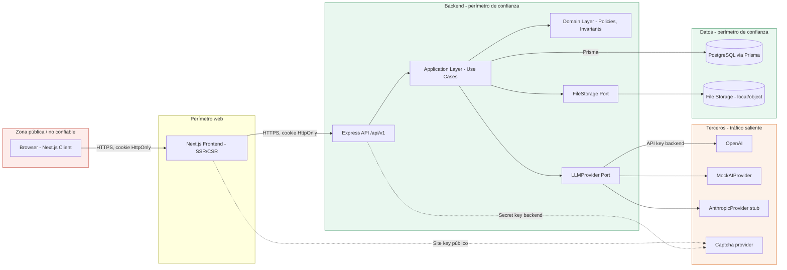
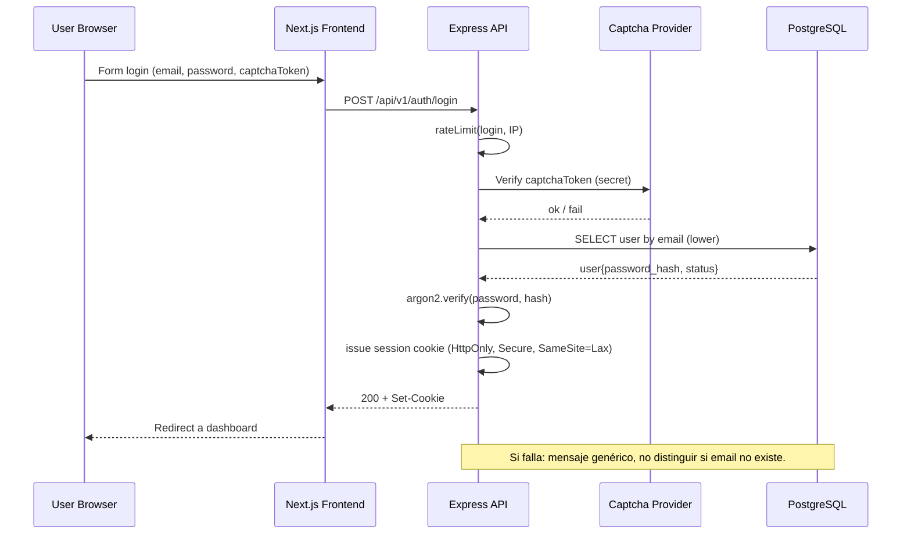
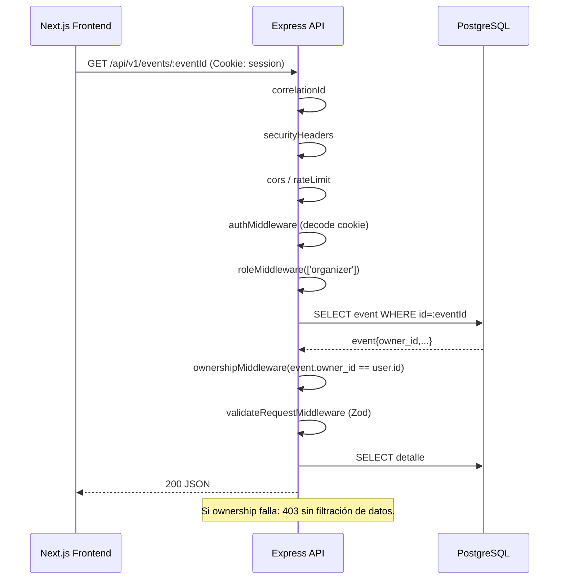
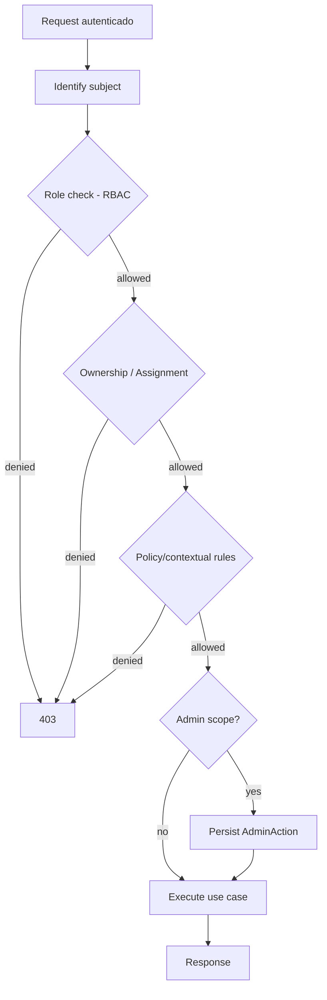

# EventFlow — Security & Authorization Design

> Documento formal de Diseño de Seguridad y Autorización del MVP
> Versión: 1.0
> Fecha: 2026-06-09
> Producto: EventFlow — plataforma asistida por IA para planificación de eventos y gestión simplificada de cotizaciones de proveedores
> MVP target: AI-assisted event planning workspace + simplified vendor quote flow
> Idioma del documento: Español LATAM neutral
> Audiencia: Security Architect, Backend Engineers, Frontend Engineers, QA, DevOps, Product Owner, evaluadores académicos, agentes IA generadores de código y pruebas.

---

## 1. Propósito del documento

Este documento traduce las decisiones de producto, arquitectura, backend, frontend, API, IA y base de datos de EventFlow en un **diseño de seguridad y autorización implementable**. Responde, con nivel de detalle directamente accionable por equipos de desarrollo y QA, a cinco preguntas operativas:

1. ¿Qué amenazas debe mitigar el MVP y cuáles quedan explícitamente fuera de alcance?
2. ¿Cómo se autentica un usuario, cómo se gestiona la sesión y cómo se protegen las credenciales?
3. ¿Cómo se autoriza cada operación, combinando RBAC, ownership, assignment-based access y auditoría administrativa?
4. ¿Qué controles deben implementarse en backend, frontend, base de datos, almacenamiento de archivos y orquestación de IA?
5. ¿Cómo se prueba, audita y endurece la postura de seguridad sin caer en sobre-ingeniería para un MVP académico?

El documento es **implementation-ready**: cada política tiene un identificador, cada decisión está trazada a documentos fuente, y la matriz de endpoints más el catálogo de políticas permiten generar directamente middleware, pruebas negativas de autorización, ADRs y user stories.

---

## 2. Alcance del documento

### 2.1 Incluye

- Modelo de amenazas adaptado a un MVP académico.
- Diseño de autenticación basado en email + contraseña, sin OAuth obligatorio.
- Estrategia de sesión y cookies HTTP-only firmadas.
- Política de contraseñas, hashing (`argon2id` / `bcrypt`) y reset por token de un solo uso.
- Anti-bot (captcha) y rate limiting para flujos sensibles.
- Modelo de autorización **RBAC + ownership + assignment + admin-scoped**.
- Catálogo de políticas (`SEC-POL-*`) por dominio y matriz de autorización por endpoint.
- Cadena de middleware Express y su orden recomendado.
- Responsabilidades de seguridad del frontend Next.js (UX, no fuente de verdad).
- Controles de API: validación Zod, CORS, CSRF, headers, payload size, rate limits.
- Seguridad de subida de archivos (`multipart/form-data`, allowlist MIME, soft delete).
- Seguridad y privacidad de IA (LLMProvider sólo en backend, human-in-the-loop, redacción).
- Manejo de secretos y variables de entorno.
- Logging, correlación, auditoría (`AdminAction`) y redacción de datos sensibles.
- Seguridad de base de datos y seed/demo.
- Manejo de errores y prevención de fugas de información.
- Estrategia de pruebas de seguridad.
- ADRs recomendados y matriz de trazabilidad.

### 2.2 No incluye

- Configuración detallada de infraestructura cloud, WAF, CDN o redes privadas.
- Cumplimiento formal (PCI DSS, SOC 2, ISO 27001, GDPR, LGPD).
- MFA, SSO empresarial, OAuth con múltiples proveedores como obligatorios.
- Procesamiento real de pagos, firma de contratos, escrow, KYC.
- Antimalware de archivos, signed URLs avanzadas, políticas de bucket S3.
- Detección de anomalías, SIEM, UEBA, threat hunting.
- Seguridad de aplicación móvil nativa o canales de chat en tiempo real.
- Seguridad de integraciones con WhatsApp, SMS o telefonía.
- Seguridad de almacenes vectoriales o RAG (no aplica al MVP).
- Multi-tenancy aislamiento de datos por tenant (no aplica al MVP).

---

## 3. Fuentes utilizadas

| # | Documento fuente | Relevancia para seguridad | Uso concreto en este documento |
|---:|---|---|---|
| 1 | `/docs/1-Domain-Discovery-Report.md` | Contexto del dominio y actores. | Identificación de actores y activos protegidos (§7). |
| 2 | `/docs/2-Product-Owner-Decisions.md` | Decisiones de PO sobre auth, captcha, moderación. | Justificación de captcha obligatorio y moderación manual. |
| 3 | `/docs/3-MVP-Scope-Definition.md` | Alcance MVP. | Lista de exclusiones explícitas (§32). |
| 4 | `/docs/4-Business-Rules-Document.md` | Reglas de negocio con implicancia de seguridad (BR-AUTH-*, BR-VENDOR-*, BR-REVIEW-*, BR-PRIVACY-*). | Catálogo de políticas (§18) y matriz de trazabilidad (§35). |
| 5 | `/docs/5-User-Roles-Permissions-Matrix.md` | Permisos por rol y entidad. | Roles (§14), ownership (§15), matriz de endpoints (§19). |
| 6 | `/docs/6-Domain-Data-Model.md` | Entidades y relaciones. | Modelo de ownership por entidad (§15). |
| 7 | `/docs/7-AI-Features-Specification.md` | Features IA. | Seguridad IA y endpoints IA (§25). |
| 8 | `/docs/8-Use-Cases-Specification.md` | Use cases con flujos de autorización. | Diagramas de secuencia y matriz de trazabilidad. |
| 8.1 | `/docs/8.1-Product-Owner-Decisions-Use-Cases-Addendum.md` | Decisiones PO vinculantes (timeout IA, soft delete, validez quote). | Controles de timeout, expiración, moderación. |
| 8.2 | `/docs/8.2-Documentation-Alignment-Review-Before-FRD.md` | Alineación previa. | Verificación de consistencia. |
| 9 | `/docs/9-Functional-Requirements-Document.md` | FR-* funcionales con impacto en seguridad. | Trazabilidad de políticas a FR. |
| 10 | `/docs/10-Non-Functional-Requirements.md` | NFR-SEC-*, NFR-IA-*, NFR-OBS-*. | Controles cuantitativos (rate limits, expiración, hashing). |
| 11 | `/docs/11-Data-Seed-Strategy.md` | `is_seed`, reset surgical. | Seguridad seed/demo (§23 y §32). |
| 12 | `/docs/12-Architecture-Vision-and-Principles.md` | Principios arquitectónicos. | Principios de seguridad (§5). |
| 13 | `/docs/13-System-Architecture-Document.md` | Capas, trust boundaries. | Diagrama de seguridad (§8). |
| 14 | `/docs/14-Backend-Technical-Design.md` | Cadena de middleware, módulos. | Middleware Express (§20). |
| 15 | `/docs/15-Frontend-Architecture-Design.md` | Route groups, sesión en cliente. | Responsabilidades frontend (§21). |
| 16 | `/docs/16-API-Design-Specification.md` | Endpoints, validación, error envelope, rate limits. | Matriz de endpoints (§19), errores (§29). |
| 17 | `/docs/17-AI-Architecture-and-PromptOps-Design.md` | LLMProvider, `AIRecommendation`, PromptOps. | Seguridad IA (§25). |
| 18 | `/docs/18-Database-Physical-Design.md` | Tablas, soft delete, audit, seed. | Seguridad DB (§28) y seed (§23). |

---

## 4. Resumen ejecutivo de seguridad

EventFlow es un MVP académico orientado a una demo funcional y reproducible. Su superficie de ataque real es limitada (sin pagos reales, sin contratos, sin canales móviles, sin datos sensibles regulados), pero el diseño debe ser **defensible, simple y honesto**: aplicar los controles correctos a la escala correcta, sin simular cumplimiento que no existe.

La postura de seguridad del MVP se sostiene en seis decisiones estructurales:

1. **El backend es la única fuente de verdad de autorización.** El frontend Next.js sólo aplica guards de UX. Toda petición pasa por `authMiddleware → roleMiddleware → ownershipMiddleware/policyMiddleware → validateRequestMiddleware` antes de tocar dominio.
2. **La sesión vive en una cookie HTTP-only firmada**, con `Secure`, `SameSite=Lax`, `Path=/`. Ningún token se almacena en `localStorage` ni `sessionStorage`.
3. **El modelo de autorización es híbrido**: RBAC (`anonymous | organizer | vendor | admin`) + ownership por `user_id`/`owner_id` + assignment-based para `QuoteRequest`/`Quote`/`BookingIntent` + admin-scoped con auditoría obligatoria en `AdminAction`.
4. **La IA nunca actúa de forma autónoma.** Todo output IA queda en `AIRecommendation` con `status='pending'` hasta que un humano lo acepta. Las llaves de LLM viven sólo en backend.
5. **Captcha y rate limiting protegen los flujos sensibles**: register, login, password reset request, generación IA, subida de archivos, creación de quote requests, y endpoints administrativos de seed.
6. **El alcance regulatorio es mínimo y declarado**: no hay PII de pago, no hay KYC, no hay firma electrónica, no hay datos médicos. Todo lo que no aplica al MVP queda explícitamente fuera de alcance (§32).

El diseño habilita una implementación pragmática para un equipo académico pequeño, y al mismo tiempo deja una traza clara hacia controles futuros (MFA, OAuth, malware scanning, CSP estricto) sin exigirlos hoy.

---

## 5. Principios de seguridad del MVP

| ID | Principio | Implicancia operativa |
|---|---|---|
| SEC-PRIN-001 | **Backend como fuente de verdad** | Ningún cliente puede asumir privilegios; cada handler revalida. |
| SEC-PRIN-002 | **Least privilege** | Roles y políticas otorgan el mínimo permiso necesario; admin no puede actuar como organizer/vendor. |
| SEC-PRIN-003 | **RBAC + ownership combinado** | El rol abre la puerta; la propiedad o asignación delimita el alcance. |
| SEC-PRIN-004 | **Secure by default, simple enough** | Defaults seguros (cookies HTTP-only, CORS estricto, payload limits) sin sobre-ingeniería. |
| SEC-PRIN-005 | **No secrets in frontend** | API keys, secretos de captcha y de sesión sólo viven en `.env` del backend. |
| SEC-PRIN-006 | **Human-in-the-loop for AI** | Toda salida IA es sugerencia hasta confirmación humana explícita. |
| SEC-PRIN-007 | **Privacy by minimization** | Sólo se persisten y procesan datos necesarios. No PII médica, fiscal o financiera. |
| SEC-PRIN-008 | **Auditability where it matters** | `AdminAction` registra todo cambio de estado administrativo; `AIRecommendation` registra toda intervención IA. |
| SEC-PRIN-009 | **Fail closed, not open** | Ante duda de autorización, denegar (`403`). Sin defaults permisivos. |
| SEC-PRIN-010 | **No overengineering** | El MVP no implementa MFA, SSO, WAF, malware scanning, ni RAG. Quedan en roadmap (§33). |

---

## 6. Security assumptions and constraints

| ID | Supuesto / Restricción | Justificación |
|---|---|---|
| SEC-ASM-001 | EventFlow es un MVP académico, no un sistema productivo regulado. | Define el nivel de control aceptable. |
| SEC-ASM-002 | Cliente único: navegador moderno con cookies habilitadas. | No hay app móvil nativa ni cliente desktop. |
| SEC-ASM-003 | No se procesan pagos reales ni se firman contratos. | No aplica PCI DSS ni firma electrónica. |
| SEC-ASM-004 | Sin integraciones con WhatsApp, SMS, telefonía. | Sin canales out-of-band en MVP. |
| SEC-ASM-005 | Email simulado vía log estructurado; SMTP real fuera de alcance. | Resets de contraseña funcionan en demo via log/UI demo helper. |
| SEC-ASM-006 | No hay certificación de cumplimiento (SOC 2, ISO 27001, GDPR formal). | Documentación incluye buenas prácticas, no auditoría externa. |
| SEC-ASM-007 | No hay MFA ni SSO empresarial. | Auth simple por email + password con captcha. |
| SEC-ASM-008 | La infraestructura corre detrás de TLS (HTTPS obligatorio en staging/prod). | Cookies marcadas `Secure`; cookies no se envían sobre HTTP. |
| SEC-ASM-009 | El despliegue público controla CORS por entorno. | Allowlist explícita; sin wildcard con credenciales. |
| SEC-ASM-010 | Operadores con acceso al backend tienen acceso a logs y `.env`. | Modelo de confianza administrativa típico de un MVP. |

---

## 7. Threat model for EventFlow MVP

### 7.1 Activos protegidos

| ID | Activo | Sensibilidad |
|---|---|---|
| AST-001 | Credenciales de usuario (`password_hash`, `session_secret`). | Alta. |
| AST-002 | Datos de evento del organizer (fecha, presupuesto, invitados). | Media. |
| AST-003 | Perfil vendor (slug, contacto comercial, portfolio). | Media. |
| AST-004 | Quote requests y Quotes (monto, condiciones). | Media. |
| AST-005 | Reviews (texto, rating, vínculo a vendor). | Media (impacto reputacional). |
| AST-006 | `AdminAction` (integridad del log). | Alta (audit trail). |
| AST-007 | `AIRecommendation` (trazabilidad de decisiones IA). | Media. |
| AST-008 | Llaves de LLM (`OPENAI_API_KEY`, `ANTHROPIC_API_KEY`). | Alta. |
| AST-009 | Variables de entorno (`SESSION_SECRET`, `DATABASE_URL`). | Alta. |
| AST-010 | Attachments subidos (briefs, portfolio). | Media. |

### 7.2 Actores

| ID | Actor | Confianza | Notas |
|---|---|---|---|
| ACT-001 | Visitante anónimo | Baja | Sólo navega vendor directory, eventos públicos, auth. |
| ACT-002 | Organizer autenticado | Media | Sólo opera sobre recursos propios. |
| ACT-003 | Vendor autenticado | Media | Sólo opera sobre su perfil y recursos asignados. |
| ACT-004 | Admin autenticado | Alta confianza otorgada, mitigada con auditoría | Acciones registradas en `AdminAction`. |
| ACT-005 | LLM provider externo (OpenAI/Anthropic) | Tercero | Recibe prompts mínimos; nunca recibe secretos ni PII. |
| ACT-006 | Bot abusivo / scraper | Hostil | Mitigado con captcha y rate limits. |
| ACT-007 | Atacante con cuenta legítima | Hostil interno | Mitigado con ownership y validación de entrada. |

### 7.3 Fronteras de confianza

- **Cliente ↔ API**: cruza TLS y autenticación de sesión.
- **API ↔ PostgreSQL**: dentro del perímetro del backend; sólo Prisma accede.
- **API ↔ LLMProvider**: salida hacia tercero; prompts sanitizados, sin PII.
- **API ↔ File Storage**: salida controlada; sin acceso directo desde el cliente.

### 7.4 Tabla de amenazas, abuse cases y mitigaciones

| ID | Amenaza | Vector | Impacto | Mitigación MVP | Estado |
|---|---|---|---|---|---|
| THR-001 | Credential stuffing | Bots automatizados sobre `/auth/login` | Compromiso de cuentas. | Captcha + rate limit 10 intentos/IP/10 min. | Mitigado. |
| THR-002 | Enumeración de usuarios | Mensajes de error que distinguen email válido. | Recolección de cuentas. | Respuesta uniforme 200 en password reset; mensajes genéricos en login. | Mitigado. |
| THR-003 | Robo de sesión por XSS | Inyección JS que lee cookie. | Toma de cuenta. | Cookie `HttpOnly`; no `localStorage`; CSP recomendado. | Mitigado. |
| THR-004 | CSRF sobre endpoints autenticados | Petición cross-site con cookies. | Acciones no autorizadas. | `SameSite=Lax` + origin check; CSRF token futuro si se introduce SameSite=None. | Mitigado. |
| THR-005 | IDOR (Insecure Direct Object Reference) | Manipular `:eventId` o `:vendorProfileId`. | Acceso a datos ajenos. | `ownershipMiddleware` + `assignmentMiddleware` en cada endpoint. | Mitigado. |
| THR-006 | Bypass de autorización por privilege escalation | Manipular rol en cliente. | Operación administrativa. | Rol verificado en cookie firmada en backend, nunca en cliente. | Mitigado. |
| THR-007 | Prompt injection en IA | Texto malicioso en formulario de evento. | Exfiltración de prompt o cambio de salida. | Output validado con Zod; human-in-the-loop obligatorio; sin secretos en prompt. | Mitigado parcialmente. |
| THR-008 | Subida de archivo malicioso | Ejecutable disfrazado de imagen. | Distribución de malware. | Allowlist MIME + extensión + tamaño; sin ejecución; soft delete; no direct public access. | Mitigado MVP; malware scanning futuro. |
| THR-009 | Fuga de stack trace en error 500 | Error no controlado. | Information disclosure. | `errorMiddleware` con sobre uniforme; sin stack en respuesta. | Mitigado. |
| THR-010 | Abuso de captcha bypass | Bots con captcha solver. | Spam en register. | Captcha + rate limit + soft block por IP. | Mitigado. |
| THR-011 | Denial of wallet IA | Generación IA en bucle. | Costo en proveedor LLM. | Rate limit dedicado por usuario sobre endpoints IA; timeout 60s. | Mitigado. |
| THR-012 | Seed reset en producción | Endpoint `/admin/seed/reset` accesible. | Pérdida de datos. | `SEED_DEMO_ENABLED=false` por defecto fuera de demo/dev; rol admin requerido; `AdminAction` registrado. | Mitigado. |
| THR-013 | Brute force de password reset token | Iteración sobre tokens. | Toma de cuenta. | Token criptográficamente seguro (≥32 bytes), expiración 15 min, uso único, rate limit por email. | Mitigado. |
| THR-014 | SSRF vía URL del usuario | Campo URL en evento o vendor. | Acceso a metadata interna. | URLs validadas; sin fetch de URL del usuario en backend en MVP. | No aplica MVP. |
| THR-015 | Replay de cookie tras logout | Cookie reutilizada. | Continuación de sesión. | Invalidación de sesión en logout (rotación de `SESSION_SECRET` o lista negra por `jti` en cookie firmada). | Mitigado. |

### 7.5 Amenazas fuera de alcance del MVP

- Ataques DDoS volumétricos (mitigados por CDN/WAF futuro).
- Compromiso del proveedor LLM.
- Insider threat con acceso físico al servidor.
- Side-channel timing attacks avanzados.
- Supply chain attacks (alineado con buenas prácticas de `npm audit` pero sin SCA formal).
- Evasión avanzada de detección (no aplica; no hay sistema de detección).

---

## 8. Security architecture overview



**Lecturas clave del diagrama**:

- El frontend nunca dialoga con OpenAI/Anthropic/PostgreSQL/almacenamiento directo.
- La única superficie expuesta es la API REST `/api/v1` detrás de HTTPS.
- Las llaves de proveedores externos viven sólo en el backend.
- El cliente sólo conoce el `site key` público de captcha; el `secret key` está en backend.

---

## 9. Authentication design

### 9.1 Resumen

EventFlow usa **email + contraseña** como mecanismo principal. El registro público sólo permite `organizer` y `vendor`. Los `admin` se crean por seed/configuración interna. Captcha y rate limiting protegen los tres flujos sensibles: register, login, password reset request.

### 9.2 Endpoints de autenticación

| Endpoint | Método | Quién | Captcha | Rate limit |
|---|---|---|---|---|
| `/api/v1/auth/register` | POST | público | Sí | 5/IP/10 min |
| `/api/v1/auth/login` | POST | público | Sí | 10/IP/10 min |
| `/api/v1/auth/logout` | POST | autenticado | No | global |
| `/api/v1/auth/password/reset-request` | POST | público | Sí | 3/email/h |
| `/api/v1/auth/password/reset` | POST | público (token) | No (token de uso único) | 5/IP/10 min |
| `/api/v1/me` | GET | autenticado | No | global |
| `/api/v1/me/change-password` | POST | autenticado | No | 5/usuario/h |

### 9.3 Diagrama de secuencia — Login



### 9.4 Diagrama de secuencia — Petición protegida



### 9.5 Reset de contraseña

- El cliente solicita reset con email. Backend siempre responde `200` con mensaje genérico, independientemente de si el email existe (`SEC-POL-AUTH-005`).
- Si el email existe, backend genera token criptográficamente seguro (≥32 bytes random), persiste hash del token con expiración 15 min y `consumed_at NULL`.
- Token enviado via "email simulado" (log estructurado o UI demo en MVP).
- Cliente envía token + nueva contraseña a `/auth/password/reset`. Backend verifica hash del token, expiración, `consumed_at`. Marca `consumed_at=now()`. Aplica nueva contraseña (hashed).
- Token es **single-use** y no puede reutilizarse.

### 9.6 Logout

- `POST /api/v1/auth/logout` invalida la sesión actual.
- Estrategia recomendada: cookie firmada incluye `sid` opaco; logout marca `sid` revocado en tabla `sessions` (o lista negra in-memory para MVP). Alternativa más simple para MVP: rotación de cookie con `Max-Age=0`, aceptando ventana corta de reuso si el cliente conserva la cookie.

### 9.7 Captcha

- Proveedor: hCaptcha o reCAPTCHA v3.
- Frontend: site key vía `NEXT_PUBLIC_RECAPTCHA_SITE_KEY`.
- Backend: secret vía `RECAPTCHA_SECRET_KEY`. Verifica el token en register/login/reset-request.
- Modo dev/test: captcha mockeable con stub que acepta token fijo `'__test__'`.

---

## 10. Session and cookie strategy

| Atributo de cookie | Valor MVP | Justificación |
|---|---|---|
| Nombre | `eventflow.sid` | Identificador opaco firmado. |
| `HttpOnly` | `true` | Bloquea acceso desde JS, mitiga XSS. |
| `Secure` | `true` (staging/prod) | Sólo se envía sobre TLS. |
| `SameSite` | `Lax` | Mitiga CSRF en navegación normal; permite redirect-login. |
| `Path` | `/` | Aplicable a toda la API. |
| `Max-Age` / expiración | 24 horas (NFR-SEC) | Equilibrio UX/seguridad para un MVP. |
| Firma | HMAC con `SESSION_SECRET` (≥32 bytes) | Detecta manipulación. |
| Payload | `{ sub: userId, role, jti, iat, exp }` | Mínimo necesario. |
| Almacenamiento alternativo | **Prohibido** en `localStorage` / `sessionStorage` | Estricto. |

**Rotación**: el `SESSION_SECRET` debe rotarse por entorno. En MVP no se implementa rotación automática; ADR-SEC-001 lo deja como decisión operativa.

**Invalidación en logout**: ver §9.6.

**Implicancias CSRF**: ver §22.

**JWT**: si el equipo decide implementar la cookie con JWT firmado, debe permanecer **opaco al cliente** (no exponer a JS). Nunca se expone como `Authorization: Bearer` en MVP.

---

## 11. Password and credential handling

### 11.1 Hashing

- **Recomendado**: `argon2id` con parámetros mínimos `memoryCost=19MiB`, `timeCost=2`, `parallelism=1`.
- **Aceptable**: `bcrypt` con `BCRYPT_ROUNDS=12` si la librería argon2 introduce fricción operativa.
- Implementación gobernada por ADR-SEC-003.

### 11.2 Política de contraseñas MVP

| Regla | Valor |
|---|---|
| Longitud mínima | 10 caracteres |
| Requisitos | Al menos una letra y un número; sin lista negra exhaustiva en MVP |
| Comparación con email | No puede igualar localpart del email |
| Cambios | Vía `/me/change-password` (requiere contraseña actual) |
| Historial | No se aplica en MVP |
| Expiración periódica | No (NIST recomienda evitarla) |

### 11.3 Manejo de credenciales

- Nunca se loguea contraseña, hash, ni token de sesión.
- Nunca se devuelve `password_hash` en respuestas.
- `.env` excluido de control de versiones (validar `.gitignore`).
- Tokens de reset: hashed antes de persistir (sólo se persiste hash; original llega vía canal "email simulado").
- Demo credentials documentadas en seed: nunca reutilizar fuera de demo.

---

## 12. Anti-bot and abuse prevention

| Endpoint / Recurso | Control | Detalle |
|---|---|---|
| `/auth/register` | Captcha + rate limit | 5/IP/10 min |
| `/auth/login` | Captcha + rate limit | 10/IP/10 min |
| `/auth/password/reset-request` | Captcha + rate limit | 3/email/h |
| Endpoints IA (`/ai/plan`, `/ai/checklist`, etc.) | Rate limit por usuario | 20/usuario/h |
| `/attachments` (POST) | Rate limit + size limit | 30 archivos/usuario/h; máx. 5 MB por archivo |
| `/quote-requests` (POST) | Rate limit por usuario | 30/usuario/día |
| `/admin/seed/reset` | Rol admin + feature flag | `SEED_DEMO_ENABLED=true` requerido |
| `/admin/seed/load` | Rol admin + feature flag | Idem |
| `/admin/vendors/:id/approve` | Rol admin + auditoría | `AdminAction` registrado |

**Comportamiento ante exceso**: responder con `429 Too Many Requests` y header `Retry-After`. Log estructurado del incidente (sin exponer IP en respuesta).

---

## 13. Authorization model overview

EventFlow combina cuatro capas de autorización aplicadas secuencialmente en el backend:

1. **RBAC** — basado en el rol persistido en la sesión.
2. **Ownership** — el recurso pertenece al usuario autenticado (`event.owner_id == user.id`, `vendor_profile.user_id == user.id`).
3. **Assignment-based** — el recurso está asignado al usuario (vendor accede a `QuoteRequest` cuyo `vendor_profile_id` es el propio).
4. **Admin-scoped** — admin tiene acceso de sólo lectura a eventos ajenos y acceso de moderación a vendors/reviews/catalogs, siempre con auditoría en `AdminAction`.



---

## 14. Roles and permission boundaries

### 14.1 Resumen de roles

| Rol | Identificador | Origen | Estado de cuenta |
|---|---|---|---|
| Anonymous | `anonymous` | Sin sesión | N/A |
| Organizer | `organizer` | Registro público | `active` |
| Vendor | `vendor` | Registro público | `active` (perfil puede estar pending) |
| Admin | `admin` | Seed / configuración interna | `active` |
| System / Internal jobs | `system` | Cron/scheduler interno | No autenticado por sesión, ejecuta con privilegios bypass específicos (auto-completion de eventos, expiración de cotizaciones). |

### 14.2 Capacidades por rol

#### Anonymous

- **Puede**: navegar landing, ver directorio público de vendors aprobados, perfil vendor público por slug, catálogo de `EventType`/`ServiceCategory` activos, health check, ejecutar register/login/password-reset-request.
- **No puede**: ver eventos, tasks, budgets, quote requests, quotes, reviews internas, notifications, AI endpoints, panel admin.
- **Notas**: cualquier endpoint con `authMiddleware` devuelve `401`.

#### Organizer

- **Puede**: CRUD sobre eventos propios; tasks/budgets/quote-requests/booking-intents/reviews propios; aceptar o rechazar cotizaciones recibidas; aceptar o descartar `AIRecommendation` propios; consultar `/me`, notificaciones propias.
- **No puede**: ver eventos ajenos; aprobar vendors; moderar reviews; tocar catálogos; acceder a `/admin/*`; subir archivos a recursos ajenos.
- **Notas**: el campo `owner_id` se obtiene de la sesión, nunca del cliente.

#### Vendor

- **Puede**: CRUD sobre su `VendorProfile` y `VendorServices`; subir portfolio (máx. 10 imágenes por entrada — BR-VENDOR-005); responder con `Quote` a `QuoteRequest` asignados; confirmar/rechazar `BookingIntent` propios; ver reviews recibidas; aceptar/descartar `AIRecommendation` de bio propios.
- **No puede**: ver `QuoteRequest` no asignados; ver eventos del organizer; aprobar su propio perfil; modificar reviews; cambiar más de 5 veces su categoría principal (BR-VENDOR-004).
- **Notas**: el slug público es visible sólo si el estado del perfil es `approved`.

#### Admin

- **Puede**: aprobar/rechazar/ocultar vendors; CRUD de `EventType`/`ServiceCategory` (jerarquía ≤ 2 niveles — BR-SERVICE-005); moderar reviews (soft delete con auditoría); listar y ver eventos en **modo lectura** con `AdminAction` por acceso; ver métricas; ejecutar seed load/reset si `SEED_DEMO_ENABLED=true`; consultar `AdminAction` log.
- **No puede**: actuar como organizer ni como vendor en flujos comerciales (no crear eventos para sí mismo en el rol admin, no enviar quotes); editar eventos ajenos; eliminar `AdminAction`.
- **Notas**: **toda acción que altere estado de negocio registra `AdminAction`**.

#### System (cron/scheduler)

- **Puede**: auto-completar eventos T+2 días (BR-EVENT-014); expirar `QuoteRequest`/`Quote` cuya fecha límite o `valid_until` pasó.
- **No puede**: ejecutar lógica administrativa que requiera juicio humano.

---

## 15. Ownership model

| Entity | Owner | Visibility | Write Access | Admin Access | Notes |
|---|---|---|---|---|---|
| `User` | self (`id`) | self; admin (lectura para soporte mínimo) | self | Lectura admin para seed/demo | Password hash nunca expuesto. |
| `Event` | organizer (`owner_id`) | self | self | Lectura (con `AdminAction`) | `currency_code` inmutable post-creación. |
| `EventTask` | organizer vía `event_id` | self | self | Lectura | Cambios de estado por organizer. |
| `Budget` | organizer vía `event_id` | self | self | Lectura | 1:1 con evento. |
| `BudgetItem` | organizer vía `budget_id` | self | self | Lectura | Hereda visibilidad del evento. |
| `VendorProfile` | vendor (`user_id`) | público si `approved`; self si pending/rejected/hidden | self mientras `pending`; admin para estado | Aprobar/rechazar/ocultar (con `AdminAction`) | Slug público sólo si aprobado. |
| `VendorService` | vendor vía `vendor_profile_id` | público si vendor `approved` | self | Lectura | Soft delete vía `is_active`. |
| `Attachment` | dueño del padre (`owner_type`+`owner_id`) | hereda del padre | dueño del padre | Soft delete moderado | `deleted_at` + `admin_action_id`. |
| `QuoteRequest` | organizer (`event_id`) | organizer + vendor asignado | organizer (edita brief en draft); vendor (marca viewed/responded) | Lectura sólo si necesario | 1 activo por `(event, vendor)`. |
| `Quote` | vendor (`vendor_profile_id`) | organizer + vendor emisor | vendor (edita en `draft`); organizer (`accept/reject`) | Lectura | `valid_until` default `created_at + 15 días` (BR-QUOTE-015). |
| `BookingIntent` | organizer (`event_id`) | organizer + vendor asignado | Ambos pueden cancelar; vendor confirma | Lectura | Sin penalidad por cancelación. |
| `Review` | organizer (`event_id` + `vendor_id`) | público si `published`; admin ve todo | organizer crea; nadie edita | Soft delete con `AdminAction` (BR-REVIEW-007) | 1 por `(event, vendor)`. |
| `Notification` | recipient (`user_id`) | self | self (marca leída) | No accesible salvo soporte | In-app only. |
| `AIRecommendation` | creador (`user_id`) | self | self (`apply/discard`) | Lectura para auditoría | `correlation_id`, `provider`, `fallback_used`. |
| `AdminAction` | sistema (registrado para admin actor) | admin | Append-only | Lectura | Inmutable. |
| `EventType` | catálogo (admin) | público activo | admin | CRUD con `AdminAction` | Sin hard-delete si hay eventos referenciados. |
| `ServiceCategory` | catálogo (admin) | público activo | admin | CRUD con `AdminAction` | Jerarquía máx. 2 niveles. |

---

## 16. Assignment-based authorization

### 16.1 QuoteRequest

- Un `QuoteRequest` pertenece al organizer dueño del evento.
- El vendor sólo accede si `quote_request.vendor_profile_id == user.vendor_profile.id`.
- El organizer puede editar el `brief` mientras esté en `draft`. Una vez enviado (`sent`), no es editable.
- Sólo el organizer dueño puede cancelar (estados `sent` o `viewed`).
- El sistema puede transicionar a `expired` automáticamente si pasó la fecha límite.

### 16.2 Quote

- Un `Quote` pertenece al vendor que lo emite (`vendor_profile_id`).
- El organizer dueño del `QuoteRequest` puede ver, aceptar o rechazar.
- El vendor sólo puede editar en estado `draft`.
- `valid_until` se calcula al enviar (`created_at + 15 días` por defecto, BR-QUOTE-015) y no se modifica después.

### 16.3 BookingIntent

- Visible para organizer dueño y vendor asignado.
- Estado inicial `pending`; vendor confirma a `confirmed_intent`.
- Cualquiera de los dos puede cancelar sin penalidad (BR-BOOKING-007).
- Auto-cancelación si el `Quote` asociado expiró antes de la confirmación: política operativa documentada.

### 16.4 Review

- Sólo el organizer con `BookingIntent` en estado `confirmed_intent` puede crear review sobre ese vendor (BR-REVIEW-001).
- Visibilidad pública si `status='published'`.
- Vendor ve sus reviews pero no las edita.
- Admin puede soft-delete (`status='hidden'` o `removed`) y debe registrar `AdminAction`.

### 16.5 Notification

- Visible sólo para el `user_id` recipient.
- Sin acceso cross-user, ni siquiera para admin.

---

## 17. Admin authorization and audit

### 17.1 Capacidades administrativas

| Acción | Endpoint | Auditoría |
|---|---|---|
| Listar eventos en modo lectura | `GET /admin/events` | `AdminAction(action='read_event_list')` con frecuencia controlada o sólo en detalle. |
| Ver detalle de evento (modo lectura) | `GET /events/:eventId` con `role=admin` | `AdminAction(action='view_event', target_type='event', target_id=:eventId)`. |
| Aprobar vendor | `POST /admin/vendors/:id/approve` | `AdminAction(action='approve_vendor', target_id, target_id_old=snapshot)`. |
| Rechazar vendor | `POST /admin/vendors/:id/reject` | `AdminAction(action='reject_vendor', ...)`. |
| Ocultar review | `POST /admin/reviews/:id/hide` | `AdminAction(action='hide_review', ...)` + `reviews.admin_action_id`. |
| CRUD categorías de servicio | `POST/PATCH/DELETE /admin/service-categories` | `AdminAction(action='manage_service_category', ...)`. |
| CRUD `EventType` | `POST/PATCH/DELETE /admin/event-types` | `AdminAction(action='manage_event_type', ...)`. |
| Seed load | `POST /admin/seed/load` | `AdminAction(action='seed_load')`. |
| Seed reset | `POST /admin/seed/reset` | `AdminAction(action='seed_reset')`. |
| Consultar audit log | `GET /admin/audit-logs` | No registra para evitar bucle, pero limitado por rate limit. |
| Métricas | `GET /admin/metrics` | No registra. |

### 17.2 Reglas no negociables

- Admin **no puede** ejecutar acciones que falsifiquen identidad (no crear quotes/reviews/bookings a nombre de otro).
- Admin **no puede** alterar `AdminAction` ya escritas.
- Admin sin `SEED_DEMO_ENABLED=true` recibe `403` al invocar endpoints de seed.
- Toda acción que cambie estado de negocio debe insertar `AdminAction` antes de responder al cliente (transaccional con la mutación, `prisma.$transaction`).

---

## 18. Authorization policy catalog

Formato de ID: `SEC-POL-[DOMAIN]-[NUMBER]`.

### 18.1 Dominio AUTH

| ID | Nombre | Aplica a | Roles | Condición | Enforcement | Referencias | QA |
|---|---|---|---|---|---|---|---|
| SEC-POL-AUTH-001 | Registro público sólo a organizer/vendor | `POST /auth/register` | anonymous | `role IN ('organizer','vendor')`; captcha válido | controller + captcha verifier | BR-AUTH-001, FR-AUTH-001 | Test que rechaza `role='admin'`. |
| SEC-POL-AUTH-002 | Captcha obligatorio en flujos sensibles | register, login, reset-request | anonymous | token captcha verificado server-side | captcha middleware | NFR-SEC, PO Decision #8 | Mock de captcha en tests. |
| SEC-POL-AUTH-003 | Rate limit en login | `POST /auth/login` | anonymous | máx. 10/IP/10 min | `rateLimitMiddleware` | NFR-SEC | Test que provoca 429. |
| SEC-POL-AUTH-004 | Mensaje genérico ante error de login | `POST /auth/login` | anonymous | nunca distinguir "email no existe" vs "password incorrecta" | controller | THR-002 | Test asercion mensaje uniforme. |
| SEC-POL-AUTH-005 | Respuesta uniforme en reset request | `POST /auth/password/reset-request` | anonymous | siempre 200 con mensaje genérico | controller | THR-002 | Test idempotencia respuesta. |
| SEC-POL-AUTH-006 | Token reset uso único y expira | `POST /auth/password/reset` | anonymous | token random ≥32 bytes, TTL 15 min, `consumed_at` chequeado | use case | NFR-SEC | Test reuso y expiración. |
| SEC-POL-AUTH-007 | Hashing argon2id (o bcrypt cost 12) | persistencia de password | sistema | algoritmo + parámetros mínimos | infrastructure layer | ADR-SEC-003 | Test que verifica algoritmo. |
| SEC-POL-AUTH-008 | Cookie HttpOnly + Secure + SameSite=Lax | toda sesión | sistema | atributos al emitir cookie | session middleware | NFR-SEC | Test HTTP header. |
| SEC-POL-AUTH-009 | Logout invalida sesión actual | `POST /auth/logout` | autenticado | `sid` revocado | session middleware | NFR-SEC | Test reuso post-logout. |
| SEC-POL-AUTH-010 | Admin no creable vía registro | global | sistema | admin sólo por seed/config | controller | BR-AUTH-005 | Test denegación. |

### 18.2 Dominio EVENT

| ID | Nombre | Aplica a | Roles | Condición | Enforcement | Referencias | QA |
|---|---|---|---|---|---|---|---|
| SEC-POL-EVENT-001 | Organizer sólo gestiona eventos propios | `/events/*` | organizer | `event.owner_id == user.id` | `ownershipMiddleware` | BR-EVENT-001 | Test 403 cross-user. |
| SEC-POL-EVENT-002 | Admin lectura con auditoría | `GET /admin/events`, `GET /events/:id` (admin) | admin | persistir `AdminAction(view_event)` | use case | BR-EVENT-005 | Test que `AdminAction` se inserta. |
| SEC-POL-EVENT-003 | Moneda inmutable | `PATCH /events/:id` | organizer | rechazar cambio de `currency_code` | domain policy | BR-EVENT-006 | Test rechazo. |
| SEC-POL-EVENT-004 | Auto-completion sólo sistema | job `event-auto-complete` | system | bypass de RBAC vía worker autenticado | scheduler | BR-EVENT-014 | Test idempotencia. |

### 18.3 Dominio TASK / BUDGET

| ID | Nombre | Aplica a | Roles | Condición | Enforcement | Referencias | QA |
|---|---|---|---|---|---|---|---|
| SEC-POL-TASK-001 | Ownership task vía evento | `/events/:eventId/tasks/*` | organizer | event ownership | middleware | BR-EVENT-001 | Test cross-user. |
| SEC-POL-BUDGET-001 | Ownership budget vía evento | `/events/:eventId/budget/*` | organizer | event ownership | middleware | BR-EVENT-001 | Test cross-user. |
| SEC-POL-BUDGET-002 | Moneda del budget hereda evento | `POST /budget/items` | organizer | `currency_code` no editable | domain | BR-BUDGET-006/007 | Test rechazo. |

### 18.4 Dominio VENDOR

| ID | Nombre | Aplica a | Roles | Condición | Enforcement | Referencias | QA |
|---|---|---|---|---|---|---|---|
| SEC-POL-VENDOR-001 | Vendor sólo edita su propio perfil | `/vendors/me/*` | vendor | `vendor_profile.user_id == user.id` | middleware | BR-VENDOR-001 | Test cross-user. |
| SEC-POL-VENDOR-002 | Aprobación admin obligatoria | publicación de perfil | admin | `status` controlado por admin | use case | BR-VENDOR-003 | Test que vendor no se auto-aprueba. |
| SEC-POL-VENDOR-003 | Cambio de categoría limitado a 5 | `PATCH /vendors/me` | vendor | `category_change_count <= 5` | domain | BR-VENDOR-004 | Test rechazo en 6º cambio. |
| SEC-POL-VENDOR-004 | Portfolio máx. 10 imágenes por entrada | upload | vendor | conteo previo | domain | BR-VENDOR-005 | Test rechazo en 11ª. |
| SEC-POL-VENDOR-005 | Perfil público sólo si `approved` | `GET /public/vendors/:slug` | anonymous | `status='approved'` | repo query filter | BR-VENDOR-003 | Test perfil pendiente no visible. |

### 18.5 Dominio QUOTE / BOOKING

| ID | Nombre | Aplica a | Roles | Condición | Enforcement | Referencias | QA |
|---|---|---|---|---|---|---|---|
| SEC-POL-QUOTE-001 | Vendor ve sólo `QuoteRequest` asignados | `/quote-requests/*` | vendor | `quote_request.vendor_profile_id == user.vendor_profile.id` | middleware | BR-QUOTE-005 | Test cross-vendor. |
| SEC-POL-QUOTE-002 | Organizer no puede ver quotes ajenos | `/quotes/*` | organizer | `quote.quote_request.event.owner_id == user.id` | middleware | BR-QUOTE-005 | Test cross-organizer. |
| SEC-POL-QUOTE-003 | Quote editable sólo en `draft` | `PATCH /quotes/:id` | vendor | `status='draft'` | domain | BR-QUOTE-010 | Test rechazo. |
| SEC-POL-QUOTE-004 | Máx. 5 quote requests activos por categoría/evento | `POST /quote-requests` | organizer | conteo previo | domain | BR-QUOTE-009 | Test 6ª. |
| SEC-POL-QUOTE-005 | `valid_until` inmutable post-envío | `POST /quotes/:id/send` | vendor | calculado al envío | domain | BR-QUOTE-015 | Test inmutabilidad. |
| SEC-POL-BOOKING-001 | BookingIntent visible sólo a las partes | `/booking-intents/*` | organizer/vendor | ownership o assignment | middleware | BR-BOOKING-001 | Test cross-party. |
| SEC-POL-BOOKING-002 | Cancelación sin penalidad bilateral | `POST .../cancel` | organizer/vendor | ambos roles permitidos | use case | BR-BOOKING-007 | Test ambos casos. |

### 18.6 Dominio REVIEW

| ID | Nombre | Aplica a | Roles | Condición | Enforcement | Referencias | QA |
|---|---|---|---|---|---|---|---|
| SEC-POL-REVIEW-001 | Sólo organizer con `confirmed_intent` crea review | `POST /reviews` | organizer | BookingIntent confirmado | domain | BR-REVIEW-001 | Test rechazo sin booking. |
| SEC-POL-REVIEW-002 | Una review por `(event, vendor)` | `POST /reviews` | organizer | unique constraint + domain check | DB + domain | BR-REVIEW-002 | Test duplicado. |
| SEC-POL-REVIEW-003 | Moderación admin con auditoría | `POST /admin/reviews/:id/hide` | admin | soft delete + `AdminAction` | use case | BR-REVIEW-007 | Test trazabilidad. |
| SEC-POL-REVIEW-004 | Vendor no edita reviews | global | vendor | denegado | middleware | BR-REVIEW-006 | Test 403. |

### 18.7 Dominio AI

| ID | Nombre | Aplica a | Roles | Condición | Enforcement | Referencias | QA |
|---|---|---|---|---|---|---|---|
| SEC-POL-AI-001 | IA sólo en backend | `/api/v1/.../ai/*` | autenticado | LLMProvider via port | infrastructure | BR-AI-006 | Test que llave no aparece en frontend. |
| SEC-POL-AI-002 | Ownership previo a llamada IA | endpoints IA por evento/quote | organizer/vendor | ownership chequeado antes de llamar al provider | middleware | BR-AI-001 | Test cross-user antes de llamada. |
| SEC-POL-AI-003 | Output IA validado con Zod | persistencia `AIRecommendation` | sistema | salida cumple schema | use case | BR-AI-007 | Test schema. |
| SEC-POL-AI-004 | Human-in-the-loop obligatorio | apply/discard | dueño | `AIRecommendation.status` transitiona sólo por dueño | domain | BR-AI-001 | Test que IA no muta dominio sin apply. |
| SEC-POL-AI-005 | Sin secretos en prompt | construcción de prompt | sistema | redacción de PII y secretos | builder | BR-PRIVACY-002 | Test que payload no contiene email/telefono. |
| SEC-POL-AI-006 | Timeout 60s y fallback | LLMProvider | sistema | `AI_TIMEOUT_MS=60000`; fallback a MockAIProvider sólo si demo | infrastructure | BR-AI-009 | Test timeout. |
| SEC-POL-AI-007 | Rate limit IA por usuario | endpoints IA | organizer/vendor | 20/usuario/h | middleware | NFR-IA | Test 429. |
| SEC-POL-AI-008 | Redacción de payload en logs | logger | sistema | sólo `AI_LOG_PAYLOADS=true` en dev habilita full payload | logger | NFR-OBS | Test que logs prod no contienen prompt completo. |

### 18.8 Dominio ADMIN

| ID | Nombre | Aplica a | Roles | Condición | Enforcement | Referencias | QA |
|---|---|---|---|---|---|---|---|
| SEC-POL-ADMIN-001 | Sólo admin entra a `/admin/*` | global | admin | `roleMiddleware(['admin'])` | middleware | BR-ADMIN-001 | Test 403. |
| SEC-POL-ADMIN-002 | Toda acción admin escribe `AdminAction` | mutaciones admin | admin | transaccional | use case | BR-ADMIN-006 | Test persistencia. |
| SEC-POL-ADMIN-003 | Seed endpoints sólo si flag | `/admin/seed/*` | admin | `SEED_DEMO_ENABLED=true` | feature flag | BR-SEED | Test 403 con flag falso. |
| SEC-POL-ADMIN-004 | Lectura de evento admin con auditoría | `GET /events/:id` (admin) | admin | persistir `AdminAction(view_event)` | use case | BR-EVENT-005 | Test inserción. |
| SEC-POL-ADMIN-005 | `AdminAction` append-only | persistencia | sistema | sin UPDATE ni DELETE | DB constraint / repo | NFR-OBS | Test rechazo update. |

### 18.9 Dominio UPLOAD

| ID | Nombre | Aplica a | Roles | Condición | Enforcement | Referencias | QA |
|---|---|---|---|---|---|---|---|
| SEC-POL-UPLOAD-001 | Allowlist de MIME | `POST /attachments` | organizer/vendor | `image/png`, `image/jpeg`, `image/webp`, `application/pdf` | middleware | NFR-SEC | Test rechazo MIME no permitido. |
| SEC-POL-UPLOAD-002 | Tamaño máx. 5 MB por archivo | `POST /attachments` | organizer/vendor | `MAX_UPLOAD_BYTES=5_242_880` | middleware | NFR-SEC | Test rechazo. |
| SEC-POL-UPLOAD-003 | Validación de extensión coherente con MIME | `POST /attachments` | organizer/vendor | extensión consistente | middleware | NFR-SEC | Test mismatch. |
| SEC-POL-UPLOAD-004 | Sin ejecutables | `POST /attachments` | organizer/vendor | denegar `.exe`, `.sh`, `.bat` aunque vengan con MIME falso | middleware | NFR-SEC | Test denegación. |
| SEC-POL-UPLOAD-005 | Acceso por URL controlado | descarga | dueño | sin acceso público directo al path crudo | controller | NFR-SEC | Test que path crudo da 403. |
| SEC-POL-UPLOAD-006 | Soft delete | `DELETE /attachments/:id` | dueño/admin | `deleted_at` set + metadata preservada | use case | BR-PRIVACY-011 | Test soft delete. |

---

## 19. API endpoint authorization matrix

Convenciones: `O` = organizer, `V` = vendor, `A` = admin, `Anon` = anonymous. Marcas `✓ (own)` indican que se aplica `ownershipMiddleware`. Marcas `✓ (assigned)` indican `assignmentMiddleware`. `audit` indica que el endpoint persiste `AdminAction`.

### 19.1 Auth & Identity

| Método | Path | Anon | O | V | A | Política / Ownership | Notas |
|---|---|---|---|---|---|---|---|
| POST | `/auth/register` | ✓ | — | — | — | SEC-POL-AUTH-001/002 | Captcha. |
| POST | `/auth/login` | ✓ | — | — | — | SEC-POL-AUTH-002/003/004 | Captcha + rate limit. |
| POST | `/auth/logout` | — | ✓ | ✓ | ✓ | SEC-POL-AUTH-009 | — |
| POST | `/auth/password/reset-request` | ✓ | — | — | — | SEC-POL-AUTH-005 | Captcha + 3/email/h. |
| POST | `/auth/password/reset` | ✓ | — | — | — | SEC-POL-AUTH-006 | Token uso único. |
| GET | `/me` | — | ✓ | ✓ | ✓ | — | Hydration. |
| PATCH | `/me` | — | ✓ | ✓ | ✓ | self | — |
| PATCH | `/me/preferred-language` | — | ✓ | ✓ | ✓ | self | — |
| POST | `/me/change-password` | — | ✓ | ✓ | ✓ | self | Requiere password actual. |

### 19.2 Events

| Método | Path | Anon | O | V | A | Política | Notas |
|---|---|---|---|---|---|---|---|
| POST | `/events` | — | ✓ | — | — | SEC-POL-EVENT-001 | — |
| GET | `/events` | — | ✓ (own list) | — | — | filtro repo | — |
| GET | `/events/:eventId` | — | ✓ (own) | — | ✓ (audit) | SEC-POL-EVENT-001/002 | Admin escribe `AdminAction`. |
| PATCH | `/events/:eventId` | — | ✓ (own) | — | — | SEC-POL-EVENT-003 | `currency_code` inmutable. |
| POST | `/events/:eventId/activate` | — | ✓ (own) | — | — | domain | — |
| POST | `/events/:eventId/cancel` | — | ✓ (own) | — | — | domain | — |
| GET | `/admin/events` | — | — | — | ✓ (audit) | SEC-POL-ADMIN-001/004 | — |

### 19.3 Tasks

| Método | Path | Anon | O | V | A | Política |
|---|---|---|---|---|---|---|
| GET | `/events/:eventId/tasks` | — | ✓ (own) | — | — | SEC-POL-TASK-001 |
| POST | `/events/:eventId/tasks` | — | ✓ (own) | — | — | SEC-POL-TASK-001 |
| PATCH | `/events/:eventId/tasks/:taskId` | — | ✓ (own) | — | — | SEC-POL-TASK-001 |
| PATCH | `/events/:eventId/tasks/:taskId/status` | — | ✓ (own) | — | — | SEC-POL-TASK-001 |
| DELETE | `/events/:eventId/tasks/:taskId` | — | ✓ (own) | — | — | SEC-POL-TASK-001 |

### 19.4 Budget

| Método | Path | Anon | O | V | A | Política |
|---|---|---|---|---|---|---|
| GET | `/events/:eventId/budget` | — | ✓ (own) | — | — | SEC-POL-BUDGET-001 |
| GET | `/events/:eventId/budget/items` | — | ✓ (own) | — | — | SEC-POL-BUDGET-001 |
| POST | `/events/:eventId/budget/items` | — | ✓ (own) | — | — | SEC-POL-BUDGET-001/002 |
| PATCH | `/events/:eventId/budget/items/:itemId` | — | ✓ (own) | — | — | SEC-POL-BUDGET-001 |
| DELETE | `/events/:eventId/budget/items/:itemId` | — | ✓ (own) | — | — | SEC-POL-BUDGET-001 |

### 19.5 Vendor profile & services

| Método | Path | Anon | O | V | A | Política |
|---|---|---|---|---|---|---|
| GET | `/vendors/me` | — | — | ✓ (own) | — | SEC-POL-VENDOR-001 |
| POST | `/vendors/me` | — | — | ✓ | — | SEC-POL-VENDOR-001 |
| PATCH | `/vendors/me` | — | — | ✓ (own) | — | SEC-POL-VENDOR-001/003 |
| POST | `/vendors/me/submit-approval` | — | — | ✓ (own) | — | domain |
| GET | `/vendors/me/services` | — | — | ✓ (own) | — | SEC-POL-VENDOR-001 |
| POST | `/vendors/me/services` | — | — | ✓ (own) | — | SEC-POL-VENDOR-001 |
| PATCH | `/vendors/me/services/:serviceId` | — | — | ✓ (own) | — | SEC-POL-VENDOR-001 |
| DELETE | `/vendors/me/services/:serviceId` | — | — | ✓ (own) | — | SEC-POL-VENDOR-001 |
| GET | `/vendors/:vendorProfileId` | — | ✓ | ✓ | ✓ | público si aprobado |
| GET | `/vendors/:vendorProfileId/services` | — | ✓ | ✓ | ✓ | público si aprobado |
| GET | `/public/vendors` | ✓ | ✓ | ✓ | ✓ | SEC-POL-VENDOR-005 |
| GET | `/public/vendors/:vendorSlug` | ✓ | ✓ | ✓ | ✓ | SEC-POL-VENDOR-005 |
| GET | `/public/vendors/:vendorSlug/portfolio` | ✓ | ✓ | ✓ | ✓ | SEC-POL-VENDOR-005 |

### 19.6 Catálogos

| Método | Path | Anon | O | V | A | Política |
|---|---|---|---|---|---|---|
| GET | `/service-categories` | ✓ | ✓ | ✓ | ✓ | activos |
| GET | `/service-categories/:id` | ✓ | ✓ | ✓ | ✓ | activos |
| POST | `/admin/service-categories` | — | — | — | ✓ (audit) | SEC-POL-ADMIN-001/002 |
| PATCH | `/admin/service-categories/:id` | — | — | — | ✓ (audit) | SEC-POL-ADMIN-001/002 |
| DELETE | `/admin/service-categories/:id` | — | — | — | ✓ (audit) | soft delete |
| GET | `/event-types` | ✓ | ✓ | ✓ | ✓ | activos |
| POST | `/admin/event-types` | — | — | — | ✓ (audit) | SEC-POL-ADMIN-001/002 |
| PATCH | `/admin/event-types/:id` | — | — | — | ✓ (audit) | SEC-POL-ADMIN-001/002 |

### 19.7 Quote flow

| Método | Path | Anon | O | V | A | Política |
|---|---|---|---|---|---|---|
| GET | `/events/:eventId/quote-requests` | — | ✓ (own) | — | — | SEC-POL-EVENT-001 |
| POST | `/events/:eventId/quote-requests` | — | ✓ (own) | — | — | SEC-POL-QUOTE-004 |
| GET | `/quote-requests/:quoteRequestId` | — | ✓ (own event) | ✓ (assigned) | — | SEC-POL-QUOTE-001 |
| PATCH | `/quote-requests/:quoteRequestId` | — | ✓ (own, draft) | — | — | domain |
| POST | `/quote-requests/:quoteRequestId/send` | — | ✓ (own) | — | — | domain |
| POST | `/quote-requests/:quoteRequestId/cancel` | — | ✓ (own) | — | — | domain |
| GET | `/quotes/:quoteId` | — | ✓ (own event) | ✓ (own) | — | SEC-POL-QUOTE-002 |
| POST | `/quote-requests/:quoteRequestId/quotes` | — | — | ✓ (assigned) | — | SEC-POL-QUOTE-001 |
| PATCH | `/quotes/:quoteId` | — | — | ✓ (own, draft) | — | SEC-POL-QUOTE-003 |
| POST | `/quotes/:quoteId/send` | — | — | ✓ (own) | — | SEC-POL-QUOTE-005 |
| POST | `/quotes/:quoteId/accept` | — | ✓ (own event) | — | — | SEC-POL-QUOTE-002 |
| POST | `/quotes/:quoteId/reject` | — | ✓ (own event) | — | — | SEC-POL-QUOTE-002 |
| GET | `/events/:eventId/quotes/compare` | — | ✓ (own) | — | — | SEC-POL-EVENT-001 |

### 19.8 Booking intent & reviews

| Método | Path | Anon | O | V | A | Política |
|---|---|---|---|---|---|---|
| POST | `/booking-intents` | — | ✓ (own quote) | — | — | SEC-POL-BOOKING-001 |
| GET | `/booking-intents/:id` | — | ✓ (own) | ✓ (assigned) | — | SEC-POL-BOOKING-001 |
| POST | `/booking-intents/:id/confirm` | — | — | ✓ (assigned) | — | domain |
| POST | `/booking-intents/:id/cancel` | — | ✓ (own) | ✓ (assigned) | — | SEC-POL-BOOKING-002 |
| POST | `/reviews` | — | ✓ (con confirmed_intent) | — | — | SEC-POL-REVIEW-001 |
| GET | `/reviews` | ✓ (públicas) | ✓ | ✓ (own vendor) | ✓ | SEC-POL-REVIEW-003 |
| GET | `/vendors/:vendorId/reviews` | ✓ | ✓ | ✓ | ✓ | published only |
| POST | `/admin/reviews/:id/hide` | — | — | — | ✓ (audit) | SEC-POL-REVIEW-003 |

### 19.9 Notifications

| Método | Path | Anon | O | V | A | Política |
|---|---|---|---|---|---|---|
| GET | `/notifications` | — | ✓ (own) | ✓ (own) | ✓ (own) | self |
| PATCH | `/notifications/:id/mark-as-read` | — | ✓ (own) | ✓ (own) | ✓ (own) | self |

### 19.10 AI endpoints

| Método | Path | Anon | O | V | A | Política |
|---|---|---|---|---|---|---|
| POST | `/events/:eventId/ai/plan` | — | ✓ (own) | — | — | SEC-POL-AI-002/007 |
| POST | `/events/:eventId/ai/checklist` | — | ✓ (own) | — | — | SEC-POL-AI-002/007 |
| POST | `/events/:eventId/ai/budget-suggestion` | — | ✓ (own) | — | — | SEC-POL-AI-002/007 |
| POST | `/events/:eventId/ai/vendor-categories` | — | ✓ (own) | — | — | SEC-POL-AI-002/007 |
| POST | `/quote-requests/:id/ai/brief` | — | ✓ (own) | — | — | SEC-POL-AI-002/007 |
| POST | `/events/:eventId/ai/task-prioritization` | — | ✓ (own) | — | — | SEC-POL-AI-002/007 |
| POST | `/quotes/:quoteId/ai/compare` | — | ✓ (own event) | — | — | SEC-POL-AI-002/007 |
| POST | `/vendors/me/ai/bio` | — | — | ✓ (own) | — | SEC-POL-AI-002/007 |
| POST | `/ai-recommendations/:id/apply` | — | ✓ (creator) | ✓ (creator) | — | SEC-POL-AI-004 |
| POST | `/ai-recommendations/:id/discard` | — | ✓ (creator) | ✓ (creator) | — | SEC-POL-AI-004 |

### 19.11 Admin & attachments

| Método | Path | Anon | O | V | A | Política |
|---|---|---|---|---|---|---|
| GET | `/admin/vendors/pending` | — | — | — | ✓ | SEC-POL-ADMIN-001 |
| POST | `/admin/vendors/:id/approve` | — | — | — | ✓ (audit) | SEC-POL-ADMIN-002 |
| POST | `/admin/vendors/:id/reject` | — | — | — | ✓ (audit) | SEC-POL-ADMIN-002 |
| GET | `/admin/audit-logs` | — | — | — | ✓ | SEC-POL-ADMIN-005 |
| GET | `/admin/metrics` | — | — | — | ✓ | — |
| POST | `/admin/seed/load` | — | — | — | ✓ (flag) | SEC-POL-ADMIN-003 |
| POST | `/admin/seed/reset` | — | — | — | ✓ (flag) | SEC-POL-ADMIN-003 |
| POST | `/attachments` | — | ✓ | ✓ | — | SEC-POL-UPLOAD-001..005 |
| DELETE | `/attachments/:id` | — | ✓ (owner) | ✓ (owner) | ✓ (audit) | SEC-POL-UPLOAD-006 |

### 19.12 Health

| Método | Path | Anon | O | V | A | Notas |
|---|---|---|---|---|---|---|
| GET | `/health` | ✓ | ✓ | ✓ | ✓ | No revela detalle interno. |
| GET | `/health/ready` | ✓ | ✓ | ✓ | ✓ | Estado de dependencias resumido. |

---

## 20. Express middleware security design

### 20.1 Orden recomendado

```text
correlationIdMiddleware
→ requestLoggerMiddleware
→ securityHeadersMiddleware (helmet)
→ corsMiddleware (allowlist por entorno)
→ rateLimitMiddleware (global + per-route)
→ jsonBodyParser (limit 1 MB) / multipartMiddleware (limit 5 MB y allowlist)
→ authMiddleware
→ roleMiddleware
→ ownershipMiddleware / assignmentMiddleware / policyMiddleware
→ validateRequestMiddleware (Zod)
→ controller
→ errorMiddleware
```

### 20.2 Responsabilidades

| Middleware | Función | Notas |
|---|---|---|
| `correlationIdMiddleware` | Genera/propaga `x-correlation-id`. | Ya disponible para logs y respuestas. |
| `requestLoggerMiddleware` | Log estructurado de request. | Redacta cookies, password, tokens. |
| `securityHeadersMiddleware` | `helmet` con CSP base, `X-Content-Type-Options`, `Referrer-Policy`, `Strict-Transport-Security`, `X-Frame-Options: DENY`. | CSP estricta como roadmap. |
| `corsMiddleware` | Allowlist explícito por `CORS_ORIGIN`. | `credentials: true`; nunca `*` con credenciales. |
| `rateLimitMiddleware` | Limita por IP / por usuario según ruta. | Conector con header `Retry-After`. |
| `jsonBodyParser` | Tamaño máx. 1 MB. | Respuesta `413` si excede. |
| `multipartMiddleware` | Sólo en `/attachments`. | Allowlist MIME + tamaño + extensión. |
| `authMiddleware` | Verifica firma y vigencia de cookie; carga `req.user`. | `401` si falla. |
| `roleMiddleware(roles[])` | Verifica `req.user.role` ∈ `roles`. | `403` si falla. |
| `ownershipMiddleware({resourceType, paramKey})` | Recupera recurso y compara `owner_id` con `req.user.id`. | `404` si no existe (evita filtrar IDs). |
| `assignmentMiddleware` | Verifica `vendor_profile_id == user.vendor_profile.id` u otra relación de asignación. | `403`/`404`. |
| `policyMiddleware(policyId)` | Reglas contextuales (e.g., review requiere `confirmed_intent`). | `403`. |
| `validateRequestMiddleware(schema)` | Zod estricto, `strict()` para rechazar campos desconocidos. | `400`. |
| `errorMiddleware` | Envoltorio uniforme; mapea errores conocidos a HTTP; sin stack. | Loguea internamente con correlation id. |

### 20.3 Notas

- `authMiddleware` se ejecuta **después** del rate limit para no obligar a verificar firma en cada intento abusivo.
- `validateRequestMiddleware` se ejecuta **después** de ownership para evitar fugas (`401/403` antes de `400`).
- `ownershipMiddleware` que devuelve `404` ante recurso ajeno es preferible a `403` cuando el ID es opaco: oculta la existencia del recurso.

---

## 21. Frontend security design

### 21.1 Responsabilidades del frontend Next.js

- **Sí** aplica:
  - Route groups: `(public)`, `(auth)`, `(app)`, `(admin)`.
  - Redirect a `/login` si `/me` responde 401.
  - Redirect a `/` si rol no permitido en `(admin)`.
  - Hidratación de sesión vía `/me`.
  - Validación de formularios con React Hook Form + Zod (paridad de schema con backend).
  - Captcha en register/login/reset-request.
  - Mostrar/ocultar acciones según rol (UX, no seguridad).
  - Display de badges "Sugerido por IA" hasta confirmación manual.
  - Manejo de errores con sobre uniforme.
  - Soporte de i18n y currency display.
- **No** aplica (no es BFF):
  - Sin Server Actions que ejecuten reglas de negocio o autorización.
  - Sin llamadas directas a OpenAI/Anthropic.
  - Sin acceso directo a la base de datos.
  - Sin almacenamiento de tokens en `localStorage`/`sessionStorage`.
  - Sin lógica de aprobación, moderación o asignación.
  - Sin secretos en variables `NEXT_PUBLIC_*` (sólo configuración pública).

### 21.2 Estrategia de sesión en el cliente

- La cookie HTTP-only la gestiona el backend; el cliente sólo la envía con `credentials: 'include'`.
- TanStack Query usa `/me` como query inicial para hidratar el rol y el id del usuario.
- Si `/me` devuelve 401, el client cleanup y redirige a `/login`.
- No se guarda el rol en `localStorage` para evitar inconsistencias.

### 21.3 Forms y validación

- React Hook Form para captura.
- Zod en cliente como **paridad** del schema backend; nunca como sustituto.
- El backend es la última palabra: si pasa cliente pero falla backend, se muestra el error del backend.

### 21.4 UI de IA

- Suggestion banner con estados visuales: pendiente, aplicada, descartada.
- Botones explícitos `Aplicar` y `Descartar`.
- Sin acción automática sobre el dominio.

---

## 22. CSRF, CORS, and browser security

### 22.1 CORS

- Allowlist explícita por entorno via `CORS_ORIGIN` (lista separada por coma).
- `credentials: true` (necesario para enviar cookies).
- **Nunca** wildcard `*` con `credentials`.
- Métodos permitidos: `GET, POST, PATCH, DELETE, OPTIONS`.
- Headers permitidos: `Content-Type, X-Correlation-Id`.

### 22.2 CSRF

- Estrategia primaria: `SameSite=Lax`.
- Adicionalmente, en endpoints de mutación (`POST/PATCH/DELETE`), validar header `Origin`/`Referer` contra `CORS_ORIGIN`.
- **Si en el futuro** se requiere `SameSite=None` (multi-dominio, embed en iframe), introducir CSRF token doble: cookie no HTTP-only de submisión + header `X-CSRF-Token`. Esto queda en roadmap.

### 22.3 XSS

- Cookie `HttpOnly` reduce impacto de XSS sobre la sesión.
- React escapa por defecto; sólo se permite `dangerouslySetInnerHTML` con sanitización explícita (no aplica al MVP).
- CSP recomendada (no estricta en MVP):
  - `default-src 'self'`
  - `script-src 'self' 'unsafe-inline'` (Next dev requiere inline; endurecer a `nonce` en futuro).
  - `style-src 'self' 'unsafe-inline'`
  - `img-src 'self' data: blob:`
  - `connect-src 'self' https://api.eventflow.example`
- Endurecimiento CSP en roadmap.

### 22.4 Headers de seguridad

| Header | Valor MVP |
|---|---|
| `Strict-Transport-Security` | `max-age=31536000; includeSubDomains` (en TLS) |
| `X-Content-Type-Options` | `nosniff` |
| `X-Frame-Options` | `DENY` |
| `Referrer-Policy` | `strict-origin-when-cross-origin` |
| `Permissions-Policy` | `geolocation=(), microphone=(), camera=()` (mínimo) |

---

## 23. Input validation and payload security

- **Zod en frontera** de cada endpoint (`validateRequestMiddleware`).
- `strict()` para rechazar campos desconocidos (`400` con detalle).
- Validación de query params, path params, body.
- IDs UUID v4 validados con regex/zod.
- Enums explícitos (`role`, `status`, `currency_code`).
- JSON por defecto; multipart sólo en `/attachments`.
- Tamaño máximo de payload JSON: **1 MB**.
- Strings: máximos por campo (ej. `name <= 120`, `description <= 5000`).
- Nunca devolver entidades crudas: usar DTOs/output schemas que omitan `password_hash`, `is_seed`, campos internos.

---

## 24. File upload and attachment security

| Control | Valor MVP |
|---|---|
| MIME allowlist | `image/png`, `image/jpeg`, `image/webp`, `application/pdf` |
| Tamaño máximo por archivo | 5 MB |
| Extensiones permitidas | `.png`, `.jpg`, `.jpeg`, `.webp`, `.pdf` |
| Normalización de nombre | hash + extensión validada; sin caracteres del usuario en path |
| Storage key | UUID v4 generado server-side; sin trust en client |
| Metadata persistida | `attachments` (owner_type, owner_id, mime, size, storage_key, created_at, deleted_at) |
| Soft delete | `deleted_at` set; archivo físico se mantiene para audit, removido en limpieza programada |
| Acceso | siempre vía `GET /attachments/:id/download` que valida ownership; nunca URL pública directa al bucket |
| Portfolio máx. | 10 imágenes por entrada (BR-VENDOR-005) |
| Sin ejecutables | rechazar siempre `.exe`, `.sh`, `.bat`, `.js`, `.html`, etc. |
| Future | malware scanning, signed URLs, content-type sniffing avanzado. |

---

## 25. AI security and prompt privacy

### 25.1 Principios

- **Backend-only**: el frontend nunca llama a OpenAI/Anthropic.
- **Llaves**: `OPENAI_API_KEY`, `ANTHROPIC_API_KEY` sólo en `.env` del backend.
- **LLMProvider** es un port; los adaptadores (`OpenAIProvider`, `MockAIProvider`, `AnthropicProvider stub`) son intercambiables.
- **Human-in-the-loop**: toda salida IA queda en `AIRecommendation.status='pending'` hasta `apply` o `discard`.

### 25.2 Construcción de prompt

- **Data minimization**: enviar sólo tipo de evento, fecha, número de invitados, presupuesto agregado. **Nunca** email, teléfono, notas personales, contactos de invitados, datos fiscales.
- **Para bio de vendor**: nombre comercial, categorías, ciudad. Sin contactos personales.
- **Templates versionados**: `AIPromptVersion` registra cada plantilla; nunca template improvisado.
- **Sanitización**: trim, longitud máxima, neutralizar marcadores conocidos de prompt injection en campos editables.

### 25.3 Validación de salida

- Cada feature IA tiene un Zod schema de salida (`PlanOutput`, `ChecklistOutput`, etc.).
- Output que no cumple schema se descarta y se loguea como `parse_error`.
- No persistir output no validado.

### 25.4 Fallback

- Si `LLM_PROVIDER=openai` falla (timeout, error 5xx, parse error) y `AI_USE_MOCK_FALLBACK=true`, usar `MockAIProvider` y marcar `fallback_used=true` en `AIRecommendation`.
- Si fallback no está habilitado, devolver error de la feature al cliente.

### 25.5 Trazabilidad

- `AIRecommendation` registra:
  - `provider`, `prompt_version_id`, `correlation_id`, `latency_ms`, `fallback_used`, `input_payload` (redactado), `output_payload` (validado).
- Inmutable salvo transición de `status`.

### 25.6 Decisiones autónomas — prohibidas

- IA **no** aprueba vendors.
- IA **no** modera reviews.
- IA **no** acepta/rechaza quotes.
- IA **no** confirma/cancela bookings.
- IA **no** firma contratos ni procesa pagos.
- IA **no** mantiene chat libre de propósito general.

### 25.7 Logging IA

- `AI_LOG_PAYLOADS=false` por defecto. En dev/local puede activarse para depuración.
- En logs de prod: sólo metadata (provider, latency, status). No contenido del prompt ni del output.
- Redacción: helper `redactPII()` aplicado a strings sospechosas antes de loguear.

---

## 26. Secrets and environment variable management

| Variable | Entorno | Sensibilidad | Uso |
|---|---|---|---|
| `NODE_ENV` | todos | baja | `development | staging | production` |
| `PORT` | todos | baja | puerto del backend |
| `DATABASE_URL` | todos | alta | conexión Prisma (usuario least-privilege) |
| `SESSION_SECRET` | todos | alta | firma de cookie HTTP-only |
| `CORS_ORIGIN` | todos | media | allowlist coma-separada |
| `ARGON2_MEMORY_COST` / `ARGON2_TIME_COST` o `BCRYPT_ROUNDS` | todos | media | parámetros de hashing |
| `RECAPTCHA_SECRET_KEY` (o hCaptcha) | todos | alta | verificación captcha |
| `OPENAI_API_KEY` | si `LLM_PROVIDER=openai` | alta | provider OpenAI |
| `OPENAI_MODEL` | igual | baja | modelo seleccionado |
| `ANTHROPIC_API_KEY` | si stub habilitado | alta | placeholder; no usado en MVP |
| `LLM_PROVIDER` | todos | baja | `openai | mock | anthropic` |
| `AI_TIMEOUT_MS` | todos | baja | default 60000 (BR-AI-009) |
| `AI_USE_MOCK_FALLBACK` | todos | baja | habilita fallback |
| `AI_LOG_PAYLOADS` | dev | media | sólo en dev para debug |
| `SEED_DEMO_ENABLED` | demo/dev | media | habilita endpoints de seed |
| `FILE_STORAGE_MODE` | todos | media | `local | object` |
| `LOG_LEVEL` | todos | baja | `debug | info | warn | error` |
| `NEXT_PUBLIC_API_BASE_URL` | frontend | baja | URL del backend |
| `NEXT_PUBLIC_RECAPTCHA_SITE_KEY` | frontend | baja | site key público |
| `NEXT_PUBLIC_DEMO_MODE` | frontend | baja | activa indicadores demo |

**Reglas operativas**:

- `.env*` excluido por `.gitignore`.
- Plantilla `.env.example` documentada y versionada (sin valores reales).
- Rotación: `SESSION_SECRET` y `OPENAI_API_KEY` rotables por entorno; documentar en runbook (out of scope MVP automático).
- No imprimir variables en logs de boot más allá de `NODE_ENV`, `PORT` y `LOG_LEVEL`.

---

## 27. Logging, audit, and observability security

### 27.1 Estructura del log

- JSON estructurado con campos: `timestamp`, `level`, `correlation_id`, `user_id` (si autenticado), `route`, `method`, `status`, `duration_ms`, `event` (string).
- Sin campos `password`, `password_hash`, `set-cookie`, `authorization`, `captchaToken`, `prompt`, `output` (a menos que `AI_LOG_PAYLOADS=true`).

### 27.2 Redacción

- Helper `redactPII(value)` enmascara email parcialmente (`a***@x.com`), teléfonos, tokens > 16 chars.
- Middleware `requestLoggerMiddleware` aplica redacción a body antes de loguear (allowlist de campos seguros).
- Errores 5xx loguean stack internamente; respuesta al cliente sólo lleva mensaje genérico.

### 27.3 Auditoría de negocio

- `AdminAction`: append-only, registra acción admin con `actor_id`, `action`, `target_type`, `target_id`, `target_id_old` (JSONB snapshot pre-cambio), `timestamp`, `correlation_id`, `ip` (opcional).
- `AIRecommendation`: append + transición controlada de `status`.
- Resets de password, intentos de login fallidos, hits de rate limit: logueados a nivel `warn` con detalle suficiente (sin password).

### 27.4 Correlation ID

- Header `X-Correlation-Id`; si entra, se reusa; si no, se genera UUID v4.
- Se incluye en respuesta, en logs y en `AIRecommendation`.

### 27.5 Email simulado

- Cada "email" (verificación, reset, notificación) se loguea con `event='email_simulated'`, `to`, `template`, sin token completo, sin password.

---

## 28. Database security design

- **Acceso**: sólo backend, vía Prisma. Cero acceso directo desde frontend.
- **Usuario DB**: rol con privilegios mínimos sobre el schema (`SELECT, INSERT, UPDATE, DELETE` sobre tablas de aplicación; sin `SUPERUSER`).
- **Conexión**: pool dimensionado por entorno; `DATABASE_URL` en `.env`.
- **Constraints**:
  - Foreign keys con `ON DELETE` explícito (`RESTRICT` para entidades soft-delete; `CASCADE` sólo para subentidades estrictas como `BudgetItem → Budget`).
  - Unique parciales para invariantes (`UNIQUE (event_id, vendor_id) WHERE deleted_at IS NULL` en `reviews`).
  - Checks de enum para estados.
- **Soft delete**: `deleted_at TIMESTAMPTZ NULL` (attachments, reviews) o `is_active BOOLEAN` (vendor_services, service_categories, event_types). Las queries filtran consistentemente.
- **Audit tables**: `admin_actions` append-only (sin UPDATE/DELETE concedidos a la app; alternativamente, política operacional).
- **Seed segregación**: `is_seed BOOLEAN DEFAULT FALSE`; permite reset surgical.
- **Sin triggers / stored procedures** salvo `updated_at` autogenerado.
- **Sin PII regulada**: no se almacenan números de tarjeta, datos fiscales sensibles, datos médicos.
- **Sin tablas** de payments, contracts, chat.
- **Backups y DR**: responsabilidad DevOps, fuera de alcance MVP.

---

## 29. Security error handling

### 29.1 Sobre uniforme

```json
{
  "error": {
    "code": "STRING_CODE",
    "message": "Mensaje legible",
    "details": []
  },
  "correlation_id": "uuid"
}
```

### 29.2 Mapeo

| HTTP | Cuándo | Código sugerido | Notas |
|---|---|---|---|
| 400 | DTO inválido (Zod) | `validation_error` | `details` lista campos inválidos. |
| 401 | Sin sesión / cookie inválida | `unauthenticated` | Sin stack, sin hint. |
| 403 | Rol o policy denegada | `forbidden` | Mensaje genérico. |
| 404 | Recurso no existe **o** no pertenece al usuario | `not_found` | Oculta existencia de recurso ajeno. |
| 409 | Conflicto de estado (envío de quote ya enviado) | `conflict` | — |
| 413 | Payload demasiado grande | `payload_too_large` | — |
| 415 | MIME no permitido en upload | `unsupported_media_type` | — |
| 422 | Regla de dominio violada (max 5 quote requests) | `business_rule_violation` | Mensaje claro. |
| 429 | Rate limit | `too_many_requests` | Header `Retry-After`. |
| 500 | Error inesperado | `internal_error` | Sin stack en respuesta; loguea internamente. |

### 29.3 Reglas

- Nunca devolver stack traces.
- Nunca devolver IDs de recursos ajenos en `details`.
- Mensajes neutros en login fallido (no distinguir email vs password).
- Errores de IA: usar `ai_unavailable` para fallback rechazado; `ai_invalid_output` si la validación Zod del output falló.

---

## 30. Security testing strategy

### 30.1 Cobertura por capa

| Capa | Estrategia | Foco |
|---|---|---|
| Domain | Unit tests de políticas | invariantes (`Event.currency_code` inmutable, `Quote.valid_until` 15 días). |
| Application | Unit tests de use cases | RBAC + ownership previos a mutación. |
| Interface | Integration con Supertest | middleware chain, headers, cookies. |
| API E2E | Playwright | flujos completos register→login→event→quote→review. |
| Frontend | MSW + Vitest + React Testing Library | redirect 401, captcha, mensaje de error. |

### 30.2 Pruebas negativas obligatorias (lista mínima)

- Cross-user IDOR en cada endpoint con `:id` (organizer accede a evento ajeno → 404).
- Cross-vendor en `QuoteRequest` y `Quote`.
- Anonymous golpeando endpoints protegidos → 401.
- Organizer golpeando `/admin/*` → 403.
- Vendor intentando aprobar su propio perfil → 403.
- Admin sin `SEED_DEMO_ENABLED=true` golpea seed → 403.
- Password reset con token vencido → 400/401.
- Token reset reusado → 400.
- Captcha inválido en register/login → 400/403.
- Login con email correcto y password incorrecto vs email inexistente → respuestas equivalentes.
- Rate limit excedido → 429 con `Retry-After`.
- Upload con MIME no permitido → 415.
- Upload mayor a 5 MB → 413.
- Payload JSON mayor a 1 MB → 413.
- Zod rechaza campos desconocidos → 400.
- `currency_code` inmutable en PATCH event → 422.
- `valid_until` no se altera tras envío de quote.
- AI llamado con ownership ajeno → 403 antes de pegarle al provider.
- AI output que no cumple schema → no persiste y devuelve `ai_invalid_output`.
- Auditoría: cada acción admin inserta `AdminAction` (test de presencia).
- Acceso admin a evento ajeno deja registro `AdminAction(view_event)`.
- Soft-delete review oculta de respuestas públicas.
- CSRF: petición sin Origin permitido a endpoint mutador → 403.
- CORS: preflight desde origen no permitido → falla.

### 30.3 Fixtures de seed

- Suite de tests usa seed determinista con `is_seed=true`.
- Cuentas de prueba con captcha mockeado (`__test__` token).

---

## 31. Security checklist for implementation

### 31.1 Auth

- [ ] Captcha implementado en register/login/reset-request.
- [ ] Rate limits aplicados con headers `Retry-After`.
- [ ] Mensajes uniformes en login y reset-request.
- [ ] Password hashing con argon2id (o bcrypt cost 12).
- [ ] Reset token random ≥32 bytes, hash en DB, TTL 15 min, uso único.
- [ ] Admin no creable por endpoint público.

### 31.2 Session

- [ ] Cookie `HttpOnly`, `Secure`, `SameSite=Lax`, `Path=/`.
- [ ] Sin tokens en `localStorage`/`sessionStorage`.
- [ ] Logout invalida sesión actual.
- [ ] Firma con `SESSION_SECRET` configurado por entorno.

### 31.3 Authorization

- [ ] `authMiddleware → roleMiddleware → ownership/assignment → policy → validate`.
- [ ] Ownership devuelve 404 cuando el recurso es ajeno (no 403).
- [ ] Toda mutación admin escribe `AdminAction` en la misma transacción.

### 31.4 API

- [ ] Zod strict en cada endpoint.
- [ ] Payload JSON ≤ 1 MB; multipart sólo en `/attachments`.
- [ ] CORS allowlist por entorno; sin wildcard con credentials.
- [ ] Headers `helmet` aplicados.
- [ ] Sobre uniforme de error sin stack.

### 31.5 Frontend

- [ ] Route groups y middleware UX configurados.
- [ ] `/me` hidrata sesión; 401 redirige.
- [ ] Sin secretos en `NEXT_PUBLIC_*` más allá de configuración pública.
- [ ] Suggestion badges visibles hasta apply/discard.

### 31.6 AI

- [ ] LLM keys sólo en backend.
- [ ] Prompts sin email/teléfono/PII.
- [ ] Output validado con Zod antes de persistir.
- [ ] `AIRecommendation` registra provider, fallback, correlation id.
- [ ] Fallback a Mock controlado por flag.
- [ ] Sin decisiones autónomas sobre dominio.

### 31.7 Uploads

- [ ] Allowlist MIME + extensión + tamaño.
- [ ] Storage key generado server-side.
- [ ] Sin acceso directo al path crudo.
- [ ] Soft delete con preservación de metadata.

### 31.8 Database

- [ ] Usuario DB con privilegios mínimos.
- [ ] Constraints y unique parciales coherentes con políticas.
- [ ] `admin_actions` append-only.
- [ ] `is_seed` aplicado a fixtures.

### 31.9 Logging

- [ ] Correlation id propagado.
- [ ] Redacción aplicada en request logger.
- [ ] Sin password/tokens/prompt completo en logs prod.

### 31.10 Seed/Demo

- [ ] `SEED_DEMO_ENABLED=false` por defecto fuera de demo/dev.
- [ ] Endpoints seed requieren admin y registran `AdminAction`.
- [ ] Seed sin PII real.

### 31.11 Testing

- [ ] Lista de pruebas negativas de §30.2 implementada.
- [ ] CI corre suite de seguridad básica.

---

## 32. Out of scope for MVP

- MFA (TOTP, WebAuthn, SMS).
- SSO empresarial (SAML, OIDC corporativo).
- OAuth de terceros como vía obligatoria.
- Compliance PCI / pagos reales.
- Firma electrónica de contratos.
- KYC / verificación documental automática de vendors.
- Malware scanning de archivos.
- WAF / CDN / DDoS protection.
- SIEM, UEBA, threat hunting.
- SOC 2 / ISO 27001 / GDPR / LGPD certificación formal.
- Detección de anomalías y device fingerprinting.
- Gestión de dispositivos confiables.
- Seguridad de app móvil nativa.
- Seguridad de chat en tiempo real.
- Integración WhatsApp / SMS / telefonía.
- Vector DB / RAG security.
- Multi-tenant aislamiento empresarial.
- Microservicios y service mesh.

---

## 33. Future security roadmap

| ID | Capacidad | Disparador típico |
|---|---|---|
| ROAD-SEC-001 | MFA con TOTP | Crecimiento de usuarios y cuentas admin sensibles. |
| ROAD-SEC-002 | OAuth social (Google) endurecido | Demanda UX. |
| ROAD-SEC-003 | CSRF token doble | Si se requiere `SameSite=None`. |
| ROAD-SEC-004 | Refresh tokens rotativos | Si la sesión migra a JWT explícito. |
| ROAD-SEC-005 | Malware scanning de uploads | Cuando se acepten archivos de mayor riesgo. |
| ROAD-SEC-006 | Signed URLs para storage | Si se migra a object storage público. |
| ROAD-SEC-007 | CSP estricta con nonce | Endurecimiento browser. |
| ROAD-SEC-008 | Dashboard centralizado de auditoría | Volumen de admin actions creciente. |
| ROAD-SEC-009 | Rate limiting avanzado (sliding window, por endpoint+usuario+IP) | Ataques distribuidos. |
| ROAD-SEC-010 | Anomaly detection (logins atípicos, picos IA) | Madurez operativa. |
| ROAD-SEC-011 | Privacy review formal y data retention policy | Crecimiento regulatorio. |
| ROAD-SEC-012 | SSO empresarial para admins | Equipo operacional grande. |
| ROAD-SEC-013 | Rotación automática de secretos | Madurez DevOps. |
| ROAD-SEC-014 | WAF + CDN + DDoS protection | Tráfico público real. |

---

## 34. Recommended ADRs

| ADR | Título | Decisión |
|---|---|---|
| ADR-SEC-001 | Sesiones con cookies HTTP-only firmadas | Estrategia única de sesión en MVP. |
| ADR-SEC-002 | RBAC + ownership en backend como fuente de verdad | Frontend sólo UX. |
| ADR-SEC-003 | argon2id como algoritmo de hashing por defecto | bcrypt aceptable con justificación. |
| ADR-SEC-004 | Captcha + rate limiting en flujos de auth | Defensa anti-bot básica. |
| ADR-SEC-005 | Frontend Next.js no es BFF | Sin Server Actions de negocio. |
| ADR-SEC-006 | LLMProvider backend-only | Adapters detrás de port. |
| ADR-SEC-007 | Soft delete + auditoría obligatoria en moderación | Reviews y attachments. |
| ADR-SEC-008 | Seed reset deshabilitado por defecto fuera de demo | Flag explícito + rol admin. |
| ADR-SEC-009 | Sobre uniforme de error sin stack y `correlation_id` | Información mínima al cliente. |
| ADR-SEC-010 | Validación Zod strict en cada endpoint | Sin campos desconocidos aceptados. |

---

## 35. Traceability matrix

| Concern | Source documents | BR / FR / NFR / UC / API / DB refs | Design decision (§) | Test evidence |
|---|---|---|---|---|
| Autenticación email+password | 5, 9, 10, 14 | FR-AUTH-001..004, BR-AUTH-001..010, NFR-SEC | §9, §10, §11, §18.1 | Pruebas register/login/reset (§30.2). |
| Captcha en flujos sensibles | 2 (PO #8), 16 | BR-AUTH-011, NFR-SEC | §9.7, §12, §18.1 | Tests con stub captcha. |
| Sesión cookie HTTP-only | 14, 15, 16 | NFR-SEC | §10, §22, ADR-SEC-001 | Test headers Set-Cookie. |
| Password hashing argon2id | 14 | NFR-SEC | §11, ADR-SEC-003 | Test algoritmo. |
| RBAC + ownership | 5, 14 | BR-EVENT-001, BR-VENDOR-001, BR-QUOTE-005 | §13–§16, §18, §20 | Tests cross-user (§30.2). |
| Admin con auditoría | 5, 14, 18 | BR-ADMIN-001..012, FR-ADMIN-001..010, `admin_actions` | §17, §18.8, §27.3 | Test inserción `AdminAction`. |
| AI human-in-the-loop | 7, 8.1, 17 | BR-AI-001..015, FR-AI-001..017 | §25, §18.7 | Test apply/discard. |
| AI prompt privacy | 17 | BR-PRIVACY-002 | §25.2, §27.2 | Test que payload no incluye PII. |
| Rate limits | 10, 16 | NFR-SEC | §9.2, §12, §18.1 | Test 429. |
| CORS + CSRF | 14, 16 | NFR-SEC | §22 | Test preflight / origin. |
| Upload security | 16 | NFR-SEC, BR-VENDOR-005, BR-PRIVACY-011 | §24, §18.9 | Test MIME/size/path. |
| Error envelope | 16 | NFR-OBS | §29, ADR-SEC-009 | Test ausencia stack. |
| Seed/demo protección | 11, 16, 18 | BR-SEED, FR-SEED, `is_seed` | §23, §18.8, ADR-SEC-008 | Test flag off → 403. |
| Soft delete con auditoría | 18 | BR-REVIEW-007, BR-PRIVACY-011 | §17, §24, §28, §18.6 | Test moderación. |
| Sin payments/contracts/chat | 3 | scope MVP | §32 | N/A. |

---

## 36. Open questions and assumptions

No existen preguntas abiertas críticas que bloqueen la implementación del Security & Authorization Design para el MVP. Las decisiones pendientes son evolutivas o de implementación menor:

- Elección final entre `argon2id` y `bcrypt` cost 12 → resuelta por ADR-SEC-003 en sprint de auth.
- Mecanismo concreto de invalidación de sesión en logout (lista negra in-memory vs tabla `sessions`) → decisión del backend al implementar `authMiddleware`.
- Proveedor concreto de captcha (hCaptcha vs reCAPTCHA v3) → decisión operativa, ambos compatibles con el contrato del middleware.
- Endurecimiento futuro de CSP con nonce → roadmap (ROAD-SEC-007).

---

## 37. Final readiness checklist

| Consumidor | ¿Documento suficiente? | Notas |
|---|---|---|
| Backend implementation | Sí | Cadena de middleware, políticas, hashing, sesión y errores quedan especificados. |
| Frontend implementation | Sí | Route groups, sesión vía `/me`, captcha, UI de IA y forms con Zod especificados. |
| API security tests | Sí | §19 y §30.2 dan cobertura directa para Supertest + Playwright. |
| QA scenarios | Sí | Pruebas negativas explícitas por política. |
| DevOps environment setup | Sí | Variables de entorno y CORS por entorno listados. |
| ADR creation | Sí | Diez ADRs candidatos en §34. |
| User stories and development tasks | Sí | Cada `SEC-POL-*` es directamente convertible a US/tareas. |

Estado: **listo para alimentar implementación, pruebas y formalización de ADRs**.
