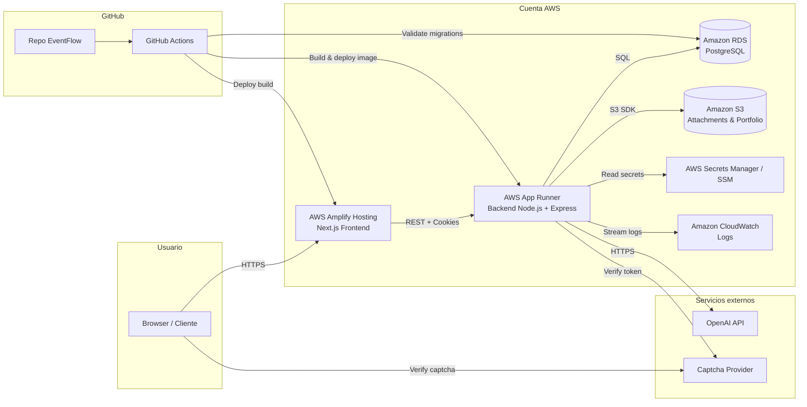
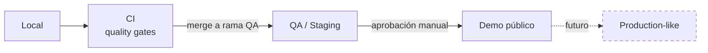
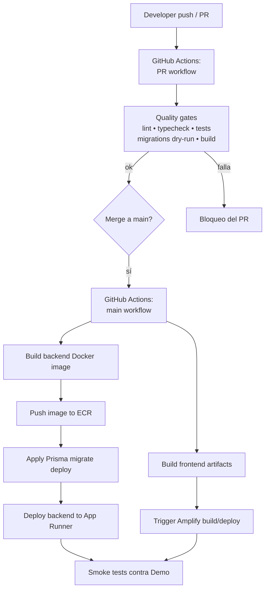
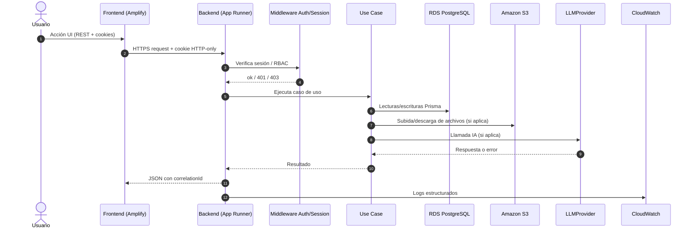
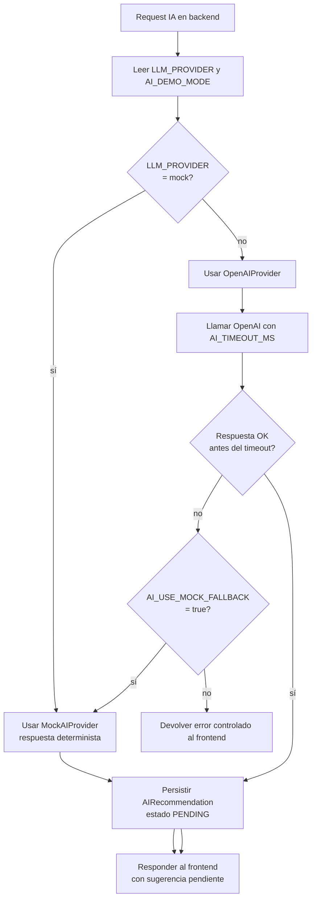

# EventFlow — Deployment & DevOps Design

> **Versión:** 1.0
> **Fecha:** 2026-06-09
> **Producto:** EventFlow
> **MVP target:** AI-assisted event planning workspace + simplified vendor quote flow
> **Idioma del documento:** Español LATAM neutral
> **Estado:** Aprobado para implementación del MVP académico
> **Audiencia:** Product Owner, Backend Engineers, Frontend Engineers, QA, DevOps, AI Engineers, evaluadores académicos, agentes de codificación IA

---

## 1. Propósito del documento

Este documento define la estrategia de **despliegue** y la disciplina de **DevOps** para el MVP académico de EventFlow.

Su objetivo es:

- Establecer una arquitectura de despliegue **simple, reproducible y demostrable** en una URL pública.
- Definir las **decisiones cloud** (proveedor, servicios gestionados, costos contenidos).
- Definir el **pipeline de CI/CD** con calidad mínima exigible antes de desplegar.
- Definir la **estrategia de entornos** (Local, CI, QA/Staging, Demo).
- Definir la **gestión de secretos**, **migraciones**, **seed**, **observabilidad** y **recuperación**.
- Garantizar que el sistema sea **evaluable académicamente** sin sobreingeniería.

El documento es **implementation-ready** y trazable a la documentación previa.

---

## 2. Alcance del documento

### 2.1 Incluye

- Decisión de proveedor cloud (AWS) y justificación frente a GCP.
- Arquitectura de despliegue AWS para frontend, backend, base de datos, almacenamiento, secretos y logs.
- Estrategia de contenedores (Docker) para el backend.
- Estrategia de CI/CD con GitHub Actions.
- Estrategia de entornos: Local, CI, QA/Staging, Demo.
- Gestión de variables de entorno y secretos.
- Estrategia de migraciones Prisma y seed.
- Observabilidad y logging operacional.
- Consideraciones de seguridad en despliegue.
- Checklist de readiness para demo académica.
- Estrategia de rollback y recuperación.
- ADRs recomendados y matriz de trazabilidad.

### 2.2 No incluye

- Despliegue en Kubernetes (EKS), ECS Fargate o malla de servicios.
- Microservicios o brokers de eventos (Kafka, RabbitMQ).
- Pasarela de pagos real, contratos digitales o e-signature.
- Integración real con WhatsApp, SMS o push notifications.
- Aplicación móvil nativa.
- Multi-región, blue-green enterprise, canary releases automatizados.
- SIEM, WAF avanzado, certificaciones formales (PCI/SOC2/GDPR).
- Tracing distribuido productivo (OpenTelemetry queda como futuro).
- Infraestructura como código (Terraform/CDK) como obligación del MVP.

---

## 3. Fuentes utilizadas

| # | Documento | Aporte para este documento |
|---|-----------|----------------------------|
| 1 | `1-Domain-Discovery-Report.md` | Contexto de negocio y dominio EventFlow. |
| 2 | `2-Product-Owner-Decisions.md` | Restricciones del MVP y enfoque académico. |
| 3 | `3-MVP-Scope-Definition.md` | Alcance funcional que debe ser desplegable. |
| 4 | `4-Business-Rules-Document.md` | Reglas que afectan seed, demo y permisos. |
| 5 | `5-User-Roles-Permissions-Matrix.md` | RBAC que se valida en backend (no en CDN). |
| 6 | `6-Domain-Data-Model.md` | Entidades persistidas en RDS PostgreSQL. |
| 7 | `7-AI-Features-Specification.md` | Necesidades de despliegue de IA y modo demo. |
| 8 | `8-Use-Cases-Specification.md` | Casos que deben funcionar end-to-end en demo. |
| 9 | `9-Functional-Requirements-Document.md` | Requisitos funcionales que el despliegue habilita. |
| 10 | `10-Non-Functional-Requirements.md` | SLA livianos de MVP (disponibilidad, performance, observabilidad). |
| 11 | `11-Data-Seed-Strategy.md` | Estrategia de seed/reset para entornos Demo. |
| 12 | `12-Architecture-Vision-and-Principles.md` | Principios arquitectónicos (modular monolith, simplicidad). |
| 13 | `13-System-Architecture-Document.md` | Vista de sistema y componentes lógicos. |
| 14 | `14-Backend-Technical-Design.md` | Forma del backend Node.js/Express y puertos/adaptadores. |
| 15 | `15-Frontend-Architecture-Design.md` | Forma del frontend Next.js y consumo del API. |
| 16 | `16-API-Design-Specification.md` | Contratos REST que el backend debe exponer en cloud. |
| 17 | `17-AI-Architecture-and-PromptOps-Design.md` | `LLMProvider`, `MockAIProvider`, fallback, demo mode. |
| 18 | `18-Database-Physical-Design.md` | Modelo físico para RDS PostgreSQL y Prisma. |
| 19 | `19-Security-and-Authorization-Design.md` | Cookies HTTP-only, CORS, captcha, rate limiting. |
| 20 | `20-Testing-Strategy.md` | Quality gates que el pipeline debe ejecutar. |

---

## 4. Resumen ejecutivo

EventFlow se despliega como **monolito modular** con un **frontend desacoplado**, sobre un conjunto reducido de servicios gestionados de **AWS**.

La forma final del despliegue es:

```text
Browser
   │
   ▼
Frontend Next.js  ──►  AWS Amplify Hosting
   │ (REST/HTTPS, cookies HTTP-only)
   ▼
Backend Node.js + Express (Docker)  ──►  AWS App Runner
   │
   ├──►  Amazon RDS PostgreSQL    (persistencia)
   ├──►  Amazon S3                (archivos y portfolio)
   ├──►  AWS Secrets Manager / SSM (secretos)
   ├──►  Amazon CloudWatch         (logs)
   └──►  OpenAI API  /  MockAIProvider  (IA)

CI/CD: GitHub Actions  ──►  Despliega frontend a Amplify y backend a App Runner.
```

Características clave:

- **Una sola URL pública** para frontend y otra para backend (REST).
- **MockAIProvider** habilitado por bandera para que la demo no dependa de OpenAI.
- **Seed reproducible** controlado por endpoint administrativo protegido.
- **CI/CD con quality gates** antes de cualquier despliegue.
- **CloudWatch** como observabilidad mínima viable.
- **Sin Kubernetes, sin microservicios, sin multi-región.**

---

## 5. Decisión cloud: AWS vs GCP

### 5.1 Decisión

> **Se selecciona AWS como proveedor cloud para el MVP de EventFlow.**

### 5.2 Contexto

EventFlow es un MVP académico que debe ser:

- Desplegable rápidamente.
- Demostrable en una URL pública.
- Operable por un equipo pequeño.
- Económico y reversible.
- Suficientemente profesional para evaluación.

### 5.3 Opciones consideradas

| Opción | Frontend | Backend | DB | Storage | Comentario |
|--------|----------|---------|----|---------|------------|
| **AWS** | Amplify Hosting | App Runner | RDS PostgreSQL | S3 | Servicios gestionados, sin Kubernetes. |
| **GCP** | Firebase Hosting / Cloud Run frontend | Cloud Run | Cloud SQL PostgreSQL | Cloud Storage | Alternativa válida pero con curva adicional. |

### 5.4 Ventajas de AWS para este MVP

- **Amplify Hosting** integra GitHub y Next.js sin requerir infraestructura adicional.
- **App Runner** permite correr un contenedor Node.js detrás de HTTPS sin operar Kubernetes ni clusters.
- **RDS PostgreSQL** es el estándar de hecho para Prisma + Postgres gestionado.
- **S3** es el almacenamiento de objetos más maduro y económico.
- **Secrets Manager / SSM Parameter Store** cubren la gestión de secretos sin servicios externos.
- **CloudWatch** ofrece logs centralizados out-of-the-box para App Runner.
- Amplia documentación pública para depuración por agentes IA y por estudiantes.

### 5.5 Ventajas de GCP que se reconocen

- Cloud Run tiene un excelente modelo de cold-start y facturación por request.
- Firebase Auth simplifica autenticación, aunque EventFlow ya definió su propio modelo.
- Cloud SQL PostgreSQL es comparable a RDS.

### 5.6 Por qué se selecciona AWS para el MVP

- App Runner + RDS + S3 + CloudWatch es la combinación **más simple y conocida** para un MVP Node.js.
- Permite un **despliegue lineal** sin requerir IAM avanzado, VPC complejas ni service meshes.
- El frontend Next.js encaja naturalmente en Amplify Hosting.
- Reduce la carga cognitiva para el equipo y para los agentes IA que mantienen el código.

### 5.7 Por qué no se selecciona GCP para este MVP

- No es una crítica al proveedor: GCP es totalmente válido.
- En este contexto académico, AWS aporta una **separación clara** entre servicios y un camino de despliegue más documentado para Next.js + Node.js + PostgreSQL.

### 5.8 Consecuencias

- El equipo debe gestionar credenciales AWS y un IAM mínimo.
- Algunos límites de App Runner (concurrencia y memoria) deben respetarse.
- La portabilidad futura a otro cloud no se descarta, pero queda como evolución.

### 5.9 Criterios para reconsiderar en el futuro

- Necesidad de cold-start barato por largos periodos sin tráfico.
- Adopción de funciones serverless event-driven.
- Integraciones nativas con Vertex AI o ecosistemas Google.
- Migración a Kubernetes y multi-cloud (fuera del MVP).

---

## 6. Principios DevOps del MVP

| # | Principio | Aplicación práctica |
|---|-----------|---------------------|
| P-01 | **Cloud simple antes que plataforma compleja** | App Runner + Amplify + RDS; nada de Kubernetes. |
| P-02 | **Un solo backend desplegable** | El monolito modular se despliega como un único servicio. |
| P-03 | **Managed services primero** | Postgres, almacenamiento, logs y secretos vienen del proveedor. |
| P-04 | **Secretos fuera del repositorio** | Solo `.env.example`; valores reales en Secrets Manager/SSM. |
| P-05 | **Demo reproducible** | Seed determinista y `MockAIProvider` disponibles. |
| P-06 | **IA mockeable** | `LLM_PROVIDER=mock` y `AI_USE_MOCK_FALLBACK=true` son MVP. |
| P-07 | **Quality gates antes de desplegar** | CI ejecuta lint, typecheck, tests, build y validación de migraciones. |
| P-08 | **Observabilidad sin sobrecarga** | CloudWatch + logs estructurados + `correlationId`. |
| P-09 | **Sin Kubernetes en el MVP** | App Runner basta. |
| P-10 | **Sin microservicios en el MVP** | Mantener el monolito modular. |
| P-11 | **Sin pasos manuales no documentados** | Todo paso operativo aparece en el runbook (sección 26). |
| P-12 | **Reversible y conservador** | Preferir redeploy de imagen previa antes que parches en caliente. |

---

## 7. Arquitectura de despliegue AWS

### 7.1 Diagrama de despliegue (Mermaid)



### 7.2 Notas de la arquitectura

- El **frontend nunca** accede directamente a OpenAI, RDS, S3 ni Secrets Manager.
- El **backend es el único** consumidor de OpenAI y de S3.
- Captcha es validado en el frontend (challenge) y verificado en el backend (token).
- Los logs son centralizados en CloudWatch desde App Runner.
- GitHub Actions despliega ambos lados; no hay despliegues manuales desde laptops.

---

## 8. Componentes cloud seleccionados

| Componente | Servicio AWS | Propósito | Prioridad MVP | Notas |
|------------|--------------|-----------|---------------|-------|
| Frontend hosting | **AWS Amplify Hosting** | Servir Next.js + assets, HTTPS, dominio público | Obligatorio | Build integrado con GitHub. |
| Backend runtime | **AWS App Runner** | Ejecutar contenedor Node.js + Express | Obligatorio | Sin Kubernetes. |
| Container registry | **Amazon ECR (privado)** | Almacenar imágenes del backend | Obligatorio | App Runner lo consume directamente. |
| Base de datos | **Amazon RDS for PostgreSQL** | Persistencia transaccional | Obligatorio | Instancia pequeña (db.t-class). |
| Object storage | **Amazon S3** | Archivos, portfolio, attachments | Obligatorio | Acceso solo desde backend. |
| Secretos | **AWS Secrets Manager** (preferido) o **SSM Parameter Store** | Variables sensibles en runtime | Obligatorio | Sin secretos en el repo ni en la imagen. |
| Logs | **Amazon CloudWatch Logs** | Logs centralizados del backend | Obligatorio | Retención corta (p. ej. 14–30 días). |
| CI/CD | **GitHub Actions** | Pipelines de calidad y despliegue | Obligatorio | OIDC hacia AWS recomendado. |
| DNS / Custom domain | **Route 53** (o el dominio existente) | URL amigable | Opcional / Futuro | URLs Amplify/App Runner alcanzan para evaluar. |
| CDN | Gestionado por **Amplify Hosting** | Caché de assets estáticos | Implícito en MVP | No requiere CloudFront extra. |
| Email | **No requerido para MVP** | Notificaciones simuladas en BD/logs | Futuro | SES si se decide enviar emails reales. |
| Métricas avanzadas / APM | **No requerido para MVP** | Telemetría profunda | Futuro | OpenTelemetry/Grafana como evolución. |
| WAF | **No requerido para MVP** | Filtro avanzado de tráfico | Futuro | App Runner ya termina HTTPS. |

---

## 9. Frontend deployment design

### 9.1 Estrategia general

El frontend Next.js (App Router) se despliega en **AWS Amplify Hosting** con integración directa al repositorio GitHub.

### 9.2 Pipeline de build (Amplify)

- **Trigger:** push a `main` o ramas seleccionadas (p. ej. `staging`).
- **Build command (referencial):**
  ```bash
  npm ci
  npm run lint
  npm run typecheck
  npm run test
  npm run build
  ```
- **Output:** artefactos de Next.js (incluye routing del App Router).

### 9.3 Variables de entorno del frontend

- Sólo variables **públicas** (`NEXT_PUBLIC_*`):
  - `NEXT_PUBLIC_API_BASE_URL`
  - `NEXT_PUBLIC_APP_ENV`
  - `NEXT_PUBLIC_CAPTCHA_SITE_KEY`
- Variables sensibles **no** se exponen al cliente.

### 9.4 Configuración del API base

- `NEXT_PUBLIC_API_BASE_URL` apunta al servicio del backend en App Runner.
- En Demo: URL pública del App Runner.
- En QA: URL pública del App Runner de QA.
- En Local: `http://localhost:3000` (u otro).

### 9.5 Cookies y sesión

- El frontend asume cookies HTTP-only emitidas por el backend.
- El frontend no manipula tokens directamente.
- Para que las cookies funcionen entre dominios distintos (Amplify ↔ App Runner) se utiliza `SameSite=None; Secure` y CORS con `credentials: true` (ver sección 19/20).

### 9.6 SEO e i18n

- Las páginas públicas de proveedores (vendor public pages) deben ser **SEO-friendly** (Server Components / metadata API de Next.js).
- Assets estáticos (imágenes optimizadas) son servidos por Amplify.

### 9.7 Rollback del frontend

- Amplify mantiene **builds anteriores**: se puede volver a un build previo con un clic / API.
- También se puede revertir el commit en `main` y disparar un nuevo build.

### 9.8 Lo que el frontend NO debe acceder directamente

- OpenAI.
- RDS PostgreSQL.
- S3.
- Secrets Manager.
- CloudWatch.

Todo pasa por el backend REST.

---

## 10. Backend deployment design

### 10.1 Estrategia general

El backend Node.js + Express se empaqueta como **imagen Docker** y se despliega en **AWS App Runner**.

### 10.2 Imagen Docker (estrategia)

- Imagen base: `node:LTS-alpine` (o slim) compatible con Prisma.
- Build multi-stage:
  - **Stage 1:** instalar dependencias y compilar TypeScript.
  - **Stage 2:** copiar solo artefactos compilados, `node_modules` de producción y Prisma client.
- Imagen pequeña, sin dev-dependencies.
- **No** incluye secretos.
- Incluye `EXPOSE` del puerto que App Runner espera (variable `PORT`).

### 10.3 `.dockerignore` (mínimo recomendado)

```
node_modules
.git
.github
.env
.env.*
*.log
coverage
dist
.husky
```

### 10.4 Health check

- Endpoint **público** y liviano: `GET /health` → `200 OK`.
- App Runner usa este endpoint para verificar disponibilidad.
- Opcionalmente `GET /readiness` que verifica conexión a DB.

### 10.5 Variables y secretos en runtime

- App Runner inyecta variables via configuración del servicio.
- Los valores sensibles se referencian desde **Secrets Manager** o **SSM**.
- La imagen **no** contiene credenciales.

### 10.6 CORS y cookies

- `CORS_ALLOWED_ORIGINS` se configura con el dominio del frontend Amplify (y el dominio custom en futuro).
- Las cookies se emiten con:
  - `HttpOnly`
  - `Secure`
  - `SameSite=None` (cross-site Amplify ↔ App Runner)
- Esto es obligatorio para que la sesión funcione en demo.

### 10.7 Escalado en App Runner (MVP)

- Concurrencia y CPU/memoria **modestas**.
- Min instances: 1 (suficiente para demo).
- Max instances: 2–3 (techo razonable).
- No se requiere autoscaling agresivo.

### 10.8 Lo que NO se hace en el backend del MVP

- No se introduce ECS, EKS, Lambda ni Step Functions.
- No se descompone en microservicios.
- No se introduce service mesh ni sidecars.
- No se hace serverless-first rewrite.

---

## 11. Database deployment design

### 11.1 Estrategia general

PostgreSQL se ejecuta en **Amazon RDS for PostgreSQL**, gestionado y respaldado.

### 11.2 Instancia recomendada

- Clase pequeña (familia `db.t*`) suficiente para el MVP.
- Storage GP3 mínimo escalable.
- Multi-AZ **no** requerido para MVP (queda como futuro).
- Versión PostgreSQL compatible con Prisma soportado.

### 11.3 Migraciones Prisma

- En CI: `prisma migrate diff` y `prisma migrate deploy --dry-run` (validación).
- En entornos: `prisma migrate deploy` antes de servir tráfico nuevo.
- Las migraciones se versionan en el repositorio.
- Cambios destructivos requieren plan documentado.

### 11.4 Backups / snapshots (nivel MVP)

- Habilitar **backups automáticos** de RDS con retención corta (7 días).
- Snapshots manuales antes de cambios mayores (ej. previo a demo).
- Restore = restaurar snapshot a una nueva instancia y rotar `DATABASE_URL`.

### 11.5 Connection string

- `DATABASE_URL` vive en Secrets Manager/SSM.
- Pool de conexiones de Prisma con tamaño moderado (acorde a App Runner).

### 11.6 Estrategia por entorno

- Cada entorno (QA, Demo) tiene su **propia base de datos** (mismo cluster con DBs distintas o instancias separadas).
- Local: PostgreSQL en Docker.

### 11.7 Seed

- Seed se ejecuta a través del backend (script Node + Prisma) en QA/Demo.
- Seed marcado como `is_seed=true`.
- Reset de seed es **idempotente** y auditado en `AdminAction`.

### 11.8 Lo que NO se hace en BD del MVP

- Sin réplicas de lectura.
- Sin particionamiento.
- Sin sharding.
- Sin multi-región.
- Sin acceso directo desde el frontend.

---

## 12. File storage deployment design

### 12.1 Estrategia general

- **Local dev:** disco local (carpeta `uploads/`).
- **CI/QA/Demo:** **Amazon S3**.

### 12.2 `FileStoragePort`

- Definido en el backend (puerto/adaptador).
- Adaptadores:
  - `LocalFileStorageAdapter` (dev).
  - `S3FileStorageAdapter` (cloud).
- La selección se hace por variable de entorno.

### 12.3 Responsabilidad de validación

Antes de almacenar:

- MIME type permitido (whitelist).
- Tamaño máximo (definido en NFR).
- Ownership y permisos del recurso destino.
- Captcha/rate limit cuando aplique.

### 12.4 Convenciones de buckets

- Un bucket por entorno: `eventflow-qa-files`, `eventflow-demo-files`, etc.
- Prefijos por tipo: `vendors/{vendorId}/portfolio/...`, `requests/{requestId}/attachments/...`.
- Acceso **privado por defecto**.

### 12.5 Modelo de acceso

- Sólo el backend tiene credenciales para leer/escribir.
- El frontend **no** sube archivos directamente al bucket en MVP.
- Soft delete: los metadatos del archivo permanecen en la tabla correspondiente; el objeto puede mantenerse o ser purgado de forma diferida.

### 12.6 Futuro

- URLs firmadas (signed URLs) para descarga directa segura.
- Lifecycle policies en S3 para limpieza automática.

---

## 13. AI provider deployment configuration

### 13.1 Configuración por variables

| Variable | Valores | Uso |
|----------|---------|-----|
| `LLM_PROVIDER` | `openai` / `mock` / `anthropic` | Selecciona el adaptador del puerto `LLMProvider`. |
| `OPENAI_API_KEY` | Secreto | Sólo si `LLM_PROVIDER=openai`. |
| `OPENAI_MODEL` | String | Modelo configurado para Demo. |
| `AI_TIMEOUT_MS` | `60000` | Timeout de llamadas LLM. |
| `AI_DEMO_MODE` | `true`/`false` | Marca interna para flujos demo. |
| `AI_USE_MOCK_FALLBACK` | `true`/`false` | Si falla OpenAI, cae a `MockAIProvider`. |

### 13.2 Reglas operativas

- En **Demo** preferido: `LLM_PROVIDER=openai`, `AI_USE_MOCK_FALLBACK=true`.
- En **Demo de contingencia** (sin internet/OpenAI): `LLM_PROVIDER=mock`, `AI_DEMO_MODE=true`.
- En **CI/Tests:** siempre `LLM_PROVIDER=mock`.
- El frontend nunca recibe `OPENAI_API_KEY`.

### 13.3 Logs y persistencia

- Cada interacción con el LLM se registra como `AIRecommendation` (estado `PENDING` hasta validación humana).
- Errores del proveedor IA se loguean con `correlationId` y razón del fallback.
- No se loguean prompts/respuestas completas con datos sensibles.

---

## 14. Secrets and environment variables strategy

### 14.1 Frontend variables

| Variable | Tipo | Origen en cloud | Notas |
|----------|------|-----------------|-------|
| `NEXT_PUBLIC_API_BASE_URL` | Pública | Amplify env | URL backend App Runner. |
| `NEXT_PUBLIC_APP_ENV` | Pública | Amplify env | `dev` / `qa` / `demo`. |
| `NEXT_PUBLIC_CAPTCHA_SITE_KEY` | Pública | Amplify env | Site key del captcha. |

### 14.2 Backend variables

| Variable | Tipo | Origen en cloud | Notas |
|----------|------|-----------------|-------|
| `NODE_ENV` | Config | App Runner env | `production`. |
| `APP_ENV` | Config | App Runner env | `qa` / `demo`. |
| `PORT` | Config | App Runner env | Puerto interno del servicio. |
| `DATABASE_URL` | Secreto | Secrets Manager / SSM | Cadena PostgreSQL. |
| `SESSION_SECRET` | Secreto | Secrets Manager / SSM | Firma de sesión. |
| `COOKIE_SECRET` | Secreto | Secrets Manager / SSM | Firma de cookies. |
| `CORS_ALLOWED_ORIGINS` | Config | App Runner env | Lista separada por coma. |
| `LOG_LEVEL` | Config | App Runner env | `info` por defecto. |
| `S3_BUCKET_NAME` | Config | App Runner env | Bucket del entorno. |
| `S3_REGION` | Config | App Runner env | Región del bucket. |
| `CAPTCHA_SECRET_KEY` | Secreto | Secrets Manager / SSM | Verificación server-side. |
| `JOBS_ENABLED` | Config | App Runner env | Habilita el registro de schedulers intra-proceso (US-015 / US-053). Debe estar en `true` en EXACTAMENTE UNA réplica del backend para evitar duplicación multi-instancia. Default `false` en dev/test/QA. |
| `JOBS_AUTOCOMPLETE_CRON` | Config | App Runner env | Cadencia del `AutoCompletePastEventsJob` (US-015). Default `30 0 * * *` (00:30 UTC diario). |
| `JOBS_EXPIRE_QUOTES_CRON` | Config | App Runner env | Cadencia del `ExpireQuotesJob` (US-053). Default `5 0 * * *` (00:05 UTC diario). Ver §14bis. |
| `JOBS_EXPIRE_QUOTES_JITTER_MAX_MS` | Config | App Runner env | Jitter máximo (ms) antes de invocar el `ExpireQuotesUseCase`. Default `600000` (10 min). Pon `0` en tests para determinismo. |
| `JOBS_EXPIRE_QUOTES_BATCH_SIZE` | Config | App Runner env | Tamaño del batch `LIMIT ? FOR UPDATE SKIP LOCKED` (US-053). Default `100`. |

### 14bis. Cron schedule catalog (jobs intra-proceso)

Los jobs viven dentro del backend Node y se activan sólo cuando `JOBS_ENABLED=true` (US-015 §14).
Un despliegue multi-instancia DEBE elegir exactamente una réplica como scheduler-primary; el
resto queda con `JOBS_ENABLED=false`.

| Job | Env cron | Default | Timezone | Trigger interno | Documentación |
|-----|----------|---------|----------|-----------------|---------------|
| `AutoCompletePastEventsJob` | `JOBS_AUTOCOMPLETE_CRON` | `30 0 * * *` | UTC | `NodeCronScheduler` (adapter del port `Scheduler`) | `docs/14 §23.2` |
| `ExpireQuotesJob` | `JOBS_EXPIRE_QUOTES_CRON` | `5 0 * * *` | UTC | Idem. Jitter `[0..JOBS_EXPIRE_QUOTES_JITTER_MAX_MS]` antes de invocar el UC. CLI ad-hoc: `npm run job:expire-quotes` | `docs/14 §23.2` |

Reglas operativas:

- Cron expressions se validan por `node-cron` al bootstrap (fail-fast).
- Los jobs no se registran cuando `JOBS_ENABLED=false` (log `jobs.registry.disabled`).
- Un run genera un `correlationId=job-<runId>` que aparece en todos los logs derivados del UC.

### 14.3 CI/CD variables (GitHub Actions)

| Variable / Secret | Tipo | Uso |
|-------------------|------|-----|
| `AWS_ROLE_TO_ASSUME` | Secret | OIDC hacia AWS (preferido sobre access keys). |
| `AWS_REGION` | Variable | Región objetivo del despliegue. |
| `ECR_REPOSITORY` | Variable | Repositorio de la imagen backend. |
| `APP_RUNNER_SERVICE_ARN` | Variable | Identificador del servicio backend. |
| `AMPLIFY_APP_ID` | Variable | App de Amplify a desplegar. |
| `STAGING_DATABASE_URL` / `DEMO_DATABASE_URL` | Secret | Solo para validar migraciones desde CI controladamente. |

### 14.4 AI variables

| Variable | Tipo | Notas |
|----------|------|-------|
| `LLM_PROVIDER` | Config | `openai` / `mock` / `anthropic`. |
| `OPENAI_API_KEY` | Secreto | Sólo cuando `LLM_PROVIDER=openai`. |
| `OPENAI_MODEL` | Config | Definido por PromptOps. |
| `AI_TIMEOUT_MS` | Config | `60000`. |
| `AI_DEMO_MODE` | Config | Activar para demo determinista. |
| `AI_USE_MOCK_FALLBACK` | Config | Cae a mock si OpenAI falla. |

### 14.5 Security variables

| Variable | Tipo | Notas |
|----------|------|-------|
| `RATE_LIMIT_WINDOW_MS` | Config | Ventana del rate limiter. |
| `RATE_LIMIT_MAX_REQUESTS` | Config | Tope por ventana. |
| `MAX_UPLOAD_SIZE_MB` | Config | Tope de subida de archivos. |
| `CAPTCHA_SITE_KEY` / `CAPTCHA_SECRET_KEY` | Pública / Secreto | Frontend y backend respectivamente. |

### 14.6 Reglas obligatorias

- Debe existir `.env.example` en el repositorio con **nombres** de todas las variables y **sin** valores reales.
- Ningún secreto vive en el repositorio.
- Ningún secreto se imprime en logs.
- Ningún secreto se hornea (bake) dentro de la imagen Docker.
- Rotación de secretos: **manual** en MVP, automatizada en el futuro.

---

## 15. Environment strategy

### 15.1 Tabla maestra de entornos

| Aspecto | Local | CI | QA / Staging | Demo | Production-like (Futuro) |
|---------|-------|----|--------------|------|---------------------------|
| Propósito | Desarrollo individual | Validación automática de PRs/main | Verificación pre-demo | URL pública de evaluación académica | Operación real |
| Frontend hosting | `next dev` | N/A (build only) | Amplify Hosting (branch QA) | Amplify Hosting (branch Demo/main) | Amplify + custom domain |
| Backend hosting | Node local | Containers efímeros (jobs) | App Runner (QA) | App Runner (Demo) | App Runner / ECS Fargate |
| Database | PostgreSQL local (Docker) | Postgres efímero en job | RDS PostgreSQL QA | RDS PostgreSQL Demo | RDS Multi-AZ |
| File storage | Disco local | Disco temporal del job | S3 QA | S3 Demo | S3 con políticas estrictas |
| AI provider | `mock` por defecto | `mock` siempre | `openai` o `mock` | `openai` + fallback a `mock` | `openai` + observabilidad |
| Seed | `npm run seed` | Validado en tests | Reset bajo demanda | Reset previo a demo | Política controlada |
| Secretos | `.env` local (no commit) | GitHub Secrets / OIDC | Secrets Manager (QA) | Secrets Manager (Demo) | Secrets Manager + rotación |
| Deployment trigger | Manual (dev) | PR / push a `main` | Push a rama QA o manual | Push a `main` / aprobación manual | Aprobación + ventana de cambio |
| Acceso | Solo desarrollador | Bots de CI | Equipo del proyecto | Público (evaluadores) | Restringido por audiencia |

### 15.2 Diagrama de promoción entre entornos



---

## 16. CI/CD strategy with GitHub Actions

### 16.1 Workflows definidos

| Workflow | Trigger | Acciones principales |
|----------|---------|----------------------|
| `pr.yml` | Pull Request a `main` o `qa` | Quality gates (lint, typecheck, tests, build, validación de migraciones). No despliega. |
| `main.yml` | Push a `main` | Quality gates + build de imagen backend + push a ECR + deploy a App Runner Demo + trigger Amplify build. |
| `staging.yml` | Push a `qa` | Quality gates + deploy a App Runner QA + Amplify rama QA. |
| `seed-reset.yml` | Manual (workflow_dispatch) | Ejecuta endpoint protegido de reset de seed en QA/Demo, con confirmación. |
| `smoke.yml` (opcional) | Después de deploy | Smoke tests E2E mínimos contra la URL pública. |

### 16.2 Diagrama del pipeline (Mermaid)



### 16.3 Recomendaciones de configuración

- Branch protection en `main` (PR obligatorio, checks obligatorios).
- Uso de **OIDC** entre GitHub y AWS (sin access keys de larga vida).
- Cancelar workflows superados (`cancel-in-progress`) en PRs.
- Cache de dependencias (`actions/cache` o `cache: 'npm'`) para acelerar builds.

### 16.4 Manejo de fallos

- Si fallan **quality gates** → no se mergea.
- Si falla **build de imagen** → no se despliega.
- Si falla **migración** → no se promueve la imagen al servicio (rollback al deployment previo).
- Si falla **smoke test** → notificación y se evalúa rollback manual.

---

## 17. Quality gates

| Gate | Tool / Command (ref.) | Runs on PR | Runs on main | Blocks deploy | Notes |
|------|------------------------|------------|--------------|----------------|-------|
| Typecheck frontend | `tsc --noEmit` (Next.js) | Sí | Sí | Sí | Detecta errores antes de build. |
| Typecheck backend | `tsc --noEmit` | Sí | Sí | Sí | |
| Lint | `eslint` (FE + BE) | Sí | Sí | Sí | Reglas compartidas. |
| Unit tests | `vitest` / `jest` | Sí | Sí | Sí | Cobertura mínima definida en `20-Testing-Strategy.md`. |
| Integration tests (BE) | `vitest` + Postgres efímero | Sí | Sí | Sí | Usa contenedor de Postgres. |
| API tests | Supertest / Pact-like | Sí | Sí | Sí | Verifican contratos REST. |
| Frontend component tests | Testing Library | Sí | Sí | Sí | Para componentes críticos. |
| E2E smoke tests | Playwright (mínimo) | Opcional | Sí | Sí (post-deploy) | Cubre login + flujo principal. |
| Prisma migration validation | `prisma migrate diff` / `deploy --create-only` | Sí | Sí | Sí | Detecta migraciones inválidas. |
| Seed validation | `npm run seed -- --dry-run` | Sí | Sí | Sí | Verifica idempotencia. |
| Build frontend | `next build` | Sí | Sí | Sí | |
| Build backend Docker | `docker build` | No (opcional) | Sí | Sí | Se sube a ECR sólo en `main`. |
| Security sanity check | `npm audit --omit=dev` y revisión básica | Sí | Sí | No (advertencia) | No exige cero CVEs en MVP. |
| Env var validation | Script que verifica que `.env.example` esté sincronizado | Sí | Sí | Sí | Evita variables faltantes. |

---

## 18. Database migrations and seed strategy

### 18.1 Principios

- **Una sola fuente de verdad:** Prisma schema + carpeta `prisma/migrations`.
- **Migraciones idempotentes** y versionadas.
- Las migraciones se aplican **antes** de servir tráfico nuevo (en el despliegue).
- En CI se valida que no haya drift entre schema y migraciones.

### 18.2 Aplicación de migraciones por entorno

| Entorno | Comando | Quién lo ejecuta |
|---------|---------|------------------|
| Local | `prisma migrate dev` | Desarrollador |
| CI | `prisma migrate diff` / `deploy --create-only` | GitHub Actions |
| QA | `prisma migrate deploy` | Pipeline `staging.yml` |
| Demo | `prisma migrate deploy` | Pipeline `main.yml` (paso previo a App Runner) |

### 18.3 Seed

- Script Node + Prisma, ubicado en `prisma/seed.ts` (o equivalente).
- Marca registros con `is_seed=true`.
- Es **idempotente**: ejecutarlo dos veces no duplica datos.
- Reset de seed se hace vía endpoint administrativo protegido.

### 18.4 Guardrails del seed reset

- Sólo se ejecuta en entornos cuyo `APP_ENV ∈ {qa, demo}`.
- Requiere autenticación de **admin** y `AdminAction` registrada.
- No debe ejecutarse contra entornos `production-like` futuros sin aprobación explícita.
- El workflow `seed-reset.yml` exige input manual y registro.

### 18.5 Recuperación

- Si el seed deja datos corruptos: ejecutar reset.
- Si una migración rompe el entorno: rollback de imagen a la versión previa **y** restaurar snapshot de RDS si la migración tocó esquema crítico.

---

## 19. Observability and logging

### 19.1 CloudWatch como base

- App Runner emite stdout/stderr a **CloudWatch Logs** automáticamente.
- Logs estructurados (JSON line) facilitan búsquedas.

### 19.2 Eventos a registrar

- **Request logs:** método, ruta, status, latencia, `correlationId`, `userId` cuando aplique.
- **Errores:** stack truncado, código de error, `correlationId`.
- **AI provider:** proveedor usado, latencia, si hubo fallback a mock, sin contenido sensible.
- **Auth/Captcha:** intentos fallidos, motivo (sin filtrar credenciales).
- **AdminAction:** persistido en BD; también puede emitirse evento de log.
- **Seed reset:** registrado en `AdminAction` y log de operación.

### 19.3 Redacción y privacidad

- Nunca loguear contraseñas, tokens, secretos, ni el contenido completo de prompts si contiene PII.
- Loguear identificadores y métricas, no datos sensibles.

### 19.4 Limitaciones del MVP

- **No** hay APM productivo (New Relic/Datadog).
- **No** hay tracing distribuido (OpenTelemetry queda como futuro).
- **No** hay dashboards Grafana.
- **No** hay alerting automatizado avanzado; basta con revisar logs ante incidentes.

### 19.5 Futuro

- OpenTelemetry + tracing.
- Dashboards Grafana / CloudWatch Insights.
- Alarmas CloudWatch para errores 5xx, latencia, fallos del LLM.

---

## 20. Security considerations for deployment

| Tema | Decisión MVP |
|------|--------------|
| HTTPS | Obligatorio en frontend (Amplify) y backend (App Runner termina TLS). |
| Cookies | `HttpOnly`, `Secure`, `SameSite=None` para Amplify ↔ App Runner. |
| CORS | Allowlist explícita; sólo el dominio del frontend. |
| Secretos | Sólo en Secrets Manager / SSM; nunca en repo ni en imagen. |
| DB access | RDS sólo accesible desde App Runner (Security Group / conexión privada o IP restringida). |
| S3 access | Bucket privado, sólo accesible por el rol del backend. |
| Captcha | Configurado para signup, login, formularios públicos. |
| Rate limiting | Configurado en backend (claves y umbrales por variable). |
| File upload | MIME whitelist, tamaño máximo, validación de ownership. |
| IAM | Roles dedicados con permisos mínimos para App Runner, GitHub OIDC, etc. |
| GitHub Actions | Permisos `contents: read`, `id-token: write` cuando se usa OIDC. |
| Endpoint de seed reset | Protegido por rol admin + workflow manual. |
| Pagos / KYC / compliance | **No aplica** en MVP. |
| WAF | No requerido en MVP. |

---

## 21. Runtime request flow



---

## 22. AI fallback and demo mode flow



Notas:

- Toda interacción se registra como `AIRecommendation` (human-in-the-loop).
- El fallback a `MockAIProvider` permite continuar la demo aunque OpenAI falle.
- Los logs incluyen el proveedor finalmente usado y el motivo del fallback (si lo hubo).

---

## 23. Deployment checklist

### 23.1 Antes del primer despliegue

- [ ] Cuenta AWS con permisos creados (IAM roles para App Runner, OIDC para GitHub).
- [ ] Repositorio ECR creado.
- [ ] RDS PostgreSQL creado y accesible desde App Runner.
- [ ] Bucket S3 creado por entorno.
- [ ] Secrets/parámetros cargados en Secrets Manager / SSM.
- [ ] Amplify App conectado al repositorio.
- [ ] App Runner service creado y apuntando a ECR.
- [ ] `.env.example` completo y sincronizado.
- [ ] Variables públicas configuradas en Amplify.
- [ ] Branch protection activado en `main`.

### 23.2 Antes de cada despliegue a Demo

- [ ] PR con checks verdes y aprobado.
- [ ] Revisar migraciones nuevas y su reversibilidad.
- [ ] Confirmar `LLM_PROVIDER` deseado para la demo.
- [ ] Confirmar `AI_USE_MOCK_FALLBACK=true`.
- [ ] Snapshot de RDS si la migración es invasiva.
- [ ] Confirmar que el seed se ejecutó correctamente en QA.

### 23.3 Después del despliegue

- [ ] `GET /health` responde `200`.
- [ ] Smoke test E2E pasa (login, ver dashboard, crear evento, ver sugerencia IA).
- [ ] Logs limpios en CloudWatch (sin errores recurrentes).
- [ ] Cookies funcionando entre frontend y backend.
- [ ] Subida de un archivo de prueba a S3 confirmada.

### 23.4 Antes de la evaluación académica

- [ ] URL pública del frontend documentada.
- [ ] Usuarios demo creados y documentados.
- [ ] Script/instrucciones de smoke test disponibles.
- [ ] Plan de contingencia (mock fallback, redeploy, snapshot) listo.
- [ ] Documento de despliegue (este) actualizado.

---

## 24. Rollback and recovery strategy

| Escenario | Acción |
|-----------|--------|
| Frontend roto tras deploy | Revertir build en Amplify al build previo o revertir commit en `main`. |
| Backend roto tras deploy | Redeploy de la **imagen previa** desde ECR en App Runner. |
| Migración fallida | Rollback de imagen + restaurar snapshot de RDS si el esquema fue afectado. |
| Seed corrupto en Demo | Ejecutar workflow `seed-reset.yml` (idempotente y auditado). |
| OpenAI caído / sin cuota | Cambiar `LLM_PROVIDER=mock` o garantizar `AI_USE_MOCK_FALLBACK=true`. |
| Secretos mal configurados | Actualizar en Secrets Manager y reiniciar servicio App Runner. |
| Pérdida de datos (catastrófica) | Restaurar último snapshot de RDS; aceptar pérdida según retención. |
| CloudWatch lleno de errores | Verificar último deploy, revertir si es necesario. |

**Limitaciones aceptadas para MVP:**

- No hay automatización de rollback (es manual con un par de clics).
- No hay blue-green ni canary; el reemplazo es directo.
- No hay multi-región: la indisponibilidad regional es un riesgo aceptado.

---

## 25. Demo readiness strategy

### 25.1 URLs públicas

- Frontend: URL provista por Amplify (o dominio custom en el futuro).
- Backend: URL provista por App Runner.
- Ambas deben aparecer en la documentación de la entrega.

### 25.2 Usuarios sembrados

- Al menos:
  - 1 admin demo.
  - 1 organizador (event planner).
  - 1 vendor.
- Documentados en `11-Data-Seed-Strategy.md`.

### 25.3 Modo IA para la demo

- Default sugerido: `LLM_PROVIDER=openai` con `AI_USE_MOCK_FALLBACK=true`.
- Contingencia: cambiar a `LLM_PROVIDER=mock` desde Secrets Manager.

### 25.4 Smoke test manual mínimo

1. Abrir URL del frontend.
2. Iniciar sesión con usuario sembrado.
3. Crear un evento de prueba.
4. Solicitar sugerencia IA.
5. Crear una solicitud de cotización a un proveedor sembrado.
6. Adjuntar un archivo y verificar que se ve.
7. Cerrar sesión.

### 25.5 Plan de contingencia

| Falla | Acción durante la demo |
|-------|------------------------|
| OpenAI no responde | Cambiar a `mock` o confiar en `AI_USE_MOCK_FALLBACK`. |
| Seed corrupto | Ejecutar `seed-reset.yml`. |
| App Runner falla | Revertir a imagen previa desde ECR. |
| Amplify falla | Revertir build en consola Amplify. |
| RDS lento | Reducir actividad, verificar CloudWatch; en último caso, reiniciar instancia. |

---

## 26. Operational runbook

Comandos ilustrativos (no definitivos):

### 26.1 Setup local

```bash
git clone <repo>
cp .env.example .env  # llenar variables locales
docker compose up -d postgres
npm ci
npx prisma generate
npx prisma migrate dev
npm run seed
npm run dev
```

### 26.2 Tests

```bash
npm run lint
npm run typecheck
npm run test
npm run test:integration
npm run test:e2e
```

### 26.3 Build de la imagen backend

```bash
docker build -t eventflow-backend:local -f backend/Dockerfile .
docker run --rm -p 3000:3000 --env-file .env eventflow-backend:local
```

### 26.4 Push a ECR (lo hace CI normalmente)

```bash
aws ecr get-login-password --region $AWS_REGION | docker login --username AWS --password-stdin $ECR_REPOSITORY
docker tag eventflow-backend:local $ECR_REPOSITORY:<sha>
docker push $ECR_REPOSITORY:<sha>
```

### 26.5 Despliegue manual de emergencia

```bash
# Backend
aws apprunner start-deployment --service-arn $APP_RUNNER_SERVICE_ARN

# Frontend
aws amplify start-job --app-id $AMPLIFY_APP_ID --branch-name main --job-type RELEASE
```

### 26.6 Migraciones en cloud

```bash
DATABASE_URL=$DEMO_DATABASE_URL npx prisma migrate deploy
```

### 26.7 Reset de seed en Demo

```bash
# A través del workflow GitHub Actions: seed-reset.yml
# o llamada autenticada al endpoint admin protegido
curl -X POST https://<backend>/api/admin/seed/reset \
  -H "Cookie: <admin-session>"
```

### 26.8 Verificar salud y logs

```bash
curl https://<backend>/health

aws logs tail /aws/apprunner/<service>/application --since 15m --follow
```

---

## 27. Cost and resource considerations

| Categoría | Recomendación MVP |
|-----------|-------------------|
| Amplify Hosting | Plan gratuito/básico es suficiente para demo. |
| App Runner | Configurar 1 vCPU / 2 GB y min 1, max 2–3 instancias. |
| RDS PostgreSQL | Instancia pequeña (`db.t*`), 20 GB GP3, backups 7 días. |
| S3 | Bucket por entorno; costo despreciable para volúmenes MVP. |
| Secrets Manager | Pocos secretos; costo bajo. SSM Parameter Store es alternativa más económica. |
| CloudWatch Logs | Retención **14–30 días** para limitar costos. |
| ECR | Un solo repositorio con políticas de limpieza de imágenes antiguas. |
| Tráfico de red | Despreciable para MVP demo. |
| Cost monitoring | Activar **AWS Budgets** con alerta mensual baja (p.ej. USD 20–50). |

Evitar: NAT Gateways innecesarios, instancias grandes, multi-AZ, RDS Aurora, CloudFront premium, WAF, SIEM.

---

## 28. Risks and mitigations

| Risk ID | Riesgo | Impacto | Probabilidad | Mitigación | Área relacionada |
|---------|--------|---------|--------------|------------|------------------|
| R-01 | Despliegue falla justo antes de la demo | Alto | Media | Smoke tests + posibilidad de rollback de imagen y de build de Amplify. | CI/CD, demo |
| R-02 | Migración Prisma rompe esquema | Alto | Media | Validación en CI, snapshot previo, rollback de imagen. | DB |
| R-03 | Seed produce datos inconsistentes | Medio | Media | Seed idempotente, workflow de reset, validación previa en QA. | DB / Demo |
| R-04 | OpenAI no disponible o sin cuota | Alto | Media | `AI_USE_MOCK_FALLBACK=true` o cambiar a `LLM_PROVIDER=mock`. | AI |
| R-05 | Backend no conecta a RDS | Alto | Baja | Verificar Security Group, `DATABASE_URL`, reintentos de Prisma. | DB / red |
| R-06 | Secretos mal configurados | Alto | Media | `env validation script` en CI, plantilla `.env.example`. | Config |
| R-07 | CORS o cookies bloquean sesión | Alto | Media | Pruebas E2E cubriendo login en Demo, `SameSite=None; Secure`. | Auth |
| R-08 | Permisos S3 mal configurados | Medio | Media | Política IAM mínima documentada, smoke test de upload. | Storage |
| R-09 | CI demasiado lento | Bajo | Media | Cache de dependencias, jobs en paralelo, tests E2E mínimos. | CI |
| R-10 | Logs filtran datos sensibles | Alto | Baja | Reglas de redacción, revisión de logs antes de demo. | Observabilidad |
| R-11 | Scope creep hacia Kubernetes/microservicios | Medio | Media | Principios del MVP (sección 6), ADRs explícitos. | Gobernanza |

---

## 29. MVP boundaries and future DevOps evolution

### 29.1 Límites del MVP

- **Sin Kubernetes** (EKS no aplica).
- **Sin ECS cluster** propio en MVP.
- **Sin multi-región.**
- **Sin blue-green / canary** automatizado.
- **Sin autoscaling agresivo** más allá del básico de App Runner.
- **Sin tuning fino de CDN** más allá de lo que Amplify ofrece.
- **Sin tracing distribuido productivo.**
- **Sin certificaciones formales** (SOC2/PCI/GDPR).
- **Sin WAF avanzado.**
- **Sin infraestructura como código** obligatoria.

### 29.2 Evolución futura

- Dominio custom con **Route 53** y HTTPS gestionado.
- **AWS WAF** delante de App Runner / CloudFront.
- **CloudFront** explícito para optimización de assets.
- Migración a **ECS Fargate** si el escalado lo exige.
- Refinamiento de políticas de **backup y restore** en RDS (Multi-AZ).
- **URLs firmadas** de S3 para descarga directa.
- **OpenTelemetry** + dashboards Grafana / CloudWatch Insights.
- **Alarmas** y on-call ligero.
- **Blue-green / canary** controlado.
- **IaC** con Terraform o AWS CDK.
- Promoción gobernada multi-entorno (cambios con tickets).

---

## 30. ADRs recomendados

| ADR | Título | Resumen |
|-----|--------|---------|
| ADR-015 | Choose AWS for MVP deployment | Se elige AWS por simplicidad, madurez de servicios y bajo overhead para un MVP académico. |
| ADR-016 | Use AWS Amplify Hosting for Next.js frontend | Hosting gestionado integrado con GitHub; cubre HTTPS, CDN y entornos. |
| ADR-017 | Use AWS App Runner for backend container | Permite correr Node.js + Express en Docker sin clusters; HTTPS y escalado básico. |
| ADR-018 | Use Amazon RDS PostgreSQL | PostgreSQL gestionado, ideal para Prisma y para el modelo de EventFlow. |
| ADR-019 | Use S3 for cloud object storage | Almacenamiento de archivos privados; integrado al `FileStoragePort`. |
| ADR-020 | Use GitHub Actions for CI/CD | Pipeline gratuito, integrado al repo, suficiente para los quality gates del MVP. |
| ADR-021 | Use CloudWatch for MVP logging | Logs centralizados sin operar herramientas adicionales. |
| ADR-022 | Do not use Kubernetes in MVP | Evitar complejidad operacional; App Runner cubre la necesidad del MVP. |

---

## 31. Traceability matrix

| Decisión DevOps | Documento(s) fuente | Racional | MVP/Futuro |
|-----------------|---------------------|----------|------------|
| AWS como proveedor cloud | `2-Product-Owner-Decisions.md`, `12-Architecture-Vision-and-Principles.md` | Simplicidad y madurez gestionada para MVP | MVP |
| Amplify Hosting para Next.js | `15-Frontend-Architecture-Design.md` | Frontend Next.js requiere hosting gestionado | MVP |
| App Runner para backend | `13-System-Architecture-Document.md`, `14-Backend-Technical-Design.md` | Backend modular monolito en contenedor | MVP |
| RDS PostgreSQL | `18-Database-Physical-Design.md` | Modelo relacional con Prisma | MVP |
| S3 para archivos | `14-Backend-Technical-Design.md` (`FileStoragePort`) | Reemplaza almacenamiento local | MVP |
| Secrets Manager / SSM | `19-Security-and-Authorization-Design.md` | Secretos fuera del repo | MVP |
| CloudWatch para logs | `10-Non-Functional-Requirements.md`, `19-Security-and-Authorization-Design.md` | Observabilidad mínima viable | MVP |
| GitHub Actions CI/CD | `20-Testing-Strategy.md` | Ejecuta quality gates | MVP |
| `MockAIProvider` y `AI_USE_MOCK_FALLBACK` | `7-AI-Features-Specification.md`, `17-AI-Architecture-and-PromptOps-Design.md` | Demo resiliente | MVP |
| Seed idempotente y reset auditado | `11-Data-Seed-Strategy.md`, `4-Business-Rules-Document.md` | Reproducibilidad de demo | MVP |
| Cookies HTTP-only + CORS allowlist | `19-Security-and-Authorization-Design.md` | Seguridad de sesión cross-site | MVP |
| Sin Kubernetes / microservicios | `12-Architecture-Vision-and-Principles.md` | Evitar sobreingeniería | MVP |
| OpenTelemetry, IaC, WAF, custom domain | `10-Non-Functional-Requirements.md` | Evolución posterior | Futuro |
| ECS Fargate / Multi-AZ / Blue-green | `12-Architecture-Vision-and-Principles.md` | Escenario de producción real | Futuro |

---

## 32. Final readiness checklist

### 32.1 Frontend
- [ ] Build de Next.js exitoso en Amplify.
- [ ] `NEXT_PUBLIC_API_BASE_URL` apunta al backend correcto.
- [ ] Páginas públicas SEO-friendly verificadas.
- [ ] Captcha visible y funcional.
- [ ] Rollback a build previo probado.

### 32.2 Backend
- [ ] Imagen Docker creada y publicada en ECR.
- [ ] App Runner desplegado y `GET /health` responde 200.
- [ ] CORS configurado con dominio Amplify.
- [ ] Cookies HTTP-only emitidas con `SameSite=None; Secure`.
- [ ] Variables y secretos cargados correctamente.

### 32.3 Database
- [ ] RDS accesible sólo desde App Runner.
- [ ] Migraciones aplicadas (`prisma migrate deploy`).
- [ ] Backups automáticos activos.
- [ ] Snapshot manual previo a la demo.

### 32.4 AI
- [ ] `LLM_PROVIDER` definido (`openai` o `mock`).
- [ ] `AI_USE_MOCK_FALLBACK=true`.
- [ ] `AI_TIMEOUT_MS=60000`.
- [ ] `MockAIProvider` validado con flujos demo.

### 32.5 Security
- [ ] Sin secretos en el repositorio.
- [ ] Sin secretos en la imagen Docker.
- [ ] Rate limiting configurado.
- [ ] Validación de uploads activa.
- [ ] IAM roles con permisos mínimos.

### 32.6 CI/CD
- [ ] Workflows de PR, main, staging y seed-reset configurados.
- [ ] Branch protection en `main`.
- [ ] OIDC GitHub ↔ AWS configurado.
- [ ] Quality gates pasando en el último PR.

### 32.7 Seed
- [ ] Script idempotente verificado.
- [ ] Usuarios sembrados documentados.
- [ ] Endpoint `seed reset` protegido y auditado.

### 32.8 Observability
- [ ] Logs visibles en CloudWatch.
- [ ] `correlationId` presente por request.
- [ ] No se loguean secretos ni PII sensible.

### 32.9 Demo
- [ ] URL pública compartida.
- [ ] Smoke test manual ejecutado.
- [ ] Plan de contingencia revisado.

### 32.10 Documentation
- [ ] Este documento (`21-Deployment-and-DevOps-Design.md`) actualizado.
- [ ] ADRs creados (sección 30).
- [ ] Runbook (sección 26) verificado por al menos un miembro del equipo.

---

**Fin del documento.**
