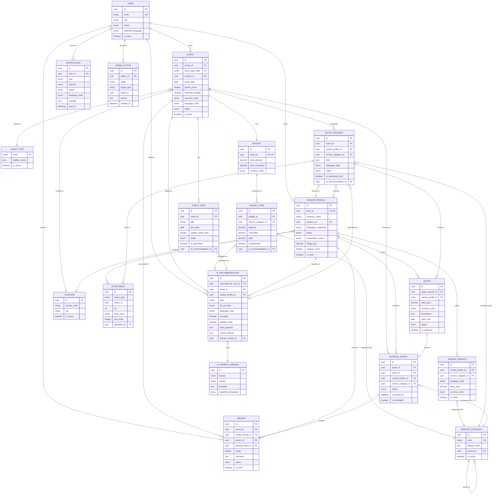

# EventFlow — Domain Data Model Document

> Documento formal del Modelo de Datos del Dominio del MVP
> Versión: 1.0
> Idioma: Español LATAM neutral
> Audiencia: Product Owner, Software Architect, Backend Engineer, QA, Business Analyst, agentes IA generadores de FRD, esquemas Prisma/SQL, contratos API y pruebas
> Documentos fuente: `1-Domain-Discovery-Report.md`, `2-Product-Owner-Decisions.md`, `3-MVP-Scope-Definition.md`, `4-Business-Rules-Document.md`, `5-User-Roles-Permissions-Matrix.md`

---

## 1. Propósito del documento

Este documento define de forma estructurada, trazable y verificable el **modelo de datos del dominio de EventFlow** para el MVP. Su objetivo es:

- Consolidar las **entidades, atributos, estados, relaciones y restricciones** que soportan las funcionalidades MVP.
- Servir como **fuente única de verdad** para la posterior generación de esquema de base de datos, modelos ORM (Prisma), contratos de API, user stories, criterios de aceptación, casos de prueba, scripts de seed y reglas de validación.
- Mantener una **separación clara** entre entidades MVP, entidades recomendadas, entidades diferidas y entidades fuera de alcance.
- Reducir el riesgo de **sobre-modelado** o de inclusión de estructuras propias de un marketplace transaccional completo, explícitamente descartadas para v1.
- Permitir a agentes IA y al equipo de desarrollo derivar artefactos técnicos sin perder trazabilidad con el dominio.

El documento responde, de manera operativa, a cinco preguntas:

1. ¿Qué entidades existen en el dominio del MVP?
2. ¿Cuáles son sus atributos, estados y relaciones?
3. ¿Quién es dueño de cada entidad y cómo se accede a ella?
4. ¿Qué entidades quedan fuera del MVP y por qué?
5. ¿Qué constraints, enums y reglas de integridad son necesarias para soportar el MVP?

---

## 2. Alcance del modelo de datos

Este documento cubre el **modelo de datos funcional del MVP de EventFlow**, abarcando:

- Entidades incluidas en el MVP.
- Entidades recomendadas como soporte (trazabilidad IA, catálogos).
- Entidades diferidas para versiones futuras.
- Entidades explícitamente fuera de alcance.
- Atributos clave y tipos sugeridos.
- Estados de ciclo de vida y enums del dominio.
- Relaciones, cardinalidades y reglas de ownership.
- Reglas de integridad y constraints derivadas de las reglas de negocio.
- Datos requeridos para soportar funcionalidades IA y seed/demo.
- Internacionalización y moneda.
- Diagrama Mermaid ER del modelo MVP.
- Notas de implementación física y sugerencias de índices.

**Lo que este documento NO cubre:**

- Esquema físico definitivo (DDL específico).
- Contratos API formales.
- Decisiones de despliegue.
- Plan de pruebas detallado.
- Estrategia de migraciones.

---

## 3. Fuentes utilizadas

| # | Documento | Uso principal |
|---:|---|---|
| 1 | `/docs/1-Domain-Discovery-Report.md` | Entidades preliminares (sección 7), JTBD, procesos de negocio, reglas iniciales (sección 8). |
| 2 | `/docs/2-Product-Owner-Decisions.md` | Decisiones de mercado, idiomas, moneda, branding, datos seed, moderación, modelo de negocio. |
| 3 | `/docs/3-MVP-Scope-Definition.md` | Alcance funcional, entidades MVP (sección 13), tipos de evento (sección 6), datos seed (sección 7.16). |
| 4 | `/docs/4-Business-Rules-Document.md` | 214 reglas BR-* que gobiernan atributos, estados, transiciones y ownership. |
| 5 | `/docs/5-User-Roles-Permissions-Matrix.md` | Roles, ownership por entidad (sección 9), matriz CRUD (sección 22), reglas de propiedad y acceso (sección 10). |

Toda entidad, atributo, relación o constraint documentado se deriva o cita explícitamente de uno o más de estos documentos.

---

## 4. Principios de modelado

Los siguientes principios son **filtros transversales** que orientan cualquier decisión de modelado en este documento.

1. **Origen documental.** Toda entidad MVP debe rastrearse a al menos un documento fuente.
2. **Mínimo viable.** Solo se modelan los atributos estrictamente necesarios para soportar funcionalidades MVP.
3. **Ownership claro.** Cada entidad tiene un dueño funcional (Organizer, Vendor, Admin, System, Shared).
4. **Human-in-the-loop IA.** Toda entidad derivada de IA debe distinguir lo sugerido (no oficial) de lo confirmado (oficial).
5. **Aislamiento por rol.** El modelo soporta visibilidad por rol y por propiedad de recursos.
6. **Trazabilidad IA.** Toda salida IA se persiste con prompt versionado, payload y flag `accepted`.
7. **Sin pagos ni contratos.** El MVP no modela pagos reales, captura de medios de pago ni contratos firmados.
8. **Sin chat real-time, sin WhatsApp, sin push, sin SMS.** El MVP no modela canales de mensajería externos.
9. **Catálogos curados.** `EventType`, `ServiceCategory` y monedas son catálogos curados; los usuarios no los crean.
10. **Multi-idioma y moneda configurable.** El modelo soporta es-LATAM/es-ES/pt/en y moneda por evento sin conversión automática.
11. **Soft delete preferente.** Para entidades con historial relevante (Review, VendorProfile, ServiceCategory), se prefiere borrado lógico.
12. **No sobre-normalizar.** Se evita fragmentar entidades cuando un atributo simple basta.
13. **Compatibilidad PostgreSQL.** El modelo es realista para implementarse en una base relacional con Prisma/PostgreSQL.

---

## 5. Metodología de extracción del modelo

El modelo se construye siguiendo el flujo:

```text
Lectura → Extracción → Clasificación → Validación → Modelado
```

1. **Lectura:** Se leen integralmente los 5 documentos fuente.
2. **Extracción:** Se identifican candidatos a entidades en cada documento (mención explícita, derivación por feature o por permiso).
3. **Clasificación:** Cada candidato se etiqueta por:
   - **Source type:** Explicit, Derived, Assumption, Recommended.
   - **Scope:** MVP, Future, Out of Scope.
   - **Owner:** Organizer, Vendor, Admin, System, Shared.
   - **Domain area:** Auth, Events, AI, Vendors, Quotes, Reviews, Admin, Demo, i18n.
4. **Validación:** Se contrasta cada candidato contra reglas de negocio (BR-*), matriz de permisos y alcance MVP.
5. **Modelado:** Se documentan entidades MVP con atributos, relaciones, estados y constraints; las restantes se separan en secciones futuras u out-of-scope.

---

## 6. Entity Extraction from Source Documents

Tabla de extracción de candidatos a entidad obtenidos del análisis de los documentos fuente.

| Candidate Entity | Found in source document | Evidence / context | Classification | MVP decision |
|---|---|---|---|---|
| User | 1 (§7), 3 (§13), 4 (§8), 5 (§5) | Núcleo de autenticación; rol asignado al registro (BR-AUTH-002). | Explicit | MVP |
| Role | 1 (§8.11), 4 (§7), 5 (§5) | Rol del usuario (`organizer`, `vendor`, `admin`); enum cerrado. | Explicit | MVP |
| Event | 1 (§7), 3 (§13), 4 (§9), 5 (§9.3) | Recurso central propiedad del organizador. | Explicit | MVP |
| EventType | 1 (§7), 3 (§6, §13), 4 (§10), 5 (§9.4) | Catálogo cerrado: wedding, xv, baptism, baby_shower, birthday, corporate. | Explicit | MVP |
| EventTask | 1 (§7), 3 (§13), 4 (§12), 5 (§9.5) | Tarea del checklist con estados y origen IA. | Explicit | MVP |
| Budget | 1 (§7), 3 (§13), 4 (§13), 5 (§9.6) | Presupuesto 1:1 con el evento. | Explicit | MVP |
| BudgetItem | 1 (§7), 3 (§13), 4 (§13), 5 (§9.7) | Línea de presupuesto por categoría. | Explicit | MVP |
| VendorProfile | 1 (§7), 3 (§13), 4 (§14), 5 (§9.8) | Perfil del proveedor sujeto a aprobación admin. | Explicit | MVP |
| VendorService | 1 (§7), 3 (§13), 4 (§15), 5 (§9.9) | Paquete/servicio ofrecido por proveedor. | Explicit | MVP |
| ServiceCategory | 1 (§7), 3 (§13), 4 (§15), 5 (§9.10) | Catálogo de categorías curado por admin. | Explicit | MVP |
| QuoteRequest | 1 (§7), 3 (§13), 4 (§16), 5 (§9.11) | Solicitud estructurada de cotización al proveedor. | Explicit | MVP |
| Quote | 1 (§7), 3 (§13), 4 (§17), 5 (§9.12) | Respuesta del proveedor con precio, condiciones y validez. | Explicit | MVP |
| BookingIntent | 1 (§7), 3 (§13), 4 (§19), 5 (§9.13) | Intención de reserva simulada (sin pago real). | Explicit | MVP |
| Review | 1 (§7), 3 (§13), 4 (§20), 5 (§9.14) | Reseña verificada por booking confirmado. | Explicit | MVP |
| Notification | 1 (§7), 3 (§13), 4 (§21), 5 (§9.15) | Aviso al usuario in-app + email simulado. | Explicit | MVP |
| AIRecommendation | 1 (§7), 3 (§13), 4 (§11), 5 (§9.16) | Salida IA con prompt versionado y flag accepted. | Explicit | MVP |
| Location | 1 (§7), 3 (§13), 5 (§9.17) | Ubicación normalizada (país, ciudad). | Explicit | MVP |
| Attachment | 1 (§7), 3 (§13), 5 (§9.18) | Archivo adjunto (portafolio, brief). | Explicit | MVP |
| AdminAction | 1 (§7), 3 (§13), 4 (§24), 5 (§9.19) | Log de auditoría de acciones admin. | Explicit | MVP |
| AIPromptVersion | 4 (BR-AI-010) | Versionado de prompts; recomendado para trazabilidad. | Recommended | MVP (recomendado) |
| Currency | 2 (§10), 3 (§7.15), 4 (BR-BUDGET-006) | Catálogo de monedas soportadas. | Derived | MVP (catálogo) |
| Language | 2 (§9), 3 (§7.15), 4 (BR-I18N-001) | Catálogo de idiomas soportados. | Derived | MVP (catálogo) |
| UserPreference | 4 (BR-USER-006), 5 (§17) | Idioma preferido del usuario; puede modelarse como atributo de User. | Assumption | MVP (como atributo de User) |
| EventPlan | 1 (§6.2), 3 (§7.3) | El "plan" se materializa como combinación de tareas, presupuesto y categorías, no como entidad separada. | Derived | Not modeled (derived from EventTask + Budget + AIRecommendation) |
| EventTimeline | 1 (§6.2) | Timeline macro generado por IA; se cubre con EventTask + AIRecommendation. | Derived | Not modeled (cubierto por EventTask) |
| EventTemplate | 3 (§6) | Plantillas curadas manualmente (no auto-generadas); pueden vivir en código/seed. | Recommended | Out of model (curado en código/seed) |
| VendorPortfolioItem | 1 (§7), 4 (BR-VENDOR-005) | Se cubre con Attachment polimórfico. | Derived | Cubierto por Attachment |
| VendorSubscription | 2 (§3 fila 4), 4 (BR-VENDOR-007) | Suscripción conceptual; sin cobro real. | Derived | MVP (como atributo simple en VendorProfile) |
| EventCollaborator | 1 (§7), 4 (BR-USER-004), 5 (§6.1) | Multi-colaboradores por evento. | Explicit | Future |
| Conversation / Message | 1 (§7), 4 (BR-OOS-006) | Chat real-time. | Explicit | Out of Scope |
| Payment / Invoice | 1 (§7), 4 (BR-OOS-001) | Pagos reales. | Explicit | Out of Scope |
| Commission | 2 (§3), 4 (BR-OOS-002) | Comisiones por contrato. | Explicit | Out of Scope |
| Contract | 4 (BR-OOS-003), 5 (§9.13) | Contratos digitales con firma electrónica. | Explicit | Out of Scope |
| WhatsAppIntegration | 4 (BR-OOS-004) | Integración WhatsApp. | Explicit | Out of Scope |
| CalendarIntegration | 4 (BR-FUTURE-020) | Sincronización Google Calendar/Outlook. | Explicit | Future |
| Availability | 1 (§7), 4 (BR-VENDOR-009) | Calendario interactivo de disponibilidad. | Explicit | Future (campo simple en MVP) |
| GuestList / RSVP / SeatingPlan | 4 (BR-OOS-014) | Lista de invitados y RSVP. | Explicit | Out of Scope |
| SentimentAnalysis / AIModerationResult | 4 (BR-OOS-007, BR-OOS-008) | Análisis IA sobre reseñas. | Explicit | Future |
| AIProviderLog / AIRequestLog / AIOutputVersion | 4 (BR-AI-007, BR-AI-010) | Cubiertos por AIRecommendation + AIPromptVersion. | Derived | Cubierto por AIRecommendation + AIPromptVersion |
| Country | 2 (§10), 5 (§9.17) | Cubierto por Location o catálogo estático. | Derived | Cubierto por Location |
| TaxDocument / AdvancedGeoLocation / RoutePlanning | 4 (BR-OOS-010, BR-OOS-011) | No requeridos por MVP. | Explicit | Out of Scope |
| NativeMobileDevice / PushNotificationDevice | 4 (BR-OOS-005, BR-OOS-017) | App nativa fuera de alcance. | Explicit | Out of Scope |
| AutomatedVendorVerification (KYC) | 4 (BR-OOS-009) | Verificación automatizada del proveedor. | Explicit | Out of Scope |

---

## 7. Resumen ejecutivo del modelo

El modelo MVP de EventFlow consta de **19 entidades núcleo** organizadas en torno a cuatro pilares funcionales:

- **Identidad y autorización:** `User`, `Role`.
- **Workspace del evento:** `Event`, `EventType`, `EventTask`, `Budget`, `BudgetItem`.
- **Oferta y descubrimiento de proveedores:** `VendorProfile`, `VendorService`, `ServiceCategory`, `Location`.
- **Flujo de cotización y cierre:** `QuoteRequest`, `Quote`, `BookingIntent`, `Review`.
- **Soporte transversal:** `Notification`, `AIRecommendation`, `Attachment`, `AdminAction`.

Adicionalmente, se incluyen **entidades recomendadas** para soportar trazabilidad IA y catálogos: `AIPromptVersion`, `Currency`, `Language`.

El modelo **no incluye** entidades de pagos, contratos, chat real-time, WhatsApp, mensajería, push, calendarios externos, RSVP/invitados/mesas, ni colaboradores multi-usuario por evento.

El **principio rector** es que el MVP es un workspace de planificación asistida por IA con un flujo simplificado de cotización, no un marketplace transaccional.

---

## 8. Mapa de dominios funcionales

El modelo se organiza en **bounded contexts** lógicos. Esta agrupación es orientativa para arquitectura modular, no impone separación física obligatoria en el MVP.

| Bounded context | Entidades | Estado MVP |
|---|---|---|
| Identity & Access | User, Role | MVP |
| Event Planning | Event, EventType, EventTask, Budget, BudgetItem | MVP |
| AI Assistance | AIRecommendation, AIPromptVersion | MVP (AIPromptVersion recomendada) |
| Vendor Management | VendorProfile, VendorService, ServiceCategory, Location | MVP |
| Quote Flow | QuoteRequest, Quote | MVP |
| Booking Intent | BookingIntent | MVP |
| Reviews & Moderation | Review | MVP |
| Notifications | Notification | MVP |
| Admin & Governance | AdminAction | MVP |
| Localization & Currency | Currency, Language (catálogos) | MVP (recomendados) |
| Attachments | Attachment | MVP |
| Collaboration | EventCollaborator | Future |
| Messaging | Conversation, Message | Out of Scope |
| Payments & Billing | Payment, Invoice, Commission | Out of Scope |
| Contracts | Contract | Out of Scope |
| Calendar & Availability | Availability, CalendarIntegration | Future |
| Compliance & Audit | TaxDocument | Out of Scope |
| RSVP & Guests | GuestList, RSVP, SeatingPlan | Out of Scope |

---

## 9. Entidades incluidas en el MVP

| Entidad | Propósito |
|---|---|
| User | Persona registrada (organizador, proveedor o admin). |
| Role | Rol asignado al usuario. |
| Event | Evento planificado por un organizador. |
| EventType | Catálogo cerrado de tipos (wedding, xv, baptism, baby_shower, birthday, corporate). |
| EventTask | Tarea del checklist con ciclo de vida y origen IA/manual. |
| Budget | Presupuesto 1:1 con un evento. |
| BudgetItem | Línea de presupuesto por categoría. |
| VendorProfile | Perfil del proveedor sujeto a aprobación admin. |
| VendorService | Servicio/paquete asociado a una categoría. |
| ServiceCategory | Catálogo curado por admin. |
| Location | Ubicación normalizada (país, ciudad). |
| QuoteRequest | Solicitud estructurada de cotización al proveedor. |
| Quote | Respuesta del proveedor con precio, condiciones y validez. |
| BookingIntent | Intención de reserva simulada. |
| Review | Reseña verificada por booking confirmado. |
| Notification | Aviso al usuario (in-app + email simulado). |
| AIRecommendation | Salida IA persistida con flag accepted. |
| Attachment | Archivo adjunto polimórfico. |
| AdminAction | Log inmutable de acciones administrativas. |

---

## 10. Entidades futuras o fuera de alcance

| Entidad | Clasificación | Razón |
|---|---|---|
| EventCollaborator | Future | BR-USER-004, BR-OOS-013: multi-colaboradores por evento futuro. |
| Availability | Future | BR-VENDOR-009: calendario interactivo futuro; MVP usa campo simple. |
| Conversation / Message | Out of Scope | BR-OOS-006: chat real-time fuera de alcance. |
| Payment / Invoice | Out of Scope | BR-OOS-001: pagos reales fuera de alcance. |
| Commission | Out of Scope | BR-OOS-002. |
| Contract | Out of Scope | BR-OOS-003: contratos digitales fuera de alcance. |
| WhatsAppIntegration | Out of Scope | BR-OOS-004. |
| CalendarIntegration | Future | BR-FUTURE-020. |
| GuestList / RSVP / SeatingPlan | Out of Scope | BR-OOS-014. |
| SentimentAnalysis | Future | BR-OOS-007, BR-FUTURE-008. |
| AIModerationResult | Future | BR-OOS-008, BR-FUTURE-009. |
| KYCVerification (Automated) | Out of Scope | BR-OOS-009. |
| TaxDocument | Out of Scope | BR-OOS-010. |
| AdvancedGeoLocation / RoutePlanning | Out of Scope | BR-OOS-011. |
| NativeMobileDevice / PushNotificationDevice | Out of Scope | BR-OOS-005, BR-OOS-017. |
| SubscriptionPlan (real) | Future | BR-FUTURE-018. |
| PremiumVendorPlan | Future | BR-FUTURE-019. |

---

## 11. Catálogo detallado de entidades MVP

### User

#### Descripción
Representa a una persona registrada en EventFlow. Es la entidad central de identidad de la plataforma. Un mismo `User` tiene un único rol activo en el MVP (`organizer`, `vendor` o `admin`).

#### Evidencia de origen
Documentos 1 (§7), 3 (§13), 4 (§7 BR-AUTH-*, §8 BR-USER-*), 5 (§9.1).

#### Clasificación
- **Scope:** MVP
- **Source type:** Explicit
- **Owner:** Shared (sistema gestiona unicidad; cada usuario gestiona su propio registro)
- **Domain area:** Auth

#### Atributos principales

| Attribute | Type suggestion | Required | Description | Source type | Validation / Notes |
|---|---|---|---|---|---|
| id | uuid | Sí | Identificador único. | Derived | PK. |
| email | string (unique) | Sí | Email del usuario. | Explicit | Unicidad global (BR-USER-002). |
| password_hash | string | Sí | Hash seguro de contraseña. | Recommended | bcrypt/argon2 (BR-PRIVACY-008). |
| name | string | Sí | Nombre del usuario. | Explicit | BR-USER-001. |
| phone | string | No | Teléfono opcional. | Explicit | BR-USER-001. |
| role | enum UserRole | Sí | Rol activo del usuario. | Explicit | BR-AUTH-005. |
| preferred_language | enum LanguageCode | Sí | Idioma preferido (es-LATAM por defecto). | Explicit | BR-USER-006, BR-I18N-002. |
| status | enum UserStatus | Sí | Estado del usuario (active, suspended). | Derived | Default `active`. |
| is_seed | boolean | No | Marca de dato seed. | Recommended | BR-SEED-005. |
| created_at | datetime | Sí | Fecha de creación. | Derived | Auditoría. |
| updated_at | datetime | Sí | Última actualización. | Derived | Auditoría. |

#### Relaciones

| Related entity | Relationship | Cardinality | Description | MVP/Future |
|---|---|---|---|---|
| Event | owns | 1:N | Un organizador puede tener múltiples eventos. | MVP |
| VendorProfile | owns | 1:1 | Un proveedor tiene un único perfil. | MVP |
| Review | authors | 1:N | Un organizador autor de reseñas. | MVP |
| Notification | receives | 1:N | Notificaciones del usuario. | MVP |
| AdminAction | performs | 1:N | Solo si role=admin. | MVP |

#### Reglas relevantes
BR-AUTH-001 (auth obligatoria), BR-AUTH-002 (asignación de rol al registro; admin solo por seed), BR-AUTH-005 (mono-rol), BR-USER-001 (datos mínimos), BR-USER-002 (email único), BR-PRIVACY-002 (minimización de datos), BR-PRIVACY-008 (hashing seguro).

#### Notas de implementación
- Email almacenado en lowercase para unicidad case-insensitive.
- `password_hash` excluido de respuestas API por defecto.
- `is_seed` permite filtrar datos demo en queries operativas.

---

### Role

#### Descripción
Catálogo lógico de roles soportados por el MVP. Puede modelarse como un enum a nivel de aplicación o como tabla catálogo. Para el MVP se recomienda enum simple.

#### Evidencia de origen
Documentos 1 (§8.11), 4 (§7), 5 (§5, §9.2).

#### Clasificación
- **Scope:** MVP
- **Source type:** Explicit
- **Owner:** System
- **Domain area:** Auth

#### Atributos principales

| Attribute | Type suggestion | Required | Description | Source type | Validation / Notes |
|---|---|---|---|---|---|
| code | enum UserRole | Sí | Valor: organizer, vendor, admin. | Explicit | BR-AUTH-002. |
| description | string | No | Descripción legible. | Recommended | Para UI/admin. |

#### Relaciones

| Related entity | Relationship | Cardinality | Description | MVP/Future |
|---|---|---|---|---|
| User | assigned to | 1:N | Cada usuario tiene un rol. | MVP |

#### Reglas relevantes
BR-AUTH-002, BR-AUTH-005, BR-FUTURE-001 (multi-rol futuro).

#### Notas de implementación
- Recomendado implementar como enum en el dominio para evitar joins innecesarios.
- Si se requiere extensibilidad futura, migrar a tabla catálogo.

---

### Event

#### Descripción
Representa un evento social o corporativo planificado por un organizador. Es la entidad central del workspace.

#### Evidencia de origen
Documentos 1 (§7, §6.1), 3 (§7.2, §13), 4 (§9 BR-EVENT-*), 5 (§9.3).

#### Clasificación
- **Scope:** MVP
- **Source type:** Explicit
- **Owner:** Organizer
- **Domain area:** Events

#### Atributos principales

| Attribute | Type suggestion | Required | Description | Source type | Validation / Notes |
|---|---|---|---|---|---|
| id | uuid | Sí | Identificador único. | Derived | PK. |
| owner_id | uuid (FK User) | Sí | Organizador dueño del evento. | Explicit | BR-EVENT-001. |
| event_type_code | enum EventTypeCode | Sí | Tipo de evento. | Explicit | BR-EVENT-004. |
| name | string | No | Nombre del evento (auto-generable). | Derived | Mejora UX. |
| event_date | date | Sí | Fecha tentativa del evento. | Explicit | BR-EVENT-003. |
| guests_count | integer | Sí | Número estimado de invitados. | Explicit | BR-EVENT-003. |
| location_id | uuid (FK Location) | Sí | Ciudad/país del evento. | Explicit | BR-EVENT-003. |
| estimated_budget | decimal | Sí | Presupuesto estimado total. | Explicit | BR-EVENT-003. |
| currency_code | enum CurrencyCode | Sí | Moneda del evento. | Explicit | BR-EVENT-007, BR-BUDGET-006. |
| language_code | enum LanguageCode | Sí | Idioma del evento. | Explicit | BR-EVENT-008. |
| status | enum EventStatus | Sí | draft, active, completed, cancelled. | Explicit | BR-EVENT-005. |
| completed_at | datetime | No | Timestamp en que el evento pasó a `completed` (manual o auto). | Explicit | BR-EVENT-013 (decisión PO 8.1 #6); se asigna 2 días calendario después de `event_date` por job programado. |
| auto_completed | boolean | No | `true` si la transición a `completed` fue automática. Default `false`. | Derived | Soporta auditoría del job. |
| notes | text | No | Notas libres del organizador. | Derived | Soporte UX. |
| is_seed | boolean | No | Marca de dato seed. | Recommended | BR-SEED-005. |
| created_at | datetime | Sí | Fecha de creación. | Derived | Auditoría. |
| updated_at | datetime | Sí | Última actualización. | Derived | Auditoría. |

#### Relaciones

| Related entity | Relationship | Cardinality | Description | MVP/Future |
|---|---|---|---|---|
| User | owned by | N:1 | owner_id apunta al organizador. | MVP |
| EventType | typed by | N:1 | event_type_code. | MVP |
| Location | located at | N:1 | location_id. | MVP |
| EventTask | has | 1:N | Tareas del checklist. | MVP |
| Budget | has | 1:1 | Presupuesto del evento. | MVP |
| QuoteRequest | originates | 1:N | Solicitudes desde este evento. | MVP |
| AIRecommendation | generates | 1:N | Sugerencias IA asociadas. | MVP |

#### Reglas relevantes
BR-EVENT-001 (propiedad única), BR-EVENT-002 (solo owner edita), BR-EVENT-003 (datos mínimos), BR-EVENT-004 (tipo obligatorio), BR-EVENT-005 (estados), BR-EVENT-006 (solo `active` cotiza), BR-EVENT-007 (**moneda inmutable tras creación**; opciones: local o USD), BR-EVENT-008 (idioma como parámetro IA), BR-EVENT-010 (eliminación condicional), BR-EVENT-011 (múltiples eventos), **BR-EVENT-013 (cierre automático a `completed` 2 días después de `event_date`)**, **BR-EVENT-014 (visibilidad admin de solo lectura)**.

#### Notas de implementación
- Index sobre `owner_id` y `status` para listados del organizador.
- Transición de estado controlada en capa de servicio.
- `event_date` puede estar en el pasado para soportar eventos completados (BR-EVENT-012 advierte si futura no se cumple).
- **Job programado / cron**: ejecuta diariamente para detectar eventos cuya `event_date + 2 días calendario` haya transcurrido y transicionarlos a `status='completed'` con `auto_completed=true` y `completed_at=now()`. Eventos ya en `completed`/`cancelled` se ignoran.
- **Inmutabilidad de `currency_code`**: validación obligatoria a nivel de service/API que rechace cualquier `PATCH` que intente modificar el campo después de creado el evento.
- **Admin read-only**: la consulta admin a un detalle de `Event` genera entrada en `AdminAction` (`action='view_event'`, target = evento). No se exponen endpoints `PATCH`/`DELETE` admin sobre `Event`.

---

### EventType

#### Descripción
Catálogo cerrado de tipos de evento soportados en MVP. No es CRUD libre por usuarios; las plantillas asociadas (categorías de proveedor, tareas y distribución de presupuesto) son curadas manualmente.

#### Evidencia de origen
Documentos 2 (§3 fila 2), 3 (§6), 4 (§10 BR-EVENTTYPE-*), 5 (§9.4).

#### Clasificación
- **Scope:** MVP
- **Source type:** Explicit
- **Owner:** Admin (curaduría)
- **Domain area:** Events

#### Atributos principales

| Attribute | Type suggestion | Required | Description | Source type | Validation / Notes |
|---|---|---|---|---|---|
| code | enum EventTypeCode | Sí | wedding, xv, baptism, baby_shower, birthday, corporate. | Explicit | BR-EVENTTYPE-001. |
| display_name | json (i18n) | Sí | Nombre legible por idioma. | Derived | BR-EVENTTYPE-005. |
| description | json (i18n) | No | Descripción legible por idioma. | Derived | BR-EVENTTYPE-007 (admin edita). |
| default_template_ref | string | No | Referencia a plantilla curada (en código/seed). | Recommended | BR-EVENTTYPE-002, BR-EVENTTYPE-003. |
| sort_order | integer | No | Orden de visualización en wizard. | Derived | BR-EVENTTYPE-007 (admin define). |
| is_active | boolean | Sí | Habilita/deshabilita el tipo en wizard (soft delete). | Derived | BR-EVENTTYPE-007. |
| deactivated_at | datetime | No | Timestamp de desactivación por admin. | Derived | Auditoría. |
| deactivated_by | uuid (FK User admin) | No | Admin que ejecutó la desactivación. | Derived | Auditoría con `AdminAction`. |

#### Relaciones

| Related entity | Relationship | Cardinality | Description | MVP/Future |
|---|---|---|---|---|
| Event | classifies | 1:N | Evento referencia code. | MVP |

#### Reglas relevantes
BR-EVENTTYPE-001 (catálogo cerrado), BR-EVENTTYPE-002 (plantillas por tipo), BR-EVENTTYPE-003 (curaduría manual), BR-EVENTTYPE-004 (coherencia cultural LATAM), BR-EVENTTYPE-005 (multi-idioma), BR-EVENTTYPE-006 (tipos adicionales = futuro), **BR-EVENTTYPE-007 (gestión controlada por admin; sin hard delete con eventos asociados)**.

#### Notas de implementación
- Implementar como enum + tabla catálogo simple para soportar i18n del display name.
- Las plantillas (tareas T-N, categorías, distribución de presupuesto) viven como archivos versionados en el repositorio, no como entidad separada.
- **Soft delete**: cualquier intento de hard delete a través de la API admin debe validar la ausencia de eventos asociados (`SELECT COUNT(*) FROM event WHERE event_type_code = X`). Si existen, la operación devuelve 409 y se ofrece desactivar (`is_active=false`) como alternativa. Toda activación/desactivación/edición se registra en `AdminAction` con `action ∈ {activate_event_type, deactivate_event_type, update_event_type}`.

---

### EventTask

#### Descripción
Tarea individual del checklist asociada a un evento. Puede ser generada por IA o creada manualmente.

#### Evidencia de origen
Documentos 1 (§6.3, §7), 3 (§7.4, §13), 4 (§12 BR-TASK-*), 5 (§9.5).

#### Clasificación
- **Scope:** MVP
- **Source type:** Explicit
- **Owner:** Organizer (vía Event)
- **Domain area:** Events

#### Atributos principales

| Attribute | Type suggestion | Required | Description | Source type | Validation / Notes |
|---|---|---|---|---|---|
| id | uuid | Sí | Identificador único. | Derived | PK. |
| event_id | uuid (FK Event) | Sí | Evento padre. | Explicit | BR-TASK-001. |
| title | string | Sí | Título de la tarea. | Derived | UX. |
| description | text | No | Descripción opcional. | Derived | UX. |
| due_date | date | No | Fecha absoluta calculada desde event_date. | Explicit | BR-TASK-006. |
| relative_offset_days | integer | No | Offset relativo al evento (negativo: T-N). | Derived | BR-TASK-006. |
| status | enum TaskStatus | Sí | pending, in_progress, done, skipped. | Explicit | BR-TASK-004. |
| ai_generated | boolean | Sí | Origen IA o manual. | Explicit | BR-AI-008, BR-TASK-002. |
| ai_recommendation_id | uuid (FK AIRecommendation) | No | Vínculo opcional a la sugerencia IA. | Recommended | Trazabilidad. |
| category_hint | string | No | Categoría sugerida (catering, foto...). | Recommended | UX. |
| is_seed | boolean | No | Marca seed. | Recommended | BR-SEED-005. |
| created_at | datetime | Sí | Auditoría. | Derived | — |
| updated_at | datetime | Sí | Auditoría. | Derived | — |

#### Relaciones

| Related entity | Relationship | Cardinality | Description | MVP/Future |
|---|---|---|---|---|
| Event | belongs to | N:1 | event_id. | MVP |
| AIRecommendation | originated by | N:1 | Opcional. | MVP |

#### Reglas relevantes
BR-TASK-001 (pertenencia), BR-TASK-002 (origen registrado), BR-TASK-003 (tareas IA arrancan `pending`), BR-TASK-004 (estados), BR-TASK-005 (edición individual/bloque), BR-TASK-006 (fecha relativa), BR-TASK-009 (contribución a progreso), BR-TASK-010 (bloqueo en cancelled/completed).

#### Notas de implementación
- Recalcular `due_date` al editar `event_date` del evento (job o trigger en servicio).
- `relative_offset_days` permite re-generar checklist tras cambios en la fecha del evento.

---

### Budget

#### Descripción
Presupuesto asociado a un evento (relación 1:1). Agrega el conjunto de `BudgetItem`.

#### Evidencia de origen
Documentos 1 (§6.4, §7), 3 (§7.5, §13), 4 (§13 BR-BUDGET-*), 5 (§9.6).

#### Clasificación
- **Scope:** MVP
- **Source type:** Explicit
- **Owner:** Organizer (vía Event)
- **Domain area:** Events

#### Atributos principales

| Attribute | Type suggestion | Required | Description | Source type | Validation / Notes |
|---|---|---|---|---|---|
| id | uuid | Sí | PK. | Derived | — |
| event_id | uuid (FK Event, unique) | Sí | Evento dueño (1:1). | Explicit | BR-BUDGET-001. |
| total_planned | decimal | Sí | Suma de planned (calculado o materializado). | Explicit | BR-BUDGET-003. |
| total_committed | decimal | Sí | Suma de committed (calculado o materializado). | Explicit | BR-BUDGET-003. |
| currency_code | enum CurrencyCode | Sí | Heredada del evento. | Derived | BR-BUDGET-006. |
| is_seed | boolean | No | Marca seed. | Recommended | — |
| created_at | datetime | Sí | Auditoría. | Derived | — |
| updated_at | datetime | Sí | Auditoría. | Derived | — |

#### Relaciones

| Related entity | Relationship | Cardinality | Description | MVP/Future |
|---|---|---|---|---|
| Event | belongs to | 1:1 | event_id único. | MVP |
| BudgetItem | composed of | 1:N | Líneas por categoría. | MVP |

#### Reglas relevantes
BR-BUDGET-001 (pertenencia 1:1), BR-BUDGET-003 (cálculo de totales), BR-BUDGET-004 (warning sin bloqueo), BR-BUDGET-006 (moneda configurable), BR-BUDGET-007 (sin conversión).

#### Notas de implementación
- `total_planned` y `total_committed` pueden mantenerse desnormalizados con actualización en servicio para evitar agregaciones por consulta.
- Validar coherencia de `currency_code` con el del evento.

---

### BudgetItem

#### Descripción
Línea individual del presupuesto, asociada a una categoría de servicio. Lleva el control de planned, committed y opcionalmente paid.

#### Evidencia de origen
Documentos 1 (§7), 3 (§7.5, §13), 4 (BR-BUDGET-002, BR-BUDGET-005, BR-BUDGET-008, BR-BUDGET-009), 5 (§9.7).

#### Clasificación
- **Scope:** MVP
- **Source type:** Explicit
- **Owner:** Organizer (vía Budget)
- **Domain area:** Events

#### Atributos principales

| Attribute | Type suggestion | Required | Description | Source type | Validation / Notes |
|---|---|---|---|---|---|
| id | uuid | Sí | PK. | Derived | — |
| budget_id | uuid (FK Budget) | Sí | Presupuesto padre. | Explicit | BR-BUDGET-002. |
| service_category_id | uuid (FK ServiceCategory) | Sí | Categoría asociada. | Derived | Permite asociar al catálogo. |
| label | string | No | Etiqueta personalizada del usuario. | Derived | UX. |
| planned | decimal | Sí | Monto planificado. | Explicit | BR-BUDGET-002. |
| committed | decimal | Sí | Monto comprometido (cotizaciones aceptadas). | Explicit | BR-BUDGET-002. |
| paid | decimal | No | Monto pagado (opcional MVP). | Explicit | BR-BUDGET-002 (opcional). |
| ai_generated | boolean | Sí | Origen IA o manual. | Explicit | BR-AI-008. |
| ai_recommendation_id | uuid (FK AIRecommendation) | No | Vínculo opcional. | Recommended | Trazabilidad. |
| is_seed | boolean | No | Marca seed. | Recommended | — |
| created_at | datetime | Sí | Auditoría. | Derived | — |
| updated_at | datetime | Sí | Auditoría. | Derived | — |

#### Relaciones

| Related entity | Relationship | Cardinality | Description | MVP/Future |
|---|---|---|---|---|
| Budget | belongs to | N:1 | budget_id. | MVP |
| ServiceCategory | categorized by | N:1 | service_category_id. | MVP |
| AIRecommendation | originated by | N:1 | Opcional. | MVP |

#### Reglas relevantes
BR-BUDGET-002 (estructura), BR-BUDGET-005 (actualización por booking), BR-BUDGET-008 (sugerencia IA editable), BR-BUDGET-009 (edición libre).

#### Notas de implementación
- `committed` se actualiza al confirmar `BookingIntent` que afecte la categoría.
- Recomendado constraint check: `planned >= 0`, `committed >= 0`, `paid >= 0`.

---

### VendorProfile

#### Descripción
Perfil público del proveedor. Visible en el directorio solo cuando `status = approved`.

#### Evidencia de origen
Documentos 1 (§7, §6.11), 3 (§7.7, §13), 4 (§14 BR-VENDOR-*), 5 (§9.8).

#### Clasificación
- **Scope:** MVP
- **Source type:** Explicit
- **Owner:** Vendor (creación/edición), Admin (aprobación)
- **Domain area:** Vendors

#### Atributos principales

| Attribute | Type suggestion | Required | Description | Source type | Validation / Notes |
|---|---|---|---|---|---|
| id | uuid | Sí | PK. | Derived | — |
| user_id | uuid (FK User, unique) | Sí | Usuario dueño del perfil. | Explicit | BR-AUTH-007. |
| business_name | string | Sí | Nombre del negocio. | Explicit | BR-VENDOR-002. |
| bio | text | Sí | Descripción del proveedor. | Explicit | BR-VENDOR-002. |
| location_id | uuid (FK Location) | Sí | Ciudad/país base. | Explicit | BR-VENDOR-002. |
| languages_supported | array<LanguageCode> | Sí | Idiomas atendidos. | Explicit | BR-VENDOR-002. |
| status | enum VendorStatus | Sí | pending, approved, rejected, hidden. | Explicit | BR-VENDOR-003. |
| subscription_status | enum SubscriptionStatus | No | active/inactive (conceptual). | Explicit | BR-VENDOR-007. |
| availability_summary | string | No | Disponibilidad simple (no calendario). | Explicit | BR-VENDOR-009. |
| rating_avg | decimal | No | Promedio de reseñas (calculado). | Derived | BR-REVIEW-009. |
| reviews_count | integer | No | Total de reseñas visibles. | Derived | UX. |
| ai_generated_bio | boolean | No | Bio generada por IA y confirmada. | Explicit | BR-VENDOR-008. |
| approved_by | uuid (FK User admin) | No | Admin que aprobó. | Derived | Auditoría. |
| approved_at | datetime | No | Fecha de aprobación. | Derived | Auditoría. |
| category_change_count | integer | No | Contador acumulado de cambios de categoría. Default 0. | Explicit | BR-VENDOR-004 (decisión PO 8.1 #3) — máximo 5. |
| last_category_change_at | datetime | No | Timestamp del último cambio de categoría. | Derived | Auditoría. |
| requires_admin_review | boolean | No | `true` cuando un cambio sustantivo afecta visibilidad pública y requiere validación admin. | Explicit | BR-VENDOR-004. |
| is_seed | boolean | No | Marca seed. | Recommended | — |
| created_at | datetime | Sí | Auditoría. | Derived | — |
| updated_at | datetime | Sí | Auditoría. | Derived | — |

#### Relaciones

| Related entity | Relationship | Cardinality | Description | MVP/Future |
|---|---|---|---|---|
| User | owned by | 1:1 | user_id único. | MVP |
| Location | located at | N:1 | location_id. | MVP |
| VendorService | offers | 1:N | Paquetes ofrecidos. | MVP |
| Attachment | has portfolio | 1:N | Imágenes de portafolio. | MVP |
| QuoteRequest | receives | 1:N | Solicitudes dirigidas. | MVP |
| Review | receives | 1:N | Reseñas recibidas. | MVP |

#### Reglas relevantes
BR-VENDOR-001 (visibilidad por status), BR-VENDOR-002 (datos mínimos), BR-VENDOR-003 (estados), **BR-VENDOR-004 (máximo 5 cambios de categoría; revisión admin si afectan visibilidad)**, **BR-VENDOR-005 (hasta 10 imágenes por trabajo/evento mostrado)**, BR-VENDOR-006 (verificación manual), BR-VENDOR-007 (suscripción simulada), BR-VENDOR-008 (bio IA opcional), BR-VENDOR-009 (disponibilidad simple), BR-VENDOR-010 (proveedores reales opcionales).

#### Notas de implementación
- Index sobre `status`, `location_id`.
- `rating_avg` y `reviews_count` desnormalizados, actualizados al crear/moderar reseñas.
- **Enforcement de `category_change_count`**: incrementar atómicamente en cada operación que cambie las categorías asociadas (vía `VendorService`); rechazar la operación cuando `category_change_count >= 5` con un mensaje que indique que requiere intervención admin. Cada cambio dispara entrada en `AdminAction` con `action='vendor_category_change'`.

---

### VendorService

#### Descripción
Servicio o paquete ofrecido por un proveedor, asociado a una categoría del catálogo.

#### Evidencia de origen
Documentos 1 (§7), 3 (§7.7, §13), 4 (§15 BR-SERVICE-*), 5 (§9.9).

#### Clasificación
- **Scope:** MVP
- **Source type:** Explicit
- **Owner:** Vendor
- **Domain area:** Vendors

#### Atributos principales

| Attribute | Type suggestion | Required | Description | Source type | Validation / Notes |
|---|---|---|---|---|---|
| id | uuid | Sí | PK. | Derived | — |
| vendor_profile_id | uuid (FK VendorProfile) | Sí | Perfil dueño. | Explicit | BR-SERVICE-001. |
| service_category_id | uuid (FK ServiceCategory) | Sí | Categoría asociada. | Explicit | BR-SERVICE-001. |
| package_name | string | Sí | Nombre del paquete. | Explicit | BR-SERVICE-002. |
| description | text | Sí | Descripción del servicio. | Explicit | BR-SERVICE-002. |
| base_price | decimal | Sí | Precio base referencial. | Explicit | BR-SERVICE-002, BR-SERVICE-006. |
| currency_code | enum CurrencyCode | Sí | Moneda del precio. | Derived | BR-BUDGET-010. |
| ai_generated_description | boolean | No | Descripción generada por IA y confirmada. | Explicit | BR-VENDOR-008. |
| is_active | boolean | Sí | Habilitado para mostrar/cotizar. | Derived | UX. |
| is_seed | boolean | No | Marca seed. | Recommended | — |
| created_at | datetime | Sí | Auditoría. | Derived | — |
| updated_at | datetime | Sí | Auditoría. | Derived | — |

#### Relaciones

| Related entity | Relationship | Cardinality | Description | MVP/Future |
|---|---|---|---|---|
| VendorProfile | belongs to | N:1 | vendor_profile_id. | MVP |
| ServiceCategory | categorized by | N:1 | service_category_id. | MVP |

#### Reglas relevantes
BR-SERVICE-001 (pertenencia y categoría), BR-SERVICE-002 (datos mínimos), BR-SERVICE-006 (precio referencial), BR-VENDOR-008 (generación IA opcional).

#### Notas de implementación
- Index sobre `service_category_id` y `vendor_profile_id`.
- `base_price` no se usa como cotización formal; la cotización es `Quote`.

---

### ServiceCategory

#### Descripción
Catálogo de categorías de servicios (catering, foto, DJ, etc.). Gestionado exclusivamente por el admin.

#### Evidencia de origen
Documentos 1 (§7), 3 (§7.14, §13), 4 (§15 BR-SERVICE-003, BR-SERVICE-004, BR-ADMIN-002), 5 (§9.10).

#### Clasificación
- **Scope:** MVP
- **Source type:** Explicit
- **Owner:** Admin
- **Domain area:** Vendors

#### Atributos principales

| Attribute | Type suggestion | Required | Description | Source type | Validation / Notes |
|---|---|---|---|---|---|
| id | uuid | Sí | PK. | Derived | — |
| code | string (unique) | Sí | Slug estable (catering, photography, dj...). | Derived | Estabilidad referencial. |
| display_name | json (i18n) | Sí | Nombre por idioma. | Derived | BR-I18N-005. |
| description | text | No | Descripción opcional. | Derived | UX. |
| parent_id | uuid (FK ServiceCategory) | No | Jerarquía simple parent/child. | Explicit | BR-SERVICE-005 — **profundidad máxima 2 niveles** (decisión PO 8.1 #18). |
| depth_level | integer | No | Nivel calculado (1 = raíz, 2 = subcategoría). Validación: `<= 2`. | Derived | Constraint de profundidad. |
| is_active | boolean | Sí | Soft delete por desactivación. | Derived | BR-SERVICE-007. |
| sort_order | integer | No | Orden visual. | Recommended | UX. |
| is_seed | boolean | No | Marca seed. | Recommended | — |
| created_at | datetime | Sí | Auditoría. | Derived | — |
| updated_at | datetime | Sí | Auditoría. | Derived | — |

#### Relaciones

| Related entity | Relationship | Cardinality | Description | MVP/Future |
|---|---|---|---|---|
| ServiceCategory | parent of | 1:N | Auto-referencia (subcategorías). | MVP (opcional) |
| VendorService | groups | 1:N | Servicios asociados. | MVP |
| BudgetItem | classifies | 1:N | Líneas presupuestarias por categoría. | MVP |

#### Reglas relevantes
BR-SERVICE-003 (CRUD solo admin), BR-SERVICE-004 (coherencia cultural LATAM), **BR-SERVICE-005 (jerarquía simple parent/child con profundidad máxima 2 niveles)**, BR-SERVICE-007 (soft delete), BR-ADMIN-002, **BR-ADMIN-012 (gestión de jerarquía por admin)**.

#### Notas de implementación
- Soft delete vía `is_active = false` para preservar referencias.
- Seed inicial con 10–15 categorías culturalmente coherentes (ejemplos de jerarquía: `Catering → Mesa de dulces`, `Música → DJ/Marimba/Mariachi`, `Decoración → Flores/Mobiliario`).
- **Constraint de profundidad**: al crear/editar, calcular `depth_level = parent.depth_level + 1` (o 1 si `parent_id IS NULL`); rechazar (400/409) si el resultado excede 2. Equivalente a validar que `parent.parent_id IS NULL` cuando se asigna `parent_id`.

---

### Location

#### Descripción
Ubicación normalizada (país, ciudad). Soporta filtrado del directorio y configuración del evento.

#### Evidencia de origen
Documentos 1 (§7), 3 (§13), 5 (§9.17).

#### Clasificación
- **Scope:** MVP
- **Source type:** Derived (entidad simplificada)
- **Owner:** Admin (curaduría) / System
- **Domain area:** Vendors

#### Atributos principales

| Attribute | Type suggestion | Required | Description | Source type | Validation / Notes |
|---|---|---|---|---|---|
| id | uuid | Sí | PK. | Derived | — |
| country_code | string(2) | Sí | ISO 3166-1 alpha-2 (GT, ES, MX, CO, US). | Derived | BR-I18N (mercados). |
| city | string | Sí | Nombre de ciudad. | Derived | BR-EVENT-003. |
| display_name | string | No | Nombre legible "Ciudad, País". | Recommended | UX. |
| is_active | boolean | Sí | Habilita en selectores. | Derived | — |
| is_seed | boolean | No | Marca seed. | Recommended | — |

#### Relaciones

| Related entity | Relationship | Cardinality | Description | MVP/Future |
|---|---|---|---|---|
| Event | located at | 1:N | location_id. | MVP |
| VendorProfile | located at | 1:N | location_id. | MVP |

#### Reglas relevantes
BR-EVENT-003 (ciudad/país requerido), BR-VENDOR-002.

#### Notas de implementación
- Modelo simplificado; sin coordenadas en MVP (BR-OOS-011).
- Catálogo curado con ciudades relevantes para el mercado piloto (Guatemala) y futuras expansiones.

---

### QuoteRequest

#### Descripción
Solicitud estructurada de cotización enviada por un organizador a un proveedor, con brief autocompletado desde el evento.

#### Evidencia de origen
Documentos 1 (§6.6, §7), 3 (§7.8, §13), 4 (§16 BR-QUOTE-001 a BR-QUOTE-010), 5 (§9.11).

#### Clasificación
- **Scope:** MVP
- **Source type:** Explicit
- **Owner:** Organizer (vía Event)
- **Domain area:** Quotes

#### Atributos principales

| Attribute | Type suggestion | Required | Description | Source type | Validation / Notes |
|---|---|---|---|---|---|
| id | uuid | Sí | PK. | Derived | — |
| event_id | uuid (FK Event) | Sí | Evento origen. | Explicit | BR-QUOTE-001. |
| vendor_profile_id | uuid (FK VendorProfile) | Sí | Proveedor destinatario. | Explicit | BR-QUOTE-006. |
| service_category_id | uuid (FK ServiceCategory) | Sí | Categoría solicitada. | Derived | Permite agrupar comparador. |
| brief | json | Sí | Brief estructurado (tipo, fecha, ciudad, invitados, presupuesto ref., notas). | Explicit | BR-QUOTE-002, BR-QUOTE-003. |
| language_code | enum LanguageCode | Sí | Idioma del brief. | Derived | BR-QUOTE-008. |
| status | enum QuoteRequestStatus | Sí | sent, viewed, responded, expired, cancelled. | Explicit | BR-QUOTE-005. |
| viewed_at | datetime | No | Marca de lectura. | Derived | BR-QUOTE-005. |
| ai_generated_brief | boolean | No | Brief generado por IA y confirmado. | Explicit | BR-AI-008. |
| ai_recommendation_id | uuid (FK AIRecommendation) | No | Vínculo opcional. | Recommended | Trazabilidad. |
| cancelled_reason | text | No | Motivo de cancelación. | Derived | Auditoría. |
| is_seed | boolean | No | Marca seed. | Recommended | — |
| created_at | datetime | Sí | Auditoría. | Derived | — |
| updated_at | datetime | Sí | Auditoría. | Derived | — |

#### Relaciones

| Related entity | Relationship | Cardinality | Description | MVP/Future |
|---|---|---|---|---|
| Event | originates from | N:1 | event_id. | MVP |
| VendorProfile | directed to | N:1 | vendor_profile_id. | MVP |
| ServiceCategory | categorized by | N:1 | service_category_id. | MVP |
| Quote | receives | 1:N (1 vigente) | Respuestas del proveedor. | MVP |
| Attachment | may have | 1:N | Adjuntos del brief. | MVP |
| AIRecommendation | originated by | N:1 | Opcional. | MVP |

#### Reglas relevantes
BR-QUOTE-001 (solo organizador inicia), BR-QUOTE-002 (brief estructurado), BR-QUOTE-003 (edición antes de enviar), BR-QUOTE-004 (una activa por par), BR-QUOTE-005 (estados), BR-QUOTE-006 (visibilidad limitada al proveedor), BR-QUOTE-007 (notificación), BR-QUOTE-008 (idioma del evento), **BR-QUOTE-009 (máximo 5 `QuoteRequest` activas por categoría de servicio por evento)**, BR-QUOTE-010 (cancelación).

#### Notas de implementación
- Constraint único parcial: una `QuoteRequest` activa (`status IN ('sent','viewed','responded')`) por `(event_id, vendor_profile_id)`.
- **Constraint de límite por categoría**: validación de servicio que cuente `QuoteRequest` activas (`status IN ('sent','viewed','responded')` y, si se marca, `preferred`) por `(event_id, service_category_id)` y rechace creación cuando el conteo `>= 5`. Estados no activos (`cancelled`, `expired`, `rejected`) no cuentan.
- Index sobre `vendor_profile_id`, `event_id`, `status`, `service_category_id`.

---

### Quote

#### Descripción
Respuesta formal del proveedor a una `QuoteRequest`, con total, desglose y validez.

#### Evidencia de origen
Documentos 1 (§6.7, §7), 3 (§7.9, §13), 4 (§17 BR-QUOTE-011 a BR-QUOTE-020), 5 (§9.12).

#### Clasificación
- **Scope:** MVP
- **Source type:** Explicit
- **Owner:** Vendor (creación), Organizer (decisión)
- **Domain area:** Quotes

#### Atributos principales

| Attribute | Type suggestion | Required | Description | Source type | Validation / Notes |
|---|---|---|---|---|---|
| id | uuid | Sí | PK. | Derived | — |
| quote_request_id | uuid (FK QuoteRequest) | Sí | Solicitud asociada. | Explicit | BR-QUOTE-011. |
| vendor_profile_id | uuid (FK VendorProfile) | Sí | Proveedor autor. | Explicit | BR-QUOTE-011. |
| total_price | decimal | Sí | Monto total. | Explicit | BR-QUOTE-012. |
| currency_code | enum CurrencyCode | Sí | Heredada del evento. | Explicit | BR-QUOTE-019. |
| breakdown | json | Sí | Desglose simple por concepto. | Explicit | BR-QUOTE-012, BR-QUOTE-020. |
| conditions | text | No | Términos y condiciones. | Explicit | BR-QUOTE-012. |
| valid_until | date | Sí | Fecha de vigencia. Si el proveedor no la especifica al enviar, se asigna por defecto `created_at + 15 días calendario`. | Explicit | BR-QUOTE-015, BR-QUOTE-016 (decisión PO 8.1 #4). |
| status | enum QuoteStatus | Sí | draft, sent, accepted, rejected, expired. | Explicit | BR-QUOTE-014. |
| is_preferred | boolean | No | Marcada como preferida por el organizador. | Explicit | BR-QUOTE-022. |
| accepted_at | datetime | No | Fecha de aceptación. | Derived | Auditoría. |
| rejected_at | datetime | No | Fecha de rechazo. | Derived | Auditoría. |
| is_seed | boolean | No | Marca seed. | Recommended | — |
| created_at | datetime | Sí | Auditoría. | Derived | — |
| updated_at | datetime | Sí | Auditoría. | Derived | — |

#### Relaciones

| Related entity | Relationship | Cardinality | Description | MVP/Future |
|---|---|---|---|---|
| QuoteRequest | responds to | N:1 | quote_request_id. | MVP |
| VendorProfile | issued by | N:1 | vendor_profile_id. | MVP |
| BookingIntent | originates | 1:1 (opcional) | Booking derivado. | MVP |

#### Reglas relevantes
BR-QUOTE-011 (solo proveedor responde), BR-QUOTE-012 (datos mínimos), BR-QUOTE-013 (una vigente por solicitud), BR-QUOTE-014 (estados), **BR-QUOTE-015 (validez con default 15 días calendario)**, BR-QUOTE-016 (expiración automática), BR-QUOTE-017 (edición solo en draft), BR-QUOTE-018 (notificación), BR-QUOTE-019 (moneda heredada), BR-QUOTE-022 (preferred), BR-QUOTE-024 (IA no modifica), **BR-NOTIF-002 (notificación al proveedor por rechazo/expiración)**.

#### Notas de implementación
- Job o trigger periódico para marcar como `expired` cotizaciones con `valid_until` pasado y disparar notificación in-app al proveedor (`status='expired'` → `Notification`).
- Constraint único parcial: una `Quote` no `expired/rejected` por `(quote_request_id, vendor_profile_id)`.
- **Default de `valid_until`**: a nivel de service/API, si el payload de envío (`PATCH ... status='sent'`) no incluye `valid_until` o este es nulo, asignar `created_at + INTERVAL '15 days'`.
- **Disparo de notificaciones**: la transición `sent → rejected` o `sent → expired` debe crear un registro `Notification(user_id = vendor.user_id, type='quote_rejected' | 'quote_expired')`.

---

### BookingIntent

#### Descripción
Intención de reserva simulada generada cuando el organizador acepta una `Quote` y el proveedor confirma. **No implica pago real ni contrato firmado.**

#### Evidencia de origen
Documentos 1 (§6.9, §7), 3 (§7.11, §13), 4 (§19 BR-BOOKING-*), 5 (§9.13).

#### Clasificación
- **Scope:** MVP
- **Source type:** Explicit
- **Owner:** Organizer (creación), Vendor (confirmación)
- **Domain area:** Booking Intent

#### Atributos principales

| Attribute | Type suggestion | Required | Description | Source type | Validation / Notes |
|---|---|---|---|---|---|
| id | uuid | Sí | PK. | Derived | — |
| quote_id | uuid (FK Quote) | Sí | Cotización origen. | Explicit | BR-BOOKING-001. |
| event_id | uuid (FK Event) | Sí | Evento del organizador. | Derived | Acceso rápido. |
| vendor_profile_id | uuid (FK VendorProfile) | Sí | Proveedor. | Derived | Acceso rápido. |
| service_category_id | uuid (FK ServiceCategory) | Sí | Categoría. | Derived | BR-BOOKING-007. |
| status | enum BookingIntentStatus | Sí | pending, confirmed_intent, cancelled. | Explicit | BR-BOOKING-003. |
| confirmed_at | datetime | No | Fecha de confirmación del proveedor. | Derived | BR-BOOKING-002. |
| cancelled_at | datetime | No | Fecha de cancelación. | Derived | BR-BOOKING-009. |
| cancelled_by | enum BookingCancelledBy | No | organizer, vendor, system. | Derived | Trazabilidad. |
| cancellation_reason | text | No | Motivo. | Derived | BR-BOOKING-009. |
| is_simulated | boolean | Sí | Marca explícita (siempre `true` en MVP). | Explicit | BR-BOOKING-004. |
| is_seed | boolean | No | Marca seed. | Recommended | BR-SEED-006. |
| created_at | datetime | Sí | Auditoría. | Derived | — |
| updated_at | datetime | Sí | Auditoría. | Derived | — |

#### Relaciones

| Related entity | Relationship | Cardinality | Description | MVP/Future |
|---|---|---|---|---|
| Quote | derives from | N:1 (1:1 práctico) | quote_id. | MVP |
| Event | belongs to | N:1 | event_id. | MVP |
| VendorProfile | confirmed by | N:1 | vendor_profile_id. | MVP |
| Review | enables | 1:1 (opcional) | Habilita la reseña. | MVP |

#### Reglas relevantes
BR-BOOKING-001 (origen: Quote vigente y aceptada), BR-BOOKING-002 (confirmación bilateral), BR-BOOKING-003 (estados), BR-BOOKING-004 (sin pago real), BR-BOOKING-005 (sin contrato), BR-BOOKING-006 (disclaimer visible), BR-BOOKING-007 (uno por categoría), BR-BOOKING-008 (actualiza committed), **BR-BOOKING-009 (cancelación permitida también para `confirmed_intent`, sin penalización en plataforma)**, BR-BOOKING-010 (habilita Review).

#### Notas de implementación
- Constraint único parcial: un `BookingIntent.confirmed_intent` por `(event_id, service_category_id)`.
- Actualizar `BudgetItem.committed` al cambio a `confirmed_intent` y revertir al cancelar (incluyendo cancelación desde `confirmed_intent`).
- **Sin relación con pagos**: validar a nivel de modelo y servicio que no exista ninguna FK ni campo monetario que represente captura/transferencia/depósito; `is_simulated` siempre `true` en MVP.
- **Cancelación desde `confirmed_intent`**: permitida para ambos roles; debe registrar `cancelled_by`, `cancelled_at`, `cancellation_reason` y disparar `Notification` a la contraparte.

---

### Review

#### Descripción
Reseña verificada de un proveedor por parte de un organizador con `BookingIntent.confirmed_intent`.

#### Evidencia de origen
Documentos 1 (§6, §7), 3 (§7.12, §13), 4 (§20 BR-REVIEW-*), 5 (§9.14).

#### Clasificación
- **Scope:** MVP
- **Source type:** Explicit
- **Owner:** Organizer (autor), Admin (moderación)
- **Domain area:** Reviews

#### Atributos principales

| Attribute | Type suggestion | Required | Description | Source type | Validation / Notes |
|---|---|---|---|---|---|
| id | uuid | Sí | PK. | Derived | — |
| event_id | uuid (FK Event) | Sí | Evento de referencia. | Explicit | BR-REVIEW-002. |
| vendor_profile_id | uuid (FK VendorProfile) | Sí | Proveedor evaluado. | Explicit | BR-REVIEW-001. |
| author_id | uuid (FK User) | Sí | Organizador autor. | Explicit | BR-REVIEW-001. |
| booking_intent_id | uuid (FK BookingIntent) | Sí | Booking confirmado que verifica. | Derived | BR-REVIEW-001. |
| rating | integer | Sí | **Calificación entera obligatoria en escala 1–5** (5 = mejor, 1 = peor). | Explicit | BR-REVIEW-003 (decisión PO 8.1 #1) — `CHECK (rating BETWEEN 1 AND 5)`. |
| comment | text | Sí | Comentario textual. | Explicit | BR-REVIEW-003. |
| status | enum ReviewStatus | Sí | `published`, `hidden`, `removed`. **Soft delete obligatorio** (no hay hard delete). | Explicit | BR-REVIEW-005 (decisión PO 8.1 #11). |
| moderated_by | uuid (FK User admin) | No | Admin que moderó. | Derived | Auditoría obligatoria al pasar a `hidden`/`removed`. |
| moderated_at | datetime | No | Fecha de moderación. | Derived | Auditoría. |
| moderation_reason | text | No | Motivo del cambio de visibilidad. Obligatorio para `hidden`/`removed`. | Explicit | BR-REVIEW-005, BR-ADMIN-011. |
| admin_action_id | uuid (FK AdminAction) | No | Vínculo a la acción admin que registró la moderación. | Derived | Trazabilidad cruzada con `AdminAction`. |
| is_seed | boolean | No | Marca seed. | Explicit | BR-REVIEW-010, BR-SEED-007. |
| created_at | datetime | Sí | Auditoría. | Derived | — |
| updated_at | datetime | Sí | Auditoría. | Derived | — |

#### Relaciones

| Related entity | Relationship | Cardinality | Description | MVP/Future |
|---|---|---|---|---|
| VendorProfile | targets | N:1 | vendor_profile_id. | MVP |
| User | authored by | N:1 | author_id. | MVP |
| Event | associated to | N:1 | event_id. | MVP |
| BookingIntent | verified by | N:1 | booking_intent_id. | MVP |

#### Reglas relevantes
BR-REVIEW-001 (verificada por booking), BR-REVIEW-002 (única por par evento-proveedor), **BR-REVIEW-003 (escala 1–5)**, BR-REVIEW-004 (visibilidad pública solo de `published`), **BR-REVIEW-005 (moderación manual con soft delete + auditoría)**, BR-REVIEW-007 (inalterabilidad), **BR-REVIEW-008 (sin respuesta del proveedor — fuera de MVP)**, BR-REVIEW-009 (promedio), BR-REVIEW-010 (reseñas seed), **BR-ADMIN-011 (auditoría exhaustiva de moderación)**.

#### Notas de implementación
- Constraint único: `(event_id, vendor_profile_id)`.
- **Constraint check**: `rating BETWEEN 1 AND 5` (confirmado por addendum 8.1 #1).
- **Soft delete obligatorio**: cambios a `status='hidden'` o `status='removed'` no eliminan la fila; se conservan `moderated_by`, `moderated_at`, `moderation_reason` y entrada paralela en `AdminAction`.
- **`rating_avg` y `reviews_count` del `VendorProfile`** se recalculan considerando únicamente reseñas con `status='published'`.

---

### Notification

#### Descripción
Aviso entregado al usuario. Canales MVP: in-app y email simulado (log). No incluye WhatsApp, SMS ni push.

#### Evidencia de origen
Documentos 1 (§7), 3 (§7.13, §13), 4 (§21 BR-NOTIF-*), 5 (§9.15).

#### Clasificación
- **Scope:** MVP
- **Source type:** Explicit
- **Owner:** System (creación), User (lectura)
- **Domain area:** Notifications

#### Atributos principales

| Attribute | Type suggestion | Required | Description | Source type | Validation / Notes |
|---|---|---|---|---|---|
| id | uuid | Sí | PK. | Derived | — |
| user_id | uuid (FK User) | Sí | Destinatario. | Explicit | BR-NOTIF-005. |
| type | enum NotificationType | Sí | quote_request_received, quote_received, task_due_soon, booking_confirmed, review_received, vendor_approved, vendor_rejected. | Explicit | BR-NOTIF-002. |
| payload | json | Sí | Datos contextuales (IDs, títulos). | Derived | UX. |
| channel | enum NotificationChannel | Sí | in_app, email_simulated. | Explicit | BR-NOTIF-001, BR-NOTIF-003. |
| language_code | enum LanguageCode | Sí | Idioma del contenido. | Derived | BR-NOTIF-007. |
| status | enum NotificationStatus | Sí | unread, read. | Derived | BR-NOTIF-004. |
| read_at | datetime | No | Fecha de lectura. | Explicit | BR-NOTIF-004. |
| sent_at | datetime | Sí | Fecha de envío. | Derived | Auditoría. |
| created_at | datetime | Sí | Auditoría. | Derived | — |

#### Relaciones

| Related entity | Relationship | Cardinality | Description | MVP/Future |
|---|---|---|---|---|
| User | delivered to | N:1 | user_id. | MVP |

#### Reglas relevantes
BR-NOTIF-001 (canales), BR-NOTIF-002 (eventos disparadores), BR-NOTIF-003 (email simulado por log), BR-NOTIF-004 (read_at), BR-NOTIF-005 (solo al destinatario), BR-NOTIF-007 (idioma).

#### Notas de implementación
- Para email simulado, el "envío" se registra como entrada de log estructurada (puede ser una tabla `NotificationDeliveryLog` o simplemente log de aplicación).
- Index sobre `(user_id, status, sent_at DESC)` para bandeja.

---

### AIRecommendation

#### Descripción
Salida generada por la capa `LLMProvider`. Persistida con prompt versionado, payload y flag `accepted`. Base de la trazabilidad de IA.

#### Evidencia de origen
Documentos 1 (§7), 3 (§7.3, §8, §13), 4 (§11 BR-AI-001 a BR-AI-014), 5 (§9.16, §14).

#### Clasificación
- **Scope:** MVP
- **Source type:** Explicit
- **Owner:** Organizer / Vendor (según feature), Admin (lectura para auditoría)
- **Domain area:** AI

#### Atributos principales

| Attribute | Type suggestion | Required | Description | Source type | Validation / Notes |
|---|---|---|---|---|---|
| id | uuid | Sí | PK. | Derived | — |
| requested_by_user_id | uuid (FK User) | Sí | Usuario que solicitó. | Derived | Auditoría. |
| event_id | uuid (FK Event) | No | Evento asociado (si aplica). | Explicit | Plan/checklist/budget/brief. |
| vendor_profile_id | uuid (FK VendorProfile) | No | Perfil asociado (bio/paquete). | Explicit | BR-VENDOR-008. |
| type | enum AIRecommendationType | Sí | event_plan, checklist, budget_suggestion, vendor_categories, quote_brief, quote_comparison, vendor_bio, task_prioritization. | Explicit | BR-AI-001, §8.1 doc 3. |
| input_payload | json | Sí | Entrada enviada al modelo (sanitizada). | Recommended | Trazabilidad. |
| output_payload | json | Sí | Salida del modelo. | Explicit | BR-AI-007. |
| prompt_version_id | uuid (FK AIPromptVersion) | Sí | Versión del prompt usado. | Explicit | BR-AI-010. |
| llm_provider | enum LLMProvider | Sí | `openai` (funcional MVP principal), `mock` (funcional MVP para tests/demo/fallback), `anthropic` (stub/futuro opcional, **no funcional MVP**). | Explicit | BR-AI-005, BR-AI-006 (decisión PO 8.1 #15). |
| timeout_ms | integer | No | Timeout máximo de la llamada IA. **Default 60 000 ms (1 minuto)** según BR-AI-009 (decisión PO 8.1 #9). | Explicit | Auditoría del valor aplicado. |
| language_code | enum LanguageCode | Sí | Idioma usado. | Explicit | BR-AI-011, BR-I18N-007. |
| accepted | boolean | Sí | Confirmación humana. | Explicit | BR-AI-001, BR-AI-007. |
| accepted_at | datetime | No | Fecha de confirmación. | Derived | Auditoría. |
| edited | boolean | No | Indica si el usuario editó antes de aceptar. | Recommended | BR-AI-002. |
| latency_ms | integer | No | Latencia de generación. | Recommended | Métricas. |
| token_count | integer | No | Tokens consumidos. | Recommended | Costos. |
| fallback_used | boolean | No | True si se cayó a MockAIProvider. | Recommended | BR-AI-009. |
| is_seed | boolean | No | Marca seed. | Recommended | — |
| created_at | datetime | Sí | Auditoría. | Derived | — |
| updated_at | datetime | Sí | Auditoría. | Derived | — |

#### Relaciones

| Related entity | Relationship | Cardinality | Description | MVP/Future |
|---|---|---|---|---|
| User | requested by | N:1 | requested_by_user_id. | MVP |
| Event | associated to | N:1 (opcional) | event_id. | MVP |
| VendorProfile | associated to | N:1 (opcional) | vendor_profile_id. | MVP |
| AIPromptVersion | uses | N:1 | prompt_version_id. | MVP |
| EventTask | produces | 1:N (opcional) | Tareas generadas. | MVP |
| BudgetItem | produces | 1:N (opcional) | Items generados. | MVP |
| QuoteRequest | produces | 1:N (opcional) | Briefs generados. | MVP |

#### Reglas relevantes
BR-AI-001 (validación humana), BR-AI-002 (editabilidad), BR-AI-003 (distinción visual), BR-AI-004 (IA asiste), **BR-AI-005 (capa `AIProvider`/`LLMProvider`; OpenAI funcional, Mock funcional, Anthropic futuro/stub)**, BR-AI-006 (MockAIProvider obligatorio), BR-AI-007 (trazabilidad), BR-AI-008 (ai_generated en entidades derivadas), **BR-AI-009 (timeout 1 min + fallback)**, BR-AI-010 (prompt versionado), BR-AI-011 (idioma).

#### Notas de implementación
- `input_payload` debe sanitizar datos sensibles si los hubiera.
- Index sobre `(event_id, type, created_at DESC)` y `(requested_by_user_id, created_at DESC)`.
- El admin tiene lectura global para auditoría (BR-ADMIN-008).
- **Configuración de timeout**: valor por defecto 60 000 ms (1 minuto), configurable vía variable de entorno (p. ej. `AI_TIMEOUT_MS`). La capa de servicio aborta la llamada al alcanzar el timeout y registra `AIRecommendation` con `fallback_used=true` cuando aplica.
- **`AnthropicProvider`** queda como interfaz preparada y stub no funcional en MVP. No se requiere selector dinámico en UI ni failover automático a Anthropic.

---

### Attachment

#### Descripción
Archivo adjunto polimórfico. Soporta portafolio de proveedor y adjuntos del brief de cotización.

#### Evidencia de origen
Documentos 1 (§7), 3 (§13), 5 (§9.18).

#### Clasificación
- **Scope:** MVP
- **Source type:** Explicit
- **Owner:** Owner del recurso padre
- **Domain area:** Vendors / Events

#### Atributos principales

| Attribute | Type suggestion | Required | Description | Source type | Validation / Notes |
|---|---|---|---|---|---|
| id | uuid | Sí | PK. | Derived | — |
| owner_type | enum AttachmentOwnerType | Sí | `vendor_profile`, `vendor_work` (portafolio dividido por trabajo/evento mostrado), `quote_request`. | Explicit | Polimorfismo. |
| owner_id | uuid | Sí | ID del recurso padre. | Explicit | — |
| work_label | string | No | Nombre del trabajo/evento mostrado al que pertenece la imagen (solo para `owner_type='vendor_work'`). | Explicit | BR-VENDOR-005 — agrupación por trabajo. |
| url | url | Sí | URL pública o firmada. | Explicit | — |
| mime_type | string | Sí | Tipo MIME. | Derived | Validación. |
| size_bytes | integer | No | Tamaño. | Recommended | Cuotas. |
| label | string | No | Etiqueta opcional. | Derived | UX. |
| sort_order | integer | No | Orden en galería. | Recommended | Portafolio. |
| uploaded_by | uuid (FK User) | Sí | Usuario que subió. | Derived | Auditoría. |
| status | enum AttachmentStatus | Sí | `active`, `deleted` (soft). Default `active`. | Explicit | BR-PRIVACY-011 (decisión PO 8.1 #19). |
| deleted_at | datetime | No | Timestamp de soft delete. | Derived | Auditoría. |
| deleted_by | uuid (FK User) | No | Usuario que ejecutó el soft delete. | Derived | Auditoría. |
| deletion_reason | text | No | Motivo opcional. | Recommended | Auditoría. |
| is_seed | boolean | No | Marca seed. | Recommended | — |
| created_at | datetime | Sí | Auditoría. | Derived | — |

#### Relaciones

| Related entity | Relationship | Cardinality | Description | MVP/Future |
|---|---|---|---|---|
| VendorProfile | portfolio of | N:1 (vía owner_type+owner_id) | Adjuntos generales del perfil. | MVP |
| VendorProfile | portfolio of (por trabajo) | N:1 vía `owner_type='vendor_work'` + `work_label` | **Hasta 10 imágenes por trabajo/evento mostrado**. | MVP |
| QuoteRequest | brief of | N:1 (vía owner_type+owner_id) | Adjuntos opcionales. | MVP |

#### Reglas relevantes
**BR-VENDOR-005 (hasta 10 imágenes por evento/trabajo mostrado)**, **BR-PRIVACY-011 (soft delete obligatorio)**, **BR-ADMIN-011 (auditoría de moderación)**.

#### Notas de implementación
- Validar `(owner_type, owner_id)` en capa de servicio (no hay FK polimórfica nativa).
- Storage real fuera de la BD (S3/Cloud Storage).
- **Soft delete obligatorio**: la eliminación marca `status='deleted'`, `deleted_at`, `deleted_by` y conserva la fila para auditoría. La eliminación física del archivo en storage se realiza posteriormente mediante un proceso técnico de mantenimiento.
- **Enforcement de límite por trabajo**: validar en service layer que `COUNT(*) FROM attachment WHERE owner_type='vendor_work' AND owner_id = X AND work_label = Y AND status='active') < 10` antes de crear un nuevo registro.

---

### AdminAction

#### Descripción
Log inmutable de acciones administrativas para auditoría.

#### Evidencia de origen
Documentos 1 (§7, §8.10), 3 (§7.14, §13), 4 (§24 BR-ADMIN-004), 5 (§9.19).

#### Clasificación
- **Scope:** MVP
- **Source type:** Explicit
- **Owner:** System (escritura automática), Admin (lectura)
- **Domain area:** Admin

#### Atributos principales

| Attribute | Type suggestion | Required | Description | Source type | Validation / Notes |
|---|---|---|---|---|---|
| id | uuid | Sí | PK. | Derived | — |
| admin_id | uuid (FK User) | Sí | Admin que ejecutó. | Explicit | BR-ADMIN-004. |
| action | enum AdminActionType | Sí | `approve_vendor`, `reject_vendor`, `hide_vendor`, `hide_review`, `remove_review` (soft delete con auditoría — decisión PO 8.1 #11), `create_category`, `update_category`, `deactivate_category` (soft delete), `move_category` (cambio en jerarquía 2 niveles — decisión PO 8.1 #18), `create_event_type`, `update_event_type`, `activate_event_type`, `deactivate_event_type` (sin hard delete si hay eventos asociados — decisión PO 8.1 #17), `view_event` (lectura de detalle por admin — decisión PO 8.1 #16), `vendor_category_change` (cambios de categoría del proveedor con conteo acumulado — decisión PO 8.1 #3), `hide_attachment`, `remove_attachment` (soft delete — decisión PO 8.1 #19), `run_seed`, `manage_seed_user`, entre otras. | Explicit | BR-ADMIN-004, BR-ADMIN-011. |
| target_type | string | Sí | Entidad afectada (vendor_profile, review, service_category, user, seed_dataset...). | Explicit | BR-ADMIN-004. |
| target_id | uuid | No | ID del recurso afectado. | Explicit | BR-ADMIN-004. |
| reason | text | No | Motivo opcional. | Recommended | UX. |
| metadata | json | No | Datos contextuales. | Recommended | Trazabilidad. |
| ip_address | string | No | IP desde donde se ejecutó. | Recommended | Seguridad. |
| created_at | datetime | Sí | Marca de tiempo. | Explicit | BR-ADMIN-004. |

#### Relaciones

| Related entity | Relationship | Cardinality | Description | MVP/Future |
|---|---|---|---|---|
| User | performed by | N:1 | admin_id. | MVP |

#### Reglas relevantes
BR-ADMIN-004 (registro obligatorio), BR-ADMIN-010 (trazabilidad seed), BR-ADMIN-006 (sin doble función), **BR-ADMIN-011 (auditoría exhaustiva de catálogos y contenido)**, **BR-ADMIN-012 (gestión de jerarquía 2 niveles de categorías)**.

#### Notas de implementación
- Tabla **append-only**: sin UPDATE ni DELETE en operación normal.
- Index sobre `(admin_id, created_at DESC)` y `(target_type, target_id)`.
- Las entidades moderadas (`Review`, `Attachment`) pueden referenciar `admin_action_id` para trazabilidad cruzada, manteniendo `AdminAction` como log inmutable centralizado.

---

## 12. Entidades recomendadas para soporte del MVP

Estas entidades no aparecen como núcleo en los documentos fuente pero se proponen como **Recommended** para soportar trazabilidad IA, catálogos y reproducibilidad de la demo.

### AIPromptVersion

#### Descripción
Versión versionada de un prompt utilizado por la capa `LLMProvider`. Permite reproducir cualquier salida IA con su prompt original.

#### Evidencia de origen
BR-AI-010 (prompt versionado), BR-ADMIN-008 (auditoría IA).

#### Clasificación
- **Scope:** MVP (Recommended)
- **Source type:** Recommended
- **Owner:** System
- **Domain area:** AI

#### Atributos principales

| Attribute | Type suggestion | Required | Description | Source type | Validation / Notes |
|---|---|---|---|---|---|
| id | uuid | Sí | PK. | Recommended | — |
| feature | enum AIRecommendationType | Sí | Feature IA al que aplica. | Recommended | — |
| version | string | Sí | Identificador de versión (semver o hash). | Recommended | Único por feature. |
| template | text | Sí | Plantilla del prompt. | Recommended | Reproducibilidad. |
| supported_languages | array<LanguageCode> | Sí | Idiomas en los que aplica. | Recommended | BR-I18N-007. |
| author | string | No | Autor humano. | Recommended | Trazabilidad. |
| created_at | datetime | Sí | Auditoría. | Recommended | — |

#### Relaciones

| Related entity | Relationship | Cardinality | Description | MVP/Future |
|---|---|---|---|---|
| AIRecommendation | references | 1:N | prompt_version_id. | MVP |

#### Notas de implementación
- Alternativa: mantener prompts versionados en repositorio Git y registrar solo el hash en `AIRecommendation`. Modelar como tabla solo si se requiere consulta desde el panel admin.

---

### Currency

#### Descripción
Catálogo de monedas soportadas. Puede modelarse como enum o como tabla pequeña.

#### Evidencia de origen
Documentos 2 (§10), 3 (§7.15), 4 (BR-BUDGET-006).

#### Clasificación
- **Scope:** MVP (catálogo)
- **Source type:** Derived
- **Owner:** System
- **Domain area:** Localization & Currency

#### Atributos principales

| Attribute | Type suggestion | Required | Description | Source type | Validation / Notes |
|---|---|---|---|---|---|
| code | enum CurrencyCode | Sí | GTQ, EUR, MXN, COP, USD (mínimo). | Explicit | BR-BUDGET-006. |
| display_name | json (i18n) | No | Nombre por idioma. | Recommended | UX. |
| symbol | string | No | Símbolo monetario. | Recommended | UX. |
| is_active | boolean | Sí | Habilita en selectores. | Derived | — |
| decimal_places | integer | Recommended | Cantidad de decimales de la moneda (0 para CLP/JPY, 2 para el resto). Requerido por BR-BUDGET-004 (US-038 D3) para calcular la tolerancia adaptativa `10^(-decimal_places)`. En MVP se implementa vía adapter estático en memoria; migrar a columna cuando se catalogue en tabla. | Recommended | US-038 D3. |

#### Notas de implementación
- En MVP basta con un enum + adapter estático de `decimal_places` (`GTQ/EUR/MXN/COP/USD ⇒ 2`, `CLP/JPY ⇒ 0`). Migrar a tabla si se requiere extensibilidad futura.
- **No** se almacena tipo de cambio (BR-BUDGET-007, BR-OOS-015).
- **Verificación DOC-003 (US-038, 2026-07-15)**: `Currency` NO está persistida como tabla Prisma en el schema actual; sólo existe el enum `CurrencyCode`. `BR-BUDGET-004` opera con adapter estático + fallback defensivo `decimal_places = 2` y log `currency.decimal_places.missing`. Follow-up sugerido: migrar a tabla si se adoptan monedas sin decimales (CLP/JPY).

---

### Language

#### Descripción
Catálogo de idiomas soportados.

#### Evidencia de origen
Documentos 2 (§9), 3 (§7.15), 4 (BR-I18N-001).

#### Clasificación
- **Scope:** MVP (catálogo)
- **Source type:** Derived
- **Owner:** System
- **Domain area:** Localization & Currency

#### Atributos principales

| Attribute | Type suggestion | Required | Description | Source type | Validation / Notes |
|---|---|---|---|---|---|
| code | enum LanguageCode | Sí | es-LATAM, es-ES, pt, en. | Explicit | BR-I18N-001. |
| display_name | json (i18n) | No | Nombre por idioma. | Recommended | UX. |
| is_active | boolean | Sí | Habilita en selectores. | Derived | — |

#### Notas de implementación
- En MVP basta con un enum.
- `es-LATAM` es el default (BR-I18N-002).

---

## 13. Entidades diferidas para versiones futuras

| Entidad | Razón de aplazamiento | Documento fuente |
|---|---|---|
| EventCollaborator | Colaboración multi-usuario por evento (pareja, familia). | BR-USER-004, BR-FUTURE-002 |
| Availability (calendario completo) | Calendario interactivo de disponibilidad. | BR-VENDOR-009, BR-FUTURE-011 |
| CalendarIntegration | Sincronización con Google Calendar/Outlook. | BR-FUTURE-020 |
| SentimentAnalysisResult | Análisis de sentimiento sobre reseñas. | BR-OOS-007, BR-FUTURE-008 |
| AIModerationResult | Moderación automática de contenido con IA. | BR-OOS-008, BR-FUTURE-009 |
| SubscriptionPlan (real) | Suscripción mensual real para proveedores. | BR-FUTURE-018 |
| PremiumVendorPlan | Plan premium con galería destacada / boost. | BR-FUTURE-019 |
| VendorResponseToReview | Respuesta del proveedor a una reseña. | BR-REVIEW-008 |
| EventExecutiveSummary | Resumen IA del estado global del evento. | BR-FUTURE-013 |
| VendorSpecificRecommendation | Recomendaciones IA de proveedores específicos. | BR-FUTURE-012 |
| InconsistencyDetectionResult | Detección automática de inconsistencias presupuesto vs cotizaciones. | BR-FUTURE-015 |

Estas entidades **no se implementan** en el MVP. Se documentan para evitar decisiones contradictorias durante el desarrollo y para preservar la coherencia conceptual.

---

## 14. Entidades explícitamente fuera de alcance

| Entidad | Razón de exclusión | Documento fuente | Cuándo considerar |
|---|---|---|---|
| Payment / Invoice | Pagos reales y captura de medios de pago. | BR-OOS-001, BR-PRIVACY-006 | v2.0 (BR-FUTURE-003). |
| Commission | Comisión por contrato cerrado. | BR-OOS-002 | v2.0. |
| Contract (firma electrónica) | Contratos digitales con firma electrónica. | BR-OOS-003 | v2.0 (BR-FUTURE-004). |
| Conversation / Message | Chat real-time con presencia. | BR-OOS-006 | v2.0 (BR-FUTURE-005). |
| WhatsAppIntegration | Integración WhatsApp Business API. | BR-OOS-004 | v1.1 (BR-FUTURE-007). |
| NativeMobileDevice / PushNotificationDevice | App móvil nativa y push. | BR-OOS-005, BR-OOS-017 | v2.0 (BR-FUTURE-006). |
| KYCVerification (Automated) | Verificación automatizada del proveedor. | BR-OOS-009 | v2.0 (BR-FUTURE-010). |
| TaxDocument | Impuestos, facturación electrónica. | BR-OOS-010 | Mercado-dependiente. |
| AdvancedGeoLocation / RoutePlanning | Geolocalización avanzada y rutas. | BR-OOS-011 | Futuro. |
| GuestList / RSVP / SeatingPlan | Lista de invitados y mesas. | BR-OOS-014 | v2.0 (BR-FUTURE-014). |
| CurrencyExchangeRate | Conversión automática de moneda. | BR-OOS-015, BR-BUDGET-007 | Futuro. |
| AIGeneratedImage | Generación IA de imágenes/decoración. | BR-AI-015, BR-OOS-016 | Futuro. |
| ConversationalAIChat | Chatbot libre conversacional. | BR-AI-014, BR-OOS-018 | Futuro. |
| SMSChannel | Notificaciones SMS. | BR-OOS-017 | Futuro. |

---

## 15. Relaciones y cardinalidades

### 15.1 Tabla consolidada

| # | Source entity | Relationship | Target entity | Cardinality | Source type | Rationale |
|---:|---|---|---|---|---|---|
| 1 | User | owns | Event | 1:N | Explicit | BR-EVENT-001: owner único; BR-EVENT-011 múltiples eventos. |
| 2 | User | owns | VendorProfile | 1:1 | Explicit | BR-AUTH-007. |
| 3 | User | authors | Review | 1:N | Explicit | BR-REVIEW-001. |
| 4 | User | receives | Notification | 1:N | Explicit | BR-NOTIF-005. |
| 5 | User | performs | AdminAction | 1:N | Explicit | BR-ADMIN-004. |
| 6 | Event | typed by | EventType | N:1 | Explicit | BR-EVENT-004. |
| 7 | Event | located at | Location | N:1 | Explicit | BR-EVENT-003. |
| 8 | Event | has | EventTask | 1:N | Explicit | BR-TASK-001. |
| 9 | Event | has | Budget | 1:1 | Explicit | BR-BUDGET-001. |
| 10 | Event | originates | QuoteRequest | 1:N | Explicit | BR-QUOTE-001. |
| 11 | Event | references | BookingIntent | 1:N | Derived | Acceso rápido desde el evento. |
| 12 | Event | generates | AIRecommendation | 1:N | Explicit | BR-AI-007. |
| 13 | Budget | composed of | BudgetItem | 1:N | Explicit | BR-BUDGET-002. |
| 14 | BudgetItem | categorized by | ServiceCategory | N:1 | Derived | Coherencia con catálogo. |
| 15 | BudgetItem | originated by | AIRecommendation | N:1 (opcional) | Recommended | Trazabilidad. |
| 16 | EventTask | originated by | AIRecommendation | N:1 (opcional) | Recommended | Trazabilidad. |
| 17 | VendorProfile | located at | Location | N:1 | Explicit | BR-VENDOR-002. |
| 18 | VendorProfile | offers | VendorService | 1:N | Explicit | BR-SERVICE-001. |
| 19 | VendorProfile | has portfolio | Attachment | 1:N | Explicit | BR-VENDOR-005 (límite). |
| 20 | VendorProfile | receives | QuoteRequest | 1:N | Explicit | BR-QUOTE-006. |
| 21 | VendorProfile | receives | Review | 1:N | Explicit | BR-REVIEW-001. |
| 22 | VendorService | categorized by | ServiceCategory | N:1 | Explicit | BR-SERVICE-001. |
| 23 | ServiceCategory | parent of | ServiceCategory | 1:N (opcional) | Explicit | BR-SERVICE-005 (jerarquía opcional). |
| 24 | QuoteRequest | directed to | VendorProfile | N:1 | Explicit | BR-QUOTE-006. |
| 25 | QuoteRequest | categorized by | ServiceCategory | N:1 | Derived | Permite agrupar comparador. |
| 26 | QuoteRequest | receives | Quote | 1:N (1 vigente) | Explicit | BR-QUOTE-013. |
| 27 | QuoteRequest | originated by | AIRecommendation | N:1 (opcional) | Recommended | Brief IA. |
| 28 | QuoteRequest | may have | Attachment | 1:N | Derived | Adjuntos del brief. |
| 29 | Quote | issued by | VendorProfile | N:1 | Explicit | BR-QUOTE-011. |
| 30 | Quote | responds to | QuoteRequest | N:1 | Explicit | BR-QUOTE-011. |
| 31 | Quote | derives | BookingIntent | 1:0..1 | Explicit | BR-BOOKING-001. |
| 32 | BookingIntent | confirmed by | VendorProfile | N:1 | Explicit | BR-BOOKING-002. |
| 33 | BookingIntent | enables | Review | 1:0..1 | Explicit | BR-BOOKING-010, BR-REVIEW-001. |
| 34 | AIRecommendation | uses | AIPromptVersion | N:1 | Recommended | BR-AI-010. |
| 35 | AIRecommendation | requested by | User | N:1 | Derived | Trazabilidad. |
| 36 | AIRecommendation | applies to | Event | N:1 (opcional) | Explicit | Plan/checklist/budget/brief. |
| 37 | AIRecommendation | applies to | VendorProfile | N:1 (opcional) | Explicit | Bio/descripción IA. |
| 38 | Attachment | belongs to | (Polimórfico) | N:1 | Derived | owner_type + owner_id. |
| 39 | AdminAction | performed by | User (admin) | N:1 | Explicit | BR-ADMIN-004. |
| 40 | Notification | delivered to | User | N:1 | Explicit | BR-NOTIF-005. |

### 15.2 Restricciones de cardinalidad clave

- **Un único `Budget` por `Event`** (1:1 estricto).
- **Una única `Quote` vigente por `QuoteRequest`** (constraint parcial: `status NOT IN ('expired','rejected')`).
- **Un único `BookingIntent.confirmed_intent` por `(Event, ServiceCategory)`** (BR-BOOKING-007).
- **Una única `Review` por `(Event, VendorProfile)`** (BR-REVIEW-002).
- **Un único `VendorProfile` por `User` con rol `vendor`** (1:1 estricto).

---

## 16. Estados y enums del dominio

| Enum | Values | Source type | Rationale | MVP/Future |
|---|---|---|---|---|
| UserRole | organizer, vendor, admin | Explicit | BR-AUTH-002, BR-AUTH-005. | MVP |
| UserStatus | active, suspended | Derived | Soporte de moderación de cuentas. | MVP |
| LanguageCode | es-LATAM, es-ES, pt, en | Explicit | BR-I18N-001. | MVP |
| CurrencyCode | GTQ, EUR, MXN, COP, USD (mínimo) | Explicit | BR-BUDGET-006. | MVP |
| EventTypeCode | wedding, xv, baptism, baby_shower, birthday, corporate | Explicit | BR-EVENTTYPE-001. | MVP |
| EventStatus | draft, active, completed, cancelled | Explicit | BR-EVENT-005. | MVP |
| TaskStatus | pending, in_progress, done, skipped | Explicit | BR-TASK-004. | MVP |
| TaskSource | ai, manual | Derived | BR-TASK-002 (modelado como flag `ai_generated`). | MVP |
| VendorStatus | pending, approved, rejected, hidden | Explicit | BR-VENDOR-003. | MVP |
| SubscriptionStatus | active, inactive | Explicit | BR-VENDOR-007 (conceptual). | MVP |
| QuoteRequestStatus | sent, viewed, responded, expired, cancelled | Explicit | BR-QUOTE-005. | MVP |
| QuoteStatus | draft, sent, accepted, rejected, expired | Explicit | BR-QUOTE-014. | MVP |
| BookingIntentStatus | pending, confirmed_intent, cancelled | Explicit | BR-BOOKING-003. | MVP |
| BookingCancelledBy | organizer, vendor, system | Derived | BR-BOOKING-009. | MVP |
| ReviewStatus | published, hidden, removed | Explicit | BR-REVIEW-005 (moderación con soft delete — decisión PO 8.1 #11). | MVP |
| NotificationType | quote_request_received, quote_received, quote_rejected, quote_expired, task_due_soon, booking_confirmed, booking_cancelled, review_received, vendor_approved, vendor_rejected | Explicit | BR-NOTIF-002 (decisión PO 8.1 #13 — notificación al proveedor por `Quote` rechazada/expirada). | MVP |
| NotificationChannel | in_app, email_simulated | Explicit | BR-NOTIF-001, BR-NOTIF-003. | MVP |
| NotificationStatus | unread, read | Derived | BR-NOTIF-004. | MVP |
| AIRecommendationType | event_plan, checklist, budget_suggestion, vendor_categories, quote_brief, quote_comparison, vendor_bio, task_prioritization | Explicit | §8.1 doc 3. | MVP |
| LLMProvider | openai (funcional MVP principal), mock (funcional MVP fallback/tests), anthropic (stub/futuro opcional, **no funcional MVP**) | Explicit | BR-AI-005, BR-AI-006 (decisión PO 8.1 #15). | MVP (`anthropic` no requerido funcional) |
| AttachmentOwnerType | vendor_profile, vendor_work, quote_request | Explicit | BR-VENDOR-005 (agrupación por trabajo/evento mostrado — decisión PO 8.1 #2). | MVP |
| AttachmentStatus | active, deleted | Explicit | BR-PRIVACY-011 (soft delete — decisión PO 8.1 #19). | MVP |
| AdminActionType | approve_vendor, reject_vendor, hide_vendor, hide_review, remove_review, create_category, update_category, deactivate_category, move_category, create_event_type, update_event_type, activate_event_type, deactivate_event_type, view_event, vendor_category_change, hide_attachment, remove_attachment, manage_seed_user, run_seed | Explicit | BR-ADMIN-004, BR-ADMIN-011 (auditoría exhaustiva). | MVP |

### 16.1 Diagramas de estados clave

**Event:**
```text
draft ──► active ──► completed
              │           
              └─► cancelled
```

**EventTask:**
```text
pending ──► in_progress ──► done
   │              │
   └──────────────┴─► skipped
```

**VendorProfile:**
```text
pending ──► approved ──► hidden
   │
   └─► rejected
```

**QuoteRequest:**
```text
sent ──► viewed ──► responded
  │         │
  └─────────┴─► expired / cancelled
```

**Quote:**
```text
draft ──► sent ──► accepted
            │
            ├─► rejected
            └─► expired
```

**BookingIntent:**
```text
pending ──► confirmed_intent
   │
   └─► cancelled
```

**Review:**
```text
published ──► hidden ──► removed (soft delete; auditoría obligatoria)
```

---

## 17. Reglas de integridad y constraints

| Constraint ID | Constraint | Applies to | Source type | Validation notes |
|---|---|---|---|---|
| C-001 | `User.email` único globalmente. | User | Explicit | BR-USER-002. Index único; case-insensitive recomendado. |
| C-002 | `User.role IN ('organizer','vendor','admin')`. | User | Explicit | BR-AUTH-005. |
| C-003 | El rol `admin` no puede crearse vía registro público. | User | Explicit | BR-AUTH-002. Capa de servicio. |
| C-004 | `Event.owner_id NOT NULL` y `User(owner_id).role = 'organizer'`. | Event | Explicit | BR-EVENT-001. |
| C-005 | `Event.event_type_code IN (catálogo cerrado)`. | Event | Explicit | BR-EVENTTYPE-001. |
| C-006 | Transiciones `Event.status` solo lineales draft→active→completed/cancelled. | Event | Explicit | BR-EVENT-005. Capa de servicio. |
| C-007 | Solo eventos `active` pueden generar nuevas `QuoteRequest`. | Event, QuoteRequest | Explicit | BR-EVENT-006. |
| C-008 | `Event.currency_code` **inmutable tras la creación del evento** (no editable bajo ninguna circunstancia desde API/UI). | Event | Explicit | BR-EVENT-007 (decisión PO 8.1 #7). |
| C-009 | `Event.guests_count > 0`. | Event | Derived | Sentido común. |
| C-010 | `Event.estimated_budget >= 0`. | Event | Derived | — |
| C-011 | `EventTask.event_id NOT NULL`. | EventTask | Explicit | BR-TASK-001. |
| C-012 | Tareas `ai_generated=true` arrancan `status='pending'`. | EventTask | Explicit | BR-TASK-003. |
| C-013 | Transiciones `EventTask.status` controladas (pending↔in_progress, →done/skipped). | EventTask | Explicit | BR-TASK-004. |
| C-014 | Sin cambios de tareas en eventos `cancelled`; tareas `completed` son read-only. | EventTask | Derived | BR-TASK-010. |
| C-015 | `Budget.event_id` único (1:1 con Event). | Budget | Explicit | BR-BUDGET-001. |
| C-016 | `Budget.currency_code = Event.currency_code`. | Budget | Derived | Coherencia. |
| C-017 | `BudgetItem.planned >= 0` y `committed >= 0` y `paid >= 0`. | BudgetItem | Derived | Sentido común. |
| C-018 | `committed` se actualiza al confirmar `BookingIntent` y se revierte al cancelar. | BudgetItem | Explicit | BR-BUDGET-005, BR-BOOKING-008. |
| C-019 | `VendorProfile.user_id` único (1:1 con User). | VendorProfile | Explicit | Derived de BR-AUTH-007. |
| C-020 | Solo `VendorProfile.status='approved'` es visible públicamente. | VendorProfile | Explicit | BR-VENDOR-001. |
| C-021 | `VendorProfile.status` solo transita pending→approved/rejected; approved↔hidden. | VendorProfile | Explicit | BR-VENDOR-003. |
| C-022 | Conteo de `Attachment(owner_type='vendor_work')` por `(owner_id, work_label)` ≤ **10 imágenes por trabajo/evento mostrado**. | VendorProfile, Attachment | Explicit | BR-VENDOR-005 (decisión PO 8.1 #2). |
| C-022b | `VendorProfile.category_change_count <= 5`. Cambios de categoría que afecten visibilidad pública requieren validación admin antes de aplicarse al perfil público. | VendorProfile | Explicit | BR-VENDOR-004 (decisión PO 8.1 #3). |
| C-023 | `VendorService.vendor_profile_id` apunta a perfil propio. | VendorService | Explicit | BR-SERVICE-001. |
| C-024 | `VendorService.service_category_id` debe existir. | VendorService | Explicit | BR-SERVICE-001. |
| C-025 | `ServiceCategory` solo CRUD por admin. | ServiceCategory | Explicit | BR-SERVICE-003. |
| C-026 | Soft delete de `ServiceCategory` si tiene servicios asociados. | ServiceCategory | Explicit | BR-SERVICE-007. |
| C-026b | **Profundidad máxima de jerarquía de `ServiceCategory` = 2 niveles** (`parent.parent_id IS NULL` cuando se asigna `parent_id`). | ServiceCategory | Explicit | BR-SERVICE-005 (decisión PO 8.1 #18). |
| C-026c | `EventType` con eventos asociados **no puede eliminarse físicamente**; solo se permite soft delete (`is_active=false`). | EventType | Explicit | BR-EVENTTYPE-007 (decisión PO 8.1 #17). |
| C-027 | Unique parcial: `QuoteRequest` activa por `(event_id, vendor_profile_id)` cuando `status IN ('sent','viewed','responded')`. | QuoteRequest | Explicit | BR-QUOTE-004. |
| C-027b | **Máximo 5 `QuoteRequest` activas por `(event_id, service_category_id)`** considerando estados activos (`sent`, `viewed`, `responded`, `preferred`). | QuoteRequest | Explicit | BR-QUOTE-009 (decisión PO 8.1 #12). |
| C-028 | `QuoteRequest` solo visible al proveedor destinatario y al organizador owner del evento. | QuoteRequest | Explicit | BR-QUOTE-006. |
| C-029 | `QuoteRequest.brief` no vacío y con campos mínimos. | QuoteRequest | Explicit | BR-QUOTE-002. |
| C-030 | `Quote.quote_request_id` único entre vigentes (no expired/rejected) para el proveedor destinatario. | Quote | Explicit | BR-QUOTE-013. |
| C-031 | `Quote.valid_until NOT NULL`. Si el proveedor no la especifica al enviar, el sistema asigna por defecto `created_at + INTERVAL '15 days'`. | Quote | Explicit | BR-QUOTE-015 (decisión PO 8.1 #4). |
| C-032 | `Quote.valid_until` pasado ⇒ `status='expired'`. | Quote | Explicit | BR-QUOTE-016. |
| C-033 | `Quote` solo editable en `status='draft'`. | Quote | Explicit | BR-QUOTE-017. |
| C-034 | `Quote.currency_code = Event.currency_code` del evento asociado vía `QuoteRequest`. | Quote | Derived | BR-QUOTE-019. |
| C-035 | `BookingIntent` solo si `Quote.status='accepted'` y no `expired`. | BookingIntent | Explicit | BR-BOOKING-001. |
| C-036 | `BookingIntent.status='confirmed_intent'` requiere confirmación del proveedor. | BookingIntent | Explicit | BR-BOOKING-002. |
| C-037 | Único `BookingIntent.confirmed_intent` por `(event_id, service_category_id)`. | BookingIntent | Explicit | BR-BOOKING-007. |
| C-038 | `BookingIntent.is_simulated = true` (siempre en MVP). | BookingIntent | Explicit | BR-BOOKING-004. |
| C-039 | `Review` requiere `BookingIntent.confirmed_intent` entre `author_id` y `vendor_profile_id`. | Review | Explicit | BR-REVIEW-001. |
| C-040 | Único `Review` por `(event_id, vendor_profile_id)`. | Review | Explicit | BR-REVIEW-002. |
| C-041 | `Review.rating` entero `BETWEEN 1 AND 5` (5 = mejor, 1 = peor). | Review | Explicit | BR-REVIEW-003 (decisión PO 8.1 #1). |
| C-042 | `Review` no editable por organizador tras publicar. | Review | Explicit | BR-REVIEW-007. |
| C-043 | Solo admin puede setear `Review.status IN ('hidden','removed')` y debe acompañarse de entrada en `AdminAction`. **No se permite hard delete.** | Review | Explicit | BR-REVIEW-005 (decisión PO 8.1 #11). |
| C-043b | El proveedor **no puede responder** reseñas en MVP (funcionalidad futura). | Review | Explicit | BR-REVIEW-008 (decisión PO 8.1 #14). |
| C-044 | `Notification.user_id NOT NULL`. | Notification | Explicit | BR-NOTIF-005. |
| C-045 | `Notification.channel IN ('in_app','email_simulated')`. | Notification | Explicit | BR-NOTIF-001. |
| C-046 | `AIRecommendation.accepted` default `false`. | AIRecommendation | Explicit | BR-AI-007. |
| C-047 | `AIRecommendation` debe referenciar un `AIPromptVersion`. | AIRecommendation | Recommended | BR-AI-010. |
| C-048 | `AIRecommendation.language_code` debe coincidir con el del evento o el del usuario. | AIRecommendation | Explicit | BR-AI-011, BR-I18N-007. |
| C-049 | Entidades creadas tras aceptar IA llevan `ai_generated=true`. | EventTask, BudgetItem | Explicit | BR-AI-008. |
| C-050 | `AdminAction` es append-only (sin UPDATE ni DELETE en operación normal). | AdminAction | Explicit | BR-ADMIN-004 (auditoría). |
| C-051 | `AdminAction.admin_id` desde sesión autenticada (no falsificable). | AdminAction | Explicit | sección 10 doc 5. |
| C-052 | `Attachment(owner_type, owner_id)` debe referirse a una entidad existente y del owner. | Attachment | Derived | Capa de servicio. |
| C-053 | Sin conversión de moneda en MVP (no tabla de tipos de cambio). | All money fields | Explicit | BR-BUDGET-007, BR-OOS-015. |
| C-054 | Datos seed marcados con `is_seed=true`. | Todas con `is_seed` | Recommended | BR-SEED-005. |
| C-055 | Sin captura de medios de pago en ningún campo de ninguna entidad. | Todas | Explicit | BR-OOS-001, BR-PRIVACY-006. |
| C-056 | **Cierre automático de eventos**: job programado debe detectar eventos con `event_date + 2 días calendario` cumplidos y transicionar a `status='completed'` con `auto_completed=true` y `completed_at=now()`. | Event | Explicit | BR-EVENT-013 (decisión PO 8.1 #6). |
| C-057 | **Cancelación de `BookingIntent.confirmed_intent`** permitida sin penalización en plataforma; debe registrar `cancelled_by`, `cancelled_at`, `cancellation_reason` y disparar `Notification` a la contraparte. | BookingIntent | Explicit | BR-BOOKING-009 (decisión PO 8.1 #5). |
| C-058 | **Timeout de IA = 60 000 ms (1 minuto)**. Tras el timeout: error controlado al usuario y, en modo demo/testing, fallback a `MockAIProvider` con `AIRecommendation.fallback_used=true`. | AIRecommendation | Explicit | BR-AI-009 (decisión PO 8.1 #9). |
| C-059 | **Captcha/anti-bot obligatorio** en endpoints de registro (`/auth/register`) y login (`/auth/login`). Implementación a nivel de capa de seguridad/middleware (no necesariamente entidad de dominio). | Auth | Explicit | BR-AUTH-011 (decisión PO 8.1 #8). |
| C-060 | **Attachment soft delete obligatorio**: `status='deleted'` con `deleted_at`, `deleted_by`; la eliminación física del archivo en storage queda para proceso técnico de mantenimiento. | Attachment | Explicit | BR-PRIVACY-011 (decisión PO 8.1 #19). |
| C-061 | **Notificación al proveedor** in-app obligatoria cuando su `Quote` pasa a `rejected` o `expired`. Email opcional/simulado por log. | Notification, Quote | Explicit | BR-NOTIF-002 (decisión PO 8.1 #13). |
| C-062 | **Anthropic no funcional en MVP**: `LLMProvider='anthropic'` permitido en enum como contrato/stub, pero el provider implementado no opera. No hay failover automático a Anthropic. | AIRecommendation | Explicit | BR-AI-005 (decisión PO 8.1 #15). |

---

## 18. Reglas de ownership y acceso a datos

### 18.1 Tabla de ownership

| Entidad | Owner principal | Acceso de lectura |
|---|---|---|
| User | Self (datos propios) | Self + Admin (sobre usuarios seed). |
| Event | Organizer (owner_id) | Owner. Admin (agregado). Vendor solo ve brief en `QuoteRequest`. |
| EventTask | Organizer (vía Event) | Owner del Event. Admin (agregado). |
| Budget | Organizer (vía Event) | Owner. Admin (agregado). |
| BudgetItem | Organizer (vía Budget) | Owner del Budget. |
| VendorProfile | Vendor (user_id) | Público (si approved) + Self + Admin (todos estados). |
| VendorService | Vendor (vía VendorProfile) | Público (si perfil approved) + Self. |
| ServiceCategory | Admin | Público (read). |
| Location | System / Admin | Público (read). |
| QuoteRequest | Organizer (vía Event) | Owner Event + Vendor destinatario. Admin (agregado). |
| Quote | Vendor (vendor_profile_id) | Vendor autor + Owner Event de la `QuoteRequest`. Admin (agregado). |
| BookingIntent | Organizer (vía Event) | Owner Event + Vendor confirmador. Admin (agregado). |
| Review | Organizer (author_id) | Público (si published) + Vendor target + Admin. |
| Notification | User (destinatario) | Solo destinatario. |
| AIRecommendation | User (requested_by) | Owner + Admin (auditoría global). |
| AIPromptVersion | System | Admin (auditoría). |
| Attachment | Owner del recurso padre | Según owner del padre. |
| AdminAction | System | Admin. |
| EventType / Currency / Language | System / Admin | Público (read). |

### 18.2 Reglas transversales de acceso

- **Aislamiento por rol:** un organizador nunca ve eventos/tareas/presupuestos/cotizaciones de otro organizador (BR-AUTH-009).
- **Proveedor:** solo ve `QuoteRequest` dirigidas a su `VendorProfile` (BR-QUOTE-006). No accede al evento completo, solo al brief (BR-AUTH-007).
- **Admin:** no actúa como organizador ni proveedor en flujos comerciales (BR-ADMIN-006).
- **IA = sugerencia:** ninguna salida IA se persiste como dato oficial sin `accepted=true` (BR-AI-001).
- **Booking simulado:** ningún `BookingIntent` representa pago real (BR-BOOKING-004).
- **Reseñas verificadas:** solo `Review` con booking confirmado existe (BR-REVIEW-001).
- **AdminAction:** toda acción admin se registra automáticamente, no falsificable (BR-ADMIN-004, sección 10 doc 5).

---

## 19. Modelo de datos para funcionalidades de IA

### 19.1 Entidades clave

- **`AIRecommendation`** captura cada llamada al `LLMProvider` con su entrada, salida, prompt versionado, proveedor, idioma y flag `accepted`.
- **`AIPromptVersion`** versiona los prompts para reproducibilidad.
- Entidades derivadas de IA (**`EventTask`**, **`BudgetItem`**, **`QuoteRequest`** con `ai_generated_brief`, **`VendorProfile`** con `ai_generated_bio`, **`VendorService`** con `ai_generated_description`) llevan flag `ai_generated` (BR-AI-008).

### 19.2 Mapa de features IA → datos persistidos

| Feature IA | `AIRecommendation.type` | Entidades resultantes (al aceptar) | Validación humana |
|---|---|---|---|
| Generación de plan | event_plan | (Conjunto: tareas + categorías sugeridas + distribución preliminar) | Aceptar / editar / regenerar (BR-AI-001). |
| Generación de checklist | checklist | `EventTask` con `ai_generated=true`. | Aceptar bloque/individual (BR-TASK-003). |
| Sugerencia de presupuesto | budget_suggestion | `BudgetItem` con `ai_generated=true`. | Editable antes de guardar (BR-BUDGET-008). |
| Recomendación de categorías | vendor_categories | (Sugerencia visual; el organizador navega directorio) | Seleccionable. |
| Generación de brief de cotización | quote_brief | `QuoteRequest` con `ai_generated_brief=true`. | Editable antes de enviar (BR-QUOTE-003). |
| Resumen comparativo de cotizaciones | quote_comparison | (Lectura asistida; no altera Quotes) | BR-QUOTE-023, BR-QUOTE-024. |
| Generación de bio de proveedor | vendor_bio | `VendorProfile.bio` (`ai_generated_bio=true`) / `VendorService.description` (`ai_generated_description=true`). | Editable antes de publicar (BR-VENDOR-008). |
| Priorización de tareas urgentes | task_prioritization | (Lectura asistida; no altera tareas) | BR-AI-001. |

### 19.3 Abstracción de proveedor

- **`AIRecommendation.llm_provider IN ('openai','anthropic','mock')`** (BR-AI-005).
- **`MockAIProvider`** obligatorio (BR-AI-006) para demos, tests y modo offline.
- **`AIRecommendation.fallback_used`** captura caídas a Mock (BR-AI-009).

### 19.4 Reglas transversales IA

- Toda generación crea un `AIRecommendation` con `accepted=false` (BR-AI-007).
- `accepted=true` solo tras confirmación humana explícita (BR-AI-001).
- `language_code` se pasa como parámetro al prompt (BR-AI-011).
- Prompt versionado obligatorio (BR-AI-010).
- Admin tiene lectura global para auditoría (BR-ADMIN-008).
- No chat libre conversacional (BR-AI-014).
- No generación de imágenes (BR-AI-015).

---

## 20. Modelo de datos para idiomas y moneda

### 20.1 Soporte de idiomas

- **`LanguageCode`** enum: `es-LATAM` (default), `es-ES`, `pt`, `en`.
- **`User.preferred_language`** (BR-USER-006).
- **`Event.language_code`** (BR-EVENT-008): se usa como parámetro IA (BR-AI-011).
- **`AIRecommendation.language_code`** (BR-AI-011).
- **`Notification.language_code`** (BR-NOTIF-007).
- **`VendorProfile.languages_supported`** array (BR-VENDOR-002).

### 20.2 Soporte de moneda

- **`CurrencyCode`** enum: `GTQ`, `EUR`, `MXN`, `COP`, `USD` (mínimo).
- **`Event.currency_code`** (BR-EVENT-007).
- **`Budget.currency_code`** (heredado del Event).
- **`BudgetItem`** valores monetarios en la moneda del Budget.
- **`VendorService.currency_code`** (BR-BUDGET-010).
- **`Quote.currency_code`** heredada del Event vía QuoteRequest (BR-QUOTE-019).
- **Sin conversión automática** (BR-BUDGET-007, BR-OOS-015): el modelo no almacena tipos de cambio ni soporta cálculo cross-currency.

### 20.3 Internacionalización del contenido

- Catálogos con `display_name` como JSON i18n (`EventType`, `ServiceCategory`, `Currency`, `Language`).
- Traducciones de UI (navegación, labels, botones) en archivos de traducción del frontend, no en BD (BR-I18N-005).
- Sin modismos locales por país en MVP (BR-I18N-006).

---

## 21. Modelo de datos para seed/demo

### 21.1 Marca de seed

- Atributo opcional `is_seed: boolean` en entidades operativas (User, Event, EventTask, Budget, BudgetItem, VendorProfile, VendorService, ServiceCategory, Location, QuoteRequest, Quote, BookingIntent, Review, AIRecommendation, Attachment). Default `false`.
- `is_seed=true` permite filtrar/excluir en consultas operativas y resetear datos demo.

### 21.2 Volúmenes mínimos requeridos

| Entidad | Cantidad mínima | Fuente |
|---|---:|---|
| User (organizadores) | 5–10 | BR-SEED-002, doc 2 §11. |
| User (proveedores) | 10–20 | BR-SEED-002. |
| User (admin) | 1 | doc 2 §3 fila 10. |
| Event | 10–15 | BR-SEED-002. |
| Event `draft` | 3 | BR-SEED-003. |
| Event `active` | 5 | BR-SEED-003. |
| Event `completed` | 3 | BR-SEED-003. |
| ServiceCategory | 10–15 | BR-SEED-002. |
| VendorProfile (approved) | 10–20 | BR-SEED-002. |
| VendorService | ≥1 por VendorProfile | Derived. |
| QuoteRequest | 15–25 | BR-SEED-002. |
| Quote | 10–20 | BR-SEED-002. |
| BookingIntent.confirmed_intent | ≥1 | BR-SEED-006. |
| Review | 20–40 | BR-SEED-002. |

### 21.3 Reglas de coherencia del seed

- Coherencia cultural LATAM (BR-SEED-004): categorías y nombres de paquetes con modismos locales (mariachi, marimba, hora loca, candy bar).
- Sin PII real (BR-SEED-010, BR-PRIVACY-010).
- Reseñas seed asociadas a `BookingIntent.confirmed_intent` (BR-SEED-007).
- Multi-idioma en seed (BR-SEED-009).
- Script único reproducible (BR-SEED-001).

### 21.4 Notas

- `demo_scenario` (string opcional) puede usarse para agrupar conjuntos de seed por demo (ej. "demo-boda-guatemala", "demo-corporativo-cdmx"). **Recommended**, no obligatorio.
- `created_by_seed_script` puede registrar el identificador del script para trazabilidad (opcional, no en el modelo principal).

---

## 22. Mermaid ER Diagram

> Diagrama ER del modelo MVP. Incluye entidades núcleo MVP y entidades recomendadas. Excluye entidades futuras y fuera de alcance. Atributos limitados a los clave (PK/FK + estado).



> Notas sobre el diagrama:
> - `Attachment` mantiene relación polimórfica con `VENDOR_PROFILE` y `QUOTE_REQUEST` por `owner_type + owner_id` (validada en capa de servicio, no por FK).
> - `User` (admin) actúa sobre `VendorProfile` (aprobación/moderación) y `Review` (moderación); la traza vive en `AdminAction`, no como FK directa para preservar el carácter inmutable del log.
> - `Currency` y `Language` se modelan como enums en MVP (no entidades separadas en el diagrama).

---

## 23. Diccionario de datos consolidado

> Consolidación de atributos de entidades MVP. Las entidades futuras y fuera de alcance no aparecen en este diccionario.

| Entity | Attribute | Type suggestion | Required | Source type | Description | Notes |
|---|---|---|---|---|---|---|
| User | id | uuid | Sí | Derived | Identificador único. | PK. |
| User | email | string | Sí | Explicit | Email del usuario. | Único, case-insensitive. |
| User | password_hash | string | Sí | Recommended | Hash seguro. | bcrypt/argon2. |
| User | name | string | Sí | Explicit | Nombre. | — |
| User | phone | string | No | Explicit | Teléfono. | Opcional. |
| User | role | enum UserRole | Sí | Explicit | Rol activo. | organizer/vendor/admin. |
| User | preferred_language | enum LanguageCode | Sí | Explicit | Idioma preferido. | Default es-LATAM. |
| User | status | enum UserStatus | Sí | Derived | Estado de cuenta. | active/suspended. |
| User | is_seed | boolean | No | Recommended | Marca seed. | — |
| User | created_at / updated_at | datetime | Sí | Derived | Auditoría. | — |
| Event | id | uuid | Sí | Derived | PK. | — |
| Event | owner_id | uuid (FK) | Sí | Explicit | Organizador. | BR-EVENT-001. |
| Event | event_type_code | enum EventTypeCode | Sí | Explicit | Tipo. | Catálogo cerrado. |
| Event | event_date | date | Sí | Explicit | Fecha tentativa. | — |
| Event | guests_count | integer | Sí | Explicit | Invitados estimados. | > 0. |
| Event | location_id | uuid (FK) | Sí | Explicit | Ubicación. | — |
| Event | estimated_budget | decimal | Sí | Explicit | Presupuesto total. | ≥ 0. |
| Event | currency_code | enum CurrencyCode | Sí | Explicit | Moneda. | Fija tras crear BudgetItem. |
| Event | language_code | enum LanguageCode | Sí | Explicit | Idioma del evento. | Parámetro IA. |
| Event | status | enum EventStatus | Sí | Explicit | Ciclo de vida. | draft→active→completed/cancelled. |
| Event | name | string | No | Derived | Nombre legible. | — |
| Event | notes | text | No | Derived | Notas libres. | — |
| Event | is_seed | boolean | No | Recommended | Marca seed. | — |
| EventTask | id | uuid | Sí | Derived | PK. | — |
| EventTask | event_id | uuid (FK) | Sí | Explicit | Evento padre. | — |
| EventTask | title | string | Sí | Derived | Título. | — |
| EventTask | description | text | No | Derived | Descripción. | — |
| EventTask | due_date | date | No | Explicit | Fecha absoluta. | Calculada. |
| EventTask | relative_offset_days | integer | No | Derived | Offset relativo. | Negativo (T-N). |
| EventTask | status | enum TaskStatus | Sí | Explicit | Ciclo de vida. | — |
| EventTask | ai_generated | boolean | Sí | Explicit | Origen IA. | — |
| EventTask | ai_recommendation_id | uuid (FK) | No | Recommended | Vínculo IA. | — |
| EventTask | category_hint | string | No | Recommended | Categoría sugerida. | — |
| Budget | id | uuid | Sí | Derived | PK. | — |
| Budget | event_id | uuid (FK, UK) | Sí | Explicit | Evento (1:1). | — |
| Budget | total_planned | decimal | Sí | Explicit | Total planificado. | Calculado/materializado. |
| Budget | total_committed | decimal | Sí | Explicit | Total comprometido. | Calculado/materializado. |
| Budget | currency_code | enum CurrencyCode | Sí | Derived | Moneda. | = Event.currency_code. |
| BudgetItem | id | uuid | Sí | Derived | PK. | — |
| BudgetItem | budget_id | uuid (FK) | Sí | Explicit | Budget padre. | — |
| BudgetItem | service_category_id | uuid (FK) | Sí | Derived | Categoría. | — |
| BudgetItem | label | string | No | Derived | Etiqueta. | — |
| BudgetItem | planned | decimal | Sí | Explicit | Planificado. | ≥ 0. |
| BudgetItem | committed | decimal | Sí | Explicit | Comprometido. | ≥ 0. |
| BudgetItem | paid | decimal | No | Explicit | Pagado (opcional). | ≥ 0. |
| BudgetItem | ai_generated | boolean | Sí | Explicit | Origen IA. | — |
| VendorProfile | id | uuid | Sí | Derived | PK. | — |
| VendorProfile | user_id | uuid (FK, UK) | Sí | Explicit | Usuario dueño (1:1). | — |
| VendorProfile | business_name | string | Sí | Explicit | Nombre del negocio. | — |
| VendorProfile | bio | text | Sí | Explicit | Bio. | — |
| VendorProfile | location_id | uuid (FK) | Sí | Explicit | Ciudad/país. | — |
| VendorProfile | languages_supported | array<LanguageCode> | Sí | Explicit | Idiomas atendidos. | — |
| VendorProfile | status | enum VendorStatus | Sí | Explicit | Estado del perfil. | — |
| VendorProfile | subscription_status | enum SubscriptionStatus | No | Explicit | Suscripción conceptual. | — |
| VendorProfile | availability_summary | string | No | Explicit | Disponibilidad simple. | — |
| VendorProfile | rating_avg | decimal | No | Derived | Promedio. | Desnormalizado. |
| VendorProfile | reviews_count | integer | No | Derived | Total reseñas. | Desnormalizado. |
| VendorProfile | ai_generated_bio | boolean | No | Explicit | Bio IA. | — |
| VendorProfile | approved_by | uuid (FK) | No | Derived | Admin aprobador. | — |
| VendorProfile | approved_at | datetime | No | Derived | Fecha aprobación. | — |
| VendorService | id | uuid | Sí | Derived | PK. | — |
| VendorService | vendor_profile_id | uuid (FK) | Sí | Explicit | Perfil dueño. | — |
| VendorService | service_category_id | uuid (FK) | Sí | Explicit | Categoría. | — |
| VendorService | package_name | string | Sí | Explicit | Nombre del paquete. | — |
| VendorService | description | text | Sí | Explicit | Descripción. | — |
| VendorService | base_price | decimal | Sí | Explicit | Precio base. | Referencial. |
| VendorService | currency_code | enum CurrencyCode | Sí | Derived | Moneda. | — |
| VendorService | ai_generated_description | boolean | No | Explicit | Descripción IA. | — |
| VendorService | is_active | boolean | Sí | Derived | Habilitado. | — |
| ServiceCategory | id | uuid | Sí | Derived | PK. | — |
| ServiceCategory | code | string (UK) | Sí | Derived | Slug. | — |
| ServiceCategory | display_name | json (i18n) | Sí | Derived | Nombre por idioma. | — |
| ServiceCategory | parent_id | uuid (FK) | No | Explicit | Jerarquía opcional. | — |
| ServiceCategory | is_active | boolean | Sí | Derived | Soft delete. | — |
| Location | id | uuid | Sí | Derived | PK. | — |
| Location | country_code | string(2) | Sí | Derived | ISO 3166-1. | — |
| Location | city | string | Sí | Derived | Ciudad. | — |
| QuoteRequest | id | uuid | Sí | Derived | PK. | — |
| QuoteRequest | event_id | uuid (FK) | Sí | Explicit | Evento origen. | — |
| QuoteRequest | vendor_profile_id | uuid (FK) | Sí | Explicit | Proveedor destinatario. | — |
| QuoteRequest | service_category_id | uuid (FK) | Sí | Derived | Categoría. | — |
| QuoteRequest | brief | json | Sí | Explicit | Brief estructurado. | — |
| QuoteRequest | language_code | enum LanguageCode | Sí | Derived | Idioma del brief. | — |
| QuoteRequest | status | enum QuoteRequestStatus | Sí | Explicit | Ciclo de vida. | — |
| QuoteRequest | viewed_at | datetime | No | Derived | Marca de lectura. | — |
| QuoteRequest | ai_generated_brief | boolean | No | Explicit | Brief IA. | — |
| QuoteRequest | cancelled_reason | text | No | Derived | Motivo cancelación. | — |
| Quote | id | uuid | Sí | Derived | PK. | — |
| Quote | quote_request_id | uuid (FK) | Sí | Explicit | Solicitud. | — |
| Quote | vendor_profile_id | uuid (FK) | Sí | Explicit | Proveedor autor. | — |
| Quote | total_price | decimal | Sí | Explicit | Monto total. | — |
| Quote | currency_code | enum CurrencyCode | Sí | Explicit | Moneda. | = Event. |
| Quote | breakdown | json | Sí | Explicit | Desglose. | — |
| Quote | conditions | text | No | Explicit | Términos. | — |
| Quote | valid_until | date | Sí | Explicit | Validez. | — |
| Quote | status | enum QuoteStatus | Sí | Explicit | Ciclo de vida. | — |
| Quote | is_preferred | boolean | No | Explicit | Preferida. | — |
| Quote | accepted_at / rejected_at | datetime | No | Derived | Auditoría. | — |
| BookingIntent | id | uuid | Sí | Derived | PK. | — |
| BookingIntent | quote_id | uuid (FK) | Sí | Explicit | Cotización origen. | — |
| BookingIntent | event_id | uuid (FK) | Sí | Derived | Evento. | — |
| BookingIntent | vendor_profile_id | uuid (FK) | Sí | Derived | Proveedor. | — |
| BookingIntent | service_category_id | uuid (FK) | Sí | Derived | Categoría. | — |
| BookingIntent | status | enum BookingIntentStatus | Sí | Explicit | Ciclo de vida. | — |
| BookingIntent | confirmed_at | datetime | No | Derived | Fecha de confirmación. | — |
| BookingIntent | cancelled_at | datetime | No | Derived | Fecha cancelación. | — |
| BookingIntent | cancelled_by | enum BookingCancelledBy | No | Derived | Quién canceló. | — |
| BookingIntent | cancellation_reason | text | No | Derived | Motivo. | — |
| BookingIntent | is_simulated | boolean | Sí | Explicit | Siempre true en MVP. | — |
| Review | id | uuid | Sí | Derived | PK. | — |
| Review | event_id | uuid (FK) | Sí | Explicit | Evento. | — |
| Review | vendor_profile_id | uuid (FK) | Sí | Explicit | Proveedor. | — |
| Review | author_id | uuid (FK) | Sí | Explicit | Organizador autor. | — |
| Review | booking_intent_id | uuid (FK) | Sí | Derived | Booking verificador. | — |
| Review | rating | integer | Sí | Explicit | 1–5 (recomendado). | — |
| Review | comment | text | Sí | Explicit | Comentario. | — |
| Review | status | enum ReviewStatus | Sí | Derived | Estado de moderación. | — |
| Review | moderated_by | uuid (FK) | No | Derived | Admin moderador. | — |
| Review | moderated_at | datetime | No | Derived | Fecha moderación. | — |
| Review | moderation_reason | text | No | Derived | Motivo. | — |
| Notification | id | uuid | Sí | Derived | PK. | — |
| Notification | user_id | uuid (FK) | Sí | Explicit | Destinatario. | — |
| Notification | type | enum NotificationType | Sí | Explicit | Tipo. | — |
| Notification | payload | json | Sí | Derived | Datos contextuales. | — |
| Notification | channel | enum NotificationChannel | Sí | Explicit | Canal. | — |
| Notification | language_code | enum LanguageCode | Sí | Derived | Idioma. | — |
| Notification | status | enum NotificationStatus | Sí | Derived | Lectura. | — |
| Notification | read_at | datetime | No | Explicit | Fecha lectura. | — |
| Notification | sent_at | datetime | Sí | Derived | Envío. | — |
| AIRecommendation | id | uuid | Sí | Derived | PK. | — |
| AIRecommendation | requested_by_user_id | uuid (FK) | Sí | Derived | Solicitante. | — |
| AIRecommendation | event_id | uuid (FK) | No | Explicit | Evento. | — |
| AIRecommendation | vendor_profile_id | uuid (FK) | No | Explicit | Perfil. | — |
| AIRecommendation | type | enum AIRecommendationType | Sí | Explicit | Feature IA. | — |
| AIRecommendation | input_payload | json | Sí | Recommended | Entrada al modelo. | Sanitizada. |
| AIRecommendation | output_payload | json | Sí | Explicit | Salida del modelo. | — |
| AIRecommendation | prompt_version_id | uuid (FK) | Sí | Explicit | Versión del prompt. | — |
| AIRecommendation | llm_provider | enum LLMProvider | Sí | Explicit | Proveedor LLM. | — |
| AIRecommendation | language_code | enum LanguageCode | Sí | Explicit | Idioma. | — |
| AIRecommendation | accepted | boolean | Sí | Explicit | Validación humana. | Default false. |
| AIRecommendation | accepted_at | datetime | No | Derived | Fecha confirmación. | — |
| AIRecommendation | edited | boolean | No | Recommended | Editado antes de aceptar. | — |
| AIRecommendation | latency_ms | integer | No | Recommended | Latencia. | Métricas. |
| AIRecommendation | token_count | integer | No | Recommended | Tokens. | Costos. |
| AIRecommendation | fallback_used | boolean | No | Recommended | Cayó a Mock. | — |
| AIPromptVersion | id | uuid | Sí | Recommended | PK. | — |
| AIPromptVersion | feature | enum AIRecommendationType | Sí | Recommended | Feature. | — |
| AIPromptVersion | version | string | Sí | Recommended | Versión. | Único por feature. |
| AIPromptVersion | template | text | Sí | Recommended | Plantilla. | — |
| AIPromptVersion | supported_languages | array<LanguageCode> | Sí | Recommended | Idiomas. | — |
| Attachment | id | uuid | Sí | Derived | PK. | — |
| Attachment | owner_type | enum AttachmentOwnerType | Sí | Explicit | Polimórfico. | — |
| Attachment | owner_id | uuid | Sí | Explicit | ID del padre. | — |
| Attachment | url | url | Sí | Explicit | URL del recurso. | — |
| Attachment | mime_type | string | Sí | Derived | Tipo MIME. | — |
| Attachment | size_bytes | integer | No | Recommended | Tamaño. | — |
| Attachment | label | string | No | Derived | Etiqueta. | — |
| Attachment | sort_order | integer | No | Recommended | Orden. | — |
| Attachment | uploaded_by | uuid (FK) | Sí | Derived | Subido por. | — |
| AdminAction | id | uuid | Sí | Derived | PK. | — |
| AdminAction | admin_id | uuid (FK) | Sí | Explicit | Admin ejecutor. | — |
| AdminAction | action | enum AdminActionType | Sí | Explicit | Tipo de acción. | — |
| AdminAction | target_type | string | Sí | Explicit | Entidad afectada. | — |
| AdminAction | target_id | uuid | No | Explicit | ID del recurso. | — |
| AdminAction | reason | text | No | Recommended | Motivo. | — |
| AdminAction | metadata | json | No | Recommended | Datos contextuales. | — |
| AdminAction | ip_address | string | No | Recommended | IP. | Seguridad. |
| AdminAction | created_at | datetime | Sí | Explicit | Marca de tiempo. | Inmutable. |

---

## 24. Notas para implementación física

> Estas notas son orientativas para la implementación física en PostgreSQL con Prisma. No constituyen el esquema definitivo.

### 24.1 Tecnología sugerida

- **Base de datos:** PostgreSQL 15+ (alineado con BR-OOS-001 sobre sin pagos reales y con la decisión de stack relacional implícita en doc 1 §9.4 y doc 2 §4.1).
- **ORM:** Prisma (alineado con la práctica de modelado tipo-seguro mencionada en la guía de implementación).
- **Tipos UUID:** `uuid` nativo de PostgreSQL.
- **JSON:** `jsonb` para campos JSON (brief, payload, breakdown, display_name i18n).
- **Enums:** preferentemente nativos de PostgreSQL para invariantes fuertes; alternativa: tablas catálogo si se requiere extensibilidad.
- **Fechas/hora:** `date` para fechas puras, `timestamptz` para datetime.

### 24.2 Convenciones generales

- Toda tabla incluye `created_at` y `updated_at` (`timestamptz`, default `NOW()`).
- Campos monetarios: `decimal(14,2)` para soportar montos LATAM realistas sin overflow.
- Campos de texto largo (`description`, `comment`, `notes`): `text` sin límite arbitrario.
- Soft delete vía flag (`status='deleted'`, `is_active=false`) en entidades con auditoría relevante.
- Triggers o lógica en capa de servicio para mantener `Budget.total_*` y `VendorProfile.rating_avg` desnormalizados.

### 24.3 Manejo de transiciones de estado

- Toda transición de estado debe ocurrir en la capa de aplicación (servicios/use cases), no por triggers de BD, para mantener trazabilidad y reglas de negocio cohesionadas.
- Las expiraciones automáticas (`Quote.status='expired'`) se gestionan por job periódico (cron/queue) que evalúa `valid_until < NOW()`.

### 24.4 Aislamiento por rol

- La autorización vive en la capa de aplicación (guardas de ruta + middleware backend). La BD no aplica row-level security en MVP, pero el esquema permite agregarlo si se requiere.

### 24.5 Trazabilidad IA

- `AIRecommendation` con `input_payload`/`output_payload` como `jsonb` permite consultas estructuradas.
- `prompt_version_id` es FK obligatoria; el contenido del prompt se mantiene en `AIPromptVersion` o en repositorio Git con referencia de versión.

### 24.6 Seed reproducible

- Script `npm run seed` (o equivalente) ejecuta:
  1. Limpieza de datos con `is_seed=true` (o reset total en demo).
  2. Inserción de catálogos (`ServiceCategory`, `Location`, `EventType`, `Currency`/`Language` si modelados como tabla).
  3. Inserción de admin, organizadores y proveedores seed.
  4. Inserción de eventos en distintos estados, presupuestos, tareas, cotizaciones, bookings y reseñas.
  5. Validación final de coherencia (cantidades mínimas BR-SEED-002).

### 24.7 Atributos opcionales `is_seed` y `demo_scenario`

- `is_seed`: bandera presente en entidades operativas para facilitar filtrado y reset.
- `demo_scenario`: opcional, agrupador de demos (no obligatorio).

---

## 25. Índices, unicidad y performance sugerida

> Sugerencias prácticas para MVP. Cada item se marca como **Recommended**.

| Entidad | Index/Unique | Tipo | Justificación |
|---|---|---|---|
| User | `email` | Unique | BR-USER-002. |
| User | `(role, status)` | Index | Listados administrativos. |
| Event | `owner_id` | Index | Listado del organizador. |
| Event | `(owner_id, status)` | Index | Filtrado por estado. |
| Event | `status` | Index | Métricas admin. |
| EventTask | `event_id` | Index | Checklist por evento. |
| EventTask | `(event_id, status, due_date)` | Index | Filtros por estado y rango temporal. |
| Budget | `event_id` | Unique | 1:1. |
| BudgetItem | `budget_id` | Index | Listado de líneas. |
| BudgetItem | `(budget_id, service_category_id)` | Index | Agregaciones por categoría. |
| VendorProfile | `user_id` | Unique | 1:1. |
| VendorProfile | `status` | Index | Filtro de directorio. |
| VendorProfile | `(status, location_id)` | Index | Búsqueda directorio. |
| VendorService | `(vendor_profile_id, service_category_id)` | Index | Listado por proveedor y filtrado por categoría. |
| ServiceCategory | `code` | Unique | Slug estable. |
| ServiceCategory | `parent_id` | Index | Jerarquía. |
| Location | `(country_code, city)` | Unique | Coherencia. |
| QuoteRequest | `vendor_profile_id` | Index | Bandeja del proveedor. |
| QuoteRequest | `event_id` | Index | Vista del organizador. |
| QuoteRequest | `(event_id, vendor_profile_id) WHERE status IN ('sent','viewed')` | Unique partial | BR-QUOTE-004. |
| QuoteRequest | `status` | Index | Métricas. |
| Quote | `quote_request_id` | Index | Respuestas por solicitud. |
| Quote | `(quote_request_id, vendor_profile_id) WHERE status NOT IN ('expired','rejected')` | Unique partial | BR-QUOTE-013. |
| Quote | `valid_until` | Index | Job de expiración. |
| BookingIntent | `quote_id` | Unique | Una intención por cotización. |
| BookingIntent | `(event_id, service_category_id) WHERE status='confirmed_intent'` | Unique partial | BR-BOOKING-007. |
| BookingIntent | `vendor_profile_id` | Index | Vista del proveedor. |
| Review | `(event_id, vendor_profile_id)` | Unique | BR-REVIEW-002. |
| Review | `vendor_profile_id` | Index | Perfil del proveedor. |
| Review | `(vendor_profile_id, status)` | Index | Solo visibles en directorio. |
| Notification | `(user_id, status, sent_at DESC)` | Index | Bandeja. |
| AIRecommendation | `(requested_by_user_id, created_at DESC)` | Index | Historial por usuario. |
| AIRecommendation | `(event_id, type, created_at DESC)` | Index | Historial por evento. |
| AIRecommendation | `(prompt_version_id)` | Index | Auditoría por versión. |
| AdminAction | `(admin_id, created_at DESC)` | Index | Log por admin. |
| AdminAction | `(target_type, target_id)` | Index | Búsqueda por recurso afectado. |
| Attachment | `(owner_type, owner_id, sort_order)` | Index | Portafolio ordenado. |

> No se sugieren índices full-text en MVP. Si la búsqueda del directorio crece, considerar `pg_trgm` o índice GIN sobre `business_name` y `bio` en el futuro.

---

## 26. Riesgos del modelo de datos y mitigaciones

| # | Riesgo | Impacto | Probabilidad | Mitigación MVP |
|---:|---|---|---|---|
| 1 | Sobre-modelado hacia marketplace transaccional | Alto | Alta | Este documento como contrato; toda extensión hacia pagos/contratos/chat requiere aprobación PO. |
| 2 | Falta de trazabilidad de IA | Alto | Media | `AIRecommendation` + `AIPromptVersion` obligatorios; admin con lectura global (BR-ADMIN-008). |
| 3 | Inconsistencia moneda evento vs presupuesto/cotizaciones | Medio | Media | Constraints C-016, C-034 y validación en capa de servicio. |
| 4 | Estados inconsistentes (Quote vencida, BookingIntent huérfano) | Medio | Media | Jobs periódicos + constraints C-032 y C-035. |
| 5 | Reseñas no verificadas | Alto | Baja | C-039 (booking confirmado requerido) + lógica en servicio. |
| 6 | Email duplicado o conflictos de unicidad | Bajo | Media | C-001 unique sobre `email` case-insensitive. |
| 7 | Adjuntos polimórficos sin validación | Medio | Media | Validar `(owner_type, owner_id)` en servicio; tests automatizados. |
| 8 | Crecimiento descontrolado de `AIRecommendation` | Medio | Media | Particionamiento futuro; en MVP, retención por entorno. |
| 9 | Datos seed mezclados con datos operativos | Medio | Media | Flag `is_seed=true` y filtros por defecto en queries operativas. |
| 10 | Plantillas de tipos de evento fuera de fase con el modelo | Medio | Media | Plantillas vivas en repo con versionado; revisión PO obligatoria. |
| 11 | `Budget.total_*` desnormalizado desfasado de los `BudgetItem` | Medio | Media | Actualización dentro de transacciones; test de consistencia periódico. |
| 12 | Soft delete de `ServiceCategory` ignorado en listados | Bajo | Media | Filtrar `is_active=true` por defecto en consultas públicas. |
| 13 | Confusión de roles en `User` por intentos de multi-rol | Medio | Baja | BR-AUTH-005 y constraint C-002; multi-rol futuro (BR-FUTURE-001). |
| 14 | Trazas de `AdminAction` falsificables | Alto | Baja | `admin_id` desde sesión; tabla append-only (C-050, C-051). |
| 15 | Migración futura a multi-colaborador rompe ownership único | Medio | Media | Diseñar pivote `EventCollaborator` cuando se implemente; mantener `owner_id` como rol principal. |

---

## 27. Preguntas abiertas o decisiones pendientes

Las 15 preguntas originales fueron resueltas por el Product Owner mediante el addendum [`/docs/8.1-Product-Owner-Decisions-Use-Cases-Addendum.md`](./8.1-Product-Owner-Decisions-Use-Cases-Addendum.md) y reflejadas en este modelo de datos.

| # | Pregunta original | Decisión PO 8.1 | Entidad/Atributo/Constraint actualizado | Estado |
|---:|---|---|---|---|
| 1 | Escala de rating | **1–5** (5 = mejor, 1 = peor) | `Review.rating`, C-041 | Resuelta |
| 2 | Límite de imágenes en portafolio | **10 imágenes por trabajo/evento mostrado** | `Attachment.owner_type='vendor_work'`, `work_label`, C-022 | Resuelta |
| 3 | Cambio de categoría tras aprobación | Hasta **5 ediciones acumuladas**; revisión admin si afecta visibilidad | `VendorProfile.category_change_count`, C-022b | Resuelta |
| 4 | Validez por defecto de `Quote.valid_until` | **15 días calendario** desde `created_at` | `Quote.valid_until`, C-031 | Resuelta |
| 5 | Cancelación de `BookingIntent.confirmed_intent` | **Permitida**; sin penalización en plataforma | `BookingIntent` (campos de cancelación), C-057 | Resuelta |
| 6 | Cierre automático de eventos | Auto-`completed` **2 días después** de `event_date` | `Event.completed_at`, `auto_completed`, C-056 | Resuelta |
| 7 | Política de cambio de moneda | **No se permite cambio**; moneda inmutable tras creación | `Event.currency_code`, C-008 | Resuelta |
| 8 | Captcha/anti-bot en registro y login | **Obligatorio** en ambos formularios | C-059 (capa de seguridad) | Resuelta |
| 9 | Timeout de IA | **1 minuto (60 000 ms)** | `AIRecommendation.timeout_ms`, C-058 | Resuelta |
| 10 | Métricas del panel admin | Métricas operativas/gobernanza/IA/cotizaciones/demo readiness (sin métricas comerciales reales) | Vistas/queries; no nuevas entidades | Resuelta |
| 11 | Hard vs soft delete de reseñas | **Soft delete obligatorio** (`hidden`/`removed`) + auditoría | `Review.status`, C-043 | Resuelta |
| 12 | Límite de `QuoteRequest` activas | **Máx 5 activas por categoría por evento** | C-027b | Resuelta |
| 13 | Notificación al proveedor por `Quote` rechazada/expirada | **In-app obligatoria** | `NotificationType` (`quote_rejected`, `quote_expired`), C-061 | Resuelta |
| 14 | Respuesta del proveedor a reseñas | **Fuera del MVP** (futura) | C-043b | Resuelta |
| 15 | Operatividad de `AnthropicProvider` | **No funcional en MVP**; interfaz preparada como stub/futuro | `LLMProvider` enum, C-062 | Resuelta |

Al cierre de esta revisión **no quedan preguntas abiertas críticas** que bloqueen la generación del FRD.

---

## 28. Resumen final

Este documento consolida el **modelo de datos del dominio del MVP de EventFlow**, derivado de los 5 documentos fuente y trazable a las **214 reglas de negocio (BR-*)** y la **matriz de permisos** establecidas previamente.

### 28.1 Conteo del modelo MVP

- **19 entidades núcleo MVP** (User, Role como enum, Event, EventType, EventTask, Budget, BudgetItem, VendorProfile, VendorService, ServiceCategory, Location, QuoteRequest, Quote, BookingIntent, Review, Notification, AIRecommendation, Attachment, AdminAction).
- **3 entidades recomendadas** para soporte (AIPromptVersion, Currency, Language).
- **21+ enums** del dominio (UserRole, EventStatus, TaskStatus, VendorStatus, QuoteRequestStatus, QuoteStatus, BookingIntentStatus, ReviewStatus, NotificationType/Channel/Status, AIRecommendationType, LLMProvider, LanguageCode, CurrencyCode, EventTypeCode, AttachmentOwnerType, AdminActionType, etc.).
- **55 constraints C-*** que materializan las reglas de negocio en el modelo.
- **40 relaciones** documentadas con cardinalidades y source type.

### 28.2 Lo que el modelo incluye

- Workspace de planificación del organizador (Event, EventTask, Budget, BudgetItem).
- Directorio y oferta del proveedor (VendorProfile, VendorService, ServiceCategory, Location).
- Flujo bilateral de cotización (QuoteRequest, Quote, comparación implícita).
- Cierre simulado (BookingIntent).
- Confianza y reputación (Review verificada por booking confirmado).
- Trazabilidad IA (AIRecommendation, AIPromptVersion).
- Gobernanza (AdminAction inmutable).
- Notificaciones in-app y email simulado.
- Multi-idioma y moneda configurable por evento sin conversión automática.
- Seed reproducible para demo.

### 28.3 Lo que el modelo deliberadamente excluye

- Pagos reales, comisiones, facturas, contratos digitales, KYC automatizado, manejo fiscal.
- Chat real-time, WhatsApp, SMS, push.
- App móvil nativa.
- Lista de invitados, RSVP, mesas.
- Colaboradores multi-usuario por evento.
- Conversión automática de moneda.
- Moderación IA, análisis de sentimiento, recomendaciones específicas IA, resumen ejecutivo IA, chat libre IA, generación de imágenes IA.
- Calendario completo de disponibilidad.

### 28.4 Validación final

- ✅ El modelo se extrajo de los documentos fuente (sección 6).
- ✅ Cada entidad MVP tiene evidencia, clasificación y dueño.
- ✅ Cada feature MVP del doc 3 cuenta con su estructura de datos.
- ✅ Cada rol del doc 5 tiene cobertura de ownership/acceso (sección 18).
- ✅ Event ownership único y modelado (BR-EVENT-001, C-004).
- ✅ Vendor profile approval modelado (BR-VENDOR-001, C-020/C-021).
- ✅ Flujo de cotización modelado (QuoteRequest + Quote + constraints C-027/C-030).
- ✅ BookingIntent simulado (`is_simulated=true`, BR-BOOKING-004, C-038).
- ✅ AI con validación humana (`accepted=false` default + flag `ai_generated` en derivadas).
- ✅ Idioma y moneda representados (`language_code` y `currency_code` en entidades clave).
- ✅ Seed/demo representado (`is_seed` y volúmenes mínimos).
- ✅ Admin moderación y auditoría representada (`AdminAction` inmutable).
- ✅ Futuras y out-of-scope claramente separadas (secciones 13 y 14).
- ✅ Sin payment, invoice, commission, contract, WhatsApp, native mobile ni chat real-time en MVP.
- ✅ Mermaid ERD válido (sección 22).
- ✅ Modelo práctico y no sobre-ingenierizado.

### 28.5 Próximos pasos recomendados

1. Aprobación del modelo con el Product Owner.
2. Resolución de las preguntas abiertas (sección 27).
3. Generación del esquema Prisma a partir de este documento.
4. Diseño del contrato de API basado en las entidades MVP.
5. Diseño del script seed reproducible (BR-SEED-001).
6. Generación de user stories y criterios de aceptación alineados con las entidades MVP y las constraints C-*.
7. Definición de los prompts versionados (`AIPromptVersion`) por feature IA.

> Este documento debe **mantenerse vivo**: cualquier cambio de alcance, decisión del Product Owner o aprendizaje durante el desarrollo se reflejará en una nueva versión, preservando trazabilidad con los documentos fuente.
