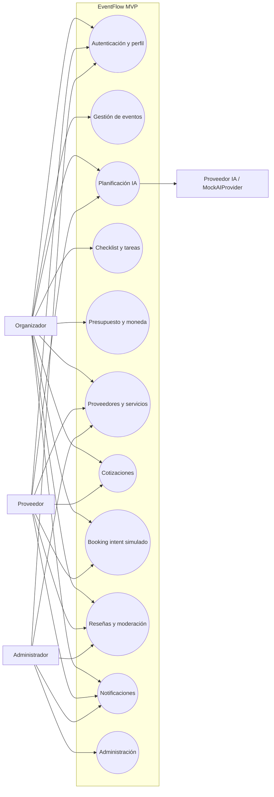
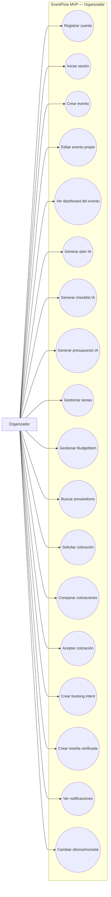
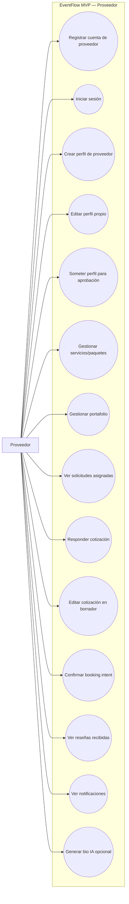
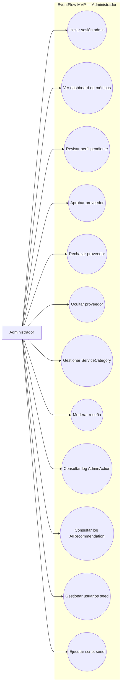
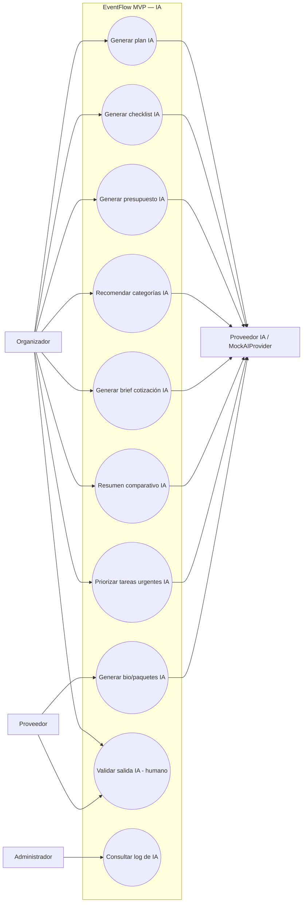
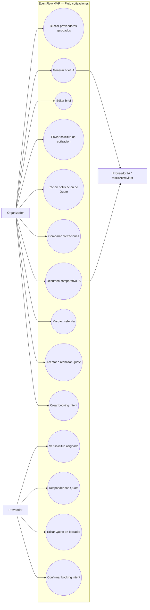

# EventFlow — Use Cases Specification

> Documento formal de Especificación de Casos de Uso del MVP
> Versión: 1.0
> Idioma: Español LATAM neutral
> Audiencia: Product Owner, Business Analyst, Software Architect, Backend Engineer, Frontend Engineer, QA, agentes IA generadores de FRD, user stories, criterios de aceptación, contratos de API y pruebas
> Documentos fuente: `1-Domain-Discovery-Report.md`, `2-Product-Owner-Decisions.md`, `3-MVP-Scope-Definition.md`, `4-Business-Rules-Document.md`, `5-User-Roles-Permissions-Matrix.md`, `6-Domain-Data-Model.md`, `7-AI-Features-Specification.md`

---

## 1. Propósito del documento

Este documento define de forma estructurada, trazable y verificable el conjunto de **casos de uso que describen cómo los actores del sistema interactúan con EventFlow** en el alcance del MVP. Su objetivo es:

- Servir como **fuente única de verdad funcional** para la posterior generación de FRD, user stories, criterios de aceptación, contratos de API, pantallas frontend, servicios backend, reglas de autorización, scripts de seed y pruebas de QA.
- Documentar de forma **exhaustiva pero acotada al MVP** los flujos principales, alternos y de excepción, junto con sus reglas de negocio, permisos, entidades y comportamiento IA.
- Mantener **separación clara** entre casos de uso MVP, recomendados, futuros y explícitamente fuera de alcance.
- Reducir el riesgo de **sobre-alcance** hacia un marketplace transaccional completo, explícitamente descartado para v1.
- Permitir que QA, equipo de producto y agentes IA validen el comportamiento del sistema con criterios objetivos.

El documento responde a cinco preguntas operativas:

1. ¿Qué actores interactúan con EventFlow en el MVP?
2. ¿Qué casos de uso soportan sus objetivos?
3. ¿Cómo se ejecuta cada caso de uso, qué reglas lo gobiernan y qué entidades involucra?
4. ¿Qué casos de uso quedan fuera del MVP y por qué?
5. ¿Cómo se valida cada caso de uso y cómo se demuestra en la demo final?

---

## 2. Alcance del documento

Este documento cubre los casos de uso aplicables al **MVP de EventFlow**, abarcando:

- Autenticación, registro y gestión de perfil del usuario.
- Gestión del ciclo de vida del evento (creación, edición, dashboard, estados).
- Planificación asistida por IA (plan, checklist, presupuesto, categorías, brief, comparación, bio, priorización).
- Checklist y gestión de tareas.
- Presupuesto, ítems presupuestarios y moneda.
- Proveedores, servicios y categorías; búsqueda en directorio.
- Solicitudes y respuestas de cotización; comparación.
- Intención de reserva simulada (booking intent).
- Reseñas y moderación manual.
- Notificaciones in-app y email simulado.
- Idioma y moneda configurable.
- Administración (aprobación de proveedores, categorías, moderación, métricas, seed).
- Casos de uso para demo guiada.

**Lo que este documento NO cubre:**

- Especificación técnica de implementación (esquema DDL, controladores, código).
- Contratos OpenAPI formales.
- Diseño visual de pantallas o guía de marca.
- Plan de pruebas detallado (sí incluye escenarios críticos para QA).
- Decisiones de despliegue, hosting o infraestructura.

---

## 3. Fuentes utilizadas

| # | Documento | Uso principal |
|---:|---|---|
| 1 | `/docs/1-Domain-Discovery-Report.md` | Actores, JTBD, procesos de negocio (§6), entidades preliminares, reglas iniciales, oportunidades IA. |
| 2 | `/docs/2-Product-Owner-Decisions.md` | Decisiones sobre mercado, idiomas, moneda, branding, datos seed, moderación, modelo de negocio. |
| 3 | `/docs/3-MVP-Scope-Definition.md` | Alcance funcional, roles MVP, flujos principales (§11), features incluidas/excluidas, criterios de éxito. |
| 4 | `/docs/4-Business-Rules-Document.md` | 214 reglas BR-* que gobiernan transiciones, permisos, validaciones, fuera de alcance y futuras. |
| 5 | `/docs/5-User-Roles-Permissions-Matrix.md` | Roles, permisos por módulo/entidad/ruta/API, reglas de ownership, escenarios QA de autorización. |
| 6 | `/docs/6-Domain-Data-Model.md` | Entidades, atributos, estados (enums), relaciones y constraints. |
| 7 | `/docs/7-AI-Features-Specification.md` | 8 features IA MVP, inputs/outputs, validación humana, fallback, prompts. |
| 8 | [`/docs/8.1-Product-Owner-Decisions-Use-Cases-Addendum.md`](./8.1-Product-Owner-Decisions-Use-Cases-Addendum.md) | **Addendum de decisiones del Product Owner** que cierra las 15 preguntas abiertas surgidas en este documento y agrega decisiones para 4 áreas adicionales (16–19): rating 1–5, 10 imágenes por trabajo, 5 cambios de categoría, validez 15 días, cancelación de booking confirmado, cierre automático 2 días, moneda inmutable, captcha/anti-bot, timeout IA 1 min, métricas admin, soft delete de reseñas, límite 5 `QuoteRequest`/categoría, notificación al proveedor por rechazo/expiración, sin respuesta a reseñas en MVP, `AnthropicProvider` como stub, admin lectura de eventos, gestión controlada de `EventType`, jerarquía de categorías máx 2 niveles, soft delete de attachments. |

Toda capacidad y caso de uso documentado se deriva o cita explícitamente de uno o más de estos documentos. Cuando un caso no aparece de forma explícita pero se infiere de manera razonable, se marca como **Derived** o **Recommended**. Casos futuros o fuera de alcance se marcan como **Future** o **Out of Scope**.

> **Nota de versión:** Esta revisión integra las decisiones del addendum 8.1. Los casos de uso impactados quedan listados en la sección "Cambios derivados del addendum 8.1" (insertada al inicio del catálogo de casos de uso). Las preguntas abiertas originales (§ final del documento) han sido marcadas como resueltas con referencia a la decisión PO 8.1 correspondiente.

---

## 4. Principios de modelado de casos de uso

Los siguientes principios son **filtros transversales** para evaluar cualquier caso de uso o flujo del sistema.

1. **Origen documental.** Todo caso de uso MVP debe rastrearse a al menos un documento fuente.
2. **Workspace primero, marketplace después.** Ningún caso de uso debe habilitar pagos reales, contratos firmados, comisiones, WhatsApp, chat real-time, app nativa o moderación automática IA.
3. **Human-in-the-loop obligatorio.** Toda salida IA se valida explícitamente por el usuario antes de convertirse en dato oficial (BR-AI-001).
4. **Aislamiento por rol.** Cada actor opera sólo sobre sus propios recursos o los explícitamente asignados (BR-AUTH-009, BR-QUOTE-006).
5. **Validación humana sobre decisiones críticas.** Contratar, aprobar proveedores, moderar reseñas y crear bookings son siempre decisiones humanas.
6. **Trazabilidad y auditoría.** Las acciones admin y las salidas IA quedan registradas (AdminAction, AIRecommendation).
7. **Realismo cultural LATAM.** Los flujos relevantes consideran modismos (XV años, padrinos, hora loca, mariachi/marimba, candy bar).
8. **Simular antes que integrar.** Email, suscripciones y booking se simulan en MVP.
9. **Demostrable sobre completo.** Ante ambigüedad, se prefiere el flujo demostrable end-to-end.
10. **No sobreingeniería.** Cada caso de uso modela sólo lo estrictamente necesario para soportar el MVP.

---

## 5. Metodología de extracción de casos de uso

El catálogo de casos de uso se construye siguiendo el flujo:

```text
Lectura → Extracción → Clasificación → Validación → Especificación → Diagramación
```

1. **Lectura:** se leen integralmente los 7 documentos fuente.
2. **Extracción:** se identifican candidatos a caso de uso a partir de:
   - Procesos de negocio (Doc 1 §6).
   - Flujos principales del MVP (Doc 3 §11).
   - Reglas de negocio que implican acciones del usuario (BR-* en Doc 4).
   - Permisos y rutas por rol (Doc 5 §8 a §20).
   - Entidades y operaciones CRUD/especiales (Doc 6 §11 a §17).
   - Features IA (Doc 7 §8 a §10).
3. **Clasificación:** cada candidato se etiqueta por:
   - **Scope:** MVP, Future, Out of Scope.
   - **Priority:** Must Have, Should Have, Could Have, Future.
   - **Source type:** Explicit, Derived, Assumption, Recommended.
   - **Module:** Auth, Events, AI, Tasks, Budget, Vendors, Quotes, Booking, Reviews, Notifications, Admin, I18N, Demo.
4. **Validación:** se contrasta cada candidato contra:
   - Alcance MVP (Doc 3) y reglas BR-*.
   - Permisos por rol (Doc 5).
   - Entidades y constraints (Doc 6).
   - Reglas IA (Doc 7).
5. **Especificación:** se documentan precondiciones, trigger, flujo principal, alternos, excepciones, postcondiciones, reglas, permisos, entidades, IA, criterios de aceptación y notas QA.
6. **Diagramación:** se construyen diagramas Mermaid por actor y dominio.

---

## 6. Use Case Extraction from Source Documents

Tabla de extracción de candidatos a caso de uso derivada del análisis de los documentos fuente. Esta tabla precede a la definición final del inventario MVP.

| Candidate Use Case | Primary Actor | Found in source document | Evidence / context | Classification | MVP decision |
|---|---|---|---|---|---|
| Registrar cuenta | Organizador / Proveedor | Doc 3 §7.1, Doc 4 BR-AUTH-001/002 | Registro público para `organizer` o `vendor`; admin se crea por seed. | Explicit | MVP |
| Iniciar sesión | Todos | Doc 4 BR-AUTH-001, Doc 5 §19 | Autenticación obligatoria. | Explicit | MVP |
| Cerrar sesión | Todos | Doc 4 BR-AUTH-003, Doc 5 §20 | Invalidar sesión. | Explicit | MVP |
| Recuperar contraseña | Todos | Doc 4 BR-AUTH-004 | Link de recuperación. | Explicit | MVP |
| Ver/editar perfil propio | Todos | Doc 5 §9.1, Doc 4 BR-USER-001 | Datos del usuario. | Explicit | MVP |
| Cambiar idioma preferido | Todos | Doc 4 BR-I18N-003, BR-USER-006 | i18n por usuario. | Explicit | MVP |
| Crear evento | Organizador | Doc 1 §6.1, Doc 3 §7.2, Doc 4 BR-EVENT-001/003 | Wizard de creación. | Explicit | MVP |
| Editar evento propio | Organizador | Doc 4 BR-EVENT-002 | Solo owner edita. | Explicit | MVP |
| Listar eventos propios | Organizador | Doc 3 §7.2, Doc 5 §19 | `/events` con filtros. | Explicit | MVP |
| Ver dashboard del evento | Organizador | Doc 3 §7.2, Doc 4 BR-EVENT-009 | Métricas y próximas tareas. | Explicit | MVP |
| Cambiar estado del evento | Organizador | Doc 4 BR-EVENT-005 | draft→active→completed/cancelled. | Explicit | MVP |
| Eliminar/cancelar evento | Organizador | Doc 4 BR-EVENT-010 | Soft delete según estado. | Explicit | MVP |
| Generar plan IA del evento | Organizador | Doc 7 AI-001, Doc 3 §7.3 | Cuña principal del producto. | Explicit | MVP |
| Revisar/aceptar/editar plan IA | Organizador | Doc 4 BR-AI-001/002, Doc 7 AI-001 | Validación humana obligatoria. | Explicit | MVP |
| Generar checklist IA | Organizador | Doc 7 AI-002, Doc 3 §7.4 | Tareas con fechas relativas. | Explicit | MVP |
| Aceptar tareas IA (individual/bloque) | Organizador | Doc 4 BR-TASK-003/005 | Confirmación humana. | Explicit | MVP |
| Generar distribución de presupuesto IA | Organizador | Doc 7 AI-003, Doc 3 §7.5 | Sugerencia por categoría. | Explicit | MVP |
| Recomendar categorías de proveedor IA | Organizador | Doc 7 AI-004 | Categorías priorizadas. | Explicit | MVP |
| Generar brief de cotización IA | Organizador | Doc 7 AI-005, Doc 4 BR-QUOTE-002 | Autocompletado desde el evento. | Explicit | MVP |
| Generar resumen comparativo IA | Organizador | Doc 7 AI-006, Doc 4 BR-QUOTE-023 | Comparador asistido. | Explicit | MVP (Should) |
| Priorizar tareas urgentes IA | Organizador | Doc 7 AI-008 | Top tareas urgentes. | Explicit | MVP (Should) |
| Generar bio/paquete del proveedor IA | Proveedor | Doc 7 AI-007, Doc 4 BR-VENDOR-008 | Generación opcional. | Explicit | MVP (Could) |
| Crear tarea manual | Organizador | Doc 4 BR-TASK-002 | Origen manual permitido. | Explicit | MVP |
| Editar tarea | Organizador | Doc 4 BR-TASK-005 | Edición individual. | Explicit | MVP |
| Cambiar estado de tarea | Organizador | Doc 4 BR-TASK-004 | pending→in_progress→done/skipped. | Explicit | MVP |
| Eliminar tarea | Organizador | Doc 5 §9.5 | D del owner del evento. | Derived | MVP |
| Filtrar tareas | Organizador | Doc 4 BR-TASK-007 | Filtros por estado/rango. | Explicit | MVP (Should) |
| Gestionar BudgetItem (CRUD) | Organizador | Doc 4 BR-BUDGET-002/009 | CRUD libre. | Explicit | MVP |
| Ver warning de exceso de presupuesto | Organizador | Doc 4 BR-BUDGET-004 | committed > total. | Explicit | MVP |
| Configurar moneda del evento | Organizador | Doc 4 BR-EVENT-007, BR-BUDGET-006 | Configurable al crear. | Explicit | MVP |
| Crear perfil de proveedor | Proveedor | Doc 4 BR-VENDOR-002 | Onboarding del proveedor. | Explicit | MVP |
| Editar perfil de proveedor propio | Proveedor | Doc 4 BR-VENDOR-004 | Edición permitida. | Explicit | MVP |
| Someter perfil para aprobación | Proveedor | Doc 4 BR-VENDOR-003, Doc 5 §9.8 | Estado pending. | Explicit | MVP |
| Gestionar VendorService (CRUD) | Proveedor | Doc 4 BR-SERVICE-001/002 | Paquetes propios. | Explicit | MVP |
| Gestionar portafolio (adjuntos) | Proveedor | Doc 4 BR-VENDOR-005 | Hasta 6-10 imágenes. | Explicit | MVP |
| Buscar proveedores en directorio | Organizador / Proveedor / Admin | Doc 3 §7.6, Doc 4 BR-VENDOR-001 | Solo approved visible. | Explicit | MVP |
| Ver perfil de proveedor | Organizador / Proveedor / Admin | Doc 5 §9.8 | Visualización pública. | Explicit | MVP |
| Ver reseñas recibidas (proveedor) | Proveedor | Doc 5 §9.14 | Lectura de reseñas propias. | Explicit | MVP |
| Solicitar cotización | Organizador | Doc 1 §6.6, Doc 4 BR-QUOTE-001/002 | Brief estructurado. | Explicit | MVP |
| Cancelar solicitud de cotización | Organizador | Doc 4 BR-QUOTE-010 | Cancelación en sent/viewed. | Explicit | MVP (Should) |
| Ver solicitudes asignadas (proveedor) | Proveedor | Doc 4 BR-QUOTE-006 | Visibilidad limitada. | Explicit | MVP |
| Responder cotización | Proveedor | Doc 1 §6.7, Doc 4 BR-QUOTE-011/012 | Quote con total + valid_until. | Explicit | MVP |
| Editar cotización en borrador | Proveedor | Doc 4 BR-QUOTE-017 | Sólo en draft. | Explicit | MVP |
| Comparar cotizaciones recibidas | Organizador | Doc 1 §6.8, Doc 4 BR-QUOTE-021 | Vista lado a lado. | Explicit | MVP |
| Marcar cotización preferida | Organizador | Doc 4 BR-QUOTE-022 | Flag preferred. | Explicit | MVP |
| Aceptar cotización | Organizador | Doc 4 BR-QUOTE-014 | Transición a accepted. | Explicit | MVP |
| Rechazar cotización | Organizador | Doc 4 BR-QUOTE-014 | Transición a rejected. | Explicit | MVP |
| Ver historial de cotizaciones | Organizador / Proveedor | Doc 4 BR-QUOTE-025 | Cotizaciones expiradas en historial. | Explicit | MVP (Should) |
| Crear booking intent simulado | Organizador | Doc 1 §6.9, Doc 4 BR-BOOKING-001 | Desde Quote vigente aceptada. | Explicit | MVP |
| Confirmar booking intent (proveedor) | Proveedor | Doc 4 BR-BOOKING-002 | Confirmación bilateral. | Explicit | MVP |
| Cancelar booking intent | Organizador / Proveedor | Doc 4 BR-BOOKING-009 | Cancelación con trazabilidad. | Explicit | MVP (Should) |
| Crear reseña verificada | Organizador | Doc 1 §6, Doc 4 BR-REVIEW-001 | Sólo con booking confirmado. | Explicit | MVP |
| Ver reseñas públicas del proveedor | Todos | Doc 4 BR-REVIEW-004 | Visibilidad pública. | Explicit | MVP |
| Recibir notificación in-app | Todos | Doc 4 BR-NOTIF-001/002 | Bandeja de notificaciones. | Explicit | MVP |
| Marcar notificación como leída | Todos | Doc 4 BR-NOTIF-004 | read_at. | Explicit | MVP |
| Iniciar sesión como admin | Admin | Doc 4 BR-AUTH-010, Doc 5 §5.3 | Acceso restringido. | Explicit | MVP |
| Ver dashboard admin con métricas | Admin | Doc 4 BR-ADMIN-005 | Métricas básicas. | Explicit | MVP (Should) |
| Revisar perfil de proveedor pendiente | Admin | Doc 4 BR-ADMIN-001, BR-VENDOR-001 | Revisión previa a aprobación. | Explicit | MVP |
| Aprobar proveedor | Admin | Doc 4 BR-ADMIN-001 | Transición a approved. | Explicit | MVP |
| Rechazar proveedor | Admin | Doc 4 BR-VENDOR-003 | Transición a rejected. | Explicit | MVP |
| Ocultar perfil de proveedor | Admin | Doc 5 §9.8 | Transición a hidden. | Derived | MVP |
| Gestionar ServiceCategory (CRUD) | Admin | Doc 4 BR-ADMIN-002, BR-SERVICE-003 | CRUD exclusivo admin. | Explicit | MVP |
| Moderar reseña (ocultar/eliminar) | Admin | Doc 4 BR-ADMIN-003, BR-REVIEW-005 | Moderación manual. | Explicit | MVP |
| Consultar log de AdminAction | Admin | Doc 4 BR-ADMIN-004, Doc 5 §9.19 | Auditoría. | Explicit | MVP |
| Consultar log de AIRecommendation | Admin | Doc 4 BR-ADMIN-008 | Auditoría IA. | Explicit | MVP (Should) |
| Gestionar usuarios seed | Admin | Doc 4 BR-ADMIN-009 | CRUD sobre seed. | Explicit | MVP (Should) |
| Ejecutar script seed | Admin | Doc 4 BR-SEED-001 | Reproducibilidad demo. | Explicit | MVP |
| Demo guiada con datos seed | Admin / Demo | Doc 2 §11, Doc 3 §14.4 | Flujo demostrable. | Explicit | MVP |
| Colaboración multi-usuario por evento | Colaborador | Doc 4 BR-USER-004, BR-FUTURE-002 | Diferido a v1.1. | Explicit | Future |
| Chat real-time | Organizador / Proveedor | Doc 4 BR-OOS-006, BR-FUTURE-005 | Excluido del MVP. | Explicit | Out of Scope |
| Integración WhatsApp | Todos | Doc 4 BR-OOS-004, BR-FUTURE-007 | Excluido del MVP. | Explicit | Out of Scope |
| App móvil nativa | Todos | Doc 4 BR-OOS-005 | Sólo web responsive. | Explicit | Out of Scope |
| Procesar pago real | Organizador / Proveedor | Doc 4 BR-OOS-001 | Sin pagos. | Explicit | Out of Scope |
| Generar contrato firmado | Organizador / Proveedor | Doc 4 BR-OOS-003 | Sin contratos. | Explicit | Out of Scope |
| Calcular comisión real | Sistema / Admin | Doc 4 BR-OOS-002 | Sin comisiones. | Explicit | Out of Scope |
| Análisis de sentimiento IA | Sistema | Doc 4 BR-OOS-007, BR-FUTURE-008 | Diferido. | Explicit | Future |
| Moderación automática IA | Sistema | Doc 4 BR-OOS-008, BR-FUTURE-009 | Diferido. | Explicit | Future |
| Aprobación autónoma de proveedores | Sistema | Doc 4 BR-VENDOR-006 | Manual sólo. | Explicit | Out of Scope |
| Booking autónomo IA | Sistema | Doc 4 BR-AI-004 | Confirmación bilateral humana. | Explicit | Out of Scope |
| Chat libre conversacional IA | Todos | Doc 4 BR-AI-014, BR-OOS-018 | Features IA acotadas. | Explicit | Out of Scope |
| Generación de imágenes IA | Todos | Doc 4 BR-AI-015, BR-OOS-016 | Excluido. | Explicit | Out of Scope |
| Calendario completo de disponibilidad | Proveedor | Doc 4 BR-VENDOR-009, BR-FUTURE-011 | Campo simple en MVP. | Explicit | Future |
| Respuesta del proveedor a reseñas | Proveedor | Doc 4 BR-REVIEW-008 | Diferido. | Explicit | Future |
| Edición de reseñas publicadas | Organizador | Doc 4 BR-REVIEW-007 | Bloqueada en MVP. | Explicit | Future |
| Lista de invitados / RSVP / mesas | Organizador | Doc 4 BR-OOS-014 | Excluido. | Explicit | Out of Scope |
| Integración Google Calendar/Outlook | Todos | Doc 4 BR-FUTURE-020 | Diferido. | Explicit | Future |
| Resumen ejecutivo del evento IA | Organizador | Doc 4 BR-FUTURE-013 | Diferido. | Explicit | Future |
| Recomendaciones IA específicas de proveedores | Organizador | Doc 4 BR-FUTURE-012 | Diferido. | Explicit | Future |
| Detección inconsistencias IA presupuesto vs cotizaciones | Organizador | Doc 4 BR-FUTURE-015 | Diferido. | Explicit | Future |
| Conversión automática de moneda | Sistema | Doc 4 BR-OOS-015 | Sin conversión en MVP. | Explicit | Out of Scope |
| Push notifications / SMS | Todos | Doc 4 BR-OOS-017 | Excluido. | Explicit | Out of Scope |

> Resultado de la extracción: se identificaron **74 casos de uso MVP**, **12 futuros** y **14 fuera de alcance**.

---

## 7. Resumen ejecutivo de casos de uso del MVP

El MVP de EventFlow integra **74 casos de uso** distribuidos en 12 módulos, que dan soporte a tres roles activos (Organizador, Proveedor, Administrador) y a un sistema externo de IA (Proveedor LLM / MockAIProvider) bajo capa de abstracción.

Los casos de uso se agrupan en cinco grandes flujos:

1. **Identidad y configuración personal:** registrar cuenta, iniciar sesión, recuperar contraseña, ver/editar perfil, cambiar idioma preferido.
2. **Workspace del evento:** crear evento, generar plan/checklist/presupuesto con IA, gestionar tareas y presupuesto, configurar moneda e idioma, ver dashboard, cambiar estado.
3. **Descubrimiento y onboarding del proveedor:** crear/editar perfil, gestionar servicios y portafolio, someter para aprobación, ser aprobado por admin.
4. **Cotización y cierre simulado:** generar brief IA, solicitar cotización, responder, comparar (con resumen IA opcional), aceptar/rechazar, crear booking intent simulado, confirmar booking, dejar reseña verificada.
5. **Gobernanza:** aprobar/rechazar/ocultar proveedores, gestionar categorías, moderar reseñas, ver métricas, consultar logs de AdminAction y AIRecommendation, gestionar usuarios seed, ejecutar script seed.

**Principios irrenunciables aplicados a todos los casos de uso:**

- Toda salida IA requiere confirmación humana explícita (BR-AI-001).
- Aislamiento por rol y por propiedad de recursos (BR-AUTH-009, BR-QUOTE-006).
- Sin pagos reales, sin contratos firmados, sin WhatsApp, sin chat real-time, sin moderación automática IA.
- Booking simulado, email simulado, suscripciones conceptuales.
- Multi-idioma (es-LATAM, es-ES, pt, en) y moneda configurable por evento sin conversión automática.

---

## 8. Actores del sistema

| Actor | Description | Type | Source document evidence | MVP/Future/Out of Scope | Main goals | Notes |
|---|---|---|---|---|---|---|
| Organizador | Persona que crea y gestiona eventos sociales o corporativos. | Primary actor | Doc 1 §4.1, Doc 3 §5.1, Doc 5 §5.1 | MVP | Convertir una idea en plan accionable; gestionar cotizaciones; reservar (simulado); reseñar. | Mono-rol en MVP (BR-AUTH-005). |
| Proveedor | Pyme o freelancer que ofrece servicios para eventos. | Primary actor | Doc 1 §4.2, Doc 3 §5.2, Doc 5 §5.2 | MVP | Mantener perfil aprobado; responder cotizaciones; recibir reseñas. | Sólo ve solicitudes dirigidas a él (BR-QUOTE-006). |
| Administrador | Responsable de gobernanza, curaduría y moderación manual. | Primary actor | Doc 1 §4.3, Doc 3 §5.3, Doc 5 §5.3 | MVP | Aprobar proveedores; gestionar categorías; moderar reseñas; auditar. | Admin creado por seed (BR-AUTH-002). |
| Proveedor IA / MockAIProvider | Sistema externo (OpenAI principal; Anthropic opcional) o mock interno que genera sugerencias. | External system | Doc 2 §4.1, Doc 4 BR-AI-005/006, Doc 7 §11 | MVP | Generar plan, checklist, presupuesto, brief, resumen, bio, priorización. | Acceso vía interfaz `LLMProvider`; fallback automático a Mock (BR-AI-009). |
| Sistema de notificaciones | Servicio interno que dispara notificaciones in-app y emails simulados. | Supporting actor | Doc 4 BR-NOTIF-001/003, Doc 6 `Notification` | MVP | Entregar avisos a usuarios destinatarios. | Email se simula con log estructurado. |
| Sistema de seed/demo | Componente interno que ejecuta los scripts de carga y reset de datos seed. | Supporting actor | Doc 4 BR-SEED-001, Doc 5 §18 | MVP | Cargar y reproducir datos seed para demo. | Invocable sólo por admin. |
| Colaborador de evento | Persona invitada por el owner a colaborar (pareja, mamá, planner). | Future actor | Doc 4 BR-USER-004, Doc 5 §6.1 | Future | Colaborar en gestión del evento. | Diferido a v1.1 (BR-FUTURE-002). |
| Super Admin | Rol técnico de alto nivel para gestión de configuración crítica. | Future actor | Doc 5 §6.2 | Future | Gestionar admins; configuración; secrets. | No requerido en MVP. |
| Moderador especializado | Usuario centrado en moderación de contenido. | Future actor | Doc 5 §6.3 | Future | Moderar reseñas/reportes. | El admin único cubre en MVP. |
| Proveedor multiusuario | Equipo operando bajo un mismo VendorProfile. | Future actor | Doc 5 §6.4 | Future | Distribuir operación del proveedor. | MVP asume mono-usuario por proveedor. |

> Los actores fuera de alcance (Payment Provider, WhatsApp Provider, Calendar Provider) se documentan en la sección 9.

---

## 9. Actores futuros o fuera de alcance

| Actor | Estado | Razón | Documento fuente |
|---|---|---|---|
| Colaborador de evento | Future | Multi-colaboradores diferido (modelo freemium futuro). | BR-USER-004, BR-FUTURE-002, BR-OOS-013 |
| Super Admin | Future | No requerido en MVP. | Doc 5 §6.2 |
| Moderador especializado | Future | Admin único cubre moderación manual en MVP. | Doc 5 §6.3 |
| Proveedor multiusuario | Future | Mono-rol mono-usuario en MVP. | Doc 5 §6.4 |
| Invitado del evento (Guest) | Out of Scope | RSVP/mesas excluidos del MVP. | BR-OOS-014 |
| Payment Provider | Out of Scope | Sin pagos reales en MVP. | BR-OOS-001, BR-PRIVACY-006 |
| WhatsApp Provider (WA Business API) | Out of Scope | Integración WhatsApp diferida. | BR-OOS-004, BR-NOTIF-006 |
| Email Provider (SMTP real) | Out of Scope / Optional | MVP usa email simulado por log; integración real es opcional. | BR-NOTIF-003 |
| Calendar Provider (Google/Outlook) | Future | Integración con calendarios externos diferida. | BR-FUTURE-020 |
| KYC Provider | Out of Scope | Aprobación manual del admin. | BR-OOS-009 |
| Push Notification Provider (FCM/APNs) | Out of Scope | App nativa fuera de MVP. | BR-OOS-005, BR-OOS-017 |
| Finance/Accounting User | Out of Scope | Sin manejo fiscal complejo. | BR-OOS-010 |

Los actores fuera de alcance **no aparecen** en los diagramas MVP. Los actores futuros sólo aparecen en diagramas de roadmap conceptual si se requiere.

---

## 10. Mapa general de casos de uso

| Módulo | Casos de uso MVP | Prefijo | Actores principales |
|---|---:|---|---|
| Autenticación y perfil | 6 | UC-AUTH | Todos |
| Gestión de eventos | 6 | UC-EVENT | Organizador |
| Planificación asistida por IA | 8 | UC-AI | Organizador, Proveedor (bio), Proveedor IA (externo) |
| Checklist y tareas | 6 | UC-TASK | Organizador |
| Presupuesto y moneda | 4 | UC-BUDGET | Organizador |
| Proveedores y servicios | 8 | UC-VENDOR | Proveedor, Organizador |
| Solicitudes y cotizaciones | 10 | UC-QUOTE | Organizador, Proveedor |
| Booking intent simulado | 3 | UC-BOOKING | Organizador, Proveedor |
| Reseñas y moderación | 3 | UC-REVIEW | Organizador, Proveedor, Admin |
| Notificaciones | 2 | UC-NOTIF | Todos |
| Idioma y moneda | 2 | UC-I18N | Todos |
| Administración | 10 | UC-ADMIN | Admin |
| Demo / Seed | 1 | UC-DEMO | Admin, Product Owner |
| **Total MVP** | **69** | | |

> El conteo final puede variar ligeramente con respecto a la sección 6 según la agrupación adoptada para flujos compuestos (por ejemplo, generar y validar plan IA se modelan como dos casos de uso separados: UC-AI-001 y UC-AI-002).

---

## 11. Diagrama general de casos de uso



---

## 12. Diagrama de casos de uso — Organizador



---

## 13. Diagrama de casos de uso — Proveedor



---

## 14. Diagrama de casos de uso — Administrador



---

## 15. Diagrama de casos de uso — Funcionalidades de IA



---

## 16. Diagrama de casos de uso — Flujo de cotizaciones



---

## 16.bis Cambios derivados del addendum 8.1

Esta sección consolida los ajustes aplicados a los casos de uso del MVP a raíz de las decisiones del [`/docs/8.1-Product-Owner-Decisions-Use-Cases-Addendum.md`](./8.1-Product-Owner-Decisions-Use-Cases-Addendum.md). El detalle por caso de uso aparece dentro de la sección correspondiente; aquí se resume el impacto.

| Decisión PO 8.1 | UC impactados | Cambio aplicado |
|---|---|---|
| #1 Rating 1–5 (5 = mejor, 1 = peor) | UC-REVIEW-001, UC-REVIEW-002 | Validación obligatoria del campo `rating` como entero en `[1,5]`. Mensaje de error explícito al violar el rango. |
| #2 10 imágenes por trabajo/evento mostrado | UC-VENDOR-005 | Estructura del portafolio dividida por "trabajos"; límite 10 por trabajo, validado en service layer. |
| #3 Máx 5 cambios de categoría | UC-VENDOR-002 | Contador `category_change_count`; cambios sustantivos pueden disparar revisión admin (UC-ADMIN-001). |
| #4 Validez 15 días por defecto | UC-QUOTE-004 | El sistema aplica `created_at + 15 días calendario` si el proveedor no especifica `valid_until`. |
| #5 Cancelación de `BookingIntent.confirmed_intent` | UC-BOOKING-003 | Cancelación permitida también desde `confirmed_intent`; sin penalización en plataforma. |
| #6 Cierre automático eventos a los 2 días | UC-EVENT-005, UC-EVENT-006 (nuevo si aplica) | Job programado actualiza `status='completed'` con `auto_completed=true`, `completed_at`. |
| #7 Moneda inmutable | UC-EVENT-001, UC-EVENT-003, UC-BUDGET-004 | Selección obligatoria al crear evento (local o USD); endpoint de update rechaza modificación de `currency_code`. |
| #8 Captcha / anti-bot | UC-AUTH-001, UC-AUTH-002 | Validación obligatoria de captcha en formularios de registro y login; rate-limiting Must Have. |
| #9 Timeout IA 1 minuto | UC-AI-001 a UC-AI-009 | `timeoutMs=60_000` por defecto; tras vencerlo: error controlado y/o fallback a `MockAIProvider` en modo demo/testing. |
| #10 Métricas admin operativas/gobernanza | UC-ADMIN-002 | Dashboard expone métricas de actividad, gobernanza, IA, cotizaciones y demo readiness; **no** ingresos, comisiones, CAC/LTV/ROI. |
| #11 Soft delete de reseñas con auditoría | UC-REVIEW-003 | Moderación marca `status='hidden'` o `removed`, con `moderated_by`, `moderated_at`, `moderation_reason` y entrada en `AdminAction`. No hard delete. |
| #12 Máx 5 `QuoteRequest` activas por categoría | UC-QUOTE-001 | Validación obligatoria de conteo por `(event_id, service_category_id)`; rechazo 409 al exceder. |
| #13 Notificación al proveedor por `Quote` rechazada/expirada | UC-QUOTE-007 (rechazo), UC-QUOTE-008 (expiración por sistema), UC-NOTIF-001 | Disparo automático de `Notification` in-app; email simulado por log cuando aplique. |
| #14 Sin respuesta del proveedor a reseñas en MVP | UC-REVIEW-001, UC-REVIEW-003 | Confirmada exclusión de la respuesta del proveedor (Future, BR-REVIEW-008). |
| #15 `AnthropicProvider` stub/futuro | UC-AI-001 a UC-AI-009 | Documentar que `LLMProvider='anthropic'` no opera en MVP; sin failover automático. |
| #16 Admin lectura de eventos | UC-ADMIN-002, UC-ADMIN-008 (nuevo si aplica) | Admin lista y consulta detalle en modo **solo lectura**; acceso registrado en `AdminAction`. |
| #17 Gestión controlada de `EventType` | UC-ADMIN-007 | Admin puede activar/desactivar, editar nombre y descripción, definir orden; **bloqueo** de hard delete si hay eventos asociados. |
| #18 Jerarquía de categorías máx 2 niveles | UC-ADMIN-007 | Validación de `depth_level <= 2` al crear/editar `ServiceCategory`. |
| #19 Soft delete de attachments | UC-VENDOR-005 | Eliminación marca `status='deleted'`, conserva metadata; eliminación física vía proceso técnico posterior. |

> Las preguntas abiertas originales del Use Cases Specification han sido resueltas y trasladadas a esta tabla; ver sección final "Preguntas abiertas o decisiones pendientes" para la trazabilidad completa.

---

## 17. Inventario de casos de uso MVP

| Use Case ID | Use Case Name | Primary Actor | Supporting Actors | Module | Priority | Scope | Source type | Evidence |
|---|---|---|---|---|---|---|---|---|
| UC-AUTH-001 | Registrar cuenta | Organizador / Proveedor | Sistema | Auth | Must Have | MVP | Explicit | Doc 3 §7.1; BR-AUTH-001/002 |
| UC-AUTH-002 | Iniciar sesión | Todos | Sistema | Auth | Must Have | MVP | Explicit | BR-AUTH-001 |
| UC-AUTH-003 | Cerrar sesión | Todos | Sistema | Auth | Must Have | MVP | Explicit | BR-AUTH-003 |
| UC-AUTH-004 | Recuperar contraseña | Todos | Sistema, Notificaciones | Auth | Should Have | MVP | Explicit | BR-AUTH-004 |
| UC-AUTH-005 | Ver y editar perfil propio | Todos | Sistema | Auth | Must Have | MVP | Explicit | BR-USER-001; Doc 5 §9.1 |
| UC-AUTH-006 | Cambiar idioma preferido del usuario | Todos | Sistema | I18N | Must Have | MVP | Explicit | BR-I18N-003, BR-USER-006 |
| UC-EVENT-001 | Crear evento (wizard) | Organizador | Sistema | Events | Must Have | MVP | Explicit | Doc 1 §6.1; Doc 3 §7.2; BR-EVENT-001/003 |
| UC-EVENT-002 | Editar evento propio | Organizador | Sistema | Events | Must Have | MVP | Explicit | BR-EVENT-002 |
| UC-EVENT-003 | Listar eventos propios | Organizador | Sistema | Events | Must Have | MVP | Explicit | Doc 3 §7.2; Doc 5 §19 |
| UC-EVENT-004 | Ver dashboard del evento | Organizador | Sistema | Events | Must Have | MVP | Explicit | BR-EVENT-009; Doc 3 §7.2 |
| UC-EVENT-005 | Cambiar estado del evento | Organizador | Sistema | Events | Must Have | MVP | Explicit | BR-EVENT-005 |
| UC-EVENT-006 | Eliminar o cancelar evento | Organizador | Sistema | Events | Should Have | MVP | Explicit | BR-EVENT-010 |
| UC-AI-001 | Generar plan de evento con IA | Organizador | Proveedor IA | AI | Must Have | MVP | Explicit | Doc 7 AI-001; BR-AI-001 |
| UC-AI-002 | Revisar, aceptar, editar o regenerar plan IA | Organizador | Sistema | AI | Must Have | MVP | Explicit | BR-AI-001/002 |
| UC-AI-003 | Generar checklist IA | Organizador | Proveedor IA | AI | Must Have | MVP | Explicit | Doc 7 AI-002 |
| UC-AI-004 | Generar distribución de presupuesto con IA | Organizador | Proveedor IA | AI | Must Have | MVP | Explicit | Doc 7 AI-003; BR-BUDGET-008 |
| UC-AI-005 | Recomendar categorías de proveedor con IA | Organizador | Proveedor IA | AI | Must Have | MVP | Explicit | Doc 7 AI-004 |
| UC-AI-006 | Generar brief de cotización con IA | Organizador | Proveedor IA | AI | Must Have | MVP | Explicit | Doc 7 AI-005; BR-QUOTE-002 |
| UC-AI-007 | Generar resumen comparativo de cotizaciones con IA | Organizador | Proveedor IA | AI | Should Have | MVP | Explicit | Doc 7 AI-006; BR-QUOTE-023 |
| UC-AI-008 | Priorizar tareas urgentes con IA | Organizador | Proveedor IA | AI | Should Have | MVP | Explicit | Doc 7 AI-008 |
| UC-AI-009 | Generar bio o descripción de paquete con IA | Proveedor | Proveedor IA | AI | Could Have | MVP | Explicit | Doc 7 AI-007; BR-VENDOR-008 |
| UC-TASK-001 | Aceptar tareas IA (individual o en bloque) | Organizador | Sistema | Tasks | Must Have | MVP | Explicit | BR-TASK-003/005 |
| UC-TASK-002 | Crear tarea manual | Organizador | Sistema | Tasks | Must Have | MVP | Explicit | BR-TASK-002 |
| UC-TASK-003 | Editar tarea | Organizador | Sistema | Tasks | Must Have | MVP | Explicit | BR-TASK-005 |
| UC-TASK-004 | Cambiar estado de tarea | Organizador | Sistema | Tasks | Must Have | MVP | Explicit | BR-TASK-004 |
| UC-TASK-005 | Eliminar tarea | Organizador | Sistema | Tasks | Should Have | MVP | Derived | Doc 5 §9.5 |
| UC-TASK-006 | Filtrar tareas por estado y rango temporal | Organizador | Sistema | Tasks | Should Have | MVP | Explicit | BR-TASK-007/008 |
| UC-BUDGET-001 | Aceptar sugerencia IA de presupuesto | Organizador | Sistema | Budget | Must Have | MVP | Explicit | BR-BUDGET-008 |
| UC-BUDGET-002 | Gestionar ítems de presupuesto (CRUD) | Organizador | Sistema | Budget | Must Have | MVP | Explicit | BR-BUDGET-002/009 |
| UC-BUDGET-003 | Ver presupuesto con warning de exceso | Organizador | Sistema | Budget | Must Have | MVP | Explicit | BR-BUDGET-004 |
| UC-BUDGET-004 | Configurar moneda del evento | Organizador | Sistema | Budget | Must Have | MVP | Explicit | BR-EVENT-007, BR-BUDGET-006 |
| UC-VENDOR-001 | Crear perfil de proveedor | Proveedor | Sistema | Vendors | Must Have | MVP | Explicit | BR-VENDOR-002 |
| UC-VENDOR-002 | Editar perfil de proveedor propio | Proveedor | Sistema | Vendors | Must Have | MVP | Explicit | BR-VENDOR-004 |
| UC-VENDOR-003 | Someter perfil para aprobación | Proveedor | Sistema, Admin | Vendors | Must Have | MVP | Explicit | BR-VENDOR-003 |
| UC-VENDOR-004 | Gestionar servicios y paquetes (CRUD) | Proveedor | Sistema | Vendors | Must Have | MVP | Explicit | BR-SERVICE-001/002 |
| UC-VENDOR-005 | Gestionar portafolio (adjuntar imágenes) | Proveedor | Sistema | Vendors | Should Have | MVP | Explicit | BR-VENDOR-005 |
| UC-VENDOR-006 | Buscar proveedores en directorio | Organizador / Proveedor / Admin | Sistema | Vendors | Must Have | MVP | Explicit | BR-VENDOR-001; Doc 3 §7.6 |
| UC-VENDOR-007 | Ver perfil de proveedor (público) | Todos | Sistema | Vendors | Must Have | MVP | Explicit | BR-VENDOR-001; Doc 5 §9.8 |
| UC-VENDOR-008 | Ver reseñas recibidas (proveedor) | Proveedor | Sistema | Vendors | Should Have | MVP | Explicit | Doc 5 §9.14 |
| UC-QUOTE-001 | Solicitar cotización | Organizador | Sistema, Notificaciones | Quotes | Must Have | MVP | Explicit | Doc 1 §6.6; BR-QUOTE-001/002 |
| UC-QUOTE-002 | Cancelar solicitud de cotización | Organizador | Sistema | Quotes | Should Have | MVP | Explicit | BR-QUOTE-010 |
| UC-QUOTE-003 | Ver solicitudes asignadas (proveedor) | Proveedor | Sistema | Quotes | Must Have | MVP | Explicit | BR-QUOTE-006 |
| UC-QUOTE-004 | Responder cotización | Proveedor | Sistema, Notificaciones | Quotes | Must Have | MVP | Explicit | Doc 1 §6.7; BR-QUOTE-011/012 |
| UC-QUOTE-005 | Editar cotización en borrador | Proveedor | Sistema | Quotes | Must Have | MVP | Explicit | BR-QUOTE-017 |
| UC-QUOTE-006 | Comparar cotizaciones recibidas | Organizador | Sistema | Quotes | Must Have | MVP | Explicit | Doc 1 §6.8; BR-QUOTE-021 |
| UC-QUOTE-007 | Marcar cotización como preferida | Organizador | Sistema | Quotes | Must Have | MVP | Explicit | BR-QUOTE-022 |
| UC-QUOTE-008 | Aceptar cotización | Organizador | Sistema, Notificaciones | Quotes | Must Have | MVP | Explicit | BR-QUOTE-014 |
| UC-QUOTE-009 | Rechazar cotización | Organizador | Sistema, Notificaciones | Quotes | Should Have | MVP | Explicit | BR-QUOTE-014 |
| UC-QUOTE-010 | Ver historial de cotizaciones expiradas | Organizador / Proveedor | Sistema | Quotes | Should Have | MVP | Explicit | BR-QUOTE-025 |
| UC-BOOKING-001 | Crear booking intent simulado | Organizador | Sistema | Booking | Must Have | MVP | Explicit | Doc 1 §6.9; BR-BOOKING-001 |
| UC-BOOKING-002 | Confirmar booking intent (proveedor) | Proveedor | Sistema | Booking | Must Have | MVP | Explicit | BR-BOOKING-002 |
| UC-BOOKING-003 | Cancelar booking intent | Organizador / Proveedor | Sistema | Booking | Should Have | MVP | Explicit | BR-BOOKING-009 |
| UC-REVIEW-001 | Crear reseña verificada | Organizador | Sistema | Reviews | Must Have | MVP | Explicit | BR-REVIEW-001/002 |
| UC-REVIEW-002 | Ver reseñas públicas del proveedor | Todos | Sistema | Reviews | Must Have | MVP | Explicit | BR-REVIEW-004 |
| UC-REVIEW-003 | Moderar reseña (ocultar o eliminar) | Admin | Sistema | Reviews | Must Have | MVP | Explicit | BR-ADMIN-003, BR-REVIEW-005 |
| UC-NOTIF-001 | Recibir notificaciones in-app | Todos | Sistema | Notifications | Must Have | MVP | Explicit | BR-NOTIF-001/002 |
| UC-NOTIF-002 | Marcar notificación como leída | Todos | Sistema | Notifications | Should Have | MVP | Explicit | BR-NOTIF-004 |
| UC-I18N-001 | Cambiar idioma de la UI (usuario) | Todos | Sistema | I18N | Must Have | MVP | Explicit | BR-I18N-001/003 |
| UC-I18N-002 | Configurar idioma del evento | Organizador | Sistema | I18N | Must Have | MVP | Explicit | BR-I18N-004, BR-EVENT-008 |
| UC-ADMIN-001 | Iniciar sesión como admin | Admin | Sistema | Admin | Must Have | MVP | Explicit | BR-AUTH-010 |
| UC-ADMIN-002 | Ver dashboard de métricas admin | Admin | Sistema | Admin | Should Have | MVP | Explicit | BR-ADMIN-005 |
| UC-ADMIN-003 | Revisar perfil de proveedor pendiente | Admin | Sistema | Admin | Must Have | MVP | Explicit | BR-ADMIN-001 |
| UC-ADMIN-004 | Aprobar proveedor | Admin | Sistema, Notificaciones | Admin | Must Have | MVP | Explicit | BR-ADMIN-001, BR-VENDOR-001 |
| UC-ADMIN-005 | Rechazar proveedor | Admin | Sistema, Notificaciones | Admin | Must Have | MVP | Explicit | BR-VENDOR-003 |
| UC-ADMIN-006 | Ocultar perfil de proveedor | Admin | Sistema | Admin | Should Have | MVP | Derived | Doc 5 §9.8 |
| UC-ADMIN-007 | Gestionar categorías de servicio (CRUD) | Admin | Sistema | Admin | Must Have | MVP | Explicit | BR-ADMIN-002, BR-SERVICE-003 |
| UC-ADMIN-008 | Consultar log de AdminAction | Admin | Sistema | Admin | Must Have | MVP | Explicit | BR-ADMIN-004 |
| UC-ADMIN-009 | Consultar log de AIRecommendation | Admin | Sistema | Admin | Should Have | MVP | Explicit | BR-ADMIN-008 |
| UC-ADMIN-010 | Gestionar usuarios seed | Admin | Sistema | Admin | Should Have | MVP | Explicit | BR-ADMIN-009 |
| UC-ADMIN-011 | Ejecutar script seed | Admin | Sistema | Admin / Demo | Must Have | MVP | Explicit | BR-SEED-001 |
| UC-DEMO-001 | Ejecutar demo guiada con datos seed | Admin / Product Owner | Sistema | Demo | Must Have | MVP | Explicit | Doc 2 §11; Doc 3 §14.4 |

---

## 18. Casos de uso detallados — Autenticación y perfil

### UC-AUTH-001 — Registrar cuenta

#### Descripción
Permite a un visitante crear una cuenta como `organizer` o `vendor` para acceder a las funcionalidades del MVP.

#### Evidencia de origen
Doc 3 §7.1; Doc 4 BR-AUTH-001, BR-AUTH-002, BR-USER-001, BR-USER-002; Doc 5 §9.1.

#### Actor principal
Visitante (futuro Organizador o Proveedor).

#### Actores secundarios
Sistema (validaciones, persistencia).

#### Clasificación
- Scope: MVP
- Priority: Must Have
- Source type: Explicit
- Module: Auth

#### Stakeholders e intereses
- Visitante: acceder al producto.
- Product Owner: catálogo curado de usuarios.
- Admin: control sobre creación de cuentas admin (no por registro público).

#### Precondiciones
- El usuario no tiene una sesión activa.
- El email aún no está registrado.

#### Trigger
El usuario abre la pantalla `/register` y completa el formulario.

#### Flujo principal
1. El sistema muestra el formulario con campos: nombre, email, contraseña, confirmación de contraseña, rol (`organizer` o `vendor`), idioma preferido (default `es-LATAM`) y **widget de captcha/anti-bot** (BR-AUTH-011, decisión PO 8.1 #8).
2. El usuario completa los datos, resuelve el captcha y envía.
3. El sistema **valida el token de captcha** antes de procesar cualquier dato del formulario; si falla, rechaza la solicitud sin crear el `User`.
4. El sistema valida unicidad del email, formato y fortaleza mínima de la contraseña.
5. El sistema crea el `User` con `role` solicitado, `password_hash`, `preferred_language`, `status='active'`.
6. El sistema crea la sesión y redirige al dashboard correspondiente al rol.
7. El sistema dispara un evento de auditoría.

#### Flujos alternos
- A1: OAuth con Google (opcional/Could Have): el usuario inicia desde proveedor externo; el sistema crea cuenta vinculada.
- A2: Registro como proveedor: tras el registro, se redirige al onboarding del perfil (UC-VENDOR-001).

#### Flujos de excepción
- E1: Email duplicado → 409/validación; el sistema sugiere recuperar contraseña.
- E2: Contraseña débil → validación previa al submit.
- E3: Selección de rol `admin` por registro público → 403 / validación rechaza (BR-AUTH-002).
- E4: **Captcha/anti-bot falla u omite** → la solicitud se rechaza con error claro y se solicita reintento con nuevo captcha (BR-AUTH-011, decisión PO 8.1 #8). Es Must Have, no opcional.

#### Postcondiciones
- Se crea un nuevo `User` con `role` válido y sesión activa.
- Si el rol es `vendor`, el flujo continúa hacia UC-VENDOR-001.

#### Reglas de negocio relacionadas
BR-AUTH-001, BR-AUTH-002, BR-AUTH-005, **BR-AUTH-011 (captcha/anti-bot obligatorio — decisión PO 8.1 #8)**, BR-USER-001, BR-USER-002, BR-USER-005, BR-PRIVACY-002, BR-PRIVACY-008.

#### Permisos relacionados
Acceso público a `/register`. El registro no permite crear admin (BR-AUTH-002).

#### Entidades involucradas
`User`, `Role`.

#### IA involucrada
No.

#### Criterios de aceptación
- Dado un visitante sin sesión, cuando completa el formulario con datos válidos y rol `organizer`, entonces se crea el `User`, se establece sesión y se redirige a `/dashboard`.
- Dado un email ya registrado, cuando se envía el formulario, entonces el sistema rechaza con error claro y ofrece recuperar contraseña.
- Dado un visitante que intenta seleccionar rol `admin` por API directa, entonces el sistema rechaza la creación.
- La contraseña se almacena hasheada (bcrypt/argon2).

#### Notas para QA
- Validar unicidad case-insensitive del email.
- Validar que el endpoint `POST /auth/register` no acepte `role='admin'`.
- Verificar respuestas en los 4 idiomas soportados.

---

### UC-AUTH-002 — Iniciar sesión

#### Descripción
Permite a un usuario registrado iniciar sesión con email y contraseña.

#### Evidencia de origen
Doc 4 BR-AUTH-001, BR-AUTH-003; Doc 5 §19, §20.

#### Actor principal
Organizador, Proveedor o Administrador.

#### Actores secundarios
Sistema.

#### Clasificación
- Scope: MVP
- Priority: Must Have
- Source type: Explicit
- Module: Auth

#### Stakeholders e intereses
- Usuario: acceder a sus datos.
- Plataforma: proteger sesiones y datos privados.

#### Precondiciones
- El usuario tiene una cuenta activa.

#### Trigger
El usuario abre `/login` y envía credenciales.

#### Flujo principal
1. El usuario ingresa email + contraseña y resuelve el **widget de captcha/anti-bot** (BR-AUTH-011, decisión PO 8.1 #8).
2. El sistema **valida el token de captcha** antes de procesar credenciales; si falla, rechaza la solicitud.
3. El sistema valida credenciales contra el hash almacenado.
4. El sistema crea la sesión segura con expiración configurada.
5. El sistema redirige al dashboard según el rol (`/dashboard` para organizador/proveedor; `/admin/dashboard` para admin).

#### Flujos alternos
- A1: OAuth con Google (Could Have).
- A2: Si el rol es `admin`, redirección automática al panel admin.

#### Flujos de excepción
- E1: Credenciales inválidas → 401 con mensaje genérico (sin filtrar si existe el email).
- E2: Cuenta `suspended` → bloqueo con mensaje al admin.
- E3: Demasiados intentos fallidos → **rate-limiting Must Have** combinado con captcha; bloqueo temporal por IP/email (BR-AUTH-011).
- E4: **Captcha/anti-bot falla u omite** → rechazo con mensaje claro y nuevo captcha (BR-AUTH-011, decisión PO 8.1 #8).

#### Postcondiciones
- Sesión activa creada; cookie de sesión válida.

#### Reglas de negocio relacionadas
BR-AUTH-001, BR-AUTH-003, **BR-AUTH-011 (captcha/anti-bot — decisión PO 8.1 #8)**, BR-PRIVACY-009.

#### Permisos relacionados
Acceso público a `/login`.

#### Entidades involucradas
`User`.

#### IA involucrada
No.

#### Criterios de aceptación
- Credenciales válidas → sesión creada y redirección por rol.
- Credenciales inválidas → 401 y mensaje genérico.
- Cierre de sesión invalida la sesión.

#### Notas para QA
- Tokens con expiración configurada (BR-PRIVACY-009).
- Validar cookies HttpOnly y Secure.

---

### UC-AUTH-003 — Cerrar sesión

#### Descripción
Permite al usuario terminar su sesión activa.

#### Evidencia de origen
Doc 4 BR-AUTH-003.

#### Actor principal
Todos los usuarios autenticados.

#### Clasificación
- Scope: MVP
- Priority: Must Have
- Source type: Explicit
- Module: Auth

#### Precondiciones
Sesión activa.

#### Trigger
El usuario hace clic en "Cerrar sesión" o invoca `POST /auth/logout`.

#### Flujo principal
1. El sistema invalida el token/sesión.
2. El sistema limpia cookies de sesión y redirige a `/login`.

#### Flujos de excepción
- E1: Sesión ya expirada → idempotente; redirige a `/login`.

#### Postcondiciones
Sesión invalidada.

#### Reglas de negocio relacionadas
BR-AUTH-003, BR-PRIVACY-009.

#### Permisos relacionados
Cualquier sesión propia.

#### Entidades involucradas
`User` (lectura de sesión).

#### IA involucrada
No.

#### Criterios de aceptación
- Tras cerrar sesión, las rutas protegidas redirigen a `/login`.

#### Notas para QA
- Confirmar que el token no sea reutilizable después del logout.

---

### UC-AUTH-004 — Recuperar contraseña

#### Descripción
Permite al usuario recuperar su contraseña mediante un link enviado por email (simulado o real).

#### Evidencia de origen
Doc 4 BR-AUTH-004.

#### Actor principal
Usuario registrado.

#### Actores secundarios
Sistema, Sistema de notificaciones.

#### Clasificación
- Scope: MVP
- Priority: Should Have
- Source type: Explicit
- Module: Auth

#### Precondiciones
El usuario tiene una cuenta registrada.

#### Trigger
El usuario solicita recuperar su contraseña desde `/password-recovery`.

#### Flujo principal
1. El usuario ingresa su email.
2. El sistema valida que el email exista.
3. El sistema genera un token de recuperación con expiración corta.
4. El sistema dispara una notificación de tipo "password_recovery" (email simulado por log).
5. El usuario abre el link y define una nueva contraseña.
6. El sistema invalida el token y persiste el nuevo `password_hash`.

#### Flujos alternos
- A1: El usuario nunca abre el link → token expira y queda inválido.

#### Flujos de excepción
- E1: Email no registrado → mensaje genérico para no filtrar existencia.
- E2: Token expirado/usado → 400 con mensaje claro y opción de reintento.

#### Postcondiciones
Nueva contraseña almacenada en hash seguro.

#### Reglas de negocio relacionadas
BR-AUTH-004, BR-PRIVACY-008, BR-PRIVACY-009.

#### Permisos relacionados
Acceso público a la pantalla; token único.

#### Entidades involucradas
`User`, `Notification` (email simulado).

#### IA involucrada
No.

#### Criterios de aceptación
- Token expira tras uso o tiempo configurado.
- Email simulado queda registrado en log estructurado.

#### Notas para QA
- Validar que el endpoint no revele existencia de email.
- Validar expiración del token.

---

### UC-AUTH-005 — Ver y editar perfil propio

#### Descripción
Permite a un usuario ver y actualizar sus datos personales mínimos (nombre, teléfono opcional, idioma preferido, contraseña).

#### Evidencia de origen
Doc 4 BR-USER-001, BR-USER-005, BR-USER-006; Doc 5 §9.1.

#### Actor principal
Todos los usuarios.

#### Clasificación
- Scope: MVP
- Priority: Must Have
- Source type: Explicit
- Module: Auth

#### Precondiciones
Sesión activa.

#### Trigger
El usuario abre `/account`.

#### Flujo principal
1. El sistema muestra los datos actuales del `User`.
2. El usuario edita nombre, teléfono, idioma preferido o contraseña.
3. El sistema valida los datos (formato y fortaleza si aplica).
4. El sistema persiste los cambios.

#### Flujos alternos
- A1: Cambio de contraseña — requiere contraseña actual.

#### Flujos de excepción
- E1: Datos inválidos → validación con mensajes en el idioma del usuario.
- E2: Contraseña actual incorrecta al cambiarla → 401.

#### Postcondiciones
Datos del `User` actualizados.

#### Reglas de negocio relacionadas
BR-USER-001, BR-USER-005, BR-USER-006, BR-PRIVACY-002, BR-PRIVACY-008.

#### Permisos relacionados
Lectura/edición sólo del perfil propio.

#### Entidades involucradas
`User`.

#### IA involucrada
No.

#### Criterios de aceptación
- Los cambios persisten y se reflejan en la próxima petición.
- El email no es editable en MVP (Recommended).

#### Notas para QA
- Validar que no se pueda editar perfil ajeno por API directa.

---

### UC-AUTH-006 — Cambiar idioma preferido del usuario

#### Descripción
Permite al usuario cambiar el idioma de la UI entre los 4 soportados.

#### Evidencia de origen
Doc 4 BR-I18N-001/003, BR-USER-006; Doc 5 §17.

#### Actor principal
Todos los usuarios.

#### Clasificación
- Scope: MVP
- Priority: Must Have
- Source type: Explicit
- Module: I18N

#### Precondiciones
Sesión activa.

#### Trigger
El usuario selecciona un idioma desde el menú de cuenta.

#### Flujo principal
1. El usuario elige idioma entre `es-LATAM`, `es-ES`, `pt`, `en`.
2. El sistema actualiza `User.preferred_language`.
3. La UI cambia de idioma inmediatamente.

#### Flujos de excepción
- E1: Idioma no soportado → rechazado.

#### Postcondiciones
Idioma preferido persistido.

#### Reglas de negocio relacionadas
BR-I18N-001, BR-I18N-003, BR-I18N-005, BR-USER-006.

#### Permisos relacionados
Sólo el propio usuario.

#### Entidades involucradas
`User`.

#### IA involucrada
No directamente. El idioma se usa como parámetro en futuras llamadas IA (BR-AI-011).

#### Criterios de aceptación
- Navegación, labels, mensajes y notificaciones se muestran en el idioma elegido.

#### Notas para QA
- Verificar persistencia tras reinicio de sesión.

---

## 19. Casos de uso detallados — Gestión de eventos

### UC-EVENT-001 — Crear evento (wizard)

#### Descripción
Permite a un organizador crear un evento mediante un wizard que captura tipo, fecha, invitados, ciudad, presupuesto estimado, moneda e idioma.

#### Evidencia de origen
Doc 1 §6.1; Doc 3 §7.2; Doc 4 BR-EVENT-001, BR-EVENT-003, BR-EVENT-004, BR-EVENT-005, BR-EVENT-007, BR-EVENT-008; Doc 6 `Event`.

#### Actor principal
Organizador.

#### Actores secundarios
Sistema.

#### Clasificación
- Scope: MVP
- Priority: Must Have
- Source type: Explicit
- Module: Events

#### Stakeholders e intereses
- Organizador: poner en marcha la planificación.
- Producto: capturar datos mínimos suficientes para activar IA.

#### Precondiciones
- Usuario autenticado con rol `organizer`.

#### Trigger
El organizador abre `/events/new`.

#### Flujo principal
1. El sistema muestra el wizard con los pasos: tipo de evento, fecha tentativa, número de invitados, ciudad/país, presupuesto estimado, **selección de moneda con dos opciones explícitas (moneda local o USD)** (BR-EVENT-007, decisión PO 8.1 #7), idioma del evento, nombre/notas opcionales.
2. El organizador completa los datos y elige moneda local o USD.
3. El sistema valida los campos requeridos y rangos (BR-EVENT-003).
4. El sistema crea el `Event` en estado `draft` con `owner_id = userId`, `currency_code` fijo, y los datos del wizard.
5. El sistema redirige al dashboard del evento (UC-EVENT-004).

#### Flujos alternos
- A1: Fecha del evento en el pasado → se muestra warning, no se bloquea (BR-EVENT-012).
- A2: El usuario decide pasar el evento directamente a `active` para empezar a cotizar (UC-EVENT-005).
- A3: Usuario solicita inmediatamente la generación de plan IA (UC-AI-001) tras crear el evento.

#### Flujos de excepción
- E1: Faltan campos obligatorios → validación inline.
- E2: `event_type_code` fuera del catálogo cerrado → 400 (BR-EVENTTYPE-001).
- E3: Moneda o idioma no soportados → 400 (BR-BUDGET-006, BR-I18N-001).

#### Postcondiciones
- Existe un `Event` en estado `draft` propiedad del organizador.
- El evento queda asociado al `EventType`, `Location`, `currency_code` y `language_code` indicados.

#### Reglas de negocio relacionadas
BR-EVENT-001, BR-EVENT-003, BR-EVENT-004, BR-EVENT-005, BR-EVENT-007, BR-EVENT-008, BR-EVENTTYPE-001, BR-BUDGET-006, BR-I18N-001.

#### Permisos relacionados
Sólo organizadores autenticados (Doc 5 §11.1).

#### Entidades involucradas
`Event`, `EventType`, `Location`, `User`.

#### IA involucrada
No directamente; deja al evento listo para UC-AI-001.

#### Criterios de aceptación
- Tras crear el evento con datos válidos, existe un `Event` con `owner_id`, `event_type_code`, `event_date`, `guests_count`, `location_id`, `estimated_budget`, `currency_code`, `language_code`, `status='draft'`.
- El sistema rechaza tipos fuera del catálogo.
- **La moneda elegida (local o USD) queda inmutable tras la creación; el endpoint de actualización rechaza cualquier intento de modificar `currency_code`** (BR-EVENT-007, decisión PO 8.1 #7).

#### Notas para QA
- Validar `guests_count > 0` (C-009).
- Validar `estimated_budget >= 0` (C-010).
- Validar que un proveedor no pueda crear eventos.
- Validar que `PATCH /events/:id { currency_code: 'X' }` retorne 400/422 con mensaje "currency_code is immutable after event creation".

---

### UC-EVENT-002 — Editar evento propio

#### Descripción
Permite al owner editar atributos del evento, salvo restricciones por estado y por moneda con ítems presupuestarios.

#### Evidencia de origen
Doc 4 BR-EVENT-002, BR-EVENT-007.

#### Actor principal
Organizador (owner).

#### Clasificación
- Scope: MVP
- Priority: Must Have
- Source type: Explicit
- Module: Events

#### Precondiciones
- Usuario autenticado.
- El evento existe y `owner_id == userId`.
- Evento no en estado terminal (no `completed`/`cancelled`).

#### Trigger
El organizador abre `/events/:eventId` y solicita editar.

#### Flujo principal
1. El sistema muestra el formulario de edición con los datos actuales.
2. El organizador modifica campos permitidos (fecha, invitados, ubicación, presupuesto, idioma, nombre/notas).
3. El sistema valida y persiste cambios.
4. Si cambia la fecha del evento, las `EventTask` con `relative_offset_days` recalculan `due_date`.

#### Flujos alternos
- A1: Cambio de moneda con `BudgetItem` existentes → se bloquea o se requiere recálculo manual (BR-EVENT-007).
- A2: Cambio de idioma → afecta a futuras llamadas IA.

#### Flujos de excepción
- E1: Usuario distinto del owner intenta editar → 403/404 (BR-EVENT-002).
- E2: Evento en estado `completed`/`cancelled` → bloqueado.

#### Postcondiciones
Evento actualizado; tareas recalculadas si aplica.

#### Reglas de negocio relacionadas
BR-EVENT-002, BR-EVENT-005, BR-EVENT-007, BR-EVENT-008, BR-TASK-006.

#### Permisos relacionados
Sólo el owner (Doc 5 §11.1).

#### Entidades involucradas
`Event`, `EventTask` (recálculo de fechas).

#### IA involucrada
No.

#### Criterios de aceptación
- Cambios persisten.
- Cambio de moneda con `BudgetItem` existentes activa la restricción (BR-EVENT-007).
- Cambio de fecha recalcula `due_date` de tareas IA.

#### Notas para QA
- Probar que el endpoint `PATCH /events/:id` retorne 403 para no-owners.

---

### UC-EVENT-003 — Listar eventos propios

#### Descripción
Permite al organizador ver el listado de sus eventos con filtros por estado y tipo.

#### Evidencia de origen
Doc 3 §7.2; Doc 5 §19 (`/events`).

#### Actor principal
Organizador.

#### Clasificación
- Scope: MVP
- Priority: Must Have
- Source type: Explicit
- Module: Events

#### Precondiciones
Sesión activa como organizador.

#### Trigger
El organizador abre `/events`.

#### Flujo principal
1. El sistema consulta los eventos con `owner_id = userId`.
2. El sistema aplica filtros (estado, tipo) y orden por fecha.
3. La UI muestra tarjetas resumen.

#### Flujos alternos
- A1: Sin eventos → mensaje de bienvenida con CTA a crear evento.

#### Flujos de excepción
- E1: Usuario no autenticado → redirige a `/login`.

#### Postcondiciones
N/A.

#### Reglas de negocio relacionadas
BR-EVENT-002, BR-EVENT-011, BR-AUTH-009.

#### Permisos relacionados
Sólo lecturas del owner; los eventos ajenos no aparecen.

#### Entidades involucradas
`Event`, `EventType`, `Location`.

#### IA involucrada
No.

#### Criterios de aceptación
- Sólo se muestran eventos propios.
- Los filtros responden correctamente.

#### Notas para QA
- Forzar consulta con `owner_id` ajeno y verificar que no devuelve datos.

---

### UC-EVENT-004 — Ver dashboard del evento

#### Descripción
Muestra al owner el estado integral del evento: progreso, próximas tareas, presupuesto comprometido, cotizaciones activas y notificaciones recientes.

#### Evidencia de origen
Doc 3 §7.2; Doc 4 BR-EVENT-009, BR-TASK-009; Doc 5 §11.

#### Actor principal
Organizador (owner).

#### Clasificación
- Scope: MVP
- Priority: Must Have
- Source type: Explicit
- Module: Events

#### Precondiciones
- Evento existe y `owner_id == userId`.

#### Trigger
El organizador abre `/events/:eventId`.

#### Flujo principal
1. El sistema calcula el porcentaje de progreso a partir de tareas confirmadas.
2. El sistema agrega próximas tareas (próximos 7 días) y advertencias.
3. El sistema agrega métricas del presupuesto (`total_planned`, `total_committed`).
4. El sistema lista `QuoteRequest` y `Quote` activas.
5. El sistema muestra `BookingIntent.confirmed_intent` si existen.

#### Flujos alternos
- A1: Evento `draft` sin plan → mostrar CTA "Generar plan IA" (UC-AI-001).

#### Flujos de excepción
- E1: Evento ajeno → 403/404.

#### Postcondiciones
N/A.

#### Reglas de negocio relacionadas
BR-EVENT-009, BR-TASK-009, BR-BUDGET-004, BR-AUTH-009.

#### Permisos relacionados
Sólo el owner.

#### Entidades involucradas
`Event`, `EventTask`, `Budget`, `BudgetItem`, `QuoteRequest`, `Quote`, `BookingIntent`, `Notification`.

#### IA involucrada
Opcional: integra UC-AI-008 (priorización de tareas).

#### Criterios de aceptación
- El progreso refleja el estado de tareas confirmadas.
- El warning de exceso de presupuesto aparece cuando `committed > total`.

#### Notas para QA
- Validar que el dashboard no exponga datos de otros eventos.

---

### UC-EVENT-005 — Cambiar estado del evento

#### Descripción
Permite al owner transitar el evento entre estados permitidos (`draft → active → completed | cancelled`) y describe el **cierre automático del sistema 2 días después de la fecha del evento** (BR-EVENT-013, decisión PO 8.1 #6).

#### Evidencia de origen
Doc 4 BR-EVENT-005, BR-EVENT-006, BR-EVENT-010, **BR-EVENT-013 (cierre automático)**; Addendum 8.1 #6.

#### Actor principal
Organizador (owner) o **Sistema** (cierre automático).

#### Clasificación
- Scope: MVP
- Priority: Must Have
- Source type: Explicit
- Module: Events

#### Precondiciones
Evento existe y `owner_id == userId` (cuando es transición manual del owner).

#### Trigger
- Manual: el owner solicita un cambio de estado desde el dashboard.
- **Automático**: job programado detecta eventos con `event_date + 2 días calendario` cumplidos y aún en estado `active`.

#### Flujo principal (transición manual)
1. El sistema valida que la transición sea permitida (BR-EVENT-005).
2. El sistema persiste el nuevo estado.
3. Si pasa a `active`, habilita la creación de `QuoteRequest` (BR-EVENT-006).
4. Si pasa a `completed`, las tareas pasan a sólo lectura (BR-TASK-010); `completed_at = now()` y `auto_completed = false`.

#### Flujo principal (cierre automático del sistema)
1. Job programado (cron diario) consulta eventos con `status='active'` y `event_date + INTERVAL '2 days' <= NOW()`.
2. Para cada evento, transita `status='completed'`, asigna `completed_at = NOW()` y `auto_completed = true`.
3. Las tareas pasan a sólo lectura (BR-TASK-010).
4. El sistema emite notificación in-app al owner: "Tu evento se marcó como completado automáticamente".

#### Flujos de excepción
- E1: Transición manual inválida → 400.
- E2: Evento ya `completed` o `cancelled` cuando el job lo evalúa → se ignora (idempotente).

#### Postcondiciones
Estado del evento actualizado; cuando es cierre automático, `auto_completed=true` y `completed_at` registrados.

#### Reglas de negocio relacionadas
BR-EVENT-005, BR-EVENT-006, BR-EVENT-010, **BR-EVENT-013 (cierre automático 2 días — decisión PO 8.1 #6)**, BR-TASK-010.

#### Permisos relacionados
- Transición manual: sólo el owner.
- Cierre automático: sistema (job programado).

#### Entidades involucradas
`Event`.

#### IA involucrada
No.

#### Criterios de aceptación
- Sólo eventos `active` permiten nuevas `QuoteRequest`.
- Las transiciones inválidas son rechazadas.
- **Tras 2 días calendario desde `event_date`, el job marca el evento como `completed` con `auto_completed=true` y `completed_at` poblado** (decisión PO 8.1 #6).
- Eventos ya `completed`/`cancelled` no son re-procesados por el job.

#### Notas para QA
- Probar todas las transiciones permitidas y rechazadas.
- Simular avance temporal (mocking de reloj) y validar que el job marque eventos como `completed` con `auto_completed=true` exactamente al cumplir 2 días calendario tras `event_date`.

---

### UC-EVENT-006 — Eliminar o cancelar evento

#### Descripción
Permite al owner eliminar un evento `draft` o cancelar uno `active`. Los eventos `completed` se preservan para trazabilidad.

#### Evidencia de origen
Doc 4 BR-EVENT-010.

#### Actor principal
Organizador (owner).

#### Clasificación
- Scope: MVP
- Priority: Should Have
- Source type: Explicit
- Module: Events

#### Precondiciones
Evento existe y `owner_id == userId`.

#### Trigger
El owner solicita eliminar o cancelar desde el dashboard.

#### Flujo principal
1. El sistema verifica el estado del evento.
2. Si `draft`, el evento se elimina (hard o soft delete según política).
3. Si `active`, el evento se marca como `cancelled` y se preservan tareas, cotizaciones y bookings.

#### Flujos alternos
- A1: Eliminación pide confirmación del usuario.

#### Flujos de excepción
- E1: Evento ajeno → 403.
- E2: Evento `completed` → operación no disponible.

#### Postcondiciones
Evento eliminado o cancelado con trazabilidad.

#### Reglas de negocio relacionadas
BR-EVENT-010, BR-EVENT-005.

#### Permisos relacionados
Sólo owner.

#### Entidades involucradas
`Event`, `EventTask`, `Budget`, `QuoteRequest`, `BookingIntent`.

#### IA involucrada
No.

#### Criterios de aceptación
- Cancelar un evento `active` no rompe referencias a cotizaciones y bookings.

#### Notas para QA
- Validar política de preservación de auditoría.

---

## 20. Casos de uso detallados — Planificación asistida por IA

### UC-AI-001 — Generar plan de evento con IA

#### Descripción
Convierte los datos básicos del evento en un plan estructurado (resumen, fases temporales, categorías de proveedor sugeridas y advertencias). La salida se persiste como `AIRecommendation(type="event_plan")` y se materializa sólo tras confirmación humana.

#### Evidencia de origen
Doc 1 §10 caso 1; Doc 3 §7.3, §8.1; Doc 4 BR-AI-001 a BR-AI-011; Doc 7 AI-001.

#### Actor principal
Organizador.

#### Actores secundarios
Proveedor IA (OpenAI/Anthropic/Mock); Sistema (capa `LLMProvider`).

#### Clasificación
- Scope: MVP
- Priority: Must Have
- Source type: Explicit
- Module: AI

#### Stakeholders e intereses
- Organizador: empezar con confianza.
- Producto: demostrar la cuña principal.
- Admin: auditar el uso de IA.

#### Precondiciones
- Sesión activa como organizador.
- Evento existe en estado `draft` o `active` con datos mínimos (tipo, fecha, invitados, ubicación, presupuesto, moneda, idioma).

#### Trigger
El organizador hace clic en "Generar plan IA" desde `/events/:eventId/plan`.

#### Flujo principal
1. El sistema arma el prompt versionado a partir de `event_type_code`, `event_date`, `guests_count`, `location`, `estimated_budget`, `currency_code`, `language_code` y estilo opcional.
2. El sistema invoca `LLMProvider.generate(event_plan)` con la versión de prompt registrada, **fijando `timeoutMs = 60_000` (1 minuto, BR-AI-009, decisión PO 8.1 #9)**. El `llm_provider` aplicado es `openai` (funcional MVP) o `mock` (demo/testing). **`anthropic` no opera en MVP** (stub/futuro, decisión PO 8.1 #15).
3. El proveedor IA devuelve un JSON con `summary`, `phases`, `recommended_vendor_categories` y `warnings`.
4. El sistema persiste `AIRecommendation(type='event_plan', accepted=false, llm_provider, prompt_version_id, language_code, input_payload, output_payload, latency_ms, timeout_ms)`.
5. El sistema muestra el plan al organizador con badge "Sugerido por IA" (BR-AI-003) y opciones aceptar / editar / regenerar / rechazar (UC-AI-002).

> **Nota canónica para todos los UC-AI-001..009 (decisiones PO 8.1 #9 y #15):**
> - Timeout obligatorio de 1 minuto (60 000 ms) en cualquier llamada IA.
> - Proveedores funcionales MVP: `OpenAIProvider` (principal) y `MockAIProvider` (tests/demo/fallback).
> - `AnthropicProvider` queda como stub/futuro opcional y no operativo en MVP. No hay failover automático a Anthropic.
> - Tras el timeout: en modo demo/testing, fallback a `MockAIProvider`; en producción, error controlado con opción de reintento manual.

#### Flujos alternos
- A1: El organizador edita los datos del evento y regenera; se crea otra `AIRecommendation`.
- A2: El organizador acepta el plan y dispara generación de checklist (UC-AI-003) y presupuesto (UC-AI-004).

#### Flujos de excepción
- E1: **`LLM_TIMEOUT` (> 1 minuto, decisión PO 8.1 #9)** o `LLM_UNAVAILABLE` → error controlado al usuario. En modo demo/testing: fallback a `MockAIProvider` con `fallback_used=true` (BR-AI-009). En producción sin modo demo: mostrar error y permitir reintento manual. No se hace failover a Anthropic.
- E2: `INVALID_JSON` → reintento único; si vuelve a fallar, plantilla.
- E3: `UNSUPPORTED_LANGUAGE` → forzar `es-LATAM` y advertir al usuario.
- E4: Evento ajeno (vía API directa) → 403/404.

#### Postcondiciones
- Existe un registro `AIRecommendation` con `accepted=false` ligado al evento.
- El plan aparece en la UI como sugerencia editable.

#### Reglas de negocio relacionadas
BR-AI-001 a BR-AI-013, BR-EVENT-008, BR-I18N-007.

#### Permisos relacionados
Sólo el owner del evento (Doc 5 §14 fila 1).

#### Entidades involucradas
`Event`, `EventType`, `Location`, `AIRecommendation`, `AIPromptVersion`, `ServiceCategory` (para categorías recomendadas).

#### IA involucrada
- Input: datos del evento sanitizados.
- Output: JSON estructurado con plan.
- Validación humana: el plan no se aplica como dato oficial hasta aceptación (UC-AI-002).
- Fallback: plantilla estática + MockAIProvider.

#### Criterios de aceptación
- Dado un evento con datos válidos, cuando el organizador solicita el plan, entonces el sistema devuelve JSON con `summary`, `phases`, `recommended_vendor_categories` y persiste `AIRecommendation(accepted=false)`.
- El plan respeta el idioma del evento.
- No sugiere proveedores específicos por nombre.
- Si el proveedor LLM falla, se entrega plantilla y se notifica al usuario.

#### Notas para QA
- Validar que la regeneración no sobrescriba la `AIRecommendation` previa.
- Verificar el flag `fallback_used` ante fallo simulado.
- Confirmar que el plan en `es-LATAM` contemple modismos (padrinos, hora loca, mariachi/marimba) cuando aplique.

---

### UC-AI-002 — Revisar, aceptar, editar o regenerar plan IA

#### Descripción
Permite al organizador validar humanamente la salida IA del plan y materializarla en datos oficiales sólo tras confirmación.

#### Evidencia de origen
Doc 4 BR-AI-001, BR-AI-002, BR-AI-003, BR-AI-007, BR-AI-008; Doc 7 AI-001.

#### Actor principal
Organizador.

#### Clasificación
- Scope: MVP
- Priority: Must Have
- Source type: Explicit
- Module: AI

#### Precondiciones
Existe una `AIRecommendation(type='event_plan', accepted=false)` para el evento.

#### Trigger
El organizador interactúa con la vista de revisión del plan.

#### Flujo principal
1. El sistema muestra el plan con badge "Sugerido por IA" y campos editables.
2. El organizador puede:
   - **Aceptar el plan completo** → se marca `accepted=true`, `accepted_at`, `edited=false`.
   - **Editar y aceptar** → `accepted=true`, `edited=true`, se persisten cambios.
   - **Rechazar** → no se persiste como oficial; `AIRecommendation` queda `accepted=false`.
   - **Regenerar** → vuelve a UC-AI-001.
3. Al aceptar, el sistema marca como oficial el contenido aplicable (resumen, categorías sugeridas) y habilita la generación de checklist y presupuesto IA.

#### Flujos alternos
- A1: Aceptar sólo partes del plan (categorías sí, fases no).

#### Flujos de excepción
- E1: Editar y enviar payload inválido → validación con mensaje.

#### Postcondiciones
- `AIRecommendation.accepted=true` (con flag `edited` si aplica) o sigue `false`.

#### Reglas de negocio relacionadas
BR-AI-001, BR-AI-002, BR-AI-003, BR-AI-007, BR-AI-008.

#### Permisos relacionados
Sólo el owner.

#### Entidades involucradas
`AIRecommendation`, `Event`.

#### IA involucrada
Decisión humana sobre output IA previo. No invoca LLM nuevamente.

#### Criterios de aceptación
- Sin aceptación explícita, el plan no se considera oficial.
- Al editar, el flag `edited=true` queda registrado.
- El badge "Sugerido por IA" desaparece tras aceptación.

#### Notas para QA
- Validar el comportamiento de "rechazar" y "regenerar".

---

### UC-AI-003 — Generar checklist con IA

#### Descripción
Genera una lista de tareas con fechas relativas al evento (T-N) que el organizador puede aceptar individualmente o en bloque, convirtiéndolas en `EventTask`.

#### Evidencia de origen
Doc 1 §6.3, §10 caso 2; Doc 3 §7.4, §8.1; Doc 4 BR-TASK-002/003/006, BR-AI-008; Doc 7 AI-002.

#### Actor principal
Organizador.

#### Actores secundarios
Proveedor IA.

#### Clasificación
- Scope: MVP
- Priority: Must Have
- Source type: Explicit
- Module: AI

#### Precondiciones
- Evento existe con datos mínimos.
- Idealmente, plan IA previamente aceptado (UC-AI-002), pero no obligatorio.

#### Trigger
El organizador solicita "Generar checklist" desde `/events/:eventId/checklist`.

#### Flujo principal
1. El sistema arma el prompt con el tipo de evento, fecha, invitados, idioma y opcionalmente el plan aceptado.
2. El sistema invoca `LLMProvider.generate(checklist)`.
3. El proveedor IA devuelve `tasks[]` con `title`, `description`, `category`, `relative_due_date`, `priority`, `source='ai'`.
4. El sistema persiste `AIRecommendation(type='checklist', accepted=false)`.
5. El sistema muestra las tareas como sugerencias editables.
6. Tras aceptación (UC-TASK-001), las tareas se materializan en `EventTask(ai_generated=true, ai_recommendation_id, status='pending')` con `due_date` calculada desde `event_date + relative_offset_days`.

#### Flujos alternos
- A1: El usuario acepta sólo algunas tareas; el resto queda como sugerencia no oficial.

#### Flujos de excepción
- E1: `LLM_UNAVAILABLE` → plantilla estática por tipo de evento.
- E2: `EMPTY_TASKS` → fallback a plantilla.
- E3: `INVALID_JSON` → reintento único.

#### Postcondiciones
- `AIRecommendation` persistido.
- Tareas materializadas como `EventTask` sólo tras aceptación humana.

#### Reglas de negocio relacionadas
BR-AI-001 a BR-AI-011, BR-TASK-002, BR-TASK-003, BR-TASK-006.

#### Permisos relacionados
Sólo el owner.

#### Entidades involucradas
`Event`, `EventTask`, `AIRecommendation`, `ServiceCategory` (`category_hint`).

#### IA involucrada
- Input: datos del evento + plan aceptado.
- Output: array de tareas con offset relativo.
- Validación humana: aceptar individual o en bloque.
- Fallback: plantilla estática.

#### Criterios de aceptación
- Sólo las tareas aceptadas se crean como `EventTask`.
- Las tareas IA arrancan en estado `pending` (BR-TASK-003).
- Cambios en `event_date` recalculan `due_date` (BR-TASK-006).

#### Notas para QA
- Verificar el flag `ai_generated=true` en tareas creadas.
- Confirmar inclusión de tareas culturales LATAM (padrinos, hora loca) cuando aplique.

---

### UC-AI-004 — Generar distribución de presupuesto con IA

#### Descripción
Sugiere una distribución del presupuesto total entre categorías de servicio. La sugerencia es editable antes de materializarse como `BudgetItem`.

#### Evidencia de origen
Doc 1 §10 caso 3; Doc 3 §8.1; Doc 4 BR-BUDGET-008; Doc 7 AI-003.

#### Actor principal
Organizador.

#### Actores secundarios
Proveedor IA.

#### Clasificación
- Scope: MVP
- Priority: Must Have
- Source type: Explicit
- Module: AI

#### Precondiciones
Evento con `estimated_budget`, `currency_code`, `guests_count` y `event_type_code`.

#### Trigger
El organizador solicita "Sugerir presupuesto" desde `/events/:eventId/budget`.

#### Flujo principal
1. El sistema arma el prompt con datos del evento.
2. Invoca `LLMProvider.generate(budget_suggestion)`.
3. Recibe `items[]` con `category`, `suggested_amount`, `percentage`, `priority`, `reason` y `warnings`.
4. Persiste `AIRecommendation(type='budget_suggestion', accepted=false)`.
5. Muestra la distribución como sugerencia editable.
6. Al aceptar (UC-BUDGET-001), cada item se materializa como `BudgetItem(ai_generated=true, planned=suggested_amount)`.

#### Flujos alternos
- A1: El usuario edita montos antes de aceptar.

#### Flujos de excepción
- E1: Suma de porcentajes inválida → normalización antes de devolver.
- E2: `LLM_UNAVAILABLE` → distribución estática por tipo de evento.

#### Postcondiciones
- `AIRecommendation` registrado.
- `BudgetItem` creados sólo tras aceptación.

#### Reglas de negocio relacionadas
BR-BUDGET-008, BR-BUDGET-007 (sin conversión de moneda), BR-AI-001/008.

#### Permisos relacionados
Sólo el owner.

#### Entidades involucradas
`Event`, `Budget`, `BudgetItem`, `ServiceCategory`, `AIRecommendation`.

#### IA involucrada
- Input: total, tipo, invitados, ciudad, moneda, idioma.
- Output: distribución por categoría.
- Validación humana: editable antes de guardar.
- Restricción: nunca inventar precios "de mercado"; sólo proporciones.

#### Criterios de aceptación
- La salida no incluye proveedores específicos.
- La suma de `suggested_amount` no excede el `total_budget` por más de 2%.
- La moneda devuelta coincide con la del evento.

#### Notas para QA
- Validar normalización de porcentajes.
- Confirmar inclusión de categoría `buffer`/imprevistos.

---

### UC-AI-005 — Recomendar categorías de proveedor con IA

#### Descripción
Devuelve las categorías de proveedor sugeridas para el evento clasificadas en `must_have`, `should_have`, `optional`.

#### Evidencia de origen
Doc 1 §10 caso 4; Doc 3 §8.1; Doc 7 AI-004.

#### Actor principal
Organizador.

#### Actores secundarios
Proveedor IA.

#### Clasificación
- Scope: MVP
- Priority: Must Have
- Source type: Explicit
- Module: AI

#### Precondiciones
Evento existe con datos mínimos.

#### Trigger
El organizador solicita la recomendación desde el módulo de cotizaciones.

#### Flujo principal
1. El sistema invoca `LLMProvider.generate(vendor_categories)`.
2. Recibe `categories[]` con `category`, `priority`, `required`, `reason`.
3. Persiste `AIRecommendation(type='vendor_categories', accepted=false)`.
4. Muestra categorías como sugerencias seleccionables.

#### Flujos alternos
- A1: El usuario selecciona categorías y pasa a UC-QUOTE-001.

#### Flujos de excepción
- E1: Categoría inexistente en `ServiceCategory.code` → se filtra del output.

#### Postcondiciones
N/A salvo `AIRecommendation` persistido.

#### Reglas de negocio relacionadas
BR-AI-001, BR-SERVICE-003.

#### Permisos relacionados
Sólo el owner.

#### Entidades involucradas
`Event`, `EventType`, `ServiceCategory`, `AIRecommendation`.

#### IA involucrada
- Output: lista de categorías con prioridad y razón.
- Restricción: sólo categorías del catálogo `ServiceCategory`.

#### Criterios de aceptación
- Todas las categorías sugeridas existen en `ServiceCategory.code`.
- Al menos 2 `must_have` y al menos 3 categorías totales.

#### Notas para QA
- Validar coherencia cultural por tipo de evento.

---

### UC-AI-006 — Generar brief de cotización con IA

#### Descripción
Autocompleta el brief estructurado para una `QuoteRequest` a partir de los datos del evento, en el idioma configurado.

#### Evidencia de origen
Doc 1 §6.6, §10 caso 6; Doc 3 §7.8, §8.1; Doc 4 BR-QUOTE-002, BR-QUOTE-008; Doc 7 AI-005.

#### Actor principal
Organizador.

#### Actores secundarios
Proveedor IA.

#### Clasificación
- Scope: MVP
- Priority: Must Have
- Source type: Explicit
- Module: AI

#### Precondiciones
Evento `active` y proveedor `approved` seleccionados.

#### Trigger
El organizador inicia "Solicitar cotización" y solicita generar brief.

#### Flujo principal
1. El sistema invoca `LLMProvider.generate(quote_brief)` con datos del evento, categoría y resumen del proveedor.
2. Recibe `brief`, `requirements[]`, `questions[]`, `constraints[]`.
3. Persiste `AIRecommendation(type='quote_brief', accepted=false)`.
4. Muestra el brief editable.
5. Tras editar y enviar (UC-QUOTE-001), el contenido pasa a `QuoteRequest.brief` con `ai_generated_brief=true`.

#### Flujos alternos
- A1: El usuario edita libremente el brief antes de enviar.

#### Flujos de excepción
- E1: `LLM_UNAVAILABLE` → plantilla estática por categoría.

#### Postcondiciones
- `AIRecommendation` registrado.
- Si se envía, `QuoteRequest.brief` queda con el contenido confirmado.

#### Reglas de negocio relacionadas
BR-QUOTE-002, BR-QUOTE-003, BR-QUOTE-008, BR-AI-002.

#### Permisos relacionados
Sólo el owner.

#### Entidades involucradas
`Event`, `VendorProfile`, `ServiceCategory`, `QuoteRequest`, `AIRecommendation`.

#### IA involucrada
- Output: brief estructurado.
- Restricción: sin datos sensibles del organizador; sin compromisos legales.

#### Criterios de aceptación
- El brief usa el idioma del evento.
- Al enviar, `ai_generated_brief=true` y `ai_recommendation_id` poblado.

#### Notas para QA
- Validar que el brief no incluya teléfono o email del organizador automáticamente.

---

### UC-AI-007 — Generar resumen comparativo de cotizaciones con IA

#### Descripción
Genera un resumen estructurado con fortalezas, riesgos e información faltante para cada `Quote` de una misma categoría.

#### Evidencia de origen
Doc 1 §6.8, §10 caso 5; Doc 3 §7.10, §8.1; Doc 4 BR-QUOTE-023, BR-QUOTE-024; Doc 7 AI-006.

#### Actor principal
Organizador.

#### Actores secundarios
Proveedor IA.

#### Clasificación
- Scope: MVP
- Priority: Should Have
- Source type: Explicit
- Module: AI

#### Precondiciones
Existen al menos 2 `Quote` recibidas para una misma `service_category`.

#### Trigger
El organizador solicita "Resumen comparativo" en `/quotes/:requestId/compare`.

#### Flujo principal
1. El sistema invoca `LLMProvider.generate(quote_comparison)` con las cotizaciones y contexto del evento.
2. Recibe `summary`, `quotes[]` con `strengths`, `risks`, `missing_information`, `non_binding_recommendation`, `decision_notes`.
3. Persiste `AIRecommendation(type='quote_comparison', accepted=false)`.
4. Muestra el resumen como lectura asistida; no decide por el organizador (BR-QUOTE-024).

#### Flujos de excepción
- E1: `LLM_UNAVAILABLE` → omitir resumen; comparador funciona sin IA.

#### Postcondiciones
- `AIRecommendation` registrado.
- Cotizaciones originales **inalteradas** (BR-QUOTE-024).

#### Reglas de negocio relacionadas
BR-QUOTE-023, BR-QUOTE-024, BR-AI-002, BR-AI-004.

#### Permisos relacionados
Sólo el owner del evento.

#### Entidades involucradas
`Quote`, `QuoteRequest`, `Event`, `AIRecommendation`.

#### IA involucrada
- Restricción: no modificar cotizaciones; recomendación marcada como "no vinculante".

#### Criterios de aceptación
- Las cotizaciones originales permanecen intactas.
- El texto incluye la nota "no vinculante".

#### Notas para QA
- Validar que se generan al menos 2 entradas en `quotes[]`.

---

### UC-AI-008 — Priorizar tareas urgentes con IA

#### Descripción
Sugiere las 3 tareas más urgentes en función del estado del checklist y la cercanía del evento.

#### Evidencia de origen
Doc 1 §10 caso 8; Doc 3 §8.1; Doc 7 AI-008.

#### Actor principal
Organizador.

#### Actores secundarios
Proveedor IA.

#### Clasificación
- Scope: MVP
- Priority: Should Have
- Source type: Explicit
- Module: AI

#### Precondiciones
El evento tiene tareas confirmadas con estados variados.

#### Trigger
El organizador abre el dashboard del evento; el sistema invoca IA cuando aplica.

#### Flujo principal
1. El sistema invoca `LLMProvider.generate(task_prioritization)`.
2. Recibe top 3 tareas con razón.
3. Persiste `AIRecommendation(type='task_prioritization', accepted=false)`.
4. Muestra las tareas priorizadas en el dashboard.

#### Flujos de excepción
- E1: `LLM_UNAVAILABLE` → omitir el módulo de priorización.

#### Postcondiciones
- `AIRecommendation` registrado; sin modificación de `EventTask`.

#### Reglas de negocio relacionadas
BR-AI-001, BR-AI-004, BR-TASK-009.

#### Permisos relacionados
Sólo el owner.

#### Entidades involucradas
`Event`, `EventTask`, `AIRecommendation`.

#### IA involucrada
- Lectura asistida; no modifica tareas.

#### Criterios de aceptación
- La salida no modifica el estado de las tareas.

#### Notas para QA
- Validar ausencia de side-effects sobre `EventTask`.

---

### UC-AI-009 — Generar bio o descripción de paquete con IA (proveedor)

#### Descripción
Genera bio y descripciones de paquetes del proveedor como sugerencia editable. Es opcional y se aplica sólo tras confirmación.

#### Evidencia de origen
Doc 1 §10 caso 7; Doc 3 §8.1; Doc 4 BR-VENDOR-008; Doc 7 AI-007.

#### Actor principal
Proveedor.

#### Actores secundarios
Proveedor IA.

#### Clasificación
- Scope: MVP
- Priority: Could Have
- Source type: Explicit
- Module: AI

#### Precondiciones
Proveedor autenticado editando su perfil o un `VendorService`.

#### Trigger
El proveedor solicita "Generar con IA" en el campo de bio o descripción.

#### Flujo principal
1. El sistema invoca `LLMProvider.generate(vendor_bio)`.
2. Recibe texto sugerido.
3. Persiste `AIRecommendation(type='vendor_bio', accepted=false, vendor_profile_id)`.
4. Muestra el texto editable.
5. Al confirmar, se actualiza `VendorProfile.bio` o `VendorService.description` con `ai_generated_bio=true` o `ai_generated_description=true`.

#### Flujos de excepción
- E1: `LLM_UNAVAILABLE` → ofrece plantilla estática.

#### Postcondiciones
- `AIRecommendation` registrado.
- Bio/descripción actualizada sólo tras confirmación.

#### Reglas de negocio relacionadas
BR-VENDOR-008, BR-AI-001/002.

#### Permisos relacionados
Sólo el proveedor sobre su propio perfil.

#### Entidades involucradas
`VendorProfile`, `VendorService`, `AIRecommendation`.

#### IA involucrada
- Validación humana obligatoria antes de publicar.

#### Criterios de aceptación
- Sin confirmación, no se actualiza el perfil.

#### Notas para QA
- Validar que la generación no se publique automáticamente.

---

## 21. Casos de uso detallados — Checklist y tareas

### UC-TASK-001 — Aceptar tareas IA (individual o en bloque)

#### Descripción
Permite al organizador validar tareas generadas por IA y convertirlas en `EventTask` oficiales.

#### Evidencia de origen
Doc 4 BR-TASK-003, BR-TASK-005, BR-AI-008.

#### Actor principal
Organizador.

#### Clasificación
- Scope: MVP
- Priority: Must Have
- Source type: Explicit
- Module: Tasks

#### Precondiciones
Existe una `AIRecommendation(type='checklist')` con `accepted=false` para el evento.

#### Trigger
El organizador interactúa con la vista de checklist.

#### Flujo principal
1. El sistema muestra las tareas sugeridas con badge "Sugerido por IA".
2. El organizador acepta tareas individualmente o en bloque, opcionalmente editándolas.
3. Por cada tarea aceptada, el sistema crea una `EventTask(event_id, title, description, due_date, relative_offset_days, status='pending', ai_generated=true, ai_recommendation_id)`.
4. Actualiza `AIRecommendation.accepted=true` y `edited` si aplica.

#### Flujos alternos
- A1: Rechazar tareas individuales → no se persisten.

#### Flujos de excepción
- E1: Tareas duplicadas con `EventTask` existentes → validación opcional.

#### Postcondiciones
- `EventTask` creadas con `ai_generated=true`.

#### Reglas de negocio relacionadas
BR-TASK-003, BR-TASK-005, BR-AI-008.

#### Permisos relacionados
Sólo el owner del evento.

#### Entidades involucradas
`EventTask`, `AIRecommendation`, `Event`.

#### IA involucrada
Validación humana sobre output IA previo (UC-AI-003).

#### Criterios de aceptación
- Sólo las tareas aceptadas se persisten.
- El flag `ai_generated=true` queda registrado.

#### Notas para QA
- Probar aceptación en bloque y unitaria.

---

### UC-TASK-002 — Crear tarea manual

#### Descripción
Permite al organizador crear una tarea sin asistencia de IA.

#### Evidencia de origen
Doc 4 BR-TASK-002.

#### Actor principal
Organizador.

#### Clasificación
- Scope: MVP
- Priority: Must Have
- Source type: Explicit
- Module: Tasks

#### Precondiciones
Evento existente; owner.

#### Trigger
El organizador hace clic en "Agregar tarea".

#### Flujo principal
1. El usuario ingresa título, descripción opcional, fecha (`due_date` o `relative_offset_days`) y categoría sugerida.
2. El sistema crea `EventTask(ai_generated=false, status='pending')`.

#### Flujos de excepción
- E1: Datos inválidos → 400.

#### Postcondiciones
Tarea creada con `ai_generated=false`.

#### Reglas de negocio relacionadas
BR-TASK-001, BR-TASK-002.

#### Permisos relacionados
Sólo el owner.

#### Entidades involucradas
`EventTask`, `Event`, `ServiceCategory` (`category_hint`).

#### IA involucrada
No.

#### Criterios de aceptación
- Se persiste con `ai_generated=false` y origen manual.

#### Notas para QA
- Validar que `event_id` no pueda ser de evento ajeno.

---

### UC-TASK-003 — Editar tarea

#### Descripción
Permite al owner editar atributos de una tarea propia.

#### Evidencia de origen
Doc 4 BR-TASK-005.

#### Actor principal
Organizador.

#### Clasificación
- Scope: MVP
- Priority: Must Have
- Source type: Explicit
- Module: Tasks

#### Precondiciones
Tarea pertenece a un evento del owner; estado distinto a terminal sin restricción (BR-TASK-010).

#### Trigger
El usuario edita la tarea.

#### Flujo principal
1. El usuario modifica título, descripción, fecha o categoría.
2. El sistema valida y persiste.
3. Si cambia `relative_offset_days`, se recalcula `due_date`.

#### Flujos de excepción
- E1: Evento `cancelled` o `completed` → bloqueado.

#### Postcondiciones
Tarea actualizada.

#### Reglas de negocio relacionadas
BR-TASK-005, BR-TASK-010.

#### Permisos relacionados
Sólo el owner.

#### Entidades involucradas
`EventTask`.

#### Criterios de aceptación
- Cambios persisten.
- Bloqueo correcto en estados terminales.

#### Notas para QA
- Probar edición en eventos terminales.

---

### UC-TASK-004 — Cambiar estado de tarea

#### Descripción
Permite transitar el estado de una tarea por las transiciones permitidas.

#### Evidencia de origen
Doc 4 BR-TASK-004.

#### Actor principal
Organizador.

#### Clasificación
- Scope: MVP
- Priority: Must Have
- Source type: Explicit
- Module: Tasks

#### Precondiciones
Tarea propia.

#### Trigger
El usuario marca pending↔in_progress, done o skipped.

#### Flujo principal
1. El sistema valida la transición.
2. Persiste el cambio.
3. Recalcula el progreso del evento (BR-TASK-009).

#### Flujos de excepción
- E1: Transición inválida → 400.

#### Postcondiciones
Estado actualizado; progreso recalculado.

#### Reglas de negocio relacionadas
BR-TASK-004, BR-TASK-009, BR-TASK-010.

#### Permisos relacionados
Sólo el owner.

#### Entidades involucradas
`EventTask`, `Event` (dashboard).

#### Criterios de aceptación
- El progreso del evento refleja el cambio.

#### Notas para QA
- Probar todas las transiciones permitidas y rechazadas.

---

### UC-TASK-005 — Eliminar tarea

#### Descripción
Permite al owner eliminar una tarea no aplicable a su evento.

#### Evidencia de origen
Doc 5 §9.5.

#### Actor principal
Organizador.

#### Clasificación
- Scope: MVP
- Priority: Should Have
- Source type: Derived
- Module: Tasks

#### Precondiciones
Tarea propia; evento no terminal.

#### Trigger
El usuario solicita eliminar.

#### Flujo principal
1. Confirmación del usuario.
2. El sistema elimina la tarea.

#### Flujos de excepción
- E1: Evento terminal → bloqueado.

#### Postcondiciones
Tarea removida.

#### Reglas de negocio relacionadas
BR-TASK-010, BR-AUTH-009.

#### Permisos relacionados
Sólo el owner.

#### Entidades involucradas
`EventTask`.

#### Criterios de aceptación
- Tarea desaparece del listado y del cálculo de progreso.

#### Notas para QA
- Probar eliminación en evento ajeno → 403.

---

### UC-TASK-006 — Filtrar tareas por estado y rango temporal

#### Descripción
Permite filtrar tareas por estado y por horizonte temporal (próximos 7 o 30 días).

#### Evidencia de origen
Doc 4 BR-TASK-007, BR-TASK-008.

#### Actor principal
Organizador.

#### Clasificación
- Scope: MVP
- Priority: Should Have
- Source type: Explicit
- Module: Tasks

#### Precondiciones
Evento con tareas.

#### Trigger
El usuario aplica filtros desde la UI.

#### Flujo principal
1. El sistema aplica filtros y muestra resultados.
2. Marca tareas próximas a vencer o vencidas (BR-TASK-008).

#### Postcondiciones
N/A.

#### Reglas de negocio relacionadas
BR-TASK-007, BR-TASK-008.

#### Permisos relacionados
Sólo el owner.

#### Entidades involucradas
`EventTask`.

#### Criterios de aceptación
- Los filtros responden correctamente.

#### Notas para QA
- Validar marcado visual de vencidas.

---

## 22. Casos de uso detallados — Presupuesto

### UC-BUDGET-001 — Aceptar sugerencia IA de presupuesto

#### Descripción
Permite al organizador convertir la distribución IA en `BudgetItem` oficiales.

#### Evidencia de origen
Doc 4 BR-BUDGET-008, BR-AI-008.

#### Actor principal
Organizador.

#### Clasificación
- Scope: MVP
- Priority: Must Have
- Source type: Explicit
- Module: Budget

#### Precondiciones
Existe `AIRecommendation(type='budget_suggestion', accepted=false)`.

#### Trigger
El usuario revisa la sugerencia y acepta total o parcialmente.

#### Flujo principal
1. El usuario revisa los ítems y edita si corresponde.
2. Al aceptar, el sistema crea `BudgetItem(planned, service_category_id, ai_generated=true, ai_recommendation_id)`.
3. Actualiza `AIRecommendation.accepted=true`.

#### Flujos de excepción
- E1: Categoría inexistente → 400.

#### Postcondiciones
`BudgetItem` creados; `committed=0`.

#### Reglas de negocio relacionadas
BR-BUDGET-008, BR-AI-008.

#### Permisos relacionados
Sólo el owner del evento.

#### Entidades involucradas
`Budget`, `BudgetItem`, `ServiceCategory`, `AIRecommendation`.

#### Criterios de aceptación
- Los items se crean con `ai_generated=true` y `service_category_id` válido.

#### Notas para QA
- Validar suma de `planned` vs `estimated_budget`.

---

### UC-BUDGET-002 — Gestionar ítems de presupuesto (CRUD)

#### Descripción
Permite al owner crear, editar y eliminar `BudgetItem` libremente.

#### Evidencia de origen
Doc 4 BR-BUDGET-002, BR-BUDGET-009.

#### Actor principal
Organizador.

#### Clasificación
- Scope: MVP
- Priority: Must Have
- Source type: Explicit
- Module: Budget

#### Precondiciones
Evento con `Budget` activo.

#### Trigger
El usuario edita el módulo de presupuesto.

#### Flujo principal
1. El sistema lista los `BudgetItem`.
2. El usuario crea, edita o elimina items.
3. El sistema recalcula `total_planned` y `total_committed`.

#### Flujos de excepción
- E1: Valores negativos → 400 (C-017).
- E2: Evento `cancelled` → bloqueado.

#### Postcondiciones
`BudgetItem` y totales actualizados.

#### Reglas de negocio relacionadas
BR-BUDGET-002, BR-BUDGET-003, BR-BUDGET-009.

#### Permisos relacionados
Sólo el owner.

#### Entidades involucradas
`Budget`, `BudgetItem`, `ServiceCategory`.

#### Criterios de aceptación
- Totales reflejan los cambios.

#### Notas para QA
- Validar restricciones de no-negatividad.

---

### UC-BUDGET-003 — Ver presupuesto con warning de exceso

#### Descripción
Muestra el estado del presupuesto del evento con warning visible si `committed > total`.

#### Evidencia de origen
Doc 4 BR-BUDGET-004.

#### Actor principal
Organizador.

#### Clasificación
- Scope: MVP
- Priority: Must Have
- Source type: Explicit
- Module: Budget

#### Precondiciones
Evento con `Budget`.

#### Trigger
El usuario abre `/events/:eventId/budget`.

#### Flujo principal
1. El sistema calcula y muestra `total_planned`, `total_committed`, `paid`.
2. Si `committed > total`, muestra warning visual (no bloquea).

#### Postcondiciones
N/A.

#### Reglas de negocio relacionadas
BR-BUDGET-004.

#### Permisos relacionados
Sólo el owner.

#### Entidades involucradas
`Budget`, `BudgetItem`.

#### Criterios de aceptación
- Warning visible al exceder.

#### Notas para QA
- Forzar exceso y validar warning.

---

### UC-BUDGET-004 — Configurar moneda del evento

#### Descripción
Permite seleccionar la moneda del evento **exclusivamente durante la creación**. Una vez creado el evento, la moneda es **inmutable** (BR-EVENT-007, decisión PO 8.1 #7).

#### Evidencia de origen
Doc 4 BR-EVENT-007, BR-BUDGET-006, BR-BUDGET-007; Addendum 8.1 #7.

#### Actor principal
Organizador.

#### Clasificación
- Scope: MVP
- Priority: Must Have
- Source type: Explicit
- Module: Budget

#### Precondiciones
Evento en creación (paso del wizard UC-EVENT-001).

#### Trigger
El usuario selecciona moneda en el wizard de creación de evento.

#### Flujo principal
1. El sistema presenta dos opciones explícitas: **moneda local** (la propia del país del organizador, p. ej. GTQ, MXN, COP, EUR) o **dólares estadounidenses (USD)** (decisión PO 8.1 #7).
2. El sistema valida que la moneda esté en el catálogo (GTQ, EUR, MXN, COP, USD mínimo).
3. Persiste `Event.currency_code` durante la creación.
4. Toda cifra del evento se mostrará en esa moneda; sin conversión automática (BR-BUDGET-007).

#### Flujos de excepción
- E1: **Intento de cambio de moneda después de crear el evento → bloqueado** (BR-EVENT-007); el endpoint de actualización rechaza con 400/422 y mensaje "currency_code is immutable after event creation".
- E2: No es necesaria migración de `BudgetItem` existentes porque la moneda nunca cambia tras la creación.

#### Postcondiciones
Moneda configurada inmutablemente en el evento.

#### Reglas de negocio relacionadas
**BR-EVENT-007 (moneda inmutable — decisión PO 8.1 #7)**, BR-BUDGET-006, BR-BUDGET-007, BR-OOS-015.

#### Permisos relacionados
Sólo el owner durante la creación. **Ningún rol puede modificar la moneda después.**

#### Entidades involucradas
`Event`, `Budget`, `BudgetItem`, `Quote`.

#### IA involucrada
La moneda se pasa como parámetro en futuras llamadas IA.

#### Criterios de aceptación
- El wizard presenta opciones "moneda local" o "USD" durante la creación.
- No existe UI para conversión automática.
- **Cualquier `PATCH /events/:id` que intente modificar `currency_code` retorna 400/422.**
- Los `BudgetItem` no requieren migración porque la moneda no cambia.

#### Notas para QA
- Verificar selección durante creación y persistencia de `currency_code`.
- Verificar que la UI no exponga el campo `currency_code` como editable en pantallas posteriores a la creación.
- Probar request directa al endpoint de actualización con `currency_code` y validar rechazo.

---

## 23. Casos de uso detallados — Proveedores y servicios

### UC-VENDOR-001 — Crear perfil de proveedor

#### Descripción
Permite a un usuario registrado con rol `vendor` crear su `VendorProfile` con datos mínimos y portafolio inicial.

#### Evidencia de origen
Doc 4 BR-VENDOR-002, BR-VENDOR-003; Doc 5 §9.8.

#### Actor principal
Proveedor.

#### Clasificación
- Scope: MVP
- Priority: Must Have
- Source type: Explicit
- Module: Vendors

#### Precondiciones
Usuario autenticado con rol `vendor` y sin `VendorProfile` previo.

#### Trigger
El proveedor abre `/vendor/profile` o se redirige tras registro.

#### Flujo principal
1. El sistema muestra formulario con nombre del negocio, bio, ciudad, categorías asociadas e idiomas atendidos.
2. El proveedor opcionalmente solicita IA para bio (UC-AI-009).
3. El sistema valida datos requeridos.
4. El sistema crea `VendorProfile` con `status='pending'`.

#### Flujos alternos
- A1: Generación IA de bio (UC-AI-009) antes de guardar.

#### Flujos de excepción
- E1: Datos incompletos → 400.

#### Postcondiciones
`VendorProfile` en estado `pending`.

#### Reglas de negocio relacionadas
BR-VENDOR-002, BR-VENDOR-003, BR-VENDOR-006.

#### Permisos relacionados
Sólo el propio proveedor.

#### Entidades involucradas
`VendorProfile`, `Location`, `User`.

#### IA involucrada
Opcional (UC-AI-009).

#### Criterios de aceptación
- Perfil queda `pending` hasta aprobación admin (UC-ADMIN-004).

#### Notas para QA
- Validar que el proveedor no pueda auto-aprobarse.

---

### UC-VENDOR-002 — Editar perfil de proveedor propio

#### Descripción
Permite actualizar atributos del `VendorProfile` propio. Los **cambios de categoría están limitados a 5 ediciones acumuladas** y, cuando afectan visibilidad pública, requieren revisión admin (BR-VENDOR-004, decisión PO 8.1 #3).

#### Evidencia de origen
Doc 4 BR-VENDOR-004; Addendum 8.1 #3.

#### Actor principal
Proveedor.

#### Clasificación
- Scope: MVP
- Priority: Must Have
- Source type: Explicit
- Module: Vendors

#### Precondiciones
Proveedor con perfil existente.

#### Trigger
El proveedor edita su perfil.

#### Flujo principal
1. El sistema muestra el perfil actual, incluyendo el contador `category_change_count` con el cupo restante de cambios de categoría.
2. El proveedor edita campos permitidos.
3. Si el cambio incluye categorías, el sistema:
   a. Valida que `category_change_count < 5`; de lo contrario, rechaza con mensaje "Has alcanzado el límite de 5 cambios de categoría; contacta soporte para más ajustes" (decisión PO 8.1 #3).
   b. Incrementa `category_change_count` y registra `last_category_change_at`.
   c. Si el cambio afecta visibilidad pública del proveedor (cambio del grupo de categorías principales), marca `requires_admin_review=true` y dispara notificación al admin.
4. El sistema persiste los cambios.
5. El sistema registra entrada en `AdminAction` con `action='vendor_category_change'` cuando aplique.

#### Flujos alternos
- A1: Cambio menor (bio, teléfono) → se aplica sin revisión.
- A2: Cambio sustantivo de nombre legal → puede requerir nueva revisión admin (Recommended).

#### Flujos de excepción
- E1: Intento de editar perfil ajeno → 403.
- E2: **Excede el límite de 5 cambios de categoría** → 422 con mensaje claro (decisión PO 8.1 #3).
- E3: Excede el **límite de 10 imágenes por trabajo en portafolio** al editar → 422 (ver UC-VENDOR-005, decisión PO 8.1 #2).

#### Postcondiciones
Perfil actualizado; `category_change_count` incrementado si aplicó; si afectó visibilidad pública, queda marcado para revisión admin.

#### Reglas de negocio relacionadas
**BR-VENDOR-004 (máximo 5 cambios de categoría; revisión admin si afectan visibilidad — decisión PO 8.1 #3)**, BR-ADMIN-011 (auditoría).

#### Permisos relacionados
Sólo el propio proveedor. La revisión admin la ejecuta el rol admin (UC-ADMIN-001 extendido).

#### Entidades involucradas
`VendorProfile`, `VendorService`, `AdminAction`.

#### Criterios de aceptación
- Tras 5 cambios de categoría, el sistema rechaza nuevos cambios.
- Los cambios de categoría que afectan visibilidad pública disparan revisión admin.
- Cada cambio de categoría se registra en `AdminAction`.

#### Notas para QA
- Realizar 5 cambios de categoría consecutivos y validar bloqueo del 6º.
- Validar que el contador `category_change_count` se incremente correctamente.
- Verificar disparo de revisión admin cuando el cambio afecte categorías principales.

---

### UC-VENDOR-003 — Someter perfil para aprobación

#### Descripción
Permite al proveedor enviar su perfil para revisión admin.

#### Evidencia de origen
Doc 4 BR-VENDOR-003; Doc 5 §9.8.

#### Actor principal
Proveedor.

#### Clasificación
- Scope: MVP
- Priority: Must Have
- Source type: Explicit
- Module: Vendors

#### Precondiciones
Perfil con datos mínimos completos.

#### Trigger
El proveedor hace clic en "Enviar para aprobación".

#### Flujo principal
1. El sistema valida completitud.
2. Marca `VendorProfile.status='pending'`.
3. Notifica al admin (UC-NOTIF-001).

#### Flujos de excepción
- E1: Datos incompletos → bloqueo y mensaje.

#### Postcondiciones
Perfil pendiente; admin recibe notificación.

#### Reglas de negocio relacionadas
BR-VENDOR-002, BR-VENDOR-003.

#### Permisos relacionados
Sólo el propio proveedor.

#### Entidades involucradas
`VendorProfile`, `Notification`.

#### Criterios de aceptación
- Admin ve el perfil en lista de pendientes.

#### Notas para QA
- Validar notificación al admin.

---

### UC-VENDOR-004 — Gestionar servicios y paquetes (CRUD)

#### Descripción
Permite al proveedor administrar sus `VendorService` (paquetes) asociados a categorías existentes.

#### Evidencia de origen
Doc 4 BR-SERVICE-001, BR-SERVICE-002, BR-SERVICE-006.

#### Actor principal
Proveedor.

#### Clasificación
- Scope: MVP
- Priority: Must Have
- Source type: Explicit
- Module: Vendors

#### Precondiciones
Proveedor con perfil propio.

#### Trigger
El proveedor abre `/vendor/services`.

#### Flujo principal
1. El proveedor crea servicio con `package_name`, `description`, `base_price`, `currency_code`, `service_category_id`.
2. Opcionalmente solicita IA (UC-AI-009).
3. El sistema persiste `VendorService(is_active=true)`.

#### Flujos alternos
- A1: Edición o eliminación de servicio existente.

#### Flujos de excepción
- E1: Categoría inexistente → 400.

#### Postcondiciones
`VendorService` creados o actualizados.

#### Reglas de negocio relacionadas
BR-SERVICE-001, BR-SERVICE-002, BR-SERVICE-006.

#### Permisos relacionados
Sólo el propio proveedor.

#### Entidades involucradas
`VendorService`, `ServiceCategory`, `VendorProfile`.

#### Criterios de aceptación
- Servicios sólo visibles si perfil `approved`.

#### Notas para QA
- Verificar precio como referencial (no cotización oficial).

---

### UC-VENDOR-005 — Gestionar portafolio (adjuntar imágenes)

#### Descripción
Permite al proveedor subir y administrar imágenes de portafolio dentro del límite definido.

#### Evidencia de origen
Doc 4 BR-VENDOR-005, BR-PRIVACY-011; Addendum 8.1 #2 y #19.

#### Actor principal
Proveedor.

#### Clasificación
- Scope: MVP
- Priority: Should Have
- Source type: Explicit
- Module: Vendors

#### Precondiciones
Proveedor con perfil propio.

#### Trigger
El proveedor abre la sección de portafolio, organizada por **trabajos/eventos mostrados**.

#### Flujo principal
1. El proveedor crea o selecciona un trabajo/evento mostrado en su portafolio (cada "trabajo" se identifica con un `work_label`).
2. El proveedor sube imágenes asociadas a ese trabajo.
3. El sistema valida tipo MIME y tamaño.
4. El sistema valida que el conteo de imágenes activas para `(owner_id, work_label)` sea **menor a 10** (decisión PO 8.1 #2).
5. El sistema crea `Attachment(owner_type='vendor_work', owner_id=vendorProfileId, work_label='...', status='active')`.

#### Flujos alternos
- A1: Eliminar imagen → **soft delete**: el sistema marca `Attachment.status='deleted'`, registra `deleted_at`, `deleted_by` y conserva la metadata (BR-PRIVACY-011, decisión PO 8.1 #19). La eliminación física del archivo en storage queda para proceso técnico posterior.
- A2: Reordenar imágenes → actualiza `sort_order` sin alterar conteo.

#### Flujos de excepción
- E1: **Exceder el límite de 10 imágenes por trabajo/evento mostrado** → 422 con mensaje "Has alcanzado el límite de 10 imágenes para este trabajo" (decisión PO 8.1 #2).
- E2: Tipo MIME no soportado o tamaño excedido → 400.

#### Postcondiciones
Imágenes asociadas al trabajo/evento mostrado, dentro del límite. Eliminaciones quedan como soft delete.

#### Reglas de negocio relacionadas
**BR-VENDOR-005 (10 imágenes por trabajo — decisión PO 8.1 #2)**, **BR-PRIVACY-011 (soft delete — decisión PO 8.1 #19)**, C-022.

#### Permisos relacionados
Sólo el propio proveedor. El admin puede aplicar moderación (soft delete) con auditoría en `AdminAction`.

#### Entidades involucradas
`Attachment`, `VendorProfile`, `AdminAction` (cuando aplica moderación).

#### Criterios de aceptación
- Límite estricto: máximo 10 imágenes activas por trabajo (`work_label`).
- La eliminación marca `status='deleted'` y conserva metadata.
- Las imágenes eliminadas no aparecen en la UI pública.

#### Notas para QA
- Probar carga del intento 11 en un mismo trabajo y validar rechazo.
- Validar que una imagen eliminada quede oculta de la UI pero conserve metadata en BD.
- Probar que el conteo de límite excluya imágenes con `status='deleted'`.

---

### UC-VENDOR-006 — Buscar proveedores en directorio

#### Descripción
Permite buscar proveedores `approved` por categoría, ciudad y rango de precio.

#### Evidencia de origen
Doc 3 §7.6; Doc 4 BR-VENDOR-001.

#### Actor principal
Organizador / Proveedor / Admin (lectura).

#### Clasificación
- Scope: MVP
- Priority: Must Have
- Source type: Explicit
- Module: Vendors

#### Precondiciones
Sesión activa (Recomendado; el directorio puede tener vista pública limitada).

#### Trigger
El usuario abre `/vendors` con filtros.

#### Flujo principal
1. El sistema aplica filtros: `service_category_id`, `location`, rango de precios.
2. Devuelve sólo proveedores con `VendorProfile.status='approved'` (BR-VENDOR-001).
3. Muestra tarjetas con resumen.

#### Flujos alternos
- A1: Marcar como favorito (Recommended).

#### Flujos de excepción
- E1: Filtros inválidos → 400.

#### Postcondiciones
N/A.

#### Reglas de negocio relacionadas
BR-VENDOR-001.

#### Permisos relacionados
Lectura pública (proveedores `approved`); admin ve todos los estados.

#### Entidades involucradas
`VendorProfile`, `VendorService`, `ServiceCategory`, `Location`, `Review` (rating promedio).

#### Criterios de aceptación
- Proveedores `pending`/`rejected`/`hidden` no aparecen en la búsqueda pública.

#### Notas para QA
- Forzar consulta de no-approved → no debe aparecer.

---

### UC-VENDOR-007 — Ver perfil de proveedor (público)

#### Descripción
Muestra el perfil público de un proveedor `approved` con sus servicios y portafolio.

#### Evidencia de origen
Doc 5 §9.8.

#### Actor principal
Organizador / Proveedor / Admin.

#### Clasificación
- Scope: MVP
- Priority: Must Have
- Source type: Explicit
- Module: Vendors

#### Precondiciones
Perfil `approved`.

#### Trigger
El usuario abre `/vendors/:vendorId`.

#### Flujo principal
1. El sistema valida visibilidad por estado.
2. Muestra `VendorProfile`, `VendorService`, portafolio y reseñas públicas.

#### Flujos de excepción
- E1: Perfil no `approved` → 404 para no-admin.

#### Postcondiciones
N/A.

#### Reglas de negocio relacionadas
BR-VENDOR-001, BR-REVIEW-004.

#### Permisos relacionados
Lectura pública; admin ve todos los estados.

#### Entidades involucradas
`VendorProfile`, `VendorService`, `Attachment`, `Review`.

#### Criterios de aceptación
- Rating promedio se muestra correctamente.

#### Notas para QA
- Verificar que la URL directa con `:vendorId` no-approved retorne 404 para no-admin.

---

### UC-VENDOR-008 — Ver reseñas recibidas (proveedor)

#### Descripción
Permite al proveedor ver las reseñas asociadas a su perfil.

#### Evidencia de origen
Doc 5 §9.14.

#### Actor principal
Proveedor.

#### Clasificación
- Scope: MVP
- Priority: Should Have
- Source type: Explicit
- Module: Vendors

#### Precondiciones
Proveedor con perfil propio.

#### Trigger
El proveedor abre la sección de reseñas en su panel.

#### Flujo principal
1. El sistema lista las `Review(status='published')` del perfil.

#### Postcondiciones
N/A.

#### Reglas de negocio relacionadas
BR-REVIEW-004, BR-REVIEW-008.

#### Permisos relacionados
Sólo lectura sobre reseñas propias; no puede editar ni eliminar.

#### Entidades involucradas
`Review`.

#### Criterios de aceptación
- No existe acción de edición/eliminación visible al proveedor.

#### Notas para QA
- Validar ausencia de UI para responder reseñas en MVP (BR-REVIEW-008 = Future).

---

## 24. Casos de uso detallados — Solicitudes y cotizaciones

### UC-QUOTE-001 — Solicitar cotización

#### Descripción
Permite al organizador enviar una `QuoteRequest` estructurada a un proveedor `approved`.

#### Evidencia de origen
Doc 1 §6.6; Doc 3 §7.8; Doc 4 BR-QUOTE-001, BR-QUOTE-002, BR-QUOTE-003, BR-QUOTE-004, BR-QUOTE-005, BR-QUOTE-007, BR-EVENT-006.

#### Actor principal
Organizador.

#### Actores secundarios
Sistema, Sistema de notificaciones, opcionalmente Proveedor IA (UC-AI-006).

#### Clasificación
- Scope: MVP
- Priority: Must Have
- Source type: Explicit
- Module: Quotes

#### Precondiciones
- Evento `active` (BR-EVENT-006).
- Proveedor `approved` (BR-VENDOR-001).
- No existe `QuoteRequest` activa entre el evento y el proveedor (BR-QUOTE-004).
- **El evento tiene menos de 5 `QuoteRequest` activas en la misma `service_category_id`** (BR-QUOTE-009, decisión PO 8.1 #12).

#### Trigger
El organizador selecciona un proveedor y elige "Solicitar cotización".

#### Flujo principal
1. El sistema autocompleta el brief desde el evento (opcionalmente vía UC-AI-006).
2. El organizador revisa y edita el brief.
3. El usuario envía la solicitud.
4. El sistema valida el **límite de 5 solicitudes activas por categoría por evento** (`COUNT(QuoteRequest WHERE event_id=X AND service_category_id=Y AND status IN ('sent','viewed','responded','preferred')) < 5`).
5. El sistema crea `QuoteRequest(event_id, vendor_profile_id, service_category_id, brief, language_code, status='sent', ai_generated_brief)`.
6. Sistema dispara `Notification(type='quote_request_received', user_id=vendor)`.

#### Flujos alternos
- A1: Envío sin asistencia IA (brief manual).
- A2: Adjuntar archivos al brief (`Attachment(owner_type='quote_request')`).

#### Flujos de excepción
- E1: Evento no `active` → bloqueado (BR-EVENT-006).
- E2: Solicitud activa duplicada al mismo proveedor → 409 (BR-QUOTE-004).
- E3: Proveedor no `approved` → 400.
- E4: **Excede el límite de 5 `QuoteRequest` activas por categoría** → 409 con mensaje "Has alcanzado el límite de 5 solicitudes activas en esta categoría para este evento. Cancela una existente para enviar otra" (BR-QUOTE-009, decisión PO 8.1 #12).

#### Postcondiciones
`QuoteRequest` en `sent`; proveedor recibe notificación.

#### Reglas de negocio relacionadas
BR-QUOTE-001, BR-QUOTE-002, BR-QUOTE-003, BR-QUOTE-004, BR-QUOTE-005, BR-QUOTE-007, **BR-QUOTE-009 (límite 5 por categoría por evento — decisión PO 8.1 #12)**, BR-EVENT-006.

#### Permisos relacionados
Sólo el owner del evento (Doc 5 §15.1 fila 1).

#### Entidades involucradas
`QuoteRequest`, `Event`, `VendorProfile`, `ServiceCategory`, `Notification`, `Attachment`, `AIRecommendation` (si se usa AI-005/IA brief).

#### IA involucrada
Opcional vía UC-AI-006.

#### Criterios de aceptación
- Solicitud creada; proveedor recibe notificación; brief almacenado.
- No se permite segunda solicitud activa al mismo proveedor desde el mismo evento.
- **No se permite una 6ª solicitud activa en la misma categoría para el mismo evento** (decisión PO 8.1 #12).
- Solicitudes en estados `cancelled`, `expired` o `rejected` no cuentan para el límite.

#### Notas para QA
- Probar duplicación de solicitudes activas y esperar bloqueo.

---

### UC-QUOTE-002 — Cancelar solicitud de cotización

#### Descripción
Permite al organizador cancelar una `QuoteRequest` activa.

#### Evidencia de origen
Doc 4 BR-QUOTE-010.

#### Actor principal
Organizador.

#### Clasificación
- Scope: MVP
- Priority: Should Have
- Source type: Explicit
- Module: Quotes

#### Precondiciones
`QuoteRequest` en `sent` o `viewed`.

#### Trigger
El organizador hace clic en "Cancelar solicitud".

#### Flujo principal
1. El sistema cambia el estado a `cancelled` con `cancelled_reason` opcional.
2. Notifica al proveedor.

#### Flujos de excepción
- E1: Solicitud en `responded` o `expired` → bloqueada.

#### Postcondiciones
`QuoteRequest` cancelada.

#### Reglas de negocio relacionadas
BR-QUOTE-010.

#### Permisos relacionados
Sólo el owner del evento.

#### Entidades involucradas
`QuoteRequest`, `Notification`.

#### Criterios de aceptación
- Tras cancelar, no se permite respuesta del proveedor.

#### Notas para QA
- Verificar bloqueo en estados terminales.

---

### UC-QUOTE-003 — Ver solicitudes asignadas (proveedor)

#### Descripción
Permite al proveedor ver las `QuoteRequest` dirigidas a su perfil.

#### Evidencia de origen
Doc 4 BR-QUOTE-006.

#### Actor principal
Proveedor.

#### Clasificación
- Scope: MVP
- Priority: Must Have
- Source type: Explicit
- Module: Quotes

#### Precondiciones
Proveedor `approved`.

#### Trigger
El proveedor abre `/vendor/quotes`.

#### Flujo principal
1. El sistema lista solicitudes con `vendor_profile_id = ownProfile`.
2. Al abrir una solicitud específica, se marca `viewed_at` y `status='viewed'`.

#### Flujos de excepción
- E1: Solicitudes dirigidas a otros proveedores → no visibles (403/404).

#### Postcondiciones
Estado de solicitud actualizado a `viewed` cuando aplica.

#### Reglas de negocio relacionadas
BR-QUOTE-005, BR-QUOTE-006.

#### Permisos relacionados
Sólo solicitudes asignadas (Doc 5 §15.1 fila 4).

#### Entidades involucradas
`QuoteRequest`.

#### Criterios de aceptación
- Acceso ajeno retorna 403/404.

#### Notas para QA
- Probar aislamiento por proveedor.

---

### UC-QUOTE-004 — Responder cotización

#### Descripción
Permite al proveedor responder con una `Quote` formal a una `QuoteRequest`.

#### Evidencia de origen
Doc 1 §6.7; Doc 4 BR-QUOTE-011 a BR-QUOTE-020.

#### Actor principal
Proveedor.

#### Actores secundarios
Sistema, Sistema de notificaciones.

#### Clasificación
- Scope: MVP
- Priority: Must Have
- Source type: Explicit
- Module: Quotes

#### Precondiciones
- `QuoteRequest` dirigida al proveedor, en `sent` o `viewed`.
- No hay `Quote` vigente para esa solicitud (BR-QUOTE-013).

#### Trigger
El proveedor abre la solicitud y selecciona "Responder".

#### Flujo principal
1. El sistema muestra plantilla con campos: `total_price`, `breakdown`, `conditions`, `valid_until` (opcional).
2. El proveedor llena el formulario y guarda como `draft` (BR-QUOTE-017).
3. El proveedor envía → `Quote.status='sent'`.
4. **Si el proveedor no especificó `valid_until`, el sistema asigna por defecto `created_at + 15 días calendario`** (BR-QUOTE-015, decisión PO 8.1 #4). Si lo especificó, conserva el valor.
5. El sistema dispara notificación al organizador.
6. La `QuoteRequest` pasa a `responded`.

#### Flujos alternos
- A1: Guardar como borrador y enviar más tarde.
- A2: El proveedor especifica explícitamente una `valid_until` distinta a 15 días.

#### Flujos de excepción
- E1: `total_price`, `breakdown` o `conditions` vacíos → 400 (BR-QUOTE-012).
- E2: Solicitud ajena → 403.
- E3: Solicitud `cancelled`/`expired` → bloqueada.

#### Postcondiciones
`Quote` en `sent` con `valid_until` poblada (15 días por defecto o valor explícito); `QuoteRequest` en `responded`.

#### Reglas de negocio relacionadas
BR-QUOTE-011, BR-QUOTE-012, BR-QUOTE-013, BR-QUOTE-014, **BR-QUOTE-015 (default 15 días — decisión PO 8.1 #4)**, BR-QUOTE-018, BR-QUOTE-019, BR-QUOTE-020.

#### Permisos relacionados
Sólo el proveedor destinatario (Doc 5 §15.1 fila 7).

#### Entidades involucradas
`Quote`, `QuoteRequest`, `VendorProfile`, `Event`, `Notification`.

#### IA involucrada
Opcional (no especificada en MVP); proveedor puede aprovechar plantilla de su VendorService.

#### Criterios de aceptación
- `Quote` persistida con todos los campos requeridos.
- Moneda heredada del evento (BR-QUOTE-019).
- **Si el proveedor no especificó `valid_until`, el campo se persiste con valor `created_at + 15 días calendario`** (decisión PO 8.1 #4).

#### Notas para QA
- Probar bloqueo cuando el proveedor intenta responder solicitudes ajenas.
- Enviar `Quote` sin `valid_until` y validar que el sistema asigne 15 días desde la creación.
- Enviar `Quote` con `valid_until` explícita y validar que se conserve.

---

### UC-QUOTE-005 — Editar cotización en borrador

#### Descripción
Permite al proveedor editar una `Quote` mientras esté en `draft`.

#### Evidencia de origen
Doc 4 BR-QUOTE-017.

#### Actor principal
Proveedor.

#### Clasificación
- Scope: MVP
- Priority: Must Have
- Source type: Explicit
- Module: Quotes

#### Precondiciones
`Quote` en estado `draft` y propia.

#### Trigger
El proveedor edita la cotización.

#### Flujo principal
1. El proveedor modifica campos.
2. Sistema persiste.

#### Flujos de excepción
- E1: `Quote` en `sent` → bloqueada (BR-QUOTE-017).

#### Postcondiciones
`Quote` actualizada.

#### Reglas de negocio relacionadas
BR-QUOTE-017.

#### Permisos relacionados
Sólo el proveedor propietario.

#### Entidades involucradas
`Quote`.

#### Criterios de aceptación
- Edición rechazada tras `sent`.

#### Notas para QA
- Probar edición post-envío.

---

### UC-QUOTE-006 — Comparar cotizaciones recibidas

#### Descripción
Vista lado a lado de las `Quote` recibidas para una misma `service_category`.

#### Evidencia de origen
Doc 1 §6.8; Doc 4 BR-QUOTE-021, BR-QUOTE-025.

#### Actor principal
Organizador.

#### Clasificación
- Scope: MVP
- Priority: Must Have
- Source type: Explicit
- Module: Quotes

#### Precondiciones
≥1 `Quote` recibidas (idealmente 2+) en una categoría.

#### Trigger
El organizador abre `/quotes/:quoteRequestId/compare`.

#### Flujo principal
1. El sistema lista las `Quote` activas (no `expired`/`rejected`) por categoría.
2. Muestra columnas comparables: total, desglose, condiciones, validez.
3. Opcionalmente invoca UC-AI-007 (resumen comparativo).

#### Flujos alternos
- A1: Filtrar/ordenar.

#### Flujos de excepción
- E1: Sin cotizaciones activas → mensaje informativo.

#### Postcondiciones
N/A.

#### Reglas de negocio relacionadas
BR-QUOTE-021, BR-QUOTE-024, BR-QUOTE-025.

#### Permisos relacionados
Sólo el owner del evento.

#### Entidades involucradas
`Quote`, `QuoteRequest`, `Event`.

#### IA involucrada
Opcional (UC-AI-007).

#### Criterios de aceptación
- Las cotizaciones originales no se modifican (BR-QUOTE-024).

#### Notas para QA
- Validar que cotizaciones expiradas aparezcan en historial separado.

---

### UC-QUOTE-007 — Marcar cotización como preferida

#### Descripción
Permite al organizador marcar una `Quote` como `is_preferred=true`.

#### Evidencia de origen
Doc 4 BR-QUOTE-022.

#### Actor principal
Organizador.

#### Clasificación
- Scope: MVP
- Priority: Must Have
- Source type: Explicit
- Module: Quotes

#### Precondiciones
`Quote` recibida y vigente.

#### Trigger
Acción de marcar preferida.

#### Flujo principal
1. El sistema marca `is_preferred=true`.
2. Sólo una preferida por categoría (Recommended).

#### Postcondiciones
Quote preferida actualizada.

#### Reglas de negocio relacionadas
BR-QUOTE-022.

#### Permisos relacionados
Sólo el owner del evento.

#### Entidades involucradas
`Quote`.

#### Criterios de aceptación
- Flag persistido.

#### Notas para QA
- Validar comportamiento al marcar más de una en la misma categoría.

---

### UC-QUOTE-008 — Aceptar cotización

#### Descripción
El organizador acepta una `Quote` vigente, lo que habilita la creación de `BookingIntent`.

#### Evidencia de origen
Doc 4 BR-QUOTE-014, BR-BOOKING-001.

#### Actor principal
Organizador.

#### Clasificación
- Scope: MVP
- Priority: Must Have
- Source type: Explicit
- Module: Quotes

#### Precondiciones
`Quote.status='sent'` y no expirada.

#### Trigger
El organizador hace clic en "Aceptar".

#### Flujo principal
1. El sistema valida vigencia.
2. Marca `Quote.status='accepted'`, `accepted_at`.
3. Habilita UC-BOOKING-001.
4. Notifica al proveedor.

#### Flujos de excepción
- E1: `Quote` `expired` → 400 (BR-QUOTE-016).

#### Postcondiciones
Quote aceptada.

#### Reglas de negocio relacionadas
BR-QUOTE-014, BR-QUOTE-016, BR-BOOKING-001.

#### Permisos relacionados
Sólo el owner del evento.

#### Entidades involucradas
`Quote`, `Notification`.

#### Criterios de aceptación
- No se permite aceptar `Quote` expirada.

#### Notas para QA
- Probar aceptación de `Quote` expirada.

---

### UC-QUOTE-009 — Rechazar cotización

#### Descripción
Permite al organizador rechazar explícitamente una `Quote`. La notificación al proveedor es **in-app obligatoria** en MVP (BR-NOTIF-002, decisión PO 8.1 #13).

#### Evidencia de origen
Doc 4 BR-QUOTE-014, **BR-NOTIF-002 (notificación al proveedor por rechazo)**; Addendum 8.1 #13.

#### Actor principal
Organizador.

#### Clasificación
- Scope: MVP
- Priority: Must Have
- Source type: Explicit
- Module: Quotes

#### Precondiciones
`Quote.status='sent'`.

#### Trigger
El organizador rechaza la cotización.

#### Flujo principal
1. El sistema marca `Quote.status='rejected'`, `rejected_at`.
2. El sistema **dispara `Notification(user_id=vendor.user_id, type='quote_rejected', channel='in_app')` obligatoriamente** (decisión PO 8.1 #13).
3. El sistema registra entrada de email simulado por log si la funcionalidad real de email aún no existe (BR-NOTIF-003); cuando exista email funcional, se enviará automáticamente.

#### Postcondiciones
Quote rechazada; el proveedor recibe notificación in-app.

#### Reglas de negocio relacionadas
BR-QUOTE-014, **BR-NOTIF-002 (notificación obligatoria al proveedor — decisión PO 8.1 #13)**, BR-NOTIF-003.

#### Permisos relacionados
Sólo el owner del evento. El proveedor solo lee la notificación.

#### Entidades involucradas
`Quote`, `Notification`.

#### Criterios de aceptación
- Estado persistido; ya no aparece en comparativo activo.
- **El proveedor recibe la notificación in-app inmediatamente tras el rechazo** (decisión PO 8.1 #13).
- Si el motivo de rechazo es opcional pero proporcionado por el organizador, se incluye en la notificación.

#### Notas para QA
- Validar notificación in-app al rechazar.
- Verificar entrada en log de email simulado mientras la funcionalidad real no exista.

---

### UC-QUOTE-010 — Ver historial de cotizaciones expiradas y notificación de expiración

#### Descripción
Permite consultar cotizaciones expiradas para auditoría histórica. Incluye el comportamiento del sistema al expirar una cotización: **notificación in-app obligatoria al proveedor** (BR-NOTIF-002, decisión PO 8.1 #13).

#### Evidencia de origen
Doc 4 BR-QUOTE-025.

#### Actor principal
Organizador / Proveedor.

#### Clasificación
- Scope: MVP
- Priority: Should Have
- Source type: Explicit
- Module: Quotes

#### Precondiciones
Existen cotizaciones expiradas.

#### Trigger
- Manual: el usuario abre la sección "Historial".
- Automático: job programado del sistema marca `Quote.status='expired'` cuando `valid_until <= NOW()`.

#### Flujo principal (consulta de historial)
1. El sistema muestra cotizaciones con `status='expired'` que correspondan al usuario.

#### Flujo principal (expiración automática del sistema)
1. Job programado (cron) consulta `Quote` con `status='sent'` y `valid_until <= NOW()`.
2. El sistema transita `Quote.status='expired'`.
3. **El sistema dispara `Notification(user_id=vendor.user_id, type='quote_expired', channel='in_app')` obligatoriamente** (decisión PO 8.1 #13).
4. Email simulado por log mientras la funcionalidad real no exista.

#### Postcondiciones
- Para el usuario: ve cotizaciones expiradas en historial, excluidas del comparativo activo.
- Para el sistema: las cotizaciones que vencen son marcadas `expired` y notifican in-app al proveedor.

#### Reglas de negocio relacionadas
BR-QUOTE-016, BR-QUOTE-025, **BR-NOTIF-002 (notificación obligatoria al proveedor — decisión PO 8.1 #13)**.

#### Permisos relacionados
Sólo cotizaciones propias o asignadas.

#### Entidades involucradas
`Quote`.

#### Criterios de aceptación
- Historial separado del comparativo activo.

#### Notas para QA
- Verificar que las expiradas no participen en comparación activa.

---

## 25. Casos de uso detallados — Booking intent simulado

### UC-BOOKING-001 — Crear booking intent simulado

#### Descripción
Permite al organizador registrar la intención de reserva (simulada) a partir de una `Quote` aceptada. **No implica pago real ni contrato firmado.**

#### Evidencia de origen
Doc 1 §6.9; Doc 4 BR-BOOKING-001, BR-BOOKING-004, BR-BOOKING-005, BR-BOOKING-006.

#### Actor principal
Organizador.

#### Clasificación
- Scope: MVP
- Priority: Must Have
- Source type: Explicit
- Module: Booking

#### Precondiciones
- `Quote.status='accepted'` y no `expired`.
- No existe `BookingIntent.confirmed_intent` para la misma `(event_id, service_category_id)`.

#### Trigger
El organizador hace clic en "Reservar (simulado)".

#### Flujo principal
1. El sistema crea `BookingIntent(quote_id, event_id, vendor_profile_id, service_category_id, status='pending', is_simulated=true)`.
2. La UI muestra disclaimer claro: "El acuerdo final ocurre fuera de la plataforma" (BR-BOOKING-006).
3. Notifica al proveedor para confirmar (UC-BOOKING-002).

#### Flujos de excepción
- E1: `Quote` expirada → 400.
- E2: Booking activo en misma categoría → 409 (BR-BOOKING-007).

#### Postcondiciones
`BookingIntent` en `pending`.

#### Reglas de negocio relacionadas
BR-BOOKING-001, BR-BOOKING-004, BR-BOOKING-005, BR-BOOKING-006, BR-BOOKING-007.

#### Permisos relacionados
Sólo el owner del evento.

#### Entidades involucradas
`BookingIntent`, `Quote`, `Event`, `VendorProfile`, `ServiceCategory`, `Notification`.

#### Criterios de aceptación
- `is_simulated=true` siempre.
- Sin captura de medios de pago en ningún punto.
- Disclaimer visible.

#### Notas para QA
- Validar ausencia total de captura de pago (BR-OOS-001).

---

### UC-BOOKING-002 — Confirmar booking intent (proveedor)

#### Descripción
El proveedor confirma la intención, llevando el `BookingIntent` a `confirmed_intent` y actualizando `BudgetItem.committed`.

#### Evidencia de origen
Doc 4 BR-BOOKING-002, BR-BOOKING-008, BR-BOOKING-010, BR-BUDGET-005.

#### Actor principal
Proveedor.

#### Clasificación
- Scope: MVP
- Priority: Must Have
- Source type: Explicit
- Module: Booking

#### Precondiciones
`BookingIntent.status='pending'` asignado al proveedor.

#### Trigger
El proveedor confirma desde su panel.

#### Flujo principal
1. El sistema cambia a `confirmed_intent`, `confirmed_at`.
2. Actualiza `BudgetItem.committed` para la categoría correspondiente.
3. Notifica al organizador.
4. Habilita creación de `Review` (BR-BOOKING-010).

#### Flujos alternos
- A1: Rechazar el booking (Derived) → estado `cancelled` con `cancelled_by='vendor'`.

#### Flujos de excepción
- E1: BookingIntent ajeno → 403.

#### Postcondiciones
`BookingIntent.confirmed_intent`; presupuesto actualizado.

#### Reglas de negocio relacionadas
BR-BOOKING-002, BR-BOOKING-008, BR-BOOKING-010, BR-BUDGET-005.

#### Permisos relacionados
Sólo el proveedor confirmador.

#### Entidades involucradas
`BookingIntent`, `BudgetItem`, `Notification`.

#### Criterios de aceptación
- `committed` aumenta tras la confirmación.
- El organizador queda habilitado para dejar `Review`.

#### Notas para QA
- Validar consistencia transaccional booking ↔ presupuesto.

---

### UC-BOOKING-003 — Cancelar booking intent (incluyendo confirmado)

#### Descripción
Tanto el organizador como el proveedor pueden cancelar un `BookingIntent`, **incluso uno en estado `confirmed_intent`**. En el MVP **no existe penalización financiera dentro de la plataforma** porque no se procesan pagos; cualquier penalización depende del acuerdo externo entre las partes (BR-BOOKING-009, decisión PO 8.1 #5).

#### Evidencia de origen
Doc 4 BR-BOOKING-009; Addendum 8.1 #5.

#### Actor principal
Organizador / Proveedor.

#### Clasificación
- Scope: MVP
- Priority: Must Have
- Source type: Explicit
- Module: Booking

#### Precondiciones
`BookingIntent` en `pending` o `confirmed_intent` (ambos estados son cancelables).

#### Trigger
El usuario solicita cancelar y opcionalmente indica `cancellation_reason`.

#### Flujo principal
1. El sistema cambia el estado a `cancelled` con `cancelled_by` (`organizer`, `vendor` o `system`), `cancelled_at = NOW()` y `cancellation_reason`.
2. Revierte `committed` del `BudgetItem` asociado si aplicaba (cuando el booking estaba en `confirmed_intent`).
3. La UI muestra disclaimer: **"La cancelación no genera penalización financiera en la plataforma; cualquier acuerdo con la otra parte debe gestionarse fuera del producto"** (decisión PO 8.1 #5).
4. Dispara `Notification(type='booking_cancelled', user_id=<contraparte>)` a la otra parte.

#### Flujos alternos
- A1: Cancelación desde `confirmed_intent` → además de la transición de estado, se revierte `committed` y la habilitación para `Review` queda bloqueada hasta una nueva confirmación.

#### Flujos de excepción
- E1: Booking ya `cancelled` → idempotente (sin cambios, sin error).

#### Postcondiciones
- `BookingIntent.status='cancelled'` con campos de auditoría poblados.
- `BudgetItem.committed` revertido si aplicaba.
- Notificación in-app a la otra parte.

#### Reglas de negocio relacionadas
**BR-BOOKING-009 (cancelación permitida incluso de `confirmed_intent`, sin penalización en plataforma — decisión PO 8.1 #5)**, BR-BUDGET-005, BR-NOTIF-002.

#### Permisos relacionados
Organizador owner o proveedor asignado.

#### Entidades involucradas
`BookingIntent`, `BudgetItem`, `Notification`.

#### Criterios de aceptación
- Reversión de `committed` confirmada cuando se cancela desde `confirmed_intent`.
- **Cancelación desde `confirmed_intent` permitida sin error y sin cargo en plataforma** (decisión PO 8.1 #5).
- La UI muestra el disclaimer correspondiente.
- Trazabilidad: `cancelled_by`, `cancelled_at`, `cancellation_reason` persistidos.

#### Notas para QA
- Cancelar un `BookingIntent` en `pending` → estado `cancelled` sin reversión de presupuesto (no había `committed`).
- Cancelar un `BookingIntent` en `confirmed_intent` → estado `cancelled` + reversión del `committed` del `BudgetItem` correspondiente.
- Validar que no se aplique ningún cobro/comisión simulada.
- Validar trazabilidad del actor que canceló.

---

## 26. Casos de uso detallados — Reseñas y moderación

### UC-REVIEW-001 — Crear reseña verificada

#### Descripción
Permite al organizador dejar una reseña sobre un proveedor con `BookingIntent.confirmed_intent` previo.

#### Evidencia de origen
Doc 4 BR-REVIEW-001, BR-REVIEW-002, BR-REVIEW-003.

#### Actor principal
Organizador.

#### Clasificación
- Scope: MVP
- Priority: Must Have
- Source type: Explicit
- Module: Reviews

#### Precondiciones
- `BookingIntent.confirmed_intent` entre el organizador y el proveedor.
- No existe `Review` previa para `(event_id, vendor_profile_id)` (BR-REVIEW-002).

#### Trigger
El organizador abre `/reviews/new?vendorId=`.

#### Flujo principal
1. El sistema valida elegibilidad.
2. El organizador ingresa `rating` entero **en escala 1–5 (5 = mejor, 1 = peor)** y `comment` no vacío (BR-REVIEW-003, decisión PO 8.1 #1).
3. El sistema crea `Review(status='published', booking_intent_id, event_id, vendor_profile_id, author_id, rating, comment)`.
4. Actualiza el `rating_avg` del proveedor considerando solo reseñas `status='published'`.
5. Notifica al proveedor.

#### Flujos de excepción
- E1: Sin booking confirmado → 403 (BR-REVIEW-001).
- E2: Reseña duplicada → 409 (BR-REVIEW-002).
- E3: **`rating` fuera del rango entero `[1,5]`** → 400 con mensaje "El rating debe ser un entero entre 1 y 5" (C-041, decisión PO 8.1 #1).
- E4: Intento del proveedor de **responder** a la reseña → no aplica en MVP (BR-REVIEW-008, decisión PO 8.1 #14). Funcionalidad futura.

#### Postcondiciones
`Review` publicada con rating 1–5; rating promedio actualizado.

#### Reglas de negocio relacionadas
BR-REVIEW-001, BR-REVIEW-002, **BR-REVIEW-003 (escala 1–5 — decisión PO 8.1 #1)**, BR-REVIEW-007, **BR-REVIEW-008 (sin respuesta del proveedor — decisión PO 8.1 #14)**, BR-REVIEW-009.

#### Permisos relacionados
Sólo el organizador autor.

#### Entidades involucradas
`Review`, `BookingIntent`, `VendorProfile`, `User`, `Notification`.

#### IA involucrada
No (la moderación IA es Future).

#### Criterios de aceptación
- Sin booking confirmado, no se permite reseñar.
- Una sola reseña por `(event_id, vendor_profile_id)`.
- La reseña no es editable por el organizador (BR-REVIEW-007).

#### Notas para QA
- Probar todos los casos de elegibilidad y duplicación.

---

### UC-REVIEW-002 — Ver reseñas públicas del proveedor

#### Descripción
Permite a cualquier usuario ver las reseñas publicadas asociadas al perfil del proveedor.

#### Evidencia de origen
Doc 4 BR-REVIEW-004, BR-REVIEW-009.

#### Actor principal
Todos.

#### Clasificación
- Scope: MVP
- Priority: Must Have
- Source type: Explicit
- Module: Reviews

#### Precondiciones
Existen `Review.status='published'`.

#### Trigger
El usuario abre el perfil del proveedor.

#### Flujo principal
1. El sistema muestra las reseñas publicadas y el rating promedio.

#### Postcondiciones
N/A.

#### Reglas de negocio relacionadas
BR-REVIEW-004, BR-REVIEW-009.

#### Permisos relacionados
Lectura pública (admin ve todos los estados).

#### Entidades involucradas
`Review`, `VendorProfile`.

#### Criterios de aceptación
- Reseñas `hidden`/`deleted` no aparecen al público.

#### Notas para QA
- Validar visibilidad por estado.

---

### UC-REVIEW-003 — Moderar reseña (ocultar o eliminar)

#### Descripción
Permite al admin ocultar o eliminar reseñas ofensivas.

#### Evidencia de origen
Doc 4 BR-ADMIN-003, BR-REVIEW-005; Doc 5 §16.

#### Actor principal
Admin.

#### Clasificación
- Scope: MVP
- Priority: Must Have
- Source type: Explicit
- Module: Admin / Reviews

#### Precondiciones
Reseña existe.

#### Trigger
El admin selecciona "Ocultar" o "Eliminar" desde el panel.

#### Flujo principal
1. El sistema cambia `Review.status` a `hidden` (oculta visible solo al admin) o `removed` (eliminación lógica). **Nunca se hace hard delete** (BR-REVIEW-005, decisión PO 8.1 #11).
2. Persiste `moderated_by`, `moderated_at`, `moderation_reason` (obligatorio).
3. Crea registro inmutable en `AdminAction(action='hide_review' | 'remove_review', target_type='review', target_id, reason, admin_id)` y enlaza el `admin_action_id` en la reseña.
4. Recalcula `rating_avg` del proveedor considerando solo reseñas `status='published'`.

#### Flujos de excepción
- E1: Reseña ya `hidden`/`removed` → idempotente.
- E2: Intento de hard delete (endpoint `DELETE /reviews/:id` con fuerza) → bloqueado, 405 o 422 según la API.

#### Postcondiciones
Reseña no visible al público; `AdminAction` registrado; trazabilidad preservada.

#### Reglas de negocio relacionadas
**BR-REVIEW-005 (soft delete obligatorio con auditoría — decisión PO 8.1 #11)**, BR-REVIEW-006 (sin moderación IA), BR-ADMIN-003, BR-ADMIN-004, **BR-ADMIN-011 (auditoría exhaustiva)**.

#### Permisos relacionados
Sólo admin.

#### Entidades involucradas
`Review`, `AdminAction`, `VendorProfile`.

#### IA involucrada
No (BR-REVIEW-006 deja moderación automática como futuro).

#### Criterios de aceptación
- Reseña deja de aparecer al público.
- `AdminAction` registrado de forma inmutable.
- **La fila de `Review` no se elimina físicamente; solo cambia `status`** (decisión PO 8.1 #11).
- El admin puede seguir consultando la reseña moderada con `moderated_by`, `moderated_at` y `moderation_reason` para auditoría.

#### Notas para QA
- Verificar que la moderación no permita editar el contenido de la reseña (BR-REVIEW-005).
- Validar persistencia de `moderation_reason`, `moderated_by`, `moderated_at` y entrada en `AdminAction`.
- Validar que la reseña moderada no aparezca en el perfil público pero sí en la auditoría admin.

---

## 27. Casos de uso detallados — Notificaciones

### UC-NOTIF-001 — Recibir notificaciones in-app

#### Descripción
El sistema entrega al usuario notificaciones in-app (y emails simulados por log) cuando ocurren eventos relevantes.

#### Evidencia de origen
Doc 4 BR-NOTIF-001, BR-NOTIF-002, BR-NOTIF-003, BR-NOTIF-005, BR-NOTIF-007.

#### Actor principal
Todos los usuarios.

#### Actores secundarios
Sistema de notificaciones.

#### Clasificación
- Scope: MVP
- Priority: Must Have
- Source type: Explicit
- Module: Notifications

#### Precondiciones
Usuario autenticado.

#### Trigger
Eventos del sistema (nueva `QuoteRequest`, nueva `Quote`, tarea próxima T-7, booking confirmado, reseña recibida, vendor aprobado/rechazado).

#### Flujo principal
1. El sistema crea `Notification(user_id, type, payload, channel='in_app', language_code, status='unread')`.
2. Para emails, crea entrada de log estructurada (`channel='email_simulated'`).
3. La UI muestra el contador en la campana y el listado en `/notifications`.

#### Flujos de excepción
- E1: Usuario destinatario inexistente → error de servicio (no debería ocurrir).

#### Postcondiciones
Notificaciones registradas para el destinatario.

#### Reglas de negocio relacionadas
BR-NOTIF-001, BR-NOTIF-002, BR-NOTIF-003, BR-NOTIF-005, BR-NOTIF-006 (sin WhatsApp), BR-NOTIF-007.

#### Permisos relacionados
Sólo al destinatario (BR-NOTIF-005).

#### Entidades involucradas
`Notification`, `User`.

#### IA involucrada
No.

#### Criterios de aceptación
- Email simulado se registra en log con destinatario y contenido (sin envío real obligatorio).
- WhatsApp, push y SMS no existen como canales (Out of Scope).

#### Notas para QA
- Validar aislamiento por destinatario.

---

### UC-NOTIF-002 — Marcar notificación como leída

#### Descripción
Permite al usuario marcar sus notificaciones como leídas.

#### Evidencia de origen
Doc 4 BR-NOTIF-004.

#### Actor principal
Todos los usuarios.

#### Clasificación
- Scope: MVP
- Priority: Should Have
- Source type: Explicit (Derived)
- Module: Notifications

#### Precondiciones
Notificación propia.

#### Trigger
El usuario abre o marca como leída la notificación.

#### Flujo principal
1. El sistema actualiza `read_at` y `status='read'`.

#### Postcondiciones
Notificación marcada como leída.

#### Reglas de negocio relacionadas
BR-NOTIF-004.

#### Permisos relacionados
Sólo el destinatario.

#### Entidades involucradas
`Notification`.

#### Criterios de aceptación
- Tras leer, el contador disminuye.

#### Notas para QA
- Probar idempotencia.

---

## 28. Casos de uso detallados — Idioma y moneda

### UC-I18N-001 — Cambiar idioma de la UI

#### Descripción
Permite al usuario cambiar el idioma de la UI desde su configuración de cuenta. (Detalle ya cubierto en UC-AUTH-006; este caso de uso agrupa la perspectiva i18n.)

#### Evidencia de origen
Doc 4 BR-I18N-001, BR-I18N-003.

#### Actor principal
Todos.

#### Clasificación
- Scope: MVP
- Priority: Must Have
- Source type: Explicit
- Module: I18N

#### Precondiciones
Sesión activa.

#### Trigger
Selector de idioma en la barra de cuenta.

#### Flujo principal
1. El usuario selecciona uno de `es-LATAM`, `es-ES`, `pt`, `en`.
2. El sistema actualiza `User.preferred_language`.
3. La UI cambia inmediatamente.

#### Postcondiciones
Idioma preferido persistido.

#### Reglas de negocio relacionadas
BR-I18N-001, BR-I18N-003, BR-I18N-005.

#### Permisos relacionados
Sólo el propio usuario.

#### Entidades involucradas
`User`.

#### Criterios de aceptación
- Cobertura de navegación, labels y mensajes en los 4 idiomas.

#### Notas para QA
- Confirmar persistencia tras logout/login.

---

### UC-I18N-002 — Configurar idioma del evento

#### Descripción
Permite al organizador definir el idioma del evento, que se usa como parámetro para llamadas IA y contenidos generados.

#### Evidencia de origen
Doc 4 BR-I18N-004, BR-I18N-007, BR-EVENT-008.

#### Actor principal
Organizador.

#### Clasificación
- Scope: MVP
- Priority: Must Have
- Source type: Explicit
- Module: I18N / Events

#### Precondiciones
Evento en creación o edición.

#### Trigger
Selector de idioma en el wizard/edición.

#### Flujo principal
1. El usuario elige idioma del evento.
2. El sistema persiste `Event.language_code`.
3. Las llamadas IA pasan ese idioma como parámetro.

#### Postcondiciones
Idioma del evento configurado.

#### Reglas de negocio relacionadas
BR-EVENT-008, BR-I18N-004, BR-I18N-007, BR-I18N-008.

#### Permisos relacionados
Sólo el owner.

#### Entidades involucradas
`Event`.

#### Criterios de aceptación
- Las salidas IA respetan el idioma del evento.

#### Notas para QA
- Validar que el cambio de idioma no altere la moneda (BR-I18N-008).

---

## 29. Casos de uso detallados — Administración

### UC-ADMIN-001 — Iniciar sesión como admin

#### Descripción
Permite al usuario admin acceder a las rutas administrativas.

#### Evidencia de origen
Doc 4 BR-AUTH-010; Doc 5 §5.3.

#### Actor principal
Admin.

#### Clasificación
- Scope: MVP
- Priority: Must Have
- Source type: Explicit
- Module: Admin

#### Precondiciones
Cuenta admin creada por seed o configuración.

#### Trigger
El admin inicia sesión.

#### Flujo principal
1. Login estándar (UC-AUTH-002).
2. Redirección a `/admin/dashboard`.

#### Flujos de excepción
- E1: Usuario no-admin intenta acceder a `/admin/*` → 403.

#### Postcondiciones
Sesión admin activa.

#### Reglas de negocio relacionadas
BR-AUTH-002, BR-AUTH-010.

#### Permisos relacionados
Sólo admin.

#### Entidades involucradas
`User`.

#### Criterios de aceptación
- Sin rol admin, las rutas devuelven 403.

#### Notas para QA
- Validar redirecciones.

---

### UC-ADMIN-002 — Ver dashboard de métricas admin y listado de eventos (solo lectura)

#### Descripción
Muestra **métricas operativas, de gobernanza, uso de IA, cotizaciones y demo readiness**, junto con un listado de eventos en **modo solo lectura** para fines de demo, soporte y gobernanza (BR-ADMIN-005, BR-EVENT-014, decisiones PO 8.1 #10 y #16). **No se exponen métricas comerciales reales** (ingresos, comisiones, CAC, LTV, ROI).

#### Evidencia de origen
Doc 4 BR-ADMIN-005, **BR-EVENT-014**; Addendum 8.1 #10 y #16.

#### Actor principal
Admin.

#### Clasificación
- Scope: MVP
- Priority: Must Have
- Source type: Explicit
- Module: Admin

#### Precondiciones
Sesión admin activa.

#### Trigger
El admin abre `/admin/dashboard`.

#### Flujo principal
1. El sistema agrega las **métricas Must Have**: total de usuarios, organizadores, proveedores, proveedores pendientes de aprobación, proveedores aprobados, eventos creados, eventos por estado (`draft`/`active`/`completed`/`cancelled`), `QuoteRequest` creadas, `Quote` respondidas.
2. El sistema agrega las **métricas Should Have**: reseñas publicadas, reseñas ocultas/eliminadas, `AIRecommendation` generadas, eventos completados, `BookingIntent` creados.
3. El admin puede acceder a un **listado de eventos** con filtros (estado, organizador, fecha) en **modo solo lectura** (BR-EVENT-014, decisión PO 8.1 #16).
4. Al consultar el detalle de un evento específico, el sistema registra `AdminAction(action='view_event', target_type='event', target_id, admin_id)` para trazabilidad.

#### Flujos alternos
- A1: Acceso al detalle de un evento puntual para soporte → genera `AdminAction`.

#### Flujos de excepción
- E1: Intento del admin de editar un evento desde el detalle → bloqueado (BR-EVENT-014); UI no expone acciones de edición.

#### Postcondiciones
Dashboard renderizado con métricas operativas; eventos consultables en solo lectura con trazabilidad.

#### Reglas de negocio relacionadas
**BR-ADMIN-005 (métricas operativas/gobernanza — decisión PO 8.1 #10)**, **BR-EVENT-014 (admin solo lectura — decisión PO 8.1 #16)**, BR-ADMIN-011 (auditoría).

#### Permisos relacionados
Sólo admin.

#### Entidades involucradas
`Event`, `QuoteRequest`, `VendorProfile`, `Review`.

#### Criterios de aceptación
- Métricas reflejan el estado real.

#### Notas para QA
- Validar privacidad: no exponer datos individuales sensibles.

---

### UC-ADMIN-003 — Revisar perfil de proveedor pendiente

#### Descripción
Permite al admin revisar el detalle de un `VendorProfile` en estado `pending`.

#### Evidencia de origen
Doc 4 BR-ADMIN-001, BR-VENDOR-001.

#### Actor principal
Admin.

#### Clasificación
- Scope: MVP
- Priority: Must Have
- Source type: Explicit
- Module: Admin

#### Precondiciones
Existe al menos un `VendorProfile.status='pending'`.

#### Trigger
El admin abre `/admin/vendors` y selecciona uno pendiente.

#### Flujo principal
1. El sistema muestra todos los datos del perfil, servicios y portafolio.
2. El admin valida la coherencia.

#### Postcondiciones
N/A.

#### Reglas de negocio relacionadas
BR-ADMIN-001, BR-VENDOR-001, BR-VENDOR-002.

#### Permisos relacionados
Sólo admin.

#### Entidades involucradas
`VendorProfile`, `VendorService`, `Attachment`.

#### Criterios de aceptación
- Datos completos visibles para decidir aprobación.

#### Notas para QA
- Validar visibilidad de todos los estados (`pending`, `rejected`, `hidden`).

---

### UC-ADMIN-004 — Aprobar proveedor

#### Descripción
El admin aprueba un `VendorProfile` pendiente, habilitándolo para aparecer en el directorio público.

#### Evidencia de origen
Doc 4 BR-ADMIN-001, BR-VENDOR-001, BR-VENDOR-003, BR-ADMIN-004.

#### Actor principal
Admin.

#### Clasificación
- Scope: MVP
- Priority: Must Have
- Source type: Explicit
- Module: Admin

#### Precondiciones
`VendorProfile.status='pending'`.

#### Trigger
Acción "Aprobar".

#### Flujo principal
1. El sistema cambia el estado a `approved`, `approved_by=adminId`, `approved_at`.
2. Crea `AdminAction(action='approve_vendor', target_type='vendor_profile', target_id)`.
3. Notifica al proveedor.

#### Postcondiciones
Proveedor visible públicamente.

#### Reglas de negocio relacionadas
BR-ADMIN-001, BR-VENDOR-001, BR-VENDOR-003, BR-ADMIN-004, BR-ADMIN-006.

#### Permisos relacionados
Sólo admin.

#### Entidades involucradas
`VendorProfile`, `AdminAction`, `Notification`.

#### Criterios de aceptación
- Estado actualizado; aparece en directorio.
- `AdminAction` registrado.

#### Notas para QA
- Forzar aprobación por no-admin → 403.

---

### UC-ADMIN-005 — Rechazar proveedor

#### Descripción
El admin rechaza un `VendorProfile` pendiente.

#### Evidencia de origen
Doc 4 BR-VENDOR-003, BR-ADMIN-001, BR-ADMIN-004.

#### Actor principal
Admin.

#### Clasificación
- Scope: MVP
- Priority: Must Have
- Source type: Explicit
- Module: Admin

#### Precondiciones
`VendorProfile.status='pending'`.

#### Trigger
Acción "Rechazar" con motivo opcional.

#### Flujo principal
1. El sistema cambia el estado a `rejected`.
2. Crea `AdminAction(action='reject_vendor', reason)`.
3. Notifica al proveedor.

#### Postcondiciones
Proveedor no visible públicamente.

#### Reglas de negocio relacionadas
BR-VENDOR-003, BR-ADMIN-001, BR-ADMIN-004.

#### Permisos relacionados
Sólo admin.

#### Entidades involucradas
`VendorProfile`, `AdminAction`, `Notification`.

#### Criterios de aceptación
- Estado actualizado; admin recibe registro.

#### Notas para QA
- Validar notificación al proveedor.

---

### UC-ADMIN-006 — Ocultar perfil de proveedor

#### Descripción
El admin oculta temporalmente un `VendorProfile` aprobado.

#### Evidencia de origen
Doc 5 §9.8, Doc 6 enum `VendorStatus`.

#### Actor principal
Admin.

#### Clasificación
- Scope: MVP
- Priority: Should Have
- Source type: Derived
- Module: Admin

#### Precondiciones
`VendorProfile.status='approved'`.

#### Trigger
Acción "Ocultar".

#### Flujo principal
1. El sistema cambia a `hidden`.
2. Crea `AdminAction(action='hide_vendor')`.

#### Postcondiciones
Proveedor no visible públicamente; puede reactivarse a `approved`.

#### Reglas de negocio relacionadas
BR-VENDOR-003 (transiciones), BR-ADMIN-004.

#### Permisos relacionados
Sólo admin.

#### Entidades involucradas
`VendorProfile`, `AdminAction`.

#### Criterios de aceptación
- Estado actualizado; oculto en directorio.

#### Notas para QA
- Validar reactivación.

---

### UC-ADMIN-007 — Gestionar catálogo: `ServiceCategory` (CRUD) y `EventType` (controlado)

#### Descripción
Permite al admin gestionar el catálogo de `ServiceCategory` con **jerarquía simple de máximo 2 niveles** (BR-SERVICE-005, decisión PO 8.1 #18) y el catálogo de `EventType` de forma controlada **sin hard delete cuando existen eventos asociados** (BR-EVENTTYPE-007, decisión PO 8.1 #17). Toda acción queda auditada en `AdminAction` (BR-ADMIN-011).

#### Evidencia de origen
Doc 4 BR-ADMIN-002, BR-SERVICE-003, **BR-SERVICE-005 (jerarquía 2 niveles)**, BR-SERVICE-007, **BR-EVENTTYPE-007 (gestión controlada de EventType)**, BR-ADMIN-011, BR-ADMIN-012; Addendum 8.1 #17 y #18.

#### Actor principal
Admin.

#### Clasificación
- Scope: MVP
- Priority: Must Have
- Source type: Explicit
- Module: Admin

#### Precondiciones
Sesión admin.

#### Trigger
Operaciones desde `/admin/categories` o `/admin/event-types`.

#### Flujo principal — `ServiceCategory`
1. El admin crea categoría con `code`, `display_name` (i18n), `parent_id` opcional, `sort_order`.
2. El sistema **valida la profundidad máxima**: si `parent_id` está poblado, debe apuntar a una categoría raíz (`parent.parent_id IS NULL`). De lo contrario rechaza la operación (decisión PO 8.1 #18).
3. Para editar, el admin actualiza atributos; el sistema reaplica la validación de profundidad si se cambia `parent_id`.
4. Para eliminar, el sistema aplica **soft delete** (`is_active=false`) cuando hay servicios asociados (BR-SERVICE-007).
5. Cada operación registra `AdminAction(action='create_category' | 'update_category' | 'deactivate_category' | 'move_category')`.

#### Flujo principal — `EventType` (gestión controlada)
1. El admin puede crear nuevos `EventType` (curaduría del catálogo manual).
2. El admin puede editar `display_name`, `description` y `sort_order`.
3. El admin puede **activar/desactivar** (`is_active=true/false`) un `EventType` para mostrarlo u ocultarlo en el wizard.
4. **El sistema bloquea el hard delete** de un `EventType` si existen eventos asociados (`COUNT(events WHERE event_type_code = X) > 0` → 409). En su lugar, debe usarse desactivación (decisión PO 8.1 #17).
5. Cada operación registra `AdminAction(action='create_event_type' | 'update_event_type' | 'activate_event_type' | 'deactivate_event_type')`.

#### Flujos de excepción
- E1: **Eliminación física (hard delete) de `ServiceCategory` con servicios asociados → bloqueada** (BR-SERVICE-007).
- E2: **Eliminación física (hard delete) de `EventType` con eventos asociados → bloqueada con 409**, sugiriendo desactivación (BR-EVENTTYPE-007, decisión PO 8.1 #17).
- E3: **Intento de asignar `parent_id` que cause profundidad > 2 niveles → bloqueado con 400** (BR-SERVICE-005, decisión PO 8.1 #18).

#### Postcondiciones
Catálogo actualizado; toda operación queda en `AdminAction`.

#### Reglas de negocio relacionadas
BR-ADMIN-002, BR-SERVICE-003, **BR-SERVICE-005 (jerarquía 2 niveles — decisión PO 8.1 #18)**, BR-SERVICE-007, **BR-EVENTTYPE-007 (gestión controlada de EventType — decisión PO 8.1 #17)**, BR-ADMIN-011, BR-ADMIN-012.

#### Permisos relacionados
Sólo admin.

#### Entidades involucradas
`ServiceCategory`, `EventType`, `AdminAction`.

#### Criterios de aceptación
- Soft delete preserva referencias en `ServiceCategory` con servicios asociados.
- **Profundidad máxima 2 niveles** en `ServiceCategory` (decisión PO 8.1 #18).
- **Bloqueo de hard delete** de `EventType` si tiene eventos asociados (decisión PO 8.1 #17).
- Toda operación CRUD registra `AdminAction` correspondiente.

#### Notas para QA
- Probar eliminación de categoría en uso → debe forzar soft delete.
- Crear subcategoría a partir de una subcategoría (intento de nivel 3) → debe rechazarse.
- Intentar hard delete de `EventType` "boda" con eventos asociados → debe rechazarse con 409.
- Verificar que cada operación quede en `AdminAction`.

---

### UC-ADMIN-008 — Consultar log de AdminAction

#### Descripción
Permite al admin auditar las acciones administrativas pasadas.

#### Evidencia de origen
Doc 4 BR-ADMIN-004; Doc 5 §9.19.

#### Actor principal
Admin.

#### Clasificación
- Scope: MVP
- Priority: Must Have
- Source type: Explicit
- Module: Admin

#### Precondiciones
Sesión admin.

#### Trigger
Apertura de `/admin/audit-logs`.

#### Flujo principal
1. El sistema lista acciones con filtros por fecha, acción y target.

#### Postcondiciones
N/A.

#### Reglas de negocio relacionadas
BR-ADMIN-004 (registro), C-050 (inmutabilidad).

#### Permisos relacionados
Sólo admin.

#### Entidades involucradas
`AdminAction`.

#### Criterios de aceptación
- Log inmutable; sin edición ni eliminación.

#### Notas para QA
- Validar intento de UPDATE/DELETE → bloqueado.

---

### UC-ADMIN-009 — Consultar log de AIRecommendation

#### Descripción
Permite al admin auditar las salidas IA y sus prompts versionados.

#### Evidencia de origen
Doc 4 BR-ADMIN-008, BR-AI-007, BR-AI-010.

#### Actor principal
Admin.

#### Clasificación
- Scope: MVP
- Priority: Should Have
- Source type: Explicit
- Module: Admin

#### Precondiciones
Sesión admin.

#### Trigger
Apertura de `/admin/ai-logs`.

#### Flujo principal
1. El sistema lista `AIRecommendation` con `type`, `accepted`, `llm_provider`, `prompt_version_id`, `latency_ms`, `fallback_used`.
2. El admin puede ver detalle (input/output sanitizado) por entrada.

#### Postcondiciones
N/A.

#### Reglas de negocio relacionadas
BR-ADMIN-008, BR-AI-007.

#### Permisos relacionados
Sólo admin.

#### Entidades involucradas
`AIRecommendation`, `AIPromptVersion`.

#### Criterios de aceptación
- Trazabilidad completa.

#### Notas para QA
- Validar que el log no exponga datos sensibles del usuario.

---

### UC-ADMIN-010 — Gestionar usuarios seed

#### Descripción
Permite al admin crear, editar y eliminar usuarios marcados como `is_seed=true`.

#### Evidencia de origen
Doc 4 BR-ADMIN-009, BR-SEED-005.

#### Actor principal
Admin.

#### Clasificación
- Scope: MVP
- Priority: Should Have
- Source type: Explicit
- Module: Admin

#### Precondiciones
Sesión admin.

#### Trigger
Apertura de `/admin/demo-data`.

#### Flujo principal
1. El admin gestiona usuarios seed.
2. Cada operación registra `AdminAction(action='manage_seed_user')`.

#### Postcondiciones
Usuarios seed coherentes.

#### Reglas de negocio relacionadas
BR-ADMIN-009, BR-SEED-005, BR-ADMIN-010.

#### Permisos relacionados
Sólo admin.

#### Entidades involucradas
`User`, `AdminAction`.

#### Criterios de aceptación
- Sólo usuarios `is_seed=true` aparecen en este flujo.

#### Notas para QA
- Validar aislamiento entre datos seed y operativos.

---

### UC-ADMIN-011 — Ejecutar script seed

#### Descripción
Permite al admin invocar el script único reproducible de carga seed para la demo.

#### Evidencia de origen
Doc 4 BR-SEED-001, BR-SEED-002, BR-SEED-003.

#### Actor principal
Admin.

#### Clasificación
- Scope: MVP
- Priority: Must Have
- Source type: Explicit
- Module: Admin / Demo

#### Precondiciones
Sesión admin; entorno preparado.

#### Trigger
Acción "Ejecutar seed" o invocación `POST /admin/seed/run`.

#### Flujo principal
1. El sistema ejecuta el script reproducible.
2. Se cargan organizadores, proveedores, eventos, categorías, cotizaciones, bookings y reseñas con `is_seed=true`.
3. Crea `AdminAction(action='run_seed')`.

#### Flujos de excepción
- E1: Conflicto con datos existentes → mensaje claro.

#### Postcondiciones
Demo lista con cantidades mínimas.

#### Reglas de negocio relacionadas
BR-SEED-001 a BR-SEED-010, BR-PRIVACY-010, BR-ADMIN-010.

#### Permisos relacionados
Sólo admin.

#### Entidades involucradas
Todas las entidades MVP (con `is_seed=true`).

#### Criterios de aceptación
- Tras ejecución, cantidades mínimas se cumplen (BR-SEED-002).
- Al menos un `BookingIntent.confirmed_intent` y reseñas asociadas (BR-SEED-006/007).

#### Notas para QA
- Ejecutar desde estado limpio y validar coherencia.

---

## 30. Casos de uso recomendados no obligatorios

Los siguientes casos de uso son útiles pero no obligatorios para el cierre del MVP. Pueden incluirse al final del desarrollo si el tiempo lo permite, sin comprometer el alcance.

| Use Case ID | Use Case Name | Razón de no obligatoriedad | Documento fuente |
|---|---|---|---|
| UC-REC-001 | OAuth con Google | "Could Have" en Doc 3 §7.1. | Doc 3 §7.1 |
| UC-REC-002 | Marcar proveedor como favorito | Mejora UX pero no es crítico para el flujo. | Doc 1 §6.5, Doc 5 §5.1 |
| UC-REC-003 | Adjuntar archivos al brief de cotización | Mejora la calidad del brief; opcional. | Doc 6 `Attachment` polimórfico |
| UC-REC-004 | Captcha / anti-bot en login y registro | Decisión PO pendiente (Doc 4 §30 pregunta 8). | BR-AUTH-001 (pendiente) |
| UC-REC-005 | Cache de salidas IA por plantilla | Optimización de costo (BR-AI-013 Could Have). | BR-AI-013 |
| UC-REC-006 | Filtros admin avanzados sobre eventos | Útil para soporte/demo; no operativo. | Doc 5 §25 pregunta 1 |
| UC-REC-007 | Reset masivo de datos seed | Optimización de demo. | BR-SEED-001 |

Los casos de uso recomendados no aparecen en los diagramas MVP centrales.

---

## 31. Casos de uso futuros

| Use Case ID | Use Case Name | Motivo | Documento fuente | Versión sugerida |
|---|---|---|---|---|
| UC-FUTURE-001 | Colaboración multi-usuario por evento | Modelo freemium futuro. | BR-USER-004, BR-FUTURE-002 | v1.1 |
| UC-FUTURE-002 | Recordatorios por email real (SMTP real) | Integración real diferida. | Doc 3 §18.1 | v1.1 |
| UC-FUTURE-003 | Integración inicial con WhatsApp Business | Notificaciones salientes. | BR-FUTURE-007 | v1.1 |
| UC-FUTURE-004 | Calendario completo de disponibilidad del proveedor | Conflictos de doble booking. | BR-VENDOR-009, BR-FUTURE-011 | v1.1 |
| UC-FUTURE-005 | Resumen ejecutivo del evento generado por IA | Diferido por valor en MVP. | BR-FUTURE-013 | v1.1 |
| UC-FUTURE-006 | Respuesta del proveedor a reseñas | Mejora reputación. | BR-REVIEW-008 | v1.1 |
| UC-FUTURE-007 | Edición de reseñas publicadas por el organizador | Bloqueada en MVP. | BR-REVIEW-007 | v1.1 |
| UC-FUTURE-008 | Análisis de sentimiento de reseñas con IA | Decisión PO: futuro. | BR-OOS-007, BR-FUTURE-008 | v2.0 |
| UC-FUTURE-009 | Moderación automática IA de contenido | Decisión PO: futuro. | BR-OOS-008, BR-FUTURE-009 | v2.0 |
| UC-FUTURE-010 | Recomendaciones IA específicas de proveedores (ranking) | Requiere data real. | BR-FUTURE-012 | v2.0 |
| UC-FUTURE-011 | Detección IA de inconsistencias presupuesto vs cotizaciones | Diferido. | BR-FUTURE-015 | v1.1 |
| UC-FUTURE-012 | Multi-rol simultáneo por usuario | Multi-rol futuro. | BR-AUTH-005, BR-FUTURE-001 | v1.1 |
| UC-FUTURE-013 | KYC automatizado de proveedores | Verificación externa. | BR-OOS-009, BR-FUTURE-010 | v2.0 |
| UC-FUTURE-014 | Integración Google Calendar / Outlook | Sincronización externa. | BR-FUTURE-020 | v1.1 |
| UC-FUTURE-015 | Plan premium con galería destacada (boost) | Modelo de negocio futuro. | BR-FUTURE-019 | v2.0 |
| UC-FUTURE-016 | Suscripción real de proveedores con cobro automatizado | Modelo de negocio futuro. | BR-FUTURE-018 | v2.0 |
| UC-FUTURE-017 | Cumplimiento normativo país-específico | Pre-operación comercial. | BR-FUTURE-016 | v2.0 |

---

## 32. Casos de uso explícitamente fuera de alcance

Los siguientes casos de uso están **explícitamente excluidos del MVP** según los documentos fuente.

| Use Case ID | Use Case Name | Razón | Documento fuente | Dependencia futura |
|---|---|---|---|---|
| UC-OOS-001 | Procesar pago real (Stripe/PayPal/local) | Sin pagos en MVP. | BR-OOS-001, BR-PRIVACY-006 | Pasarela de pago + KYC. |
| UC-OOS-002 | Calcular comisión real por contrato cerrado | Sin comisiones. | BR-OOS-002 | Pagos reales + integración fiscal. |
| UC-OOS-003 | Generar invoice / factura electrónica | Sin manejo fiscal. | BR-OOS-010 | Cumplimiento país-específico. |
| UC-OOS-004 | Manejar documentación fiscal / impuestos | Sin manejo fiscal. | BR-OOS-010 | Cumplimiento normativo. |
| UC-OOS-005 | Generar y firmar contrato digital | Sin contratos. | BR-OOS-003 | Proveedor de firma electrónica. |
| UC-OOS-006 | Enviar mensaje por WhatsApp | WhatsApp fuera de MVP. | BR-OOS-004, BR-NOTIF-006 | WhatsApp Business API + costos. |
| UC-OOS-007 | Chat real-time entre organizador y proveedor | Chat real-time fuera de MVP. | BR-OOS-006 | WebSockets + presencia. |
| UC-OOS-008 | Acceder desde app móvil nativa | Sólo web responsive. | BR-OOS-005 | Stack móvil + distribución. |
| UC-OOS-009 | Verificación automatizada de proveedores (KYC) | Aprobación manual. | BR-OOS-009 | Proveedor KYC. |
| UC-OOS-010 | Moderación automática IA de reseñas | Admin modera manualmente. | BR-OOS-008, BR-FUTURE-009 | Modelo de moderación + revisión humana. |
| UC-OOS-011 | Análisis de sentimiento IA sobre reseñas | Diferido. | BR-OOS-007, BR-FUTURE-008 | Modelo IA + políticas. |
| UC-OOS-012 | Aprobación autónoma de proveedores | Manual sólo. | BR-VENDOR-006, BR-ADMIN-001 | KYC + reglas. |
| UC-OOS-013 | Booking autónomo IA | Confirmación bilateral humana. | BR-AI-004, BR-BOOKING-002 | — |
| UC-OOS-014 | Pago autónomo IA | Sin pagos. | BR-OOS-001 | — |
| UC-OOS-015 | Multi-colaboradores por evento | Multi-rol diferido. | BR-OOS-013, BR-USER-004 | Modelo freemium. |
| UC-OOS-016 | Lista de invitados / RSVP / mesas | Excluido. | BR-OOS-014 | Módulo dedicado. |
| UC-OOS-017 | Geolocalización avanzada / mapas interactivos | Excluido. | BR-OOS-011 | Proveedor de mapas. |
| UC-OOS-018 | Integración con calendario externo en MVP | Diferido a futuro. | BR-FUTURE-020 | OAuth + privacidad. |
| UC-OOS-019 | Push notifications móviles / SMS | Excluido. | BR-OOS-017 | App nativa + SMS gateway. |
| UC-OOS-020 | Conversión automática entre monedas | Sin conversión. | BR-OOS-015, BR-BUDGET-007 | Tipo de cambio en tiempo real. |
| UC-OOS-021 | Generación IA de imágenes / decoración | Excluido. | BR-AI-015, BR-OOS-016 | Modelos de imagen. |
| UC-OOS-022 | Chatbot conversacional libre IA | Excluido. | BR-AI-014, BR-OOS-018 | UX y guardrails. |

Estos casos de uso **no aparecen en los diagramas MVP** ni en el inventario MVP. Están documentados aquí para evitar decisiones contradictorias durante el desarrollo.

---

## 33. Matriz de trazabilidad de casos de uso

| Use Case ID | Related feature (Doc 3 §7) | Related business rules | Related permissions | Related entities | Related AI feature | Source evidence |
|---|---|---|---|---|---|---|
| UC-AUTH-001 | 7.1 Auth | BR-AUTH-001/002, BR-USER-001/002, BR-PRIVACY-008 | Público; sin rol admin por registro | User, Role | — | Doc 3 §7.1 |
| UC-AUTH-002 | 7.1 Auth | BR-AUTH-001/003 | Público | User | — | Doc 4 BR-AUTH-001 |
| UC-AUTH-003 | 7.1 Auth | BR-AUTH-003, BR-PRIVACY-009 | Sesión propia | User | — | BR-AUTH-003 |
| UC-AUTH-004 | 7.1 Auth | BR-AUTH-004 | Público + token | User, Notification | — | BR-AUTH-004 |
| UC-AUTH-005 | 7.1 Auth | BR-USER-001/005/006, BR-PRIVACY-002/008 | Own | User | — | Doc 5 §9.1 |
| UC-AUTH-006 | 7.15 I18N | BR-I18N-003, BR-USER-006 | Own | User | — | BR-I18N-003 |
| UC-EVENT-001 | 7.2 Events | BR-EVENT-001/003/004/005/007/008, BR-EVENTTYPE-001 | Organizer own | Event, EventType, Location, User | — | Doc 3 §7.2 |
| UC-EVENT-002 | 7.2 Events | BR-EVENT-002/005/007/008 | Organizer own | Event, EventTask | — | BR-EVENT-002 |
| UC-EVENT-003 | 7.2 Events | BR-EVENT-002/011, BR-AUTH-009 | Organizer own | Event | — | Doc 3 §7.2 |
| UC-EVENT-004 | 7.2 Events | BR-EVENT-009, BR-TASK-009, BR-BUDGET-004 | Organizer own | Event, EventTask, Budget, BudgetItem, QuoteRequest, Quote, BookingIntent | UC-AI-008 (opcional) | BR-EVENT-009 |
| UC-EVENT-005 | 7.2 Events | BR-EVENT-005/006/010 | Organizer own | Event | — | BR-EVENT-005 |
| UC-EVENT-006 | 7.2 Events | BR-EVENT-010 | Organizer own | Event | — | BR-EVENT-010 |
| UC-AI-001 | 7.3 AI | BR-AI-001/007/010/011 | Organizer own | Event, AIRecommendation, AIPromptVersion | AI-001 | Doc 7 AI-001 |
| UC-AI-002 | 7.3 AI | BR-AI-001/002/008 | Organizer own | AIRecommendation, Event | AI-001 | BR-AI-001/002 |
| UC-AI-003 | 7.4 Tasks | BR-AI-001/008, BR-TASK-002/003/006 | Organizer own | EventTask, AIRecommendation | AI-002 | Doc 7 AI-002 |
| UC-AI-004 | 7.5 Budget | BR-BUDGET-008, BR-AI-008 | Organizer own | Budget, BudgetItem, AIRecommendation, ServiceCategory | AI-003 | Doc 7 AI-003 |
| UC-AI-005 | 7.6 Vendors | BR-AI-001, BR-SERVICE-003 | Organizer own | Event, ServiceCategory, AIRecommendation | AI-004 | Doc 7 AI-004 |
| UC-AI-006 | 7.8 Quotes | BR-QUOTE-002/008, BR-AI-002 | Organizer own | QuoteRequest, AIRecommendation | AI-005 | Doc 7 AI-005 |
| UC-AI-007 | 7.10 Quotes | BR-QUOTE-023/024 | Organizer own | Quote, AIRecommendation | AI-006 | Doc 7 AI-006 |
| UC-AI-008 | 7.2 Events / Tasks | BR-AI-001/004 | Organizer own | EventTask, AIRecommendation | AI-008 | Doc 7 AI-008 |
| UC-AI-009 | 7.7 Vendors | BR-VENDOR-008, BR-AI-001/002 | Vendor own | VendorProfile, VendorService, AIRecommendation | AI-007 | Doc 7 AI-007 |
| UC-TASK-001 | 7.4 Tasks | BR-TASK-003/005, BR-AI-008 | Organizer own | EventTask, AIRecommendation | AI-002 | BR-TASK-003 |
| UC-TASK-002 | 7.4 Tasks | BR-TASK-001/002 | Organizer own | EventTask | — | BR-TASK-002 |
| UC-TASK-003 | 7.4 Tasks | BR-TASK-005/010 | Organizer own | EventTask | — | BR-TASK-005 |
| UC-TASK-004 | 7.4 Tasks | BR-TASK-004/009 | Organizer own | EventTask, Event | — | BR-TASK-004 |
| UC-TASK-005 | 7.4 Tasks | BR-TASK-010, BR-AUTH-009 | Organizer own | EventTask | — | Doc 5 §9.5 |
| UC-TASK-006 | 7.4 Tasks | BR-TASK-007/008 | Organizer own | EventTask | — | BR-TASK-007 |
| UC-BUDGET-001 | 7.5 Budget | BR-BUDGET-008, BR-AI-008 | Organizer own | Budget, BudgetItem, AIRecommendation | AI-003 | BR-BUDGET-008 |
| UC-BUDGET-002 | 7.5 Budget | BR-BUDGET-002/009 | Organizer own | Budget, BudgetItem | — | BR-BUDGET-002 |
| UC-BUDGET-003 | 7.5 Budget | BR-BUDGET-004 | Organizer own | Budget, BudgetItem | — | BR-BUDGET-004 |
| UC-BUDGET-004 | 7.5 Budget / 7.15 I18N | BR-EVENT-007, BR-BUDGET-006/007, BR-OOS-015 | Organizer own | Event, Budget | — | BR-EVENT-007 |
| UC-VENDOR-001 | 7.7 Vendors | BR-VENDOR-002, BR-VENDOR-003 | Vendor own | VendorProfile, Location | UC-AI-009 (opcional) | BR-VENDOR-002 |
| UC-VENDOR-002 | 7.7 Vendors | BR-VENDOR-004 | Vendor own | VendorProfile | — | BR-VENDOR-004 |
| UC-VENDOR-003 | 7.7 Vendors | BR-VENDOR-003 | Vendor own | VendorProfile, Notification | — | BR-VENDOR-003 |
| UC-VENDOR-004 | 7.7 Vendors | BR-SERVICE-001/002/006 | Vendor own | VendorService, ServiceCategory | UC-AI-009 (opcional) | BR-SERVICE-001 |
| UC-VENDOR-005 | 7.7 Vendors | BR-VENDOR-005, C-022 | Vendor own | Attachment, VendorProfile | — | BR-VENDOR-005 |
| UC-VENDOR-006 | 7.6 Vendors | BR-VENDOR-001 | Lectura pública | VendorProfile, VendorService, ServiceCategory | — | Doc 3 §7.6 |
| UC-VENDOR-007 | 7.6 Vendors | BR-VENDOR-001, BR-REVIEW-004 | Lectura pública | VendorProfile, VendorService, Attachment, Review | — | Doc 5 §9.8 |
| UC-VENDOR-008 | 7.12 Reviews | BR-REVIEW-004/008 | Vendor own | Review | — | Doc 5 §9.14 |
| UC-QUOTE-001 | 7.8 Quotes | BR-QUOTE-001 a 005, BR-EVENT-006 | Organizer own | QuoteRequest, Event, VendorProfile, ServiceCategory, Notification | UC-AI-006 (opcional) | Doc 1 §6.6 |
| UC-QUOTE-002 | 7.8 Quotes | BR-QUOTE-010 | Organizer own | QuoteRequest, Notification | — | BR-QUOTE-010 |
| UC-QUOTE-003 | 7.8 Quotes | BR-QUOTE-005/006 | Vendor assigned | QuoteRequest | — | BR-QUOTE-006 |
| UC-QUOTE-004 | 7.9 Quotes | BR-QUOTE-011 a 020 | Vendor assigned | Quote, QuoteRequest, Notification | — | BR-QUOTE-011 |
| UC-QUOTE-005 | 7.9 Quotes | BR-QUOTE-017 | Vendor own | Quote | — | BR-QUOTE-017 |
| UC-QUOTE-006 | 7.10 Quotes | BR-QUOTE-021/024/025 | Organizer own | Quote, QuoteRequest | UC-AI-007 (opcional) | BR-QUOTE-021 |
| UC-QUOTE-007 | 7.10 Quotes | BR-QUOTE-022 | Organizer own | Quote | — | BR-QUOTE-022 |
| UC-QUOTE-008 | 7.10/7.11 Quotes/Booking | BR-QUOTE-014, BR-QUOTE-016 | Organizer own | Quote, Notification | — | BR-QUOTE-014 |
| UC-QUOTE-009 | 7.10 Quotes | BR-QUOTE-014 | Organizer own | Quote, Notification | — | BR-QUOTE-014 |
| UC-QUOTE-010 | 7.10 Quotes | BR-QUOTE-025 | Own | Quote | — | BR-QUOTE-025 |
| UC-BOOKING-001 | 7.11 Booking | BR-BOOKING-001/004/006/007 | Organizer own | BookingIntent, Quote, Event, VendorProfile, Notification | — | BR-BOOKING-001 |
| UC-BOOKING-002 | 7.11 Booking | BR-BOOKING-002/008/010 | Vendor assigned | BookingIntent, BudgetItem, Notification | — | BR-BOOKING-002 |
| UC-BOOKING-003 | 7.11 Booking | BR-BOOKING-009 | Organizer / Vendor own | BookingIntent, BudgetItem, Notification | — | BR-BOOKING-009 |
| UC-REVIEW-001 | 7.12 Reviews | BR-REVIEW-001/002/003/007/009 | Organizer own + booking confirmado | Review, BookingIntent, VendorProfile, Notification | — | BR-REVIEW-001 |
| UC-REVIEW-002 | 7.12 Reviews | BR-REVIEW-004/009 | Lectura pública | Review, VendorProfile | — | BR-REVIEW-004 |
| UC-REVIEW-003 | 7.14 Admin / Reviews | BR-REVIEW-005, BR-REVIEW-006 (sin IA), BR-ADMIN-003/004 | Admin | Review, AdminAction, VendorProfile | — | BR-REVIEW-005 |
| UC-NOTIF-001 | 7.13 Notif | BR-NOTIF-001/002/003/005/007 | Sólo destinatario | Notification, User | — | BR-NOTIF-002 |
| UC-NOTIF-002 | 7.13 Notif | BR-NOTIF-004 | Sólo destinatario | Notification | — | BR-NOTIF-004 |
| UC-I18N-001 | 7.15 I18N | BR-I18N-001/003/005 | Own | User | — | BR-I18N-001 |
| UC-I18N-002 | 7.15 I18N | BR-I18N-004/007/008, BR-EVENT-008 | Organizer own | Event | — | BR-I18N-004 |
| UC-ADMIN-001 | 7.14 Admin | BR-AUTH-010 | Sólo admin | User | — | BR-AUTH-010 |
| UC-ADMIN-002 | 7.14 Admin | BR-ADMIN-005 | Sólo admin | Event, QuoteRequest, VendorProfile, Review | — | BR-ADMIN-005 |
| UC-ADMIN-003 | 7.14 Admin | BR-ADMIN-001, BR-VENDOR-001 | Sólo admin | VendorProfile, VendorService, Attachment | — | BR-ADMIN-001 |
| UC-ADMIN-004 | 7.14 Admin | BR-ADMIN-001, BR-VENDOR-001/003, BR-ADMIN-004 | Sólo admin | VendorProfile, AdminAction, Notification | — | BR-ADMIN-001 |
| UC-ADMIN-005 | 7.14 Admin | BR-VENDOR-003, BR-ADMIN-004 | Sólo admin | VendorProfile, AdminAction, Notification | — | BR-VENDOR-003 |
| UC-ADMIN-006 | 7.14 Admin | BR-VENDOR-003, BR-ADMIN-004 | Sólo admin | VendorProfile, AdminAction | — | Doc 5 §9.8 |
| UC-ADMIN-007 | 7.14 Admin | BR-ADMIN-002, BR-SERVICE-003/005/007 | Sólo admin | ServiceCategory, AdminAction | — | BR-ADMIN-002 |
| UC-ADMIN-008 | 7.14 Admin | BR-ADMIN-004, C-050 | Sólo admin | AdminAction | — | BR-ADMIN-004 |
| UC-ADMIN-009 | 7.14 Admin / AI | BR-ADMIN-008, BR-AI-007/010 | Sólo admin | AIRecommendation, AIPromptVersion | — | BR-ADMIN-008 |
| UC-ADMIN-010 | 7.14 Admin / Demo | BR-ADMIN-009, BR-SEED-005, BR-ADMIN-010 | Sólo admin | User, AdminAction | — | BR-ADMIN-009 |
| UC-ADMIN-011 | 7.16 Demo | BR-SEED-001 a 010, BR-PRIVACY-010 | Sólo admin | Todas con `is_seed=true`, AdminAction | — | BR-SEED-001 |
| UC-DEMO-001 | 7.16 Demo | BR-SEED-001 a 010 | Sólo admin / PO | Todas (lectura) | — | Doc 3 §14.4 |

---

## 34. Escenarios principales para demo

### Demo 1 — Organizador crea evento con asistencia IA

1. Iniciar sesión como organizador seed (UC-AUTH-002).
2. Crear evento (UC-EVENT-001): tipo `wedding`, fecha futura, 120 invitados, ciudad Guatemala, GTQ 120,000, idioma `es-LATAM`.
3. Generar plan IA (UC-AI-001) y revisar/aceptar (UC-AI-002).
4. Generar checklist IA (UC-AI-003) y aceptar tareas (UC-TASK-001).
5. Generar distribución de presupuesto (UC-AI-004) y aceptar (UC-BUDGET-001).
6. Ver dashboard del evento (UC-EVENT-004) con progreso, próximas tareas, presupuesto y categorías sugeridas.

### Demo 2 — Organizador solicita y compara cotizaciones

1. Abrir un evento `active` con plan aceptado.
2. Recomendar categorías IA (UC-AI-005).
3. Buscar proveedores aprobados (UC-VENDOR-006), ver perfil (UC-VENDOR-007).
4. Generar brief IA (UC-AI-006), editar y enviar solicitud (UC-QUOTE-001).
5. Ver al menos dos `Quote` recibidas (seed).
6. Comparar cotizaciones (UC-QUOTE-006) y opcionalmente resumen IA (UC-AI-007).
7. Marcar preferida (UC-QUOTE-007) y aceptar (UC-QUOTE-008).
8. Crear booking intent simulado (UC-BOOKING-001).

### Demo 3 — Proveedor responde una cotización

1. Iniciar sesión como proveedor seed (UC-AUTH-002).
2. Ver bandeja `/vendor/quotes` (UC-QUOTE-003).
3. Abrir una `QuoteRequest`, responder (UC-QUOTE-004) con `valid_until`.
4. Confirmar booking intent (UC-BOOKING-002).
5. Ver reseña recibida (UC-VENDOR-008).

### Demo 4 — Admin gobierna la plataforma

1. Iniciar sesión admin (UC-ADMIN-001).
2. Ver dashboard de métricas (UC-ADMIN-002).
3. Revisar un perfil pendiente (UC-ADMIN-003) y aprobar (UC-ADMIN-004) o rechazar (UC-ADMIN-005).
4. Crear nueva categoría (UC-ADMIN-007).
5. Moderar una reseña ofensiva (UC-REVIEW-003).
6. Consultar log de AdminAction (UC-ADMIN-008) y AIRecommendation (UC-ADMIN-009).

### Demo 5 — Idioma y moneda

1. Cambiar idioma de la UI a `en` (UC-I18N-001).
2. Crear un nuevo evento configurando `currency=EUR` e `language=en` (UC-EVENT-001, UC-BUDGET-004, UC-I18N-002).
3. Verificar que el presupuesto y las cotizaciones muestran EUR sin conversión.
4. Generar plan IA en inglés (UC-AI-001).

### Demo 6 — Booking intent simulado y reseña

1. Aceptar una `Quote` (UC-QUOTE-008).
2. Crear `BookingIntent` (UC-BOOKING-001) y verificar disclaimer "El acuerdo final ocurre fuera de la plataforma".
3. El proveedor confirma (UC-BOOKING-002); el presupuesto comprometido se actualiza.
4. El organizador deja una reseña verificada (UC-REVIEW-001).
5. El admin oculta una reseña ofensiva (UC-REVIEW-003).

---

## 35. Escenarios de validación para QA

| # | Escenario | Use cases involucrados | Resultado esperado | Prioridad |
|---:|---|---|---|---|
| 1 | Usuario sin sesión accede a `/events` | UC-EVENT-003 | Redirige a `/login`. | Alta |
| 2 | Organizador A intenta ver el evento de organizador B | UC-EVENT-004 | 403/404. | Alta |
| 3 | Organizador A intenta editar evento de organizador B | UC-EVENT-002 | 403. | Alta |
| 4 | Proveedor intenta acceder a `/events/:id` ajeno | UC-EVENT-004 | 403/404; sólo brief en su `QuoteRequest`. | Alta |
| 5 | Proveedor intenta ver `QuoteRequest` ajena | UC-QUOTE-003 | 403/404. | Alta |
| 6 | Proveedor intenta aprobar su propio perfil | UC-ADMIN-004 | 403. | Alta |
| 7 | Organizador intenta acceder a `/admin/*` | UC-ADMIN-001 | 403. | Alta |
| 8 | Registro intenta crear cuenta con rol `admin` | UC-AUTH-001 | 403/validación rechaza. | Alta |
| 9 | Crear `QuoteRequest` desde evento `draft` | UC-QUOTE-001 | Bloqueado. | Alta |
| 10 | Crear segunda `QuoteRequest` activa al mismo proveedor | UC-QUOTE-001 | Bloqueado. | Alta |
| 11 | Editar `Quote` ya enviada | UC-QUOTE-005 | Bloqueado. | Alta |
| 12 | Crear `BookingIntent` sobre `Quote` expirada | UC-BOOKING-001 | Bloqueado. | Alta |
| 13 | Dejar `Review` sin `BookingIntent.confirmed_intent` | UC-REVIEW-001 | Bloqueado. | Alta |
| 14 | Dejar segunda `Review` para el mismo (evento, proveedor) | UC-REVIEW-001 | Bloqueado. | Alta |
| 15 | Editar `Review` publicada | UC-REVIEW-001 | Bloqueado. | Alta |
| 16 | Admin oculta reseña ofensiva | UC-REVIEW-003 | `Review.status='hidden'`; `AdminAction` registrado. | Alta |
| 17 | Admin aprueba `VendorProfile` `pending` | UC-ADMIN-004 | Estado `approved`; aparece en directorio; `AdminAction` registrado. | Alta |
| 18 | Vendor `pending` aparece en directorio público | UC-VENDOR-006 | No debe aparecer. | Alta |
| 19 | IA genera plan; organizador no confirma | UC-AI-001/002 | Plan no se persiste como dato oficial; `accepted=false`. | Alta |
| 20 | IA genera tareas; organizador acepta sólo algunas | UC-AI-003 / UC-TASK-001 | Sólo aceptadas se crean con `ai_generated=true`. | Alta |
| 21 | Capa LLM falla / timeout | UC-AI-001..009 | Fallback a `MockAIProvider`/plantilla; `fallback_used=true`. | Media |
| 22 | Organizador cambia idioma del evento | UC-I18N-002 | Próximas llamadas IA respetan el idioma. | Media |
| 23 | Conversión automática de moneda visible en UI | UC-BUDGET-004 | No debe existir (BR-OOS-015). | Alta |
| 24 | Notificación WhatsApp disparada | UC-NOTIF-001 | No existe. | Alta |
| 25 | Multi-colaboradores en UI del evento | UC-EVENT-001 | No existe en MVP. | Alta |
| 26 | Chat real-time disponible | — | No existe (BR-OOS-006). | Alta |
| 27 | Proveedor responde a una reseña | UC-VENDOR-008 | No existe en MVP (BR-REVIEW-008). | Media |
| 28 | Datos seed contienen PII real | UC-ADMIN-011 | Falla de seed; corregir. | Alta |
| 29 | Admin consulta `AIRecommendation` | UC-ADMIN-009 | Lectura completa con prompt versionado. | Media |
| 30 | Eliminación de categoría con servicios asociados | UC-ADMIN-007 | Soft delete o bloqueo. | Media |
| 31 | Acción admin sin `AdminAction` registrado | UC-ADMIN-004/005/006/007 | Falla; QA reporta. | Alta |
| 32 | Notificación entregada al destinatario equivocado | UC-NOTIF-001 | Falla; aislamiento por usuario. | Alta |
| 33 | Quote con `valid_until` vacío | UC-QUOTE-004 | Bloqueada. | Alta |
| 34 | Booking confirmado sin actualizar `committed` | UC-BOOKING-002 | Falla; debe actualizar BudgetItem. | Alta |
| 35 | UI no muestra disclaimer de booking simulado | UC-BOOKING-001 | Falla (BR-BOOKING-006). | Alta |
| 36 | Demo seed ejecutada desde estado limpio | UC-ADMIN-011 / UC-DEMO-001 | Cantidades mínimas se cumplen (BR-SEED-002). | Alta |

---

## 36. Preguntas abiertas o decisiones pendientes

Las **19 preguntas originales** han sido resueltas por el Product Owner mediante el addendum [`/docs/8.1-Product-Owner-Decisions-Use-Cases-Addendum.md`](./8.1-Product-Owner-Decisions-Use-Cases-Addendum.md) y aplicadas a los casos de uso correspondientes.

| # | Pregunta original | Decisión PO 8.1 | UC actualizados | Estado |
|---:|---|---|---|---|
| 1 | Escala de rating en reseñas (1–5, 1–10) | **1–5** (5 = mejor, 1 = peor) | UC-REVIEW-001 | Resuelta |
| 2 | Límite exacto de imágenes en portafolio | **10 imágenes por trabajo/evento mostrado** | UC-VENDOR-005 | Resuelta |
| 3 | Cambios de categoría requieren re-aprobación | **Máx 5 cambios**; revisión admin si afectan visibilidad | UC-VENDOR-002 | Resuelta |
| 4 | Validez por defecto de `Quote` | **15 días calendario** desde `created_at` | UC-QUOTE-004 | Resuelta |
| 5 | Cancelación de `BookingIntent.confirmed_intent` | **Permitida** sin penalización en plataforma | UC-BOOKING-003 | Resuelta |
| 6 | Cierre automático de eventos | Auto-`completed` **2 días** después de `event_date` | UC-EVENT-005 | Resuelta |
| 7 | Política para cambio de moneda | **Inmutable** tras creación; local o USD | UC-BUDGET-004, UC-EVENT-001 | Resuelta |
| 8 | Captcha / anti-bot en registro y login | **Obligatorio** en ambos formularios | UC-AUTH-001, UC-AUTH-002 | Resuelta |
| 9 | Timeout de IA antes de degradar a Mock | **1 minuto (60 000 ms)** | UC-AI-001..009 | Resuelta |
| 10 | Métricas exactas del panel admin | Operativas/gobernanza/IA/cotizaciones/demo (sin métricas comerciales reales) | UC-ADMIN-002 | Resuelta |
| 11 | Eliminación de reseñas (hard vs soft) | **Soft delete + auditoría obligatoria** | UC-REVIEW-003 | Resuelta |
| 12 | Límite de `QuoteRequest` activas | **Máx 5 por categoría por evento** | UC-QUOTE-001 | Resuelta |
| 13 | Notificación al proveedor por `Quote` rechazada/expirada | **In-app obligatoria**; email cuando exista | UC-QUOTE-009, UC-QUOTE-010 | Resuelta |
| 14 | Respuesta del proveedor a reseñas | **Fuera del MVP** (futura) | UC-REVIEW-001, UC-VENDOR-008 | Resuelta |
| 15 | `AnthropicProvider` operativo | **No funcional en MVP**; interfaz preparada como stub/futuro | UC-AI-001..009 | Resuelta |
| 16 | Admin lista de eventos | **Solo lectura** para demo/soporte/gobernanza; no edición; acceso registrado en `AdminAction` | UC-ADMIN-002 | Resuelta |
| 17 | Admin gestiona `EventType` desde panel | **Sí, controlado**; sin hard delete si hay eventos asociados | UC-ADMIN-007 | Resuelta |
| 18 | Jerarquía de categorías admin | **Sí**, jerarquía simple **máximo 2 niveles** | UC-ADMIN-007 | Resuelta |
| 19 | Hard vs soft delete de `Attachment` | **Soft delete** sobre metadata; eliminación física por proceso técnico | UC-VENDOR-005 | Resuelta |

Al cierre de esta revisión **no quedan preguntas abiertas críticas** que bloqueen la generación del FRD.

---

## 37. Resumen final

Este documento consolida **74 casos de uso MVP** distribuidos en 12 módulos (Auth, Events, AI, Tasks, Budget, Vendors, Quotes, Booking, Reviews, Notifications, I18N, Admin/Demo) y los conecta con los **3 roles activos** (Organizador, Proveedor, Administrador) y un **sistema externo IA** (OpenAI / Anthropic opcional / MockAIProvider) bajo capa de abstracción `LLMProvider`.

- **74 casos de uso aplican al MVP** y deben implementarse y validarse antes del cierre.
- **17 casos de uso se documentan como futuros** para preservar coherencia conceptual.
- **22 casos de uso se declaran explícitamente fuera de alcance**, alineados con la decisión estratégica de no construir un marketplace transaccional completo en v1.
- **8 features IA MVP** quedan totalmente cubiertas por casos de uso con validación humana obligatoria (BR-AI-001).

Los **principios irrenunciables** del MVP (workspace primero, marketplace después; IA asistiva; sin pagos reales, sin contratos, sin WhatsApp, sin chat real-time, sin moderación automática IA; aislamiento por rol; trazabilidad IA y admin; multi-idioma y moneda configurable) se aplican como filtro transversal a todos los casos de uso.

Los **escenarios principales para demo** (sección 34) y los **escenarios de QA** (sección 35) constituyen el conjunto mínimo demostrable que valida el cumplimiento del alcance MVP y la integridad funcional del sistema.

Las **preguntas abiertas** (sección 36) deben resolverse junto con el Product Owner durante la implementación para afinar reglas y eliminar ambigüedades.

Este documento debe **mantenerse vivo**: cualquier cambio de alcance, ajuste de decisión del Product Owner o aprendizaje durante el desarrollo debe reflejarse en una nueva versión, manteniendo la trazabilidad con los documentos fuente (`1-Domain-Discovery-Report.md`, `2-Product-Owner-Decisions.md`, `3-MVP-Scope-Definition.md`, `4-Business-Rules-Document.md`, `5-User-Roles-Permissions-Matrix.md`, `6-Domain-Data-Model.md`, `7-AI-Features-Specification.md`).

> **Próximo paso recomendado:** convertir cada caso de uso `Must Have` del MVP en **user stories** y **criterios de aceptación** trazables, y derivar de allí los contratos de API, las pantallas frontend y los planes de prueba.
