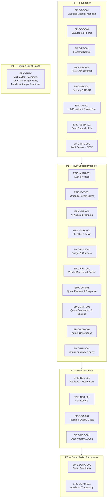
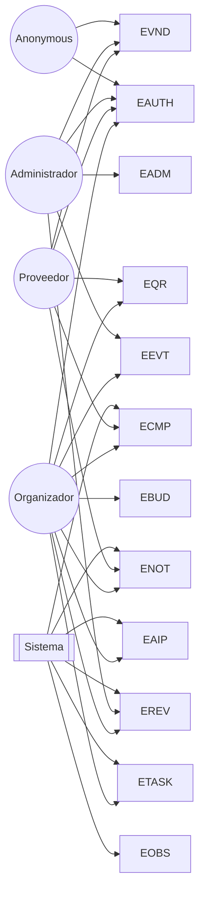
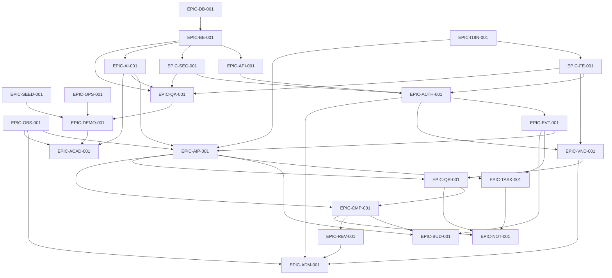

# EventFlow — Epic Map

> **Versión:** 1.0
> **Fecha:** 2026-06-09
> **Producto:** EventFlow — workspace de planificación de eventos asistido por IA con flujo simplificado de cotización de proveedores.
> **MVP target:** AI-assisted event planning workspace + simplified vendor quote flow.
> **Idioma del documento:** Español LATAM neutral.
> **Audiencia:** Product Owner, Business Analyst, Tech Lead, Backend/Frontend Engineers, AI Engineers, QA, DevOps, evaluadores académicos AI4Devs, agentes IA generadores de backlog y tareas.

---

## 1. Propósito del documento

Este Epic Map traduce la documentación funcional, técnica, de IA, seguridad, QA y DevOps de EventFlow en un **catálogo organizado de épicas** listas para descomponer en **user stories**, alimentar el **backlog**, planificar **sprints**, derivar **tareas de desarrollo** y preparar el **demo académico** del MVP.

Sus objetivos son:

1. Proporcionar un **mapa único** de épicas MVP, técnicas, IA, seguridad, QA, DevOps y demo readiness.
2. Servir como **puente entre documentación de discovery/diseño y backlog ejecutable**.
3. Mantener la **trazabilidad** entre cada épica y los documentos fuente (FRD, Use Cases, BR, NFR, Architecture, ADRs).
4. **Proteger el alcance MVP**, marcando explícitamente lo que queda fuera para evitar scope creep.
5. Facilitar la **evaluación académica** mediante una visión completa y trazable del producto.

Este documento es **insumo directo** para:

- Generación de User Stories (`/management/templates/user-story.tpl.md`).
- Construcción del Backlog Inicial.
- Planificación de Sprints y entregas.
- Definición de tareas de desarrollo y QA.
- Plan de demo guiada (10–15 min) para evaluación académica.

---

## 2. Alcance del Epic Map

### 2.1 Incluye

- Épicas **funcionales / producto** por dominio MVP.
- Épicas **técnicas habilitadoras** (backend, frontend, base de datos, API).
- Épicas de **IA y PromptOps** (LLMProvider, AIRecommendation, prompts versionados).
- Épicas de **seguridad y autorización** (RBAC, ownership, captcha, sesión).
- Épicas de **testing y QA** (unit, integration, E2E, contract, IA determinista).
- Épicas de **DevOps y despliegue** (AWS, CI/CD, seed, demo readiness).
- Épicas de **datos seed y demo readiness** (escenarios reproducibles).
- Épicas de **gobernanza admin** y **trazabilidad académica**.
- **Dependencias** entre épicas y **priorización** sugerida.
- **Matriz de trazabilidad** a FRD, UC, BR, NFR y ADRs.
- **Riesgos de planificación** y criterios de **readiness** para pasar a User Stories.

### 2.2 No incluye

- Wireframes, mockups o specs visuales detalladas (responsabilidad de UX/Figma).
- Contratos REST endpoint por endpoint (los cubre `/docs/16`).
- DDL físico final de PostgreSQL (lo cubre `/docs/18`).
- Plantillas productivas de prompts (las cubre `/docs/17`).
- Pipelines CI/CD detallados (los cubre `/docs/21`).
- Catálogo exhaustivo de casos de prueba (lo cubre `/docs/20`).
- Funcionalidades fuera del MVP (pagos reales, contratos, chat real-time, WhatsApp, push, app nativa, RAG, multi-tenant, microservicios). Sólo se referencian como **Future / Out of Scope**.

---

## 3. Fuentes utilizadas

| # | Documento | Aporte al Epic Map |
|---:|---|---|
| 1 | `/docs/1-Domain-Discovery-Report.md` | Dominio, actores, JTBD, riesgos. |
| 2 | `/docs/2-Product-Owner-Decisions.md` | Decisiones canónicas iniciales del PO. |
| 3 | `/docs/3-MVP-Scope-Definition.md` | Alcance MVP, exclusiones, criterios de éxito. |
| 4 | `/docs/4-Business-Rules-Document.md` | Reglas BR-* que cada épica debe respetar. |
| 5 | `/docs/5-User-Roles-Permissions-Matrix.md` | Roles y permisos por dominio. |
| 6 | `/docs/6-Domain-Data-Model.md` | Entidades MVP y constraints. |
| 7 | `/docs/7-AI-Features-Specification.md` | Features IA (AI-001..AI-008), `LLMProvider`. |
| 8 | `/docs/8-Use-Cases-Specification.md` | Casos de uso UC-* por dominio. |
| 8.1 | `/docs/8.1-Product-Owner-Decisions-Use-Cases-Addendum.md` | 19 decisiones canónicas del PO. |
| 8.2 | `/docs/8.2-Documentation-Alignment-Review-Before-FRD.md` | Alineación previa al FRD. |
| 9 | `/docs/9-Functional-Requirements-Document.md` | FR-* por módulo. |
| 10 | `/docs/10-Non-Functional-Requirements.md` | NFR-* (performance, IA, seguridad, observabilidad). |
| 11 | `/docs/11-Data-Seed-Strategy.md` | Seed reproducible y demo readiness. |
| 12 | `/docs/12-Architecture-Vision-and-Principles.md` | Principios arquitectónicos. |
| 13 | `/docs/13-System-Architecture-Document.md` | C4 L1/L2/L3, módulos backend. |
| 14 | `/docs/14-Backend-Technical-Design.md` | Diseño backend (Node + Express + Prisma). |
| 15 | `/docs/15-Frontend-Architecture-Design.md` | Diseño frontend (Next.js App Router + TanStack Query). |
| 16 | `/docs/16-API-Design-Specification.md` | Contratos REST. |
| 17 | `/docs/17-AI-Architecture-and-PromptOps-Design.md` | Arquitectura IA y PromptOps. |
| 18 | `/docs/18-Database-Physical-Design.md` | Diseño físico PostgreSQL + Prisma. |
| 19 | `/docs/19-Security-and-Authorization-Design.md` | Seguridad, RBAC, ownership. |
| 20 | `/docs/20-Testing-Strategy.md` | Estrategia de testing y QA. |
| 21 | `/docs/21-Deployment-and-DevOps-Design.md` | Despliegue en AWS, CI/CD. |
| 22 | `/docs/22-Architecture-Decision-Records.md` | ADRs vinculantes. |
| T | `/management/templates/user-story.tpl.md` | Template de User Story para hijas de cada épica. |

---

## 4. Principios de definición de épicas

1. **Dominio antes que capa técnica.** Las épicas de producto se nombran por dominio (Events, Quotes, Reviews), no por tipo de tarea.
2. **MVP-first.** Cualquier épica MVP es **Must / Should / Could**; lo demás es Future u Out of Scope.
3. **Trazabilidad obligatoria.** Toda épica trae referencias a FRD/UC/BR/NFR/ADR/entidades.
4. **Human-in-the-loop para IA.** Ninguna épica IA permite que la salida se convierta en dato oficial sin validación humana explícita.
5. **Workspace, no marketplace.** Ninguna épica MVP introduce pagos reales, contratos firmados, chat real-time, WhatsApp, push o KYC.
6. **Seed-first demo.** El demo debe ser reproducible sin captación real.
7. **Backend como fuente de verdad.** RBAC + ownership viven en backend; el frontend los refleja como UX.
8. **AI provider abstraction.** Todas las épicas IA dependen del puerto `LLMProvider` con OpenAI + Mock + Anthropic stub.
9. **Soft delete y auditoría.** Las épicas que tocan reseñas, attachments y acciones admin deben respetar soft delete y `AdminAction`.
10. **Demostrable sobre completo.** Si una épica no aporta al flujo demostrable de demo, se posterga.

---

## 5. Resumen ejecutivo del Epic Map

El Epic Map MVP organiza **24 épicas principales** distribuidas en cinco bloques:

| Bloque | # Épicas | Foco |
|---|---:|---|
| Producto / Funcional | 13 | Auth, Events, IA, Tasks, Budget, Vendors, Quotes, Booking, Reviews, Notifications, Admin, i18n, Seed |
| Técnicas habilitadoras | 6 | Backend monolito modular, REST API, DB Prisma, Frontend Next.js, Security, Observability |
| IA y PromptOps | 1 | LLMProvider, AIRecommendation, prompts versionados, fallback |
| Testing / QA | 1 | Unit, Integration, API, E2E, IA determinista, A11Y, i18n |
| DevOps + Demo + Académica | 3 | Deploy AWS + CI/CD, Demo readiness, Trazabilidad académica |

**Roles principales activos:** Organizador, Proveedor, Administrador. **Rol implícito:** Sistema. **Anonymous** sólo aplica a registro/login y al directorio público SEO.

**Restricciones contractuales** (mismas en todas las épicas MVP):
- Sin pagos reales, sin contratos firmados, sin chat real-time, sin WhatsApp, sin push, sin SMS, sin app nativa.
- Sin moderación automática IA, sin agentes autónomos, sin RAG, sin imágenes IA.
- Sin conversión automática de moneda.
- Single-role por usuario; multi-rol es Future.

---

## 6. Mapa visual de épicas

### 6.1 Vista general por bloque y prioridad

### 6.2 Mapa de roles → épicas

### 6.3 Camino crítico MVP (demo end-to-end)

---

## 7. Catálogo de épicas MVP

> Notación: cada épica trae `ID`, `Dominio`, `Tipo`, `Rol principal`, `Prioridad`, `Alcance`, `Dependencias` y `Fuente principal`, seguido de objetivos, capacidades, US candidatas, reglas, QA y criterios de completion.

---

## EPIC-AUTH-001 — Authentication & User Access

| Campo | Valor |
|---|---|
| ID | EPIC-AUTH-001 |
| Dominio | Auth |
| Tipo | Product |
| Rol principal | Cross-role (Organizer, Vendor, Admin, Anonymous) |
| Prioridad | Must Have |
| Alcance | MVP |
| Dependencias | EPIC-BE-001, EPIC-DB-001, EPIC-API-001, EPIC-SEC-001 |
| Fuente principal | FRD §13, UC-AUTH-001..006, BR-AUTH-*, Doc 5 §5, Doc 19 |

### Objetivo
Permitir el registro, login, recuperación de contraseña, sesión persistente y asignación de rol único (`organizer | vendor | admin`) con captcha/anti-bot obligatorio y aislamiento de datos por rol.

### Resultado esperado
Cualquier persona puede crear cuenta como organizador o proveedor, autenticarse con captcha, mantener sesión vía cookie HTTP-only, recuperar contraseña y acceder sólo a los recursos permitidos por su rol y su ownership.

### Capacidades incluidas
- Registro con email + password + rol (`organizer | vendor`).
- Captcha/anti-bot en registro y login (Decisión PO 8.1 #8).
- Login email + password con mensajes genéricos.
- Logout explícito.
- Recuperación de contraseña con token de un solo uso (email real o simulado).
- Sesión persistente vía cookie HTTP-only firmada.
- RBAC y aislamiento de datos por rol.
- Hashing fuerte (argon2id / bcrypt).
- Perfil propio: ver/editar nombre, teléfono opcional, idioma preferido.
- OAuth Google (Could Have).

### Capacidades excluidas
- Multi-rol simultáneo por usuario (Future).
- MFA / SSO empresarial.
- OAuth con múltiples proveedores como obligatorio.
- KYC, verificación documental.

### User Stories candidatas
- US-AUTH-001: Registrarme como organizador con captcha.
- US-AUTH-002: Registrarme como proveedor con captcha.
- US-AUTH-003: Iniciar sesión con email y password.
- US-AUTH-004: Recuperar mi contraseña vía email.
- US-AUTH-005: Cerrar sesión.
- US-AUTH-006: Ver y editar mi perfil propio.
- US-AUTH-007: Cambiar mi idioma preferido entre los 4 soportados.
- US-AUTH-008: (Could) Iniciar sesión con Google.

### Reglas y restricciones relevantes
- BR-AUTH-001..011, BR-USER-001..006.
- FR-AUTH-001..012, FR-USER-001..006.
- Constraints C-001, C-043..C-046, C-059, C-061..C-062.
- Decisión PO 8.1 #8 (captcha obligatorio).

### Consideraciones de QA
- Pruebas positivas y negativas de captcha.
- Tests de RBAC: rol incorrecto → 403; recurso ajeno → 403/404.
- Cookies con `HttpOnly`, `Secure`, `SameSite=Lax`.
- Tests de rate limiting en login y recovery.

### Consideraciones técnicas
- Middleware `authMiddleware → roleMiddleware → ownershipMiddleware`.
- Reset token de un solo uso, hash en DB.
- No exponer existencia de cuenta en errores.

### Criterios de completion de la épica
- Un usuario puede completar el ciclo register → captcha → login → reset → logout.
- 100% de endpoints aplican RBAC + ownership en backend.
- Cookies cumplen política HTTP-only firmada.
- Tests negativos de autorización en suite CI.

---

## EPIC-EVT-001 — Organizer Event Management

| Campo | Valor |
|---|---|
| ID | EPIC-EVT-001 |
| Dominio | Events |
| Tipo | Product |
| Rol principal | Organizer |
| Prioridad | Must Have |
| Alcance | MVP |
| Dependencias | EPIC-AUTH-001, EPIC-DB-001, EPIC-API-001 |
| Fuente principal | FRD §15, UC-EVENT-001..006, BR-EVENT-*, Doc 6 |

### Objetivo
Permitir al organizador crear, editar, listar y cerrar eventos para los 6 tipos soportados, con ciclo de vida `draft → active → completed | cancelled`, moneda inmutable y cierre automático 2 días post-fecha.

### Resultado esperado
Un organizador puede manejar el ciclo de vida completo de sus eventos propios y ver un dashboard con progreso, próximas tareas, presupuesto comprometido y cotizaciones activas.

### Capacidades incluidas
- Wizard de creación: tipo (wedding, xv, baptism, baby_shower, birthday, corporate), fecha, invitados, ciudad, presupuesto estimado, moneda (local | USD), idioma.
- Edición y soft delete de eventos `draft`.
- Cancelación de eventos `active`.
- Listado y filtros (estado, tipo).
- Dashboard por evento (progreso, tareas, presupuesto, cotizaciones).
- Cierre automático 2 días post `event_date` (job, `auto_completed=true`) — Decisión PO 8.1 #6.
- Lectura solo-admin del evento (registrada como `view_event` en `AdminAction`) — Decisión PO 8.1 #16.

### Capacidades excluidas
- Multi-colaboradores por evento (Future v1.1).
- RSVP, lista de invitados, plano de mesas.
- Calendario externo (Google/Outlook).
- Cambio de moneda post-creación.

### User Stories candidatas
- US-EVT-001: Crear un evento mediante wizard.
- US-EVT-002: Editar mi evento (excepto moneda).
- US-EVT-003: Cancelar mi evento.
- US-EVT-004: Eliminar mi evento `draft`.
- US-EVT-005: Listar y filtrar mis eventos.
- US-EVT-006: Ver el dashboard de progreso de mi evento.
- US-EVT-007: El sistema cierra automáticamente mi evento 2 días después.
- US-EVT-008: Admin ve mi evento en solo lectura (auditado).

### Reglas y restricciones relevantes
- BR-EVENT-001..014, BR-EVENTTYPE-001..007.
- FR-EVENT-001..014.
- C-002, C-005, C-006, C-026c, C-047, C-048, C-056.
- Decisiones PO 8.1 #6 #7 #16 #17.

### Consideraciones de QA
- Validar lifecycle: imposible volver desde `completed`/`cancelled`.
- Moneda no editable post-creación.
- Job de auto-completion testeado con clock injectable.
- Admin solo lectura: 403 si intenta editar.

### Consideraciones técnicas
- Use case por acción (Create/Update/Cancel/Delete/AutoComplete).
- `EventOwnershipPolicy` aplicada en Application Layer.
- Repositorio Prisma con índices por owner y status.

### Criterios de completion de la épica
- Wizard soporta los 6 tipos de evento.
- Lifecycle implementado y testeado.
- Job `AutoCompleteEventsJob` ejecuta con logs estructurados.
- Dashboard funcional con datos agregados.

---

## EPIC-AIP-001 — AI-Assisted Event Planning

| Campo | Valor |
|---|---|
| ID | EPIC-AIP-001 |
| Dominio | AI |
| Tipo | AI |
| Rol principal | Organizer (con apoyo de Vendor en AI-007) |
| Prioridad | Must Have |
| Alcance | MVP |
| Dependencias | EPIC-EVT-001, EPIC-TASK-001, EPIC-BUD-001, EPIC-AI-001 (LLMProvider) |
| Fuente principal | FRD §16, UC-AI-001..009, BR-AI-*, Doc 7, Doc 17 |

### Objetivo
Ofrecer features IA (AI-001..AI-008) como **copiloto sugerente** sobre el flujo de planificación, con validación humana obligatoria y trazabilidad completa vía `AIRecommendation`.

### Resultado esperado
El organizador genera un plan estructurado (timeline + categorías + checklist + presupuesto + brief + comparador) en menos de 10 minutos, con cada sugerencia marcada visualmente y aceptable/editable/regenerable.

### Capacidades incluidas
- AI-001 Generar plan IA (timeline + categorías sugeridas).
- AI-002 Generar checklist IA con fechas relativas (T-180/T-90/T-30/T-7/T-1).
- AI-003 Sugerir distribución de presupuesto.
- AI-004 Recomendar categorías de proveedor priorizadas.
- AI-005 Generar brief IA de cotización autocompletado.
- AI-006 Resumen IA del comparador de Quotes (Should).
- AI-007 Bio/paquetes IA de proveedor (Could; rol Vendor).
- AI-008 Priorización IA de tareas urgentes (Should).
- Persistencia de `AIRecommendation` con prompt_version, provider, language, fallback_used, timeout_ms.
- Distinción visual "sugerido por IA" vs "confirmado".

### Capacidades excluidas
- Chatbot conversacional libre.
- Generación IA de imágenes/decoración.
- Moderación automática IA de reseñas.
- Análisis de sentimiento.
- Decisiones autónomas (aprobar vendor, contratar, pagar, eliminar reseñas).

### User Stories candidatas
- US-AIP-001: Generar plan IA de mi evento.
- US-AIP-002: Generar checklist IA con fechas relativas.
- US-AIP-003: Pedir sugerencia IA de presupuesto.
- US-AIP-004: Obtener categorías IA priorizadas.
- US-AIP-005: Autocompletar brief de cotización con IA.
- US-AIP-006: Pedir resumen IA del comparador de Quotes.
- US-AIP-007: (Vendor) Generar bio/paquetes con IA.
- US-AIP-008: Ver mis 3 tareas más urgentes priorizadas por IA.
- US-AIP-009: Aceptar, editar o descartar una sugerencia IA.
- US-AIP-010: Regenerar una sugerencia con feedback.

### Reglas y restricciones relevantes
- BR-AI-001..015.
- FR-AI-001..020.
- C-031..C-035, C-058, C-062.
- Decisiones PO 8.1 #9 (timeout 60s) y #15 (OpenAI + Mock + Anthropic stub).

### Consideraciones de QA
- Tests deterministas con `MockAIProvider`.
- Validación JSON estricta con Zod; reintento controlado único.
- Tests de timeout 60s + fallback en modo demo.
- Tests del flujo HITL: aceptar/editar/descartar.
- Tests de idioma: output respeta el idioma del evento.

### Consideraciones técnicas
- Módulo `ai-assistance` con `LLMProvider` (puerto).
- Adapters: `OpenAIProvider`, `MockAIProvider`, `AnthropicProvider` (stub).
- Prompt registry estático versionado.
- `AIRecommendation` (status: pending/accepted/edited/rejected/discarded).
- Backend-only: el frontend nunca llama a OpenAI.

### Criterios de completion de la épica
- 8 features IA implementadas (5 Must + 2 Should + 1 Could).
- `LLMProvider` con 3 adapters + selector por env var.
- HITL aplicado en todas las features.
- `AIRecommendation` persistida con trazabilidad completa.
- Tests deterministas pasan en CI.

---

## EPIC-TASK-001 — Checklist & Task Management

| Campo | Valor |
|---|---|
| ID | EPIC-TASK-001 |
| Dominio | Tasks |
| Tipo | Product |
| Rol principal | Organizer |
| Prioridad | Must Have |
| Alcance | MVP |
| Dependencias | EPIC-EVT-001, EPIC-AIP-001 |
| Fuente principal | FRD §17, UC-TASK-001..006, BR-TASK-* |

### Objetivo
Permitir al organizador gestionar el checklist del evento, incluyendo tareas manuales y generadas por IA, con estados, fechas, filtros y cálculo de progreso.

### Resultado esperado
El organizador ve un checklist accionable con progreso (%), próximas tareas, T-7 destacadas y notificaciones in-app.

### Capacidades incluidas
- Crear tarea manual con `due_date` y categoría opcional.
- Editar/eliminar tareas.
- Cambiar estado (`pending → in_progress → done | skipped`).
- Confirmar tareas IA individualmente o en bloque (`ai_generated=true`).
- Conversión de fechas relativas (T-x) a absolutas.
- Filtros por estado y rango temporal (próximos 7/30 días).
- Cálculo de progreso (% done / confirmadas).
- Indicadores visuales para tareas T-7 y vencidas.
- Read-only en eventos `completed`; bloqueo en `cancelled`.

### Capacidades excluidas
- Asignación de tareas a múltiples usuarios.
- Subtareas anidadas.
- Recurrencia.

### User Stories candidatas
- US-TASK-001: Ver mi checklist del evento.
- US-TASK-002: Crear tarea manual.
- US-TASK-003: Editar/eliminar tarea.
- US-TASK-004: Cambiar estado de mi tarea.
- US-TASK-005: Confirmar tareas IA en bloque.
- US-TASK-006: Filtrar por próximos 7/30 días.
- US-TASK-007: Ver progreso (% done) en dashboard.
- US-TASK-008: Recibir notificación in-app de T-7.

### Reglas y restricciones relevantes
- BR-TASK-001..010.
- FR-TASK-001..012.
- C-027, C-028.

### Consideraciones de QA
- Estados válidos: prohibir transiciones inválidas.
- Filtros temporales con fechas relativas.
- Progreso recalculado al confirmar/cambiar estado.
- `ai_generated` correctamente marcado.

### Consideraciones técnicas
- Use cases CRUD + ChangeStatus + ConfirmAITasksBulk.
- Job opcional para notificar T-7.
- Índices por (`event_id`, `status`, `due_date`).

### Criterios de completion de la épica
- Lifecycle de tareas implementado.
- Conversión T-x ↔ fecha absoluta validada.
- Filtros y progreso operativos.
- Notificación T-7 en in-app.

---

## EPIC-BUD-001 — Budget Management & Currency

| Campo | Valor |
|---|---|
| ID | EPIC-BUD-001 |
| Dominio | Budget |
| Tipo | Product |
| Rol principal | Organizer |
| Prioridad | Must Have |
| Alcance | MVP |
| Dependencias | EPIC-EVT-001, EPIC-AIP-001 (AI-003), EPIC-CMP-001 (BookingIntent → committed) |
| Fuente principal | FRD §18, UC-BUDGET-001..004, BR-BUDGET-* |

### Objetivo
Permitir al organizador gestionar un `Budget` 1:1 por evento con `BudgetItem` por categoría (planned/committed), cálculo en vivo, warning por exceso y moneda inmutable (local o USD).

### Resultado esperado
El organizador ve y controla su presupuesto por categoría con sugerencia IA opcional y actualización automática del `committed` al confirmarse `BookingIntent`.

### Capacidades incluidas
- 1:1 entre `Event` y `Budget`.
- CRUD de `BudgetItem` por categoría (planned, committed, paid opcional).
- Sugerencia IA de distribución (AI-003) → BudgetItems `ai_generated=true` editables.
- Cálculo en vivo de `total` y `committed`.
- Warning si `committed > total` (no bloqueante).
- Update automático de `committed` al confirmarse `BookingIntent`.
- Moneda inmutable (local | USD); mínimo: GTQ, EUR, MXN, COP, USD.
- Sin conversión automática.

### Capacidades excluidas
- Multi-moneda por evento.
- Conversión automática (Out of Scope).
- Pagos reales / captura de tarjeta.

### User Stories candidatas
- US-BUD-001: Ver/editar mi presupuesto.
- US-BUD-002: Crear/editar `BudgetItem` por categoría.
- US-BUD-003: Aceptar distribución IA como items editables.
- US-BUD-004: Ver warning cuando committed > total.
- US-BUD-005: Ver mi committed actualizarse al confirmar booking.

### Reglas y restricciones relevantes
- BR-BUDGET-001..010, BR-EVENT-007.
- FR-BUDGET-001..010.
- C-006, C-007..C-009, C-044.
- Decisión PO 8.1 #7.

### Consideraciones de QA
- Inmutabilidad de moneda enforced (UI + backend).
- Suma planned/committed correcta.
- Trigger de update committed al cambiar BookingIntent.

### Consideraciones técnicas
- Use case `UpdateCommittedFromBookingIntent` invocado por BookingIntent state machine.
- Repositorio con sumatorias agregadas.

### Criterios de completion de la épica
- Budget 1:1 implementado.
- Moneda inmutable enforced en backend.
- Sugerencia IA integrada con HITL.
- Warning visual operativo.

---

## EPIC-VND-001 — Vendor Directory & Vendor Profile

| Campo | Valor |
|---|---|
| ID | EPIC-VND-001 |
| Dominio | Vendors |
| Tipo | Product |
| Rol principal | Vendor (CRUD perfil), Organizer (búsqueda), Admin (aprobación), Anonymous (directorio público SEO) |
| Prioridad | Must Have |
| Alcance | MVP |
| Dependencias | EPIC-AUTH-001, EPIC-DB-001, EPIC-API-001, EPIC-SEC-001 |
| Fuente principal | FRD §19, UC-VENDOR-001..008, BR-VENDOR-* |

### Objetivo
Permitir al proveedor mantener un perfil aprobado con portafolio (hasta 10 imágenes por trabajo) y paquetes; al organizador buscar proveedores aprobados; al admin aprobar/rechazar/ocultar; al público anónimo navegar el directorio SEO.

### Resultado esperado
Catálogo curado de proveedores con perfiles aprobados, paquetes, portafolio (`vendor_work`), reseñas visibles y búsqueda funcional por categoría, ciudad y precio.

### Capacidades incluidas
- Crear/editar `VendorProfile` (`pending → approved | rejected`).
- Portafolio: hasta 10 imágenes por trabajo (`vendor_work` con `work_label`) — Decisión PO 8.1 #2.
- Máximo 5 cambios de categoría con revisión admin (`category_change_count <= 5`) — Decisión PO 8.1 #3.
- `VendorService` (paquetes): nombre, categoría, precio base, descripción.
- IA opcional para bio y paquetes (AI-007, Could).
- Directorio público con filtros (categoría, ciudad, precio).
- Soft delete obligatorio de attachments — Decisión PO 8.1 #19.
- Vista pública SEO-ready del vendor (Server Components).

### Capacidades excluidas
- Calendario completo de disponibilidad (Future).
- KYC / verificación automática.
- Suscripción real de proveedor.
- Chat real-time.
- Boost / planes premium.

### User Stories candidatas
- US-VND-001: Crear mi `VendorProfile`.
- US-VND-002: Editar mi perfil mientras no esté rechazado.
- US-VND-003: Cambiar mis categorías (máx 5 acumulado).
- US-VND-004: Subir hasta 10 imágenes por trabajo.
- US-VND-005: (Vendor) Generar bio/paquete con IA.
- US-VND-006: (Organizer) Buscar proveedores por categoría/ciudad/precio.
- US-VND-007: (Anonymous) Ver perfil público SEO de un vendor.
- US-VND-008: (Admin) Aprobar/rechazar/ocultar un vendor.
- US-VND-009: Soft-deletear una imagen de mi portafolio.

### Reglas y restricciones relevantes
- BR-VENDOR-001..008, BR-PRIVACY-011, BR-ADMIN-001.
- FR-VENDOR-001..008.
- C-010, C-011, C-037, C-038.
- Decisiones PO 8.1 #2 #3 #19.

### Consideraciones de QA
- Allowlist MIME de uploads.
- Hard delete prohibido para attachments.
- Visibilidad pública sólo para `approved`.
- Validación de `category_change_count`.

### Consideraciones técnicas
- `FileStoragePort` con `LocalFileStorageAdapter` (MVP) y `ObjectStorageAdapter` (Future).
- Páginas públicas: Server Components con metadata + Open Graph.
- Búsqueda: query SQL con índices por categoría/ciudad/precio.

### Criterios de completion de la épica
- Perfil + portafolio + paquetes funcionales.
- Directorio público SEO operativo.
- Aprobación admin documentada en `AdminAction`.
- Soft delete validado en QA.

---

## EPIC-QR-001 — Quote Request & Quote Response Flow

| Campo | Valor |
|---|---|
| ID | EPIC-QR-001 |
| Dominio | Quotes |
| Tipo | Product |
| Rol principal | Organizer (request), Vendor (response) |
| Prioridad | Must Have |
| Alcance | MVP |
| Dependencias | EPIC-EVT-001, EPIC-VND-001, EPIC-AIP-001 (AI-005), EPIC-NOT-001 |
| Fuente principal | FRD §20 (FR-QUOTE), UC-QUOTE-001..010, BR-QUOTE-* |

### Objetivo
Soportar el flujo bilateral organizador → proveedor: envío de `QuoteRequest` (brief estructurado autocompletado), respuesta del proveedor con `Quote` (validez default 15 días) y enforcement del límite de 5 QuoteRequest activas por categoría por evento.

### Resultado esperado
Cada par (evento, vendor) puede intercambiar una `QuoteRequest` estructurada y recibir una `Quote` con desglose y validez, con notificaciones in-app y email simulado en cada transición.

### Capacidades incluidas
- Crear `QuoteRequest` desde brief autocompletado (AI-005).
- Máx 5 `QuoteRequest` activas por categoría por evento — Decisión PO 8.1 #12.
- Una sola `QuoteRequest` activa por (evento, vendor).
- Estados: `sent → viewed → responded | expired | cancelled`.
- Vendor responde con `Quote`: total + desglose + condiciones + `valid_until` (default 15 días) — Decisión PO 8.1 #4.
- Estados Quote: `draft → sent → accepted | rejected | expired`.
- Notificación al vendor por Quote rechazada/expirada — Decisión PO 8.1 #13.
- Expiración automática (job) de `QuoteRequest` y `Quote`.

### Capacidades excluidas
- Chat real-time entre organizador y vendor.
- Cotizaciones múltiples vigentes simultáneas por mismo (evento, vendor).
- Contratos firmados.

### User Stories candidatas
- US-QR-001: Enviar QuoteRequest con brief autocompletado.
- US-QR-002: Validar límite de 5 activas por categoría.
- US-QR-003: Vendor ve solicitud y marca `viewed`.
- US-QR-004: Vendor responde Quote con desglose.
- US-QR-005: Vendor define `valid_until` (default 15 días).
- US-QR-006: Notificar al vendor cuando su Quote es rechazada/expirada.
- US-QR-007: Sistema expira automáticamente Quotes vencidas.
- US-QR-008: Cancelar QuoteRequest activa.

### Reglas y restricciones relevantes
- BR-QUOTE-001..024, BR-NOTIF-002.
- FR-QUOTE-001..024 (alcance MVP).
- C-016, C-019.
- Decisiones PO 8.1 #4 #12 #13.

### Consideraciones de QA
- Tests de límite (5 activas) con estados que cuentan: sent/viewed/responded/preferred.
- Job de expiración determinista.
- Notificación al vendor verificable en log + in-app.

### Consideraciones técnicas
- State machine en Application Layer.
- `QuoteRequestExpirationJob`, `QuoteExpirationJob`.
- Assignment-based authorization (sólo vendor destinatario ve la solicitud).

### Criterios de completion de la épica
- Flujo bilateral completo funcional.
- Límite de 5 activas enforced.
- Validez default 15 días aplicada.
- Notificaciones en transición de Quote operativas.

---

## EPIC-CMP-001 — Quote Comparison & Booking Intent

| Campo | Valor |
|---|---|
| ID | EPIC-CMP-001 |
| Dominio | Booking |
| Tipo | Product |
| Rol principal | Organizer (compara, marca preferred, crea intent), Vendor (confirma) |
| Prioridad | Must Have |
| Alcance | MVP |
| Dependencias | EPIC-QR-001, EPIC-AIP-001 (AI-006), EPIC-BUD-001 |
| Fuente principal | FRD §21–22, UC-QUOTE-006..007, UC-BOOKING-001..003, BR-BOOKING-* |

### Objetivo
Permitir al organizador comparar Quotes recibidas, marcar `preferred`, crear un `BookingIntent` simulado y al vendor confirmarlo, sin pagos reales ni contratos firmados.

### Resultado esperado
Un organizador puede comparar lado a lado las Quotes (con resumen IA opcional), elegir una, generar un `BookingIntent` y verlo pasar a `confirmed_intent` tras la confirmación del vendor; el committed del presupuesto se actualiza automáticamente.

### Capacidades incluidas
- Vista comparativa de Quotes por categoría.
- Marca `preferred` en una Quote.
- Resumen IA del comparador (AI-006, Should).
- Crear `BookingIntent` desde Quote vigente y `accepted`.
- Confirmación del vendor: `pending → confirmed_intent`.
- Cancelación del `BookingIntent` (incluso `confirmed_intent`) sin penalización en plataforma — Decisión PO 8.1 #5.
- Disclaimer visible: "El acuerdo final ocurre fuera de la plataforma".
- Update automático de `BudgetItem.committed`.

### Capacidades excluidas
- Pago real, captura de tarjeta.
- Comisiones por contrato cerrado (Future comercial).
- Firma electrónica.
- Penalizaciones automáticas por cancelación.

### User Stories candidatas
- US-CMP-001: Comparar Quotes lado a lado.
- US-CMP-002: Marcar Quote `preferred`.
- US-CMP-003: Ver resumen IA del comparador.
- US-CMP-004: Crear `BookingIntent` desde Quote vigente.
- US-CMP-005: Vendor confirma `BookingIntent`.
- US-CMP-006: Cancelar `BookingIntent` sin penalización.
- US-CMP-007: Disclaimer visible al confirmar.
- US-CMP-008: Ver committed actualizado en presupuesto.

### Reglas y restricciones relevantes
- BR-QUOTE-021..024, BR-BOOKING-001..009, BR-BUDGET-005.
- FR-BOOKING-001..004, FR-QUOTE-021..024.
- C-056.
- Decisión PO 8.1 #5.

### Consideraciones de QA
- BookingIntent sólo desde Quote vigente.
- Confirmar/cancelar respeta assignment.
- Update committed atómico.
- Disclaimer presente en UI.

### Consideraciones técnicas
- Use cases: `CreateBookingIntent`, `ConfirmBookingIntent`, `CancelBookingIntent`.
- Transacción única para Confirm + Update committed.

### Criterios de completion de la épica
- Vista comparativa operativa.
- BookingIntent lifecycle implementado.
- Resumen IA disponible (Should).
- Disclaimer y soft cancel funcionales.

---

## EPIC-REV-001 — Reviews & Moderation

| Campo | Valor |
|---|---|
| ID | EPIC-REV-001 |
| Dominio | Reviews |
| Tipo | Product |
| Rol principal | Organizer (crea), Admin (modera), Vendor (lee) |
| Prioridad | Must Have |
| Alcance | MVP |
| Dependencias | EPIC-CMP-001, EPIC-ADM-001 |
| Fuente principal | FRD §23 (FR-REVIEW), UC-REVIEW-001..003, BR-REVIEW-* |

### Objetivo
Permitir al organizador con `BookingIntent.confirmed_intent` dejar una reseña verificada (1–5, 5=mejor), visible en el perfil del vendor; al admin moderar vía soft delete con auditoría.

### Resultado esperado
Catálogo de reseñas verificadas por evento+vendor, visibles públicamente en el perfil del vendor, con moderación manual auditada.

### Capacidades incluidas
- Crear `Review` (rating 1–5 + comentario) sólo si hay `BookingIntent.confirmed_intent` con ese vendor.
- Una reseña por (evento, vendor).
- Visualización en perfil del vendor.
- Moderación admin: soft delete + auditoría (`status = removed | hidden`) — Decisión PO 8.1 #11.
- Sin moderación automática IA.

### Capacidades excluidas
- Respuesta del vendor a reseñas (Future) — Decisión PO 8.1 #14.
- Análisis de sentimiento / moderación IA (Future).
- Reseñas anónimas.

### User Stories candidatas
- US-REV-001: Crear reseña verificada con escala 1–5.
- US-REV-002: Ver reseñas en perfil del vendor.
- US-REV-003: Admin oculta/elimina (soft) reseña con auditoría.

### Reglas y restricciones relevantes
- BR-REVIEW-001..008, BR-ADMIN-011.
- FR-REVIEW-001..004.
- C-024, C-057.
- Decisiones PO 8.1 #1 #11 #14.

### Consideraciones de QA
- Verificación de elegibilidad (BookingIntent.confirmed_intent).
- Unicidad por (event, vendor).
- Soft delete: no hard delete físico.
- `AdminAction` registrada en cada moderación.

### Consideraciones técnicas
- Use cases `CreateReview`, `ModerateReview`.
- Constraint único compuesto en DB.

### Criterios de completion de la épica
- Reseña sólo permitida con elegibilidad.
- Moderación admin auditada.
- Visibilidad pública en perfil vendor.

---

## EPIC-NOT-001 — Notifications (in-app + email simulado)

| Campo | Valor |
|---|---|
| ID | EPIC-NOT-001 |
| Dominio | Notifications |
| Tipo | Product |
| Rol principal | Cross-role (Organizer, Vendor) |
| Prioridad | Should Have |
| Alcance | MVP |
| Dependencias | EPIC-EVT-001, EPIC-QR-001, EPIC-CMP-001 |
| Fuente principal | FRD §24 (FR-NOTIF), UC-NOTIF-001..002, BR-NOTIF-* |

### Objetivo
Notificar in-app a usuarios sobre eventos del sistema (Quote creada, Quote respondida, Booking confirmado, tarea T-7, Quote rechazada/expirada) y simular email vía log estructurado.

### Resultado esperado
Cada actor recibe avisos in-app oportunos; el log muestra el "email simulado" con destinatario y contenido.

### Capacidades incluidas
- Notificación in-app por: nueva QuoteRequest, nueva Quote, Quote rechazada/expirada, Booking confirmado, tarea T-7.
- Email simulado vía `MockEmailService` (log estructurado).
- Lista de notificaciones del usuario.
- Marcado como leído.

### Capacidades excluidas
- SMTP real obligatorio (opcional, no bloqueante).
- WhatsApp, SMS, push (Out of Scope).
- Centro de preferencias por canal.

### User Stories candidatas
- US-NOT-001: Recibir in-app aviso de nueva QuoteRequest.
- US-NOT-002: Recibir in-app aviso de nueva Quote.
- US-NOT-003: Recibir in-app aviso de Booking confirmado.
- US-NOT-004: Recibir in-app aviso T-7.
- US-NOT-005: Marcar notificación como leída.
- US-NOT-006: Vendor recibe aviso de Quote rechazada/expirada.

### Reglas y restricciones relevantes
- BR-NOTIF-001..005.
- FR-NOTIF-001..005.
- Decisión PO 8.1 #13.

### Consideraciones de QA
- Cada transición debe disparar al menos 1 notificación.
- `MockEmailService` loguea destinatario, asunto, payload.

### Consideraciones técnicas
- Dominio publica eventos internos → handler genera notification + email simulado.
- Persistir `Notification` con `read_at`.

### Criterios de completion de la épica
- Eventos críticos disparan notificaciones.
- Email simulado loguea estructuradamente.
- UI muestra contador y lista.

---

## EPIC-ADM-001 — Admin Governance

| Campo | Valor |
|---|---|
| ID | EPIC-ADM-001 |
| Dominio | Admin |
| Tipo | Product |
| Rol principal | Administrator |
| Prioridad | Must Have |
| Alcance | MVP |
| Dependencias | EPIC-AUTH-001, EPIC-VND-001, EPIC-REV-001, EPIC-EVT-001 |
| Fuente principal | FRD §25 (FR-ADMIN), UC-ADMIN-001..011, BR-ADMIN-* |

### Objetivo
Proveer el panel administrativo con aprobación de proveedores, gestión de `ServiceCategory` (jerarquía máx 2 niveles), gestión controlada de `EventType`, moderación de reseñas, lista de eventos solo lectura, métricas operativas y log auditable de `AdminAction`.

### Resultado esperado
El admin gobierna el catálogo y la moderación sin involucrarse en flujos comerciales; toda acción es auditada.

### Capacidades incluidas
- Aprobar/rechazar/ocultar `VendorProfile`.
- CRUD de `ServiceCategory` (jerarquía máx 2 niveles) — Decisión PO 8.1 #18.
- Gestión de `EventType` sin hard delete con eventos asociados — Decisión PO 8.1 #17.
- Moderar reseñas (soft delete).
- Listado de eventos solo lectura (acceso registrado como `view_event`) — Decisión PO 8.1 #16.
- Métricas operativas: # eventos, # cotizaciones, # vendors aprobados, # reseñas, # IA generations, # demo readiness.
- Log inmutable `AdminAction`.

### Capacidades excluidas
- Métricas comerciales reales (revenue, comisiones) — Decisión PO 8.1 #10.
- Suplantación de identidad para soporte.
- Edición de eventos por admin.

### User Stories candidatas
- US-ADM-001: Aprobar/rechazar vendor.
- US-ADM-002: CRUD de categorías con jerarquía 2 niveles.
- US-ADM-003: Gestionar `EventType` con bloqueo de hard delete.
- US-ADM-004: Moderar reseña (soft delete) con auditoría.
- US-ADM-005: Listar eventos en solo lectura.
- US-ADM-006: Ver dashboard de métricas operativas.
- US-ADM-007: Consultar log `AdminAction`.

### Reglas y restricciones relevantes
- BR-ADMIN-001..012, BR-SERVICE-003..005, BR-EVENTTYPE-007, BR-EVENT-014.
- FR-ADMIN-001..011.
- C-013, C-040, C-041, C-026c.
- Decisiones PO 8.1 #10 #11 #16 #17 #18.

### Consideraciones de QA
- Cada acción admin escribe en `AdminAction`.
- `view_event` se registra automáticamente.
- Hard delete de `EventType` bloqueado si hay eventos asociados.

### Consideraciones técnicas
- `AdminActionLogger` middleware obligatorio.
- Repositorio inmutable (append-only) para `AdminAction`.

### Criterios de completion de la épica
- Aprobaciones, categorías, EventType, moderación, lectura de eventos operativas.
- Métricas funcionales.
- 100% acciones admin auditadas.

---

## EPIC-I18N-001 — Internationalization & Currency

| Campo | Valor |
|---|---|
| ID | EPIC-I18N-001 |
| Dominio | I18N |
| Tipo | Product |
| Rol principal | Cross-role |
| Prioridad | Must Have |
| Alcance | MVP |
| Dependencias | EPIC-FE-001, EPIC-BE-001, EPIC-AIP-001 |
| Fuente principal | FRD §26 (FR-I18N), UC-I18N-001..002, Doc 3 §7.15, Doc 15 |

### Objetivo
Soportar 4 idiomas (`es-LATAM`, `es-ES`, `pt`, `en`) y moneda configurable por evento (local | USD), inmutable post-creación, sin conversión automática.

### Resultado esperado
La UI, los emails simulados y los outputs IA respetan el idioma del usuario o del evento; las cifras se muestran en la moneda configurada sin conversión.

### Capacidades incluidas
- Selector de idioma por usuario y por evento.
- Implementación con `next-intl`.
- Diccionarios de mensajes por locale.
- Idioma como parámetro en prompts IA.
- Moneda configurable por evento (GTQ, EUR, MXN, COP, USD mínimo).
- Inmutabilidad de moneda enforced backend + UI.
- Sin conversión automática.

### Capacidades excluidas
- Traducción dinámica con IA del contenido.
- Conversión automática FX.
- RTL.

### User Stories candidatas
- US-I18N-001: Cambiar mi idioma preferido entre los 4 soportados.
- US-I18N-002: Configurar el idioma del evento.
- US-I18N-003: Ver cifras siempre en la moneda del evento.
- US-I18N-004: Prompts IA respetan el idioma del evento.

### Reglas y restricciones relevantes
- BR-USER-006, BR-EVENT-008, BR-BUDGET-006..010, BR-AI-011.
- FR-USER-003, FR-EVENT-014, FR-AI-017, FR-BUDGET-007/009.
- C-043, C-044, C-046.

### Consideraciones de QA
- Smoke por locale para rutas principales.
- Validar que prompts envíen `language_code`.
- Tests de moneda inmutable.

### Consideraciones técnicas
- `next-intl` para frontend; helpers de currency con `Intl.NumberFormat`.
- Backend valida `language_code` y `currency` en DTOs.

### Criterios de completion de la épica
- 4 locales completos en rutas principales.
- Moneda inmutable validada en pipeline.
- IA respeta idioma del evento.

---

## EPIC-SEED-001 — Seed Data & Demo Scenarios

| Campo | Valor |
|---|---|
| ID | EPIC-SEED-001 |
| Dominio | Seed |
| Tipo | Technical / Demo |
| Rol principal | System |
| Prioridad | Must Have |
| Alcance | MVP |
| Dependencias | EPIC-DB-001, EPIC-BE-001, EPIC-AI-001 |
| Fuente principal | Doc 11 (Seed Strategy), Doc 3 §7.16, BR-SEED-*, FR-SEED-* |

### Objetivo
Garantizar que el MVP sea demostrable end-to-end mediante un seed reproducible (script único) con organizadores, vendors, eventos en distintos estados, categorías, QuoteRequests, Quotes, reseñas y al menos un `BookingIntent.confirmed_intent`.

### Resultado esperado
Reset del entorno en un comando que carga datos culturalmente coherentes con LATAM (XV años, padrinos, marimba, hora loca) y permite demos repetibles.

### Capacidades incluidas
- Seed idempotente (`is_seed=true` en todas las entidades).
- 5–10 organizadores, 10–20 vendors aprobados, 10–15 eventos (3 draft / 5 active / 3 completed / 3 recién creados).
- 10–15 categorías de servicio, 15–25 QuoteRequests, 10–20 Quotes, 20–40 reseñas.
- `MockAIProvider` con respuestas deterministas alineadas a seed.
- Endpoint admin de reset surgical (entorno Demo).

### Capacidades excluidas
- Captación real de proveedores.
- Datos reales de organizadores.
- Datos sensibles (documentos legales).

### User Stories candidatas
- US-SEED-001: Ejecutar `npm run seed` reproducible.
- US-SEED-002: Admin reset del entorno Demo.
- US-SEED-003: Demo presenta eventos en draft/active/completed.
- US-SEED-004: Existe ≥1 `BookingIntent.confirmed_intent` visible.

### Reglas y restricciones relevantes
- BR-SEED-001..010.
- FR-SEED-001+, FR-DEMO-001+.
- Doc 11 §completo.

### Consideraciones de QA
- Idempotencia validada (correr 2 veces sin duplicar).
- Tests E2E ejecutan sobre seed.

### Consideraciones técnicas
- Script `seed.ts` en backend; uso de Prisma + transacciones.
- Flag `is_seed` para distinguir y poder limpiar selectivamente.

### Criterios de completion de la épica
- Script reproducible en 1 comando.
- Volúmenes mínimos cumplidos.
- Reset operativo en entorno Demo.

---

## 8. Épicas por rol

### 8.1 Organizador
- EPIC-AUTH-001, EPIC-EVT-001, EPIC-AIP-001, EPIC-TASK-001, EPIC-BUD-001, EPIC-QR-001, EPIC-CMP-001, EPIC-REV-001, EPIC-NOT-001, EPIC-I18N-001.

### 8.2 Proveedor
- EPIC-AUTH-001, EPIC-VND-001, EPIC-QR-001, EPIC-CMP-001, EPIC-NOT-001, EPIC-I18N-001, EPIC-AIP-001 (AI-007 opcional).

### 8.3 Administrador
- EPIC-AUTH-001, EPIC-ADM-001, EPIC-VND-001 (aprobación), EPIC-REV-001 (moderación), EPIC-EVT-001 (solo lectura), EPIC-I18N-001.

### 8.4 Anonymous
- EPIC-AUTH-001 (registro/login), EPIC-VND-001 (directorio público SEO).

### 8.5 Sistema (implícito)
- EPIC-AIP-001 (timeouts, fallback), EPIC-TASK-001 (T-7), EPIC-NOT-001 (eventos), EPIC-QR-001 (expiración), EPIC-CMP-001 (committed), EPIC-EVT-001 (auto-completion), EPIC-OBS-001.

---

## 9. Épicas técnicas habilitadoras

---

## EPIC-BE-001 — Backend Modular Monolith Foundation

| Campo | Valor |
|---|---|
| ID | EPIC-BE-001 |
| Dominio | Platform |
| Tipo | Technical |
| Rol principal | System |
| Prioridad | Must Have (P0) |
| Alcance | MVP |
| Dependencias | — (foundation) |
| Fuente principal | Doc 12, Doc 13, Doc 14 |

### Objetivo
Levantar el monolito modular en Node.js + Express + TypeScript con Clean/Hexagonal, módulos por dominio, capas Interface/Application/Domain/Ports/Infrastructure y middleware cross-cutting.

### Capacidades incluidas
- Bootstrapping del servidor Express.
- Estructura de carpetas feature-first.
- Capas Clean/Hex correctamente separadas.
- Middlewares: correlation, logging, auth, role, ownership, validation, rate limit, captcha, upload, error handler.
- Configuración por env vars.
- Shared kernel.

### Capacidades excluidas
- Microservicios, message brokers, WebSockets (Out of Scope MVP).

### User Stories candidatas
- US-BE-001: Inicializar proyecto Node + Express + TS.
- US-BE-002: Carpetas por módulo de dominio.
- US-BE-003: Pipeline de middlewares.
- US-BE-004: Validación con Zod.
- US-BE-005: Error envelope unificado.

### Reglas y restricciones relevantes
- Doc 14 §completo; principios de Doc 12.
- ADR-ARCH-001, ADR-BE-001..00n.

### Consideraciones de QA
- Tests de cadena de middleware.
- Tests del error envelope.

### Criterios de completion de la épica
- Backend levantado con un endpoint healthcheck.
- Middlewares operativos.
- Estructura validada por Tech Lead.

---

## EPIC-API-001 — REST API Contract Implementation

| Campo | Valor |
|---|---|
| ID | EPIC-API-001 |
| Dominio | API |
| Tipo | Technical |
| Rol principal | System |
| Prioridad | Must Have (P0) |
| Alcance | MVP |
| Dependencias | EPIC-BE-001 |
| Fuente principal | Doc 16 (API Spec) |

### Objetivo
Implementar el contrato REST `/api/v1/*` (DTOs, paths, códigos de error, paginación, `aiMeta`) alineado con Doc 16, consumido por el frontend y por agentes IA.

### Capacidades incluidas
- Rutas REST por dominio.
- DTOs request/response con Zod.
- Error envelope estándar.
- Paginación cursor o page-based.
- Correlación IDs propagados.
- Soporte de filtros estándar.

### Capacidades excluidas
- GraphQL, gRPC, Server Actions, BFF.

### User Stories candidatas
- US-API-001: Implementar endpoints AUTH.
- US-API-002: Implementar endpoints EVENT.
- US-API-003: Implementar endpoints QUOTE.
- US-API-004: Implementar endpoints AI.
- US-API-005: Generar OpenAPI snapshot (recomendado).

### Reglas y restricciones relevantes
- Doc 16 §completo, NFR-API-*.

### Consideraciones de QA
- Tests de contrato (Supertest).
- MSW del frontend alineado con respuestas reales.

### Criterios de completion de la épica
- Endpoints MVP completos.
- Errores estandarizados.
- Contratos validados con tests.

---

## EPIC-DB-001 — Database & Prisma Physical Model

| Campo | Valor |
|---|---|
| ID | EPIC-DB-001 |
| Dominio | Platform / DB |
| Tipo | Technical |
| Rol principal | System |
| Prioridad | Must Have (P0) |
| Alcance | MVP |
| Dependencias | EPIC-BE-001 |
| Fuente principal | Doc 6, Doc 18 (Physical Design) |

### Objetivo
Implementar el schema Prisma + PostgreSQL alineado con el Domain Data Model, incluyendo constraints C-001..C-062, enums, soft delete, índices y migraciones reproducibles.

### Capacidades incluidas
- Schema Prisma por entidad MVP.
- Constraints, FKs, unique compound, enums.
- Soft delete en attachments y reviews.
- Índices para consultas críticas.
- Migraciones versionadas.
- Generators y client tipado.

### Capacidades excluidas
- Multi-tenant.
- Particionamiento avanzado.
- DBs vectoriales.

### User Stories candidatas
- US-DB-001: Definir schema Prisma por dominio.
- US-DB-002: Generar migrations base.
- US-DB-003: Implementar índices críticos.
- US-DB-004: Validar constraints C-001..C-062.

### Reglas y restricciones relevantes
- Doc 6, Doc 18, BR-* aplicables.

### Consideraciones de QA
- Tests de constraints (unique, FK).
- Tests de migraciones up/down.

### Criterios de completion de la épica
- Schema completo y migraciones aplicadas.
- Tests de constraints pasan.

---

## EPIC-FE-001 — Frontend Next.js Application Foundation

| Campo | Valor |
|---|---|
| ID | EPIC-FE-001 |
| Dominio | Platform / FE |
| Tipo | Technical |
| Rol principal | System |
| Prioridad | Must Have (P0) |
| Alcance | MVP |
| Dependencias | — (foundation) |
| Fuente principal | Doc 15 (Frontend Architecture) |

### Objetivo
Levantar la aplicación Next.js (App Router) + TypeScript + TanStack Query + RHF + Zod + Tailwind + next-intl + MSW + Playwright, con route groups por rol y áreas públicas SEO.

### Capacidades incluidas
- Setup Next.js App Router.
- Server Components por defecto en públicas SEO; Client en autenticadas.
- TanStack Query, RHF + Zod.
- Tailwind + design tokens.
- next-intl con 4 locales.
- MSW para mocking en dev/tests.
- Estructura feature-first.
- Layouts por rol (organizer/vendor/admin).

### Capacidades excluidas
- BFF, Server Actions, route handlers como proxy a OpenAI.
- App nativa.

### User Stories candidatas
- US-FE-001: Inicializar Next.js + dependencias.
- US-FE-002: Configurar i18n (4 locales).
- US-FE-003: Definir route groups por rol.
- US-FE-004: Configurar TanStack Query + MSW.
- US-FE-005: Diseñar layouts y navegación por rol.

### Reglas y restricciones relevantes
- Doc 15 §completo, NFR-A11Y-*, NFR-I18N-*.

### Consideraciones de QA
- Tests de smoke por route group.
- Verificar layouts no se mezclan.

### Criterios de completion de la épica
- Frontend operativo con healthcheck y login.
- Layouts por rol funcionales.
- MSW corriendo en dev y tests.

---

## EPIC-SEC-001 — Security & Authorization Enforcement

| Campo | Valor |
|---|---|
| ID | EPIC-SEC-001 |
| Dominio | Security |
| Tipo | Security |
| Rol principal | System |
| Prioridad | Must Have (P0) |
| Alcance | MVP |
| Dependencias | EPIC-BE-001, EPIC-API-001, EPIC-AUTH-001 |
| Fuente principal | Doc 19 (Security Design) |

### Objetivo
Implementar el modelo de seguridad: cookies HTTP-only firmadas, RBAC + ownership + assignment-based, captcha, rate limiting, CORS, CSRF, headers, validación Zod, upload seguro, redacción de logs y `AdminAction` obligatorio.

### Capacidades incluidas
- `authMiddleware`, `roleMiddleware`, `ownershipMiddleware`, `policyMiddleware`, `validateRequestMiddleware`.
- Cookies HTTP-only / Secure / SameSite=Lax.
- Captcha (reCAPTCHA v3 / hCaptcha).
- Rate limiting en flujos sensibles.
- Helmet / headers.
- Allowlist MIME para uploads.
- Redacción de logs / no exponer secrets.
- `AdminAction` para acciones de gobernanza.

### Capacidades excluidas
- MFA / SSO obligatorios.
- KYC.
- SIEM, WAF avanzado, certificaciones formales.

### User Stories candidatas
- US-SEC-001: Configurar cookies HTTP-only firmadas.
- US-SEC-002: Integrar captcha en auth.
- US-SEC-003: Rate limit en login + recovery + AI endpoints.
- US-SEC-004: Cadena de middlewares orden correcto.
- US-SEC-005: Negative tests RBAC + ownership.

### Reglas y restricciones relevantes
- Doc 19 §completo; BR-AUTH-011, BR-PRIVACY-*.
- ADR-SEC-001..00n.

### Consideraciones de QA
- Tests negativos por endpoint.
- Tests de captcha (fake en test, real en preview).

### Criterios de completion de la épica
- 100% endpoints protegidos en backend.
- Headers y cookies cumplen política.
- Suite negativa RBAC en CI.

---

## EPIC-OBS-001 — Observability, Audit & Traceability

| Campo | Valor |
|---|---|
| ID | EPIC-OBS-001 |
| Dominio | Platform |
| Tipo | Technical |
| Rol principal | System |
| Prioridad | Should Have |
| Alcance | MVP |
| Dependencias | EPIC-BE-001, EPIC-SEC-001, EPIC-AI-001, EPIC-ADM-001 |
| Fuente principal | Doc 13 §§obs, Doc 10 NFR-OBS-*, Doc 17 §observabilidad |

### Objetivo
Garantizar logs estructurados, correlation IDs, métricas básicas, audit trail (`AdminAction`, `AIRecommendation`) y trazabilidad IA end-to-end.

### Capacidades incluidas
- Pino/Winston con logs JSON.
- Correlation ID en cada request.
- Logs IA con `promptVersion`, `provider`, `latency`, `fallback_used`.
- Métricas operativas mínimas (IA, jobs, errores).
- Endpoint de healthcheck y readiness.

### Capacidades excluidas
- Tracing distribuido productivo (OpenTelemetry Future).
- SIEM.
- APM enterprise.

### User Stories candidatas
- US-OBS-001: Implementar logger estructurado.
- US-OBS-002: Propagar correlation ID.
- US-OBS-003: Métricas mínimas de IA.
- US-OBS-004: Endpoint healthcheck/readiness.

### Reglas y restricciones relevantes
- NFR-OBS-*, BR-AI-007/010, BR-ADMIN-004.

### Consideraciones de QA
- Validar correlación en logs.
- Validar que `AIRecommendation` y `AdminAction` se llenan.

### Criterios de completion de la épica
- Logs estructurados disponibles en todos los servicios.
- Métricas mínimas accesibles.
- Trazabilidad IA y admin completa.

---

## 10. Épicas de IA y PromptOps

---

## EPIC-AI-001 — AI Architecture & PromptOps Foundation

| Campo | Valor |
|---|---|
| ID | EPIC-AI-001 |
| Dominio | AI / Platform |
| Tipo | AI / Technical |
| Rol principal | System |
| Prioridad | Must Have (P0) |
| Alcance | MVP |
| Dependencias | EPIC-BE-001, EPIC-DB-001 |
| Fuente principal | Doc 7, Doc 17 |

### Objetivo
Implementar el módulo `ai-assistance`: puerto `LLMProvider`, adapters (OpenAI, Mock, Anthropic stub), prompt registry versionado, persistencia `AIRecommendation`, fallback controlado, timeout 60s y modo demo.

### Capacidades incluidas
- Puerto `LLMProvider` con contrato.
- `OpenAIProvider` (principal MVP).
- `MockAIProvider` (obligatorio para tests/demo/fallback).
- `AnthropicProvider` (stub — Decisión PO 8.1 #15).
- Selector por env var `LLM_PROVIDER`.
- Prompt registry estático versionado en código + tabla `AIPromptVersion` (recomendada).
- `AIRecommendationRepository`.
- Timeout 60_000 ms — Decisión PO 8.1 #9.
- Fallback a Mock en modo demo/test (`AI_DEMO_MODE`).
- Validación JSON estricta (Zod) + 1 reintento controlado.
- Redacción de logs y minimización de datos en prompts.

### Capacidades excluidas
- Anthropic funcional (Future).
- Failover automático multi-provider productivo.
- RAG, embeddings, vector DBs (Out of Scope).
- Chatbot libre.

### User Stories candidatas
- US-AI-001: Implementar puerto `LLMProvider`.
- US-AI-002: Implementar `OpenAIProvider`.
- US-AI-003: Implementar `MockAIProvider` determinista.
- US-AI-004: Crear `AnthropicProvider` stub.
- US-AI-005: Implementar prompt registry versionado.
- US-AI-006: Persistir `AIRecommendation`.
- US-AI-007: Aplicar timeout 60s + fallback en demo.
- US-AI-008: Aplicar validación JSON con reintento controlado.

### Reglas y restricciones relevantes
- BR-AI-001..015, FR-AI-001..020.
- ADR-AI-001..00n.
- C-031..C-035, C-058, C-062.

### Consideraciones de QA
- Tests deterministas con MockAIProvider.
- Tests de timeout con clock injectable.
- Tests de fallback en modo demo.
- Tests de validación JSON.

### Consideraciones técnicas
- Módulo `ai-assistance` aislado.
- Backend-only.
- Secrets vía env / secret manager.

### Criterios de completion de la épica
- 3 adapters funcionales (stub Anthropic).
- AIRecommendation con trazabilidad end-to-end.
- Modo demo operativo.

---

## 11. Épicas de seguridad, autorización y privacidad

> Las épicas principales son **EPIC-SEC-001** (foundation) y aspectos transversales en EPIC-AUTH-001, EPIC-VND-001 (uploads), EPIC-AI-001 (privacidad IA), EPIC-ADM-001 (`AdminAction`).

### 11.1 Subáreas de seguridad cubiertas
- **Autenticación y sesión** → EPIC-AUTH-001 + EPIC-SEC-001.
- **RBAC + ownership + assignment** → EPIC-SEC-001.
- **Captcha y rate limit** → EPIC-SEC-001.
- **Cookies HTTP-only firmadas** → EPIC-SEC-001.
- **Upload seguro / soft delete** → EPIC-VND-001 + EPIC-SEC-001.
- **Privacidad IA / redacción de logs** → EPIC-AI-001 + EPIC-OBS-001.
- **Audit trail (`AdminAction`)** → EPIC-ADM-001 + EPIC-OBS-001.

### 11.2 Fuera de alcance MVP
- MFA, SSO empresarial, OAuth obligatorio multi-provider.
- KYC, antimalware, signed URLs avanzadas.
- Certificaciones formales (PCI, SOC 2, ISO 27001, GDPR formal).
- SIEM, UEBA, threat hunting.

---

## 12. Épicas de testing, QA y calidad

---

## EPIC-QA-001 — Testing & Quality Gates

| Campo | Valor |
|---|---|
| ID | EPIC-QA-001 |
| Dominio | QA |
| Tipo | QA |
| Rol principal | System |
| Prioridad | Must Have |
| Alcance | MVP |
| Dependencias | EPIC-BE-001, EPIC-FE-001, EPIC-AI-001, EPIC-SEED-001, EPIC-SEC-001 |
| Fuente principal | Doc 20 (Testing Strategy) |

### Objetivo
Implementar la estrategia de testing: unit, integration, API contract, frontend components, E2E con Playwright sobre seed, IA determinista con MockAIProvider, autorización (positiva/negativa), i18n, currency, accesibilidad, migraciones, seed idempotente y quality gates de CI.

### Capacidades incluidas
- Pruebas unitarias (Vitest) en dominio/app/utils/hooks.
- Pruebas de integración (use case + repo Prisma, middleware + policy).
- Pruebas de API (Supertest, error envelope, paginación).
- Pruebas de contrato (DTOs backend↔frontend, MSW alineado).
- Pruebas frontend (Testing Library) + integración con TanStack Query + MSW.
- Pruebas E2E (Playwright) sobre seed.
- Pruebas IA deterministas con `MockAIProvider`.
- Pruebas de RBAC/ownership/assignment (positivas y negativas).
- Pruebas A11Y mínimas (teclado, foco, ARIA, contraste).
- Pruebas i18n y de moneda inmutable.
- Pruebas de migraciones y constraints.
- Pruebas de seed idempotente.
- Quality gates: ≥50% cobertura en lógica crítica, smoke, regresión.

### Capacidades excluidas
- Tests de pagos reales / e-signature.
- Tests de WhatsApp/SMS/push.
- Tests de carga enterprise.
- Tests de moderación IA.
- Tests de RAG/vector.

### User Stories candidatas
- US-QA-001: Configurar Vitest + Supertest + Playwright + MSW.
- US-QA-002: Suite unit/integration backend.
- US-QA-003: Suite contract con MSW alineado a API.
- US-QA-004: Suite E2E principal sobre seed.
- US-QA-005: Suite IA con MockAIProvider.
- US-QA-006: Suite RBAC negativa.
- US-QA-007: Suite A11Y mínima.
- US-QA-008: Quality gates en GitHub Actions.

### Reglas y restricciones relevantes
- Doc 20 §completo, NFR-TEST-*.
- ADR-TEST-001..00n.

### Consideraciones de QA
- ≥50% coverage en lógica crítica.
- 0 falsos positivos en IA gracias a MockAIProvider.
- Tests negativos no opcionales.

### Criterios de completion de la épica
- Suites estables corriendo en CI.
- Quality gates configurados.
- Demo readiness validado vía E2E.

---

## 13. Épicas de DevOps, despliegue y demo readiness

---

## EPIC-OPS-001 — Deployment & DevOps on AWS

| Campo | Valor |
|---|---|
| ID | EPIC-OPS-001 |
| Dominio | DevOps |
| Tipo | DevOps |
| Rol principal | System |
| Prioridad | Must Have (P0) |
| Alcance | MVP |
| Dependencias | EPIC-BE-001, EPIC-FE-001, EPIC-DB-001, EPIC-SEC-001, EPIC-QA-001 |
| Fuente principal | Doc 21 (DevOps Design) |

### Objetivo
Desplegar EventFlow en AWS (Amplify Hosting para frontend; servicio backend + RDS PostgreSQL + Secrets Manager + CloudWatch) con CI/CD vía GitHub Actions, gestión de entornos (Local/CI/QA/Demo), migraciones Prisma y seed reproducible.

### Capacidades incluidas
- Frontend en AWS Amplify Hosting.
- Backend dockerizado en servicio gestionado AWS (App Runner / Elastic Beanstalk).
- RDS PostgreSQL gestionado.
- Secrets Manager para API keys (OpenAI, captcha).
- CloudWatch para logs/métricas.
- GitHub Actions: lint, typecheck, tests, build, deploy.
- Entornos: Local, CI, QA/Staging, Demo.
- Migraciones Prisma en pipeline.
- Seed reset endpoint sólo en Demo.
- Estrategia de rollback básica.

### Capacidades excluidas
- Kubernetes / EKS.
- Microservicios / brokers.
- Blue-green/canary enterprise.
- Multi-región.
- Tracing distribuido productivo (OpenTelemetry — Future).
- WAF avanzado.
- IaC (Terraform/CDK) como obligación MVP.

### User Stories candidatas
- US-OPS-001: Dockerfile backend.
- US-OPS-002: Pipeline GitHub Actions (lint/test/build/deploy).
- US-OPS-003: Deploy frontend en Amplify.
- US-OPS-004: Deploy backend en servicio gestionado.
- US-OPS-005: Conectar RDS PostgreSQL.
- US-OPS-006: Configurar Secrets Manager.
- US-OPS-007: Migrations Prisma automáticas.
- US-OPS-008: Seed reset endpoint Demo.
- US-OPS-009: Healthcheck/readiness monitoring.

### Reglas y restricciones relevantes
- Doc 21 §completo, NFR-PERF-*, NFR-DEMO-*.
- ADR-DEVOPS-001..00n.

### Consideraciones de QA
- Smoke post-deploy.
- Verificación de variables de entorno.
- Validación de seed en Demo.

### Criterios de completion de la épica
- URL pública del MVP accesible.
- Pipeline CI/CD operativo.
- Demo con seed reproducible.

---

## EPIC-DEMO-001 — Demo Readiness Flow

| Campo | Valor |
|---|---|
| ID | EPIC-DEMO-001 |
| Dominio | Demo |
| Tipo | Demo |
| Rol principal | System / Product Owner |
| Prioridad | Must Have |
| Alcance | MVP |
| Dependencias | Todas las épicas MVP (P1+P2) |
| Fuente principal | Doc 3 §14.4, Doc 11, Doc 21 §readiness |

### Objetivo
Garantizar que la demo guiada de 10–15 min sea reproducible, demuestre los 5 flujos clave (organizador, proveedor, admin, IA, cotización) y cumpla los criterios académicos.

### Capacidades incluidas
- Guion narrativo de demo (10–15 min).
- Estados visibles: eventos `draft`/`active`/`completed`, ≥1 `BookingIntent.confirmed_intent`, ≥1 reseña.
- Toggle entre `OpenAIProvider` y `MockAIProvider`.
- Métricas admin visibles en pantalla.
- Reset rápido del entorno antes de la demo.
- Browser-checklist (idioma, moneda, captcha de prueba).

### Capacidades excluidas
- Datos reales sensibles.
- Integraciones externas no demostrables.

### User Stories candidatas
- US-DEMO-001: Preparar guion de demo guiada.
- US-DEMO-002: Validar checklist pre-demo.
- US-DEMO-003: Configurar toggle Mock/OpenAI.
- US-DEMO-004: Asegurar ≥1 `BookingIntent.confirmed_intent` visible.
- US-DEMO-005: Smoke en Demo URL.

### Reglas y restricciones relevantes
- Doc 3 §14.4, Doc 21 checklist.

### Consideraciones de QA
- Suite E2E sirve como red de seguridad pre-demo.
- Doble run de seed para idempotencia.

### Criterios de completion de la épica
- Demo ensayada con éxito en Demo URL.
- Toggle Mock/OpenAI demostrado.
- Métricas admin visibles.

---

## EPIC-ACAD-001 — Academic Traceability & Documentation Alignment

| Campo | Valor |
|---|---|
| ID | EPIC-ACAD-001 |
| Dominio | Demo / Académica |
| Tipo | Demo / Documentation |
| Rol principal | Product Owner / Evaluator |
| Prioridad | Should Have |
| Alcance | MVP |
| Dependencias | EPIC-AI-001, EPIC-OBS-001, EPIC-DEMO-001 |
| Fuente principal | Doc 22 (ADRs), Doc 3 §14.2, Doc 17 §audit |

### Objetivo
Asegurar que el proyecto cumpla la rúbrica académica AI4Devs: evidencia trazable de IA, decisiones humanas (ADRs), prompts versionados, user stories trazables y documentación coherente.

### Capacidades incluidas
- Mantener ADRs actualizados (≥ los listados en Doc 22).
- User Stories trazables a FRD/UC/BR.
- Evidencia de prompts versionados.
- Documentación de cada feature IA con su `AIRecommendation`.
- Catálogo de prompts y outputs ejemplares para evaluación.
- Mapeo entre épicas, US y métricas académicas (Doc 3 §15).

### Capacidades excluidas
- Investigación científica formal.
- Publicación académica externa.

### User Stories candidatas
- US-ACAD-001: Crear índice de ADRs.
- US-ACAD-002: Trazabilidad US → FRD/UC/BR.
- US-ACAD-003: Documentar prompts y outputs ejemplares.
- US-ACAD-004: Generar reporte de evidencia académica.

### Reglas y restricciones relevantes
- Doc 22 §completo; Doc 3 §14.2 / §15.

### Consideraciones de QA
- Verificar índice de ADRs ≥ 5 aceptados.
- Validar US trazadas.

### Criterios de completion de la épica
- ADR Log mantenido.
- Reporte de evidencia académica entregable.
- US backlog trazable.

---

## 14. Épicas futuras y fuera de alcance

> Marcadas como **Future (F)** o **Out of Scope (O)** para evitar confusión con MVP.

| ID | Nombre | Estado | Razón |
|---|---|:---:|---|
| EPIC-FUT-001 | Multi-collaborators per event | F | Pareja/familia v1.1 |
| EPIC-FUT-002 | Real Payments & Card Capture | O | Marketplace transaccional |
| EPIC-FUT-003 | Digital Contracts & e-Signature | O | Complejidad legal |
| EPIC-FUT-004 | Real-time Chat with Presence | O | No necesario para valor |
| EPIC-FUT-005 | WhatsApp Business Integration | F | Decisión PO: futuro |
| EPIC-FUT-006 | Push Notifications & SMS | O | Fuera del foco MVP |
| EPIC-FUT-007 | Native Mobile App (iOS/Android) | O | Sólo web responsive |
| EPIC-FUT-008 | RSVP & Guest List & Table Plan | O | Fuera del foco MVP |
| EPIC-FUT-009 | Advanced Vendor Availability Calendar | F | Calendario completo |
| EPIC-FUT-010 | Vendor KYC / Auto Verification | F | Admin manual MVP |
| EPIC-FUT-011 | Automatic Currency Conversion (FX) | O | Decisión PO |
| EPIC-FUT-012 | AI Sentiment Analysis / Auto Moderation | F | Decisión PO: futuro |
| EPIC-FUT-013 | AI Image / Decor Generation | O | Fuera de alcance |
| EPIC-FUT-014 | RAG / Vector DB / Semantic Search | O | No aprobado MVP |
| EPIC-FUT-015 | Multi-tenant Enterprise Architecture | O | Fuera del foco |
| EPIC-FUT-016 | Microservices / Kubernetes | O | Modular Monolith vs microservicios |
| EPIC-FUT-017 | Free-form AI Chatbot Assistant | O | Decisión PO: IA por feature |
| EPIC-FUT-018 | AnthropicProvider Functional | F | Stub MVP — Decisión PO 8.1 #15 |
| EPIC-FUT-019 | Vendor Reviews Response | F | Decisión PO 8.1 #14 |
| EPIC-FUT-020 | Compliance (PCI / SOC 2 / ISO 27001 / GDPR formal) | O | Buenas prácticas MVP |
| EPIC-FUT-021 | Premium Vendor Boost / Subscriptions | F | Modelo comercial futuro |
| EPIC-FUT-022 | Multi-role per User | F | Single-role MVP |
| EPIC-FUT-023 | Calendar Integrations (Google/Outlook/Apple) | F | Out of Scope MVP |
| EPIC-FUT-024 | Distributed Tracing Productive (OTel) | F | Logs + correlation MVP |

---

## 15. Matriz de trazabilidad

| Épica | FRD | Use Cases | Business Rules | Entidades | API Group | ADR |
|---|---|---|---|---|---|---|
| EPIC-AUTH-001 | FR-AUTH-001..012, FR-USER-001..006 | UC-AUTH-001..006 | BR-AUTH-001..011, BR-USER-001..006 | User, Role | `/api/v1/auth/*`, `/api/v1/users/me` | ADR-SEC-001, ADR-ARCH-001 |
| EPIC-EVT-001 | FR-EVENT-001..014 | UC-EVENT-001..006, UC-ADMIN-002 | BR-EVENT-001..014, BR-EVENTTYPE-001..007 | Event, EventType, Location | `/api/v1/events/*` | ADR-BE-00n |
| EPIC-AIP-001 | FR-AI-001..020 | UC-AI-001..009 | BR-AI-001..015 | AIRecommendation, AIPromptVersion | `/api/v1/events/:id/ai/*` | ADR-AI-001 |
| EPIC-TASK-001 | FR-TASK-001..012 | UC-TASK-001..006 | BR-TASK-001..010 | EventTask | `/api/v1/events/:id/tasks/*` | — |
| EPIC-BUD-001 | FR-BUDGET-001..010 | UC-BUDGET-001..004 | BR-BUDGET-001..010 | Budget, BudgetItem | `/api/v1/events/:id/budget/*` | — |
| EPIC-VND-001 | FR-VENDOR-001..008 | UC-VENDOR-001..008, UC-ADMIN-004..005 | BR-VENDOR-001..008, BR-PRIVACY-011 | VendorProfile, VendorService, Attachment, VendorWork | `/api/v1/vendors/*`, `/api/v1/admin/vendors/*` | ADR-FE-00n |
| EPIC-QR-001 | FR-QUOTE-001..020 | UC-QUOTE-001..010 | BR-QUOTE-001..024 | QuoteRequest, Quote | `/api/v1/quote-requests/*`, `/api/v1/quotes/*` | — |
| EPIC-CMP-001 | FR-BOOKING-001..004, FR-QUOTE-021..024 | UC-QUOTE-006..007, UC-BOOKING-001..003 | BR-BOOKING-001..009, BR-QUOTE-021..024 | BookingIntent | `/api/v1/booking-intents/*` | — |
| EPIC-REV-001 | FR-REVIEW-001..004 | UC-REVIEW-001..003 | BR-REVIEW-001..008, BR-ADMIN-011 | Review | `/api/v1/reviews/*`, `/api/v1/admin/reviews/*` | — |
| EPIC-NOT-001 | FR-NOTIF-001..005 | UC-NOTIF-001..002 | BR-NOTIF-001..005 | Notification | `/api/v1/notifications/*` | — |
| EPIC-ADM-001 | FR-ADMIN-001..011 | UC-ADMIN-001..011 | BR-ADMIN-001..012, BR-SERVICE-001..005, BR-EVENTTYPE-007 | ServiceCategory, AdminAction, EventType | `/api/v1/admin/*` | ADR-SEC-002 |
| EPIC-I18N-001 | FR-USER-003, FR-EVENT-014, FR-AI-017, FR-BUDGET-007/009 | UC-I18N-001..002 | BR-USER-006, BR-EVENT-008, BR-BUDGET-006..010, BR-AI-011 | — | transversal | — |
| EPIC-SEED-001 | FR-SEED-*, FR-DEMO-* | UC-DEMO-001 | BR-SEED-001..010 | (todas con `is_seed`) | `/api/v1/admin/seed/*` (Demo only) | ADR-DEVOPS-00n |
| EPIC-BE-001 | transversal | — | — | — | base | ADR-ARCH-001 |
| EPIC-API-001 | transversal | — | — | — | `/api/v1/*` | ADR-API-001 |
| EPIC-DB-001 | transversal | — | — | (todas) | — | ADR-DB-001 |
| EPIC-FE-001 | transversal | — | — | — | — | ADR-FE-001 |
| EPIC-SEC-001 | transversal | — | BR-AUTH-011, BR-PRIVACY-* | — | transversal | ADR-SEC-001 |
| EPIC-AI-001 | FR-AI-009..018 | UC-AI-001..009 | BR-AI-005..015 | AIRecommendation | `/api/v1/events/:id/ai/*`, `/api/v1/ai-recommendations/:id/*` | ADR-AI-001 |
| EPIC-OBS-001 | NFR-OBS-* | — | BR-AI-007/010, BR-ADMIN-004 | AdminAction, AIRecommendation | `/healthz`, `/readyz` | ADR-DEVOPS-00n |
| EPIC-QA-001 | transversal | — | — | — | — | ADR-TEST-001 |
| EPIC-OPS-001 | transversal | — | — | — | base | ADR-DEVOPS-001 |
| EPIC-DEMO-001 | Doc 3 §14.4 | UC-DEMO-001 | BR-SEED-* | — | — | — |
| EPIC-ACAD-001 | Doc 22 | — | — | — | — | todas |

---

## 16. Dependencias entre épicas

---

## 17. Priorización sugerida

### 17.1 Modelo de prioridades

| Nivel | Significado |
|---|---|
| P0 | Foundation / blocking. Sin esto nada funciona. |
| P1 | MVP critical. Camino crítico del demo end-to-end. |
| P2 | MVP important. Necesario para MVP pleno y para QA/observability. |
| P3 | Demo polish / academic. Mejora la presentación y la evaluación. |
| P4 | Future / Out of Scope. No se incluye en MVP. |

### 17.2 Distribución por épica

| Épica | Prioridad |
|---|:---:|
| EPIC-BE-001, EPIC-DB-001, EPIC-FE-001, EPIC-API-001, EPIC-SEC-001, EPIC-AI-001, EPIC-SEED-001, EPIC-OPS-001 | P0 |
| EPIC-AUTH-001, EPIC-EVT-001, EPIC-AIP-001, EPIC-TASK-001, EPIC-BUD-001, EPIC-VND-001, EPIC-QR-001, EPIC-CMP-001, EPIC-ADM-001, EPIC-I18N-001 | P1 |
| EPIC-REV-001, EPIC-NOT-001, EPIC-OBS-001, EPIC-QA-001 | P2 |
| EPIC-DEMO-001, EPIC-ACAD-001 | P3 |
| EPIC-FUT-001..024 | P4 |

### 17.3 Camino crítico MVP (orden de entrega sugerido)

1. EPIC-BE-001 / EPIC-DB-001 / EPIC-FE-001 / EPIC-API-001 / EPIC-SEC-001 (P0 en paralelo).
2. EPIC-AI-001 (foundation IA, antes de las features IA).
3. EPIC-SEED-001 (alimenta QA y demo desde temprano).
4. EPIC-AUTH-001.
5. EPIC-EVT-001 + EPIC-I18N-001.
6. EPIC-AIP-001 (Must IA primero: AI-001/002/003/004/005).
7. EPIC-TASK-001 + EPIC-BUD-001.
8. EPIC-VND-001.
9. EPIC-QR-001.
10. EPIC-CMP-001 (cierra el flujo bilateral).
11. EPIC-ADM-001.
12. EPIC-REV-001 + EPIC-NOT-001 (P2 en paralelo).
13. EPIC-AIP-001 Should/Could (AI-006/007/008).
14. EPIC-OBS-001 + EPIC-QA-001.
15. EPIC-OPS-001 (despliegue progresivo desde el inicio; endurecimiento al final).
16. EPIC-DEMO-001 + EPIC-ACAD-001.

### 17.4 Épicas demo-críticas

- EPIC-AUTH-001, EPIC-EVT-001, EPIC-AIP-001 (Must IA), EPIC-TASK-001, EPIC-BUD-001, EPIC-VND-001, EPIC-QR-001, EPIC-CMP-001, EPIC-ADM-001, EPIC-SEED-001, EPIC-OPS-001, EPIC-DEMO-001.

### 17.5 Épicas diferibles si hay restricción de tiempo

- EPIC-AIP-001 (sólo Should/Could: AI-006/007/008).
- EPIC-NOT-001 (notificaciones avanzadas — base obligatoria; pulido diferible).
- EPIC-OBS-001 (métricas avanzadas).
- EPIC-ACAD-001 (último entregable académico).

---

## 18. Riesgos de planificación

| # | Riesgo | Impacto | Mitigación |
|---:|---|---|---|
| 1 | Scope creep hacia marketplace transaccional | Alto | Este Epic Map como contrato; Future/Out of Scope explícitos. |
| 2 | Sobre-inversión en IA exploratoria (chat libre, RAG) | Alto | EPIC-AI-001 acota: 8 features acotadas, sin RAG/chat libre. |
| 3 | Pérdida de demo readiness por dependencia OpenAI | Alto | EPIC-AI-001 obliga `MockAIProvider` + toggle env var. |
| 4 | Tests IA inestables | Medio | EPIC-QA-001: MockAIProvider determinista obligatorio en CI. |
| 5 | Inseguridad o exposición de secrets | Alto | EPIC-SEC-001 + EPIC-OPS-001: Secrets Manager + redacción de logs. |
| 6 | Multi-idioma incompleto | Medio | EPIC-I18N-001 P1; smoke por locale en CI. |
| 7 | Cierre automático no testeado | Medio | EPIC-EVT-001 con clock injectable + tests E2E. |
| 8 | Soft delete olvidado en attachments/reseñas | Medio | EPIC-VND-001 + EPIC-REV-001 lo marcan como criterio de completion. |
| 9 | Falta de auditoría en acciones admin | Medio | EPIC-ADM-001 + EPIC-OBS-001: `AdminAction` obligatoria. |
| 10 | Pipeline CI/CD frágil cerca del demo | Alto | EPIC-OPS-001 estabilizada en P0; smoke post-deploy. |
| 11 | Seed no idempotente | Medio | EPIC-SEED-001 valida idempotencia en QA. |
| 12 | User stories sin trazabilidad académica | Medio | EPIC-ACAD-001 mantiene índice trazable. |
| 13 | Sobre-ingeniería arquitectónica (microservicios, K8s) | Alto | Principios Doc 12 + ADRs; cualquier desvío requiere nuevo ADR. |
| 14 | Frontend asume rol de BFF | Medio | Doc 15 §lo prohíbe; revisar en code review. |
| 15 | HITL IA no enforced | Alto | EPIC-AI-001 + EPIC-AIP-001: AIRecommendation con `accepted=false` default; UI badge obligatorio. |

---

## 19. Criterios de readiness para pasar a User Stories

Una épica está lista para ser descompuesta en user stories cuando:

- [ ] Tiene `ID`, `Dominio`, `Tipo`, `Rol principal`, `Prioridad`, `Alcance` y `Dependencias` definidos.
- [ ] Objetivo y resultado esperado son inequívocos y trazables a FRD/UC/BR.
- [ ] Capacidades incluidas y excluidas están enumeradas.
- [ ] Hay al menos 3 User Stories candidatas con verbo de acción y rol claro.
- [ ] Existen referencias a reglas (BR/FR/UC/NFR/ADR) y entidades.
- [ ] Consideraciones de QA están explícitas.
- [ ] Criterios de completion son verificables.
- [ ] Las dependencias upstream están al menos en estado P0/P1 ready o priorizadas en la misma cohorte.
- [ ] No introduce features fuera del MVP.
- [ ] HITL aplica donde hay IA.
- [ ] Soft delete y `AdminAction` aplican donde corresponde.
- [ ] Seed/Demo readiness contemplado para épicas de producto.
- [ ] El template `user-story.tpl.md` puede mapearse 1:1 a las stories candidatas.

---

## 20. Conclusión

Este Epic Map define un **mapa estable y trazable** del MVP de EventFlow, alineado con la documentación oficial (Discovery → ADRs), con guardrails explícitos contra el sobre-alcance hacia marketplace transaccional, contratos digitales, pagos reales, chat en tiempo real o automatizaciones IA autónomas.

El backlog inicial debe construirse en este orden:

1. **Foundation (P0):** backend, DB, frontend, API, security, IA, seed, deploy.
2. **Producto Must (P1):** auth, eventos, IA must, tareas, presupuesto, vendors, cotizaciones, comparación/booking, admin, i18n.
3. **Producto Should/Could + Soporte (P2):** reseñas, notificaciones, observabilidad, QA.
4. **Demo & Académica (P3):** demo readiness y trazabilidad académica.

Cualquier desviación frente a este Epic Map (nueva épica MVP, eliminación de Must, cambio de prioridad o promoción de un Future a MVP) requiere **aprobación explícita del Product Owner** y la creación de un **ADR** que documente la decisión.

> **Asunción:** los IDs de User Story (`US-XXX-NNN`) son placeholders; se asignan formalmente al construir el backlog. Los IDs de épica de esta tabla son canónicos y deben mantenerse estables.

---

> **Estado:** Listo para alimentar el Backlog Inicial de EventFlow y la generación de User Stories por épica usando `/management/templates/user-story.tpl.md`.
