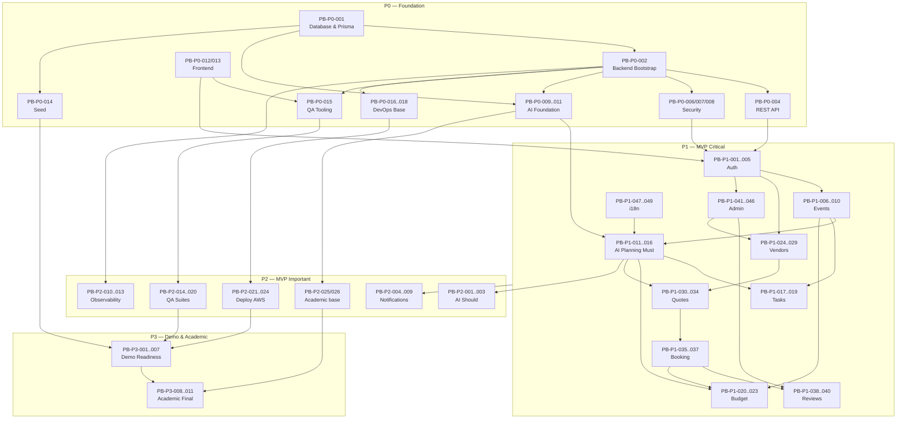

# EventFlow — Product Backlog Prioritized

> **Versión:** 1.0
> **Fecha:** 2026-06-09
> **Producto:** EventFlow — workspace de planificación de eventos asistido por IA con flujo simplificado de cotización de proveedores.
> **MVP target:** AI-assisted event planning workspace + simplified vendor quote flow.
> **Idioma del documento:** Español LATAM neutral.
> **Audiencia:** Product Owner, Business Analyst, Scrum Master, Tech Lead, Backend/Frontend Engineers, AI Engineers, QA, DevOps, evaluadores académicos AI4Devs, agentes IA generadores de development tasks.

---

## 1. Propósito del documento

Este artefacto transforma el [Epic Map](./EventFlow-Epic-Map.md), la [User Stories Coverage Matrix](./User-Stories-Coverage-Matrix.md) y el [Product Backlog Prioritization Input](./Product-Backlog-Prioritization-Input.md) en un **backlog priorizado, accionable y trazable** para EventFlow MVP.

Su finalidad es servir como insumo directo para:

1. **MVP planning** y definición del cutline P1/P2.
2. **Sprint planning** y armado del roadmap por release.
3. **Generación de Development Tasks** por backlog item.
4. **Refinamiento de Acceptance Criteria** por User Story.
5. **Estimación** (story points / WSJF) y asignación a sprints.
6. **QA test planning** y definición de quality gates.
7. **Demo readiness** y trazabilidad académica para evaluación AI4Devs.
8. **Agentes IA** que generarán tareas de desarrollo y código sobre cada backlog item.

Este documento **no inventa user stories nuevas** fuera de la matriz de cobertura; agrupa, prioriza y enriquece las 150 historias existentes con decisiones del Product Owner, dependencias, criterios de aceptación de alto nivel y trazabilidad documental.

---

## 2. Fuentes utilizadas

### 2.1 Fuentes primarias

| # | Documento | Aporte al backlog |
|---:|---|---|
| 1 | [`management/artifacts/EventFlow-Epic-Map.md`](./EventFlow-Epic-Map.md) | Catálogo de 24 épicas, dependencias y prioridades canónicas. |
| 2 | [`management/artifacts/User-Stories-Coverage-Matrix.md`](./User-Stories-Coverage-Matrix.md) | 150 User Stories que cubren el 100% del Epic Map. |
| 3 | [`management/artifacts/Product-Backlog-Prioritization-Input.md`](./Product-Backlog-Prioritization-Input.md) | Decisiones PO de scope, parámetros operacionales y reglas funcionales. |

### 2.2 Fuentes de soporte (consultadas para trazabilidad)

| # | Documento | Uso |
|---:|---|---|
| 4 | `docs/3-MVP-Scope-Definition.md` | Alcance y exclusiones MVP. |
| 5 | `docs/4-Business-Rules-Document.md` | Reglas BR-*. |
| 6 | `docs/5-User-Roles-Permissions-Matrix.md` | Roles y permisos. |
| 7 | `docs/8-Use-Cases-Specification.md` | Use Cases UC-*. |
| 8 | `docs/9-Functional-Requirements-Document.md` | Requisitos funcionales FR-*. |
| 9 | `docs/10-Non-Functional-Requirements.md` | NFR-* (performance, IA, seguridad, observabilidad). |
| 10 | `docs/11-Data-Seed-Strategy.md` | Estrategia de seed y demo readiness. |
| 11 | `docs/12-Architecture-Vision-and-Principles.md` | Principios arquitectónicos. |
| 12 | `docs/13-System-Architecture-Document.md` | C4 L1/L2/L3, módulos backend. |
| 13 | `docs/14-Backend-Technical-Design.md` | Diseño backend (Node + Express + Prisma). |
| 14 | `docs/15-Frontend-Architecture-Design.md` | Diseño frontend (Next.js App Router + TanStack Query). |
| 15 | `docs/16-API-Design-Specification.md` | Contratos REST. |
| 16 | `docs/17-AI-Architecture-and-PromptOps-Design.md` | Arquitectura IA y PromptOps. |
| 17 | `docs/18-Database-Physical-Design.md` | Diseño físico PostgreSQL + Prisma. |
| 18 | `docs/19-Security-and-Authorization-Design.md` | Seguridad, RBAC, ownership. |
| 19 | `docs/20-Testing-Strategy.md` | Estrategia de testing y QA. |
| 20 | `docs/21-Deployment-and-DevOps-Design.md` | Despliegue en AWS, CI/CD. |
| 21 | `docs/22-Architecture-Decision-Records.md` | ADRs vinculantes. |

---

## 3. Principios de priorización

El orden del backlog se rige por los siguientes principios, en orden de precedencia:

1. **Foundation antes que producto.** Sin backend, DB, API, security y AI foundation, ninguna épica de producto puede entregarse de forma confiable. P0 desbloquea todo lo demás.
2. **MVP-first / cutline disciplinado.** Sólo entran al MVP las historias cuya ausencia rompería el flujo demostrable end-to-end o el cumplimiento académico. Lo demás se difiere a Future / v1.1.
3. **Demo-first.** El camino crítico de la demo guiada (Auth → Event → AI Plan → Tasks → Budget → Vendors → QuoteRequest → Quote → Compare → Booking → Review) tiene prioridad operativa sobre features adyacentes.
4. **Human-in-the-loop obligatorio para IA.** Ninguna sugerencia IA se convierte en dato oficial sin aceptación humana. `AIRecommendation` persiste la trazabilidad completa.
5. **Backend como source of truth de autorización.** RBAC, ownership y assignment se enforcement en backend; el frontend solo refleja la UX.
6. **Seed-first demo.** El MVP debe ser reproducible sin captación real de usuarios o vendors. Seed idempotente desde P0.
7. **No marketplace transaccional.** Sin pagos reales, contratos firmados, e-signature, chat real-time, WhatsApp, push o KYC en MVP.
8. **Trazabilidad obligatoria.** Cada backlog item referencia FR/UC/BR/NFR/ADR cuando aplica.
9. **Riesgo temprano.** IA, seguridad, DB, API y seed se validan en P0 para evitar sorpresas tardías.
10. **Anti scope creep.** Cualquier promoción de un Future a MVP requiere ADR explícito y reaprobación PO.
11. **Quality gates como contrato de calidad.** QA, observabilidad y seguridad no son polish tardío; son parte del DoD.
12. **Evidencia académica continua.** ADRs, prompts versionados y trazabilidad se mantienen durante todo el desarrollo, no al final.

---

## 4. Decisiones PO aplicadas

### 4.1 Decisiones de scope

| User Story | Tema | Decisión PO aplicada | Resultado en backlog |
|---|---|---|---|
| US-008 | Login con Google | Diferir a **P4 / Future / v1.1**. | Movida a Backlog P4 — no entra al MVP. |
| US-023 | Vendor genera bio/paquetes con IA | Diferir a **P4 / Future / v1.1**. | Movida a Backlog P4 — no entra al MVP. |
| US-022 | Resumen IA del comparador | Mantener en **P2 / Should Have**. | Incluida en Backlog P2. |
| US-024 | Top 3 tareas urgentes IA | Mantener en **P2 / Should Have**. | Incluida en Backlog P2. |
| US-026 | Regenerar sugerencia con feedback | Mantener en **P2 / Should Have**. | Incluida en Backlog P2. |

### 4.2 Decisiones operacionales

| Decisión | Valor aplicado | Story | Notas para AC / Tasks |
|---|---|---|---|
| Máx regeneraciones IA por sugerencia | **5** | US-026 | Configurable por env var; error controlado al exceder. |
| Máx IDs por bulk task confirmation | **50** | US-031 | Evita payloads grandes. |
| Máx validez de Quote | **90 días calendario** | US-053 | Backend rechaza si vendor envía más. |
| Validez default cuando vendor no especifica | **15 días calendario** | US-053 | Decisión PO 8.1 #4. |
| Días sin respuesta para expirar QR | **30 días calendario** | US-055 | Job diario marca `expired`. |
| Lifetime cookie de sesión | **30 días** | US-003 | HTTP-only, Secure, SameSite=Lax. |
| Lifetime token reset password | **30 minutos** | US-004 | Token de un solo uso, hash en DB. |
| AutoCompleteEventsJob | **00:30 UTC diario** | US-015 | 2 días post `event_date`. |
| EmitT7NotificationsJob | **08:00 hora local del evento** | US-034 | Fallback `America/Guatemala`. |
| QuoteExpirationJob / QuoteRequestExpirationJob | **01:00 UTC diario** | US-055 | Debe ser idempotente. |

### 4.3 Decisiones funcionales

| User Story | Regla aplicada |
|---|---|
| US-010 | Si cambia `event_date`, **preservar overrides manuales** del usuario; sólo recalcular tareas IA/sistema no editadas manualmente. Mostrar aviso de impacto antes de confirmar. |
| US-011 | Al cancelar un evento, los `BookingIntent` y `QuoteRequest` activos asociados pasan a `cancelled` con notificación in-app + email simulado. Sin penalización en plataforma. |
| US-056 | No permitir cancelar una `QuoteRequest` si existe un `BookingIntent.confirmed_intent` asociado. Sí permitir si sólo hay quotes sin booking confirmado. |
| US-065 | Ventana para crear reseña: **30 días calendario** post `event.completed`. Requiere `BookingIntent.confirmed_intent`. |
| US-006 | Cambio de contraseña invalida **otras sesiones activas**; la actual puede mantenerse o reautenticarse. |
| US-007 | Selector de idioma con nombres nativos (`Español LATAM`, `Español`, `Português`, `English`) mapeados a `es-LATAM`, `es-ES`, `pt`, `en`. |
| US-041 | Cambios mayores del perfil vendor (nombre comercial, ciudad, categorías, servicios principales, visibilidad) regresan a revisión admin. |
| US-077 | Moderación de reseñas por admin **no envía notificaciones** en MVP. Queda auditada en `AdminAction`. |
| Transversal | Toda salida IA es human-in-the-loop. Backend es source of truth de RBAC/ownership. Seed/demo solo disponible en contextos seguros. |

### 4.4 Decisiones técnicas / académicas

| User Story | Decisión |
|---|---|
| US-098 | Generar OpenAPI con `zod-to-openapi` o equivalente; snapshot en CI. |
| US-115 | Métricas IA en **JSON estructurado** para MVP (Prometheus/OTel = Future). |
| US-144 | Documentar toggle Mock/OpenAI en runbook de demo. |
| US-145 | Seed debe incluir ≥1 `BookingIntent.confirmed_intent` visible y ≥1 reseña verificada del vendor demo principal. |
| US-148 | Mantener matriz canónica `User-Stories-Traceability-Matrix.md`. |
| US-149 | Mantener catálogo sanitizado `AI-Prompt-Evidence-Catalog.md`. |

---

## 5. Modelo de prioridad

| Prioridad | Significado | Cuándo se entrega |
|---|---|---|
| **P0** | Foundation / blocking. Sin esto nada funciona. | Release 0 — antes del producto. |
| **P1** | MVP critical. Camino crítico del demo end-to-end. | Releases 1–3 — núcleo del MVP. |
| **P2** | MVP important. Necesario para MVP pleno, QA, observabilidad o calidad fuerte. | Releases 2–3 — en paralelo a P1 tardío. |
| **P3** | Demo polish / academic. Mejora presentación, trazabilidad y evaluación. | Release 4 — antes de la demo final. |
| **P4** | Future / Out of Scope. No se incluye en MVP. | v1.1 o posterior. |

---

## 6. Vista ejecutiva del backlog

### 6.1 Resumen por prioridad

| Priority | Count | Focus | Expected Delivery Value |
|---|---:|---|---|
| **P0** | 18 | Foundation técnica: DB, backend, API, security, AI, frontend, seed, DevOps base | Desbloquea todo el producto; valida riesgo técnico temprano. |
| **P1** | 49 | Camino crítico MVP: auth, eventos, IA must, tasks, budget, vendors, quotes, comparison, booking, reviews, admin, i18n | Demo end-to-end funcional con valor de usuario completo. |
| **P2** | 26 | IA important, notificaciones, observability, QA hardening, deploy AWS | MVP robusto, demostrable y observable. |
| **P3** | 11 | Demo readiness y entrega académica | Demo guiada reproducible + evidencia AI4Devs. |
| **P4** | 13+ | Future / Out of Scope | Diferido fuera del MVP. |
| **Total MVP (P0+P1+P2+P3)** | **104** | | |

### 6.2 Resumen por tipo

| Type | Count | Notes |
|---|---:|---|
| **Product** | ~63 | Funcionalidad orientada a valor de usuario. |
| **Technical** | ~18 | Foundation backend, DB, frontend, API, observability. |
| **AI** | ~10 | LLMProvider, prompts, AIRecommendation, features IA. |
| **Security** | ~4 | Cookies, captcha, rate limit, RBAC tests. |
| **QA** | ~8 | Test tooling, suites unit/integration/E2E/AI/RBAC/A11Y, quality gates. |
| **DevOps** | ~9 | Docker, CI/CD, AWS deploy, secrets, monitoring, migrations. |
| **Demo** | ~7 | Seed reset, guion, checklist, toggle, smoke, métricas demo. |
| **Academic** | ~4 | ADR index, traceability, prompt catalog, evidence report. |

---

## 7. Backlog P0 — Foundation / Blocking

> **Orden de implementación sugerido:** DB → Backend → API → Security → AI → Frontend → Seed → DevOps base.

---

### PB-P0-001 — Database Schema, Migrations & Constraints

| Campo | Valor |
|---|---|
| Backlog ID | PB-P0-001 |
| Priority | P0 |
| Epic | EPIC-DB-001 |
| Related User Stories | US-099, US-100, US-101, US-102 |
| Title | Implementar schema Prisma + PostgreSQL alineado al Domain Data Model |
| Description | Definir el schema Prisma completo por dominio (User, Event, EventType, EventTask, Budget, BudgetItem, VendorProfile, VendorService, Attachment, QuoteRequest, Quote, BookingIntent, Review, Notification, ServiceCategory, AdminAction, AIRecommendation, AIPromptVersion), generar migraciones base, implementar índices críticos y validar los 62 constraints C-001..C-062. Nota: el portafolio del vendor (`VendorWork`) se cubre con `Attachment` polimórfico (Doc 6 §6); la entidad canónica de tarea es `EventTask` (alineación US-099). |
| User Value / Delivery Value | Sin DB no hay persistencia. Habilita todo flujo de producto, IA, admin y seed. |
| Primary Role | System |
| Type | Technical |
| MoSCoW | Must Have |
| Dependencies | — (foundation) |
| Acceptance Summary | - Schema Prisma cubre todas las entidades MVP de Doc 6/18. - Migraciones reproducibles up/down. - Índices en columnas críticas (FK, status, fechas). - Constraints C-001..C-062 enforced (unique, FK, check, soft delete). - Tests de constraints pasan en CI. |
| Traceability | FR transversal · BR transversal · Doc 6, Doc 18 · ADR-DB-001 |
| Notes | Soft delete obligatorio en Attachment y Review (Decisión PO 8.1 #19). `is_seed` en todas las entidades. |

---

### PB-P0-002 — Backend Modular Monolith Bootstrap

| Campo | Valor |
|---|---|
| Backlog ID | PB-P0-002 |
| Priority | P0 |
| Epic | EPIC-BE-001 |
| Related User Stories | US-089, US-090, US-091 |
| Title | Inicializar backend Node + Express + TypeScript con arquitectura Clean/Hexagonal |
| Description | Bootstrap del servidor Express, estructura feature-first con capas Interface/Application/Domain/Ports/Infrastructure, configuración por env vars, shared kernel y pipeline base de middlewares (correlation, logging, auth, role, ownership, validation, rate limit, captcha, upload, error handler). |
| User Value / Delivery Value | Backbone técnico para todos los endpoints REST. Sin esto no hay producto. |
| Primary Role | System |
| Type | Technical |
| MoSCoW | Must Have |
| Dependencies | — |
| Acceptance Summary | - Proyecto Node + Express + TS inicializado y compilable. - Carpetas por dominio siguiendo Clean/Hex (Doc 14). - Middlewares ordenados correctamente. - Endpoint `/healthz` operativo. - Lint, typecheck y test runner configurados. |
| Traceability | Doc 12, Doc 13, Doc 14 · ADR-ARCH-001 |
| Notes | Sin BFF, sin microservicios. Modular monolith. |

---

### PB-P0-003 — Backend Validation, Error Envelope & Logger

| Campo | Valor |
|---|---|
| Backlog ID | PB-P0-003 |
| Priority | P0 |
| Epic | EPIC-BE-001 |
| Related User Stories | US-092, US-093 |
| Title | Validación Zod y error envelope unificado |
| Description | Implementar validación de DTOs request/response con Zod, error envelope estándar con códigos consistentes, logger estructurado base y propagación de correlation ID por request. |
| User Value / Delivery Value | Contratos consistentes para frontend y agentes IA; errores predecibles; trazabilidad de requests. |
| Primary Role | System |
| Type | Technical |
| MoSCoW | Must Have |
| Dependencies | PB-P0-002 |
| Acceptance Summary | - Todo DTO valida con Zod en el borde HTTP. - Error envelope `{code, message, details}` aplicado en handler global. - Correlation ID generado o propagado por request. - Tests del error envelope cubren 4xx y 5xx. |
| Traceability | Doc 14, Doc 16 · NFR-API-* |
| Notes | El error envelope es contrato con frontend MSW y agentes IA. |

---

### PB-P0-004 — REST API Endpoints Foundation (Doc 16)

| Campo | Valor |
|---|---|
| Backlog ID | PB-P0-004 |
| Priority | P0 |
| Epic | EPIC-API-001 |
| Related User Stories | US-094, US-095, US-096, US-097 |
| Title | Implementar endpoints REST AUTH / EVENT / QUOTE / AI alineados a Doc 16 |
| Description | Implementar las rutas `/api/v1/auth/*`, `/api/v1/events/*`, `/api/v1/quote-requests/*`, `/api/v1/quotes/*`, `/api/v1/booking-intents/*` y `/api/v1/events/:id/ai/*` con DTOs, paginación, filtros estándar y `aiMeta` cuando aplica. |
| User Value / Delivery Value | Contrato REST que consumirán frontend, MSW de tests y agentes IA. |
| Primary Role | System |
| Type | Technical |
| MoSCoW | Must Have |
| Dependencies | PB-P0-002, PB-P0-003 |
| Acceptance Summary | - Endpoints de Doc 16 implementados y testeados con Supertest. - Paginación cursor o page-based. - LLM nunca llamado desde frontend (backend-only). - Versión `/api/v1` como prefijo único. |
| Traceability | Doc 16 · NFR-API-* · ADR-API-001 |
| Notes | Endpoints de auth/event/quote/AI son la base; admin/review/notification se incorporan en P1. |

---

### PB-P0-005 — OpenAPI Snapshot desde Zod

| Campo | Valor |
|---|---|
| Backlog ID | PB-P0-005 |
| Priority | P0 |
| Epic | EPIC-API-001 |
| Related User Stories | US-098 |
| Title | Generar OpenAPI snapshot automatizado |
| Description | Generar especificación OpenAPI 3.x desde los esquemas Zod usando `zod-to-openapi` o equivalente. Snapshot versionado y validado en CI. |
| User Value / Delivery Value | Evita drift entre contrato y código; habilita generación de clients y validación contractual. |
| Primary Role | System |
| Type | Technical |
| MoSCoW | Should Have |
| Dependencies | PB-P0-004 |
| Acceptance Summary | - Comando CI genera `openapi.json`. - Diff en PR detecta cambios contractuales. - Documentación accesible localmente (Swagger UI opcional). |
| Traceability | Doc 16 · Decisión técnica PO US-098 |
| Notes | Decisión PO: usar `zod-to-openapi`. Snapshot en repo. |

---

### PB-P0-006 — Security Cookies HTTP-Only + Captcha

| Campo | Valor |
|---|---|
| Backlog ID | PB-P0-006 |
| Priority | P0 |
| Epic | EPIC-SEC-001 |
| Related User Stories | US-108, US-109 |
| Title | Cookies firmadas HTTP-only + captcha en auth |
| Description | Configurar cookies `HttpOnly`, `Secure` (en entornos no-locales), `SameSite=Lax`, firmadas. Integrar captcha (reCAPTCHA v3 / hCaptcha) en registro y login conforme a Decisión PO 8.1 #8. Modo fake en test, real en preview/Demo. |
| User Value / Delivery Value | Protección base de sesión y anti-bot. Habilita registro/login seguros. |
| Primary Role | System |
| Type | Security |
| MoSCoW | Must Have |
| Dependencies | PB-P0-002, PB-P0-004 |
| Acceptance Summary | - Cookie de sesión cumple política HTTP-only/Secure/SameSite. - Lifetime cookie sesión: 30 días. - Captcha verificable en registro y login. - Tests con captcha fake en CI; real en preview. |
| Traceability | Doc 19 · BR-AUTH-* · Decisión PO 8.1 #8 · ADR-SEC-001 |
| Notes | No exponer existencia de cuenta en errores. |

---

### PB-P0-007 — Rate Limiting & Middleware Chain

| Campo | Valor |
|---|---|
| Backlog ID | PB-P0-007 |
| Priority | P0 |
| Epic | EPIC-SEC-001 |
| Related User Stories | US-110, US-111 |
| Title | Rate limiting en login/recovery/AI y cadena de middlewares en orden |
| Description | Configurar rate limiting en endpoints sensibles (login, password recovery, AI generations). Validar orden de middlewares: `correlation → logging → auth → role → ownership → policy → validation → handler`. Headers de seguridad con Helmet. |
| User Value / Delivery Value | Mitigación de abuso, fuerza bruta y costo IA descontrolado. |
| Primary Role | System |
| Type | Security |
| MoSCoW | Must Have |
| Dependencies | PB-P0-006 |
| Acceptance Summary | - Rate limit configurado por endpoint sensible. - Test de orden de middlewares verifica que ownership corre después de auth/role. - Helmet aplicado globalmente. |
| Traceability | Doc 19 · NFR-SEC-* · ADR-SEC-001 |
| Notes | Rate limit IA protege costo OpenAI. |

---

### PB-P0-008 — RBAC + Ownership Negative Tests

| Campo | Valor |
|---|---|
| Backlog ID | PB-P0-008 |
| Priority | P0 |
| Epic | EPIC-SEC-001 |
| Related User Stories | US-112 |
| Title | Suite de tests negativos de RBAC + ownership |
| Description | Construir suite que valida que cada endpoint protegido devuelve 401/403/404 ante rol incorrecto, recurso ajeno o assignment inválido. Backend es la única fuente de verdad. |
| User Value / Delivery Value | Garantiza que la seguridad no depende del frontend ni de la UX. |
| Primary Role | System |
| Type | Security |
| MoSCoW | Must Have |
| Dependencies | PB-P0-004, PB-P0-006 |
| Acceptance Summary | - 100% endpoints sensibles cubiertos con al menos 1 caso negativo. - Tests corren en CI como quality gate. - 403/404 con error envelope estándar (sin leak de datos). |
| Traceability | Doc 19 · BR-AUTH-011 · ADR-SEC-001 |
| Notes | Suite negativa no es opcional. Bloquea merge si falla. |

---

### PB-P0-009 — LLMProvider Port + Adapters (OpenAI + Mock + Anthropic Stub)

| Campo | Valor |
|---|---|
| Backlog ID | PB-P0-009 |
| Priority | P0 |
| Epic | EPIC-AI-001 |
| Related User Stories | US-117, US-118, US-119, US-120 |
| Title | Implementar puerto `LLMProvider` y los 3 adapters |
| Description | Definir el puerto `LLMProvider`. Implementar `OpenAIProvider` (principal MVP), `MockAIProvider` (determinista para tests y demo) y `AnthropicProvider` (stub conforme Decisión PO 8.1 #15). Selector por env var `LLM_PROVIDER`. |
| User Value / Delivery Value | Independencia de provider, tests deterministas y demo robusta sin dependencia de OpenAI. |
| Primary Role | System |
| Type | AI |
| MoSCoW | Must Have |
| Dependencies | PB-P0-002 |
| Acceptance Summary | - Contrato `LLMProvider` documentado. - 3 adapters operativos (Anthropic puede lanzar `NotImplemented`). - Selector env var probado. - Backend-only: frontend nunca llama al provider. |
| Traceability | Doc 7, Doc 17 · BR-AI-001..015 · Decisión PO 8.1 #15 · ADR-AI-001 |
| Notes | MockAIProvider obligatorio para CI y modo demo. |

---

### PB-P0-010 — Prompt Registry & AIRecommendation Persistence

| Campo | Valor |
|---|---|
| Backlog ID | PB-P0-010 |
| Priority | P0 |
| Epic | EPIC-AI-001 |
| Related User Stories | US-121, US-122 |
| Title | Prompt registry versionado + persistencia `AIRecommendation` |
| Description | Implementar prompt registry estático versionado en código y tabla `AIPromptVersion` (recomendada). Persistir cada generación IA en `AIRecommendation` con `prompt_version`, `provider`, `language`, `fallback_used`, `timeout_ms`, status (`pending/accepted/edited/rejected/discarded`). |
| User Value / Delivery Value | Trazabilidad IA completa para HITL, observabilidad y evidencia académica. |
| Primary Role | System |
| Type | AI |
| MoSCoW | Must Have |
| Dependencies | PB-P0-001, PB-P0-009 |
| Acceptance Summary | - Cada call IA escribe una `AIRecommendation`. - Prompt registry expone `getPrompt(featureId, version)`. - Sin datos PII no necesarios en prompts (minimización). |
| Traceability | Doc 17 · BR-AI-005..015 · NFR-OBS-* · ADR-AI-001 |
| Notes | Insumo crítico para evidencia AI4Devs (PB-P3-010). |

---

### PB-P0-011 — AI Timeout, Fallback & JSON Validation

| Campo | Valor |
|---|---|
| Backlog ID | PB-P0-011 |
| Priority | P0 |
| Epic | EPIC-AI-001 |
| Related User Stories | US-123, US-124 |
| Title | Timeout 60s, fallback Mock en modo demo y validación JSON con 1 reintento |
| Description | Aplicar timeout de 60_000 ms (Decisión PO 8.1 #9), fallback automático a `MockAIProvider` cuando `AI_DEMO_MODE=true` o falla el provider primario, validación estricta del JSON de salida con Zod y un único reintento controlado ante parse error. |
| User Value / Delivery Value | Resiliencia de demo; protección contra outputs malformados; tests reproducibles. |
| Primary Role | System |
| Type | AI |
| MoSCoW | Must Have |
| Dependencies | PB-P0-009, PB-P0-010 |
| Acceptance Summary | - Timeout 60s verificable con clock injectable. - Fallback a Mock loguea `fallback_used=true`. - 1 reintento ante JSON inválido; segundo fallo cae a fallback o error controlado. - Tests deterministas en CI. |
| Traceability | Doc 17 · BR-AI-007..010 · Decisión PO 8.1 #9 |
| Notes | Sin este item, la demo es frágil. Crítico para confiabilidad. |

---

### PB-P0-012 — Frontend Next.js Bootstrap & i18n

| Campo | Valor |
|---|---|
| Backlog ID | PB-P0-012 |
| Priority | P0 |
| Epic | EPIC-FE-001 |
| Related User Stories | US-103, US-104, US-105 |
| Title | Next.js App Router + TypeScript + Tailwind + next-intl con route groups por rol |
| Description | Bootstrap de la app Next.js con App Router, TypeScript, Tailwind + design tokens, next-intl con 4 locales (`es-LATAM`, `es-ES`, `pt`, `en`) y route groups por rol (`organizer`, `vendor`, `admin`, `public`). Server Components por defecto en áreas SEO; Client en autenticadas. |
| User Value / Delivery Value | Aplicación frontend lista para construir features por rol y multi-idioma desde día 1. |
| Primary Role | System |
| Type | Technical |
| MoSCoW | Must Have |
| Dependencies | — |
| Acceptance Summary | - App Next.js arranca en `npm run dev`. - 4 locales con diccionarios base. - Route groups por rol no se mezclan. - Lighthouse SEO básico OK en página pública. |
| Traceability | Doc 15 · NFR-A11Y-* · NFR-I18N-* · ADR-FE-001 |
| Notes | Sin BFF, sin Server Actions como proxy a OpenAI. |

---

### PB-P0-013 — Frontend Data Layer: TanStack Query + MSW + Layouts

| Campo | Valor |
|---|---|
| Backlog ID | PB-P0-013 |
| Priority | P0 |
| Epic | EPIC-FE-001 |
| Related User Stories | US-106, US-107 |
| Title | TanStack Query + RHF + Zod + MSW + layouts por rol |
| Description | Configurar TanStack Query como data layer, React Hook Form + Zod para formularios, MSW para mocking en dev y tests, y definir layouts/navegación específicos por rol (Organizer, Vendor, Admin). |
| User Value / Delivery Value | Patrones consistentes de data fetching, formularios y mocks; desarrollo frontend desacoplado del backend. |
| Primary Role | System |
| Type | Technical |
| MoSCoW | Must Have |
| Dependencies | PB-P0-012 |
| Acceptance Summary | - TanStack Query con QueryClient global. - MSW corre en dev y en suite de tests. - Layouts por rol con navegación específica. - Smoke por route group pasa. |
| Traceability | Doc 15 · ADR-FE-001 |
| Notes | MSW alineado al contrato OpenAPI de PB-P0-005. |

---

### PB-P0-014 — Seed Script Idempotente + Datos Demo

| Campo | Valor |
|---|---|
| Backlog ID | PB-P0-014 |
| Priority | P0 |
| Epic | EPIC-SEED-001 |
| Related User Stories | US-085, US-086, US-087, US-088 |
| Title | Seed reproducible con organizadores, vendors, eventos, quotes, booking y reseñas |
| Description | Implementar `npm run seed` idempotente que crea 5–10 organizadores, 10–20 vendors aprobados, 10–15 eventos (mix de `draft/active/completed`), 10–15 categorías, 15–25 QuoteRequests, 10–20 Quotes, ≥1 `BookingIntent.confirmed_intent`, 20–40 reseñas. Todas las entidades marcadas con `is_seed=true`. Datos culturalmente coherentes con LATAM. |
| User Value / Delivery Value | Habilita demo, QA E2E, evaluación académica y onboarding de devs sin captación real. |
| Primary Role | System |
| Type | Technical / Demo |
| MoSCoW | Must Have |
| Dependencies | PB-P0-001 |
| Acceptance Summary | - Ejecutar seed 2 veces no duplica registros. - Volúmenes mínimos cumplidos. - Cobertura de estados `draft/active/completed`. - ≥1 `confirmed_intent` y ≥1 reseña verificada visible. |
| Traceability | Doc 11 · BR-SEED-001..010 · ADR-DEVOPS-* |
| Notes | Demo readiness es **dependiente** de este seed. Decisión PO US-145. |

---

### PB-P0-015 — QA Tooling Setup

| Campo | Valor |
|---|---|
| Backlog ID | PB-P0-015 |
| Priority | P0 |
| Epic | EPIC-QA-001 |
| Related User Stories | US-125 |
| Title | Configurar Vitest + Supertest + Playwright + MSW |
| Description | Setup base de tooling de testing: Vitest para unit/integration, Supertest para API, Playwright para E2E y MSW para contract/mocking. Configuración compartida y scripts npm. |
| User Value / Delivery Value | Permite implementar quality gates desde el primer commit; reduce bugs tardíos. |
| Primary Role | System |
| Type | QA |
| MoSCoW | Must Have |
| Dependencies | PB-P0-002, PB-P0-012 |
| Acceptance Summary | - `npm test` corre Vitest. - `npm run test:e2e` corre Playwright. - MSW configurado en suite. - Pipeline CI invoca los 3 niveles. |
| Traceability | Doc 20 · ADR-TEST-001 |
| Notes | Suites concretas se construyen progresivamente en P2. |

---

### PB-P0-016 — Dockerfile Backend

| Campo | Valor |
|---|---|
| Backlog ID | PB-P0-016 |
| Priority | P0 |
| Epic | EPIC-OPS-001 |
| Related User Stories | US-133 |
| Title | Dockerfile multi-stage para backend |
| Description | Crear Dockerfile multi-stage del backend Node + Express con build optimizado, capas cacheables y usuario no-root. Health check command incluido. |
| User Value / Delivery Value | Habilita deploy reproducible en App Runner/Elastic Beanstalk y pipelines CI/CD. |
| Primary Role | System |
| Type | DevOps |
| MoSCoW | Must Have |
| Dependencies | PB-P0-002 |
| Acceptance Summary | - Imagen construye sin warnings. - Tamaño razonable (multi-stage). - Container arranca con `/healthz` OK. - Sin secrets en la imagen. |
| Traceability | Doc 21 · NFR-PERF-* · ADR-DEVOPS-001 |
| Notes | Frontend va por Amplify (no requiere Dockerfile MVP). |

---

### PB-P0-017 — GitHub Actions CI Pipeline (lint/test/build)

| Campo | Valor |
|---|---|
| Backlog ID | PB-P0-017 |
| Priority | P0 |
| Epic | EPIC-OPS-001 |
| Related User Stories | US-134 |
| Title | Pipeline CI: lint, typecheck, tests, build |
| Description | Workflow GitHub Actions que ejecuta lint, typecheck, unit/integration tests, build backend (Docker) y build frontend. Bloquea merge si falla. Cache de dependencias. |
| User Value / Delivery Value | Detecta regresiones antes del merge; base para deploy automatizado. |
| Primary Role | System |
| Type | DevOps |
| MoSCoW | Must Have |
| Dependencies | PB-P0-002, PB-P0-012, PB-P0-015, PB-P0-016 |
| Acceptance Summary | - Workflow corre en PR a `main`. - Lint + typecheck + tests + build verde para merge. - Cache npm/pnpm activo. - Estado visible en checks. |
| Traceability | Doc 21 · ADR-DEVOPS-001 |
| Notes | Deploy a AWS se incorpora en P2 (PB-P2-023..026). |

---

### PB-P0-018 — Prisma Migrations en Pipeline

| Campo | Valor |
|---|---|
| Backlog ID | PB-P0-018 |
| Priority | P0 |
| Epic | EPIC-OPS-001 |
| Related User Stories | US-139 |
| Title | Migraciones Prisma ejecutadas automáticamente en CI/CD |
| Description | Step en pipeline que aplica `prisma migrate deploy` contra la base de datos del entorno objetivo (CI/QA/Demo). Validación de migraciones reversibles cuando aplica. |
| User Value / Delivery Value | Deploy seguro y reproducible del schema; protege integridad entre entornos. |
| Primary Role | System |
| Type | DevOps |
| MoSCoW | Must Have |
| Dependencies | PB-P0-001, PB-P0-017 |
| Acceptance Summary | - `migrate deploy` aplica en CI sin intervención manual. - Drift detectado en PR. - Rollback documentado. - Tests post-migración OK. |
| Traceability | Doc 18, Doc 21 · ADR-DB-001 · ADR-DEVOPS-001 |
| Notes | Habilita poder correr seed en CI/Demo. |

---

## 8. Backlog P1 — MVP Critical Path

> **Orden de implementación sugerido:** Auth → Event → AI Planning → Tasks → Budget → Vendors → Quotes → Comparison & Booking → Reviews → Admin → i18n.

---

### PB-P1-001 — Registro Organizador con captcha

| Campo | Valor |
|---|---|
| Backlog ID | PB-P1-001 |
| Priority | P1 |
| Epic | EPIC-AUTH-001 |
| Related User Stories | US-001 |
| Title | Registrarme como organizador con email + password + captcha |
| Description | Flujo de registro de Organizador con email, password, nombre, captcha obligatorio y rol `organizer`. Envío de email de bienvenida simulado. |
| User Value / Delivery Value | Punto de entrada principal del MVP para el rol con mayor recorrido funcional. |
| Primary Role | Organizer (Anonymous → Organizer) |
| Type | Product |
| MoSCoW | Must Have |
| Dependencies | PB-P0-004, PB-P0-006 |
| Acceptance Summary | - Validación de password fuerte (Argon2/bcrypt). - Captcha verificado en backend. - Email único enforced. - Rol `organizer` asignado. - Email simulado de bienvenida en log. |
| Traceability | FR-AUTH-001..003 · UC-AUTH-001 · BR-AUTH-001..006 · Decisión PO 8.1 #8 |
| Notes | Sin verificación de email obligatoria en MVP. |

---

### PB-P1-002 — Registro Vendor con captcha

| Campo | Valor |
|---|---|
| Backlog ID | PB-P1-002 |
| Priority | P1 |
| Epic | EPIC-AUTH-001 |
| Related User Stories | US-002 |
| Title | Registrarme como proveedor con captcha |
| Description | Flujo de registro de Vendor con email, password, nombre, captcha y rol `vendor`. Tras registro, el usuario aterriza en formulario de creación de `VendorProfile` (pendiente de aprobación). |
| User Value / Delivery Value | Habilita onboarding del lado de oferta. |
| Primary Role | Vendor (Anonymous → Vendor) |
| Type | Product |
| MoSCoW | Must Have |
| Dependencies | PB-P0-004, PB-P0-006 |
| Acceptance Summary | - Rol `vendor` asignado. - Redirección a creación de `VendorProfile`. - Captcha verificado backend. |
| Traceability | FR-AUTH-001..003 · UC-AUTH-002 · BR-VENDOR-001 |
| Notes | El perfil queda en `pending` hasta aprobación admin. |

---

### PB-P1-003 — Login con email/password + logout

| Campo | Valor |
|---|---|
| Backlog ID | PB-P1-003 |
| Priority | P1 |
| Epic | EPIC-AUTH-001 |
| Related User Stories | US-003, US-005 |
| Title | Iniciar y cerrar sesión |
| Description | Login con email + password con mensajes genéricos. Cookie HTTP-only firmada (30 días). Captcha condicional tras N intentos fallidos. Logout explícito invalida la cookie. |
| User Value / Delivery Value | Acceso recurrente a la plataforma. |
| Primary Role | Cross-role |
| Type | Product |
| MoSCoW | Must Have |
| Dependencies | PB-P0-006, PB-P0-007 |
| Acceptance Summary | - Mensajes de error genéricos (no leak de existencia de cuenta). - Cookie 30 días, HTTP-only. - Logout limpia cookie. - Captcha aparece tras N intentos. |
| Traceability | FR-AUTH-004..006 · UC-AUTH-003, UC-AUTH-005 · BR-AUTH-007..009 |
| Notes | Lifetime cookie sesión: 30 días (Decisión PO US-003). |

---

### PB-P1-004 — Recuperación de contraseña

| Campo | Valor |
|---|---|
| Backlog ID | PB-P1-004 |
| Priority | P1 |
| Epic | EPIC-AUTH-001 |
| Related User Stories | US-004 |
| Title | Recuperar mi contraseña vía email simulado |
| Description | Solicitud de reset envía token de un solo uso con vida de 30 minutos (almacenado hasheado). Email simulado vía `MockEmailService`. Link redirige a formulario de nueva contraseña. |
| User Value / Delivery Value | Recuperación autoservida sin soporte humano. |
| Primary Role | Cross-role |
| Type | Product |
| MoSCoW | Must Have |
| Dependencies | PB-P1-003 |
| Acceptance Summary | - Token vida 30 min, un solo uso. - Token hasheado en DB. - Email simulado loguea destinatario/contenido. - Cambio de password invalida otras sesiones (US-006). |
| Traceability | FR-AUTH-007..009 · UC-AUTH-004 · BR-AUTH-010 |
| Notes | Decisión PO US-004: 30 minutos. |

---

### PB-P1-005 — Perfil propio + cambio de idioma

| Campo | Valor |
|---|---|
| Backlog ID | PB-P1-005 |
| Priority | P1 |
| Epic | EPIC-AUTH-001 |
| Related User Stories | US-006, US-007 |
| Title | Ver/editar perfil y cambiar idioma preferido |
| Description | Pantalla de perfil para ver/editar nombre, teléfono opcional y idioma preferido entre los 4 soportados. Cambio de contraseña invalida otras sesiones activas. Selector con nombres nativos. |
| User Value / Delivery Value | Personalización mínima del usuario. |
| Primary Role | Cross-role |
| Type | Product |
| MoSCoW | Must Have |
| Dependencies | PB-P1-003 |
| Acceptance Summary | - Email no editable en MVP. - Cambio de password invalida otras sesiones. - Selector idioma: `Español LATAM`, `Español`, `Português`, `English`. - Cambio aplica inmediatamente. |
| Traceability | FR-USER-001..006 · UC-AUTH-006 · BR-USER-006 |
| Notes | Decisión PO US-006 y US-007. |

---

### PB-P1-006 — Wizard de creación de evento

| Campo | Valor |
|---|---|
| Backlog ID | PB-P1-006 |
| Priority | P1 |
| Epic | EPIC-EVT-001 |
| Related User Stories | US-009 |
| Title | Crear un evento mediante wizard de 6 tipos |
| Description | Wizard multi-step que captura tipo (wedding, xv, baptism, baby_shower, birthday, corporate), fecha, número de invitados, ciudad, presupuesto estimado, moneda (local | USD) e idioma. Estado inicial `draft`. Moneda inmutable post-creación. |
| User Value / Delivery Value | Entrada al workspace de planificación; insumo para todos los flujos IA. |
| Primary Role | Organizer |
| Type | Product |
| MoSCoW | Must Have |
| Dependencies | PB-P1-003, PB-P0-001 |
| Acceptance Summary | - 6 tipos soportados. - Moneda inmutable validada en backend y UI. - Validaciones de fecha (futura), invitados > 0. - Evento queda en `draft`. |
| Traceability | FR-EVENT-001..003 · UC-EVENT-001 · BR-EVENT-001..007 |
| Notes | Soporte mínimo de moneda: GTQ, EUR, MXN, COP, USD. |

---

### PB-P1-007 — Ciclo de vida del evento (edit / cancel / soft delete)

| Campo | Valor |
|---|---|
| Backlog ID | PB-P1-007 |
| Priority | P1 |
| Epic | EPIC-EVT-001 |
| Related User Stories | US-010, US-011, US-012 |
| Title | Editar, cancelar y soft-deletear evento |
| Description | Edición de evento `draft`/`active` (excepto moneda). Cancelación de evento `active`: arrastra `BookingIntent` y `QuoteRequest` activos a `cancelled` con notificación. Soft delete sólo en estado `draft`. Cambio de `event_date` preserva overrides manuales de tareas. |
| User Value / Delivery Value | Permite al organizador adaptar el evento al mundo real. |
| Primary Role | Organizer |
| Type | Product |
| MoSCoW | Must Have |
| Dependencies | PB-P1-006 |
| Acceptance Summary | - Moneda inmutable enforced. - Cancel con cascada a Booking/QR activos y notificación. - Soft delete sólo en `draft`. - Cambio de fecha respeta overrides manuales (Decisión PO US-010). - Sin penalización en plataforma (Decisión PO #5). |
| Traceability | FR-EVENT-004..008 · UC-EVENT-002..004 · BR-EVENT-008..014 |
| Notes | Cascada al cancelar evento — Decisión PO US-011. |

---

### PB-P1-008 — Listado, filtros y dashboard del evento

| Campo | Valor |
|---|---|
| Backlog ID | PB-P1-008 |
| Priority | P1 |
| Epic | EPIC-EVT-001 |
| Related User Stories | US-013, US-014 |
| Title | Listar/filtrar eventos y ver dashboard del evento |
| Description | Listado del organizador con filtros por estado y tipo. Vista de dashboard por evento con progreso (% tareas done), próximas tareas, presupuesto comprometido y cotizaciones activas. Oculta `deleted_at`. |
| User Value / Delivery Value | Vista central de control del organizador. |
| Primary Role | Organizer |
| Type | Product |
| MoSCoW | Must Have |
| Dependencies | PB-P1-007, PB-P1-016, PB-P1-019 |
| Acceptance Summary | - Filtros por estado y tipo. - Dashboard agrega progreso, próximas tareas, committed, cotizaciones. - Eventos soft-deleted no se listan. |
| Traceability | FR-EVENT-009..011 · UC-EVENT-005..006 |
| Notes | Surface de US-033 (progreso) y US-039 (committed). |

---

### PB-P1-009 — Job AutoComplete del evento (T+2)

| Campo | Valor |
|---|---|
| Backlog ID | PB-P1-009 |
| Priority | P1 |
| Epic | EPIC-EVT-001 |
| Related User Stories | US-015 |
| Title | Cierre automático del evento 2 días post-fecha |
| Description | Job `AutoCompleteEventsJob` programado diariamente a las 00:30 UTC que cierra eventos `active` con `event_date <= today - 2 días`, marcando `status=completed` y `auto_completed=true`. |
| User Value / Delivery Value | Habilita ventana de reseñas y demo readiness sin acción manual. |
| Primary Role | System |
| Type | Product |
| MoSCoW | Must Have |
| Dependencies | PB-P1-007 |
| Acceptance Summary | - Job programado a 00:30 UTC (Decisión PO). - Clock injectable para tests. - Logs estructurados con conteo. - Idempotente. |
| Traceability | FR-EVENT-012 · UC-EVENT-007 · Decisión PO 8.1 #6 |
| Notes | Reseñas dependen de `completed`. |

---

### PB-P1-010 — Lectura admin de eventos (auditada)

| Campo | Valor |
|---|---|
| Backlog ID | PB-P1-010 |
| Priority | P1 |
| Epic | EPIC-EVT-001 |
| Related User Stories | US-016 |
| Title | Admin visualiza evento en solo lectura con auditoría |
| Description | Endpoint admin para listar y ver detalle de eventos sin posibilidad de edición. Cada acceso registra `view_event` en `AdminAction`. |
| User Value / Delivery Value | Gobernanza con trazabilidad y sin riesgo de manipulación de datos del organizador. |
| Primary Role | Admin |
| Type | Product |
| MoSCoW | Must Have |
| Dependencies | PB-P1-007, PB-P0-001 |
| Acceptance Summary | - Solo lectura (403 si intenta editar). - `AdminAction` con `action=view_event` por cada acceso. - Filtros por estado/tipo. |
| Traceability | FR-EVENT-013 · UC-ADMIN-002 · Decisión PO 8.1 #16 |
| Notes | Surface UI completa en PB-P1-044. |

---

### PB-P1-011 — AI Plan IA del evento (AI-001)

| Campo | Valor |
|---|---|
| Backlog ID | PB-P1-011 |
| Priority | P1 |
| Epic | EPIC-AIP-001 |
| Related User Stories | US-017 |
| Title | Generar plan IA del evento (timeline + categorías) |
| Description | Feature AI-001: a partir del evento, genera plan con timeline (T-180/T-90/T-30/T-7/T-1) y categorías sugeridas. Output marcado como "sugerido por IA". Persistido en `AIRecommendation`. Timeout 60s + fallback Mock. |
| User Value / Delivery Value | Punto de entrada del valor diferencial IA del producto. |
| Primary Role | Organizer |
| Type | AI |
| MoSCoW | Must Have |
| Dependencies | PB-P0-009..011, PB-P1-006 |
| Acceptance Summary | - Output JSON validado con Zod. - Idioma del evento respetado. - HITL: status inicial `pending`. - Trazabilidad completa en `AIRecommendation`. |
| Traceability | FR-AI-001..004 · UC-AI-001 · BR-AI-001..006 · ADR-AI-001 |
| Notes | Demo crítico. |

---

### PB-P1-012 — AI Checklist IA (AI-002)

| Campo | Valor |
|---|---|
| Backlog ID | PB-P1-012 |
| Priority | P1 |
| Epic | EPIC-AIP-001 |
| Related User Stories | US-018 |
| Title | Generar checklist IA con fechas relativas T-x |
| Description | Feature AI-002: genera checklist con tareas categorizadas y fechas relativas (T-180/T-90/T-30/T-7/T-1). Conversión a fechas absolutas al confirmar. HITL obligatorio. |
| User Value / Delivery Value | Materializa el plan IA en acciones concretas. |
| Primary Role | Organizer |
| Type | AI |
| MoSCoW | Must Have |
| Dependencies | PB-P1-011, PB-P1-015 |
| Acceptance Summary | - Tareas marcadas `ai_generated=true`. - Fechas relativas válidas para 6 tipos de evento. - HITL: aceptación individual o bulk (US-031). |
| Traceability | FR-AI-005..008 · UC-AI-002 · BR-AI-007..010 |
| Notes | Confirmación bulk en PB-P1-017 (US-031). |

---

### PB-P1-013 — AI Sugerencia de presupuesto (AI-003)

| Campo | Valor |
|---|---|
| Backlog ID | PB-P1-013 |
| Priority | P1 |
| Epic | EPIC-AIP-001 |
| Related User Stories | US-019 |
| Title | Sugerencia IA de distribución de presupuesto por categoría |
| Description | Feature AI-003: distribuye el presupuesto estimado por categoría de servicio. Validación: suma = 100% del presupuesto. Output editable; al aceptar genera `BudgetItem` con `ai_generated=true`. |
| User Value / Delivery Value | Acelera la planificación financiera. |
| Primary Role | Organizer |
| Type | AI |
| MoSCoW | Must Have |
| Dependencies | PB-P1-011, PB-P1-019 |
| Acceptance Summary | - Suma 100% validada. - Items en moneda del evento. - HITL antes de persistir como BudgetItem. |
| Traceability | FR-AI-009..010 · UC-AI-003 · BR-AI-011 |
| Notes | Resultados consumidos por PB-P1-020. |

---

### PB-P1-014 — AI Categorías priorizadas (AI-004)

| Campo | Valor |
|---|---|
| Backlog ID | PB-P1-014 |
| Priority | P1 |
| Epic | EPIC-AIP-001 |
| Related User Stories | US-020 |
| Title | Recomendar categorías de proveedor priorizadas |
| Description | Feature AI-004: lista categorías de servicio priorizadas para el tipo de evento. Filtra contra catálogo `ServiceCategory` activo. |
| User Value / Delivery Value | Orienta la búsqueda de proveedores. |
| Primary Role | Organizer |
| Type | AI |
| MoSCoW | Must Have |
| Dependencies | PB-P1-011, PB-P1-042 |
| Acceptance Summary | - Salida sólo con categorías activas. - Trazabilidad en `AIRecommendation`. |
| Traceability | FR-AI-011..012 · UC-AI-004 |
| Notes | Sin recomendación de vendors específicos en MVP. |

---

### PB-P1-015 — AI Brief de cotización autocompletado (AI-005)

| Campo | Valor |
|---|---|
| Backlog ID | PB-P1-015 |
| Priority | P1 |
| Epic | EPIC-AIP-001 |
| Related User Stories | US-021 |
| Title | Autocompletar brief IA para QuoteRequest |
| Description | Feature AI-005: dado un evento + categoría, genera un brief estructurado (objetivos, requisitos, restricciones, presupuesto target) editable por el organizador antes de enviar la QuoteRequest. |
| User Value / Delivery Value | Reduce fricción en la creación de QuoteRequests; mejora calidad para vendors. |
| Primary Role | Organizer |
| Type | AI |
| MoSCoW | Must Have |
| Dependencies | PB-P1-011, PB-P1-030 |
| Acceptance Summary | - Brief editable antes de envío. - Datos en idioma del evento. - HITL aplicado. |
| Traceability | FR-AI-013..015 · UC-AI-005 |
| Notes | Insumo directo de PB-P1-030 (QuoteRequest). |

---

### PB-P1-016 — HITL Accept / Edit / Discard transversal

| Campo | Valor |
|---|---|
| Backlog ID | PB-P1-016 |
| Priority | P1 |
| Epic | EPIC-AIP-001 |
| Related User Stories | US-025 |
| Title | API y UX común para aceptar, editar o descartar sugerencia IA |
| Description | Endpoints y componentes UI transversales para que el usuario actúe sobre cualquier `AIRecommendation`: `accept`, `edit`, `discard`, `reject`. Actualiza el status correspondiente. Badge visual "sugerido por IA". |
| User Value / Delivery Value | Garantiza human-in-the-loop como contrato del producto. |
| Primary Role | Organizer (también Vendor en AI-007 — fuera de MVP) |
| Type | AI / Product |
| MoSCoW | Must Have |
| Dependencies | PB-P0-010 |
| Acceptance Summary | - Endpoints `/ai-recommendations/:id/{accept,edit,discard,reject}`. - Componente UI reutilizable con badge. - Status no permite transiciones inválidas. |
| Traceability | FR-AI-016..018 · BR-AI-005..010 |
| Notes | Pieza central de HITL del MVP. |

---

### PB-P1-017 — Confirmar tareas IA en bloque

| Campo | Valor |
|---|---|
| Backlog ID | PB-P1-017 |
| Priority | P1 |
| Epic | EPIC-TASK-001 |
| Related User Stories | US-031 |
| Title | Confirmar hasta 50 tareas IA en una sola operación |
| Description | Endpoint y UI para confirmar en bloque las tareas IA pendientes. Límite de 50 IDs por payload (Decisión PO). Falla parcial controlada con reporte por ID. |
| User Value / Delivery Value | Reduce fricción de aceptar el checklist completo generado por IA. |
| Primary Role | Organizer |
| Type | Product |
| MoSCoW | Must Have |
| Dependencies | PB-P1-012, PB-P1-016 |
| Acceptance Summary | - Máx 50 IDs por request. - Reporte por ID `{id, accepted, error?}`. - Sólo afecta `ai_generated=true` y `status=pending`. |
| Traceability | FR-TASK-006 · UC-TASK-005 · Decisión PO US-031 |
| Notes | Límite explícito previene payloads grandes. |

---

### PB-P1-018 — Gestión manual de tareas (CRUD + estados)

| Campo | Valor |
|---|---|
| Backlog ID | PB-P1-018 |
| Priority | P1 |
| Epic | EPIC-TASK-001 |
| Related User Stories | US-027, US-028, US-029, US-030 |
| Title | CRUD de tareas manuales y máquina de estados |
| Description | Ver, crear, editar y eliminar tareas manuales del checklist. Estados: `pending → in_progress → done | skipped`. Soft delete. Categoría opcional. |
| User Value / Delivery Value | Complemento manual del checklist IA. |
| Primary Role | Organizer |
| Type | Product |
| MoSCoW | Must Have |
| Dependencies | PB-P0-001, PB-P1-006 |
| Acceptance Summary | - Validación de estados (no transiciones inválidas). - Read-only en `event.completed`; bloqueado en `cancelled`. - Soft delete enforced. |
| Traceability | FR-TASK-001..005 · UC-TASK-001..004 · BR-TASK-001..010 |
| Notes | — |

---

### PB-P1-019 — Filtros y progreso del checklist

| Campo | Valor |
|---|---|
| Backlog ID | PB-P1-019 |
| Priority | P1 |
| Epic | EPIC-TASK-001 |
| Related User Stories | US-032, US-033 |
| Title | Filtros por próximos 7/30 días y % de progreso |
| Description | Filtros temporales (próximos 7 días, 30 días, vencidas, todas) y cálculo de % done sobre tareas confirmadas. Indicadores visuales para T-7 y vencidas. |
| User Value / Delivery Value | Foco operativo sobre lo importante. |
| Primary Role | Organizer |
| Type | Product |
| MoSCoW | Must Have |
| Dependencies | PB-P1-018 |
| Acceptance Summary | - Filtros correctos por rango. - % done excluye `skipped` correctamente. - Indicador visual T-7 y vencidas. |
| Traceability | FR-TASK-007..010 · UC-TASK-006 |
| Notes | Surface en dashboard (PB-P1-008). |

---

### PB-P1-020 — Gestión de presupuesto + BudgetItems

| Campo | Valor |
|---|---|
| Backlog ID | PB-P1-020 |
| Priority | P1 |
| Epic | EPIC-BUD-001 |
| Related User Stories | US-035, US-036 |
| Title | Ver/editar presupuesto y CRUD de BudgetItem por categoría |
| Description | Vista 1:1 de presupuesto por evento. CRUD de `BudgetItem` con `planned`, `committed` y `paid` (opcional). Moneda inmutable. Cálculos en vivo de totales. |
| User Value / Delivery Value | Control financiero del evento. |
| Primary Role | Organizer |
| Type | Product |
| MoSCoW | Must Have |
| Dependencies | PB-P0-001, PB-P1-006 |
| Acceptance Summary | - Moneda inmutable post-creación. - Total y committed agregados correctos. - Sin conversión automática. |
| Traceability | FR-BUDGET-001..005 · UC-BUDGET-001..002 · BR-BUDGET-001..010 |
| Notes | — |

---

### PB-P1-021 — Aceptar distribución IA como BudgetItems

| Campo | Valor |
|---|---|
| Backlog ID | PB-P1-021 |
| Priority | P1 |
| Epic | EPIC-BUD-001 |
| Related User Stories | US-037 |
| Title | Persistir sugerencia AI-003 como BudgetItem editables |
| Description | Tras aceptar la sugerencia IA (PB-P1-013) se crean `BudgetItem` con `ai_generated=true`, editables individualmente. |
| User Value / Delivery Value | Cierra el loop HITL del presupuesto IA. |
| Primary Role | Organizer |
| Type | Product / AI |
| MoSCoW | Must Have |
| Dependencies | PB-P1-013, PB-P1-016, PB-P1-020 |
| Acceptance Summary | - Items con `ai_generated=true`. - Editable post-creación. - Reemplazo de items existentes pide confirmación. |
| Traceability | FR-BUDGET-006 · BR-AI-011 · BR-BUDGET-* |
| Notes | — |

---

### PB-P1-022 — Warning de overcommit del presupuesto

| Campo | Valor |
|---|---|
| Backlog ID | PB-P1-022 |
| Priority | P1 |
| Epic | EPIC-BUD-001 |
| Related User Stories | US-038 |
| Title | Warning visible cuando committed > total |
| Description | Indicador no bloqueante cuando la suma `committed` supera el `total` planeado. UI muestra mensaje claro y delta. |
| User Value / Delivery Value | Visibilidad financiera sin friccionar al usuario. |
| Primary Role | Organizer |
| Type | Product |
| MoSCoW | Must Have |
| Dependencies | PB-P1-020 |
| Acceptance Summary | - Warning no bloqueante. - Calculado en backend y reflejado en UI. - Persistente entre sesiones. |
| Traceability | FR-BUDGET-008 · BR-BUDGET-005 |
| Notes | — |

---

### PB-P1-023 — Sync atómico del committed por BookingIntent

| Campo | Valor |
|---|---|
| Backlog ID | PB-P1-023 |
| Priority | P1 |
| Epic | EPIC-BUD-001 |
| Related User Stories | US-039 |
| Title | Actualización automática del committed al confirmarse BookingIntent |
| Description | Use case `UpdateCommittedFromBookingIntent` ejecutado en la misma transacción de `ConfirmBookingIntent`. El committed del `BudgetItem` de la categoría correspondiente refleja el total del Quote. |
| User Value / Delivery Value | Presupuesto sincronizado con realidad sin intervención manual. |
| Primary Role | System |
| Type | Product |
| MoSCoW | Must Have |
| Dependencies | PB-P1-020, PB-P1-036 |
| Acceptance Summary | - Transacción única para Confirm + Update committed. - Cancel de BookingIntent revierte committed. |
| Traceability | FR-BOOKING-003 · BR-BUDGET-005, BR-BOOKING-* |
| Notes | Crítico para coherencia del dashboard. |

---

### PB-P1-024 — VendorProfile: crear y editar

| Campo | Valor |
|---|---|
| Backlog ID | PB-P1-024 |
| Priority | P1 |
| Epic | EPIC-VND-001 |
| Related User Stories | US-040, US-041 |
| Title | Crear y editar VendorProfile (con re-aprobación en cambios mayores) |
| Description | Vendor crea su perfil (estado `pending`) y puede editarlo mientras no esté `rejected`. Cambios mayores (nombre comercial, ciudad, categorías, servicios principales, visibilidad) regresan a `pending`. |
| User Value / Delivery Value | Habilita el lado de oferta del marketplace MVP. |
| Primary Role | Vendor |
| Type | Product |
| MoSCoW | Must Have |
| Dependencies | PB-P1-002, PB-P0-001 |
| Acceptance Summary | - Estado inicial `pending`. - Cambios mayores → re-pending (Decisión PO US-041). - Validaciones de campos requeridos. - Soft delete del perfil = retirar del directorio. |
| Traceability | FR-VENDOR-001..002 · UC-VENDOR-001..002 · BR-VENDOR-001..004 |
| Notes | Re-aprobación de cambios mayores es decisión PO clave. |

---

### PB-P1-025 — Categorías del vendor con tope acumulado (5)

| Campo | Valor |
|---|---|
| Backlog ID | PB-P1-025 |
| Priority | P1 |
| Epic | EPIC-VND-001 |
| Related User Stories | US-042 |
| Title | Cambio de categorías con `category_change_count ≤ 5` |
| Description | El vendor puede cambiar sus categorías un máximo de 5 veces acumulado. Cada cambio incrementa `category_change_count` y dispara revisión admin. |
| User Value / Delivery Value | Previene gaming del catálogo. |
| Primary Role | Vendor |
| Type | Product |
| MoSCoW | Must Have |
| Dependencies | PB-P1-024 |
| Acceptance Summary | - Tope enforced en backend (HTTP 400 al exceder). - Cambio devuelve perfil a `pending`. - UI muestra contador. |
| Traceability | FR-VENDOR-003 · Decisión PO 8.1 #3 |
| Notes | — |

---

### PB-P1-026 — Portafolio del vendor (10 imágenes / trabajo)

| Campo | Valor |
|---|---|
| Backlog ID | PB-P1-026 |
| Priority | P1 |
| Epic | EPIC-VND-001 |
| Related User Stories | US-043, US-048 |
| Title | Upload de hasta 10 imágenes por trabajo + soft delete |
| Description | El vendor sube hasta 10 imágenes por `vendor_work` (con `work_label`). Allowlist MIME. Soft delete obligatorio (Decisión PO #19). Storage local en MVP. |
| User Value / Delivery Value | Material visual para diferenciación del vendor. |
| Primary Role | Vendor |
| Type | Product |
| MoSCoW | Must Have |
| Dependencies | PB-P1-024 |
| Acceptance Summary | - Tope 10 imágenes por trabajo enforced. - Allowlist MIME (jpg/png/webp). - Soft delete; hard delete prohibido en MVP. - Tamaño máximo y resize básico. |
| Traceability | FR-VENDOR-004 · BR-VENDOR-005 · Decisión PO 8.1 #2, #19 |
| Notes | `FileStoragePort` con `LocalFileStorageAdapter`. |

---

### PB-P1-027 — VendorService (paquetes)

| Campo | Valor |
|---|---|
| Backlog ID | PB-P1-027 |
| Priority | P1 |
| Epic | EPIC-VND-001 |
| Related User Stories | US-044 |
| Title | CRUD de paquetes del vendor |
| Description | Vendor gestiona paquetes (`VendorService`): nombre, categoría, precio base, descripción. Visible en perfil público y en catálogo. |
| User Value / Delivery Value | Oferta estructurada que facilita comparación. |
| Primary Role | Vendor |
| Type | Product |
| MoSCoW | Must Have |
| Dependencies | PB-P1-024 |
| Acceptance Summary | - CRUD funcional. - Precio en moneda del vendor. - Categoría debe ser de catálogo activo. |
| Traceability | FR-VENDOR-005 · BR-VENDOR-006 |
| Notes | — |

---

### PB-P1-028 — Búsqueda de directorio de proveedores (organizer)

| Campo | Valor |
|---|---|
| Backlog ID | PB-P1-028 |
| Priority | P1 |
| Epic | EPIC-VND-001 |
| Related User Stories | US-045 |
| Title | Organizer busca proveedores aprobados por categoría/ciudad/precio |
| Description | Endpoint y UI de búsqueda autenticada con filtros por categoría, ciudad y rango de precio. Sólo retorna vendors `approved`. Paginación. |
| User Value / Delivery Value | Punto de entrada al lado de oferta para el organizador. |
| Primary Role | Organizer |
| Type | Product |
| MoSCoW | Must Have |
| Dependencies | PB-P1-024 |
| Acceptance Summary | - Filtros funcionales. - Sólo `approved`. - Paginación. - Ranking básico determinista. |
| Traceability | FR-VENDOR-006 · UC-VENDOR-006 · BR-VENDOR-007 |
| Notes | — |

---

### PB-P1-029 — Perfil público SEO del vendor

| Campo | Valor |
|---|---|
| Backlog ID | PB-P1-029 |
| Priority | P1 |
| Epic | EPIC-VND-001 |
| Related User Stories | US-046 |
| Title | Página pública SEO-ready del vendor (Server Components) |
| Description | Página pública con Server Components, metadata, Open Graph, descripción, paquetes, portafolio y reseñas verificadas. Sólo vendors `approved`. |
| User Value / Delivery Value | Atrae tráfico SEO; facilita evaluación previa al login. |
| Primary Role | Anonymous |
| Type | Product |
| MoSCoW | Must Have |
| Dependencies | PB-P1-024, PB-P1-026, PB-P1-027, PB-P1-049 |
| Acceptance Summary | - SSR con metadata correcta. - Open Graph + JSON-LD. - Solo vendors aprobados visibles. - Reseñas `removed/hidden` excluidas. |
| Traceability | FR-VENDOR-007 · NFR-SEO-* |
| Notes | Server Components por defecto. |

---

### PB-P1-030 — Crear QuoteRequest con brief estructurado (+ límite 5)

| Campo | Valor |
|---|---|
| Backlog ID | PB-P1-030 |
| Priority | P1 |
| Epic | EPIC-QR-001 |
| Related User Stories | US-049, US-050 |
| Title | Organizer envía QuoteRequest con brief y respeta límite de 5 activas por categoría |
| Description | Crear `QuoteRequest` desde brief (autocompletado opcional por AI-005). Validar límite de 5 QRs activas por (event, category). Una sola QR activa por (event, vendor). Estado inicial `sent`. |
| User Value / Delivery Value | Núcleo del flujo de cotización. |
| Primary Role | Organizer |
| Type | Product |
| MoSCoW | Must Have |
| Dependencies | PB-P1-006, PB-P1-028, PB-P1-015 |
| Acceptance Summary | - Máx 5 activas por categoría (Decisión PO #12). - Una sola QR activa por (event, vendor). - Estados que cuentan: sent/viewed/responded/preferred. - Notificación al vendor (PB-P2-006). |
| Traceability | FR-QUOTE-001..004 · UC-QUOTE-001 · BR-QUOTE-001..010 |
| Notes | Decisión PO 8.1 #12. |

---

### PB-P1-031 — Vendor visualiza y responde Quote (validez 15 días default)

| Campo | Valor |
|---|---|
| Backlog ID | PB-P1-031 |
| Priority | P1 |
| Epic | EPIC-QR-001 |
| Related User Stories | US-051, US-052, US-053 |
| Title | Vendor marca QR como viewed y responde con Quote (validez default 15 días, máx 90) |
| Description | Vendor abre QR (auto-transición `sent → viewed`). Responde con `Quote`: total + desglose + condiciones + `valid_until` (default 15 días, máx 90). Estados Quote: `draft → sent → accepted | rejected | expired`. Assignment-based authorization. |
| User Value / Delivery Value | Cierra el lado de oferta del flujo bilateral. |
| Primary Role | Vendor |
| Type | Product |
| MoSCoW | Must Have |
| Dependencies | PB-P1-030 |
| Acceptance Summary | - `valid_until` default 15 días si no se especifica. - Backend rechaza > 90 días (Decisión PO US-053). - Solo vendor destinatario puede responder (assignment). - Transición `viewed` registrada con timestamp. |
| Traceability | FR-QUOTE-005..010 · UC-QUOTE-003..005 · BR-QUOTE-011..018 · Decisión PO 8.1 #4 |
| Notes | — |

---

### PB-P1-032 — Notificación a vendor por Quote rechazada/expirada

| Campo | Valor |
|---|---|
| Backlog ID | PB-P1-032 |
| Priority | P1 |
| Epic | EPIC-QR-001 |
| Related User Stories | US-054 |
| Title | Notificar al vendor cuando su Quote es rechazada o expirada |
| Description | Disparar notificación in-app + email simulado al vendor cuando su Quote cambia a `rejected` o `expired`. |
| User Value / Delivery Value | Cierra el loop de comunicación bilateral. |
| Primary Role | Vendor |
| Type | Product |
| MoSCoW | Must Have |
| Dependencies | PB-P1-031, PB-P2-009 |
| Acceptance Summary | - Notif in-app generada. - Email simulado loguea destinatario/asunto. - Idempotente por transición. |
| Traceability | FR-QUOTE-011 · BR-NOTIF-002 · Decisión PO 8.1 #13 |
| Notes | Surface en notificaciones (PB-P2-010). |

---

### PB-P1-033 — Jobs de expiración QR / Quote

| Campo | Valor |
|---|---|
| Backlog ID | PB-P1-033 |
| Priority | P1 |
| Epic | EPIC-QR-001 |
| Related User Stories | US-055 |
| Title | Jobs diarios de expiración a las 01:00 UTC |
| Description | Job idempotente diario que: (1) marca `QuoteRequest` como `expired` si pasaron 30 días sin respuesta; (2) marca `Quote` como `expired` cuando `valid_until <= today`. Clock injectable. |
| User Value / Delivery Value | Higiene del flujo de cotización; evita estados zombies. |
| Primary Role | System |
| Type | Product |
| MoSCoW | Must Have |
| Dependencies | PB-P1-030, PB-P1-031 |
| Acceptance Summary | - Job a 01:00 UTC diario. - Idempotente. - Tests con clock injectable. - Dispara notificación (PB-P1-032). |
| Traceability | FR-QUOTE-012..013 · BR-QUOTE-019..020 · Decisión PO US-055 |
| Notes | — |

---

### PB-P1-034 — Cancelar QuoteRequest activa (con restricción)

| Campo | Valor |
|---|---|
| Backlog ID | PB-P1-034 |
| Priority | P1 |
| Epic | EPIC-QR-001 |
| Related User Stories | US-056 |
| Title | Cancelar QuoteRequest activa salvo que tenga BookingIntent confirmado |
| Description | Organizer puede cancelar QR activas. No permitido si existe `BookingIntent.confirmed_intent` asociado. Si sólo hay quotes sin booking, se permite (Decisión PO US-056). |
| User Value / Delivery Value | Control del organizador sobre solicitudes; protege la integridad del flujo confirmado. |
| Primary Role | Organizer |
| Type | Product |
| MoSCoW | Must Have |
| Dependencies | PB-P1-030, PB-P1-036 |
| Acceptance Summary | - 409 si hay `confirmed_intent`. - Notificación al vendor afectado. - Audit en log. |
| Traceability | FR-QUOTE-014 · UC-QUOTE-009 · Decisión PO US-056 |
| Notes | — |

---

### PB-P1-035 — Comparador lado a lado + marca preferred

| Campo | Valor |
|---|---|
| Backlog ID | PB-P1-035 |
| Priority | P1 |
| Epic | EPIC-CMP-001 |
| Related User Stories | US-057, US-058 |
| Title | Comparar Quotes por categoría y marcar una como preferred |
| Description | Vista comparativa lado a lado de Quotes por categoría con desglose y `valid_until`. El organizador marca una Quote como `preferred`. Una sola preferred por (event, category). |
| User Value / Delivery Value | Decisión informada del organizador. |
| Primary Role | Organizer |
| Type | Product |
| MoSCoW | Must Have |
| Dependencies | PB-P1-031 |
| Acceptance Summary | - Una sola preferred por (event, category) enforced. - Comparador no expira automáticamente. - Quotes expiradas marcadas claramente. |
| Traceability | FR-QUOTE-021 · UC-QUOTE-006 · BR-QUOTE-021..024 |
| Notes | — |

---

### PB-P1-036 — BookingIntent: crear, confirmar, cancelar

| Campo | Valor |
|---|---|
| Backlog ID | PB-P1-036 |
| Priority | P1 |
| Epic | EPIC-CMP-001 |
| Related User Stories | US-060, US-061, US-062 |
| Title | Ciclo de vida del BookingIntent (sin pagos ni contratos) |
| Description | Organizer crea `BookingIntent` desde Quote vigente + `accepted`. Vendor confirma (`pending → confirmed_intent`). Cualquier parte puede cancelar sin penalización (incluso `confirmed_intent`). Cancel revierte committed. |
| User Value / Delivery Value | Cierra el flujo de planificación con decisión registrada. |
| Primary Role | Organizer + Vendor |
| Type | Product |
| MoSCoW | Must Have |
| Dependencies | PB-P1-031, PB-P1-035, PB-P1-023 |
| Acceptance Summary | - Sólo desde Quote vigente y `accepted`. - Transacción única Confirm + Update committed. - Cancel libre sin penalización (Decisión PO #5). - Notificación a la otra parte. |
| Traceability | FR-BOOKING-001..004 · UC-BOOKING-001..003 · BR-BOOKING-001..009 · Decisión PO 8.1 #5 |
| Notes | Núcleo del flujo simulado, sin pagos reales. |

---

### PB-P1-037 — Disclaimer visible + committed sincronizado

| Campo | Valor |
|---|---|
| Backlog ID | PB-P1-037 |
| Priority | P1 |
| Epic | EPIC-CMP-001 |
| Related User Stories | US-063, US-064 |
| Title | Disclaimer "Acuerdo final fuera de plataforma" + visibilidad de committed |
| Description | Mostrar disclaimer claro al crear/confirmar BookingIntent indicando que el acuerdo final, pago y contrato ocurren fuera de la plataforma. Surface del committed sincronizado en dashboard del organizador. |
| User Value / Delivery Value | Manejo de expectativas; alineación legal MVP. |
| Primary Role | Organizer + Vendor |
| Type | Product |
| MoSCoW | Must Have |
| Dependencies | PB-P1-036, PB-P1-023 |
| Acceptance Summary | - Disclaimer visible y aceptado al confirmar. - Committed visible en presupuesto y dashboard. |
| Traceability | FR-BOOKING-005 · BR-BOOKING-* |
| Notes | Decisión PO 8.1 #5: no penalty + disclaimer obligatorio. |

---

### PB-P1-038 — Crear reseña verificada (1–5)

| Campo | Valor |
|---|---|
| Backlog ID | PB-P1-038 |
| Priority | P1 |
| Epic | EPIC-REV-001 |
| Related User Stories | US-065 |
| Title | Organizer crea reseña verificada del vendor (rating 1–5) |
| Description | Sólo si existe `BookingIntent.confirmed_intent` con ese vendor y dentro de los 30 días post `event.completed`. Una reseña por (event, vendor). Rating 1–5, 5=mejor. Comentario opcional. |
| User Value / Delivery Value | Credibilidad del directorio basada en interacciones reales. |
| Primary Role | Organizer |
| Type | Product |
| MoSCoW | Must Have |
| Dependencies | PB-P1-036, PB-P1-009 |
| Acceptance Summary | - Ventana 30 días post-completed (Decisión PO US-065). - Unicidad (event, vendor) enforced. - Validación de elegibilidad por confirmed_intent. |
| Traceability | FR-REVIEW-001..002 · UC-REVIEW-001 · BR-REVIEW-001..005 · Decisión PO 8.1 #1 |
| Notes | — |

---

### PB-P1-039 — Visualización de reseñas en perfil vendor

| Campo | Valor |
|---|---|
| Backlog ID | PB-P1-039 |
| Priority | P1 |
| Epic | EPIC-REV-001 |
| Related User Stories | US-066 |
| Title | Reseñas visibles en perfil público y autenticado del vendor |
| Description | Listar reseñas verificadas con rating, comentario y fecha. Excluir `removed` y `hidden`. Ordenamiento por fecha desc. |
| User Value / Delivery Value | Insumo de decisión para futuros organizadores. |
| Primary Role | Anonymous + Organizer |
| Type | Product |
| MoSCoW | Must Have |
| Dependencies | PB-P1-029, PB-P1-038 |
| Acceptance Summary | - Excluye `removed/hidden`. - Paginación. - Rating promedio calculado. |
| Traceability | FR-REVIEW-003 · BR-REVIEW-006..008 |
| Notes | — |

---

### PB-P1-040 — Moderación admin de reseñas (soft delete)

| Campo | Valor |
|---|---|
| Backlog ID | PB-P1-040 |
| Priority | P1 |
| Epic | EPIC-REV-001 / EPIC-ADM-001 |
| Related User Stories | US-067, US-077 |
| Title | Admin oculta o elimina (soft) reseñas con auditoría y sin notificación |
| Description | Admin puede pasar reseña a `hidden` o `removed` con razón. Soft delete obligatorio. Acción registrada en `AdminAction`. Sin notificación a las partes (Decisión PO US-077). |
| User Value / Delivery Value | Gobernanza de contenido sin moderación automática IA. |
| Primary Role | Admin |
| Type | Product |
| MoSCoW | Must Have |
| Dependencies | PB-P1-038, PB-P0-001 |
| Acceptance Summary | - Solo soft delete; nunca hard. - `AdminAction` con razón. - Sin notificaciones (Decisión PO US-077). - 403 para no-admin. |
| Traceability | FR-REVIEW-004, FR-ADMIN-008 · UC-REVIEW-003 · BR-ADMIN-011 · Decisión PO 8.1 #11 |
| Notes | Sin moderación IA en MVP. |

---

### PB-P1-041 — Admin: aprobar / rechazar / ocultar vendor

| Campo | Valor |
|---|---|
| Backlog ID | PB-P1-041 |
| Priority | P1 |
| Epic | EPIC-ADM-001 / EPIC-VND-001 |
| Related User Stories | US-047, US-074 |
| Title | Panel admin de vendors: aprobar, rechazar u ocultar |
| Description | Endpoint y panel UI para que admin cambie estado de `VendorProfile` (`approved/rejected/hidden`). Registra `AdminAction`. Genera notificación al vendor. |
| User Value / Delivery Value | Curaduría del catálogo. |
| Primary Role | Admin |
| Type | Product |
| MoSCoW | Must Have |
| Dependencies | PB-P1-024 |
| Acceptance Summary | - Acción auditada. - Notif al vendor afectado. - 403 fuera de admin. |
| Traceability | FR-ADMIN-001..002 · UC-ADMIN-004..005 · BR-ADMIN-001..003 |
| Notes | — |

---

### PB-P1-042 — CRUD ServiceCategory (jerarquía 2 niveles)

| Campo | Valor |
|---|---|
| Backlog ID | PB-P1-042 |
| Priority | P1 |
| Epic | EPIC-ADM-001 |
| Related User Stories | US-075 |
| Title | Gestión de categorías de servicio con jerarquía máx 2 niveles |
| Description | CRUD admin de `ServiceCategory` con padre opcional (un solo nivel de anidación). Activar/desactivar sin hard delete cuando hay vendors o categorías hijas. |
| User Value / Delivery Value | Catálogo controlado y consistente. |
| Primary Role | Admin |
| Type | Product |
| MoSCoW | Must Have |
| Dependencies | PB-P0-001 |
| Acceptance Summary | - Máx 2 niveles enforced. - Hard delete bloqueado si hay dependencias. - Auditoría en `AdminAction`. |
| Traceability | FR-ADMIN-003 · BR-SERVICE-003..005 · Decisión PO 8.1 #18 |
| Notes | — |

---

### PB-P1-043 — Gestión de EventType (sin hard delete con eventos)

| Campo | Valor |
|---|---|
| Backlog ID | PB-P1-043 |
| Priority | P1 |
| Epic | EPIC-ADM-001 |
| Related User Stories | US-076 |
| Title | Admin gestiona EventType con bloqueo de hard delete |
| Description | CRUD de `EventType` con activar/desactivar. Hard delete bloqueado si existen eventos asociados (Decisión PO 8.1 #17). Auditoría completa. |
| User Value / Delivery Value | Catálogo estable de tipos de evento. |
| Primary Role | Admin |
| Type | Product |
| MoSCoW | Must Have |
| Dependencies | PB-P0-001 |
| Acceptance Summary | - Hard delete bloqueado con eventos asociados. - Desactivar oculta del wizard pero preserva eventos. - Auditoría. |
| Traceability | FR-ADMIN-004 · BR-EVENTTYPE-007 · Decisión PO 8.1 #17 |
| Notes | — |

---

### PB-P1-044 — Admin: listado de eventos en solo lectura

| Campo | Valor |
|---|---|
| Backlog ID | PB-P1-044 |
| Priority | P1 |
| Epic | EPIC-ADM-001 |
| Related User Stories | US-078 |
| Title | Listado y vista detalle de eventos en solo lectura (auditada) |
| Description | UI admin que consume PB-P1-010. Filtros por estado/tipo, búsqueda por organizador. Cada acceso registrado como `view_event`. |
| User Value / Delivery Value | Soporte de gobernanza con trazabilidad. |
| Primary Role | Admin |
| Type | Product |
| MoSCoW | Must Have |
| Dependencies | PB-P1-010 |
| Acceptance Summary | - Sin botones de edición. - `AdminAction` por acceso. - Filtros y paginación. |
| Traceability | FR-ADMIN-005 · UC-ADMIN-002 · Decisión PO 8.1 #16 |
| Notes | — |

---

### PB-P1-045 — Dashboard de métricas operativas admin

| Campo | Valor |
|---|---|
| Backlog ID | PB-P1-045 |
| Priority | P1 |
| Epic | EPIC-ADM-001 |
| Related User Stories | US-079 |
| Title | Métricas operativas (no comerciales) en panel admin |
| Description | Dashboard con # eventos por estado, # vendors aprobados, # cotizaciones, # reseñas, # IA generations, demo readiness. Sin métricas comerciales (revenue, comisiones) per Decisión PO 8.1 #10. |
| User Value / Delivery Value | Observabilidad de producto para el admin/PO. |
| Primary Role | Admin |
| Type | Product |
| MoSCoW | Must Have |
| Dependencies | PB-P0-001 |
| Acceptance Summary | - Métricas operativas correctas. - Sin métricas comerciales (Decisión PO #10). - Refresh manual o cache corto. |
| Traceability | FR-ADMIN-006 · BR-ADMIN-* · Decisión PO 8.1 #10 |
| Notes | — |

---

### PB-P1-046 — Visor del log AdminAction

| Campo | Valor |
|---|---|
| Backlog ID | PB-P1-046 |
| Priority | P1 |
| Epic | EPIC-ADM-001 |
| Related User Stories | US-080 |
| Title | Consulta append-only del log AdminAction |
| Description | Panel admin para consultar `AdminAction` con filtros por actor, acción, recurso y fecha. Repositorio append-only. |
| User Value / Delivery Value | Auditabilidad de toda la gobernanza. |
| Primary Role | Admin |
| Type | Product |
| MoSCoW | Must Have |
| Dependencies | PB-P0-001, PB-P1-041, PB-P1-040, PB-P1-044 |
| Acceptance Summary | - Filtros funcionales. - Paginación. - Inmutable (no edit/delete UI). |
| Traceability | FR-ADMIN-007 · BR-ADMIN-004 |
| Notes | — |

---

### PB-P1-047 — Selector de idioma y configuración del evento

| Campo | Valor |
|---|---|
| Campo | Valor |
| Backlog ID | PB-P1-047 |
| Priority | P1 |
| Epic | EPIC-I18N-001 |
| Related User Stories | US-081, US-082 |
| Title | Cambiar idioma del usuario y del evento |
| Description | Selector global con nombres nativos (`Español LATAM`, `Español`, `Português`, `English`). Configuración del idioma del evento al crearlo. Idioma del evento usado por prompts IA y emails simulados al organizador. |
| User Value / Delivery Value | Producto multi-LATAM real. |
| Primary Role | Cross-role |
| Type | Product |
| MoSCoW | Must Have |
| Dependencies | PB-P0-012, PB-P1-006 |
| Acceptance Summary | - 4 locales operativos. - Diccionarios sincronizados. - Cambio refleja inmediato. - Idioma del evento configurable y persistente. |
| Traceability | FR-USER-003, FR-EVENT-014 · UC-I18N-001..002 · Decisión PO US-007 |
| Notes | — |

---

### PB-P1-048 — Moneda inmutable y display consistente

| Campo | Valor |
|---|---|
| Backlog ID | PB-P1-048 |
| Priority | P1 |
| Epic | EPIC-I18N-001 |
| Related User Stories | US-083 |
| Title | Cifras siempre en moneda del evento, sin conversión |
| Description | Todas las cifras del evento, presupuesto, quotes y comparador se muestran en la moneda configurada al crear el evento. Sin conversión FX automática. Helper `Intl.NumberFormat`. |
| User Value / Delivery Value | Coherencia financiera y manejo simple de moneda en MVP. |
| Primary Role | Cross-role |
| Type | Product |
| MoSCoW | Must Have |
| Dependencies | PB-P1-006, PB-P1-020 |
| Acceptance Summary | - Formato consistente por locale. - Backend valida `currency` no cambia. - Helpers reutilizables. |
| Traceability | FR-BUDGET-007/009 · BR-BUDGET-006..010 |
| Notes | Sin FX (Out of Scope). |

---

### PB-P1-049 — Prompts IA respetan idioma del evento

| Campo | Valor |
|---|---|
| Backlog ID | PB-P1-049 |
| Priority | P1 |
| Epic | EPIC-I18N-001 / EPIC-AIP-001 |
| Related User Stories | US-084 |
| Title | `language_code` se propaga a todos los prompts IA |
| Description | Cada llamada IA incluye `language_code` (uno de los 4 soportados) en el prompt. La validación Zod del output verifica que el contenido textual respete el locale. |
| User Value / Delivery Value | Coherencia de la experiencia IA por mercado. |
| Primary Role | Organizer |
| Type | AI |
| MoSCoW | Must Have |
| Dependencies | PB-P0-009..011, PB-P1-047 |
| Acceptance Summary | - `language_code` propagado en todos los prompts. - Tests por locale para cada feature IA. - Persistido en `AIRecommendation.language`. |
| Traceability | FR-AI-017 · BR-AI-011 |
| Notes | — |

---

## 9. Backlog P2 — MVP Important

> **Orden de implementación sugerido:** AI Should/Could → Notificaciones → Observability → QA suites → Deploy AWS.

---

### PB-P2-001 — AI-006: Resumen IA del comparador de Quotes

| Campo | Valor |
|---|---|
| Backlog ID | PB-P2-001 |
| Priority | P2 |
| Epic | EPIC-AIP-001 |
| Related User Stories | US-022, US-059 |
| Title | Resumen IA del comparador de Quotes (Should Have) |
| Description | Feature AI-006: dado un set de Quotes para una categoría, genera resumen IA destacando trade-offs (precio, calidad, alcance, condiciones). Información, no decisión. HITL aplica. |
| User Value / Delivery Value | Aporta diferenciación IA en una decisión clave del organizador. |
| Primary Role | Organizer |
| Type | AI |
| MoSCoW | Should Have |
| Dependencies | PB-P1-035, PB-P0-009..011 |
| Acceptance Summary | - Resumen claro y conciso. - HITL informativo (no se persiste como decisión). - Surface en UI del comparador (US-059). |
| Traceability | FR-AI-019 · UC-AI-006 |
| Notes | Decisión PO mantener en MVP como P2. |

---

### PB-P2-002 — AI-008: Top 3 tareas urgentes IA

| Campo | Valor |
|---|---|
| Backlog ID | PB-P2-002 |
| Priority | P2 |
| Epic | EPIC-AIP-001 |
| Related User Stories | US-024 |
| Title | Priorización IA de las 3 tareas más urgentes |
| Description | Feature AI-008: dado el checklist activo, devuelve top 3 tareas más urgentes con racional. Visible en dashboard. |
| User Value / Delivery Value | Foco operativo automático para el organizador. |
| Primary Role | Organizer |
| Type | AI |
| MoSCoW | Should Have |
| Dependencies | PB-P1-018, PB-P0-009..011 |
| Acceptance Summary | - Top 3 con racional. - Refresh on-demand. - HITL informativo. |
| Traceability | FR-AI-020 · UC-AI-008 |
| Notes | Refuerza demo. |

---

### PB-P2-003 — Regenerar sugerencia IA con feedback (cap 5)

| Campo | Valor |
|---|---|
| Backlog ID | PB-P2-003 |
| Priority | P2 |
| Epic | EPIC-AIP-001 |
| Related User Stories | US-026 |
| Title | Regenerar `AIRecommendation` con feedback del usuario (máx 5) |
| Description | Endpoint y UI para regenerar una sugerencia pasando feedback del usuario al prompt. Cap de 5 regeneraciones por sugerencia (Decisión PO). Cada regeneración crea una nueva `AIRecommendation` enlazada al original. |
| User Value / Delivery Value | Mejora la calidad de la sugerencia con guía humana. |
| Primary Role | Organizer |
| Type | AI |
| MoSCoW | Should Have |
| Dependencies | PB-P1-016, PB-P0-010 |
| Acceptance Summary | - Cap 5 enforced backend. - Cada regen crea AIRecommendation enlazada. - Feedback persistido para evidencia. |
| Traceability | FR-AI-018 · BR-AI-008..010 · Decisión PO US-026 |
| Notes | — |

---

### PB-P2-004 — Notificación T-7 (tareas)

| Campo | Valor |
|---|---|
| Backlog ID | PB-P2-004 |
| Priority | P2 |
| Epic | EPIC-NOT-001 / EPIC-TASK-001 |
| Related User Stories | US-034, US-071 |
| Title | Job EmitT7NotificationsJob + surface in-app |
| Description | Job programado a las 08:00 hora local del evento (fallback `America/Guatemala`) que emite notificación in-app + email simulado por cada tarea con `due_date` exactamente T-7. Surface en lista de notificaciones del organizador. |
| User Value / Delivery Value | Recordatorios oportunos sin acción manual. |
| Primary Role | Organizer / System |
| Type | Product |
| MoSCoW | Should Have |
| Dependencies | PB-P1-018, PB-P2-009 |
| Acceptance Summary | - Job a 08:00 hora local. - Idempotente. - Solo tareas `pending/in_progress`. |
| Traceability | FR-NOTIF-004, FR-TASK-011 · Decisión PO US-034 |
| Notes | — |

---

### PB-P2-005 — Notificación de QuoteRequest creada

| Campo | Valor |
|---|---|
| Backlog ID | PB-P2-005 |
| Priority | P2 |
| Epic | EPIC-NOT-001 |
| Related User Stories | US-068 |
| Title | Vendor recibe aviso in-app + email simulado de nueva QR |
| Description | Disparar notificación al vendor cuando recibe una nueva `QuoteRequest`. |
| User Value / Delivery Value | Captura temprana de oportunidad. |
| Primary Role | Vendor |
| Type | Product |
| MoSCoW | Should Have |
| Dependencies | PB-P1-030 |
| Acceptance Summary | - Notif inmediata in-app + email simulado. - Idempotente. |
| Traceability | FR-NOTIF-001 · BR-NOTIF-001 |
| Notes | — |

---

### PB-P2-006 — Notificación de Quote enviada

| Campo | Valor |
|---|---|
| Backlog ID | PB-P2-006 |
| Priority | P2 |
| Epic | EPIC-NOT-001 |
| Related User Stories | US-069 |
| Title | Organizer recibe aviso in-app + email simulado de nueva Quote |
| Description | Disparar notificación al organizador cuando un vendor responde con Quote. |
| User Value / Delivery Value | Cierra el loop bilateral del flujo. |
| Primary Role | Organizer |
| Type | Product |
| MoSCoW | Should Have |
| Dependencies | PB-P1-031 |
| Acceptance Summary | - Notif inmediata in-app + email simulado. - Idempotente. |
| Traceability | FR-NOTIF-002 · BR-NOTIF-002 |
| Notes | — |

---

### PB-P2-007 — Notificación de BookingIntent confirmado

| Campo | Valor |
|---|---|
| Backlog ID | PB-P2-007 |
| Priority | P2 |
| Epic | EPIC-NOT-001 |
| Related User Stories | US-070 |
| Title | Notificar a las partes al confirmarse BookingIntent |
| Description | Organizer recibe notificación in-app + email simulado cuando vendor confirma `BookingIntent`. |
| User Value / Delivery Value | Confirmación inmediata del acuerdo simulado. |
| Primary Role | Organizer |
| Type | Product |
| MoSCoW | Should Have |
| Dependencies | PB-P1-036 |
| Acceptance Summary | - Disparada en transición a `confirmed_intent`. - Email simulado loguea. |
| Traceability | FR-NOTIF-003 · BR-NOTIF-003 |
| Notes | — |

---

### PB-P2-008 — Marcar notificaciones como leídas (single + bulk)

| Campo | Valor |
|---|---|
| Backlog ID | PB-P2-008 |
| Priority | P2 |
| Epic | EPIC-NOT-001 |
| Related User Stories | US-072 |
| Title | Marcar notificación como leída individual y bulk |
| Description | UI y endpoint para marcar notificaciones como leídas (single o bulk). Contador no leídas en topbar. |
| User Value / Delivery Value | Higiene básica del centro de notificaciones. |
| Primary Role | Cross-role |
| Type | Product |
| MoSCoW | Should Have |
| Dependencies | PB-P2-005..007 |
| Acceptance Summary | - `read_at` actualizado. - Contador en topbar. - Bulk con límite razonable. |
| Traceability | FR-NOTIF-005 |
| Notes | — |

---

### PB-P2-009 — Surface vendor de notificaciones de rechazo/expiración

| Campo | Valor |
|---|---|
| Backlog ID | PB-P2-009 |
| Priority | P2 |
| Epic | EPIC-NOT-001 |
| Related User Stories | US-073 |
| Title | Vendor ve notificaciones de Quote rechazada/expirada |
| Description | UI del centro de notificaciones del vendor con tipos `quote_rejected` y `quote_expired`. Surface de PB-P1-032. |
| User Value / Delivery Value | Cierre del loop bilateral para el vendor. |
| Primary Role | Vendor |
| Type | Product |
| MoSCoW | Must Have |
| Dependencies | PB-P1-032 |
| Acceptance Summary | - Surface en UI vendor. - Filtros por tipo. - Marcar como leída. |
| Traceability | FR-NOTIF-005 · Decisión PO 8.1 #13 |
| Notes | Aunque la decisión PO marca esta capability como Must, se entrega en P2 porque depende del centro de notificaciones. |

---

### PB-P2-010 — Logger estructurado JSON

| Campo | Valor |
|---|---|
| Backlog ID | PB-P2-010 |
| Priority | P2 |
| Epic | EPIC-OBS-001 |
| Related User Stories | US-113 |
| Title | Pino / Winston con logs JSON estructurados |
| Description | Implementar logger estructurado con niveles, redacción de campos sensibles y formato JSON. |
| User Value / Delivery Value | Observabilidad mínima para debug y métricas. |
| Primary Role | System |
| Type | Technical |
| MoSCoW | Should Have |
| Dependencies | PB-P0-002 |
| Acceptance Summary | - Logs en JSON. - Redacción de password/token. - Nivel configurable por env. |
| Traceability | NFR-OBS-* · BR-PRIVACY-* |
| Notes | — |

---

### PB-P2-011 — Correlation IDs end-to-end

| Campo | Valor |
|---|---|
| Backlog ID | PB-P2-011 |
| Priority | P2 |
| Epic | EPIC-OBS-001 |
| Related User Stories | US-114 |
| Title | Propagar `correlation_id` desde request hasta logs y respuestas |
| Description | Generar/propagar `X-Correlation-Id` por request, presente en todos los logs y devuelto en el error envelope. |
| User Value / Delivery Value | Facilita troubleshooting. |
| Primary Role | System |
| Type | Technical |
| MoSCoW | Should Have |
| Dependencies | PB-P2-010 |
| Acceptance Summary | - Header presente en respuestas. - Aparece en logs de todas las capas. - Frontend lo propaga en `fetch`. |
| Traceability | NFR-OBS-* |
| Notes | — |

---

### PB-P2-012 — Métricas mínimas de IA (JSON)

| Campo | Valor |
|---|---|
| Backlog ID | PB-P2-012 |
| Priority | P2 |
| Epic | EPIC-OBS-001 |
| Related User Stories | US-115 |
| Title | Métricas de IA en formato JSON estructurado |
| Description | Exponer métricas por feature IA: count, latency promedio, tasa de fallback, tasa de aceptación. Formato JSON (Decisión PO). Prometheus/OTel = Future. |
| User Value / Delivery Value | Observabilidad de calidad y costo IA. |
| Primary Role | System |
| Type | Technical |
| MoSCoW | Should Have |
| Dependencies | PB-P0-010 |
| Acceptance Summary | - Endpoint `/metrics` o log periódico JSON. - Cobertura de las 7 features IA del MVP. |
| Traceability | NFR-OBS-* · Decisión PO US-115 |
| Notes | — |

---

### PB-P2-013 — Healthcheck y readiness

| Campo | Valor |
|---|---|
| Backlog ID | PB-P2-013 |
| Priority | P2 |
| Epic | EPIC-OBS-001 |
| Related User Stories | US-116 |
| Title | `/healthz` y `/readyz` |
| Description | Endpoint healthcheck (proceso vivo) y readiness (DB conectada, dependencias OK). Sin auth. |
| User Value / Delivery Value | Habilita monitoreo y orquestación. |
| Primary Role | System |
| Type | Technical |
| MoSCoW | Should Have |
| Dependencies | PB-P0-002 |
| Acceptance Summary | - `/healthz` 200. - `/readyz` chequea DB. - Sin datos sensibles. |
| Traceability | NFR-OBS-* · ADR-DEVOPS-* |
| Notes | — |

---

### PB-P2-014 — Suite unit/integration backend (≥50% coverage)

| Campo | Valor |
|---|---|
| Backlog ID | PB-P2-014 |
| Priority | P2 |
| Epic | EPIC-QA-001 |
| Related User Stories | US-126 |
| Title | Suite Vitest cubre dominio/app y repos críticos |
| Description | Construir suite unit (domain + app + utils) e integration (use cases + repos + middlewares) con cobertura ≥50% en lógica crítica. |
| User Value / Delivery Value | Detecta regresiones tempranas. |
| Primary Role | System |
| Type | QA |
| MoSCoW | Must Have |
| Dependencies | PB-P0-015 |
| Acceptance Summary | - Coverage ≥50% lógica crítica. - CI bloquea merge si baja. - Tests deterministas. |
| Traceability | Doc 20 · NFR-TEST-* |
| Notes | — |

---

### PB-P2-015 — Suite contract con MSW

| Campo | Valor |
|---|---|
| Backlog ID | PB-P2-015 |
| Priority | P2 |
| Epic | EPIC-QA-001 |
| Related User Stories | US-127 |
| Title | Tests de contrato entre frontend y backend con MSW |
| Description | MSW del frontend alineado a respuestas reales del backend. Tests detectan drift. Generado desde OpenAPI cuando posible. |
| User Value / Delivery Value | Previene incompatibilidades entre capas. |
| Primary Role | System |
| Type | QA |
| MoSCoW | Must Have |
| Dependencies | PB-P0-005, PB-P0-015 |
| Acceptance Summary | - MSW handlers para endpoints clave. - Tests fallan si DTO cambia. |
| Traceability | Doc 20 |
| Notes | — |

---

### PB-P2-016 — Suite E2E Playwright sobre seed

| Campo | Valor |
|---|---|
| Backlog ID | PB-P2-016 |
| Priority | P2 |
| Epic | EPIC-QA-001 |
| Related User Stories | US-128 |
| Title | E2E Playwright cubre flujo demo principal |
| Description | Suite Playwright que ejecuta sobre seed reproducible los caminos demo: auth → event → AI plan → tasks → budget → vendors → QR → quote → compare → booking → review. |
| User Value / Delivery Value | Red de seguridad pre-demo. |
| Primary Role | System |
| Type | QA |
| MoSCoW | Must Have |
| Dependencies | PB-P0-014, PB-P0-015 |
| Acceptance Summary | - Flujo end-to-end pasa en CI. - Screenshots en fallo. - Runs sobre seed reset. |
| Traceability | Doc 20 |
| Notes | Demo readiness depende de esta suite. |

---

### PB-P2-017 — Suite IA con MockAIProvider

| Campo | Valor |
|---|---|
| Backlog ID | PB-P2-017 |
| Priority | P2 |
| Epic | EPIC-QA-001 |
| Related User Stories | US-129 |
| Title | Tests deterministas de IA con MockAIProvider |
| Description | Tests por feature IA con outputs deterministas del Mock, validación Zod, timeout 60s y reintentos. |
| User Value / Delivery Value | 0 falsos positivos IA en CI. |
| Primary Role | System |
| Type | QA |
| MoSCoW | Must Have |
| Dependencies | PB-P0-009..011, PB-P0-015 |
| Acceptance Summary | - Mock activado por env en CI. - Cobertura de las 7 features IA del MVP. - Tests pasan en <60s totales. |
| Traceability | Doc 20 |
| Notes | — |

---

### PB-P2-018 — Suite RBAC negativa extendida

| Campo | Valor |
|---|---|
| Backlog ID | PB-P2-018 |
| Priority | P2 |
| Epic | EPIC-QA-001 |
| Related User Stories | US-130 |
| Title | Negative tests RBAC + ownership + assignment para todos los flujos MVP |
| Description | Extiende PB-P0-008 con casos negativos por dominio: organizer/vendor/admin invadiendo recursos ajenos, escalamiento de privilegios, assignment incorrecto en QR/Quote. |
| User Value / Delivery Value | Garantiza seguridad real, no aparente. |
| Primary Role | System |
| Type | QA / Security |
| MoSCoW | Must Have |
| Dependencies | PB-P0-008 |
| Acceptance Summary | - Cobertura por dominio. - Fallos hacen fallar el merge. |
| Traceability | Doc 19, Doc 20 |
| Notes | — |

---

### PB-P2-019 — Suite A11Y mínima

| Campo | Valor |
|---|---|
| Backlog ID | PB-P2-019 |
| Priority | P2 |
| Epic | EPIC-QA-001 |
| Related User Stories | US-131 |
| Title | Accesibilidad mínima: teclado, foco, ARIA, contraste |
| Description | Tests automatizados (axe-core) y manuales mínimos en las rutas demo principales. Cumple criterios WCAG AA básicos. |
| User Value / Delivery Value | Inclusión y calidad UX. |
| Primary Role | System |
| Type | QA |
| MoSCoW | Must Have |
| Dependencies | PB-P0-012, PB-P0-013 |
| Acceptance Summary | - axe-core sin violaciones críticas. - Navegación por teclado posible. - Roles ARIA correctos. |
| Traceability | Doc 20 · NFR-A11Y-* |
| Notes | — |

---

### PB-P2-020 — Quality gates en GitHub Actions

| Campo | Valor |
|---|---|
| Backlog ID | PB-P2-020 |
| Priority | P2 |
| Epic | EPIC-QA-001 |
| Related User Stories | US-132 |
| Title | CI bloquea merge si lint/typecheck/tests/coverage fallan |
| Description | Configurar workflow GitHub Actions con quality gates: lint, typecheck, unit, integration, contract, E2E selectivo, RBAC, coverage. |
| User Value / Delivery Value | Calidad como contrato no negociable. |
| Primary Role | System |
| Type | QA / DevOps |
| MoSCoW | Must Have |
| Dependencies | PB-P0-017, PB-P2-014..019 |
| Acceptance Summary | - PR a `main` requiere gates verdes. - Cobertura ≥50% lógica crítica. - E2E selectivo en main, completo en release. |
| Traceability | Doc 20, Doc 21 |
| Notes | — |

---

### PB-P2-021 — Deploy frontend en AWS Amplify

| Campo | Valor |
|---|---|
| Backlog ID | PB-P2-021 |
| Priority | P2 |
| Epic | EPIC-OPS-001 |
| Related User Stories | US-135 |
| Title | Frontend desplegado en AWS Amplify Hosting |
| Description | Configurar Amplify Hosting conectado al repo, build automatizado por branch, env vars, dominio QA/Demo. |
| User Value / Delivery Value | URL pública del frontend para demo y QA. |
| Primary Role | System |
| Type | DevOps |
| MoSCoW | Must Have |
| Dependencies | PB-P0-012, PB-P0-017 |
| Acceptance Summary | - URL Amplify operativa. - Build verde por push. - Variables de entorno por ambiente. |
| Traceability | Doc 21 · ADR-DEVOPS-001 |
| Notes | — |

---

### PB-P2-022 — Deploy backend en servicio gestionado AWS

| Campo | Valor |
|---|---|
| Backlog ID | PB-P2-022 |
| Priority | P2 |
| Epic | EPIC-OPS-001 |
| Related User Stories | US-136 |
| Title | Backend desplegado en App Runner o Elastic Beanstalk |
| Description | Despliegue del backend dockerizado en App Runner o Elastic Beanstalk con escalamiento mínimo, variables de entorno y healthcheck. |
| User Value / Delivery Value | Backend accesible desde Amplify para QA/Demo. |
| Primary Role | System |
| Type | DevOps |
| MoSCoW | Must Have |
| Dependencies | PB-P0-016, PB-P0-017 |
| Acceptance Summary | - Servicio gestionado configurado. - Deploy automatizado. - `/healthz` accesible. |
| Traceability | Doc 21 |
| Notes | — |

---

### PB-P2-023 — RDS PostgreSQL gestionado

| Campo | Valor |
|---|---|
| Backlog ID | PB-P2-023 |
| Priority | P2 |
| Epic | EPIC-OPS-001 |
| Related User Stories | US-137 |
| Title | RDS PostgreSQL conectado al backend |
| Description | Instancia RDS PostgreSQL gestionada en QA/Demo, con security group restringido al backend, backups automáticos básicos y conexión por env var. |
| User Value / Delivery Value | Persistencia confiable. |
| Primary Role | System |
| Type | DevOps |
| MoSCoW | Must Have |
| Dependencies | PB-P0-001, PB-P2-022 |
| Acceptance Summary | - RDS reachable solo desde backend. - `DATABASE_URL` por env. - Migrations corren contra RDS en pipeline. |
| Traceability | Doc 21 · ADR-DB-001 |
| Notes | — |

---

### PB-P2-024 — Secrets Manager

| Campo | Valor |
|---|---|
| Backlog ID | PB-P2-024 |
| Priority | P2 |
| Epic | EPIC-OPS-001 |
| Related User Stories | US-138 |
| Title | Secrets en AWS Secrets Manager |
| Description | Almacenar `OPENAI_API_KEY`, `CAPTCHA_SECRET`, `COOKIE_SIGNING_KEY` y otros secrets en Secrets Manager. Rotación documentada. |
| User Value / Delivery Value | Seguridad y compliance mínimo. |
| Primary Role | System |
| Type | DevOps / Security |
| MoSCoW | Must Have |
| Dependencies | PB-P2-022 |
| Acceptance Summary | - Secrets fuera del repo. - IAM scope mínimo. - Rotación documentada en runbook. |
| Traceability | Doc 19, Doc 21 · ADR-SEC-001 |
| Notes | — |

---

### PB-P2-025 — Trazabilidad US ↔ FRD/UC/BR (matriz canónica)

| Campo | Valor |
|---|---|
| Backlog ID | PB-P2-025 |
| Priority | P2 |
| Epic | EPIC-ACAD-001 |
| Related User Stories | US-147, US-148 |
| Title | ADR index + matriz canónica de trazabilidad |
| Description | Crear y mantener: (a) índice de ADRs ≥5 aceptados, (b) `management/artifacts/User-Stories-Traceability-Matrix.md` con mapping US ↔ FRD/UC/BR/NFR/ADR. |
| User Value / Delivery Value | Evidencia académica y soporte de cambios futuros. |
| Primary Role | Product Owner / BA |
| Type | Academic |
| MoSCoW | Should Have |
| Dependencies | — |
| Acceptance Summary | - Índice ADR vivo. - Matriz cubre 100% US. - Validación de cobertura en CI opcional. |
| Traceability | Doc 22 · Decisión PO US-148 |
| Notes | — |

---

### PB-P2-026 — Catálogo de prompts y outputs ejemplares

| Campo | Valor |
|---|---|
| Backlog ID | PB-P2-026 |
| Priority | P2 |
| Epic | EPIC-ACAD-001 |
| Related User Stories | US-149 |
| Title | Catálogo sanitizado de prompts y outputs IA para evaluación AI4Devs |
| Description | Mantener `management/artifacts/AI-Prompt-Evidence-Catalog.md` con prompts versionados por feature, ejemplos de input/output sanitizados y trazabilidad a `AIPromptVersion`. |
| User Value / Delivery Value | Evidencia clave para rúbrica AI4Devs. |
| Primary Role | Product Owner / AI Engineer |
| Type | Academic |
| MoSCoW | Should Have |
| Dependencies | PB-P0-010 |
| Acceptance Summary | - 1 ejemplo por feature IA MVP. - Datos sanitizados. - Referencias a `AIRecommendation` reales. |
| Traceability | Decisión PO US-149 |
| Notes | — |

---

## 10. Backlog P3 — Demo Polish / Academic Evidence

> **Orden de implementación sugerido:** Demo seed → Demo script → Pre-demo checklist → Toggle Mock/OpenAI → Smoke Demo URL → Reporte académico final.

---

### PB-P3-001 — Endpoint admin de reset del entorno Demo

| Campo | Valor |
|---|---|
| Backlog ID | PB-P3-001 |
| Priority | P3 |
| Epic | EPIC-OPS-001 / EPIC-SEED-001 |
| Related User Stories | US-140 |
| Title | Reset surgical del entorno Demo desde panel admin |
| Description | Endpoint protegido (solo entorno Demo, solo admin) que limpia y vuelve a aplicar el seed para asegurar reproducibilidad del demo. Disponible solo si `APP_ENV=demo`. |
| User Value / Delivery Value | Demo reproducible bajo demanda. |
| Primary Role | Admin |
| Type | Demo |
| MoSCoW | Must Have |
| Dependencies | PB-P0-014, PB-P2-022..024 |
| Acceptance Summary | - 404 si no es Demo. - Acción auditada. - Reset idempotente. |
| Traceability | Doc 11 · Doc 21 |
| Notes | Sólo en entorno Demo. |

---

### PB-P3-002 — Monitoring CloudWatch mínimo

| Campo | Valor |
|---|---|
| Backlog ID | PB-P3-002 |
| Priority | P3 |
| Epic | EPIC-OPS-001 |
| Related User Stories | US-141 |
| Title | Logs y métricas básicas en CloudWatch + alarmas mínimas |
| Description | Backend envía logs y métricas a CloudWatch. Alarma mínima para errores 5xx y caída de healthcheck. |
| User Value / Delivery Value | Visibilidad operacional para demo. |
| Primary Role | System |
| Type | DevOps |
| MoSCoW | Must Have |
| Dependencies | PB-P2-010..013, PB-P2-022 |
| Acceptance Summary | - Logs visibles en CloudWatch. - 1+ alarma activa. - Métricas IA llegan. |
| Traceability | Doc 21 · NFR-OBS-* |
| Notes | — |

---

### PB-P3-003 — Guion de demo guiada 10–15 min

| Campo | Valor |
|---|---|
| Backlog ID | PB-P3-003 |
| Priority | P3 |
| Epic | EPIC-DEMO-001 |
| Related User Stories | US-142 |
| Title | Guion narrativo de demo cubriendo 5 flujos clave |
| Description | Documento con guion paso a paso para demo guiada de 10–15 minutos: organizador, vendor, admin, IA, cotización. Incluye usuarios demo, evento demo y secuencia precisa. |
| User Value / Delivery Value | Demo predecible y de alto impacto. |
| Primary Role | Product Owner |
| Type | Demo |
| MoSCoW | Must Have |
| Dependencies | PB-P0-014 |
| Acceptance Summary | - Guion en repo (`/management/artifacts/Demo-Script.md`). - Ensayo registrado. - Mapeo a usuarios/eventos del seed. |
| Traceability | Doc 3 §14.4 |
| Notes | — |

---

### PB-P3-004 — Checklist pre-demo

| Campo | Valor |
|---|---|
| Backlog ID | PB-P3-004 |
| Priority | P3 |
| Epic | EPIC-DEMO-001 |
| Related User Stories | US-143 |
| Title | Checklist pre-demo (idioma, moneda, captcha test, seed, toggle) |
| Description | Lista verificada antes de la demo: estado del seed, idioma del usuario, moneda del evento demo, captcha en modo test, smoke tests pasados, métricas admin visibles. |
| User Value / Delivery Value | Reduce riesgo de demo fallida. |
| Primary Role | Product Owner |
| Type | Demo |
| MoSCoW | Must Have |
| Dependencies | PB-P3-001, PB-P3-005 |
| Acceptance Summary | - Checklist documentado. - Ejecutable en <10 min. |
| Traceability | Doc 21 |
| Notes | — |

---

### PB-P3-005 — Toggle Mock/OpenAI documentado

| Campo | Valor |
|---|---|
| Backlog ID | PB-P3-005 |
| Priority | P3 |
| Epic | EPIC-DEMO-001 |
| Related User Stories | US-144 |
| Title | Runbook del toggle `LLM_PROVIDER` y `AI_DEMO_MODE` |
| Description | Documento de runbook que describe cómo alternar entre `OpenAIProvider` y `MockAIProvider` por env var, cómo activar modo demo seguro y cómo verificar el cambio. |
| User Value / Delivery Value | Demo robusto incluso ante outage de OpenAI. |
| Primary Role | DevOps / Product Owner |
| Type | Demo |
| MoSCoW | Must Have |
| Dependencies | PB-P0-009..011, PB-P2-022 |
| Acceptance Summary | - Runbook en repo. - Procedimiento testeado en Demo. - Documenta cómo revertir. |
| Traceability | Decisión PO US-144 |
| Notes | — |

---

### PB-P3-006 — Seed visible con BookingIntent + reseña demo

| Campo | Valor |
|---|---|
| Backlog ID | PB-P3-006 |
| Priority | P3 |
| Epic | EPIC-DEMO-001 / EPIC-SEED-001 |
| Related User Stories | US-145 |
| Title | Seed garantiza ≥1 confirmed_intent + ≥1 reseña verificada para vendor demo |
| Description | Validar que el seed (PB-P0-014) incluye explícitamente: ≥1 `BookingIntent.confirmed_intent` visible en demo y ≥1 reseña verificada del vendor demo principal. |
| User Value / Delivery Value | Demo evidente del flujo completo. |
| Primary Role | System |
| Type | Demo |
| MoSCoW | Must Have |
| Dependencies | PB-P0-014 |
| Acceptance Summary | - Verificación automatizada del seed. - Vendor demo principal con reseña. - Mapeado al guion. |
| Traceability | Decisión PO US-145 |
| Notes | — |

---

### PB-P3-007 — Smoke test sobre Demo URL

| Campo | Valor |
|---|---|
| Backlog ID | PB-P3-007 |
| Priority | P3 |
| Epic | EPIC-DEMO-001 |
| Related User Stories | US-146 |
| Title | Smoke automatizado sobre la URL de Demo |
| Description | Suite mínima que valida login, listado de eventos, generación IA con Mock y comparador en la URL pública Demo. Ejecutable manual o por workflow. |
| User Value / Delivery Value | Confianza pre-demo. |
| Primary Role | System |
| Type | Demo / QA |
| MoSCoW | Must Have |
| Dependencies | PB-P2-016, PB-P3-001 |
| Acceptance Summary | - Smoke pasa en <5 min. - Documentado en runbook. |
| Traceability | Doc 20, Doc 21 |
| Notes | — |

---

### PB-P3-008 — Índice de ADRs ≥5 aceptados

| Campo | Valor |
|---|---|
| Backlog ID | PB-P3-008 |
| Priority | P3 |
| Epic | EPIC-ACAD-001 |
| Related User Stories | US-147 |
| Title | Mantener ADR Index con mínimo de 5 ADRs aceptados |
| Description | Asegurar que `docs/22-Architecture-Decision-Records.md` (o su índice) liste al menos 5 ADRs aceptados con título, estado y enlace. |
| User Value / Delivery Value | Trazabilidad de decisiones para evaluación AI4Devs. |
| Primary Role | Product Owner / Tech Lead |
| Type | Academic |
| MoSCoW | Should Have |
| Dependencies | PB-P2-025 |
| Acceptance Summary | - ≥5 ADRs aceptados. - Índice navegable. - Estados claros. |
| Traceability | Doc 22 |
| Notes | — |

---

### PB-P3-009 — Validación de trazabilidad US → FRD/UC/BR

| Campo | Valor |
|---|---|
| Backlog ID | PB-P3-009 |
| Priority | P3 |
| Epic | EPIC-ACAD-001 |
| Related User Stories | US-148 |
| Title | Validar trazabilidad de cada User Story a FRD/UC/BR |
| Description | Ejecutar herramienta de validación que confirma que cada User Story tiene al menos 1 FRD, 1 UC y 1 BR referenciados (cuando aplica). Reportar gaps. |
| User Value / Delivery Value | Evidencia académica formal. |
| Primary Role | Business Analyst |
| Type | Academic |
| MoSCoW | Should Have |
| Dependencies | PB-P2-025 |
| Acceptance Summary | - Reporte sin gaps críticos. - Documentado en repo. |
| Traceability | Doc 22 · Decisión PO US-148 |
| Notes | — |

---

### PB-P3-010 — Prompts y outputs documentados (evidencia AI4Devs)

| Campo | Valor |
|---|---|
| Backlog ID | PB-P3-010 |
| Priority | P3 |
| Epic | EPIC-ACAD-001 |
| Related User Stories | US-149 |
| Title | Catálogo sanitizado de prompts y outputs por feature IA |
| Description | Completar `AI-Prompt-Evidence-Catalog.md` con ejemplos representativos sanitizados por cada feature IA del MVP, junto con AIRecommendation IDs. |
| User Value / Delivery Value | Evidencia clave de rúbrica AI4Devs. |
| Primary Role | AI Engineer / PO |
| Type | Academic |
| MoSCoW | Should Have |
| Dependencies | PB-P2-026 |
| Acceptance Summary | - 1 ejemplo por feature IA (7 en MVP). - Datos sanitizados. - Trazabilidad a `AIRecommendation`. |
| Traceability | Decisión PO US-149 |
| Notes | — |

---

### PB-P3-011 — Reporte académico final de evidencia

| Campo | Valor |
|---|---|
| Backlog ID | PB-P3-011 |
| Priority | P3 |
| Epic | EPIC-ACAD-001 |
| Related User Stories | US-150 |
| Title | Reporte final de evidencia académica AI4Devs |
| Description | Documento ejecutivo final que consolida: ADRs, matriz de trazabilidad, prompts/outputs, métricas IA, evidencia HITL, demo URL, screenshots y mapeo a la rúbrica AI4Devs. |
| User Value / Delivery Value | Entregable académico final. |
| Primary Role | Product Owner |
| Type | Academic |
| MoSCoW | Should Have |
| Dependencies | PB-P3-008..010 |
| Acceptance Summary | - Reporte consolidado en repo. - Mapeo a rúbrica. - Listo para entrega. |
| Traceability | Doc 3 §14.2/§15 · Doc 22 |
| Notes | Cierre del proyecto académico. |

---

## 11. Backlog P4 — Future / Out of Scope

> Estos items **no entran al MVP**. Se documentan para evitar scope creep y dejar pista para iteraciones futuras.

| Backlog ID | Related US / Epic | Title | Reason for deferral | Recommended target |
|---|---|---|---|---|
| PB-P4-001 | US-008 / EPIC-AUTH-001 | OAuth Google login | No bloquea MVP académico ni el flujo E2E; el flujo email/password + captcha es suficiente. Decisión PO. | v1.1 |
| PB-P4-002 | US-023 / EPIC-AIP-001 | Vendor genera bio/paquetes con IA (AI-007) | No es parte de la cuña principal del MVP (planificación asistida para organizadores). Decisión PO. | v1.1 |
| PB-P4-003 | EPIC-FUT-002 | Pagos reales y captura de tarjeta | EventFlow es workspace simulado, no marketplace transaccional en MVP. | Future (out of scope) |
| PB-P4-004 | EPIC-FUT-003 | Contratos digitales y e-signature | Complejidad legal alta; el acuerdo final ocurre fuera de la plataforma. | Future (out of scope) |
| PB-P4-005 | EPIC-FUT-005 | Integración WhatsApp Business | Fuera del foco MVP; sin canal social en v1. | Future |
| PB-P4-006 | EPIC-FUT-004 | Chat real-time con presencia | No necesario para valor MVP; in-app notifications son suficientes. | Future (out of scope) |
| PB-P4-007 | EPIC-FUT-007 | App nativa iOS/Android | Sólo web responsive en MVP. | Future (out of scope) |
| PB-P4-008 | EPIC-FUT-006 | Push notifications y SMS | Fuera del foco MVP. | Future (out of scope) |
| PB-P4-009 | EPIC-FUT-001 | Multi-colaboradores por evento | Single-user por evento en MVP. | v1.1 |
| PB-P4-010 | EPIC-FUT-011 | Conversión automática de moneda (FX) | Decisión PO: moneda inmutable, sin conversión. | Future (out of scope) |
| PB-P4-011 | EPIC-FUT-014 | RAG / Vector DB / búsqueda semántica | No aprobado para MVP. | Future (out of scope) |
| PB-P4-012 | EPIC-FUT-012 | Moderación automática IA de reseñas | Decisión PO: moderación manual humana en MVP. | Future |
| PB-P4-013 | EPIC-FUT-012 | Booking autónomo por IA | HITL obligatorio en MVP. | Future (out of scope) |
| PB-P4-014 | EPIC-FUT-021 | Suscripciones / billing del vendor | Modelo comercial futuro. | Future |
| PB-P4-015 | EPIC-FUT-022 | Multi-rol por usuario | Single-role en MVP. | v1.1 |
| PB-P4-016 | EPIC-FUT-018 | AnthropicProvider funcional | Stub en MVP; activar en futuro. Decisión PO 8.1 #15. | v1.1 |
| PB-P4-017 | EPIC-FUT-019 | Respuesta del vendor a reseñas | Decisión PO 8.1 #14: diferir. | v1.1 |

---

## 12. Dependency map

---

## 13. Suggested release slicing

| Release | Goal | Included Priorities | Key Backlog Items | Exit Criteria |
|---|---|---|---|---|
| **R0 — Technical Foundation** | Plataforma técnica desplegable y reproducible. | P0 completo | PB-P0-001..018 | Backend con `/healthz` operativo, frontend bootstrap, DB migrada, seed corriendo localmente, CI verde. |
| **R1 — Organizer Planning Loop** | Organizer puede registrarse, crear evento y planificar con IA. | P1: Auth + Events + AI Planning Must + Tasks + Budget + i18n | PB-P1-001..023, PB-P1-047..049 | Demo: registro → evento → AI Plan → checklist → budget aceptado HITL. |
| **R2 — Vendor Quote Loop** | Vendor onboarding + flujo bilateral de cotización. | P1: Vendors + QuoteRequest + Quote response + Admin gobernanza vendor | PB-P1-024..034, PB-P1-041..046 | Demo: vendor crea perfil → admin aprueba → organizer busca → envía QR → vendor responde. |
| **R3 — Decision & Closure Loop** | Comparación, booking simulado y reseñas + notificaciones. | P1: Comparator + Booking + Reviews; P2: Notifications + AI Should + Observability + QA suites + Deploy AWS | PB-P1-035..040, PB-P2-001..024 | Demo end-to-end completa, deploy en AWS QA/Demo, suites E2E verdes. |
| **R4 — Demo & Academic Readiness** | Demo pulida y entregable académico. | P3 completo | PB-P3-001..011 | Demo URL estable, ensayo OK, ADR index ≥5, reporte académico entregable. |

---

## 14. MVP cutline

El MVP se considera **demostrable y entregable** cuando se cumplen:

### Cobertura mínima

- **P0:** 100% completo (PB-P0-001..018). Sin esto, ninguna otra capability es confiable.
- **P1:** 100% completo (PB-P1-001..049). Es el camino crítico demostrable end-to-end.
- **P2 obligatorio:**
  - PB-P2-009 (vendor recibe notificaciones de rechazo/expire, marcada Must).
  - PB-P2-014..020 (suites QA y quality gates).
  - PB-P2-021..024 (deploy AWS funcional).
- **P2 fuertemente recomendado:** PB-P2-001..008 (AI Should + notificaciones in-app + observability mínima).
- **P3 obligatorio para entrega académica:** PB-P3-001..007 (demo readiness completo) + PB-P3-008..011 (académicos).
- **P4:** **excluido** del MVP. Cualquier promoción requiere ADR explícito.

### Criterios de aceptación de la cutline

- [ ] El flujo demo principal de 10–15 min se ejecuta sin caídas sobre seed reproducible.
- [ ] `MockAIProvider` permite demo en ausencia de OpenAI.
- [ ] RBAC + ownership validados en suite negativa.
- [ ] ≥1 `BookingIntent.confirmed_intent` + ≥1 reseña verificada visible en seed demo.
- [ ] Métricas admin visibles en demo.
- [ ] Disclaimer "acuerdo fuera de plataforma" presente en BookingIntent.
- [ ] Trazabilidad académica entregable (ADR index, prompts catalog, reporte).
- [ ] Sin pagos reales, sin chat real-time, sin WhatsApp, sin push.

---

## 15. Risks and mitigations

| # | Risk | Impact | Probability | Mitigation | Related Backlog Items |
|---:|---|---|---|---|---|
| 1 | Inestabilidad o outage del provider IA (OpenAI) durante la demo | Alto | Media | `MockAIProvider` obligatorio + toggle `LLM_PROVIDER` documentado + modo demo (`AI_DEMO_MODE=true`). | PB-P0-009..011, PB-P3-005 |
| 2 | Seed no idempotente o desactualizado vs. modelo | Alto | Media | Doble run de seed en CI; validación automatizada de invariantes (≥1 confirmed_intent, ≥1 review). | PB-P0-014, PB-P3-006 |
| 3 | Bugs de autorización (rol/ownership) | Alto | Media | Suite negativa RBAC obligatoria; backend única fuente de verdad. | PB-P0-008, PB-P2-018 |
| 4 | Scope creep hacia marketplace transaccional (pagos, contratos, chat) | Alto | Alta | Backlog P4 explícito; cualquier promoción requiere ADR; disclaimer del booking. | P4, PB-P1-037 |
| 5 | Sobre-ingeniería (microservicios, RAG, K8s, multi-tenant) | Alto | Media | Principios Doc 12 + ADRs vinculantes; revisión arquitectónica en code review. | PB-P0-002, ADRs |
| 6 | Demo URL inestable cerca de la presentación | Alto | Media | Smoke test post-deploy + checklist pre-demo + monitoring CloudWatch básico. | PB-P3-002, PB-P3-004, PB-P3-007 |
| 7 | Trazabilidad académica incompleta | Medio | Media | Mantener artefactos en repo desde P2; validación en CI opcional. | PB-P2-025/026, PB-P3-008..011 |
| 8 | Flujo bilateral de cotización incompleto (faltan transiciones o notificaciones) | Alto | Media | Tests de state machine + suite E2E sobre seed + notificaciones bilaterales obligatorias. | PB-P1-030..036, PB-P2-005..009 |
| 9 | Drift de contrato frontend/backend | Medio | Alta | OpenAPI snapshot en CI + tests de contrato con MSW alineado. | PB-P0-005, PB-P2-015 |
| 10 | HITL IA no enforced (decisiones autónomas) | Alto | Baja | UI badge "sugerido por IA" + status `pending` default en `AIRecommendation` + tests E2E. | PB-P1-016, PB-P2-017 |
| 11 | Costo IA descontrolado en CI/Demo | Medio | Media | `MockAIProvider` en CI; rate limit en endpoints IA. | PB-P0-007, PB-P0-009 |
| 12 | Tests IA falsos positivos por no determinismo | Medio | Alta | `MockAIProvider` determinista en CI; OpenAI sólo en suites manuales. | PB-P0-009, PB-P2-017 |
| 13 | Cookies/captcha mal configurados en producción/Demo | Alto | Media | Tests de cookies/captcha con fake en CI, real en preview; revisión de headers en deploy. | PB-P0-006, PB-P0-007 |
| 14 | Migraciones Prisma rompen entornos | Alto | Baja | `migrate deploy` en pipeline + drift check + tests de migraciones up/down. | PB-P0-001, PB-P0-018 |

---

## 16. Readiness checklist

### 16.1 Product readiness

- [ ] PB-P1-001..049 completos y aceptados por PO.
- [ ] Disclaimer "acuerdo fuera de plataforma" visible en flujo de Booking.
- [ ] HITL enforced en todas las features IA (UI + backend).
- [ ] i18n operativo en 4 locales en rutas demo principales.
- [ ] Moneda inmutable enforced backend + UI.
- [ ] Admin métricas operativas visibles (sin métricas comerciales).
- [ ] Notificaciones bilaterales para QR/Quote/Booking funcionando.

### 16.2 Technical readiness

- [ ] PB-P0-001..018 completos.
- [ ] OpenAPI snapshot actualizado y validado en CI.
- [ ] LLMProvider con OpenAI + Mock + Anthropic stub operativo.
- [ ] `AIRecommendation` persistido para 100% de calls IA.
- [ ] Logger estructurado y correlation IDs end-to-end.
- [ ] Cookies HTTP-only, captcha y rate limit configurados.

### 16.3 QA readiness

- [ ] Quality gates verdes en CI (lint, typecheck, tests, coverage).
- [ ] Coverage ≥50% en lógica crítica.
- [ ] Suite E2E sobre seed verde.
- [ ] Suite RBAC negativa cubre 100% endpoints sensibles.
- [ ] Suite IA con MockAIProvider determinista.
- [ ] Suite A11Y sin violaciones críticas.

### 16.4 Demo readiness

- [ ] Demo URL accesible y estable.
- [ ] Seed validado (idempotente, ≥1 confirmed_intent, ≥1 reseña verificada).
- [ ] Toggle Mock/OpenAI documentado y probado.
- [ ] Guion de demo 10–15 min ensayado.
- [ ] Checklist pre-demo verificado.
- [ ] Smoke test en Demo URL verde.

### 16.5 Academic readiness

- [ ] ≥5 ADRs aceptados en el índice.
- [ ] Matriz de trazabilidad US → FRD/UC/BR vigente.
- [ ] Catálogo de prompts y outputs ejemplares completo (≥1 por feature IA).
- [ ] Reporte académico final consolidado.
- [ ] Evidencia HITL documentada en `AIRecommendation`.

---

## 17. Final recommendation

Este backlog priorizado es **suficiente y necesario** para generar:

1. **Development Tasks por backlog item.** Recomendamos crear un archivo `management/development-tasks/PB-<id>/tasks.md` por backlog item, con sub-tareas técnicas, criterios de Definition of Done específicos y estimación. Para items que agrupan múltiples User Stories, las tareas se desglosan por US.
2. **Acceptance Criteria detallados por User Story.** Cada User Story heredará los criterios de aceptación de su backlog item padre y añadirá detalles funcionales y de QA específicos. El template `management/templates/user-story.tpl.md` debe usarse como base.
3. **Sprint Plan / Roadmap.** Recomendamos sprints de 2 semanas alineados a los Releases R0–R4:
   - R0 → 1–2 sprints (Foundation).
   - R1 → 2 sprints (Organizer planning loop).
   - R2 → 2 sprints (Vendor quote loop).
   - R3 → 2–3 sprints (Decision/closure + P2).
   - R4 → 1 sprint (Demo + académica).
   - Total estimado: **8–10 sprints** (~16–20 semanas).

**Acción siguiente:**
- Generar `management/artifacts/Sprint-Plan-Roadmap.md` mapeando cada backlog item a un sprint específico, considerando capacidad del equipo y dependencias del [Section 12 — Dependency map](#12-dependency-map).
- Iniciar generación de Development Tasks para los items P0 (PB-P0-001 a PB-P0-018), priorizando DB → Backend → API → Security → AI → Frontend → Seed → DevOps base.
- Mantener este backlog **vivo**: cualquier cambio de scope, promoción de P4 a MVP, o cambio de prioridad requiere ADR explícito y reaprobación PO/BA.

---

> **Estado:** Aprobado como Product Backlog Prioritized del MVP de EventFlow. Listo para alimentar Sprint Planning, Development Tasks y refinamiento de Acceptance Criteria.
