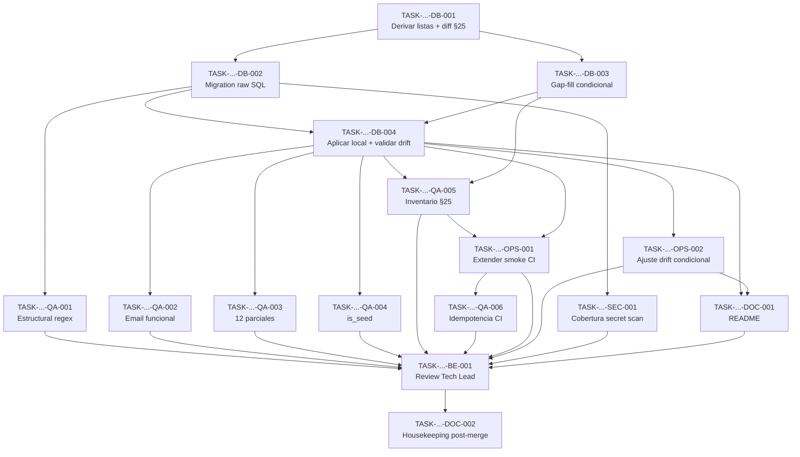

# Development Tasks — PB-P0-001 / US-101: Implementar índices críticos vía raw SQL (parciales, funcionales) y verificar el catálogo físico de índices

## 1. Metadata

| Field | Value |
|---|---|
| User Story ID | US-101 |
| Source User Story | `management/user-stories/US-101-critical-indexes.md` |
| Source Technical Specification | `management/technical-specs/P0/PB-P0-001/US-101-technical-spec.md` |
| Decision Resolution Artifact | `management/user-stories/decision-resolutions/US-101-decision-resolution.md` |
| Priority | P0 |
| Backlog ID | PB-P0-001 |
| Backlog Title | Database Schema, Migrations & Constraints |
| Backlog Execution Order | 1 (primer ítem P0 del backlog) |
| User Story Position in Backlog Item | 3 of 4 |
| Related User Stories in Backlog Item | US-099 (Approved), US-100 (Approved), US-101 (esta), US-102 (Draft) |
| Epic | EPIC-DB-001 — Database & Prisma Physical Model |
| Backlog Item Dependencies | — (foundation) |
| Feature | Critical Indexes — raw SQL migration + catalog verification |
| Module / Domain | Platform / DB |
| Backlog Alignment Status | Found |
| Task Breakdown Status | Ready for Sprint Planning |
| Created Date | 2026-06-10 |
| Last Updated | 2026-06-10 |

---

## 2. Source Validation

| Source | Found | Used | Notes |
|---|---|---|---|
| User Story | Yes | Yes | Approved with Minor Notes (2026-06-10) |
| Technical Specification | Yes | Yes | Fuente primaria; status `Ready for Task Breakdown` |
| Decision Resolution Artifact | Yes | Yes | DR-101: 9 decisiones consolidadas; ninguna reabierta |
| Product Backlog Prioritized | Yes | Yes | PB-P0-001, Related US: 099/100/101/102 |
| ADRs | Yes | Yes | ADR-ARCH-001, ADR-BE-001, ADR-DB-001, ADR-DB-005 (Accepted) |

---

## 3. Backlog Execution Context

### Parent Backlog Item

PB-P0-001 — "Implementar schema Prisma + PostgreSQL alineado al Domain Data Model": schema (US-099 ✔), migraciones (US-100 ✔), **índices en columnas críticas (esta historia)** y constraints C-001..C-062 (US-102).

### Execution Order Rationale

PB-P0-001 es el primer ítem del backlog P0 (orden "DB → Backend → API → ..."). Dentro del ítem, la decomposición aprobada impone US-099 → US-100 → **US-101** → US-102. Las dos precondiciones fuertes (schema y baseline migration + flujo CI) están Approved, por lo que US-101 es la siguiente unidad ejecutable.

### Related User Stories in Same Backlog Item

| User Story | Role in Backlog Item | Suggested Order |
|---|---|---|
| US-099 | Schema Prisma declarativo (`@@index` simples incluidos) | 1 (Approved) |
| US-100 | Baseline migration + scripts `db:migrate:*` + jobs CI drift/smoke | 2 (Approved) |
| US-101 | Migration raw SQL de índices + verificación inventario §25 | 3 (estas tareas) |
| US-102 | Constraints raw SQL (unique parciales, checks, append-only) | 4 |

---

## 4. Task Breakdown Summary

| Area | Number of Tasks | Notes |
|---|---:|---|
| Database / Prisma (DB) | 4 | Derivación de listas, migration raw SQL, gap-fill condicional, validación local + drift |
| QA / Testing (QA) | 6 | Estructural regex, unicidad funcional, parciales, `is_seed`, inventario, idempotencia CI |
| DevOps / Environment (OPS) | 2 | Extensión smoke CI, ajuste condicional del drift job |
| Security / Authorization (SEC) | 1 | Cobertura secret scan sobre nueva migration |
| Backend (BE) | 1 | Review Tech Lead del PR (DR-101 Decisiones 8 y 9 — nota menor del Approval Gate) |
| Documentation / Traceability (DOC) | 2 | README backend; housekeeping de alignment post-merge |
| **Total** | **16** | |

---

## 5. Traceability Matrix

| Acceptance Criterion | Technical Spec Section | Task IDs |
|---|---|---|
| AC-01 — Migration raw SQL aplicable | §6, §10 (Migrations Impact), §18 | DB-002, DB-004, QA-001 |
| AC-02 — Índice funcional email | §6, §10 (Indexes) | DB-002, QA-002 |
| AC-03 — 12 índices parciales | §6, §10 (Indexes) | DB-002, QA-003 |
| AC-04 — Índices `is_seed` | §6, §10 (Indexes), §17 (R-5) | DB-001, DB-002, QA-004 |
| AC-05 — Inventario §25 + gap-fill | §6, §10 (Migrations Impact), §13 | DB-001, DB-003, QA-005, OPS-001 |
| AC-06 — `migrate deploy` idempotente | §6, §13 (CI Checks) | QA-006, OPS-001 |
| AC-07 — Jobs CI verdes (drift/smoke) | §6, §13, §17 (R-1) | DB-004, OPS-001, OPS-002, BE-001 |
| AC-08 — Sin artefactos de otras historias | §4, §6 | QA-001 |

---

## 6. Development Tasks

### TASK-PB-P0-001-US-101-DB-001 — Derivar listas de índices desde el schema US-099 y contrastar contra el catálogo Doc 18 §25

| Field | Value |
|---|---|
| Area | Database / Prisma |
| Type | Setup |
| Priority | Must |
| Estimate | S |
| Depends On | — (precondición: US-099 y US-100 mergeadas) |
| Source AC(s) | AC-04, AC-05 |
| Technical Spec Section(s) | §10 (Indexes), §17 (R-4, R-5), §18 (pasos 1–2) |
| Backlog ID | PB-P0-001 |
| User Story ID | US-101 |
| Owner Role | Backend |
| Status | To Do |

#### Objective

Producir las tres listas exactas que alimentan la migration y los tests: (a) tablas que declaran `is_seed` en `prisma/schema.prisma`; (b) índices ya declarados vía `@@index`/`@@unique` en US-099; (c) diff contra el catálogo obligatorio Doc 18 §25 para determinar si existe gap-fill (btree simple obligatorio faltante).

#### Scope

##### Include

* Inspección de `apps/backend/prisma/schema.prisma` mergeado.
* Tabla de decisión documentada en el PR: índice → fuente (US-099 declarativo / US-101 raw SQL / US-102 / diferido).
* Determinación binaria de gap-fill (activa o descarta DB-003).

##### Exclude

* Cualquier edición de `schema.prisma` (pertenece a DB-003 solo si hay gap).
* Los 4 unique parciales y el índice GIN/trigram (exclusiones formales DR-101).

#### Implementation Notes

* La lista `is_seed` se deriva del schema, no se hardcodea (mitiga R-5).
* El catálogo de referencia es la tabla literal de Doc 18 §25 reproducida en el spec §10.

#### Acceptance Criteria Covered

AC-04, AC-05.

#### Definition of Done

- [ ] Lista de tablas con `is_seed` documentada en el PR.
- [ ] Mapa índice→fuente completo para todo el catálogo §25 (sin filas sin clasificar).
- [ ] Decisión gap-fill documentada (sí/no, con índices afectados si aplica).

---

### TASK-PB-P0-001-US-101-DB-002 — Crear la migration `<ts>_critical_indexes` con el raw SQL completo

| Field | Value |
|---|---|
| Area | Database / Prisma |
| Type | Implementation |
| Priority | Must |
| Estimate | M |
| Depends On | DB-001 |
| Source AC(s) | AC-01, AC-02, AC-03, AC-04 |
| Technical Spec Section(s) | §10 (Indexes — DDL de referencia), §18 (paso 3) |
| Backlog ID | PB-P0-001 |
| User Story ID | US-101 |
| Owner Role | Backend |
| Status | To Do |

#### Objective

Generar `apps/backend/prisma/migrations/<YYYYMMDDHHMMSS>_critical_indexes/migration.sql` (vía `npx prisma migrate dev --create-only --name critical_indexes`) con: el índice funcional único `uq_users_email_lower`, los 12 índices parciales con predicados literales de Doc 18 §25, y los índices `idx_<tabla>_is_seed` por cada tabla derivada en DB-001.

#### Scope

##### Include

* Todo bloque raw SQL comentado `-- Raw SQL: <motivo>` (Doc 18 §28.3).
* Naming Doc 18 §7 (`idx_*`, `uq_*`).
* Timestamp del directorio posterior a la baseline `<ts>_init`.

##### Exclude

* Unique parciales, checks, triggers, enforcement append-only (US-102).
* `CREATE EXTENSION pg_trgm`, índices GIN (diferidos — DR-101 Decisión 5).
* `CREATE INDEX CONCURRENTLY` (DR-101 Decisión 9).
* Índices btree ya materializados por la baseline (no recrear — R-4).

#### Implementation Notes

* DDL de referencia completo en el spec §10; los predicados `WHERE` deben copiarse literalmente.
* No modificar scripts `db:migrate:*` ni la política forward-only.

#### Acceptance Criteria Covered

AC-01, AC-02, AC-03, AC-04.

#### Definition of Done

- [ ] Migration creada con timestamp posterior a la baseline.
- [ ] 1 índice funcional + 12 parciales + índices `is_seed` completos según listas de DB-001.
- [ ] Todos los bloques comentados con `-- Raw SQL: <motivo>`.
- [ ] Sin artefactos excluidos (verificable luego por QA-001).

---

### TASK-PB-P0-001-US-101-DB-003 — Gap-fill condicional de índices btree simples vía `@@index`

| Field | Value |
|---|---|
| Area | Database / Prisma |
| Type | Implementation |
| Priority | Should (condicional — solo si DB-001 detecta faltantes) |
| Estimate | S |
| Depends On | DB-001 |
| Source AC(s) | AC-05 |
| Technical Spec Section(s) | §10 (Migrations Impact — caso gap-fill), §18 |
| Backlog ID | PB-P0-001 |
| User Story ID | US-101 |
| Owner Role | Backend |
| Status | To Do |

#### Objective

Si DB-001 detecta un índice btree simple obligatorio del catálogo §25 ausente del schema US-099, agregarlo vía `@@index` en `prisma/schema.prisma` + su migration correspondiente dentro del mismo PR, documentando el gap en la descripción del PR.

#### Scope

##### Include

* Solo índices btree/compuestos representables en Prisma Schema Language (incluyendo `sort: Desc`).

##### Exclude

* Cualquier índice no-representable (esos van en DB-002 como raw SQL).
* Cambios de modelos, campos o relaciones.

#### Implementation Notes

* Si DB-001 concluye que no hay gap, cerrar esta tarea como "no requerida" con evidencia (el mapa índice→fuente).

#### Acceptance Criteria Covered

AC-05.

#### Definition of Done

- [ ] Gap documentado en PR (o cierre justificado "sin gap").
- [ ] `@@index` agregados con su migration y drift job verde.

---

### TASK-PB-P0-001-US-101-DB-004 — Aplicar la migration en local y validar empíricamente el comportamiento del drift job (R-1)

| Field | Value |
|---|---|
| Area | Database / Prisma |
| Type | Implementation |
| Priority | Must |
| Estimate | S |
| Depends On | DB-002, DB-003 (si activa) |
| Source AC(s) | AC-01, AC-07 |
| Technical Spec Section(s) | §17 (R-1), §18 (paso 4) |
| Backlog ID | PB-P0-001 |
| User Story ID | US-101 |
| Owner Role | Backend |
| Status | To Do |

#### Objective

Ejecutar `db:migrate:dev` sobre DB local con baseline aplicada y luego `db:migrate:diff`, registrando si `prisma migrate diff --from-migrations --to-schema-datamodel --exit-code` reporta los índices raw SQL (no representables en PSL) como drift falso. Este resultado empírico decide si OPS-002 se activa.

#### Scope

##### Include

* Evidencia del resultado (salida del comando) adjunta al PR.
* Verificación de aplicación limpia de la migration (AC-01).

##### Exclude

* El ajuste del job CI (OPS-002).
* Desactivar drift detection (prohibido — DR-101 Decisión 8).

#### Implementation Notes

* Ejecutar **antes** de escribir los tests de CI: el resultado condiciona OPS-001/OPS-002 (spec §18, orden recomendado).

#### Acceptance Criteria Covered

AC-01, AC-07 (parcial).

#### Definition of Done

- [ ] Migration aplicada sin errores en DB local con baseline.
- [ ] Resultado de `db:migrate:diff` documentado (drift falso: sí/no).
- [ ] Decisión OPS-002 activada o descartada con evidencia.

---

### TASK-PB-P0-001-US-101-QA-001 — Test estructural regex sobre `migration.sql`

| Field | Value |
|---|---|
| Area | QA / Testing |
| Type | Test |
| Priority | Must |
| Estimate | S |
| Depends On | DB-002 |
| Source AC(s) | AC-01, AC-08 |
| Technical Spec Section(s) | §13 (Unit Tests), §6 (AC-08) |
| Backlog ID | PB-P0-001 |
| User Story ID | US-101 |
| Owner Role | QA |
| Status | To Do |

#### Objective

Test Vitest que valida la estructura del archivo `migration.sql`: presencia de comentarios `-- Raw SQL:`, naming `idx_*`/`uq_*`, y ausencia de patrones prohibidos: `CREATE UNIQUE INDEX ... WHERE` (unique parcial), `CHECK (`, `TRIGGER`, `CREATE EXTENSION`, `USING gin`, secretos (`DATABASE_URL=`, `postgresql://`).

#### Scope

##### Include

* Escenarios TS-08, NT-02, NT-03, NT-06 (capa estructural).

##### Exclude

* Verificación contra DB real (QA-002..QA-005).

#### Implementation Notes

* Archivo orientativo: `apps/backend/tests/db/critical-indexes.structural.test.ts`.
* La excepción permitida al patrón unique: `uq_users_email_lower` (UNIQUE sin `WHERE` — funcional, autorizado por DR-101 Decisión 4).

#### Acceptance Criteria Covered

AC-01 (comentarios/naming), AC-08.

#### Definition of Done

- [ ] Test verde sobre la migration de DB-002.
- [ ] Casos negativos NT-02, NT-03, NT-06 cubiertos (fixtures con contenido prohibido fallan).

---

### TASK-PB-P0-001-US-101-QA-002 — Test de integración: unicidad case-insensitive de email

| Field | Value |
|---|---|
| Area | QA / Testing |
| Type | Test |
| Priority | Must |
| Estimate | XS |
| Depends On | DB-004 |
| Source AC(s) | AC-02 |
| Technical Spec Section(s) | §13 (Integration Tests) |
| Backlog ID | PB-P0-001 |
| User Story ID | US-101 |
| Owner Role | QA |
| Status | To Do |

#### Objective

Test de integración contra PostgreSQL real: verificar vía `pg_indexes` que `uq_users_email_lower` existe con definición `UNIQUE ... (lower(email))`, e intentar insertar `'Ana@eventflow.demo'` y `'ana@eventflow.demo'` esperando unique violation en la segunda inserción.

#### Scope

##### Include

* TS-02 y NT-01.
* Emails sintéticos `@eventflow.demo` (sin datos personales reales).

##### Exclude

* Lógica de registro/login (historias de auth).

#### Acceptance Criteria Covered

AC-02.

#### Definition of Done

- [ ] Test verde en local y CI (service container).
- [ ] Unique violation capturada y asertada explícitamente.

---

### TASK-PB-P0-001-US-101-QA-003 — Test de integración: definición exacta de los 12 índices parciales

| Field | Value |
|---|---|
| Area | QA / Testing |
| Type | Test |
| Priority | Must |
| Estimate | S |
| Depends On | DB-004 |
| Source AC(s) | AC-03 |
| Technical Spec Section(s) | §13 (Integration Tests), §10 (tabla de 12 parciales) |
| Backlog ID | PB-P0-001 |
| User Story ID | US-101 |
| Owner Role | QA |
| Status | To Do |

#### Objective

Verificar vía `pg_indexes.indexdef` que los 12 índices parciales existen con sus predicados `WHERE` exactos (tabla del spec §10 / AC-03 de la User Story).

#### Scope

##### Include

* TS-03; aserción por nombre + normalización del `indexdef` (PostgreSQL reescribe predicados).

##### Exclude

* Índices `is_seed` (QA-004) e inventario global (QA-005).

#### Implementation Notes

* PostgreSQL normaliza el DDL (paréntesis, `::text` casts); comparar de forma tolerante a la normalización, no por string literal ingenuo.

#### Acceptance Criteria Covered

AC-03.

#### Definition of Done

- [ ] 12 aserciones, una por índice, con tabla + columnas + predicado verificados.
- [ ] Test verde en local y CI.

---

### TASK-PB-P0-001-US-101-QA-004 — Test de integración: cobertura completa de índices `is_seed`

| Field | Value |
|---|---|
| Area | QA / Testing |
| Type | Test |
| Priority | Must |
| Estimate | S |
| Depends On | DB-004 |
| Source AC(s) | AC-04 |
| Technical Spec Section(s) | §13 (Integration Tests), §17 (R-5) |
| Backlog ID | PB-P0-001 |
| User Story ID | US-101 |
| Owner Role | QA |
| Status | To Do |

#### Objective

Test que deriva dinámicamente las tablas con columna `is_seed` desde `information_schema.columns` y verifica que cada una tiene su índice `idx_<tabla>_is_seed` con predicado `WHERE (is_seed = true)`. La lista NO se hardcodea (mitiga R-5).

#### Scope

##### Include

* TS-04; detección de omisiones futuras (si US-102+ agrega tablas con `is_seed`, el test las exige).

##### Exclude

* Datos seed reales (EPIC-SEED-001).

#### Acceptance Criteria Covered

AC-04.

#### Definition of Done

- [ ] Derivación dinámica desde `information_schema.columns`.
- [ ] Cero tablas `is_seed` sin índice parcial.

---

### TASK-PB-P0-001-US-101-QA-005 — Test de inventario: catálogo Doc 18 §25 completo y sin duplicados

| Field | Value |
|---|---|
| Area | QA / Testing |
| Type | Test |
| Priority | Must |
| Estimate | M |
| Depends On | DB-004, DB-003 (si activa) |
| Source AC(s) | AC-05 |
| Technical Spec Section(s) | §13 (Integration Tests), §10 (Verificación de inventario) |
| Backlog ID | PB-P0-001 |
| User Story ID | US-101 |
| Owner Role | QA |
| Status | To Do |

#### Objective

Test que compara `SELECT indexname, indexdef FROM pg_indexes WHERE schemaname='public'` contra la lista esperada del catálogo obligatorio Doc 18 §25 (índices de US-099 + US-101), fallando ante faltantes o duplicados por nombre, con exclusiones explícitas y documentadas en el propio test: los 4 unique parciales (US-102) y `idx_vendor_profiles_business_name_trgm` (diferido).

#### Scope

##### Include

* TS-05 y NT-04; la lista esperada vive en un fixture versionado con referencia a Doc 18 §25.

##### Exclude

* Índices implícitos de PK/FK generados por PostgreSQL/Prisma (filtrar `*_pkey` y constraints automáticos).

#### Implementation Notes

* Este test será reutilizado por OPS-001 dentro del smoke CI; diseñarlo ejecutable de forma independiente (sin estado previo).

#### Acceptance Criteria Covered

AC-05.

#### Definition of Done

- [ ] Inventario completo verificado (faltantes y duplicados detectados en fixtures negativos).
- [ ] Exclusiones documentadas con referencia a DR-101 Decisiones 3 y 5.
- [ ] Ejecutable standalone para integración en smoke CI.

---

### TASK-PB-P0-001-US-101-QA-006 — Verificación CI: idempotencia de `migrate deploy` e inmutabilidad de la migration

| Field | Value |
|---|---|
| Area | QA / Testing |
| Type | Test |
| Priority | Must |
| Estimate | XS |
| Depends On | OPS-001 |
| Source AC(s) | AC-06 |
| Technical Spec Section(s) | §13 (CI Checks) |
| Backlog ID | PB-P0-001 |
| User Story ID | US-101 |
| Owner Role | QA |
| Status | To Do |

#### Objective

Verificar en el smoke CI que una segunda ejecución de `npx prisma migrate deploy` termina con exit code 0 sin cambios (TS-06), y confirmar que la inmutabilidad post-merge (NT-05) queda cubierta por el job `prisma-migrate-diff` existente de US-100 (sin trabajo nuevo si ya aplica).

#### Scope

##### Include

* Paso de doble ejecución en el smoke job; evidencia en logs CI.

##### Exclude

* Reimplementar el drift job (existe desde US-100).

#### Acceptance Criteria Covered

AC-06.

#### Definition of Done

- [ ] Doble `migrate deploy` con exit 0 verificado en CI.
- [ ] Cobertura NT-05 confirmada (referencia al job US-100).

---

### TASK-PB-P0-001-US-101-OPS-001 — Extender el job CI `prisma-migrate-smoke` con la verificación de inventario de índices

| Field | Value |
|---|---|
| Area | DevOps / Environment |
| Type | Setup |
| Priority | Must |
| Estimate | S |
| Depends On | DB-004, QA-005 |
| Source AC(s) | AC-05, AC-06, AC-07 |
| Technical Spec Section(s) | §13 (CI Checks), §18 (paso 6) |
| Backlog ID | PB-P0-001 |
| User Story ID | US-101 |
| Owner Role | DevOps |
| Status | To Do |

#### Objective

Extender el job `prisma-migrate-smoke` (US-100): tras `migrate deploy` contra la DB ephemeral (PostgreSQL service container), ejecutar el test de inventario (QA-005) y el paso de idempotencia (QA-006).

#### Scope

##### Include

* Modificación del workflow GitHub Actions existente; sin jobs nuevos salvo necesidad justificada.

##### Exclude

* El job de drift (`prisma-migrate-diff`) — solo se toca si OPS-002 se activa.
* Pipeline CD (US-139).

#### Acceptance Criteria Covered

AC-05, AC-06, AC-07.

#### Definition of Done

- [ ] Smoke job verde con inventario + idempotencia integrados.
- [ ] Falla del inventario bloquea merge (verificado con un negative run o dry-run documentado).

---

### TASK-PB-P0-001-US-101-OPS-002 — Ajuste documentado del job `prisma-migrate-diff` ante falso drift (condicional)

| Field | Value |
|---|---|
| Area | DevOps / Environment |
| Type | Setup |
| Priority | Should (condicional — solo si DB-004 confirma falso positivo) |
| Estimate | S |
| Depends On | DB-004 |
| Source AC(s) | AC-07 |
| Technical Spec Section(s) | §17 (R-1), §13 (CI Checks) |
| Backlog ID | PB-P0-001 |
| User Story ID | US-101 |
| Owner Role | DevOps |
| Status | To Do |

#### Objective

Si DB-004 confirma que `prisma migrate diff` reporta los índices raw SQL como drift, ajustar el job de forma documentada (allowlist acotada o diff dirigido a objetos representables) **sin desactivar** la detección de drift para el resto del schema, conforme a DR-101 Decisión 8.

#### Scope

##### Include

* Ajuste mínimo + comentario en el workflow citando DR-101 Decisión 8.
* Registro del comportamiento en README (entrada de DOC-001).

##### Exclude

* Desactivar o debilitar el drift detection global (prohibido).

#### Acceptance Criteria Covered

AC-07.

#### Definition of Done

- [ ] Job verde con la migration de índices presente (o cierre justificado "no requerido" con evidencia de DB-004).
- [ ] Ajuste revisado por Tech Lead (BE-001).

---

### TASK-PB-P0-001-US-101-SEC-001 — Confirmar cobertura del secret scan sobre la nueva migration

| Field | Value |
|---|---|
| Area | Security / Authorization |
| Type | Review |
| Priority | Must |
| Estimate | XS |
| Depends On | DB-002 |
| Source AC(s) | AC-01 (VR-07) |
| Technical Spec Section(s) | §12 (Sensitive Data Handling), §13 (Security Tests) |
| Backlog ID | PB-P0-001 |
| User Story ID | US-101 |
| Owner Role | DevOps |
| Status | To Do |

#### Objective

Confirmar que el secret scan defensivo de US-100 cubre el nuevo directorio `prisma/migrations/<ts>_critical_indexes/` (debería, por glob sobre `prisma/migrations/`), con evidencia de una corrida que lo incluye.

#### Scope

##### Include

* Verificación de alcance del job existente; corrección del glob solo si no cubre.

##### Exclude

* Nuevos jobs de seguridad; tests 401/403 (sin endpoints).

#### Acceptance Criteria Covered

AC-01 (regla VR-07).

#### Definition of Done

- [ ] Evidencia de que la nueva migration es escaneada (log CI).
- [ ] NT-06 cubierto entre QA-001 (estructural) y el scan CI.

---

### TASK-PB-P0-001-US-101-BE-001 — Review Tech Lead del PR: validación de DR-101 Decisiones 8 y 9

| Field | Value |
|---|---|
| Area | Backend |
| Type | Review |
| Priority | Must |
| Estimate | XS |
| Depends On | DB-004, OPS-001, OPS-002 (si activa), QA-001..QA-006 |
| Source AC(s) | AC-07 |
| Technical Spec Section(s) | §17 (R-1, R-2), §21; Approval Gate — Non-Blocking Notes 1 |
| Backlog ID | PB-P0-001 |
| User Story ID | US-101 |
| Owner Role | Tech Lead |
| Status | To Do |

#### Objective

Cerrar la nota menor del Approval Gate: el Tech Lead valida en el PR (a) el comportamiento real del drift job frente a los índices raw SQL y el ajuste aplicado si lo hubo (Decisión 8), y (b) la ratificación de `CREATE INDEX` estándar sin `CONCURRENTLY` (Decisión 9), además del review general del PR.

#### Scope

##### Include

* Registro explícito de ambas validaciones en el PR (comentario o checklist).

##### Exclude

* Reabrir cualquier otra decisión de DR-101.

#### Acceptance Criteria Covered

AC-07 (cierre); DoD de la User Story ("PR revisado por Tech Lead").

#### Definition of Done

- [ ] Decisiones 8 y 9 validadas y registradas en el PR.
- [ ] PR aprobado por Tech Lead.

---

### TASK-PB-P0-001-US-101-DOC-001 — README backend: sección de índices críticos y manejo de drift

| Field | Value |
|---|---|
| Area | Documentation / Traceability |
| Type | Documentation |
| Priority | Must |
| Estimate | S |
| Depends On | DB-004, OPS-002 (si activa) |
| Source AC(s) | AC-07 |
| Technical Spec Section(s) | §7 (Runbook), §17 (R-1, R-2) |
| Backlog ID | PB-P0-001 |
| User Story ID | US-101 |
| Owner Role | Backend |
| Status | To Do |

#### Objective

Actualizar `apps/backend/README.md` § `Database Migrations` con: la migration de índices críticos (qué contiene y por qué es raw SQL), el comportamiento observado del drift job y su ajuste (si aplicó), y la deuda consciente de `CONCURRENTLY` (R-2).

#### Scope

##### Include

* Referencias a DR-101 y Doc 18 §25/§28.3.

##### Exclude

* Amendments a Doc 18 (DOC-002).

#### Acceptance Criteria Covered

AC-07 (documentación del ajuste).

#### Definition of Done

- [ ] Sección actualizada con los 3 puntos.
- [ ] Revisada en el PR (BE-001).

---

### TASK-PB-P0-001-US-101-DOC-002 — Housekeeping post-merge: Documentation Alignment (Doc 18 §35.2, Doc 18 §25, PB-P0-001 wording)

| Field | Value |
|---|---|
| Area | Documentation / Traceability |
| Type | Documentation |
| Priority | Could (post-merge, no bloqueante) |
| Estimate | S |
| Depends On | BE-001 (merge del PR) |
| Source AC(s) | — (Documentation Alignment Required) |
| Technical Spec Section(s) | §16 |
| Backlog ID | PB-P0-001 |
| User Story ID | US-101 |
| Owner Role | Tech Lead |
| Status | To Do |

#### Objective

Ejecutar los 3 amendments no bloqueantes: Doc 18 §35.2 (reflejar split raw SQL US-100/101/102 — tracked desde US-100), Doc 18 §25 (marcar `idx_vendor_profiles_business_name_trgm` como diferido post-MVP citando DR-101 Decisión 5), y wording "up/down" del Acceptance Summary de PB-P0-001 (forward-only).

#### Scope

##### Include

* Puede agruparse con el housekeeping homólogo pendiente de US-100.

##### Exclude

* Cualquier cambio de alcance o de decisiones.

#### Acceptance Criteria Covered

Ninguno directo (alignment documental).

#### Definition of Done

- [ ] 3 amendments aplicados con referencia a los DR correspondientes.

---

## 7. Required QA Tasks

| Task ID | Test Type | Purpose |
|---|---|---|
| QA-001 | Unit (estructural regex) | TS-08, NT-02, NT-03, NT-06 — contenido permitido/prohibido de `migration.sql` |
| QA-002 | Integration | TS-02, NT-01 — índice funcional + unicidad case-insensitive |
| QA-003 | Integration | TS-03 — definición exacta de los 12 parciales |
| QA-004 | Integration | TS-04 — cobertura `is_seed` derivada dinámicamente |
| QA-005 | Integration / CI | TS-05, NT-04 — inventario §25 completo y sin duplicados |
| QA-006 | CI | TS-06, NT-05 — idempotencia + inmutabilidad |

---

## 8. Required Security Tasks

| Task ID | Security Concern | Purpose |
|---|---|---|
| SEC-001 | Secretos en migration | Confirmar cobertura del secret scan CI sobre `<ts>_critical_indexes/` (VR-07, NT-06) |

---

## 9. Required Seed / Demo Tasks

`No aplica` — esta historia entrega estructura (índices `is_seed`), no datos. La evidencia estructural queda en QA-004; el seed real pertenece a EPIC-SEED-001.

---

## 10. Observability / Audit Tasks

`No aplica` como tareas dedicadas — la observabilidad de esta historia son los logs CI de `migrate deploy`, inventario y drift, cubiertos dentro de OPS-001/OPS-002. Sin `AdminAction` ni logging runtime.

---

## 11. Documentation / Traceability Tasks

| Task ID | Document / Artifact | Purpose |
|---|---|---|
| DOC-001 | `apps/backend/README.md` § Database Migrations | Migration de índices, manejo de drift, deuda `CONCURRENTLY` |
| DOC-002 | Doc 18 §35.2, Doc 18 §25, PB-P0-001 | Amendments de alignment no bloqueantes (post-merge) |

---

## 12. Dependency Graph

---

## 13. Suggested Implementation Order

### Phase 1 — Foundation

1. DB-001 (listas + diff catálogo → decide DB-003).
2. DB-002 (migration raw SQL) y DB-003 (gap-fill, si activa).
3. DB-004 (aplicación local + evidencia drift → decide OPS-002).

### Phase 2 — Core Implementation

4. QA-001 y SEC-001 (en paralelo, dependen solo de DB-002).
5. QA-002, QA-003, QA-004, QA-005 (en paralelo, dependen de DB-004).

### Phase 3 — Validation / Security / QA

6. OPS-002 (solo si DB-004 confirmó falso drift).
7. OPS-001 (smoke extendido) → QA-006 (idempotencia en CI).

### Phase 4 — Documentation / Review

8. DOC-001 (README).
9. BE-001 (review Tech Lead — cierra la nota menor del Approval Gate).
10. DOC-002 (housekeeping post-merge, agrupable con el de US-100).

---

## 14. Risks & Mitigations

| Risk | Impact | Mitigation | Related Task |
|---|---|---|---|
| R-1: Falso drift de `prisma migrate diff` por índices no representables en PSL | Job CI rojo permanente; PRs bloqueados | Validación empírica temprana antes de escribir tests CI; ajuste documentado sin desactivar drift global | DB-004, OPS-002, BE-001 |
| R-2: Locks de `CREATE INDEX` en re-deploy con datos | Pausa breve de escrituras en QA/Demo | Aceptado para MVP (volumen seed); deuda documentada | DOC-001 |
| R-3: Timestamp de migration anterior a baseline | Deploy desde cero roto | Generación con `--create-only` post-baseline; smoke CI desde DB vacía | DB-002, OPS-001 |
| R-4: Duplicación con `@@index` US-099 o unique parciales US-102 | Bloat de escritura; conflicto entre historias | Mapa índice→fuente (DB-001); inventario detecta duplicados; boundary DR-101 Decisiones 3–4 | DB-001, QA-005 |
| R-5: Omisión de tabla `is_seed` | Reset demo lento; §35.4 incumplido | Derivación dinámica desde `information_schema.columns` | DB-001, QA-004 |

---

## 15. Out of Scope Confirmation

No debe implementarse como parte de US-101:

* Los 4 unique parciales (`uq_quote_requests_event_vendor_active`, `uq_quotes_request_active`, `uq_booking_intents_event_category_confirmed`, `uq_prompt_versions_active`), check constraints, triggers y enforcement append-only → **US-102**.
* `idx_vendor_profiles_business_name_trgm`, `CREATE EXTENSION pg_trgm`, índices GIN → **diferidos** (DR-101 Decisión 5).
* `CREATE INDEX CONCURRENTLY` (DR-101 Decisión 9).
* Medición de performance P95 / EXPLAIN con carga (Doc 20, post-seed).
* Cambios a scripts `db:migrate:*`, política forward-only o pipeline CD (US-100/US-139).
* Seed data o fixtures (EPIC-SEED-001); provisioning RDS (US-137).
* Cualquier índice fuera del catálogo query-driven Doc 18 §25.

---

## 16. Readiness for Sprint Planning

| Check | Status |
|---|---|
| Product Backlog mapping found | Pass (PB-P0-001, posición 3 of 4) |
| Every AC maps to tasks | Pass (AC-01..AC-08 en §5) |
| Technical Spec used when available | Pass (fuente primaria) |
| QA tasks included | Pass (6 tareas, TS-01..TS-08 / NT-01..NT-06 cubiertos) |
| Security tasks included if applicable | Pass (SEC-001) |
| Seed/demo tasks included if applicable | N/A (estructura solamente; justificado en §9) |
| Observability tasks included if applicable | N/A (CI logs dentro de OPS; justificado en §10) |
| Documentation tasks included if applicable | Pass (DOC-001, DOC-002) |
| Task dependencies clear | Pass (§12 grafo Mermaid) |
| Tasks small enough | Pass (máximo M; sin tareas L) |
| Ready for Sprint Planning | **Yes** |

---

## 17. Final Recommendation

**`Ready for Sprint Planning`**

Las 16 tareas son pequeñas (XS–M), trazables 1:1 contra AC-01..AC-08 y contra secciones del Technical Spec, con dependencias explícitas y dos tareas condicionales claramente gobernadas por evidencia empírica (DB-003 por el diff del catálogo; OPS-002 por el resultado de DB-004). La nota menor del Approval Gate queda operacionalizada como tarea visible (BE-001) y los riesgos del spec tienen tarea de mitigación asignada. No quedan decisiones abiertas: todo el boundary está cerrado por DR-101.
