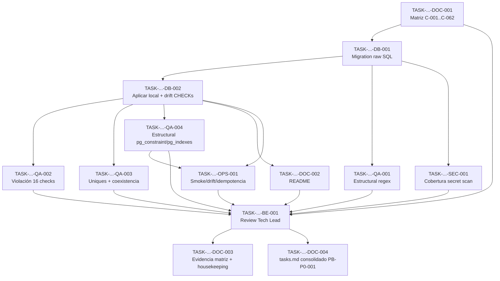

# Development Tasks — PB-P0-001 / US-102: Implementar constraints físicos vía raw SQL (checks, unique parciales) y validar el catálogo C-001..C-062

## 1. Metadata

| Field | Value |
|---|---|
| User Story ID | US-102 |
| Source User Story | `management/user-stories/US-102-db-constraints.md` |
| Source Technical Specification | `management/technical-specs/P0/PB-P0-001/US-102-technical-spec.md` |
| Decision Resolution Artifact | `management/user-stories/decision-resolutions/US-102-decision-resolution.md` |
| Priority | P0 |
| Backlog ID | PB-P0-001 |
| Backlog Title | Database Schema, Migrations & Constraints |
| Backlog Execution Order | 1 (primer ítem P0 del backlog) |
| User Story Position in Backlog Item | 4 of 4 (última — cierra el ítem) |
| Related User Stories in Backlog Item | US-099 (Approved), US-100 (Approved), US-101 (Approved), US-102 (esta) |
| Epic | EPIC-DB-001 — Database & Prisma Physical Model |
| Backlog Item Dependencies | — (foundation) |
| Feature | DB Constraints — raw SQL migration + C-catalog validation matrix |
| Module / Domain | Platform / DB |
| Backlog Alignment Status | Found |
| Task Breakdown Status | Ready for Sprint Planning |
| Created Date | 2026-06-10 |
| Last Updated | 2026-06-10 |

---

## 2. Source Validation

| Source | Found | Used | Notes |
|---|---|---|---|
| User Story | Yes | Yes | Approved with Minor Notes (2026-06-10) |
| Technical Specification | Yes | Yes | Fuente primaria; status `Ready for Task Breakdown` |
| Decision Resolution Artifact | Yes | Yes | DR-102: 10 decisiones; ninguna reabierta |
| Product Backlog Prioritized | Yes | Yes | PB-P0-001, Related US: 099/100/101/102 |
| ADRs | Yes | Yes | ADR-ARCH-001, ADR-BE-001, ADR-DB-001, ADR-DB-005 (Accepted) |

---

## 3. Backlog Execution Context

### Parent Backlog Item

PB-P0-001 — "Implementar schema Prisma + PostgreSQL alineado al Domain Data Model". US-102 es la **última historia** del ítem: al cerrarla, PB-P0-001 completa schema (US-099), migraciones (US-100), índices (US-101) y constraints (US-102) con evidencia trazable de los 62 constraints.

### Execution Order Rationale

PB-P0-001 es el primer ítem P0; la decomposición aprobada impone US-099 → US-100 → US-101 → **US-102**. Las tres precondiciones están Approved y mergeables/mergeadas. La migration de esta historia es la cuarta cronológicamente (`<ts>_init` → `<ts>_critical_indexes` → `<ts>_db_constraints`).

### Related User Stories in Same Backlog Item

| User Story | Role in Backlog Item | Suggested Order |
|---|---|---|
| US-099 | Schema declarativo | 1 (Approved) |
| US-100 | Baseline migration + flujo + CI | 2 (Approved) |
| US-101 | Índices raw SQL + inventario §25 | 3 (Approved) |
| US-102 | Constraints raw SQL + matriz C-001..C-062 | 4 (estas tareas — cierran el ítem) |

---

## 4. Task Breakdown Summary

| Area | Number of Tasks | Notes |
|---|---:|---|
| Documentation / Traceability (DOC) | 4 | Matriz C-001..C-062 (primera tarea), README, housekeeping agrupado, consolidación `tasks.md` del backlog item |
| Database / Prisma (DB) | 2 | Migration raw SQL (16 checks + 4 uniques); aplicación local + validación drift con CHECKs |
| QA / Testing (QA) | 4 | Estructural regex, violaciones SQLSTATE, coexistencia histórica de uniques, verificación estructural en DB |
| DevOps / Environment (OPS) | 1 | Smoke/diff/idempotencia + ajuste condicional del drift job |
| Security / Authorization (SEC) | 1 | Cobertura secret scan sobre la nueva migration |
| Backend (BE) | 1 | Review Tech Lead del PR (DR-102 Decisión 9 — nota menor del Approval Gate) |
| **Total** | **13** | |

---

## 5. Traceability Matrix

| Acceptance Criterion | Technical Spec Section | Task IDs |
|---|---|---|
| AC-01 — Migration raw SQL aplicable | §6, §10 (Migrations Impact), §18 | DB-001, DB-002, QA-001 |
| AC-02 — 16 checks exactos | §6, §10 (Constraints) | DB-001, QA-002, QA-004 |
| AC-03 — 4 unique parciales | §6, §10 (Constraints) | DB-001, QA-003, QA-004 |
| AC-04 — Rechazo de violaciones (checks, 23514) | §6, §13 | QA-002 |
| AC-05 — Duplicado activo rechazado / histórico permitido (23505) | §6, §13 | QA-003 |
| AC-06 — Matriz C-001..C-062 completa | §6, §10 (Matriz), §17 (R-5) | DOC-001, DOC-003 |
| AC-07 — Idempotencia + jobs CI verdes | §6, §13 (CI Checks), §17 (R-1) | DB-002, OPS-001, BE-001 |
| AC-08 — Sin artefactos excluidos | §4, §6 | QA-001 |

---

## 6. Development Tasks

### TASK-PB-P0-001-US-102-DOC-001 — Construir la matriz de validación C-001..C-062

| Field | Value |
|---|---|
| Area | Documentation / Traceability |
| Type | Documentation |
| Priority | Must |
| Estimate | M |
| Depends On | — (precondición: US-099/US-100/US-101 mergeadas) |
| Source AC(s) | AC-06 |
| Technical Spec Section(s) | §10 (Matriz), §17 (R-5), §18 (paso 1), §19 (grupo 1) |
| Backlog ID | PB-P0-001 |
| User Story ID | US-102 |
| Owner Role | Backend |
| Status | To Do |

#### Objective

Construir el documento versionado que clasifica **cada** fila del catálogo C-001..C-062 (Doc 6 §17, incluyendo sub-IDs C-022b/C-026b/C-027b) con: C-ID, tabla, regla, mecanismo físico (Doc 18 §24), clasificación (`DB — US-099 baseline` / `DB — US-101 índice funcional` / `DB — US-102 check` / `DB — US-102 unique parcial` / `Service layer (owner)` / `Job (owner)` / `Middleware (owner)` / `Ausencia de tabla`) y evidencia. Es la **primera tarea**: el mapa que confirma el inventario DB-enforceable antes de redactar la migration.

#### Scope

##### Include

* Ubicación sugerida `management/technical-specs/P0/PB-P0-001/constraints-validation-matrix.md` (confirmar con Tech Lead en el PR — nota menor del Approval Gate).
* Verificación de conteo total contra Doc 6 §17 (cero filas sin clasificar).
* C-001 clasificado con owner US-101 (`uq_users_email_lower` — DR-102 Decisión 2).

##### Exclude

* La columna "Evidencia" definitiva de los objetos US-102 (se completa en DOC-003 con los tests reales).
* Cualquier re-decisión de mecanismo (Doc 18 §24 es la fuente; desvíos requieren cita a DR-102).

#### Implementation Notes

* Las decisiones de clasificación ya formalizadas: REVOKE diferido (D4), prompt versions por versionado (D5), sin triggers (D6), default `valid_until` descartado → service layer US-052/US-053 (D7).

#### Acceptance Criteria Covered

AC-06.

#### Definition of Done

- [ ] Todas las filas del catálogo clasificadas con mecanismo + owner.
- [ ] Conteo verificado contra Doc 6 §17.
- [ ] Inventario DB-enforceable resultante coincide con AC-02/AC-03 (16 checks + 4 uniques) o el desvío queda documentado y citado.

---

### TASK-PB-P0-001-US-102-DB-001 — Crear la migration `<ts>_db_constraints` con los 16 checks y 4 unique parciales

| Field | Value |
|---|---|
| Area | Database / Prisma |
| Type | Implementation |
| Priority | Must |
| Estimate | M |
| Depends On | DOC-001 |
| Source AC(s) | AC-01, AC-02, AC-03 |
| Technical Spec Section(s) | §10 (Constraints — DDL de referencia), §18 (paso 2) |
| Backlog ID | PB-P0-001 |
| User Story ID | US-102 |
| Owner Role | Backend |
| Status | To Do |

#### Objective

Generar `apps/backend/prisma/migrations/<YYYYMMDDHHMMSS>_db_constraints/migration.sql` (vía `npx prisma migrate dev --create-only --name db_constraints`) con los 16 `ALTER TABLE ... ADD CONSTRAINT chk_... CHECK (...)` y los 4 `CREATE UNIQUE INDEX ... WHERE ...` con definiciones literales del spec §10, cada bloque comentado `-- Raw SQL: <C-ID / sección Doc 18>`.

#### Scope

##### Include

* Naming Doc 18 §7/§13.3 (`chk_*`, `uq_*`); timestamp posterior a `<ts>_critical_indexes`.

##### Exclude

* `uq_users_email_lower` (US-101), triggers, `REVOKE`, `DEFAULT valid_until`, GIN/extensiones (DR-102 D2/D4/D6/D7).
* Constraints Prisma-representables ya materializados (DR-102 D3).

#### Implementation Notes

* Las reglas deben copiarse literalmente del spec §10 (incluye los 5 checks detectados en la segunda pasada: budgets totals, languages no vacío, base_price, total_price, size_bytes).
* Columnas nullable (`paid`, `size_bytes`): no agregar `IS NOT NULL` — NULL debe pasar el CHECK (semántica documentada).

#### Acceptance Criteria Covered

AC-01, AC-02, AC-03.

#### Definition of Done

- [ ] Migration creada con timestamp posterior a la de índices.
- [ ] 16 checks + 4 uniques completos y literales.
- [ ] Todos los bloques comentados con `-- Raw SQL: <motivo>`.

---

### TASK-PB-P0-001-US-102-DB-002 — Aplicar la migration en local y validar el drift job con CHECK constraints (R-1)

| Field | Value |
|---|---|
| Area | Database / Prisma |
| Type | Implementation |
| Priority | Must |
| Estimate | S |
| Depends On | DB-001 |
| Source AC(s) | AC-01, AC-07 |
| Technical Spec Section(s) | §17 (R-1), §18 (paso 3) |
| Backlog ID | PB-P0-001 |
| User Story ID | US-102 |
| Owner Role | Backend |
| Status | To Do |

#### Objective

Ejecutar `db:migrate:dev` sobre DB local (con baseline + índices aplicados) y luego `db:migrate:diff`, registrando si los **CHECK constraints** (tipo de objeto distinto al validado en US-101) provocan falso drift. El resultado decide si OPS-001 requiere ajuste adicional del job.

#### Scope

##### Include

* Evidencia de la salida del comando en el PR; aplicación limpia verificada.

##### Exclude

* Desactivar drift detection global (prohibido — DR-102 Decisión 9 / DR-101 Decisión 8).

#### Implementation Notes

* Ejecutar **antes** de escribir los tests de CI (orden del spec §18); reutilizar el mecanismo de ajuste documentado de US-101 si existe.

#### Acceptance Criteria Covered

AC-01, AC-07 (parcial).

#### Definition of Done

- [ ] Migration aplicada sin errores en local.
- [ ] Resultado de `db:migrate:diff` con CHECKs documentado (drift falso: sí/no).
- [ ] Decisión sobre ajuste del job registrada con evidencia.

---

### TASK-PB-P0-001-US-102-QA-001 — Test estructural regex sobre `migration.sql`

| Field | Value |
|---|---|
| Area | QA / Testing |
| Type | Test |
| Priority | Must |
| Estimate | S |
| Depends On | DB-001 |
| Source AC(s) | AC-01, AC-08 |
| Technical Spec Section(s) | §13 (Unit Tests), §6 (AC-08) |
| Backlog ID | PB-P0-001 |
| User Story ID | US-102 |
| Owner Role | QA |
| Status | To Do |

#### Objective

Test Vitest sobre el contenido de `migration.sql`: presencia de comentarios `-- Raw SQL:` y naming `chk_*`/`uq_*`; ausencia de patrones prohibidos: `TRIGGER`, `REVOKE`, `uq_users_email_lower`, `DEFAULT` aplicado a `valid_until`, `USING gin`, `CREATE EXTENSION`, secretos (`DATABASE_URL=`, `postgresql://`).

#### Scope

##### Include

* TS-08, NT-09, NT-10 (capa estructural).
* Excepción documentada: los 4 `CREATE UNIQUE INDEX ... WHERE` de AC-03 SÍ están permitidos en esta migration (a diferencia de US-101 donde estaban prohibidos).

##### Exclude

* Verificación contra DB real (QA-002..QA-004).

#### Acceptance Criteria Covered

AC-01 (comentarios/naming), AC-08.

#### Definition of Done

- [ ] Test verde sobre la migration de DB-001.
- [ ] Fixtures negativos (contenido prohibido) fallan correctamente.

---

### TASK-PB-P0-001-US-102-QA-002 — Tests de violación de los 16 check constraints (SQLSTATE 23514)

| Field | Value |
|---|---|
| Area | QA / Testing |
| Type | Test |
| Priority | Must |
| Estimate | M |
| Depends On | DB-002 |
| Source AC(s) | AC-02, AC-04 |
| Technical Spec Section(s) | §13 (Integration Tests) |
| Backlog ID | PB-P0-001 |
| User Story ID | US-102 |
| Owner Role | QA |
| Status | To Do |

#### Objective

Por cada uno de los 16 checks: un INSERT/UPDATE violatorio que falla con SQLSTATE `23514` asertando el **nombre del constraint** (rating 0/6, guests_count 0, montos negativos en events/budgets/budget_items/vendor_services/quotes/attachments, `is_simulated=false`, depth_level 3, category_change_count 6, email/password_hash vacíos, timeout_ms 0, retry_count 2, `languages_supported='{}'`), más los casos válidos de frontera (rating 1 y 5, montos 0) y los casos NULL aceptados (`paid`, `size_bytes`).

#### Scope

##### Include

* NT-01..NT-05, NT-08, NT-11 + TS-04 (inserciones válidas de frontera) + semántica NULL.
* Datos sintéticos `@eventflow.demo`.

##### Exclude

* Unique parciales (QA-003); mapeo a error envelope (US-093).

#### Acceptance Criteria Covered

AC-02 (operatividad), AC-04.

#### Definition of Done

- [ ] 16 constraints con al menos un caso violatorio asertado por nombre + SQLSTATE.
- [ ] Casos de frontera válidos y casos NULL verdes.
- [ ] Verde en local y CI (service container).

---

### TASK-PB-P0-001-US-102-QA-003 — Tests de unique parciales: duplicado activo rechazado y coexistencia histórica permitida

| Field | Value |
|---|---|
| Area | QA / Testing |
| Type | Test |
| Priority | Must |
| Estimate | S |
| Depends On | DB-002 |
| Source AC(s) | AC-03, AC-05 |
| Technical Spec Section(s) | §13 (Integration Tests), §6 (AC-05) |
| Backlog ID | PB-P0-001 |
| User Story ID | US-102 |
| Owner Role | QA |
| Status | To Do |

#### Objective

Por cada uno de los 4 unique parciales, el **par de escenarios** que valida la semántica de negocio: (1) segunda fila dentro del predicado → unique violation `23505` con nombre asertado; (2) segunda fila con la preexistente **fuera** del predicado (quote_request cancelled/expired, quote expired/rejected, booking_intent cancelled, prompt version deprecated) → INSERT exitoso.

#### Scope

##### Include

* NT-06, NT-07, TS-05 (los 4 índices × 2 escenarios = 8 casos mínimos).

##### Exclude

* Transiciones de estado de negocio (service layer — historias owner).

#### Acceptance Criteria Covered

AC-03 (operatividad), AC-05.

#### Definition of Done

- [ ] 8 escenarios (4 pares) verdes.
- [ ] Violaciones asertadas por nombre de índice + SQLSTATE 23505.

---

### TASK-PB-P0-001-US-102-QA-004 — Verificación estructural: definiciones exactas en `pg_constraint` y `pg_indexes`

| Field | Value |
|---|---|
| Area | QA / Testing |
| Type | Test |
| Priority | Must |
| Estimate | S |
| Depends On | DB-002 |
| Source AC(s) | AC-02, AC-03 |
| Technical Spec Section(s) | §13 (Integration Tests), §17 (R-3) |
| Backlog ID | PB-P0-001 |
| User Story ID | US-102 |
| Owner Role | QA |
| Status | To Do |

#### Objective

Test que verifica la **definición exacta** de los 20 objetos: los 16 checks vía `pg_constraint` (contype='c') + `pg_get_constraintdef(oid)` y los 4 uniques vía `pg_indexes.indexdef`, con comparación **tolerante a la normalización** de PostgreSQL (paréntesis, casts `::text`) — mismo patrón que QA-003 de US-101 (R-3).

#### Scope

##### Include

* TS-02, TS-03; detección de objetos faltantes o renombrados.

##### Exclude

* Comportamiento de violación (QA-002/QA-003).

#### Acceptance Criteria Covered

AC-02, AC-03.

#### Definition of Done

- [ ] 20 aserciones estructurales (tabla + regla/predicado) verdes.
- [ ] Comparación robusta a normalización (sin string-matching ingenuo).

---

### TASK-PB-P0-001-US-102-OPS-001 — Verificar jobs CI (smoke + drift + idempotencia) con la migration de constraints

| Field | Value |
|---|---|
| Area | DevOps / Environment |
| Type | Setup |
| Priority | Must |
| Estimate | S |
| Depends On | DB-002, QA-004 |
| Source AC(s) | AC-07 |
| Technical Spec Section(s) | §13 (CI Checks), §17 (R-1) |
| Backlog ID | PB-P0-001 |
| User Story ID | US-102 |
| Owner Role | DevOps |
| Status | To Do |

#### Objective

Confirmar que `prisma-migrate-smoke` (heredado de US-100, extendido en US-101) aplica la nueva migration contra la DB ephemeral, ejecuta la verificación estructural (QA-004) y la doble corrida de `migrate deploy` (idempotencia, exit 0); aplicar el ajuste condicional y documentado del drift job si DB-002 confirmó falso positivo con CHECKs.

#### Scope

##### Include

* Integración de QA-004 al smoke; evidencia de idempotencia en logs CI (TS-07).
* Ajuste del drift job solo si DB-002 lo exige, citando DR-102 Decisión 9, sin desactivar drift global.

##### Exclude

* Cambios al pipeline CD (US-139); reimplementación de jobs.

#### Acceptance Criteria Covered

AC-07.

#### Definition of Done

- [ ] Smoke + drift verdes con la migration presente.
- [ ] Idempotencia verificada en CI.
- [ ] Ajuste del drift job aplicado y documentado, o cierre justificado "no requerido".

---

### TASK-PB-P0-001-US-102-SEC-001 — Confirmar cobertura del secret scan sobre la nueva migration

| Field | Value |
|---|---|
| Area | Security / Authorization |
| Type | Review |
| Priority | Must |
| Estimate | XS |
| Depends On | DB-001 |
| Source AC(s) | AC-08 (VR-08) |
| Technical Spec Section(s) | §12 (Sensitive Data Handling), §13 (Security Tests) |
| Backlog ID | PB-P0-001 |
| User Story ID | US-102 |
| Owner Role | DevOps |
| Status | To Do |

#### Objective

Confirmar con evidencia de una corrida CI que el secret scan defensivo (US-100) cubre `prisma/migrations/<ts>_db_constraints/` (mismo patrón que SEC-001 de US-101).

#### Scope

##### Include

* Verificación de alcance del glob; corrección solo si no cubre.

##### Exclude

* Nuevos jobs; tests 401/403 (sin endpoints).

#### Acceptance Criteria Covered

AC-08 (regla VR-08).

#### Definition of Done

- [ ] Evidencia (log CI) de que la nueva migration es escaneada.

---

### TASK-PB-P0-001-US-102-DOC-002 — README backend: constraints físicos y procedimiento ante datos violatorios

| Field | Value |
|---|---|
| Area | Documentation / Traceability |
| Type | Documentation |
| Priority | Must |
| Estimate | S |
| Depends On | DB-002 |
| Source AC(s) | AC-07 |
| Technical Spec Section(s) | §7 (Error Handling, Runbook), §17 (R-2) |
| Backlog ID | PB-P0-001 |
| User Story ID | US-102 |
| Owner Role | Backend |
| Status | To Do |

#### Objective

Actualizar `apps/backend/README.md` § `Database Migrations` con: la migration de constraints (qué contiene y por qué es raw SQL), el procedimiento ante `ALTER TABLE ADD CONSTRAINT` fallido por datos preexistentes violatorios (migración correctiva + saneo, R-2), y el resultado de la validación drift con CHECKs (DB-002).

#### Scope

##### Include

* Referencias a DR-102 y Doc 18 §24/§28.3.

##### Exclude

* Amendments a Doc 18 (DOC-003).

#### Acceptance Criteria Covered

AC-07 (documentación).

#### Definition of Done

- [ ] Sección actualizada con los 3 puntos y revisada en el PR.

---

### TASK-PB-P0-001-US-102-BE-001 — Review Tech Lead del PR: validación de DR-102 Decisión 9 y cierre de notas menores

| Field | Value |
|---|---|
| Area | Backend |
| Type | Review |
| Priority | Must |
| Estimate | XS |
| Depends On | DB-002, OPS-001, QA-001..QA-004, SEC-001, DOC-001, DOC-002 |
| Source AC(s) | AC-07 |
| Technical Spec Section(s) | §17 (R-1), §21; Approval Gate — Non-Blocking Notes 1 |
| Backlog ID | PB-P0-001 |
| User Story ID | US-102 |
| Owner Role | Tech Lead |
| Status | To Do |

#### Objective

Cerrar las notas menores del Approval Gate en el PR: (a) validar el comportamiento del drift job con CHECK constraints y el ajuste aplicado si lo hubo (DR-102 Decisión 9); (b) confirmar la ubicación definitiva de la matriz; (c) review general del PR (DoD de la historia).

#### Scope

##### Include

* Registro explícito de las validaciones en el PR.

##### Exclude

* Reabrir cualquier decisión de DR-102.

#### Acceptance Criteria Covered

AC-07 (cierre); DoD "PR revisado por Tech Lead".

#### Definition of Done

- [ ] Decisión 9 validada y registrada.
- [ ] Ubicación de la matriz confirmada.
- [ ] PR aprobado por Tech Lead.

---

### TASK-PB-P0-001-US-102-DOC-003 — Completar evidencia de la matriz y ejecutar el housekeeping documental agrupado (post-merge)

| Field | Value |
|---|---|
| Area | Documentation / Traceability |
| Type | Documentation |
| Priority | Should (post-merge, no bloqueante) |
| Estimate | S |
| Depends On | BE-001 (merge del PR) |
| Source AC(s) | AC-06 (evidencia) |
| Technical Spec Section(s) | §16, §19 (grupo 6) |
| Backlog ID | PB-P0-001 |
| User Story ID | US-102 |
| Owner Role | Tech Lead |
| Status | To Do |

#### Objective

(1) Completar la columna "Evidencia" de la matriz con los tests reales mergeados. (2) Ejecutar el housekeeping documental agrupado pendiente de las 4 historias: Doc 18 §35.2 (split raw SQL + default descartado), Doc 18 §24 celda C-031, Doc 18 §25 (trigram diferido — de US-101), Doc 18 §26 (soft delete uniforme — de US-099), wording "up/down" de PB-P0-001 (de US-100), y el registro de la precisión del wording de DR-100 (ya formalizada en DR-102).

#### Scope

##### Include

* Amendments con referencia a los DR correspondientes (DR-099..DR-102).

##### Exclude

* Cambios de alcance o de decisiones.

#### Acceptance Criteria Covered

AC-06 (evidencia final).

#### Definition of Done

- [ ] Matriz con evidencia completa.
- [ ] Amendments aplicados y citados.

---

### TASK-PB-P0-001-US-102-DOC-004 — Consolidar el `tasks.md` del backlog item PB-P0-001

| Field | Value |
|---|---|
| Area | Documentation / Traceability |
| Type | Documentation |
| Priority | Must |
| Estimate | S |
| Depends On | BE-001 |
| Source AC(s) | — (obligación de cierre del backlog item; spec §19) |
| Technical Spec Section(s) | §2, §19 (Consolidated tasks.md), §21 |
| Backlog ID | PB-P0-001 |
| User Story ID | US-102 |
| Owner Role | Tech Lead |
| Status | To Do |

#### Objective

Generar `management/development-tasks/P0/PB-P0-001/tasks.md` consolidando las tareas de las 4 historias del ítem (US-099, US-100, US-101, US-102) como evidencia académica del backlog item completo, conforme a la recomendación del spec de US-101 §19, el spec de US-102 §19 y DR-102 §8.

#### Scope

##### Include

* Resumen por historia + estado + referencias a los 4 archivos `US-0XX-development-tasks.md`.
* Puede generarse invocando `eventflow-user-story-to-development-tasks` con el Backlog ID, o manualmente.

##### Exclude

* Re-generación de tareas individuales.

#### Acceptance Criteria Covered

Ninguno directo (evidencia de cierre del ítem).

#### Definition of Done

- [ ] `tasks.md` consolidado versionado en `management/development-tasks/P0/PB-P0-001/`.

---

## 7. Required QA Tasks

| Task ID | Test Type | Purpose |
|---|---|---|
| QA-001 | Unit (estructural regex) | TS-08, NT-09, NT-10 — contenido permitido/prohibido de `migration.sql` |
| QA-002 | Integration | TS-04, NT-01..NT-05, NT-08, NT-11 — violación de los 16 checks (23514) + fronteras + NULL |
| QA-003 | Integration | TS-05, NT-06, NT-07 — pares duplicado-activo/coexistencia-histórica de los 4 uniques (23505) |
| QA-004 | Integration / CI | TS-02, TS-03 — definiciones exactas en `pg_constraint`/`pg_indexes` (tolerante a normalización) |

---

## 8. Required Security Tasks

| Task ID | Security Concern | Purpose |
|---|---|---|
| SEC-001 | Secretos en migration | Cobertura del secret scan CI sobre `<ts>_db_constraints/` (VR-08, NT-10) |

---

## 9. Required Seed / Demo Tasks

`No aplica` — la historia entrega estructura. Restricción documentada hacia EPIC-SEED-001: el seed futuro debe ser válido contra los 20 objetos (registrada en la matriz, DOC-001).

---

## 10. Observability / Audit Tasks

`No aplica` como tareas dedicadas — la observabilidad son los logs CI (smoke, violaciones, drift), cubiertos en OPS-001. Sin `AdminAction` ni logging runtime.

---

## 11. Documentation / Traceability Tasks

| Task ID | Document / Artifact | Purpose |
|---|---|---|
| DOC-001 | `constraints-validation-matrix.md` | Matriz C-001..C-062 — primera tarea, mapa del inventario |
| DOC-002 | `apps/backend/README.md` | Constraints + procedimiento datos violatorios + resultado drift |
| DOC-003 | Matriz (evidencia) + Doc 18 §35.2/§24/§25/§26 + PB-P0-001 | Housekeeping agrupado post-merge de las 4 historias |
| DOC-004 | `management/development-tasks/P0/PB-P0-001/tasks.md` | Consolidación del backlog item (cierre de PB-P0-001) |

---

## 12. Dependency Graph

---

## 13. Suggested Implementation Order

### Phase 1 — Foundation

1. DOC-001 (matriz — confirma el inventario DB-enforceable antes de tocar SQL).
2. DB-001 (migration raw SQL).
3. DB-002 (aplicación local + validación empírica drift con CHECKs → condiciona OPS-001).

### Phase 2 — Core Implementation

4. QA-001 y SEC-001 (en paralelo, dependen solo de DB-001).
5. QA-002, QA-003, QA-004 y DOC-002 (en paralelo, dependen de DB-002).

### Phase 3 — Validation / Security / QA

6. OPS-001 (smoke + drift + idempotencia, con ajuste condicional).

### Phase 4 — Documentation / Review

7. BE-001 (review Tech Lead — cierra las notas menores del Approval Gate).
8. DOC-003 (evidencia de matriz + housekeeping agrupado post-merge).
9. DOC-004 (`tasks.md` consolidado — **cierre formal de PB-P0-001**).

---

## 14. Risks & Mitigations

| Risk | Impact | Mitigation | Related Task |
|---|---|---|---|
| R-1: Falso drift con CHECK constraints (tipo nuevo vs US-101) | Job CI rojo; PRs bloqueados | Validación empírica antes de los tests CI; ajuste documentado sin desactivar drift global | DB-002, OPS-001, BE-001 |
| R-2: Datos preexistentes violatorios en re-deploy | Migration `failed` | Smoke desde DB vacía; procedimiento correctivo documentado | DOC-002 |
| R-3: Normalización de `pg_get_constraintdef` | Tests estructurales frágiles | Comparación tolerante (patrón QA-003 de US-101) | QA-004 |
| R-4: Mensajes crudos del motor ante bugs de service layer | UX degradada | Defensa en profundidad documentada; mapeo → US-093 (trazado en matriz) | DOC-001 |
| R-5: Matriz incompleta o desactualizada | PB-P0-001 cierra sin evidencia real | Matriz como primera tarea + gate de PR + evidencia final post-merge | DOC-001, DOC-003 |
| R-6: Timestamp anterior a `<ts>_critical_indexes` | Orden cronológico roto | `--create-only` post-merge de US-101; smoke desde DB vacía | DB-001 |

---

## 15. Out of Scope Confirmation

No debe implementarse como parte de US-102:

* `uq_users_email_lower` ni ningún índice de US-101 (DR-102 Decisión 2).
* Enforcement service-layer (C-003, C-006, C-007, C-008, C-016, C-020, C-022, C-027b, C-029, C-034, C-039, C-048, C-049, C-052, C-061…), jobs (C-032, C-056) y middleware (C-059) — clasificados en la matriz con owners.
* `REVOKE UPDATE, DELETE` sobre `admin_actions` (diferido — Doc 18 §20.1; US-137+).
* Triggers de cualquier tipo (DR-102 Decisión 6).
* `DEFAULT` de motor para `quotes.valid_until` (descartado — DR-102 Decisión 7; service layer US-052/US-053).
* Mapeo de SQLSTATE a error envelope (US-093).
* Seed data (EPIC-SEED-001), RDS (US-137), CD (US-139), medición de performance (Doc 20 post-seed).

---

## 16. Readiness for Sprint Planning

| Check | Status |
|---|---|
| Product Backlog mapping found | Pass (PB-P0-001, posición 4 of 4) |
| Every AC maps to tasks | Pass (AC-01..AC-08 en §5) |
| Technical Spec used when available | Pass (fuente primaria) |
| QA tasks included | Pass (4 tareas; TS-01..TS-08 / NT-01..NT-11 cubiertos) |
| Security tasks included if applicable | Pass (SEC-001) |
| Seed/demo tasks included if applicable | N/A (restricción documentada hacia EPIC-SEED-001; justificado en §9) |
| Observability tasks included if applicable | N/A (CI logs dentro de OPS; justificado en §10) |
| Documentation tasks included if applicable | Pass (DOC-001..DOC-004) |
| Task dependencies clear | Pass (§12 grafo Mermaid) |
| Tasks small enough | Pass (máximo M; sin tareas L) |
| Ready for Sprint Planning | **Yes** |

---

## 17. Final Recommendation

**`Ready for Sprint Planning`**

Las 13 tareas son pequeñas (XS–M), trazables 1:1 contra AC-01..AC-08 y las secciones del Technical Spec, con la matriz C-001..C-062 como primera tarea (el mapa que confirma el inventario antes de redactar SQL) y la validación empírica del drift con CHECKs antes de los tests de CI. Las notas menores del Approval Gate quedan operacionalizadas (BE-001) y el cierre formal del backlog item PB-P0-001 queda agendado como tareas explícitas (DOC-003 housekeeping agrupado + DOC-004 `tasks.md` consolidado). No quedan decisiones abiertas: todo el boundary está cerrado por DR-102.
