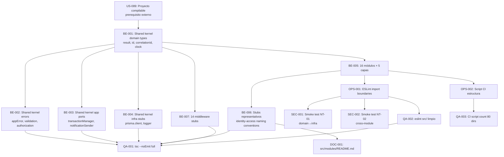

# Development Tasks — PB-P0-002 / US-090: Carpetas por módulo de dominio (feature-first + Clean/Hex)

## 1. Metadata

| Campo | Valor |
|---|---|
| User Story ID | US-090 |
| Source User Story | `management/user-stories/US-090-feature-first-domain-modules.md` |
| Source Technical Specification | `management/technical-specs/P0/PB-P0-002/US-090-technical-spec.md` |
| Decision Resolution Artifact | `management/user-stories/decision-resolutions/US-090-decision-resolution.md` |
| Priority | P0 |
| Backlog ID | PB-P0-002 |
| Backlog Title | Inicializar backend Node + Express + TypeScript con arquitectura Clean/Hexagonal |
| Backlog Execution Order | 2 |
| User Story Position in Backlog Item | 2 de 3 |
| Related User Stories in Backlog Item | US-089, US-090, US-091 |
| Epic | EPIC-BE-001 — Backend Modular Monolith |
| Backlog Item Dependencies | US-089 completada (proyecto compilable con `tsconfig.json` strict mode activo) |
| Feature | Estructura feature-first |
| Module / Domain | Platform/BE |
| Backlog Alignment Status | Found |
| Task Breakdown Status | Ready for Sprint Planning |
| Created Date | 2026-06-11 |
| Last Updated | 2026-06-11 |

---

## 2. Source Validation

| Fuente | Found | Used | Notas |
|---|---|---|---|
| User Story | Yes | Yes | `US-090` — Approved with Minor Notes (11 middlewares debe corregirse a 14) |
| Technical Specification | Yes | Yes | `US-090-technical-spec.md` — Ready for Task Breakdown; usa 14 middlewares como fuente de verdad |
| Decision Resolution Artifact | Yes | Yes | 6 decisiones formalizadas; ninguna bloqueante |
| Product Backlog Prioritized | Yes | Yes | PB-P0-002, posición 2 de 3, depende de US-089 |
| ADRs | Yes | Yes | ADR-ARCH-001 (modular monolith), ADR-ARCH-002 (Clean/Hexagonal), NFR-OBS-006, NFR-SEC-001 |

---

## 3. Backlog Execution Context

### Parent Backlog Item

**PB-P0-002 — Backend Modular Monolith Bootstrap**

Bootstrap del servidor Express, estructura feature-first con capas `Interface/Application/Domain/Ports/Infrastructure`, configuración por env vars, shared kernel y pipeline base de middlewares. Backbone técnico para todos los endpoints REST del MVP.

### Execution Order Rationale

US-090 es desbloqueada por US-089 (proyecto Node.js compilable con strict TypeScript). Su propósito es establecer la convención de carpetas que todas las feature stories del MVP usarán. Sin esta estructura, los desarrolladores de US-091 y de todas las feature stories subsecuentes no tienen un lugar canónico donde colocar el código. Debe completarse antes de que cualquier módulo de dominio sea implementado.

```
US-089 (bootstrap compilable) → US-090 (esta US) → US-091 (middlewares)
```

### Related User Stories in Same Backlog Item

| User Story | Rol en el Backlog Item | Orden sugerido |
|---|---|---|
| US-089 | Servidor Express compilable, config Zod, `GET /health` | 1 — prerequisito bloqueante |
| **US-090** (esta US) | 16 módulos con 5 capas + shared kernel + ESLint import boundaries | 2 |
| US-091 | Pipeline de 14 middlewares transversales de seguridad | 3 — depende de `src/shared/interface/middlewares/` creado en esta US |

---

## 4. Task Breakdown Summary

| Área | Nro. de Tareas | Notas |
|---|---:|---|
| Backend (BE) | 7 | Shared kernel (tipos, errores, ports, infra), middleware stubs, estructura 16 módulos, stubs representativos |
| DevOps / Environment (OPS) | 2 | ESLint import boundaries, script CI de estructura |
| Security / Authorization (SEC) | 2 | Smoke tests ESLint NT-01 (domain→infra) y NT-02 (cross-module) |
| QA / Testing (QA) | 3 | tsc --noEmit, eslint check final, CI script count |
| Observability / Audit (OBS) | 0 | No aplica — sin runtime requests |
| Documentation / Traceability (DOC) | 2 | README naming conventions, corrección "11→14 middlewares" en US-090 |
| **Total** | **16** | |

---

## 5. Traceability Matrix

| Acceptance Criterion | Technical Spec Section | Task IDs |
|---|---|---|
| AC-01: 16 bounded contexts con 5 sub-directorios en `src/modules/` | §7 Modules/Bounded Contexts, §13 CI Checks | TASK-PB-P0-002-US-090-BE-005, TASK-PB-P0-002-US-090-OPS-002, TASK-PB-P0-002-US-090-QA-003 |
| AC-02: Shared kernel en `src/shared/` con tipos base | §7 Shared Kernel Design, §6 Functional Interpretation (AC-02) | TASK-PB-P0-002-US-090-BE-001, TASK-PB-P0-002-US-090-BE-002, TASK-PB-P0-002-US-090-BE-003, TASK-PB-P0-002-US-090-BE-004 |
| AC-03: Regla ESLint de import boundaries configurada | §7 ESLint Import Boundary Rules, §6 Functional Interpretation (AC-03) | TASK-PB-P0-002-US-090-OPS-001, TASK-PB-P0-002-US-090-SEC-001, TASK-PB-P0-002-US-090-SEC-002 |
| AC-04: `tsc --noEmit` sin errores en toda la estructura | §5 Architecture Alignment, §13 CI Checks | TASK-PB-P0-002-US-090-QA-001 |
| AC-05: Convenciones de nombrado per Doc 14 §24.2 | §7 Use Cases, Controllers, Repository, §18 Implementation Guidance | TASK-PB-P0-002-US-090-BE-006, TASK-PB-P0-002-US-090-DOC-001 |
| EC-01: Cross-module import detectado por ESLint | §7 ESLint Import Boundary Rules, §12 Negative Authorization Scenarios | TASK-PB-P0-002-US-090-SEC-002, TASK-PB-P0-002-US-090-QA-002 |
| EC-02: Domain importa infraestructura detectado por ESLint | §7 ESLint Import Boundary Rules, §12 Negative Authorization Scenarios | TASK-PB-P0-002-US-090-SEC-001, TASK-PB-P0-002-US-090-QA-002 |
| 14 middleware stubs en `src/shared/interface/middlewares/` | §7 Shared Kernel (middleware placeholders), §16 Documentation Alignment | TASK-PB-P0-002-US-090-BE-007 |

---

## 6. Development Tasks

---

### TASK-PB-P0-002-US-090-BE-001 — Crear shared kernel: tipos base de dominio (`result.ts`, `id.ts`, `correlation-id.ts`, `clock.port.ts`)

| Campo | Valor |
|---|---|
| Área | Backend |
| Tipo | Implementation |
| Prioridad | Must |
| Estimado | S |
| Depends On | TASK-PB-P0-002-US-089-BE-001 (proyecto Node.js inicializado, tsconfig strict activo) |
| Source AC(s) | AC-02, AC-04 |
| Technical Spec Section(s) | §7 Shared Kernel — Diseño detallado, §6 Functional Interpretation (AC-02) |
| Backlog ID | PB-P0-002 |
| User Story ID | US-090 |
| Owner Role | Backend |
| Status | To Do |

#### Objective

Crear los cuatro tipos utilitarios base del shared kernel en `src/shared/domain/` que serán importados por todos los bounded contexts del MVP. Deben ser compilables con `tsc --noEmit` desde el primer momento.

#### Scope

##### Include

- `src/shared/domain/result.ts`:
  - Tipos `Ok<T>`, `Err<E>`, `Result<T, E>`.
  - Funciones factory `ok<T>(value: T): Ok<T>` y `err<E>(error: E): Err<E>`.
- `src/shared/domain/id.ts`:
  - Branded type `Id = string & { readonly _brand: 'Id' }`.
  - Namespace `Id` con métodos `from(value: string): Id` y `generate(): Id` (usando `crypto.randomUUID()`).
- `src/shared/domain/correlation-id.ts`:
  - Branded type `CorrelationId = string & { readonly _brand: 'CorrelationId' }`.
  - Namespace `CorrelationId` con `generate(): CorrelationId`.
- `src/shared/domain/clock.port.ts`:
  - Interface `ClockPort` con método `now(): Date`.
  - Export de la interfaz.

##### Exclude

- Implementaciones concretas de `ClockPort` (e.g., `SystemClock`) — eso pertenece a `src/shared/infrastructure/`.
- Lógica de persistencia, framework o SDK.
- Entidades de dominio de cualquier bounded context específico.

#### Implementation Notes

- `crypto.randomUUID()` está disponible en Node.js 15+. No importar `uuid` desde npm para `Id.generate()` — usar el módulo nativo.
- Los branded types permiten distinguir en tiempo de compilación entre `string` e `Id`. El cast `value as Id` es el mecanismo estándar para convertir.
- `Result<T, E>` es el tipo funcional para operaciones falibles — su uso evita excepciones no controladas. No debe usarse para errores de infraestructura (esos usan `try/catch`).
- Todos los archivos deben terminar con una exportación válida (no archivos vacíos).

#### Acceptance Criteria Covered

AC-02, AC-04.

#### Definition of Done

- [ ] Los 4 archivos existen en `src/shared/domain/`.
- [ ] `tsc --noEmit` pasa sin errores sobre `src/shared/domain/`.
- [ ] `Result<string, AppError>` es un tipo válido usable en cualquier módulo.
- [ ] `Id.generate()` retorna un `Id` válido (branded string UUID).
- [ ] `ClockPort` es una interfaz exportada correctamente.

---

### TASK-PB-P0-002-US-090-BE-002 — Crear shared kernel: jerarquía de errores de dominio (`app.error.ts`, `validation.error.ts`, `authorization.error.ts`)

| Campo | Valor |
|---|---|
| Área | Backend |
| Tipo | Implementation |
| Prioridad | Must |
| Estimado | S |
| Depends On | TASK-PB-P0-002-US-090-BE-001 |
| Source AC(s) | AC-02, AC-04 |
| Technical Spec Section(s) | §7 Shared Kernel — Diseño detallado (errores) |
| Backlog ID | PB-P0-002 |
| User Story ID | US-090 |
| Owner Role | Backend |
| Status | To Do |

#### Objective

Crear la jerarquía de errores de dominio en `src/shared/domain/errors/` que establece el contrato de error base para todos los bounded contexts.

#### Scope

##### Include

- `src/shared/domain/errors/app.error.ts`:
  - Clase abstracta `AppError extends Error` con campo abstracto `readonly code: string`.
  - Constructor que llama `super(message)` y asigna `this.name = this.constructor.name`.
- `src/shared/domain/errors/validation.error.ts`:
  - Clase `ValidationError extends AppError` con `readonly code = 'VALIDATION_ERROR'`.
  - Campo `readonly details?: Array<{ field: string; message: string }>` en el constructor.
- `src/shared/domain/errors/authorization.error.ts`:
  - Clase `AuthorizationError extends AppError` con `readonly code = 'AUTHORIZATION_ERROR'`.

##### Exclude

- Errores de infraestructura (e.g., `DatabaseError`, `NetworkError`) — esos pertenecen a `infrastructure/`.
- Errores específicos de bounded context (e.g., `EventNotFoundError`) — esos pertenecen al `domain/` de cada módulo.
- Mapping HTTP de errores a status codes (US-091).

#### Implementation Notes

- La clase abstracta `AppError` es la raíz de la jerarquía. Todas las clases de error de dominio del proyecto deben extender de ella.
- `ValidationError` acepta un array de `{ field, message }` para reportar errores de validación con granularidad por campo — compatible con el envelope de error de US-091.
- `AuthorizationError` es el error de dominio para reglas de negocio de autorización (e.g., "Usuario no puede editar este evento"). No es el error HTTP 401/403 — ese mapping ocurre en los middlewares de US-091.
- `this.name = this.constructor.name` garantiza que `error.name` sea `'ValidationError'` en lugar de `'Error'` genérico.

#### Acceptance Criteria Covered

AC-02, AC-04.

#### Definition of Done

- [ ] Los 3 archivos existen en `src/shared/domain/errors/`.
- [ ] `tsc --noEmit` pasa sin errores sobre `src/shared/domain/errors/`.
- [ ] `new ValidationError('invalid', [{ field: 'email', message: 'Invalid email' }])` compila sin errores.
- [ ] `new AuthorizationError('forbidden')` compila sin errores.
- [ ] `AppError` es abstracta (no instanciable directamente).

---

### TASK-PB-P0-002-US-090-BE-003 — Crear shared kernel: ports de aplicación (`transaction-manager.port.ts`, `notification-sender.port.ts`)

| Campo | Valor |
|---|---|
| Área | Backend |
| Tipo | Implementation |
| Prioridad | Must |
| Estimado | XS |
| Depends On | TASK-PB-P0-002-US-090-BE-001 |
| Source AC(s) | AC-02, AC-04 |
| Technical Spec Section(s) | §7 Shared Kernel (shared/application ports) |
| Backlog ID | PB-P0-002 |
| User Story ID | US-090 |
| Owner Role | Backend |
| Status | To Do |

#### Objective

Crear los ports de aplicación transversales en `src/shared/application/` — interfaces abstractas que los use cases de dominio pueden referenciar sin acoplarse a implementaciones concretas.

#### Scope

##### Include

- `src/shared/application/transaction-manager.port.ts`:
  - Interface `TransactionManagerPort` con método stub (puede ser vacío o con firma básica `run<T>(fn: () => Promise<T>): Promise<T>`).
- `src/shared/application/notification-sender.port.ts`:
  - Interface `NotificationSenderPort` con método stub (puede ser vacío o con firma básica `send(notification: unknown): Promise<void>`).

##### Exclude

- Implementaciones concretas (e.g., `PrismaTransactionManager`, `EmailNotificationSender`) — esas pertenecen a `src/shared/infrastructure/`.
- Lógica de negocio en los ports.

#### Implementation Notes

- Los ports son interfaces puras — no contienen lógica. La simplicidad es intencional.
- Si los tipos exactos de parámetros no están definidos aún, usar `unknown` como tipo placeholder — se refinarán en las feature stories que implementen estos ports.
- `TransactionManagerPort` será implementado por el adaptador Prisma en PB-P0-001/PB-P0-003.

#### Acceptance Criteria Covered

AC-02, AC-04.

#### Definition of Done

- [ ] Los 2 archivos existen en `src/shared/application/`.
- [ ] `tsc --noEmit` pasa sin errores sobre `src/shared/application/`.
- [ ] Ambas interfaces están correctamente exportadas.

---

### TASK-PB-P0-002-US-090-BE-004 — Crear shared kernel: infrastructure stubs (`prisma.client.ts`, `logger/`)

| Campo | Valor |
|---|---|
| Área | Backend |
| Tipo | Implementation |
| Prioridad | Must |
| Estimado | XS |
| Depends On | TASK-PB-P0-002-US-090-BE-001, TASK-PB-P0-002-US-089-BE-001 (Prisma instalado) |
| Source AC(s) | AC-02, AC-04 |
| Technical Spec Section(s) | §7 Shared Kernel (shared/infrastructure), §10 Database/Prisma Design |
| Backlog ID | PB-P0-002 |
| User Story ID | US-090 |
| Owner Role | Backend |
| Status | To Do |

#### Objective

Crear los stubs de infraestructura compartida: el singleton de Prisma Client y el placeholder del logger, para que las feature stories futuras tengan un punto de importación canónico.

#### Scope

##### Include

- `src/shared/infrastructure/prisma/prisma.client.ts`:
  - Import de `PrismaClient` desde `@prisma/client`.
  - Export `export const prisma = new PrismaClient()` como singleton.
- `src/shared/infrastructure/logger/index.ts`:
  - Export vacío o stub mínimo (`export const logger = { info: console.log, error: console.error, warn: console.warn, debug: console.debug }`).

##### Exclude

- Logger estructurado con JSON o integración a observabilidad avanzada (PB-P0-003).
- Configuración avanzada de Prisma (log levels, query logging) — PB-P0-001.
- Prisma schema ni migraciones — PB-P0-001.

#### Implementation Notes

- El `PrismaClient` singleton en `prisma.client.ts` es el adaptador de acceso a datos que todos los repositorios del MVP importarán. Su creación como singleton previene el problema de "too many Prisma Client connections" en desarrollo.
- El logger stub es suficiente para US-090. La implementación real (con `pino` o similar) pertenece a PB-P0-003 o a un backlog item de observabilidad.
- Si `@prisma/client` no está generado aún (sin schema), el import puede dar advertencias. Esto es aceptable — el stub compila aunque el schema no exista todavía.

#### Acceptance Criteria Covered

AC-02, AC-04.

#### Definition of Done

- [ ] `src/shared/infrastructure/prisma/prisma.client.ts` existe y exporta `prisma`.
- [ ] `src/shared/infrastructure/logger/index.ts` existe y exporta `logger`.
- [ ] `tsc --noEmit` pasa sin errores sobre `src/shared/infrastructure/`.

---

### TASK-PB-P0-002-US-090-BE-005 — Crear estructura de 16 bounded contexts × 5 capas en `src/modules/`

| Campo | Valor |
|---|---|
| Área | Backend |
| Tipo | Implementation |
| Prioridad | Must |
| Estimado | M |
| Depends On | TASK-PB-P0-002-US-090-BE-001 (shared kernel disponible para verificar imports) |
| Source AC(s) | AC-01, AC-04 |
| Technical Spec Section(s) | §7 Modules/Bounded Contexts, §18 Implementation Guidance (árbol de archivos) |
| Backlog ID | PB-P0-002 |
| User Story ID | US-090 |
| Owner Role | Backend |
| Status | To Do |

#### Objective

Crear los 80 directorios (16 bounded contexts × 5 capas) bajo `src/modules/`, cada uno con al menos un archivo TypeScript válido que permita que `tsc --noEmit` reconozca la estructura.

#### Scope

##### Include

- Los **16 bounded contexts canónicos** en `src/modules/` (exactamente estos nombres en kebab-case):
  - `identity-access`, `user-profile`, `event-planning`, `task-management`, `budget-management`, `vendor-management`, `service-catalog`, `quote-flow`, `booking-intent`, `reviews-moderation`, `notifications`, `ai-assistance`, `admin-governance`, `attachments`, `localization`, `seed-demo`.
- **5 capas por módulo**: `interface/`, `application/`, `domain/`, `ports/`, `infrastructure/`.
- En cada directorio: archivo `index.ts` con `export {}` como mínimo (o stub compilable).
- **Excepción**: `identity-access/` debe tener stubs con nombres per Doc 14 §24.2 en lugar de `index.ts` genérico (ver TASK-BE-006).

##### Exclude

- Lógica de negocio en ningún archivo.
- Entidades de dominio con atributos específicos.
- Métodos funcionales en repositorios o use cases (solo stubs vacíos o `export {}`).
- Módulos adicionales a los 16 canónicos.

#### Implementation Notes

- La forma más eficiente es un script o un bucle en shell para crear la estructura, pero el resultado final debe ser verificado manualmente para asegurar que los 16 módulos tienen exactamente 5 sub-capas.
- Los `index.ts` con `export {}` son el mínimo viable para que TypeScript reconozca el directorio como un módulo.
- El CI script de OPS-002 verificará que `find src/modules -mindepth 2 -maxdepth 2 -type d | wc -l` retorna `80`.
- Los nombres de módulo deben coincidir exactamente con Doc 14 §9 — ningún módulo adicional ni renombrado.

#### Acceptance Criteria Covered

AC-01, AC-04.

#### Definition of Done

- [ ] `find src/modules -mindepth 1 -maxdepth 1 -type d | wc -l` = 16.
- [ ] `find src/modules -mindepth 2 -maxdepth 2 -type d | wc -l` = 80.
- [ ] Cada directorio de capa contiene al menos un archivo TypeScript válido.
- [ ] `tsc --noEmit` pasa sin errores sobre `src/modules/`.
- [ ] Los 16 nombres de módulos son exactamente los de Doc 14 §9 en kebab-case.

---

### TASK-PB-P0-002-US-090-BE-006 — Stubs representativos con naming conventions en `identity-access/`

| Campo | Valor |
|---|---|
| Área | Backend |
| Tipo | Implementation |
| Prioridad | Must |
| Estimado | S |
| Depends On | TASK-PB-P0-002-US-090-BE-005 |
| Source AC(s) | AC-05 |
| Technical Spec Section(s) | §7 Use Cases, Controllers/Routes, Repository/Persistence, §18 Implementation Guidance |
| Backlog ID | PB-P0-002 |
| User Story ID | US-090 |
| Owner Role | Backend |
| Status | To Do |

#### Objective

Crear archivos placeholder en `identity-access/` con los nombres canónicos de Doc 14 §24.2 para servir como referencia de naming conventions para todas las feature stories subsecuentes.

#### Scope

##### Include

- `src/modules/identity-access/interface/identity-access.controller.ts`:
  - `export class IdentityAccessController {}`
- `src/modules/identity-access/interface/identity-access.routes.ts`:
  - `import { Router } from 'express'; export const identityAccessRouter = Router();`
- `src/modules/identity-access/application/register-user.use-case.ts`:
  - `export class RegisterUserUseCase {}`
- `src/modules/identity-access/ports/user.repository.ts`:
  - `export interface UserRepository {}`
- `src/modules/identity-access/infrastructure/prisma-user.repository.ts`:
  - `import type { UserRepository } from '../ports/user.repository'; export class PrismaUserRepository implements UserRepository {}`
- `src/modules/identity-access/domain/index.ts`:
  - `export {}`

##### Exclude

- Implementación de ningún método en las clases (solo declaraciones de clase/interfaz vacías).
- Lógica de autenticación (feature story de identity-access).
- Stubs representativos en los otros 15 módulos — para esos es suficiente el `index.ts` genérico de BE-005.

#### Implementation Notes

- El propósito de estos stubs no es implementar `identity-access` — es demostrar los patrones de naming que todos los desarrolladores deben seguir en sus feature stories.
- Los nombres deben seguir exactamente el patrón de Doc 14 §24.2:
  - Use case: `<verb>-<entity>.use-case.ts`
  - Repository port: `<entity>.repository.ts`
  - Repository adapter: `prisma-<entity>.repository.ts`
  - Controller: `<feature>.controller.ts`
  - Routes: `<feature>.routes.ts`
- `PrismaUserRepository implements UserRepository {}` puede generar error de TypeScript si `UserRepository` tiene métodos abstractos — dado que `UserRepository` es una interfaz vacía en esta US, no habrá error. Cuando se añadan métodos en la feature story, se actualizará.

#### Acceptance Criteria Covered

AC-05.

#### Definition of Done

- [ ] Los 6 archivos existen en las capas correctas de `identity-access/`.
- [ ] Los nombres de archivo siguen exactamente el patrón de Doc 14 §24.2.
- [ ] `tsc --noEmit` pasa sin errores sobre `src/modules/identity-access/`.
- [ ] `PrismaUserRepository implements UserRepository` compila sin errores.

---

### TASK-PB-P0-002-US-090-BE-007 — Crear 14 archivos placeholder de middlewares en `src/shared/interface/middlewares/`

| Campo | Valor |
|---|---|
| Área | Backend |
| Tipo | Implementation |
| Prioridad | Must |
| Estimado | S |
| Depends On | TASK-PB-P0-002-US-090-BE-001 |
| Source AC(s) | AC-04 (compilabilidad), prerequisito para US-091 |
| Technical Spec Section(s) | §7 Shared Kernel (middleware placeholders), §4 Scope Boundary (In Scope) |
| Backlog ID | PB-P0-002 |
| User Story ID | US-090 |
| Owner Role | Backend |
| Status | To Do |

#### Objective

Crear los 14 archivos placeholder de middlewares en `src/shared/interface/middlewares/` para que US-091 tenga un directorio base donde implementar cada middleware. Los placeholders deben ser stubs `RequestHandler` compilables.

#### Scope

##### Include

Los 14 archivos (exactamente estos nombres):

- `correlation-id.middleware.ts`
- `request-logger.middleware.ts`
- `json-body-parser.middleware.ts`
- `cors.middleware.ts`
- `helmet.middleware.ts`
- `rate-limit.middleware.ts`
- `auth.middleware.ts`
- `captcha-verification.middleware.ts`
- `role.middleware.ts`
- `ownership.middleware.ts`
- `validate-request.middleware.ts`
- `file-upload.middleware.ts`
- `not-found.middleware.ts`
- `error-handler.middleware.ts`

Cada archivo exporta un stub mínimo compilable, por ejemplo:

```typescript
import type { RequestHandler } from 'express';
export const correlationIdMiddleware: RequestHandler = (_req, _res, next) => next();
```

**Excepción**: `error-handler.middleware.ts` debe exportar un stub con 4 argumentos (firma de error handler):

```typescript
import type { ErrorRequestHandler } from 'express';
export const errorHandlerMiddleware: ErrorRequestHandler = (_err, _req, res, _next) =>
  res.status(500).json({ code: 'INTERNAL_ERROR', message: 'Internal server error' });
```

##### Exclude

- Implementación real de ningún middleware (US-091).
- Imports de JWT, bcrypt, Prisma u otros módulos — los stubs usan solo tipos de Express.
- Pruebas de los middlewares (US-091).

#### Implementation Notes

- **14 archivos, no 11** — corrección de la minor note del Approval Gate de US-090. El número correcto es 14 per Doc 14 §8.2, §16 y US-091 technical spec.
- Los stubs con `RequestHandler` type importado de Express son compilables sin lógica real.
- `not-found.middleware.ts` puede usar un stub que responda 404, o simplemente `next()`.
- `error-handler.middleware.ts` DEBE tener 4 argumentos — Express identifica el error handler por aridad.
- US-091 implementará el contenido real de estos archivos. Esta tarea solo crea el directorio y los stubs.

#### Acceptance Criteria Covered

AC-04 (compilabilidad de los stubs), prerequisito estructural para US-091.

#### Definition of Done

- [ ] Exactamente 14 archivos en `src/shared/interface/middlewares/`.
- [ ] Los 14 nombres coinciden exactamente con la lista de la spec.
- [ ] `tsc --noEmit` pasa sin errores sobre `src/shared/interface/middlewares/`.
- [ ] `error-handler.middleware.ts` exporta un handler de 4 argumentos.
- [ ] Ningún archivo importa módulos que no sean tipos de Express.

---

### TASK-PB-P0-002-US-090-OPS-001 — Configurar ESLint con reglas de import boundaries en `.eslintrc.js`

| Campo | Valor |
|---|---|
| Área | DevOps / Environment |
| Tipo | Setup |
| Prioridad | Must |
| Estimado | M |
| Depends On | TASK-PB-P0-002-US-090-BE-005 (módulos existen para poder testear las reglas) |
| Source AC(s) | AC-03, EC-01, EC-02 |
| Technical Spec Section(s) | §7 ESLint Import Boundary Rules, §5 Architecture Alignment (Security) |
| Backlog ID | PB-P0-002 |
| User Story ID | US-090 |
| Owner Role | Backend / Tech Lead |
| Status | To Do |

#### Objective

Configurar ESLint con las reglas de import boundaries que convierten ADR-ARCH-001 (no cross-module imports) y ADR-ARCH-002 (domain no importa infraestructura) en errores de lint automáticamente verificables en CI.

#### Scope

##### Include

- Instalar devDependency: `eslint-plugin-boundaries` **o** `eslint-plugin-import` con `import/no-restricted-paths` — el Tech Lead elige cuál; ambas son aceptables.
- Configurar `.eslintrc.js` con:

  **Regla Tipo 1 — Cross-module imports (ADR-ARCH-001)**:
  Prohibir imports directos entre `src/modules/<modulo-A>/` y `src/modules/<modulo-B>/`. Solo se permite importar desde `src/shared/`.

  **Regla Tipo 2 — Domain no importa infraestructura (ADR-ARCH-002)**:
  En `src/modules/*/domain/**/*.ts` y `src/shared/domain/**/*.ts`, prohibir imports de `@prisma/client`, `express`, `openai`, `aws-sdk`, `multer`.

- Las reglas deben generar **error** (severity 2), no warning.
- `npm run lint` (`eslint src/`) debe pasar sin errores sobre la estructura actual (stubs válidos).
- Los smoke tests NT-01 y NT-02 son gestionados en TASK-SEC-001 y TASK-SEC-002.

##### Exclude

- Configuración de otras reglas de ESLint (ya configuradas en US-089 con `@typescript-eslint`).
- Formateo con Prettier — fuera de scope.
- Reglas de lint de frontend (Next.js, React) — pertenecen a PB-P0-FE.

#### Implementation Notes

- **`eslint-plugin-boundaries`** es el enfoque recomendado por su expresividad para definir tipos de elementos (`module`, `shared`) y restricciones globales.
- Si se usa `import/no-restricted-paths`, requiere una entrada por par de módulos — más verboso pero sin dependencia adicional.
- La regla de Tipo 2 puede implementarse con `no-restricted-imports` en un `overrides` bloque de ESLint — más simple que `boundaries` para este caso.
- Después de instalar el plugin, ejecutar `npm run lint` sobre la estructura actual para confirmar que no hay falsos positivos en los stubs existentes.

#### Acceptance Criteria Covered

AC-03, EC-01, EC-02.

#### Definition of Done

- [ ] `eslint-plugin-boundaries` o equivalente instalado en devDependencies.
- [ ] `.eslintrc.js` contiene reglas de Tipo 1 (cross-module) y Tipo 2 (domain→infra).
- [ ] Las reglas tienen severity `error` (2), no `warn` (1).
- [ ] `npm run lint` pasa sobre la estructura actual de stubs sin falsos positivos.
- [ ] `package.json` refleja la nueva devDependency.

---

### TASK-PB-P0-002-US-090-OPS-002 — Script CI para verificar estructura de 16 módulos × 5 capas

| Campo | Valor |
|---|---|
| Área | DevOps / Environment |
| Tipo | Setup |
| Prioridad | Should |
| Estimado | S |
| Depends On | TASK-PB-P0-002-US-090-BE-005 |
| Source AC(s) | AC-01 |
| Technical Spec Section(s) | §7 Validation Rules (VR-01), §13 CI Checks |
| Backlog ID | PB-P0-002 |
| User Story ID | US-090 |
| Owner Role | DevOps / Backend |
| Status | To Do |

#### Objective

Crear un script de verificación que confirme que existen exactamente 16 módulos con 5 sub-capas cada uno (80 directorios totales), para que este invariante estructural sea verificable en CI.

#### Scope

##### Include

- Script en `package.json` o en `scripts/check-structure.sh`:

  ```bash
  # Verificar 16 módulos
  MODULE_COUNT=$(find src/modules -mindepth 1 -maxdepth 1 -type d | wc -l | tr -d ' ')
  if [ "$MODULE_COUNT" != "16" ]; then
    echo "ERROR: Expected 16 modules, found $MODULE_COUNT"; exit 1
  fi
  # Verificar 80 sub-capas
  LAYER_COUNT=$(find src/modules -mindepth 2 -maxdepth 2 -type d | wc -l | tr -d ' ')
  if [ "$LAYER_COUNT" != "80" ]; then
    echo "ERROR: Expected 80 layer directories, found $LAYER_COUNT"; exit 1
  fi
  echo "Structure check passed: 16 modules × 5 layers = 80 directories"
  ```

- Script en `package.json` como `"check:structure": "bash scripts/check-structure.sh"`.

##### Exclude

- CI/CD pipeline (PB-P0-017) — este script es la base; su integración en CI pertenece a ese backlog item.
- Verificación de contenido de archivos — solo cuenta de directorios.

#### Implementation Notes

- `wc -l | tr -d ' '` elimina espacios para comparación string en bash.
- El script debe ser ejecutable: `chmod +x scripts/check-structure.sh`.
- Para verificación en Windows, considerar una versión Node.js del script como alternativa cross-platform — pero para el MVP el script bash es suficiente.

#### Acceptance Criteria Covered

AC-01.

#### Definition of Done

- [ ] `scripts/check-structure.sh` existe y es ejecutable.
- [ ] `npm run check:structure` pasa sin errores con la estructura de 16 × 5.
- [ ] `npm run check:structure` falla si se elimina un módulo.

---

### TASK-PB-P0-002-US-090-SEC-001 — Smoke test ESLint NT-01: domain importa `@prisma/client` → error

| Campo | Valor |
|---|---|
| Área | Security / Authorization |
| Tipo | Review |
| Prioridad | Must |
| Estimado | S |
| Depends On | TASK-PB-P0-002-US-090-OPS-001 |
| Source AC(s) | AC-03, EC-02 |
| Technical Spec Section(s) | §7 ESLint Import Boundary Rules (Tipo 2), §12 Negative Authorization Scenarios, §13 Security Tests (NT-01) |
| Backlog ID | PB-P0-002 |
| User Story ID | US-090 |
| Owner Role | QA / Tech Lead |
| Status | To Do |

#### Objective

Verificar que ESLint detecta y reporta como error cuando un archivo en la capa `domain/` importa `@prisma/client` — confirmando que la regla de Tipo 2 (ADR-ARCH-002) está activa.

#### Scope

##### Include

- Crear un archivo fixture temporal en `src/modules/event-planning/domain/test-violation.ts` con contenido:
  ```typescript
  import { PrismaClient } from '@prisma/client'; // violación deliberada
  export const db = new PrismaClient();
  ```
- Ejecutar `eslint src/modules/event-planning/domain/test-violation.ts` y verificar que retorna exit code ≠ 0 con mensaje de error referenciando la regla de import boundary.
- Eliminar el archivo fixture después de la verificación.
- Documentar el resultado en el PR description.

##### Exclude

- Dejar el archivo fixture permanentemente en el repositorio.
- Tests automatizados de Vitest para ESLint (es suficiente la verificación manual + documentación en PR).

#### Implementation Notes

- Si la regla retorna `warning` en lugar de `error`, volver a TASK-OPS-001 y corregir la severity de la regla a `2`.
- El smoke test puede hacerse una vez durante el sprint review. No necesita ser parte del CI habitual — el CI ejecuta `eslint src/` sobre el código real (que no tendrá esta violación).
- Documentar el resultado del smoke test en el PR description de US-090.

#### Acceptance Criteria Covered

AC-03, EC-02.

#### Definition of Done

- [ ] Archivo fixture creado con import de `@prisma/client` en capa `domain/`.
- [ ] `eslint src/modules/event-planning/domain/test-violation.ts` retorna exit code ≠ 0.
- [ ] El mensaje de error menciona la regla de import boundary.
- [ ] Archivo fixture eliminado antes del merge.
- [ ] Resultado documentado en PR.

---

### TASK-PB-P0-002-US-090-SEC-002 — Smoke test ESLint NT-02: import directo cross-module → error

| Campo | Valor |
|---|---|
| Área | Security / Authorization |
| Tipo | Review |
| Prioridad | Must |
| Estimado | S |
| Depends On | TASK-PB-P0-002-US-090-OPS-001 |
| Source AC(s) | AC-03, EC-01 |
| Technical Spec Section(s) | §7 ESLint Import Boundary Rules (Tipo 1), §12 Negative Authorization Scenarios, §13 Security Tests (NT-02) |
| Backlog ID | PB-P0-002 |
| User Story ID | US-090 |
| Owner Role | QA / Tech Lead |
| Status | To Do |

#### Objective

Verificar que ESLint detecta y reporta como error cuando un módulo importa directamente del `domain/` de otro módulo — confirmando que la regla de Tipo 1 (ADR-ARCH-001) está activa.

#### Scope

##### Include

- Crear un archivo fixture temporal en `src/modules/event-planning/domain/test-cross-module.ts` con contenido:
  ```typescript
  // violación deliberada: cross-module import
  import something from '../../quote-flow/domain/index';
  export { something };
  ```
- Ejecutar `eslint src/modules/event-planning/domain/test-cross-module.ts` y verificar exit code ≠ 0.
- Eliminar el archivo fixture después de la verificación.
- Documentar el resultado en el PR description.

##### Exclude

- Dejar el archivo fixture en el repositorio.
- Verificación de que los barrels públicos (`index.ts` del módulo) sí están permitidos — esa granularidad se configura en feature stories.

#### Implementation Notes

- Si se usa `eslint-plugin-boundaries`, la regla puede necesitar que los módulos estén registrados como elementos con tipo `module` para que la restricción sea efectiva. Verificar la configuración contra la documentación del plugin.
- Si el smoke test pasa (exit code 0 cuando debería ser ≠ 0), revisar la configuración de `boundaries/element-types` en `.eslintrc.js`.

#### Acceptance Criteria Covered

AC-03, EC-01.

#### Definition of Done

- [ ] Archivo fixture creado con cross-module import.
- [ ] `eslint src/modules/event-planning/domain/test-cross-module.ts` retorna exit code ≠ 0.
- [ ] El mensaje de error menciona la regla de boundaries/cross-module.
- [ ] Archivo fixture eliminado antes del merge.
- [ ] Resultado documentado en PR.

---

### TASK-PB-P0-002-US-090-QA-001 — `tsc --noEmit` sobre toda la estructura `src/`

| Campo | Valor |
|---|---|
| Área | QA / Testing |
| Tipo | Test |
| Prioridad | Must |
| Estimado | XS |
| Depends On | TASK-PB-P0-002-US-090-BE-001, TASK-PB-P0-002-US-090-BE-002, TASK-PB-P0-002-US-090-BE-003, TASK-PB-P0-002-US-090-BE-004, TASK-PB-P0-002-US-090-BE-005, TASK-PB-P0-002-US-090-BE-006, TASK-PB-P0-002-US-090-BE-007 |
| Source AC(s) | AC-04 |
| Technical Spec Section(s) | §5 Testing Architecture (tsc), §13 CI Checks |
| Backlog ID | PB-P0-002 |
| User Story ID | US-090 |
| Owner Role | QA / Backend |
| Status | To Do |

#### Objective

Verificar que `tsc --noEmit` pasa sin errores sobre toda la estructura `src/` — incluyendo `src/shared/`, `src/modules/`, y todos los stubs creados en esta US.

#### Scope

##### Include

- **TS-03**: `npm run typecheck` (`tsc --noEmit`) pasa sin errores sobre `src/shared/domain/`.
- **TS-02** (extensión): `tsc --noEmit` pasa sobre `src/modules/` incluyendo los stubs de los 16 módulos.
- **TS-Full**: `tsc --noEmit` pasa sobre toda la estructura `src/` combinada (incluyendo `src/app.ts`, `src/server.ts`, `src/config/env.ts` de US-089 + nuevos archivos de US-090).

##### Exclude

- Tests unitarios complejos de los tipos del shared kernel — `tsc --noEmit` es suficiente para esta US.

#### Implementation Notes

- Si `tsc --noEmit` falla por tipos de `@prisma/client` no generados, el stub de `prisma.client.ts` puede usar `// @ts-ignore` temporalmente — pero preferir resolverlo importando correctamente o usando un `declare module` stub.
- Si falla en algún archivo de módulo, identificar el archivo y verificar que exporta algo válido (no archivo vacío sin `export {}`).

#### Acceptance Criteria Covered

AC-04.

#### Definition of Done

- [ ] `npm run typecheck` — exit code 0 sobre toda la estructura `src/`.
- [ ] No hay errores de tipo en `src/shared/domain/`.
- [ ] No hay errores de tipo en `src/modules/` (incluyendo los 16 módulos × 5 capas).
- [ ] No hay errores de tipo en `src/shared/interface/middlewares/` (14 stubs).

---

### TASK-PB-P0-002-US-090-QA-002 — `eslint src/` limpio sobre la estructura final de stubs

| Campo | Valor |
|---|---|
| Área | QA / Testing |
| Tipo | Test |
| Prioridad | Must |
| Estimado | XS |
| Depends On | TASK-PB-P0-002-US-090-OPS-001, TASK-PB-P0-002-US-090-BE-005, TASK-PB-P0-002-US-090-BE-006, TASK-PB-P0-002-US-090-BE-007 |
| Source AC(s) | AC-03, AC-04 |
| Technical Spec Section(s) | §13 CI Checks, §7 ESLint Import Boundary Rules |
| Backlog ID | PB-P0-002 |
| User Story ID | US-090 |
| Owner Role | QA / Backend |
| Status | To Do |

#### Objective

Verificar que `eslint src/` pasa sin errores sobre la estructura final de stubs válidos — confirmando que las reglas de import boundaries no generan falsos positivos sobre el código legítimo de esta US.

#### Scope

##### Include

- **TS-01** (lint): `npm run lint` (`eslint src/`) — exit code 0 sobre todos los stubs válidos.
- Verificar que los stubs de `identity-access/` no violan ninguna regla de import boundary (solo importan de Express o de `src/shared/`).
- Verificar que `src/shared/infrastructure/prisma/prisma.client.ts` no es bloqueado por la regla de Tipo 2 (ese archivo SÍ puede importar `@prisma/client` — está en `infrastructure/`, no en `domain/`).

##### Exclude

- Verificación de los smoke tests NT-01 y NT-02 (esos están en TASK-SEC-001 y TASK-SEC-002).

#### Implementation Notes

- Si `eslint src/` reporta errores en los stubs legítimos, revisar la configuración de `.eslintrc.js` — posiblemente las rutas de `overrides` son demasiado amplias.
- `prisma.client.ts` está en `src/shared/infrastructure/` — la regla de Tipo 2 aplica solo a `domain/`, no a `infrastructure/`. Verificar que la regla no es demasiado permisiva o demasiado restrictiva.

#### Acceptance Criteria Covered

AC-03, AC-04.

#### Definition of Done

- [ ] `npm run lint` — exit code 0 sobre `src/`.
- [ ] `src/shared/infrastructure/prisma/prisma.client.ts` no es bloqueado por la regla de domain-no-infra.
- [ ] Los stubs de `identity-access/` no generan errores de lint.
- [ ] No hay falsos positivos en ningún stubs creado en esta US.

---

### TASK-PB-P0-002-US-090-QA-003 — CI script: verificar count de directorios (16 módulos × 5 capas = 80)

| Campo | Valor |
|---|---|
| Área | QA / Testing |
| Tipo | Test |
| Prioridad | Should |
| Estimado | XS |
| Depends On | TASK-PB-P0-002-US-090-OPS-002, TASK-PB-P0-002-US-090-BE-005 |
| Source AC(s) | AC-01 |
| Technical Spec Section(s) | §7 Validation Rules (VR-01), §13 CI Checks |
| Backlog ID | PB-P0-002 |
| User Story ID | US-090 |
| Owner Role | QA / DevOps |
| Status | To Do |

#### Objective

Ejecutar el CI script de estructura y verificar que reporta exactamente 16 módulos con 80 sub-capas.

#### Scope

##### Include

- **TS-01** (estructura): `npm run check:structure` — pasa con exit code 0 y mensaje "Structure check passed: 16 modules × 5 layers = 80 directories".
- Verificar que el script falla si se elimina temporalmente un directorio de capa (test negativo manual).

##### Exclude

- Integración del script en CI/CD pipeline (PB-P0-017).

#### Implementation Notes

- Esta tarea es la verificación funcional del script creado en TASK-OPS-002.

#### Acceptance Criteria Covered

AC-01.

#### Definition of Done

- [ ] `npm run check:structure` — exit code 0.
- [ ] Output contiene "16 modules × 5 layers = 80 directories".
- [ ] El script falla si se añade un módulo extra (17 módulos → falla).

---

### TASK-PB-P0-002-US-090-DOC-001 — Crear `src/modules/README.md` con tabla de naming conventions

| Campo | Valor |
|---|---|
| Área | Documentation / Traceability |
| Tipo | Documentation |
| Prioridad | Should |
| Estimado | S |
| Depends On | TASK-PB-P0-002-US-090-BE-006 |
| Source AC(s) | AC-05 |
| Technical Spec Section(s) | §18 Implementation Guidance (árbol de archivos), §4 In Scope |
| Backlog ID | PB-P0-002 |
| User Story ID | US-090 |
| Owner Role | Tech Lead / Backend |
| Status | To Do |

#### Objective

Crear `src/modules/README.md` con la tabla de naming conventions per Doc 14 §24.2 para que todos los desarrolladores que implementen feature stories encuentren las convenciones de forma inmediata al explorar el repositorio.

#### Scope

##### Include

- `src/modules/README.md` con:
  - Lista de los 16 bounded contexts.
  - Tabla de naming conventions per Doc 14 §24.2 con columnas: `Tipo de archivo`, `Patrón de nombre`, `Ejemplo`.
  - Referencia a ADR-ARCH-001, ADR-ARCH-002 y Doc 14 §24.2.
  - Recordatorio de que ningún módulo puede importar directamente de otro módulo.

##### Exclude

- Documentación de arquitectura detallada — eso ya existe en Doc 14.
- Descripción funcional de cada bounded context — eso pertenece al Domain Discovery Report.

#### Implementation Notes

- El README debe ser conciso y operacional — su objetivo es guiar a un desarrollador que está a punto de crear su primera feature story.
- Incluir el árbol de carpetas de `identity-access/` como ejemplo representativo.

#### Acceptance Criteria Covered

AC-05.

#### Definition of Done

- [ ] `src/modules/README.md` existe.
- [ ] Tabla de naming conventions incluye los 4 patrones de Doc 14 §24.2.
- [ ] Lista de 16 bounded contexts correcta y completa.
- [ ] Referencia a ADR-ARCH-001 y ADR-ARCH-002 incluida.

---

### TASK-PB-P0-002-US-090-DOC-002 — Corregir "11 middlewares" → "14 middlewares" en Technical Notes de US-090

| Campo | Valor |
|---|---|
| Área | Documentation / Traceability |
| Tipo | Documentation |
| Prioridad | Could |
| Estimado | XS |
| Depends On | — |
| Source AC(s) | — (corrección de minor note del Approval Gate) |
| Technical Spec Section(s) | §16 Documentation Alignment Required |
| Backlog ID | PB-P0-002 |
| User Story ID | US-090 |
| Owner Role | Tech Lead / PO |
| Status | To Do |

#### Objective

Corregir la inconsistencia identificada en el Approval Gate: el campo Technical Notes de US-090 menciona "11 middlewares de Doc 14 §8.2" cuando el número correcto es 14.

#### Scope

##### Include

- En `management/user-stories/US-090-feature-first-domain-modules.md`, campo Technical Notes: cambiar "11 middlewares" → "14 middlewares".

##### Exclude

- Modificar ningún otro campo de la US.
- Modificar el Technical Specification (ya usa 14 como fuente de verdad).

#### Implementation Notes

- La fuente de verdad es Doc 14 §8.2 + §16 + US-091 technical spec — los 14 middlewares son: `correlationId`, `requestLogger`, `jsonBodyParser`, `cors`, `helmet`, `rateLimit` (global), `auth`, `captcha`, `role`, `ownership`, `validate`, `fileUpload` (per-route) + `notFound`, `errorHandler` (catch-all).

#### Acceptance Criteria Covered

N/A — corrección de minor note del Approval Gate.

#### Definition of Done

- [ ] El campo Technical Notes de US-090 dice "14 middlewares" (no "11").
- [ ] El cambio está en el archivo `US-090-feature-first-domain-modules.md`.

---

## 7. Required QA Tasks

| Task ID | Test Type | Propósito |
|---|---|---|
| TASK-PB-P0-002-US-090-QA-001 | Build / TypeCheck (tsc) | Verificar que `tsc --noEmit` pasa sobre toda la estructura `src/` incluyendo shared kernel y 16 módulos |
| TASK-PB-P0-002-US-090-QA-002 | Lint (ESLint) | Verificar que `eslint src/` pasa sin falsos positivos sobre los stubs válidos con las reglas de import boundaries activas |
| TASK-PB-P0-002-US-090-QA-003 | CI / Structural Check | Verificar que el script de estructura reporta exactamente 16 módulos × 5 capas = 80 directorios |

---

## 8. Required Security Tasks

| Task ID | Security Concern | Propósito |
|---|---|---|
| TASK-PB-P0-002-US-090-SEC-001 | Domain importa infraestructura (NT-01) | Confirmar que ESLint detecta como error cuando `domain/` importa `@prisma/client` — enforcement de ADR-ARCH-002 |
| TASK-PB-P0-002-US-090-SEC-002 | Import directo cross-module (NT-02) | Confirmar que ESLint detecta como error cuando un módulo importa del `domain/` de otro módulo — enforcement de ADR-ARCH-001 |

---

## 9. Required Seed / Demo Tasks

No aplica — US-090 no crea ni modifica datos de seed o demo.

---

## 10. Observability / Audit Tasks

No aplica — US-090 no genera runtime events, requests ni acciones de admin.

---

## 11. Documentation / Traceability Tasks

| Task ID | Documento / Artefacto | Propósito |
|---|---|---|
| TASK-PB-P0-002-US-090-DOC-001 | `src/modules/README.md` (nuevo) | Documentar naming conventions per Doc 14 §24.2 para guía de desarrolladores |
| TASK-PB-P0-002-US-090-DOC-002 | `management/user-stories/US-090-feature-first-domain-modules.md` | Corregir "11 middlewares" → "14 middlewares" en Technical Notes (minor note del Approval Gate) |

---

## 12. Dependency Graph



---

## 13. Suggested Implementation Order

### Phase 1 — Shared Kernel (prerequisito para todo lo demás)

1. **TASK-BE-001** — Tipos base de dominio: `result.ts`, `id.ts`, `correlation-id.ts`, `clock.port.ts`.
2. **TASK-BE-002** — Errores de dominio: `app.error.ts`, `validation.error.ts`, `authorization.error.ts`.
3. **TASK-BE-003** — Ports de aplicación: `transaction-manager.port.ts`, `notification-sender.port.ts`.
4. **TASK-BE-004** — Infrastructure stubs: `prisma.client.ts`, `logger/index.ts`.

### Phase 2 — Middleware Stubs (prerequisito para US-091)

5. **TASK-BE-007** — 14 archivos placeholder en `src/shared/interface/middlewares/`.

### Phase 3 — Estructura de Módulos

6. **TASK-BE-005** — 16 bounded contexts × 5 capas (80 directorios con `index.ts` vacíos).
7. **TASK-BE-006** — Stubs representativos de `identity-access/` con naming conventions.
8. **TASK-OPS-002** — Script CI de verificación de estructura.

### Phase 4 — ESLint Boundaries

9. **TASK-OPS-001** — Configurar ESLint con reglas de import boundaries.
10. **TASK-SEC-001** — Smoke test NT-01: domain importa `@prisma/client`.
11. **TASK-SEC-002** — Smoke test NT-02: cross-module import.

### Phase 5 — Verificación y Documentación

12. **TASK-QA-002** — `eslint src/` limpio sin falsos positivos.
13. **TASK-QA-001** — `tsc --noEmit` sobre toda la estructura.
14. **TASK-QA-003** — CI script verifica 80 directorios.
15. **TASK-DOC-001** — `src/modules/README.md` con naming conventions.
16. **TASK-DOC-002** — Corregir "11→14 middlewares" en US-090.

---

## 14. Risks & Mitigations

| Riesgo | Impacto | Mitigación | Related Task |
|---|---|---|---|
| ESLint import boundary configurado con severidad `warn` en lugar de `error` — reglas activas pero no bloquean CI | Alto — sin enforcement real, el código de dominio se acopla a infraestructura sin detectarse | Verificar que las reglas tienen severity `2`; smoke tests NT-01 y NT-02 confirman exit code ≠ 0 | TASK-OPS-001, TASK-SEC-001, TASK-SEC-002 |
| Stubs en `src/shared/domain/` con tipos incorrectos — deuda técnica propagada a todos los módulos | Medio — todos los módulos importarán estos tipos; un error aquí se multiplica | `tsc --noEmit` en TASK-QA-001 detecta errores; revisión en PR | TASK-BE-001, TASK-BE-002, TASK-QA-001 |
| Directorio `src/shared/` nombrado incorrectamente | Medio — todos los imports futuros serían erróneos | Decisión formalizada en Decision Resolution (US-090): `src/shared/` es el nombre canónico | TASK-BE-001 |
| Módulos creados con nombres distintos a los 16 canónicos de Doc 14 §9 | Medio — feature stories generarían imports incorrectos | CI script TASK-OPS-002 + PR review explícito del count y nombres | TASK-BE-005, TASK-OPS-002 |
| 14 middleware stubs creados como 11 (error de conteo de la US original) | Alto — US-091 requiere exactamente 14; un conteo incorrecto obliga renombrado/adición | Usar la lista explícita de 14 nombres del spec; verificar count antes del merge | TASK-BE-007 |
| `prisma.client.ts` bloqueado por regla de import boundary (infraestructura importa `@prisma/client`) | Bajo — la regla de Tipo 2 debe aplicarse solo a `domain/`, no a `infrastructure/` | Verificar overrides de ESLint en QA-002; el fixture de SEC-001 solo crea el archivo en `domain/` | TASK-OPS-001, TASK-QA-002 |

---

## 15. Out of Scope Confirmation

Los siguientes items **no deben implementarse** como parte de US-090:

- Implementación real de ningún use case, repositorio, controller o middleware — solo stubs/interfaces vacías.
- Lógica de negocio de cualquier bounded context.
- Autenticación, RBAC, JWT, captcha (US-091 y feature stories).
- Schema Prisma ni migraciones (PB-P0-001).
- Endpoints de API funcionales (feature stories subsecuentes).
- Path aliases en `tsconfig.json` (`@shared/*`, `@modules/*`) — opcionales, no bloquean.
- Logger estructurado con `pino` o equivalente (PB-P0-003).
- Módulos adicionales a los 16 canónicos.
- Configuración avanzada de Prisma (logging, query profiling).
- Microservicios, brokers, Kubernetes.
- Pipeline completo de middlewares con lógica real (US-091).

---

## 16. Readiness for Sprint Planning

| Check | Status |
|---|---|
| Product Backlog mapping found | Pass |
| Every AC maps to tasks | Pass |
| Technical Spec used when available | Pass |
| QA tasks included | Pass |
| Security tasks included if applicable | Pass — 2 smoke tests de ESLint (NT-01, NT-02) |
| Seed/demo tasks included if applicable | N/A |
| Observability tasks included if applicable | N/A |
| Documentation tasks included if applicable | Pass |
| Task dependencies clear | Pass |
| Tasks small enough | Pass — máximo M; ninguna tarea L |
| Ready for Sprint Planning | Yes |

---

## 17. Final Recommendation

**Ready for Sprint Planning**

Las 16 tareas cubren completamente el scope de US-090: shared kernel con 7 tipos de dominio + 2 ports de aplicación + stubs de infraestructura, 14 placeholders de middlewares para US-091, estructura de 16 módulos × 5 capas, ESLint con import boundaries obligatorio (severity error), smoke tests NT-01 y NT-02 para confirmar enforcement, script CI de verificación estructural, naming conventions per Doc 14 §24.2 en `identity-access/` como módulo representativo, y documentación operacional.

Las 6 decisiones PO/BA formalizadas (lista de 16 bounded contexts, nombre `src/shared/`, contenido del shared kernel, ESLint obligatorio, naming conventions per §24.2, 14 placeholders) eliminan todas las ambigüedades. No hay decisiones bloqueantes pendientes.

La única tarea de baja prioridad es DOC-002 (corrección de "11→14 middlewares" en el archivo de US-090) — no bloquea el desarrollo funcional y puede ejecutarse en cualquier momento del sprint.

El resultado entregable es un árbol de directorios compilable con `tsc --noEmit`, ESLint con import boundaries activo y verificado, tipos del shared kernel listos para ser importados por US-091 y todas las feature stories, y 14 placeholders de middlewares como base estructural para US-091.
