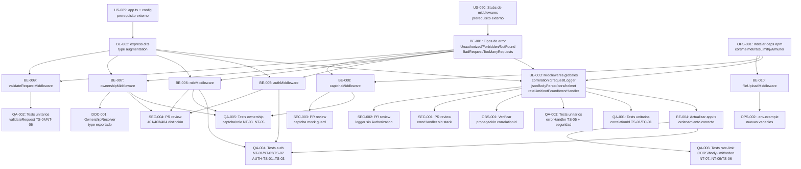

# Development Tasks — PB-P0-002 / US-091: Pipeline de middlewares global (Express)

## 1. Metadata

| Campo | Valor |
|---|---|
| User Story ID | US-091 |
| Source User Story | `management/user-stories/US-091-middleware-pipeline.md` |
| Source Technical Specification | `management/technical-specs/P0/PB-P0-002/US-091-technical-spec.md` |
| Decision Resolution Artifact | `management/user-stories/decision-resolutions/US-091-decision-resolution.md` |
| Priority | P0 |
| Backlog ID | PB-P0-002 |
| Backlog Title | Inicializar backend Node + Express + TypeScript con arquitectura Clean/Hexagonal |
| Backlog Execution Order | 2 |
| User Story Position in Backlog Item | 3 de 3 |
| Related User Stories in Backlog Item | US-089, US-090, US-091 |
| Epic | EPIC-BE-001 — Backend Modular Monolith |
| Backlog Item Dependencies | US-089 y US-090 completadas; `src/shared/interface/middlewares/` con 14 stubs disponibles |
| Feature | Cadena de middlewares transversales |
| Module / Domain | Platform/BE |
| Backlog Alignment Status | Found |
| Task Breakdown Status | Ready for Sprint Planning |
| Created Date | 2026-06-11 |
| Last Updated | 2026-06-11 |

---

## 2. Source Validation

| Fuente | Found | Used | Notas |
|---|---|---|---|
| User Story | Yes | Yes | `US-091` — Approved with Minor Notes (OwnershipResolver type formalizado en esta US) |
| Technical Specification | Yes | Yes | `US-091-technical-spec.md` — Ready for Task Breakdown; 14 middlewares + 15 test cases + 7 decisiones formalizadas |
| Decision Resolution Artifact | Yes | Yes | 7 decisiones formalizadas; ninguna bloqueante |
| Product Backlog Prioritized | Yes | Yes | PB-P0-002, posición 3 de 3, depende de US-089 y US-090 |
| ADRs | Yes | Yes | ADR-SEC-001, ADR-SEC-003, ADR-SEC-004, ADR-SEC-006, ADR-ARCH-001, ADR-ARCH-002 |

---

## 3. Backlog Execution Context

### Parent Backlog Item

**PB-P0-002 — Backend Modular Monolith Bootstrap**

Bootstrap del servidor Express, estructura feature-first con capas `Interface/Application/Domain/Ports/Infrastructure`, configuración por env vars, shared kernel y pipeline base de middlewares. Backbone técnico para todos los endpoints REST del MVP.

### Execution Order Rationale

US-091 es la tercera y última US de PB-P0-002. Depende de US-089 (servidor Express compilable, `app.ts` exportado, config Zod) y de US-090 (estructura `src/shared/interface/middlewares/` con 14 stubs disponibles). Una vez completada, el backbone de seguridad transversal del MVP estará operativo para todas las feature stories subsecuentes.

```
US-089 (bootstrap compilable) → US-090 (estructura + stubs) → US-091 (esta US) → Feature stories
```

### Related User Stories in Same Backlog Item

| User Story | Rol en el Backlog Item | Orden sugerido |
|---|---|---|
| US-089 | Servidor Express compilable, config Zod, `GET /health` | 1 — prerequisito bloqueante |
| US-090 | 16 módulos + shared kernel + ESLint + placeholders de middlewares | 2 — prerequisito bloqueante |
| **US-091** (esta US) | Implementación real de los 14 middlewares transversales + registro en `app.ts` | 3 — completa el backbone de seguridad |

---

## 4. Task Breakdown Summary

| Área | Nro. de Tareas | Notas |
|---|---:|---|
| Backend (BE) | 10 | Tipos de error, express.d.ts, 8 middlewares (globales + por-ruta), app.ts actualizado |
| DevOps / Environment (OPS) | 2 | Dependencias npm, actualización .env.example |
| Security / Authorization (SEC) | 4 | PR reviews: errorHandler sin stack, logger sin Authorization, captcha guard, distinción 401/403/404 |
| QA / Testing (QA) | 6 | Unit tests (3 middlewares), integration tests (auth, RBAC/ownership/captcha, rate-limit/cors/pipeline) |
| Observability / Audit (OBS) | 1 | requestLogger con correlationId propagado |
| Documentation / Traceability (DOC) | 1 | Formalizar OwnershipResolver type (minor note Approval Gate) |
| **Total** | **24** | |

---

## 5. Traceability Matrix

| Acceptance Criterion | Technical Spec Section | Task IDs |
|---|---|---|
| AC-01: `correlationIdMiddleware` genera/reutiliza UUID | §6 AC-01, §7 middleware 1, §14 Correlation ID | TASK-PB-P0-002-US-091-BE-003, TASK-PB-P0-002-US-091-QA-001 |
| AC-02: `authMiddleware` verifica JWT y popula `req.user` | §6 AC-02, §7 middleware 7, §12 Authentication | TASK-PB-P0-002-US-091-BE-005, TASK-PB-P0-002-US-091-QA-004 |
| AC-03: `roleMiddleware(['organizer'])` con rol incorrecto → 403 | §6 AC-03, §7 middleware 9, §12 Authorization | TASK-PB-P0-002-US-091-BE-006, TASK-PB-P0-002-US-091-QA-005 |
| AC-04: `rateLimitMiddleware` global → 429 + `Retry-After` | §6 AC-04, §7 middleware 6 | TASK-PB-P0-002-US-091-BE-003, TASK-PB-P0-002-US-091-QA-006 |
| AC-05: `captchaVerificationMiddleware` con mock mode | §6 AC-05, §7 middleware 8, §12 Sensitive Data | TASK-PB-P0-002-US-091-BE-008, TASK-PB-P0-002-US-091-QA-005, TASK-PB-P0-002-US-091-SEC-003 |
| AC-06: `validateRequestMiddleware(schema)` → 400 con details Zod | §6 AC-06, §7 middleware 11 | TASK-PB-P0-002-US-091-BE-009, TASK-PB-P0-002-US-091-QA-002 |
| AC-07: `errorHandlerMiddleware` → envelope sin stack trace | §6 AC-07, §7 middleware 14, §12 Sensitive Data | TASK-PB-P0-002-US-091-BE-003, TASK-PB-P0-002-US-091-QA-003, TASK-PB-P0-002-US-091-SEC-001 |
| AC-08: Orden de middlewares globales correcto en `app.ts` | §6 AC-08, §5 Backend Architecture | TASK-PB-P0-002-US-091-BE-004, TASK-PB-P0-002-US-091-QA-006 |
| NT-01/NT-02: Token ausente/inválido → 401 | §7 VR-01, §12 Authentication, §13 NT-01/NT-02 | TASK-PB-P0-002-US-091-BE-005, TASK-PB-P0-002-US-091-QA-004, TASK-PB-P0-002-US-091-SEC-004 |
| NT-03: Rol incorrecto → 403 (no 401) | §7 VR-02, §12 Authorization, §13 NT-03 | TASK-PB-P0-002-US-091-BE-006, TASK-PB-P0-002-US-091-QA-005, TASK-PB-P0-002-US-091-SEC-004 |
| NT-04: Ownership violation → 404 enmascarado | §7 VR-03, §12 Ownership Rules, §13 NT-04 | TASK-PB-P0-002-US-091-BE-007, TASK-PB-P0-002-US-091-QA-005, TASK-PB-P0-002-US-091-SEC-004 |

---

## 6. Development Tasks

---

### TASK-PB-P0-002-US-091-BE-001 — Crear clases de error de dominio adicionales en `src/shared/domain/errors/`

| Campo | Valor |
|---|---|
| Área | Backend |
| Tipo | Implementation |
| Prioridad | Must |
| Estimado | S |
| Depends On | TASK-PB-P0-002-US-090-BE-002 (jerarquía base AppError, ValidationError, AuthorizationError creados en US-090) |
| Source AC(s) | AC-02, AC-03, AC-04, AC-07 |
| Technical Spec Section(s) | §7 DTOs/Schemas (tabla de tipos de error), §7 Error Handling (jerarquía) |
| Backlog ID | PB-P0-002 |
| User Story ID | US-091 |
| Owner Role | Backend |
| Status | To Do |

#### Objective

Crear las 5 clases de error de dominio que los middlewares de US-091 necesitan para comunicar errores semánticos al `errorHandlerMiddleware`, que los mapea a HTTP status codes.

#### Scope

##### Include

- `src/shared/domain/errors/unauthorized.error.ts`:
  - `export class UnauthorizedError extends AppError { readonly code = 'UNAUTHORIZED'; }` — mapeado a `401`.
- `src/shared/domain/errors/forbidden.error.ts`:
  - `export class ForbiddenError extends AppError { readonly code = 'FORBIDDEN'; }` — mapeado a `403`.
- `src/shared/domain/errors/not-found.error.ts`:
  - `export class NotFoundError extends AppError { readonly code = 'NOT_FOUND'; }` — mapeado a `404`.
- `src/shared/domain/errors/bad-request.error.ts`:
  - `export class BadRequestError extends AppError { readonly code = 'BAD_REQUEST'; }` — mapeado a `400`.
- `src/shared/domain/errors/too-many-requests.error.ts`:
  - `export class TooManyRequestsError extends AppError { readonly code = 'RATE_LIMIT_EXCEEDED'; }` — mapeado a `429`.

##### Exclude

- Creación de `AppError`, `ValidationError`, `AuthorizationError` — ya existen de US-090.
- Errores específicos de bounded context (e.g., `EventNotFoundError`) — pertenecen al `domain/` de cada módulo.
- Lógica de mapping HTTP → ese mapping ocurre en `errorHandlerMiddleware` (BE-003).

#### Implementation Notes

- Todos los constructores deben llamar `super(message)` con un mensaje sensible por defecto si no se proporciona.
- Los `code` strings son los que aparecen en el error envelope JSON de la API.
- `NotFoundError` se usa también para ownership masking — el 404 enmascarado previene enumeración de IDs privados.
- Verificar que `tsc --noEmit` pasa después de crear los 5 archivos.

#### Acceptance Criteria Covered

AC-02 (UnauthorizedError), AC-03 (ForbiddenError), AC-04 (TooManyRequestsError), AC-07 (mapping en errorHandler).

#### Definition of Done

- [ ] Los 5 archivos existen en `src/shared/domain/errors/`.
- [ ] Cada clase extiende `AppError` con el `code` correcto.
- [ ] `tsc --noEmit` pasa sin errores.
- [ ] `new UnauthorizedError('Authentication required').code === 'UNAUTHORIZED'` — válido en TypeScript.

---

### TASK-PB-P0-002-US-091-BE-002 — Crear `src/shared/interface/express.d.ts`: augmentación de tipos `Request`

| Campo | Valor |
|---|---|
| Área | Backend |
| Tipo | Implementation |
| Prioridad | Must |
| Estimado | S |
| Depends On | TASK-PB-P0-002-US-090-BE-001 (proyecto con strict TypeScript activo) |
| Source AC(s) | AC-01, AC-02, AC-06 |
| Technical Spec Section(s) | §5 Backend Architecture (Express type augmentation), §17 Technical Risks |
| Backlog ID | PB-P0-002 |
| User Story ID | US-091 |
| Owner Role | Backend / Tech Lead |
| Status | To Do |

#### Objective

Crear la declaración de módulo que extiende el tipo `Request` de Express con los campos `correlationId`, `user` y `validated`, para que todos los middlewares y handlers del MVP puedan acceder a estos campos sin usar `as any`.

#### Scope

##### Include

- `src/shared/interface/express.d.ts` con augmentación del namespace global de Express:

  ```typescript
  declare global {
    namespace Express {
      interface Request {
        correlationId?: string;
        user?: { id: string; role: string };
        validated?: { body?: unknown; params?: unknown; query?: unknown };
      }
    }
  }
  export {};
  ```

##### Exclude

- Campos específicos de bounded context en el tipo `Request` — los middlewares de feature stories añaden campos propios si los necesitan.
- Tipos de respuesta — `Response` no necesita augmentación en esta US.

#### Implementation Notes

- **Crítico**: Sin esta augmentación, `req.correlationId` y `req.user` generan errores de TypeScript en strict mode. Las feature stories que usen `authMiddleware` dependen de esta augmentación.
- El archivo debe estar en `typeRoots` o ser incluido en `tsconfig.json` para que TypeScript lo reconozca automáticamente. Alternativa: agregar al campo `include` en `tsconfig.json`.
- El `export {}` al final del archivo es necesario para que TypeScript lo trate como módulo (no como script global).
- `validated` usa `unknown` intencionalmente — los schemas Zod de cada feature story refinan el tipo.

#### Acceptance Criteria Covered

AC-01 (`correlationId` tipado), AC-02 (`req.user` tipado), AC-06 (`req.validated` tipado).

#### Definition of Done

- [ ] `src/shared/interface/express.d.ts` existe.
- [ ] `req.correlationId` es accesible en cualquier middleware sin `as any`.
- [ ] `req.user?.id` y `req.user?.role` son accesibles sin `as any`.
- [ ] `tsc --noEmit` pasa sin errores sobre los archivos que usan `req.correlationId`.
- [ ] `tsconfig.json` incluye o encuentra automáticamente el archivo `.d.ts`.

---

### TASK-PB-P0-002-US-091-BE-003 — Implementar middlewares globales: correlationId, requestLogger, jsonBodyParser, cors, helmet, rateLimit, notFound, errorHandler

| Campo | Valor |
|---|---|
| Área | Backend |
| Tipo | Implementation |
| Prioridad | Must |
| Estimado | L |
| Depends On | TASK-PB-P0-002-US-091-BE-001, TASK-PB-P0-002-US-091-BE-002, TASK-PB-P0-002-US-091-OPS-001 |
| Source AC(s) | AC-01, AC-04, AC-07, AC-08 |
| Technical Spec Section(s) | §7 Backend Technical Design (middlewares 1–6, 13–14), §9 API Contract Design (error envelope), §14 Observability |
| Backlog ID | PB-P0-002 |
| User Story ID | US-091 |
| Owner Role | Backend |
| Status | To Do |

#### Objective

Implementar los 8 middlewares globales que se registran en `app.ts` para todos los requests. Estos middlewares forman la primera línea de defensa transversal del backend.

#### Scope

##### Include

**`correlation-id.middleware.ts`**:
- Leer `req.headers['x-correlation-id']`; si existe, reutilizar; si no, generar con `crypto.randomUUID()`.
- Asignar a `req.correlationId`.
- Responder con cabecera `x-correlation-id` en todas las respuestas.
- Nunca lanzar error — siempre llamar `next()`.

**`request-logger.middleware.ts`**:
- Capturar inicio con `Date.now()` al inicio del request.
- Usar `res.on('finish', ...)` para loguear al final del request.
- Campos del log: `{ correlationId, method, path, statusCode, durationMs }`.
- **Prohibido**: no incluir `req.headers['authorization']`, `req.body.password`, `req.body.captchaToken`.

**`json-body-parser.middleware.ts`**:
- `express.json({ limit: config.JSON_BODY_LIMIT })`.
- Los errores de body oversized son capturados por `errorHandlerMiddleware`.

**`cors.middleware.ts`**:
- `cors({ origin: config.CORS_ORIGINS.split(','), credentials: true, optionsSuccessStatus: 204 })`.
- Sin wildcard `*` con `credentials: true`.

**`helmet.middleware.ts`**:
- `helmet()` con configuración por defecto.
- Toggleable: `if (config.HELMET_ENABLED)` — pero activo por defecto.

**`rate-limit.middleware.ts`**:
- Rate limit global: `rateLimit({ windowMs: config.RATE_LIMIT_WINDOW_MS, max: config.RATE_LIMIT_MAX, standardHeaders: true, legacyHeaders: false })`.
- Export también `authRateLimit` configurado para feature stories de identity-access (windowMs 10 min, max: `config.AUTH_RATE_LIMIT_MAX`).

**`not-found.middleware.ts`**:
- `(req, res) => res.status(404).json({ code: 'NOT_FOUND', message: \`Route \${req.method} \${req.path} not found\`, correlationId: req.correlationId })`.

**`error-handler.middleware.ts`**:
- Firma de 4 argumentos: `(err: Error, req: Request, res: Response, next: NextFunction)`.
- Mapeo de tipos de error a HTTP codes:
  - `UnauthorizedError` → 401
  - `ForbiddenError` → 403
  - `NotFoundError` → 404
  - `ValidationError` → 400 con `details`
  - `BadRequestError` → 400
  - `TooManyRequestsError` → 429
  - Otros `AppError` → 400
  - Errores no-AppError → 500
- Para 5xx: `message = 'Internal server error'` (nunca el mensaje real del error).
- **Nunca** incluir `err.stack` en la respuesta.
- **Siempre** incluir `correlationId: req.correlationId`.
- Errores 5xx: loguear stack trace a stderr (para debugging).

##### Exclude

- Implementación de middlewares por-ruta (`auth`, `captcha`, `role`, `ownership`, `validate`, `fileUpload`) — ver BE-005 a BE-010.
- Rate limit estricto aplicado a rutas específicas — el `authRateLimit` se registra en feature stories de identity-access.
- Logger estructurado con `pino` (PB-P0-003) — usar `console.log/error` es suficiente para MVP.

#### Implementation Notes

- **Estimado L**: Esta tarea incluye 8 middlewares. Si el equipo prefiere dividirla, puede separarse en: (A) correlationId + requestLogger + notFound + errorHandler y (B) jsonBodyParser + cors + helmet + rateLimit. La división es opcional — los 8 son relativamente simples y se benefician de ser revisados juntos.
- El `errorHandlerMiddleware` es el más crítico — requiere PR review explícito (SEC-001).
- `requestLoggerMiddleware` debe loguear en `res.on('finish')`, no antes, para capturar el status code final.
- `express.json()` genera un error de `SyntaxError` si el body no es JSON válido — `errorHandlerMiddleware` debe mapearlo a 400.

#### Acceptance Criteria Covered

AC-01, AC-04, AC-07, AC-08.

#### Definition of Done

- [ ] Los 8 archivos implementados en `src/shared/interface/middlewares/`.
- [ ] `correlation-id.middleware.ts`: genera UUID; reutiliza si existe en cabecera; siempre responde con `x-correlation-id`.
- [ ] `request-logger.middleware.ts`: loguea al finalizar con `res.on('finish')`; no incluye `Authorization` ni `password`.
- [ ] `rate-limit.middleware.ts`: genera cabecera `Retry-After` (`standardHeaders: true`).
- [ ] `error-handler.middleware.ts`: nunca incluye `err.stack` en respuesta; 5xx → mensaje genérico.
- [ ] `tsc --noEmit` pasa sin errores sobre todos los archivos.

---

### TASK-PB-P0-002-US-091-BE-004 — Actualizar `src/app.ts` con middlewares globales reales en orden correcto

| Campo | Valor |
|---|---|
| Área | Backend |
| Tipo | Implementation |
| Prioridad | Must |
| Estimado | S |
| Depends On | TASK-PB-P0-002-US-091-BE-003 |
| Source AC(s) | AC-08 |
| Technical Spec Section(s) | §5 Backend Architecture (orden del pipeline), §6 AC-08 |
| Backlog ID | PB-P0-002 |
| User Story ID | US-091 |
| Owner Role | Backend |
| Status | To Do |

#### Objective

Actualizar `src/app.ts` para reemplazar los stubs de middlewares globales con las implementaciones reales registradas en el orden exacto de Doc 14 §8.2.

#### Scope

##### Include

- Importar los 8 middlewares globales implementados en BE-003.
- Registrar en este orden exacto:
  1. `app.use(correlationIdMiddleware)` — primero, siempre
  2. `app.use(requestLoggerMiddleware)` — después de correlationId para tener el ID en logs
  3. `app.use(jsonBodyParser)` — parseo de body JSON
  4. `app.use(corsMiddleware)` — CORS antes de auth para manejar preflight
  5. `app.use(helmet())` / condicional con `HELMET_ENABLED`
  6. `app.use(rateLimitMiddleware)` — rate limit global
  7. `app.use('/api/v1', router)` — rutas de la API (router vacío de US-089)
  8. `app.use(notFoundMiddleware)` — penúltimo, catch-all de rutas no registradas
  9. `app.use(errorHandlerMiddleware)` — último, error handler de 4 argumentos
- Mantener `app.get('/health', ...)` registrado **antes** de los middlewares globales (o fuera del prefijo `/api/v1`).
- Exportar `app` sin llamar `listen` (contrato de US-089 que no debe romperse).

##### Exclude

- Registro de middlewares por-ruta en `app.ts` — esos se aplican en las feature stories a rutas específicas.
- Nuevos endpoints en esta tarea.

#### Implementation Notes

- **El orden es crítico**: CORS debe ir antes de auth para manejar las peticiones preflight (OPTIONS) sin necesidad de token. `errorHandlerMiddleware` debe ser el último para capturar errores de todos los middlewares anteriores.
- `GET /health` debe permanecer funcional — no debe ser bloqueado por `authMiddleware` (que es por-ruta, no global).
- El rate limit global laxo aplica también a `GET /health` — es aceptable para MVP.

#### Acceptance Criteria Covered

AC-08.

#### Definition of Done

- [ ] `app.ts` registra exactamente los 9 items en el orden correcto per Doc 14 §8.2.
- [ ] `GET /health` sigue respondiendo 200 OK (test de regresión de US-089).
- [ ] `app` exportado sin `listen`.
- [ ] `tsc --noEmit` pasa sin errores sobre `src/app.ts`.

---

### TASK-PB-P0-002-US-091-BE-005 — Implementar `authMiddleware`: verificación JWT + `req.user`

| Campo | Valor |
|---|---|
| Área | Backend |
| Tipo | Implementation |
| Prioridad | Must |
| Estimado | S |
| Depends On | TASK-PB-P0-002-US-091-BE-001, TASK-PB-P0-002-US-091-BE-002 |
| Source AC(s) | AC-02, NT-01, NT-02 |
| Technical Spec Section(s) | §7 middleware 7, §12 Authentication, §13 NT-01/NT-02/TS-02 |
| Backlog ID | PB-P0-002 |
| User Story ID | US-091 |
| Owner Role | Backend |
| Status | To Do |

#### Objective

Implementar `authMiddleware` que extrae y verifica el JWT del header `Authorization: Bearer <token>`, popula `req.user` si es válido, y llama `next(new UnauthorizedError())` en cualquier caso de fallo.

#### Scope

##### Include

- Extraer token de `req.headers['authorization']` — formato `Bearer <token>`.
- Usar `jwt.verify(token, config.JWT_SECRET)`.
- Si válido: asignar `req.user = { id: decoded.id, role: decoded.role }`, llamar `next()`.
- Si ausente, expirado o firma inválida: llamar `next(new UnauthorizedError('Authentication required'))`.
- Loguear fallo de auth con `{ correlationId, event: 'AUTH_FAILURE', reason }` (NFR-OBS-003).
- **Nunca** retornar 403 — solo el `errorHandlerMiddleware` retorna HTTP, y siempre mapea `UnauthorizedError` → 401.

##### Exclude

- Consultar la base de datos para verificar si el usuario existe — la verificación es solo de firma JWT.
- Sesiones HTTP-only con cookies (PB-P0-006).
- Google OAuth (Future).
- Refresh token logic — pertenece a feature stories de identity-access.

#### Implementation Notes

- `jwt.verify()` lanza `JsonWebTokenError` o `TokenExpiredError` si el token es inválido o expirado — capturar ambos y mapear a `UnauthorizedError`.
- El decoded token debe tener la forma `{ id: string; role: string; iat: number; exp: number }` — si los campos `id` o `role` no están presentes, el token es inválido.
- En tests, usar `jsonwebtoken.sign({ id: 'user-1', role: 'organizer' }, process.env.JWT_SECRET, { expiresIn: '1h' })` para generar tokens válidos.

#### Acceptance Criteria Covered

AC-02, NT-01, NT-02.

#### Definition of Done

- [ ] Token JWT válido → `req.user = { id, role }` populado; handler alcanzado.
- [ ] Token ausente → `next(UnauthorizedError)` → `errorHandlerMiddleware` retorna 401.
- [ ] Token expirado → `next(UnauthorizedError)` → 401.
- [ ] Token con firma incorrecta → `next(UnauthorizedError)` → 401.
- [ ] Fallo de auth loguea `AUTH_FAILURE` con `correlationId`.
- [ ] `tsc --noEmit` pasa sin errores.

---

### TASK-PB-P0-002-US-091-BE-006 — Implementar `roleMiddleware`: factory RBAC por rol

| Campo | Valor |
|---|---|
| Área | Backend |
| Tipo | Implementation |
| Prioridad | Must |
| Estimado | S |
| Depends On | TASK-PB-P0-002-US-091-BE-001, TASK-PB-P0-002-US-091-BE-002 |
| Source AC(s) | AC-03, NT-03 |
| Technical Spec Section(s) | §7 middleware 9, §12 Authorization, §13 NT-03/AUTH-TS-01/AUTH-TS-02 |
| Backlog ID | PB-P0-002 |
| User Story ID | US-091 |
| Owner Role | Backend |
| Status | To Do |

#### Objective

Implementar `roleMiddleware` como una factory que acepta un array de roles permitidos y retorna un `RequestHandler` que verifica `req.user.role`.

#### Scope

##### Include

- Firma: `roleMiddleware(allowedRoles: string[]): RequestHandler`.
- Si `req.user` no está definido: llamar `next(new UnauthorizedError())` — el middleware requiere `authMiddleware` aplicado antes.
- Si `req.user.role` está en `allowedRoles`: llamar `next()`.
- Si `req.user.role` no está en `allowedRoles`: llamar `next(new ForbiddenError('Insufficient permissions'))`.
- **Nunca** retornar 401 — si el usuario está autenticado y el rol falla, es siempre 403.

##### Exclude

- Lógica de roles específica de bounded context (e.g., "solo el organizador del evento puede editar") — eso es `ownershipMiddleware`.
- Gestión de permisos granulares (e.g., "puede ver pero no editar") — MVP usa roles simples.

#### Implementation Notes

- Ejemplo de uso en feature story (ilustrativo, no implementado aquí):
  ```typescript
  router.post('/events', authMiddleware, roleMiddleware(['organizer', 'admin']), handler);
  ```
- El pattern de factory `roleMiddleware(['organizer'])` es más legible y flexible que un enum de roles hardcodeado.
- Añadir guard de "authMiddleware no aplicado" (`if (!req.user)`) para detectar errores de configuración de rutas durante desarrollo.

#### Acceptance Criteria Covered

AC-03, NT-03.

#### Definition of Done

- [ ] `roleMiddleware(['organizer'])` retorna un `RequestHandler`.
- [ ] Usuario con `role = 'vendor'` en ruta que requiere `['organizer']` → `next(ForbiddenError)` → 403.
- [ ] Usuario con `role = 'organizer'` en ruta que requiere `['organizer']` → `next()` (pasa).
- [ ] Sin `req.user` definido → `next(UnauthorizedError)` → 401.
- [ ] `tsc --noEmit` pasa sin errores.

---

### TASK-PB-P0-002-US-091-BE-007 — Implementar `ownershipMiddleware`: factory con `OwnershipResolver` inyectable

| Campo | Valor |
|---|---|
| Área | Backend |
| Tipo | Implementation |
| Prioridad | Must |
| Estimado | S |
| Depends On | TASK-PB-P0-002-US-091-BE-001, TASK-PB-P0-002-US-091-BE-002 |
| Source AC(s) | NT-04, AUTH-TS-04 |
| Technical Spec Section(s) | §7 middleware 10, §5 Backend Architecture (OwnershipResolver), §12 Ownership Rules, §13 NT-04 |
| Backlog ID | PB-P0-002 |
| User Story ID | US-091 |
| Owner Role | Backend |
| Status | To Do |

#### Objective

Implementar `ownershipMiddleware` como una factory que acepta un `OwnershipResolver` inyectable, lo invoca con el `Request` completo, y retorna 404 enmascarado si el usuario no es propietario del recurso.

#### Scope

##### Include

- Tipo exportado: `export type OwnershipResolver = (req: Request) => Promise<boolean>`.
- Firma: `ownershipMiddleware(resolver: OwnershipResolver): RequestHandler`.
- Si `req.user` no está definido: llamar `next(new UnauthorizedError())`.
- Ejecutar `const isOwner = await resolver(req)`.
- Si `isOwner === true`: llamar `next()`.
- Si `isOwner === false`: llamar `next(new NotFoundError('Resource not found'))` — **404 enmascarado, no 403**.
- Manejar errores del resolver con `try/catch` → `next(err)`.

##### Exclude

- Implementación de ningún resolver concreto (eso pertenece a las feature stories).
- Acceso directo a repositorios en este middleware.

#### Implementation Notes

- El 404 enmascarado es una decisión de seguridad: retornar 403 revelaría que el recurso existe pero no pertenece al usuario, lo que permite enumeración de IDs privados (Doc 14 §17.2).
- El tipo `OwnershipResolver` exportado resuelve la minor note del Approval Gate de US-091.
- Ejemplo de uso en feature story (ilustrativo):
  ```typescript
  router.get('/events/:id', authMiddleware,
    ownershipMiddleware(async (req) => {
      const event = await eventRepo.findById(req.params.id);
      return event?.organizerId === req.user?.id;
    }),
    handler
  );
  ```

#### Acceptance Criteria Covered

NT-04, AUTH-TS-04.

#### Definition of Done

- [ ] `OwnershipResolver` type exportado en `ownership.middleware.ts`.
- [ ] Resolver retorna `false` → `next(NotFoundError)` → 404.
- [ ] Resolver retorna `true` → `next()` (pasa).
- [ ] Resolver lanza error → `next(err)` propagado correctamente.
- [ ] `tsc --noEmit` pasa sin errores.

---

### TASK-PB-P0-002-US-091-BE-008 — Implementar `captchaVerificationMiddleware` con mock mode

| Campo | Valor |
|---|---|
| Área | Backend |
| Tipo | Implementation |
| Prioridad | Must |
| Estimado | S |
| Depends On | TASK-PB-P0-002-US-091-BE-001, TASK-PB-P0-002-US-091-OPS-001 |
| Source AC(s) | AC-05, NT-05 |
| Technical Spec Section(s) | §7 middleware 8, §12 Sensitive Data Handling (captcha mock guard), §13 TS-03/NT-05 |
| Backlog ID | PB-P0-002 |
| User Story ID | US-091 |
| Owner Role | Backend |
| Status | To Do |

#### Objective

Implementar `captchaVerificationMiddleware` que verifica el `captchaToken` del body del request, con soporte de modo mock (`CAPTCHA_PROVIDER=mock`) para tests deterministas.

#### Scope

##### Include

- Leer `req.body.captchaToken`.
- Si `config.CAPTCHA_PROVIDER === 'mock'`:
  - Aceptar `'__test__'` → llamar `next()`.
  - Rechazar cualquier otro valor → `next(new BadRequestError('Invalid captcha'))`.
- Si `config.CAPTCHA_PROVIDER !== 'mock'`:
  - Rechazar `'__test__'` explícitamente (guard de seguridad crítico).
  - Stub de verificación externa — para MVP retornar `next()` si el token existe y tiene valor no vacío (la verificación real con API externa pertenece a feature stories de identity-access).
- Si `captchaToken` ausente o vacío: `next(new BadRequestError('Invalid captcha'))`.

##### Exclude

- Integración real con reCAPTCHA v3 API externa — stub para MVP.
- Middleware aplicado a rutas genéricas — solo se aplica en `POST /auth/register`, `POST /auth/login`, `POST /auth/password-reset/request` per BR-AUTH-011 (las feature stories de identity-access lo aplican).

#### Implementation Notes

- **Guard de seguridad crítico**: `if (config.CAPTCHA_PROVIDER !== 'mock' && token === '__test__') { return next(new BadRequestError()) }` — previene que el token de test llegue a producción.
- El modo mock es la base del testing determinista — sin él, los tests necesitarían llamadas externas a la API de captcha.
- En tests, establecer `process.env.CAPTCHA_PROVIDER = 'mock'` en el setup del test.

#### Acceptance Criteria Covered

AC-05, NT-05.

#### Definition of Done

- [ ] `CAPTCHA_PROVIDER=mock` + `captchaToken='__test__'` → `next()` (pasa).
- [ ] `CAPTCHA_PROVIDER=mock` + `captchaToken='otro'` → `next(BadRequestError)` → 400.
- [ ] `CAPTCHA_PROVIDER=recaptcha` + `captchaToken='__test__'` → rechazado → 400.
- [ ] Sin `captchaToken` → `next(BadRequestError)` → 400.
- [ ] `tsc --noEmit` pasa sin errores.

---

### TASK-PB-P0-002-US-091-BE-009 — Implementar `validateRequestMiddleware`: validación Zod de body/params/query

| Campo | Valor |
|---|---|
| Área | Backend |
| Tipo | Implementation |
| Prioridad | Must |
| Estimado | S |
| Depends On | TASK-PB-P0-002-US-091-BE-001, TASK-PB-P0-002-US-091-BE-002 |
| Source AC(s) | AC-06, NT-06 |
| Technical Spec Section(s) | §7 middleware 11, §9 API Contract Design (error envelope de validación), §13 TS-04/NT-06 |
| Backlog ID | PB-P0-002 |
| User Story ID | US-091 |
| Owner Role | Backend |
| Status | To Do |

#### Objective

Implementar `validateRequestMiddleware` como una factory que acepta un schema Zod, valida `{ body, params, query }` del request, y retorna un `ValidationError` estructurado si la validación falla.

#### Scope

##### Include

- Firma: `validateRequestMiddleware(schema: ZodSchema): RequestHandler`.
- Ejecutar `schema.safeParse({ body: req.body, params: req.params, query: req.query })`.
- Si válido: asignar `req.validated = result.data`; llamar `next()`.
- Si inválido: construir `details` desde `result.error.issues`:
  ```typescript
  const details = result.error.issues.map(i => ({ field: i.path.join('.'), message: i.message }));
  next(new ValidationError('Validation failed', details));
  ```
- El `errorHandlerMiddleware` mapea `ValidationError` → 400 con `details` en el envelope.

##### Exclude

- Schemas Zod específicos de feature (e.g., `CreateEventSchema`) — pertenecen a las feature stories.
- Sanitización de inputs más allá de la validación de tipos Zod.

#### Implementation Notes

- `ZodSchema` como tipo genérico en la firma permite que cualquier schema Zod sea compatible.
- `i.path.join('.')` convierte paths como `['body', 'email']` a `'body.email'` — legible para el cliente.
- `req.validated` permite que los handlers usen el dato validado en lugar de `req.body` directamente, mejorando el type safety en feature stories.

#### Acceptance Criteria Covered

AC-06, NT-06.

#### Definition of Done

- [ ] Body válido → `req.validated` disponible; handler alcanzado.
- [ ] Body inválido → `next(ValidationError)` con `details` → 400 con array `details` en response.
- [ ] `details` incluye `{ field: 'email', message: 'Invalid email' }` para el campo fallido.
- [ ] `tsc --noEmit` pasa sin errores.

---

### TASK-PB-P0-002-US-091-BE-010 — Implementar `fileUploadMiddleware`: multer con MIME allow-list genérica

| Campo | Valor |
|---|---|
| Área | Backend |
| Tipo | Implementation |
| Prioridad | Must |
| Estimado | S |
| Depends On | TASK-PB-P0-002-US-091-OPS-001 (multer instalado) |
| Source AC(s) | Prerequisito para feature stories de attachments |
| Technical Spec Section(s) | §7 middleware 12, §4 In Scope (fileUploadMiddleware), §4 Out of Scope (MIME types específicos) |
| Backlog ID | PB-P0-002 |
| User Story ID | US-091 |
| Owner Role | Backend |
| Status | To Do |

#### Objective

Implementar `fileUploadMiddleware` base usando `multer` con almacenamiento en memoria, una MIME allow-list genérica y un límite de tamaño configurable. Las feature stories de attachments sobreescribirán la MIME allow-list para flujos específicos.

#### Scope

##### Include

- Usar `multer({ storage: memoryStorage(), fileFilter, limits })`.
- `memoryStorage()` para MVP (no S3 en esta US).
- `fileFilter` genérico: aceptar `image/jpeg`, `image/png`, `image/gif`, `image/webp`, `application/pdf`.
- `limits`: `{ fileSize: config.FILE_SIZE_LIMIT }` — variable de entorno configurable.
- Si MIME type rechazado o tamaño excedido: `next(new BadRequestError('Invalid file type or size'))`.
- Export de `fileUploadMiddleware` como `RequestHandler`.

##### Exclude

- MIME types específicos por flujo (portafolio vendor, brief de cotización) — feature stories de attachments.
- Almacenamiento en S3 o disco (PB-P0-012 / attachments).
- Validación de contenido real del archivo (magic bytes) — fuera de scope MVP.

#### Implementation Notes

- `memoryStorage()` guarda el archivo en `req.file.buffer` — adecuado para MVP donde el archivo se procesa inmediatamente o se reenvía a S3.
- Agregar `FILE_SIZE_LIMIT` a `.env.example` en TASK-OPS-002.
- La MIME allow-list genérica es suficiente para que las feature stories puedan extenderla — no bloquea desarrollo.

#### Acceptance Criteria Covered

Prerequisito estructural para feature stories de attachments.

#### Definition of Done

- [ ] `fileUploadMiddleware` exportado y funcional.
- [ ] MIME types de la allow-list genérica son aceptados.
- [ ] MIME type fuera de la allow-list → `next(BadRequestError)` → 400.
- [ ] `FILE_SIZE_LIMIT` configurable desde env var.
- [ ] `tsc --noEmit` pasa sin errores.

---

### TASK-PB-P0-002-US-091-OPS-001 — Instalar dependencias npm de middlewares

| Campo | Valor |
|---|---|
| Área | DevOps / Environment |
| Tipo | Setup |
| Prioridad | Must |
| Estimado | XS |
| Depends On | TASK-PB-P0-002-US-089-BE-001 (package.json base existente) |
| Source AC(s) | Prerequisito para todos los middlewares que usan librerías externas |
| Technical Spec Section(s) | §18 Implementation Guidance (Dependencias a instalar) |
| Backlog ID | PB-P0-002 |
| User Story ID | US-091 |
| Owner Role | DevOps / Backend |
| Status | To Do |

#### Objective

Instalar las dependencias npm que los middlewares de US-091 requieren y que no estaban en el `package.json` de US-089.

#### Scope

##### Include

**Dependencias de producción** (si no están ya instaladas de US-089):
- `cors`
- `helmet`
- `express-rate-limit`
- `jsonwebtoken`
- `multer`

**DevDependencies** (si no están ya):
- `@types/cors`
- `@types/jsonwebtoken`
- `@types/multer`

##### Exclude

- Dependencias de otras US.
- Downgrade de ninguna dependencia existente.

#### Implementation Notes

- Verificar si `jsonwebtoken`, `cors` y `helmet` ya fueron instalados en US-089. Si es así, esta tarea es solo agregar `express-rate-limit`, `multer` y sus tipos.
- Ejecutar `npm install` y verificar que `tsc --noEmit` sigue pasando después de la instalación.

#### Acceptance Criteria Covered

Prerequisito para BE-003..BE-010.

#### Definition of Done

- [ ] `npm install` completa sin errores.
- [ ] Las 5 librerías están en `dependencies` de `package.json`.
- [ ] Los 3 `@types/` están en `devDependencies`.
- [ ] `tsc --noEmit` pasa después de la instalación.

---

### TASK-PB-P0-002-US-091-OPS-002 — Actualizar `.env.example` con variables del pipeline de middlewares

| Campo | Valor |
|---|---|
| Área | DevOps / Environment |
| Tipo | Documentation |
| Prioridad | Must |
| Estimado | XS |
| Depends On | TASK-PB-P0-002-US-089-OPS-001 (.env.example base de US-089) |
| Source AC(s) | SEC-02 (sin secrets en .env.example) |
| Technical Spec Section(s) | §4 In Scope (variables del pipeline), §19 Task Generation Notes (documentación) |
| Backlog ID | PB-P0-002 |
| User Story ID | US-091 |
| Owner Role | DevOps / Backend |
| Status | To Do |

#### Objective

Agregar al `.env.example` existente las variables de entorno específicas del pipeline de middlewares de US-091 que no estaban en la versión de US-089.

#### Scope

##### Include

Variables a agregar (con valores placeholder, sin secretos reales):
- `RATE_LIMIT_WINDOW_MS=60000`
- `RATE_LIMIT_MAX=100`
- `AUTH_RATE_LIMIT_MAX=5`
- `CORS_ORIGINS=http://localhost:3000`
- `HELMET_ENABLED=true`
- `CAPTCHA_PROVIDER=mock`
- `CAPTCHA_SECRET=your_captcha_secret_here`
- `FILE_SIZE_LIMIT=5242880`

##### Exclude

- Variables ya en `.env.example` de US-089.
- Secrets reales.

#### Implementation Notes

- `AUTH_RATE_LIMIT_MAX` es la variable para el rate limit estricto de `/auth/*` — las feature stories de identity-access la usarán.
- `FILE_SIZE_LIMIT` en bytes: `5242880 = 5 MB`.
- `CAPTCHA_SECRET` es un placeholder — el valor real va en el `.env` local y en el Secrets Manager de producción.

#### Acceptance Criteria Covered

SEC-02 (no secrets en .env.example).

#### Definition of Done

- [ ] Las 8 variables están en `.env.example` con valores placeholder.
- [ ] Ninguna variable contiene secretos reales.
- [ ] El schema Zod de `config/env.ts` (US-089) se actualiza para incluir `AUTH_RATE_LIMIT_MAX` y `FILE_SIZE_LIMIT`.

---

### TASK-PB-P0-002-US-091-SEC-001 — PR review: `errorHandlerMiddleware` no expone `err.stack` en responses

| Campo | Valor |
|---|---|
| Área | Security / Authorization |
| Tipo | Review |
| Prioridad | Must |
| Estimado | XS |
| Depends On | TASK-PB-P0-002-US-091-BE-003 |
| Source AC(s) | AC-07, VR-04 |
| Technical Spec Section(s) | §7 VR-04, §12 Sensitive Data Handling, §13 Security Tests, §17 Technical Risks |
| Backlog ID | PB-P0-002 |
| User Story ID | US-091 |
| Owner Role | QA / Tech Lead |
| Status | To Do |

#### Objective

Verificar mediante PR review y test automatizado que el `errorHandlerMiddleware` nunca incluye `err.stack` en el JSON de respuesta, especialmente en errores 5xx.

#### Scope

##### Include

- PR review: inspección de todas las ramas del `errorHandlerMiddleware` — confirmar que ninguna incluye `err.stack` en el objeto JSON de respuesta.
- Test automatizado (en TASK-QA-003): trigger de error intencional 5xx → assert `res.body.stack === undefined`.

##### Exclude

- Auditoría completa de todos los middlewares — solo `errorHandlerMiddleware`.

#### Implementation Notes

- Un `err.stack` en la respuesta HTTP revela rutas internas del servidor, versiones de librerías y lógica de negocio — información útil para atacantes.
- Los errores 5xx SÍ deben incluir el stack trace en stderr (para debugging) — la restricción es solo en la respuesta HTTP.

#### Acceptance Criteria Covered

AC-07.

#### Definition of Done

- [ ] PR review confirma que ninguna rama del `errorHandlerMiddleware` incluye `err.stack` en el JSON.
- [ ] Test en QA-003 verifica que `res.body.stack === undefined` en respuesta 5xx.

---

### TASK-PB-P0-002-US-091-SEC-002 — PR review: `requestLoggerMiddleware` no loguea `Authorization` header ni secrets

| Campo | Valor |
|---|---|
| Área | Security / Authorization |
| Tipo | Review |
| Prioridad | Must |
| Estimado | XS |
| Depends On | TASK-PB-P0-002-US-091-BE-003 |
| Source AC(s) | NFR-OBS-003 (sin PII en logs) |
| Technical Spec Section(s) | §7 middleware 2 (campos prohibidos), §12 Sensitive Data Handling, §13 Security Tests |
| Backlog ID | PB-P0-002 |
| User Story ID | US-091 |
| Owner Role | QA / Tech Lead |
| Status | To Do |

#### Objective

Verificar que `requestLoggerMiddleware` no loguea el header `Authorization`, ni `req.body.password`, ni `req.body.captchaToken`, ni ningún otro campo sensible.

#### Scope

##### Include

- PR review del código de `requestLoggerMiddleware`: confirmar que los campos del log son solo `{ correlationId, method, path, statusCode, durationMs }`.
- Test automatizado (en TASK-QA-003): spy en el logger; assert que `authorization` no aparece en el output del log.

##### Exclude

- Auditoría de otros middlewares — solo `requestLoggerMiddleware`.

#### Acceptance Criteria Covered

NFR-OBS-003.

#### Definition of Done

- [ ] PR review confirma que `req.headers['authorization']` no aparece en el log output.
- [ ] PR review confirma que `req.body.password` y `req.body.captchaToken` no aparecen en el log.
- [ ] Test en QA-003 verifica con spy que `authorization` es ausente del log.

---

### TASK-PB-P0-002-US-091-SEC-003 — PR review: `captchaVerificationMiddleware` rechaza `'__test__'` fuera de modo mock

| Campo | Valor |
|---|---|
| Área | Security / Authorization |
| Tipo | Review |
| Prioridad | Must |
| Estimado | XS |
| Depends On | TASK-PB-P0-002-US-091-BE-008 |
| Source AC(s) | AC-05 |
| Technical Spec Section(s) | §7 middleware 8, §12 Sensitive Data Handling (captcha mock guard), §17 Technical Risks |
| Backlog ID | PB-P0-002 |
| User Story ID | US-091 |
| Owner Role | QA / Tech Lead |
| Status | To Do |

#### Objective

Verificar que el guard de seguridad del modo mock de captcha está implementado: el token `'__test__'` solo es aceptado cuando `CAPTCHA_PROVIDER=mock`, y es explícitamente rechazado cuando `CAPTCHA_PROVIDER` tiene cualquier otro valor.

#### Scope

##### Include

- PR review: confirmar que existe el guard `if (config.CAPTCHA_PROVIDER !== 'mock' && token === '__test__') { return next(new BadRequestError()) }`.
- Test automatizado (en TASK-QA-005): test con `CAPTCHA_PROVIDER=recaptcha` + `captchaToken='__test__'` → assert 400.

#### Implementation Notes

- Si este guard falta, el token mock llegaría a producción y cualquier atacante podría bypassear el captcha usando `'__test__'`. Es una vulnerabilidad crítica.

#### Acceptance Criteria Covered

AC-05.

#### Definition of Done

- [ ] PR review confirma el guard de seguridad para no-mock mode.
- [ ] Test en QA-005 verifica que `'__test__'` es rechazado con `CAPTCHA_PROVIDER=recaptcha`.

---

### TASK-PB-P0-002-US-091-SEC-004 — PR review: distinción 401/403/404 en auth/role/ownership middlewares

| Campo | Valor |
|---|---|
| Área | Security / Authorization |
| Tipo | Review |
| Prioridad | Must |
| Estimado | XS |
| Depends On | TASK-PB-P0-002-US-091-BE-005, TASK-PB-P0-002-US-091-BE-006, TASK-PB-P0-002-US-091-BE-007 |
| Source AC(s) | NT-01, NT-02, NT-03, NT-04, VR-01, VR-02, VR-03 |
| Technical Spec Section(s) | §5 Security Architecture (distinción 401/403/404), §12 Negative Authorization Scenarios |
| Backlog ID | PB-P0-002 |
| User Story ID | US-091 |
| Owner Role | QA / Tech Lead |
| Status | To Do |

#### Objective

Verificar en PR review que la distinción semántica 401/403/404 está correctamente implementada — es la regla de seguridad más importante del pipeline de autorización.

#### Scope

##### Include

- PR review de `authMiddleware`: confirmar que token ausente o inválido → `UnauthorizedError` → 401. **Nunca** 403 en este middleware.
- PR review de `roleMiddleware`: confirmar que rol incorrecto → `ForbiddenError` → 403. **Nunca** 401 si el usuario está autenticado.
- PR review de `ownershipMiddleware`: confirmar que ownership violation → `NotFoundError` → 404. **Nunca** 403 (previene enumeración de IDs).
- Los tests NT-01..NT-04 en QA-004 y QA-005 verifican esta distinción automáticamente.

#### Implementation Notes

La distinción correcta:
- **401 UNAUTHORIZED**: identidad desconocida (sin token o token inválido) — `authMiddleware`.
- **403 FORBIDDEN**: identidad conocida, permisos insuficientes para la ruta — `roleMiddleware`.
- **404 NOT FOUND (enmascarado)**: recurso existe pero no pertenece al usuario autenticado — `ownershipMiddleware`.

Esta distinción es formalizada en Doc 14 §17.2 y en el Decision Resolution de US-091.

#### Acceptance Criteria Covered

NT-01, NT-02, NT-03, NT-04.

#### Definition of Done

- [ ] PR review confirma: `authMiddleware` → solo 401, nunca 403.
- [ ] PR review confirma: `roleMiddleware` → solo 403, nunca 401 si usuario autenticado.
- [ ] PR review confirma: `ownershipMiddleware` → solo 404 enmascarado, nunca 403.
- [ ] Tests NT-01..NT-04 pasan (verificación automática de la distinción).

---

### TASK-PB-P0-002-US-091-QA-001 — Tests unitarios: `correlationIdMiddleware` (TS-01, EC-01)

| Campo | Valor |
|---|---|
| Área | QA / Testing |
| Tipo | Test |
| Prioridad | Must |
| Estimado | S |
| Depends On | TASK-PB-P0-002-US-091-BE-003 |
| Source AC(s) | AC-01 |
| Technical Spec Section(s) | §13 Unit Tests (correlationId), §6 AC-01 |
| Backlog ID | PB-P0-002 |
| User Story ID | US-091 |
| Owner Role | QA / Backend |
| Status | To Do |

#### Objective

Implementar los tests unitarios del `correlationIdMiddleware` usando mocks de `req/res/next`.

#### Scope

##### Include

- **TS-01**: Request sin `x-correlation-id` header → `req.correlationId` es un UUID generado; cabecera `x-correlation-id` presente en la respuesta.
- **EC-01**: Request con `x-correlation-id: 'abc'` → `req.correlationId === 'abc'` (reutilizado); cabecera `x-correlation-id: 'abc'` en respuesta.
- Verificar que `next()` es llamado en ambos casos (nunca lanza error).

##### Exclude

- Tests de integración Supertest para este middleware — los unitarios con mocks son suficientes.

#### Implementation Notes

- Usar mock de `req`, `res` (con `setHeader` mock), y `next` (Vitest spy) para aislar el test.
- Herramienta: Vitest.

#### Acceptance Criteria Covered

AC-01.

#### Definition of Done

- [ ] TS-01 pasa: UUID generado; cabecera en respuesta.
- [ ] EC-01 pasa: correlationId reutilizado cuando está en el header.
- [ ] `next()` es llamado en ambos casos.
- [ ] `vitest run` verde para este módulo.

---

### TASK-PB-P0-002-US-091-QA-002 — Tests unitarios: `validateRequestMiddleware` (TS-04, NT-06)

| Campo | Valor |
|---|---|
| Área | QA / Testing |
| Tipo | Test |
| Prioridad | Must |
| Estimado | S |
| Depends On | TASK-PB-P0-002-US-091-BE-009 |
| Source AC(s) | AC-06 |
| Technical Spec Section(s) | §13 Unit Tests (validateRequest), §6 AC-06 |
| Backlog ID | PB-P0-002 |
| User Story ID | US-091 |
| Owner Role | QA / Backend |
| Status | To Do |

#### Objective

Implementar los tests unitarios del `validateRequestMiddleware` verificando el caso válido y el caso de validación fallida con detalles de error.

#### Scope

##### Include

- **TS-04**: Body válido contra schema Zod → `req.validated` disponible; `next()` llamado sin error.
- **NT-06**: Body inválido → `next()` llamado con `ValidationError` que tiene `details` con `{ field, message }` por campo fallido.
- Schema Zod de prueba: `z.object({ body: z.object({ email: z.string().email() }) })`.

#### Implementation Notes

- Herramienta: Vitest con mock de req/res/next.
- `details` debe contener al menos `{ field: 'body.email', message: '<mensaje de Zod>' }` en NT-06.

#### Acceptance Criteria Covered

AC-06.

#### Definition of Done

- [ ] TS-04 pasa: body válido → `req.validated` disponible; `next()` sin error.
- [ ] NT-06 pasa: body inválido → `next(ValidationError)` con `details` poblados.
- [ ] `vitest run` verde para este módulo.

---

### TASK-PB-P0-002-US-091-QA-003 — Tests unitarios: `errorHandlerMiddleware` (TS-05 + tests de seguridad)

| Campo | Valor |
|---|---|
| Área | QA / Testing |
| Tipo | Test |
| Prioridad | Must |
| Estimado | S |
| Depends On | TASK-PB-P0-002-US-091-BE-001, TASK-PB-P0-002-US-091-BE-003 |
| Source AC(s) | AC-07 |
| Technical Spec Section(s) | §13 Unit Tests (errorHandler), §13 Security Tests |
| Backlog ID | PB-P0-002 |
| User Story ID | US-091 |
| Owner Role | QA / Backend |
| Status | To Do |

#### Objective

Implementar los tests unitarios del `errorHandlerMiddleware` cubriendo el mapeo de tipos de error a HTTP codes, la ausencia de stack trace en responses, y el mensaje genérico en 5xx.

#### Scope

##### Include

- **TS-05**: Error en handler → response JSON sin `stack` property (`res.body.stack === undefined`).
- **Seguridad**: `UnauthorizedError` → status 401 + `code: 'UNAUTHORIZED'`.
- **Seguridad**: Error genérico no-AppError → status 500 + `message: 'Internal server error'` (no el mensaje real del error).
- **Seguridad**: `ValidationError` → status 400 + `details` en el body.
- **Correlación**: `correlationId` presente en todos los responses de error.
- **Logger spy**: `requestLoggerMiddleware` test — spy en `console.log`; assert que ningún output incluye el string `'authorization'`.

#### Implementation Notes

- Herramienta: Vitest con mocks de `req`, `res`, `next`.
- Para el test de logger, usar `vi.spyOn(console, 'log')` y verificar que el string `'authorization'` no aparece en los argumentos.

#### Acceptance Criteria Covered

AC-07.

#### Definition of Done

- [ ] TS-05 pasa: `res.body.stack === undefined` en error 5xx.
- [ ] `UnauthorizedError` → 401 + `code: 'UNAUTHORIZED'`.
- [ ] Error genérico → 500 + `'Internal server error'`.
- [ ] `correlationId` presente en todos los responses de error.
- [ ] Logger spy confirma que `'authorization'` no aparece en logs.
- [ ] `vitest run` verde para este módulo.

---

### TASK-PB-P0-002-US-091-QA-004 — Tests de integración Supertest: `authMiddleware` (NT-01, NT-02, TS-02, AUTH-TS-01..TS-03)

| Campo | Valor |
|---|---|
| Área | QA / Testing |
| Tipo | Test |
| Prioridad | Must |
| Estimado | S |
| Depends On | TASK-PB-P0-002-US-091-BE-004, TASK-PB-P0-002-US-091-BE-005 |
| Source AC(s) | AC-02, NT-01, NT-02 |
| Technical Spec Section(s) | §13 Integration Tests (Autenticación, RBAC) |
| Backlog ID | PB-P0-002 |
| User Story ID | US-091 |
| Owner Role | QA / Backend |
| Status | To Do |

#### Objective

Implementar los tests de integración con Supertest que verifican el comportamiento del `authMiddleware` sobre el `app` completo: JWT válido, ausente, expirado y con firma incorrecta.

#### Scope

##### Include

- Setup: crear una ruta stub protegida en el `app` de test: `router.get('/test/protected', authMiddleware, (req, res) => res.json({ ok: true }))`.
- **TS-02**: JWT válido → handler alcanzado → 200 OK.
- **NT-01**: Sin `Authorization` header → 401 con `code: 'UNAUTHORIZED'` y `correlationId` en body.
- **NT-02**: JWT expirado → 401. JWT con secret incorrecto → 401.
- **AUTH-TS-01**: Token válido + rol correcto (`roleMiddleware(['organizer']`) → 200.
- **AUTH-TS-02**: Token válido + rol incorrecto (`vendor` en ruta `organizer`) → 403 con `code: 'FORBIDDEN'`.
- **AUTH-TS-03**: Sin token → 401.

##### Exclude

- Tests de ownership y captcha (están en QA-005).
- Tests de rate limit y CORS (están en QA-006).

#### Implementation Notes

- Usar `jsonwebtoken.sign({ id: 'user-1', role: 'organizer' }, process.env.JWT_SECRET, { expiresIn: '1h' })` para tokens válidos.
- Usar `jsonwebtoken.sign(..., 'wrong-secret')` para NT-02.
- Herramientas: Vitest + Supertest. Importar `app` de `src/app.ts` (sin `listen`).

#### Acceptance Criteria Covered

AC-02, NT-01, NT-02.

#### Definition of Done

- [ ] TS-02: JWT válido → 200.
- [ ] NT-01: Sin token → 401 + `UNAUTHORIZED` + `correlationId`.
- [ ] NT-02: Token expirado → 401. Secret incorrecto → 401.
- [ ] AUTH-TS-01: Token + rol correcto → 200.
- [ ] AUTH-TS-02: Token + rol incorrecto → 403 + `FORBIDDEN`.
- [ ] AUTH-TS-03: Sin token → 401.
- [ ] `vitest run` verde para este módulo.

---

### TASK-PB-P0-002-US-091-QA-005 — Tests de integración Supertest: ownership, captcha, role (NT-03..NT-05, AUTH-TS-04, TS-03)

| Campo | Valor |
|---|---|
| Área | QA / Testing |
| Tipo | Test |
| Prioridad | Must |
| Estimado | S |
| Depends On | TASK-PB-P0-002-US-091-BE-006, TASK-PB-P0-002-US-091-BE-007, TASK-PB-P0-002-US-091-BE-008 |
| Source AC(s) | AC-03, AC-05, NT-03, NT-04, NT-05 |
| Technical Spec Section(s) | §13 Integration Tests (RBAC, Ownership, Captcha) |
| Backlog ID | PB-P0-002 |
| User Story ID | US-091 |
| Owner Role | QA / Backend |
| Status | To Do |

#### Objective

Implementar los tests de integración que verifican RBAC (403), ownership masking (404), captcha válido/inválido, y el guard de mock mode.

#### Scope

##### Include

- **NT-03**: Usuario con `role='vendor'` accede a ruta `roleMiddleware(['organizer'])` → 403 `FORBIDDEN`.
- **NT-04**: `ownershipMiddleware(async () => false)` (resolver mock retorna false) → 404 `NOT_FOUND` enmascarado.
- **AUTH-TS-04**: Token válido + recurso de otro usuario (resolver mock: `false`) → 404.
- **TS-03**: `POST /test/captcha` con `captchaToken: '__test__'` y `CAPTCHA_PROVIDER=mock` → pasa (200 o siguiente handler).
- **NT-05**: `POST /test/captcha` sin `captchaToken` → 400 `BAD_REQUEST`.
- **SEC-003 test**: `CAPTCHA_PROVIDER=recaptcha` + `captchaToken='__test__'` → 400 (guard activo).

#### Implementation Notes

- Para NT-04/AUTH-TS-04: usar `ownershipMiddleware(async () => false)` como resolver mock directo en la ruta de test.
- Para tests de captcha: establecer `process.env.CAPTCHA_PROVIDER` antes del test y restaurar después.

#### Acceptance Criteria Covered

AC-03, AC-05, NT-03, NT-04, NT-05.

#### Definition of Done

- [ ] NT-03: `vendor` en ruta `organizer` → 403.
- [ ] NT-04: ownership resolver retorna false → 404 (no 403).
- [ ] AUTH-TS-04: token válido + ownership false → 404.
- [ ] TS-03: captcha mock `'__test__'` → pasa.
- [ ] NT-05: sin captchaToken → 400.
- [ ] SEC-003: `__test__` con provider=recaptcha → 400.
- [ ] `vitest run` verde para este módulo.

---

### TASK-PB-P0-002-US-091-QA-006 — Tests de integración Supertest: rate limit, body limit, CORS, orden del pipeline (NT-07..NT-09, TS-06)

| Campo | Valor |
|---|---|
| Área | QA / Testing |
| Tipo | Test |
| Prioridad | Must |
| Estimado | S |
| Depends On | TASK-PB-P0-002-US-091-BE-003, TASK-PB-P0-002-US-091-BE-004 |
| Source AC(s) | AC-04, AC-08, NT-07, NT-08, NT-09 |
| Technical Spec Section(s) | §13 Integration Tests (Rate limit y otros, Orden del pipeline) |
| Backlog ID | PB-P0-002 |
| User Story ID | US-091 |
| Owner Role | QA / Backend |
| Status | To Do |

#### Objective

Implementar los tests de integración que verifican rate limiting (429 + Retry-After), body too large (400), CORS bloqueado (403), y el orden correcto del pipeline de middlewares globales.

#### Scope

##### Include

- **NT-07**: Superar el `RATE_LIMIT_MAX` con requests consecutivos → 429 `RATE_LIMIT_EXCEEDED` + `Retry-After` header presente.
- **NT-08**: Request con body que supera `JSON_BODY_LIMIT` → 400 envelope con `correlationId`.
- **NT-09**: Request con `Origin` header no en `CORS_ORIGINS` → 403 o rechazo CORS.
- **TS-06**: Inspección estática del orden de middlewares en `app.ts` — verificar que los 9 items están en el orden correcto per Doc 14 §8.2 (puede ser revisión de código + test de regresión de `GET /health`).

##### Exclude

- Tests de middlewares por-ruta — cubiertos en QA-004 y QA-005.

#### Implementation Notes

- Para NT-07: configurar `RATE_LIMIT_MAX=3` y `RATE_LIMIT_WINDOW_MS=10000` en `.env.test`; hacer 4 requests consecutivos.
- Para NT-08: enviar `Content-Type: application/json` con body de más de `JSON_BODY_LIMIT` caracteres.
- `Retry-After` header: verificar `res.headers['retry-after']` o `res.headers['ratelimit-reset']` — `express-rate-limit` con `standardHeaders: true` usa el header estándar.
- Herramientas: Vitest + Supertest.

#### Acceptance Criteria Covered

AC-04, AC-08.

#### Definition of Done

- [ ] NT-07: 429 con `Retry-After` header presente.
- [ ] NT-08: 400 con `correlationId` para body oversized.
- [ ] NT-09: CORS bloqueado para origin fuera de allowlist.
- [ ] TS-06: orden de middlewares correcto per Doc 14 §8.2 (inspección + regresión `GET /health`).
- [ ] `vitest run` verde para este módulo.

---

### TASK-PB-P0-002-US-091-OBS-001 — Verificar propagación de `correlationId` en logs y responses

| Campo | Valor |
|---|---|
| Área | Observability / Audit |
| Tipo | Review |
| Prioridad | Must |
| Estimado | XS |
| Depends On | TASK-PB-P0-002-US-091-BE-003, TASK-PB-P0-002-US-091-BE-004 |
| Source AC(s) | AC-01, AC-07 |
| Technical Spec Section(s) | §14 Observability & Audit (Correlation ID, Logs) |
| Backlog ID | PB-P0-002 |
| User Story ID | US-091 |
| Owner Role | QA / Backend |
| Status | To Do |

#### Objective

Verificar que el `correlationId` se propaga correctamente: está en `req.correlationId` para todos los middlewares subsecuentes, en la cabecera `x-correlation-id` de las respuestas, en el log de `requestLoggerMiddleware`, y en el error envelope de todos los errores.

#### Scope

##### Include

- Test de regresión: `GET /health` responde con cabecera `x-correlation-id` en la respuesta.
- Request con `x-correlation-id: 'test-id'` → response tiene `x-correlation-id: 'test-id'` (reutilizado).
- Error 401 → body contiene `correlationId: req.correlationId`.
- Log de `requestLoggerMiddleware` contiene `correlationId`.

##### Exclude

- Integración con sistemas de tracing distribuido (OpenTelemetry, Jaeger) — P4.

#### Acceptance Criteria Covered

AC-01, AC-07.

#### Definition of Done

- [ ] `GET /health` response tiene cabecera `x-correlation-id`.
- [ ] Request con `x-correlation-id` header → response reutiliza el mismo ID.
- [ ] Error envelope de 401 incluye `correlationId`.
- [ ] Log de requestLogger incluye `correlationId`.

---

### TASK-PB-P0-002-US-091-DOC-001 — Formalizar tipo `OwnershipResolver` en `ownership.middleware.ts` (minor note Approval Gate)

| Campo | Valor |
|---|---|
| Área | Documentation / Traceability |
| Tipo | Documentation |
| Prioridad | Should |
| Estimado | XS |
| Depends On | TASK-PB-P0-002-US-091-BE-007 |
| Source AC(s) | — (corrección de minor note del Approval Gate de US-091) |
| Technical Spec Section(s) | §12 Ownership Rules, §17 Technical Risks, §19 Task Generation Notes (documentación) |
| Backlog ID | PB-P0-002 |
| User Story ID | US-091 |
| Owner Role | Tech Lead |
| Status | To Do |

#### Objective

Confirmar que el tipo `OwnershipResolver` está exportado en `ownership.middleware.ts` como fue solicitado en el minor note del Approval Gate de US-091, y que las feature stories pueden importarlo y usarlo correctamente.

#### Scope

##### Include

- Verificar que `ownership.middleware.ts` exporta:
  ```typescript
  export type OwnershipResolver = (req: Request) => Promise<boolean>;
  ```
- Verificar que `tsc --noEmit` no genera errores sobre el tipo.
- Documentar en el PR description que la minor note del Approval Gate de US-091 está resuelta.

##### Exclude

- Crear ejemplos de uso del tipo en feature stories — eso es responsabilidad de cada feature story.

#### Acceptance Criteria Covered

N/A — resolución de minor note del Approval Gate.

#### Definition of Done

- [ ] `OwnershipResolver` type exportado en `ownership.middleware.ts`.
- [ ] `tsc --noEmit` pasa sin errores sobre el tipo.
- [ ] PR description confirma la resolución de la minor note.

---

## 7. Required QA Tasks

| Task ID | Test Type | Propósito |
|---|---|---|
| TASK-PB-P0-002-US-091-QA-001 | Unit Test (Vitest, mock req/res/next) | Verificar `correlationIdMiddleware`: UUID generado, correlationId reutilizado, `next()` siempre llamado |
| TASK-PB-P0-002-US-091-QA-002 | Unit Test (Vitest, mock req/res/next) | Verificar `validateRequestMiddleware`: body válido → `req.validated`; inválido → `ValidationError` con `details` |
| TASK-PB-P0-002-US-091-QA-003 | Unit Test (Vitest, spy en logger) | Verificar `errorHandlerMiddleware`: sin stack trace; 5xx genérico; mapping correcto 401/403/404/400; logger no expone `authorization` |
| TASK-PB-P0-002-US-091-QA-004 | Integration Test (Supertest + Vitest) | Verificar `authMiddleware` y `roleMiddleware`: NT-01..NT-03, TS-02, AUTH-TS-01..TS-03 |
| TASK-PB-P0-002-US-091-QA-005 | Integration Test (Supertest + Vitest) | Verificar ownership masking, captcha, guard mock: NT-04..NT-05, AUTH-TS-04, TS-03, SEC-003 |
| TASK-PB-P0-002-US-091-QA-006 | Integration Test (Supertest + Vitest) | Verificar rate limit 429 + Retry-After, body limit 400, CORS 403, orden del pipeline: NT-07..NT-09, TS-06 |

---

## 8. Required Security Tasks

| Task ID | Security Concern | Propósito |
|---|---|---|
| TASK-PB-P0-002-US-091-SEC-001 | `errorHandlerMiddleware` sin stack trace | Prevenir que `err.stack` sea expuesto en responses HTTP (revela paths internos y versiones) |
| TASK-PB-P0-002-US-091-SEC-002 | `requestLoggerMiddleware` sin `Authorization` header | Prevenir que tokens JWT sean expuestos en logs (viola NFR-OBS-003) |
| TASK-PB-P0-002-US-091-SEC-003 | Captcha mock guard | Prevenir que `'__test__'` sea aceptado en producción (bypass crítico de seguridad) |
| TASK-PB-P0-002-US-091-SEC-004 | Distinción semántica 401/403/404 | Confirmar que auth→401, role→403, ownership→404 en todos los middlewares — formalizado en Doc 14 §17.2 |

---

## 9. Required Seed / Demo Tasks

No aplica — US-091 no crea ni modifica datos de seed o demo.

---

## 10. Observability / Audit Tasks

| Task ID | Concern | Propósito |
|---|---|---|
| TASK-PB-P0-002-US-091-OBS-001 | Propagación de `correlationId` | Verificar que el correlationId está en respuestas, logs y error envelopes — base de toda la observabilidad del MVP |

---

## 11. Documentation / Traceability Tasks

| Task ID | Documento / Artefacto | Propósito |
|---|---|---|
| TASK-PB-P0-002-US-091-DOC-001 | `src/shared/interface/middlewares/ownership.middleware.ts` | Confirmar que `OwnershipResolver` type está exportado (minor note del Approval Gate de US-091) |

---

## 12. Dependency Graph



---

## 13. Suggested Implementation Order

### Phase 1 — Foundation (prerequisitos para todos los middlewares)

1. **TASK-OPS-001** — Instalar dependencias npm.
2. **TASK-BE-001** — Crear 5 clases de error de dominio.
3. **TASK-BE-002** — Crear `express.d.ts` con augmentación de tipos Request.

### Phase 2 — Middlewares Globales

4. **TASK-BE-003** — Implementar 8 middlewares globales (correlationId, requestLogger, jsonBodyParser, cors, helmet, rateLimit, notFound, errorHandler).
5. **TASK-BE-004** — Actualizar `app.ts` con middlewares globales en orden correcto.
6. **TASK-OPS-002** — Actualizar `.env.example` con variables del pipeline.

### Phase 3 — Middlewares Por-Ruta (pueden ser paralelos)

7. **TASK-BE-005** — `authMiddleware` (JWT verification).
8. **TASK-BE-006** — `roleMiddleware` factory.
9. **TASK-BE-007** — `ownershipMiddleware` factory + `OwnershipResolver` type.
10. **TASK-BE-008** — `captchaVerificationMiddleware` con mock mode.
11. **TASK-BE-009** — `validateRequestMiddleware` Zod.
12. **TASK-BE-010** — `fileUploadMiddleware` multer.

### Phase 4 — Tests

13. **TASK-QA-001** — Unit tests correlationId.
14. **TASK-QA-002** — Unit tests validateRequest.
15. **TASK-QA-003** — Unit tests errorHandler + seguridad (logger spy).
16. **TASK-QA-004** — Integration tests auth/RBAC.
17. **TASK-QA-005** — Integration tests ownership/captcha/role.
18. **TASK-QA-006** — Integration tests rate-limit/CORS/pipeline order.

### Phase 5 — Security Reviews / Observability / Documentation

19. **TASK-SEC-001** — PR review: errorHandler sin stack.
20. **TASK-SEC-002** — PR review: logger sin Authorization.
21. **TASK-SEC-003** — PR review: captcha mock guard.
22. **TASK-SEC-004** — PR review: distinción 401/403/404.
23. **TASK-OBS-001** — Verificar propagación correlationId.
24. **TASK-DOC-001** — Confirmar OwnershipResolver type exportado.

---

## 14. Risks & Mitigations

| Riesgo | Impacto | Mitigación | Related Task |
|---|---|---|---|
| Orden incorrecto de middlewares globales en `app.ts` | Alto — CORS bloqueado antes de auth; errorHandler no captura errores de parser | AC-08 + inspección en PR review; test TS-06 como smoke test de orden | TASK-BE-004, TASK-QA-006 |
| `errorHandlerMiddleware` expone `err.stack` en responses 5xx | Alto — vulnerabilidad de seguridad; revela paths internos | SEC-001 PR review + QA-003 test explícito | TASK-BE-003, TASK-SEC-001, TASK-QA-003 |
| Tipos de `Request` no extendidos → `req.user` requiere `as any` en feature stories | Alto — deuda técnica multiplicada en todas las feature stories | BE-002 `express.d.ts` es prerequisito; verificado con `tsc --noEmit` | TASK-BE-002 |
| `authMiddleware` retorna 403 en lugar de 401 para token inválido | Medio — viola distinción formal; confunde frontend y QA | SEC-004 PR review + NT-01/NT-02 en QA-004 | TASK-BE-005, TASK-SEC-004, TASK-QA-004 |
| `captchaVerificationMiddleware` acepta `'__test__'` en producción | Alto — bypass crítico de captcha en producción | SEC-003 PR review + test explícito en QA-005 con CAPTCHA_PROVIDER=recaptcha | TASK-BE-008, TASK-SEC-003, TASK-QA-005 |
| `rateLimitMiddleware` sin cabecera `Retry-After` | Bajo — viola VR-05 y NFR-SEC-004 | `standardHeaders: true` en express-rate-limit; NT-07 verifica el header | TASK-BE-003, TASK-QA-006 |
| `requestLoggerMiddleware` loguea `Authorization` header | Medio — expone tokens JWT en logs; viola NFR-OBS-003 | SEC-002 PR review + logger spy en QA-003 | TASK-BE-003, TASK-SEC-002, TASK-QA-003 |
| `app.ts` exporta `app` después de llamar `listen` — rompe tests Supertest | Alto — todos los tests de integración fallarían | Mantener contrato de US-089: `app.ts` sin `listen`; verificado en QA-004..QA-006 | TASK-BE-004 |

---

## 15. Out of Scope Confirmation

Los siguientes items **no deben implementarse** como parte de US-091:

- Rate limit estricto aplicado a rutas específicas de `/auth/*` — feature stories de identity-access.
- Lógica de ownership para ningún recurso concreto — feature stories (el middleware es genérico con resolver inyectable).
- Validaciones Zod de request específicas de feature — feature stories.
- MIME types específicos por flujo en `fileUploadMiddleware` (portafolio vendor, brief de cotización) — feature stories de attachments.
- Sesiones HTTP-only con cookies — PB-P0-006.
- Google OAuth — Future.
- `AdminAction` logging — feature stories de admin-governance.
- Integración con Sentry, APM, OpenTelemetry — P4.
- CSRF token de doble submit — ADR-SEC-006 usa CORS + SameSite en su lugar.
- APM, distributed tracing, ELK — NFR-OBS-006 dice que stdout es suficiente para MVP.

---

## 16. Readiness for Sprint Planning

| Check | Status |
|---|---|
| Product Backlog mapping found | Pass |
| Every AC maps to tasks | Pass |
| Technical Spec used when available | Pass |
| QA tasks included | Pass — 6 grupos de tests (15 test cases cubiertos) |
| Security tasks included if applicable | Pass — 4 PR reviews de seguridad críticos |
| Seed/demo tasks included if applicable | N/A |
| Observability tasks included if applicable | Pass |
| Documentation tasks included if applicable | Pass |
| Task dependencies clear | Pass |
| Tasks small enough | Pass — BE-003 es L pero justificado; los demás son S o menos |
| Ready for Sprint Planning | Yes |

---

## 17. Final Recommendation

**Ready for Sprint Planning**

Las 24 tareas cubren completamente el scope de US-091: 5 nuevas clases de error de dominio, augmentación de tipos Express, 8 middlewares globales registrados en el orden correcto en `app.ts`, 6 middlewares por-ruta con contratos bien definidos y testeables, instalación de dependencias, actualización de `.env.example`, 6 grupos de tests que cubren los 15 test cases del spec (6 funcionales + 9 negativos + 4 de autorización), 4 PR reviews de seguridad críticos, observabilidad de `correlationId`, y formalización del tipo `OwnershipResolver` (minor note del Approval Gate).

Las 7 decisiones PO/BA formalizadas (auth→401, ownership→404 enmascarado, captcha solo en `/auth` sensibles, mock mode `'__test__'`, rate limit global en esta US, fileUpload genérico, no CSRF) eliminan todas las ambigüedades. No hay bloqueantes.

BE-003 tiene estimado L por incluir 8 middlewares — si el equipo prefiere dividirlo en dos tareas S (globales simples vs. errorHandler), es una subdivisión válida sin impacto en el scope.

Una vez completada US-091, el backbone de seguridad transversal del MVP de EventFlow estará operativo: autenticación JWT, RBAC, ownership masking, captcha en flujos sensibles, rate limiting con Retry-After, CORS con allowlist, helmet, correlationId propagado, logs sin secrets, validación Zod con detalles, upload base con MIME allow-list — todo disponible para las feature stories subsecuentes mediante imports directos desde `src/shared/interface/middlewares/`.
