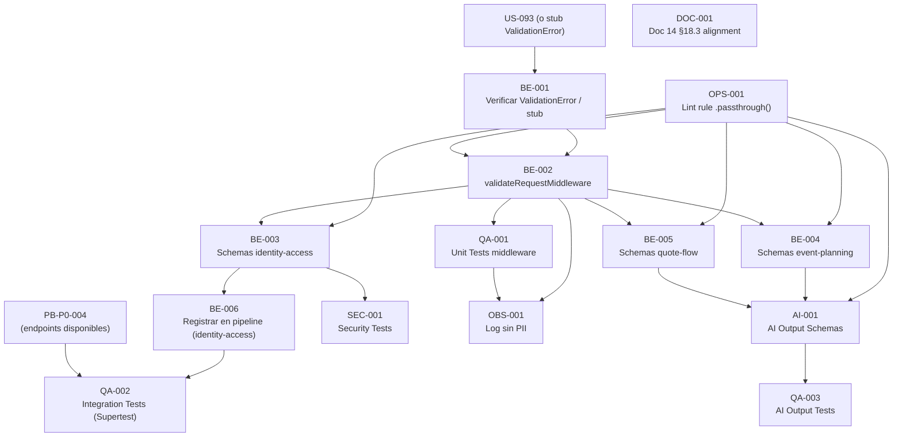

# Development Tasks — PB-P0-003 / US-092: Validación con Zod en todos los DTOs

## 1. Metadata

| Field | Value |
|---|---|
| User Story ID | US-092 |
| Source User Story | management/user-stories/US-092-zod-validation.md |
| Source Technical Specification | management/technical-specs/P0/PB-P0-003/US-092-technical-spec.md |
| Decision Resolution Artifact | management/user-stories/decision-resolutions/US-092-decision-resolution.md |
| Priority | P0 |
| Backlog ID | PB-P0-003 |
| Backlog Title | Backend Validation, Error Envelope & Logger |
| Backlog Execution Order | 3 (tercero en el bloque P0 Foundation) |
| User Story Position in Backlog Item | 1 de 2 |
| Related User Stories in Backlog Item | US-092 (esta historia), US-093 |
| Epic | EPIC-BE-001 — Backend Modular Monolith |
| Backlog Item Dependencies | PB-P0-002 (Backend Modular Monolith Bootstrap — US-089) |
| Feature | Validación DTO con Zod |
| Module / Domain | Platform/BE — shared-kernel + todos los módulos |
| Backlog Alignment Status | Found |
| Task Breakdown Status | Ready for Sprint Planning |
| Created Date | 2026-06-11 |
| Last Updated | 2026-06-11 |

---

## 2. Source Validation

| Source | Found | Used | Notes |
|---|---|---|---|
| User Story | Yes | Yes | management/user-stories/US-092-zod-validation.md — Status: Approved |
| Technical Specification | Yes | Yes | management/technical-specs/P0/PB-P0-003/US-092-technical-spec.md — Status: Ready for Task Breakdown |
| Decision Resolution Artifact | Yes | Yes | management/user-stories/decision-resolutions/US-092-decision-resolution.md — 4 decisiones formalizadas |
| Product Backlog Prioritized | Yes | Yes | management/artifacts/4-Product-Backlog-Prioritized.md — PB-P0-003 encontrado en posición 3 |
| ADRs | Yes | Yes | ADR-API-003 (Accepted), ADR-BE-001 (Accepted) — fuentes primarias |

---

## 3. Backlog Execution Context

### Parent Backlog Item

**PB-P0-003 — Backend Validation, Error Envelope & Logger**

Implementar validación de DTOs request/response con Zod, error envelope estándar con códigos consistentes, logger estructurado base y propagación de correlation ID por request. El error envelope es contrato con frontend MSW y agentes IA; todos los DTOs validan con Zod en el borde HTTP.

### Execution Order Rationale

PB-P0-003 es el tercer backlog item P0 (después de PB-P0-001 Database Schema y PB-P0-002 Backend Bootstrap). Debe completarse antes de PB-P0-004 (REST API Endpoints Foundation), ya que todos los endpoints dependen del middleware de validación Zod y del error envelope. US-092 es la primera historia del backlog item en numeración, pero la dependencia de `ValidationError` (US-093) recomienda implementar US-093 primero o en paralelo.

### Related User Stories in Same Backlog Item

| User Story | Rol en el Backlog Item | Orden sugerido |
|---|---|---|
| **US-092** (esta historia) | Implementar `validateRequestMiddleware(schema)` + schemas Zod por módulo + AI Output schemas | 2 — consume `ValidationError` de US-093 |
| US-093 | Implementar `errorHandlerMiddleware`, jerarquía de errores, catálogo de códigos, helpers `success()`/`failure()`, `correlationIdMiddleware` | 1 — infraestructura base que US-092 consume |

---

## 4. Task Breakdown Summary

| Área | Cantidad de Tareas | Notas |
|---|---:|---|
| Backend (BE) | 6 | Middleware + schemas por módulo + AI output schemas |
| AI / PromptOps (AI) | 1 | Declaración de AI Output schemas con Zod strict |
| Security / Authorization (SEC) | 1 | Rechazos de campos inesperados y no-log de datos sensibles |
| DevOps / Environment (OPS) | 1 | Lint rule `.passthrough()` en CI |
| QA / Testing (QA) | 3 | Tests unitarios, integración y AI tests |
| Observability / Audit (OBS) | 1 | Log estructurado de errores de validación (sin PII) |
| Documentation / Traceability (DOC) | 1 | Alineación documental Doc 14 §18.3 |
| **Total** | **14** | |

---

## 5. Traceability Matrix

| Acceptance Criterion | Sección Technical Spec | Task IDs |
|---|---|---|
| AC-01: Middleware de validación Zod operativo | §7 Backend Technical Design — Controllers/Routes, §6 Functional Interpretation | TASK-PB-P0-003-US-092-BE-002 |
| AC-02: Rechazo de input inválido con 400 VALIDATION_ERROR | §7 Error Handling, §9 API Contract Design | TASK-PB-P0-003-US-092-BE-002, TASK-PB-P0-003-US-092-QA-001 |
| AC-03: Organización de schemas por módulo | §7 DTOs/Schemas, §18 Implementation Guidance | TASK-PB-P0-003-US-092-BE-003, TASK-PB-P0-003-US-092-BE-004, TASK-PB-P0-003-US-092-BE-005 |
| AC-04: Validación de output de IA con Zod | §11 AI/PromptOps Design | TASK-PB-P0-003-US-092-AI-001, TASK-PB-P0-003-US-092-QA-003 |
| AC-05: Compatibilidad multi-environment | §13 Testing Strategy — CI Checks | TASK-PB-P0-003-US-092-OPS-001, TASK-PB-P0-003-US-092-QA-001 |
| EC-01: Campo inesperado rechazado por `.strict()` | §7 Validation Rules VR-01 | TASK-PB-P0-003-US-092-QA-001, TASK-PB-P0-003-US-092-SEC-001 |
| EC-02: Tipo incorrecto en param/query | §7 DTOs/Schemas | TASK-PB-P0-003-US-092-QA-001 |
| EC-03: Output IA con estructura inesperada | §11 Safety Rules | TASK-PB-P0-003-US-092-AI-001, TASK-PB-P0-003-US-092-QA-003 |

---

## 6. Development Tasks

---

### TASK-PB-P0-003-US-092-BE-001 — Verificar disponibilidad de ValidationError (US-093 o stub)

| Field | Value |
|---|---|
| Área | Backend |
| Type | Setup |
| Priority | Must |
| Estimate | XS |
| Depends On | PB-P0-002 (US-089) completado |
| Source AC(s) | AC-01, AC-02 |
| Technical Spec Section(s) | §2 Backlog Execution Context, §17 Technical Risks & Mitigations, §18 Implementation Guidance |
| Backlog ID | PB-P0-003 |
| User Story ID | US-092 |
| Owner Role | Backend |
| Status | To Do |

#### Objetivo

Verificar que `ValidationError` esté disponible en `src/shared/errors/` antes de implementar `validateRequestMiddleware`. Si US-093 no está completo, crear un stub tipado mínimo de `ValidationError` que exporte la clase con la firma correcta para que US-092 pueda desarrollarse en paralelo.

#### Scope

##### Include

- Verificar si `src/shared/errors/validation-error.ts` existe y exporta `ValidationError extends DomainError`.
- Si no existe, crear `src/shared/errors/validation-error.stub.ts` con la firma mínima necesaria: constructor con `message` y `details: Array<{field: string, message: string}>`.
- Documentar en el PR que el stub debe reemplazarse cuando US-093 esté integrado.

##### Exclude

- No implementar la jerarquía completa de errores — eso es US-093.
- No implementar `errorHandlerMiddleware` — eso es US-093.
- No modificar el pipeline de Express.

#### Implementation Notes

El stub mínimo solo necesita: clase que extiende `Error`, campo `details`, y el código `VALIDATION_ERROR`. Es temporal y se reemplaza al integrar US-093. El import en `validateRequestMiddleware` debe apuntar a `src/shared/errors/` (no al stub) para que la sustitución sea transparente.

#### Acceptance Criteria Covered

- AC-01: El middleware puede importar `ValidationError` para construir errores.
- AC-02: El middleware puede lanzar `ValidationError` con `details[]`.

#### Definition of Done

- [ ] `src/shared/errors/validation-error.ts` existe (de US-093) o `validation-error.stub.ts` creado con firma correcta.
- [ ] Import desde `validate-request.middleware.ts` compila sin errores de TypeScript.
- [ ] PR documenta si se usó stub o el real.

---

### TASK-PB-P0-003-US-092-OPS-001 — Configurar lint rule que prohíbe `.passthrough()` en schemas Zod

| Field | Value |
|---|---|
| Área | DevOps / Environment |
| Type | Setup |
| Priority | Must |
| Estimate | S |
| Depends On | PB-P0-002 (tooling de linting disponible) |
| Source AC(s) | AC-03, AC-05, EC-01 |
| Technical Spec Section(s) | §7 Validation Rules VR-02, §13 CI Checks, §17 Technical Risks & Mitigations |
| Backlog ID | PB-P0-003 |
| User Story ID | US-092 |
| Owner Role | Backend / DevOps |
| Status | To Do |

#### Objetivo

Configurar una lint rule que detecte el uso de `.passthrough()` en archivos `*.ts` bajo `src/modules/*/dto/` y `src/shared/`. La regla debe fallar el build en CI cuando se detecte `.passthrough()`, previniendo que schemas de entrada pasen campos no declarados al controlador.

#### Scope

##### Include

- Agregar o actualizar la configuración de ESLint (`.eslintrc.js` o `.eslintrc.cjs`) o Biome (`biome.json`) para detectar llamadas a `.passthrough()` en los directorios `src/modules/*/dto/` y `src/shared/`.
- La regla puede ser un `no-restricted-syntax` en ESLint o una regla equivalente en Biome que prohíba el método `.passthrough()`.
- Verificar que la regla falle en CI cuando un schema usa `.passthrough()` (test manual o test automatizado de la configuración de lint).
- Documentar la regla en el `README` del proyecto o en el archivo de configuración con un comentario que explique por qué `.passthrough()` está prohibido.

##### Exclude

- No implementar la lint rule para `.passthrough()` en archivos de test — los tests pueden necesitar schemas permisivos para mock de datos.
- No modificar reglas de lint existentes ajenas a esta historia.
- No configurar otras herramientas de análisis estático (SonarQube, etc.) — MVP guardrail.

#### Implementation Notes

Con ESLint, `no-restricted-syntax` puede detectar `CallExpression[callee.property.name="passthrough"]`. Con Biome, puede usarse una regla custom o `noRestrictedSyntax` si está disponible. La regla debe colocarse en el override que aplica a `src/modules/*/dto/**` y `src/shared/**`.

#### Acceptance Criteria Covered

- AC-03: Garantiza que ningún schema use `.passthrough()` antes de la primera revisión de código.
- AC-05: La lint rule activa en CI garantiza comportamiento consistente entre entornos.
- EC-01: Enforce preventivo de `.strict()` — si alguien escribe `.passthrough()`, el build falla.

#### Definition of Done

- [ ] Regla de lint configurada en ESLint o Biome.
- [ ] `npx eslint src/modules` (o equivalente Biome) falla si un schema usa `.passthrough()`.
- [ ] La regla NO aplica a archivos de test (`*.test.ts`, `*.spec.ts`).
- [ ] CI pipeline ejecuta lint check como parte del pipeline de build.
- [ ] Regla documentada con comentario explicando la prohibición.

---

### TASK-PB-P0-003-US-092-BE-002 — Implementar validateRequestMiddleware(schema)

| Field | Value |
|---|---|
| Área | Backend |
| Type | Implementation |
| Priority | Must |
| Estimate | S |
| Depends On | TASK-PB-P0-003-US-092-BE-001 |
| Source AC(s) | AC-01, AC-02, EC-01, EC-02 |
| Technical Spec Section(s) | §7 Backend Technical Design (Controllers/Routes, Error Handling, Observability), §6 Functional Interpretation, §9 API Contract Design |
| Backlog ID | PB-P0-003 |
| User Story ID | US-092 |
| Owner Role | Backend |
| Status | To Do |

#### Objetivo

Implementar el middleware Express reutilizable `validateRequestMiddleware(schema: ZodSchema)` en `src/shared/interface/middlewares/validate-request.middleware.ts`. El middleware valida `req.body`, `req.params` y `req.query` con el schema Zod proporcionado, usando `.strict()`. En caso de error, mapea `ZodError.errors` a `details[]` y lanza `ValidationError` para que `errorHandlerMiddleware` lo serialice.

#### Scope

##### Include

- Crear `src/shared/interface/middlewares/validate-request.middleware.ts`.
- La función acepta un `ZodSchema` como argumento y retorna un `RequestHandler` de Express.
- Valida `req.body`, `req.params`, `req.query` (los tres, o solo los que el schema define).
- En éxito: escribe el resultado validado en `req.validated` y llama `next()`.
- En fallo: mapea `ZodError.errors[i].path.join('.')` → `field`; `ZodError.errors[i].message` → `message`; construye `ValidationError` con el array de `details`; llama `next(err)`.
- Log a nivel `warn` con `{ event: "validation_failed", correlationId, method, path, fields: [...nombres] }` — sin valores de campos.
- Exportar `validateRequestMiddleware` como named export.
- Extender el tipo `Request` de Express para incluir `req.validated: { body?: unknown, params?: unknown, query?: unknown }`.

##### Exclude

- No implementar el `errorHandlerMiddleware` — US-093.
- No agregar el middleware al pipeline global de `app.ts` — se agrega por ruta.
- No crear schemas Zod de feature — son las tareas BE-003, BE-004, BE-005.
- No manejar errores de tipo no-Zod en este middleware.

#### Implementation Notes

La extensión de tipo `Request` debe hacerse en `src/shared/interface/types/express.d.ts` o en el archivo del middleware usando module augmentation. El mapeo de `path` a `field`: usar `path.join('.')` para paths anidados (e.g., `['address', 'city']` → `'address.city'`). El log de `fields` debe ser la lista de nombres de campos, **nunca los valores**.

#### Acceptance Criteria Covered

- AC-01: Middleware operativo que valida y pasa `req.validated` al controlador.
- AC-02: Rechazo con `ValidationError` + `details[]` ante input inválido.
- EC-01: `.strict()` rechaza campos inesperados.
- EC-02: Tipos incorrectos en params/query generan `details[]` con el campo afectado.

#### Definition of Done

- [ ] `validate-request.middleware.ts` creado en `src/shared/interface/middlewares/`.
- [ ] Acepta cualquier `ZodSchema` — no acoplado a schemas específicos.
- [ ] `req.validated` tipado y disponible en el handler.
- [ ] Mapeo `ZodError → details[]` usando `path.join('.')`.
- [ ] Log `warn` con campos fallidos (sin valores).
- [ ] `tsc --noEmit` compila sin errores.
- [ ] Tests unitarios UT-01 a UT-05 pasan (ver TASK-QA-001).

---

### TASK-PB-P0-003-US-092-BE-003 — Schemas Zod P0 — Módulo identity-access

| Field | Value |
|---|---|
| Área | Backend |
| Type | Implementation |
| Priority | Must |
| Estimate | S |
| Depends On | TASK-PB-P0-003-US-092-OPS-001, TASK-PB-P0-003-US-092-BE-002 |
| Source AC(s) | AC-03 |
| Technical Spec Section(s) | §7 DTOs/Schemas, §18 Implementation Guidance (Archivos impactados) |
| Backlog ID | PB-P0-003 |
| User Story ID | US-092 |
| Owner Role | Backend |
| Status | To Do |

#### Objetivo

Crear los schemas Zod `.strict()` para el módulo `identity-access` en `src/modules/identity-access/dto/`. Los schemas cubren registro, login y la forma de respuesta de usuario, basándose en Doc 14 §14.4.

#### Scope

##### Include

- `src/modules/identity-access/dto/register-user.request.ts`:
  - `RegisterUserRequestSchema`: `email` (string, email, max 254, transform lowercase), `password` (string, min 10, refine: ≥1 mayúscula, ≥1 dígito), `name` (string, min 1, max 80, trim), `role` (enum: `['organizer', 'vendor']`), `language` (string optional), `captchaToken` (string, min 1).
  - Export: `type RegisterUserRequest = z.infer<typeof RegisterUserRequestSchema>`
- `src/modules/identity-access/dto/login-user.request.ts`:
  - `LoginUserRequestSchema`: `email` (string, email), `password` (string, min 1), `captchaToken` (string, min 1).
  - Export: `type LoginUserRequest = z.infer<typeof LoginUserRequestSchema>`
- `src/modules/identity-access/dto/user.response.ts`:
  - `UserResponseSchema`: campos básicos del usuario (id, email, name, role, language, createdAt). Usar `.strict()`.
  - Export: `type UserResponse = z.infer<typeof UserResponseSchema>`
- `src/modules/identity-access/dto/index.ts` — barrel exports.

##### Exclude

- Validación semántica (verificar que el email no exista en BD) — capa Application.
- Captcha token validation contra servicio externo — capa Application/Infrastructure.
- No incluir `role: 'admin'` en el enum (Admin no se registra por API).
- Schemas de refresh token, password reset — se agregan en sus historias de feature.

#### Implementation Notes

Todos los schemas usan `.strict()` al final (e.g., `z.object({...}).strict()`). Los tipos se exportan con `z.infer<typeof Schema>` — no duplicar tipos manualmente. El `transform` en `email` (lowercase) debe preservar el tipo de salida. El `refine` en `password` para validar mayúsculas/dígitos no necesita ser exhaustivo — puede ser un regex básico en esta historia.

#### Acceptance Criteria Covered

- AC-03: Schemas en `src/modules/identity-access/dto/`; todos usan `.strict()`; tipos derivados con `z.infer<>`.

#### Definition of Done

- [ ] `register-user.request.ts` con schema y tipo exportados.
- [ ] `login-user.request.ts` con schema y tipo exportados.
- [ ] `user.response.ts` con schema y tipo exportados.
- [ ] `index.ts` con barrel exports.
- [ ] Ningún schema usa `.passthrough()` (lint rule pasa).
- [ ] `tsc --noEmit` compila sin errores.

---

### TASK-PB-P0-003-US-092-BE-004 — Schemas Zod P0 — Módulo event-planning

| Field | Value |
|---|---|
| Área | Backend |
| Type | Implementation |
| Priority | Must |
| Estimate | M |
| Depends On | TASK-PB-P0-003-US-092-OPS-001, TASK-PB-P0-003-US-092-BE-002 |
| Source AC(s) | AC-03 |
| Technical Spec Section(s) | §7 DTOs/Schemas, §18 Implementation Guidance (Archivos impactados) |
| Backlog ID | PB-P0-003 |
| User Story ID | US-092 |
| Owner Role | Backend |
| Status | To Do |

#### Objetivo

Crear los schemas Zod `.strict()` para el módulo `event-planning` en `src/modules/event-planning/dto/`. Los schemas cubren creación, actualización, listado y respuesta de eventos, basándose en Doc 14 §14.4.3.

#### Scope

##### Include

- `src/modules/event-planning/dto/create-event.request.ts`:
  - `CreateEventRequestSchema`: `name` (string, min 1, max 120), `event_type_id` (string uuid), `event_date` (string datetime ISO), `location_country` (string length 2), `location_city` (string, min 1, max 80), `currency` (enum de monedas soportadas), `language` (string optional), `description` (string, max 2000, optional).
  - Export: `type CreateEventRequest = z.infer<typeof CreateEventRequestSchema>`
- `src/modules/event-planning/dto/update-event.request.ts`:
  - `UpdateEventRequestSchema`: mismos campos que create, todos opcionales excepto los inmutables (currency no aparece — inmutable en Domain).
  - Export: `type UpdateEventRequest = z.infer<typeof UpdateEventRequestSchema>`
- `src/modules/event-planning/dto/list-events.query.ts`:
  - `ListEventsQuerySchema`: `page` (number optional, default 1), `pageSize` (number optional, default 20), `status` (enum optional), `sortBy` (enum optional), `order` (enum: `['asc', 'desc']` optional).
  - Export: `type ListEventsQuery = z.infer<typeof ListEventsQuerySchema>`
- `src/modules/event-planning/dto/event.response.ts`:
  - `EventResponseSchema`: campos del evento para respuesta HTTP.
  - Export: `type EventResponse = z.infer<typeof EventResponseSchema>`
- `src/modules/event-planning/dto/index.ts` — barrel exports.

##### Exclude

- Validación de `event_date >= now + 1 day` (semántica) — capa Application.
- Validación de `event_type_id ∈ EventType activos` — capa Application.
- Schema de AI output de evento (`event-plan-ai-output.ts`) — TASK-AI-001.
- Schemas de admin de eventos — historias de feature P1.

#### Implementation Notes

Las monedas soportadas deben importarse desde `src/shared/constants/currencies.ts` (o similar) — no hardcodear en el schema. Los parámetros de query vienen como strings de la URL; usar `z.coerce.number()` para `page` y `pageSize`.

#### Acceptance Criteria Covered

- AC-03: Schemas en `src/modules/event-planning/dto/`; todos usan `.strict()`; tipos derivados con `z.infer<>`.

#### Definition of Done

- [ ] `create-event.request.ts`, `update-event.request.ts`, `list-events.query.ts`, `event.response.ts` creados.
- [ ] `index.ts` con barrel exports.
- [ ] Ningún schema usa `.passthrough()`.
- [ ] `tsc --noEmit` compila sin errores.
- [ ] `z.coerce.number()` en query params numéricos.

---

### TASK-PB-P0-003-US-092-BE-005 — Schemas Zod P0 — Módulo quote-flow

| Field | Value |
|---|---|
| Área | Backend |
| Type | Implementation |
| Priority | Must |
| Estimate | S |
| Depends On | TASK-PB-P0-003-US-092-OPS-001, TASK-PB-P0-003-US-092-BE-002 |
| Source AC(s) | AC-03 |
| Technical Spec Section(s) | §7 DTOs/Schemas, §18 Implementation Guidance (Archivos impactados) |
| Backlog ID | PB-P0-003 |
| User Story ID | US-092 |
| Owner Role | Backend |
| Status | To Do |

#### Objetivo

Crear los schemas Zod `.strict()` para el módulo `quote-flow` en `src/modules/quote-flow/dto/`. Los schemas cubren la solicitud de cotización, la respuesta del vendor y el listado de cotizaciones, basándose en Doc 14 §14.4.5 y §14.4.6.

#### Scope

##### Include

- `src/modules/quote-flow/dto/create-quote-request.request.ts`:
  - `CreateQuoteRequestRequestSchema`: `event_id` (string uuid), `vendor_id` (string uuid), `category_id` (string uuid), `brief` (string, min 10, max 4000), `deadline` (string datetime optional), `attachments` (string array optional).
  - Export: `type CreateQuoteRequestRequest = z.infer<typeof CreateQuoteRequestRequestSchema>`
- `src/modules/quote-flow/dto/respond-quote.request.ts`:
  - `RespondQuoteRequestSchema`: `quote_request_id` (string uuid), `price` (number positive), `currency` (enum), `notes` (string optional, max 2000).
  - Export: `type RespondQuoteRequest = z.infer<typeof RespondQuoteRequestSchema>`
- `src/modules/quote-flow/dto/list-quotes.query.ts`:
  - `ListQuotesQuerySchema`: `status` (enum optional), `page` (coerce number optional), `pageSize` (coerce number optional).
  - Export: `type ListQuotesQuery = z.infer<typeof ListQuotesQuerySchema>`
- `src/modules/quote-flow/dto/index.ts` — barrel exports.

##### Exclude

- Validación semántica (`vendor_id` activo, `event_id` del organizer, límite de 5 activos) — capa Application.
- Schema de AI output de quote brief (`quote-brief-ai-output.ts`) — TASK-AI-001.
- Schemas de QuoteResponse (respuesta HTTP de listado) — se completan en PB-P0-004.

#### Implementation Notes

Mismo patrón que los módulos anteriores: `.strict()`, `z.infer<>`, `z.coerce.number()` en query params, no duplicar tipos.

#### Acceptance Criteria Covered

- AC-03: Schemas en `src/modules/quote-flow/dto/`; todos usan `.strict()`; tipos derivados.

#### Definition of Done

- [ ] `create-quote-request.request.ts`, `respond-quote.request.ts`, `list-quotes.query.ts` creados.
- [ ] `index.ts` con barrel exports.
- [ ] Ningún schema usa `.passthrough()`.
- [ ] `tsc --noEmit` compila sin errores.

---

### TASK-PB-P0-003-US-092-BE-006 — Registrar validateRequestMiddleware en pipeline Express (documentación de uso)

| Field | Value |
|---|---|
| Área | Backend |
| Type | Implementation |
| Priority | Should |
| Estimate | XS |
| Depends On | TASK-PB-P0-003-US-092-BE-002, TASK-PB-P0-003-US-092-BE-003 |
| Source AC(s) | AC-01, AC-05 |
| Technical Spec Section(s) | §5 Architecture Alignment, §7 Controllers/Routes |
| Backlog ID | PB-P0-003 |
| User Story ID | US-092 |
| Owner Role | Backend |
| Status | To Do |

#### Objetivo

Aplicar `validateRequestMiddleware` en al menos una ruta de ejemplo real del módulo `identity-access` para verificar la integración end-to-end del middleware con los schemas creados en BE-003. Esto sirve como validación funcional y como referencia de uso para el resto del equipo.

#### Scope

##### Include

- Agregar `validateRequestMiddleware(RegisterUserRequestSchema)` en la ruta `POST /api/v1/auth/register` (si existe del PB-P0-002; si no existe, como placeholder).
- Agregar `validateRequestMiddleware(LoginUserRequestSchema)` en la ruta `POST /api/v1/auth/login`.
- El controlador debe leer `req.validated.body` en lugar de `req.body`.
- Verificar que el orden del middleware en la ruta sea: `authMiddleware?` → `validateRequestMiddleware` → `controller`.

##### Exclude

- No implementar los use cases de identity-access en esta tarea — solo el wiring del middleware.
- No modificar otros módulos — solo identity-access como referencia.
- No crear tests de integración en esta tarea — son de TASK-QA-002.

#### Implementation Notes

Si los endpoints de identity-access no existen aún (dependen de PB-P0-004), esta tarea puede implementarse como un route placeholder que solo aplica el middleware y retorna un mock de respuesta. El objetivo es validar el wiring, no la lógica de negocio.

#### Acceptance Criteria Covered

- AC-01: El middleware está conectado a una ruta real.
- AC-05: El pipeline funciona en todos los entornos al ejecutar los tests de integración.

#### Definition of Done

- [ ] `validateRequestMiddleware` aplicado en rutas `POST /auth/register` y `POST /auth/login`.
- [ ] Controlador lee `req.validated.body` (tipado).
- [ ] `tsc --noEmit` compila sin errores.

---

### TASK-PB-P0-003-US-092-AI-001 — Schemas Zod para AI Output DTOs (EventPlan, Checklist, Budget, QuoteBrief)

| Field | Value |
|---|---|
| Área | AI / PromptOps |
| Type | Implementation |
| Priority | Must |
| Estimate | M |
| Depends On | TASK-PB-P0-003-US-092-OPS-001, TASK-PB-P0-003-US-092-BE-004, TASK-PB-P0-003-US-092-BE-005 |
| Source AC(s) | AC-04, EC-03 |
| Technical Spec Section(s) | §11 AI/PromptOps Design, §7 Use Cases/Application Services, §18 Archivos impactados |
| Backlog ID | PB-P0-003 |
| User Story ID | US-092 |
| Owner Role | Backend / AI |
| Status | To Do |

#### Objetivo

Declarar los schemas Zod `.strict()` para los AI Output DTOs que los use cases de `ai-assistance` usarán para validar el output del LLM antes de persistirlo. Los schemas se declaran ahora como parte de la estrategia de validación de US-092; serán consumidos cuando se implementen los use cases de IA (PB-P0-009, PB-P0-010, PB-P0-011).

#### Scope

##### Include

- `src/modules/event-planning/dto/event-plan-ai-output.ts`:
  - `EventPlanAIOutputSchema`: estructura del plan de evento generado por el LLM (tareas sugeridas, categorías, fechas recomendadas). Usar `.strict()`.
  - Export: `type EventPlanAIOutput = z.infer<typeof EventPlanAIOutputSchema>`
- `src/modules/task-management/dto/checklist-ai-output.ts`:
  - `ChecklistAIOutputSchema`: lista de items de checklist sugeridos por el LLM. Usar `.strict()`.
  - Export: `type ChecklistAIOutput = z.infer<typeof ChecklistAIOutputSchema>`
- `src/modules/budget-management/dto/budget-suggestion-ai-output.ts`:
  - `BudgetSuggestionAIOutputSchema`: lista de items de presupuesto sugeridos por el LLM con categoría, monto estimado, moneda. Usar `.strict()`.
  - Export: `type BudgetSuggestionAIOutput = z.infer<typeof BudgetSuggestionAIOutputSchema>`
- `src/modules/quote-flow/dto/quote-brief-ai-output.ts`:
  - `QuoteBriefAIOutputSchema`: texto del brief generado por el LLM. Usar `.strict()`.
  - Export: `type QuoteBriefAIOutput = z.infer<typeof QuoteBriefAIOutputSchema>`
- Barrel exports en los `index.ts` de cada módulo.

##### Exclude

- No implementar los use cases de `ai-assistance` — PB-P0-009, PB-P0-010.
- No integrar con `LLMProvider` — PB-P0-009.
- No implementar `MockAIProvider` — PB-P0-009.
- No implementar HITL (Human-in-the-loop) — historias de feature IA.
- No crear schemas con `.passthrough()` — misma restricción que todos los schemas.

#### Implementation Notes

La estructura exacta de cada AI Output schema debe consultarse en Doc 14 §14.4 y Doc 17 (AI Architecture). Si Doc 17 define la estructura del output con más detalle, ese es el source of truth. Los schemas deben ser lo suficientemente específicos para rechazar outputs malformados del LLM, pero no tan rígidos que fallen con variaciones menores del LLM (e.g., campos opcionales razonables pueden marcarse como `optional()`).

#### Acceptance Criteria Covered

- AC-04: Schemas Zod para AI Output declarados; disponibles para que los use cases los consuman.
- EC-03: Si el output LLM no cumple el schema, `safeParse` falla → sin persistencia.

#### Definition of Done

- [ ] `event-plan-ai-output.ts`, `checklist-ai-output.ts`, `budget-suggestion-ai-output.ts`, `quote-brief-ai-output.ts` creados.
- [ ] Todos usan `.strict()`.
- [ ] Tipos derivados con `z.infer<>` exportados.
- [ ] Barrel exports actualizados.
- [ ] Ningún schema usa `.passthrough()`.
- [ ] `tsc --noEmit` compila sin errores.
- [ ] AI tests AI-T-01 a AI-T-03 pasan (ver TASK-QA-003).

---

### TASK-PB-P0-003-US-092-SEC-001 — Tests de seguridad: inyección de campos, no-log de datos sensibles

| Field | Value |
|---|---|
| Área | Security / Authorization |
| Type | Test |
| Priority | Must |
| Estimate | S |
| Depends On | TASK-PB-P0-003-US-092-BE-002, TASK-PB-P0-003-US-092-BE-003 |
| Source AC(s) | AC-02, EC-01 |
| Technical Spec Section(s) | §12 Security & Authorization Design, §13 Security Tests |
| Backlog ID | PB-P0-003 |
| User Story ID | US-092 |
| Owner Role | QA / Backend |
| Status | To Do |

#### Objetivo

Implementar los tests de seguridad que verifican que `validateRequestMiddleware` y los schemas Zod rechacen intentos de inyección de campos no declarados, y que los mensajes de error no expongan valores sensibles como passwords, tokens o datos PII.

#### Scope

##### Include

- **SEC-T-01** — Inyección de `role: 'admin'` en `POST /auth/register`:
  - Enviar body con `role: 'admin'` → debe retornar 400 `VALIDATION_ERROR`.
  - Verificar que el schema `z.enum(['organizer', 'vendor'])` rechaza `'admin'`.
- **SEC-T-02** — Campo extra potencialmente malicioso:
  - Enviar body con campo no declarado (e.g., `__proto__`, `constructor`, o campo arbitrario) → debe retornar 400 `VALIDATION_ERROR`.
  - Verificar que el campo no pasa al controlador ni a la capa Application.
- **SEC-T-03** — Password no aparece en mensaje de error:
  - Enviar body con password inválido (ej. `"abc"`) → respuesta 400.
  - Verificar que `details[].message` no contiene el valor del password.
  - Verificar que el log de `warn` (`fields`) no contiene el valor del campo, solo el nombre.

##### Exclude

- No implementar tests de autenticación real — son de historias de feature.
- No testear la lógica de autorización RBAC — eso es PB-P0-008.

#### Implementation Notes

SEC-T-03 requiere interceptar el log del middleware o verificar el formato de `details[]`. La verificación más simple es que `JSON.stringify(response.body)` no contenga el valor literal del password enviado en el request.

#### Acceptance Criteria Covered

- AC-02: El rechazo de inputs maliciosos sigue el mismo path que inputs inválidos normales.
- EC-01: Campos inesperados rechazados por `.strict()`.

#### Definition of Done

- [ ] SEC-T-01: Test pasa — `role: 'admin'` retorna 400 VALIDATION_ERROR.
- [ ] SEC-T-02: Test pasa — campo extra retorna 400; no llega al controlador.
- [ ] SEC-T-03: Test pasa — valor del password no aparece en `details[].message` ni en logs.
- [ ] Tests en CI pipeline.

---

### TASK-PB-P0-003-US-092-QA-001 — Tests unitarios del middleware (UT-01 a UT-05) y lint check (NT-06)

| Field | Value |
|---|---|
| Área | QA / Testing |
| Type | Test |
| Priority | Must |
| Estimate | M |
| Depends On | TASK-PB-P0-003-US-092-BE-002, TASK-PB-P0-003-US-092-OPS-001 |
| Source AC(s) | AC-01, AC-02, AC-05, EC-01, EC-02 |
| Technical Spec Section(s) | §13 Testing Strategy — Unit Tests, CI Checks |
| Backlog ID | PB-P0-003 |
| User Story ID | US-092 |
| Owner Role | QA / Backend |
| Status | To Do |

#### Objetivo

Implementar los tests unitarios del middleware `validateRequestMiddleware` con Vitest, y verificar que la lint rule `.passthrough()` está activa en CI. Los tests cubren el happy path y todos los casos negativos del middleware de forma aislada (sin necesidad de un servidor HTTP real).

#### Scope

##### Include

- **UT-01**: Body válido pasa sin modificación → `next()` llamado sin error; `req.validated.body` contiene datos tipados.
- **UT-02**: Campo requerido faltante → `next(err)` con `ValidationError`; `details[].field` contiene el campo faltante.
- **UT-03**: Campo extra en body (`.strict()`) → `next(err)` con `VALIDATION_ERROR`; campo extra no pasa.
- **UT-04**: Tipo de campo incorrecto (e.g., `number` donde se espera `string`) → `next(err)` con `details[]` indicando el campo y tipo esperado.
- **UT-05**: Mismo middleware con dos schemas distintos → comportamiento correcto independiente para cada schema.
- **NT-06 (lint)**: Verificar que `npx eslint` (o equivalente) falla cuando un schema contiene `.passthrough()`. Puede ser un test de integración de la configuración o simplemente una instrucción en el CI step de lint.

##### Exclude

- No incluir tests de integración con servidor HTTP real — eso es TASK-QA-002.
- No testear `errorHandlerMiddleware` — eso es US-093.

#### Implementation Notes

Los tests unitarios del middleware pueden usar mocks simples de `req`, `res`, `next` sin Supertest. Para `next`, usar `vi.fn()` y verificar con qué argumento fue llamado. Para `req`, construir un objeto mock con `body`, `params`, `query`, `correlationId`.

#### Acceptance Criteria Covered

- AC-01: UT-01 verifica el happy path.
- AC-02: UT-02, UT-03, UT-04 verifican el rechazo de inputs inválidos.
- AC-05: NT-06 verifica consistencia en CI.
- EC-01: UT-03 verifica rechazo de campos extra.
- EC-02: UT-04 verifica rechazo de tipos incorrectos.

#### Definition of Done

- [ ] UT-01 pasa: body válido → `next()` sin error.
- [ ] UT-02 pasa: campo faltante → `ValidationError` con `details[]`.
- [ ] UT-03 pasa: campo extra → `ValidationError`; campo no en `req.validated`.
- [ ] UT-04 pasa: tipo incorrecto → `details[].field` correcto.
- [ ] UT-05 pasa: middleware reutilizable con distintos schemas.
- [ ] NT-06: lint rule falla en CI ante `.passthrough()` en archivos dto.
- [ ] Todos los tests en CI.

---

### TASK-PB-P0-003-US-092-QA-002 — Tests de integración con Supertest (IT-01 a IT-05)

| Field | Value |
|---|---|
| Área | QA / Testing |
| Type | Test |
| Priority | Should |
| Estimate | M |
| Depends On | TASK-PB-P0-003-US-092-BE-006, PB-P0-004 (endpoints disponibles) |
| Source AC(s) | AC-01, AC-02, AC-03 |
| Technical Spec Section(s) | §13 Testing Strategy — Integration Tests |
| Backlog ID | PB-P0-003 |
| User Story ID | US-092 |
| Owner Role | QA / Backend |
| Status | To Do |

#### Objetivo

Implementar los tests de integración con Supertest que verifican el comportamiento end-to-end del middleware `validateRequestMiddleware` contra endpoints reales de la API. Estos tests requieren al menos algunos endpoints disponibles de PB-P0-004.

#### Scope

##### Include

- **IT-01**: `POST /api/v1/auth/register` con body válido → 201 (o 400 por captcha inválido, no por Zod).
- **IT-02**: `POST /api/v1/auth/register` con email inválido → 400 `VALIDATION_ERROR`; `details[0].field === 'email'`.
- **IT-03**: `POST /api/v1/events` con body completo válido → request pasa validación Zod; llega al controlador.
- **IT-04**: `POST /api/v1/events` con campo inesperado → 400 `VALIDATION_ERROR`.
- **IT-05**: `GET /api/v1/events?status=invalid_enum_value` → 400 `VALIDATION_ERROR` con el campo de query.

##### Exclude

- No testear lógica de negocio en estos tests (autenticación real, creación de eventos) — solo validación Zod.
- No incluir tests de autenticación/autorización — PB-P0-006, PB-P0-008.

#### Implementation Notes

Estos tests dependen de que existan endpoints en PB-P0-004. Si PB-P0-004 no está completo, los tests IT-03, IT-04, IT-05 pueden marcar con `test.todo()` en Vitest y completarse cuando los endpoints estén disponibles. IT-01 e IT-02 son los más importantes y deben completarse cuando identity-access esté parcialmente implementado.

#### Acceptance Criteria Covered

- AC-01, AC-02, AC-03.

#### Definition of Done

- [ ] IT-01: 201 o error esperado (no 400 por Zod).
- [ ] IT-02: 400 `VALIDATION_ERROR`; `details` contiene `field: 'email'`.
- [ ] IT-03: Validación Zod pasa; request llega al controlador.
- [ ] IT-04: 400 `VALIDATION_ERROR` ante campo inesperado.
- [ ] IT-05: 400 `VALIDATION_ERROR` en query param inválido.
- [ ] Todos en CI pipeline.

---

### TASK-PB-P0-003-US-092-QA-003 — Tests de validación de AI Output (AI-T-01 a AI-T-03)

| Field | Value |
|---|---|
| Área | QA / Testing |
| Type | Test |
| Priority | Must |
| Estimate | S |
| Depends On | TASK-PB-P0-003-US-092-AI-001 |
| Source AC(s) | AC-04, EC-03 |
| Technical Spec Section(s) | §13 Testing Strategy — AI Tests, §11 Safety Rules |
| Backlog ID | PB-P0-003 |
| User Story ID | US-092 |
| Owner Role | QA / Backend / AI |
| Status | To Do |

#### Objetivo

Implementar los tests que verifican que los schemas Zod de AI Output DTOs rechazan correctamente outputs del LLM no conformes, y aceptan outputs válidos. Los tests usan datos mock (no `MockAIProvider` completo — ese es PB-P0-009), solo `Schema.safeParse(mockOutput)`.

#### Scope

##### Include

- **AI-T-01**: `EventPlanAIOutputSchema.safeParse(validMockOutput)` → `success: true`; output tipado disponible.
- **AI-T-02**: `EventPlanAIOutputSchema.safeParse(outputWithMissingFields)` → `success: false`; `error.errors` indica los campos faltantes.
- **AI-T-03**: `EventPlanAIOutputSchema.safeParse(outputWithExtraFields)` → `success: false` (`.strict()` activo).
- Repetir para `ChecklistAIOutputSchema` y `BudgetSuggestionAIOutputSchema` con al menos un caso positivo y uno negativo cada uno.

##### Exclude

- No usar `MockAIProvider` real en estos tests — PB-P0-009.
- No testear la integración con el LLM real — PB-P0-009, PB-P0-011.
- No testear la persistencia de AI output — PB-P0-010.

#### Implementation Notes

Son tests unitarios puros de schemas Zod. No necesitan servidor HTTP ni base de datos. Solo construir un objeto mock y llamar `Schema.safeParse(mock)`.

#### Acceptance Criteria Covered

- AC-04: Schema valida output LLM antes de persistir.
- EC-03: Output con estructura inesperada es rechazado.

#### Definition of Done

- [ ] AI-T-01: Output válido → `success: true`.
- [ ] AI-T-02: Output con campos faltantes → `success: false` con errores.
- [ ] AI-T-03: Output con campos extra → `success: false` (`.strict()`).
- [ ] Tests para `ChecklistAIOutputSchema` y `BudgetSuggestionAIOutputSchema` con al menos happy/unhappy path.
- [ ] Todos en CI pipeline.

---

### TASK-PB-P0-003-US-092-OBS-001 — Verificar log estructurado de errores de validación (sin PII)

| Field | Value |
|---|---|
| Área | Observability / Audit |
| Type | Test |
| Priority | Should |
| Estimate | XS |
| Depends On | TASK-PB-P0-003-US-092-BE-002, TASK-PB-P0-003-US-092-QA-001 |
| Source AC(s) | AC-02 |
| Technical Spec Section(s) | §14 Observability & Audit — Logs |
| Backlog ID | PB-P0-003 |
| User Story ID | US-092 |
| Owner Role | Backend / QA |
| Status | To Do |

#### Objetivo

Verificar que el log de nivel `warn` que emite `validateRequestMiddleware` ante errores de validación tiene el formato estructurado correcto (`event`, `correlationId`, `method`, `path`, `fields`) y que **nunca incluye los valores** de los campos inválidos (prevención de log de PII como passwords, tokens, datos personales).

#### Scope

##### Include

- Test que intercepta el log del middleware (usando un spy en el logger o `vi.spyOn`) y verifica:
  - Nivel: `warn`.
  - Campo `event: 'validation_failed'`.
  - Campo `correlationId` presente.
  - Campo `fields`: array de nombres de campos, **sin los valores**.
  - Campo `method` y `path` presentes.
- Caso de no-PII: enviar un body con `password: 'exposed_password'` → verificar que el string `'exposed_password'` **no** aparece en el log.

##### Exclude

- No verificar logs de `errorHandlerMiddleware` — eso es US-093/TASK-OBS de US-093.
- No implementar sistema de log centralizado — MVP (NFR-OBS-006).

#### Acceptance Criteria Covered

- AC-02: Trazabilidad con `correlationId` en logs.

#### Definition of Done

- [ ] Test verifica formato del log (`event`, `correlationId`, `method`, `path`, `fields`).
- [ ] Test verifica que valores de campos NO aparecen en logs.
- [ ] Test en CI pipeline.

---

### TASK-PB-P0-003-US-092-DOC-001 — Actualizar Doc 14 §18.3: VALIDATION_FAILED → VALIDATION_ERROR

| Field | Value |
|---|---|
| Área | Documentation / Traceability |
| Type | Documentation |
| Priority | Should |
| Estimate | XS |
| Depends On | Ninguno (mantenimiento de documentación independiente) |
| Source AC(s) | N/A — tarea de documentation alignment |
| Technical Spec Section(s) | §16 Documentation Alignment Required |
| Backlog ID | PB-P0-003 |
| User Story ID | US-092 |
| Owner Role | Tech Lead / Backend |
| Status | To Do |

#### Objetivo

Actualizar la tabla de mapeo de errores en `docs/14-Backend-Technical-Design.md §18.3` para alinear los códigos de ejemplo con ADR-API-002 (Accepted). Reemplazar `VALIDATION_FAILED` → `VALIDATION_ERROR`.

#### Scope

##### Include

- Editar `docs/14-Backend-Technical-Design.md §18.3` — tabla "Mapeo de errores a HTTP":
  - `VALIDATION_FAILED` → `VALIDATION_ERROR`
  - (Revisar también) `NOT_FOUND` → `RESOURCE_NOT_FOUND`
  - (Revisar también) `RATE_LIMITED` → `RATE_LIMIT_EXCEEDED`
- El cambio es de documentación únicamente; no afecta código de producción.

##### Exclude

- No modificar ADRs — ADR-API-002 ya tiene los códigos correctos.
- No modificar Doc 16 — ya tiene los códigos correctos.
- No crear un nuevo ADR — es alineación con un ADR Accepted existente.

#### Implementation Notes

El cambio es mínimo (3 strings en una tabla Markdown). Incluir en el mismo PR o como PR independiente según preferencia del equipo.

#### Acceptance Criteria Covered

- Tarea de mantenimiento documental (no mapea a un AC específico de US-092).

#### Definition of Done

- [ ] `docs/14-Backend-Technical-Design.md §18.3` actualizado con códigos canónicos.
- [ ] PR reviewed y merged.

---

## 7. Required QA Tasks

| Task ID | Test Type | Propósito |
|---|---|---|
| TASK-PB-P0-003-US-092-QA-001 | Unit Tests (UT-01 a UT-05) + Lint (NT-06) | Verificar middleware aislado: happy path, campos faltantes, campos extra, tipos incorrectos, reutilización |
| TASK-PB-P0-003-US-092-QA-002 | Integration Tests (IT-01 a IT-05) | Verificar comportamiento end-to-end con endpoints reales via Supertest |
| TASK-PB-P0-003-US-092-QA-003 | AI Output Tests (AI-T-01 a AI-T-03) | Verificar que schemas AI Output aceptan outputs válidos y rechazan inválidos/extras |
| TASK-PB-P0-003-US-092-SEC-001 | Security Tests (SEC-T-01 a SEC-T-03) | Verificar inyección de role admin, campos maliciosos, no-log de password |
| TASK-PB-P0-003-US-092-OBS-001 | Observability Test | Verificar formato de log y ausencia de PII en campos logueados |

---

## 8. Required Security Tasks

| Task ID | Security Concern | Propósito |
|---|---|---|
| TASK-PB-P0-003-US-092-SEC-001 | Inyección de campos no declarados; log de datos sensibles | Verificar que `.strict()` rechaza campos maliciosos y que los logs no exponen passwords/tokens |
| TASK-PB-P0-003-US-092-OPS-001 | `.passthrough()` accidental en schemas | Lint rule que previene que schemas de entrada pasen campos no declarados al controlador |

---

## 9. Required Seed / Demo Tasks

No aplica. El seed script no pasa por `validateRequestMiddleware`; usa use cases o Prisma Client directamente.

---

## 10. Observability / Audit Tasks

| Task ID | Concern | Propósito |
|---|---|---|
| TASK-PB-P0-003-US-092-OBS-001 | Log `warn` de errores de validación sin PII | Garantizar trazabilidad (correlationId, fields) sin exponer datos sensibles en logs |

---

## 11. Documentation / Traceability Tasks

| Task ID | Documento / Artefacto | Propósito |
|---|---|---|
| TASK-PB-P0-003-US-092-DOC-001 | `docs/14-Backend-Technical-Design.md §18.3` | Alinear códigos de ejemplo con ADR-API-002: `VALIDATION_FAILED` → `VALIDATION_ERROR` |

---

## 12. Dependency Graph

---

## 13. Suggested Implementation Order

### Fase 1 — Prerequisitos y Setup

1. **TASK-PB-P0-003-US-092-BE-001** — Verificar ValidationError (US-093 o stub)
2. **TASK-PB-P0-003-US-092-OPS-001** — Lint rule `.passthrough()`

### Fase 2 — Core Middleware y Schemas P0

3. **TASK-PB-P0-003-US-092-BE-002** — Implementar `validateRequestMiddleware`
4. **TASK-PB-P0-003-US-092-QA-001** — Tests unitarios del middleware (inmediatamente después de implementar)
5. **TASK-PB-P0-003-US-092-BE-003** — Schemas identity-access
6. **TASK-PB-P0-003-US-092-BE-004** — Schemas event-planning
7. **TASK-PB-P0-003-US-092-BE-005** — Schemas quote-flow

### Fase 3 — AI Output, Integración y Seguridad

8. **TASK-PB-P0-003-US-092-AI-001** — AI Output Schemas
9. **TASK-PB-P0-003-US-092-BE-006** — Registrar middleware en pipeline (identity-access)
10. **TASK-PB-P0-003-US-092-SEC-001** — Security tests
11. **TASK-PB-P0-003-US-092-QA-003** — AI Output tests

### Fase 4 — Observabilidad, Integración y Documentación

12. **TASK-PB-P0-003-US-092-OBS-001** — Verificar log sin PII
13. **TASK-PB-P0-003-US-092-QA-002** — Integration tests con Supertest (una vez PB-P0-004 disponible)
14. **TASK-PB-P0-003-US-092-DOC-001** — Actualizar Doc 14 §18.3

---

## 14. Risks & Mitigations

| Riesgo | Impacto | Mitigación | Tarea relacionada |
|---|---|---|---|
| US-093 no disponible cuando se inicia US-092 | `validateRequestMiddleware` no puede importar `ValidationError` | Crear stub tipado en BE-001; reemplazar al integrar US-093 | TASK-BE-001 |
| `.passthrough()` accidental antes de configurar lint | Schema de feature sin enforcement permite campos extras | Configurar OPS-001 antes de crear cualquier schema (orden de fases) | TASK-OPS-001 |
| IT-02 a IT-05 bloqueados hasta PB-P0-004 | Tests de integración no pueden ejecutarse sin endpoints | Usar `test.todo()` en Vitest; completar cuando PB-P0-004 esté disponible | TASK-QA-002 |
| Schemas AI Output divergen del prompt real | Validación falla en producción con outputs LLM reales | Coordinar con PB-P0-010 (Prompt Registry); schemas deben mantenerse alineados con `outputSchema` de cada `AIPromptVersion` | TASK-AI-001 |
| Mapeo `ZodError.path` → `field` incorrecto para paths anidados | Frontend recibe campo incorrecto en `details[]` | Usar `path.join('.')` en todos los casos; UT-04 verifica el mapeo | TASK-BE-002, TASK-QA-001 |

---

## 15. Out of Scope Confirmation

Las siguientes capacidades **no deben implementarse** como parte de US-092:

- **Error envelope** (`errorHandlerMiddleware`, helpers `success()`/`failure()`, jerarquía de errores, `ErrorCodes.ts`) — pertenece a US-093.
- **Generación de OpenAPI** desde schemas Zod (`zod-to-openapi`) — PB-P0-005/US-098.
- **Validación semántica** (referencias existen, estados coherentes) — capa Application; se implementa en los use cases de cada módulo.
- **Validación de reglas de negocio** (BR-*) — capa Domain.
- **Validación de variables de entorno** — ya cubierta en US-089/PB-P0-002 (`src/config/env.ts`).
- **Schemas para endpoints P1/P2/P3** — se agregan en las historias de feature correspondientes cuando los endpoints se implementan.
- **`class-validator`** o `reflect-metadata` — rechazados definitivamente en ADR-API-003.
- **Directorio global de schemas** — cada módulo es dueño de sus DTOs.
- **Microservicios, Kubernetes, brokers** — MVP guardrail.
- **OpenTelemetry / APM** — MVP guardrail (NFR-OBS-006).

---

## 16. Readiness for Sprint Planning

| Check | Estado |
|---|---|
| Product Backlog mapping found | Pass |
| Every AC maps to tasks | Pass |
| Technical Spec used when available | Pass |
| QA tasks included | Pass |
| Security tasks included if applicable | Pass |
| Seed/demo tasks included if applicable | Pass (No aplica) |
| Observability tasks included if applicable | Pass |
| Documentation tasks included if applicable | Pass |
| Task dependencies clear | Pass |
| Tasks small enough (≤ L) | Pass |
| Ready for Sprint Planning | Yes |

---

## 17. Final Recommendation

**Ready for Sprint Planning**

Las 14 tareas cubren todas las Acceptance Criteria de US-092, todos los escenarios de seguridad, los tests negativos requeridos y la documentación de alineación. Las dependencias entre tareas son explícitas y forman un grafo acíclico claro. La única dependencia externa no controlable es PB-P0-004 para los integration tests (TASK-QA-002), que pueden marcarse como `test.todo()` y completarse en el mismo sprint cuando los endpoints estén disponibles.

El riesgo principal — la disponibilidad de US-093 — está mitigado con la tarea BE-001 (stub de `ValidationError`), que permite comenzar el desarrollo de US-092 en paralelo a US-093.

Recomendación de sprint: incluir US-092 y US-093 en el mismo sprint dado que son el mismo backlog item PB-P0-003 y tienen dependencia bidireccional.
