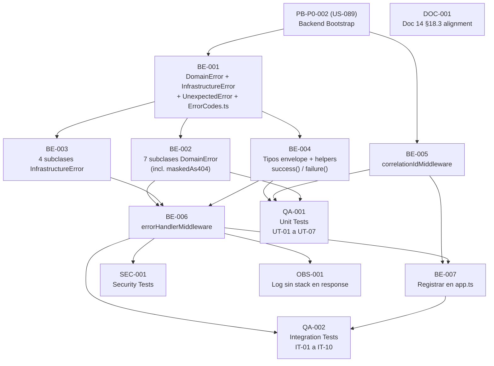

# Development Tasks — PB-P0-003 / US-093: Error Envelope Unificado

## 1. Metadata

| Field | Value |
|---|---|
| User Story ID | US-093 |
| Source User Story | management/user-stories/US-093-unified-error-envelope.md |
| Source Technical Specification | management/technical-specs/P0/PB-P0-003/US-093-technical-spec.md |
| Decision Resolution Artifact | management/user-stories/decision-resolutions/US-093-decision-resolution.md |
| Priority | P0 |
| Backlog ID | PB-P0-003 |
| Backlog Title | Backend Validation, Error Envelope & Logger |
| Backlog Execution Order | 3 (tercero en el bloque P0 Foundation) |
| User Story Position in Backlog Item | 2 de 2 (pero implementación recomendada primero) |
| Related User Stories in Backlog Item | US-092, US-093 (esta historia) |
| Epic | EPIC-BE-001 — Backend Modular Monolith |
| Backlog Item Dependencies | PB-P0-002 (Backend Modular Monolith Bootstrap — US-089) |
| Feature | Error envelope |
| Module / Domain | Platform/BE — shared-kernel (transversal) |
| Backlog Alignment Status | Found |
| Task Breakdown Status | Ready for Sprint Planning |
| Created Date | 2026-06-11 |
| Last Updated | 2026-06-11 |

---

## 2. Source Validation

| Source | Found | Used | Notes |
|---|---|---|---|
| User Story | Yes | Yes | management/user-stories/US-093-unified-error-envelope.md — Status: Approved |
| Technical Specification | Yes | Yes | management/technical-specs/P0/PB-P0-003/US-093-technical-spec.md — Status: Ready for Task Breakdown |
| Decision Resolution Artifact | Yes | Yes | management/user-stories/decision-resolutions/US-093-decision-resolution.md — 7 decisiones formalizadas |
| Product Backlog Prioritized | Yes | Yes | management/artifacts/4-Product-Backlog-Prioritized.md — PB-P0-003 encontrado en posición 3 |
| ADRs | Yes | Yes | ADR-API-002 (Accepted), ADR-API-004 (Accepted), ADR-BE-001 (Accepted) |

---

## 3. Backlog Execution Context

### Parent Backlog Item

**PB-P0-003 — Backend Validation, Error Envelope & Logger**

Implementar validación de DTOs request/response con Zod, error envelope estándar con códigos consistentes, logger estructurado base y propagación de correlation ID por request. El error envelope es contrato con frontend MSW y agentes IA.

### Execution Order Rationale

US-093 es técnicamente la historia base del backlog item PB-P0-003: define la infraestructura de errores (`DomainError`, `errorHandlerMiddleware`, helpers, catálogo de códigos) que US-092 (`validateRequestMiddleware`) consume. Aunque numerada como posición 2 de 2, debe implementarse **antes** o en paralelo a US-092. Sin US-093, US-092 no puede producir respuestas 400 estructuradas.

### Related User Stories in Same Backlog Item

| User Story | Rol en el Backlog Item | Orden sugerido |
|---|---|---|
| US-092 | Implementar `validateRequestMiddleware(schema)` + schemas Zod; consume `ValidationError` de US-093 | 2 — depende de la jerarquía de errores de US-093 |
| **US-093** (esta historia) | Implementar `errorHandlerMiddleware`, jerarquía de errores, catálogo de códigos, helpers `success()`/`failure()`, `correlationIdMiddleware` | 1 — infraestructura base que todos los módulos consumen |

---

## 4. Task Breakdown Summary

| Área | Cantidad de Tareas | Notas |
|---|---:|---|
| Backend (BE) | 7 | Jerarquía de errores + catálogo + tipos + helpers + dos middlewares + registro en app.ts |
| Security / Authorization (SEC) | 1 | Masking 403→404, no-stack en responses, correlationId consistente |
| QA / Testing (QA) | 2 | Tests unitarios + tests de integración completos (NT-01 a NT-10) |
| Observability / Audit (OBS) | 1 | Log estructurado errorHandlerMiddleware (warn/error según nivel) |
| Documentation / Traceability (DOC) | 1 | Alineación documental Doc 14 §18.3 (3 códigos) |
| **Total** | **12** | |

---

## 5. Traceability Matrix

| Acceptance Criterion | Sección Technical Spec | Task IDs |
|---|---|---|
| AC-01: Error envelope estándar en todas las respuestas de error | §7 Error Handling, §9 API Contract Design | TASK-PB-P0-003-US-093-BE-004, TASK-PB-P0-003-US-093-BE-006 |
| AC-02: Correlation ID generado o propagado | §7 Observability, §14 Observability & Audit | TASK-PB-P0-003-US-093-BE-005 |
| AC-03: Mapeo correcto de errores de dominio a HTTP | §7 Error Handling (tabla de mapeo) | TASK-PB-P0-003-US-093-BE-006, TASK-PB-P0-003-US-093-QA-002 |
| AC-04: Helpers de respuesta disponibles y tipados | §7 DTOs/Schemas, §9 API Contract Design | TASK-PB-P0-003-US-093-BE-004 |
| AC-05: Stack trace interno nunca expuesto al cliente | §12 Security & Authorization Design | TASK-PB-P0-003-US-093-BE-006, TASK-PB-P0-003-US-093-SEC-001 |
| AC-06: Tests del error envelope cubren 4xx y 5xx | §13 Testing Strategy — Integration Tests | TASK-PB-P0-003-US-093-QA-002 |
| EC-01: Request sin `X-Correlation-Id` header | §7 Observability | TASK-PB-P0-003-US-093-BE-005, TASK-PB-P0-003-US-093-QA-001 |
| EC-02: Excepción no mapeada → 500 INTERNAL_ERROR | §7 Error Handling | TASK-PB-P0-003-US-093-BE-006, TASK-PB-P0-003-US-093-QA-002 |
| EC-03: VALIDATION_ERROR con details[] requerido | §7 Validation Rules VR-03 | TASK-PB-P0-003-US-093-BE-004, TASK-PB-P0-003-US-093-QA-002 |
| EC-04: AuthorizationError con masking 403→404 | §12 Negative Authorization Scenarios | TASK-PB-P0-003-US-093-BE-002, TASK-PB-P0-003-US-093-BE-006, TASK-PB-P0-003-US-093-SEC-001 |

---

## 6. Development Tasks

---

### TASK-PB-P0-003-US-093-BE-001 — Implementar jerarquía base: DomainError, InfrastructureError, UnexpectedError y ErrorCodes.ts

| Field | Value |
|---|---|
| Área | Backend |
| Type | Implementation |
| Priority | Must |
| Estimate | M |
| Depends On | PB-P0-002 (US-089) completado |
| Source AC(s) | AC-03 |
| Technical Spec Section(s) | §7 Error Handling (jerarquía completa), §5 Architecture Alignment |
| Backlog ID | PB-P0-003 |
| User Story ID | US-093 |
| Owner Role | Backend |
| Status | To Do |

#### Objetivo

Implementar las clases base de la jerarquía de errores del sistema (`DomainError`, `InfrastructureError`, `UnexpectedError`) y el catálogo de códigos estándar en `ErrorCodes.ts`. Esta es la fundación que todas las subclases y el `errorHandlerMiddleware` importan.

#### Scope

##### Include

- `src/shared/errors/domain-error.ts`: clase abstracta `DomainError extends Error`. Propiedades: `code: string` (del catálogo), `message: string`, `details?: Array<{field: string, message: string}>`. Constructor acepta `code`, `message`, `details?`.
- `src/shared/errors/infrastructure-error.ts`: clase abstracta `InfrastructureError extends Error`. Misma estructura básica que `DomainError`. Separación explícita — los errores de infraestructura tienen semántica distinta (upstream failures vs domain violations).
- `src/shared/errors/unexpected-error.ts`: clase `UnexpectedError extends Error`. Siempre mapea a 500 `INTERNAL_ERROR`. No tiene subclases.
- `src/shared/errors/ErrorCodes.ts`: objeto de constantes TypeScript (o enum) con el catálogo base:
  - `VALIDATION_ERROR`, `AUTHENTICATION_REQUIRED`, `FORBIDDEN`, `RESOURCE_NOT_FOUND`, `CONFLICT`, `BUSINESS_RULE_VIOLATION`, `RATE_LIMIT_EXCEEDED`, `AI_PROVIDER_ERROR`, `AI_PROVIDER_TIMEOUT`, `PERSISTENCE_ERROR`, `INTERNAL_ERROR`.
- `src/shared/errors/index.ts`: barrel exports de todas las clases y `ErrorCodes`.

##### Exclude

- No implementar las subclases concretas (eso es BE-002 y BE-003).
- No implementar el `errorHandlerMiddleware` (eso es BE-006).
- No agregar códigos de negocio específicos (`CURRENCY_IMMUTABLE`, etc.) — pertenecen a historias de feature.

#### Implementation Notes

`ErrorCodes` como `const object` (e.g., `export const ErrorCodes = { VALIDATION_ERROR: 'VALIDATION_ERROR', ... } as const`) permite mejor autocompletado que un enum string. El tipo `ErrorCode = typeof ErrorCodes[keyof typeof ErrorCodes]` puede exportarse para tipar los campos `code`. Las clases `DomainError` e `InfrastructureError` son abstractas — no instanciar directamente.

#### Acceptance Criteria Covered

- AC-03: Base de la jerarquía disponible para que el `errorHandlerMiddleware` detecte con `instanceof`.

#### Definition of Done

- [ ] `domain-error.ts`, `infrastructure-error.ts`, `unexpected-error.ts`, `ErrorCodes.ts` creados en `src/shared/errors/`.
- [ ] `index.ts` con barrel exports.
- [ ] `ErrorCodes` contiene los 11 códigos base del catálogo (ADR-API-002).
- [ ] `tsc --noEmit` compila sin errores.

---

### TASK-PB-P0-003-US-093-BE-002 — Implementar 7 subclases de DomainError

| Field | Value |
|---|---|
| Área | Backend |
| Type | Implementation |
| Priority | Must |
| Estimate | S |
| Depends On | TASK-PB-P0-003-US-093-BE-001 |
| Source AC(s) | AC-03, EC-04 |
| Technical Spec Section(s) | §7 Error Handling (jerarquía DomainError), §12 Negative Authorization Scenarios |
| Backlog ID | PB-P0-003 |
| User Story ID | US-093 |
| Owner Role | Backend |
| Status | To Do |

#### Objetivo

Implementar las 7 subclases concretas de `DomainError` con sus propiedades específicas, incluyendo el flag `maskedAs404` en `AuthorizationError` para el masking 403→404.

#### Scope

##### Include

- `src/shared/errors/validation-error.ts`: `ValidationError extends DomainError`. Constructor: `(message: string, details: Array<{field: string, message: string}>)`. Code: `ErrorCodes.VALIDATION_ERROR`. `details` es obligatorio y no puede ser undefined.
- `src/shared/errors/authentication-error.ts`: `AuthenticationError extends DomainError`. Constructor: `(message?: string)`. Code: `ErrorCodes.AUTHENTICATION_REQUIRED`. Message por defecto: `'Autenticación requerida'`.
- `src/shared/errors/authorization-error.ts`: `AuthorizationError extends DomainError`. Constructor: `(message?: string, maskedAs404?: boolean)`. Code: `ErrorCodes.FORBIDDEN`. Campo `readonly maskedAs404: boolean` (default `false`). Cuando `maskedAs404 = true`, el `errorHandlerMiddleware` responde 404 `RESOURCE_NOT_FOUND`.
- `src/shared/errors/not-found-error.ts`: `NotFoundError extends DomainError`. Constructor: `(resource?: string)`. Code: `ErrorCodes.RESOURCE_NOT_FOUND`.
- `src/shared/errors/conflict-error.ts`: `ConflictError extends DomainError`. Constructor: `(message?: string)`. Code: `ErrorCodes.CONFLICT`.
- `src/shared/errors/business-rule-violation-error.ts`: `BusinessRuleViolationError extends DomainError`. Constructor: `(code: string, message: string, details?: Array<{field: string, message: string}>)`. El `code` es un código del catálogo específico (e.g., el `ErrorCodes.BUSINESS_RULE_VIOLATION` base; los códigos específicos como `CURRENCY_IMMUTABLE` los agregan las features). `details` es opcional pero típicamente requerido.
- `src/shared/errors/rate-limit-error.ts`: `RateLimitError extends DomainError`. Constructor: `(retryAfterSeconds?: number)`. Code: `ErrorCodes.RATE_LIMIT_EXCEEDED`.
- Actualizar `src/shared/errors/index.ts` con los nuevos exports.

##### Exclude

- No implementar subclases de `InfrastructureError` (eso es BE-003).
- No implementar el mapeo HTTP en esta tarea (eso es BE-006).
- No agregar códigos de negocio específicos.

#### Implementation Notes

`AuthorizationError` con `maskedAs404` es el único punto de acoplamiento entre la clase de error y la lógica de presentación HTTP. El flag es explícito e intencional — hace el masking visible en código. `BusinessRuleViolationError` acepta un `code` porque los use cases usarán su propio código de catálogo (e.g., `CURRENCY_IMMUTABLE`); la clase base solo provee la estructura.

#### Acceptance Criteria Covered

- AC-03: Subclases disponibles para que `errorHandlerMiddleware` las detecte con `instanceof`.
- EC-04: `AuthorizationError(maskedAs404=true)` disponible para el masking 403→404.

#### Definition of Done

- [ ] 7 subclases de `DomainError` creadas con firmas de constructor correctas.
- [ ] `AuthorizationError` tiene `maskedAs404: boolean` (default `false`).
- [ ] `ValidationError` requiere `details[]` en el constructor (no optional).
- [ ] `index.ts` actualizado.
- [ ] `tsc --noEmit` compila sin errores.
- [ ] Tests unitarios UT-07 pasan (ver TASK-QA-001).

---

### TASK-PB-P0-003-US-093-BE-003 — Implementar 4 subclases de InfrastructureError

| Field | Value |
|---|---|
| Área | Backend |
| Type | Implementation |
| Priority | Must |
| Estimate | S |
| Depends On | TASK-PB-P0-003-US-093-BE-001 |
| Source AC(s) | AC-03 |
| Technical Spec Section(s) | §7 Error Handling (jerarquía InfrastructureError) |
| Backlog ID | PB-P0-003 |
| User Story ID | US-093 |
| Owner Role | Backend |
| Status | To Do |

#### Objetivo

Implementar las 4 subclases de `InfrastructureError` que representan fallos en sistemas externos (IA, base de datos, integraciones). Estas clases se declaran ahora; sus constructores se invocan en las historias de features IA y de persistencia.

#### Scope

##### Include

- `src/shared/errors/ai-provider-error.ts`: `AIProviderError extends InfrastructureError`. Constructor: `(message?: string, originalError?: unknown)`. Code: `ErrorCodes.AI_PROVIDER_ERROR`. HTTP: 502. Guarda `originalError` internamente (nunca expuesto al cliente).
- `src/shared/errors/ai-timeout-error.ts`: `AITimeoutError extends InfrastructureError`. Constructor: `(timeoutMs?: number)`. Code: `ErrorCodes.AI_PROVIDER_TIMEOUT`. HTTP: 504.
- `src/shared/errors/external-integration-error.ts`: `ExternalIntegrationError extends InfrastructureError`. Constructor: `(service: string, message?: string)`. Code: `ErrorCodes.AI_PROVIDER_ERROR` (genérico, o un código específico si se agrega al catálogo). HTTP: 502. Guarda `service` para logs internos.
- `src/shared/errors/prisma-persistence-error.ts`: `PrismaPersistenceError extends InfrastructureError`. Constructor: `(originalError?: unknown)`. Code: `ErrorCodes.PERSISTENCE_ERROR`. HTTP: 500. Guarda `originalError` para log interno.
- Actualizar `src/shared/errors/index.ts`.

##### Exclude

- No implementar la lógica que lanza estos errores (e.g., el `LLMProvider` que lanza `AITimeoutError`) — PB-P0-009, PB-P0-011.
- No configurar `PrismaPersistenceError` como wrapper global de Prisma — se hace en el repositorio correspondiente.

#### Implementation Notes

`AIProviderError`, `AITimeoutError`, `ExternalIntegrationError` y `PrismaPersistenceError` deben guardar el error original internamente (e.g., `this.originalError = originalError`) para que el logger del `errorHandlerMiddleware` pueda incluirlo en el log, **sin exponerlo en la respuesta HTTP**. Los constructores deben ignorar el error original para la propiedad `message` pública (que es segura para el cliente).

#### Acceptance Criteria Covered

- AC-03: Infraestructura de error disponible para handlers de IA y persistencia en PB-P0-009+.

#### Definition of Done

- [ ] 4 subclases de `InfrastructureError` creadas.
- [ ] `originalError` / `service` guardados internamente (no en `message`).
- [ ] `index.ts` actualizado.
- [ ] `tsc --noEmit` compila sin errores.

---

### TASK-PB-P0-003-US-093-BE-004 — Implementar tipos del envelope y helpers success() / failure()

| Field | Value |
|---|---|
| Área | Backend |
| Type | Implementation |
| Priority | Must |
| Estimate | S |
| Depends On | TASK-PB-P0-003-US-093-BE-001 |
| Source AC(s) | AC-01, AC-04, EC-03 |
| Technical Spec Section(s) | §7 DTOs/Schemas, §9 API Contract Design, §6 Functional Interpretation AC-04 |
| Backlog ID | PB-P0-003 |
| User Story ID | US-093 |
| Owner Role | Backend |
| Status | To Do |

#### Objetivo

Implementar los tipos TypeScript del error envelope y success envelope, y los helpers `success(data, meta?)` y `failure(code, message, details?)` que todos los controladores deben usar para construir respuestas HTTP. Los helpers garantizan que ningún controlador construya envelopes manualmente.

#### Scope

##### Include

- `src/shared/response/types.ts`:
  - `ErrorDetail`: `{ field: string; message: string }`.
  - `ErrorEnvelope`: `{ error: { code: string; message: string; details?: ErrorDetail[]; correlationId: string } }`.
  - `SuccessEnvelope<T>`: `{ data: T; pagination?: PaginationMeta; meta: { correlationId: string; timestamp: string } }`.
  - `PaginationMeta`: `{ page: number; pageSize: number; total: number; totalPages: number }`.
- `src/shared/response/success.ts`: función `success<T>(data: T, correlationId: string, pagination?: PaginationMeta): SuccessEnvelope<T>`. Incluye `meta.timestamp` (ISO-8601).
- `src/shared/response/failure.ts`:
  - Overload 1: `failure(code: 'VALIDATION_ERROR' | 'BUSINESS_RULE_VIOLATION', message: string, details: ErrorDetail[]): ErrorEnvelope` — `details` obligatorio para estos códigos.
  - Overload 2: `failure(code: Exclude<ErrorCode, 'VALIDATION_ERROR' | 'BUSINESS_RULE_VIOLATION'>, message: string, details?: ErrorDetail[]): ErrorEnvelope` — `details` opcional.
  - Ambos overloads requieren `correlationId: string` como último parámetro o dentro de un options object.
- `src/shared/response/index.ts`: barrel exports.

##### Exclude

- No implementar lógica de localización (i18n) de mensajes — futuras iteraciones; MVP: mensajes en español.
- No implementar paginación cursor-based en esta tarea — solo offset/page-based como estructura base.
- No conectar `success()` / `failure()` a los controladores específicos — eso ocurre en cada historia de feature.

#### Implementation Notes

El tipado de `failure()` con overloads puede ser verboso pero es la única forma de garantizar en compilación que `VALIDATION_ERROR` y `BUSINESS_RULE_VIOLATION` siempre incluyan `details[]`. Alternativa: usar un tipo discriminado. La `timestamp` en `success()` es `new Date().toISOString()` generada en el momento de llamada (en la capa Interface, no en Domain).

#### Acceptance Criteria Covered

- AC-01: `failure()` produce siempre el envelope canónico.
- AC-04: Helpers tipados disponibles; controladores no construyen envelopes manualmente.
- EC-03: `failure('VALIDATION_ERROR', ...)` fuerza `details[]` en compilación.

#### Definition of Done

- [ ] `types.ts` con `ErrorDetail`, `ErrorEnvelope`, `SuccessEnvelope<T>`, `PaginationMeta`.
- [ ] `success()` retorna `SuccessEnvelope<T>` con `meta.correlationId` y `meta.timestamp`.
- [ ] `failure()` fuerza `details[]` para `VALIDATION_ERROR` y `BUSINESS_RULE_VIOLATION`.
- [ ] `failure()` para otros códigos acepta `details` como opcional.
- [ ] `index.ts` con barrel exports.
- [ ] `tsc --noEmit` compila sin errores.
- [ ] Tests unitarios UT-01, UT-02, UT-03 pasan (ver TASK-QA-001).

---

### TASK-PB-P0-003-US-093-BE-005 — Implementar correlationIdMiddleware

| Field | Value |
|---|---|
| Área | Backend |
| Type | Implementation |
| Priority | Must |
| Estimate | S |
| Depends On | PB-P0-002 (US-089) completado |
| Source AC(s) | AC-02, EC-01 |
| Technical Spec Section(s) | §7 Observability (correlationId), §5 Architecture Alignment, §14 Observability & Audit |
| Backlog ID | PB-P0-003 |
| User Story ID | US-093 |
| Owner Role | Backend |
| Status | To Do |

#### Objetivo

Implementar el middleware `correlationIdMiddleware` que garantiza que cada request HTTP tenga un `X-Correlation-Id` trazable. Debe ser el primer middleware registrado en `app.ts`.

#### Scope

##### Include

- `src/shared/interface/middlewares/correlation-id.middleware.ts`.
- Lee `req.headers['x-correlation-id']` (o `X-Correlation-Id`); si existe y es string no vacío, lo reutiliza.
- Si no existe, genera `uuidv4()` (o `crypto.randomUUID()` si Node ≥ 14.17).
- Escribe en `req.correlationId` (extensión del tipo `Request` de Express).
- Retorna el ID en el response header `X-Correlation-Id` (via `res.setHeader`).
- Llama `next()` siempre — nunca falla.
- Extender el tipo `Request` de Express en `src/shared/interface/types/express.d.ts` para incluir `correlationId: string`.

##### Exclude

- No implementar propagación de correlationId a AsyncLocalStorage en esta tarea (el Tech Lead decide; la propagación cross-capa es una decisión de implementación que no bloquea los tests).
- No implementar lógica de validación del formato del ID entrante — si el cliente envía un ID en formato no-UUID, se acepta igualmente.

#### Implementation Notes

Si `crypto.randomUUID()` está disponible (Node ≥ 14.17), preferirlo sobre el paquete `uuid` para reducir dependencias. El tipo `Request` de Express se extiende via module augmentation en `src/shared/interface/types/express.d.ts`. Si ya existe este archivo de US-092 (`req.validated`), agregar `correlationId: string` al mismo archivo.

#### Acceptance Criteria Covered

- AC-02: Correlation ID generado o propagado por request; disponible en `req.correlationId`.
- EC-01: Request sin header → genera UUID v4 nuevo.

#### Definition of Done

- [ ] `correlation-id.middleware.ts` creado.
- [ ] Lee `X-Correlation-Id` del header si está presente.
- [ ] Genera UUID si el header no está presente.
- [ ] `req.correlationId` tipado (extensión del tipo `Request`).
- [ ] Response header `X-Correlation-Id` establecido.
- [ ] Nunca lanza error — siempre llama `next()`.
- [ ] Tests UT-04 y UT-05 pasan (ver TASK-QA-001).

---

### TASK-PB-P0-003-US-093-BE-006 — Implementar errorHandlerMiddleware

| Field | Value |
|---|---|
| Área | Backend |
| Type | Implementation |
| Priority | Must |
| Estimate | M |
| Depends On | TASK-PB-P0-003-US-093-BE-001, TASK-PB-P0-003-US-093-BE-002, TASK-PB-P0-003-US-093-BE-003, TASK-PB-P0-003-US-093-BE-004 |
| Source AC(s) | AC-01, AC-03, AC-05, EC-02, EC-04 |
| Technical Spec Section(s) | §7 Error Handling (lógica completa del middleware), §12 Security & Authorization Design |
| Backlog ID | PB-P0-003 |
| User Story ID | US-093 |
| Owner Role | Backend |
| Status | To Do |

#### Objetivo

Implementar el `errorHandlerMiddleware` Express (firma de 4 parámetros) que captura todos los errores del pipeline, los mapea al código HTTP y código de catálogo correctos, serializa el error envelope con `failure()`, loguea el stack internamente y **nunca expone información técnica al cliente**.

#### Scope

##### Include

- `src/shared/interface/middlewares/error-handler.middleware.ts`.
- Firma: `(err: unknown, req: Request, res: Response, next: NextFunction): void`.
- Lógica de mapeo con `instanceof` (en orden):
  1. `ValidationError` → 400, `VALIDATION_ERROR`, incluir `err.details` en el envelope.
  2. `AuthenticationError` → 401, `AUTHENTICATION_REQUIRED`.
  3. `AuthorizationError` con `maskedAs404 = true` → 404, `RESOURCE_NOT_FOUND`; log `warn` registra "authorization_masked_as_404".
  4. `AuthorizationError` con `maskedAs404 = false` → 403, `FORBIDDEN`.
  5. `NotFoundError` → 404, `RESOURCE_NOT_FOUND`.
  6. `ConflictError` → 409, `CONFLICT`.
  7. `BusinessRuleViolationError` → 422, `BUSINESS_RULE_VIOLATION`, incluir `err.details` si está presente.
  8. `RateLimitError` → 429, `RATE_LIMIT_EXCEEDED`. Agregar header `Retry-After` si `retryAfterSeconds` está disponible.
  9. `AIProviderError` → 502, `AI_PROVIDER_ERROR`.
  10. `AITimeoutError` → 504, `AI_PROVIDER_TIMEOUT`.
  11. `PrismaPersistenceError` → 500, `PERSISTENCE_ERROR`.
  12. Catch-all (cualquier otro `Error` o valor) → 500, `INTERNAL_ERROR`, mensaje genérico.
- Para errores 4xx: loguear a nivel `warn` con `{ event: 'domain_error', correlationId, code, httpStatus, method, path }`.
- Para masking: loguear a nivel `warn` con `{ event: 'authorization_masked_as_404', correlationId, realStatus: 403, method, path }`.
- Para errores 5xx: loguear a nivel `error` con `{ event: 'unexpected_error', correlationId, message: err.message, stack: err.stack, method, path }`.
- **Nunca** incluir `err.stack`, `err.message` original (en 5xx), paths internos, SQL ni datos de BD en la respuesta HTTP.
- Serializar el envelope usando `res.status(httpStatus).json(failure(code, safeMessage, details?, correlationId))`.
- El `correlationId` se lee de `req.correlationId` (poblado por `correlationIdMiddleware`).

##### Exclude

- No implementar lógica de negocio específica en el handler — solo mapeo.
- No modificar los errores antes de loguear (excepto omitir del response).
- No implementar rate limiting aquí — PB-P0-007.

#### Implementation Notes

El catch-all es crítico para seguridad: si `err` no es una instancia conocida, **nunca** se expone su `message` original al cliente (puede contener nombres de tablas, queries SQL, secrets, etc.). Usar siempre el mensaje genérico `'Error interno del servidor.'` (o equivalente localizable). El stack solo va al log, nunca a la respuesta.

Para `RateLimitError` con `retryAfterSeconds`: `res.setHeader('Retry-After', String(err.retryAfterSeconds))` antes de `res.status(429).json(...)`.

#### Acceptance Criteria Covered

- AC-01: Todas las respuestas de error siguen el envelope estándar.
- AC-03: Mapeo correcto de todos los tipos de error a HTTP + código de catálogo.
- AC-05: Stack trace nunca expuesto.
- EC-02: Excepción no mapeada → 500 `INTERNAL_ERROR` con mensaje genérico.
- EC-04: `AuthorizationError(maskedAs404=true)` → 404 (no 403).

#### Definition of Done

- [ ] `error-handler.middleware.ts` creado con firma de 4 parámetros de Express.
- [ ] Mapeo completo de 12 casos (7 DomainError + 4 InfrastructureError + catch-all).
- [ ] `AuthorizationError(maskedAs404=true)` → 404; log registra `authorization_masked_as_404`.
- [ ] Errores 5xx: log nivel `error` con stack; response sin stack.
- [ ] Errores 4xx: log nivel `warn` sin stack; response con envelope estándar.
- [ ] `correlationId` siempre presente en la respuesta.
- [ ] `tsc --noEmit` compila sin errores.
- [ ] Tests IT-01 a IT-10 pasan (ver TASK-QA-002).

---

### TASK-PB-P0-003-US-093-BE-007 — Registrar correlationIdMiddleware y errorHandlerMiddleware en app.ts

| Field | Value |
|---|---|
| Área | Backend |
| Type | Implementation |
| Priority | Must |
| Estimate | XS |
| Depends On | TASK-PB-P0-003-US-093-BE-005, TASK-PB-P0-003-US-093-BE-006 |
| Source AC(s) | AC-01, AC-02 |
| Technical Spec Section(s) | §5 Architecture Alignment (pipeline Express), §7 Controllers/Routes |
| Backlog ID | PB-P0-003 |
| User Story ID | US-093 |
| Owner Role | Backend |
| Status | To Do |

#### Objetivo

Registrar los dos middlewares en las posiciones correctas del pipeline Express en `src/app.ts`. El `correlationIdMiddleware` debe ser el primero; el `errorHandlerMiddleware` debe ser el último.

#### Scope

##### Include

- Modificar `src/app.ts`:
  - `app.use(correlationIdMiddleware)` — primera línea de middlewares, antes de cualquier otro.
  - `app.use(errorHandlerMiddleware)` — última línea, después de todas las rutas y del `notFoundMiddleware`.
- Verificar que el orden completo del pipeline sigue la especificación (§5 Architecture Alignment).
- Verificar que `errorHandlerMiddleware` está registrado con `app.use()` (no `app.use('/api/v1', ...)` — es global).

##### Exclude

- No registrar otros middlewares en esta tarea (auth, rate limit, etc. — son otras historias).
- No implementar `notFoundMiddleware` — puede ya existir de US-089; si no existe, agregar un placeholder mínimo antes de `errorHandlerMiddleware`.

#### Implementation Notes

El `errorHandlerMiddleware` de Express requiere exactamente 4 parámetros en la función para que Express lo reconozca como error handler. Si se exporta como arrow function, debe tener la firma `(err, req, res, next) => void`. Si Express no lo reconoce como error handler (e.g., si se declara con menos de 4 params), los errores no serán capturados.

#### Acceptance Criteria Covered

- AC-01: El `errorHandlerMiddleware` está activo y captura errores de toda la cadena.
- AC-02: El `correlationIdMiddleware` está activo desde el primer request.

#### Definition of Done

- [ ] `correlationIdMiddleware` es el primer `app.use()` en `src/app.ts`.
- [ ] `errorHandlerMiddleware` es el último `app.use()` en `src/app.ts`.
- [ ] Pipeline Express compila y arranca sin errores.
- [ ] Test manual o automatizado verifica que un error lanzado en cualquier parte de la cadena llega al `errorHandlerMiddleware`.

---

### TASK-PB-P0-003-US-093-SEC-001 — Tests de seguridad: no-stack en responses, masking 403→404, correlationId consistente

| Field | Value |
|---|---|
| Área | Security / Authorization |
| Type | Test |
| Priority | Must |
| Estimate | S |
| Depends On | TASK-PB-P0-003-US-093-BE-006, TASK-PB-P0-003-US-093-BE-007 |
| Source AC(s) | AC-05, EC-04 |
| Technical Spec Section(s) | §12 Security & Authorization Design, §13 Security Tests (SEC-T-01, SEC-T-02, SEC-T-03) |
| Backlog ID | PB-P0-003 |
| User Story ID | US-093 |
| Owner Role | QA / Backend |
| Status | To Do |

#### Objetivo

Implementar los tests de seguridad que verifican que el `errorHandlerMiddleware` nunca expone información técnica al cliente, que el masking 403→404 funciona correctamente, y que el `correlationId` es consistente entre la respuesta y el header.

#### Scope

##### Include

- **SEC-T-01** — Error 500 sin stack trace ni paths internos en response:
  - Provocar un `UnexpectedError` (o un `new Error('DB connection string = postgres://...')` genérico).
  - Verificar que `JSON.stringify(response.body)` no contiene `"at "` (marker de stack trace).
  - Verificar que `response.body.error.message` es el mensaje genérico (`INTERNAL_ERROR`).
  - Verificar que el response no contiene paths de archivos, queries SQL ni API keys.
- **SEC-T-02** — `AuthorizationError(maskedAs404=true)` retorna 404 al cliente (no 403):
  - Provocar un `AuthorizationError('Acceso denegado', true)`.
  - Verificar: HTTP status es 404; `error.code === 'RESOURCE_NOT_FOUND'`.
  - Verificar que el status 403 real **no** aparece en la respuesta.
- **AUTH-TS-01** — Masking retorna 404 y no 403 al cliente (igual que SEC-T-02, con énfasis en el código):
  - Verificar que `error.code === 'RESOURCE_NOT_FOUND'` (no `'FORBIDDEN'`).
- **AUTH-TS-02** — Error 500 sin información técnica explorable:
  - Verificar que `error.message` del envelope 500 es genérico.
  - Verificar que no hay campos adicionales en el envelope (sin `stack`, `path`, `query`).
- **SEC-T-03** — `correlationId` en error 500 coincide con header `X-Correlation-Id`:
  - `response.body.error.correlationId === response.headers['x-correlation-id']`.

##### Exclude

- No testear la lógica de autorización RBAC en profundidad — PB-P0-008.
- No testear la lógica de ownership — PB-P0-008.

#### Acceptance Criteria Covered

- AC-05: Stack trace no expuesto al cliente.
- EC-04: `AuthorizationError(maskedAs404=true)` → 404 `RESOURCE_NOT_FOUND`.

#### Definition of Done

- [ ] SEC-T-01: Response 500 sin `"at "`, sin paths, sin SQL.
- [ ] SEC-T-02: `AuthorizationError(maskedAs404=true)` → HTTP 404; `RESOURCE_NOT_FOUND`.
- [ ] AUTH-TS-01: `error.code === 'RESOURCE_NOT_FOUND'` (no `'FORBIDDEN'`).
- [ ] AUTH-TS-02: `error.message` genérico; sin campos extra.
- [ ] SEC-T-03: `correlationId` en body == header.
- [ ] Todos los tests en CI pipeline.

---

### TASK-PB-P0-003-US-093-QA-001 — Tests unitarios: helpers, jerarquía de errores y correlationIdMiddleware (UT-01 a UT-07)

| Field | Value |
|---|---|
| Área | QA / Testing |
| Type | Test |
| Priority | Must |
| Estimate | M |
| Depends On | TASK-PB-P0-003-US-093-BE-002, TASK-PB-P0-003-US-093-BE-004, TASK-PB-P0-003-US-093-BE-005 |
| Source AC(s) | AC-01, AC-02, AC-04, EC-01, EC-03 |
| Technical Spec Section(s) | §13 Testing Strategy — Unit Tests |
| Backlog ID | PB-P0-003 |
| User Story ID | US-093 |
| Owner Role | QA / Backend |
| Status | To Do |

#### Objetivo

Implementar los tests unitarios de los componentes de US-093: helpers `success()` y `failure()`, clases de la jerarquía de errores, y `correlationIdMiddleware`. Los tests son aislados (sin servidor HTTP real).

#### Scope

##### Include

- **UT-01**: `success(data, correlationId)` → envelope correcto con `data`, `meta.correlationId`, `meta.timestamp` (formato ISO-8601).
- **UT-02**: `failure(code, message, undefined, correlationId)` → envelope sin `details`; `error.correlationId` presente.
- **UT-03**: `failure('VALIDATION_ERROR', msg, [{field:'email', message:'...'}], correlationId)` → envelope con `details[]`; TypeScript compila correctamente.
- **UT-04**: `correlationIdMiddleware` con header `X-Correlation-Id: existing-id` → `req.correlationId === 'existing-id'`; response header establecido.
- **UT-05**: `correlationIdMiddleware` sin header → `req.correlationId` es UUID válido; response header presente.
- **UT-06**: `AuthorizationError('msg', true)` → `err.maskedAs404 === true`.
- **UT-07**: Cada subclase concreta de `DomainError` instancia correctamente con sus propiedades (`code`, `message`, clase).

##### Exclude

- No incluir tests del `errorHandlerMiddleware` aquí (eso es TASK-QA-002).
- No incluir tests de integración con servidor HTTP real.

#### Implementation Notes

Los mocks de `req`/`res` para `correlationIdMiddleware` son objetos simples: `req = { headers: { 'x-correlation-id': 'test' } }`, `res = { setHeader: vi.fn() }`, `next = vi.fn()`. Para validar que el UUID generado es válido, usar un regex UUID v4 o la función `isUUID` si está disponible.

#### Acceptance Criteria Covered

- AC-01: UT-01, UT-02, UT-03 verifican que helpers producen envelopes correctos.
- AC-02: UT-04, UT-05 verifican la propagación del correlationId.
- AC-04: UT-01, UT-02, UT-03 verifican que los helpers están disponibles y tipados.
- EC-01: UT-05 verifica UUID generado cuando no hay header.
- EC-03: UT-03 verifica `details[]` en `VALIDATION_ERROR`.

#### Definition of Done

- [ ] UT-01 a UT-07 pasan.
- [ ] `success()` genera `meta.timestamp` en formato ISO-8601.
- [ ] `failure()` incluye `correlationId`.
- [ ] `correlationIdMiddleware` genera UUID válido cuando no hay header.
- [ ] `AuthorizationError.maskedAs404` funciona correctamente.
- [ ] Todos en CI pipeline.

---

### TASK-PB-P0-003-US-093-QA-002 — Tests de integración del errorHandlerMiddleware (IT-01 a IT-10 + NT-01 a NT-10)

| Field | Value |
|---|---|
| Área | QA / Testing |
| Type | Test |
| Priority | Must |
| Estimate | L |
| Depends On | TASK-PB-P0-003-US-093-BE-006, TASK-PB-P0-003-US-093-BE-007 |
| Source AC(s) | AC-01, AC-03, AC-05, AC-06, EC-02, EC-04 |
| Technical Spec Section(s) | §13 Testing Strategy — Integration Tests, Negative Tests |
| Backlog ID | PB-P0-003 |
| User Story ID | US-093 |
| Owner Role | QA / Backend |
| Status | To Do |

#### Objetivo

Implementar los tests de integración con Supertest que verifican el comportamiento completo del `errorHandlerMiddleware` ante cada tipo de error de la jerarquía. Los tests usan rutas Express de prueba que lanzan errores controlados para cada escenario.

#### Scope

##### Include

Crear una app Express de test (`test/helpers/error-test-app.ts` o similar) con rutas que lanzan errores controlados. Luego implementar:

**Integration Tests (IT) — happy path y envelope:**

- **IT-01**: Ruta que lanza `ValidationError` con `details[]` → HTTP 400, `code: 'VALIDATION_ERROR'`, `details` presente.
- **IT-02**: Ruta que lanza `AuthenticationError` → HTTP 401, `code: 'AUTHENTICATION_REQUIRED'`; sin stack.
- **IT-03**: Ruta que lanza `AuthorizationError(false)` → HTTP 403, `code: 'FORBIDDEN'`; sin stack.
- **IT-04**: Ruta que lanza `AuthorizationError(true)` → HTTP 404, `code: 'RESOURCE_NOT_FOUND'`.
- **IT-05**: Ruta que lanza `NotFoundError` → HTTP 404, `code: 'RESOURCE_NOT_FOUND'`.
- **IT-06**: Ruta que lanza `ConflictError` → HTTP 409, `code: 'CONFLICT'`; sin stack.
- **IT-07**: Ruta que lanza `BusinessRuleViolationError` con `details[]` → HTTP 422, `code: 'BUSINESS_RULE_VIOLATION'`, `details` presente.
- **IT-08**: Ruta que lanza `new Error('unexpected')` (no DomainError) → HTTP 500, `code: 'INTERNAL_ERROR'`; mensaje genérico.
- **IT-09**: Todos los errores 4xx y 5xx incluyen `error.correlationId` no vacío.
- **IT-10**: Response header `X-Correlation-Id` presente en error; coincide con `error.correlationId`.

**Negative Tests (NT) — mapeo y cobertura:**

- NT-01 a NT-10 de la User Story (ver §13 de la spec) — cubiertos por los IT anteriores más los edge cases.

##### Exclude

- No testear autenticación real de usuarios — PB-P0-006.
- No testear ownership real de recursos — PB-P0-008.
- No testear `AIProviderError`/`AITimeoutError` con LLM real — PB-P0-009.

#### Implementation Notes

Una app Express de test puede crearse en `test/helpers/` con rutas que simplemente hacen `throw new ValidationError(...)`, etc. Supertest puede inicializarla sin `listen()` usando `supertest(app)`. Los tests de correlationId requieren enviar el request con un header `X-Correlation-Id: test-id` y verificar que la respuesta lo refleja.

La tarea tiene estimate `L` por la cantidad de tests (10 IT + cobertura de NT). Si el equipo prefiere, puede dividirse en dos PRs pero una sola tarea de planning.

#### Acceptance Criteria Covered

- AC-01: IT-01 a IT-10 verifican el envelope en todas las respuestas de error.
- AC-03: Mapeo correcto de todos los tipos de error.
- AC-05: IT-08 y NT-09 verifican ausencia de stack en respuestas.
- AC-06: Cobertura de 4xx y 5xx con correlationId verificado.
- EC-02: IT-08 verifica catch-all para excepciones no mapeadas.
- EC-04: IT-04 verifica masking 403→404.

#### Definition of Done

- [ ] App Express de test creada en `test/helpers/`.
- [ ] IT-01 a IT-10 pasan con Supertest.
- [ ] NT-01 a NT-10 cubiertos (algunos solapados con IT).
- [ ] Todos los tests verifican presencia de `error.correlationId`.
- [ ] Todos los tests verifican ausencia de stack trace en response.
- [ ] Todos en CI pipeline.

---

### TASK-PB-P0-003-US-093-OBS-001 — Verificar log estructurado del errorHandlerMiddleware (warn/error, sin stack en response)

| Field | Value |
|---|---|
| Área | Observability / Audit |
| Type | Test |
| Priority | Should |
| Estimate | S |
| Depends On | TASK-PB-P0-003-US-093-BE-006, TASK-PB-P0-003-US-093-QA-001 |
| Source AC(s) | AC-05 |
| Technical Spec Section(s) | §14 Observability & Audit — Logs |
| Backlog ID | PB-P0-003 |
| User Story ID | US-093 |
| Owner Role | Backend / QA |
| Status | To Do |

#### Objetivo

Verificar que el `errorHandlerMiddleware` emite logs con el formato estructurado correcto (nivel `warn` para 4xx, nivel `error` para 5xx), que el stack trace va al log pero nunca a la respuesta HTTP, y que el masking 403→404 queda registrado en logs internos.

#### Scope

##### Include

- Test que usa `vi.spyOn(logger, 'warn')` / `vi.spyOn(logger, 'error')` para interceptar el log:
  - **OBS-01**: Error 4xx (`ValidationError`) → log `warn` con `{ event: 'domain_error', correlationId, code, httpStatus }`.
  - **OBS-02**: Error 5xx inesperado → log `error` con `{ event: 'unexpected_error', correlationId, stack }` (stack en log pero no en response).
  - **OBS-03**: `AuthorizationError(maskedAs404=true)` → log `warn` con `{ event: 'authorization_masked_as_404', correlationId, realStatus: 403 }`.
- Verificar que el log de `error` para 5xx incluye `err.stack` (confirmando que se loguea).
- Verificar que `response.body.error` **no contiene** `stack` ni `originalError`.

##### Exclude

- No configurar sistema de log centralizado (ELK, CloudWatch) — MVP (NFR-OBS-006).
- No testear el logger en sí — solo su integración con `errorHandlerMiddleware`.

#### Acceptance Criteria Covered

- AC-05: Stack en log interno; nunca en response.

#### Definition of Done

- [ ] OBS-01: Log `warn` para 4xx con campos requeridos.
- [ ] OBS-02: Log `error` para 5xx incluye `stack`; response no incluye `stack`.
- [ ] OBS-03: Log `warn` para masking con `realStatus: 403`.
- [ ] Tests en CI pipeline.

---

### TASK-PB-P0-003-US-093-DOC-001 — Actualizar Doc 14 §18.3: alinear códigos con ADR-API-002

| Field | Value |
|---|---|
| Área | Documentation / Traceability |
| Type | Documentation |
| Priority | Should |
| Estimate | XS |
| Depends On | Ninguno (mantenimiento de documentación independiente) |
| Source AC(s) | N/A — tarea de documentation alignment |
| Technical Spec Section(s) | §16 Documentation Alignment Required |
| Backlog ID | PB-P0-003 |
| User Story ID | US-093 |
| Owner Role | Tech Lead / Backend |
| Status | To Do |

#### Objetivo

Actualizar la tabla de mapeo de errores en `docs/14-Backend-Technical-Design.md §18.3` para alinear los códigos de ejemplo con ADR-API-002 (Accepted). Corregir los tres códigos incorrectos identificados en el Technical Spec.

#### Scope

##### Include

- Editar `docs/14-Backend-Technical-Design.md §18.3` — tabla "Mapeo de errores a HTTP":
  - `VALIDATION_FAILED` → `VALIDATION_ERROR` (Decisión 7 del Decision Resolution US-093).
  - `NOT_FOUND` → `RESOURCE_NOT_FOUND` (ADR-API-002 catálogo canónico).
  - `RATE_LIMITED` → `RATE_LIMIT_EXCEEDED` (ADR-API-002 catálogo canónico).
- Actualizar también el código de masking: `NOT_FOUND` → `RESOURCE_NOT_FOUND` en la fila de `AuthorizationError (privado, masking)`.

##### Exclude

- No modificar ADRs — ADR-API-002 ya tiene los códigos correctos.
- No modificar Doc 16 — ya tiene los códigos correctos.
- No crear un nuevo ADR.

#### Implementation Notes

Son cambios de strings en una tabla Markdown. Puede incluirse en el mismo PR de US-093 como tarea de documentación.

#### Acceptance Criteria Covered

- Tarea de mantenimiento documental (no mapea a un AC específico de US-093).

#### Definition of Done

- [ ] Doc 14 §18.3 actualizado: `VALIDATION_FAILED` → `VALIDATION_ERROR`, `NOT_FOUND` → `RESOURCE_NOT_FOUND`, `RATE_LIMITED` → `RATE_LIMIT_EXCEEDED`.
- [ ] PR reviewed y merged.

---

## 7. Required QA Tasks

| Task ID | Test Type | Propósito |
|---|---|---|
| TASK-PB-P0-003-US-093-QA-001 | Unit Tests (UT-01 a UT-07) | Verificar helpers, jerarquía de errores y correlationIdMiddleware de forma aislada |
| TASK-PB-P0-003-US-093-QA-002 | Integration Tests (IT-01 a IT-10) + Negative Tests (NT-01 a NT-10) | Verificar el errorHandlerMiddleware end-to-end con Supertest: mapeo completo, envelope, correlationId, no-stack |
| TASK-PB-P0-003-US-093-SEC-001 | Security Tests (SEC-T-01, SEC-T-02, SEC-T-03, AUTH-TS-01, AUTH-TS-02) | Verificar masking 403→404, no-stack en 500, correlationId consistente |
| TASK-PB-P0-003-US-093-OBS-001 | Observability Tests | Verificar que el log incluye stack (en log) pero no en response |

---

## 8. Required Security Tasks

| Task ID | Security Concern | Propósito |
|---|---|---|
| TASK-PB-P0-003-US-093-SEC-001 | Stack trace no expuesto (OWASP A05), masking IDOR (403→404), correlationId consistente | Verificar que el handler protege información técnica del cliente y previene enumeración de IDs privados |
| TASK-PB-P0-003-US-093-BE-006 | Catch-all de errores no mapeados | Implementar: ningún error inesperado puede escapar del handler y exponer información sensible |

---

## 9. Required Seed / Demo Tasks

No aplica. US-093 es infraestructura transversal; el seed no pasa por el `errorHandlerMiddleware` ni genera errores de dominio en condiciones normales.

---

## 10. Observability / Audit Tasks

| Task ID | Concern | Propósito |
|---|---|---|
| TASK-PB-P0-003-US-093-OBS-001 | Log estructurado warn/error; masking en logs; stack nunca en response | Garantizar trazabilidad completa (correlationId, level, code) y seguridad de la respuesta HTTP |

---

## 11. Documentation / Traceability Tasks

| Task ID | Documento / Artefacto | Propósito |
|---|---|---|
| TASK-PB-P0-003-US-093-DOC-001 | `docs/14-Backend-Technical-Design.md §18.3` | Alinear 3 códigos de error con ADR-API-002: VALIDATION_FAILED → VALIDATION_ERROR, NOT_FOUND → RESOURCE_NOT_FOUND, RATE_LIMITED → RATE_LIMIT_EXCEEDED |

---

## 12. Dependency Graph

---

## 13. Suggested Implementation Order

### Fase 1 — Fundamentos (base de todo lo demás)

1. **TASK-PB-P0-003-US-093-BE-001** — Clases base + `ErrorCodes.ts`
2. **TASK-PB-P0-003-US-093-BE-002** — 7 subclases `DomainError`
3. **TASK-PB-P0-003-US-093-BE-003** — 4 subclases `InfrastructureError`
4. **TASK-PB-P0-003-US-093-BE-004** — Tipos del envelope + helpers `success()`/`failure()`

### Fase 2 — Middlewares

5. **TASK-PB-P0-003-US-093-BE-005** — `correlationIdMiddleware`
6. **TASK-PB-P0-003-US-093-QA-001** — Tests unitarios (inmediatamente después de BE-004 y BE-005)
7. **TASK-PB-P0-003-US-093-BE-006** — `errorHandlerMiddleware`

### Fase 3 — Integración, Seguridad y Observabilidad

8. **TASK-PB-P0-003-US-093-BE-007** — Registrar en `app.ts`
9. **TASK-PB-P0-003-US-093-SEC-001** — Security tests
10. **TASK-PB-P0-003-US-093-QA-002** — Integration tests (IT-01 a IT-10)
11. **TASK-PB-P0-003-US-093-OBS-001** — Verificar log estructurado

### Fase 4 — Documentación

12. **TASK-PB-P0-003-US-093-DOC-001** — Doc 14 §18.3 alignment

---

## 14. Risks & Mitigations

| Riesgo | Impacto | Mitigación | Tarea relacionada |
|---|---|---|---|
| `errorHandlerMiddleware` no reconocido por Express (menos de 4 params) | Errores no capturados → 500 sin envelope | Verificar firma `(err, req, res, next)` explícita; test IT-08 valida el catch-all | TASK-BE-006, TASK-QA-002 |
| `instanceof` falla si la clase es transpilada/bundelada distinto | Subclase no detectada → catch-all 500 en lugar del código correcto | Tests UT-07 verifican herencia; preferir `instanceof DomainError` como fallback antes del catch-all | TASK-BE-006, TASK-QA-001 |
| Logger no disponible al arrancar (error en bootstrap antes del logger) | Log se pierde; error silencioso | Usar `console.error` como fallback en el catch-all de `errorHandlerMiddleware` cuando el logger no esté listo | TASK-BE-006 |
| `failure()` overloads complejos dificultan mantenimiento | Desarrolladores usan `failure()` incorrectamente → envelope malformado | Tests UT-02/UT-03 verifican ambos overloads; documentación en JSDoc del helper | TASK-BE-004, TASK-QA-001 |
| Masking 403→404 aplicado incorrectamente (siempre o nunca) | IDOR expuesto o 404 en todos los 403 | `maskedAs404` es explícito en el constructor; SEC-T-02 y AUTH-TS-01 verifican el comportamiento correcto | TASK-BE-002, TASK-SEC-001 |
| Coordinación con US-092 (stub temporal de ValidationError) | Si el stub tiene firma distinta al real, se requiere refactor al integrar | El stub y la clase real deben tener la misma firma de constructor desde el inicio | TASK-BE-002 (US-093) / TASK-BE-001 (US-092) |

---

## 15. Out of Scope Confirmation

Las siguientes capacidades **no deben implementarse** como parte de US-093:

- **Logger estructurado (pino/winston)** — configuración y setup del logger es US-089/PB-P0-002 o historia de observabilidad dedicada; US-093 asume que el logger existe.
- **`validateRequestMiddleware`** con Zod — US-092; US-093 define el contrato de error que US-092 consume.
- **Códigos de error de negocio específicos** (`CURRENCY_IMMUTABLE`, `MAX_QUOTE_REQUESTS_EXCEEDED`, `QUOTE_LIMIT_REACHED`, `MAX_ATTACHMENTS_REACHED`) — se declaran en las historias de features que los necesitan.
- **Observabilidad enterprise** (OpenTelemetry, APM, ELK, distributed tracing) — NFR-OBS-006 los excluye del MVP.
- **Localización de `error.message`** con `Accept-Language` — futura iteración; MVP: español por defecto.
- **AsyncLocalStorage** para propagación cross-capa del correlationId — decisión del Tech Lead durante sprint; no bloquea las tareas de esta historia.
- **`AdminAction` para errores** — los errores de dominio son operacionales; `AdminAction` es solo para acciones administrativas auditables (PB-P0-008+).
- **RFC 7807 literal** (campos `type`, `status`, `title`) — ADR-API-002 confirma que el envelope es propio, inspirado pero no adherente a RFC 7807.
- **Microservicios, Kubernetes, brokers** — MVP guardrail.

---

## 16. Readiness for Sprint Planning

| Check | Estado |
|---|---|
| Product Backlog mapping found | Pass |
| Every AC maps to tasks | Pass |
| Technical Spec used when available | Pass |
| QA tasks included | Pass |
| Security tasks included if applicable | Pass |
| Seed/demo tasks included if applicable | Pass (No aplica) |
| Observability tasks included if applicable | Pass |
| Documentation tasks included if applicable | Pass |
| Task dependencies clear | Pass |
| Tasks small enough (≤ L) | Pass (QA-002 es L pero justificado por cobertura de 10 IT) |
| Ready for Sprint Planning | Yes |

---

## 17. Final Recommendation

**Ready for Sprint Planning**

Las 12 tareas cubren todas las Acceptance Criteria de US-093, el ciclo completo de la jerarquía de errores (11 tipos mapeados), los 5 tests de seguridad requeridos, la observabilidad estructurada y la documentación de alineación. Las dependencias entre tareas forman un DAG claro con BE-001 como nodo raíz.

La única tarea con estimate `L` (QA-002) está justificada por la cobertura obligatoria de 10 tipos de error en los integration tests. Si el equipo prefiere, puede dividirse en dos PRs: un PR con IT-01 a IT-05 (DomainError básicos) y otro con IT-06 a IT-10 (ConflictError, BusinessRule, catch-all, correlationId).

**Recomendación de sprint:** incluir US-092 y US-093 en el mismo sprint como el backlog item PB-P0-003 completo. US-093 debe comenzar primero (o en paralelo con US-092 usando el stub de `ValidationError`). Completar PB-P0-003 antes de iniciar PB-P0-004 (REST API Endpoints Foundation), ya que PB-P0-004 depende de ambas historias.
