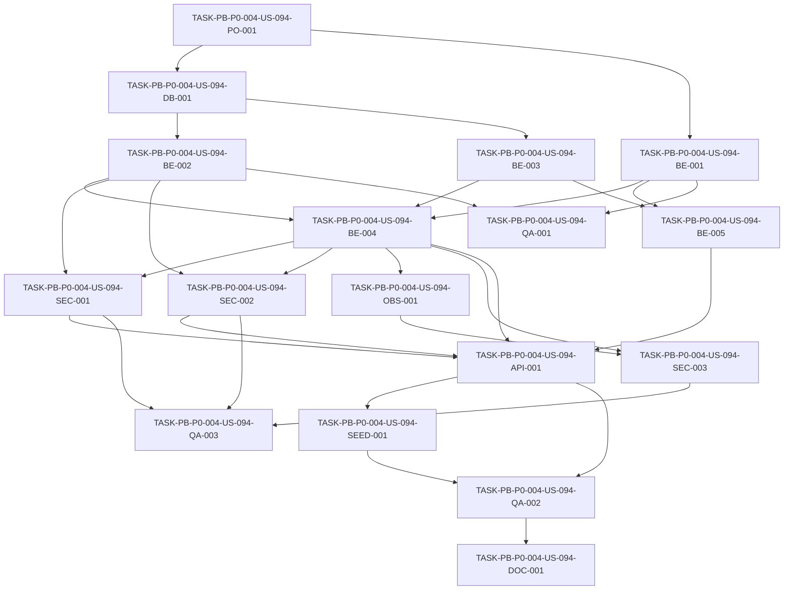

# Development Tasks — PB-P0-004 / US-094: Implementar endpoints AUTH del contrato REST

## 1. Metadata

| Field | Value |
|---|---|
| User Story ID | US-094 |
| Source User Story | management/user-stories/US-094-auth-endpoints-implementation.md |
| Source Technical Specification | management/technical-specs/P0/PB-P0-004/US-094-technical-spec.md |
| Decision Resolution Artifact | management/user-stories/decision-resolutions/US-094-decision-resolution.md |
| Priority | P0 |
| Backlog ID | PB-P0-004 |
| Backlog Title | REST API Endpoints Foundation (Doc 16) |
| Backlog Execution Order | 4 |
| User Story Position in Backlog Item | 1 of 4 |
| Related User Stories in Backlog Item | US-094, US-095, US-096, US-097 |
| Epic | EPIC-API-001 |
| Backlog Item Dependencies | PB-P0-002, PB-P0-003 |
| Feature | Endpoints Auth |
| Module / Domain | API / Identity Access |
| Backlog Alignment Status | Found |
| Task Breakdown Status | Ready for Sprint Planning |
| Created Date | 2026-06-15 |
| Last Updated | 2026-06-15 |

---

## 2. Source Validation

| Source | Found | Used | Notes |
|---|---|---|---|
| User Story | Yes | Yes | US-094 is Approved and marked Ready for Development Tasks. |
| Technical Specification | Yes | Yes | Primary source; status `Ready for Task Breakdown`. |
| Decision Resolution Artifact | Yes | Yes | Formalizes `/api/v1/users/me` and `202 Accepted` for reset request. |
| Product Backlog Prioritized | Yes | Yes | PB-P0-004 found in P0 execution order 4. |
| ADRs | Yes | Yes | ADR-API, ADR-SEC and ADR-TEST references used through the technical spec. |

---

## 3. Backlog Execution Context

### Parent Backlog Item

**PB-P0-004 — REST API Endpoints Foundation (Doc 16)**

Implementar endpoints REST AUTH, EVENT, QUOTE y AI alineados al contrato `/api/v1` para frontend, MSW, QA automation y agentes IA.

### Execution Order Rationale

US-094 debe ejecutarse primero dentro de PB-P0-004 porque entrega autenticación, sesión por cookie HTTP-only y resolución de usuario actual. US-095, US-096 y US-097 dependen de este contexto para aplicar ownership, roles y autorización.

### Related User Stories in Same Backlog Item

| User Story | Role in Backlog Item | Suggested Order |
|---|---|---|
| US-094 | Auth/session/profile contract foundation | 1 |
| US-095 | Event endpoints foundation; depende de auth | 2 |
| US-096 | Quote/Booking endpoints foundation; depende de auth/event | 3 |
| US-097 | AI endpoints foundation; depende de auth/event/quote | 4 |

---

## 4. Task Breakdown Summary

| Area | Number of Tasks | Notes |
|---|---:|---|
| Product / Analysis | 1 | Verificar capacidades existentes y estrategia de sesión antes de implementar. |
| Database / Prisma | 1 | Confirmar/agregar persistencia de sessions/reset tokens si falta. |
| Backend | 5 | DTOs, puertos, repositorios, use cases y controladores. |
| API Contract | 1 | Registrar rutas canónicas `/api/v1/auth/*` y `/api/v1/users/me*`. |
| Security / Authorization | 3 | Cookies, captcha/rate limit, redaction/anti-enumeración. |
| Seed / Demo Data | 1 | Verificar usuarios seed y captcha stub para demo/CI. |
| Observability / Audit | 1 | Logs y métricas de auth sin datos sensibles. |
| QA / Testing | 3 | Unit, integration/API y security negative tests. |
| Documentation / Traceability | 1 | Documentar alineaciones `/users/me` y reset-request `202`. |
| **Total** | **17** | |

---

## 5. Traceability Matrix

| Acceptance Criterion | Technical Spec Section | Task IDs |
|---|---|---|
| AC-01 Register | §7 Backend Technical Design, §9 API Contract, §10 Database, §12 Security | TASK-PB-P0-004-US-094-BE-001, TASK-PB-P0-004-US-094-BE-003, TASK-PB-P0-004-US-094-BE-004, TASK-PB-P0-004-US-094-SEC-002, TASK-PB-P0-004-US-094-QA-002 |
| AC-02 Login | §7 Backend Technical Design, §9 API Contract, §12 Security | TASK-PB-P0-004-US-094-BE-001, TASK-PB-P0-004-US-094-BE-003, TASK-PB-P0-004-US-094-BE-004, TASK-PB-P0-004-US-094-SEC-001, TASK-PB-P0-004-US-094-SEC-002, TASK-PB-P0-004-US-094-QA-002 |
| AC-03 Get current user | §7 Controllers / Routes, §9 API Contract, §12 Authentication | TASK-PB-P0-004-US-094-BE-004, TASK-PB-P0-004-US-094-BE-005, TASK-PB-P0-004-US-094-API-001, TASK-PB-P0-004-US-094-QA-002 |
| AC-04 Update profile | §7 Use Cases, §7 Validation Rules, §9 API Contract | TASK-PB-P0-004-US-094-BE-001, TASK-PB-P0-004-US-094-BE-004, TASK-PB-P0-004-US-094-BE-005, TASK-PB-P0-004-US-094-QA-002 |
| AC-05 Logout | §7 Use Cases, §9 API Contract, §12 Authentication | TASK-PB-P0-004-US-094-BE-004, TASK-PB-P0-004-US-094-BE-005, TASK-PB-P0-004-US-094-SEC-001, TASK-PB-P0-004-US-094-QA-002 |
| AC-06 Reset request | §7 Error Handling, §9 API Contract, §16 Documentation Alignment | TASK-PB-P0-004-US-094-BE-003, TASK-PB-P0-004-US-094-BE-004, TASK-PB-P0-004-US-094-SEC-002, TASK-PB-P0-004-US-094-SEC-003, TASK-PB-P0-004-US-094-QA-002 |
| AC-07 Reset password | §7 Transactions, §10 Database / Prisma, §12 Sensitive Data Handling | TASK-PB-P0-004-US-094-DB-001, TASK-PB-P0-004-US-094-BE-003, TASK-PB-P0-004-US-094-BE-004, TASK-PB-P0-004-US-094-SEC-003, TASK-PB-P0-004-US-094-QA-002 |
| AC-08 Shared API contract | §5 Architecture Alignment, §9 API Contract, §13 Testing Strategy, §14 Observability | TASK-PB-P0-004-US-094-API-001, TASK-PB-P0-004-US-094-OBS-001, TASK-PB-P0-004-US-094-QA-002, TASK-PB-P0-004-US-094-QA-003, TASK-PB-P0-004-US-094-DOC-001 |

---

## 6. Development Tasks

### TASK-PB-P0-004-US-094-PO-001 — Verificar capacidades base y estrategia de sesión antes de implementación

| Field | Value |
|---|---|
| Area | Product / Analysis |
| Type | Review |
| Priority | Must |
| Estimate | S |
| Depends On | PB-P0-002, PB-P0-003 |
| Source AC(s) | AC-01, AC-02, AC-05, AC-08 |
| Technical Spec Section(s) | §3 Executive Technical Summary, §5 Architecture Alignment, §17 Technical Risks & Mitigations |
| Backlog ID | PB-P0-004 |
| User Story ID | US-094 |
| Owner Role | Tech Lead |
| Status | To Do |

#### Objective

Confirmar qué piezas de auth, sesión, captcha, rate limiting, error envelope y Prisma ya existen desde PB-P0-002/PB-P0-003 para evitar duplicación y cerrar la estrategia técnica de sesión.

#### Scope

##### Include

- Revisar estructura real de módulos `identity-access`, `user-profile`, `shared/interface/http`, `infrastructure/security` y Prisma.
- Confirmar si las sesiones serán server-side persistidas o cookie firmada con invalidación suficiente para logout.
- Confirmar dónde vive el captcha stub de CI/QA.
- Confirmar error envelope y correlation ID disponibles.

##### Exclude

- No implementar código productivo.
- No cambiar decisiones PO/BA formalizadas.

#### Implementation Notes

La decisión funcional obligatoria es que login emite cookie HTTP-only firmada y no token JSON. La estrategia exacta de revocación debe permitir que logout provoque `401` en llamadas protegidas posteriores.

#### Acceptance Criteria Covered

AC-01, AC-02, AC-05, AC-08.

#### Definition of Done

- [ ] Capacidades existentes identificadas.
- [ ] Estrategia de sesión/revocación documentada en notas de implementación o ticket.
- [ ] No hay conflicto con `/api/v1/users/me` ni reset-request `202`.

---

### TASK-PB-P0-004-US-094-DB-001 — Verificar o completar persistencia de sesiones y password reset tokens

| Field | Value |
|---|---|
| Area | Database / Prisma |
| Type | Implementation |
| Priority | Must |
| Estimate | M |
| Depends On | TASK-PB-P0-004-US-094-PO-001 |
| Source AC(s) | AC-05, AC-06, AC-07 |
| Technical Spec Section(s) | §10 Database / Prisma Design, §7 Repository / Persistence, §15 Seed / Demo Data Impact |
| Backlog ID | PB-P0-004 |
| User Story ID | US-094 |
| Owner Role | Backend |
| Status | To Do |

#### Objective

Asegurar que Prisma/PostgreSQL soporta las operaciones requeridas por sesiones y recuperación de contraseña sin almacenar secretos en texto plano.

#### Scope

##### Include

- Verificar `User` con email único normalizado, `password_hash`, role, status y preferred language.
- Verificar o agregar `Session` si la estrategia elegida requiere persistencia server-side.
- Verificar o agregar `PasswordResetToken` con `token_hash`, `expires_at`, `consumed_at` y FK a `User`.
- Agregar índices necesarios para lookup de sesión activa y token activo.
- Mantener raw reset token fuera de DB.

##### Exclude

- No crear endpoint público para admins.
- No duplicar migraciones ya entregadas por PB-P0-001.
- No agregar proveedor real de email.

#### Implementation Notes

Si PB-P0-001 ya entregó tablas/campos, esta tarea se limita a validación y pequeños ajustes. El token de reset debe almacenarse hasheado y consumirse atómicamente junto al cambio de contraseña.

#### Acceptance Criteria Covered

AC-05, AC-06, AC-07.

#### Definition of Done

- [ ] Schema Prisma soporta sesiones según estrategia aprobada.
- [ ] Schema Prisma soporta password reset tokens de un solo uso.
- [ ] Índices y constraints necesarios existen o se confirman.
- [ ] Migraciones aplican en test DB.

---

### TASK-PB-P0-004-US-094-BE-001 — Implementar DTOs y schemas Zod estrictos para AUTH y current user

| Field | Value |
|---|---|
| Area | Backend |
| Type | Implementation |
| Priority | Must |
| Estimate | M |
| Depends On | TASK-PB-P0-004-US-094-PO-001 |
| Source AC(s) | AC-01, AC-02, AC-04, AC-06, AC-07, AC-08 |
| Technical Spec Section(s) | §7 DTOs / Schemas, §7 Validation Rules, §9 API Contract Design |
| Backlog ID | PB-P0-004 |
| User Story ID | US-094 |
| Owner Role | Backend |
| Status | To Do |

#### Objective

Crear schemas Zod estrictos para todos los requests y responses públicos de US-094, rechazando campos sensibles o no permitidos.

#### Scope

##### Include

- `RegisterRequestDto`.
- `LoginRequestDto`.
- `PasswordResetRequestDto`.
- `PasswordResetDto`.
- `UpdateCurrentUserProfileDto`.
- `ChangePreferredLanguageDto`.
- `ChangePasswordDto`.
- `AuthUserResponseDto`.
- Validación de `preferredLanguage`: `es-LATAM`, `es-ES`, `pt`, `en`.
- Role allowlist para registro público: `organizer | vendor`.
- Rechazo de unknown fields en PATCH profile, especialmente `email`, `role`, `status`, `password_hash`.

##### Exclude

- No implementar controladores.
- No implementar UI forms.
- No agregar campos fuera del contrato aprobado.

#### Implementation Notes

Los schemas deben vivir en el módulo o carpeta compartida establecida por PB-P0-003. `AuthUserResponseDto` debe ser el único shape serializado para usuarios en estos endpoints.

#### Acceptance Criteria Covered

AC-01, AC-02, AC-04, AC-06, AC-07, AC-08.

#### Definition of Done

- [ ] Schemas Zod creados y exportados.
- [ ] Unknown sensitive fields rechazados.
- [ ] Role `admin` no pasa validación de registro público.
- [ ] DTO público no contiene hash, token, cookie ni secrets.

---

### TASK-PB-P0-004-US-094-BE-002 — Implementar puertos de seguridad: hashing, sesión, captcha y reset tokens

| Field | Value |
|---|---|
| Area | Backend |
| Type | Implementation |
| Priority | Must |
| Estimate | M |
| Depends On | TASK-PB-P0-004-US-094-PO-001, TASK-PB-P0-004-US-094-DB-001 |
| Source AC(s) | AC-01, AC-02, AC-05, AC-06, AC-07 |
| Technical Spec Section(s) | §5 Backend Architecture, §7 Backend Technical Design, §12 Security & Authorization Design |
| Backlog ID | PB-P0-004 |
| User Story ID | US-094 |
| Owner Role | Backend |
| Status | To Do |

#### Objective

Implementar o completar los puertos/adapters necesarios para que los use cases no dependan directamente de librerías de hashing, captcha, cookies o Prisma.

#### Scope

##### Include

- `PasswordHasher` para hash/verify.
- `SessionIssuer` y/o `SessionRepository` según estrategia.
- `CaptchaVerifier` con adapter real/configurable y stub determinista para test.
- `PasswordResetTokenRepository` con hashing de token.
- `NotificationSenderPort` o logger simulado para reset delivery si aplica.

##### Exclude

- No exponer tokens en responses JSON.
- No integrar proveedor real de email salvo que ya exista como infraestructura base.
- No implementar OAuth/MFA.

#### Implementation Notes

Las dependencias concretas pertenecen a infraestructura. Los use cases deben consumir interfaces para mantener Clean/Hexagonal Architecture.

#### Acceptance Criteria Covered

AC-01, AC-02, AC-05, AC-06, AC-07.

#### Definition of Done

- [ ] Puertos definidos o reutilizados.
- [ ] Adapters conectados al composition root.
- [ ] Captcha stub disponible en test/CI.
- [ ] Reset tokens se generan y almacenan solo como hash.

---

### TASK-PB-P0-004-US-094-BE-003 — Implementar repositorios Prisma para User, Session y PasswordResetToken

| Field | Value |
|---|---|
| Area | Backend |
| Type | Implementation |
| Priority | Must |
| Estimate | M |
| Depends On | TASK-PB-P0-004-US-094-DB-001 |
| Source AC(s) | AC-01, AC-03, AC-04, AC-05, AC-06, AC-07 |
| Technical Spec Section(s) | §7 Repository / Persistence, §10 Database / Prisma Design |
| Backlog ID | PB-P0-004 |
| User Story ID | US-094 |
| Owner Role | Backend |
| Status | To Do |

#### Objective

Implementar métodos de persistencia requeridos para usuarios, sesiones y tokens de reset con consultas seguras y transacciones donde aplique.

#### Scope

##### Include

- `UserRepository.findByEmailNormalized`.
- `UserRepository.findById`.
- `UserRepository.create`.
- `UserRepository.updateProfile`.
- `UserRepository.updatePasswordHash`.
- `SessionRepository.create`, `findValid`, `revoke` si se usan sesiones persistidas.
- `PasswordResetTokenRepository.create`, `findValidByTokenHash`, `consume`.

##### Exclude

- No retornar `password_hash` a controladores.
- No implementar queries cross-user.
- No agregar gestión admin de usuarios.

#### Implementation Notes

La normalización de email debe ser consistente entre registro y login. Las operaciones de reset deben poder ejecutarse en transacción para evitar reuso de token.

#### Acceptance Criteria Covered

AC-01, AC-03, AC-04, AC-05, AC-06, AC-07.

#### Definition of Done

- [ ] Repositorios implementados contra Prisma.
- [ ] Métodos de token reset soportan one-use.
- [ ] Métodos no filtran campos sensibles al exterior.
- [ ] Operaciones transaccionales disponibles donde aplica.

---

### TASK-PB-P0-004-US-094-BE-004 — Implementar use cases de AUTH

| Field | Value |
|---|---|
| Area | Backend |
| Type | Implementation |
| Priority | Must |
| Estimate | L |
| Depends On | TASK-PB-P0-004-US-094-BE-001, TASK-PB-P0-004-US-094-BE-002, TASK-PB-P0-004-US-094-BE-003 |
| Source AC(s) | AC-01, AC-02, AC-05, AC-06, AC-07 |
| Technical Spec Section(s) | §7 Use Cases / Application Services, §7 Error Handling, §7 Transactions |
| Backlog ID | PB-P0-004 |
| User Story ID | US-094 |
| Owner Role | Backend |
| Status | To Do |

#### Objective

Implementar la lógica de aplicación para registro, login, logout, solicitud de reset y reset de contraseña.

#### Scope

##### Include

- `RegisterUserUseCase`.
- `LoginUserUseCase`.
- `LogoutUserUseCase`.
- `RequestPasswordResetUseCase`.
- `ResetPasswordUseCase`.
- Anti-enumeración en login y reset request.
- `EMAIL_TAKEN` para duplicado.
- `202 Accepted` genérico para reset-request exista o no el email.
- Consumo atómico del reset token.

##### Exclude

- No implementar current-user profile use cases en esta tarea.
- No enviar email real si MVP usa log estructurado.
- No emitir token en JSON.

#### Implementation Notes

El orden para endpoints públicos sensibles debe ser validación/captcha/rate-limit antes de procesar credenciales o generar tokens. Login inválido debe producir mensaje genérico.

#### Acceptance Criteria Covered

AC-01, AC-02, AC-05, AC-06, AC-07.

#### Definition of Done

- [ ] Registro crea usuarios activos organizer/vendor con password hash.
- [ ] Login emite sesión y no token JSON.
- [ ] Logout revoca o limpia sesión.
- [ ] Reset request responde 202 genérico.
- [ ] Reset password consume token y cambia hash en transacción.

---

### TASK-PB-P0-004-US-094-BE-005 — Implementar use cases de current-user profile

| Field | Value |
|---|---|
| Area | Backend |
| Type | Implementation |
| Priority | Must |
| Estimate | M |
| Depends On | TASK-PB-P0-004-US-094-BE-001, TASK-PB-P0-004-US-094-BE-003 |
| Source AC(s) | AC-03, AC-04 |
| Technical Spec Section(s) | §7 Use Cases / Application Services, §12 Ownership Rules, §9 API Contract Design |
| Backlog ID | PB-P0-004 |
| User Story ID | US-094 |
| Owner Role | Backend |
| Status | To Do |

#### Objective

Implementar lectura y actualización del perfil propio usando exclusivamente la identidad de sesión actual.

#### Scope

##### Include

- `GetCurrentUserUseCase`.
- `UpdateCurrentUserProfileUseCase`.
- `ChangePreferredLanguageUseCase`.
- `ChangePasswordUseCase`.
- Enforce self-access via `req.user.id`.
- Update only `name`, `phone`, `preferredLanguage`.
- Password change con verificación de contraseña actual.

##### Exclude

- No permitir cambio de email, role, status o password hash por PATCH profile.
- No implementar admin user management.
- No implementar perfiles de vendor/organizer extendidos.

#### Implementation Notes

La autorización es ownership propio derivado de sesión. No aceptar userId desde request body o path para estas operaciones.

#### Acceptance Criteria Covered

AC-03, AC-04.

#### Definition of Done

- [ ] Current user se obtiene desde sesión.
- [ ] Profile update modifica solo campos permitidos.
- [ ] Preferred language valida enum soportado.
- [ ] Change password verifica contraseña actual y actualiza hash.

---

### TASK-PB-P0-004-US-094-API-001 — Registrar controladores y rutas canónicas AUTH/current user bajo `/api/v1`

| Field | Value |
|---|---|
| Area | API Contract |
| Type | Implementation |
| Priority | Must |
| Estimate | M |
| Depends On | TASK-PB-P0-004-US-094-BE-004, TASK-PB-P0-004-US-094-BE-005, TASK-PB-P0-004-US-094-SEC-001, TASK-PB-P0-004-US-094-SEC-002 |
| Source AC(s) | AC-01, AC-02, AC-03, AC-04, AC-05, AC-06, AC-07, AC-08 |
| Technical Spec Section(s) | §7 Controllers / Routes, §9 API Contract Design, §16 Documentation Alignment Required |
| Backlog ID | PB-P0-004 |
| User Story ID | US-094 |
| Owner Role | Backend |
| Status | To Do |

#### Objective

Exponer los nueve endpoints aprobados con prefijo `/api/v1`, envelopes estándar, correlation ID y status codes definidos.

#### Scope

##### Include

- `POST /api/v1/auth/register`.
- `POST /api/v1/auth/login`.
- `POST /api/v1/auth/logout`.
- `POST /api/v1/auth/password/reset-request`.
- `POST /api/v1/auth/password/reset`.
- `GET /api/v1/users/me`.
- `PATCH /api/v1/users/me`.
- `PATCH /api/v1/users/me/preferred-language`.
- `POST /api/v1/users/me/change-password`.
- Controladores delgados que delegan a use cases.
- Status `201`, `200`, `202`, `204` según contrato.

##### Exclude

- No usar `/api/v1/me` para esta historia.
- No agregar endpoints admin.
- No agregar UI.

#### Implementation Notes

`/api/v1/users/me` es la ruta canónica formalizada por decision resolution. `/api/v1/auth/password/reset-request` debe responder `202 Accepted`.

#### Acceptance Criteria Covered

AC-01, AC-02, AC-03, AC-04, AC-05, AC-06, AC-07, AC-08.

#### Definition of Done

- [ ] Todas las rutas están registradas bajo `/api/v1`.
- [ ] Controladores usan DTO validation y use cases.
- [ ] `/users/me` funciona y `/me` no se introduce como ruta principal.
- [ ] Status codes coinciden con la spec.

---

### TASK-PB-P0-004-US-094-SEC-001 — Implementar emisión, lectura y revocación de cookie de sesión HTTP-only

| Field | Value |
|---|---|
| Area | Security / Authorization |
| Type | Implementation |
| Priority | Must |
| Estimate | M |
| Depends On | TASK-PB-P0-004-US-094-BE-002, TASK-PB-P0-004-US-094-BE-004 |
| Source AC(s) | AC-02, AC-03, AC-05, AC-08 |
| Technical Spec Section(s) | §9 API Contract Design, §12 Authentication, §12 Sensitive Data Handling |
| Backlog ID | PB-P0-004 |
| User Story ID | US-094 |
| Owner Role | Backend |
| Status | To Do |

#### Objective

Garantizar que la autenticación usa cookie HTTP-only firmada con atributos seguros y que logout invalida la sesión vigente.

#### Scope

##### Include

- `Set-Cookie` en login.
- Cookie HTTP-only, signed, `SameSite=Lax`, `Path=/`.
- `Secure` fuera de local development.
- Middleware de auth que resuelve sesión desde cookie.
- Logout revoca sesión o limpia cookie de forma efectiva.

##### Exclude

- No retornar access token o refresh token en JSON.
- No usar localStorage/sessionStorage.
- No implementar OAuth/MFA.

#### Implementation Notes

Las pruebas deben demostrar que un request protegido posterior al logout responde `401`.

#### Acceptance Criteria Covered

AC-02, AC-03, AC-05, AC-08.

#### Definition of Done

- [ ] Login emite cookie con flags requeridos.
- [ ] Protected endpoints leen sesión desde cookie.
- [ ] Logout invalida acceso posterior.
- [ ] Response JSON no contiene token de sesión.

---

### TASK-PB-P0-004-US-094-SEC-002 — Integrar captcha y rate limiting en endpoints públicos sensibles

| Field | Value |
|---|---|
| Area | Security / Authorization |
| Type | Implementation |
| Priority | Must |
| Estimate | M |
| Depends On | TASK-PB-P0-004-US-094-BE-002, TASK-PB-P0-004-US-094-BE-004 |
| Source AC(s) | AC-01, AC-02, AC-06, AC-08 |
| Technical Spec Section(s) | §4 Scope Boundary, §7 Validation Rules, §12 Negative Authorization Scenarios |
| Backlog ID | PB-P0-004 |
| User Story ID | US-094 |
| Owner Role | Backend |
| Status | To Do |

#### Objective

Proteger `register`, `login` y `password/reset-request` con captcha y rate limits específicos antes de procesar credenciales o datos sensibles.

#### Scope

##### Include

- Captcha required para register/login/reset-request.
- Rate limit por endpoint sensible.
- Rechazo temprano antes de password verification o user creation.
- Captcha stub determinista para test/CI.
- Error envelope estándar para captcha/rate limit.

##### Exclude

- No exigir captcha en endpoints autenticados de profile.
- No llamar proveedor real de captcha en CI.

#### Implementation Notes

La ausencia o falla de captcha no debe registrar password/captcha token. Rate-limit hit debe evitar creación de usuario o verificación de password.

#### Acceptance Criteria Covered

AC-01, AC-02, AC-06, AC-08.

#### Definition of Done

- [ ] Register/login/reset-request requieren captcha.
- [ ] Rate limit retorna `429 RATE_LIMIT_EXCEEDED`.
- [ ] Captcha inválido corta procesamiento antes de credenciales.
- [ ] CI usa stub determinista.

---

### TASK-PB-P0-004-US-094-SEC-003 — Aplicar anti-enumeración y redacción de datos sensibles

| Field | Value |
|---|---|
| Area | Security / Authorization |
| Type | Implementation |
| Priority | Must |
| Estimate | S |
| Depends On | TASK-PB-P0-004-US-094-BE-004, TASK-PB-P0-004-US-094-OBS-001 |
| Source AC(s) | AC-02, AC-06, AC-07, AC-08 |
| Technical Spec Section(s) | §7 Error Handling, §12 Sensitive Data Handling, §14 Observability & Audit |
| Backlog ID | PB-P0-004 |
| User Story ID | US-094 |
| Owner Role | Backend |
| Status | To Do |

#### Objective

Evitar user enumeration y fugas de secretos en responses o logs de auth.

#### Scope

##### Include

- Login inválido siempre responde mensaje genérico.
- Reset-request siempre responde `202` genérico.
- Redactar `password`, `newPassword`, `currentPassword`, `password_hash`, reset token, token hash, session cookie, captcha token y captcha secret.
- No stack traces en responses.

##### Exclude

- No ocultar errores de validación estructural del DTO que no revelen existencia de cuenta.
- No implementar SIEM externo.

#### Implementation Notes

La redacción debe aplicarse tanto a logs de aplicación como a error tracking interno si existe.

#### Acceptance Criteria Covered

AC-02, AC-06, AC-07, AC-08.

#### Definition of Done

- [ ] Login no distingue email inexistente vs password incorrecto.
- [ ] Reset-request no revela existencia de email.
- [ ] Logs y responses no exponen secretos.
- [ ] Tests cubren redacción.

---

### TASK-PB-P0-004-US-094-SEED-001 — Verificar soporte seed/demo para login de admin, organizer y vendor

| Field | Value |
|---|---|
| Area | Seed / Demo Data |
| Type | Setup |
| Priority | Should |
| Estimate | S |
| Depends On | TASK-PB-P0-004-US-094-API-001 |
| Source AC(s) | AC-02, AC-03, AC-08 |
| Technical Spec Section(s) | §10 Seed Impact, §13 Seed / Demo Tests, §15 Seed / Demo Data Impact |
| Backlog ID | PB-P0-004 |
| User Story ID | US-094 |
| Owner Role | Backend |
| Status | To Do |

#### Objective

Confirmar que los usuarios seed existentes soportan demo login y que el flujo no permite crear admins por registro público.

#### Scope

##### Include

- Verificar seed admin/organizer/vendor si existen.
- Verificar que admin puede autenticar solo si fue seed/configuración interna.
- Verificar que public register rechaza `admin`.
- Documentar credenciales demo según mecanismo seguro del proyecto si aplica.

##### Exclude

- No crear nuevos datos seed si los existentes son suficientes.
- No commitear passwords reales.

#### Implementation Notes

Esta tarea puede ser validación si la seed ya está cubierta por historias anteriores.

#### Acceptance Criteria Covered

AC-02, AC-03, AC-08.

#### Definition of Done

- [ ] Demo organizer/vendor pueden iniciar sesión.
- [ ] Admin seed puede iniciar sesión si existe.
- [ ] Registro público no crea admin.
- [ ] No se agregan secretos reales al repo.

---

### TASK-PB-P0-004-US-094-OBS-001 — Agregar logs y métricas estructuradas para eventos AUTH

| Field | Value |
|---|---|
| Area | Observability / Audit |
| Type | Implementation |
| Priority | Must |
| Estimate | S |
| Depends On | TASK-PB-P0-004-US-094-BE-004 |
| Source AC(s) | AC-01, AC-02, AC-05, AC-06, AC-07, AC-08 |
| Technical Spec Section(s) | §7 Observability, §14 Observability & Audit |
| Backlog ID | PB-P0-004 |
| User Story ID | US-094 |
| Owner Role | Backend |
| Status | To Do |

#### Objective

Registrar eventos de seguridad y métricas básicas de auth con correlation ID y sin datos sensibles.

#### Scope

##### Include

- Logs para register/login/logout/reset/captcha/rate-limit.
- `correlationId` en logs.
- User ID cuando se conoce y es seguro registrarlo.
- Métricas recomendadas de success/failure/rate-limit/captcha.

##### Exclude

- No `AdminAction`.
- No payloads completos con credenciales.
- No integración externa obligatoria de observabilidad.

#### Implementation Notes

Eventos esperados incluyen `auth.register.succeeded`, `auth.login.failed`, `auth.password_reset.requested` y `auth.rate_limited`.

#### Acceptance Criteria Covered

AC-01, AC-02, AC-05, AC-06, AC-07, AC-08.

#### Definition of Done

- [ ] Eventos estructurados emitidos.
- [ ] Correlation ID presente.
- [ ] Secretos redactados.
- [ ] Métricas o contadores básicos definidos si la infraestructura lo soporta.

---

### TASK-PB-P0-004-US-094-QA-001 — Crear unit tests para validadores, policies y helpers de AUTH

| Field | Value |
|---|---|
| Area | QA / Testing |
| Type | Test |
| Priority | Must |
| Estimate | M |
| Depends On | TASK-PB-P0-004-US-094-BE-001, TASK-PB-P0-004-US-094-BE-002 |
| Source AC(s) | AC-01, AC-04, AC-06, AC-07 |
| Technical Spec Section(s) | §13 Unit Tests |
| Backlog ID | PB-P0-004 |
| User Story ID | US-094 |
| Owner Role | QA |
| Status | To Do |

#### Objective

Cubrir la lógica aislada de validación y seguridad sin levantar API completa.

#### Scope

##### Include

- Password policy validator.
- Email normalization.
- Role allowlist para public register.
- Password reset token expiry/consumption policy.
- Profile update field allowlist.
- Captcha verifier stub behavior.

##### Exclude

- No tests E2E de frontend.
- No llamadas reales a captcha/email.

#### Implementation Notes

Los tests deben ser determinísticos y ejecutables en CI sin red.

#### Acceptance Criteria Covered

AC-01, AC-04, AC-06, AC-07.

#### Definition of Done

- [ ] Unit tests cubren validadores principales.
- [ ] Role `admin` rechazado en register.
- [ ] Campos sensibles rechazados en profile update.
- [ ] Tests pasan en CI sin red.

---

### TASK-PB-P0-004-US-094-QA-002 — Crear Supertest integration/API tests para todos los endpoints AUTH/current user

| Field | Value |
|---|---|
| Area | QA / Testing |
| Type | Test |
| Priority | Must |
| Estimate | L |
| Depends On | TASK-PB-P0-004-US-094-API-001, TASK-PB-P0-004-US-094-SEED-001 |
| Source AC(s) | AC-01, AC-02, AC-03, AC-04, AC-05, AC-06, AC-07, AC-08 |
| Technical Spec Section(s) | §13 Integration Tests, §13 API Tests, §9 API Contract Design |
| Backlog ID | PB-P0-004 |
| User Story ID | US-094 |
| Owner Role | QA |
| Status | To Do |

#### Objective

Validar el contrato HTTP completo de US-094 con status codes, envelopes, cookies, headers y efectos de persistencia.

#### Scope

##### Include

- Register organizer/vendor happy path.
- Duplicate email `409 EMAIL_TAKEN`.
- Login success con `Set-Cookie`.
- Login failure genérico.
- Logout y acceso posterior `401`.
- Reset-request `202` para email existente e inexistente.
- Reset password con token válido y reuso/expirado rechazado.
- `GET /users/me`.
- `PATCH /users/me`.
- `PATCH /users/me/preferred-language`.
- `POST /users/me/change-password`.
- `meta.correlationId` y envelope estándar.

##### Exclude

- No Playwright UI.
- No pruebas de otros dominios EVENT/QUOTE/AI.

#### Implementation Notes

Los tests deben usar Prisma test DB, captcha stub y cookies de Supertest agent para simular sesión.

#### Acceptance Criteria Covered

AC-01, AC-02, AC-03, AC-04, AC-05, AC-06, AC-07, AC-08.

#### Definition of Done

- [ ] Todos los endpoints tienen happy path.
- [ ] Errores relevantes validan code/message/details.
- [ ] Cookie flags se verifican.
- [ ] Reset-request usa `202` genérico.
- [ ] `/api/v1/users/me` validado como ruta canónica.

---

### TASK-PB-P0-004-US-094-QA-003 — Crear security negative tests para AUTH

| Field | Value |
|---|---|
| Area | QA / Testing |
| Type | Test |
| Priority | Must |
| Estimate | M |
| Depends On | TASK-PB-P0-004-US-094-SEC-001, TASK-PB-P0-004-US-094-SEC-002, TASK-PB-P0-004-US-094-SEC-003 |
| Source AC(s) | AC-01, AC-02, AC-03, AC-05, AC-06, AC-08 |
| Technical Spec Section(s) | §12 Negative Authorization Scenarios, §13 Security Tests |
| Backlog ID | PB-P0-004 |
| User Story ID | US-094 |
| Owner Role | QA |
| Status | To Do |

#### Objective

Verificar explícitamente los controles de seguridad y no exposición de secretos.

#### Scope

##### Include

- Anonymous `/users/me` -> `401`.
- Anonymous logout -> `401`.
- Register `role=admin` rejected.
- Captcha missing/invalid on register/login/reset-request.
- Rate limit returns `429`.
- Failed login has no `Set-Cookie`.
- Cookie has HTTP-only/SameSite/Secure as environment allows.
- JSON responses do not include session token, hash, reset token or captcha secret.
- Logs redact sensitive fields.

##### Exclude

- No pentest manual.
- No OAuth/MFA tests.

#### Implementation Notes

Donde no sea práctico inspeccionar logs reales, usar logger test double para assertions de redacción.

#### Acceptance Criteria Covered

AC-01, AC-02, AC-03, AC-05, AC-06, AC-08.

#### Definition of Done

- [ ] Security negative suite agregada.
- [ ] No token JSON en login.
- [ ] No `Set-Cookie` en login fallido.
- [ ] Logs/responses no exponen secretos.

---

### TASK-PB-P0-004-US-094-DOC-001 — Registrar trazabilidad y alineaciones documentales de AUTH

| Field | Value |
|---|---|
| Area | Documentation / Traceability |
| Type | Documentation |
| Priority | Should |
| Estimate | S |
| Depends On | TASK-PB-P0-004-US-094-QA-002 |
| Source AC(s) | AC-08 |
| Technical Spec Section(s) | §16 Documentation Alignment Required, §19 Task Generation Notes |
| Backlog ID | PB-P0-004 |
| User Story ID | US-094 |
| Owner Role | Tech Lead |
| Status | To Do |

#### Objective

Dejar explícita la trazabilidad final del contrato AUTH y las dos alineaciones documentales formalizadas por PO/BA.

#### Scope

##### Include

- Documentar que US-094 usa `/api/v1/users/me`, no `/api/v1/me`.
- Documentar que reset-request responde `202 Accepted`.
- Preparar notas para OpenAPI snapshot/MSW si el flujo del proyecto lo requiere.
- Vincular tests a ACs y decision resolution.

##### Exclude

- No modificar User Story, Technical Spec ni Decision Resolution.
- No crear OpenAPI snapshot si pertenece a PB-P0-005.

#### Implementation Notes

Esta tarea es de trazabilidad de implementación. No reabre las decisiones ya tomadas.

#### Acceptance Criteria Covered

AC-08.

#### Definition of Done

- [ ] Alineaciones documentales registradas en el lugar de implementación apropiado.
- [ ] Tests/PR referencian decision resolution.
- [ ] No se modifican artifacts fuente de US-094.

---

## 7. Required QA Tasks

| Task ID | Test Type | Purpose |
|---|---|---|
| TASK-PB-P0-004-US-094-QA-001 | Unit | Validar schemas, policies y helpers de auth. |
| TASK-PB-P0-004-US-094-QA-002 | Integration / API | Cubrir todos los endpoints con Supertest y Prisma test DB. |
| TASK-PB-P0-004-US-094-QA-003 | Security Negative | Validar captcha, rate limit, cookie flags, anti-enumeración y redacción. |

---

## 8. Required Security Tasks

| Task ID | Security Concern | Purpose |
|---|---|---|
| TASK-PB-P0-004-US-094-SEC-001 | HTTP-only cookie session | Evitar tokens accesibles por JavaScript y validar logout efectivo. |
| TASK-PB-P0-004-US-094-SEC-002 | Captcha and rate limiting | Proteger endpoints públicos sensibles antes de procesar credenciales. |
| TASK-PB-P0-004-US-094-SEC-003 | Anti-enumeration and redaction | Evitar account enumeration y fuga de secretos en logs/responses. |
| TASK-PB-P0-004-US-094-QA-003 | Security regression tests | Probar los controles anteriores con casos negativos. |

---

## 9. Required Seed / Demo Tasks

| Task ID | Seed/Demo Concern | Purpose |
|---|---|---|
| TASK-PB-P0-004-US-094-SEED-001 | Demo login users | Verificar soporte de login para usuarios seed y rechazo de admin por registro público. |

---

## 10. Observability / Audit Tasks

| Task ID | Concern | Purpose |
|---|---|---|
| TASK-PB-P0-004-US-094-OBS-001 | Security logs and metrics | Registrar eventos AUTH con correlation ID y sin secretos. |

---

## 11. Documentation / Traceability Tasks

| Task ID | Document / Artifact | Purpose |
|---|---|---|
| TASK-PB-P0-004-US-094-DOC-001 | Implementation docs / PR traceability / OpenAPI follow-up notes | Preservar decisiones `/users/me` y reset-request `202`. |

---

## 12. Dependency Graph

---

## 13. Suggested Implementation Order

### Phase 1 — Foundation

1. TASK-PB-P0-004-US-094-PO-001
2. TASK-PB-P0-004-US-094-DB-001
3. TASK-PB-P0-004-US-094-BE-001
4. TASK-PB-P0-004-US-094-BE-002
5. TASK-PB-P0-004-US-094-BE-003

### Phase 2 — Core Implementation

1. TASK-PB-P0-004-US-094-BE-004
2. TASK-PB-P0-004-US-094-BE-005
3. TASK-PB-P0-004-US-094-SEC-001
4. TASK-PB-P0-004-US-094-SEC-002
5. TASK-PB-P0-004-US-094-API-001

### Phase 3 — Validation / Security / QA

1. TASK-PB-P0-004-US-094-OBS-001
2. TASK-PB-P0-004-US-094-SEC-003
3. TASK-PB-P0-004-US-094-SEED-001
4. TASK-PB-P0-004-US-094-QA-001
5. TASK-PB-P0-004-US-094-QA-002
6. TASK-PB-P0-004-US-094-QA-003

### Phase 4 — Documentation / Review

1. TASK-PB-P0-004-US-094-DOC-001

---

## 14. Risks & Mitigations

| Risk | Impact | Mitigation | Related Task |
|---|---|---|---|
| Route drift between `/me` and `/users/me` | Frontend/MSW/OpenAPI mismatch | Implement `/users/me` as canonical and assert it in tests. | TASK-PB-P0-004-US-094-API-001, TASK-PB-P0-004-US-094-DOC-001 |
| Token exposure in JSON or logs | Account takeover risk | Response assertions and redaction tests. | TASK-PB-P0-004-US-094-SEC-001, TASK-PB-P0-004-US-094-SEC-003, TASK-PB-P0-004-US-094-QA-003 |
| Captcha causes CI flakiness | Unstable pipeline | Use deterministic captcha stub in test/CI. | TASK-PB-P0-004-US-094-BE-002, TASK-PB-P0-004-US-094-SEC-002 |
| Password reset token stored raw | Account takeover risk | Store token hash only and consume atomically. | TASK-PB-P0-004-US-094-DB-001, TASK-PB-P0-004-US-094-BE-003 |
| Logout does not revoke access | Broken security expectation | Decide and test session revocation strategy. | TASK-PB-P0-004-US-094-PO-001, TASK-PB-P0-004-US-094-SEC-001, TASK-PB-P0-004-US-094-QA-002 |
| Anti-enumeration regression | User existence leakage | Generic login/reset responses and negative tests. | TASK-PB-P0-004-US-094-SEC-003, TASK-PB-P0-004-US-094-QA-003 |

---

## 15. Out of Scope Confirmation

Do not implement as part of US-094:

- OAuth / SSO.
- MFA / OTP / SMS.
- Public admin creation.
- Admin user management.
- Frontend auth forms/pages.
- Real email delivery unless already provided by platform capability.
- Enterprise distributed session architecture.
- Event, quote, AI, vendor or admin endpoints beyond current-user profile routes.
- Any AI behavior or `AIRecommendation`.
- Tokens in JSON, `localStorage` or `sessionStorage`.

---

## 16. Readiness for Sprint Planning

| Check | Status |
|---|---|
| Product Backlog mapping found | Pass |
| Every AC maps to tasks | Pass |
| Technical Spec used when available | Pass |
| QA tasks included | Pass |
| Security tasks included if applicable | Pass |
| Seed/demo tasks included if applicable | Pass |
| Observability tasks included if applicable | Pass |
| Documentation tasks included if applicable | Pass |
| Task dependencies clear | Pass |
| Tasks small enough | Pass |
| Ready for Sprint Planning | Yes |

---

## 17. Final Recommendation

`Ready for Sprint Planning`

US-094 has an approved user story, a ready technical specification, a formal decision resolution and a clear task breakdown. The implementation should start with existing foundation verification, then persistence/DTO/security ports, then use cases, routes, security hardening and test coverage.
