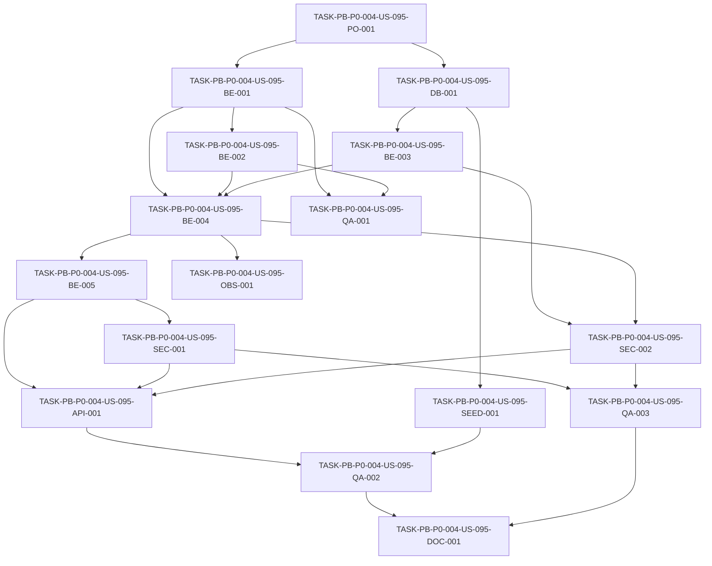

# Development Tasks — PB-P0-004 / US-095: Implementar endpoints EVENT del contrato REST

## 1. Metadata

| Field | Value |
|---|---|
| User Story ID | US-095 |
| Source User Story | management/user-stories/US-095-event-endpoints-implementation.md |
| Source Technical Specification | management/technical-specs/P0/PB-P0-004/US-095-technical-spec.md |
| Decision Resolution Artifact | management/user-stories/decision-resolutions/US-095-decision-resolution.md |
| Priority | P0 |
| Backlog ID | PB-P0-004 |
| Backlog Title | REST API Endpoints Foundation (Doc 16) |
| Backlog Execution Order | 4 |
| User Story Position in Backlog Item | 2 of 4 |
| Related User Stories in Backlog Item | US-094, US-095, US-096, US-097 |
| Epic | EPIC-API-001 |
| Backlog Item Dependencies | PB-P0-002, PB-P0-003 |
| Feature | Endpoints Event |
| Module / Domain | API / Event Planning |
| Backlog Alignment Status | Found |
| Task Breakdown Status | Ready for Sprint Planning |
| Created Date | 2026-06-15 |
| Last Updated | 2026-06-15 |

---

## 2. Source Validation

| Source | Found | Used | Notes |
|---|---|---|---|
| User Story | Yes | Yes | US-095 is Approved and marked Ready for Development Tasks. |
| Technical Specification | Yes | Yes | Primary source; status `Ready for Task Breakdown`. |
| Decision Resolution Artifact | Yes | Yes | Excludes `/admin/events`, uses Doc 16 `activate`/`cancel`, excludes auto-completion job. |
| Product Backlog Prioritized | Yes | Yes | PB-P0-004 found in P0 execution order 4. |
| ADRs | Yes | Yes | ADR-API, ADR-SEC and ADR-TEST references used through the technical spec. |

---

## 3. Backlog Execution Context

### Parent Backlog Item

**PB-P0-004 — REST API Endpoints Foundation (Doc 16)**

Implementar endpoints REST AUTH, EVENT, QUOTE y AI alineados al contrato `/api/v1` para frontend, MSW, QA automation y agentes IA.

### Execution Order Rationale

US-095 se implementa después de US-094 porque todos los endpoints de eventos requieren sesión autenticada, rol y usuario actual. US-095 debe estar disponible antes de US-096 y US-097 porque quote, booking y AI dependen de ownership de eventos y de identificadores de evento válidos.

### Related User Stories in Same Backlog Item

| User Story | Role in Backlog Item | Suggested Order |
|---|---|---|
| US-094 | Auth/session/profile foundation required by all protected endpoints | 1 |
| US-095 | Event API foundation and ownership boundary | 2 |
| US-096 | Quote/Booking API foundation depending on event ownership | 3 |
| US-097 | AI API foundation depending on event and quote contexts | 4 |

---

## 4. Task Breakdown Summary

| Area | Number of Tasks | Notes |
|---|---:|---|
| Product / Analysis | 1 | Verificar modelo, catálogo y dependencias US-094/PB-P0-003. |
| Database / Prisma | 1 | Confirmar o completar índices/constraints del modelo Event. |
| Backend | 5 | DTOs, policies, repositorios, use cases y controller. |
| API Contract | 1 | Registrar rutas Doc 16 bajo `/api/v1/events`. |
| Security / Authorization | 2 | Role guard organizer y owner-scoped access. |
| Seed / Demo Data | 1 | Verificar EventTypes, Locations, usuarios y fixtures. |
| Observability / Audit | 1 | Logs/métricas de lifecycle y access denied. |
| QA / Testing | 3 | Unit, Supertest/API y security negative tests. |
| Documentation / Traceability | 1 | Registrar alineaciones admin/status/delete/autocomplete. |
| **Total** | **16** | |

---

## 5. Traceability Matrix

| Acceptance Criterion | Technical Spec Section | Task IDs |
|---|---|---|
| AC-01 Create event | §7 DTOs, §7 Use Cases, §10 Database, §12 Security | TASK-PB-P0-004-US-095-BE-001, TASK-PB-P0-004-US-095-BE-003, TASK-PB-P0-004-US-095-BE-004, TASK-PB-P0-004-US-095-SEC-001, TASK-PB-P0-004-US-095-QA-002 |
| AC-02 List own events | §7 Repository / Persistence, §9 API Contract, §12 Ownership Rules | TASK-PB-P0-004-US-095-BE-001, TASK-PB-P0-004-US-095-BE-003, TASK-PB-P0-004-US-095-BE-004, TASK-PB-P0-004-US-095-SEC-002, TASK-PB-P0-004-US-095-QA-002 |
| AC-03 Get own event detail | §7 Use Cases, §9 API Contract, §12 Ownership Rules | TASK-PB-P0-004-US-095-BE-003, TASK-PB-P0-004-US-095-BE-004, TASK-PB-P0-004-US-095-SEC-002, TASK-PB-P0-004-US-095-QA-002 |
| AC-04 Update allowed fields | §7 DTOs, §7 Use Cases, §12 Security | TASK-PB-P0-004-US-095-BE-001, TASK-PB-P0-004-US-095-BE-002, TASK-PB-P0-004-US-095-BE-004, TASK-PB-P0-004-US-095-QA-002 |
| AC-05 Currency immutable | §7 Validation Rules, §7 Error Handling, §13 Security Tests | TASK-PB-P0-004-US-095-BE-001, TASK-PB-P0-004-US-095-BE-002, TASK-PB-P0-004-US-095-QA-001, TASK-PB-P0-004-US-095-QA-003 |
| AC-06 Activate event | §7 Use Cases, §7 Validation Rules, §9 API Contract | TASK-PB-P0-004-US-095-BE-002, TASK-PB-P0-004-US-095-BE-004, TASK-PB-P0-004-US-095-API-001, TASK-PB-P0-004-US-095-QA-002 |
| AC-07 Cancel event | §7 Use Cases, §7 Validation Rules, §9 API Contract | TASK-PB-P0-004-US-095-BE-002, TASK-PB-P0-004-US-095-BE-004, TASK-PB-P0-004-US-095-API-001, TASK-PB-P0-004-US-095-QA-002 |
| AC-08 Shared REST contract | §5 Architecture Alignment, §9 API Contract, §13 Testing, §14 Observability | TASK-PB-P0-004-US-095-API-001, TASK-PB-P0-004-US-095-OBS-001, TASK-PB-P0-004-US-095-QA-002, TASK-PB-P0-004-US-095-QA-003, TASK-PB-P0-004-US-095-DOC-001 |

---

## 6. Development Tasks

### TASK-PB-P0-004-US-095-PO-001 — Verificar dependencias, catálogos y alcance Event P0

| Field | Value |
|---|---|
| Area | Product / Analysis |
| Type | Review |
| Priority | Must |
| Estimate | S |
| Depends On | US-094, PB-P0-002, PB-P0-003 |
| Source AC(s) | AC-01, AC-02, AC-08 |
| Technical Spec Section(s) | §2 Backlog Execution Context, §3 Executive Technical Summary, §16 Documentation Alignment Required |
| Backlog ID | PB-P0-004 |
| User Story ID | US-095 |
| Owner Role | Tech Lead |
| Status | To Do |

#### Objective

Confirmar que la implementación parte de auth/session, error envelope, Zod validation y catálogos de eventos ya disponibles, y que el alcance queda limitado a eventos propios de organizer.

#### Scope

##### Include

- Verificar que US-094 expone sesión y current user necesarios.
- Verificar que EventType, Location, CurrencyCode y LanguageCode existen en schema/seed.
- Confirmar que admin event read, auto-completion job, tasks, budget, quote y AI quedan fuera.
- Confirmar convención `403` vs masked `404` para cross-owner event access.

##### Exclude

- No implementar código productivo.
- No reabrir decisiones PO/BA de US-095.

#### Implementation Notes

Las decisiones formalizadas son vinculantes: no `/admin/events`, no `POST /:id/status`, no `DELETE /:id`, no job T+2 en esta historia.

#### Acceptance Criteria Covered

AC-01, AC-02, AC-08.

#### Definition of Done

- [ ] Dependencias US-094/PB-P0-003 confirmadas.
- [ ] Catálogos requeridos identificados.
- [ ] Convención cross-owner `403`/`404` definida para tests.
- [ ] Alcance P0/P1 registrado en notas de implementación.

---

### TASK-PB-P0-004-US-095-DB-001 — Verificar o completar modelo, constraints e índices de Event

| Field | Value |
|---|---|
| Area | Database / Prisma |
| Type | Implementation |
| Priority | Must |
| Estimate | M |
| Depends On | TASK-PB-P0-004-US-095-PO-001 |
| Source AC(s) | AC-01, AC-02, AC-03, AC-06, AC-07 |
| Technical Spec Section(s) | §10 Database / Prisma Design, §15 Seed / Demo Data Impact |
| Backlog ID | PB-P0-004 |
| User Story ID | US-095 |
| Owner Role | Backend |
| Status | To Do |

#### Objective

Asegurar que Prisma/PostgreSQL soporta el contrato Event API sin duplicar trabajo de PB-P0-001.

#### Scope

##### Include

- Verificar campos `owner_id`, `event_type_code`, `event_date`, `guests_count`, `location_id`, `estimated_budget`, `currency_code`, `language_code`, `status`, `completed_at`, `auto_completed`, `notes`, `is_seed`.
- Verificar relaciones a `User`, `EventType` y `Location`.
- Verificar índices `idx_events_owner_id`, `idx_events_owner_status_date`, `idx_events_status_event_date_active`, `idx_events_auto_complete_candidates` si ya aplica, e `idx_events_is_seed` si existe estrategia de reset seed.
- Agregar solo migraciones faltantes estrictamente necesarias.

##### Exclude

- No implementar auto-completion job.
- No crear Budget si no existe invariant ya aprobado.
- No hard delete.

#### Implementation Notes

Currency immutability es una regla de service/application layer; la DB debe soportar persistencia correcta, pero no se debe forzar un rediseño amplio del schema.

#### Acceptance Criteria Covered

AC-01, AC-02, AC-03, AC-06, AC-07.

#### Definition of Done

- [ ] Modelo Event soporta campos requeridos.
- [ ] Relaciones a User/EventType/Location confirmadas.
- [ ] Índices necesarios existen o se agregan.
- [ ] Migraciones pasan en test DB.

---

### TASK-PB-P0-004-US-095-BE-001 — Implementar DTOs y schemas Zod estrictos para Event API

| Field | Value |
|---|---|
| Area | Backend |
| Type | Implementation |
| Priority | Must |
| Estimate | M |
| Depends On | TASK-PB-P0-004-US-095-PO-001 |
| Source AC(s) | AC-01, AC-02, AC-03, AC-04, AC-05, AC-08 |
| Technical Spec Section(s) | §7 DTOs / Schemas, §7 Validation Rules, §9 API Contract Design |
| Backlog ID | PB-P0-004 |
| User Story ID | US-095 |
| Owner Role | Backend |
| Status | To Do |

#### Objective

Crear schemas Zod estrictos para create, update, list query, route params y response DTO de eventos.

#### Scope

##### Include

- `CreateEventRequestDto`.
- `UpdateEventRequestDto`.
- `ListEventsQueryDto`.
- `EventIdParamDto`.
- `EventResponseDto`.
- Rechazo de unknown fields.
- Rechazo explícito de `currencyCode`, `ownerId`, `status`, `completedAt`, `autoCompleted`, `isSeed` y timestamps en PATCH.
- Paginación acotada y sort default `eventDate:asc`.

##### Exclude

- No schemas para tasks, budget, quote, AI o admin.
- No aliases `POST /:id/status` o `DELETE /:id`.

#### Implementation Notes

Aunque `currencyCode` se rechaza en PATCH, la regla debe quedar respaldada también por policy/domain para impedir bypass desde application code.

#### Acceptance Criteria Covered

AC-01, AC-02, AC-03, AC-04, AC-05, AC-08.

#### Definition of Done

- [ ] Schemas creados/exportados.
- [ ] PATCH rechaza campos no editables.
- [ ] Query validation cubre filtros/paginación/sort.
- [ ] Response DTO no expone datos cross-user.

---

### TASK-PB-P0-004-US-095-BE-002 — Implementar policies de lifecycle, ownership y currency immutability

| Field | Value |
|---|---|
| Area | Backend |
| Type | Implementation |
| Priority | Must |
| Estimate | M |
| Depends On | TASK-PB-P0-004-US-095-BE-001 |
| Source AC(s) | AC-04, AC-05, AC-06, AC-07 |
| Technical Spec Section(s) | §7 Validation Rules, §7 Error Handling, §12 Ownership Rules |
| Backlog ID | PB-P0-004 |
| User Story ID | US-095 |
| Owner Role | Backend |
| Status | To Do |

#### Objective

Centralizar reglas de negocio de Event para evitar que queden dispersas en controladores.

#### Scope

##### Include

- `EventLifecycleService` con transiciones válidas: `draft -> active`, eligible -> `cancelled`.
- Rechazo de mutaciones en estados terminales cuando aplique.
- Currency immutability policy con error `409 CURRENCY_IMMUTABLE` o business error equivalente.
- `EventOwnershipPolicy` o uso de policy compartida.
- Validación de organizer role para crear/mutar eventos.

##### Exclude

- No auto-completion T+2.
- No hard delete.
- No multi-collaborator access.

#### Implementation Notes

`status` no debe actualizarse por PATCH genérico. Activación y cancelación tienen use cases/rutas separadas.

#### Acceptance Criteria Covered

AC-04, AC-05, AC-06, AC-07.

#### Definition of Done

- [ ] Lifecycle transitions cubiertas por policy.
- [ ] `currencyCode` update rechazado.
- [ ] Terminal states protegidos.
- [ ] Policies tienen tests unitarios.

---

### TASK-PB-P0-004-US-095-BE-003 — Implementar repositorios Prisma owner-scoped y catálogos Event

| Field | Value |
|---|---|
| Area | Backend |
| Type | Implementation |
| Priority | Must |
| Estimate | M |
| Depends On | TASK-PB-P0-004-US-095-DB-001 |
| Source AC(s) | AC-01, AC-02, AC-03, AC-04, AC-06, AC-07 |
| Technical Spec Section(s) | §7 Repository / Persistence, §10 Database / Prisma Design, §12 Ownership Rules |
| Backlog ID | PB-P0-004 |
| User Story ID | US-095 |
| Owner Role | Backend |
| Status | To Do |

#### Objective

Implementar persistencia de eventos con queries filtradas por owner en la base, no por post-processing.

#### Scope

##### Include

- `EventRepository.create`.
- `EventRepository.findById`.
- `EventRepository.findByIdForOwner`.
- `EventRepository.listByOwner`.
- `EventRepository.update`.
- `EventRepository.transitionStatus`.
- `EventTypeRepository.existsActive`.
- `LocationRepository.existsActive`.
- Soporte para filtros, paginación y sort.

##### Exclude

- No consultas admin globales.
- No hard delete.
- No event task/budget/quote repositories.

#### Implementation Notes

`listByOwner` y `findByIdForOwner` son controles de seguridad además de persistencia. Deben evitar leakage cross-organizer.

#### Acceptance Criteria Covered

AC-01, AC-02, AC-03, AC-04, AC-06, AC-07.

#### Definition of Done

- [ ] Queries owner-scoped implementadas.
- [ ] Catálogos activos validados.
- [ ] Filtros/paginación/sort soportados.
- [ ] No existe método usado por controller que liste todos los eventos para organizer endpoints.

---

### TASK-PB-P0-004-US-095-BE-004 — Implementar use cases de Event API

| Field | Value |
|---|---|
| Area | Backend |
| Type | Implementation |
| Priority | Must |
| Estimate | L |
| Depends On | TASK-PB-P0-004-US-095-BE-001, TASK-PB-P0-004-US-095-BE-002, TASK-PB-P0-004-US-095-BE-003 |
| Source AC(s) | AC-01, AC-02, AC-03, AC-04, AC-05, AC-06, AC-07 |
| Technical Spec Section(s) | §7 Use Cases / Application Services, §7 Transactions, §9 API Contract Design |
| Backlog ID | PB-P0-004 |
| User Story ID | US-095 |
| Owner Role | Backend |
| Status | To Do |

#### Objective

Implementar los seis use cases de Event API con reglas de organizer ownership, lifecycle y DTO response.

#### Scope

##### Include

- `CreateEventUseCase`.
- `ListMyEventsUseCase`.
- `GetEventByIdUseCase`.
- `UpdateEventUseCase`.
- `ActivateEventUseCase`.
- `CancelEventUseCase`.
- Event creation default `status='draft'` and `autoCompleted=false`.
- Optional transaction on create/transition where needed.
- Mapping to `EventResponseDto`.

##### Exclude

- No admin read use case.
- No auto-completion job.
- No tasks/budget/quote/AI behavior.

#### Implementation Notes

Create may create linked Budget only if that invariant already exists in foundation; do not introduce budget scope from US-095 itself.

#### Acceptance Criteria Covered

AC-01, AC-02, AC-03, AC-04, AC-05, AC-06, AC-07.

#### Definition of Done

- [ ] Six use cases implemented.
- [ ] Create persists draft event with `autoCompleted=false`.
- [ ] List/detail are owner-scoped.
- [ ] Activate/cancel enforce valid transitions.
- [ ] Currency immutability enforced.

---

### TASK-PB-P0-004-US-095-BE-005 — Implementar EventsController y composición de dependencias

| Field | Value |
|---|---|
| Area | Backend |
| Type | Implementation |
| Priority | Must |
| Estimate | M |
| Depends On | TASK-PB-P0-004-US-095-BE-004 |
| Source AC(s) | AC-01, AC-02, AC-03, AC-04, AC-06, AC-07, AC-08 |
| Technical Spec Section(s) | §7 Controllers / Routes, §5 Backend Architecture |
| Backlog ID | PB-P0-004 |
| User Story ID | US-095 |
| Owner Role | Backend |
| Status | To Do |

#### Objective

Conectar controller delgado, use cases y adapters reales siguiendo modular monolith y Clean/Hexagonal Architecture.

#### Scope

##### Include

- `EventsController`.
- Dependency wiring/composition root.
- Presenter/mapper de `EventResponseDto`.
- Uso de middleware de auth, role, validation y error handler existentes.

##### Exclude

- No lógica de negocio dentro del controller.
- No rutas admin.
- No UI.

#### Implementation Notes

Los controllers deben limitarse a extraer params/query/body ya validados y delegar al use case correspondiente.

#### Acceptance Criteria Covered

AC-01, AC-02, AC-03, AC-04, AC-06, AC-07, AC-08.

#### Definition of Done

- [ ] Controller delega a use cases.
- [ ] Dependencias inyectadas correctamente.
- [ ] Response DTO consistente.
- [ ] No hay policies implementadas en controller.

---

### TASK-PB-P0-004-US-095-SEC-001 — Aplicar autenticación y organizer role guard a todos los endpoints Event

| Field | Value |
|---|---|
| Area | Security / Authorization |
| Type | Implementation |
| Priority | Must |
| Estimate | S |
| Depends On | TASK-PB-P0-004-US-095-BE-005 |
| Source AC(s) | AC-01, AC-02, AC-03, AC-04, AC-06, AC-07, AC-08 |
| Technical Spec Section(s) | §12 Authentication, §12 Authorization, §12 Role Rules |
| Backlog ID | PB-P0-004 |
| User Story ID | US-095 |
| Owner Role | Backend |
| Status | To Do |

#### Objective

Garantizar que sólo usuarios autenticados con rol `organizer` consumen la API P0 de eventos.

#### Scope

##### Include

- Auth middleware en todas las rutas `/api/v1/events`.
- Organizer role guard.
- Vendors denied.
- Anonymous denied.
- Admin mutation through organizer route denied.

##### Exclude

- No admin read routes.
- No frontend guards como sustituto.

#### Implementation Notes

Los guards deben ejecutarse antes de use cases. El backend es la fuente de verdad.

#### Acceptance Criteria Covered

AC-01, AC-02, AC-03, AC-04, AC-06, AC-07, AC-08.

#### Definition of Done

- [ ] Anonymous requests return `401`.
- [ ] Vendor requests return `403`.
- [ ] Admin mutation via organizer route denied.
- [ ] Guards aplicados a todas las rutas Event.

---

### TASK-PB-P0-004-US-095-SEC-002 — Enforzar owner-scoped access y masked cross-owner behavior

| Field | Value |
|---|---|
| Area | Security / Authorization |
| Type | Implementation |
| Priority | Must |
| Estimate | M |
| Depends On | TASK-PB-P0-004-US-095-BE-003, TASK-PB-P0-004-US-095-BE-004 |
| Source AC(s) | AC-02, AC-03, AC-04, AC-06, AC-07, AC-08 |
| Technical Spec Section(s) | §12 Ownership Rules, §12 Negative Authorization Scenarios, §7 Error Handling |
| Backlog ID | PB-P0-004 |
| User Story ID | US-095 |
| Owner Role | Backend |
| Status | To Do |

#### Objective

Evitar fuga de eventos entre organizadores mediante queries owner-scoped y manejo de error seguro.

#### Scope

##### Include

- `listByOwner` como única fuente para list endpoint.
- Detail/update/activate/cancel usan `findByIdForOwner` o owner check equivalente.
- Cross-owner access responde según convención compartida `403` o masked `404`.
- No mutación cuando ownership falla.

##### Exclude

- No access colaborativo.
- No admin override.

#### Implementation Notes

La seguridad debe estar en repository/use case boundary, no en filtros frontend ni post-processing.

#### Acceptance Criteria Covered

AC-02, AC-03, AC-04, AC-06, AC-07, AC-08.

#### Definition of Done

- [ ] List nunca devuelve eventos ajenos.
- [ ] Detail/update/transition validan owner.
- [ ] Cross-owner no revela datos.
- [ ] Tests cubren organizer A vs organizer B.

---

### TASK-PB-P0-004-US-095-API-001 — Registrar rutas Doc 16 bajo `/api/v1/events`

| Field | Value |
|---|---|
| Area | API Contract |
| Type | Implementation |
| Priority | Must |
| Estimate | M |
| Depends On | TASK-PB-P0-004-US-095-BE-005, TASK-PB-P0-004-US-095-SEC-001, TASK-PB-P0-004-US-095-SEC-002 |
| Source AC(s) | AC-01, AC-02, AC-03, AC-04, AC-06, AC-07, AC-08 |
| Technical Spec Section(s) | §7 Controllers / Routes, §9 API Contract Design, §16 Documentation Alignment Required |
| Backlog ID | PB-P0-004 |
| User Story ID | US-095 |
| Owner Role | Backend |
| Status | To Do |

#### Objective

Exponer exactamente el contrato Event P0 aprobado por Doc 16.

#### Scope

##### Include

- `POST /api/v1/events`.
- `GET /api/v1/events`.
- `GET /api/v1/events/:eventId`.
- `PATCH /api/v1/events/:eventId`.
- `POST /api/v1/events/:eventId/activate`.
- `POST /api/v1/events/:eventId/cancel`.
- Standard response/error envelopes.
- Pagination metadata for list.
- Correlation ID propagation.

##### Exclude

- No `POST /events/:id/status`.
- No `DELETE /events/:id`.
- No `/api/v1/admin/events`.

#### Implementation Notes

`activate` and `cancel` are canonical. Do not add aliases unless a later PO/Tech decision explicitly approves them.

#### Acceptance Criteria Covered

AC-01, AC-02, AC-03, AC-04, AC-06, AC-07, AC-08.

#### Definition of Done

- [ ] Six approved routes registered.
- [ ] Status codes match spec.
- [ ] Pagination metadata included for list.
- [ ] Non-approved aliases/admin routes not present.

---

### TASK-PB-P0-004-US-095-SEED-001 — Preparar fixtures seed/test para Event API

| Field | Value |
|---|---|
| Area | Seed / Demo Data |
| Type | Setup |
| Priority | Should |
| Estimate | S |
| Depends On | TASK-PB-P0-004-US-095-DB-001 |
| Source AC(s) | AC-01, AC-02, AC-03, AC-08 |
| Technical Spec Section(s) | §10 Seed Impact, §13 Seed / Demo Tests, §15 Seed / Demo Data Impact |
| Backlog ID | PB-P0-004 |
| User Story ID | US-095 |
| Owner Role | Backend |
| Status | To Do |

#### Objective

Asegurar datos determinísticos para pruebas y demo: organizers, vendor negativo, EventTypes y Locations activos.

#### Scope

##### Include

- Al menos dos organizers para ownership tests.
- Un vendor para wrong-role tests.
- Active EventType values.
- Active Location records.
- Supported currency/language values.
- Test isolation strategy for created events.

##### Exclude

- No mutar seed global de forma destructiva.
- No crear datos para tasks/budget/quote/AI.

#### Implementation Notes

Preferir factories de test si el proyecto ya las usa; usar seed base sólo para catálogos estables.

#### Acceptance Criteria Covered

AC-01, AC-02, AC-03, AC-08.

#### Definition of Done

- [ ] Fixtures/factories cubren organizer A/B y vendor.
- [ ] EventTypes y Locations activos disponibles.
- [ ] Tests limpian eventos creados.
- [ ] Demo flow create/list/detail puede ejecutarse.

---

### TASK-PB-P0-004-US-095-OBS-001 — Agregar logs y métricas estructuradas para Event API

| Field | Value |
|---|---|
| Area | Observability / Audit |
| Type | Implementation |
| Priority | Must |
| Estimate | S |
| Depends On | TASK-PB-P0-004-US-095-BE-004 |
| Source AC(s) | AC-01, AC-04, AC-06, AC-07, AC-08 |
| Technical Spec Section(s) | §7 Observability, §14 Observability & Audit |
| Backlog ID | PB-P0-004 |
| User Story ID | US-095 |
| Owner Role | Backend |
| Status | To Do |

#### Objective

Registrar eventos clave de Event API con correlation ID, actor ID y event ID sin exponer notas completas ni payloads privados.

#### Scope

##### Include

- Logs `event.created`, `event.updated`, `event.activated`, `event.cancelled`.
- Logs `event.access_denied`, `event.validation_failed`, `event.currency_immutable_violation`, `event.lifecycle_transition_rejected`.
- Métricas recomendadas de create/list/transition/denied.
- `correlationId` en logs.

##### Exclude

- No `AdminAction`.
- No logging completo de `notes`.
- No integración externa obligatoria.

#### Implementation Notes

Admin event audit pertenece a PB-P1-010/US-016, no a US-095.

#### Acceptance Criteria Covered

AC-01, AC-04, AC-06, AC-07, AC-08.

#### Definition of Done

- [ ] Logs estructurados agregados.
- [ ] Correlation ID incluido.
- [ ] No se loguean notas completas.
- [ ] Métricas o contadores definidos si la infraestructura lo soporta.

---

### TASK-PB-P0-004-US-095-QA-001 — Crear unit tests de DTOs, lifecycle y policies Event

| Field | Value |
|---|---|
| Area | QA / Testing |
| Type | Test |
| Priority | Must |
| Estimate | M |
| Depends On | TASK-PB-P0-004-US-095-BE-001, TASK-PB-P0-004-US-095-BE-002 |
| Source AC(s) | AC-01, AC-02, AC-04, AC-05, AC-06, AC-07 |
| Technical Spec Section(s) | §13 Unit Tests |
| Backlog ID | PB-P0-004 |
| User Story ID | US-095 |
| Owner Role | QA |
| Status | To Do |

#### Objective

Validar reglas aisladas antes de integración HTTP.

#### Scope

##### Include

- DTO create/update/list validation.
- Pagination bounds.
- Currency immutability policy.
- Event lifecycle transitions.
- Owner policy.
- Rechazo de forbidden PATCH fields.

##### Exclude

- No browser E2E.
- No tests de admin event endpoints.

#### Implementation Notes

Los tests deben referenciar los ACs o business rules cuando sea práctico para trazabilidad.

#### Acceptance Criteria Covered

AC-01, AC-02, AC-04, AC-05, AC-06, AC-07.

#### Definition of Done

- [ ] Unit tests cubren schemas.
- [ ] Unit tests cubren lifecycle.
- [ ] Currency immutability testeada.
- [ ] Forbidden PATCH fields rechazados.

---

### TASK-PB-P0-004-US-095-QA-002 — Crear Supertest integration/API tests para todos los endpoints Event

| Field | Value |
|---|---|
| Area | QA / Testing |
| Type | Test |
| Priority | Must |
| Estimate | L |
| Depends On | TASK-PB-P0-004-US-095-API-001, TASK-PB-P0-004-US-095-SEED-001 |
| Source AC(s) | AC-01, AC-02, AC-03, AC-04, AC-05, AC-06, AC-07, AC-08 |
| Technical Spec Section(s) | §13 Integration Tests, §13 API Tests, §9 API Contract Design |
| Backlog ID | PB-P0-004 |
| User Story ID | US-095 |
| Owner Role | QA |
| Status | To Do |

#### Objective

Validar el contrato HTTP completo de Event API con status codes, envelopes, pagination metadata y DB effects.

#### Scope

##### Include

- Organizer creates event -> `201`.
- Created event has `draft` and `autoCompleted=false`.
- Organizer lists only own events with filters.
- Organizer gets own event detail.
- Organizer updates editable fields.
- PATCH `currencyCode` rejected.
- Organizer activates draft event.
- Organizer cancels eligible event.
- Invalid transition returns business error.
- `meta.correlationId` asserted.

##### Exclude

- No UI Playwright.
- No tasks/budget/quote/AI endpoints.
- No admin routes.

#### Implementation Notes

Use authenticated Supertest agent/session from US-094. Tests should create isolated events and clean up.

#### Acceptance Criteria Covered

AC-01, AC-02, AC-03, AC-04, AC-05, AC-06, AC-07, AC-08.

#### Definition of Done

- [ ] All six endpoints covered.
- [ ] Pagination metadata validated.
- [ ] Lifecycle status changes verified in DB.
- [ ] Currency immutability verified.
- [ ] Standard envelopes/correlation ID asserted.

---

### TASK-PB-P0-004-US-095-QA-003 — Crear security negative tests para Event API

| Field | Value |
|---|---|
| Area | QA / Testing |
| Type | Test |
| Priority | Must |
| Estimate | M |
| Depends On | TASK-PB-P0-004-US-095-SEC-001, TASK-PB-P0-004-US-095-SEC-002 |
| Source AC(s) | AC-02, AC-03, AC-04, AC-05, AC-08 |
| Technical Spec Section(s) | §12 Negative Authorization Scenarios, §13 Security Tests |
| Backlog ID | PB-P0-004 |
| User Story ID | US-095 |
| Owner Role | QA |
| Status | To Do |

#### Objective

Probar que los endpoints Event no filtran ni mutan datos de otros usuarios o roles incorrectos.

#### Scope

##### Include

- Anonymous requests -> `401`.
- Vendor requests -> `403`.
- Cross-organizer detail/update/activate/cancel -> `403` or masked `404`.
- Admin mutation through organizer endpoint -> `403`.
- PATCH direct `ownerId`, `status`, `autoCompleted`, `completedAt` rejected.
- Cross-owner mutation leaves DB unchanged.
- No `/api/v1/admin/events`, `POST /events/:id/status` or `DELETE /events/:id` route introduced by this story.

##### Exclude

- No P1 admin audit tests.
- No multi-collaborator access tests.

#### Implementation Notes

Use the convention confirmed in TASK-PO-001 for cross-owner status expectations.

#### Acceptance Criteria Covered

AC-02, AC-03, AC-04, AC-05, AC-08.

#### Definition of Done

- [ ] Anonymous/vendor/admin negatives covered.
- [ ] Cross-owner access covered.
- [ ] Forbidden PATCH fields covered.
- [ ] Non-approved routes absent.
- [ ] DB unchanged after denied mutation.

---

### TASK-PB-P0-004-US-095-DOC-001 — Registrar trazabilidad y alineaciones documentales de Event API

| Field | Value |
|---|---|
| Area | Documentation / Traceability |
| Type | Documentation |
| Priority | Should |
| Estimate | S |
| Depends On | TASK-PB-P0-004-US-095-QA-002, TASK-PB-P0-004-US-095-QA-003 |
| Source AC(s) | AC-08 |
| Technical Spec Section(s) | §16 Documentation Alignment Required, §19 Task Generation Notes |
| Backlog ID | PB-P0-004 |
| User Story ID | US-095 |
| Owner Role | Tech Lead |
| Status | To Do |

#### Objective

Dejar trazabilidad de las decisiones de alcance y rutas Event para que OpenAPI/MSW y futuras historias no reabran conflictos resueltos.

#### Scope

##### Include

- Registrar que `/admin/events` queda fuera de US-095.
- Registrar que lifecycle usa `POST /events/:eventId/activate` y `POST /events/:eventId/cancel`.
- Registrar que `POST /:id/status` y `DELETE /:id` no se implementan.
- Registrar que auto-completion T+2 queda para PB-P1-009.
- Preparar notas para OpenAPI snapshot si aplica.

##### Exclude

- No modificar User Story, Technical Spec ni Decision Resolution.
- No implementar OpenAPI snapshot de PB-P0-005.

#### Implementation Notes

La documentación de implementación debe referenciar US-095 decision resolution cuando sea posible.

#### Acceptance Criteria Covered

AC-08.

#### Definition of Done

- [ ] Alineaciones documentales registradas.
- [ ] PR/ticket referencia decision resolution.
- [ ] No se modifican artifacts fuente de US-095.

---

## 7. Required QA Tasks

| Task ID | Test Type | Purpose |
|---|---|---|
| TASK-PB-P0-004-US-095-QA-001 | Unit | Validar DTOs, lifecycle, ownership y currency immutability. |
| TASK-PB-P0-004-US-095-QA-002 | Integration / API | Cubrir todos los endpoints Event con Supertest. |
| TASK-PB-P0-004-US-095-QA-003 | Security Negative | Validar anonymous/vendor/admin/cross-owner y rutas fuera de scope. |

---

## 8. Required Security Tasks

| Task ID | Security Concern | Purpose |
|---|---|---|
| TASK-PB-P0-004-US-095-SEC-001 | Authentication and organizer role guard | Bloquear anonymous, vendor y admin mutation por rutas organizer. |
| TASK-PB-P0-004-US-095-SEC-002 | Owner-scoped access | Evitar leakage y mutación cross-organizer. |
| TASK-PB-P0-004-US-095-QA-003 | Security regression tests | Probar controles de autorización y no mutación. |

---

## 9. Required Seed / Demo Tasks

| Task ID | Seed/Demo Concern | Purpose |
|---|---|---|
| TASK-PB-P0-004-US-095-SEED-001 | Event API fixtures | Asegurar organizers, vendor negativo, EventTypes y Locations activos. |

---

## 10. Observability / Audit Tasks

| Task ID | Concern | Purpose |
|---|---|---|
| TASK-PB-P0-004-US-095-OBS-001 | Event API logs and metrics | Registrar lifecycle, validation, denied access and correlation ID. |

---

## 11. Documentation / Traceability Tasks

| Task ID | Document / Artifact | Purpose |
|---|---|---|
| TASK-PB-P0-004-US-095-DOC-001 | Implementation docs / PR traceability / OpenAPI follow-up notes | Preservar decisiones admin P1, activate/cancel y auto-completion fuera de scope. |

---

## 12. Dependency Graph

---

## 13. Suggested Implementation Order

### Phase 1 — Foundation

1. TASK-PB-P0-004-US-095-PO-001
2. TASK-PB-P0-004-US-095-DB-001
3. TASK-PB-P0-004-US-095-BE-001
4. TASK-PB-P0-004-US-095-BE-002
5. TASK-PB-P0-004-US-095-BE-003

### Phase 2 — Core Implementation

1. TASK-PB-P0-004-US-095-BE-004
2. TASK-PB-P0-004-US-095-BE-005
3. TASK-PB-P0-004-US-095-SEC-001
4. TASK-PB-P0-004-US-095-SEC-002
5. TASK-PB-P0-004-US-095-API-001

### Phase 3 — Validation / Security / QA

1. TASK-PB-P0-004-US-095-SEED-001
2. TASK-PB-P0-004-US-095-OBS-001
3. TASK-PB-P0-004-US-095-QA-001
4. TASK-PB-P0-004-US-095-QA-002
5. TASK-PB-P0-004-US-095-QA-003

### Phase 4 — Documentation / Review

1. TASK-PB-P0-004-US-095-DOC-001

---

## 14. Risks & Mitigations

| Risk | Impact | Mitigation | Related Task |
|---|---|---|---|
| Cross-organizer data leakage | High security risk | Owner-scoped repository queries and cross-owner Supertest cases. | TASK-PB-P0-004-US-095-SEC-002, TASK-PB-P0-004-US-095-QA-003 |
| Route drift with Doc 14 status/delete endpoints | Contract mismatch | Implement only Doc 16 `activate`/`cancel`; assert aliases absent. | TASK-PB-P0-004-US-095-API-001, TASK-PB-P0-004-US-095-DOC-001 |
| Currency update sneaks through PATCH | Violates BR-EVENT/NFR-DATA | Strict schema plus domain policy plus tests. | TASK-PB-P0-004-US-095-BE-001, TASK-PB-P0-004-US-095-BE-002, TASK-PB-P0-004-US-095-QA-003 |
| Admin endpoints accidentally included | Scope creep | Keep `/admin/events` out and add route absence tests. | TASK-PB-P0-004-US-095-API-001, TASK-PB-P0-004-US-095-QA-003 |
| Auto-completion job implemented in API story | Scope creep and scheduling complexity | Preserve compatible fields only; document PB-P1-009 ownership. | TASK-PB-P0-004-US-095-DOC-001 |
| Missing catalogs in test DB | Flaky create/list tests | Seed/factory active EventTypes and Locations. | TASK-PB-P0-004-US-095-SEED-001 |

---

## 15. Out of Scope Confirmation

Do not implement as part of US-095:

- Frontend event wizard/dashboard UI.
- EventTask endpoints.
- Budget endpoints and BudgetItem CRUD.
- QuoteRequest, Quote or BookingIntent endpoints.
- AI endpoints under `/events/:eventId/ai/*`.
- `GET /api/v1/admin/events` or admin event audit behavior.
- Auto-completion job T+2.
- `POST /events/:id/status`.
- `DELETE /events/:id`.
- Hard delete of events.
- Multi-collaborator access.
- Payments, contracts, chat, WhatsApp, RAG or autonomous AI decisions.

---

## 16. Readiness for Sprint Planning

| Check | Status |
|---|---|
| Product Backlog mapping found | Pass |
| Every AC maps to tasks | Pass |
| Technical Spec used when available | Pass |
| QA tasks included | Pass |
| Security tasks included if applicable | Pass |
| Seed/demo tasks included if applicable | Pass |
| Observability tasks included if applicable | Pass |
| Documentation tasks included if applicable | Pass |
| Task dependencies clear | Pass |
| Tasks small enough | Pass |
| Ready for Sprint Planning | Yes |

---

## 17. Final Recommendation

`Ready for Sprint Planning`

US-095 has an approved user story, a ready technical specification, a formal decision resolution and a dependency-aware task breakdown. Implementation should start after US-094 auth/session support is available, then proceed through Event schema validation, policies, owner-scoped repositories, use cases, routes, security hardening and Supertest coverage.
