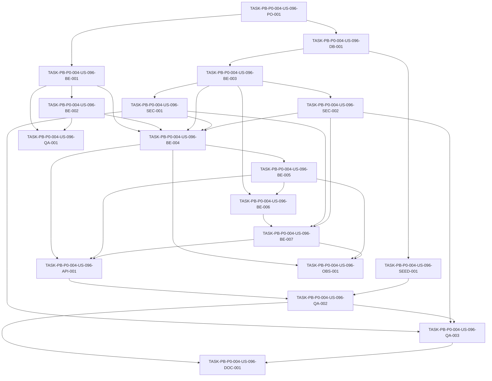

# Development Tasks — PB-P0-004 / US-096: Implementar endpoints Quote / Booking del contrato REST

## 1. Metadata

| Field | Value |
|---|---|
| User Story ID | US-096 |
| Source User Story | management/user-stories/US-096-quote-endpoints-implementation.md |
| Source Technical Specification | management/technical-specs/P0/PB-P0-004/US-096-technical-spec.md |
| Decision Resolution Artifact | No aplica |
| Priority | P0 |
| Backlog ID | PB-P0-004 |
| Backlog Title | REST API Endpoints Foundation (Doc 16) |
| Backlog Execution Order | 4 |
| User Story Position in Backlog Item | 3 of 4 |
| Related User Stories in Backlog Item | US-094, US-095, US-096, US-097 |
| Epic | EPIC-API-001 |
| Backlog Item Dependencies | PB-P0-002, PB-P0-003 |
| Feature | REST API Endpoints Foundation |
| Module / Domain | API / Quote Flow / Booking Intent |
| Backlog Alignment Status | Found |
| Task Breakdown Status | Ready for Sprint Planning |
| Created Date | 2026-06-15 |
| Last Updated | 2026-06-15 |

---

## 2. Source Validation

| Source | Found | Used | Notes |
|---|---|---|---|
| User Story | Yes | Yes | US-096 is Approved and marked Ready for Development Tasks. |
| Technical Specification | Yes | Yes | Primary source; status `Ready for Task Breakdown`. |
| Decision Resolution Artifact | No | No | No formal decision artifact exists for US-096. |
| Product Backlog Prioritized | Yes | Yes | PB-P0-004 found in P0 execution order 4. |
| ADRs | Yes | Yes | ADR-API, ADR-SEC and ADR-TEST references used through the technical spec. |

---

## 3. Backlog Execution Context

### Parent Backlog Item

**PB-P0-004 — REST API Endpoints Foundation (Doc 16)**

Implementar endpoints REST AUTH, EVENT, QUOTE y AI alineados al contrato `/api/v1` para frontend, MSW, QA automation y agentes IA.

### Execution Order Rationale

US-096 se implementa después de US-094 y US-095 porque QuoteRequest, Quote y BookingIntent requieren sesión autenticada, role context, event ownership y eventos activos. US-096 debe estar disponible antes de US-097 porque AI quote brief y quote comparison dependen de QuoteRequest y Quote estables.

### Related User Stories in Same Backlog Item

| User Story | Role in Backlog Item | Suggested Order |
|---|---|---|
| US-094 | Auth/session/profile foundation | 1 |
| US-095 | Event API and ownership foundation | 2 |
| US-096 | Quote/Booking API foundation | 3 |
| US-097 | AI API foundation using event/quote contexts | 4 |

---

## 4. Task Breakdown Summary

| Area | Number of Tasks | Notes |
|---|---:|---|
| Product / Analysis | 1 | Verificar dependencias US-094/US-095 y alcance P0. |
| Database / Prisma | 1 | Confirmar constraints, partial indexes y modelos quote/booking. |
| Backend | 7 | DTOs, policies, repositorios, use cases y controllers para QuoteRequest, Quote y BookingIntent. |
| API Contract | 1 | Registrar rutas Doc 16, incluyendo `/quote-requests/:id/quote` singular. |
| Security / Authorization | 2 | Organizer ownership y vendor assignment. |
| Seed / Demo Data | 1 | Fixtures bilaterales organizer/vendor/category/event. |
| Observability / Audit | 1 | Logs/métricas de transiciones quote/booking. |
| QA / Testing | 3 | Unit, Supertest/API y security/domain negative tests. |
| Documentation / Traceability | 1 | Alineaciones singular/plural, admin P1 y side-effects fuera de scope. |
| **Total** | **18** | |

---

## 5. Traceability Matrix

| Acceptance Criterion | Technical Spec Section | Task IDs |
|---|---|---|
| AC-01 Create QuoteRequest | §7 Validation Rules, §7 Transactions, §10 DB, §12 Security | TASK-PB-P0-004-US-096-BE-001, TASK-PB-P0-004-US-096-BE-002, TASK-PB-P0-004-US-096-BE-003, TASK-PB-P0-004-US-096-BE-004, TASK-PB-P0-004-US-096-SEC-001, TASK-PB-P0-004-US-096-QA-002 |
| AC-02 List event QuoteRequests | §7 Repository, §9 API, §12 Ownership | TASK-PB-P0-004-US-096-BE-003, TASK-PB-P0-004-US-096-BE-004, TASK-PB-P0-004-US-096-SEC-001, TASK-PB-P0-004-US-096-QA-002 |
| AC-03 Vendor assigned list | §7 Repository, §9 API, §12 Authorization | TASK-PB-P0-004-US-096-BE-003, TASK-PB-P0-004-US-096-BE-004, TASK-PB-P0-004-US-096-SEC-002, TASK-PB-P0-004-US-096-QA-002 |
| AC-04 QuoteRequest detail | §7 Use Cases, §9 API, §12 Ownership | TASK-PB-P0-004-US-096-BE-004, TASK-PB-P0-004-US-096-SEC-001, TASK-PB-P0-004-US-096-SEC-002, TASK-PB-P0-004-US-096-QA-002 |
| AC-05 Cancel QuoteRequest | §7 Use Cases, §7 Validation Rules, §14 Observability | TASK-PB-P0-004-US-096-BE-002, TASK-PB-P0-004-US-096-BE-004, TASK-PB-P0-004-US-096-OBS-001, TASK-PB-P0-004-US-096-QA-002 |
| AC-06 Mark viewed | §7 Use Cases, §9 API, §12 Authorization | TASK-PB-P0-004-US-096-BE-002, TASK-PB-P0-004-US-096-BE-004, TASK-PB-P0-004-US-096-SEC-002, TASK-PB-P0-004-US-096-QA-002 |
| AC-07 Create/retrieve Quote | §7 DTOs, §7 Repository, §9 API | TASK-PB-P0-004-US-096-BE-001, TASK-PB-P0-004-US-096-BE-002, TASK-PB-P0-004-US-096-BE-005, TASK-PB-P0-004-US-096-QA-002 |
| AC-08 Edit/send draft Quote | §7 Validation Rules, §7 Transactions, §9 API | TASK-PB-P0-004-US-096-BE-002, TASK-PB-P0-004-US-096-BE-005, TASK-PB-P0-004-US-096-OBS-001, TASK-PB-P0-004-US-096-QA-002 |
| AC-09 Accept/reject/prefer | §7 Use Cases, §7 Error Handling, §9 API | TASK-PB-P0-004-US-096-BE-002, TASK-PB-P0-004-US-096-BE-005, TASK-PB-P0-004-US-096-QA-002, TASK-PB-P0-004-US-096-QA-003 |
| AC-10 Create BookingIntent | §7 Validation Rules, §10 DB, §12 Security | TASK-PB-P0-004-US-096-BE-002, TASK-PB-P0-004-US-096-BE-006, TASK-PB-P0-004-US-096-BE-007, TASK-PB-P0-004-US-096-QA-002 |
| AC-11 Confirm BookingIntent | §7 Use Cases, §4 Scope, §9 API | TASK-PB-P0-004-US-096-BE-002, TASK-PB-P0-004-US-096-BE-007, TASK-PB-P0-004-US-096-QA-002, TASK-PB-P0-004-US-096-QA-003 |
| AC-12 Retrieve/cancel BookingIntent | §7 Use Cases, §9 API, §12 Authorization | TASK-PB-P0-004-US-096-BE-006, TASK-PB-P0-004-US-096-BE-007, TASK-PB-P0-004-US-096-SEC-001, TASK-PB-P0-004-US-096-SEC-002, TASK-PB-P0-004-US-096-QA-002 |
| AC-13 API foundation behavior | §5 Architecture, §9 API, §13 Testing, §14 Observability | TASK-PB-P0-004-US-096-API-001, TASK-PB-P0-004-US-096-OBS-001, TASK-PB-P0-004-US-096-QA-002, TASK-PB-P0-004-US-096-QA-003, TASK-PB-P0-004-US-096-DOC-001 |

---

## 6. Development Tasks

### TASK-PB-P0-004-US-096-PO-001 — Verificar dependencias y límites de alcance Quote/Booking P0

| Field | Value |
|---|---|
| Area | Product / Analysis |
| Type | Review |
| Priority | Must |
| Estimate | S |
| Depends On | US-094, US-095, PB-P0-001 |
| Source AC(s) | AC-01, AC-10, AC-13 |
| Technical Spec Section(s) | §2 Backlog Execution Context, §3 Executive Technical Summary, §4 Scope Boundary, §16 Documentation Alignment Required |
| Backlog ID | PB-P0-004 |
| User Story ID | US-096 |
| Owner Role | Tech Lead |
| Status | To Do |

#### Objective

Confirmar que auth, event ownership, active event validation, vendor profile, service category and quote/booking schema foundations exist before implementation, and preserve P0 scope boundaries.

#### Scope

##### Include

- Verify US-094 session/current user is available.
- Verify US-095 event ownership and active event validation are available.
- Verify vendor profile and service category lookup capabilities.
- Confirm singular Doc 16 route `/quote-requests/:quoteRequestId/quote`.
- Confirm admin, jobs, notifications, budget sync, reviews, payments, contracts, chat and AI provider calls are out of scope.

##### Exclude

- No production code.
- No route alias decision.

#### Implementation Notes

If a dependency is missing, create implementation tasks as prerequisites in the relevant story/backlog rather than expanding US-096 scope.

#### Acceptance Criteria Covered

AC-01, AC-10, AC-13.

#### Definition of Done

- [ ] Dependencies verified.
- [ ] Scope exclusions acknowledged in implementation notes.
- [ ] Singular quote route confirmed for API tests.
- [ ] No blocker remains for task execution.

---

### TASK-PB-P0-004-US-096-DB-001 — Verificar o completar modelos, constraints e índices Quote/Booking

| Field | Value |
|---|---|
| Area | Database / Prisma |
| Type | Implementation |
| Priority | Must |
| Estimate | L |
| Depends On | TASK-PB-P0-004-US-096-PO-001 |
| Source AC(s) | AC-01, AC-07, AC-09, AC-10, AC-11, AC-12 |
| Technical Spec Section(s) | §10 Database / Prisma Design |
| Backlog ID | PB-P0-004 |
| User Story ID | US-096 |
| Owner Role | Backend |
| Status | To Do |

#### Objective

Ensure Prisma/PostgreSQL supports QuoteRequest, Quote and BookingIntent runtime behavior, including partial unique indexes and state metadata.

#### Scope

##### Include

- Verify `QuoteRequest`, `Quote`, `BookingIntent` models and relations.
- Verify optional `aiRecommendationId` relation on QuoteRequest.
- Verify partial unique indexes:
  - `uq_quote_requests_event_vendor_active`.
  - `uq_quotes_request_active`.
  - `uq_booking_intents_event_category_confirmed`.
- Verify lookup indexes listed in the technical spec.
- Add only missing fields/indexes required by Doc 16 behavior.

##### Exclude

- No broad schema redesign.
- No payment/contract tables.
- No notification/review/budget sync tables.

#### Implementation Notes

The active quote request limit of five per event/category remains transactional service logic; DB indexes support duplicate active vendor/current quote/confirmed booking guarantees.

#### Acceptance Criteria Covered

AC-01, AC-07, AC-09, AC-10, AC-11, AC-12.

#### Definition of Done

- [ ] Models and relations verified.
- [ ] Required indexes/constraints exist or migrations added.
- [ ] Quote price and currency rules supported.
- [ ] BookingIntent `is_simulated=true` supported.
- [ ] Prisma test DB migrates successfully.

---

### TASK-PB-P0-004-US-096-BE-001 — Implementar DTOs y schemas Zod QuoteRequest, Quote y BookingIntent

| Field | Value |
|---|---|
| Area | Backend |
| Type | Implementation |
| Priority | Must |
| Estimate | M |
| Depends On | TASK-PB-P0-004-US-096-PO-001 |
| Source AC(s) | AC-01, AC-07, AC-08, AC-10, AC-12, AC-13 |
| Technical Spec Section(s) | §7 DTOs / Schemas, §7 Validation Rules, §9 API Contract Design |
| Backlog ID | PB-P0-004 |
| User Story ID | US-096 |
| Owner Role | Backend |
| Status | To Do |

#### Objective

Create strict Zod schemas for request bodies, route params, list queries and response DTOs used by QuoteRequest, Quote and BookingIntent endpoints.

#### Scope

##### Include

- `CreateQuoteRequestRequestDto`.
- `CreateQuoteRequestDto`.
- `UpdateQuoteDto`.
- `CreateBookingIntentRequestDto`.
- `CancelBookingIntentRequestDto`.
- Param schemas for `eventId`, `quoteRequestId`, `quoteId`, `bookingIntentId`.
- Paginated query schemas for organizer/vendor lists.
- Response DTO mappers for QuoteRequest, Quote and BookingIntent.

##### Exclude

- No AI generation schemas.
- No payment/contract DTOs.
- No plural quote route DTO.

#### Implementation Notes

Use strict schemas. Monetary values should follow existing decimal-string conventions and currency must match event currency at use case/policy level.

#### Acceptance Criteria Covered

AC-01, AC-07, AC-08, AC-10, AC-12, AC-13.

#### Definition of Done

- [ ] All schemas created/exported.
- [ ] Params and query validation included.
- [ ] Unknown fields rejected.
- [ ] Response DTOs avoid leaking unrelated party data.

---

### TASK-PB-P0-004-US-096-BE-002 — Implementar policies de quote request, quote validity y booking intent

| Field | Value |
|---|---|
| Area | Backend |
| Type | Implementation |
| Priority | Must |
| Estimate | L |
| Depends On | TASK-PB-P0-004-US-096-BE-001 |
| Source AC(s) | AC-01, AC-05, AC-06, AC-07, AC-08, AC-09, AC-10, AC-11, AC-12 |
| Technical Spec Section(s) | §7 Validation Rules, §7 Error Handling, §7 Transactions |
| Backlog ID | PB-P0-004 |
| User Story ID | US-096 |
| Owner Role | Backend |
| Status | To Do |

#### Objective

Centralize domain policies for active QuoteRequest limits, assignment, quote lifecycle, quote validity and booking transitions.

#### Scope

##### Include

- `QuoteRequestLimitService`.
- `QuoteRequestAssignmentPolicy`.
- `QuoteValidityService`.
- `QuoteStatePolicy`.
- `BookingIntentPolicyService`.
- Stable domain errors for max limit, duplicate active, expired quote and invalid transitions.
- Default `validUntil = createdAt + 15 days`.
- BookingIntent cancellation reason validation.

##### Exclude

- No expiration scheduled job.
- No notification side effects.
- No payment or contract side effects.

#### Implementation Notes

Policies must be reusable by use cases and tests. Do not rely only on controllers or route schemas for lifecycle protection.

#### Acceptance Criteria Covered

AC-01, AC-05, AC-06, AC-07, AC-08, AC-09, AC-10, AC-11, AC-12.

#### Definition of Done

- [ ] Limit and duplicate policies implemented.
- [ ] Draft-only quote edit policy implemented.
- [ ] Expired quote behavior implemented.
- [ ] Booking transitions implemented.
- [ ] Policies have unit tests.

---

### TASK-PB-P0-004-US-096-BE-003 — Implementar repositorios Prisma QuoteRequest, Quote y BookingIntent

| Field | Value |
|---|---|
| Area | Backend |
| Type | Implementation |
| Priority | Must |
| Estimate | L |
| Depends On | TASK-PB-P0-004-US-096-DB-001 |
| Source AC(s) | AC-01, AC-02, AC-03, AC-04, AC-07, AC-10, AC-12 |
| Technical Spec Section(s) | §7 Repository / Persistence, §10 Database / Prisma Design, §12 Ownership Rules |
| Backlog ID | PB-P0-004 |
| User Story ID | US-096 |
| Owner Role | Backend |
| Status | To Do |

#### Objective

Implement repository methods needed for bilateral organizer/vendor quote and booking flows.

#### Scope

##### Include

- QuoteRequest methods listed in the technical spec.
- Quote methods listed in the technical spec.
- BookingIntent methods listed in the technical spec.
- Owner/assignment scoped find methods.
- Transaction support for limit checks and state transitions.

##### Exclude

- No admin global list/read methods.
- No payment, contract or review repositories.

#### Implementation Notes

Map DB unique conflicts to stable domain errors such as `DUPLICATE_QUOTE_REQUEST_ACTIVE`. Repository methods used by API must not return inaccessible resources.

#### Acceptance Criteria Covered

AC-01, AC-02, AC-03, AC-04, AC-07, AC-10, AC-12.

#### Definition of Done

- [ ] Required repositories implemented.
- [ ] Owner and assignment scoped methods available.
- [ ] Transaction-capable methods added.
- [ ] DB conflict mapping handled.

---

### TASK-PB-P0-004-US-096-BE-004 — Implementar use cases y controller QuoteRequest

| Field | Value |
|---|---|
| Area | Backend |
| Type | Implementation |
| Priority | Must |
| Estimate | L |
| Depends On | TASK-PB-P0-004-US-096-BE-001, TASK-PB-P0-004-US-096-BE-002, TASK-PB-P0-004-US-096-BE-003, TASK-PB-P0-004-US-096-SEC-001, TASK-PB-P0-004-US-096-SEC-002 |
| Source AC(s) | AC-01, AC-02, AC-03, AC-04, AC-05, AC-06 |
| Technical Spec Section(s) | §7 Use Cases / Application Services, §7 Controllers / Routes, §9 API Contract Design |
| Backlog ID | PB-P0-004 |
| User Story ID | US-096 |
| Owner Role | Backend |
| Status | To Do |

#### Objective

Implement QuoteRequest application flow and controller endpoints for organizer and vendor interactions.

#### Scope

##### Include

- `CreateQuoteRequestUseCase`.
- `ListEventQuoteRequestsUseCase`.
- `ListVendorQuoteRequestsUseCase`.
- `GetQuoteRequestUseCase`.
- `CancelQuoteRequestUseCase`.
- `MarkQuoteRequestViewedUseCase`.
- `QuoteRequestsController`.
- Event active/ownership validation.
- Optional `aiRecommendationId` linking only; no AI creation.

##### Exclude

- No Quote create/edit/send in this task.
- No admin reads.
- No notification delivery.

#### Implementation Notes

Create QuoteRequest uses a transaction for limit check, duplicate check and insert. Mark viewed is vendor-assignment scoped.

#### Acceptance Criteria Covered

AC-01, AC-02, AC-03, AC-04, AC-05, AC-06.

#### Definition of Done

- [ ] Organizer create/list/cancel implemented.
- [ ] Vendor assigned list/viewed implemented.
- [ ] Detail supports organizer owner and assigned vendor.
- [ ] Limit/duplicate errors mapped.
- [ ] Controller remains thin.

---

### TASK-PB-P0-004-US-096-BE-005 — Implementar use cases y controller Quote

| Field | Value |
|---|---|
| Area | Backend |
| Type | Implementation |
| Priority | Must |
| Estimate | L |
| Depends On | TASK-PB-P0-004-US-096-BE-004 |
| Source AC(s) | AC-07, AC-08, AC-09 |
| Technical Spec Section(s) | §7 Use Cases / Application Services, §7 Validation Rules, §9 API Contract Design |
| Backlog ID | PB-P0-004 |
| User Story ID | US-096 |
| Owner Role | Backend |
| Status | To Do |

#### Objective

Implement Quote lifecycle endpoints for assigned vendors and organizer quote decisions.

#### Scope

##### Include

- `CreateQuoteUseCase`.
- `GetQuoteForQuoteRequestUseCase`.
- `UpdateQuoteUseCase`.
- `SendQuoteUseCase`.
- `AcceptQuoteUseCase`.
- `RejectQuoteUseCase`.
- `PreferQuoteUseCase`.
- `QuotesController`.
- One current Quote per QuoteRequest.
- Draft-only edit/send.
- Expired quote rejection with `410 QUOTE_EXPIRED`.
- `isPreferred` handling.

##### Exclude

- No quote comparison AI.
- No expiration scheduled job.
- No negotiation/chat/attachments.

#### Implementation Notes

Use Doc 16 singular route `/api/v1/quote-requests/:quoteRequestId/quote`. Do not add plural route aliases in this story.

#### Acceptance Criteria Covered

AC-07, AC-08, AC-09.

#### Definition of Done

- [ ] Vendor create/retrieve/edit/send implemented.
- [ ] Organizer accept/reject/prefer implemented.
- [ ] Expired acceptance returns stable error.
- [ ] Current Quote uniqueness enforced.
- [ ] Singular route contract used.

---

### TASK-PB-P0-004-US-096-BE-006 — Implementar repositorio/use case access helpers para BookingIntent

| Field | Value |
|---|---|
| Area | Backend |
| Type | Implementation |
| Priority | Must |
| Estimate | M |
| Depends On | TASK-PB-P0-004-US-096-BE-003, TASK-PB-P0-004-US-096-BE-005 |
| Source AC(s) | AC-10, AC-11, AC-12 |
| Technical Spec Section(s) | §7 Repository / Persistence, §10 Database / Prisma Design, §12 Ownership Rules |
| Backlog ID | PB-P0-004 |
| User Story ID | US-096 |
| Owner Role | Backend |
| Status | To Do |

#### Objective

Prepare BookingIntent persistence and access helpers for organizer/vendor party checks and simulated booking constraints.

#### Scope

##### Include

- Access helpers based on organizer event ownership.
- Access helpers based on vendor assignment.
- Confirmed-per-event/category uniqueness support.
- Simulated flag enforcement.
- Lookup by bookingIntentId with party visibility.

##### Exclude

- No payment artifacts.
- No review enablement side effect.
- No notification side effect.

#### Implementation Notes

This task can be merged into BE-007 if implementation is small, but should remain logically traceable because BookingIntent has separate party access requirements.

#### Acceptance Criteria Covered

AC-10, AC-11, AC-12.

#### Definition of Done

- [ ] BookingIntent access helpers implemented.
- [ ] Simulated booking invariant enforced.
- [ ] Confirmed uniqueness supported.
- [ ] Party visibility helpers covered by tests.

---

### TASK-PB-P0-004-US-096-BE-007 — Implementar use cases y controller BookingIntent

| Field | Value |
|---|---|
| Area | Backend |
| Type | Implementation |
| Priority | Must |
| Estimate | L |
| Depends On | TASK-PB-P0-004-US-096-BE-006, TASK-PB-P0-004-US-096-SEC-001, TASK-PB-P0-004-US-096-SEC-002 |
| Source AC(s) | AC-10, AC-11, AC-12 |
| Technical Spec Section(s) | §7 Use Cases / Application Services, §7 Controllers / Routes, §9 API Contract Design |
| Backlog ID | PB-P0-004 |
| User Story ID | US-096 |
| Owner Role | Backend |
| Status | To Do |

#### Objective

Implement BookingIntent creation, retrieval, confirmation and cancellation endpoints with simulated booking semantics.

#### Scope

##### Include

- `CreateBookingIntentUseCase`.
- `GetBookingIntentUseCase`.
- `ConfirmBookingIntentUseCase`.
- `CancelBookingIntentUseCase`.
- `BookingIntentsController`.
- Accepted non-expired Quote requirement.
- Pending to confirmed transition.
- Cancellation with reason, cancelledAt and cancelledBy.
- No side effects beyond BookingIntent state.

##### Exclude

- No payment, invoice, escrow, contract, review, notification or budget sync side effects.

#### Implementation Notes

BookingIntent confirmation must set `confirmed_intent` and `is_simulated=true`; tests must assert no payment/contract artifacts are produced.

#### Acceptance Criteria Covered

AC-10, AC-11, AC-12.

#### Definition of Done

- [ ] Create from accepted non-expired Quote implemented.
- [ ] Retrieve by organizer/vendor party implemented.
- [ ] Vendor confirm implemented.
- [ ] Organizer/vendor cancel implemented.
- [ ] Simulated side-effect boundary enforced.

---

### TASK-PB-P0-004-US-096-SEC-001 — Enforce organizer event ownership across quote/booking endpoints

| Field | Value |
|---|---|
| Area | Security / Authorization |
| Type | Implementation |
| Priority | Must |
| Estimate | M |
| Depends On | US-095, TASK-PB-P0-004-US-096-BE-003 |
| Source AC(s) | AC-01, AC-02, AC-04, AC-05, AC-09, AC-10, AC-12, AC-13 |
| Technical Spec Section(s) | §12 Authentication, §12 Authorization, §12 Ownership Rules |
| Backlog ID | PB-P0-004 |
| User Story ID | US-096 |
| Owner Role | Backend |
| Status | To Do |

#### Objective

Ensure organizer actions can only access quote and booking data linked to events they own.

#### Scope

##### Include

- Organizer-owned event checks before QuoteRequest creation/list/cancel.
- Organizer ownership for Quote accept/reject/prefer.
- Organizer ownership for BookingIntent create/retrieve/cancel.
- Cross-owner masked `403`/`404` behavior according to project convention.

##### Exclude

- No frontend-only guards.
- No admin override.

#### Implementation Notes

Checks should occur in use case/repository boundary and not rely on post-processing.

#### Acceptance Criteria Covered

AC-01, AC-02, AC-04, AC-05, AC-09, AC-10, AC-12, AC-13.

#### Definition of Done

- [ ] Organizer ownership enforced.
- [ ] Cross-owner denied before mutation.
- [ ] Denied mutations leave DB unchanged.
- [ ] Tests cover organizer A/B cases.

---

### TASK-PB-P0-004-US-096-SEC-002 — Enforce vendor assignment and role boundaries

| Field | Value |
|---|---|
| Area | Security / Authorization |
| Type | Implementation |
| Priority | Must |
| Estimate | M |
| Depends On | TASK-PB-P0-004-US-096-BE-003 |
| Source AC(s) | AC-03, AC-04, AC-06, AC-07, AC-08, AC-11, AC-12, AC-13 |
| Technical Spec Section(s) | §12 Authorization, §12 Role Rules, §12 Negative Authorization Scenarios |
| Backlog ID | PB-P0-004 |
| User Story ID | US-096 |
| Owner Role | Backend |
| Status | To Do |

#### Objective

Ensure vendor actions are limited to assigned QuoteRequests, Quotes and BookingIntents, and wrong-role actions are denied.

#### Scope

##### Include

- Vendor assigned list scoped to vendor profile.
- Mark viewed only for assigned vendor.
- Quote create/edit/send only for assigned vendor.
- BookingIntent confirm/cancel only for assigned vendor.
- Deny vendor quote decisions.
- Deny organizer editing vendor draft Quote.
- Deny anonymous and admin access in US-096.

##### Exclude

- No vendor discovery or assignment creation.
- No admin moderation.

#### Implementation Notes

Vendor profile identity should come from authenticated session context and vendor-management dependency, not request body.

#### Acceptance Criteria Covered

AC-03, AC-04, AC-06, AC-07, AC-08, AC-11, AC-12, AC-13.

#### Definition of Done

- [ ] Vendor assignment enforced.
- [ ] Wrong role actions denied.
- [ ] Unassigned vendor receives `403`/masked `404`.
- [ ] Vendor profile is not accepted from client body for authorization.

---

### TASK-PB-P0-004-US-096-API-001 — Registrar rutas Doc 16 Quote/Booking bajo `/api/v1`

| Field | Value |
|---|---|
| Area | API Contract |
| Type | Implementation |
| Priority | Must |
| Estimate | M |
| Depends On | TASK-PB-P0-004-US-096-BE-004, TASK-PB-P0-004-US-096-BE-005, TASK-PB-P0-004-US-096-BE-007 |
| Source AC(s) | AC-01, AC-02, AC-03, AC-04, AC-05, AC-06, AC-07, AC-08, AC-09, AC-10, AC-11, AC-12, AC-13 |
| Technical Spec Section(s) | §9 API Contract Design, §16 Documentation Alignment Required |
| Backlog ID | PB-P0-004 |
| User Story ID | US-096 |
| Owner Role | Backend |
| Status | To Do |

#### Objective

Expose exactly the approved Doc 16 Quote/Booking endpoint contract.

#### Scope

##### Include

- Event QuoteRequest routes.
- QuoteRequest detail/cancel/viewed routes.
- Vendor assigned QuoteRequest list route.
- Singular Quote route `/api/v1/quote-requests/:quoteRequestId/quote`.
- Quote action routes under `/api/v1/quotes/:quoteId/*`.
- BookingIntent routes under `/api/v1/booking-intents`.
- Standard envelope, error mapping, correlation ID and pagination where applicable.

##### Exclude

- No plural `/quote-requests/:quoteRequestId/quotes` route.
- No admin quote/booking routes.
- No AI quote endpoints.

#### Implementation Notes

Route absence tests should assert plural/admin routes are not introduced by this story.

#### Acceptance Criteria Covered

AC-01 through AC-13.

#### Definition of Done

- [ ] All approved routes registered.
- [ ] Singular quote route used.
- [ ] Standard envelopes and status codes implemented.
- [ ] Out-of-scope aliases/routes absent.

---

### TASK-PB-P0-004-US-096-SEED-001 — Preparar fixtures bilaterales Quote/Booking para tests y demo

| Field | Value |
|---|---|
| Area | Seed / Demo Data |
| Type | Setup |
| Priority | Should |
| Estimate | M |
| Depends On | TASK-PB-P0-004-US-096-DB-001 |
| Source AC(s) | AC-01, AC-03, AC-07, AC-10, AC-13 |
| Technical Spec Section(s) | §10 Seed Impact, §13 Seed / Demo Tests, §15 Seed / Demo Data Impact |
| Backlog ID | PB-P0-004 |
| User Story ID | US-096 |
| Owner Role | Backend |
| Status | To Do |

#### Objective

Provide deterministic fixtures for organizer/vendor bilateral quote and simulated booking flows.

#### Scope

##### Include

- Organizer with active event.
- Second organizer for cross-owner tests.
- Approved/eligible vendor profile.
- Unassigned vendor profile for negative tests.
- Service category.
- QuoteRequests in sent/viewed/cancelled states.
- Quotes in draft/sent/accepted/expired states.
- BookingIntents in pending/confirmed/cancelled states.

##### Exclude

- No payment or contract seed.
- No AI generated output seed unless already provided upstream.

#### Implementation Notes

Use isolated event/vendor/category combinations to avoid partial unique index conflicts.

#### Acceptance Criteria Covered

AC-01, AC-03, AC-07, AC-10, AC-13.

#### Definition of Done

- [ ] Fixtures/factories available.
- [ ] Isolation avoids unique index conflicts.
- [ ] Simulated booking flow fixtures available.
- [ ] No out-of-scope side-effect data created.

---

### TASK-PB-P0-004-US-096-OBS-001 — Agregar logs y métricas estructuradas Quote/Booking

| Field | Value |
|---|---|
| Area | Observability / Audit |
| Type | Implementation |
| Priority | Must |
| Estimate | S |
| Depends On | TASK-PB-P0-004-US-096-BE-004, TASK-PB-P0-004-US-096-BE-005, TASK-PB-P0-004-US-096-BE-007 |
| Source AC(s) | AC-05, AC-06, AC-08, AC-09, AC-10, AC-11, AC-12, AC-13 |
| Technical Spec Section(s) | §7 Observability, §14 Observability & Audit |
| Backlog ID | PB-P0-004 |
| User Story ID | US-096 |
| Owner Role | Backend |
| Status | To Do |

#### Objective

Log state transitions, business-rule violations and authorization failures without leaking full private quote or event content.

#### Scope

##### Include

- Logs/events listed in §7 Observability.
- Correlation ID, actor role, action, result and resource IDs.
- Metrics for QuoteRequest/Quote/BookingIntent transitions, limit violations and authorization denials.
- Redaction for `brief`, `conditions`, cancellation reason and private event details.

##### Exclude

- No `AdminAction`.
- No full payload logging.
- No external observability integration requirement.

#### Implementation Notes

Expected domain errors should not include stack traces in client responses.

#### Acceptance Criteria Covered

AC-05, AC-06, AC-08, AC-09, AC-10, AC-11, AC-12, AC-13.

#### Definition of Done

- [ ] Logs added for key transitions.
- [ ] Correlation ID propagated.
- [ ] Sensitive/free-text fields redacted.
- [ ] Metrics/counters defined where infrastructure supports them.

---

### TASK-PB-P0-004-US-096-QA-001 — Crear unit tests de policies y DTOs Quote/Booking

| Field | Value |
|---|---|
| Area | QA / Testing |
| Type | Test |
| Priority | Must |
| Estimate | M |
| Depends On | TASK-PB-P0-004-US-096-BE-001, TASK-PB-P0-004-US-096-BE-002 |
| Source AC(s) | AC-01, AC-05, AC-07, AC-08, AC-09, AC-10, AC-12 |
| Technical Spec Section(s) | §13 Unit Tests |
| Backlog ID | PB-P0-004 |
| User Story ID | US-096 |
| Owner Role | QA |
| Status | To Do |

#### Objective

Validate quote/booking DTOs and domain policies without HTTP integration.

#### Scope

##### Include

- QuoteRequest active limit policy.
- Duplicate active QuoteRequest policy.
- Quote draft-only edit policy.
- Quote validity/default validUntil policy.
- BookingIntent state transition policy.
- Cancellation reason validator.
- Strict DTO validation.

##### Exclude

- No browser E2E.
- No payment/contract tests.

#### Implementation Notes

Prefer deterministic dates for `validUntil` and expired quote tests.

#### Acceptance Criteria Covered

AC-01, AC-05, AC-07, AC-08, AC-09, AC-10, AC-12.

#### Definition of Done

- [ ] Unit tests cover policies.
- [ ] DTO validation covered.
- [ ] Expired quote behavior deterministic.
- [ ] Cancellation reason validation covered.

---

### TASK-PB-P0-004-US-096-QA-002 — Crear Supertest integration/API tests para todos los endpoints Quote/Booking

| Field | Value |
|---|---|
| Area | QA / Testing |
| Type | Test |
| Priority | Must |
| Estimate | L |
| Depends On | TASK-PB-P0-004-US-096-API-001, TASK-PB-P0-004-US-096-SEED-001 |
| Source AC(s) | AC-01, AC-02, AC-03, AC-04, AC-05, AC-06, AC-07, AC-08, AC-09, AC-10, AC-11, AC-12, AC-13 |
| Technical Spec Section(s) | §13 Integration Tests, §13 API Tests, §9 API Contract Design |
| Backlog ID | PB-P0-004 |
| User Story ID | US-096 |
| Owner Role | QA |
| Status | To Do |

#### Objective

Validate the full HTTP contract with status codes, envelopes, correlation ID and DB state transitions.

#### Scope

##### Include

- Happy path for every endpoint in §9.
- QuoteRequest limit and duplicate active errors.
- Vendor viewed transition.
- Quote create/edit/send/accept/reject/prefer.
- Expired quote returns `410 QUOTE_EXPIRED`.
- BookingIntent create/confirm/retrieve/cancel.
- Simulated booking assertion.
- Standard envelope and correlation metadata.

##### Exclude

- No UI E2E.
- No AI provider calls.
- No notification/payment/contract side effects.

#### Implementation Notes

Use authenticated Supertest agents for organizer and vendor roles. Keep fixtures isolated to avoid unique index collisions.

#### Acceptance Criteria Covered

AC-01 through AC-13.

#### Definition of Done

- [ ] All endpoints covered.
- [ ] DB transitions asserted.
- [ ] Error codes asserted.
- [ ] Singular quote route tested.
- [ ] No side-effect artifacts created.

---

### TASK-PB-P0-004-US-096-QA-003 — Crear security/domain negative tests Quote/Booking

| Field | Value |
|---|---|
| Area | QA / Testing |
| Type | Test |
| Priority | Must |
| Estimate | L |
| Depends On | TASK-PB-P0-004-US-096-SEC-001, TASK-PB-P0-004-US-096-SEC-002, TASK-PB-P0-004-US-096-QA-002 |
| Source AC(s) | AC-01, AC-04, AC-07, AC-08, AC-09, AC-10, AC-11, AC-12, AC-13 |
| Technical Spec Section(s) | §12 Negative Authorization Scenarios, §13 Security Tests, §17 Technical Risks & Mitigations |
| Backlog ID | PB-P0-004 |
| User Story ID | US-096 |
| Owner Role | QA |
| Status | To Do |

#### Objective

Prove that authorization boundaries and domain constraints prevent cross-party access, wrong-role actions and invalid state transitions.

#### Scope

##### Include

- Anonymous -> `401`.
- Cross-organizer access denied.
- Unassigned vendor access denied.
- Vendor cannot accept/reject/prefer Quote.
- Organizer cannot edit vendor draft Quote.
- Admin routes absent/out of scope.
- Non-draft Quote edit rejected.
- Non-accepted or expired Quote cannot create BookingIntent.
- Cancellation without reason rejected.
- Plural quote route absent.

##### Exclude

- No P1 admin audit tests.
- No payment provider tests.

#### Implementation Notes

Denied mutations must assert DB remains unchanged.

#### Acceptance Criteria Covered

AC-01, AC-04, AC-07, AC-08, AC-09, AC-10, AC-11, AC-12, AC-13.

#### Definition of Done

- [ ] Security negatives covered.
- [ ] Domain negatives covered.
- [ ] Route absence covered.
- [ ] DB unchanged after denied mutation.

---

### TASK-PB-P0-004-US-096-DOC-001 — Registrar trazabilidad y alineaciones documentales Quote/Booking

| Field | Value |
|---|---|
| Area | Documentation / Traceability |
| Type | Documentation |
| Priority | Should |
| Estimate | S |
| Depends On | TASK-PB-P0-004-US-096-QA-002, TASK-PB-P0-004-US-096-QA-003 |
| Source AC(s) | AC-13 |
| Technical Spec Section(s) | §16 Documentation Alignment Required, §19 Task Generation Notes |
| Backlog ID | PB-P0-004 |
| User Story ID | US-096 |
| Owner Role | Tech Lead |
| Status | To Do |

#### Objective

Record implementation traceability for Doc 16 route choices and P0 scope boundaries.

#### Scope

##### Include

- Document singular `/quote-requests/:quoteRequestId/quote`.
- Document admin quote/booking access excluded from US-096.
- Document `Quote.isPreferred` as preferred quote model.
- Document jobs/notifications/budget sync/reviews out of scope.
- Prepare OpenAPI/MSW follow-up notes if applicable.

##### Exclude

- No modification to User Story or Technical Spec.
- No OpenAPI snapshot implementation unless PB-P0-005 task exists.

#### Implementation Notes

This task preserves alignment; it must not reopen route or scope decisions.

#### Acceptance Criteria Covered

AC-13.

#### Definition of Done

- [ ] Alignment notes recorded.
- [ ] PR/ticket references US-096 spec.
- [ ] No source artifacts modified.

---

## 7. Required QA Tasks

| Task ID | Test Type | Purpose |
|---|---|---|
| TASK-PB-P0-004-US-096-QA-001 | Unit | Validate DTOs, policies, default validity and transitions. |
| TASK-PB-P0-004-US-096-QA-002 | Integration / API | Cover all QuoteRequest, Quote and BookingIntent endpoints with Supertest. |
| TASK-PB-P0-004-US-096-QA-003 | Security / Domain Negative | Cover cross-party access, wrong roles, invalid transitions and route absence. |

---

## 8. Required Security Tasks

| Task ID | Security Concern | Purpose |
|---|---|---|
| TASK-PB-P0-004-US-096-SEC-001 | Organizer event ownership | Prevent cross-organizer quote/booking access and mutation. |
| TASK-PB-P0-004-US-096-SEC-002 | Vendor assignment | Prevent unassigned vendor access and wrong-role actions. |
| TASK-PB-P0-004-US-096-QA-003 | Security regression tests | Verify authorization and domain boundaries. |

---

## 9. Required Seed / Demo Tasks

| Task ID | Seed/Demo Concern | Purpose |
|---|---|---|
| TASK-PB-P0-004-US-096-SEED-001 | Bilateral quote/booking fixtures | Support organizer/vendor quote flow and simulated booking tests/demo. |

---

## 10. Observability / Audit Tasks

| Task ID | Concern | Purpose |
|---|---|---|
| TASK-PB-P0-004-US-096-OBS-001 | Quote/Booking transition logs | Log state transitions, business errors and auth failures with redaction. |

---

## 11. Documentation / Traceability Tasks

| Task ID | Document / Artifact | Purpose |
|---|---|---|
| TASK-PB-P0-004-US-096-DOC-001 | Implementation docs / PR traceability / OpenAPI follow-up notes | Preserve Doc 16 route and P0 scope alignment. |

---

## 12. Dependency Graph

---

## 13. Suggested Implementation Order

### Phase 1 — Foundation

1. TASK-PB-P0-004-US-096-PO-001
2. TASK-PB-P0-004-US-096-DB-001
3. TASK-PB-P0-004-US-096-BE-001
4. TASK-PB-P0-004-US-096-BE-002
5. TASK-PB-P0-004-US-096-BE-003

### Phase 2 — Core Implementation

1. TASK-PB-P0-004-US-096-SEC-001
2. TASK-PB-P0-004-US-096-SEC-002
3. TASK-PB-P0-004-US-096-BE-004
4. TASK-PB-P0-004-US-096-BE-005
5. TASK-PB-P0-004-US-096-BE-006
6. TASK-PB-P0-004-US-096-BE-007
7. TASK-PB-P0-004-US-096-API-001

### Phase 3 — Validation / Security / QA

1. TASK-PB-P0-004-US-096-SEED-001
2. TASK-PB-P0-004-US-096-OBS-001
3. TASK-PB-P0-004-US-096-QA-001
4. TASK-PB-P0-004-US-096-QA-002
5. TASK-PB-P0-004-US-096-QA-003

### Phase 4 — Documentation / Review

1. TASK-PB-P0-004-US-096-DOC-001

---

## 14. Risks & Mitigations

| Risk | Impact | Mitigation | Related Task |
|---|---|---|---|
| Race condition on max five active QuoteRequests | Active request limit can be exceeded | Transactional check plus partial indexes and tests. | TASK-PB-P0-004-US-096-BE-002, TASK-PB-P0-004-US-096-BE-003, TASK-PB-P0-004-US-096-QA-003 |
| Duplicate active QuoteRequest maps poorly | Contract mismatch | Map DB conflict to `DUPLICATE_QUOTE_REQUEST_ACTIVE`. | TASK-PB-P0-004-US-096-BE-003, TASK-PB-P0-004-US-096-QA-002 |
| Vendor assignment checks inconsistent | Data leakage | Centralize assignment policy and add unassigned vendor tests. | TASK-PB-P0-004-US-096-SEC-002, TASK-PB-P0-004-US-096-QA-003 |
| Quote route singular/plural drift | Frontend/MSW mismatch | Implement Doc 16 singular route and route absence tests. | TASK-PB-P0-004-US-096-API-001, TASK-PB-P0-004-US-096-DOC-001 |
| Expired Quote accepted without job | Invalid booking decisions | Validate current date/status on accept and BookingIntent create. | TASK-PB-P0-004-US-096-BE-002, TASK-PB-P0-004-US-096-QA-003 |
| Payment/contract side effects creep in | MVP guardrail violation | Assert BookingIntent is simulated and no payment artifacts exist. | TASK-PB-P0-004-US-096-BE-007, TASK-PB-P0-004-US-096-QA-002 |

---

## 15. Out of Scope Confirmation

Do not implement as part of US-096:

- Quote management UI.
- AI quote brief generation or AI quote comparison.
- LLMProvider calls.
- Notifications delivery.
- Quote expiration scheduled job.
- Budget committed sync internals.
- Review enablement after booking confirmation.
- Admin dashboards or admin quote/booking reads.
- Payments, contracts, escrow, invoices, e-signature or billing.
- Chat, negotiation threads or file attachments.
- Plural `/quote-requests/:quoteRequestId/quotes` route alias.

---

## 16. Readiness for Sprint Planning

| Check | Status |
|---|---|
| Product Backlog mapping found | Pass |
| Every AC maps to tasks | Pass |
| Technical Spec used when available | Pass |
| QA tasks included | Pass |
| Security tasks included if applicable | Pass |
| Seed/demo tasks included if applicable | Pass |
| Observability tasks included if applicable | Pass |
| Documentation tasks included if applicable | Pass |
| Task dependencies clear | Pass |
| Tasks small enough | Pass |
| Ready for Sprint Planning | Yes |

---

## 17. Final Recommendation

`Ready for Sprint Planning`

US-096 has an approved user story, a ready technical specification and a dependency-aware task breakdown. Implementation should start after US-094 and US-095 are available, then proceed through schema verification, DTOs, policies, repositories, QuoteRequest endpoints, Quote endpoints, BookingIntent endpoints, security hardening and Supertest coverage.
