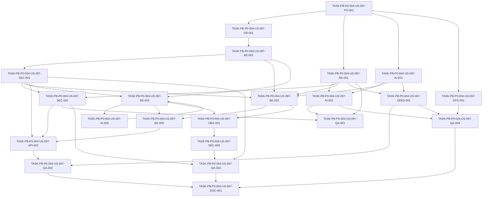

# Development Tasks — PB-P0-004 / US-097: Implementar endpoints AI del contrato REST

## 1. Metadata

| Field | Value |
|---|---|
| User Story ID | US-097 |
| Source User Story | management/user-stories/US-097-ai-endpoints-implementation.md |
| Source Technical Specification | management/technical-specs/P0/PB-P0-004/US-097-technical-spec.md |
| Decision Resolution Artifact | No aplica |
| Priority | P0 |
| Backlog ID | PB-P0-004 |
| Backlog Title | REST API Endpoints Foundation (Doc 16) |
| Backlog Execution Order | 4 |
| User Story Position in Backlog Item | 4 of 4 |
| Related User Stories in Backlog Item | US-094, US-095, US-096, US-097 |
| Epic | EPIC-API-001 |
| Backlog Item Dependencies | PB-P0-002, PB-P0-003 |
| Feature | REST API Endpoints Foundation |
| Module / Domain | API / AI Assistance |
| Backlog Alignment Status | Found |
| Task Breakdown Status | Ready for Sprint Planning |
| Created Date | 2026-06-15 |
| Last Updated | 2026-06-15 |

---

## 2. Source Validation

| Source | Found | Used | Notes |
|---|---|---|---|
| User Story | Yes | Yes | US-097 is Approved and marked Ready for Development Tasks. |
| Technical Specification | Yes | Yes | Primary source; status `Ready for Task Breakdown`. |
| Decision Resolution Artifact | No | No | No formal decision artifact exists for US-097. |
| Product Backlog Prioritized | Yes | Yes | PB-P0-004 found in P0 execution order 4. |
| ADRs | Yes | Yes | ADR-AI, ADR-API, ADR-SEC and ADR-TEST references used through the technical spec. |

---

## 3. Backlog Execution Context

### Parent Backlog Item

**PB-P0-004 — REST API Endpoints Foundation (Doc 16)**

Implementar endpoints REST AUTH, EVENT, QUOTE y AI alineados al contrato `/api/v1` para frontend, MSW, QA automation y agentes IA.

### Execution Order Rationale

US-097 se implementa cuarto dentro de PB-P0-004 porque depende de US-094 para auth/session, US-095 para ownership de eventos y US-096 para QuoteRequest/Quote usados por AI-006. Además, requiere que PB-P0-010 y PB-P0-011 estén disponibles o se incorporen como prerequisitos técnicos para prompt registry, persistencia AIRecommendation, timeout/fallback y validación JSON.

### Related User Stories in Same Backlog Item

| User Story | Role in Backlog Item | Suggested Order |
|---|---|---|
| US-094 | Auth/session/profile foundation | 1 |
| US-095 | Event API and ownership foundation | 2 |
| US-096 | Quote/Booking API foundation | 3 |
| US-097 | AI API and AIRecommendation action foundation | 4 |

---

## 4. Task Breakdown Summary

| Area | Number of Tasks | Notes |
|---|---:|---|
| Product / Analysis | 1 | Verificar dependencias de auth/event/quote y AI foundation. |
| Database / Prisma | 1 | Verificar `AIRecommendation`/`AIPromptVersion` e índices requeridos. |
| Backend | 5 | DTOs, use cases, repositories, controllers and apply/discard behavior. |
| API Contract | 1 | Registrar once endpoints Doc 16 bajo `/api/v1`. |
| AI / PromptOps | 3 | Provider port integration, prompt registry/output validation, fallback/HITL. |
| Security / Authorization | 3 | Ownership, provider-call ordering, secrets/redaction/rate limit. |
| Seed / Demo Data | 1 | Mock/demo deterministic setup. |
| DevOps / Environment | 1 | AI env vars and CI mock enforcement. |
| Observability / Audit | 1 | AI lifecycle logs, metrics and correlation. |
| QA / Testing | 4 | Unit, API, security and AI deterministic tests. |
| Documentation / Traceability | 1 | Doc/API alignment and PB-P0-010/PB-P0-011 dependency notes. |
| **Total** | **22** | |

---

## 5. Traceability Matrix

| Acceptance Criterion | Technical Spec Section | Task IDs |
|---|---|---|
| AC-01 Event plan | §7 Use Cases, §9 API, §11 AI Design, §12 Security | TASK-PB-P0-004-US-097-BE-003, TASK-PB-P0-004-US-097-AI-001, TASK-PB-P0-004-US-097-SEC-001, TASK-PB-P0-004-US-097-QA-002 |
| AC-02 Checklist | §7 Use Cases, §11 HITL, §13 Testing | TASK-PB-P0-004-US-097-BE-003, TASK-PB-P0-004-US-097-AI-003, TASK-PB-P0-004-US-097-QA-002 |
| AC-03 Budget suggestion | §7 DTOs, §11 Input/Output, §12 Ownership | TASK-PB-P0-004-US-097-BE-001, TASK-PB-P0-004-US-097-BE-003, TASK-PB-P0-004-US-097-AI-002, TASK-PB-P0-004-US-097-QA-002 |
| AC-04 Vendor categories | §7 Use Cases, §11 Output Schema, §13 Unit Tests | TASK-PB-P0-004-US-097-BE-003, TASK-PB-P0-004-US-097-AI-002, TASK-PB-P0-004-US-097-QA-001 |
| AC-05 Quote brief | §9 API, §11 HITL, §15 Out of Scope | TASK-PB-P0-004-US-097-BE-003, TASK-PB-P0-004-US-097-AI-003, TASK-PB-P0-004-US-097-QA-002 |
| AC-06 Quote comparison | §7 Dependencies, §9 API, §12 Authorization | TASK-PB-P0-004-US-097-BE-003, TASK-PB-P0-004-US-097-SEC-001, TASK-PB-P0-004-US-097-QA-002 |
| AC-07 Vendor bio | §7 Use Cases, §12 Authorization, §11 HITL | TASK-PB-P0-004-US-097-BE-003, TASK-PB-P0-004-US-097-SEC-001, TASK-PB-P0-004-US-097-QA-002 |
| AC-08 Task prioritization | §7 Use Cases, §11 Safety Rules | TASK-PB-P0-004-US-097-BE-003, TASK-PB-P0-004-US-097-AI-003, TASK-PB-P0-004-US-097-QA-002 |
| AC-09 Retrieve recommendation | §7 Repository, §9 API, §12 Ownership | TASK-PB-P0-004-US-097-BE-002, TASK-PB-P0-004-US-097-BE-004, TASK-PB-P0-004-US-097-SEC-001, TASK-PB-P0-004-US-097-QA-002 |
| AC-10 Apply recommendation | §7 Transactions, §11 HITL, §12 Security | TASK-PB-P0-004-US-097-BE-004, TASK-PB-P0-004-US-097-AI-003, TASK-PB-P0-004-US-097-QA-002, TASK-PB-P0-004-US-097-QA-003 |
| AC-11 Discard recommendation | §7 Transactions, §11 HITL, §14 Observability | TASK-PB-P0-004-US-097-BE-004, TASK-PB-P0-004-US-097-AI-003, TASK-PB-P0-004-US-097-QA-002 |
| AC-12 AI metadata | §7 DTOs, §9 API, §11 Persistence, §14 Observability | TASK-PB-P0-004-US-097-BE-001, TASK-PB-P0-004-US-097-AI-001, TASK-PB-P0-004-US-097-OBS-001, TASK-PB-P0-004-US-097-QA-002 |
| AC-13 Provider errors | §7 Error Handling, §11 Fallback, §15 Configuration | TASK-PB-P0-004-US-097-AI-002, TASK-PB-P0-004-US-097-OPS-001, TASK-PB-P0-004-US-097-QA-004 |
| AC-14 Deterministic tests | §13 AI Tests, §15 Configuration | TASK-PB-P0-004-US-097-SEED-001, TASK-PB-P0-004-US-097-OPS-001, TASK-PB-P0-004-US-097-QA-004 |

---

## 6. Development Tasks

### TASK-PB-P0-004-US-097-PO-001 — Verificar readiness de dependencias AI endpoint foundation

| Field | Value |
|---|---|
| Area | Product / Analysis |
| Type | Review |
| Priority | Must |
| Estimate | S |
| Depends On | US-094, US-095, US-096, PB-P0-010, PB-P0-011 |
| Source AC(s) | AC-01, AC-06, AC-13, AC-14 |
| Technical Spec Section(s) | §2 Backlog Execution Context, §3 Executive Technical Summary, §17 Dependency Readiness |
| Backlog ID | PB-P0-004 |
| User Story ID | US-097 |
| Owner Role | Tech Lead |
| Status | To Do |

#### Objective

Confirmar que las capacidades de auth, event ownership, quote context, prompt registry, AIRecommendation persistence, timeout/fallback y JSON output validation están disponibles o se agendan como prerequisitos.

#### Scope

##### Include

- Verificar US-094, US-095 y US-096 como dependencias funcionales.
- Verificar PB-P0-010 para prompt registry y AIRecommendation persistence.
- Verificar PB-P0-011 para timeout, fallback y JSON validation.
- Confirmar que US-097 no implementa UX, prompt authoring, RAG ni generic chat.

##### Exclude

- No implementar provider adapters ni migrations amplias si pertenecen a PB-P0-010/PB-P0-011.
- No escribir código productivo.

#### Implementation Notes

Si PB-P0-010/PB-P0-011 no están completos, las tareas de US-097 deben marcar esas actividades como prerequisitos antes de cerrar endpoints de generación.

#### Acceptance Criteria Covered

AC-01, AC-06, AC-13, AC-14.

#### Definition of Done

- [ ] Dependencias funcionales verificadas.
- [ ] AI foundation readiness documentada.
- [ ] Scope boundaries confirmados.
- [ ] No blocker remains for implementation planning.

---

### TASK-PB-P0-004-US-097-DB-001 — Verificar persistencia AIRecommendation y AIPromptVersion

| Field | Value |
|---|---|
| Area | Database / Prisma |
| Type | Implementation |
| Priority | Must |
| Estimate | M |
| Depends On | TASK-PB-P0-004-US-097-PO-001 |
| Source AC(s) | AC-09, AC-10, AC-11, AC-12, AC-13 |
| Technical Spec Section(s) | §10 Database / Prisma Design, §11 Persistence |
| Backlog ID | PB-P0-004 |
| User Story ID | US-097 |
| Owner Role | Backend |
| Status | To Do |

#### Objective

Asegurar que `AIRecommendation` y `AIPromptVersion` soportan el contrato API, metadata AI, ownership, prompt traceability, fallback and lifecycle transitions.

#### Scope

##### Include

- Verify AIRecommendation fields from the technical spec.
- Verify prompt version reference and context references.
- Verify indexes listed in §10.
- Verify lifecycle timestamps and status transitions.
- Add only missing endpoint-required schema pieces if not owned by PB-P0-010.

##### Exclude

- No broad prompt management schema.
- No admin audit read API.
- No prompt authoring UX.

#### Implementation Notes

If core persistence is missing, create prerequisite tasks under PB-P0-010 rather than silently expanding US-097 beyond API foundation.

#### Acceptance Criteria Covered

AC-09, AC-10, AC-11, AC-12, AC-13.

#### Definition of Done

- [ ] AIRecommendation supports endpoint response and ownership needs.
- [ ] Prompt version reference available.
- [ ] Required indexes verified.
- [ ] Missing foundation work escalated to PB-P0-010 if needed.

---

### TASK-PB-P0-004-US-097-BE-001 — Implementar DTOs y schemas base para AI endpoints

| Field | Value |
|---|---|
| Area | Backend |
| Type | Implementation |
| Priority | Must |
| Estimate | M |
| Depends On | TASK-PB-P0-004-US-097-PO-001 |
| Source AC(s) | AC-01, AC-02, AC-03, AC-04, AC-05, AC-06, AC-07, AC-08, AC-12, AC-13 |
| Technical Spec Section(s) | §7 DTOs / Schemas, §9 API Contract Design, §11 Input Schema, §11 Output Schema |
| Backlog ID | PB-P0-004 |
| User Story ID | US-097 |
| Owner Role | Backend |
| Status | To Do |

#### Objective

Crear schemas Zod estrictos para `AIBaseRequestDto`, response envelope, params, recommendation actions and feature-specific inputs/outputs.

#### Scope

##### Include

- `AIBaseRequestDto<TInput>`.
- `AIRecommendationResponseDto<TOutput>`.
- Param schemas for `eventId`, `quoteRequestId`, `aiRecommendationId`.
- `ApplyAIRecommendationRequestDto`.
- `DiscardAIRecommendationRequestDto`.
- Input/output schemas for AI-001 through AI-008.
- `languageCode` validation.
- `preferMock` validation policy hooks.

##### Exclude

- No generic prompt/chat DTO.
- No prompt authoring schemas.
- No UI schemas.

#### Implementation Notes

Output schemas must be shared with `MockAIProvider` fixtures and provider output validation to prevent drift.

#### Acceptance Criteria Covered

AC-01 through AC-08, AC-12, AC-13.

#### Definition of Done

- [ ] Base and feature schemas created.
- [ ] `languageCode` enum enforced.
- [ ] Generic prompt/system fields rejected.
- [ ] Response DTO includes all `aiMeta` fields.

---

### TASK-PB-P0-004-US-097-BE-002 — Implementar AIRecommendationRepository API-facing methods

| Field | Value |
|---|---|
| Area | Backend |
| Type | Implementation |
| Priority | Must |
| Estimate | M |
| Depends On | TASK-PB-P0-004-US-097-DB-001 |
| Source AC(s) | AC-09, AC-10, AC-11, AC-12 |
| Technical Spec Section(s) | §7 Repository / Persistence, §10 Database / Prisma Design, §12 Ownership Rules |
| Backlog ID | PB-P0-004 |
| User Story ID | US-097 |
| Owner Role | Backend |
| Status | To Do |

#### Objective

Expose repository operations needed by generation, retrieve, apply and discard flows with owner/context-safe lookup.

#### Scope

##### Include

- `createPending`.
- `createFailed`.
- `findById`.
- `findByOwnerContext`.
- `markAccepted`.
- `markDiscarded`.
- `markFailed`.
- Sanitized detail projection for public API.

##### Exclude

- No admin global AIRecommendation search.
- No full unsanitized prompt response.

#### Implementation Notes

Repository methods must support `403`/masked `404` convention without leaking another user's recommendation.

#### Acceptance Criteria Covered

AC-09, AC-10, AC-11, AC-12.

#### Definition of Done

- [ ] Repository methods implemented or verified.
- [ ] Owner/context lookup supported.
- [ ] Public projection excludes unsafe prompt/provider data.
- [ ] Lifecycle updates are transaction-capable.

---

### TASK-PB-P0-004-US-097-BE-003 — Implementar generation use cases for AI-001 through AI-008

| Field | Value |
|---|---|
| Area | Backend |
| Type | Implementation |
| Priority | Must |
| Estimate | L |
| Depends On | TASK-PB-P0-004-US-097-BE-001, TASK-PB-P0-004-US-097-BE-002, TASK-PB-P0-004-US-097-AI-001, TASK-PB-P0-004-US-097-SEC-001 |
| Source AC(s) | AC-01, AC-02, AC-03, AC-04, AC-05, AC-06, AC-07, AC-08, AC-12, AC-13 |
| Technical Spec Section(s) | §7 Use Cases / Application Services, §11 AI / PromptOps Design, §12 Authorization |
| Backlog ID | PB-P0-004 |
| User Story ID | US-097 |
| Owner Role | Backend |
| Status | To Do |

#### Objective

Implement eight feature-specific AI generation use cases with context loading, authorization, prompt/provider integration and pending recommendation persistence.

#### Scope

##### Include

- `GenerateEventPlanUseCase`.
- `GenerateChecklistUseCase`.
- `GenerateBudgetSuggestionUseCase`.
- `RecommendServiceCategoriesUseCase`.
- `GenerateQuoteBriefUseCase`.
- `CompareQuotesUseCase`.
- `GenerateVendorBioUseCase`.
- `PrioritizeTasksUseCase`.
- Context loading from Event, QuoteRequest/Quote, VendorProfile, ServiceCategory, EventTask/Budget as applicable.
- No official domain mutation on generation.

##### Exclude

- No generic chat.
- No frontend UI.
- No direct provider SDK call.
- No product-specific materialization outside apply flow.

#### Implementation Notes

Auth, ownership, validation and rate-limit checks must run before invoking `LLMProvider`.

#### Acceptance Criteria Covered

AC-01 through AC-08, AC-12, AC-13.

#### Definition of Done

- [ ] Eight generation use cases implemented.
- [ ] Each returns pending AIRecommendation response.
- [ ] No generated output mutates official domain state.
- [ ] Provider call occurs only after security checks.

---

### TASK-PB-P0-004-US-097-BE-004 — Implementar AIRecommendation retrieve/apply/discard use cases

| Field | Value |
|---|---|
| Area | Backend |
| Type | Implementation |
| Priority | Must |
| Estimate | L |
| Depends On | TASK-PB-P0-004-US-097-BE-002, TASK-PB-P0-004-US-097-AI-003, TASK-PB-P0-004-US-097-SEC-001 |
| Source AC(s) | AC-09, AC-10, AC-11 |
| Technical Spec Section(s) | §7 Use Cases / Application Services, §7 Transactions, §11 Human-in-the-loop, §12 Ownership Rules |
| Backlog ID | PB-P0-004 |
| User Story ID | US-097 |
| Owner Role | Backend |
| Status | To Do |

#### Objective

Implement recommendation detail, apply and discard flows with strict ownership, status transitions and human-in-the-loop behavior.

#### Scope

##### Include

- `GetAIRecommendationUseCase`.
- `ApplyAIRecommendationUseCase`.
- `DiscardAIRecommendationUseCase`.
- Pending status validation.
- Atomic apply/discard transitions.
- Delegation to target-domain materialization only where a feature use case exists.
- Read-only feature handling with accepted/discarded recommendation state only.

##### Exclude

- No auto-apply.
- No autonomous booking/payment/moderation.
- No admin global audit reads.

#### Implementation Notes

If materialization for a feature is not implemented, return a controlled domain error or accept-only semantics as defined by feature behavior; do not silently mutate unrelated domain entities.

#### Acceptance Criteria Covered

AC-09, AC-10, AC-11.

#### Definition of Done

- [ ] Retrieve returns sanitized detail.
- [ ] Apply requires owner and pending status.
- [ ] Discard requires owner and pending status.
- [ ] No domain side effects occur on discard.
- [ ] Apply uses target use cases only.

---

### TASK-PB-P0-004-US-097-BE-005 — Implementar AIAssistanceController y AIRecommendationsController

| Field | Value |
|---|---|
| Area | Backend |
| Type | Implementation |
| Priority | Must |
| Estimate | M |
| Depends On | TASK-PB-P0-004-US-097-BE-003, TASK-PB-P0-004-US-097-BE-004 |
| Source AC(s) | AC-01, AC-02, AC-03, AC-04, AC-05, AC-06, AC-07, AC-08, AC-09, AC-10, AC-11, AC-12 |
| Technical Spec Section(s) | §7 Controllers / Routes, §9 API Contract Design |
| Backlog ID | PB-P0-004 |
| User Story ID | US-097 |
| Owner Role | Backend |
| Status | To Do |

#### Objective

Expose thin controllers that bind validated requests to use cases and return the standard EventFlow API envelope.

#### Scope

##### Include

- `AIAssistanceController`.
- `AIRecommendationsController`.
- Response mapping for `AIRecommendationResponseDto`.
- Status codes `200` and `204` as defined.
- Controller composition with auth, validation, role/ownership/rate-limit middleware.

##### Exclude

- No provider SDK call in controllers.
- No UI or MSW implementation.

#### Implementation Notes

Controllers should be route-shape aware but business-rule blind.

#### Acceptance Criteria Covered

AC-01 through AC-12.

#### Definition of Done

- [ ] Controllers implemented.
- [ ] Controllers remain thin.
- [ ] Response envelopes match shared contract.
- [ ] No provider SDK import in controller layer.

---

### TASK-PB-P0-004-US-097-AI-001 — Integrar LLMProvider, PromptRegistry y AIContext

| Field | Value |
|---|---|
| Area | AI / PromptOps |
| Type | Implementation |
| Priority | Must |
| Estimate | L |
| Depends On | TASK-PB-P0-004-US-097-PO-001, PB-P0-010 |
| Source AC(s) | AC-01, AC-02, AC-03, AC-04, AC-05, AC-06, AC-07, AC-08, AC-12, AC-14 |
| Technical Spec Section(s) | §11 Provider, §11 Prompt Version, §15 Configuration & Environment |
| Backlog ID | PB-P0-004 |
| User Story ID | US-097 |
| Owner Role | AI |
| Status | To Do |

#### Objective

Wire generation use cases to the `LLMProvider` port and prompt registry without coupling domain/application code to provider SDKs.

#### Scope

##### Include

- Resolve prompt by feature type and language.
- Build `AIContext` with timeout, correlation ID, feature type, prompt version and provider preference.
- Inject `LLMProvider` via composition root.
- Support `OpenAIProvider` and `MockAIProvider` through the port.
- Keep `AnthropicProvider` as stub/future only.

##### Exclude

- No direct OpenAI/Anthropic SDK import outside infrastructure.
- No dynamic prompt authoring.
- No RAG/vector retrieval.

#### Implementation Notes

If provider adapters are owned by PB-P0-010/PB-P0-011, this task integrates existing ports and should not duplicate implementation.

#### Acceptance Criteria Covered

AC-01 through AC-08, AC-12, AC-14.

#### Definition of Done

- [ ] Use cases depend on `LLMProvider` port.
- [ ] Prompt version is resolved and propagated.
- [ ] `MockAIProvider` works in test/demo.
- [ ] No SDK imports leak into domain/application/controller layers.

---

### TASK-PB-P0-004-US-097-AI-002 — Implementar output validation, provider errors and fallback integration

| Field | Value |
|---|---|
| Area | AI / PromptOps |
| Type | Implementation |
| Priority | Must |
| Estimate | L |
| Depends On | TASK-PB-P0-004-US-097-BE-001, TASK-PB-P0-004-US-097-AI-001, PB-P0-011 |
| Source AC(s) | AC-12, AC-13, AC-14 |
| Technical Spec Section(s) | §7 Error Handling, §11 Output Schema, §11 Fallback, §15 Configuration & Environment |
| Backlog ID | PB-P0-004 |
| User Story ID | US-097 |
| Owner Role | AI |
| Status | To Do |

#### Objective

Ensure provider output is validated, provider failures are mapped to Doc 16 API errors, and fallback behavior is environment-controlled.

#### Scope

##### Include

- `OutputValidator` integration for each feature.
- `AI_INVALID_OUTPUT` handling.
- `AI_PROVIDER_TIMEOUT` and `AI_PROVIDER_UNAVAILABLE` mapping.
- `MockAIProvider` fallback only when `AI_DEMO_MODE` or `AI_USE_MOCK_FALLBACK` allows it.
- Persist/surface `fallbackUsed`, latency, provider and prompt version metadata.

##### Exclude

- No silent production fallback unless configured.
- No invalid output materialization.
- No Anthropic automatic fallback.

#### Implementation Notes

Public API should use Doc 16 codes even if internal errors use older aliases.

#### Acceptance Criteria Covered

AC-12, AC-13, AC-14.

#### Definition of Done

- [ ] Output validation integrated.
- [ ] Timeout/unavailable/invalid output mapped correctly.
- [ ] Fallback rules obey environment config.
- [ ] `aiMeta` and persistence reflect fallback/provider metadata.

---

### TASK-PB-P0-004-US-097-AI-003 — Enforce human-in-the-loop and no autonomous side effects

| Field | Value |
|---|---|
| Area | AI / PromptOps |
| Type | Implementation |
| Priority | Must |
| Estimate | M |
| Depends On | TASK-PB-P0-004-US-097-BE-004 |
| Source AC(s) | AC-01, AC-02, AC-05, AC-06, AC-07, AC-08, AC-10, AC-11 |
| Technical Spec Section(s) | §11 Human-in-the-loop, §11 Safety Rules, §4 Explicit Non-Goals |
| Backlog ID | PB-P0-004 |
| User Story ID | US-097 |
| Owner Role | AI |
| Status | To Do |

#### Objective

Guarantee AI generation produces suggestions only and official domain data changes happen only through explicit authorized apply flows.

#### Scope

##### Include

- Generation persists/returns `status='pending'`.
- Apply is explicit and owner-authorized.
- Discard has no domain side effects.
- Read-only features avoid target entity materialization.
- Tests/assertions for no auto-booking, no auto-quote-decision, no vendor approval, no moderation.

##### Exclude

- No autonomous decisions.
- No payment/contract/moderation side effects.

#### Implementation Notes

This is a safety task; it should be reviewed as part of security and AI review before merge.

#### Acceptance Criteria Covered

AC-01, AC-02, AC-05, AC-06, AC-07, AC-08, AC-10, AC-11.

#### Definition of Done

- [ ] Generation leaves target entities unchanged.
- [ ] Apply/discard are explicit transitions.
- [ ] Safety regression tests exist.
- [ ] No autonomous side effects detected.

---

### TASK-PB-P0-004-US-097-SEC-001 — Implement ownership and role authorization for AI endpoints

| Field | Value |
|---|---|
| Area | Security / Authorization |
| Type | Implementation |
| Priority | Must |
| Estimate | L |
| Depends On | US-094, US-095, US-096, TASK-PB-P0-004-US-097-BE-002 |
| Source AC(s) | AC-01, AC-06, AC-07, AC-09, AC-10, AC-11 |
| Technical Spec Section(s) | §12 Authentication, §12 Authorization, §12 Ownership Rules |
| Backlog ID | PB-P0-004 |
| User Story ID | US-097 |
| Owner Role | Backend |
| Status | To Do |

#### Objective

Ensure each AI endpoint is protected by the correct role, ownership and recommendation context checks.

#### Scope

##### Include

- Organizer event ownership for event-scoped AI.
- Organizer ownership of QuoteRequest event for quote comparison.
- Vendor own profile context for vendor bio.
- AIRecommendation owner/context access for retrieve/apply/discard.
- `403`/masked `404` convention.

##### Exclude

- No admin audit read.
- No frontend-only authorization.

#### Implementation Notes

Checks must happen before provider invocation for generation endpoints.

#### Acceptance Criteria Covered

AC-01, AC-06, AC-07, AC-09, AC-10, AC-11.

#### Definition of Done

- [ ] Role checks implemented.
- [ ] Ownership checks implemented.
- [ ] Recommendation context checks implemented.
- [ ] Cross-owner tests can prove provider was not invoked.

---

### TASK-PB-P0-004-US-097-SEC-002 — Enforce provider-call ordering, rate limits and generic prompt rejection

| Field | Value |
|---|---|
| Area | Security / Authorization |
| Type | Implementation |
| Priority | Must |
| Estimate | M |
| Depends On | TASK-PB-P0-004-US-097-BE-001, TASK-PB-P0-004-US-097-SEC-001 |
| Source AC(s) | AC-13, AC-14 |
| Technical Spec Section(s) | §7 Validation Rules, §12 Negative Authorization Scenarios, §11 Safety Rules |
| Backlog ID | PB-P0-004 |
| User Story ID | US-097 |
| Owner Role | Backend |
| Status | To Do |

#### Objective

Prevent invalid, unauthorized or abusive requests from reaching the provider layer.

#### Scope

##### Include

- Auth, ownership, validation and rate-limit before `LLMProvider`.
- Reject generic prompt/chat/system/developer text.
- `preferMock` allowed only where policy permits.
- `429 RATE_LIMIT_EXCEEDED` without provider invocation.
- Provider spy hooks for tests.

##### Exclude

- No public `/ai/chat`.
- No user-defined prompts.

#### Implementation Notes

Request attempts to pass provider secrets or arbitrary prompts should be rejected or ignored before use case calls provider.

#### Acceptance Criteria Covered

AC-13, AC-14.

#### Definition of Done

- [ ] Rate limits applied to generation endpoints.
- [ ] Generic prompt behavior rejected.
- [ ] Provider not invoked after auth/validation/rate-limit failure.
- [ ] `preferMock` policy enforced.

---

### TASK-PB-P0-004-US-097-SEC-003 — Enforce AI secret handling and payload redaction

| Field | Value |
|---|---|
| Area | Security / Authorization |
| Type | Implementation |
| Priority | Must |
| Estimate | S |
| Depends On | TASK-PB-P0-004-US-097-OBS-001 |
| Source AC(s) | AC-12, AC-13 |
| Technical Spec Section(s) | §12 Sensitive Data Handling, §14 Observability & Audit, §11 Safety Rules |
| Backlog ID | PB-P0-004 |
| User Story ID | US-097 |
| Owner Role | Backend |
| Status | To Do |

#### Objective

Ensure provider secrets, full prompts and sensitive payloads are never exposed to clients or logs.

#### Scope

##### Include

- Redact provider keys and secrets.
- Avoid full prompt logging by default.
- Minimize/sanitize `inputPayload`.
- Public recommendation detail excludes unsafe internals.
- `.env.example` contains names/placeholders only.

##### Exclude

- No external DLP/SIEM integration requirement.

#### Implementation Notes

Use logger test doubles where needed to assert redaction.

#### Acceptance Criteria Covered

AC-12, AC-13.

#### Definition of Done

- [ ] Secrets never returned.
- [ ] Logs redact prompts/payloads.
- [ ] Public details sanitized.
- [ ] Redaction covered by tests.

---

### TASK-PB-P0-004-US-097-API-001 — Registrar rutas Doc 16 AI Assistance y AIRecommendation

| Field | Value |
|---|---|
| Area | API Contract |
| Type | Implementation |
| Priority | Must |
| Estimate | M |
| Depends On | TASK-PB-P0-004-US-097-BE-005, TASK-PB-P0-004-US-097-SEC-001, TASK-PB-P0-004-US-097-SEC-002 |
| Source AC(s) | AC-01, AC-02, AC-03, AC-04, AC-05, AC-06, AC-07, AC-08, AC-09, AC-10, AC-11, AC-12, AC-13 |
| Technical Spec Section(s) | §9 API Contract Design, §16 Documentation Alignment Required |
| Backlog ID | PB-P0-004 |
| User Story ID | US-097 |
| Owner Role | Backend |
| Status | To Do |

#### Objective

Expose all eleven Doc 16 AI endpoints under `/api/v1` with standard envelope, error mapping and correlation metadata.

#### Scope

##### Include

- Eight generation endpoints.
- `GET /api/v1/ai-recommendations/:aiRecommendationId`.
- `POST /api/v1/ai-recommendations/:aiRecommendationId/apply`.
- `POST /api/v1/ai-recommendations/:aiRecommendationId/discard`.
- Doc 16 canonical route shapes.
- Controlled errors and status codes.

##### Exclude

- No `/api/v1/ai/chat`.
- No `/api/v1/ai/events/:id/*` legacy route shape.
- No admin AI audit routes.

#### Implementation Notes

Route absence tests should verify generic chat and older Doc 14 route variants are not introduced.

#### Acceptance Criteria Covered

AC-01 through AC-13.

#### Definition of Done

- [ ] Eleven endpoints registered.
- [ ] Canonical Doc 16 paths used.
- [ ] Standard envelopes/correlation included.
- [ ] Out-of-scope routes absent.

---

### TASK-PB-P0-004-US-097-SEED-001 — Preparar MockAIProvider fixtures y demo/test AI scenarios

| Field | Value |
|---|---|
| Area | Seed / Demo Data |
| Type | Setup |
| Priority | Should |
| Estimate | M |
| Depends On | TASK-PB-P0-004-US-097-AI-001, TASK-PB-P0-004-US-097-BE-001 |
| Source AC(s) | AC-01, AC-06, AC-07, AC-14 |
| Technical Spec Section(s) | §13 Seed / Demo Tests, §15 Configuration & Environment |
| Backlog ID | PB-P0-004 |
| User Story ID | US-097 |
| Owner Role | AI |
| Status | To Do |

#### Objective

Ensure deterministic fixtures exist for all AI-001..AI-008 features and demo/test modes can run without external provider calls.

#### Scope

##### Include

- Mock outputs for each feature/language baseline.
- Fixtures matching feature output schemas.
- Event/QuoteRequest/VendorProfile contexts for generation tests.
- Optional seeded AIRecommendation rows distinguishable by `isSeed`.
- Demo fallback scenario.

##### Exclude

- No real OpenAI fixture dependency.
- No prompt evaluation dataset.

#### Implementation Notes

Mock fixtures must be validated by the same output schemas used for provider output.

#### Acceptance Criteria Covered

AC-01, AC-06, AC-07, AC-14.

#### Definition of Done

- [ ] Mock fixtures exist for AI-001..AI-008.
- [ ] Fixtures pass output schemas.
- [ ] Demo/test can run offline.
- [ ] No real API key required.

---

### TASK-PB-P0-004-US-097-OPS-001 — Configurar variables AI y enforcement de CI mock mode

| Field | Value |
|---|---|
| Area | DevOps / Environment |
| Type | Setup |
| Priority | Must |
| Estimate | S |
| Depends On | TASK-PB-P0-004-US-097-PO-001 |
| Source AC(s) | AC-13, AC-14 |
| Technical Spec Section(s) | §15 Configuration & Environment, §13 CI Checks |
| Backlog ID | PB-P0-004 |
| User Story ID | US-097 |
| Owner Role | DevOps |
| Status | To Do |

#### Objective

Ensure AI environment configuration is explicit, safe and deterministic in CI.

#### Scope

##### Include

- `LLM_PROVIDER`.
- `OPENAI_API_KEY`.
- `AI_TIMEOUT_MS`.
- `AI_DEMO_MODE`.
- `AI_USE_MOCK_FALLBACK`.
- `AI_PROMPT_VERSION` or equivalent.
- `.env.example` placeholders only.
- CI/test enforces `LLM_PROVIDER=mock`.
- Anthropic stub boot validation if selected.

##### Exclude

- No real secrets committed.
- No production deployment change beyond config names unless required by project workflow.

#### Implementation Notes

CI should fail if tests attempt real OpenAI/Anthropic network calls.

#### Acceptance Criteria Covered

AC-13, AC-14.

#### Definition of Done

- [ ] Env vars documented safely.
- [ ] CI/test uses mock provider.
- [ ] No secrets in repo.
- [ ] Anthropic stub behavior explicit.

---

### TASK-PB-P0-004-US-097-OBS-001 — Agregar observabilidad AI y correlation propagation

| Field | Value |
|---|---|
| Area | Observability / Audit |
| Type | Implementation |
| Priority | Must |
| Estimate | M |
| Depends On | TASK-PB-P0-004-US-097-BE-003, TASK-PB-P0-004-US-097-BE-004 |
| Source AC(s) | AC-12, AC-13 |
| Technical Spec Section(s) | §7 Observability, §14 Observability & Audit |
| Backlog ID | PB-P0-004 |
| User Story ID | US-097 |
| Owner Role | Backend |
| Status | To Do |

#### Objective

Emit structured logs and metrics for AI generation, provider failures, fallback and recommendation lifecycle.

#### Scope

##### Include

- Logs listed in §7 Observability.
- Metrics listed in §14 Metrics.
- Propagate `X-Correlation-Id` into `AIContext` and `AIRecommendation.correlationId`.
- Redacted error tracking for provider timeout, invalid output, unsupported language, rate limit and invalid transition.

##### Exclude

- No AdminAction.
- No full prompt/payload logging.

#### Implementation Notes

AIRecommendation itself is the primary audit trail for user-owned AI calls.

#### Acceptance Criteria Covered

AC-12, AC-13.

#### Definition of Done

- [ ] AI lifecycle logs emitted.
- [ ] Correlation ID persisted and logged.
- [ ] Metrics/counters defined.
- [ ] Sensitive prompt/payload redacted.

---

### TASK-PB-P0-004-US-097-QA-001 — Crear unit tests de schemas, policies, prompt registry y output validation

| Field | Value |
|---|---|
| Area | QA / Testing |
| Type | Test |
| Priority | Must |
| Estimate | L |
| Depends On | TASK-PB-P0-004-US-097-BE-001, TASK-PB-P0-004-US-097-AI-002, TASK-PB-P0-004-US-097-SEC-002 |
| Source AC(s) | AC-04, AC-10, AC-11, AC-13, AC-14 |
| Technical Spec Section(s) | §13 Unit Tests, §11 AI / PromptOps Design |
| Backlog ID | PB-P0-004 |
| User Story ID | US-097 |
| Owner Role | QA |
| Status | To Do |

#### Objective

Validate AI request/response schemas, policy behavior, prompt lookup and output validators without HTTP integration.

#### Scope

##### Include

- DTO and response schemas.
- `AIRecommendationPolicyService` transitions.
- `PromptRegistry` lookup by feature/language.
- `OutputValidator` valid/invalid fixtures.
- `FallbackService` mode decisions.
- `AIRateLimitPolicy`.

##### Exclude

- No real provider calls.
- No browser E2E.

#### Implementation Notes

Fixtures should be stable and validated against the same schemas used in production code.

#### Acceptance Criteria Covered

AC-04, AC-10, AC-11, AC-13, AC-14.

#### Definition of Done

- [ ] Unit tests cover schemas.
- [ ] Prompt lookup tested.
- [ ] Output validation tested.
- [ ] Rate-limit/fallback policy tested.

---

### TASK-PB-P0-004-US-097-QA-002 — Crear Supertest API tests para endpoints AI y AIRecommendation

| Field | Value |
|---|---|
| Area | QA / Testing |
| Type | Test |
| Priority | Must |
| Estimate | L |
| Depends On | TASK-PB-P0-004-US-097-API-001, TASK-PB-P0-004-US-097-SEED-001 |
| Source AC(s) | AC-01, AC-02, AC-03, AC-04, AC-05, AC-06, AC-07, AC-08, AC-09, AC-10, AC-11, AC-12, AC-13 |
| Technical Spec Section(s) | §13 API Tests, §9 API Contract Design |
| Backlog ID | PB-P0-004 |
| User Story ID | US-097 |
| Owner Role | QA |
| Status | To Do |

#### Objective

Validate the complete AI endpoint HTTP contract with Supertest and deterministic provider behavior.

#### Scope

##### Include

- All eight generation endpoints.
- Recommendation retrieve/apply/discard.
- Standard envelopes and correlation ID.
- `aiMeta.provider`, `promptVersion`, `latencyMs`, `fallbackUsed`, `languageCode`.
- Successful generation persists pending recommendation.
- Apply/discard status transitions.

##### Exclude

- No real OpenAI/Anthropic calls.
- No frontend UI.

#### Implementation Notes

Use `MockAIProvider` and authenticated organizer/vendor agents. Assert no official domain mutation on generation.

#### Acceptance Criteria Covered

AC-01 through AC-13.

#### Definition of Done

- [ ] Eleven endpoints covered.
- [ ] `aiMeta` asserted.
- [ ] Pending recommendation persisted.
- [ ] Apply/discard covered.
- [ ] No auto-materialization on generation.

---

### TASK-PB-P0-004-US-097-QA-003 — Crear security negative tests AI

| Field | Value |
|---|---|
| Area | QA / Testing |
| Type | Test |
| Priority | Must |
| Estimate | L |
| Depends On | TASK-PB-P0-004-US-097-SEC-001, TASK-PB-P0-004-US-097-SEC-002, TASK-PB-P0-004-US-097-SEC-003 |
| Source AC(s) | AC-06, AC-07, AC-09, AC-10, AC-11, AC-13 |
| Technical Spec Section(s) | §12 Negative Authorization Scenarios, §13 Security Tests |
| Backlog ID | PB-P0-004 |
| User Story ID | US-097 |
| Owner Role | QA |
| Status | To Do |

#### Objective

Prove that unauthorized, invalid and unsafe AI requests never reach the provider and do not leak secrets or mutate domain data.

#### Scope

##### Include

- `401` unauthenticated.
- Cross-owner event AI denied.
- Inaccessible QuoteRequest comparison denied.
- Vendor calls organizer-only AI denied.
- Organizer calls vendor bio denied.
- Non-owner recommendation retrieve/apply/discard denied.
- Provider spy proves no call after auth/ownership/validation/rate-limit failure.
- Generic prompt/chat route absent or rejected.
- Logs and responses do not expose secrets.

##### Exclude

- No manual penetration test.
- No admin audit endpoint tests.

#### Implementation Notes

Denied requests should assert DB unchanged and provider invocation count remains zero.

#### Acceptance Criteria Covered

AC-06, AC-07, AC-09, AC-10, AC-11, AC-13.

#### Definition of Done

- [ ] Negative authorization suite passes.
- [ ] Provider not invoked on denied requests.
- [ ] Generic chat/prompt rejected.
- [ ] Secrets redacted in logs/responses.

---

### TASK-PB-P0-004-US-097-QA-004 — Crear deterministic AI provider, timeout and fallback tests

| Field | Value |
|---|---|
| Area | QA / Testing |
| Type | Test |
| Priority | Must |
| Estimate | M |
| Depends On | TASK-PB-P0-004-US-097-AI-002, TASK-PB-P0-004-US-097-OPS-001, TASK-PB-P0-004-US-097-SEED-001 |
| Source AC(s) | AC-13, AC-14 |
| Technical Spec Section(s) | §13 AI Tests, §15 Configuration & Environment |
| Backlog ID | PB-P0-004 |
| User Story ID | US-097 |
| Owner Role | QA |
| Status | To Do |

#### Objective

Ensure automated AI tests are deterministic, offline and cover timeout/fallback/invalid-output behavior.

#### Scope

##### Include

- `MockAIProvider` deterministic same input -> same output.
- Feature fixtures pass output schemas.
- Invalid JSON/output returns controlled error or fallback.
- Timeout uses `AI_TIMEOUT_MS`.
- `fallbackUsed` persisted and returned.
- CI fails or blocks real provider network dependency.

##### Exclude

- No qualitative real OpenAI smoke tests in CI.
- No Anthropic functional tests beyond stub behavior.

#### Implementation Notes

Use fake timers or deterministic slow provider doubles for timeout tests.

#### Acceptance Criteria Covered

AC-13, AC-14.

#### Definition of Done

- [ ] Determinism verified.
- [ ] Timeout/fallback tested.
- [ ] Invalid output tested.
- [ ] CI has no real LLM dependency.

---

### TASK-PB-P0-004-US-097-DOC-001 — Registrar trazabilidad y alineaciones documentales AI

| Field | Value |
|---|---|
| Area | Documentation / Traceability |
| Type | Documentation |
| Priority | Should |
| Estimate | S |
| Depends On | TASK-PB-P0-004-US-097-QA-002, TASK-PB-P0-004-US-097-QA-003, TASK-PB-P0-004-US-097-QA-004 |
| Source AC(s) | AC-12, AC-13, AC-14 |
| Technical Spec Section(s) | §16 Documentation Alignment Required, §18 Task Breakdown Guidance |
| Backlog ID | PB-P0-004 |
| User Story ID | US-097 |
| Owner Role | Tech Lead |
| Status | To Do |

#### Objective

Preserve implementation traceability for Doc 16 AI routes, public error codes, AI foundation dependencies and MVP guardrails.

#### Scope

##### Include

- Document Doc 16 AI route set as canonical.
- Document no generic chat/free-form prompt endpoint.
- Document public error code mapping such as `AI_PROVIDER_TIMEOUT`.
- Document PB-P0-010/PB-P0-011 dependencies.
- Prepare OpenAPI/MSW follow-up notes if applicable.

##### Exclude

- No User Story or Technical Spec modification.
- No OpenAPI snapshot unless PB-P0-005 task owns it.

#### Implementation Notes

This task records traceability; it must not reopen accepted ADRs or scope boundaries.

#### Acceptance Criteria Covered

AC-12, AC-13, AC-14.

#### Definition of Done

- [ ] Alignment notes recorded.
- [ ] PR/ticket references US-097 spec.
- [ ] AI foundation dependencies called out.
- [ ] No source artifacts modified.

---

## 7. Required QA Tasks

| Task ID | Test Type | Purpose |
|---|---|---|
| TASK-PB-P0-004-US-097-QA-001 | Unit | Validate schemas, policies, prompt lookup, output validation and fallback/rate-limit decisions. |
| TASK-PB-P0-004-US-097-QA-002 | Integration / API | Cover all AI and AIRecommendation endpoints with Supertest. |
| TASK-PB-P0-004-US-097-QA-003 | Security Negative | Prove unauthorized/invalid requests do not invoke provider or leak data. |
| TASK-PB-P0-004-US-097-QA-004 | AI Determinism / Fallback | Verify MockAIProvider, timeout, fallback, invalid output and CI offline behavior. |

---

## 8. Required Security Tasks

| Task ID | Security Concern | Purpose |
|---|---|---|
| TASK-PB-P0-004-US-097-SEC-001 | Ownership and role authorization | Protect event, quote, vendor and recommendation contexts. |
| TASK-PB-P0-004-US-097-SEC-002 | Provider-call ordering and generic prompt rejection | Prevent unauthorized or malformed requests from reaching `LLMProvider`. |
| TASK-PB-P0-004-US-097-SEC-003 | Secrets and payload redaction | Prevent provider key, prompt and PII leakage. |
| TASK-PB-P0-004-US-097-QA-003 | Security regression tests | Verify all authorization and redaction controls. |

---

## 9. Required Seed / Demo Tasks

| Task ID | Seed/Demo Concern | Purpose |
|---|---|---|
| TASK-PB-P0-004-US-097-SEED-001 | MockAIProvider fixtures | Support deterministic AI tests and offline/demo behavior. |

---

## 10. Observability / Audit Tasks

| Task ID | Concern | Purpose |
|---|---|---|
| TASK-PB-P0-004-US-097-OBS-001 | AI lifecycle observability | Log/measure generation, fallback, provider failures, apply/discard and correlation. |

---

## 11. Documentation / Traceability Tasks

| Task ID | Document / Artifact | Purpose |
|---|---|---|
| TASK-PB-P0-004-US-097-DOC-001 | Implementation docs / PR traceability / OpenAPI follow-up notes | Preserve Doc 16 route, AI error and AI foundation dependency alignment. |

---

## 12. Dependency Graph

---

## 13. Suggested Implementation Order

### Phase 1 — Foundation

1. TASK-PB-P0-004-US-097-PO-001
2. TASK-PB-P0-004-US-097-DB-001
3. TASK-PB-P0-004-US-097-BE-001
4. TASK-PB-P0-004-US-097-BE-002
5. TASK-PB-P0-004-US-097-OPS-001

### Phase 2 — Core Implementation

1. TASK-PB-P0-004-US-097-AI-001
2. TASK-PB-P0-004-US-097-AI-002
3. TASK-PB-P0-004-US-097-SEC-001
4. TASK-PB-P0-004-US-097-SEC-002
5. TASK-PB-P0-004-US-097-BE-003
6. TASK-PB-P0-004-US-097-AI-003
7. TASK-PB-P0-004-US-097-BE-004
8. TASK-PB-P0-004-US-097-BE-005
9. TASK-PB-P0-004-US-097-API-001

### Phase 3 — Validation / Security / QA

1. TASK-PB-P0-004-US-097-SEED-001
2. TASK-PB-P0-004-US-097-OBS-001
3. TASK-PB-P0-004-US-097-SEC-003
4. TASK-PB-P0-004-US-097-QA-001
5. TASK-PB-P0-004-US-097-QA-002
6. TASK-PB-P0-004-US-097-QA-003
7. TASK-PB-P0-004-US-097-QA-004

### Phase 4 — Documentation / Review

1. TASK-PB-P0-004-US-097-DOC-001

---

## 14. Risks & Mitigations

| Risk | Impact | Mitigation | Related Task |
|---|---|---|---|
| Provider invoked before auth/ownership | Data leakage or cost exposure | Enforce middleware/use case ordering and provider spy tests. | TASK-PB-P0-004-US-097-SEC-002, TASK-PB-P0-004-US-097-QA-003 |
| CI depends on real OpenAI | Flaky/costly tests | Force `MockAIProvider` in CI and block real network dependency. | TASK-PB-P0-004-US-097-OPS-001, TASK-PB-P0-004-US-097-QA-004 |
| Invalid LLM output persisted | Data quality/security issue | Zod output validation and controlled retry/fallback. | TASK-PB-P0-004-US-097-AI-002, TASK-PB-P0-004-US-097-QA-004 |
| Auto-apply or autonomous decisions creep in | AI safety violation | HITL task and regression tests for no domain mutation on generation. | TASK-PB-P0-004-US-097-AI-003, TASK-PB-P0-004-US-097-QA-002 |
| Prompt/provider secrets leak | Security incident | Redaction and public projection controls. | TASK-PB-P0-004-US-097-SEC-003, TASK-PB-P0-004-US-097-QA-003 |
| AI foundation dependencies incomplete | Endpoint cannot persist/audit correctly | Verify PB-P0-010/PB-P0-011 readiness before endpoint completion. | TASK-PB-P0-004-US-097-PO-001, TASK-PB-P0-004-US-097-DB-001 |

---

## 15. Out of Scope Confirmation

Do not implement as part of US-097:

- Generic `/ai/chat` or free-form prompt execution.
- Direct frontend calls to any LLM provider.
- Prompt authoring UX or prompt evaluation datasets.
- RAG, vector search or semantic retrieval.
- Image, audio, voice, WhatsApp, push notification or native mobile AI flows.
- Autonomous vendor approval, booking, payment, moderation, review sentiment or contract generation.
- Real payments, e-signature, escrow, commissions or billing.
- Functional AnthropicProvider beyond accepted stub.
- Admin AI audit read endpoints.
- Full frontend AI UX.

---

## 16. Readiness for Sprint Planning

| Check | Status |
|---|---|
| Product Backlog mapping found | Pass |
| Every AC maps to tasks | Pass |
| Technical Spec used when available | Pass |
| QA tasks included | Pass |
| Security tasks included if applicable | Pass |
| Seed/demo tasks included if applicable | Pass |
| Observability tasks included if applicable | Pass |
| Documentation tasks included if applicable | Pass |
| Task dependencies clear | Pass |
| Tasks small enough | Pass |
| Ready for Sprint Planning | Yes |

---

## 17. Final Recommendation

`Ready for Sprint Planning`

US-097 has an approved user story, a ready technical specification and a dependency-aware task breakdown. Implementation should start only after auth, event and quote foundations are available, with PB-P0-010/PB-P0-011 AI foundation readiness confirmed before generation endpoints are marked complete.
