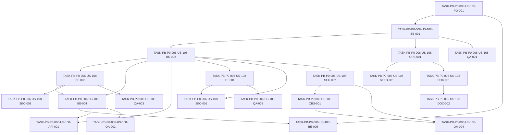

# Development Tasks — PB-P0-006 / US-108: Configurar cookies HTTP-only firmadas

## 1. Metadata

| Field | Value |
|---|---|
| User Story ID | US-108 |
| Source User Story | management/user-stories/US-108-configure-httponly-cookies.md |
| Source Technical Specification | management/technical-specs/P0/PB-P0-006/US-108-technical-spec.md |
| Decision Resolution Artifact | management/user-stories/decision-resolutions/US-108-decision-resolution.md |
| Priority | P0 |
| Backlog ID | PB-P0-006 |
| Backlog Title | Security Cookies HTTP-Only + Captcha |
| Backlog Execution Order | 6 |
| User Story Position in Backlog Item | 1 of 2 |
| Related User Stories in Backlog Item | US-108, US-109 |
| Epic | EPIC-SEC-001 |
| Backlog Item Dependencies | PB-P0-002, PB-P0-004 |
| Feature | Cookies de sesión |
| Module / Domain | Security / Identity Access |
| Backlog Alignment Status | Found |
| Task Breakdown Status | Ready for Sprint Planning |
| Created Date | 2026-06-16 |
| Last Updated | 2026-06-16 |

---

## 2. Source Validation

| Source | Found | Used | Notes |
|---|---|---|---|
| User Story | Yes | Yes | US-108 está `Approved` y `Ready for Development Tasks`. |
| Technical Specification | Yes | Yes | Fuente primaria; status `Ready for Task Breakdown`. |
| Decision Resolution Artifact | Yes | Yes | Formaliza lifetime 30 días y `SameSite` por entorno. |
| Product Backlog Prioritized | Yes | Yes | PB-P0-006 encontrado en P0 execution order 6. |
| ADRs | Yes | Yes | ADR-SEC-002 y ADR-SEC-006 aplican vía technical spec. |

---

## 3. Backlog Execution Context

### Parent Backlog Item

**PB-P0-006 — Security Cookies HTTP-Only + Captcha**

Configurar controles de seguridad base para autenticación: cookies de sesión HTTP-only firmadas y captcha en auth. US-108 cubre la política de cookie/session; US-109 cubre captcha.

### Execution Order Rationale

US-108 se ejecuta como primera historia de PB-P0-006 porque login/logout, `/users/me` y rutas protegidas dependen de una política de sesión estable antes de completar el hardening anti-bot de US-109. Depende de PB-P0-002 para servidor/middleware y de PB-P0-004 para endpoints AUTH.

### Related User Stories in Same Backlog Item

| User Story | Role in Backlog Item | Suggested Order |
|---|---|---|
| US-108 | Configura cookie de sesión HTTP-only firmada, validación y limpieza | 1 |
| US-109 | Integra captcha anti-bot con mock CI y proveedor real | 2 |

---

## 4. Task Breakdown Summary

| Area | Number of Tasks | Notes |
|---|---:|---|
| Product / Analysis | 1 | Confirmar estrategia de sesión existente sin reabrir decisiones. |
| Backend | 5 | Config, cookie service, middleware, login/logout integration y optional session store. |
| Frontend | 1 | API client con credentials y sin token storage. |
| API Contract | 1 | OpenAPI/security scheme y headers de cookie. |
| Security / Authorization | 3 | Cookie flags, redaction, negative auth behavior. |
| DevOps / Environment | 1 | Variables y config por entorno. |
| Observability / Audit | 1 | Logs técnicos de sesión sin secretos. |
| QA / Testing | 5 | Unit, integration, API, security y CI checks. |
| Seed / Demo Data | 1 | Demo env validation sin seed nuevo. |
| Documentation / Traceability | 2 | Notas de alignment y runbook/config docs. |
| **Total** | **21** | |

---

## 5. Traceability Matrix

| Acceptance Criterion | Technical Spec Section | Task IDs |
|---|---|---|
| AC-01 Login emite cookie HTTP-only firmada | §7 Backend Technical Design, §9 API Contract Design, §13 Testing Strategy | TASK-PB-P0-006-US-108-BE-002, TASK-PB-P0-006-US-108-BE-004, TASK-PB-P0-006-US-108-API-001, TASK-PB-P0-006-US-108-QA-002 |
| AC-02 `Secure` y `SameSite` por entorno | §7 Validation Rules, §12 Security & Authorization Design, §13 Testing Strategy | TASK-PB-P0-006-US-108-BE-001, TASK-PB-P0-006-US-108-SEC-001, TASK-PB-P0-006-US-108-OPS-001, TASK-PB-P0-006-US-108-QA-001 |
| AC-03 `authMiddleware` valida cookie y pobla usuario | §7 Backend Technical Design, §12 Authentication | TASK-PB-P0-006-US-108-BE-003, TASK-PB-P0-006-US-108-SEC-003, TASK-PB-P0-006-US-108-QA-003 |
| AC-04 Cookie inválida/ausente/expirada retorna 401 | §7 Error Handling, §12 Negative Authorization Scenarios | TASK-PB-P0-006-US-108-BE-003, TASK-PB-P0-006-US-108-SEC-003, TASK-PB-P0-006-US-108-QA-003 |
| AC-05 Logout limpia cookie y revoca sesión si aplica | §7 Controllers / Routes, §10 Database / Prisma Design | TASK-PB-P0-006-US-108-BE-004, TASK-PB-P0-006-US-108-BE-005, TASK-PB-P0-006-US-108-QA-002 |
| AC-06 Configuración insegura falla al boot | §7 Validation Rules, §13 Unit Tests, §17 Risks | TASK-PB-P0-006-US-108-BE-001, TASK-PB-P0-006-US-108-OPS-001, TASK-PB-P0-006-US-108-QA-001 |
| AC-07 Logs y errores no exponen cookies ni secretos | §7 Observability, §14 Observability & Audit, §13 Security Tests | TASK-PB-P0-006-US-108-SEC-002, TASK-PB-P0-006-US-108-OBS-001, TASK-PB-P0-006-US-108-QA-004 |
| AC-08 Frontend/API client usa credentials sin storage tokens | §8 Frontend Technical Design, §13 Security Tests | TASK-PB-P0-006-US-108-FE-001, TASK-PB-P0-006-US-108-SEC-001, TASK-PB-P0-006-US-108-QA-005 |
| Documentation Alignment Required | §16 Documentation Alignment Required, §19 Task Generation Notes | TASK-PB-P0-006-US-108-DOC-001, TASK-PB-P0-006-US-108-DOC-002 |

---

## 6. Development Tasks

### TASK-PB-P0-006-US-108-PO-001 — Confirmar estrategia de sesión y límites de US-108

| Field | Value |
|---|---|
| Area | Product / Analysis |
| Type | Review |
| Priority | Must |
| Estimate | XS |
| Depends On | PB-P0-002, PB-P0-004 |
| Source AC(s) | AC-01, AC-03, AC-05 |
| Technical Spec Section(s) | §2 Backlog Execution Context, §4 Scope Boundary, §18 Implementation Guidance |
| Backlog ID | PB-P0-006 |
| User Story ID | US-108 |
| Owner Role | Tech Lead |
| Status | To Do |

#### Objective

Confirmar cómo encaja US-108 con la implementación real de auth/session de US-094 y el middleware pipeline de US-091 sin reabrir decisiones formalizadas.

#### Scope

##### Include

- Verificar si existe `Session` server-side o cookie firmada sin store.
- Confirmar que `eventflow.sid`, lifetime 30 días y `SameSite` por entorno son decisiones cerradas.
- Confirmar que captcha, rate limiting, UI auth, OAuth/MFA y Redis obligatorio quedan fuera de US-108.

##### Exclude

- No implementar código.
- No modificar user story, technical spec ni decision artifact.
- No reabrir lifetime 30 días ni `SameSite` por entorno.

#### Implementation Notes

Usar `US-108-decision-resolution.md` como fuente formal ante discrepancias documentales.

#### Acceptance Criteria Covered

AC-01, AC-03, AC-05.

#### Definition of Done

- [ ] Estrategia de sesión existente identificada.
- [ ] Scope boundaries confirmados.
- [ ] Decisiones no reabribles comunicadas en handoff técnico.

---

### TASK-PB-P0-006-US-108-BE-001 — Implementar validación de configuración de cookies y CORS

| Field | Value |
|---|---|
| Area | Backend |
| Type | Implementation |
| Priority | Must |
| Estimate | M |
| Depends On | TASK-PB-P0-006-US-108-PO-001 |
| Source AC(s) | AC-02, AC-06 |
| Technical Spec Section(s) | §7 DTOs / Schemas, §7 Validation Rules, §12 Security & Authorization Design |
| Backlog ID | PB-P0-006 |
| User Story ID | US-108 |
| Owner Role | Backend |
| Status | To Do |

#### Objective

Agregar o ajustar el schema de configuración para validar cookies de sesión y CORS credentials en boot.

#### Scope

##### Include

- Validar `SESSION_SECRET` o `COOKIE_SECRET` requerido y mínimo 32 bytes.
- Validar `SESSION_COOKIE_NAME` con default `eventflow.sid` si existe override.
- Validar `SESSION_COOKIE_MAX_AGE_DAYS` con default 30.
- Validar `COOKIE_SECURE`, `COOKIE_SAMESITE`, `CORS_ALLOWED_ORIGINS` y `CORS_CREDENTIALS`.
- Bloquear `Secure=false` fuera de Local/CI.
- Bloquear `SameSite=None` sin `Secure=true`.
- Bloquear wildcard CORS con credentials.

##### Exclude

- No configurar captcha.
- No implementar CSRF complejo salvo activar/validar guardrails requeridos por ADR-SEC-006.

#### Implementation Notes

Debe fallar al boot con mensaje claro y exit code distinto de cero cuando la configuración sea insegura.

#### Acceptance Criteria Covered

AC-02, AC-06.

#### Definition of Done

- [ ] Config schema cubre variables de cookie/session/CORS.
- [ ] Config insegura falla al boot.
- [ ] Defaults `eventflow.sid`, 30 días y `SameSite=Lax` aplican correctamente.

---

### TASK-PB-P0-006-US-108-BE-002 — Implementar `SessionCookieService` para emitir y limpiar cookie

| Field | Value |
|---|---|
| Area | Backend |
| Type | Implementation |
| Priority | Must |
| Estimate | M |
| Depends On | TASK-PB-P0-006-US-108-BE-001 |
| Source AC(s) | AC-01, AC-05 |
| Technical Spec Section(s) | §7 Use Cases / Application Services, §7 Validation Rules, §9 API Contract Design |
| Backlog ID | PB-P0-006 |
| User Story ID | US-108 |
| Owner Role | Backend |
| Status | To Do |

#### Objective

Crear o adaptar el servicio/helper que emite `eventflow.sid` y limpia la cookie de sesión con atributos seguros.

#### Scope

##### Include

- Emitir cookie firmada HTTP-only.
- Aplicar `Path=/`.
- Aplicar `Max-Age` default 30 días.
- Aplicar `Secure`/`SameSite` desde configuración validada.
- Limpiar cookie con `Max-Age=0` o expiración equivalente.
- Asegurar que response JSON no incluya `sid`, `jti`, JWT ni token.

##### Exclude

- No implementar credenciales/login completo.
- No implementar UI.
- No definir rate limiting.

#### Implementation Notes

El servicio debe vivir fuera de controllers y ser consumible por login/logout de US-094.

#### Acceptance Criteria Covered

AC-01, AC-05.

#### Definition of Done

- [ ] Cookie se emite con atributos requeridos.
- [ ] Clear-cookie funciona con atributos compatibles.
- [ ] No se expone token/session ID en JSON.

---

### TASK-PB-P0-006-US-108-BE-003 — Integrar verificación de cookie en `authMiddleware`

| Field | Value |
|---|---|
| Area | Backend |
| Type | Implementation |
| Priority | Must |
| Estimate | M |
| Depends On | TASK-PB-P0-006-US-108-BE-002 |
| Source AC(s) | AC-03, AC-04 |
| Technical Spec Section(s) | §7 Controllers / Routes, §7 Error Handling, §12 Authentication, §12 Negative Authorization Scenarios |
| Backlog ID | PB-P0-006 |
| User Story ID | US-108 |
| Owner Role | Backend |
| Status | To Do |

#### Objective

Actualizar `authMiddleware` o helper equivalente para validar firma, expiración y vigencia de cookie antes de poblar `req.user`.

#### Scope

##### Include

- Leer `eventflow.sid` desde request cookies.
- Validar firma y expiración.
- Resolver identidad mínima segura.
- Poblar `req.user` sólo cuando la sesión sea válida.
- Retornar 401 `AUTHENTICATION_REQUIRED` para cookie ausente, inválida, manipulada, expirada o revocada.
- No revelar causa exacta en response.

##### Exclude

- No implementar RBAC/ownership.
- No cambiar distinción 403/404 de otros middlewares.

#### Implementation Notes

Debe encajar con el pipeline de US-091 y dejar autorización por rol/ownership para middlewares posteriores.

#### Acceptance Criteria Covered

AC-03, AC-04.

#### Definition of Done

- [ ] Cookie válida autentica y pobla `req.user`.
- [ ] Cookie inválida/ausente/expirada retorna 401 seguro.
- [ ] Middleware no filtra detalles internos.

---

### TASK-PB-P0-006-US-108-BE-004 — Integrar emisión y limpieza de cookie en login/logout

| Field | Value |
|---|---|
| Area | Backend |
| Type | Implementation |
| Priority | Must |
| Estimate | M |
| Depends On | TASK-PB-P0-006-US-108-BE-002, TASK-PB-P0-006-US-108-BE-003 |
| Source AC(s) | AC-01, AC-05 |
| Technical Spec Section(s) | §7 Controllers / Routes, §9 API Contract Design, §18 Implementation Guidance |
| Backlog ID | PB-P0-006 |
| User Story ID | US-108 |
| Owner Role | Backend |
| Status | To Do |

#### Objective

Conectar los helpers de cookie con los endpoints AUTH existentes de login y logout.

#### Scope

##### Include

- En login exitoso, emitir `Set-Cookie` mediante `SessionCookieService`.
- En logout, limpiar `eventflow.sid`.
- Mantener response envelope existente.
- Asegurar que login no devuelve token en JSON.
- Asegurar logout idempotente si el contrato AUTH lo define así.

##### Exclude

- No implementar validación de password.
- No implementar captcha.
- No cambiar contrato funcional de US-094 salvo headers/cookie.

#### Implementation Notes

La integración debe ocurrir luego de credenciales válidas y antes de enviar response final.

#### Acceptance Criteria Covered

AC-01, AC-05.

#### Definition of Done

- [ ] Login exitoso emite cookie.
- [ ] Logout limpia cookie.
- [ ] JSON no expone token ni session ID.

---

### TASK-PB-P0-006-US-108-BE-005 — Integrar revocación de sesión si existe store server-side

| Field | Value |
|---|---|
| Area | Backend |
| Type | Implementation |
| Priority | Should |
| Estimate | S |
| Depends On | TASK-PB-P0-006-US-108-PO-001, TASK-PB-P0-006-US-108-BE-004 |
| Source AC(s) | AC-03, AC-05 |
| Technical Spec Section(s) | §10 Database / Prisma Design, §12 Authentication, §17 Technical Risks & Mitigations |
| Backlog ID | PB-P0-006 |
| User Story ID | US-108 |
| Owner Role | Backend |
| Status | To Do |

#### Objective

Si el proyecto usa `Session` server-side o lista de revocación, conectar logout y verificación de cookie con revocación/expiración.

#### Scope

##### Include

- Usar `SessionRepository` existente si está disponible.
- Rechazar sesiones revocadas o expiradas.
- Revocar `sid`/`jti` en logout.

##### Exclude

- No crear Redis obligatorio.
- No implementar session enterprise multi-device.
- No crear migración si el store no pertenece al alcance acordado.

#### Implementation Notes

Si no existe store server-side y la estrategia aprobada es cookie firmada sin store, documentar que esta tarea queda como no aplicable en implementación.

#### Acceptance Criteria Covered

AC-03, AC-05.

#### Definition of Done

- [ ] Estrategia de store/revocación aplicada o marcada N/A con justificación.
- [ ] Sesión revocada no autentica cuando store existe.
- [ ] Logout revoca sesión cuando corresponde.

---

### TASK-PB-P0-006-US-108-API-001 — Actualizar contrato API/OpenAPI para cookieAuth y Set-Cookie

| Field | Value |
|---|---|
| Area | API Contract |
| Type | Implementation |
| Priority | Must |
| Estimate | S |
| Depends On | TASK-PB-P0-006-US-108-BE-002, TASK-PB-P0-006-US-108-BE-004 |
| Source AC(s) | AC-01, AC-03, AC-04, AC-05 |
| Technical Spec Section(s) | §9 API Contract Design, §18 Implementation Guidance |
| Backlog ID | PB-P0-006 |
| User Story ID | US-108 |
| Owner Role | Backend |
| Status | To Do |

#### Objective

Asegurar que el contrato API documenta autenticación por cookie y headers relevantes sin exponer tokens.

#### Scope

##### Include

- Documentar `cookieAuth` con `in: cookie`, `name: eventflow.sid`.
- Documentar `Set-Cookie` en login.
- Documentar clear-cookie en logout.
- Documentar 401 `AUTHENTICATION_REQUIRED` para rutas protegidas.
- Confirmar que OpenAPI no define bearer token como mecanismo principal MVP.

##### Exclude

- No generar snapshot OpenAPI completo si pertenece a US-098.
- No cambiar endpoints de US-094.

#### Implementation Notes

Coordinar con `backend/openapi.json` y route metadata si US-098 ya está implementado.

#### Acceptance Criteria Covered

AC-01, AC-03, AC-04, AC-05.

#### Definition of Done

- [ ] `cookieAuth` documentado.
- [ ] Login/logout reflejan cookie behavior.
- [ ] No hay token de sesión en schemas de response.

---

### TASK-PB-P0-006-US-108-SEC-001 — Verificar política de cookie y browser storage

| Field | Value |
|---|---|
| Area | Security / Authorization |
| Type | Review |
| Priority | Must |
| Estimate | S |
| Depends On | TASK-PB-P0-006-US-108-BE-002, TASK-PB-P0-006-US-108-FE-001 |
| Source AC(s) | AC-01, AC-02, AC-08 |
| Technical Spec Section(s) | §12 Security & Authorization Design, §13 Security Tests |
| Backlog ID | PB-P0-006 |
| User Story ID | US-108 |
| Owner Role | Tech Lead |
| Status | To Do |

#### Objective

Validar que la implementación cumple la política de cookie segura y no usa storage cliente para tokens.

#### Scope

##### Include

- Verificar `HttpOnly`, `Path=/`, firma, `Max-Age` 30 días.
- Verificar `Secure=true` en QA/Demo/producción.
- Verificar `SameSite=Lax` default y excepción `None; Secure`.
- Verificar que frontend no usa `localStorage`/`sessionStorage` para sesión.

##### Exclude

- No auditar todo el frontend fuera del cliente auth.

#### Implementation Notes

Esta revisión debe apoyarse en tests automatizados cuando sea posible.

#### Acceptance Criteria Covered

AC-01, AC-02, AC-08.

#### Definition of Done

- [ ] Flags de cookie verificados.
- [ ] Browser storage sin tokens de sesión.
- [ ] Hallazgos corregidos o documentados.

---

### TASK-PB-P0-006-US-108-SEC-002 — Implementar redacción de cookies, session IDs y secrets en logs

| Field | Value |
|---|---|
| Area | Security / Authorization |
| Type | Implementation |
| Priority | Must |
| Estimate | S |
| Depends On | TASK-PB-P0-006-US-108-BE-002 |
| Source AC(s) | AC-07 |
| Technical Spec Section(s) | §7 Observability, §12 Sensitive Data Handling, §14 Observability & Audit |
| Backlog ID | PB-P0-006 |
| User Story ID | US-108 |
| Owner Role | Backend |
| Status | To Do |

#### Objective

Asegurar que logs y errores nunca exponen cookies, session IDs, authorization headers ni secrets.

#### Scope

##### Include

- Redactar `cookie`.
- Redactar `set-cookie`.
- Redactar `authorization`.
- Redactar `eventflow.sid`, `sid`, `jti`.
- Redactar `SESSION_SECRET` y `COOKIE_SECRET`.
- Validar errores de session verification sin payload sensible.

##### Exclude

- No rediseñar todo el logger fuera de reglas necesarias.

#### Implementation Notes

Coordinar con logger/redaction foundation de PB-P0-003.

#### Acceptance Criteria Covered

AC-07.

#### Definition of Done

- [ ] Campos sensibles redactados.
- [ ] Errores no incluyen cookies/secrets.
- [ ] Tests de redacción pasan.

---

### TASK-PB-P0-006-US-108-SEC-003 — Validar escenarios negativos de autenticación por cookie

| Field | Value |
|---|---|
| Area | Security / Authorization |
| Type | Review |
| Priority | Must |
| Estimate | S |
| Depends On | TASK-PB-P0-006-US-108-BE-003 |
| Source AC(s) | AC-03, AC-04, AC-05 |
| Technical Spec Section(s) | §12 Negative Authorization Scenarios, §13 Security Tests |
| Backlog ID | PB-P0-006 |
| User Story ID | US-108 |
| Owner Role | Tech Lead |
| Status | To Do |

#### Objective

Confirmar que cookies ausentes, manipuladas, expiradas o revocadas producen 401 seguro.

#### Scope

##### Include

- Cookie ausente.
- Cookie manipulada.
- Cookie expirada.
- Cookie revocada tras logout.
- Respuesta uniforme `AUTHENTICATION_REQUIRED`.

##### Exclude

- No probar RBAC/ownership completos.
- No cambiar 403/404 de autorización downstream.

#### Implementation Notes

La revisión puede cerrarse con evidencia de Supertest/security tests.

#### Acceptance Criteria Covered

AC-03, AC-04, AC-05.

#### Definition of Done

- [ ] Escenarios negativos cubiertos.
- [ ] Response no revela causa exacta.
- [ ] Middleware downstream no se ejecuta sin sesión válida.

---

### TASK-PB-P0-006-US-108-FE-001 — Configurar API client frontend con credentials y sin token storage

| Field | Value |
|---|---|
| Area | Frontend |
| Type | Implementation |
| Priority | Must |
| Estimate | S |
| Depends On | TASK-PB-P0-006-US-108-BE-002 |
| Source AC(s) | AC-08 |
| Technical Spec Section(s) | §8 Frontend Technical Design, §13 Security Tests |
| Backlog ID | PB-P0-006 |
| User Story ID | US-108 |
| Owner Role | Frontend |
| Status | To Do |

#### Objective

Asegurar que el API client Next.js envía cookies con credentials y no almacena tokens de sesión.

#### Scope

##### Include

- Configurar `credentials: "include"` en `fetch` o equivalente.
- Verificar `withCredentials: true` si se usa otro cliente.
- Eliminar/evitar uso de `localStorage` o `sessionStorage` para sesión.
- Asegurar que `/api/v1/users/me` puede consumirse con cookie.

##### Exclude

- No crear pantallas de login/logout.
- No implementar estados UI complejos.

#### Implementation Notes

Si aún no existe frontend API client, crear o ajustar el punto mínimo compartido previsto por la arquitectura.

#### Acceptance Criteria Covered

AC-08.

#### Definition of Done

- [ ] Requests auth/protected usan credentials.
- [ ] No se guardan tokens en browser storage.
- [ ] Tests o revisión estática cubren el comportamiento.

---

### TASK-PB-P0-006-US-108-OBS-001 — Registrar eventos técnicos de sesión sin datos sensibles

| Field | Value |
|---|---|
| Area | Observability / Audit |
| Type | Implementation |
| Priority | Should |
| Estimate | S |
| Depends On | TASK-PB-P0-006-US-108-SEC-002 |
| Source AC(s) | AC-07 |
| Technical Spec Section(s) | §14 Observability & Audit, §7 Observability |
| Backlog ID | PB-P0-006 |
| User Story ID | US-108 |
| Owner Role | Backend |
| Status | To Do |

#### Objective

Agregar logs estructurados mínimos para emisión, limpieza, cookie inválida y configuración inválida.

#### Scope

##### Include

- `session.cookie.issued`.
- `session.cookie.cleared`.
- `session.cookie.invalid`.
- `session.config.invalid`.
- Correlation ID.
- Redacción obligatoria de campos sensibles.

##### Exclude

- No crear métricas Prometheus/OTel si no existen.
- No crear `AdminAction`.

#### Implementation Notes

Los logs deben apoyar QA/debug sin filtrar cookies ni secretos.

#### Acceptance Criteria Covered

AC-07.

#### Definition of Done

- [ ] Eventos estructurados emitidos.
- [ ] Correlation ID incluido.
- [ ] Ningún evento contiene cookie/secrets.

---

### TASK-PB-P0-006-US-108-OPS-001 — Configurar variables de entorno seguras por Local/CI/QA/Demo

| Field | Value |
|---|---|
| Area | DevOps / Environment |
| Type | Setup |
| Priority | Must |
| Estimate | S |
| Depends On | TASK-PB-P0-006-US-108-BE-001 |
| Source AC(s) | AC-02, AC-06 |
| Technical Spec Section(s) | §7 DTOs / Schemas, §15 Seed / Demo Data Impact, §17 Technical Risks & Mitigations |
| Backlog ID | PB-P0-006 |
| User Story ID | US-108 |
| Owner Role | DevOps |
| Status | To Do |

#### Objective

Definir y validar configuración de cookie/session/CORS por entorno sin exponer secretos.

#### Scope

##### Include

- `SESSION_SECRET` / `COOKIE_SECRET`.
- `SESSION_COOKIE_MAX_AGE_DAYS=30`.
- `COOKIE_SECURE`.
- `COOKIE_SAMESITE`.
- `CORS_ALLOWED_ORIGINS`.
- `CORS_CREDENTIALS`.
- Local/CI con HTTP local controlado.
- QA/Demo con configuración segura.

##### Exclude

- No gestionar secretos captcha.
- No implementar infraestructura cloud completa.

#### Implementation Notes

Secrets deben venir de mecanismo seguro del entorno; no commitear valores reales.

#### Acceptance Criteria Covered

AC-02, AC-06.

#### Definition of Done

- [ ] Variables documentadas por entorno.
- [ ] QA/Demo requiere `Secure=true`.
- [ ] Wildcard CORS con credentials no permitido.

---

### TASK-PB-P0-006-US-108-QA-001 — Crear tests unitarios de configuración de cookie/session

| Field | Value |
|---|---|
| Area | QA / Testing |
| Type | Test |
| Priority | Must |
| Estimate | M |
| Depends On | TASK-PB-P0-006-US-108-BE-001 |
| Source AC(s) | AC-02, AC-06 |
| Technical Spec Section(s) | §13 Unit Tests, §13 CI Checks |
| Backlog ID | PB-P0-006 |
| User Story ID | US-108 |
| Owner Role | QA |
| Status | To Do |

#### Objective

Cubrir validación de configuración segura e insegura con pruebas unitarias.

#### Scope

##### Include

- Secret corto/ausente falla.
- `Secure=false` no-local falla.
- `SameSite=None` sin `Secure=true` falla.
- Wildcard CORS con credentials falla.
- Defaults `Max-Age=30` y `SameSite=Lax` aplican.

##### Exclude

- No probar login completo.

#### Implementation Notes

Usar Vitest y matrices de env aisladas.

#### Acceptance Criteria Covered

AC-02, AC-06.

#### Definition of Done

- [ ] Tests unitarios cubren config válida e inválida.
- [ ] Tests son deterministas.
- [ ] Suite pasa en CI.

---

### TASK-PB-P0-006-US-108-QA-002 — Crear tests integration de login/logout y Set-Cookie

| Field | Value |
|---|---|
| Area | QA / Testing |
| Type | Test |
| Priority | Must |
| Estimate | M |
| Depends On | TASK-PB-P0-006-US-108-BE-004 |
| Source AC(s) | AC-01, AC-05 |
| Technical Spec Section(s) | §13 Integration Tests, §9 API Contract Design |
| Backlog ID | PB-P0-006 |
| User Story ID | US-108 |
| Owner Role | QA |
| Status | To Do |

#### Objective

Validar con Supertest que login emite cookie segura y logout la limpia.

#### Scope

##### Include

- `Set-Cookie` contiene `HttpOnly`, `Path=/`, firma y `Max-Age` 30 días.
- QA/Demo-like config emite `Secure=true`.
- Logout emite clear-cookie.
- Request posterior a logout responde 401 cuando aplica.
- Login response no contiene token/session ID.

##### Exclude

- No probar captcha.
- No probar todos los casos de password.

#### Implementation Notes

Puede usar fixtures o stubs de auth existentes de US-094.

#### Acceptance Criteria Covered

AC-01, AC-05.

#### Definition of Done

- [ ] Supertest valida cookie emitida.
- [ ] Supertest valida cookie limpiada.
- [ ] JSON sin tokens verificado.

---

### TASK-PB-P0-006-US-108-QA-003 — Crear tests API de protected routes con cookie válida e inválida

| Field | Value |
|---|---|
| Area | QA / Testing |
| Type | Test |
| Priority | Must |
| Estimate | M |
| Depends On | TASK-PB-P0-006-US-108-BE-003 |
| Source AC(s) | AC-03, AC-04 |
| Technical Spec Section(s) | §13 API Tests, §12 Negative Authorization Scenarios |
| Backlog ID | PB-P0-006 |
| User Story ID | US-108 |
| Owner Role | QA |
| Status | To Do |

#### Objective

Verificar comportamiento de rutas protegidas ante cookies válidas, ausentes, manipuladas y expiradas.

#### Scope

##### Include

- Cookie válida accede a endpoint protegido.
- Cookie ausente retorna 401.
- Cookie manipulada retorna 401.
- Cookie expirada retorna 401.
- Cookie revocada retorna 401 si existe store.
- No se revela causa exacta.

##### Exclude

- No cubrir matriz completa RBAC/ownership.

#### Implementation Notes

Usar `/api/v1/users/me` o endpoint protegido mínimo disponible.

#### Acceptance Criteria Covered

AC-03, AC-04.

#### Definition of Done

- [ ] Protected route con cookie válida pasa.
- [ ] Escenarios negativos retornan 401.
- [ ] Error envelope no filtra detalle interno.

---

### TASK-PB-P0-006-US-108-QA-004 — Crear tests de redacción de logs y errores

| Field | Value |
|---|---|
| Area | QA / Testing |
| Type | Test |
| Priority | Must |
| Estimate | S |
| Depends On | TASK-PB-P0-006-US-108-SEC-002, TASK-PB-P0-006-US-108-OBS-001 |
| Source AC(s) | AC-07 |
| Technical Spec Section(s) | §13 Security Tests, §14 Logs |
| Backlog ID | PB-P0-006 |
| User Story ID | US-108 |
| Owner Role | QA |
| Status | To Do |

#### Objective

Validar que logs y errores no contienen cookies, session IDs, tokens ni secrets.

#### Scope

##### Include

- Login/logout logs.
- Cookie inválida logs.
- Config inválida logs.
- Redacción de `cookie`, `set-cookie`, `sid`, `jti`, `SESSION_SECRET`, `COOKIE_SECRET`.

##### Exclude

- No auditar logs de módulos fuera del flujo auth/session.

#### Implementation Notes

Usar logger test transport o snapshots sanitizados.

#### Acceptance Criteria Covered

AC-07.

#### Definition of Done

- [ ] Tests fallan si logs contienen datos sensibles.
- [ ] Error responses no contienen secretos.
- [ ] Redaction se verifica en CI.

---

### TASK-PB-P0-006-US-108-QA-005 — Crear checks frontend/static para credentials y no token storage

| Field | Value |
|---|---|
| Area | QA / Testing |
| Type | Test |
| Priority | Should |
| Estimate | S |
| Depends On | TASK-PB-P0-006-US-108-FE-001 |
| Source AC(s) | AC-08 |
| Technical Spec Section(s) | §13 Security Tests, §8 Frontend Technical Design |
| Backlog ID | PB-P0-006 |
| User Story ID | US-108 |
| Owner Role | QA |
| Status | To Do |

#### Objective

Verificar que el frontend usa credentials para requests autenticados y no guarda tokens de sesión.

#### Scope

##### Include

- Test unit/static del API client.
- Verificar `credentials: "include"` o equivalente.
- Verificar ausencia de `localStorage`/`sessionStorage` para session token.

##### Exclude

- No cubrir UI completa de auth.

#### Implementation Notes

Si no existe frontend API client aún, documentar como tarea dependiente para cuando exista el módulo frontend.

#### Acceptance Criteria Covered

AC-08.

#### Definition of Done

- [ ] API client usa credentials.
- [ ] No hay token storage.
- [ ] Check ejecuta en CI o revisión automatizada.

---

### TASK-PB-P0-006-US-108-SEED-001 — Validar impacto demo sin cambios de seed

| Field | Value |
|---|---|
| Area | Seed / Demo Data |
| Type | Review |
| Priority | Should |
| Estimate | XS |
| Depends On | TASK-PB-P0-006-US-108-OPS-001 |
| Source AC(s) | AC-01, AC-02, AC-08 |
| Technical Spec Section(s) | §15 Seed / Demo Data Impact, §13 Seed / Demo Tests |
| Backlog ID | PB-P0-006 |
| User Story ID | US-108 |
| Owner Role | QA |
| Status | To Do |

#### Objective

Confirmar que US-108 no requiere seed nuevo y que Demo/QA puede validar login/logout seguro con usuarios existentes.

#### Scope

##### Include

- Confirmar no migration/seed required.
- Validar que cuentas seed pueden recibir cookie cuando auth esté activo.
- Validar config Demo para CORS/cookie segura.

##### Exclude

- No crear usuarios seed nuevos.
- No modificar reset seed.

#### Implementation Notes

El reset de seed no debe depender de cookies existentes.

#### Acceptance Criteria Covered

AC-01, AC-02, AC-08.

#### Definition of Done

- [ ] Impacto seed marcado como none.
- [ ] Demo config revisada.
- [ ] Smoke de login seguro identificado o planificado.

---

### TASK-PB-P0-006-US-108-DOC-001 — Documentar configuración de cookies por entorno

| Field | Value |
|---|---|
| Area | Documentation / Traceability |
| Type | Documentation |
| Priority | Must |
| Estimate | S |
| Depends On | TASK-PB-P0-006-US-108-OPS-001 |
| Source AC(s) | AC-02, AC-06 |
| Technical Spec Section(s) | §16 Documentation Alignment Required, §19 Task Generation Notes |
| Backlog ID | PB-P0-006 |
| User Story ID | US-108 |
| Owner Role | Tech Lead |
| Status | To Do |

#### Objective

Documentar variables y políticas de cookie/session por entorno para desarrolladores, QA y Demo.

#### Scope

##### Include

- `SESSION_SECRET` / `COOKIE_SECRET`.
- `SESSION_COOKIE_MAX_AGE_DAYS=30`.
- `COOKIE_SECURE`.
- `COOKIE_SAMESITE`.
- CORS allowlist + credentials.
- Local/CI vs QA/Demo behavior.

##### Exclude

- No actualizar documentos fuente extensos salvo que el equipo lo indique.

#### Implementation Notes

Puede vivir en runbook, README técnico o documentación de env vars del backend.

#### Acceptance Criteria Covered

AC-02, AC-06.

#### Definition of Done

- [ ] Variables documentadas.
- [ ] Defaults y restricciones documentadas.
- [ ] QA/Demo config incluida.

---

### TASK-PB-P0-006-US-108-DOC-002 — Registrar notas de alineación documental no bloqueantes

| Field | Value |
|---|---|
| Area | Documentation / Traceability |
| Type | Documentation |
| Priority | Should |
| Estimate | XS |
| Depends On | TASK-PB-P0-006-US-108-DOC-001 |
| Source AC(s) | AC-01, AC-02 |
| Technical Spec Section(s) | §16 Documentation Alignment Required, §17 Technical Risks & Mitigations |
| Backlog ID | PB-P0-006 |
| User Story ID | US-108 |
| Owner Role | Tech Lead |
| Status | To Do |

#### Objective

Registrar que US-108 aplica las decisiones formalizadas sobre 30 días y `SameSite` por entorno aunque documentos anteriores difieran.

#### Scope

##### Include

- Referenciar `US-108-decision-resolution.md`.
- Registrar 30 días configurable como decisión vigente.
- Registrar `SameSite=Lax` default y `SameSite=None; Secure` para cross-site.

##### Exclude

- No reabrir decisiones.
- No crear ADR nueva si no hay contradicción con ADR aceptada.

#### Implementation Notes

La nota puede incorporarse al technical handoff o runbook mientras la documentación fuente se alinea en otra actividad.

#### Acceptance Criteria Covered

AC-01, AC-02.

#### Definition of Done

- [ ] Alignment notes registradas.
- [ ] Decision Resolution referenciado.
- [ ] No quedan decisiones pendientes para sprint planning.

---

## 7. Required QA Tasks

| Task ID | Test Type | Purpose |
|---|---|---|
| TASK-PB-P0-006-US-108-QA-001 | Unit / Config | Validar fail-fast y defaults de cookie/session. |
| TASK-PB-P0-006-US-108-QA-002 | Integration / Supertest | Validar `Set-Cookie`, clear-cookie y no token JSON. |
| TASK-PB-P0-006-US-108-QA-003 | API / Security | Validar protected routes con cookie válida e inválida. |
| TASK-PB-P0-006-US-108-QA-004 | Security / Logging | Validar redacción de cookies/secrets. |
| TASK-PB-P0-006-US-108-QA-005 | Frontend Static / Unit | Validar credentials y no browser token storage. |

---

## 8. Required Security Tasks

| Task ID | Security Concern | Purpose |
|---|---|---|
| TASK-PB-P0-006-US-108-SEC-001 | Cookie flags / token storage | Verificar política de cookie y ausencia de storage cliente. |
| TASK-PB-P0-006-US-108-SEC-002 | Sensitive data redaction | Evitar exposición de cookies, session IDs y secrets. |
| TASK-PB-P0-006-US-108-SEC-003 | Negative auth scenarios | Confirmar 401 seguro para cookies inválidas o ausentes. |

---

## 9. Required Seed / Demo Tasks

| Task ID | Seed/Demo Concern | Purpose |
|---|---|---|
| TASK-PB-P0-006-US-108-SEED-001 | Demo login/session | Confirmar que no hay seed nuevo y Demo/QA tiene config segura. |

---

## 10. Observability / Audit Tasks

| Task ID | Concern | Purpose |
|---|---|---|
| TASK-PB-P0-006-US-108-OBS-001 | Session logs | Registrar eventos técnicos de sesión con correlation ID y sin secretos. |

---

## 11. Documentation / Traceability Tasks

| Task ID | Document / Artifact | Purpose |
|---|---|---|
| TASK-PB-P0-006-US-108-DOC-001 | Backend env/runbook | Documentar configuración de cookies por entorno. |
| TASK-PB-P0-006-US-108-DOC-002 | Alignment notes / technical handoff | Registrar decisiones de 30 días y `SameSite` por entorno. |

---

## 12. Dependency Graph

---

## 13. Suggested Implementation Order

### Phase 1 — Foundation

1. TASK-PB-P0-006-US-108-PO-001
2. TASK-PB-P0-006-US-108-BE-001
3. TASK-PB-P0-006-US-108-OPS-001

### Phase 2 — Core Implementation

1. TASK-PB-P0-006-US-108-BE-002
2. TASK-PB-P0-006-US-108-BE-003
3. TASK-PB-P0-006-US-108-BE-004
4. TASK-PB-P0-006-US-108-BE-005
5. TASK-PB-P0-006-US-108-API-001
6. TASK-PB-P0-006-US-108-FE-001

### Phase 3 — Validation / Security / QA

1. TASK-PB-P0-006-US-108-SEC-001
2. TASK-PB-P0-006-US-108-SEC-002
3. TASK-PB-P0-006-US-108-SEC-003
4. TASK-PB-P0-006-US-108-OBS-001
5. TASK-PB-P0-006-US-108-QA-001
6. TASK-PB-P0-006-US-108-QA-002
7. TASK-PB-P0-006-US-108-QA-003
8. TASK-PB-P0-006-US-108-QA-004
9. TASK-PB-P0-006-US-108-QA-005

### Phase 4 — Documentation / Review

1. TASK-PB-P0-006-US-108-SEED-001
2. TASK-PB-P0-006-US-108-DOC-001
3. TASK-PB-P0-006-US-108-DOC-002

---

## 14. Risks & Mitigations

| Risk | Impact | Mitigation | Related Task |
| ---- | ------ | ---------- | ------------ |
| Cookie no enviada por CORS/cross-site | Frontend parece no autenticado tras login | Validar credentials, CORS allowlist y `SameSite=None; Secure` cuando aplique | TASK-PB-P0-006-US-108-BE-001, TASK-PB-P0-006-US-108-FE-001, TASK-PB-P0-006-US-108-QA-002 |
| Config insegura en QA/Demo | Sesiones vulnerables o rechazadas por navegador | Fail-fast y env validation por entorno | TASK-PB-P0-006-US-108-BE-001, TASK-PB-P0-006-US-108-OPS-001, TASK-PB-P0-006-US-108-QA-001 |
| Cookies/secrets en logs | Riesgo de toma de cuenta o fuga de secretos | Redaction rules y tests | TASK-PB-P0-006-US-108-SEC-002, TASK-PB-P0-006-US-108-QA-004 |
| Logout no invalida sesión server-side | Replay de cookie tras logout | Integrar revocación si existe store; limpiar cookie siempre | TASK-PB-P0-006-US-108-BE-005, TASK-PB-P0-006-US-108-QA-002 |
| Decisiones de 30 días / SameSite se reabren | Retraso en sprint planning | Documentar alignment y usar decision resolution | TASK-PB-P0-006-US-108-DOC-002 |

---

## 15. Out of Scope Confirmation

- No implementar registro/login/logout completos.
- No implementar UI auth nueva.
- No integrar captcha.
- No definir rate limiting.
- No implementar OAuth, SSO, MFA ni Google login.
- No crear Redis obligatorio ni session store enterprise.
- No implementar rotación automática de secretos.
- No introducir CSRF complejo si se mantiene `SameSite=Lax`.
- No exponer tokens en JSON ni usar browser storage para sesión.
- No introducir pagos, contratos firmados, WhatsApp, chat real-time, push, RAG, app nativa ni decisiones autónomas de IA.

---

## 16. Readiness for Sprint Planning

| Check | Status |
| --- | --- |
| Product Backlog mapping found | Pass |
| Every AC maps to tasks | Pass |
| Technical Spec used when available | Pass |
| QA tasks included | Pass |
| Security tasks included if applicable | Pass |
| Seed/demo tasks included if applicable | Pass |
| Observability tasks included if applicable | Pass |
| Documentation tasks included if applicable | Pass |
| Task dependencies clear | Pass |
| Tasks small enough | Pass |
| Ready for Sprint Planning | Yes |

---

## 17. Final Recommendation

`Ready for Sprint Planning`.

Las tareas de US-108 están listas para planificación. Cubren configuración, cookie service, middleware, integración login/logout, API contract, frontend credentials, seguridad, observabilidad, QA, demo/env y documentación, sin reabrir decisiones formalizadas ni introducir scope fuera del MVP.
