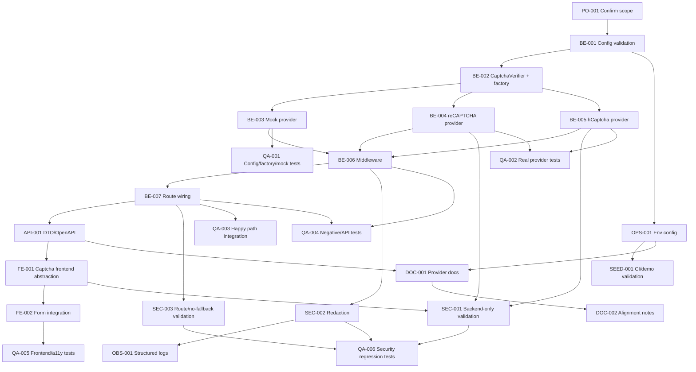

# Development Tasks: US-109 - Integrate Captcha Auth

## 1. Metadata

- **User Story ID:** US-109
- **Technical Specification:** `management/technical-specs/P0/PB-P0-006/US-109-technical-spec.md`
- **Source User Story:** `management/user-stories/US-109-integrate-captcha-auth.md`
- **Decision Resolution Artifact:** `management/user-stories/decision-resolutions/US-109-decision-resolution.md`
- **Priority:** P0
- **Backlog ID:** PB-P0-006
- **Backlog Title:** Security Cookies HTTP-Only + Captcha
- **Backlog Execution Order:** 6
- **User Story Position in Backlog Item:** 2 of 2
- **Epic:** EPIC-SEC-001
- **Module / Domain:** Security / Identity Access
- **Task Generation Status:** Ready for Sprint Planning
- **Generated On:** 2026-06-16

## 2. Source Validation

| Validation Item | Result |
| --- | --- |
| Technical Specification exists | Yes |
| Technical Specification status allows task breakdown | Yes - Ready for Task Breakdown |
| User Story approval status | Approved |
| Backlog mapping found | Yes |
| Decision resolution found | Yes |
| Acceptance Criteria available | Yes |
| MVP scope confirmed | Yes |
| Blocking open decisions | No |

## 3. Backlog Execution Context

US-109 belongs to PB-P0-006, which hardens authentication through HTTP-only cookies and captcha controls. This task set covers only the captcha portion and assumes US-108 owns cookie behavior.

Execution dependencies:

- **PB-P0-002:** authentication foundation must exist or be available for integration.
- **PB-P0-004:** identity access flows must expose register, login, and password reset request endpoints.
- **US-108:** owns HTTP-only cookie behavior and must not be modified by this task set except through normal login flow integration points.

## 4. Task Breakdown Summary

| Area | Count |
| --- | ---: |
| Product / Analysis | 1 |
| Backend | 7 |
| API Contract | 1 |
| Frontend | 2 |
| Security | 3 |
| Observability | 1 |
| DevOps / Config | 1 |
| QA | 6 |
| Seed / Demo | 1 |
| Documentation | 2 |
| **Total** | **25** |

## 5. Traceability Matrix

| Acceptance Criteria / Requirement | Development Tasks |
| --- | --- |
| AC-01 Register requires captcha before creating User, Credential, VendorProfile, or session | TASK-PB-P0-006-US-109-BE-006, TASK-PB-P0-006-US-109-BE-007, TASK-PB-P0-006-US-109-QA-003, TASK-PB-P0-006-US-109-QA-004 |
| AC-02 Login requires captcha before credential verification or session/cookie creation | TASK-PB-P0-006-US-109-BE-006, TASK-PB-P0-006-US-109-BE-007, TASK-PB-P0-006-US-109-QA-003, TASK-PB-P0-006-US-109-QA-004 |
| AC-03 Password reset request requires captcha before reset token or email side effects | TASK-PB-P0-006-US-109-BE-006, TASK-PB-P0-006-US-109-BE-007, TASK-PB-P0-006-US-109-QA-003, TASK-PB-P0-006-US-109-QA-004 |
| AC-04 Captcha provider selected by environment with fail-fast configuration | TASK-PB-P0-006-US-109-BE-001, TASK-PB-P0-006-US-109-BE-002, TASK-PB-P0-006-US-109-OPS-001, TASK-PB-P0-006-US-109-QA-001 |
| AC-05 Mock provider works deterministically in Local/CI with `__test__` only | TASK-PB-P0-006-US-109-BE-003, TASK-PB-P0-006-US-109-OPS-001, TASK-PB-P0-006-US-109-QA-001, TASK-PB-P0-006-US-109-QA-003 |
| AC-06 Real providers validate success, action, score when applicable | TASK-PB-P0-006-US-109-BE-004, TASK-PB-P0-006-US-109-BE-005, TASK-PB-P0-006-US-109-SEC-001, TASK-PB-P0-006-US-109-QA-002 |
| AC-07 Provider timeout/error fails controlled and does not continue auth operation | TASK-PB-P0-006-US-109-BE-006, TASK-PB-P0-006-US-109-SEC-002, TASK-PB-P0-006-US-109-OBS-001, TASK-PB-P0-006-US-109-QA-004, TASK-PB-P0-006-US-109-QA-006 |
| AC-08 Frontend obtains, sends, renews/resets captcha token without storing secrets | TASK-PB-P0-006-US-109-FE-001, TASK-PB-P0-006-US-109-FE-002, TASK-PB-P0-006-US-109-QA-005 |
| API contract documents captcha token and excludes secrets | TASK-PB-P0-006-US-109-API-001, TASK-PB-P0-006-US-109-DOC-001 |
| No persistence of captcha token, score, secret, or raw provider response | TASK-PB-P0-006-US-109-SEC-001, TASK-PB-P0-006-US-109-QA-006 |
| Route mapping protects only register, login, and password reset request | TASK-PB-P0-006-US-109-BE-007, TASK-PB-P0-006-US-109-SEC-003, TASK-PB-P0-006-US-109-QA-004 |

## 6. Development Tasks

### TASK-PB-P0-006-US-109-PO-001 - Confirm captcha scope and non-goals

- **Area:** Product / Analysis
- **Type:** Validation
- **Priority:** P0
- **Depends On:** None
- **Technical Spec Sections:** 2, 3, 14, 16
- **Description:** Confirm with the implementation team that US-109 covers captcha only for register, login, and password reset request, and excludes cookies, rate limiting, MFA, OAuth/SSO, AI, persistence, and provider fallback behavior.
- **Acceptance Criteria:**
  - Scope boundaries are visible in sprint planning notes or task board.
  - US-108 ownership of HTTP-only cookies remains unchanged.
  - No implementation task expands captcha to unrelated endpoints.

### TASK-PB-P0-006-US-109-BE-001 - Implement captcha environment configuration validation

- **Area:** Backend
- **Type:** Implementation
- **Priority:** P0
- **Depends On:** TASK-PB-P0-006-US-109-PO-001
- **Technical Spec Sections:** 4, 6, 7, 12
- **Description:** Add backend configuration parsing and fail-fast validation for `CAPTCHA_PROVIDER`, provider secrets, score threshold, timeout, and mock-provider environment restrictions.
- **Acceptance Criteria:**
  - `CAPTCHA_PROVIDER` accepts only `mock`, `recaptcha`, or `hcaptcha`.
  - `mock` is allowed only in Local/CI environments.
  - Real providers require their corresponding secret key at startup.
  - Invalid configuration prevents application startup with a safe error.

### TASK-PB-P0-006-US-109-BE-002 - Create CaptchaVerifier port and provider factory

- **Area:** Backend
- **Type:** Implementation
- **Priority:** P0
- **Depends On:** TASK-PB-P0-006-US-109-BE-001
- **Technical Spec Sections:** 4, 5, 6
- **Description:** Define the `CaptchaVerifier` interface, verification input/output contracts, and factory wiring that selects the configured provider without leaking provider details into auth use cases.
- **Acceptance Criteria:**
  - `verify(input)` returns a structured result with success, provider, action match, optional score, and internal failure reason.
  - Auth controllers or use cases depend on the port, not concrete providers.
  - Provider selection is centralized and covered by tests.

### TASK-PB-P0-006-US-109-BE-003 - Implement MockCaptchaProvider

- **Area:** Backend
- **Type:** Implementation
- **Priority:** P0
- **Depends On:** TASK-PB-P0-006-US-109-BE-002
- **Technical Spec Sections:** 4, 6, 12, 13
- **Description:** Implement deterministic mock captcha verification for Local/CI using only the token `__test__`, without external network calls.
- **Acceptance Criteria:**
  - Token `__test__` is accepted in Local/CI.
  - Missing, empty, or different tokens are rejected.
  - No external captcha provider is called in mock mode.
  - Mock mode cannot be used in Demo/production-like environments.

### TASK-PB-P0-006-US-109-BE-004 - Implement RecaptchaProvider

- **Area:** Backend
- **Type:** Implementation
- **Priority:** P0
- **Depends On:** TASK-PB-P0-006-US-109-BE-002
- **Technical Spec Sections:** 4, 6, 7, 12
- **Description:** Implement the reCAPTCHA provider adapter with server-side verification, timeout handling, action validation, score validation where applicable, and normalized failure outcomes.
- **Acceptance Criteria:**
  - Provider calls use backend-only secret configuration.
  - Successful responses validate expected action and minimum score when configured.
  - Provider errors, duplicate/expired tokens, low scores, and action mismatches map to controlled internal outcomes.
  - Raw provider responses and tokens are not logged or persisted.

### TASK-PB-P0-006-US-109-BE-005 - Implement HcaptchaProvider

- **Area:** Backend
- **Type:** Implementation
- **Priority:** P0
- **Depends On:** TASK-PB-P0-006-US-109-BE-002
- **Technical Spec Sections:** 4, 6, 7, 12
- **Description:** Implement the hCaptcha provider adapter with server-side verification, timeout handling, action/site-key validation where applicable, and normalized failure outcomes.
- **Acceptance Criteria:**
  - Provider calls use backend-only secret configuration.
  - Successful responses validate configured expectations supported by hCaptcha.
  - Provider failures map to controlled internal outcomes.
  - Raw provider responses and tokens are not logged or persisted.

### TASK-PB-P0-006-US-109-BE-006 - Implement captchaVerificationMiddleware

- **Area:** Backend
- **Type:** Implementation
- **Priority:** P0
- **Depends On:** TASK-PB-P0-006-US-109-BE-003, TASK-PB-P0-006-US-109-BE-004, TASK-PB-P0-006-US-109-BE-005
- **Technical Spec Sections:** 4, 6, 7, 12, 13
- **Description:** Add Express middleware that extracts `captchaToken` and optional `captchaAction`, invokes `CaptchaVerifier`, maps failures to safe API errors, and stops downstream auth execution when verification fails.
- **Acceptance Criteria:**
  - Missing token returns `CAPTCHA_REQUIRED`.
  - Invalid token, action mismatch, low score, duplicate/expired token, provider error, and timeout return controlled responses.
  - No auth use case, password check, session creation, user creation, reset token, or email side effect runs after failed captcha.
  - Public error messages do not reveal credential, email existence, provider internals, or token details.

### TASK-PB-P0-006-US-109-BE-007 - Apply middleware to selected auth routes only

- **Area:** Backend
- **Type:** Implementation
- **Priority:** P0
- **Depends On:** TASK-PB-P0-006-US-109-BE-006
- **Technical Spec Sections:** 4, 6, 8, 12, 13
- **Description:** Wire captcha middleware only into `POST /api/v1/auth/register`, `POST /api/v1/auth/login`, and `POST /api/v1/auth/password/reset-request`.
- **Acceptance Criteria:**
  - Register, login, and password reset request require captcha.
  - Password reset confirmation, logout, `/users/me`, and non-auth public endpoints are not accidentally protected.
  - Middleware runs before downstream mutations or credential checks.

### TASK-PB-P0-006-US-109-API-001 - Update auth DTOs and OpenAPI contract

- **Area:** API Contract
- **Type:** Implementation
- **Priority:** P0
- **Depends On:** TASK-PB-P0-006-US-109-BE-007
- **Technical Spec Sections:** 7, 8, 15
- **Description:** Update request DTO schemas and OpenAPI documentation for captcha requirements on the three protected public auth endpoints.
- **Acceptance Criteria:**
  - Register, login, and password reset request schemas include required `captchaToken`.
  - Optional `captchaAction` is documented if supported by implementation.
  - Captcha error responses are documented with stable error codes.
  - Provider secrets, raw responses, and internal failure details are not exposed in OpenAPI.

### TASK-PB-P0-006-US-109-FE-001 - Implement CaptchaWidget or useCaptchaToken abstraction

- **Area:** Frontend
- **Type:** Implementation
- **Priority:** P0
- **Depends On:** TASK-PB-P0-006-US-109-API-001
- **Technical Spec Sections:** 5, 6, 9, 12
- **Description:** Add a frontend abstraction that obtains captcha tokens using public site-key configuration and exposes token retrieval, reset, loading, and error states.
- **Acceptance Criteria:**
  - Frontend uses only public site-key configuration.
  - Captcha tokens are not stored in localStorage, sessionStorage, cookies, or durable global state.
  - The abstraction supports token reset/renewal after invalid, expired, or failed submissions.
  - Loading and error states are accessible and keyboard-compatible.

### TASK-PB-P0-006-US-109-FE-002 - Integrate captcha into register, login, and forgot-password forms

- **Area:** Frontend
- **Type:** Implementation
- **Priority:** P0
- **Depends On:** TASK-PB-P0-006-US-109-FE-001
- **Technical Spec Sections:** 5, 6, 8, 9, 12
- **Description:** Update auth forms to request a captcha token before submit and send it with the API payload for register, login, and password reset request flows.
- **Acceptance Criteria:**
  - All three forms include `captchaToken` in the request body.
  - Forms handle `CAPTCHA_REQUIRED`, `CAPTCHA_INVALID`, provider timeout, and expired-token style failures with generic user-facing errors.
  - Submit buttons are disabled while captcha verification/token retrieval is in progress.
  - Password reset request preserves anti-enumeration behavior in UI copy.

## 7. Required QA Tasks

### TASK-PB-P0-006-US-109-QA-001 - Add unit tests for captcha config, factory, and mock provider

- **Area:** QA
- **Type:** Test
- **Priority:** P0
- **Depends On:** TASK-PB-P0-006-US-109-BE-001, TASK-PB-P0-006-US-109-BE-002, TASK-PB-P0-006-US-109-BE-003
- **Technical Spec Sections:** 12, 13
- **Description:** Cover provider selection, config fail-fast behavior, mock token validation, and mock-environment restrictions.
- **Acceptance Criteria:**
  - Invalid providers fail validation.
  - Missing real-provider secrets fail validation.
  - Mock accepts only `__test__` in Local/CI.
  - Mock is blocked in Demo/production-like environments.

### TASK-PB-P0-006-US-109-QA-002 - Add unit tests for real provider adapters

- **Area:** QA
- **Type:** Test
- **Priority:** P0
- **Depends On:** TASK-PB-P0-006-US-109-BE-004, TASK-PB-P0-006-US-109-BE-005
- **Technical Spec Sections:** 12, 13
- **Description:** Test reCAPTCHA and hCaptcha adapter mapping for success, provider failures, timeout, score/action mismatch, duplicate/expired token, and normalized failure outcomes using mocked HTTP clients.
- **Acceptance Criteria:**
  - No test depends on external provider network access.
  - Success and failure responses are normalized consistently.
  - Low score and action mismatch are rejected where applicable.

### TASK-PB-P0-006-US-109-QA-003 - Add integration tests for protected auth happy paths with mock captcha

- **Area:** QA
- **Type:** Test
- **Priority:** P0
- **Depends On:** TASK-PB-P0-006-US-109-BE-007
- **Technical Spec Sections:** 12, 13
- **Description:** Add Supertest or equivalent integration coverage proving that register, login, and password reset request continue successfully when mock captcha token `__test__` is valid.
- **Acceptance Criteria:**
  - Register flow succeeds with valid mock captcha.
  - Login flow succeeds with valid mock captcha and preserves US-108 cookie integration expectations.
  - Password reset request succeeds with valid mock captcha while preserving anti-enumeration response behavior.

### TASK-PB-P0-006-US-109-QA-004 - Add API and negative-flow tests for captcha enforcement

- **Area:** QA
- **Type:** Test
- **Priority:** P0
- **Depends On:** TASK-PB-P0-006-US-109-BE-006, TASK-PB-P0-006-US-109-BE-007
- **Technical Spec Sections:** 12, 13
- **Description:** Verify missing token, invalid token, action mismatch, timeout, provider error, and route-mapping behavior for protected and unprotected endpoints.
- **Acceptance Criteria:**
  - Missing token returns `CAPTCHA_REQUIRED`.
  - Invalid token and action mismatch return `CAPTCHA_INVALID` or equivalent stable code.
  - Timeout/provider error does not execute downstream auth use cases.
  - Password reset confirmation, logout, `/users/me`, and unrelated public endpoints do not require captcha.

### TASK-PB-P0-006-US-109-QA-005 - Add frontend component and accessibility tests

- **Area:** QA
- **Type:** Test
- **Priority:** P0
- **Depends On:** TASK-PB-P0-006-US-109-FE-001, TASK-PB-P0-006-US-109-FE-002
- **Technical Spec Sections:** 9, 12, 13
- **Description:** Test captcha frontend behavior with provider stubs, including form payloads, token renewal, disabled submit state, visible errors, keyboard access, and mobile layout.
- **Acceptance Criteria:**
  - Register, login, and forgot-password payloads include captcha token.
  - Captcha token resets after invalid/expired failures.
  - Error messages are visible and announced to assistive technologies.
  - Layout remains usable on mobile viewport.

### TASK-PB-P0-006-US-109-QA-006 - Add security-focused regression tests

- **Area:** QA
- **Type:** Test
- **Priority:** P0
- **Depends On:** TASK-PB-P0-006-US-109-SEC-001, TASK-PB-P0-006-US-109-SEC-002, TASK-PB-P0-006-US-109-SEC-003
- **Technical Spec Sections:** 11, 12, 13
- **Description:** Verify that captcha secrets and raw provider data are never exposed or persisted, mock mode is blocked outside Local/CI, and CI does not call real providers.
- **Acceptance Criteria:**
  - Frontend bundle/config does not contain backend captcha secrets.
  - Logs redact token, secret, raw provider response, password, cookie, and full email.
  - No database migration or persistence layer stores captcha token, score, secret, raw response, or detailed failure data.
  - CI tests run with mock provider only and no external captcha network calls.

## 8. Required Security Tasks

### TASK-PB-P0-006-US-109-SEC-001 - Verify backend-only captcha validation and secret isolation

- **Area:** Security
- **Type:** Validation
- **Priority:** P0
- **Depends On:** TASK-PB-P0-006-US-109-BE-004, TASK-PB-P0-006-US-109-BE-005, TASK-PB-P0-006-US-109-FE-001
- **Technical Spec Sections:** 11, 12
- **Description:** Validate that captcha trust decisions happen only on the backend and that frontend configuration receives only public site keys.
- **Acceptance Criteria:**
  - Frontend never receives provider secret keys.
  - Backend does not trust frontend-provided captcha validity flags.
  - Captcha verification result is not persisted.

### TASK-PB-P0-006-US-109-SEC-002 - Implement safe redaction for captcha logs and errors

- **Area:** Security
- **Type:** Implementation
- **Priority:** P0
- **Depends On:** TASK-PB-P0-006-US-109-BE-006
- **Technical Spec Sections:** 11, 12, 14
- **Description:** Ensure logs and errors preserve useful diagnostic outcomes while excluding captcha tokens, provider secrets, raw provider responses, passwords, cookies, and full emails.
- **Acceptance Criteria:**
  - Structured logs include correlation ID, endpoint, provider, outcome, expected action, and timeout/config-failure indicators where relevant.
  - Sensitive fields are never logged.
  - Public API errors remain generic and stable.

### TASK-PB-P0-006-US-109-SEC-003 - Verify route protection boundaries and no mock fallback

- **Area:** Security
- **Type:** Validation
- **Priority:** P0
- **Depends On:** TASK-PB-P0-006-US-109-BE-007
- **Technical Spec Sections:** 11, 12, 13, 16
- **Description:** Validate that only the intended pre-auth endpoints require captcha and that real-provider environments never fall back to mock verification.
- **Acceptance Criteria:**
  - Captcha applies only to register, login, and password reset request.
  - Real-provider timeout or error never falls back to mock.
  - Mock token is rejected when provider is not `mock`.

## 9. Required Seed / Demo Tasks

### TASK-PB-P0-006-US-109-SEED-001 - Validate CI and demo captcha configuration

- **Area:** Seed / Demo
- **Type:** Configuration
- **Priority:** P0
- **Depends On:** TASK-PB-P0-006-US-109-OPS-001
- **Technical Spec Sections:** 12, 13, 16
- **Description:** Confirm that no data seed is required and document/validate environment setup for CI mock mode and QA/Demo real-provider mode.
- **Acceptance Criteria:**
  - No database seed or migration is introduced for captcha.
  - CI uses mock provider with `__test__`.
  - QA/Demo configuration uses a real provider with configured public site key and backend secret.
  - Demo checklist includes manual validation for register, login, and password reset request captcha behavior.

## 10. Observability / Audit Tasks

### TASK-PB-P0-006-US-109-OBS-001 - Add structured captcha verification logs

- **Area:** Observability
- **Type:** Implementation
- **Priority:** P0
- **Depends On:** TASK-PB-P0-006-US-109-BE-006, TASK-PB-P0-006-US-109-SEC-002
- **Technical Spec Sections:** 14
- **Description:** Add safe structured logging for captcha verification success, failure, timeout, and config invalid states.
- **Acceptance Criteria:**
  - Logs emit `captcha.verify.succeeded`, `captcha.verify.failed`, `captcha.provider.timeout`, and `captcha.config.invalid` where applicable.
  - Logs include correlation ID, endpoint, provider, outcome, expected action, and environment only when safe.
  - No AdminAction audit event is introduced for captcha verification.

## 11. Documentation / Traceability Tasks

### TASK-PB-P0-006-US-109-OPS-001 - Configure environment variables for local, CI, QA, and demo

- **Area:** DevOps / Config
- **Type:** Configuration
- **Priority:** P0
- **Depends On:** TASK-PB-P0-006-US-109-BE-001
- **Technical Spec Sections:** 4, 12, 13, 16
- **Description:** Add or update environment templates and CI configuration for captcha provider mode, real-provider secrets, public site keys, score threshold, and timeout.
- **Acceptance Criteria:**
  - Local/CI examples use `CAPTCHA_PROVIDER=mock`.
  - QA/Demo examples use `recaptcha` or `hcaptcha` with separate backend secret and frontend public site key variables.
  - Secret values are not committed.
  - CI does not require external captcha network access.

### TASK-PB-P0-006-US-109-DOC-001 - Document captcha provider contract and setup

- **Area:** Documentation
- **Type:** Documentation
- **Priority:** P0
- **Depends On:** TASK-PB-P0-006-US-109-API-001, TASK-PB-P0-006-US-109-OPS-001
- **Technical Spec Sections:** 15, 16
- **Description:** Document provider options, required environment variables, endpoint DTO expectations, safe error codes, and local/CI test-token behavior.
- **Acceptance Criteria:**
  - Documentation states `mock|recaptcha|hcaptcha` provider options.
  - Documentation states `__test__` is Local/CI only.
  - Documentation makes clear that backend secrets are never frontend variables.
  - Documentation confirms no captcha persistence is required.

### TASK-PB-P0-006-US-109-DOC-002 - Register documentation alignment notes

- **Area:** Documentation
- **Type:** Traceability
- **Priority:** P1
- **Depends On:** TASK-PB-P0-006-US-109-DOC-001
- **Technical Spec Sections:** 15
- **Description:** Record non-blocking documentation alignment notes identified by the technical specification, including captcha coverage on password reset request and supported provider naming.
- **Acceptance Criteria:**
  - Alignment note references that some source docs mention captcha only for register/login, while US-109 includes password reset request.
  - Alignment note references that provider equivalents require future technical decision if introduced.
  - No implementation scope is expanded by this documentation task.

## 12. Dependency Graph Mermaid

## 13. Suggested Implementation Order

1. Confirm scope and route boundaries with the sprint team.
2. Implement captcha backend configuration and provider factory.
3. Implement mock, reCAPTCHA, and hCaptcha providers.
4. Implement middleware and wire it only to the three selected auth routes.
5. Update DTOs and OpenAPI contract.
6. Add frontend captcha abstraction and integrate auth forms.
7. Add security redaction, structured logging, and environment configuration.
8. Add unit, integration, API, frontend, and security regression tests.
9. Complete demo/CI validation and documentation updates.

## 14. Risks & Mitigations

| Risk | Mitigation |
| --- | --- |
| Captcha blocks legitimate users due to provider outage or timeout | Use controlled timeout/error responses and clear UI retry behavior; do not continue auth operation after failure. |
| Secrets leak to frontend or logs | Keep secrets backend-only, add redaction tests, and verify frontend bundle/config. |
| Mock provider accidentally enabled in Demo/production | Fail-fast configuration validation and security regression tests. |
| Route wiring protects too many or too few endpoints | Add explicit route-mapping tests for protected and unprotected endpoints. |
| Password reset request loses anti-enumeration behavior | Keep generic API/UI response behavior and verify with integration tests. |
| Real-provider tests become flaky due to external calls | Mock provider HTTP clients in unit tests and keep CI on `CAPTCHA_PROVIDER=mock`. |

## 15. Out of Scope Confirmation

The following items are explicitly out of scope for this task set:

- HTTP-only cookie configuration owned by US-108.
- Rate-limit threshold changes owned by US-110 or future security stories.
- Captcha on every public endpoint.
- MFA, OAuth, SSO, WhatsApp, native mobile, marketplace transactions, payments, or real contracts.
- RAG, autonomous AI decisions, or AI moderation.
- Captcha token, score, secret, raw provider response, or detailed failure persistence.
- Real provider calls in CI.
- Fallback to mock provider outside Local/CI.

## 16. Readiness for Sprint Planning

| Readiness Check | Result |
| --- | --- |
| Tasks are implementation-ready | Yes |
| Tasks are traceable to AC and technical spec sections | Yes |
| QA tasks included | Yes |
| Security tasks included | Yes |
| Seed/demo tasks included | Yes |
| Observability tasks included | Yes |
| Documentation tasks included | Yes |
| Blockers | None |

## 17. Final Recommendation

US-109 is ready for sprint planning. The task set is scoped to backend-enforced captcha validation for selected public authentication endpoints, frontend token plumbing, provider configuration, security controls, and verification coverage required before implementation.
