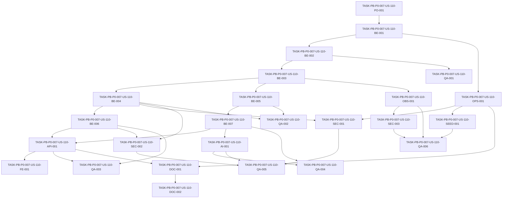

# Development Tasks — PB-P0-007 / US-110: Rate limiting en auth y endpoints IA

## 1. Metadata

| Field | Value |
|---|---|
| User Story ID | US-110 |
| Source User Story | `management/user-stories/US-110-rate-limiting-auth-and-ai.md` |
| Source Technical Specification | `management/technical-specs/P0/PB-P0-007/US-110-technical-spec.md` |
| Decision Resolution Artifact | `management/user-stories/decision-resolutions/US-110-decision-resolution.md` |
| Priority | P0 |
| Backlog ID | PB-P0-007 |
| Backlog Title | Rate Limiting & Middleware Chain |
| Backlog Execution Order | 7 |
| User Story Position in Backlog Item | 1 of 2 |
| Related User Stories in Backlog Item | US-110, US-111 |
| Epic | EPIC-SEC-001 |
| Backlog Item Dependencies | PB-P0-006 |
| Feature | Rate limiting |
| Module / Domain | Security / Identity Access / AI Assistance |
| Backlog Alignment Status | Found |
| Task Breakdown Status | Ready for Sprint Planning |
| Created Date | 2026-06-16 |
| Last Updated | 2026-06-16 |

---

## 2. Source Validation

| Source | Found | Used | Notes |
|---|---|---|---|
| User Story | Yes | Yes | Approved and ready for development tasks. |
| Technical Specification | Yes | Yes | Primary implementation source. |
| Decision Resolution Artifact | Yes | Yes | Resolves AI endpoints, limits, keying, storage, QA, logs, and US-111 separation. |
| Product Backlog Prioritized | Yes | Yes | Found as `management/artifacts/4-Product-Backlog-Prioritized.md`. |
| ADRs | Yes | Yes | Used through technical spec references, especially ADR-SEC-004 and ADR-SEC-001. |

---

## 3. Backlog Execution Context

### Parent Backlog Item

PB-P0-007 hardens EventFlow against auth abuse, password reset abuse, uncontrolled AI cost, and unsafe middleware composition. US-110 covers rate limiting policies. US-111 covers middleware order, Helmet, CORS, `notFoundMiddleware`, and `errorHandlerMiddleware`.

### Execution Order Rationale

US-110 is the first story in PB-P0-007 because it defines the rate limiting policies and technical behavior that the middleware chain from US-111 must position safely. It depends on PB-P0-006 for auth security foundations, captcha, and HTTP-only cookie behavior.

### Related User Stories in Same Backlog Item

| User Story | Role in Backlog Item | Suggested Order |
|---|---|---|
| US-110 | Define rate limit estricto para auth y generación IA | 1 |
| US-111 | Define y valida orden seguro de middlewares, Helmet, CORS y error handling | 2 |

---

## 4. Task Breakdown Summary

| Area | Number of Tasks | Notes |
|---|---:|---|
| Product / Analysis | 1 | Confirmar límites, endpoints y no-goals antes de implementación. |
| Backend | 7 | Config, store, evaluator, policies y route wiring. |
| API Contract | 1 | Error 429, headers y OpenAPI/API docs. |
| Frontend | 1 | Manejo de 429 si el API client aún no expone headers/correlationId. |
| Security / Authorization | 3 | Keying seguro, no side effects, proxy/IP y redacción. |
| AI / PromptOps | 1 | Verificar no-call a `LLMProvider` ni creación de `AIRecommendation`. |
| DevOps / Environment | 1 | Env vars, defaults y overrides Local/CI. |
| Observability / Audit | 1 | Logs estructurados de rate limit sin PII. |
| Seed / Demo Data | 1 | Validar que demo no excede defaults y no requiere seed. |
| QA / Testing | 6 | Unit, integration, API, security, AI no-call y demo smoke. |
| Documentation / Traceability | 2 | Configuración, límites, alineación documental. |
| Database / Prisma | 0 | No aplica; no hay migrations ni counters persistidos. |
| **Total** | **25** | Listo para sprint planning. |

---

## 5. Traceability Matrix

| Acceptance Criterion | Technical Spec Section | Task IDs |
|---|---|---|
| AC-01 Login rate limit 10/IP/10 min | 6, 7, 9, 12, 13 | TASK-PB-P0-007-US-110-BE-004, TASK-PB-P0-007-US-110-BE-006, TASK-PB-P0-007-US-110-QA-002, TASK-PB-P0-007-US-110-QA-003 |
| AC-02 Register rate limit 5/IP/10 min | 6, 7, 9, 12, 13 | TASK-PB-P0-007-US-110-BE-004, TASK-PB-P0-007-US-110-BE-006, TASK-PB-P0-007-US-110-QA-002, TASK-PB-P0-007-US-110-QA-003 |
| AC-03 Password reset request rate limit 3/email/h | 6, 7, 9, 12, 13 | TASK-PB-P0-007-US-110-BE-004, TASK-PB-P0-007-US-110-BE-006, TASK-PB-P0-007-US-110-SEC-002, TASK-PB-P0-007-US-110-QA-002, TASK-PB-P0-007-US-110-QA-003 |
| AC-04 AI generation limit 10/user/h agregado | 6, 7, 9, 11, 12, 13 | TASK-PB-P0-007-US-110-BE-005, TASK-PB-P0-007-US-110-BE-007, TASK-PB-P0-007-US-110-AI-001, TASK-PB-P0-007-US-110-QA-004, TASK-PB-P0-007-US-110-QA-005 |
| AC-05 Config fail-fast | 7, 17, 18 | TASK-PB-P0-007-US-110-BE-001, TASK-PB-P0-007-US-110-OPS-001, TASK-PB-P0-007-US-110-QA-001 |
| AC-06 Headers and error envelope | 7, 9, 12, 13 | TASK-PB-P0-007-US-110-BE-003, TASK-PB-P0-007-US-110-API-001, TASK-PB-P0-007-US-110-QA-003 |
| AC-07 Observabilidad segura | 7, 12, 14 | TASK-PB-P0-007-US-110-OBS-001, TASK-PB-P0-007-US-110-SEC-003, TASK-PB-P0-007-US-110-QA-006 |
| AC-08 Tests determinísticos | 13, 19 | TASK-PB-P0-007-US-110-QA-001, TASK-PB-P0-007-US-110-QA-002, TASK-PB-P0-007-US-110-QA-003, TASK-PB-P0-007-US-110-QA-004, TASK-PB-P0-007-US-110-QA-005, TASK-PB-P0-007-US-110-QA-006 |

---

## 6. Development Tasks

### TASK-PB-P0-007-US-110-PO-001 — Confirmar scope, endpoints y no-goals de rate limiting

| Field | Value |
|---|---|
| Area | Product / Analysis |
| Type | Review |
| Priority | Must |
| Estimate | XS |
| Depends On | None |
| Source AC(s) | AC-01, AC-02, AC-03, AC-04 |
| Technical Spec Section(s) | 2, 3, 4, 16, 18, 19 |
| Backlog ID | PB-P0-007 |
| User Story ID | US-110 |
| Owner Role | Tech Lead |
| Status | To Do |

#### Objective

Alinear al equipo sobre los endpoints cubiertos, defaults, separación frente a US-111 y exclusiones antes de modificar código.

#### Scope

##### Include

- Confirmar límites auth: login 10/IP/10 min, register 5/IP/10 min, reset request 3/email/h.
- Confirmar límite IA agregado: 10/user/h para endpoints POST de generación IA implementados en MVP.
- Confirmar que US-110 no crea endpoints IA futuros ni modifica cookies, captcha, Helmet, CORS u orden global de middlewares.

##### Exclude

- Cambios de código.
- Reapertura de decisiones ya formalizadas.

#### Implementation Notes

Usar la technical spec, la decision resolution y PB-P0-007 como fuentes. Registrar cualquier duda en el tablero del sprint sin bloquear si no contradice decisiones aprobadas.

#### Acceptance Criteria Covered

AC-01, AC-02, AC-03, AC-04.

#### Definition of Done

- [ ] Scope y no-goals quedan visibles en sprint planning o task board.
- [ ] Endpoints IA cubiertos se limitan a generación POST implementada en MVP.
- [ ] No se agregan tareas para Redis, DB counters, nuevos endpoints IA, cookies, captcha, Helmet o CORS.

---

### TASK-PB-P0-007-US-110-BE-001 — Implementar configuración validada para rate limiting

| Field | Value |
|---|---|
| Area | Backend |
| Type | Setup |
| Priority | Must |
| Estimate | M |
| Depends On | TASK-PB-P0-007-US-110-PO-001 |
| Source AC(s) | AC-01, AC-02, AC-03, AC-04, AC-05 |
| Technical Spec Section(s) | 6, 7, 17, 18 |
| Backlog ID | PB-P0-007 |
| User Story ID | US-110 |
| Owner Role | Backend |
| Status | To Do |

#### Objective

Agregar parsing y validación fail-fast de env vars para los límites de auth e IA.

#### Scope

##### Include

- Validar enteros positivos para máximos y ventanas.
- Definir defaults aprobados para login, register, password reset request e IA.
- Permitir overrides en Local/CI para tests determinísticos.
- Fallar bootstrap con error seguro ante configuración inválida.

##### Exclude

- Cambiar configuración de captcha, cookies, CORS o Helmet.
- Agregar Redis/Memcached o storage distribuido.

#### Implementation Notes

Seguir el patrón existente de configuración con Zod. Variables esperadas: `AUTH_LOGIN_RATE_LIMIT_MAX`, `AUTH_LOGIN_RATE_LIMIT_WINDOW_MS`, `AUTH_REGISTER_RATE_LIMIT_MAX`, `AUTH_REGISTER_RATE_LIMIT_WINDOW_MS`, `AUTH_PASSWORD_RESET_RATE_LIMIT_MAX`, `AUTH_PASSWORD_RESET_RATE_LIMIT_WINDOW_MS`, `AI_RATE_LIMIT_MAX`, `AI_RATE_LIMIT_WINDOW_MS`.

#### Acceptance Criteria Covered

AC-05.

#### Definition of Done

- [ ] Config inválida impide iniciar la app con mensaje seguro.
- [ ] Defaults aprobados quedan centralizados.
- [ ] Local/CI puede usar overrides sin desactivar rate limiting.
- [ ] No se exponen secretos ni valores sensibles en errores de bootstrap.

---

### TASK-PB-P0-007-US-110-BE-002 — Implementar store in-memory con clock inyectable

| Field | Value |
|---|---|
| Area | Backend |
| Type | Implementation |
| Priority | Must |
| Estimate | M |
| Depends On | TASK-PB-P0-007-US-110-BE-001 |
| Source AC(s) | AC-01, AC-02, AC-03, AC-04, AC-08 |
| Technical Spec Section(s) | 7, 10, 13, 17, 18 |
| Backlog ID | PB-P0-007 |
| User Story ID | US-110 |
| Owner Role | Backend |
| Status | To Do |

#### Objective

Crear el storage MVP de rate limiting por proceso, con ventanas determinísticas y API reseteable para tests.

#### Scope

##### Include

- Store in-memory por proceso con TTL/window.
- Clock inyectable o fake timers compatibles con la suite.
- API para evaluar, incrementar y resetear counters en tests.
- Cálculo de remaining, reset time y retry-after.

##### Exclude

- Persistencia en PostgreSQL.
- Prisma models, migrations o índices.
- Redis, Memcached o storage distribuido.

#### Implementation Notes

Mantener el store desacoplado de Express para facilitar unit tests. Evitar esperas reales en pruebas.

#### Acceptance Criteria Covered

AC-08.

#### Definition of Done

- [ ] Store soporta ventanas expiradas y reset de counters.
- [ ] Tests pueden controlar el tiempo sin sleeps reales.
- [ ] No se modifica Prisma ni se agrega migración.
- [ ] La API del store entrega metadata suficiente para headers.

---

### TASK-PB-P0-007-US-110-BE-003 — Implementar evaluator y middleware genérico de rate limit

| Field | Value |
|---|---|
| Area | Backend |
| Type | Implementation |
| Priority | Must |
| Estimate | M |
| Depends On | TASK-PB-P0-007-US-110-BE-002 |
| Source AC(s) | AC-05, AC-06, AC-07 |
| Technical Spec Section(s) | 7, 9, 12, 14, 18 |
| Backlog ID | PB-P0-007 |
| User Story ID | US-110 |
| Owner Role | Backend |
| Status | To Do |

#### Objective

Crear un middleware reutilizable que evalúe una policy, corte el flujo con 429 cuando corresponda y emita headers/error envelope estándar.

#### Scope

##### Include

- Evaluación genérica de policy.
- Respuesta 429 con `RATE_LIMIT_EXCEEDED`.
- Headers `X-RateLimit-Limit`, `X-RateLimit-Remaining` y `Retry-After` cuando aplique.
- Inclusión de `correlationId` en el envelope.
- Integración con logging seguro.

##### Exclude

- Definir orden global de middlewares de US-111.
- Reemplazar el error handler global.

#### Implementation Notes

El middleware debe poder usarse en rutas públicas y protegidas. Los handlers downstream no deben ejecutarse cuando el request está limitado.

#### Acceptance Criteria Covered

AC-06, AC-07.

#### Definition of Done

- [ ] 429 usa error envelope estándar con code estable.
- [ ] Headers de rate limit se emiten de forma consistente.
- [ ] Middleware hace short-circuit antes del handler.
- [ ] Errores internos no exponen stack, secrets, payloads ni PII.

---

### TASK-PB-P0-007-US-110-BE-004 — Definir policies de auth rate limiting

| Field | Value |
|---|---|
| Area | Backend |
| Type | Implementation |
| Priority | Must |
| Estimate | M |
| Depends On | TASK-PB-P0-007-US-110-BE-003 |
| Source AC(s) | AC-01, AC-02, AC-03 |
| Technical Spec Section(s) | 6, 7, 9, 12, 18 |
| Backlog ID | PB-P0-007 |
| User Story ID | US-110 |
| Owner Role | Backend |
| Status | To Do |

#### Objective

Crear las policies de login, register y password reset request con keying seguro y límites aprobados.

#### Scope

##### Include

- Login: 10 intentos por IP confiable cada 10 minutos.
- Register: 5 intentos por IP confiable cada 10 minutos.
- Password reset request: 3 intentos por email normalizado cada 1 hora.
- Normalización `trim().toLowerCase()` para email.
- Key identifiers seguros y no reversibles para logs cuando aplique.

##### Exclude

- Captcha provider.
- Password reset token generation.
- Auth cookie creation.
- Cambios a DTOs funcionales no relacionados.

#### Implementation Notes

No usar password, token, cookie, captcha token, raw body ni payload completo como key. La policy de reset debe preservar anti-enumeración.

#### Acceptance Criteria Covered

AC-01, AC-02, AC-03.

#### Definition of Done

- [ ] Login usa key por IP confiable con límite aprobado.
- [ ] Register usa key por IP confiable con límite aprobado.
- [ ] Password reset usa key por email normalizado con límite aprobado.
- [ ] Ninguna key usa secretos o payload sensible.

---

### TASK-PB-P0-007-US-110-BE-005 — Definir policy agregada de AI generation por usuario

| Field | Value |
|---|---|
| Area | Backend |
| Type | Implementation |
| Priority | Must |
| Estimate | M |
| Depends On | TASK-PB-P0-007-US-110-BE-003 |
| Source AC(s) | AC-04 |
| Technical Spec Section(s) | 6, 7, 9, 11, 12, 18 |
| Backlog ID | PB-P0-007 |
| User Story ID | US-110 |
| Owner Role | Backend |
| Status | To Do |

#### Objective

Crear la policy de rate limiting para generación IA agregada por usuario autenticado.

#### Scope

##### Include

- Key canónica `ai:user:{userId}`.
- Límite default 10 generaciones por usuario autenticado por 1 hora.
- Metadata de observabilidad para route pattern y feature sin cambiar la key default.
- Compatibilidad con rutas POST de generación IA implementadas en MVP.

##### Exclude

- Crear endpoints IA futuros.
- Cambiar prompts, prompt registry, provider fallback o persistencia de `AIRecommendation`.
- Limitar `GET`, `apply` o `discard` de `AIRecommendation`.

#### Implementation Notes

La policy debe ejecutarse sólo cuando exista `userId` autenticado según el pipeline seguro. No usar IP ni payload IA como key principal para la cuota agregada.

#### Acceptance Criteria Covered

AC-04.

#### Definition of Done

- [ ] Policy usa `ai:user:{userId}`.
- [ ] Límite default es 10/user/1h y configurable por env vars.
- [ ] Route pattern y feature se registran sólo como metadata segura.
- [ ] No se crean endpoints IA nuevos.

---

### TASK-PB-P0-007-US-110-BE-006 — Aplicar policies a endpoints auth seleccionados

| Field | Value |
|---|---|
| Area | Backend |
| Type | Implementation |
| Priority | Must |
| Estimate | M |
| Depends On | TASK-PB-P0-007-US-110-BE-004 |
| Source AC(s) | AC-01, AC-02, AC-03, AC-06 |
| Technical Spec Section(s) | 7, 9, 12, 18 |
| Backlog ID | PB-P0-007 |
| User Story ID | US-110 |
| Owner Role | Backend |
| Status | To Do |

#### Objective

Conectar las policies auth a las rutas públicas sensibles aprobadas.

#### Scope

##### Include

- `POST /api/v1/auth/login`.
- `POST /api/v1/auth/register`.
- `POST /api/v1/auth/password/reset-request`.
- Short-circuit antes de credential check, creación de usuario, creación de sesión, reset token o email simulado.

##### Exclude

- Password reset confirmation.
- Logout.
- `/users/me`.
- Endpoints públicos no auth.

#### Implementation Notes

La posición exacta dentro del pipeline debe respetar US-111. Esta tarea sólo aplica la policy a las rutas correctas.

#### Acceptance Criteria Covered

AC-01, AC-02, AC-03, AC-06.

#### Definition of Done

- [ ] Login retorna 429 antes de credential check al exceder límite.
- [ ] Register retorna 429 antes de crear usuario/perfil/sesión al exceder límite.
- [ ] Password reset request retorna 429 sin token ni email al exceder límite.
- [ ] Rutas fuera de scope no reciben la policy estricta de US-110.

---

### TASK-PB-P0-007-US-110-BE-007 — Aplicar policy AI a endpoints POST de generación IA implementados

| Field | Value |
|---|---|
| Area | Backend |
| Type | Implementation |
| Priority | Must |
| Estimate | M |
| Depends On | TASK-PB-P0-007-US-110-BE-005 |
| Source AC(s) | AC-04, AC-06 |
| Technical Spec Section(s) | 7, 9, 11, 12, 18 |
| Backlog ID | PB-P0-007 |
| User Story ID | US-110 |
| Owner Role | Backend |
| Status | To Do |

#### Objective

Conectar la policy agregada de IA a todos los endpoints POST de generación IA implementados en MVP.

#### Scope

##### Include

- `POST /api/v1/events/:eventId/ai/event-plan`.
- `POST /api/v1/events/:eventId/ai/checklist`.
- `POST /api/v1/events/:eventId/ai/budget-suggestion`.
- `POST /api/v1/events/:eventId/ai/vendor-categories`.
- `POST /api/v1/events/:eventId/ai/quote-brief`.
- `POST /api/v1/quote-requests/:quoteRequestId/ai/comparison-summary`.
- `POST /api/v1/events/:eventId/ai/task-prioritization`.
- Sólo rutas implementadas en MVP.

##### Exclude

- `GET /ai-recommendations/:id`.
- Apply/discard de recomendaciones.
- Vendor AI bio/package si está fuera del MVP.
- Nuevos endpoints IA.

#### Implementation Notes

La policy debe correr después de auth/ownership según el pipeline final y antes de llamar al `LLMProvider` o crear `AIRecommendation`.

#### Acceptance Criteria Covered

AC-04, AC-06.

#### Definition of Done

- [ ] Endpoints IA implementados comparten cuota agregada por usuario.
- [ ] Rutas de lectura/aplicación/descarte no consumen cuota de generación.
- [ ] Requests limitados no llaman a provider ni persisten recomendación.
- [ ] No se implementa endpoint futuro como parte de esta tarea.

---

### TASK-PB-P0-007-US-110-API-001 — Documentar contrato 429 y headers de rate limit

| Field | Value |
|---|---|
| Area | API Contract |
| Type | Documentation |
| Priority | Must |
| Estimate | S |
| Depends On | TASK-PB-P0-007-US-110-BE-003, TASK-PB-P0-007-US-110-BE-006, TASK-PB-P0-007-US-110-BE-007 |
| Source AC(s) | AC-06 |
| Technical Spec Section(s) | 8, 9, 13, 16 |
| Backlog ID | PB-P0-007 |
| User Story ID | US-110 |
| Owner Role | Backend |
| Status | To Do |

#### Objective

Actualizar contrato API/OpenAPI para reflejar `RATE_LIMIT_EXCEEDED`, status 429 y headers esperados.

#### Scope

##### Include

- Error envelope 429 con `code=RATE_LIMIT_EXCEEDED` y `correlationId`.
- Headers `X-RateLimit-Limit`, `X-RateLimit-Remaining`, `Retry-After`.
- Endpoints auth e IA cubiertos.

##### Exclude

- Cambios de payload funcional.
- Nuevos endpoints.

#### Implementation Notes

Coordinar con US-098 si el snapshot OpenAPI se genera automáticamente desde schemas.

#### Acceptance Criteria Covered

AC-06.

#### Definition of Done

- [ ] Contrato documenta 429 en endpoints cubiertos.
- [ ] Headers quedan documentados cuando aplique.
- [ ] No se documentan secretos, keys internas ni payloads sensibles.
- [ ] OpenAPI snapshot queda actualizado si corresponde.

---

### TASK-PB-P0-007-US-110-SEC-001 — Validar IP confiable y configuración de proxy para auth limits

| Field | Value |
|---|---|
| Area | Security / Authorization |
| Type | Validation |
| Priority | Must |
| Estimate | S |
| Depends On | TASK-PB-P0-007-US-110-BE-004, TASK-PB-P0-007-US-110-OPS-001 |
| Source AC(s) | AC-01, AC-02 |
| Technical Spec Section(s) | 7, 12, 17 |
| Backlog ID | PB-P0-007 |
| User Story ID | US-110 |
| Owner Role | Backend |
| Status | To Do |

#### Objective

Asegurar que el keying por IP no confía en headers arbitrarios ni permite spoofing por configuración incorrecta.

#### Scope

##### Include

- Revisar `TRUST_PROXY` o configuración equivalente.
- Definir comportamiento por entorno.
- Agregar validación o tests para no confiar en `X-Forwarded-For` sin proxy confiable.

##### Exclude

- Implementar WAF/API Gateway.
- Diseñar infraestructura distribuida.

#### Implementation Notes

Mantener compatibilidad con despliegue previsto. No bloquear Local/CI, pero evitar asumir headers externos como confiables sin configuración.

#### Acceptance Criteria Covered

AC-01, AC-02.

#### Definition of Done

- [ ] Config proxy/IP queda validada o documentada.
- [ ] Tests cubren comportamiento con y sin proxy confiable.
- [ ] No se permite spoofing trivial por headers arbitrarios.

---

### TASK-PB-P0-007-US-110-SEC-002 — Preservar anti-enumeración en password reset rate limit

| Field | Value |
|---|---|
| Area | Security / Authorization |
| Type | Implementation |
| Priority | Must |
| Estimate | S |
| Depends On | TASK-PB-P0-007-US-110-BE-004, TASK-PB-P0-007-US-110-BE-006 |
| Source AC(s) | AC-03, AC-07 |
| Technical Spec Section(s) | 7, 9, 12, 17 |
| Backlog ID | PB-P0-007 |
| User Story ID | US-110 |
| Owner Role | Backend |
| Status | To Do |

#### Objective

Evitar que el rate limiting de password reset revele existencia de cuentas o emails completos.

#### Scope

##### Include

- Mensajes genéricos.
- Key por email normalizado sin loggear email completo.
- Sin reset token ni email simulado cuando el request está limitado.

##### Exclude

- Cambiar la política funcional de reset password fuera del 429.

#### Implementation Notes

El 429 puede ser visible por key de email normalizado, pero no debe confirmar si la cuenta existe.

#### Acceptance Criteria Covered

AC-03, AC-07.

#### Definition of Done

- [ ] Respuesta 429 no revela existencia de cuenta.
- [ ] Logs no contienen email completo.
- [ ] Requests limitados no crean reset token ni email simulado.

---

### TASK-PB-P0-007-US-110-SEC-003 — Implementar redacción de datos sensibles en rate limit

| Field | Value |
|---|---|
| Area | Security / Authorization |
| Type | Implementation |
| Priority | Must |
| Estimate | S |
| Depends On | TASK-PB-P0-007-US-110-BE-003, TASK-PB-P0-007-US-110-OBS-001 |
| Source AC(s) | AC-07 |
| Technical Spec Section(s) | 7, 12, 14, 17 |
| Backlog ID | PB-P0-007 |
| User Story ID | US-110 |
| Owner Role | Backend |
| Status | To Do |

#### Objective

Garantizar que logs y errores de rate limiting no expongan credenciales, tokens, prompts, respuestas LLM, secrets ni PII.

#### Scope

##### Include

- Redacción de password, cookies, JWT, reset tokens, captcha tokens y full email.
- Redacción de prompt completo, LLM response, provider secrets y raw body.
- Uso de key identifiers hasheados o normalizados de forma segura.

##### Exclude

- Nuevo sistema general de logging para toda la app.
- Persistencia de eventos de auditoría.

#### Implementation Notes

Reutilizar helpers de redacción existentes si los hay. Los logs permitidos son metadata mínima: `correlationId`, route pattern, limiter policy, key type, identifier seguro, remaining/reset metadata y status.

#### Acceptance Criteria Covered

AC-07.

#### Definition of Done

- [ ] Campos prohibidos no aparecen en logs de rate limit.
- [ ] Errores públicos no incluyen payload sensible.
- [ ] Tests verifican redacción en auth e IA.

---

### TASK-PB-P0-007-US-110-AI-001 — Verificar no-call y no-persistence cuando IA está rate limited

| Field | Value |
|---|---|
| Area | AI / PromptOps |
| Type | Validation |
| Priority | Must |
| Estimate | S |
| Depends On | TASK-PB-P0-007-US-110-BE-007 |
| Source AC(s) | AC-04 |
| Technical Spec Section(s) | 7, 11, 12, 13, 18 |
| Backlog ID | PB-P0-007 |
| User Story ID | US-110 |
| Owner Role | AI |
| Status | To Do |

#### Objective

Confirmar que un request IA limitado no llama a `LLMProvider`, no ejecuta fallback y no crea `AIRecommendation`.

#### Scope

##### Include

- Spy o mock sobre `LLMProvider`.
- Verificación de ausencia de persistencia `AIRecommendation`.
- Verificación de que 429 no dispara timeout/fallback IA.

##### Exclude

- Cambios de prompts.
- Cambios de output schema IA.
- Nuevas features IA.

#### Implementation Notes

Usar `MockAIProvider` o test double equivalente. Esta tarea valida límites, no modifica la lógica funcional de generación cuando el request no está limitado.

#### Acceptance Criteria Covered

AC-04.

#### Definition of Done

- [ ] Tests demuestran que provider no se llama cuando hay 429.
- [ ] Tests demuestran que no se crea `AIRecommendation` con 429.
- [ ] No se modifica prompt registry ni fallback IA.

---

### TASK-PB-P0-007-US-110-FE-001 — Exponer manejo de 429 en API client si falta soporte

| Field | Value |
|---|---|
| Area | Frontend |
| Type | Implementation |
| Priority | Should |
| Estimate | S |
| Depends On | TASK-PB-P0-007-US-110-API-001 |
| Source AC(s) | AC-06 |
| Technical Spec Section(s) | 5, 8, 9 |
| Backlog ID | PB-P0-007 |
| User Story ID | US-110 |
| Owner Role | Frontend |
| Status | To Do |

#### Objective

Asegurar que el frontend pueda consumir `RATE_LIMIT_EXCEEDED`, `correlationId`, `Retry-After` y headers de rate limit si el cliente actual no los expone.

#### Scope

##### Include

- Preservar `error.code`.
- Preservar `correlationId`.
- Exponer `Retry-After` y headers `X-RateLimit-*` cuando existan.
- Usar mensajes genéricos existentes o traducibles.

##### Exclude

- Calcular cuotas en frontend.
- Persistir counters localmente.
- Crear pantallas nuevas.

#### Implementation Notes

Si el API client ya soporta estos campos, documentar como no-op técnico y cubrir con test existente o nuevo.

#### Acceptance Criteria Covered

AC-06.

#### Definition of Done

- [ ] UI/API client no pierde `RATE_LIMIT_EXCEEDED`.
- [ ] `Retry-After` queda disponible para UX si se usa.
- [ ] No se persiste estado de cuotas en navegador.

---

### TASK-PB-P0-007-US-110-OPS-001 — Actualizar env templates y overrides de CI

| Field | Value |
|---|---|
| Area | DevOps / Environment |
| Type | Setup |
| Priority | Must |
| Estimate | S |
| Depends On | TASK-PB-P0-007-US-110-BE-001 |
| Source AC(s) | AC-05, AC-08 |
| Technical Spec Section(s) | 7, 13, 15, 17, 19 |
| Backlog ID | PB-P0-007 |
| User Story ID | US-110 |
| Owner Role | DevOps |
| Status | To Do |

#### Objective

Documentar y configurar variables de rate limiting para Local, CI, QA y Demo sin desactivar controles.

#### Scope

##### Include

- `.env.example` o template equivalente.
- Defaults seguros para QA/Demo.
- Overrides pequeños para Local/CI cuando ayuden a tests determinísticos.
- Nota de que Demo no desactiva rate limiting.

##### Exclude

- Nuevos servicios externos.
- Secrets reales.
- Infra Redis/Memcached.

#### Implementation Notes

No commitear secretos. Los límites de CI pueden ser menores, pero deben seguir usando la misma ruta de código.

#### Acceptance Criteria Covered

AC-05, AC-08.

#### Definition of Done

- [ ] Env vars aparecen en templates.
- [ ] CI puede ejecutar pruebas sin esperas reales.
- [ ] Demo mantiene rate limiting activo.
- [ ] No se agregan dependencias de infraestructura.

---

### TASK-PB-P0-007-US-110-OBS-001 — Emitir logs estructurados de rate limit excedido

| Field | Value |
|---|---|
| Area | Observability / Audit |
| Type | Implementation |
| Priority | Must |
| Estimate | S |
| Depends On | TASK-PB-P0-007-US-110-BE-003 |
| Source AC(s) | AC-07 |
| Technical Spec Section(s) | 7, 12, 14, 19 |
| Backlog ID | PB-P0-007 |
| User Story ID | US-110 |
| Owner Role | Backend |
| Status | To Do |

#### Objective

Agregar evento estructurado seguro para requests limitados.

#### Scope

##### Include

- Evento `security.rate_limit.exceeded` o equivalente.
- Campos permitidos: `correlationId`, route pattern, limiter policy, key type, safe key identifier, remaining, reset metadata, status.
- Clasificar 429 como warning/security event, no como error inesperado.

##### Exclude

- `AdminAction`.
- Métricas Prometheus/OTel si no existen.
- Persistencia de logs en DB.

#### Implementation Notes

Integrar con logger existente. Dejar métricas como opcional si ya hay infraestructura.

#### Acceptance Criteria Covered

AC-07.

#### Definition of Done

- [ ] Logs incluyen metadata operativa mínima.
- [ ] Logs incluyen `correlationId`.
- [ ] Logs no incluyen datos prohibidos.
- [ ] 429 no se registra como excepción no controlada.

---

### TASK-PB-P0-007-US-110-SEED-001 — Validar impacto demo sin cambios de seed

| Field | Value |
|---|---|
| Area | Seed / Demo Data |
| Type | Validation |
| Priority | Should |
| Estimate | XS |
| Depends On | TASK-PB-P0-007-US-110-OPS-001, TASK-PB-P0-007-US-110-BE-007 |
| Source AC(s) | AC-04, AC-08 |
| Technical Spec Section(s) | 13, 15, 19 |
| Backlog ID | PB-P0-007 |
| User Story ID | US-110 |
| Owner Role | QA |
| Status | To Do |

#### Objective

Confirmar que no se requiere seed y que el guion demo normal no excede los defaults.

#### Scope

##### Include

- Validar que no hay migrations ni seed nuevos.
- Confirmar que el guion demo normal queda por debajo de 10 generaciones IA/user/h.
- Documentar reset/reinicio de proceso o espera de ventana para demos repetidas.

##### Exclude

- Desactivar rate limiting en Demo.
- Crear usuarios o datos adicionales sólo por esta historia.

#### Implementation Notes

Si el guion demo real excede el default, reportarlo como ajuste de demo, no como cambio silencioso de seguridad.

#### Acceptance Criteria Covered

AC-04, AC-08.

#### Definition of Done

- [ ] No se agregan seeds ni migrations.
- [ ] Demo smoke normal no excede cuota IA.
- [ ] Demos repetidas tienen nota de reset/espera documentada.

---

### TASK-PB-P0-007-US-110-QA-001 — Agregar unit tests de configuración, store y ventanas

| Field | Value |
|---|---|
| Area | QA / Testing |
| Type | Test |
| Priority | Must |
| Estimate | M |
| Depends On | TASK-PB-P0-007-US-110-BE-001, TASK-PB-P0-007-US-110-BE-002 |
| Source AC(s) | AC-05, AC-08 |
| Technical Spec Section(s) | 13, 17, 19 |
| Backlog ID | PB-P0-007 |
| User Story ID | US-110 |
| Owner Role | QA |
| Status | To Do |

#### Objective

Cubrir config fail-fast, store in-memory, expiración de ventanas y reset de counters sin esperas reales.

#### Scope

##### Include

- Env vars inválidas.
- Valores cero/negativos/no numéricos.
- Fake timers o clock inyectable.
- Reset del store entre tests.

##### Exclude

- Supertest de endpoints.
- Tests con sleeps reales.

#### Implementation Notes

Los tests deben ser determinísticos y rápidos en CI.

#### Acceptance Criteria Covered

AC-05, AC-08.

#### Definition of Done

- [ ] Config inválida falla como se espera.
- [ ] Ventanas expiran con clock controlado.
- [ ] Store se aísla entre tests.
- [ ] No hay esperas reales de minutos u horas.

---

### TASK-PB-P0-007-US-110-QA-002 — Agregar unit tests de policies auth e IA

| Field | Value |
|---|---|
| Area | QA / Testing |
| Type | Test |
| Priority | Must |
| Estimate | M |
| Depends On | TASK-PB-P0-007-US-110-BE-004, TASK-PB-P0-007-US-110-BE-005 |
| Source AC(s) | AC-01, AC-02, AC-03, AC-04 |
| Technical Spec Section(s) | 6, 7, 13, 19 |
| Backlog ID | PB-P0-007 |
| User Story ID | US-110 |
| Owner Role | QA |
| Status | To Do |

#### Objective

Validar límites, keys y ventanas de cada policy sin pasar por Express.

#### Scope

##### Include

- Login 10/IP/10 min.
- Register 5/IP/10 min.
- Password reset 3/email normalizado/1h.
- AI 10/user/1h agregado.
- Reset de ventana.

##### Exclude

- Wiring de rutas.
- Provider AI real.

#### Implementation Notes

Incluir casos de email con mayúsculas/espacios para normalización.

#### Acceptance Criteria Covered

AC-01, AC-02, AC-03, AC-04.

#### Definition of Done

- [ ] Cada policy respeta max y window.
- [ ] Password reset normaliza email.
- [ ] IA usa key `ai:user:{userId}`.
- [ ] Al expirar ventana se permite nuevo request.

---

### TASK-PB-P0-007-US-110-QA-003 — Agregar integration/API tests para auth rate limiting

| Field | Value |
|---|---|
| Area | QA / Testing |
| Type | Test |
| Priority | Must |
| Estimate | M |
| Depends On | TASK-PB-P0-007-US-110-BE-006, TASK-PB-P0-007-US-110-API-001 |
| Source AC(s) | AC-01, AC-02, AC-03, AC-06 |
| Technical Spec Section(s) | 9, 12, 13, 19 |
| Backlog ID | PB-P0-007 |
| User Story ID | US-110 |
| Owner Role | QA |
| Status | To Do |

#### Objective

Probar con Supertest o equivalente que login, register y password reset request retornan 429 y no ejecutan side effects al exceder límites.

#### Scope

##### Include

- Status 429.
- `RATE_LIMIT_EXCEEDED`.
- Headers esperados.
- No credential check después de 429.
- No creación de usuario/perfil/sesión después de 429.
- No reset token/email simulado después de 429.

##### Exclude

- CAPTCHA provider tests.
- Cookie behavior de US-108.

#### Implementation Notes

Usar límites pequeños en config de test si facilita el setup. Mantener aislamiento del store entre casos.

#### Acceptance Criteria Covered

AC-01, AC-02, AC-03, AC-06.

#### Definition of Done

- [ ] Login excedido retorna 429 antes de credential check.
- [ ] Register excedido no crea usuario ni perfil.
- [ ] Reset excedido no crea token ni email.
- [ ] Envelope y headers se validan.

---

### TASK-PB-P0-007-US-110-QA-004 — Agregar integration/API tests para AI rate limiting

| Field | Value |
|---|---|
| Area | QA / Testing |
| Type | Test |
| Priority | Must |
| Estimate | M |
| Depends On | TASK-PB-P0-007-US-110-BE-007, TASK-PB-P0-007-US-110-AI-001 |
| Source AC(s) | AC-04, AC-06 |
| Technical Spec Section(s) | 9, 11, 12, 13, 19 |
| Backlog ID | PB-P0-007 |
| User Story ID | US-110 |
| Owner Role | QA |
| Status | To Do |

#### Objective

Validar rate limit agregado de generación IA por usuario autenticado en endpoints MVP implementados.

#### Scope

##### Include

- Supertest con usuario autenticado.
- Cuota compartida entre endpoints IA cubiertos.
- 429 antes de `LLMProvider`.
- 429 antes de crear `AIRecommendation`.
- 401 para usuario anónimo antes de rate limit por `userId`.

##### Exclude

- Nuevos endpoints IA.
- Tests de prompt quality.

#### Implementation Notes

Usar `MockAIProvider` o spy. Confirmar que endpoints no implementados no se vuelven obligatorios por esta tarea.

#### Acceptance Criteria Covered

AC-04, AC-06.

#### Definition of Done

- [ ] La cuota se agrega por usuario.
- [ ] Requests excedidos no llaman provider.
- [ ] Requests excedidos no persisten recomendación.
- [ ] Anonymous AI request retorna 401 antes de usar key por user.

---

### TASK-PB-P0-007-US-110-QA-005 — Agregar security tests de autorización y no side effects

| Field | Value |
|---|---|
| Area | QA / Testing |
| Type | Test |
| Priority | Must |
| Estimate | M |
| Depends On | TASK-PB-P0-007-US-110-SEC-001, TASK-PB-P0-007-US-110-SEC-002, TASK-PB-P0-007-US-110-AI-001 |
| Source AC(s) | AC-03, AC-04, AC-07 |
| Technical Spec Section(s) | 12, 13, 17, 19 |
| Backlog ID | PB-P0-007 |
| User Story ID | US-110 |
| Owner Role | QA |
| Status | To Do |

#### Objective

Cubrir escenarios negativos de seguridad relacionados con IP/proxy, anti-enumeración, ownership y no side effects.

#### Scope

##### Include

- IP/proxy spoofing controlado.
- Password reset sin enumeración.
- AI ownership failure antes de provider.
- Rate limit antes de side effects.

##### Exclude

- Suite completa de RBAC/ownership de US-112.

#### Implementation Notes

Estos tests deben complementar, no duplicar completamente, la futura suite negativa transversal.

#### Acceptance Criteria Covered

AC-03, AC-04, AC-07.

#### Definition of Done

- [ ] Config de IP/proxy queda cubierta.
- [ ] Reset no revela existencia de email.
- [ ] Usuario sin ownership no llega a provider.
- [ ] 429 detiene side effects.

---

### TASK-PB-P0-007-US-110-QA-006 — Agregar tests de redacción, logs y demo smoke

| Field | Value |
|---|---|
| Area | QA / Testing |
| Type | Test |
| Priority | Must |
| Estimate | M |
| Depends On | TASK-PB-P0-007-US-110-SEC-003, TASK-PB-P0-007-US-110-OBS-001, TASK-PB-P0-007-US-110-SEED-001 |
| Source AC(s) | AC-07, AC-08 |
| Technical Spec Section(s) | 13, 14, 15, 19 |
| Backlog ID | PB-P0-007 |
| User Story ID | US-110 |
| Owner Role | QA |
| Status | To Do |

#### Objective

Validar que los logs son seguros, que el demo normal no excede límites y que CI no depende de tiempos reales.

#### Scope

##### Include

- Logs sin password, tokens, cookies, captcha token, email completo, prompt completo, LLM response, provider secret ni raw body.
- Smoke demo de login y generación IA dentro de defaults.
- Verificación de que 429 no se registra como error inesperado.

##### Exclude

- Métricas avanzadas si no existen.
- Playwright E2E obligatorio.

#### Implementation Notes

Puede implementarse como tests de logger con spy y smoke API de bajo costo.

#### Acceptance Criteria Covered

AC-07, AC-08.

#### Definition of Done

- [ ] Redaction tests pasan.
- [ ] Demo smoke no excede defaults.
- [ ] CI no usa sleeps reales para ventanas.
- [ ] Logs de 429 son warning/security event.

---

### TASK-PB-P0-007-US-110-DOC-001 — Documentar configuración y comportamiento de rate limiting

| Field | Value |
|---|---|
| Area | Documentation / Traceability |
| Type | Documentation |
| Priority | Must |
| Estimate | S |
| Depends On | TASK-PB-P0-007-US-110-OPS-001, TASK-PB-P0-007-US-110-API-001 |
| Source AC(s) | AC-05, AC-06, AC-08 |
| Technical Spec Section(s) | 15, 16, 19 |
| Backlog ID | PB-P0-007 |
| User Story ID | US-110 |
| Owner Role | Tech Lead |
| Status | To Do |

#### Objective

Actualizar documentación operativa para variables, defaults, headers, comportamiento 429 y demo.

#### Scope

##### Include

- Variables env y defaults.
- Overrides Local/CI.
- Demo no desactiva rate limiting.
- 429, headers y `RATE_LIMIT_EXCEEDED`.
- Nota de reset/espera para demos repetidas.

##### Exclude

- Documentar Redis/Memcached como implementación actual.
- Cambiar decisiones de US-111.

#### Implementation Notes

Ubicar la documentación en el runbook o documento operativo existente que use el proyecto para config backend/demo.

#### Acceptance Criteria Covered

AC-05, AC-06, AC-08.

#### Definition of Done

- [ ] Docs explican variables y defaults.
- [ ] Docs explican 429 y headers.
- [ ] Docs indican cómo manejar demo repetida.
- [ ] Docs mantienen Redis/Memcached como futuro/out of scope.

---

### TASK-PB-P0-007-US-110-DOC-002 — Registrar notas de alineación documental no bloqueantes

| Field | Value |
|---|---|
| Area | Documentation / Traceability |
| Type | Documentation |
| Priority | Should |
| Estimate | XS |
| Depends On | TASK-PB-P0-007-US-110-DOC-001 |
| Source AC(s) | AC-01, AC-02, AC-03, AC-04 |
| Technical Spec Section(s) | 16 |
| Backlog ID | PB-P0-007 |
| User Story ID | US-110 |
| Owner Role | Tech Lead |
| Status | To Do |

#### Objective

Registrar las diferencias no bloqueantes entre documentos fuente y la decisión vigente de US-110.

#### Scope

##### Include

- NFR/BR vs ADR sobre password reset request.
- Doc 14 sobre QuoteRequest rate limit fuera de US-110.
- PB-P0-007 agrupando US-110 y US-111.
- Doc 16 con endpoint vendor AI futuro/optional.

##### Exclude

- Cambiar scope implementable.
- Crear historias nuevas automáticamente.

#### Implementation Notes

Esta tarea es de trazabilidad. Si se crea una historia futura para QuoteRequest rate limit, debe pasar por priorización PO.

#### Acceptance Criteria Covered

AC-01, AC-02, AC-03, AC-04.

#### Definition of Done

- [ ] Notas de alineación quedan registradas donde el equipo mantenga documentación técnica.
- [ ] No se expande scope de US-110.
- [ ] Se mantiene separación con US-111.

---

## 7. Required QA Tasks

| Task ID | Test Type | Purpose |
|---|---|---|
| TASK-PB-P0-007-US-110-QA-001 | Unit / Config | Validar env vars, store, fake timers y ventanas sin esperas reales. |
| TASK-PB-P0-007-US-110-QA-002 | Unit / Policy | Validar limits, keying y reset de policies auth e IA. |
| TASK-PB-P0-007-US-110-QA-003 | Integration / API | Validar 429 y no side effects en login, register y password reset request. |
| TASK-PB-P0-007-US-110-QA-004 | Integration / AI API | Validar cuota agregada IA, no-call provider y no creación de `AIRecommendation`. |
| TASK-PB-P0-007-US-110-QA-005 | Security Regression | Validar IP/proxy, anti-enumeración, ownership y no side effects. |
| TASK-PB-P0-007-US-110-QA-006 | Observability / Demo | Validar redacción de logs, smoke demo y CI determinístico. |

---

## 8. Required Security Tasks

| Task ID | Security Concern | Purpose |
|---|---|---|
| TASK-PB-P0-007-US-110-SEC-001 | IP spoofing / proxy trust | Evitar keying inseguro para login/register. |
| TASK-PB-P0-007-US-110-SEC-002 | Account enumeration | Mantener password reset genérico y sin email completo en logs. |
| TASK-PB-P0-007-US-110-SEC-003 | Sensitive data exposure | Redactar credenciales, tokens, prompts, LLM responses, secrets, full email y raw body. |
| TASK-PB-P0-007-US-110-QA-005 | Authorization negative tests | Probar ownership/auth antes de provider y no side effects. |
| TASK-PB-P0-007-US-110-QA-006 | Log redaction tests | Probar que logs y errores no exponen datos prohibidos. |

---

## 9. Required Seed / Demo Tasks

| Task ID | Seed/Demo Concern | Purpose |
|---|---|---|
| TASK-PB-P0-007-US-110-SEED-001 | Demo quota impact | Confirmar que no hay seed nuevo y que la demo normal no excede defaults. |
| TASK-PB-P0-007-US-110-QA-006 | Demo smoke | Validar login/generación IA dentro de límites y sin sleeps reales. |

---

## 10. Observability / Audit Tasks

| Task ID | Concern | Purpose |
|---|---|---|
| TASK-PB-P0-007-US-110-OBS-001 | Structured security logs | Emitir `security.rate_limit.exceeded` o equivalente con `correlationId` y metadata segura. |
| TASK-PB-P0-007-US-110-SEC-003 | Redaction | Asegurar que observabilidad no expone datos sensibles. |
| TASK-PB-P0-007-US-110-QA-006 | Log verification | Probar redacción y clasificación de 429 como warning/security event. |

---

## 11. Documentation / Traceability Tasks

| Task ID | Document / Artifact | Purpose |
|---|---|---|
| TASK-PB-P0-007-US-110-API-001 | OpenAPI / API contract | Documentar 429, headers y endpoints cubiertos. |
| TASK-PB-P0-007-US-110-OPS-001 | Env templates / CI config | Documentar variables y overrides. |
| TASK-PB-P0-007-US-110-DOC-001 | Backend/demo runbook | Documentar configuración, defaults y demo repeated-run notes. |
| TASK-PB-P0-007-US-110-DOC-002 | Traceability notes | Registrar alineación documental no bloqueante. |

---

## 12. Dependency Graph

---

## 13. Suggested Implementation Order

### Phase 1 — Foundation

1. TASK-PB-P0-007-US-110-PO-001
2. TASK-PB-P0-007-US-110-BE-001
3. TASK-PB-P0-007-US-110-BE-002
4. TASK-PB-P0-007-US-110-OPS-001
5. TASK-PB-P0-007-US-110-QA-001

### Phase 2 — Core Implementation

1. TASK-PB-P0-007-US-110-BE-003
2. TASK-PB-P0-007-US-110-BE-004
3. TASK-PB-P0-007-US-110-BE-005
4. TASK-PB-P0-007-US-110-BE-006
5. TASK-PB-P0-007-US-110-BE-007
6. TASK-PB-P0-007-US-110-API-001

### Phase 3 — Validation / Security / QA

1. TASK-PB-P0-007-US-110-SEC-001
2. TASK-PB-P0-007-US-110-SEC-002
3. TASK-PB-P0-007-US-110-OBS-001
4. TASK-PB-P0-007-US-110-SEC-003
5. TASK-PB-P0-007-US-110-AI-001
6. TASK-PB-P0-007-US-110-FE-001
7. TASK-PB-P0-007-US-110-QA-002
8. TASK-PB-P0-007-US-110-QA-003
9. TASK-PB-P0-007-US-110-QA-004
10. TASK-PB-P0-007-US-110-QA-005
11. TASK-PB-P0-007-US-110-QA-006

### Phase 4 — Documentation / Review

1. TASK-PB-P0-007-US-110-SEED-001
2. TASK-PB-P0-007-US-110-DOC-001
3. TASK-PB-P0-007-US-110-DOC-002

---

## 14. Risks & Mitigations

| Risk | Impact | Mitigation | Related Task |
| ---- | ------ | ---------- | ------------ |
| In-memory store no coordina múltiples instancias | Límites inconsistentes si hay escalamiento horizontal | Aceptar para MVP y documentar Redis/Memcached como futuro | TASK-PB-P0-007-US-110-DOC-001 |
| `TRUST_PROXY` mal configurado | IP spoofing o bloqueo incorrecto | Validar config y tests por entorno | TASK-PB-P0-007-US-110-SEC-001 |
| Rate limit IA aplicado antes de auth | No existe `userId` confiable | Aplicar policy IA después de auth/ownership según US-111 | TASK-PB-P0-007-US-110-BE-007 |
| Password reset revela existencia de cuentas | Riesgo de enumeración | Mensajes genéricos, no email completo en logs, no token/email tras 429 | TASK-PB-P0-007-US-110-SEC-002 |
| Tests lentos por ventanas reales | CI lento o inestable | Fake timers/clock inyectable y store reseteable | TASK-PB-P0-007-US-110-QA-001 |
| Logs exponen PII o prompts | Riesgo de privacidad y seguridad | Redaction helpers y tests obligatorios | TASK-PB-P0-007-US-110-SEC-003 |
| Demo repetida excede cuota | Fricción en presentación | Documentar reset/espera; no desactivar controles | TASK-PB-P0-007-US-110-SEED-001 |

---

## 15. Out of Scope Confirmation

The following items must not be implemented as part of US-110:

- Middleware chain ordering, Helmet, CORS, `notFoundMiddleware`, and `errorHandlerMiddleware`; owned by US-111.
- Captcha provider, token handling, score validation, or frontend captcha widget; owned by US-109.
- HTTP-only cookies and session cookie options; owned by US-108.
- Redis, Memcached, WAF, API Gateway throttling, or distributed rate limiting.
- Database counters, Prisma migrations, or persistence of rate limit state.
- New AI endpoints or future/optional vendor AI bio/package generation.
- Prompt changes, provider fallback changes, timeout changes, or `AIRecommendation` schema changes.
- Frontend quota calculation or local persistence of rate limit state.
- Real payments, commissions, signed contracts, WhatsApp integration, real-time chat, native mobile app, RAG, or autonomous AI decisions.

---

## 16. Readiness for Sprint Planning

| Check                                      | Status            |
| ------------------------------------------ | ----------------- |
| Product Backlog mapping found              | Pass |
| Every AC maps to tasks                     | Pass |
| Technical Spec used when available         | Pass |
| QA tasks included                          | Pass |
| Security tasks included if applicable      | Pass |
| Seed/demo tasks included if applicable     | Pass |
| Observability tasks included if applicable | Pass |
| Documentation tasks included if applicable | Pass |
| Task dependencies clear                    | Pass |
| Tasks small enough                         | Pass |
| Ready for Sprint Planning                  | Yes |

---

## 17. Final Recommendation

Ready for Sprint Planning.

US-110 can move into implementation as the first story under PB-P0-007. The task set is scoped to auth and AI rate limiting, uses the approved technical specification as primary source, keeps US-111 middleware ordering separate, and includes required backend, API, security, AI, observability, QA, demo, and documentation tasks.
