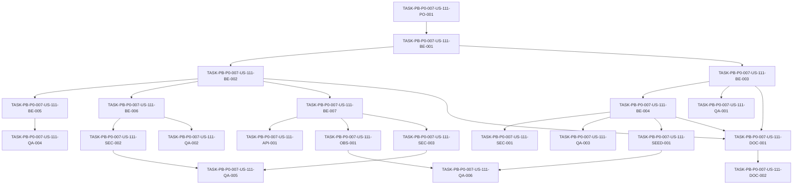

# Development Tasks — PB-P0-007 / US-111: Middleware chain order

## 1. Metadata

| Field | Value |
|---|---|
| User Story ID | US-111 |
| Source User Story | `management/user-stories/US-111-middleware-chain-order.md` |
| Source Technical Specification | `management/technical-specs/P0/PB-P0-007/US-111-technical-spec.md` |
| Decision Resolution Artifact | `management/user-stories/decision-resolutions/US-111-decision-resolution.md` |
| Priority | P0 |
| Backlog ID | PB-P0-007 |
| Backlog Title | Rate Limiting & Middleware Chain |
| Backlog Execution Order | 7 |
| User Story Position in Backlog Item | 2 of 2 |
| Related User Stories in Backlog Item | US-110, US-111 |
| Epic | EPIC-SEC-001 |
| Backlog Item Dependencies | PB-P0-006 |
| Feature | Middleware chain order |
| Module / Domain | Security / Backend Platform |
| Backlog Alignment Status | Found |
| Task Breakdown Status | Ready for Sprint Planning |
| Created Date | 2026-06-16 |
| Last Updated | 2026-06-16 |

---

## 2. Source Validation

| Source | Found | Used | Notes |
|---|---|---|---|
| User Story | Yes | Yes | Approved and ready for development tasks. |
| Technical Specification | Yes | Yes | Primary implementation source. |
| Decision Resolution Artifact | Yes | Yes | Confirms scope, protected order, global order, backend source of truth, and secure error handling. |
| Product Backlog Prioritized | Yes | Yes | Found as `management/artifacts/4-Product-Backlog-Prioritized.md`. |
| ADRs | Yes | Yes | Used through technical spec references, especially ADR-SEC-003 and ADR-SEC-006. |

---

## 3. Backlog Execution Context

### Parent Backlog Item

PB-P0-007 hardens EventFlow against abuse, unsafe middleware composition, missing security headers, and error-handling leaks. US-110 defines rate limiting policies. US-111 ensures the Express middleware chain applies those and other controls in a deterministic, testable, secure order.

### Execution Order Rationale

US-111 is the second story in PB-P0-007 because it validates and hardens the middleware pipeline after rate limit policies are defined by US-110. It depends on PB-P0-006 because cookies/captcha/auth foundations must exist or be stable enough for route composition tests.

### Related User Stories in Same Backlog Item

| User Story | Role in Backlog Item | Suggested Order |
|---|---|---|
| US-110 | Define rate limit estricto para auth y generación IA | 1 |
| US-111 | Define y valida orden seguro de middlewares, Helmet, CORS y error handling | 2 |

---

## 4. Task Breakdown Summary

| Area | Number of Tasks | Notes |
|---|---:|---|
| Product / Analysis | 1 | Confirmar alcance y no-goals frente a US-110/US-109/US-108. |
| Backend | 7 | App composition, route helpers, public sensitive composition, error/notFound placement. |
| API Contract | 1 | Confirmar envelope/status existentes sin crear endpoints nuevos. |
| Security / Authorization | 3 | Backend source of truth, protected order, Helmet/CORS, secure errors. |
| Observability / Audit | 1 | Correlation ID y redacción en request/error logs. |
| QA / Testing | 6 | Unit, integration, API, security, route-order regression y demo smoke. |
| Seed / Demo Data | 1 | Reusar fixtures existentes, sin seed nuevo. |
| Documentation / Traceability | 2 | Documentar cadena global, helper de rutas y notas de alineación. |
| Frontend | 0 | No aplica; no hay UI ni cambios de autorización frontend. |
| Database / Prisma | 0 | No aplica; no hay migrations ni schema changes. |
| AI / PromptOps | 0 | No aplica; no hay provider, prompt ni AIRecommendation changes. |
| DevOps / Environment | 0 | No aplica salvo pruebas CI existentes. |
| **Total** | **22** | Listo para sprint planning. |

---

## 5. Traceability Matrix

| Acceptance Criterion | Technical Spec Section | Task IDs |
|---|---|---|
| AC-01 Global middleware order is deterministic | 6, 7, 12, 13, 18, 19 | TASK-PB-P0-007-US-111-BE-001, TASK-PB-P0-007-US-111-BE-002, TASK-PB-P0-007-US-111-QA-001, TASK-PB-P0-007-US-111-QA-002 |
| AC-02 Protected route order prevents bypass | 6, 7, 12, 13, 18, 19 | TASK-PB-P0-007-US-111-BE-003, TASK-PB-P0-007-US-111-BE-004, TASK-PB-P0-007-US-111-SEC-001, TASK-PB-P0-007-US-111-QA-003, TASK-PB-P0-007-US-111-QA-004 |
| AC-03 Public sensitive routes apply anti-abuse controls | 6, 7, 12, 13, 19 | TASK-PB-P0-007-US-111-BE-005, TASK-PB-P0-007-US-111-QA-004 |
| AC-04 Helmet and CORS are global | 6, 7, 12, 13, 19 | TASK-PB-P0-007-US-111-BE-006, TASK-PB-P0-007-US-111-SEC-002, TASK-PB-P0-007-US-111-QA-002, TASK-PB-P0-007-US-111-QA-005 |
| AC-05 Error handler is always last | 6, 7, 9, 12, 13, 19 | TASK-PB-P0-007-US-111-BE-007, TASK-PB-P0-007-US-111-SEC-003, TASK-PB-P0-007-US-111-API-001, TASK-PB-P0-007-US-111-QA-002, TASK-PB-P0-007-US-111-QA-005 |
| AC-06 Not found middleware position is correct | 6, 7, 9, 13, 19 | TASK-PB-P0-007-US-111-BE-007, TASK-PB-P0-007-US-111-API-001, TASK-PB-P0-007-US-111-QA-002, TASK-PB-P0-007-US-111-QA-005 |
| AC-07 Regression tests fail unsafe reorder | 6, 12, 13, 17, 19 | TASK-PB-P0-007-US-111-QA-001, TASK-PB-P0-007-US-111-QA-003, TASK-PB-P0-007-US-111-QA-004, TASK-PB-P0-007-US-111-QA-005 |
| AC-08 Observability preserves correlation and redaction | 6, 7, 12, 13, 14, 19 | TASK-PB-P0-007-US-111-OBS-001, TASK-PB-P0-007-US-111-SEC-003, TASK-PB-P0-007-US-111-QA-006 |

---

## 6. Development Tasks

### TASK-PB-P0-007-US-111-PO-001 — Confirmar alcance de middleware chain order y no-goals

| Field | Value |
|---|---|
| Area | Product / Analysis |
| Type | Review |
| Priority | Must |
| Estimate | XS |
| Depends On | None |
| Source AC(s) | AC-01, AC-02, AC-03, AC-04, AC-05, AC-06 |
| Technical Spec Section(s) | 2, 3, 4, 16, 18, 19 |
| Backlog ID | PB-P0-007 |
| User Story ID | US-111 |
| Owner Role | Tech Lead |
| Status | To Do |

#### Objective

Alinear al equipo sobre el alcance exacto de US-111 antes de modificar la composición Express.

#### Scope

##### Include

- Confirmar cadena global, orden protegido, public sensitive routes, Helmet, CORS, `notFoundMiddleware` y `errorHandlerMiddleware`.
- Confirmar separación con US-110, US-109 y US-108.
- Confirmar que no hay endpoints, DB, AI ni UI nuevos.

##### Exclude

- Reabrir thresholds/keying de rate limit.
- Reabrir captcha provider o cookie settings.

#### Implementation Notes

Usar la technical spec y decision resolution como fuente primaria. Cualquier diferencia con docs antiguos se maneja como alineación no bloqueante salvo contradicción con ADR aceptada.

#### Acceptance Criteria Covered

AC-01, AC-02, AC-03, AC-04, AC-05, AC-06.

#### Definition of Done

- [ ] Scope y no-goals quedan visibles en sprint planning o task board.
- [ ] US-110 conserva ownership de rate limit policy values.
- [ ] US-109 conserva ownership de captcha provider/eligibility.
- [ ] US-108 conserva ownership de cookies.

---

### TASK-PB-P0-007-US-111-BE-001 — Auditar composición actual de Express y rutas

| Field | Value |
|---|---|
| Area | Backend |
| Type | Review |
| Priority | Must |
| Estimate | S |
| Depends On | TASK-PB-P0-007-US-111-PO-001 |
| Source AC(s) | AC-01, AC-02, AC-03, AC-04, AC-05, AC-06 |
| Technical Spec Section(s) | 5, 7, 17, 18 |
| Backlog ID | PB-P0-007 |
| User Story ID | US-111 |
| Owner Role | Backend |
| Status | To Do |

#### Objective

Identificar el estado real del app factory, middlewares globales y composición de rutas antes de aplicar cambios.

#### Scope

##### Include

- Revisar `app.ts`, `server.ts` o equivalentes.
- Mapear middlewares globales existentes.
- Mapear rutas protegidas y public sensitive routes.
- Detectar composición ad hoc riesgosa.

##### Exclude

- Cambios funcionales de endpoints.
- Refactors fuera de la capa de interface/routing.

#### Implementation Notes

Registrar hallazgos mínimos en PR/task notes para justificar el approach: helper, route registry o invariant tests.

#### Acceptance Criteria Covered

AC-01, AC-02, AC-03, AC-04, AC-05, AC-06.

#### Definition of Done

- [ ] App composition actual queda identificada.
- [ ] Rutas protegidas relevantes quedan identificadas.
- [ ] Public sensitive routes quedan identificadas.
- [ ] Riesgos de orden se convierten en cambios o tests concretos.

---

### TASK-PB-P0-007-US-111-BE-002 — Ajustar cadena global determinística de Express

| Field | Value |
|---|---|
| Area | Backend |
| Type | Implementation |
| Priority | Must |
| Estimate | M |
| Depends On | TASK-PB-P0-007-US-111-BE-001 |
| Source AC(s) | AC-01, AC-04, AC-05, AC-06 |
| Technical Spec Section(s) | 6, 7, 12, 18, 19 |
| Backlog ID | PB-P0-007 |
| User Story ID | US-111 |
| Owner Role | Backend |
| Status | To Do |

#### Objective

Garantizar que la app Express registre middlewares globales en un orden estable y verificable.

#### Scope

##### Include

- `correlationIdMiddleware` antes de logging y rutas.
- `requestLoggerMiddleware` temprano.
- Body parser con límites.
- CORS y Helmet globales.
- Rate limit global o route-aware donde aplique desde US-110.
- Rutas `/api/v1`.
- `notFoundMiddleware` y `errorHandlerMiddleware` al final de la cadena.

##### Exclude

- Definir thresholds/keying de rate limit.
- Cambiar contratos funcionales de endpoints.

#### Implementation Notes

Si el orden final mantiene body parser antes de CORS/Helmet por compatibilidad con Doc 14 o código existente, documentar la razón en tests o notas de PR y asegurar que CORS/Helmet siguen aplicando globalmente.

#### Acceptance Criteria Covered

AC-01, AC-04, AC-05, AC-06.

#### Definition of Done

- [ ] Global chain queda centralizada en un path canónico.
- [ ] Correlation se ejecuta antes de logs y rutas.
- [ ] CORS y Helmet se aplican globalmente.
- [ ] `notFoundMiddleware` y `errorHandlerMiddleware` quedan en posiciones correctas.

---

### TASK-PB-P0-007-US-111-BE-003 — Diseñar helper o convención de composición para rutas protegidas

| Field | Value |
|---|---|
| Area | Backend |
| Type | Implementation |
| Priority | Must |
| Estimate | M |
| Depends On | TASK-PB-P0-007-US-111-BE-001 |
| Source AC(s) | AC-02, AC-07 |
| Technical Spec Section(s) | 5, 7, 12, 17, 18, 19 |
| Backlog ID | PB-P0-007 |
| User Story ID | US-111 |
| Owner Role | Backend |
| Status | To Do |

#### Objective

Reducir el riesgo de rutas protegidas con middlewares en orden inseguro mediante un helper, registry o convención testeable.

#### Scope

##### Include

- Definir composición `auth -> role -> ownership/assignment -> policy -> validation -> handler`.
- Soportar rutas con ownership, assignment o policy opcionales según contrato existente.
- Hacer el orden verificable por unit tests o invariant tests.

##### Exclude

- Reescribir autorización de dominio.
- Crear roles, permissions o ownership rules nuevas.

#### Implementation Notes

Elegir el patrón que mejor encaje con el código existente: `composeProtectedRoute`, route metadata registry o arrays explícitos con invariants. No introducir abstracción si los tests de invariants cubren mejor el riesgo con menos cambio.

#### Acceptance Criteria Covered

AC-02, AC-07.

#### Definition of Done

- [ ] El patrón de composición protegido está definido.
- [ ] `authMiddleware` siempre precede `roleMiddleware`.
- [ ] `roleMiddleware` precede ownership/assignment/policy.
- [ ] `validateRequestMiddleware` no precede auth/authorization en rutas protegidas.

---

### TASK-PB-P0-007-US-111-BE-004 — Migrar rutas protegidas existentes al orden canónico

| Field | Value |
|---|---|
| Area | Backend |
| Type | Implementation |
| Priority | Must |
| Estimate | L |
| Depends On | TASK-PB-P0-007-US-111-BE-003 |
| Source AC(s) | AC-02, AC-07 |
| Technical Spec Section(s) | 7, 9, 12, 13, 18 |
| Backlog ID | PB-P0-007 |
| User Story ID | US-111 |
| Owner Role | Backend |
| Status | To Do |

#### Objective

Aplicar el patrón protegido a las rutas existentes bajo `/api/v1/*` sin cambiar comportamiento funcional.

#### Scope

##### Include

- Rutas que requieren autenticación.
- Rutas que requieren role checks.
- Rutas que requieren ownership o assignment.
- Rutas que requieren policy checks.
- Validación después de auth/authorization en rutas protegidas.

##### Exclude

- Nuevos endpoints.
- Cambios de DTOs funcionales.
- Cambios de business rules.

#### Implementation Notes

Si el repositorio contiene muchas rutas, dividir esta tarea durante sprint execution por módulo sin cambiar el task contract. Mantener PRs revisables.

#### Acceptance Criteria Covered

AC-02, AC-07.

#### Definition of Done

- [ ] Rutas protegidas usan orden canónico.
- [ ] Handlers no ejecutan si auth, role, ownership, assignment o policy fallan.
- [ ] Validación no filtra schemas a usuarios anónimos/no autorizados.
- [ ] No cambian payloads ni status exitosos existentes.

---

### TASK-PB-P0-007-US-111-BE-005 — Verificar composición de rutas públicas sensibles

| Field | Value |
|---|---|
| Area | Backend |
| Type | Implementation |
| Priority | Must |
| Estimate | M |
| Depends On | TASK-PB-P0-007-US-111-BE-001, TASK-PB-P0-007-US-111-BE-002 |
| Source AC(s) | AC-03, AC-07 |
| Technical Spec Section(s) | 7, 9, 12, 13, 18, 19 |
| Backlog ID | PB-P0-007 |
| User Story ID | US-111 |
| Owner Role | Backend |
| Status | To Do |

#### Objective

Asegurar que rutas públicas sensibles ejecuten controles anti-abuse y validación antes del handler, sin usar auth cuando no corresponde.

#### Scope

##### Include

- Auth-sensitive public routes existentes.
- Orden aplicable: rate limit, captcha, validation, handler.
- Confirmar que endpoint eligibility y policy values siguen perteneciendo a US-109/US-110.

##### Exclude

- Cambiar proveedor CAPTCHA.
- Cambiar thresholds/keying de rate limit.
- Agregar CAPTCHA a nuevos endpoints.

#### Implementation Notes

Esta tarea verifica y corrige el orden, no decide qué endpoints requieren CAPTCHA ni rate limit.

#### Acceptance Criteria Covered

AC-03, AC-07.

#### Definition of Done

- [ ] Rutas públicas sensibles no ejecutan handler antes de anti-abuse/validation aplicables.
- [ ] Rutas públicas no reciben `authMiddleware` por accidente.
- [ ] No se modifican thresholds ni provider behavior.

---

### TASK-PB-P0-007-US-111-BE-006 — Verificar Helmet y CORS globales

| Field | Value |
|---|---|
| Area | Backend |
| Type | Implementation |
| Priority | Must |
| Estimate | S |
| Depends On | TASK-PB-P0-007-US-111-BE-002 |
| Source AC(s) | AC-04 |
| Technical Spec Section(s) | 5, 7, 12, 13, 17, 18 |
| Backlog ID | PB-P0-007 |
| User Story ID | US-111 |
| Owner Role | Backend |
| Status | To Do |

#### Objective

Garantizar que Helmet y CORS se apliquen globalmente con configuración alineada a ADR-SEC-006.

#### Scope

##### Include

- Helmet o equivalente en app global.
- CORS allowlist environment-aware.
- Headers de seguridad representativos.
- Sin wildcard en producción o production-like.

##### Exclude

- Crear nueva arquitectura de WAF/API Gateway.
- Cambiar lógica funcional de auth.

#### Implementation Notes

Reusar configuración existente si cumple ADR-SEC-006. Evitar duplicar middlewares por ruta si ya son globales.

#### Acceptance Criteria Covered

AC-04.

#### Definition of Done

- [ ] Helmet headers aparecen en respuestas representativas.
- [ ] CORS usa allowlist según entorno.
- [ ] No hay wildcard productivo.
- [ ] Tests cubren configuración global.

---

### TASK-PB-P0-007-US-111-BE-007 — Asegurar notFound y errorHandler en posiciones finales

| Field | Value |
|---|---|
| Area | Backend |
| Type | Implementation |
| Priority | Must |
| Estimate | M |
| Depends On | TASK-PB-P0-007-US-111-BE-002 |
| Source AC(s) | AC-05, AC-06, AC-08 |
| Technical Spec Section(s) | 7, 9, 12, 13, 18, 19 |
| Backlog ID | PB-P0-007 |
| User Story ID | US-111 |
| Owner Role | Backend |
| Status | To Do |

#### Objective

Garantizar que unknown routes y errores pasen por handlers seguros en el orden correcto.

#### Scope

##### Include

- `notFoundMiddleware` después de todas las rutas.
- `errorHandlerMiddleware` último.
- Error envelope seguro con `correlationId`.
- Sin stacks, secrets, tokens, cookies, prompts o PII en respuestas.

##### Exclude

- Rediseñar todos los códigos de error del API.
- Crear nuevo contrato API.

#### Implementation Notes

Preservar 401, 403, 404, 400, 429 y 500 existentes. Cambiar sólo lo necesario para cumplir safe envelope y posición final.

#### Acceptance Criteria Covered

AC-05, AC-06, AC-08.

#### Definition of Done

- [ ] Unknown route retorna 404 seguro con `correlationId`.
- [ ] Errores inesperados retornan envelope seguro.
- [ ] `errorHandlerMiddleware` queda último.
- [ ] No hay exposición de stack o datos sensibles.

---

### TASK-PB-P0-007-US-111-API-001 — Validar contrato de errores sin cambios de endpoints

| Field | Value |
|---|---|
| Area | API Contract |
| Type | Validation |
| Priority | Must |
| Estimate | S |
| Depends On | TASK-PB-P0-007-US-111-BE-007 |
| Source AC(s) | AC-05, AC-06 |
| Technical Spec Section(s) | 8, 9, 12, 13 |
| Backlog ID | PB-P0-007 |
| User Story ID | US-111 |
| Owner Role | Backend |
| Status | To Do |

#### Objective

Confirmar que US-111 mantiene contratos de endpoints y sólo endurece errores/status existentes.

#### Scope

##### Include

- 401 para anonymous protected access.
- 403 para role/permission failure.
- 404 para unknown routes y masked ownership cuando aplique.
- 400 sólo después de auth/authorization en protected routes.
- 429 donde US-110 aplique.
- 500 seguro.

##### Exclude

- Nuevos endpoints.
- Nuevos payload fields.
- OpenAPI feature expansion.

#### Implementation Notes

Si OpenAPI snapshot refleja error envelope común, actualizarlo sólo si el proyecto lo requiere como consecuencia de US-111.

#### Acceptance Criteria Covered

AC-05, AC-06.

#### Definition of Done

- [ ] No se agregan endpoints.
- [ ] Error envelope conserva `correlationId`.
- [ ] Protected invalid anonymous request retorna 401 antes que 400.
- [ ] Unknown route retorna 404 seguro.

---

### TASK-PB-P0-007-US-111-SEC-001 — Validar backend source of truth en rutas protegidas

| Field | Value |
|---|---|
| Area | Security / Authorization |
| Type | Validation |
| Priority | Must |
| Estimate | M |
| Depends On | TASK-PB-P0-007-US-111-BE-004 |
| Source AC(s) | AC-02, AC-07 |
| Technical Spec Section(s) | 5, 7, 12, 13 |
| Backlog ID | PB-P0-007 |
| User Story ID | US-111 |
| Owner Role | Backend |
| Status | To Do |

#### Objective

Verificar que auth, role, ownership, assignment y policy se aplican en backend antes del handler.

#### Scope

##### Include

- Negative scenarios para missing auth.
- Insufficient role.
- Failed ownership/assignment.
- Policy rejection.
- Handler not called.

##### Exclude

- Suite completa transversal de RBAC/ownership de US-112.
- Cambios de roles/permisos.

#### Implementation Notes

Esta tarea puede apoyarse en spies o handlers de prueba para demostrar short-circuit.

#### Acceptance Criteria Covered

AC-02, AC-07.

#### Definition of Done

- [ ] Missing auth retorna 401 antes de role/ownership/validation/handler.
- [ ] Role failure retorna 403 antes de ownership/validation/handler.
- [ ] Ownership/assignment failure corta antes de validation/handler.
- [ ] Frontend no se usa como enforcement.

---

### TASK-PB-P0-007-US-111-SEC-002 — Validar configuración segura de Helmet y CORS

| Field | Value |
|---|---|
| Area | Security / Authorization |
| Type | Validation |
| Priority | Must |
| Estimate | S |
| Depends On | TASK-PB-P0-007-US-111-BE-006 |
| Source AC(s) | AC-04 |
| Technical Spec Section(s) | 5, 7, 12, 13, 17 |
| Backlog ID | PB-P0-007 |
| User Story ID | US-111 |
| Owner Role | Backend |
| Status | To Do |

#### Objective

Validar que los headers de seguridad y restricciones CORS cumplen ADR-SEC-006.

#### Scope

##### Include

- HSTS/X-Content-Type-Options/Referrer-Policy/X-Frame-Options/CSP básica cuando aplique.
- CORS allowlist explícita.
- Sin wildcard en production-like.

##### Exclude

- WAF/API Gateway.
- OAuth/MFA/SSO.

#### Implementation Notes

Si algún header específico no aplica por entorno local/test, documentar el motivo y cubrir producción-like.

#### Acceptance Criteria Covered

AC-04.

#### Definition of Done

- [ ] Headers de seguridad esperados están presentes.
- [ ] CORS no permite wildcard productivo.
- [ ] Config insegura falla o queda bloqueada por tests.

---

### TASK-PB-P0-007-US-111-SEC-003 — Validar errores seguros y redacción

| Field | Value |
|---|---|
| Area | Security / Authorization |
| Type | Validation |
| Priority | Must |
| Estimate | M |
| Depends On | TASK-PB-P0-007-US-111-BE-007, TASK-PB-P0-007-US-111-OBS-001 |
| Source AC(s) | AC-05, AC-08 |
| Technical Spec Section(s) | 7, 9, 12, 13, 14, 17 |
| Backlog ID | PB-P0-007 |
| User Story ID | US-111 |
| Owner Role | Backend |
| Status | To Do |

#### Objective

Asegurar que errores y logs preservan trazabilidad sin exponer información sensible.

#### Scope

##### Include

- No stack traces en production-like responses.
- No SQL internals.
- No secrets, tokens, cookies, prompts, provider payloads ni PII.
- `correlationId` en responses y logs.

##### Exclude

- Nuevo sistema de auditoría.
- Persistencia de eventos en DB.

#### Implementation Notes

Reutilizar helpers de redacción existentes. Coordinar con US-110 para no duplicar reglas de redacción de rate limit.

#### Acceptance Criteria Covered

AC-05, AC-08.

#### Definition of Done

- [ ] Error envelope incluye `correlationId`.
- [ ] Responses no exponen stack ni datos sensibles.
- [ ] Logs de error tienen redacción.
- [ ] No se introduce `AdminAction` ni `AIRecommendation` audit event nuevo.

---

### TASK-PB-P0-007-US-111-OBS-001 — Verificar correlation ID en toda la cadena

| Field | Value |
|---|---|
| Area | Observability / Audit |
| Type | Implementation |
| Priority | Must |
| Estimate | S |
| Depends On | TASK-PB-P0-007-US-111-BE-002, TASK-PB-P0-007-US-111-BE-007 |
| Source AC(s) | AC-01, AC-08 |
| Technical Spec Section(s) | 7, 12, 13, 14, 18 |
| Backlog ID | PB-P0-007 |
| User Story ID | US-111 |
| Owner Role | Backend |
| Status | To Do |

#### Objective

Garantizar que cada request obtiene o preserva `correlationId` y que logs/errores lo mantienen.

#### Scope

##### Include

- Success paths.
- Auth/authorization rejection paths.
- Validation errors.
- Not found.
- Unexpected errors.
- Request and error logs.

##### Exclude

- Nuevo tracing distribuido.
- Métricas avanzadas.

#### Implementation Notes

Correlation debe ejecutarse antes de logging y rutas. Si el cliente envía un correlation ID válido, preservar según política existente.

#### Acceptance Criteria Covered

AC-01, AC-08.

#### Definition of Done

- [ ] Cada request tiene `correlationId`.
- [ ] Request logs incluyen `correlationId`.
- [ ] Error logs incluyen `correlationId`.
- [ ] Rejections preservan trazabilidad sin datos sensibles.

---

### TASK-PB-P0-007-US-111-QA-001 — Agregar unit tests para helper o invariants de composición

| Field | Value |
|---|---|
| Area | QA / Testing |
| Type | Test |
| Priority | Must |
| Estimate | M |
| Depends On | TASK-PB-P0-007-US-111-BE-003 |
| Source AC(s) | AC-01, AC-02, AC-07 |
| Technical Spec Section(s) | 7, 12, 13, 17, 19 |
| Backlog ID | PB-P0-007 |
| User Story ID | US-111 |
| Owner Role | QA |
| Status | To Do |

#### Objective

Probar que el helper, registry o invariants impiden ordenar rutas protegidas de forma insegura.

#### Scope

##### Include

- Role sin auth falla.
- Ownership/assignment antes de auth falla.
- Validation antes de auth en protected route falla.
- Handler queda al final.

##### Exclude

- Tests end-to-end de UI.
- Verificación de reglas de negocio específicas.

#### Implementation Notes

Preferir pruebas sobre helper output o comportamiento observable. Inspeccionar internals de Express sólo si no hay alternativa estable.

#### Acceptance Criteria Covered

AC-01, AC-02, AC-07.

#### Definition of Done

- [ ] Tests fallan ante orden protegido inseguro.
- [ ] Tests son determinísticos en CI.
- [ ] No dependen innecesariamente de internals frágiles.

---

### TASK-PB-P0-007-US-111-QA-002 — Agregar integration tests de app composition global

| Field | Value |
|---|---|
| Area | QA / Testing |
| Type | Test |
| Priority | Must |
| Estimate | M |
| Depends On | TASK-PB-P0-007-US-111-BE-002, TASK-PB-P0-007-US-111-BE-006, TASK-PB-P0-007-US-111-BE-007 |
| Source AC(s) | AC-01, AC-04, AC-05, AC-06 |
| Technical Spec Section(s) | 7, 12, 13, 19 |
| Backlog ID | PB-P0-007 |
| User Story ID | US-111 |
| Owner Role | QA |
| Status | To Do |

#### Objective

Validar con la app real que la cadena global aplica correlation, logging, Helmet, CORS, rutas, notFound y errorHandler correctamente.

#### Scope

##### Include

- Correlation antes de logs/rutas.
- Helmet presente en respuestas representativas.
- CORS allowlist.
- `notFoundMiddleware` después de rutas.
- `errorHandlerMiddleware` último.

##### Exclude

- Thresholds de rate limit.
- Provider CAPTCHA.

#### Implementation Notes

Usar Supertest o test harness equivalente sobre app factory real.

#### Acceptance Criteria Covered

AC-01, AC-04, AC-05, AC-06.

#### Definition of Done

- [ ] Global order queda cubierto por tests.
- [ ] Helmet/CORS quedan cubiertos por tests.
- [ ] notFound/errorHandler quedan cubiertos por tests.
- [ ] Tests corren en CI.

---

### TASK-PB-P0-007-US-111-QA-003 — Agregar API regression tests de protected short-circuit

| Field | Value |
|---|---|
| Area | QA / Testing |
| Type | Test |
| Priority | Must |
| Estimate | M |
| Depends On | TASK-PB-P0-007-US-111-BE-004, TASK-PB-P0-007-US-111-SEC-001 |
| Source AC(s) | AC-02, AC-07 |
| Technical Spec Section(s) | 9, 12, 13, 17, 19 |
| Backlog ID | PB-P0-007 |
| User Story ID | US-111 |
| Owner Role | QA |
| Status | To Do |

#### Objective

Probar que rutas protegidas rechazan antes de validation/handler cuando auth, role, ownership o policy fallan.

#### Scope

##### Include

- Anonymous invalid body retorna 401 antes que 400.
- Authenticated user without role and invalid body retorna 403 antes que 400.
- Wrong ownership and invalid body retorna safe 403 o masked 404 antes que 400.
- Handler spy no se ejecuta cuando falla un gate previo.

##### Exclude

- Suite completa de permisos de US-112.
- Cambios de schemas de request.

#### Implementation Notes

Usar fixtures existentes o test routes internas si el códigobase las permite. Mantener los tests enfocados en orden, no en reglas de dominio exhaustivas.

#### Acceptance Criteria Covered

AC-02, AC-07.

#### Definition of Done

- [ ] Anonymous invalid protected request no retorna 400.
- [ ] Role failure corta antes de validation.
- [ ] Ownership failure corta antes de validation.
- [ ] Handler no se ejecuta después de rechazo.

---

### TASK-PB-P0-007-US-111-QA-004 — Agregar regression tests para public sensitive routes

| Field | Value |
|---|---|
| Area | QA / Testing |
| Type | Test |
| Priority | Must |
| Estimate | M |
| Depends On | TASK-PB-P0-007-US-111-BE-005 |
| Source AC(s) | AC-03, AC-07 |
| Technical Spec Section(s) | 7, 9, 12, 13, 19 |
| Backlog ID | PB-P0-007 |
| User Story ID | US-111 |
| Owner Role | QA |
| Status | To Do |

#### Objective

Validar que rutas públicas sensibles ejecutan anti-abuse/validation aplicables antes del handler.

#### Scope

##### Include

- Auth public routes cubiertas por US-109/US-110 cuando existan.
- Invalid payload no ejecuta handler.
- Applicable rate limit/CAPTCHA middleware se ubica antes del handler.

##### Exclude

- Decidir nuevos endpoints elegibles para CAPTCHA.
- Testear thresholds de rate limit.

#### Implementation Notes

Usar mocks/spies para comprobar que el handler no se ejecuta cuando un middleware aplicable rechaza.

#### Acceptance Criteria Covered

AC-03, AC-07.

#### Definition of Done

- [ ] Public sensitive handlers no ejecutan antes de controles aplicables.
- [ ] Rutas públicas sensibles no usan auth por accidente.
- [ ] Tests no reabren provider/threshold decisions.

---

### TASK-PB-P0-007-US-111-QA-005 — Agregar security tests de Helmet, CORS y safe errors

| Field | Value |
|---|---|
| Area | QA / Testing |
| Type | Test |
| Priority | Must |
| Estimate | M |
| Depends On | TASK-PB-P0-007-US-111-SEC-002, TASK-PB-P0-007-US-111-SEC-003 |
| Source AC(s) | AC-04, AC-05, AC-06, AC-07 |
| Technical Spec Section(s) | 12, 13, 17, 19 |
| Backlog ID | PB-P0-007 |
| User Story ID | US-111 |
| Owner Role | QA |
| Status | To Do |

#### Objective

Cubrir regresiones de headers de seguridad, CORS y error envelope seguro.

#### Scope

##### Include

- Helmet headers presentes.
- CORS no wildcard en production-like.
- Unknown route 404 con `correlationId`.
- Unexpected error 500 seguro.
- No stack/secrets/tokens/cookies/prompts/PII en response.

##### Exclude

- Pentest completo.
- WAF/API Gateway.

#### Implementation Notes

Simular production-like config para los tests de headers/CORS si el entorno local permite defaults laxos.

#### Acceptance Criteria Covered

AC-04, AC-05, AC-06, AC-07.

#### Definition of Done

- [ ] Security headers quedan cubiertos.
- [ ] CORS production-like queda cubierto.
- [ ] 404/500 seguros quedan cubiertos.
- [ ] Error responses no exponen datos sensibles.

---

### TASK-PB-P0-007-US-111-QA-006 — Agregar tests de correlation, redacción y demo smoke

| Field | Value |
|---|---|
| Area | QA / Testing |
| Type | Test |
| Priority | Must |
| Estimate | M |
| Depends On | TASK-PB-P0-007-US-111-OBS-001, TASK-PB-P0-007-US-111-SEED-001 |
| Source AC(s) | AC-08 |
| Technical Spec Section(s) | 13, 14, 15, 19 |
| Backlog ID | PB-P0-007 |
| User Story ID | US-111 |
| Owner Role | QA |
| Status | To Do |

#### Objective

Verificar correlation ID y redacción en paths representativos, y validar smoke demo sin seed nuevo.

#### Scope

##### Include

- Success path con `correlationId`.
- Auth rejection con `correlationId`.
- Validation/error path con `correlationId`.
- Logs sin datos sensibles.
- Smoke con usuario permitido, usuario no autorizado y unknown route usando fixtures existentes.

##### Exclude

- Nuevo seed.
- E2E UI obligatorio.

#### Implementation Notes

Los tests pueden usar spies del logger y fixtures existentes. No introducir persistencia de audit por esta historia.

#### Acceptance Criteria Covered

AC-08.

#### Definition of Done

- [ ] Responses y logs preservan `correlationId`.
- [ ] Logs redactan datos sensibles.
- [ ] Smoke demo usa fixtures existentes.
- [ ] No se agregan seed files ni migrations.

---

### TASK-PB-P0-007-US-111-SEED-001 — Confirmar fixtures existentes para smoke y regression tests

| Field | Value |
|---|---|
| Area | Seed / Demo Data |
| Type | Validation |
| Priority | Should |
| Estimate | XS |
| Depends On | TASK-PB-P0-007-US-111-BE-004 |
| Source AC(s) | AC-02, AC-06, AC-08 |
| Technical Spec Section(s) | 13, 15, 19 |
| Backlog ID | PB-P0-007 |
| User Story ID | US-111 |
| Owner Role | QA |
| Status | To Do |

#### Objective

Confirmar que las pruebas y smoke checks pueden usar fixtures existentes sin crear seed nuevo.

#### Scope

##### Include

- Anonymous request fixture.
- Authenticated allowed user.
- Authenticated disallowed role.
- Authenticated wrong owner/assignment.
- Unknown route smoke.

##### Exclude

- Seed data nuevo.
- Migraciones.

#### Implementation Notes

Si falta fixture, crearlo dentro del test setup, no en seed demo persistente, salvo que ya exista patrón para fixtures temporales.

#### Acceptance Criteria Covered

AC-02, AC-06, AC-08.

#### Definition of Done

- [ ] No hay cambios de seed requeridos.
- [ ] Regression tests tienen fixtures suficientes.
- [ ] Demo smoke puede ejecutarse con datos existentes.

---

### TASK-PB-P0-007-US-111-DOC-001 — Documentar cadena global y patrón de rutas protegidas

| Field | Value |
|---|---|
| Area | Documentation / Traceability |
| Type | Documentation |
| Priority | Must |
| Estimate | S |
| Depends On | TASK-PB-P0-007-US-111-BE-002, TASK-PB-P0-007-US-111-BE-003, TASK-PB-P0-007-US-111-BE-004 |
| Source AC(s) | AC-01, AC-02, AC-03, AC-04, AC-05, AC-06 |
| Technical Spec Section(s) | 16, 18, 19 |
| Backlog ID | PB-P0-007 |
| User Story ID | US-111 |
| Owner Role | Tech Lead |
| Status | To Do |

#### Objective

Actualizar documentación backend para que nuevas rutas sigan el orden seguro.

#### Scope

##### Include

- Cadena global final.
- Patrón/helper para rutas protegidas.
- Patrón para rutas públicas sensibles.
- Ubicación de `notFoundMiddleware` y `errorHandlerMiddleware`.
- Nota de backend source of truth.

##### Exclude

- Thresholds rate limit.
- Captcha provider setup.
- Cookie settings.

#### Implementation Notes

Documentar en el lugar usado por el equipo para backend route guidelines o middleware documentation.

#### Acceptance Criteria Covered

AC-01, AC-02, AC-03, AC-04, AC-05, AC-06.

#### Definition of Done

- [ ] Docs muestran cadena global final.
- [ ] Docs muestran orden protegido canónico.
- [ ] Docs advierten que validation no precede auth en rutas protegidas.
- [ ] Docs no duplican decisiones de US-110/US-109/US-108.

---

### TASK-PB-P0-007-US-111-DOC-002 — Registrar notas de alineación documental no bloqueantes

| Field | Value |
|---|---|
| Area | Documentation / Traceability |
| Type | Documentation |
| Priority | Should |
| Estimate | XS |
| Depends On | TASK-PB-P0-007-US-111-DOC-001 |
| Source AC(s) | AC-01, AC-03, AC-04 |
| Technical Spec Section(s) | 16 |
| Backlog ID | PB-P0-007 |
| User Story ID | US-111 |
| Owner Role | Tech Lead |
| Status | To Do |

#### Objective

Registrar las diferencias no bloqueantes entre PB-P0-007, Doc 14 y la separación US-110/US-111.

#### Scope

##### Include

- PB-P0-007 agrupa rate limiting, middleware order y Helmet.
- US-110 cubre policy values; US-111 cubre chain order.
- Doc 14 contiene orden global completo; backlog resume orden protegido.
- CAPTCHA eligibility pertenece a US-109.

##### Exclude

- Crear scope nuevo.
- Cambiar decisiones aprobadas.

#### Implementation Notes

Esta tarea es de trazabilidad. No debe generar implementación nueva.

#### Acceptance Criteria Covered

AC-01, AC-03, AC-04.

#### Definition of Done

- [ ] Notas de alineación quedan registradas.
- [ ] No se expande scope de US-111.
- [ ] Se mantiene separación con US-110, US-109 y US-108.

---

## 7. Required QA Tasks

| Task ID | Test Type | Purpose |
|---|---|---|
| TASK-PB-P0-007-US-111-QA-001 | Unit / Invariant | Probar helper/registry/invariants de composición protegida. |
| TASK-PB-P0-007-US-111-QA-002 | Integration / App Composition | Validar cadena global, Helmet, CORS, notFound y errorHandler con app real. |
| TASK-PB-P0-007-US-111-QA-003 | API Regression | Validar short-circuit protegido y 401/403/404 antes de 400. |
| TASK-PB-P0-007-US-111-QA-004 | API Regression | Validar orden de public sensitive routes sin reabrir policy/provider decisions. |
| TASK-PB-P0-007-US-111-QA-005 | Security Regression | Validar headers, CORS y safe error envelope. |
| TASK-PB-P0-007-US-111-QA-006 | Observability / Demo | Validar correlation ID, redacción y smoke con fixtures existentes. |

---

## 8. Required Security Tasks

| Task ID | Security Concern | Purpose |
|---|---|---|
| TASK-PB-P0-007-US-111-SEC-001 | Backend source of truth | Validar auth, role, ownership, assignment y policy antes del handler. |
| TASK-PB-P0-007-US-111-SEC-002 | Security headers / CORS | Validar Helmet y allowlist CORS según ADR-SEC-006. |
| TASK-PB-P0-007-US-111-SEC-003 | Secure errors / redaction | Validar error envelope con `correlationId` y sin datos sensibles. |
| TASK-PB-P0-007-US-111-QA-003 | Authorization short-circuit | Probar que validation/handler no corren antes de authz. |
| TASK-PB-P0-007-US-111-QA-005 | Security regression | Probar headers, CORS, 404/500 seguros. |

---

## 9. Required Seed / Demo Tasks

| Task ID | Seed/Demo Concern | Purpose |
|---|---|---|
| TASK-PB-P0-007-US-111-SEED-001 | Fixtures existing | Confirmar que no se requiere seed nuevo para tests/smoke. |
| TASK-PB-P0-007-US-111-QA-006 | Demo smoke | Validar success, unauthorized y unknown route con fixtures existentes. |

---

## 10. Observability / Audit Tasks

| Task ID | Concern | Purpose |
|---|---|---|
| TASK-PB-P0-007-US-111-OBS-001 | Correlation ID | Preservar `correlationId` en requests, logs y errores. |
| TASK-PB-P0-007-US-111-SEC-003 | Redaction | Evitar exposición de stack, secrets, tokens, cookies, prompts y PII. |
| TASK-PB-P0-007-US-111-QA-006 | Observability regression | Probar correlation y redacción en paths representativos. |

---

## 11. Documentation / Traceability Tasks

| Task ID | Document / Artifact | Purpose |
|---|---|---|
| TASK-PB-P0-007-US-111-DOC-001 | Backend route/middleware docs | Documentar cadena global y patrón protegido. |
| TASK-PB-P0-007-US-111-DOC-002 | Traceability notes | Registrar alineación no bloqueante entre PB, Doc 14 y separación de historias. |

---

## 12. Dependency Graph

---

## 13. Suggested Implementation Order

### Phase 1 — Foundation

1. TASK-PB-P0-007-US-111-PO-001
2. TASK-PB-P0-007-US-111-BE-001
3. TASK-PB-P0-007-US-111-BE-002
4. TASK-PB-P0-007-US-111-BE-003
5. TASK-PB-P0-007-US-111-QA-001

### Phase 2 — Core Implementation

1. TASK-PB-P0-007-US-111-BE-004
2. TASK-PB-P0-007-US-111-BE-005
3. TASK-PB-P0-007-US-111-BE-006
4. TASK-PB-P0-007-US-111-BE-007
5. TASK-PB-P0-007-US-111-API-001

### Phase 3 — Validation / Security / QA

1. TASK-PB-P0-007-US-111-SEC-001
2. TASK-PB-P0-007-US-111-SEC-002
3. TASK-PB-P0-007-US-111-OBS-001
4. TASK-PB-P0-007-US-111-SEC-003
5. TASK-PB-P0-007-US-111-QA-002
6. TASK-PB-P0-007-US-111-QA-003
7. TASK-PB-P0-007-US-111-QA-004
8. TASK-PB-P0-007-US-111-QA-005
9. TASK-PB-P0-007-US-111-QA-006

### Phase 4 — Documentation / Review

1. TASK-PB-P0-007-US-111-SEED-001
2. TASK-PB-P0-007-US-111-DOC-001
3. TASK-PB-P0-007-US-111-DOC-002

---

## 14. Risks & Mitigations

| Risk | Impact | Mitigation | Related Task |
| ---- | ------ | ---------- | ------------ |
| Middleware arrays siguen ad hoc | Nuevas rutas pueden omitir auth o validar antes de auth | Helper/registry o invariant tests | TASK-PB-P0-007-US-111-BE-003 |
| Tests dependen de internals frágiles de Express | Suite quebradiza ante refactors | Preferir helper output y comportamiento observable | TASK-PB-P0-007-US-111-QA-001 |
| Validation corre antes de auth | Fuga de schema/endpoint a usuarios anónimos | API regression tests 401/403 antes de 400 | TASK-PB-P0-007-US-111-QA-003 |
| Error handler no queda último | Error leaks o envelope inconsistente | App composition tests y safe error tests | TASK-PB-P0-007-US-111-BE-007 |
| Helmet/CORS deshabilitados por entorno | Headers/origin policy inseguros | Tests production-like y validación ADR-SEC-006 | TASK-PB-P0-007-US-111-SEC-002 |
| US-111 reabre US-110 policy values | Scope creep e inconsistencias | Scope confirmation y docs de separación | TASK-PB-P0-007-US-111-PO-001 |

---

## 15. Out of Scope Confirmation

The following items must not be implemented as part of US-111:

- Rate limit thresholds, windows, keying, storage backend, or per-endpoint policy values; owned by US-110.
- CAPTCHA provider selection, token lifecycle, score policy, or endpoint eligibility; owned by US-109.
- HttpOnly cookie configuration or auth cookie migration; owned by US-108.
- New API endpoints or domain business behavior.
- Database schema changes, Prisma migrations, repositories, transactions, or audit tables.
- AI provider, prompt, model, RAG, vector DB, `AIRecommendation`, or autonomous AI behavior.
- WAF, API Gateway, enterprise Redis architecture, OAuth, MFA, SSO, native mobile apps, payments, contracts, marketplace transaction logic, WhatsApp integration, or real-time chat.
- Frontend authorization source of truth or new UI screens.

---

## 16. Readiness for Sprint Planning

| Check                                      | Status            |
| ------------------------------------------ | ----------------- |
| Product Backlog mapping found              | Pass |
| Every AC maps to tasks                     | Pass |
| Technical Spec used when available         | Pass |
| QA tasks included                          | Pass |
| Security tasks included if applicable      | Pass |
| Seed/demo tasks included if applicable     | Pass |
| Observability tasks included if applicable | Pass |
| Documentation tasks included if applicable | Pass |
| Task dependencies clear                    | Pass |
| Tasks small enough                         | Pass |
| Ready for Sprint Planning                  | Yes |

---

## 17. Final Recommendation

Ready for Sprint Planning.

US-111 can move into implementation as the second story under PB-P0-007. The task set is scoped to deterministic Express middleware order, protected and public sensitive route composition, Helmet/CORS global application, secure not-found/error handling, correlation preservation, and regression tests. It intentionally excludes rate limit policy values, CAPTCHA provider behavior, cookie settings, database work, AI changes, frontend authorization, and new endpoints.
