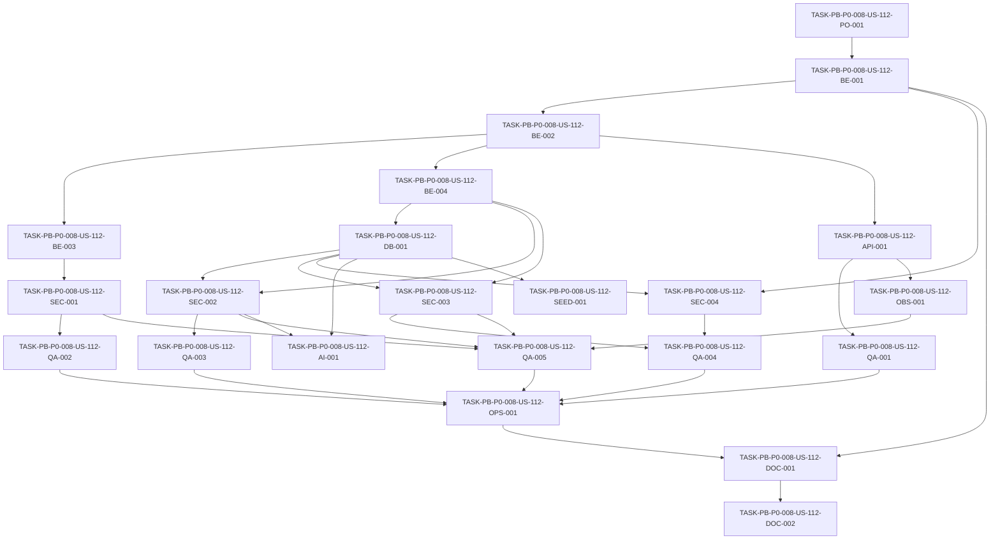

# Development Tasks — PB-P0-008 / US-112: Suite negativa RBAC + ownership

## 1. Metadata

| Field | Value |
|---|---|
| User Story ID | US-112 |
| Source User Story | `management/user-stories/US-112-negative-rbac-ownership-tests.md` |
| Source Technical Specification | `management/technical-specs/P0/PB-P0-008/US-112-technical-spec.md` |
| Decision Resolution Artifact | No aplica - no existe artifact; se usa `PO/BA Decisions Applied` de la User Story aprobada |
| Priority | P0 |
| Backlog ID | PB-P0-008 |
| Backlog Title | RBAC + Ownership Negative Tests |
| Backlog Execution Order | 8 |
| User Story Position in Backlog Item | 1 of 1 |
| Related User Stories in Backlog Item | US-112 |
| Epic | EPIC-SEC-001 |
| Backlog Item Dependencies | PB-P0-004, PB-P0-006 |
| Feature | Negative tests RBAC + ownership |
| Module / Domain | Security / QA |
| Backlog Alignment Status | Found |
| Task Breakdown Status | Ready for Sprint Planning |
| Created Date | 2026-06-16 |
| Last Updated | 2026-06-16 |

---

## 2. Source Validation

| Source | Found | Used | Notes |
|---|---|---|---|
| User Story | Yes | Yes | Approved and ready for development tasks. |
| Technical Specification | Yes | Yes | Primary source for task generation. |
| Decision Resolution Artifact | No | No | No artifact exists; approved User Story decisions are sufficient. |
| Product Backlog Prioritized | Yes | Yes | Found as `management/artifacts/4-Product-Backlog-Prioritized.md`. |
| ADRs | Yes | Yes | Used through spec references, especially ADR-SEC-003 and ADR-SEC-001. |

---

## 3. Backlog Execution Context

### Parent Backlog Item

PB-P0-008 creates the mandatory negative authorization suite for EventFlow foundation endpoints. It validates that protected backend routes reject anonymous users, wrong roles, cross-owner access, invalid vendor assignment, and unauthorized admin access with safe `401/403/404` responses.

### Execution Order Rationale

PB-P0-008 follows PB-P0-004, PB-P0-006, and PB-P0-007 because the suite needs foundation endpoints, session/cookie controls, and secure middleware ordering to be in place or available in parallel. It is a P0 quality gate: failing negative authorization tests must block merge.

### Related User Stories in Same Backlog Item

| User Story | Role in Backlog Item | Suggested Order |
|---|---|---|
| US-112 | Build mandatory P0 negative RBAC, ownership, and assignment test suite | 1 |

---

## 4. Task Breakdown Summary

| Area | Number of Tasks | Notes |
|---|---:|---|
| Product / Analysis | 1 | Confirm scope and coverage split with PB-P2-018. |
| Backend | 4 | Test registry, app harness, session helpers, factories. |
| API Contract | 1 | Error envelope/status assertion helpers. |
| Database / Prisma | 1 | Test data isolation and no-side-effect helpers. |
| AI / PromptOps | 1 | No-call/no-persistence tests for protected AI endpoints. |
| Security / Authorization | 4 | RBAC, ownership, assignment, admin scope, no leaks. |
| QA / Testing | 5 | API suites and regression coverage. |
| Seed / Demo Data | 1 | Confirm no persistent seed/demo impact. |
| DevOps / Environment | 1 | CI quality gate integration. |
| Documentation / Traceability | 2 | Coverage registry and P0/P2 split docs. |
| Frontend | 0 | No aplica. |
| Observability / Audit | 1 | Correlation/log redaction assertions. |
| **Total** | **22** | Ready for sprint planning. |

---

## 5. Traceability Matrix

| Acceptance Criterion | Technical Spec Section | Task IDs |
|---|---|---|
| AC-01 Anonymous protected access returns 401 | 6, 7, 9, 12, 13 | TASK-PB-P0-008-US-112-BE-001, TASK-PB-P0-008-US-112-BE-002, TASK-PB-P0-008-US-112-QA-001 |
| AC-02 Wrong role returns 403 | 6, 7, 9, 12, 13 | TASK-PB-P0-008-US-112-BE-003, TASK-PB-P0-008-US-112-SEC-001, TASK-PB-P0-008-US-112-QA-002 |
| AC-03 Cross-organizer ownership is rejected | 6, 7, 10, 12, 13 | TASK-PB-P0-008-US-112-BE-004, TASK-PB-P0-008-US-112-SEC-002, TASK-PB-P0-008-US-112-QA-003 |
| AC-04 Cross-vendor assignment is rejected | 6, 7, 10, 12, 13 | TASK-PB-P0-008-US-112-BE-004, TASK-PB-P0-008-US-112-SEC-003, TASK-PB-P0-008-US-112-QA-004 |
| AC-05 Admin scope is enforced | 6, 7, 10, 12, 14 | TASK-PB-P0-008-US-112-SEC-004, TASK-PB-P0-008-US-112-QA-004 |
| AC-06 Validation does not run before authorization | 6, 7, 12, 13 | TASK-PB-P0-008-US-112-QA-005, TASK-PB-P0-008-US-112-SEC-001, TASK-PB-P0-008-US-112-SEC-002, TASK-PB-P0-008-US-112-SEC-003 |
| AC-07 Error envelopes are safe and consistent | 6, 9, 12, 13, 14 | TASK-PB-P0-008-US-112-API-001, TASK-PB-P0-008-US-112-OBS-001, TASK-PB-P0-008-US-112-QA-005 |
| AC-08 CI blocks merge when negative auth tests fail | 13, 18, 19 | TASK-PB-P0-008-US-112-OPS-001, TASK-PB-P0-008-US-112-DOC-001 |

---

## 6. Development Tasks

### TASK-PB-P0-008-US-112-PO-001 — Confirmar alcance P0 y split con PB-P2-018

| Field | Value |
|---|---|
| Area | Product / Analysis |
| Type | Review |
| Priority | Must |
| Estimate | XS |
| Depends On | None |
| Source AC(s) | AC-01, AC-02, AC-03, AC-04, AC-05, AC-08 |
| Technical Spec Section(s) | 2, 3, 4, 16, 18, 19 |
| Backlog ID | PB-P0-008 |
| User Story ID | US-112 |
| Owner Role | Tech Lead |
| Status | To Do |

#### Objective

Confirmar que US-112 cubre la suite negativa foundation P0 y que la cobertura exhaustiva por dominios posteriores queda en PB-P2-018 / US-130.

#### Scope

##### Include

- Confirmar endpoints foundation cubiertos por PB-P0-004.
- Confirmar criterios mínimos de cobertura P0.
- Confirmar que fallos de la suite bloquean merge.

##### Exclude

- Cobertura extendida P2.
- Cambios de permisos, endpoints o reglas de negocio.

#### Implementation Notes

Usar la technical spec y la User Story aprobada como fuentes. No reabrir el split P0/P2 salvo contradicción directa con un ADR aceptado.

#### Acceptance Criteria Covered

AC-01, AC-02, AC-03, AC-04, AC-05, AC-08.

#### Definition of Done

- [ ] Scope P0 queda visible en planning o task board.
- [ ] PB-P2-018 queda identificado como extensión futura.
- [ ] No se agregan tareas para endpoints o dominios fuera de foundation.

---

### TASK-PB-P0-008-US-112-BE-001 — Crear registry de endpoints protegidos foundation

| Field | Value |
|---|---|
| Area | Backend |
| Type | Setup |
| Priority | Must |
| Estimate | M |
| Depends On | TASK-PB-P0-008-US-112-PO-001 |
| Source AC(s) | AC-01, AC-02, AC-03, AC-04, AC-05 |
| Technical Spec Section(s) | 7, 9, 12, 13, 18, 19 |
| Backlog ID | PB-P0-008 |
| User Story ID | US-112 |
| Owner Role | Backend |
| Status | To Do |

#### Objective

Definir una registry revisable de endpoints protegidos foundation y excluir endpoints públicos documentados.

#### Scope

##### Include

- Grupos `/api/v1/auth/*` protegidos donde aplique.
- `/api/v1/events/*`.
- `/api/v1/quote-requests/*`.
- `/api/v1/quotes/*`.
- `/api/v1/booking-intents/*`.
- Endpoints IA protegidos implementados.
- `/api/v1/admin/*` foundation si existen.
- Exclusiones públicas explícitas.

##### Exclude

- Endpoints no implementados.
- Endpoints P1/P2 no foundation.
- Generación automática de cobertura completa P2.

#### Implementation Notes

La registry puede ser un helper de test, fixture JSON/TS o matriz en test code. Debe ser fácil de revisar en PR.

#### Acceptance Criteria Covered

AC-01, AC-02, AC-03, AC-04, AC-05.

#### Definition of Done

- [ ] Registry lista endpoints protegidos foundation.
- [ ] Endpoints públicos documentados quedan excluidos.
- [ ] Cada entry indica tipo de control esperado: auth, role, ownership, assignment o admin.
- [ ] La registry se usa por la suite o se valida mediante tests.

---

### TASK-PB-P0-008-US-112-BE-002 — Configurar test harness con app real y sesiones

| Field | Value |
|---|---|
| Area | Backend |
| Type | Setup |
| Priority | Must |
| Estimate | M |
| Depends On | TASK-PB-P0-008-US-112-BE-001 |
| Source AC(s) | AC-01, AC-02 |
| Technical Spec Section(s) | 7, 12, 13, 18 |
| Backlog ID | PB-P0-008 |
| User Story ID | US-112 |
| Owner Role | Backend |
| Status | To Do |

#### Objective

Preparar un harness de Supertest/Vitest que use app factory real y permita requests anónimos, autenticados y con sesión inválida.

#### Scope

##### Include

- App Express real o app factory real.
- Helpers para anonymous request.
- Helpers para sesión/cookie de organizer, vendor y admin.
- Helper para cookie inválida/expirada si el stack lo soporta.

##### Exclude

- Cambios funcionales de auth.
- Nuevos middleware.

#### Implementation Notes

Reusar helpers existentes de US-108/US-109/US-111 si están disponibles.

#### Acceptance Criteria Covered

AC-01, AC-02.

#### Definition of Done

- [ ] Tests pueden ejecutar requests con app real.
- [ ] Tests pueden simular anonymous, organizer, vendor, admin y non-admin.
- [ ] Session helpers no dependen de seed demo persistente.

---

### TASK-PB-P0-008-US-112-BE-003 — Crear helpers de roles y assertions de handler no ejecutado

| Field | Value |
|---|---|
| Area | Backend |
| Type | Setup |
| Priority | Must |
| Estimate | S |
| Depends On | TASK-PB-P0-008-US-112-BE-002 |
| Source AC(s) | AC-02, AC-06 |
| Technical Spec Section(s) | 7, 12, 13, 18 |
| Backlog ID | PB-P0-008 |
| User Story ID | US-112 |
| Owner Role | Backend |
| Status | To Do |

#### Objective

Crear utilidades para probar rol incorrecto y confirmar que handlers/use cases no ejecutan cuando RBAC falla.

#### Scope

##### Include

- Helpers para escoger wrong role por endpoint.
- Assertions de no side effects o spies cuando sean estables.
- Payload válido para aislar fallo RBAC.
- Payload inválido para probar authz antes de validation.

##### Exclude

- Reimplementar policy engine en tests.
- Cambiar roleMiddleware.

#### Implementation Notes

Preferir assertions por respuesta y DB state. Usar spies sólo cuando el repo ya tenga patrones estables.

#### Acceptance Criteria Covered

AC-02, AC-06.

#### Definition of Done

- [ ] Wrong-role tests pueden declararse de forma consistente.
- [ ] Tests pueden confirmar que no hay handler/use case execution observable.
- [ ] Helpers no duplican lógica de permisos productiva.

---

### TASK-PB-P0-008-US-112-BE-004 — Crear factories de ownership y assignment

| Field | Value |
|---|---|
| Area | Backend |
| Type | Setup |
| Priority | Must |
| Estimate | M |
| Depends On | TASK-PB-P0-008-US-112-BE-002 |
| Source AC(s) | AC-03, AC-04 |
| Technical Spec Section(s) | 7, 10, 12, 13, 15, 18 |
| Backlog ID | PB-P0-008 |
| User Story ID | US-112 |
| Owner Role | Backend |
| Status | To Do |

#### Objective

Preparar datos efímeros para owner/non-owner y assigned/non-assigned sin tocar seed demo persistente.

#### Scope

##### Include

- Organizer owner y organizer non-owner.
- Vendor assigned y vendor non-assigned.
- Event propio y ajeno.
- QuoteRequest asignada y no asignada.
- Quote y BookingIntent asociados cuando el schema lo permita.
- Cleanup/rollback por test.

##### Exclude

- Cambios de schema Prisma.
- Seed demo persistente.

#### Implementation Notes

Usar factories existentes si hay. Mantener fixture setup pequeño y determinístico.

#### Acceptance Criteria Covered

AC-03, AC-04.

#### Definition of Done

- [ ] Factories crean recursos propios/ajenos.
- [ ] Factories crean assignments correctos/incorrectos.
- [ ] Tests se aíslan entre sí.
- [ ] No hay migrations ni seed persistente.

---

### TASK-PB-P0-008-US-112-DB-001 — Implementar aislamiento de datos y helpers de no side effects

| Field | Value |
|---|---|
| Area | Database / Prisma |
| Type | Test Setup |
| Priority | Must |
| Estimate | M |
| Depends On | TASK-PB-P0-008-US-112-BE-004 |
| Source AC(s) | AC-02, AC-03, AC-04, AC-05 |
| Technical Spec Section(s) | 7, 10, 13, 15 |
| Backlog ID | PB-P0-008 |
| User Story ID | US-112 |
| Owner Role | Backend |
| Status | To Do |

#### Objective

Garantizar que los tests puedan verificar ausencia de mutaciones tras rechazos y ejecutarse de forma aislada.

#### Scope

##### Include

- Estrategia de transaction rollback, cleanup o reset de DB de test.
- Helpers para capturar DB state before/after.
- Assertions para no creación de Event/Quote/BookingIntent/AIRecommendation/AdminAction según caso.

##### Exclude

- Cambios de modelos, columnas, índices o constraints.
- Persistencia de test data en seed demo.

#### Implementation Notes

Elegir la estrategia compatible con la suite existente. No introducir una DB orchestration nueva si el repo ya tiene patrón.

#### Acceptance Criteria Covered

AC-02, AC-03, AC-04, AC-05.

#### Definition of Done

- [ ] Tests tienen aislamiento determinístico.
- [ ] Mutaciones rechazadas pueden verificarse como no ejecutadas.
- [ ] Suite puede correr repetidamente en CI.

---

### TASK-PB-P0-008-US-112-API-001 — Crear assertion helpers para error envelope y status

| Field | Value |
|---|---|
| Area | API Contract |
| Type | Test Setup |
| Priority | Must |
| Estimate | S |
| Depends On | TASK-PB-P0-008-US-112-BE-002 |
| Source AC(s) | AC-01, AC-02, AC-03, AC-04, AC-05, AC-07 |
| Technical Spec Section(s) | 9, 12, 13, 14, 18 |
| Backlog ID | PB-P0-008 |
| User Story ID | US-112 |
| Owner Role | Backend |
| Status | To Do |

#### Objective

Centralizar assertions de `401/403/404`, error codes, `meta.correlationId` y ausencia de campos sensibles.

#### Scope

##### Include

- `AUTHENTICATION_REQUIRED` para 401.
- `FORBIDDEN` para 403.
- `RESOURCE_NOT_FOUND` para 404.
- `meta.correlationId`.
- No stack, SQL, tokens, cookies, secrets, prompts ni datos ajenos.

##### Exclude

- Cambiar el contrato API.
- Agregar nuevos error codes.

#### Implementation Notes

Si el envelope real difiere por una decisión aprobada previa, ajustar helper al contrato vigente y documentarlo.

#### Acceptance Criteria Covered

AC-01, AC-02, AC-03, AC-04, AC-05, AC-07.

#### Definition of Done

- [ ] Helpers validan status y error code.
- [ ] Helpers validan correlation ID.
- [ ] Helpers validan ausencia de leaks comunes.

---

### TASK-PB-P0-008-US-112-SEC-001 — Implementar cobertura negativa RBAC por rol incorrecto

| Field | Value |
|---|---|
| Area | Security / Authorization |
| Type | Test |
| Priority | Must |
| Estimate | M |
| Depends On | TASK-PB-P0-008-US-112-BE-003, TASK-PB-P0-008-US-112-API-001 |
| Source AC(s) | AC-02, AC-06 |
| Technical Spec Section(s) | 12, 13, 17, 18 |
| Backlog ID | PB-P0-008 |
| User Story ID | US-112 |
| Owner Role | QA |
| Status | To Do |

#### Objective

Cubrir endpoints foundation con rol autenticado incorrecto y asegurar `403` antes de validation/handler.

#### Scope

##### Include

- Vendor en endpoint organizer-only.
- Organizer en endpoint vendor-only.
- Non-admin en endpoint admin foundation.
- Payload inválido con wrong role retorna `403`, no `400/422`.

##### Exclude

- Coverage exhaustivo P2 por todos los endpoints.

#### Implementation Notes

Usar endpoint registry para seleccionar casos representativos obligatorios.

#### Acceptance Criteria Covered

AC-02, AC-06.

#### Definition of Done

- [ ] Wrong-role cases retornan `403`.
- [ ] No se ejecutan side effects.
- [ ] Payload inválido no adelanta validation.

---

### TASK-PB-P0-008-US-112-SEC-002 — Implementar cobertura negativa cross-organizer ownership

| Field | Value |
|---|---|
| Area | Security / Authorization |
| Type | Test |
| Priority | Must |
| Estimate | M |
| Depends On | TASK-PB-P0-008-US-112-BE-004, TASK-PB-P0-008-US-112-DB-001, TASK-PB-P0-008-US-112-API-001 |
| Source AC(s) | AC-03, AC-06 |
| Technical Spec Section(s) | 10, 12, 13, 17, 18 |
| Backlog ID | PB-P0-008 |
| User Story ID | US-112 |
| Owner Role | QA |
| Status | To Do |

#### Objective

Validar que un organizer no pueda leer, mutar ni generar IA sobre recursos de otro organizer.

#### Scope

##### Include

- Event ajeno.
- Recursos derivados foundation disponibles: QuoteRequest, Quote, BookingIntent o AI endpoint por Event.
- `403` o masked `404` según contrato.
- No datos ajenos en response.
- No side effects.

##### Exclude

- Dominios posteriores no foundation.

#### Implementation Notes

Donde el contrato permita `403` o `404`, validar ausencia de datos del recurso y error envelope seguro.

#### Acceptance Criteria Covered

AC-03, AC-06.

#### Definition of Done

- [ ] Organizer non-owner recibe rechazo seguro.
- [ ] Mutaciones rechazadas no cambian DB.
- [ ] Invalid payload con non-owner no retorna validation antes de authz.

---

### TASK-PB-P0-008-US-112-SEC-003 — Implementar cobertura negativa vendor assignment

| Field | Value |
|---|---|
| Area | Security / Authorization |
| Type | Test |
| Priority | Must |
| Estimate | M |
| Depends On | TASK-PB-P0-008-US-112-BE-004, TASK-PB-P0-008-US-112-DB-001, TASK-PB-P0-008-US-112-API-001 |
| Source AC(s) | AC-04, AC-06 |
| Technical Spec Section(s) | 10, 12, 13, 17, 18 |
| Backlog ID | PB-P0-008 |
| User Story ID | US-112 |
| Owner Role | QA |
| Status | To Do |

#### Objective

Validar que un vendor no pueda acceder ni mutar recursos asignados a otro vendor.

#### Scope

##### Include

- QuoteRequest no asignada.
- Quote de otro vendor.
- BookingIntent de otra relación organizer/vendor si existe.
- `403` o masked `404`.
- Sin datos del organizer ni vendor asignado.

##### Exclude

- Cambiar assignment middleware.
- Cobertura extendida de todos los estados de quote/booking.

#### Implementation Notes

Priorizar endpoints foundation implementados. Registrar gaps de endpoints no disponibles para PB-P2-018 si aplica.

#### Acceptance Criteria Covered

AC-04, AC-06.

#### Definition of Done

- [ ] Vendor non-assigned recibe rechazo seguro.
- [ ] Response no filtra datos de la asignación real.
- [ ] Mutaciones rechazadas no cambian DB.

---

### TASK-PB-P0-008-US-112-SEC-004 — Implementar cobertura negativa admin scope

| Field | Value |
|---|---|
| Area | Security / Authorization |
| Type | Test |
| Priority | Must |
| Estimate | S |
| Depends On | TASK-PB-P0-008-US-112-BE-001, TASK-PB-P0-008-US-112-DB-001, TASK-PB-P0-008-US-112-API-001 |
| Source AC(s) | AC-05 |
| Technical Spec Section(s) | 12, 13, 14, 18 |
| Backlog ID | PB-P0-008 |
| User Story ID | US-112 |
| Owner Role | QA |
| Status | To Do |

#### Objective

Validar que endpoints admin foundation rechacen non-admin y no persistan `AdminAction` de acciones no ejecutadas.

#### Scope

##### Include

- Non-admin en `/api/v1/admin/*` foundation disponible.
- `403 FORBIDDEN`.
- No `AdminAction` para operación no ejecutada.

##### Exclude

- Admin positive-path audit coverage completa.
- Admin P1/P2 endpoints no foundation.

#### Implementation Notes

Si no hay endpoints admin foundation disponibles, documentar el caso como no-op verificable y dejar cobertura para cuando existan.

#### Acceptance Criteria Covered

AC-05.

#### Definition of Done

- [ ] Non-admin recibe `403`.
- [ ] No se crea `AdminAction` por rechazo.
- [ ] Endpoint availability queda documentada.

---

### TASK-PB-P0-008-US-112-AI-001 — Implementar tests no-call IA y no AIRecommendation

| Field | Value |
|---|---|
| Area | AI / PromptOps |
| Type | Test |
| Priority | Must |
| Estimate | M |
| Depends On | TASK-PB-P0-008-US-112-SEC-002, TASK-PB-P0-008-US-112-DB-001 |
| Source AC(s) | AC-03, AC-07 |
| Technical Spec Section(s) | 11, 12, 13, 17, 18 |
| Backlog ID | PB-P0-008 |
| User Story ID | US-112 |
| Owner Role | AI |
| Status | To Do |

#### Objective

Validar que un endpoint IA protegido rechazado por authz no llama a `LLMProvider`, no ejecuta fallback y no crea `AIRecommendation`.

#### Scope

##### Include

- Spy/test double sobre `LLMProvider` o `MockAIProvider`.
- Cross-owner Event AI endpoint si existe.
- QuoteRequest AI endpoint si existe.
- Assertion de no `AIRecommendation`.

##### Exclude

- Cambios de prompts.
- Cambios de provider/fallback.
- Nuevas features IA.

#### Implementation Notes

No llamar proveedores reales en CI. Si el endpoint IA todavía no existe, dejar test pendiente condicionado o documentar el gap para el backlog correspondiente.

#### Acceptance Criteria Covered

AC-03, AC-07.

#### Definition of Done

- [ ] Authz failure evita llamada a provider.
- [ ] Authz failure evita creación de `AIRecommendation`.
- [ ] No se cambian prompts ni providers.

---

### TASK-PB-P0-008-US-112-OBS-001 — Implementar assertions de correlation y redacción en rechazos

| Field | Value |
|---|---|
| Area | Observability / Audit |
| Type | Test |
| Priority | Must |
| Estimate | S |
| Depends On | TASK-PB-P0-008-US-112-API-001 |
| Source AC(s) | AC-07 |
| Technical Spec Section(s) | 13, 14, 17, 18 |
| Backlog ID | PB-P0-008 |
| User Story ID | US-112 |
| Owner Role | QA |
| Status | To Do |

#### Objective

Validar que respuestas y logs de rechazos preservan `correlationId` y no filtran datos sensibles.

#### Scope

##### Include

- Response `meta.correlationId`.
- Log capture si existe.
- No tokens, cookies, secrets, SQL, stack, prompts completos, PII innecesaria o datos ajenos.
- `401/403/404` esperados no tratados como errores inesperados.

##### Exclude

- Nuevo sistema de logging.
- Métricas nuevas.

#### Implementation Notes

Si no hay log capture estable, validar al menos response envelope y documentar log assertions como pendiente técnico.

#### Acceptance Criteria Covered

AC-07.

#### Definition of Done

- [ ] Negative responses incluyen `correlationId`.
- [ ] Assertions cubren campos sensibles prohibidos.
- [ ] Rejections esperados no se clasifican como 500/internal errors.

---

### TASK-PB-P0-008-US-112-QA-001 — Agregar suite API de anonymous protected access

| Field | Value |
|---|---|
| Area | QA / Testing |
| Type | Test |
| Priority | Must |
| Estimate | M |
| Depends On | TASK-PB-P0-008-US-112-BE-001, TASK-PB-P0-008-US-112-BE-002, TASK-PB-P0-008-US-112-API-001 |
| Source AC(s) | AC-01 |
| Technical Spec Section(s) | 9, 12, 13, 19 |
| Backlog ID | PB-P0-008 |
| User Story ID | US-112 |
| Owner Role | QA |
| Status | To Do |

#### Objective

Validar que endpoints protegidos foundation rechazan requests anónimos con `401`.

#### Scope

##### Include

- Representative protected endpoints from registry.
- No cookie/session.
- Optional invalid/expired cookie if supported.
- Error envelope with `correlationId`.

##### Exclude

- Public endpoints.
- E2E UI tests.

#### Implementation Notes

Usar registry para evitar omisiones y excluir endpoints públicos.

#### Acceptance Criteria Covered

AC-01.

#### Definition of Done

- [ ] Anonymous protected requests retornan `401`.
- [ ] Handler/use case no ejecuta side effects.
- [ ] Envelope y `correlationId` son válidos.

---

### TASK-PB-P0-008-US-112-QA-002 — Agregar suite API de wrong-role

| Field | Value |
|---|---|
| Area | QA / Testing |
| Type | Test |
| Priority | Must |
| Estimate | M |
| Depends On | TASK-PB-P0-008-US-112-SEC-001 |
| Source AC(s) | AC-02, AC-06 |
| Technical Spec Section(s) | 12, 13, 19 |
| Backlog ID | PB-P0-008 |
| User Story ID | US-112 |
| Owner Role | QA |
| Status | To Do |

#### Objective

Cubrir wrong-role behavior con Supertest sobre app real.

#### Scope

##### Include

- Vendor contra organizer-only.
- Organizer contra vendor-only.
- Non-admin contra admin.
- Invalid payload with wrong role.

##### Exclude

- Full P2 domain coverage.

#### Implementation Notes

Esta task puede reutilizar tests de SEC-001 o implementarlos como API-level specs.

#### Acceptance Criteria Covered

AC-02, AC-06.

#### Definition of Done

- [ ] Wrong role retorna `403`.
- [ ] Invalid payload no produce validation antes de `403`.
- [ ] No side effects en operaciones mutativas.

---

### TASK-PB-P0-008-US-112-QA-003 — Agregar suite API de cross-organizer ownership

| Field | Value |
|---|---|
| Area | QA / Testing |
| Type | Test |
| Priority | Must |
| Estimate | M |
| Depends On | TASK-PB-P0-008-US-112-SEC-002 |
| Source AC(s) | AC-03, AC-06 |
| Technical Spec Section(s) | 10, 12, 13, 19 |
| Backlog ID | PB-P0-008 |
| User Story ID | US-112 |
| Owner Role | QA |
| Status | To Do |

#### Objective

Cubrir rechazo de organizer non-owner sobre recursos foundation.

#### Scope

##### Include

- Event ajeno.
- Recursos derivados foundation si están disponibles.
- Safe `403/404`.
- No datos ajenos.
- Invalid payload ordering.

##### Exclude

- Exhaustividad P2 por todos los dominios.

#### Implementation Notes

Validar masked 404 donde aplique por contrato.

#### Acceptance Criteria Covered

AC-03, AC-06.

#### Definition of Done

- [ ] Cross-owner requests se rechazan.
- [ ] Responses no filtran datos ajenos.
- [ ] Side effects no ocurren.

---

### TASK-PB-P0-008-US-112-QA-004 — Agregar suite API de assignment y admin scope

| Field | Value |
|---|---|
| Area | QA / Testing |
| Type | Test |
| Priority | Must |
| Estimate | M |
| Depends On | TASK-PB-P0-008-US-112-SEC-003, TASK-PB-P0-008-US-112-SEC-004 |
| Source AC(s) | AC-04, AC-05 |
| Technical Spec Section(s) | 10, 12, 13, 14, 19 |
| Backlog ID | PB-P0-008 |
| User Story ID | US-112 |
| Owner Role | QA |
| Status | To Do |

#### Objective

Cubrir vendor non-assigned y non-admin admin access con behavior observable de API.

#### Scope

##### Include

- Vendor non-assigned QuoteRequest/Quote/BookingIntent where available.
- Non-admin admin foundation endpoint.
- No unauthorized `AdminAction`.
- Safe `403/404`.

##### Exclude

- Positive admin audit coverage completa.
- P2 quote/booking matrix completa.

#### Implementation Notes

Separar describe blocks por assignment y admin scope para facilitar mantenimiento.

#### Acceptance Criteria Covered

AC-04, AC-05.

#### Definition of Done

- [ ] Vendor non-assigned se rechaza.
- [ ] Non-admin admin access retorna `403`.
- [ ] No se persiste `AdminAction` por intento no autorizado.

---

### TASK-PB-P0-008-US-112-QA-005 — Agregar regression tests de validation-before-authz y safe errors

| Field | Value |
|---|---|
| Area | QA / Testing |
| Type | Test |
| Priority | Must |
| Estimate | M |
| Depends On | TASK-PB-P0-008-US-112-SEC-001, TASK-PB-P0-008-US-112-SEC-002, TASK-PB-P0-008-US-112-SEC-003, TASK-PB-P0-008-US-112-OBS-001 |
| Source AC(s) | AC-06, AC-07 |
| Technical Spec Section(s) | 9, 12, 13, 14, 17, 19 |
| Backlog ID | PB-P0-008 |
| User Story ID | US-112 |
| Owner Role | QA |
| Status | To Do |

#### Objective

Probar que validation no se ejecuta antes de auth/authz y que errores negativos son seguros.

#### Scope

##### Include

- Invalid payload + anonymous returns `401`.
- Invalid payload + wrong role returns `403`.
- Invalid payload + non-owner/non-assigned returns `403/404`.
- Error envelope includes `correlationId`.
- No sensitive leak.

##### Exclude

- Full validation schema tests.

#### Implementation Notes

Esta suite protege el contrato de US-111 y ADR-SEC-003 desde US-112.

#### Acceptance Criteria Covered

AC-06, AC-07.

#### Definition of Done

- [ ] Rejections de seguridad preceden `400/422`.
- [ ] Error envelopes son seguros.
- [ ] Tests fallan si validation corre antes de auth/authz.

---

### TASK-PB-P0-008-US-112-SEED-001 — Confirmar no impacto en seed/demo persistente

| Field | Value |
|---|---|
| Area | Seed / Demo Data |
| Type | Validation |
| Priority | Should |
| Estimate | XS |
| Depends On | TASK-PB-P0-008-US-112-BE-004, TASK-PB-P0-008-US-112-DB-001 |
| Source AC(s) | AC-03, AC-04 |
| Technical Spec Section(s) | 10, 15, 19 |
| Backlog ID | PB-P0-008 |
| User Story ID | US-112 |
| Owner Role | QA |
| Status | To Do |

#### Objective

Confirmar que la suite usa datos efímeros y no modifica seed demo persistente.

#### Scope

##### Include

- Documentar factories/fixtures efímeros.
- Confirmar cleanup/reset.
- Confirmar que demo seed no cambia.

##### Exclude

- Crear nuevos seed files.
- Cambiar demo script.

#### Implementation Notes

Si se requiere fixture base reutilizable, mantenerlo dentro del test setup.

#### Acceptance Criteria Covered

AC-03, AC-04.

#### Definition of Done

- [ ] No hay cambios de seed persistente.
- [ ] Test data se limpia o revierte.
- [ ] Suite puede correr repetidamente.

---

### TASK-PB-P0-008-US-112-OPS-001 — Integrar suite negativa en CI quality gate

| Field | Value |
|---|---|
| Area | DevOps / Environment |
| Type | Setup |
| Priority | Must |
| Estimate | S |
| Depends On | TASK-PB-P0-008-US-112-QA-001, TASK-PB-P0-008-US-112-QA-002, TASK-PB-P0-008-US-112-QA-003, TASK-PB-P0-008-US-112-QA-004, TASK-PB-P0-008-US-112-QA-005 |
| Source AC(s) | AC-08 |
| Technical Spec Section(s) | 13, 18, 19 |
| Backlog ID | PB-P0-008 |
| User Story ID | US-112 |
| Owner Role | DevOps |
| Status | To Do |

#### Objective

Asegurar que la suite negativa se ejecuta en CI y bloquea merge cuando falla.

#### Scope

##### Include

- Comando npm/pnpm/yarn existente o nuevo para suite negative auth.
- Workflow CI invoca el comando.
- Fallo de suite falla job.
- Config de test DB/env si aplica.

##### Exclude

- Rediseñar CI completo.
- Deploy pipeline.

#### Implementation Notes

Preferir integrarlo dentro del quality gate backend existente. No requerir servicios externos no aprobados.

#### Acceptance Criteria Covered

AC-08.

#### Definition of Done

- [ ] CI ejecuta suite negativa.
- [ ] Fallo bloquea merge.
- [ ] Comando puede correrse localmente.
- [ ] Config requerida está documentada.

---

### TASK-PB-P0-008-US-112-DOC-001 — Documentar registry, comando CI y criterios de cobertura P0

| Field | Value |
|---|---|
| Area | Documentation / Traceability |
| Type | Documentation |
| Priority | Must |
| Estimate | S |
| Depends On | TASK-PB-P0-008-US-112-BE-001, TASK-PB-P0-008-US-112-OPS-001 |
| Source AC(s) | AC-08 |
| Technical Spec Section(s) | 16, 18, 19 |
| Backlog ID | PB-P0-008 |
| User Story ID | US-112 |
| Owner Role | Tech Lead |
| Status | To Do |

#### Objective

Documentar qué cubre la suite negativa P0, cómo correrla y cómo se integra a CI.

#### Scope

##### Include

- Registry o matriz de endpoint groups cubiertos.
- Comando local.
- CI gate.
- Criterios mínimos `401/403/404`.

##### Exclude

- Documentar cobertura exhaustiva P2 como si ya estuviera hecha.

#### Implementation Notes

Ubicar documentación en testing/security docs del repo o README de backend test suite.

#### Acceptance Criteria Covered

AC-08.

#### Definition of Done

- [ ] Docs indican cómo ejecutar suite localmente.
- [ ] Docs indican que CI bloquea merge.
- [ ] Docs listan coverage P0 actual.

---

### TASK-PB-P0-008-US-112-DOC-002 — Registrar alineación PB-P0-008 vs PB-P2-018

| Field | Value |
|---|---|
| Area | Documentation / Traceability |
| Type | Documentation |
| Priority | Should |
| Estimate | XS |
| Depends On | TASK-PB-P0-008-US-112-DOC-001 |
| Source AC(s) | AC-01, AC-02, AC-03, AC-04, AC-05 |
| Technical Spec Section(s) | 16, 19 |
| Backlog ID | PB-P0-008 |
| User Story ID | US-112 |
| Owner Role | Tech Lead |
| Status | To Do |

#### Objective

Registrar que US-112 cubre foundation P0 y que PB-P2-018 / US-130 extiende cobertura por dominios MVP.

#### Scope

##### Include

- Nota de documentación alignment.
- Gaps intencionales hacia PB-P2-018.
- No scope expansion.

##### Exclude

- Crear tasks de US-130.
- Cambiar backlog.

#### Implementation Notes

Esta tarea evita que la frase "100% endpoints sensibles" de PB-P0-008 se interprete como cobertura P2 completa.

#### Acceptance Criteria Covered

AC-01, AC-02, AC-03, AC-04, AC-05.

#### Definition of Done

- [ ] Separación P0/P2 queda documentada.
- [ ] Gaps no foundation se registran sin bloquear US-112.
- [ ] No se amplía el alcance aprobado.

---

## 7. Required QA Tasks

| Task ID | Test Type | Purpose |
|---|---|---|
| TASK-PB-P0-008-US-112-QA-001 | API / Negative | Validar `401` para anonymous protected access. |
| TASK-PB-P0-008-US-112-QA-002 | API / Negative | Validar `403` para wrong-role access. |
| TASK-PB-P0-008-US-112-QA-003 | API / Negative | Validar cross-organizer ownership rejection. |
| TASK-PB-P0-008-US-112-QA-004 | API / Negative | Validar vendor assignment y admin scope negativos. |
| TASK-PB-P0-008-US-112-QA-005 | Security Regression | Validar validation-before-authz y safe error envelopes. |
| TASK-PB-P0-008-US-112-OPS-001 | CI Gate | Ejecutar suite en CI y bloquear merge. |

---

## 8. Required Security Tasks

| Task ID | Security Concern | Purpose |
|---|---|---|
| TASK-PB-P0-008-US-112-SEC-001 | RBAC | Validar rol incorrecto y authz antes de validation. |
| TASK-PB-P0-008-US-112-SEC-002 | Ownership | Validar rechazo de recursos de otro organizer. |
| TASK-PB-P0-008-US-112-SEC-003 | Assignment | Validar rechazo de recursos asignados a otro vendor. |
| TASK-PB-P0-008-US-112-SEC-004 | Admin scope | Validar admin-only y ausencia de `AdminAction` no autorizada. |
| TASK-PB-P0-008-US-112-OBS-001 | Sensitive data | Validar `correlationId` y ausencia de leaks. |

---

## 9. Required Seed / Demo Tasks

| Task ID | Seed/Demo Concern | Purpose |
|---|---|---|
| TASK-PB-P0-008-US-112-SEED-001 | Test data isolation | Confirmar que no hay seed demo persistente nuevo. |

---

## 10. Observability / Audit Tasks

| Task ID | Concern | Purpose |
|---|---|---|
| TASK-PB-P0-008-US-112-OBS-001 | Correlation/redaction | Validar `correlationId` y no leaks en responses/logs. |
| TASK-PB-P0-008-US-112-SEC-004 | AdminAction | Validar que non-admin rejection no persiste `AdminAction`. |

---

## 11. Documentation / Traceability Tasks

| Task ID | Document / Artifact | Purpose |
|---|---|---|
| TASK-PB-P0-008-US-112-DOC-001 | Testing/security docs | Documentar registry, comando local y CI gate. |
| TASK-PB-P0-008-US-112-DOC-002 | Traceability notes | Documentar split PB-P0-008 vs PB-P2-018. |

---

## 12. Dependency Graph

---

## 13. Suggested Implementation Order

### Phase 1 — Foundation

1. TASK-PB-P0-008-US-112-PO-001
2. TASK-PB-P0-008-US-112-BE-001
3. TASK-PB-P0-008-US-112-BE-002
4. TASK-PB-P0-008-US-112-BE-003
5. TASK-PB-P0-008-US-112-BE-004
6. TASK-PB-P0-008-US-112-DB-001
7. TASK-PB-P0-008-US-112-API-001

### Phase 2 — Core Implementation

1. TASK-PB-P0-008-US-112-SEC-001
2. TASK-PB-P0-008-US-112-SEC-002
3. TASK-PB-P0-008-US-112-SEC-003
4. TASK-PB-P0-008-US-112-SEC-004
5. TASK-PB-P0-008-US-112-AI-001
6. TASK-PB-P0-008-US-112-OBS-001

### Phase 3 — Validation / Security / QA

1. TASK-PB-P0-008-US-112-QA-001
2. TASK-PB-P0-008-US-112-QA-002
3. TASK-PB-P0-008-US-112-QA-003
4. TASK-PB-P0-008-US-112-QA-004
5. TASK-PB-P0-008-US-112-QA-005
6. TASK-PB-P0-008-US-112-SEED-001
7. TASK-PB-P0-008-US-112-OPS-001

### Phase 4 — Documentation / Review

1. TASK-PB-P0-008-US-112-DOC-001
2. TASK-PB-P0-008-US-112-DOC-002

---

## 14. Risks & Mitigations

| Risk | Impact | Mitigation | Related Task |
| ---- | ------ | ---------- | ------------ |
| Suite intenta cubrir todo PB-P2-018 | Historia se vuelve demasiado grande | Confirmar split P0/P2 y documentar gaps | TASK-PB-P0-008-US-112-PO-001 |
| Registry omite endpoints protegidos foundation | Falsa confianza de seguridad | Mantener registry revisable y documentada | TASK-PB-P0-008-US-112-BE-001 |
| Factories generan relaciones inválidas | Tests flakey o falsos negativos | Crear factories explícitas owner/non-owner/assigned/non-assigned | TASK-PB-P0-008-US-112-BE-004 |
| Tests duplican autorización productiva | Falsos positivos | Probar app real y comportamiento observable | TASK-PB-P0-008-US-112-BE-002 |
| Validation corre antes de authz | Fuga de schema o endpoint | Regression tests con payload inválido y usuario no autorizado | TASK-PB-P0-008-US-112-QA-005 |
| Provider IA real se llama en CI | Costos y flakiness | Usar spy/MockAIProvider y assert no-call | TASK-PB-P0-008-US-112-AI-001 |
| Datos de test contaminan suite | Flakes en CI | Cleanup/transactions/reset por test | TASK-PB-P0-008-US-112-DB-001 |
| CI no bloquea merge | Quality gate inefectivo | Integrar job obligatorio | TASK-PB-P0-008-US-112-OPS-001 |

---

## 15. Out of Scope Confirmation

The following items are explicitly out of scope for US-112:

- Coverage extendida PB-P2-018 / US-130 por todos los dominios MVP posteriores.
- Nuevos endpoints o cambios de contrato API.
- Cambios de roles, permisos, business rules o authorization middleware.
- Cookies, captcha, rate limiting, Helmet, CORS o middleware order implementation.
- Prisma schema changes, migrations, indexes, constraints o seed demo persistente.
- UI, frontend route guards, accessibility tests o Playwright UI E2E obligatorio.
- Prompt/provider/fallback changes, AI output schema changes o new AI features.
- Payments, contracts, WhatsApp, real-time chat, native mobile app, RAG, autonomous AI decisions.

---

## 16. Readiness for Sprint Planning

| Check                                      | Status            |
| ------------------------------------------ | ----------------- |
| Product Backlog mapping found              | Pass |
| Every AC maps to tasks                     | Pass |
| Technical Spec used when available         | Pass |
| QA tasks included                          | Pass |
| Security tasks included if applicable      | Pass |
| Seed/demo tasks included if applicable     | Pass |
| Observability tasks included if applicable | Pass |
| Documentation tasks included if applicable | Pass |
| Task dependencies clear                    | Pass |
| Tasks small enough                         | Pass |
| Ready for Sprint Planning                  | Yes |

---

## 17. Final Recommendation

Ready for Sprint Planning.

US-112 can move into implementation as PB-P0-008. The task set focuses on foundation negative authorization testing, uses the technical specification as primary source, preserves the P0/P2 scope split, and includes the required QA, security, AI no-call, observability, seed isolation, CI, and documentation work.
