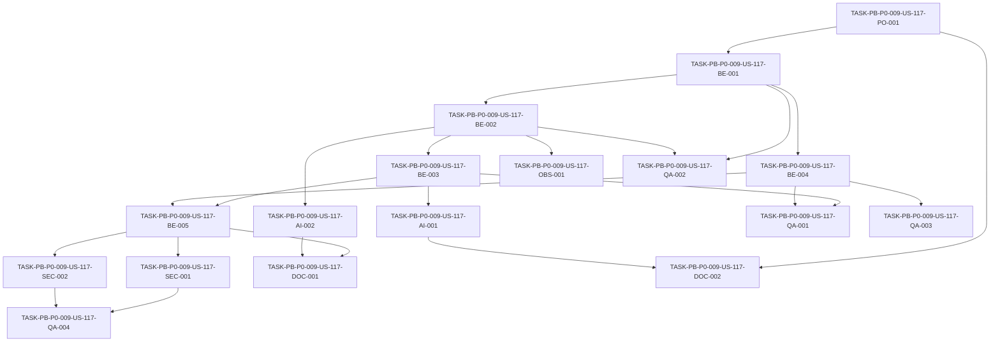

# Development Tasks — PB-P0-009 / US-117: Definir puerto LLMProvider

## 1. Metadata

| Field | Value |
|---|---|
| User Story ID | US-117 |
| Source User Story | `management/user-stories/US-117-llm-provider-port.md` |
| Source Technical Specification | `management/technical-specs/P0/PB-P0-009/US-117-technical-spec.md` |
| Decision Resolution Artifact | No aplica - no existe artifact; se usa `PO/BA Decisions Applied` de la User Story aprobada |
| Priority | P0 |
| Backlog ID | PB-P0-009 |
| Backlog Title | LLMProvider Port + Adapters (OpenAI + Mock + Anthropic Stub) |
| Backlog Execution Order | 9 |
| User Story Position in Backlog Item | 1 of 4 |
| Related User Stories in Backlog Item | US-117, US-118, US-119, US-120 |
| Epic | EPIC-AI-001 |
| Backlog Item Dependencies | PB-P0-002 |
| Feature | LLMProvider port |
| Module / Domain | AI Assistance / Platform |
| Backlog Alignment Status | Found |
| Task Breakdown Status | Ready for Sprint Planning |
| Created Date | 2026-06-17 |
| Last Updated | 2026-06-17 |

---

## 2. Source Validation

| Source | Found | Used | Notes |
|---|---|---|---|
| User Story | Yes | Yes | Aprobada y lista para development tasks. |
| Technical Specification | Yes | Yes | Fuente primaria para el desglose. |
| Decision Resolution Artifact | No | No | No existe artifact; la User Story y la spec contienen decisiones aplicadas. |
| Product Backlog Prioritized | Yes | Yes | Encontrado como `management/artifacts/4-Product-Backlog-Prioritized.md`. |
| ADRs | Yes | Yes | Usadas vía spec, especialmente ADR-AI-001..004 y ADR-TEST-003. |

---

## 3. Backlog Execution Context

### Parent Backlog Item

PB-P0-009 entrega la foundation de provider IA: puerto `LLMProvider`, `OpenAIProvider`, `MockAIProvider`, `AnthropicProvider` stub y selección por configuración backend. US-117 es el primer paso técnico: define el contrato común y los tipos que los adapters posteriores implementan.

### Execution Order Rationale

US-117 debe ejecutarse antes de US-118, US-119 y US-120 porque esos adapters dependen del contrato `LLMProvider`, `AIContext`, `AIResult<TOutput>`, provider ids, language codes y errores tipados. La historia no debe adelantar adapters, selector runtime, PromptRegistry, fallback ni persistencia.

### Related User Stories in Same Backlog Item

| User Story | Role in Backlog Item | Suggested Order |
|---|---|---|
| US-117 | Definir `LLMProvider`, tipos compartidos y errores tipados | 1 |
| US-118 | Implementar `OpenAIProvider` funcional principal contra el contrato | 2 |
| US-119 | Implementar `MockAIProvider` determinista contra el contrato | 3 |
| US-120 | Implementar `AnthropicProvider` stub no funcional contra el contrato | 4 |

---

## 4. Task Breakdown Summary

| Area | Number of Tasks | Notes |
|---|---:|---|
| Product / Analysis | 1 | Confirmar alcance del contrato y manejo de features future. |
| Backend | 5 | Tipos base, interfaz, errores, exports y estructura del módulo. |
| AI / PromptOps | 2 | Métodos por feature y metadata para PromptOps/fallback futuro sin implementarlos. |
| Security / Authorization | 2 | Boundary backend-only y protección contra SDK/secrets. |
| QA / Testing | 4 | Contract tests, type checks, error tests e import guard. |
| Observability / Audit | 1 | Metadata obligatoria para trazabilidad futura. |
| Documentation / Traceability | 2 | Documentar contrato, non-goals y alignment note. |
| Frontend | 0 | No aplica. |
| API Contract | 0 | No aplica. |
| Database / Prisma | 0 | No aplica. |
| Seed / Demo Data | 0 | No requiere seed directo. |
| DevOps / Environment | 0 | No requiere env vars funcionales en US-117. |
| **Total** | **17** | Ready for sprint planning. |

---

## 5. Traceability Matrix

| Acceptance Criterion | Technical Spec Section | Task IDs |
|---|---|---|
| AC-01 `LLMProvider` interface is defined | 6, 7, 18, 19 | TASK-PB-P0-009-US-117-BE-003, TASK-PB-P0-009-US-117-BE-005, TASK-PB-P0-009-US-117-QA-001 |
| AC-02 Feature-specific methods are typed | 6, 7, 11, 16, 18 | TASK-PB-P0-009-US-117-PO-001, TASK-PB-P0-009-US-117-AI-001, TASK-PB-P0-009-US-117-QA-001 |
| AC-03 `AIContext` includes required metadata | 6, 7, 11, 14 | TASK-PB-P0-009-US-117-BE-001, TASK-PB-P0-009-US-117-OBS-001, TASK-PB-P0-009-US-117-QA-002 |
| AC-04 `AIResult` returns auditable provider metadata | 6, 7, 11, 14 | TASK-PB-P0-009-US-117-BE-002, TASK-PB-P0-009-US-117-OBS-001, TASK-PB-P0-009-US-117-QA-002 |
| AC-05 Typed provider errors are part of the contract | 6, 7, 13, 17 | TASK-PB-P0-009-US-117-BE-004, TASK-PB-P0-009-US-117-QA-003 |
| AC-06 Provider IDs are constrained | 6, 7, 11, 13 | TASK-PB-P0-009-US-117-BE-001, TASK-PB-P0-009-US-117-QA-002 |
| AC-07 Backend-only boundary is enforced by design | 5, 7, 12, 13, 18 | TASK-PB-P0-009-US-117-SEC-001, TASK-PB-P0-009-US-117-SEC-002, TASK-PB-P0-009-US-117-QA-004 |
| AC-08 Contract tests validate substitutability | 6, 13, 18, 19 | TASK-PB-P0-009-US-117-QA-001, TASK-PB-P0-009-US-117-QA-003, TASK-PB-P0-009-US-117-DOC-001 |

---

## 6. Development Tasks

### TASK-PB-P0-009-US-117-PO-001 — Confirmar alcance de métodos MVP del contrato

| Field | Value |
|---|---|
| Area | Product / Analysis |
| Type | Review |
| Priority | Must |
| Estimate | XS |
| Depends On | None |
| Source AC(s) | AC-02 |
| Technical Spec Section(s) | 4, 6, 7, 16, 17, 18 |
| Backlog ID | PB-P0-009 |
| User Story ID | US-117 |
| Owner Role | Tech Lead |
| Status | To Do |

#### Objective

Confirmar la lista exacta de métodos IA MVP que entran al contrato `LLMProvider` y documentar si `generateVendorBio` queda incluido, marcado como no usado, o diferido.

#### Scope

##### Include

- Revisar Technical Spec secciones 7, 11 y 16.
- Confirmar métodos mínimos: event plan, checklist, budget suggestion, vendor categories, quote brief, quote comparison y task prioritization.
- Registrar decisión operativa para `generateVendorBio` sin reabrir ADRs.

##### Exclude

- Implementar use cases IA.
- Implementar adapters.
- Crear prompts o PromptRegistry.

#### Implementation Notes

La spec marca `generateVendorBio` como punto de cuidado documental. La decisión debe quedar reflejada en task board o documentación del contrato para que US-118/119/120 no queden desalineadas.

#### Acceptance Criteria Covered

AC-02.

#### Definition of Done

- [ ] Lista de métodos MVP queda confirmada.
- [ ] `generateVendorBio` queda explícitamente incluido, diferido o marcado como no usado.
- [ ] No se agregan features future sin PO/ADR.

---

### TASK-PB-P0-009-US-117-BE-001 — Crear tipos base `ProviderId`, `LanguageCode` y `PromptVersionId`

| Field | Value |
|---|---|
| Area | Backend |
| Type | Implementation |
| Priority | Must |
| Estimate | S |
| Depends On | TASK-PB-P0-009-US-117-PO-001 |
| Source AC(s) | AC-03, AC-06 |
| Technical Spec Section(s) | 7, 11, 12, 13, 18 |
| Backlog ID | PB-P0-009 |
| User Story ID | US-117 |
| Owner Role | Backend |
| Status | To Do |

#### Objective

Definir los tipos base del contrato IA con valores restringidos y reutilizables por adapters posteriores.

#### Scope

##### Include

- `ProviderId = 'openai' | 'mock' | 'anthropic'`.
- `LanguageCode = 'es-LATAM' | 'es-ES' | 'pt' | 'en'`.
- `PromptVersionId` como alias/brand type si el repo usa ese patrón.
- Ubicación en `ai-assistance` Application/Ports boundary.

##### Exclude

- Selector runtime.
- Config parsing.
- Zod runtime schemas si el repo no los usa para tipos de contrato.

#### Implementation Notes

Mantener nombres consistentes con US-117 technical spec y docs AI. No introducir providers futuros.

#### Acceptance Criteria Covered

AC-03, AC-06.

#### Definition of Done

- [ ] Tipos base creados y exportables.
- [ ] `ProviderId` sólo permite `openai`, `mock`, `anthropic`.
- [ ] `LanguageCode` sólo permite los 4 idiomas aprobados.
- [ ] No hay imports de SDKs ni frontend.

---

### TASK-PB-P0-009-US-117-BE-002 — Definir `AIContext` y `AIResult<TOutput>`

| Field | Value |
|---|---|
| Area | Backend |
| Type | Implementation |
| Priority | Must |
| Estimate | M |
| Depends On | TASK-PB-P0-009-US-117-BE-001 |
| Source AC(s) | AC-03, AC-04 |
| Technical Spec Section(s) | 6, 7, 11, 12, 14, 18 |
| Backlog ID | PB-P0-009 |
| User Story ID | US-117 |
| Owner Role | Backend |
| Status | To Do |

#### Objective

Crear los DTOs/types compartidos para contexto de invocación y resultado auditable de provider.

#### Scope

##### Include

- `AIContext.language`.
- `AIContext.userId`.
- `AIContext.promptVersionId`.
- `AIContext.correlationId`.
- `AIContext.timeoutMs`.
- Campos opcionales aprobados: `eventId`, `vendorProfileId`, `currency`, `preferMock`.
- `AIResult<TOutput>.output`.
- `AIResult<TOutput>.provider`.
- `AIResult<TOutput>.promptVersionId`.
- `AIResult<TOutput>.languageCode`.
- `AIResult<TOutput>.latencyMs`.
- `AIResult<TOutput>.fallbackUsed`.
- `AIResult<TOutput>.rawOutputHash?`.

##### Exclude

- Persistencia `AIRecommendation`.
- HTTP status mapping.
- Fallback logic.

#### Implementation Notes

`currency` viaja como contexto y no habilita conversión automática. `preferMock` no decide selección dinámica; sólo transporta contexto para capas autorizadas futuras.

#### Acceptance Criteria Covered

AC-03, AC-04.

#### Definition of Done

- [ ] `AIContext` contiene metadata obligatoria.
- [ ] `AIResult<TOutput>` contiene metadata auditable obligatoria.
- [ ] Campos opcionales quedan documentados en comentarios o docs internas si aplica.
- [ ] No se agregan responsabilidades de selector/fallback.

---

### TASK-PB-P0-009-US-117-BE-003 — Crear interfaz `LLMProvider`

| Field | Value |
|---|---|
| Area | Backend |
| Type | Implementation |
| Priority | Must |
| Estimate | M |
| Depends On | TASK-PB-P0-009-US-117-BE-002 |
| Source AC(s) | AC-01, AC-02, AC-07 |
| Technical Spec Section(s) | 5, 6, 7, 11, 18 |
| Backlog ID | PB-P0-009 |
| User Story ID | US-117 |
| Owner Role | Backend |
| Status | To Do |

#### Objective

Definir el puerto `LLMProvider` con métodos tipados por feature IA MVP aprobada.

#### Scope

##### Include

- Interface ubicada en Ports/Application boundary.
- Métodos aprobados por TASK-PB-P0-009-US-117-PO-001.
- Firma consistente: input DTO + `AIContext` -> `Promise<AIResult<TOutput>>` o patrón equivalente definido por US-117.
- Exports para adapters futuros.

##### Exclude

- Implementación OpenAI.
- Implementación Mock.
- Implementación Anthropic.
- PromptBuilder, PromptRegistry, OutputValidator.

#### Implementation Notes

Si todavía no existen DTOs finales por feature, usar contratos mínimos compartidos o placeholders tipados sin lógica de negocio.

#### Acceptance Criteria Covered

AC-01, AC-02, AC-07.

#### Definition of Done

- [ ] `LLMProvider` existe en la capa correcta.
- [ ] Métodos MVP están definidos con tipos.
- [ ] Application puede depender del puerto sin SDKs concretos.
- [ ] No se crea implementación concreta del provider.

---

### TASK-PB-P0-009-US-117-BE-004 — Crear errores tipados de provider IA

| Field | Value |
|---|---|
| Area | Backend |
| Type | Implementation |
| Priority | Must |
| Estimate | M |
| Depends On | TASK-PB-P0-009-US-117-BE-001 |
| Source AC(s) | AC-05 |
| Technical Spec Section(s) | 7, 11, 12, 13, 17, 18 |
| Backlog ID | PB-P0-009 |
| User Story ID | US-117 |
| Owner Role | Backend |
| Status | To Do |

#### Objective

Definir errores tipados de provider sin dependencia HTTP/Express para que adapters y use cases puedan manejar fallas IA de forma consistente.

#### Scope

##### Include

- `AITimeoutError`.
- `AIInvalidOutputError`.
- `AIProviderUnavailableError`.
- `AIProviderNotConfiguredError`.
- Metadata segura opcional: `provider`, `correlationId`, `promptVersionId`, `causeCode`.

##### Exclude

- HTTP status.
- Error envelope API.
- Logging de payloads.

#### Implementation Notes

Evitar incluir secrets, raw prompts, raw outputs sensibles, cookies, tokens o stack trace público en metadata.

#### Acceptance Criteria Covered

AC-05.

#### Definition of Done

- [ ] Errores tipados existen y son exportables.
- [ ] Errores no dependen de Express/HTTP.
- [ ] Metadata segura está tipada.
- [ ] Tests pueden construir/lanzar/capturar cada error.

---

### TASK-PB-P0-009-US-117-BE-005 — Crear exports internos del módulo AI contract

| Field | Value |
|---|---|
| Area | Backend |
| Type | Setup |
| Priority | Must |
| Estimate | S |
| Depends On | TASK-PB-P0-009-US-117-BE-003, TASK-PB-P0-009-US-117-BE-004 |
| Source AC(s) | AC-01, AC-07 |
| Technical Spec Section(s) | 7, 18, 19 |
| Backlog ID | PB-P0-009 |
| User Story ID | US-117 |
| Owner Role | Backend |
| Status | To Do |

#### Objective

Exponer el contrato IA de forma consistente para adapters futuros sin filtrar detalles de Infrastructure.

#### Scope

##### Include

- Barrel/internal exports si el repo usa ese patrón.
- Exports de `LLMProvider`, types y errors.
- Import paths estables para US-118/119/120.

##### Exclude

- Public API HTTP.
- Frontend shared package salvo que el repo ya tenga contrato compartido formal.

#### Implementation Notes

Mantener boundaries: Application/Ports exporta contratos; Infrastructure consume contratos.

#### Acceptance Criteria Covered

AC-01, AC-07.

#### Definition of Done

- [ ] Adapters futuros pueden importar el contrato desde path estable.
- [ ] No se exportan SDK/client implementations.
- [ ] No hay dependencias circulares con Infrastructure.

---

### TASK-PB-P0-009-US-117-AI-001 — Alinear métodos del contrato con features IA MVP

| Field | Value |
|---|---|
| Area | AI / PromptOps |
| Type | Review |
| Priority | Must |
| Estimate | S |
| Depends On | TASK-PB-P0-009-US-117-BE-003 |
| Source AC(s) | AC-02 |
| Technical Spec Section(s) | 6, 7, 11, 16, 17, 19 |
| Backlog ID | PB-P0-009 |
| User Story ID | US-117 |
| Owner Role | AI |
| Status | To Do |

#### Objective

Verificar que el contrato refleja las features IA MVP sin obligar features future ni responsabilidades de PromptOps.

#### Scope

##### Include

- Revisar nombres de métodos vs docs AI.
- Confirmar input/output placeholders o DTOs mínimos.
- Confirmar exclusión de prompts/version lifecycle.

##### Exclude

- Escribir prompts.
- Crear PromptRegistry.
- Crear schemas finales si pertenecen a PB-P0-010.

#### Implementation Notes

La alineación debe documentar explícitamente cualquier feature future/no usada para evitar que US-118/119/120 implementen de más.

#### Acceptance Criteria Covered

AC-02.

#### Definition of Done

- [ ] Método por feature MVP queda alineado.
- [ ] Future features no agregan carga funcional indebida.
- [ ] PromptOps queda fuera de US-117.

---

### TASK-PB-P0-009-US-117-AI-002 — Documentar semántica de `fallbackUsed`, `preferMock` y `rawOutputHash`

| Field | Value |
|---|---|
| Area | AI / PromptOps |
| Type | Documentation |
| Priority | Must |
| Estimate | XS |
| Depends On | TASK-PB-P0-009-US-117-BE-002 |
| Source AC(s) | AC-03, AC-04 |
| Technical Spec Section(s) | 11, 14, 17, 18, 19 |
| Backlog ID | PB-P0-009 |
| User Story ID | US-117 |
| Owner Role | AI |
| Status | To Do |

#### Objective

Dejar clara la semántica de campos que serán usados por fallback, auditoría y adapters posteriores sin implementar esas capas.

#### Scope

##### Include

- `fallbackUsed` como metadata obligatoria.
- `preferMock` como contexto no decisor.
- `rawOutputHash` como metadata opcional de auditoría.

##### Exclude

- Implementar fallback.
- Implementar hash real si no corresponde a US-117.
- Persistir auditoría.

#### Implementation Notes

Puede resolverse con comentarios técnicos, README interno corto o documentación del contrato.

#### Acceptance Criteria Covered

AC-03, AC-04.

#### Definition of Done

- [ ] Semántica documentada.
- [ ] No se implementa selector ni fallback.
- [ ] US-118/119/120 pueden interpretar los campos sin ambigüedad.

---

### TASK-PB-P0-009-US-117-SEC-001 — Verificar boundary backend-only del contrato

| Field | Value |
|---|---|
| Area | Security / Authorization |
| Type | Review |
| Priority | Must |
| Estimate | S |
| Depends On | TASK-PB-P0-009-US-117-BE-005 |
| Source AC(s) | AC-07 |
| Technical Spec Section(s) | 5, 7, 12, 13, 18 |
| Backlog ID | PB-P0-009 |
| User Story ID | US-117 |
| Owner Role | Backend |
| Status | To Do |

#### Objective

Confirmar que el contrato IA es backend-only y no puede ser usado desde frontend ni exponer secrets.

#### Scope

##### Include

- Revisar ubicación del archivo.
- Revisar imports.
- Confirmar que no hay variables públicas ni SDK config.
- Confirmar que auth/ownership/rate limit no se mueve al puerto.

##### Exclude

- Implementar middleware de auth.
- Implementar endpoints.

#### Implementation Notes

Esta tarea es review/guardrail y puede apoyarse en tests estáticos si el tooling existe.

#### Acceptance Criteria Covered

AC-07.

#### Definition of Done

- [ ] Contrato vive sólo en backend.
- [ ] No hay dependencia frontend/browser.
- [ ] No hay secrets ni config de providers en el puerto.
- [ ] Boundaries quedan revisados.

---

### TASK-PB-P0-009-US-117-SEC-002 — Agregar guard de no imports SDK en el puerto

| Field | Value |
|---|---|
| Area | Security / Authorization |
| Type | Test |
| Priority | Should |
| Estimate | S |
| Depends On | TASK-PB-P0-009-US-117-BE-005 |
| Source AC(s) | AC-07 |
| Technical Spec Section(s) | 7, 12, 13, 17, 18 |
| Backlog ID | PB-P0-009 |
| User Story ID | US-117 |
| Owner Role | QA |
| Status | To Do |

#### Objective

Agregar una protección automatizada o revisión codificada que detecte imports de SDKs concretos desde el contrato.

#### Scope

##### Include

- Guard contra `openai`.
- Guard contra `@anthropic-ai/sdk`.
- Guard contra browser/frontend APIs.
- Integrarlo al test/lint disponible si es viable.

##### Exclude

- Crear framework lint nuevo si excede el scope.
- Bloquear imports permitidos en Infrastructure adapters futuros.

#### Implementation Notes

Si el repo no tiene tooling para import rules, crear un test simple o documentar revisión manual en DoD.

#### Acceptance Criteria Covered

AC-07.

#### Definition of Done

- [ ] Existe guard automatizado o checklist formal.
- [ ] El guard apunta al puerto/contract layer.
- [ ] No bloquea adapters Infrastructure futuros.

---

### TASK-PB-P0-009-US-117-OBS-001 — Validar metadata de observabilidad del contrato

| Field | Value |
|---|---|
| Area | Observability / Audit |
| Type | Review |
| Priority | Must |
| Estimate | XS |
| Depends On | TASK-PB-P0-009-US-117-BE-002 |
| Source AC(s) | AC-03, AC-04 |
| Technical Spec Section(s) | 7, 11, 14, 17 |
| Backlog ID | PB-P0-009 |
| User Story ID | US-117 |
| Owner Role | Tech Lead |
| Status | To Do |

#### Objective

Confirmar que `AIContext` y `AIResult<TOutput>` transportan metadata suficiente para logs, métricas y auditoría futura.

#### Scope

##### Include

- `correlationId`.
- `promptVersionId`.
- `provider`.
- `languageCode`.
- `latencyMs`.
- `fallbackUsed`.
- `rawOutputHash?`.

##### Exclude

- Implementar logging runtime.
- Implementar metrics backend.
- Persistir `AIRecommendation`.

#### Implementation Notes

US-117 sólo habilita observabilidad; los eventos concretos se implementan en adapters/use cases posteriores.

#### Acceptance Criteria Covered

AC-03, AC-04.

#### Definition of Done

- [ ] Metadata mínima está presente.
- [ ] No se agregan raw prompts ni secrets.
- [ ] La metadata satisface necesidades de US-118/119/120.

---

### TASK-PB-P0-009-US-117-QA-001 — Crear contract test con fake provider

| Field | Value |
|---|---|
| Area | QA / Testing |
| Type | Test |
| Priority | Must |
| Estimate | M |
| Depends On | TASK-PB-P0-009-US-117-BE-003, TASK-PB-P0-009-US-117-BE-004 |
| Source AC(s) | AC-01, AC-02, AC-08 |
| Technical Spec Section(s) | 6, 7, 13, 18, 19 |
| Backlog ID | PB-P0-009 |
| User Story ID | US-117 |
| Owner Role | QA |
| Status | To Do |

#### Objective

Probar que un fake provider puede implementar `LLMProvider` sin SDK externo y retornar `AIResult<TOutput>`.

#### Scope

##### Include

- Fake provider implementando todos los métodos aprobados.
- Retorno determinista.
- Compile/type assertions donde el tooling lo permita.

##### Exclude

- OpenAI real.
- MockAIProvider real.
- Anthropic stub real.

#### Implementation Notes

Debe vivir en test suite del backend y ser suficiente para detectar cambios breaking en el contrato.

#### Acceptance Criteria Covered

AC-01, AC-02, AC-08.

#### Definition of Done

- [ ] Fake provider implementa el contrato.
- [ ] Tests pasan sin SDK externo.
- [ ] Todos los métodos aprobados quedan cubiertos.

---

### TASK-PB-P0-009-US-117-QA-002 — Agregar type tests para metadata, provider ids y language codes

| Field | Value |
|---|---|
| Area | QA / Testing |
| Type | Test |
| Priority | Must |
| Estimate | M |
| Depends On | TASK-PB-P0-009-US-117-BE-001, TASK-PB-P0-009-US-117-BE-002 |
| Source AC(s) | AC-03, AC-04, AC-06 |
| Technical Spec Section(s) | 7, 13, 14, 18 |
| Backlog ID | PB-P0-009 |
| User Story ID | US-117 |
| Owner Role | QA |
| Status | To Do |

#### Objective

Validar que los tipos restringen metadata obligatoria y valores permitidos.

#### Scope

##### Include

- `ProviderId` sólo acepta `openai`, `mock`, `anthropic`.
- `LanguageCode` sólo acepta `es-LATAM`, `es-ES`, `pt`, `en`.
- `AIContext` exige `correlationId` y `timeoutMs`.
- `AIResult` exige `fallbackUsed`, `provider`, `latencyMs`, `promptVersionId`, `languageCode`.

##### Exclude

- Runtime schema validation si no aplica al contrato.

#### Implementation Notes

Usar el patrón de type tests disponible en el repo. Si no existe, validar mediante TypeScript compile tests o pruebas con fixtures tipados.

#### Acceptance Criteria Covered

AC-03, AC-04, AC-06.

#### Definition of Done

- [ ] Valores inválidos fallan en type check.
- [ ] Metadata obligatoria no puede omitirse sin error de tipos.
- [ ] Tests quedan integrados a CI/type check.

---

### TASK-PB-P0-009-US-117-QA-003 — Agregar tests para errores tipados de provider

| Field | Value |
|---|---|
| Area | QA / Testing |
| Type | Test |
| Priority | Must |
| Estimate | S |
| Depends On | TASK-PB-P0-009-US-117-BE-004 |
| Source AC(s) | AC-05, AC-08 |
| Technical Spec Section(s) | 7, 13, 17, 18 |
| Backlog ID | PB-P0-009 |
| User Story ID | US-117 |
| Owner Role | QA |
| Status | To Do |

#### Objective

Validar que los errores tipados pueden construirse, lanzarse y capturarse sin depender de HTTP/Express.

#### Scope

##### Include

- `AITimeoutError`.
- `AIInvalidOutputError`.
- `AIProviderUnavailableError`.
- `AIProviderNotConfiguredError`.
- Metadata segura opcional.

##### Exclude

- HTTP mapping.
- API error envelope.

#### Implementation Notes

Verificar que no se exige status HTTP ni request/response Express.

#### Acceptance Criteria Covered

AC-05, AC-08.

#### Definition of Done

- [ ] Cada error tiene test.
- [ ] Los errores no dependen de HTTP.
- [ ] Metadata sensible no forma parte del contrato de error.

---

### TASK-PB-P0-009-US-117-QA-004 — Validar ausencia de SDKs, browser APIs y frontend imports

| Field | Value |
|---|---|
| Area | QA / Testing |
| Type | Test |
| Priority | Must |
| Estimate | S |
| Depends On | TASK-PB-P0-009-US-117-SEC-001, TASK-PB-P0-009-US-117-SEC-002 |
| Source AC(s) | AC-07 |
| Technical Spec Section(s) | 5, 7, 12, 13, 18 |
| Backlog ID | PB-P0-009 |
| User Story ID | US-117 |
| Owner Role | QA |
| Status | To Do |

#### Objective

Confirmar con test o revisión automatizada que el contract layer no importa SDKs concretos ni APIs frontend/browser.

#### Scope

##### Include

- Check contra `openai`.
- Check contra `@anthropic-ai/sdk`.
- Check contra imports frontend si aplica.
- Check contra browser APIs si aplica.

##### Exclude

- Restricciones para folders Infrastructure adapters futuros.

#### Implementation Notes

Puede apoyarse en TASK-PB-P0-009-US-117-SEC-002 si allí se implementa el guard.

#### Acceptance Criteria Covered

AC-07.

#### Definition of Done

- [ ] Guard/test ejecuta en CI o queda documentado como review obligatorio.
- [ ] El puerto no importa SDKs concretos.
- [ ] El puerto no importa frontend/browser code.

---

### TASK-PB-P0-009-US-117-DOC-001 — Documentar contrato y responsabilidades de adapters futuros

| Field | Value |
|---|---|
| Area | Documentation / Traceability |
| Type | Documentation |
| Priority | Must |
| Estimate | S |
| Depends On | TASK-PB-P0-009-US-117-BE-005, TASK-PB-P0-009-US-117-AI-002 |
| Source AC(s) | AC-01, AC-02, AC-07, AC-08 |
| Technical Spec Section(s) | 16, 18, 19 |
| Backlog ID | PB-P0-009 |
| User Story ID | US-117 |
| Owner Role | Tech Lead |
| Status | To Do |

#### Objective

Crear o actualizar documentación técnica corta del contrato para guiar US-118, US-119 y US-120.

#### Scope

##### Include

- Ubicación del puerto.
- Tipos principales.
- Métodos aprobados.
- Errores tipados.
- Boundaries: adapters en Infrastructure.
- Non-goals: selector, fallback, PromptRegistry, persistence, endpoints.

##### Exclude

- Documentación de prompts.
- Documentación de endpoints.
- Documentación de provider SDK usage.

#### Implementation Notes

Puede ser README en módulo backend o sección breve en documentación técnica existente, según patrón del repo.

#### Acceptance Criteria Covered

AC-01, AC-02, AC-07, AC-08.

#### Definition of Done

- [ ] Documento o sección interna existe.
- [ ] Responsabilidades de US-118/119/120 quedan claras.
- [ ] Out of scope queda explícito.

---

### TASK-PB-P0-009-US-117-DOC-002 — Registrar alignment note sobre `generateVendorBio` y future features

| Field | Value |
|---|---|
| Area | Documentation / Traceability |
| Type | Documentation |
| Priority | Should |
| Estimate | XS |
| Depends On | TASK-PB-P0-009-US-117-PO-001, TASK-PB-P0-009-US-117-AI-001 |
| Source AC(s) | AC-02 |
| Technical Spec Section(s) | 16, 17, 19 |
| Backlog ID | PB-P0-009 |
| User Story ID | US-117 |
| Owner Role | Tech Lead |
| Status | To Do |

#### Objective

Dejar trazabilidad de la decisión operativa sobre features future o no incluidas en el contrato ejecutable del slice PB-P0-009.

#### Scope

##### Include

- Nota sobre `generateVendorBio`.
- Referencia a docs AI/FRD si aplica.
- Impacto en US-118/119/120.

##### Exclude

- Reescritura de documentación fuente amplia.
- Nueva decisión PO si no hay conflicto bloqueante.

#### Implementation Notes

Esta tarea atiende la documentation alignment note no bloqueante de la Technical Spec.

#### Acceptance Criteria Covered

AC-02.

#### Definition of Done

- [ ] La nota queda registrada en documentación técnica o task board.
- [ ] No se bloquea desarrollo de US-117.
- [ ] US-118/119/120 tienen claridad sobre si deben implementar el método.

---

## 7. Required QA Tasks

| Task ID | Test Type | Purpose |
|---|---|---|
| TASK-PB-P0-009-US-117-QA-001 | Unit/Contract | Verificar que un fake provider implementa `LLMProvider` sin SDK externo. |
| TASK-PB-P0-009-US-117-QA-002 | Type/Compile | Verificar restricciones de metadata, provider ids y language codes. |
| TASK-PB-P0-009-US-117-QA-003 | Unit | Verificar errores tipados independientes de HTTP. |
| TASK-PB-P0-009-US-117-QA-004 | Security/Static | Verificar ausencia de SDKs, browser APIs y frontend imports en el puerto. |

---

## 8. Required Security Tasks

| Task ID | Security Concern | Purpose |
|---|---|---|
| TASK-PB-P0-009-US-117-SEC-001 | Backend-only boundary | Confirmar que el contrato no es invocable desde frontend ni expone secrets. |
| TASK-PB-P0-009-US-117-SEC-002 | SDK leakage | Prevenir imports de SDK OpenAI/Anthropic en Application/Ports. |
| TASK-PB-P0-009-US-117-QA-004 | Automated security verification | Validar boundary con test/guard o checklist formal. |

---

## 9. Required Seed / Demo Tasks

`No aplica`.

US-117 no crea seed ni demo data. Sólo habilita futuros adapters y `MockAIProvider`.

---

## 10. Observability / Audit Tasks

| Task ID | Concern | Purpose |
|---|---|---|
| TASK-PB-P0-009-US-117-OBS-001 | AI traceability metadata | Confirmar que `AIContext` y `AIResult` transportan metadata para logs, métricas y auditoría futura. |

---

## 11. Documentation / Traceability Tasks

| Task ID | Document / Artifact | Purpose |
|---|---|---|
| TASK-PB-P0-009-US-117-DOC-001 | AI contract documentation | Documentar contrato, responsibilities y non-goals para adapters futuros. |
| TASK-PB-P0-009-US-117-DOC-002 | Documentation alignment note | Registrar decisión sobre `generateVendorBio`/future features. |

---

## 12. Dependency Graph

---

## 13. Suggested Implementation Order

### Phase 1 — Foundation

1. TASK-PB-P0-009-US-117-PO-001.
2. TASK-PB-P0-009-US-117-BE-001.
3. TASK-PB-P0-009-US-117-BE-002.

### Phase 2 — Core Implementation

1. TASK-PB-P0-009-US-117-BE-003.
2. TASK-PB-P0-009-US-117-BE-004.
3. TASK-PB-P0-009-US-117-BE-005.
4. TASK-PB-P0-009-US-117-AI-001.
5. TASK-PB-P0-009-US-117-AI-002.

### Phase 3 — Validation / Security / QA

1. TASK-PB-P0-009-US-117-SEC-001.
2. TASK-PB-P0-009-US-117-SEC-002.
3. TASK-PB-P0-009-US-117-OBS-001.
4. TASK-PB-P0-009-US-117-QA-001.
5. TASK-PB-P0-009-US-117-QA-002.
6. TASK-PB-P0-009-US-117-QA-003.
7. TASK-PB-P0-009-US-117-QA-004.

### Phase 4 — Documentation / Review

1. TASK-PB-P0-009-US-117-DOC-001.
2. TASK-PB-P0-009-US-117-DOC-002.

---

## 14. Risks & Mitigations

| Risk | Impact | Mitigation | Related Task |
| ---- | ------ | ---------- | ------------ |
| Contrato acoplado a OpenAI SDK | Rompe sustituibilidad y ADR-AI-001 | Guard de no SDK imports y review backend-only | TASK-PB-P0-009-US-117-SEC-002 |
| Contrato demasiado amplio | Arrastra PromptOps/fallback/persistence prematuramente | Confirmar alcance y documentar non-goals | TASK-PB-P0-009-US-117-PO-001, TASK-PB-P0-009-US-117-DOC-001 |
| Métodos por feature desalineados | Adapters posteriores implementan de más o de menos | Alinear métodos y registrar note sobre future features | TASK-PB-P0-009-US-117-AI-001, TASK-PB-P0-009-US-117-DOC-002 |
| Metadata de auditoría incompleta | Dificulta persistencia/logs posteriores | Validar `AIContext`/`AIResult` y tests de metadata | TASK-PB-P0-009-US-117-OBS-001, TASK-PB-P0-009-US-117-QA-002 |
| Errores acoplados a HTTP | Mezcla Application con API layer | Errores tipados sin Express/HTTP y tests | TASK-PB-P0-009-US-117-BE-004, TASK-PB-P0-009-US-117-QA-003 |
| Falta de type tests | Regresiones del contrato pasan inadvertidas | Contract/type tests en CI | TASK-PB-P0-009-US-117-QA-001, TASK-PB-P0-009-US-117-QA-002 |

---

## 15. Out of Scope Confirmation

No implementar como parte de US-117:

- `OpenAIProvider`.
- `MockAIProvider`.
- `AnthropicProvider`.
- Selector runtime por `LLM_PROVIDER`.
- `PromptRegistry`.
- `PromptBuilder`.
- `OutputValidator`.
- Retry/fallback service.
- Persistencia `AIRecommendation`.
- Endpoints REST IA.
- UI o API client frontend.
- Prisma models, migrations o seed.
- Streaming, function calling avanzado, tool calling, RAG, vector database o decisiones IA autónomas.
- SDK imports de OpenAI/Anthropic en Application/Ports.

---

## 16. Readiness for Sprint Planning

| Check                                      | Status |
| ------------------------------------------ | ------ |
| Product Backlog mapping found              | Pass   |
| Every AC maps to tasks                     | Pass   |
| Technical Spec used when available         | Pass   |
| QA tasks included                          | Pass   |
| Security tasks included if applicable      | Pass   |
| Seed/demo tasks included if applicable     | N/A    |
| Observability tasks included if applicable | Pass   |
| Documentation tasks included if applicable | Pass   |
| Task dependencies clear                    | Pass   |
| Tasks small enough                         | Pass   |
| Ready for Sprint Planning                  | Yes    |

---

## 17. Final Recommendation

`Ready for Sprint Planning`

US-117 tiene especificación técnica aprobada y tareas trazables para implementar el contrato `LLMProvider`, sus tipos base, errores tipados, boundaries de seguridad, pruebas de contrato y documentación mínima. El desglose evita scope creep hacia adapters, selector runtime, PromptOps, fallback, endpoints, DB o UI.
