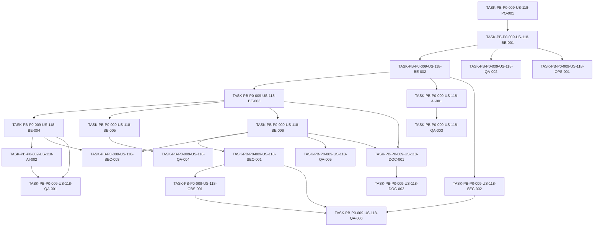

# Development Tasks — PB-P0-009 / US-118: Implementar OpenAIProvider

## 1. Metadata

| Field | Value |
|---|---|
| User Story ID | US-118 |
| Source User Story | `management/user-stories/US-118-openai-provider-adapter.md` |
| Source Technical Specification | `management/technical-specs/P0/PB-P0-009/US-118-technical-spec.md` |
| Decision Resolution Artifact | No aplica - no existe artifact; se usa `PO/BA Decisions Applied` de la User Story aprobada |
| Priority | P0 |
| Backlog ID | PB-P0-009 |
| Backlog Title | LLMProvider Port + Adapters (OpenAI + Mock + Anthropic Stub) |
| Backlog Execution Order | 9 |
| User Story Position in Backlog Item | 2 of 4 |
| Related User Stories in Backlog Item | US-117, US-118, US-119, US-120 |
| Epic | EPIC-AI-001 |
| Backlog Item Dependencies | PB-P0-002 |
| Feature | OpenAIProvider adapter |
| Module / Domain | AI Assistance / Platform |
| Backlog Alignment Status | Found |
| Task Breakdown Status | Ready for Sprint Planning |
| Created Date | 2026-06-17 |
| Last Updated | 2026-06-17 |

---

## 2. Source Validation

| Source | Found | Used | Notes |
|---|---|---|---|
| User Story | Yes | Yes | Aprobada y lista para development tasks. |
| Technical Specification | Yes | Yes | Fuente primaria para el desglose. |
| Decision Resolution Artifact | No | No | No existe artifact; la User Story y la spec contienen decisiones aplicadas. |
| Product Backlog Prioritized | Yes | Yes | Encontrado como `management/artifacts/4-Product-Backlog-Prioritized.md`. |
| ADRs | Yes | Yes | Usadas vía spec, especialmente ADR-AI-001, ADR-AI-002, ADR-AI-003 y ADR-TEST-003. |

---

## 3. Backlog Execution Context

### Parent Backlog Item

PB-P0-009 entrega el puerto `LLMProvider` y los adapters base. US-118 implementa `OpenAIProvider` como adapter funcional principal del MVP, siempre detrás del puerto y dentro de Infrastructure.

### Execution Order Rationale

US-118 depende de US-117 porque requiere el contrato `LLMProvider`, `AIContext`, `AIResult<TOutput>`, `ProviderId`, `LanguageCode` y errores tipados. Debe mantenerse aislada de US-119/US-120, sin implementar Mock, Anthropic, selector completo, fallback, endpoints ni persistencia.

### Related User Stories in Same Backlog Item

| User Story | Role in Backlog Item | Suggested Order |
|---|---|---|
| US-117 | Define el puerto `LLMProvider` y tipos/errores compartidos | 1 |
| US-118 | Implementa `OpenAIProvider` funcional principal | 2 |
| US-119 | Implementa `MockAIProvider` determinista para CI/demo/testing | 3 |
| US-120 | Implementa `AnthropicProvider` stub no funcional | 4 |

---

## 4. Task Breakdown Summary

| Area | Number of Tasks | Notes |
|---|---:|---|
| Product / Analysis | 1 | Confirmar prerequisito de US-117 y límites frente a PB-P0-010/PB-P0-011. |
| Backend | 6 | Config, client wrapper, provider, timeout, response mapping y error mapping. |
| AI / PromptOps | 2 | Structured output y preservación de metadata sin crear PromptRegistry. |
| Security / Authorization | 3 | Secrets backend-only, import boundary y no persistence/fallback side effects. |
| QA / Testing | 6 | Unit tests de success, config, timeout, errores, structured output y no red real. |
| DevOps / Environment | 1 | Env vars backend-only y CI sin OpenAI secret. |
| Observability / Audit | 1 | Safe logs y metadata de tracing. |
| Documentation / Traceability | 2 | Documentar configuración/non-goals y warning de selector. |
| Frontend | 0 | No aplica. |
| API Contract | 0 | No aplica. |
| Database / Prisma | 0 | No aplica. |
| Seed / Demo Data | 0 | No requiere seed. |
| **Total** | **22** | Ready for sprint planning. |

---

## 5. Traceability Matrix

| Acceptance Criterion | Technical Spec Section | Task IDs |
|---|---|---|
| AC-01 OpenAIProvider implements LLMProvider | 6, 7, 18, 19 | TASK-PB-P0-009-US-118-PO-001, TASK-PB-P0-009-US-118-BE-003, TASK-PB-P0-009-US-118-QA-001 |
| AC-02 Backend-only configuration is validated | 6, 7, 12, 13, 18, 19 | TASK-PB-P0-009-US-118-BE-001, TASK-PB-P0-009-US-118-SEC-001, TASK-PB-P0-009-US-118-QA-002, TASK-PB-P0-009-US-118-OPS-001 |
| AC-03 OpenAI requests use structured output | 6, 7, 11, 13, 18 | TASK-PB-P0-009-US-118-BE-002, TASK-PB-P0-009-US-118-AI-001, TASK-PB-P0-009-US-118-QA-003 |
| AC-04 Successful response maps to AIResult | 6, 7, 11, 14 | TASK-PB-P0-009-US-118-BE-004, TASK-PB-P0-009-US-118-AI-002, TASK-PB-P0-009-US-118-QA-001 |
| AC-05 Timeout is enforced | 6, 7, 13, 17 | TASK-PB-P0-009-US-118-BE-005, TASK-PB-P0-009-US-118-QA-004 |
| AC-06 Provider errors are mapped to typed errors | 6, 7, 13, 17 | TASK-PB-P0-009-US-118-BE-006, TASK-PB-P0-009-US-118-QA-005 |
| AC-07 Logs are safe and traceable | 6, 7, 12, 14 | TASK-PB-P0-009-US-118-OBS-001, TASK-PB-P0-009-US-118-SEC-001, TASK-PB-P0-009-US-118-QA-006 |
| AC-08 Automated tests do not call real OpenAI | 6, 13, 18, 19 | TASK-PB-P0-009-US-118-QA-006, TASK-PB-P0-009-US-118-SEC-002, TASK-PB-P0-009-US-118-OPS-001 |

---

## 6. Development Tasks

### TASK-PB-P0-009-US-118-PO-001 — Confirmar prerequisito de contrato US-117 y límites de US-118

| Field | Value |
|---|---|
| Area | Product / Analysis |
| Type | Review |
| Priority | Must |
| Estimate | XS |
| Depends On | None |
| Source AC(s) | AC-01 |
| Technical Spec Section(s) | 2, 3, 4, 16, 18, 19 |
| Backlog ID | PB-P0-009 |
| User Story ID | US-118 |
| Owner Role | Tech Lead |
| Status | To Do |

#### Objective

Confirmar que el contrato de US-117 está disponible y que US-118 no incluye fallback, PromptRegistry, persistence, endpoints, Mock ni Anthropic.

#### Scope

##### Include

- Validar disponibilidad de `LLMProvider`, `AIContext`, `AIResult<TOutput>` y errores tipados.
- Confirmar non-goals de la spec.
- Confirmar que la implementation plan no invade PB-P0-010/PB-P0-011.

##### Exclude

- Cambiar el contrato de US-117.
- Implementar selector runtime completo.

#### Implementation Notes

Si se detecta una brecha real en US-117, resolverla como dependency antes de avanzar con `OpenAIProvider`.

#### Acceptance Criteria Covered

AC-01.

#### Definition of Done

- [ ] US-117 está disponible para consumo.
- [ ] Límites de scope quedan claros en planning.
- [ ] No se agregan tareas de fallback, DB, endpoints ni PromptRegistry.

---

### TASK-PB-P0-009-US-118-BE-001 — Implementar parser y validador de configuración OpenAI

| Field | Value |
|---|---|
| Area | Backend |
| Type | Implementation |
| Priority | Must |
| Estimate | M |
| Depends On | TASK-PB-P0-009-US-118-PO-001 |
| Source AC(s) | AC-02 |
| Technical Spec Section(s) | 7, 12, 13, 18, 19 |
| Backlog ID | PB-P0-009 |
| User Story ID | US-118 |
| Owner Role | Backend |
| Status | To Do |

#### Objective

Crear configuración backend-only para OpenAI y validar que las variables requeridas existan cuando `LLM_PROVIDER=openai`.

#### Scope

##### Include

- `OPENAI_API_KEY` requerido.
- `OPENAI_MODEL` requerido.
- `OPENAI_BASE_URL` opcional.
- `AI_TIMEOUT_MS` como entero positivo si se usa como default.
- Error seguro ante config inválida.

##### Exclude

- Secret manager implementation.
- Selector runtime completo.
- Variables frontend públicas.

#### Implementation Notes

No imprimir valores de secrets en errores ni logs. Mantener config dentro del backend.

#### Acceptance Criteria Covered

AC-02.

#### Definition of Done

- [ ] Config OpenAI se parsea desde backend env/config.
- [ ] Faltante de API key/model produce error seguro.
- [ ] Timeout inválido se maneja de forma definida.
- [ ] No se expone secret en mensajes.

---

### TASK-PB-P0-009-US-118-BE-002 — Crear wrapper/factory del cliente OpenAI testeable

| Field | Value |
|---|---|
| Area | Backend |
| Type | Implementation |
| Priority | Must |
| Estimate | M |
| Depends On | TASK-PB-P0-009-US-118-BE-001 |
| Source AC(s) | AC-03, AC-08 |
| Technical Spec Section(s) | 5, 7, 11, 13, 18, 19 |
| Backlog ID | PB-P0-009 |
| User Story ID | US-118 |
| Owner Role | Backend |
| Status | To Do |

#### Objective

Encapsular el SDK oficial OpenAI o cliente HTTP equivalente detrás de un wrapper Infrastructure que permita inyectar fake transport en tests.

#### Scope

##### Include

- Factory/client wrapper en Infrastructure.
- Inyección de cliente/fake transport para tests.
- Preparación para request con structured output.

##### Exclude

- Importar SDK desde Application/use cases.
- Crear prompts.
- Hacer llamadas reales en tests.

#### Implementation Notes

Mantener el import del SDK únicamente en `infrastructure/providers/openai/` o wrapper equivalente.

#### Acceptance Criteria Covered

AC-03, AC-08.

#### Definition of Done

- [ ] Existe wrapper/factory testeable.
- [ ] Tests pueden usar fake client sin red.
- [ ] SDK no filtra a Application.

---

### TASK-PB-P0-009-US-118-BE-003 — Implementar `OpenAIProvider` contra `LLMProvider`

| Field | Value |
|---|---|
| Area | Backend |
| Type | Implementation |
| Priority | Must |
| Estimate | L |
| Depends On | TASK-PB-P0-009-US-118-BE-002 |
| Source AC(s) | AC-01, AC-03 |
| Technical Spec Section(s) | 5, 6, 7, 11, 18, 19 |
| Backlog ID | PB-P0-009 |
| User Story ID | US-118 |
| Owner Role | Backend |
| Status | To Do |

#### Objective

Crear `OpenAIProvider` en Infrastructure e implementar todos los métodos requeridos por `LLMProvider`.

#### Scope

##### Include

- Clase/module `OpenAIProvider`.
- Implementación de métodos del contrato definido en US-117.
- Uso de `AIContext`.
- Delegación al client wrapper.
- Preservación de language/promptVersion/correlation metadata.

##### Exclude

- Crear use cases.
- Crear endpoints.
- Implementar Mock/Anthropic.
- Implementar fallback.

#### Implementation Notes

Si el contrato tiene métodos por feature, la implementación puede compartir una función interna común para construir request/parse response siempre que preserve tipos.

#### Acceptance Criteria Covered

AC-01, AC-03.

#### Definition of Done

- [ ] `OpenAIProvider` compila contra `LLMProvider`.
- [ ] Todos los métodos aprobados están implementados.
- [ ] No se importan SDKs fuera de Infrastructure.
- [ ] No hay DB writes ni fallback.

---

### TASK-PB-P0-009-US-118-BE-004 — Mapear respuestas exitosas a `AIResult<TOutput>`

| Field | Value |
|---|---|
| Area | Backend |
| Type | Implementation |
| Priority | Must |
| Estimate | M |
| Depends On | TASK-PB-P0-009-US-118-BE-003 |
| Source AC(s) | AC-04 |
| Technical Spec Section(s) | 6, 7, 11, 14, 18 |
| Backlog ID | PB-P0-009 |
| User Story ID | US-118 |
| Owner Role | Backend |
| Status | To Do |

#### Objective

Convertir respuestas OpenAI válidas en `AIResult<TOutput>` con metadata obligatoria y sin persistencia.

#### Scope

##### Include

- `provider='openai'`.
- `promptVersionId`.
- `languageCode`.
- `latencyMs`.
- `fallbackUsed=false`.
- `rawOutputHash?` si el contrato lo define.

##### Exclude

- Guardar `AIRecommendation`.
- Materializar entidades de dominio.
- Logging de raw output completo.

#### Implementation Notes

Calcular `latencyMs` de forma testeable, idealmente con clock injectable o fake timers.

#### Acceptance Criteria Covered

AC-04.

#### Definition of Done

- [ ] Respuesta exitosa retorna `AIResult<TOutput>`.
- [ ] Metadata obligatoria se preserva.
- [ ] `fallbackUsed=false`.
- [ ] No hay DB writes.

---

### TASK-PB-P0-009-US-118-BE-005 — Implementar timeout por llamada

| Field | Value |
|---|---|
| Area | Backend |
| Type | Implementation |
| Priority | Must |
| Estimate | M |
| Depends On | TASK-PB-P0-009-US-118-BE-003 |
| Source AC(s) | AC-05 |
| Technical Spec Section(s) | 6, 7, 13, 17, 18 |
| Backlog ID | PB-P0-009 |
| User Story ID | US-118 |
| Owner Role | Backend |
| Status | To Do |

#### Objective

Aplicar timeout por llamada usando `ctx.timeoutMs`, `AI_TIMEOUT_MS` o el default aprobado de 60_000 ms.

#### Scope

##### Include

- Timeout/abort con mecanismo compatible con SDK/wrapper.
- Mapeo a `AITimeoutError`.
- Tests con fake timers o fake client.

##### Exclude

- Retry.
- Fallback a Mock.
- HTTP response mapping.

#### Implementation Notes

No bloquear el event loop ni dejar promesas colgadas. El adapter sólo lanza error tipado.

#### Acceptance Criteria Covered

AC-05.

#### Definition of Done

- [ ] Timeout se aplica por llamada.
- [ ] Timeout produce `AITimeoutError`.
- [ ] No se ejecuta fallback.
- [ ] Timeout está cubierto por tests.

---

### TASK-PB-P0-009-US-118-BE-006 — Implementar mapper de errores OpenAI a errores tipados

| Field | Value |
|---|---|
| Area | Backend |
| Type | Implementation |
| Priority | Must |
| Estimate | M |
| Depends On | TASK-PB-P0-009-US-118-BE-003 |
| Source AC(s) | AC-06 |
| Technical Spec Section(s) | 6, 7, 12, 13, 17, 18 |
| Backlog ID | PB-P0-009 |
| User Story ID | US-118 |
| Owner Role | Backend |
| Status | To Do |

#### Objective

Normalizar errores de OpenAI/config/transporte/output a los errores tipados del contrato.

#### Scope

##### Include

- Config ausente -> `AIProviderNotConfiguredError`.
- Timeout -> `AITimeoutError`.
- Auth/quota/rate/network/5xx -> `AIProviderUnavailableError`.
- Output inválido -> `AIInvalidOutputError`.
- Metadata segura.

##### Exclude

- Error envelope HTTP.
- Mensajes públicos al usuario.
- Fallback/retry avanzado.

#### Implementation Notes

Mantener el mapper aislado para facilitar tests unitarios y evitar leaks de raw provider response.

#### Acceptance Criteria Covered

AC-06.

#### Definition of Done

- [ ] Mapper cubre errores requeridos.
- [ ] No filtra API key, raw response sensible ni stack interno público.
- [ ] Tests negativos cubren cada mapping.

---

### TASK-PB-P0-009-US-118-AI-001 — Configurar request de structured output

| Field | Value |
|---|---|
| Area | AI / PromptOps |
| Type | Implementation |
| Priority | Must |
| Estimate | M |
| Depends On | TASK-PB-P0-009-US-118-BE-002 |
| Source AC(s) | AC-03 |
| Technical Spec Section(s) | 6, 7, 11, 13, 18 |
| Backlog ID | PB-P0-009 |
| User Story ID | US-118 |
| Owner Role | AI |
| Status | To Do |

#### Objective

Asegurar que el adapter solicita JSON structured output o mecanismo equivalente compatible con el output DTO/schema de cada feature.

#### Scope

##### Include

- Usar output schema/contexto recibido por el caller cuando exista.
- Configurar request OpenAI con structured output/equivalente.
- Mantener prompt/input aprobados por el caller.

##### Exclude

- Crear PromptRegistry.
- Definir prompt content final.
- Retry de JSON inválido.

#### Implementation Notes

El adapter no debe enriquecer payload con datos sensibles fuera de lo aprobado por el caller.

#### Acceptance Criteria Covered

AC-03.

#### Definition of Done

- [ ] Request mockeado contiene structured output/equivalente.
- [ ] No se agregan prompts hardcodeados no aprobados.
- [ ] Tests validan request shape.

---

### TASK-PB-P0-009-US-118-AI-002 — Preservar metadata AIContext en el resultado

| Field | Value |
|---|---|
| Area | AI / PromptOps |
| Type | Implementation |
| Priority | Must |
| Estimate | S |
| Depends On | TASK-PB-P0-009-US-118-BE-004 |
| Source AC(s) | AC-04 |
| Technical Spec Section(s) | 6, 7, 11, 14 |
| Backlog ID | PB-P0-009 |
| User Story ID | US-118 |
| Owner Role | AI |
| Status | To Do |

#### Objective

Garantizar que `languageCode`, `promptVersionId` y correlation metadata se preserven desde `AIContext` hacia `AIResult` y logs seguros.

#### Scope

##### Include

- `languageCode`.
- `promptVersionId`.
- `correlationId` para logs/error metadata.
- `provider='openai'`.

##### Exclude

- Persistencia en `AIRecommendation`.
- UI badges.

#### Implementation Notes

Esta metadata será usada por PB-P0-010 y observability posterior.

#### Acceptance Criteria Covered

AC-04.

#### Definition of Done

- [ ] Metadata se preserva en success path.
- [ ] Metadata se conserva en errores donde aplique.
- [ ] Tests cubren language/prompt version.

---

### TASK-PB-P0-009-US-118-SEC-001 — Redactar logs y errores para no exponer secrets/payloads

| Field | Value |
|---|---|
| Area | Security / Authorization |
| Type | Implementation |
| Priority | Must |
| Estimate | M |
| Depends On | TASK-PB-P0-009-US-118-BE-006 |
| Source AC(s) | AC-02, AC-06, AC-07 |
| Technical Spec Section(s) | 7, 12, 13, 14, 17, 18 |
| Backlog ID | PB-P0-009 |
| User Story ID | US-118 |
| Owner Role | Backend |
| Status | To Do |

#### Objective

Aplicar redacción de logs y errores para impedir leaks de `OPENAI_API_KEY`, cookies, tokens, prompts completos, raw payload sensible y raw output completo.

#### Scope

##### Include

- Safe error metadata.
- Safe log fields.
- Redacción o exclusión de campos sensibles.

##### Exclude

- AIAuditLogger completo si pertenece a otra historia.
- Persistir logs en DB.

#### Implementation Notes

Usar el logger compartido existente si está disponible. No crear un framework de logging nuevo si excede el scope.

#### Acceptance Criteria Covered

AC-02, AC-06, AC-07.

#### Definition of Done

- [ ] Logs no contienen API key.
- [ ] Logs no contienen prompts completos.
- [ ] Errores no exponen raw provider response sensible.
- [ ] Tests o review cubren redaction.

---

### TASK-PB-P0-009-US-118-SEC-002 — Validar import boundary del SDK OpenAI

| Field | Value |
|---|---|
| Area | Security / Authorization |
| Type | Test |
| Priority | Must |
| Estimate | S |
| Depends On | TASK-PB-P0-009-US-118-BE-002 |
| Source AC(s) | AC-01, AC-08 |
| Technical Spec Section(s) | 5, 7, 12, 13, 17, 18 |
| Backlog ID | PB-P0-009 |
| User Story ID | US-118 |
| Owner Role | QA |
| Status | To Do |

#### Objective

Verificar que SDK OpenAI o cliente concreto sólo se importa dentro de Infrastructure provider.

#### Scope

##### Include

- Check contra imports OpenAI fuera de `infrastructure/providers/openai/`.
- Revisión de Application/use cases.
- Integración con lint/test si el tooling existe.

##### Exclude

- Bloquear fake clients en tests.
- Bloquear imports en el propio adapter.

#### Implementation Notes

Si no hay import-rule tooling, crear test estático simple o checklist formal.

#### Acceptance Criteria Covered

AC-01, AC-08.

#### Definition of Done

- [ ] Boundary de SDK verificado.
- [ ] Application no importa SDK OpenAI.
- [ ] Guard no bloquea el adapter Infrastructure.

---

### TASK-PB-P0-009-US-118-SEC-003 — Verificar ausencia de side effects de DB y fallback

| Field | Value |
|---|---|
| Area | Security / Authorization |
| Type | Review |
| Priority | Must |
| Estimate | S |
| Depends On | TASK-PB-P0-009-US-118-BE-004, TASK-PB-P0-009-US-118-BE-006 |
| Source AC(s) | AC-04, AC-05 |
| Technical Spec Section(s) | 4, 7, 10, 11, 12, 18 |
| Backlog ID | PB-P0-009 |
| User Story ID | US-118 |
| Owner Role | Tech Lead |
| Status | To Do |

#### Objective

Confirmar que `OpenAIProvider` no persiste datos, no crea `AIRecommendation` y no ejecuta fallback a mock.

#### Scope

##### Include

- Review de imports Prisma/repositories.
- Review de fallback usage.
- Assertion en tests si es viable.

##### Exclude

- Implementar PB-P0-010.
- Implementar PB-P0-011.

#### Implementation Notes

Esta tarea protege separación de responsabilidades y HITL posterior.

#### Acceptance Criteria Covered

AC-04, AC-05.

#### Definition of Done

- [ ] No hay Prisma/repository usage.
- [ ] No hay fallback a `MockAIProvider`.
- [ ] `fallbackUsed=false` en direct success.

---

### TASK-PB-P0-009-US-118-OBS-001 — Implementar logs estructurados seguros del provider

| Field | Value |
|---|---|
| Area | Observability / Audit |
| Type | Implementation |
| Priority | Should |
| Estimate | S |
| Depends On | TASK-PB-P0-009-US-118-SEC-001 |
| Source AC(s) | AC-07 |
| Technical Spec Section(s) | 7, 12, 14, 17, 18 |
| Backlog ID | PB-P0-009 |
| User Story ID | US-118 |
| Owner Role | Backend |
| Status | To Do |

#### Objective

Emitir logs estructurados seguros para success/failure del provider cuando el logging facility exista.

#### Scope

##### Include

- `ai.request.started` o equivalente.
- `ai.request.success` o equivalente.
- `ai.request.failed` o equivalente.
- Campos seguros: provider, model, promptVersionId, languageCode, correlationId, latency, status/error code.

##### Exclude

- Métricas completas.
- AIAuditLogger persistente.
- Raw payload logging.

#### Implementation Notes

Si el logger compartido aún no existe, dejar los hooks mínimos o documentación técnica para integración posterior.

#### Acceptance Criteria Covered

AC-07.

#### Definition of Done

- [ ] Logs incluyen metadata segura.
- [ ] Logs excluyen secrets/payloads sensibles.
- [ ] Correlation id se propaga cuando existe.

---

### TASK-PB-P0-009-US-118-QA-001 — Probar success path con client mockeado

| Field | Value |
|---|---|
| Area | QA / Testing |
| Type | Test |
| Priority | Must |
| Estimate | M |
| Depends On | TASK-PB-P0-009-US-118-BE-004, TASK-PB-P0-009-US-118-AI-002 |
| Source AC(s) | AC-01, AC-04 |
| Technical Spec Section(s) | 6, 7, 13, 18 |
| Backlog ID | PB-P0-009 |
| User Story ID | US-118 |
| Owner Role | QA |
| Status | To Do |

#### Objective

Validar que `OpenAIProvider` retorna `AIResult<TOutput>` correcto cuando el client mockeado devuelve output válido.

#### Scope

##### Include

- Provider implementa contrato.
- `provider='openai'`.
- `fallbackUsed=false`.
- `languageCode`, `promptVersionId`, `latencyMs`.

##### Exclude

- OpenAI real.
- DB writes.

#### Implementation Notes

Usar fake client/transport y datos mínimos no sensibles.

#### Acceptance Criteria Covered

AC-01, AC-04.

#### Definition of Done

- [ ] Success test pasa sin red.
- [ ] Metadata obligatoria se valida.
- [ ] No hay DB/persistence calls.

---

### TASK-PB-P0-009-US-118-QA-002 — Probar configuración faltante o inválida

| Field | Value |
|---|---|
| Area | QA / Testing |
| Type | Test |
| Priority | Must |
| Estimate | S |
| Depends On | TASK-PB-P0-009-US-118-BE-001 |
| Source AC(s) | AC-02 |
| Technical Spec Section(s) | 7, 12, 13 |
| Backlog ID | PB-P0-009 |
| User Story ID | US-118 |
| Owner Role | QA |
| Status | To Do |

#### Objective

Cubrir errores de configuración OpenAI sin exponer secrets.

#### Scope

##### Include

- `OPENAI_API_KEY` ausente.
- `OPENAI_MODEL` ausente.
- `AI_TIMEOUT_MS` inválido.
- Mensajes seguros.

##### Exclude

- Secret manager real.

#### Implementation Notes

Aislar env vars por test para evitar contaminación de suite.

#### Acceptance Criteria Covered

AC-02.

#### Definition of Done

- [ ] Tests cubren config faltante.
- [ ] Errores son tipados o config errors aprobados.
- [ ] No se imprimen secrets.

---

### TASK-PB-P0-009-US-118-QA-003 — Probar request con structured output/equivalente

| Field | Value |
|---|---|
| Area | QA / Testing |
| Type | Test |
| Priority | Must |
| Estimate | M |
| Depends On | TASK-PB-P0-009-US-118-AI-001 |
| Source AC(s) | AC-03 |
| Technical Spec Section(s) | 6, 7, 11, 13 |
| Backlog ID | PB-P0-009 |
| User Story ID | US-118 |
| Owner Role | QA |
| Status | To Do |

#### Objective

Validar que el adapter configura el request OpenAI con structured output o mecanismo equivalente.

#### Scope

##### Include

- Assertion sobre request body mockeado.
- Output schema/DTO cuando exista.
- Prompt/payload aprobado por caller.

##### Exclude

- Texto literal de respuesta OpenAI.
- PromptRegistry.

#### Implementation Notes

No hacer assertions frágiles sobre contenido de prompt; validar forma y schema.

#### Acceptance Criteria Covered

AC-03.

#### Definition of Done

- [ ] Request shape contiene structured output/equivalente.
- [ ] No se envían datos no aprobados por caller.
- [ ] Test no llama red real.

---

### TASK-PB-P0-009-US-118-QA-004 — Probar timeout con fake timers o fake client

| Field | Value |
|---|---|
| Area | QA / Testing |
| Type | Test |
| Priority | Must |
| Estimate | M |
| Depends On | TASK-PB-P0-009-US-118-BE-005 |
| Source AC(s) | AC-05 |
| Technical Spec Section(s) | 6, 7, 13, 17 |
| Backlog ID | PB-P0-009 |
| User Story ID | US-118 |
| Owner Role | QA |
| Status | To Do |

#### Objective

Validar que una llamada que excede `timeoutMs` se aborta o falla controladamente con `AITimeoutError`.

#### Scope

##### Include

- Fake timer o fake client.
- `ctx.timeoutMs`.
- `AI_TIMEOUT_MS` default si aplica.
- No fallback.

##### Exclude

- Esperar 60 segundos reales en tests.

#### Implementation Notes

La prueba debe ser rápida y determinística.

#### Acceptance Criteria Covered

AC-05.

#### Definition of Done

- [ ] Timeout test es determinístico.
- [ ] Lanza `AITimeoutError`.
- [ ] No invoca fallback.

---

### TASK-PB-P0-009-US-118-QA-005 — Probar error mapping de provider

| Field | Value |
|---|---|
| Area | QA / Testing |
| Type | Test |
| Priority | Must |
| Estimate | M |
| Depends On | TASK-PB-P0-009-US-118-BE-006 |
| Source AC(s) | AC-06 |
| Technical Spec Section(s) | 6, 7, 13, 17 |
| Backlog ID | PB-P0-009 |
| User Story ID | US-118 |
| Owner Role | QA |
| Status | To Do |

#### Objective

Cubrir mappings de errores OpenAI a errores tipados del contrato.

#### Scope

##### Include

- Auth/config.
- Quota/rate.
- Network/5xx.
- Invalid JSON/output.
- Timeout si no está cubierto por otro test.

##### Exclude

- HTTP response status mapping.
- Fallback.

#### Implementation Notes

Usar errores fake del client/wrapper para no acoplar tests al SDK en exceso.

#### Acceptance Criteria Covered

AC-06.

#### Definition of Done

- [ ] Cada error requerido tiene test.
- [ ] No se filtran detalles sensibles.
- [ ] Tests no requieren OpenAI real.

---

### TASK-PB-P0-009-US-118-QA-006 — Probar no red real, no secrets y safe logs

| Field | Value |
|---|---|
| Area | QA / Testing |
| Type | Test |
| Priority | Must |
| Estimate | M |
| Depends On | TASK-PB-P0-009-US-118-SEC-001, TASK-PB-P0-009-US-118-SEC-002, TASK-PB-P0-009-US-118-OBS-001 |
| Source AC(s) | AC-07, AC-08 |
| Technical Spec Section(s) | 7, 12, 13, 14, 18 |
| Backlog ID | PB-P0-009 |
| User Story ID | US-118 |
| Owner Role | QA |
| Status | To Do |

#### Objective

Validar que la suite automatizada no llama OpenAI real, no requiere secrets y no registra datos sensibles.

#### Scope

##### Include

- Fake transport/network guard.
- CI sin `OPENAI_API_KEY`.
- Log capture si el tooling existe.
- Import boundary validation.

##### Exclude

- Real-provider smoke tests.

#### Implementation Notes

Si se crean tests manuales con provider real, deben quedar marcados `@manual` o `@real-provider` y excluidos de CI.

#### Acceptance Criteria Covered

AC-07, AC-08.

#### Definition of Done

- [ ] CI pasa sin OpenAI secrets.
- [ ] Tests automatizados no usan red real.
- [ ] Logs no contienen secrets ni prompts completos.
- [ ] Real-provider tests quedan excluidos de CI si existen.

---

### TASK-PB-P0-009-US-118-OPS-001 — Documentar env vars backend-only y CI sin OpenAI secret

| Field | Value |
|---|---|
| Area | DevOps / Environment |
| Type | Documentation |
| Priority | Must |
| Estimate | S |
| Depends On | TASK-PB-P0-009-US-118-BE-001 |
| Source AC(s) | AC-02, AC-08 |
| Technical Spec Section(s) | 7, 13, 18, 19 |
| Backlog ID | PB-P0-009 |
| User Story ID | US-118 |
| Owner Role | DevOps |
| Status | To Do |

#### Objective

Actualizar documentación/config templates para variables OpenAI backend-only y confirmar que CI no requiere secrets reales.

#### Scope

##### Include

- `OPENAI_API_KEY`.
- `OPENAI_MODEL`.
- `OPENAI_BASE_URL`.
- `AI_TIMEOUT_MS`.
- Nota de que CI no usa OpenAI real.

##### Exclude

- Provisionar secretos reales.
- Configurar staging/prod completo.

#### Implementation Notes

No commitear valores reales. Usar placeholders seguros.

#### Acceptance Criteria Covered

AC-02, AC-08.

#### Definition of Done

- [ ] Env vars documentadas como backend-only.
- [ ] CI no requiere `OPENAI_API_KEY`.
- [ ] No hay secrets reales en repo.

---

### TASK-PB-P0-009-US-118-DOC-001 — Documentar responsabilidades y non-goals de OpenAIProvider

| Field | Value |
|---|---|
| Area | Documentation / Traceability |
| Type | Documentation |
| Priority | Must |
| Estimate | S |
| Depends On | TASK-PB-P0-009-US-118-BE-003, TASK-PB-P0-009-US-118-BE-006 |
| Source AC(s) | AC-01, AC-05, AC-06 |
| Technical Spec Section(s) | 4, 16, 18, 19 |
| Backlog ID | PB-P0-009 |
| User Story ID | US-118 |
| Owner Role | Tech Lead |
| Status | To Do |

#### Objective

Documentar que `OpenAIProvider` es adapter Infrastructure y no owner de PromptRegistry, fallback, persistence, endpoints ni UI.

#### Scope

##### Include

- Ubicación del adapter.
- Config requerida.
- Error mapping.
- No fallback.
- No DB.
- No endpoints.

##### Exclude

- Documentar prompts finales.
- Crear ADR nuevo.

#### Implementation Notes

Puede ser README interno del módulo o sección en documentación técnica existente.

#### Acceptance Criteria Covered

AC-01, AC-05, AC-06.

#### Definition of Done

- [ ] Responsabilidades del adapter quedan claras.
- [ ] Non-goals quedan visibles.
- [ ] US-119/120 no quedan acopladas a OpenAI.

---

### TASK-PB-P0-009-US-118-DOC-002 — Registrar warning no bloqueante sobre selector `anthropic`

| Field | Value |
|---|---|
| Area | Documentation / Traceability |
| Type | Documentation |
| Priority | Should |
| Estimate | XS |
| Depends On | TASK-PB-P0-009-US-118-DOC-001 |
| Source AC(s) | AC-02 |
| Technical Spec Section(s) | 16, 19 |
| Backlog ID | PB-P0-009 |
| User Story ID | US-118 |
| Owner Role | Tech Lead |
| Status | To Do |

#### Objective

Registrar la nota de alineación sobre FR-AI-016 `openai | mock` frente a PB/ADR que incluyen `anthropic` como stub.

#### Scope

##### Include

- Nota en documentación técnica o task board.
- Aclarar que US-118 sólo implementa `openai`.

##### Exclude

- Modificar FRD.
- Implementar selector completo.
- Implementar Anthropic.

#### Implementation Notes

La nota no bloquea desarrollo de US-118.

#### Acceptance Criteria Covered

AC-02.

#### Definition of Done

- [ ] Warning queda registrado.
- [ ] No se altera scope de US-118.
- [ ] Selector completo queda para integración posterior.

---

## 7. Required QA Tasks

| Task ID | Test Type | Purpose |
|---|---|---|
| TASK-PB-P0-009-US-118-QA-001 | Unit/Contract | Validar success path y `AIResult<TOutput>` con client mockeado. |
| TASK-PB-P0-009-US-118-QA-002 | Unit/Config | Validar config faltante o inválida. |
| TASK-PB-P0-009-US-118-QA-003 | Unit/AI | Validar structured output/equivalente en request. |
| TASK-PB-P0-009-US-118-QA-004 | Unit/Reliability | Validar timeout sin esperas reales. |
| TASK-PB-P0-009-US-118-QA-005 | Unit/Error Handling | Validar mapping de errores OpenAI a errores tipados. |
| TASK-PB-P0-009-US-118-QA-006 | Security/CI | Validar no red real, no secrets y safe logs. |

---

## 8. Required Security Tasks

| Task ID | Security Concern | Purpose |
|---|---|---|
| TASK-PB-P0-009-US-118-SEC-001 | Secret/log redaction | Evitar exposición de API key, prompts completos y raw outputs. |
| TASK-PB-P0-009-US-118-SEC-002 | SDK boundary | Asegurar que SDK OpenAI sólo vive en Infrastructure. |
| TASK-PB-P0-009-US-118-SEC-003 | Side effects | Verificar que provider no persiste DB ni ejecuta fallback. |
| TASK-PB-P0-009-US-118-QA-006 | CI/no secrets | Confirmar que tests automatizados no usan red real ni secrets. |

---

## 9. Required Seed / Demo Tasks

`No aplica`.

US-118 no crea seed. Smoke manual con OpenAI real es opcional, no bloqueante y excluido de CI.

---

## 10. Observability / Audit Tasks

| Task ID | Concern | Purpose |
|---|---|---|
| TASK-PB-P0-009-US-118-OBS-001 | Provider logs | Emitir logs seguros con provider, model, promptVersionId, language, correlationId, latency y status/error code. |

---

## 11. Documentation / Traceability Tasks

| Task ID | Document / Artifact | Purpose |
|---|---|---|
| TASK-PB-P0-009-US-118-DOC-001 | AI provider documentation | Documentar responsabilidades y non-goals de `OpenAIProvider`. |
| TASK-PB-P0-009-US-118-DOC-002 | Documentation alignment note | Registrar warning no bloqueante sobre selector `anthropic`. |
| TASK-PB-P0-009-US-118-OPS-001 | Environment documentation | Documentar env vars backend-only y CI sin OpenAI secret. |

---

## 12. Dependency Graph

---

## 13. Suggested Implementation Order

### Phase 1 — Foundation

1. TASK-PB-P0-009-US-118-PO-001.
2. TASK-PB-P0-009-US-118-BE-001.
3. TASK-PB-P0-009-US-118-BE-002.
4. TASK-PB-P0-009-US-118-OPS-001.

### Phase 2 — Core Implementation

1. TASK-PB-P0-009-US-118-BE-003.
2. TASK-PB-P0-009-US-118-AI-001.
3. TASK-PB-P0-009-US-118-BE-004.
4. TASK-PB-P0-009-US-118-AI-002.
5. TASK-PB-P0-009-US-118-BE-005.
6. TASK-PB-P0-009-US-118-BE-006.

### Phase 3 — Validation / Security / QA

1. TASK-PB-P0-009-US-118-SEC-001.
2. TASK-PB-P0-009-US-118-SEC-002.
3. TASK-PB-P0-009-US-118-SEC-003.
4. TASK-PB-P0-009-US-118-OBS-001.
5. TASK-PB-P0-009-US-118-QA-001.
6. TASK-PB-P0-009-US-118-QA-002.
7. TASK-PB-P0-009-US-118-QA-003.
8. TASK-PB-P0-009-US-118-QA-004.
9. TASK-PB-P0-009-US-118-QA-005.
10. TASK-PB-P0-009-US-118-QA-006.

### Phase 4 — Documentation / Review

1. TASK-PB-P0-009-US-118-DOC-001.
2. TASK-PB-P0-009-US-118-DOC-002.

---

## 14. Risks & Mitigations

| Risk | Impact | Mitigation | Related Task |
| ---- | ------ | ---------- | ------------ |
| SDK OpenAI filtrado a Application | Viola ADR-AI-001 y dificulta sustituibilidad | Import boundary check | TASK-PB-P0-009-US-118-SEC-002 |
| Tests llaman OpenAI real | CI inestable y costos | Fake transport y CI sin secret | TASK-PB-P0-009-US-118-QA-006, TASK-PB-P0-009-US-118-OPS-001 |
| Logs exponen secrets/prompts | Riesgo de seguridad | Redaction y tests de safe logging | TASK-PB-P0-009-US-118-SEC-001, TASK-PB-P0-009-US-118-QA-006 |
| Adapter implementa fallback | Duplica PB-P0-011 y confunde trazabilidad | Review de side effects y `fallbackUsed=false` | TASK-PB-P0-009-US-118-SEC-003 |
| Timeout no aborta | Latencia excesiva | Tests con fake timers/client | TASK-PB-P0-009-US-118-BE-005, TASK-PB-P0-009-US-118-QA-004 |
| Output inválido tratado como éxito | Recomendaciones incorrectas | Error mapping a `AIInvalidOutputError` | TASK-PB-P0-009-US-118-BE-006, TASK-PB-P0-009-US-118-QA-005 |
| Config faltante falla con leak | Seguridad y DX pobre | Config validator y mensajes seguros | TASK-PB-P0-009-US-118-BE-001, TASK-PB-P0-009-US-118-QA-002 |

---

## 15. Out of Scope Confirmation

No implementar como parte de US-118:

- `LLMProvider` contract.
- `MockAIProvider`.
- `AnthropicProvider`.
- Selector runtime completo por `LLM_PROVIDER`.
- `PromptRegistry`.
- `PromptBuilder` completo.
- Prompt lifecycle/version registry.
- Persistence de `AIRecommendation`.
- Fallback service o retry avanzado.
- Endpoints REST IA.
- UI o API client frontend.
- Prisma models, migrations o seed.
- OpenAI real en CI.
- Streaming, RAG, agents, tool calling o failover a Anthropic.

---

## 16. Readiness for Sprint Planning

| Check                                      | Status |
| ------------------------------------------ | ------ |
| Product Backlog mapping found              | Pass   |
| Every AC maps to tasks                     | Pass   |
| Technical Spec used when available         | Pass   |
| QA tasks included                          | Pass   |
| Security tasks included if applicable      | Pass   |
| Seed/demo tasks included if applicable     | N/A    |
| Observability tasks included if applicable | Pass   |
| Documentation tasks included if applicable | Pass   |
| Task dependencies clear                    | Pass   |
| Tasks small enough                         | Pass   |
| Ready for Sprint Planning                  | Yes    |

---

## 17. Final Recommendation

`Ready for Sprint Planning`

US-118 tiene especificación técnica aprobada y tareas trazables para implementar `OpenAIProvider` como adapter Infrastructure. El desglose cubre configuración segura, wrapper testeable, implementación contra `LLMProvider`, structured output, timeout, error mapping, safe logging y tests sin red real, sin introducir fallback, endpoints, DB, PromptRegistry ni UI.
