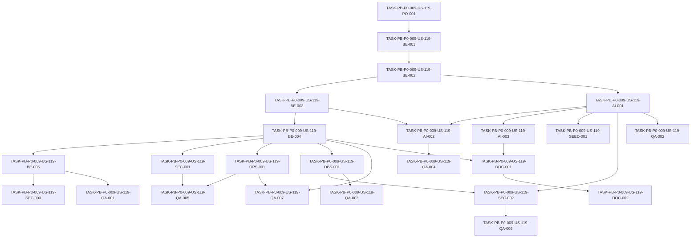

# Development Tasks — PB-P0-009 / US-119: Implementar MockAIProvider determinista

## 1. Metadata

| Field | Value |
|---|---|
| User Story ID | US-119 |
| Source User Story | `management/user-stories/US-119-mock-ai-provider.md` |
| Source Technical Specification | `management/technical-specs/P0/PB-P0-009/US-119-technical-spec.md` |
| Decision Resolution Artifact | No aplica - no existe artifact; se usa `PO/BA Decisions Applied` de la User Story aprobada |
| Priority | P0 |
| Backlog ID | PB-P0-009 |
| Backlog Title | LLMProvider Port + Adapters (OpenAI + Mock + Anthropic Stub) |
| Backlog Execution Order | 9 |
| User Story Position in Backlog Item | 3 of 4 |
| Related User Stories in Backlog Item | US-117, US-118, US-119, US-120 |
| Epic | EPIC-AI-001 |
| Backlog Item Dependencies | PB-P0-002 |
| Feature | MockAIProvider determinista |
| Module / Domain | AI Assistance / Platform / QA |
| Backlog Alignment Status | Found |
| Task Breakdown Status | Ready for Sprint Planning |
| Created Date | 2026-06-17 |
| Last Updated | 2026-06-17 |

---

## 2. Source Validation

| Source | Found | Used | Notes |
|---|---|---|---|
| User Story | Yes | Yes | Aprobada y lista para development tasks. |
| Technical Specification | Yes | Yes | Fuente primaria para el desglose. |
| Decision Resolution Artifact | No | No | No existe artifact; la User Story y la spec contienen decisiones aplicadas. |
| Product Backlog Prioritized | Yes | Yes | Encontrado como `management/artifacts/4-Product-Backlog-Prioritized.md`. |
| ADRs | Yes | Yes | Usadas vía spec, especialmente ADR-AI-001, ADR-AI-003 y ADR-TEST-003. |

---

## 3. Backlog Execution Context

### Parent Backlog Item

PB-P0-009 entrega el puerto `LLMProvider` y sus adapters base. US-119 implementa `MockAIProvider`, requerido para CI, desarrollo local, demo offline y soporte técnico posterior para fallback controlado.

### Execution Order Rationale

US-119 depende de US-117 porque requiere el contrato `LLMProvider`, `AIContext`, `AIResult<TOutput>`, `ProviderId`, `LanguageCode` y errores tipados. Puede ejecutarse después de US-118 o en paralelo controlado si el contrato ya está estable, pero debe mantener schema compatibility con los outputs esperados del adapter principal. No debe implementar selector runtime completo, fallback orchestration, endpoints ni persistencia.

### Related User Stories in Same Backlog Item

| User Story | Role in Backlog Item | Suggested Order |
|---|---|---|
| US-117 | Define el puerto `LLMProvider` y tipos/errores compartidos | 1 |
| US-118 | Implementa `OpenAIProvider` funcional principal | 2 |
| US-119 | Implementa `MockAIProvider` determinista para CI/demo/testing | 3 |
| US-120 | Implementa `AnthropicProvider` stub no funcional | 4 |

---

## 4. Task Breakdown Summary

| Area | Number of Tasks | Notes |
|---|---:|---|
| Product / Analysis | 1 | Confirmar prerequisito de US-117 y límites frente a PB-P0-010/PB-P0-011. |
| Backend | 5 | Fixture key, registry, generic output, provider y mapping a `AIResult<TOutput>`. |
| AI / PromptOps | 3 | Fixtures base, schema compatibility y documentación de dimensiones de lookup. |
| Security / Authorization | 3 | No network/secrets, safe fixture data y separación de fallback/auth. |
| QA / Testing | 7 | Determinismo, fixture lookup, missing fixture, schema compatibility, no network, logs seguros y config mock. |
| Seed / Demo Data | 1 | Fixtures versionables alineadas a escenarios demo sin seed DB. |
| DevOps / Environment | 1 | `LLM_PROVIDER=mock` usable en test/CI sin secrets. |
| Observability / Audit | 1 | Logs seguros para success/failure/missing fixture. |
| Documentation / Traceability | 2 | Responsabilidades/non-goals y documentation alignment. |
| Frontend | 0 | No aplica. |
| API Contract | 0 | No aplica. |
| Database / Prisma | 0 | No aplica. |
| **Total** | **24** | Ready for sprint planning. |

---

## 5. Traceability Matrix

| Acceptance Criterion | Technical Spec Section | Task IDs |
|---|---|---|
| AC-01 Implements `LLMProvider` | 6, 7, 11, 18, 19 | TASK-PB-P0-009-US-119-PO-001, TASK-PB-P0-009-US-119-BE-004, TASK-PB-P0-009-US-119-QA-001 |
| AC-02 Deterministic fixture selection | 6, 7, 11, 13, 18, 19 | TASK-PB-P0-009-US-119-BE-001, TASK-PB-P0-009-US-119-BE-002, TASK-PB-P0-009-US-119-QA-002 |
| AC-03 Fixture key dimensions explicit | 6, 7, 11, 18, 19 | TASK-PB-P0-009-US-119-BE-001, TASK-PB-P0-009-US-119-AI-003, TASK-PB-P0-009-US-119-DOC-001 |
| AC-04 Supported language behavior stable | 6, 7, 11, 13, 18 | TASK-PB-P0-009-US-119-BE-001, TASK-PB-P0-009-US-119-BE-002, TASK-PB-P0-009-US-119-QA-002 |
| AC-05 Missing fixture does not break demo/CI | 6, 7, 11, 13, 14, 18 | TASK-PB-P0-009-US-119-BE-003, TASK-PB-P0-009-US-119-OBS-001, TASK-PB-P0-009-US-119-QA-003 |
| AC-06 No external provider dependency | 6, 7, 12, 13, 18 | TASK-PB-P0-009-US-119-SEC-001, TASK-PB-P0-009-US-119-OPS-001, TASK-PB-P0-009-US-119-QA-005 |
| AC-07 Schema compatibility verified | 6, 7, 11, 13, 18 | TASK-PB-P0-009-US-119-AI-002, TASK-PB-P0-009-US-119-QA-004 |
| AC-08 Fallback ownership separate | 6, 7, 11, 12, 16, 18 | TASK-PB-P0-009-US-119-BE-005, TASK-PB-P0-009-US-119-SEC-003, TASK-PB-P0-009-US-119-QA-001, TASK-PB-P0-009-US-119-DOC-002 |

---

## 6. Development Tasks

### TASK-PB-P0-009-US-119-PO-001 — Confirmar contrato US-117 y límites de MockAIProvider

| Field | Value |
|---|---|
| Area | Product / Analysis |
| Type | Review |
| Priority | Must |
| Estimate | XS |
| Depends On | None |
| Source AC(s) | AC-01 |
| Technical Spec Section(s) | 2, 3, 4, 16, 18, 19 |
| Backlog ID | PB-P0-009 |
| User Story ID | US-119 |
| Owner Role | Tech Lead |
| Status | To Do |

#### Objective

Confirmar que el contrato de US-117 está disponible y que US-119 se limita a `MockAIProvider`, fixtures deterministas y validación de outputs.

#### Scope

##### Include

- Validar disponibilidad de `LLMProvider`, `AIContext`, `AIResult<TOutput>`, `LanguageCode`, `ProviderId` y errores tipados.
- Confirmar que `MockAIProvider` vive en Infrastructure.
- Confirmar non-goals: sin endpoints, DB, selector runtime completo, fallback orchestration ni `AIRecommendation`.

##### Exclude

- Cambiar el contrato de US-117.
- Implementar OpenAI, Anthropic, fallback service o PromptRegistry.

#### Implementation Notes

Si el contrato US-117 aún no cubre una feature o error requerido, resolver primero la dependencia o crear una nota de bloqueo antes de implementar el mock.

#### Acceptance Criteria Covered

AC-01.

#### Definition of Done

- [ ] Contrato US-117 disponible para consumo.
- [ ] Límites de scope confirmados con Tech Lead/PO si aplica.
- [ ] No se agregan tareas de endpoints, DB, fallback service ni selector completo.

---

### TASK-PB-P0-009-US-119-BE-001 — Implementar `MockFixtureKey` y builder determinístico

| Field | Value |
|---|---|
| Area | Backend |
| Type | Implementation |
| Priority | Must |
| Estimate | M |
| Depends On | TASK-PB-P0-009-US-119-PO-001 |
| Source AC(s) | AC-02, AC-03, AC-04 |
| Technical Spec Section(s) | 7, 11, 13, 18, 19 |
| Backlog ID | PB-P0-009 |
| User Story ID | US-119 |
| Owner Role | Backend |
| Status | To Do |

#### Objective

Crear una clave de fixture estable a partir de dimensiones aprobadas para resolver outputs deterministas.

#### Scope

##### Include

- Tipo interno `MockFixtureKey`.
- Builder con `feature`, `languageCode`, `promptVersionId` y `scenarioSeed`.
- Matchers opcionales como `eventTypeCode` o `vendorProfileId`.
- Normalización estable de valores sin usar tiempo real ni randomness.
- Validación de feature/language cuando aplique según contrato.

##### Exclude

- Persistir keys en DB.
- Derivar keys desde raw prompts.
- Usar datos sensibles completos como parte de la key.

#### Implementation Notes

La key debe ser reproducible para la misma entrada/contexto. Si se registra `scenarioSeed`, usar un identificador/hash seguro en logs y evitar payloads completos.

#### Acceptance Criteria Covered

AC-02, AC-03, AC-04.

#### Definition of Done

- [ ] `MockFixtureKey` tiene dimensiones explícitas y tipadas.
- [ ] El builder produce la misma key para la misma entrada/contexto.
- [ ] El builder no depende de `Date.now`, `Math.random` ni orden de ejecución.

---

### TASK-PB-P0-009-US-119-BE-002 — Implementar registry/loader de fixtures deterministas

| Field | Value |
|---|---|
| Area | Backend |
| Type | Implementation |
| Priority | Must |
| Estimate | M |
| Depends On | TASK-PB-P0-009-US-119-BE-001 |
| Source AC(s) | AC-02, AC-04 |
| Technical Spec Section(s) | 7, 11, 13, 15, 18, 19 |
| Backlog ID | PB-P0-009 |
| User Story ID | US-119 |
| Owner Role | Backend |
| Status | To Do |

#### Objective

Crear `MockFixtureRegistry` para buscar fixtures estáticas por key exacta o matchers aprobados.

#### Scope

##### Include

- Tipo interno `MockFixture<TInput, TOutput>`.
- Lookup exacto por key.
- Soporte a matchers opcionales definidos por feature.
- Estructura versionable de fixtures por feature.
- Resultado explícito para fixture encontrada o missing fixture.

##### Exclude

- Cargar fixtures desde DB.
- Resolver prompts reales.
- Implementar fallback service.

#### Implementation Notes

El registry debe ser simple, testeable e inmutable durante ejecución de tests. Evitar estado global mutable que dependa del orden de pruebas.

#### Acceptance Criteria Covered

AC-02, AC-04.

#### Definition of Done

- [ ] Registry resuelve fixture exacta de forma determinista.
- [ ] Registry soporta idioma aprobado con comportamiento estable.
- [ ] Missing fixture queda distinguible sin romper automáticamente la llamada.

---

### TASK-PB-P0-009-US-119-BE-003 — Implementar generic deterministic output para missing fixture

| Field | Value |
|---|---|
| Area | Backend |
| Type | Implementation |
| Priority | Must |
| Estimate | M |
| Depends On | TASK-PB-P0-009-US-119-BE-002 |
| Source AC(s) | AC-05 |
| Technical Spec Section(s) | 7, 11, 13, 14, 17, 18, 19 |
| Backlog ID | PB-P0-009 |
| User Story ID | US-119 |
| Owner Role | Backend |
| Status | To Do |

#### Objective

Permitir que un input válido sin fixture exacta retorne un output genérico, determinista y schema-compatible.

#### Scope

##### Include

- Estrategia de output genérico por feature soportada.
- Mensajes ficticios y seguros para demo/testing.
- Metadata suficiente para indicar que no hubo fixture exacta.
- Error tipado para feature/language realmente no soportado, si aplica por contrato.

##### Exclude

- Usar IA real para completar missing fixtures.
- Silenciar errores de schema inválido.
- Persistir outputs genéricos.

#### Implementation Notes

Missing fixture válido no debe romper demo/CI. Fixture inválida o output genérico inválido sí debe fallar validación para evitar falsos positivos.

#### Acceptance Criteria Covered

AC-05.

#### Definition of Done

- [ ] Missing fixture exacta retorna output genérico estable para inputs válidos.
- [ ] Output genérico no usa datos reales ni PII.
- [ ] Fixture/output inválido se distingue de missing fixture.

---

### TASK-PB-P0-009-US-119-BE-004 — Implementar `MockAIProvider` contra `LLMProvider`

| Field | Value |
|---|---|
| Area | Backend |
| Type | Implementation |
| Priority | Must |
| Estimate | M |
| Depends On | TASK-PB-P0-009-US-119-BE-003 |
| Source AC(s) | AC-01 |
| Technical Spec Section(s) | 7, 11, 12, 18, 19 |
| Backlog ID | PB-P0-009 |
| User Story ID | US-119 |
| Owner Role | Backend |
| Status | To Do |

#### Objective

Crear `MockAIProvider` en Infrastructure cumpliendo el contrato `LLMProvider`.

#### Scope

##### Include

- Clase/adapter `MockAIProvider`.
- Uso de key builder, registry y generic output.
- Retorno de `AIResult<TOutput>`.
- `provider='mock'`.
- Preservación de `promptVersionId`, `languageCode`, `correlationId` si existen en `AIContext`.

##### Exclude

- Selector runtime completo por `LLM_PROVIDER`.
- Controller, endpoint o caso de uso nuevo.
- Persistencia de `AIRecommendation`.

#### Implementation Notes

Application debe depender del puerto `LLMProvider`; la implementación concreta queda en Infrastructure.

#### Acceptance Criteria Covered

AC-01.

#### Definition of Done

- [ ] `MockAIProvider` compila contra `LLMProvider`.
- [ ] La implementación no importa SDKs externos de IA.
- [ ] El provider retorna `AIResult<TOutput>` con metadata del contrato.

---

### TASK-PB-P0-009-US-119-BE-005 — Mapear metadata de resultado y separar fallback ownership

| Field | Value |
|---|---|
| Area | Backend |
| Type | Implementation |
| Priority | Must |
| Estimate | S |
| Depends On | TASK-PB-P0-009-US-119-BE-004 |
| Source AC(s) | AC-08 |
| Technical Spec Section(s) | 7, 11, 12, 14, 16, 18, 19 |
| Backlog ID | PB-P0-009 |
| User Story ID | US-119 |
| Owner Role | Backend |
| Status | To Do |

#### Objective

Asegurar que las llamadas directas al mock retornen metadata correcta sin asumir fallback orchestration.

#### Scope

##### Include

- `provider='mock'`.
- `fallbackUsed=false` para llamadas directas.
- `latencyMs` calculado de forma testeable y estable.
- `promptVersionId` y `languageCode` propagados desde contexto.

##### Exclude

- Cambiar `fallbackUsed=true` dentro del provider.
- Implementar `FallbackService`.
- Persistir audit records.

#### Implementation Notes

Si PB-P0-011 invoca el mock como fallback, esa capa será responsable de atribuir `fallbackUsed=true`.

#### Acceptance Criteria Covered

AC-08.

#### Definition of Done

- [ ] Direct call a mock retorna `fallbackUsed=false`.
- [ ] Metadata del contrato queda completa.
- [ ] No hay lógica de fallback orchestration dentro del provider.

---

### TASK-PB-P0-009-US-119-AI-001 — Crear fixtures base versionables para features MVP

| Field | Value |
|---|---|
| Area | AI / PromptOps |
| Type | Implementation |
| Priority | Must |
| Estimate | M |
| Depends On | TASK-PB-P0-009-US-119-BE-002 |
| Source AC(s) | AC-02, AC-04, AC-05 |
| Technical Spec Section(s) | 11, 13, 15, 18, 19 |
| Backlog ID | PB-P0-009 |
| User Story ID | US-119 |
| Owner Role | AI |
| Status | To Do |

#### Objective

Crear fixtures estáticas mínimas para soportar tests, desarrollo local y demo offline sin dependencia de providers externos.

#### Scope

##### Include

- Fixtures ficticias por feature MVP disponible o por las primeras features soportadas por el contrato.
- Cobertura mínima por idioma aprobado cuando el contrato ya lo permita.
- Uso de `promptVersionId` y `scenarioSeed`.
- Estructura clara por feature.

##### Exclude

- Crear seed DB.
- Persistir `AIRecommendation`.
- Cubrir exhaustivamente todas las variantes futuras.

#### Implementation Notes

Las fixtures deben ser revisables por PromptOps/QA, no contener PII real y mantenerse alineadas con escenarios demo cuando existan.

#### Acceptance Criteria Covered

AC-02, AC-04, AC-05.

#### Definition of Done

- [ ] Fixtures base versionables agregadas.
- [ ] Fixtures usan datos ficticios y seguros.
- [ ] Fixtures cubren al menos los escenarios mínimos definidos por la spec/contrato.

---

### TASK-PB-P0-009-US-119-AI-002 — Validar fixtures y generic outputs contra schemas/DTOs

| Field | Value |
|---|---|
| Area | AI / PromptOps |
| Type | Implementation |
| Priority | Must |
| Estimate | M |
| Depends On | TASK-PB-P0-009-US-119-AI-001, TASK-PB-P0-009-US-119-BE-003 |
| Source AC(s) | AC-07 |
| Technical Spec Section(s) | 7, 11, 13, 17, 18, 19 |
| Backlog ID | PB-P0-009 |
| User Story ID | US-119 |
| Owner Role | AI |
| Status | To Do |

#### Objective

Asegurar que fixtures y outputs genéricos sean compatibles con los schemas/DTOs compartidos de las features IA.

#### Scope

##### Include

- Reutilizar validators/schemas disponibles.
- Validar fixtures en tests o runtime según patrón del código.
- Validar generic deterministic output.
- Tratar output inválido como `AIInvalidOutputError` o error tipado equivalente.

##### Exclude

- Crear schemas duplicados si ya existen.
- Convertir validation en persistencia.
- Hacer llamadas reales a OpenAI para validar fixtures.

#### Implementation Notes

Si los schemas de una feature aún no existen, dejar validación preparada para los schemas disponibles y documentar la brecha sin bloquear el provider base.

#### Acceptance Criteria Covered

AC-07.

#### Definition of Done

- [ ] Fixtures válidas pasan schema/DTO validation.
- [ ] Fixture inválida falla test o produce error tipado.
- [ ] Output genérico cumple el schema esperado.

---

### TASK-PB-P0-009-US-119-AI-003 — Documentar dimensiones de lookup para PromptOps

| Field | Value |
|---|---|
| Area | AI / PromptOps |
| Type | Documentation |
| Priority | Should |
| Estimate | S |
| Depends On | TASK-PB-P0-009-US-119-BE-001, TASK-PB-P0-009-US-119-AI-001 |
| Source AC(s) | AC-03 |
| Technical Spec Section(s) | 7, 11, 15, 18, 19 |
| Backlog ID | PB-P0-009 |
| User Story ID | US-119 |
| Owner Role | AI |
| Status | To Do |

#### Objective

Dejar claras las dimensiones usadas por fixtures para que QA/PromptOps puedan agregar escenarios sin romper determinismo.

#### Scope

##### Include

- Explicar `feature`, `languageCode`, `promptVersionId`, `scenarioSeed`.
- Explicar matchers opcionales como `eventTypeCode` o `vendorProfileId`.
- Indicar convenciones para datos ficticios.
- Indicar cuándo usar generic output.

##### Exclude

- Documentar selector runtime completo.
- Documentar fallback service como parte de US-119.

#### Implementation Notes

Puede vivir junto a fixtures o en documentación técnica del módulo, según patrón del repo.

#### Acceptance Criteria Covered

AC-03.

#### Definition of Done

- [ ] Dimensiones de lookup documentadas.
- [ ] Se explica cómo agregar fixtures sin usar PII real.
- [ ] Se aclara que raw prompts no forman parte de la key.

---

### TASK-PB-P0-009-US-119-SEC-001 — Bloquear red externa, SDKs IA y secrets en MockAIProvider

| Field | Value |
|---|---|
| Area | Security / Authorization |
| Type | Implementation |
| Priority | Must |
| Estimate | S |
| Depends On | TASK-PB-P0-009-US-119-BE-004 |
| Source AC(s) | AC-06 |
| Technical Spec Section(s) | 6, 7, 12, 13, 17, 18, 19 |
| Backlog ID | PB-P0-009 |
| User Story ID | US-119 |
| Owner Role | Backend |
| Status | To Do |

#### Objective

Asegurar que el mock no dependa de red externa, SDKs de providers ni secrets.

#### Scope

##### Include

- Validar que no se importen SDKs OpenAI/Anthropic en el mock.
- Evitar uso de `OPENAI_API_KEY`, `ANTHROPIC_API_KEY` u otros secrets.
- No ejecutar fetch/http/network desde el provider mock.

##### Exclude

- Cambiar implementación de `OpenAIProvider`.
- Implementar secret manager.

#### Implementation Notes

La verificación puede apoyarse en tests, lint/import-boundary o revisión de módulos según tooling disponible.

#### Acceptance Criteria Covered

AC-06.

#### Definition of Done

- [ ] `MockAIProvider` no importa SDKs de IA externos.
- [ ] `MockAIProvider` no requiere secrets.
- [ ] Tests/guardrails cubren ausencia de red real.

---

### TASK-PB-P0-009-US-119-SEC-002 — Revisar fixtures para datos ficticios y logs seguros

| Field | Value |
|---|---|
| Area | Security / Authorization |
| Type | Review |
| Priority | Must |
| Estimate | S |
| Depends On | TASK-PB-P0-009-US-119-AI-001, TASK-PB-P0-009-US-119-OBS-001 |
| Source AC(s) | AC-05, AC-06 |
| Technical Spec Section(s) | 11, 12, 13, 14, 15, 18 |
| Backlog ID | PB-P0-009 |
| User Story ID | US-119 |
| Owner Role | QA |
| Status | To Do |

#### Objective

Confirmar que fixtures y logs del mock no exponen PII real, raw prompts, secrets ni payloads sensibles.

#### Scope

##### Include

- Revisar contenido de fixtures.
- Revisar eventos `ai.mock.fixture_missing` y success/failure.
- Confirmar campos permitidos: feature, language, promptVersionId, scenarioSeed id/hash, correlationId.
- Confirmar que raw prompt/full payload no se loggea.

##### Exclude

- Implementar auditoría persistente.
- Revisar datos productivos reales.

#### Implementation Notes

El mock debe usar datos ficticios y aptos para repo. No incluir nombres, emails, teléfonos o direcciones reales.

#### Acceptance Criteria Covered

AC-05, AC-06.

#### Definition of Done

- [ ] Fixtures no contienen PII real ni secrets.
- [ ] Logs no contienen raw prompts ni full payloads sensibles.
- [ ] Missing fixture emite warning seguro.

---

### TASK-PB-P0-009-US-119-SEC-003 — Verificar separación de auth, ownership y fallback

| Field | Value |
|---|---|
| Area | Security / Authorization |
| Type | Review |
| Priority | Must |
| Estimate | S |
| Depends On | TASK-PB-P0-009-US-119-BE-005 |
| Source AC(s) | AC-08 |
| Technical Spec Section(s) | 4, 11, 12, 16, 18, 19 |
| Backlog ID | PB-P0-009 |
| User Story ID | US-119 |
| Owner Role | Tech Lead |
| Status | To Do |

#### Objective

Confirmar que el provider no asume responsabilidades de autorización ni fallback ownership.

#### Scope

##### Include

- Confirmar que auth/ownership/rate limit ocurren antes de invocar el provider.
- Confirmar que el mock no autoriza por `eventId` o `vendorProfileId`.
- Confirmar `fallbackUsed=false` en llamadas directas.
- Confirmar que PB-P0-011 será dueño de fallback attribution.

##### Exclude

- Implementar middleware de auth/ownership.
- Implementar fallback service.

#### Implementation Notes

`eventTypeCode`, `eventId` o `vendorProfileId` sólo pueden usarse como dimensiones de selección, no como enforcement de permisos.

#### Acceptance Criteria Covered

AC-08.

#### Definition of Done

- [ ] No hay lógica de autorización dentro de `MockAIProvider`.
- [ ] No hay lógica de fallback orchestration dentro de `MockAIProvider`.
- [ ] Separación queda cubierta por revisión o tests.

---

### TASK-PB-P0-009-US-119-OBS-001 — Implementar logs estructurados seguros del mock

| Field | Value |
|---|---|
| Area | Observability / Audit |
| Type | Implementation |
| Priority | Must |
| Estimate | S |
| Depends On | TASK-PB-P0-009-US-119-BE-003, TASK-PB-P0-009-US-119-BE-004 |
| Source AC(s) | AC-05, AC-06 |
| Technical Spec Section(s) | 7, 12, 14, 18, 19 |
| Backlog ID | PB-P0-009 |
| User Story ID | US-119 |
| Owner Role | Backend |
| Status | To Do |

#### Objective

Emitir logs estructurados y seguros para success/failure y missing fixture.

#### Scope

##### Include

- Warn `ai.mock.fixture_missing` o equivalente.
- Success/failure con `provider=mock`.
- Campos seguros: feature, language, promptVersionId, scenarioSeed id/hash, correlationId, status/error code.
- Latency o duración si se puede medir sin flakiness.

##### Exclude

- Métricas Prometheus/OTel.
- `AdminAction`.
- Loggear raw prompts, secrets o payloads completos.

#### Implementation Notes

Los logs deben facilitar debug de fixtures sin exponer contenido sensible.

#### Acceptance Criteria Covered

AC-05, AC-06.

#### Definition of Done

- [ ] Missing fixture genera warning seguro.
- [ ] Success/failure del mock quedan trazables.
- [ ] Tests o revisión validan que no se loggean datos sensibles.

---

### TASK-PB-P0-009-US-119-SEED-001 — Alinear fixtures con escenarios demo sin crear seed DB

| Field | Value |
|---|---|
| Area | Seed / Demo Data |
| Type | Setup |
| Priority | Should |
| Estimate | S |
| Depends On | TASK-PB-P0-009-US-119-AI-001 |
| Source AC(s) | AC-02, AC-04, AC-05 |
| Technical Spec Section(s) | 10, 11, 15, 16, 18, 19 |
| Backlog ID | PB-P0-009 |
| User Story ID | US-119 |
| Owner Role | AI |
| Status | To Do |

#### Objective

Asegurar que las fixtures versionables soporten demo offline y escenarios seed conocidos sin crear datos persistidos.

#### Scope

##### Include

- Fixture keys alineadas con `scenarioSeed` de demo cuando exista.
- Outputs ficticios consistentes con eventos/proveedores demo.
- Notas para reset/aislamiento de fixtures.

##### Exclude

- Crear migrations.
- Crear seed DB.
- Persistir `AIRecommendation`.

#### Implementation Notes

La spec identifica documentación alignment con seed: US-119 sólo crea fixtures del provider, no seed persistente.

#### Acceptance Criteria Covered

AC-02, AC-04, AC-05.

#### Definition of Done

- [ ] Fixtures soportan demo offline mínima.
- [ ] No se crean datos DB en esta historia.
- [ ] Fixtures no mutan durante tests.

---

### TASK-PB-P0-009-US-119-QA-001 — Probar implementación del contrato y metadata directa

| Field | Value |
|---|---|
| Area | QA / Testing |
| Type | Test |
| Priority | Must |
| Estimate | M |
| Depends On | TASK-PB-P0-009-US-119-BE-004, TASK-PB-P0-009-US-119-BE-005 |
| Source AC(s) | AC-01, AC-08 |
| Technical Spec Section(s) | 7, 11, 12, 13, 18, 19 |
| Backlog ID | PB-P0-009 |
| User Story ID | US-119 |
| Owner Role | QA |
| Status | To Do |

#### Objective

Validar que `MockAIProvider` implementa `LLMProvider` y retorna metadata correcta en llamadas directas.

#### Scope

##### Include

- Test de compilación/contrato.
- `provider='mock'`.
- `fallbackUsed=false`.
- Propagación de `promptVersionId`, `languageCode` y `correlationId`.

##### Exclude

- Tests E2E de endpoints IA.
- Tests del fallback service.

#### Implementation Notes

Los tests deben operar con fixtures/fakes locales y sin red externa.

#### Acceptance Criteria Covered

AC-01, AC-08.

#### Definition of Done

- [ ] Tests verifican contrato `LLMProvider`.
- [ ] Tests verifican metadata de `AIResult<TOutput>`.
- [ ] Tests verifican que direct mock no marca fallback.

---

### TASK-PB-P0-009-US-119-QA-002 — Probar determinismo y fixture lookup exacto

| Field | Value |
|---|---|
| Area | QA / Testing |
| Type | Test |
| Priority | Must |
| Estimate | M |
| Depends On | TASK-PB-P0-009-US-119-BE-001, TASK-PB-P0-009-US-119-BE-002, TASK-PB-P0-009-US-119-AI-001 |
| Source AC(s) | AC-02, AC-03, AC-04 |
| Technical Spec Section(s) | 7, 11, 13, 18, 19 |
| Backlog ID | PB-P0-009 |
| User Story ID | US-119 |
| Owner Role | QA |
| Status | To Do |

#### Objective

Confirmar que la misma entrada/contexto produce outputs deep-equal y que el lookup exacto funciona por dimensiones aprobadas.

#### Scope

##### Include

- Mismo input/context retorna deep-equal output.
- Fixture exacta se resuelve correctamente.
- Idioma aprobado selecciona fixture correcta.
- `promptVersionId` y `scenarioSeed` afectan el lookup.

##### Exclude

- Validar traducciones perfectas de contenido.
- Tests con provider real.

#### Implementation Notes

Ejecutar múltiples invocaciones en el mismo test para detectar dependencia de randomness, tiempo real u orden.

#### Acceptance Criteria Covered

AC-02, AC-03, AC-04.

#### Definition of Done

- [ ] Tests de deep-equal pasan.
- [ ] Tests cubren key dimensions explícitas.
- [ ] Tests cubren selección estable por idioma.

---

### TASK-PB-P0-009-US-119-QA-003 — Probar missing fixture con output genérico y warning seguro

| Field | Value |
|---|---|
| Area | QA / Testing |
| Type | Test |
| Priority | Must |
| Estimate | M |
| Depends On | TASK-PB-P0-009-US-119-BE-003, TASK-PB-P0-009-US-119-OBS-001 |
| Source AC(s) | AC-05 |
| Technical Spec Section(s) | 7, 11, 13, 14, 18, 19 |
| Backlog ID | PB-P0-009 |
| User Story ID | US-119 |
| Owner Role | QA |
| Status | To Do |

#### Objective

Validar que missing fixture válida no rompe demo/CI y genera trazabilidad segura.

#### Scope

##### Include

- Input válido sin match exacto retorna generic deterministic output.
- Output genérico es estable entre llamadas.
- Se emite warning seguro de missing fixture.
- Unsupported feature/language produce error tipado si corresponde.

##### Exclude

- Aceptar fixtures inválidas como fallback silencioso.
- Persistir missing fixture.

#### Implementation Notes

Separar casos de missing fixture válido de feature/language no soportado.

#### Acceptance Criteria Covered

AC-05.

#### Definition of Done

- [ ] Missing fixture válido retorna output genérico estable.
- [ ] Missing fixture emite warning seguro.
- [ ] Feature/language no soportado no se trata como éxito silencioso.

---

### TASK-PB-P0-009-US-119-QA-004 — Probar schema compatibility de fixtures y generic outputs

| Field | Value |
|---|---|
| Area | QA / Testing |
| Type | Test |
| Priority | Must |
| Estimate | M |
| Depends On | TASK-PB-P0-009-US-119-AI-002 |
| Source AC(s) | AC-07 |
| Technical Spec Section(s) | 7, 11, 13, 17, 18, 19 |
| Backlog ID | PB-P0-009 |
| User Story ID | US-119 |
| Owner Role | QA |
| Status | To Do |

#### Objective

Confirmar que fixtures y generic outputs cumplen los schemas/DTOs compartidos.

#### Scope

##### Include

- Fixtures válidas pasan validation.
- Output genérico pasa validation.
- Fixture inválida falla test o dispara `AIInvalidOutputError` equivalente.

##### Exclude

- Validar schemas de features aún no implementadas si no existen.
- Validación manual contra OpenAI.

#### Implementation Notes

Preferir validators compartidos por el contrato o por las features para evitar divergencia entre mock y provider real.

#### Acceptance Criteria Covered

AC-07.

#### Definition of Done

- [ ] Tests cubren fixtures válidas.
- [ ] Tests cubren generic output válido.
- [ ] Tests cubren fixture/output inválido.

---

### TASK-PB-P0-009-US-119-QA-005 — Probar no network, no SDKs externos y no secrets

| Field | Value |
|---|---|
| Area | QA / Testing |
| Type | Test |
| Priority | Must |
| Estimate | S |
| Depends On | TASK-PB-P0-009-US-119-SEC-001, TASK-PB-P0-009-US-119-OPS-001 |
| Source AC(s) | AC-06 |
| Technical Spec Section(s) | 12, 13, 18, 19 |
| Backlog ID | PB-P0-009 |
| User Story ID | US-119 |
| Owner Role | QA |
| Status | To Do |

#### Objective

Garantizar que las pruebas y el provider mock no requieren red externa ni secrets.

#### Scope

##### Include

- Guard/fake para detectar llamadas HTTP si el tooling lo permite.
- Verificación de ausencia de `OPENAI_API_KEY`/`ANTHROPIC_API_KEY` en tests.
- Verificación de import boundary contra SDKs externos.
- CI debe pasar sin secrets de IA.

##### Exclude

- Tests manuales contra OpenAI.
- Configuración de `OpenAIProvider`.

#### Implementation Notes

Este test es clave para ADR-TEST-003: CI nunca debe depender de OpenAI real.

#### Acceptance Criteria Covered

AC-06.

#### Definition of Done

- [ ] Tests fallan si el mock intenta red externa.
- [ ] Tests pasan sin secrets.
- [ ] Import boundary del mock queda cubierto.

---

### TASK-PB-P0-009-US-119-QA-006 — Probar safe logging y datos ficticios

| Field | Value |
|---|---|
| Area | QA / Testing |
| Type | Test |
| Priority | Must |
| Estimate | S |
| Depends On | TASK-PB-P0-009-US-119-SEC-002 |
| Source AC(s) | AC-05, AC-06 |
| Technical Spec Section(s) | 12, 13, 14, 15, 18 |
| Backlog ID | PB-P0-009 |
| User Story ID | US-119 |
| Owner Role | QA |
| Status | To Do |

#### Objective

Validar que logs y fixtures no exponen contenido sensible.

#### Scope

##### Include

- Capturar logs de missing fixture.
- Confirmar ausencia de raw prompts, secrets y payloads completos.
- Revisar fixtures con criterios básicos de datos ficticios.

##### Exclude

- Implementar DLP avanzado.
- Revisar logs de providers externos.

#### Implementation Notes

Si no hay tooling para revisar fixtures automáticamente, combinar test de logs con checklist de revisión.

#### Acceptance Criteria Covered

AC-05, AC-06.

#### Definition of Done

- [ ] Tests/revisión confirman logs seguros.
- [ ] Tests/revisión confirman fixtures sin PII real ni secrets.
- [ ] Missing fixture no filtra input completo.

---

### TASK-PB-P0-009-US-119-QA-007 — Probar configuración mock en entorno test/demo

| Field | Value |
|---|---|
| Area | QA / Testing |
| Type | Test |
| Priority | Should |
| Estimate | S |
| Depends On | TASK-PB-P0-009-US-119-OPS-001, TASK-PB-P0-009-US-119-BE-004 |
| Source AC(s) | AC-06 |
| Technical Spec Section(s) | 13, 15, 18, 19 |
| Backlog ID | PB-P0-009 |
| User Story ID | US-119 |
| Owner Role | QA |
| Status | To Do |

#### Objective

Confirmar que `LLM_PROVIDER=mock` es usable para test/CI/demo sin activar providers externos.

#### Scope

##### Include

- Test o smoke local de wiring si composition root ya existe.
- Confirmar que `AI_DEMO_MODE=true` no requiere OpenAI.
- Confirmar que `AI_USE_MOCK_FALLBACK=false` no cambia direct call semantics.

##### Exclude

- Implementar selector runtime completo.
- Probar fallback service.

#### Implementation Notes

Si el selector runtime aún no existe, limitar esta tarea a configuración/documentación y dejar wiring completo para la historia correspondiente.

#### Acceptance Criteria Covered

AC-06.

#### Definition of Done

- [ ] Config mock está documentada y usable para test/demo.
- [ ] CI no requiere secrets de providers IA.
- [ ] No se implementa selector runtime completo en US-119.

---

### TASK-PB-P0-009-US-119-OPS-001 — Configurar entorno test/CI para MockAIProvider sin secrets

| Field | Value |
|---|---|
| Area | DevOps / Environment |
| Type | Setup |
| Priority | Must |
| Estimate | S |
| Depends On | TASK-PB-P0-009-US-119-BE-004 |
| Source AC(s) | AC-06 |
| Technical Spec Section(s) | 13, 15, 18, 19 |
| Backlog ID | PB-P0-009 |
| User Story ID | US-119 |
| Owner Role | DevOps |
| Status | To Do |

#### Objective

Asegurar que test/CI puedan ejecutar IA con `MockAIProvider` sin secrets de providers reales.

#### Scope

##### Include

- Definir valores esperados para `LLM_PROVIDER=mock`.
- Confirmar que `OPENAI_API_KEY` y `ANTHROPIC_API_KEY` no son requeridas en CI.
- Alinear variables de demo: `AI_DEMO_MODE=true`, `AI_USE_MOCK_FALLBACK=false` para direct mock si aplica.

##### Exclude

- Provisionar secrets reales.
- Configurar fallback service.
- Configurar deploy productivo.

#### Implementation Notes

Mantener el mock como provider obligatorio para pruebas automatizadas. OpenAI real queda fuera del pipeline automatizado.

#### Acceptance Criteria Covered

AC-06.

#### Definition of Done

- [ ] Entorno test/CI usa mock sin secrets.
- [ ] Documentación/env example no exige API keys para mock.
- [ ] No se activa red externa en pipeline automatizado.

---

### TASK-PB-P0-009-US-119-DOC-001 — Documentar responsabilidades y non-goals de MockAIProvider

| Field | Value |
|---|---|
| Area | Documentation / Traceability |
| Type | Documentation |
| Priority | Must |
| Estimate | S |
| Depends On | TASK-PB-P0-009-US-119-BE-004, TASK-PB-P0-009-US-119-AI-003 |
| Source AC(s) | AC-01, AC-03, AC-06 |
| Technical Spec Section(s) | 4, 7, 11, 12, 15, 18, 19 |
| Backlog ID | PB-P0-009 |
| User Story ID | US-119 |
| Owner Role | Backend |
| Status | To Do |

#### Objective

Documentar cómo usar y extender `MockAIProvider` sin invadir scopes futuros.

#### Scope

##### Include

- Responsabilidad del mock como adapter Infrastructure.
- Uso para CI, desarrollo local y demo offline.
- Cómo agregar fixtures.
- Non-goals: no DB, no endpoints, no fallback orchestration, no provider real.

##### Exclude

- Runbook completo de demo PB-P3.
- Documentación de OpenAIProvider.

#### Implementation Notes

Puede ser README del módulo, comentario técnico breve o actualización de documentación local según convención del repo.

#### Acceptance Criteria Covered

AC-01, AC-03, AC-06.

#### Definition of Done

- [ ] Responsabilidades del mock documentadas.
- [ ] Non-goals documentados.
- [ ] Instrucciones de fixtures no promueven PII ni secrets.

---

### TASK-PB-P0-009-US-119-DOC-002 — Registrar documentation alignment de seed y fallback

| Field | Value |
|---|---|
| Area | Documentation / Traceability |
| Type | Documentation |
| Priority | Should |
| Estimate | XS |
| Depends On | TASK-PB-P0-009-US-119-DOC-001 |
| Source AC(s) | AC-08 |
| Technical Spec Section(s) | 16, 18, 19 |
| Backlog ID | PB-P0-009 |
| User Story ID | US-119 |
| Owner Role | Tech Lead |
| Status | To Do |

#### Objective

Registrar que US-119 implementa provider/fixtures, mientras seed DB y fallback attribution pertenecen a otros backlogs.

#### Scope

##### Include

- Nota de separación con `docs/11-Data-Seed-Strategy.md`.
- Nota de separación con `docs/17-AI-Architecture-and-PromptOps-Design.md`.
- Confirmar que direct mock usa `fallbackUsed=false`.

##### Exclude

- Reescribir documentos fuente globales salvo que el equipo lo decida en una tarea documental separada.
- Implementar fallback service.

#### Implementation Notes

La spec marca estos conflictos como no bloqueantes. La tarea busca evitar que coding agents implementen persistencia o fallback dentro de US-119.

#### Acceptance Criteria Covered

AC-08.

#### Definition of Done

- [ ] Warning no bloqueante queda visible para handoff.
- [ ] Se aclara que seed DB no pertenece a US-119.
- [ ] Se aclara que fallback attribution pertenece a PB-P0-011.

---

## 7. Required QA Tasks

| Task ID | Test Type | Purpose |
|---|---|---|
| TASK-PB-P0-009-US-119-QA-001 | Unit/Contract | Validar implementación de `LLMProvider` y metadata directa. |
| TASK-PB-P0-009-US-119-QA-002 | Unit/Determinism | Validar deep-equal output y fixture lookup exacto. |
| TASK-PB-P0-009-US-119-QA-003 | Unit/Observability | Validar missing fixture, generic output y warning seguro. |
| TASK-PB-P0-009-US-119-QA-004 | Unit/Schema | Validar schema compatibility de fixtures y generic outputs. |
| TASK-PB-P0-009-US-119-QA-005 | Security/CI | Validar no network, no SDKs externos y no secrets. |
| TASK-PB-P0-009-US-119-QA-006 | Security/Logs | Validar safe logging y fixtures sin datos sensibles. |
| TASK-PB-P0-009-US-119-QA-007 | Config/Smoke | Validar configuración mock para test/demo sin provider externo. |

---

## 8. Required Security Tasks

| Task ID | Security Concern | Purpose |
|---|---|---|
| TASK-PB-P0-009-US-119-SEC-001 | No external provider dependency | Evitar red, SDKs externos y secrets en el mock. |
| TASK-PB-P0-009-US-119-SEC-002 | Sensitive data handling | Confirmar fixtures ficticias y logs seguros. |
| TASK-PB-P0-009-US-119-SEC-003 | Responsibility boundary | Separar provider de auth, ownership y fallback orchestration. |
| TASK-PB-P0-009-US-119-QA-005 | CI/no secrets | Confirmar que automatización pasa sin OpenAI/Anthropic secrets. |
| TASK-PB-P0-009-US-119-QA-006 | Safe logging | Confirmar que no se filtran raw prompts, secrets ni PII. |

---

## 9. Required Seed / Demo Tasks

| Task ID | Seed/Demo Concern | Purpose |
|---|---|---|
| TASK-PB-P0-009-US-119-SEED-001 | Demo offline fixtures | Alinear fixtures versionables con escenarios demo sin crear seed DB. |
| TASK-PB-P0-009-US-119-AI-001 | Fixture base coverage | Crear fixtures ficticias para test/demo. |
| TASK-PB-P0-009-US-119-QA-007 | Mock demo config | Confirmar uso de mock en test/demo sin provider externo. |

---

## 10. Observability / Audit Tasks

| Task ID | Concern | Purpose |
|---|---|---|
| TASK-PB-P0-009-US-119-OBS-001 | Mock provider logs | Emitir logs seguros para fixture missing y success/failure. |
| TASK-PB-P0-009-US-119-QA-003 | Missing fixture warning | Validar warning seguro en missing fixture. |
| TASK-PB-P0-009-US-119-QA-006 | Log redaction | Validar que logs no contienen raw prompts, secrets ni PII. |

---

## 11. Documentation / Traceability Tasks

| Task ID | Document / Artifact | Purpose |
|---|---|---|
| TASK-PB-P0-009-US-119-AI-003 | Fixture lookup documentation | Documentar dimensiones para PromptOps/QA. |
| TASK-PB-P0-009-US-119-DOC-001 | Mock provider documentation | Documentar responsabilidades, uso y non-goals. |
| TASK-PB-P0-009-US-119-DOC-002 | Documentation alignment note | Registrar separación de seed DB y fallback ownership. |
| TASK-PB-P0-009-US-119-OPS-001 | Environment documentation | Documentar/validar `LLM_PROVIDER=mock` sin secrets en test/CI. |

---

## 12. Dependency Graph

---

## 13. Suggested Implementation Order

### Phase 1 — Foundation

1. TASK-PB-P0-009-US-119-PO-001.
2. TASK-PB-P0-009-US-119-BE-001.
3. TASK-PB-P0-009-US-119-BE-002.
4. TASK-PB-P0-009-US-119-AI-001.

### Phase 2 — Core Implementation

1. TASK-PB-P0-009-US-119-BE-003.
2. TASK-PB-P0-009-US-119-BE-004.
3. TASK-PB-P0-009-US-119-BE-005.
4. TASK-PB-P0-009-US-119-AI-002.
5. TASK-PB-P0-009-US-119-AI-003.
6. TASK-PB-P0-009-US-119-SEED-001.
7. TASK-PB-P0-009-US-119-OPS-001.
8. TASK-PB-P0-009-US-119-OBS-001.

### Phase 3 — Validation / Security / QA

1. TASK-PB-P0-009-US-119-SEC-001.
2. TASK-PB-P0-009-US-119-SEC-002.
3. TASK-PB-P0-009-US-119-SEC-003.
4. TASK-PB-P0-009-US-119-QA-001.
5. TASK-PB-P0-009-US-119-QA-002.
6. TASK-PB-P0-009-US-119-QA-003.
7. TASK-PB-P0-009-US-119-QA-004.
8. TASK-PB-P0-009-US-119-QA-005.
9. TASK-PB-P0-009-US-119-QA-006.
10. TASK-PB-P0-009-US-119-QA-007.

### Phase 4 — Documentation / Review

1. TASK-PB-P0-009-US-119-DOC-001.
2. TASK-PB-P0-009-US-119-DOC-002.

---

## 14. Risks & Mitigations

| Risk | Impact | Mitigation | Related Task |
| ---- | ------ | ---------- | ------------ |
| Fixtures divergen de schemas reales | Tests pasan con outputs que el provider real no podría producir | Validar fixtures y generic outputs contra schemas/DTOs compartidos | TASK-PB-P0-009-US-119-AI-002, TASK-PB-P0-009-US-119-QA-004 |
| Missing fixture rompe demo | Demo/CI inestable | Generic deterministic output + warning seguro | TASK-PB-P0-009-US-119-BE-003, TASK-PB-P0-009-US-119-QA-003 |
| Mock usa randomness o tiempo real | Flakiness en CI | Key builder determinístico y tests deep-equal | TASK-PB-P0-009-US-119-BE-001, TASK-PB-P0-009-US-119-QA-002 |
| Fixture contiene PII real | Riesgo de privacidad y filtración en repo | Revisión de fixtures y safe logging | TASK-PB-P0-009-US-119-SEC-002, TASK-PB-P0-009-US-119-QA-006 |
| Mock asume fallback ownership | Trazabilidad incorrecta de `fallbackUsed` | Direct calls `fallbackUsed=false`; PB-P0-011 decide fallback attribution | TASK-PB-P0-009-US-119-BE-005, TASK-PB-P0-009-US-119-SEC-003 |
| Uso accidental de red | CI flaky, costos o secrets requeridos | No SDK imports, no network guard y CI sin secrets | TASK-PB-P0-009-US-119-SEC-001, TASK-PB-P0-009-US-119-QA-005 |
| Scope creep hacia PromptRegistry o seed DB | Duplica PB-P0-010 o seed workflow | Documentar non-goals y separar fixtures versionables de DB seed | TASK-PB-P0-009-US-119-DOC-001, TASK-PB-P0-009-US-119-DOC-002 |

---

## 15. Out of Scope Confirmation

- No implementar `LLMProvider`; cubierto por US-117.
- No implementar `OpenAIProvider`; cubierto por US-118.
- No implementar `AnthropicProvider`; cubierto por US-120.
- No implementar selector runtime completo por `LLM_PROVIDER`.
- No implementar fallback service, retry, timeout orchestration ni fallback attribution; cubierto por PB-P0-011.
- No persistir `AIRecommendation`, `AIPromptVersion` ni seed DB.
- No crear endpoints REST IA.
- No crear UI ni API client frontend.
- No usar OpenAI, Anthropic ni otros providers reales.
- No requerir `OPENAI_API_KEY`, `ANTHROPIC_API_KEY` ni secrets.
- No loggear raw prompts, secrets, PII real ni full payload sensible.
- No implementar RAG, agents, tool calling ni decisiones IA autónomas.

---

## 16. Readiness for Sprint Planning

| Check                                      | Status |
| ------------------------------------------ | ------ |
| Product Backlog mapping found              | Pass   |
| Every AC maps to tasks                     | Pass   |
| Technical Spec used when available         | Pass   |
| QA tasks included                          | Pass   |
| Security tasks included if applicable      | Pass   |
| Seed/demo tasks included if applicable     | Pass   |
| Observability tasks included if applicable | Pass   |
| Documentation tasks included if applicable | Pass   |
| Task dependencies clear                    | Pass   |
| Tasks small enough                         | Pass   |
| Ready for Sprint Planning                  | Yes    |

---

## 17. Final Recommendation

`Ready for Sprint Planning`

US-119 está lista para sprint planning. El desglose cubre `MockAIProvider`, fixture lookup determinístico, schema compatibility, no-network/no-secrets, safe logging, demo fixtures versionables y separación explícita de seed DB, selector completo y fallback orchestration.
