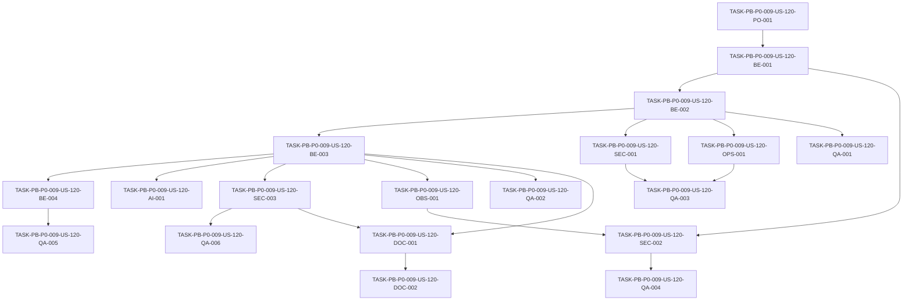

# Development Tasks — PB-P0-009 / US-120: Crear AnthropicProvider stub no funcional

## 1. Metadata

| Field | Value |
|---|---|
| User Story ID | US-120 |
| Source User Story | `management/user-stories/US-120-anthropic-provider-stub.md` |
| Source Technical Specification | `management/technical-specs/P0/PB-P0-009/US-120-technical-spec.md` |
| Decision Resolution Artifact | No aplica - no existe artifact; se usa `PO/BA Decisions Applied` de la User Story aprobada |
| Priority | P0 |
| Backlog ID | PB-P0-009 |
| Backlog Title | LLMProvider Port + Adapters (OpenAI + Mock + Anthropic Stub) |
| Backlog Execution Order | 9 |
| User Story Position in Backlog Item | 4 of 4 |
| Related User Stories in Backlog Item | US-117, US-118, US-119, US-120 |
| Epic | EPIC-AI-001 |
| Backlog Item Dependencies | PB-P0-002 |
| Feature | AnthropicProvider stub |
| Module / Domain | AI Assistance / Platform |
| Backlog Alignment Status | Found |
| Task Breakdown Status | Ready for Sprint Planning |
| Created Date | 2026-06-17 |
| Last Updated | 2026-06-17 |

---

## 2. Source Validation

| Source | Found | Used | Notes |
|---|---|---|---|
| User Story | Yes | Yes | Aprobada y lista para development tasks. |
| Technical Specification | Yes | Yes | Fuente primaria para el desglose. |
| Decision Resolution Artifact | No | No | No existe artifact; la User Story y la spec contienen decisiones aplicadas. |
| Product Backlog Prioritized | Yes | Yes | Encontrado como `management/artifacts/4-Product-Backlog-Prioritized.md`. |
| ADRs | Yes | Yes | Usadas vía spec, especialmente ADR-AI-001 y ADR-AI-004. |

---

## 3. Backlog Execution Context

### Parent Backlog Item

PB-P0-009 entrega el puerto `LLMProvider` y sus tres adapters base. US-120 completa el backlog item con `AnthropicProvider` como stub no funcional para validar sustituibilidad del puerto sin introducir Anthropic funcional en el MVP.

### Execution Order Rationale

US-120 depende de US-117 porque necesita el contrato `LLMProvider` y errores tipados. Puede reutilizar patrones de pruebas de US-118/US-119, pero no depende funcionalmente de OpenAI ni Mock. Debe mantenerse como stub: sin SDK Anthropic, sin secrets, sin red, sin prompts Anthropic, sin fallback y sin output IA real.

### Related User Stories in Same Backlog Item

| User Story | Role in Backlog Item | Suggested Order |
|---|---|---|
| US-117 | Define el puerto `LLMProvider` y tipos/errores compartidos | 1 |
| US-118 | Implementa `OpenAIProvider` funcional principal | 2 |
| US-119 | Implementa `MockAIProvider` determinista para CI/demo/testing | 3 |
| US-120 | Implementa `AnthropicProvider` stub no funcional | 4 |

---

## 4. Task Breakdown Summary

| Area | Number of Tasks | Notes |
|---|---:|---|
| Product / Analysis | 1 | Confirmar prerequisito de US-117 y límites de ADR-AI-004. |
| Backend | 4 | Stub, helper de error tipado, failure explícito y config guard si existe selector. |
| AI / PromptOps | 1 | Confirmar que no hay prompts/output Anthropic y preservar futura sustituibilidad. |
| Security / Authorization | 3 | No SDK, no secrets, no network, safe error/logs y no fallback. |
| QA / Testing | 6 | Contract tests, explicit failure, no SDK/no network/no secrets, safe logs y config guard. |
| DevOps / Environment | 1 | Verificar CI sin `ANTHROPIC_API_KEY` ni dependencia Anthropic. |
| Observability / Audit | 1 | Log/error metadata seguros para activación accidental. |
| Documentation / Traceability | 2 | Documentar stub no funcional y alignment FR-AI-016/Future. |
| Frontend | 0 | No aplica. |
| API Contract | 0 | No aplica. |
| Database / Prisma | 0 | No aplica. |
| Seed / Demo Data | 0 | No aplica. |
| **Total** | **19** | Ready for sprint planning. |

---

## 5. Traceability Matrix

| Acceptance Criterion | Technical Spec Section | Task IDs |
|---|---|---|
| AC-01 Stub implements `LLMProvider` | 6, 7, 11, 18, 19 | TASK-PB-P0-009-US-120-PO-001, TASK-PB-P0-009-US-120-BE-002, TASK-PB-P0-009-US-120-QA-001 |
| AC-02 Stub fails explicitly on invocation | 6, 7, 11, 13, 18, 19 | TASK-PB-P0-009-US-120-BE-001, TASK-PB-P0-009-US-120-BE-003, TASK-PB-P0-009-US-120-QA-002 |
| AC-03 No external Anthropic dependency | 6, 7, 11, 12, 13, 18 | TASK-PB-P0-009-US-120-SEC-001, TASK-PB-P0-009-US-120-OPS-001, TASK-PB-P0-009-US-120-QA-003 |
| AC-04 Selector/config guard explicit | 6, 7, 13, 18, 19 | TASK-PB-P0-009-US-120-BE-004, TASK-PB-P0-009-US-120-QA-005 |
| AC-05 No fallback ownership | 6, 11, 12, 16, 18 | TASK-PB-P0-009-US-120-SEC-003, TASK-PB-P0-009-US-120-QA-006, TASK-PB-P0-009-US-120-DOC-001 |
| AC-06 Safe observability | 6, 7, 12, 14, 18 | TASK-PB-P0-009-US-120-OBS-001, TASK-PB-P0-009-US-120-SEC-002, TASK-PB-P0-009-US-120-QA-004 |
| AC-07 Contract tests cover stub | 6, 7, 13, 18, 19 | TASK-PB-P0-009-US-120-QA-001, TASK-PB-P0-009-US-120-QA-002, TASK-PB-P0-009-US-120-QA-003 |
| AC-08 Functional Anthropic remains Future | 4, 11, 16, 17, 18, 19 | TASK-PB-P0-009-US-120-AI-001, TASK-PB-P0-009-US-120-SEC-001, TASK-PB-P0-009-US-120-DOC-002 |

---

## 6. Development Tasks

### TASK-PB-P0-009-US-120-PO-001 — Confirmar contrato US-117 y alcance de ADR-AI-004

| Field | Value |
|---|---|
| Area | Product / Analysis |
| Type | Review |
| Priority | Must |
| Estimate | XS |
| Depends On | None |
| Source AC(s) | AC-01, AC-08 |
| Technical Spec Section(s) | 2, 3, 4, 16, 18, 19 |
| Backlog ID | PB-P0-009 |
| User Story ID | US-120 |
| Owner Role | Tech Lead |
| Status | To Do |

#### Objective

Confirmar que US-120 implementa únicamente un stub Anthropic no funcional conforme ADR-AI-004.

#### Scope

##### Include

- Validar disponibilidad de `LLMProvider`, `AIContext`, `AIResult<TOutput>`, `ProviderId` y errores tipados de US-117.
- Confirmar error tipado aprobado: `AIProviderNotConfiguredError`, `AINotImplementedError` o equivalente.
- Confirmar non-goals: sin SDK, API key, red, prompts, fallback, endpoints, UI ni persistencia.

##### Exclude

- Cambiar el contrato de US-117.
- Promover Anthropic funcional al MVP.
- Crear selector UI o failover.

#### Implementation Notes

Si el contrato no define error tipado suficiente, resolverlo como dependencia de US-117 antes de crear errores ad hoc no alineados.

#### Acceptance Criteria Covered

AC-01, AC-08.

#### Definition of Done

- [ ] Contrato US-117 está disponible.
- [ ] Error tipado aprobado confirmado.
- [ ] Alcance no funcional de Anthropic queda explícito para implementación.

---

### TASK-PB-P0-009-US-120-BE-001 — Crear helper común de error tipado Anthropic

| Field | Value |
|---|---|
| Area | Backend |
| Type | Implementation |
| Priority | Must |
| Estimate | S |
| Depends On | TASK-PB-P0-009-US-120-PO-001 |
| Source AC(s) | AC-02 |
| Technical Spec Section(s) | 7, 11, 12, 13, 18, 19 |
| Backlog ID | PB-P0-009 |
| User Story ID | US-120 |
| Owner Role | Backend |
| Status | To Do |

#### Objective

Centralizar el fallo explícito del stub en un helper que genere el error tipado aprobado con metadata segura.

#### Scope

##### Include

- Helper interno para construir/lanzar `AIProviderNotConfiguredError`, `AINotImplementedError` o equivalente.
- Metadata segura `provider='anthropic'`.
- Mensaje claro: Anthropic no está configurado/implementado en MVP.
- Propagación segura de `correlationId` si el contrato lo permite.

##### Exclude

- Incluir raw prompt, payload completo, stack trace público o secrets.
- Leer `ANTHROPIC_API_KEY`.
- Sugerir configuración funcional de Anthropic para MVP.

#### Implementation Notes

El helper debe evitar duplicación y asegurar que todos los métodos fallen de manera consistente.

#### Acceptance Criteria Covered

AC-02.

#### Definition of Done

- [ ] Error tipado identifica `provider='anthropic'`.
- [ ] Mensaje es claro y seguro.
- [ ] No se filtran prompts, payloads ni secrets.

---

### TASK-PB-P0-009-US-120-BE-002 — Implementar `AnthropicProvider` contra `LLMProvider`

| Field | Value |
|---|---|
| Area | Backend |
| Type | Implementation |
| Priority | Must |
| Estimate | M |
| Depends On | TASK-PB-P0-009-US-120-BE-001 |
| Source AC(s) | AC-01 |
| Technical Spec Section(s) | 7, 11, 18, 19 |
| Backlog ID | PB-P0-009 |
| User Story ID | US-120 |
| Owner Role | Backend |
| Status | To Do |

#### Objective

Crear `AnthropicProvider` en Infrastructure implementando todos los métodos requeridos por `LLMProvider`.

#### Scope

##### Include

- Module/class `AnthropicProvider` bajo Infrastructure.
- Implementación completa del shape del puerto.
- `provider='anthropic'` en metadata/error cuando aplique.
- Dependencia del helper de error tipado.

##### Exclude

- Crear DTOs específicos de Anthropic.
- Inicializar cliente Anthropic.
- Crear outputs exitosos.
- Crear endpoints o use cases.

#### Implementation Notes

Application/use cases no deben importar el stub concreto. El stub existe para composition root/infrastructure y contract compliance.

#### Acceptance Criteria Covered

AC-01.

#### Definition of Done

- [ ] `AnthropicProvider` compila contra `LLMProvider`.
- [ ] Todos los métodos requeridos están implementados como stub.
- [ ] El archivo vive en Infrastructure según arquitectura.

---

### TASK-PB-P0-009-US-120-BE-003 — Hacer que todos los métodos fallen explícitamente

| Field | Value |
|---|---|
| Area | Backend |
| Type | Implementation |
| Priority | Must |
| Estimate | S |
| Depends On | TASK-PB-P0-009-US-120-BE-002 |
| Source AC(s) | AC-02 |
| Technical Spec Section(s) | 7, 11, 13, 18, 19 |
| Backlog ID | PB-P0-009 |
| User Story ID | US-120 |
| Owner Role | Backend |
| Status | To Do |

#### Objective

Asegurar que cada método del stub falle con error tipado aprobado y nunca retorne output IA exitoso.

#### Scope

##### Include

- Todos los métodos del puerto llaman al helper común.
- Error not-configured/not-implemented consistente.
- Manejo seguro de input recibido sin transformarlo ni enviarlo a terceros.

##### Exclude

- Retornar `AIResult<TOutput>` exitoso.
- Implementar retries, timeout, fallback o mapping de respuesta Anthropic.

#### Implementation Notes

El failure explícito es el comportamiento funcional esperado del stub en MVP.

#### Acceptance Criteria Covered

AC-02.

#### Definition of Done

- [ ] Cada método falla explícitamente.
- [ ] Ningún método produce output IA exitoso.
- [ ] Los errores son tipados y testeables.

---

### TASK-PB-P0-009-US-120-BE-004 — Validar guard de config para `LLM_PROVIDER=anthropic`

| Field | Value |
|---|---|
| Area | Backend |
| Type | Implementation |
| Priority | Should |
| Estimate | S |
| Depends On | TASK-PB-P0-009-US-120-BE-003 |
| Source AC(s) | AC-04 |
| Technical Spec Section(s) | 7, 13, 18, 19 |
| Backlog ID | PB-P0-009 |
| User Story ID | US-120 |
| Owner Role | Backend |
| Status | To Do |

#### Objective

Si el composition root o selector de providers ya existe, asegurar que `LLM_PROVIDER=anthropic` resuelva al stub o falle fast de forma clara, nunca a una integración funcional.

#### Scope

##### Include

- Revisión de composition root/config actual.
- Permitir resolución del stub si el selector ya contempla `anthropic`.
- Fail-fast controlado si el entorno productivo no debe bootear con stub.
- Mensaje claro y seguro para activación accidental.

##### Exclude

- Implementar selector runtime completo si todavía no existe.
- Crear UI selector.
- Leer `ANTHROPIC_API_KEY`.

#### Implementation Notes

ADR-AI-004 menciona validación al boot para activación accidental en prod. La aplicación concreta de este guard depende del estado real del composition root al implementar.

#### Acceptance Criteria Covered

AC-04.

#### Definition of Done

- [ ] Si existe selector, `anthropic` resuelve sólo al stub o fail-fast controlado.
- [ ] No se crea integración funcional.
- [ ] El comportamiento queda cubierto por test o revisión técnica.

---

### TASK-PB-P0-009-US-120-AI-001 — Confirmar ausencia de prompts, output IA y Anthropic funcional

| Field | Value |
|---|---|
| Area | AI / PromptOps |
| Type | Review |
| Priority | Must |
| Estimate | XS |
| Depends On | TASK-PB-P0-009-US-120-BE-003 |
| Source AC(s) | AC-08 |
| Technical Spec Section(s) | 4, 11, 16, 17, 18, 19 |
| Backlog ID | PB-P0-009 |
| User Story ID | US-120 |
| Owner Role | AI |
| Status | To Do |

#### Objective

Confirmar que US-120 no introduce PromptOps específico de Anthropic ni generación real de outputs.

#### Scope

##### Include

- Revisar que no existan prompts Anthropic.
- Confirmar que el stub no transforma inputs para un API externo.
- Confirmar que Anthropic funcional permanece Future.

##### Exclude

- Crear prompt templates.
- Crear schema específico de Anthropic.
- Hacer pruebas manuales contra Anthropic.

#### Implementation Notes

El valor de esta historia es sustituibilidad del puerto y guardrail arquitectónico, no capacidad IA nueva.

#### Acceptance Criteria Covered

AC-08.

#### Definition of Done

- [ ] No se crean prompts Anthropic.
- [ ] No se produce output IA real.
- [ ] Anthropic funcional queda fuera del MVP.

---

### TASK-PB-P0-009-US-120-SEC-001 — Bloquear SDK Anthropic, API key y red externa

| Field | Value |
|---|---|
| Area | Security / Authorization |
| Type | Implementation |
| Priority | Must |
| Estimate | S |
| Depends On | TASK-PB-P0-009-US-120-BE-002 |
| Source AC(s) | AC-03, AC-08 |
| Technical Spec Section(s) | 4, 7, 11, 12, 13, 17, 18 |
| Backlog ID | PB-P0-009 |
| User Story ID | US-120 |
| Owner Role | Backend |
| Status | To Do |

#### Objective

Garantizar que el stub no agrega dependencia funcional de Anthropic ni superficie de seguridad innecesaria.

#### Scope

##### Include

- Verificar que no se instala ni importa `@anthropic-ai/sdk`.
- Verificar que no se lee `ANTHROPIC_API_KEY`.
- Verificar que no hay fetch/http/client init.
- Mantener SDKs externos fuera de Domain/Application.

##### Exclude

- Configurar secret manager.
- Agregar dependencia Anthropic futura.

#### Implementation Notes

La presencia de SDK Anthropic debe considerarse scope creep para US-120.

#### Acceptance Criteria Covered

AC-03, AC-08.

#### Definition of Done

- [ ] No hay dependencia/import de SDK Anthropic.
- [ ] No se requiere `ANTHROPIC_API_KEY`.
- [ ] No hay llamadas de red externas.

---

### TASK-PB-P0-009-US-120-SEC-002 — Asegurar errores y logs sin payload leakage

| Field | Value |
|---|---|
| Area | Security / Authorization |
| Type | Implementation |
| Priority | Must |
| Estimate | S |
| Depends On | TASK-PB-P0-009-US-120-BE-001, TASK-PB-P0-009-US-120-OBS-001 |
| Source AC(s) | AC-06 |
| Technical Spec Section(s) | 7, 12, 14, 18 |
| Backlog ID | PB-P0-009 |
| User Story ID | US-120 |
| Owner Role | Backend |
| Status | To Do |

#### Objective

Asegurar que errores y logs del stub no expongan prompts, payloads, secrets, tokens ni PII.

#### Scope

##### Include

- Error message seguro.
- Metadata permitida: provider, error_code, correlationId.
- Redacción/omisión de input completo.
- Revisión de logs warn si se invoca el stub.

##### Exclude

- Persistir audit logs.
- Implementar sanitizador global.

#### Implementation Notes

Aunque el stub no envía datos a terceros, puede recibir inputs sensibles desde capas upstream; nunca debe loggearlos completos.

#### Acceptance Criteria Covered

AC-06.

#### Definition of Done

- [ ] Error público no incluye payload sensible.
- [ ] Logs no incluyen raw prompt ni secrets.
- [ ] Metadata segura queda disponible para debugging.

---

### TASK-PB-P0-009-US-120-SEC-003 — Verificar que Anthropic no participa en fallback

| Field | Value |
|---|---|
| Area | Security / Authorization |
| Type | Review |
| Priority | Must |
| Estimate | S |
| Depends On | TASK-PB-P0-009-US-120-BE-003 |
| Source AC(s) | AC-05 |
| Technical Spec Section(s) | 4, 11, 12, 16, 17, 18, 19 |
| Backlog ID | PB-P0-009 |
| User Story ID | US-120 |
| Owner Role | Tech Lead |
| Status | To Do |

#### Objective

Confirmar que `AnthropicProvider` no es fallback target ni participa en failover OpenAI -> Anthropic.

#### Scope

##### Include

- Revisar wiring/config actual si existe.
- Confirmar que fallback controlado usa MockAIProvider, no Anthropic.
- Confirmar que el stub no tiene lógica de fallback.

##### Exclude

- Implementar `FallbackService`.
- Cambiar PB-P0-011.

#### Implementation Notes

Esta separación preserva ADR-AI-004 y evita confundir sustituibilidad con fallback funcional.

#### Acceptance Criteria Covered

AC-05.

#### Definition of Done

- [ ] Anthropic no aparece como fallback target.
- [ ] Stub no implementa failover.
- [ ] Revisión queda reflejada en QA o documentación.

---

### TASK-PB-P0-009-US-120-OBS-001 — Implementar observabilidad segura para activación accidental

| Field | Value |
|---|---|
| Area | Observability / Audit |
| Type | Implementation |
| Priority | Should |
| Estimate | S |
| Depends On | TASK-PB-P0-009-US-120-BE-003 |
| Source AC(s) | AC-06 |
| Technical Spec Section(s) | 7, 12, 14, 18 |
| Backlog ID | PB-P0-009 |
| User Story ID | US-120 |
| Owner Role | Backend |
| Status | To Do |

#### Objective

Emitir señal segura cuando el stub sea invocado o resuelto accidentalmente.

#### Scope

##### Include

- Log warn o error tracking seguro.
- Campos: `provider=anthropic`, `error_code`, `correlationId?`.
- Clasificación provider not configured/not implemented.

##### Exclude

- `AdminAction`.
- Métricas Prometheus/OTel obligatorias.
- Logging de prompt/payload.

#### Implementation Notes

Si ya existe métrica de provider errors, puede registrar `ai_provider_error_total{provider=anthropic,error_code=AI_PROVIDER_NOT_CONFIGURED}`.

#### Acceptance Criteria Covered

AC-06.

#### Definition of Done

- [ ] Activación accidental deja señal segura.
- [ ] Logs no exponen payload sensible.
- [ ] Error se clasifica como provider no configurado/no implementado.

---

### TASK-PB-P0-009-US-120-QA-001 — Probar contract compliance de `AnthropicProvider`

| Field | Value |
|---|---|
| Area | QA / Testing |
| Type | Test |
| Priority | Must |
| Estimate | S |
| Depends On | TASK-PB-P0-009-US-120-BE-002 |
| Source AC(s) | AC-01, AC-07 |
| Technical Spec Section(s) | 7, 13, 18, 19 |
| Backlog ID | PB-P0-009 |
| User Story ID | US-120 |
| Owner Role | QA |
| Status | To Do |

#### Objective

Validar que `AnthropicProvider` satisface todos los métodos del puerto `LLMProvider`.

#### Scope

##### Include

- Type/unit test de contract compliance.
- Verificar que todos los métodos requeridos existen.
- Instanciación del stub sin secrets.

##### Exclude

- Tests contra Anthropic real.
- Tests E2E de endpoints IA.

#### Implementation Notes

Los tests deben probar sustituibilidad del puerto, no funcionalidad Anthropic.

#### Acceptance Criteria Covered

AC-01, AC-07.

#### Definition of Done

- [ ] Tests confirman shape de `LLMProvider`.
- [ ] Stub instancia sin `ANTHROPIC_API_KEY`.
- [ ] Tests no llaman red externa.

---

### TASK-PB-P0-009-US-120-QA-002 — Probar failure explícito en todos los métodos

| Field | Value |
|---|---|
| Area | QA / Testing |
| Type | Test |
| Priority | Must |
| Estimate | M |
| Depends On | TASK-PB-P0-009-US-120-BE-003 |
| Source AC(s) | AC-02, AC-07 |
| Technical Spec Section(s) | 7, 11, 13, 18, 19 |
| Backlog ID | PB-P0-009 |
| User Story ID | US-120 |
| Owner Role | QA |
| Status | To Do |

#### Objective

Validar que cada método falla con error tipado aprobado y mensaje seguro.

#### Scope

##### Include

- Test por cada método del puerto.
- Verificación de error code/type not-configured/not-implemented.
- Verificación de `provider='anthropic'` o metadata equivalente.
- Confirmar que no se retorna `AIResult` exitoso.

##### Exclude

- Validar outputs IA.
- Implementar retry/fallback en test.

#### Implementation Notes

Este test debe fallar si alguien agrega funcionalidad real al stub sin cambio formal de alcance.

#### Acceptance Criteria Covered

AC-02, AC-07.

#### Definition of Done

- [ ] Todos los métodos fallan explícitamente.
- [ ] Error tipado y provider metadata verificados.
- [ ] Ningún método retorna éxito.

---

### TASK-PB-P0-009-US-120-QA-003 — Probar no SDK, no network y no secrets

| Field | Value |
|---|---|
| Area | QA / Testing |
| Type | Test |
| Priority | Must |
| Estimate | S |
| Depends On | TASK-PB-P0-009-US-120-SEC-001, TASK-PB-P0-009-US-120-OPS-001 |
| Source AC(s) | AC-03, AC-07, AC-08 |
| Technical Spec Section(s) | 7, 12, 13, 17, 18, 19 |
| Backlog ID | PB-P0-009 |
| User Story ID | US-120 |
| Owner Role | QA |
| Status | To Do |

#### Objective

Confirmar que el stub no introduce dependencia Anthropic funcional ni requisitos de secretos.

#### Scope

##### Include

- Import/dependency guard contra `@anthropic-ai/sdk`.
- Network guard si el harness lo permite.
- Test sin `ANTHROPIC_API_KEY`.
- Verificación de que CI no requiere secrets Anthropic.

##### Exclude

- Tests manuales con API real.
- Provisionar API keys.

#### Implementation Notes

Si no existe tooling de import-boundary, usar una prueba simple o checklist automatizable en el entorno disponible.

#### Acceptance Criteria Covered

AC-03, AC-07, AC-08.

#### Definition of Done

- [ ] Tests/guard fallan si se importa SDK Anthropic.
- [ ] Tests pasan sin `ANTHROPIC_API_KEY`.
- [ ] No hay llamadas HTTP externas.

---

### TASK-PB-P0-009-US-120-QA-004 — Probar safe logging y safe errors

| Field | Value |
|---|---|
| Area | QA / Testing |
| Type | Test |
| Priority | Must |
| Estimate | S |
| Depends On | TASK-PB-P0-009-US-120-SEC-002 |
| Source AC(s) | AC-06, AC-07 |
| Technical Spec Section(s) | 7, 12, 13, 14, 18 |
| Backlog ID | PB-P0-009 |
| User Story ID | US-120 |
| Owner Role | QA |
| Status | To Do |

#### Objective

Validar que errores y logs del stub no exponen datos sensibles.

#### Scope

##### Include

- Captura/verificación de log warn si aplica.
- Confirmar ausencia de raw prompt, payload sensible, tokens y secrets.
- Confirmar metadata segura: provider, error code, correlationId.

##### Exclude

- Implementar sanitización global.
- Revisar logs de OpenAIProvider/MockAIProvider.

#### Implementation Notes

Usar input de prueba con marcadores sensibles para confirmar que no aparecen en errores/logs.

#### Acceptance Criteria Covered

AC-06, AC-07.

#### Definition of Done

- [ ] Logs no contienen payload sensible.
- [ ] Errores no contienen raw prompt ni secrets.
- [ ] Metadata segura queda presente.

---

### TASK-PB-P0-009-US-120-QA-005 — Probar comportamiento de `LLM_PROVIDER=anthropic` si existe selector

| Field | Value |
|---|---|
| Area | QA / Testing |
| Type | Test |
| Priority | Should |
| Estimate | S |
| Depends On | TASK-PB-P0-009-US-120-BE-004 |
| Source AC(s) | AC-04 |
| Technical Spec Section(s) | 7, 13, 18, 19 |
| Backlog ID | PB-P0-009 |
| User Story ID | US-120 |
| Owner Role | QA |
| Status | To Do |

#### Objective

Validar que la configuración `LLM_PROVIDER=anthropic` no habilita Anthropic funcional.

#### Scope

##### Include

- Test de composition root/config si el selector existe.
- Confirmar resolución al stub o fail-fast controlado.
- Confirmar mensaje claro ante activación accidental.

##### Exclude

- Implementar selector completo.
- Crear UI selector.
- Usar API key Anthropic.

#### Implementation Notes

Si el selector todavía no existe, registrar esta validación como pendiente para la historia de selección/config consolidada de PB-P0-009.

#### Acceptance Criteria Covered

AC-04.

#### Definition of Done

- [ ] `LLM_PROVIDER=anthropic` no crea provider funcional.
- [ ] Resolución/fail-fast queda testeada si existe selector.
- [ ] No se requiere `ANTHROPIC_API_KEY`.

---

### TASK-PB-P0-009-US-120-QA-006 — Probar que Anthropic no es fallback target

| Field | Value |
|---|---|
| Area | QA / Testing |
| Type | Test |
| Priority | Must |
| Estimate | S |
| Depends On | TASK-PB-P0-009-US-120-SEC-003 |
| Source AC(s) | AC-05 |
| Technical Spec Section(s) | 11, 12, 13, 16, 18, 19 |
| Backlog ID | PB-P0-009 |
| User Story ID | US-120 |
| Owner Role | QA |
| Status | To Do |

#### Objective

Confirmar que el stub no participa en fallback ni failover dentro del MVP.

#### Scope

##### Include

- Revisión/test de config o fallback registry si existe.
- Confirmar que fallback target aprobado es MockAIProvider, no Anthropic.
- Confirmar que el stub no usa `fallbackUsed`.

##### Exclude

- Implementar fallback service.
- Probar PB-P0-011 completo.

#### Implementation Notes

Esta prueba puede ser unit test, config test o checklist técnico según el estado real del módulo de fallback.

#### Acceptance Criteria Covered

AC-05.

#### Definition of Done

- [ ] Anthropic no se configura como fallback target.
- [ ] No existe failover OpenAI -> Anthropic.
- [ ] Alcance de PB-P0-011 queda respetado.

---

### TASK-PB-P0-009-US-120-OPS-001 — Verificar CI sin dependencia Anthropic

| Field | Value |
|---|---|
| Area | DevOps / Environment |
| Type | Setup |
| Priority | Must |
| Estimate | XS |
| Depends On | TASK-PB-P0-009-US-120-BE-002 |
| Source AC(s) | AC-03 |
| Technical Spec Section(s) | 12, 13, 18, 19 |
| Backlog ID | PB-P0-009 |
| User Story ID | US-120 |
| Owner Role | DevOps |
| Status | To Do |

#### Objective

Confirmar que CI puede ejecutar pruebas del stub sin SDK, red ni secrets Anthropic.

#### Scope

##### Include

- Confirmar que `ANTHROPIC_API_KEY` no es variable requerida.
- Confirmar que no se agrega dependencia Anthropic al install.
- Confirmar que tests pasan en modo offline.

##### Exclude

- Provisionar secrets Anthropic.
- Configurar entorno Anthropic real.

#### Implementation Notes

Mantener Anthropic como stub no funcional reduce superficie de seguridad y evita costos/dependencias.

#### Acceptance Criteria Covered

AC-03.

#### Definition of Done

- [ ] CI no requiere `ANTHROPIC_API_KEY`.
- [ ] No se instala SDK Anthropic.
- [ ] Tests del stub son offline.

---

### TASK-PB-P0-009-US-120-DOC-001 — Documentar uso y límites del AnthropicProvider stub

| Field | Value |
|---|---|
| Area | Documentation / Traceability |
| Type | Documentation |
| Priority | Must |
| Estimate | S |
| Depends On | TASK-PB-P0-009-US-120-BE-003, TASK-PB-P0-009-US-120-SEC-003 |
| Source AC(s) | AC-05, AC-08 |
| Technical Spec Section(s) | 4, 11, 16, 18, 19 |
| Backlog ID | PB-P0-009 |
| User Story ID | US-120 |
| Owner Role | Tech Lead |
| Status | To Do |

#### Objective

Documentar que `AnthropicProvider` existe sólo como stub no funcional para sustituibilidad del puerto.

#### Scope

##### Include

- Explicar que todos los métodos fallan explícitamente.
- Indicar que no hay SDK, API key, red ni prompts Anthropic.
- Indicar que no participa en fallback.
- Indicar que no se usa en demo ni producción MVP.

##### Exclude

- Runbook para Anthropic real.
- Instrucciones para obtener API key.
- UI selector.

#### Implementation Notes

La documentación debe evitar que futuros coding agents interpreten el stub como integración parcial lista para completar dentro del MVP.

#### Acceptance Criteria Covered

AC-05, AC-08.

#### Definition of Done

- [ ] Stub no funcional documentado.
- [ ] No fallback y no demo documentados.
- [ ] No se promueve configuración funcional Anthropic.

---

### TASK-PB-P0-009-US-120-DOC-002 — Registrar alignment FR-AI-016 y Anthropic Future

| Field | Value |
|---|---|
| Area | Documentation / Traceability |
| Type | Documentation |
| Priority | Should |
| Estimate | XS |
| Depends On | TASK-PB-P0-009-US-120-DOC-001 |
| Source AC(s) | AC-08 |
| Technical Spec Section(s) | 16, 18, 19 |
| Backlog ID | PB-P0-009 |
| User Story ID | US-120 |
| Owner Role | Tech Lead |
| Status | To Do |

#### Objective

Registrar la nota de alignment no bloqueante: FR-AI-016 lista selector runtime `openai | mock`, mientras PB-P0-009/ADR-AI-004 permiten `anthropic` sólo como stub.

#### Scope

##### Include

- Nota de documentación alignment en handoff.
- Aclarar que Anthropic funcional sigue Future.
- Aclarar que no hay selector UI ni operación funcional.

##### Exclude

- Reescribir FRD global salvo decisión separada.
- Crear ADR nuevo.

#### Implementation Notes

La spec marca el conflicto como no bloqueante; esta tarea mantiene visibilidad para roadmap y QA.

#### Acceptance Criteria Covered

AC-08.

#### Definition of Done

- [ ] Alignment FR-AI-016 queda registrado.
- [ ] Anthropic funcional queda identificado como Future.
- [ ] No se introduce scope nuevo.

---

## 7. Required QA Tasks

| Task ID | Test Type | Purpose |
|---|---|---|
| TASK-PB-P0-009-US-120-QA-001 | Unit/Contract | Validar que `AnthropicProvider` implementa `LLMProvider`. |
| TASK-PB-P0-009-US-120-QA-002 | Unit/Error Handling | Validar failure explícito con error tipado en todos los métodos. |
| TASK-PB-P0-009-US-120-QA-003 | Security/CI | Validar no SDK, no network y no secrets. |
| TASK-PB-P0-009-US-120-QA-004 | Security/Logs | Validar safe logging y safe errors. |
| TASK-PB-P0-009-US-120-QA-005 | Config/Composition | Validar `LLM_PROVIDER=anthropic` si existe selector. |
| TASK-PB-P0-009-US-120-QA-006 | Scope/Fallback | Validar que Anthropic no es fallback target. |

---

## 8. Required Security Tasks

| Task ID | Security Concern | Purpose |
|---|---|---|
| TASK-PB-P0-009-US-120-SEC-001 | No external dependency | Bloquear SDK Anthropic, API key y red externa. |
| TASK-PB-P0-009-US-120-SEC-002 | Sensitive data handling | Evitar leakage de prompts, payloads, tokens y secrets en logs/errores. |
| TASK-PB-P0-009-US-120-SEC-003 | No fallback misuse | Confirmar que Anthropic no participa en failover/fallback. |
| TASK-PB-P0-009-US-120-QA-003 | CI/no secrets | Validar automatización offline sin secrets Anthropic. |
| TASK-PB-P0-009-US-120-QA-004 | Safe errors/logs | Validar redacción de datos sensibles. |

---

## 9. Required Seed / Demo Tasks

`No aplica`.

US-120 no crea seed, fixtures ni escenarios demo. Anthropic no se usa en demo MVP.

---

## 10. Observability / Audit Tasks

| Task ID | Concern | Purpose |
|---|---|---|
| TASK-PB-P0-009-US-120-OBS-001 | Stub activation signal | Emitir metadata segura si Anthropic se invoca accidentalmente. |
| TASK-PB-P0-009-US-120-QA-004 | Safe observability | Validar que logs/errores no filtran datos sensibles. |

---

## 11. Documentation / Traceability Tasks

| Task ID | Document / Artifact | Purpose |
|---|---|---|
| TASK-PB-P0-009-US-120-DOC-001 | Anthropic stub documentation | Documentar uso, límites y non-goals del stub. |
| TASK-PB-P0-009-US-120-DOC-002 | Documentation alignment note | Registrar alignment FR-AI-016 y Anthropic Future. |
| TASK-PB-P0-009-US-120-AI-001 | AI/PromptOps review | Confirmar ausencia de prompts/output Anthropic funcional. |

---

## 12. Dependency Graph

---

## 13. Suggested Implementation Order

### Phase 1 — Foundation

1. TASK-PB-P0-009-US-120-PO-001.
2. TASK-PB-P0-009-US-120-BE-001.
3. TASK-PB-P0-009-US-120-BE-002.

### Phase 2 — Core Implementation

1. TASK-PB-P0-009-US-120-BE-003.
2. TASK-PB-P0-009-US-120-BE-004.
3. TASK-PB-P0-009-US-120-AI-001.
4. TASK-PB-P0-009-US-120-OBS-001.
5. TASK-PB-P0-009-US-120-OPS-001.

### Phase 3 — Validation / Security / QA

1. TASK-PB-P0-009-US-120-SEC-001.
2. TASK-PB-P0-009-US-120-SEC-002.
3. TASK-PB-P0-009-US-120-SEC-003.
4. TASK-PB-P0-009-US-120-QA-001.
5. TASK-PB-P0-009-US-120-QA-002.
6. TASK-PB-P0-009-US-120-QA-003.
7. TASK-PB-P0-009-US-120-QA-004.
8. TASK-PB-P0-009-US-120-QA-005.
9. TASK-PB-P0-009-US-120-QA-006.

### Phase 4 — Documentation / Review

1. TASK-PB-P0-009-US-120-DOC-001.
2. TASK-PB-P0-009-US-120-DOC-002.

---

## 14. Risks & Mitigations

| Risk | Impact | Mitigation | Related Task |
| ---- | ------ | ---------- | ------------ |
| Stub se convierte accidentalmente en provider funcional | Scope creep y violación de ADR-AI-004 | No SDK/no network/no secrets y tests de failure explícito | TASK-PB-P0-009-US-120-SEC-001, TASK-PB-P0-009-US-120-QA-002, TASK-PB-P0-009-US-120-QA-003 |
| `LLM_PROVIDER=anthropic` rompe bootstrap sin mensaje claro | Mala DX y debugging lento | Config guard/fail-fast controlado y error tipado | TASK-PB-P0-009-US-120-BE-004, TASK-PB-P0-009-US-120-QA-005 |
| Anthropic usado como fallback | Viola MVP y confunde trazabilidad | Revisión/test de no fallback target | TASK-PB-P0-009-US-120-SEC-003, TASK-PB-P0-009-US-120-QA-006 |
| SDK Anthropic agregado por error | Aumenta superficie de seguridad y dependencia innecesaria | Import/dependency guard | TASK-PB-P0-009-US-120-SEC-001, TASK-PB-P0-009-US-120-QA-003 |
| Logs exponen prompts recibidos por el stub | Riesgo privacidad | Safe logging/error tests | TASK-PB-P0-009-US-120-SEC-002, TASK-PB-P0-009-US-120-QA-004 |
| Error no implementado se mapea como crash genérico | Mala observabilidad | Error tipado aprobado y metadata segura | TASK-PB-P0-009-US-120-BE-001, TASK-PB-P0-009-US-120-OBS-001 |

---

## 15. Out of Scope Confirmation

- No integrar Anthropic API funcional.
- No instalar `@anthropic-ai/sdk` ni otro SDK Anthropic.
- No leer, validar ni requerir `ANTHROPIC_API_KEY`.
- No implementar failover OpenAI -> Anthropic.
- No usar Anthropic como fallback.
- No crear prompts específicos para Anthropic.
- No producir output IA real.
- No crear selector dinámico en UI.
- No crear endpoints IA.
- No crear UI ni API client frontend.
- No persistir `AIRecommendation`.
- No crear seed, fixtures demo ni datos DB.
- No implementar RAG, agents, tool calling ni decisiones IA autónomas.

---

## 16. Readiness for Sprint Planning

| Check                                      | Status |
| ------------------------------------------ | ------ |
| Product Backlog mapping found              | Pass   |
| Every AC maps to tasks                     | Pass   |
| Technical Spec used when available         | Pass   |
| QA tasks included                          | Pass   |
| Security tasks included if applicable      | Pass   |
| Seed/demo tasks included if applicable     | N/A    |
| Observability tasks included if applicable | Pass   |
| Documentation tasks included if applicable | Pass   |
| Task dependencies clear                    | Pass   |
| Tasks small enough                         | Pass   |
| Ready for Sprint Planning                  | Yes    |

---

## 17. Final Recommendation

`Ready for Sprint Planning`

US-120 está lista para sprint planning. El desglose mantiene `AnthropicProvider` como stub no funcional que implementa `LLMProvider`, falla explícitamente con error tipado, no usa SDK/secrets/red, no participa en fallback y preserva Anthropic funcional como Future fuera del MVP.
