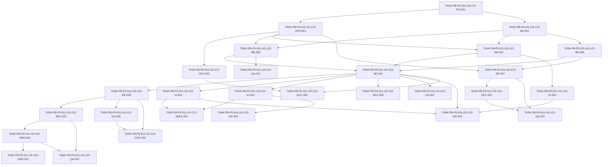

# Development Tasks — PB-P0-011 / US-123: Aplicar timeout 60s y fallback Mock controlado

## 1. Metadata

| Field | Value |
|---|---|
| User Story ID | US-123 |
| Source User Story | `management/user-stories/US-123-ai-timeout-and-fallback.md` |
| Source Technical Specification | `management/technical-specs/P0/PB-P0-011/US-123-technical-spec.md` |
| Decision Resolution Artifact | No aplica - no existe artifact; se usan `PO/BA Decisions Applied`, ADR-AI-003 y decisión PO 8.1 #9 |
| Priority | P0 |
| Backlog ID | PB-P0-011 |
| Backlog Title | Timeout 60s, fallback Mock en modo demo y validación JSON con 1 reintento |
| Backlog Execution Order | 11 |
| User Story Position in Backlog Item | 1 of 2 |
| Related User Stories in Backlog Item | US-123, US-124 |
| Epic | EPIC-AI-001 |
| Backlog Item Dependencies | PB-P0-009, PB-P0-010 |
| Feature | AI timeout + controlled Mock fallback |
| Module / Domain | AI Assistance / Platform |
| Backlog Alignment Status | Found |
| Task Breakdown Status | Ready for Sprint Planning |
| Created Date | 2026-06-18 |
| Last Updated | 2026-06-18 |

---

## 2. Source Validation

| Source | Found | Used | Notes |
|---|---|---|---|
| User Story | Yes | Yes | Historia aprobada con notas menores y lista para development tasks. |
| Technical Specification | Yes | Yes | Fuente primaria para este desglose. |
| Decision Resolution Artifact | No | No | No existe artifact; la historia y la spec contienen las decisiones aplicadas. |
| Product Backlog Prioritized | Yes | Yes | Encontrado como `management/artifacts/4-Product-Backlog-Prioritized.md`. |
| ADRs | Yes | Yes | Usadas vía spec, especialmente ADR-AI-003, ADR-AI-004, ADR-AI-005 y ADR-TEST-003. |

---

## 3. Backlog Execution Context

### Parent Backlog Item

PB-P0-011 entrega resiliencia base para ejecución IA del MVP: timeout fijo de 60,000 ms, fallback controlado a `MockAIProvider` para demo/test y validación JSON estricta con un reintento. US-123 cubre timeout, fallback y metadata de ejecución. US-124 completa el backlog item con validación JSON y retry.

### Execution Order Rationale

US-123 debe ejecutarse después de PB-P0-009 porque depende de `LLMProvider`, provider factory, `OpenAIProvider`, `MockAIProvider` y `AnthropicProvider` stub. También depende de PB-P0-010 porque debe producir metadata compatible con `AIRecommendation`. Debe ejecutarse antes de US-124 o de forma coordinada, porque US-124 delega timeout/provider failures y fallback demo/test a esta capa.

### Related User Stories in Same Backlog Item

| User Story | Role in Backlog Item | Suggested Order |
|---|---|---|
| US-123 | Implementa timeout 60s y fallback controlado a `MockAIProvider` | 1 |
| US-124 | Implementa validación JSON estricta y un reintento controlado | 2 |

---

## 4. Task Breakdown Summary

| Area | Number of Tasks | Notes |
|---|---:|---|
| Product / Analysis | 1 | Confirmar matriz de environments y límites de fallback. |
| DevOps / Environment | 2 | Config schema, `.env.example` y perfiles seguros. |
| Backend | 7 | Tipos, errores, timeout wrapper, fallback service, execution service y wiring. |
| AI / PromptOps | 3 | Uso correcto de providers, mock primario vs fallback y límite Anthropic. |
| Security / Authorization | 3 | Config insegura, safe logs y no bypass de autorización upstream. |
| Observability / Audit | 2 | Eventos estructurados, correlation ID y métricas opcionales. |
| Seed / Demo Data | 1 | Demo/test determinísticos sin seed DB nuevo. |
| QA / Testing | 7 | Unit, integration, config, security, CI y no network. |
| Documentation / Traceability | 2 | Alineación de env vars, fallback Mock y handoff a US-124. |
| Frontend | 0 | No aplica. |
| API Contract | 0 | No aplica. |
| Database / Prisma | 0 | No aplica directamente. |
| **Total** | **28** | Ready for sprint planning. |

---

## 5. Traceability Matrix

| Acceptance Criterion | Technical Spec Section | Task IDs |
|---|---|---|
| AC-01 AI calls enforce a 60,000 ms timeout | 6, 7, 11, 13, 18, 19 | TASK-PB-P0-011-US-123-PO-001, TASK-PB-P0-011-US-123-OPS-001, TASK-PB-P0-011-US-123-BE-001, TASK-PB-P0-011-US-123-BE-002, TASK-PB-P0-011-US-123-BE-004, TASK-PB-P0-011-US-123-QA-001, TASK-PB-P0-011-US-123-QA-002 |
| AC-02 Fallback to MockAIProvider only in demo/test fallback modes | 6, 7, 11, 13, 15, 18, 19 | TASK-PB-P0-011-US-123-BE-003, TASK-PB-P0-011-US-123-BE-005, TASK-PB-P0-011-US-123-AI-001, TASK-PB-P0-011-US-123-QA-003, TASK-PB-P0-011-US-123-SEED-001 |
| AC-03 Fallback is not silent in production-academic | 6, 7, 11, 12, 13, 18, 19 | TASK-PB-P0-011-US-123-OPS-001, TASK-PB-P0-011-US-123-BE-003, TASK-PB-P0-011-US-123-SEC-001, TASK-PB-P0-011-US-123-QA-004 |
| AC-04 LLM_PROVIDER=mock remains deterministic primary mode | 6, 7, 11, 13, 15, 18, 19 | TASK-PB-P0-011-US-123-BE-005, TASK-PB-P0-011-US-123-AI-002, TASK-PB-P0-011-US-123-QA-005, TASK-PB-P0-011-US-123-SEED-001 |
| AC-05 AnthropicProvider is never used as fallback in MVP | 6, 7, 11, 13, 18, 19 | TASK-PB-P0-011-US-123-BE-003, TASK-PB-P0-011-US-123-AI-003, TASK-PB-P0-011-US-123-QA-003 |
| AC-06 Timeout/fallback metadata is available for AIRecommendation persistence | 6, 7, 10, 11, 14, 18, 19 | TASK-PB-P0-011-US-123-BE-001, TASK-PB-P0-011-US-123-BE-006, TASK-PB-P0-011-US-123-OBS-001, TASK-PB-P0-011-US-123-QA-006 |
| AC-07 Bootstrap/config validation prevents unsafe fallback settings | 6, 7, 12, 13, 18, 19 | TASK-PB-P0-011-US-123-OPS-001, TASK-PB-P0-011-US-123-OPS-002, TASK-PB-P0-011-US-123-BE-007, TASK-PB-P0-011-US-123-SEC-001, TASK-PB-P0-011-US-123-QA-004 |
| AC-08 Timeout and fallback events are observable without sensitive payloads | 7, 11, 12, 13, 14, 18, 19 | TASK-PB-P0-011-US-123-SEC-002, TASK-PB-P0-011-US-123-OBS-001, TASK-PB-P0-011-US-123-OBS-002, TASK-PB-P0-011-US-123-QA-007 |
| AC-09 Tests verify timeout and fallback behavior deterministically | 13, 15, 17, 18, 19 | TASK-PB-P0-011-US-123-QA-001, TASK-PB-P0-011-US-123-QA-002, TASK-PB-P0-011-US-123-QA-003, TASK-PB-P0-011-US-123-QA-004, TASK-PB-P0-011-US-123-QA-005, TASK-PB-P0-011-US-123-QA-006, TASK-PB-P0-011-US-123-QA-007 |

---

## 6. Development Tasks

### TASK-PB-P0-011-US-123-PO-001 — Confirmar matriz de ejecución AI y límites de fallback

| Field | Value |
|---|---|
| Area | Product / Analysis |
| Type | Review |
| Priority | Must |
| Estimate | XS |
| Depends On | None |
| Source AC(s) | AC-01, AC-02, AC-03 |
| Technical Spec Section(s) | 2, 3, 4, 6, 16, 18, 19 |
| Backlog ID | PB-P0-011 |
| User Story ID | US-123 |
| Owner Role | Tech Lead |
| Status | To Do |

#### Objective

Confirmar que la implementación se limita a timeout/fallback de infraestructura IA, usando los flags aprobados y sin mover lógica de JSON validation, persistencia, endpoints o UI a US-123.

#### Scope

##### Include

- Verificar dependencias PB-P0-009, PB-P0-010 y relación con US-124.
- Confirmar perfiles `local-dev`, `test`, `demo-academic` y `production-academic`.
- Confirmar que fallback permitido apunta sólo a `MockAIProvider`.

##### Exclude

- Rediseñar provider contracts.
- Reabrir ADR-AI-003/ADR-AI-004.
- Definir retry por JSON inválido.

#### Implementation Notes

Usar la spec como fuente primaria si existen diferencias con documentos antiguos que mencionan fallback a plantilla estática o `AI_FALLBACK_ENABLED`.

#### Acceptance Criteria Covered

AC-01, AC-02, AC-03.

#### Definition of Done

- [ ] Matriz de environments validada contra la spec.
- [ ] Límites de scope comunicados al equipo.
- [ ] No se generan tareas de endpoints, UI, persistencia ni JSON retry dentro de US-123.

---

### TASK-PB-P0-011-US-123-OPS-001 — Implementar schema de configuración AI para timeout y fallback

| Field | Value |
|---|---|
| Area | DevOps / Environment |
| Type | Setup |
| Priority | Must |
| Estimate | S |
| Depends On | TASK-PB-P0-011-US-123-PO-001 |
| Source AC(s) | AC-01, AC-03, AC-07 |
| Technical Spec Section(s) | 7, 11, 12, 13, 18, 19 |
| Backlog ID | PB-P0-011 |
| User Story ID | US-123 |
| Owner Role | DevOps |
| Status | To Do |

#### Objective

Definir y validar configuración runtime para `AI_TIMEOUT_MS`, `LLM_PROVIDER`, `AI_DEMO_MODE`, `AI_USE_MOCK_FALLBACK` y `AI_LOG_PAYLOADS`.

#### Scope

##### Include

- Default `AI_TIMEOUT_MS=60000`.
- Validación de enteros positivos y provider soportado.
- Reglas de seguridad para `demo-academic` y `production-academic`.
- Rechazo de `AI_LOG_PAYLOADS=true` en demo/production.

##### Exclude

- Secrets reales.
- Nuevos providers.
- Feature flags de UI.

#### Implementation Notes

Ubicar el schema junto al sistema de configuración existente. Si existe config legacy con `AI_FALLBACK_ENABLED`, mapearla sólo si ya está soportada y documentar preferencia por `AI_USE_MOCK_FALLBACK`.

#### Acceptance Criteria Covered

AC-01, AC-03, AC-07.

#### Definition of Done

- [ ] Config AI tiene defaults y validaciones explícitas.
- [ ] Config insegura falla en bootstrap con error controlado.
- [ ] Producción no permite fallback silencioso ni payload logging.

---

### TASK-PB-P0-011-US-123-OPS-002 — Actualizar ejemplos de environment para AI execution

| Field | Value |
|---|---|
| Area | DevOps / Environment |
| Type | Documentation |
| Priority | Must |
| Estimate | XS |
| Depends On | TASK-PB-P0-011-US-123-OPS-001 |
| Source AC(s) | AC-07, AC-09 |
| Technical Spec Section(s) | 13, 15, 16, 18, 19 |
| Backlog ID | PB-P0-011 |
| User Story ID | US-123 |
| Owner Role | DevOps |
| Status | To Do |

#### Objective

Alinear `.env.example`, documentación local o configuración equivalente con los flags aprobados para test, demo y producción académica.

#### Scope

##### Include

- Valores ejemplo sin secrets.
- `test` con `LLM_PROVIDER=mock` y sin red.
- `demo-academic` con fallback Mock permitido y `AI_LOG_PAYLOADS=false`.
- `production-academic` sin fallback silencioso.

##### Exclude

- Publicar API keys.
- Crear nuevos profiles no aprobados.

#### Implementation Notes

La documentación debe reflejar nombres formalizados: `AI_DEMO_MODE` y `AI_USE_MOCK_FALLBACK`.

#### Acceptance Criteria Covered

AC-07, AC-09.

#### Definition of Done

- [ ] Ejemplos de env no contienen secretos.
- [ ] Profiles test/demo/production quedan documentados.
- [ ] CI puede ejecutar sin OpenAI ni network.

---

### TASK-PB-P0-011-US-123-BE-001 — Definir tipos de resultado y metadata de AI execution

| Field | Value |
|---|---|
| Area | Backend |
| Type | Implementation |
| Priority | Must |
| Estimate | M |
| Depends On | TASK-PB-P0-011-US-123-PO-001 |
| Source AC(s) | AC-01, AC-06 |
| Technical Spec Section(s) | 7, 10, 11, 14, 18, 19 |
| Backlog ID | PB-P0-011 |
| User Story ID | US-123 |
| Owner Role | Backend |
| Status | To Do |

#### Objective

Crear o extender tipos internos para `AIExecutionResult`, `AIExecutionMetadata`, provider IDs y códigos de error, compatibles con `AIRecommendation` downstream.

#### Scope

##### Include

- `provider`, `originalProvider`, `fallbackUsed`, `fallbackReason`.
- `timeoutMs`, `latencyMs`, `originalErrorCode`, `correlationId`.
- Estado final o clasificación de error.
- Tipos genéricos para preservar `AIResult<TOutput>`.

##### Exclude

- Modelos Prisma nuevos.
- Persistencia de `AIRecommendation`.
- Output schema validation.

#### Implementation Notes

Reusar tipos de PB-P0-009 cuando existan. No duplicar `LLMProvider` ni acoplar Application a SDKs.

#### Acceptance Criteria Covered

AC-01, AC-06.

#### Definition of Done

- [ ] Tipos compilan en TypeScript.
- [ ] Metadata mínima está representada.
- [ ] Contrato no incluye prompts completos, raw outputs inseguros ni secrets.

---

### TASK-PB-P0-011-US-123-BE-002 — Implementar timeout wrapper testeable

| Field | Value |
|---|---|
| Area | Backend |
| Type | Implementation |
| Priority | Must |
| Estimate | M |
| Depends On | TASK-PB-P0-011-US-123-OPS-001, TASK-PB-P0-011-US-123-BE-001 |
| Source AC(s) | AC-01, AC-09 |
| Technical Spec Section(s) | 6, 7, 13, 17, 18, 19 |
| Backlog ID | PB-P0-011 |
| User Story ID | US-123 |
| Owner Role | Backend |
| Status | To Do |

#### Objective

Implementar `AITimeoutService.withTimeout(...)` o equivalente para cortar la espera al provider en `AI_TIMEOUT_MS`.

#### Scope

##### Include

- Timeout default `60000`.
- Override válido para tests.
- Soporte para fake timers o clock injectable.
- `AbortController` si el provider adapter lo soporta.
- Ignorar resultado tardío cuando no pueda abortarse.

##### Exclude

- Retry de output inválido.
- Fallback decision logic.
- Network calls reales en tests.

#### Implementation Notes

La implementación debe producir un error tipado de timeout y no resolver dos veces si el provider responde tarde.

#### Acceptance Criteria Covered

AC-01, AC-09.

#### Definition of Done

- [ ] Provider lento dispara timeout controlado.
- [ ] Provider rápido retorna resultado normal.
- [ ] Tests no esperan 60 segundos reales.

---

### TASK-PB-P0-011-US-123-BE-003 — Implementar `FallbackService` con allowlist explícita

| Field | Value |
|---|---|
| Area | Backend |
| Type | Implementation |
| Priority | Must |
| Estimate | M |
| Depends On | TASK-PB-P0-011-US-123-OPS-001, TASK-PB-P0-011-US-123-BE-001 |
| Source AC(s) | AC-02, AC-03, AC-05 |
| Technical Spec Section(s) | 6, 7, 11, 12, 13, 18, 19 |
| Backlog ID | PB-P0-011 |
| User Story ID | US-123 |
| Owner Role | Backend |
| Status | To Do |

#### Objective

Centralizar la elegibilidad de fallback y permitir únicamente `MockAIProvider` cuando `AI_DEMO_MODE=true` o `AI_USE_MOCK_FALLBACK=true`.

#### Scope

##### Include

- Reglas para timeout/provider unavailable/provider not configured.
- Producción con fallback deshabilitado devuelve error controlado.
- Bloqueo explícito de `AnthropicProvider` como fallback.
- Sin loops de fallback.

##### Exclude

- Fallback a plantilla estática.
- Fallback a Anthropic.
- Fallback activable desde frontend.

#### Implementation Notes

Usar allowlist de fallback target `mock`. No inferir fallback desde contenido del output.

#### Acceptance Criteria Covered

AC-02, AC-03, AC-05.

#### Definition of Done

- [ ] Fallback sólo ocurre con flags aprobados.
- [ ] Producción no llama `MockAIProvider` silenciosamente.
- [ ] Anthropic nunca es target de fallback.

---

### TASK-PB-P0-011-US-123-BE-004 — Definir errores tipados de AI execution

| Field | Value |
|---|---|
| Area | Backend |
| Type | Implementation |
| Priority | Must |
| Estimate | S |
| Depends On | TASK-PB-P0-011-US-123-BE-001 |
| Source AC(s) | AC-01, AC-03, AC-06 |
| Technical Spec Section(s) | 7, 11, 12, 14, 18, 19 |
| Backlog ID | PB-P0-011 |
| User Story ID | US-123 |
| Owner Role | Backend |
| Status | To Do |

#### Objective

Crear o extender errores/códigos diferenciables para timeout, provider unavailable, provider not configured, fallback not allowed, fallback failed e invalid config.

#### Scope

##### Include

- `AI_PROVIDER_TIMEOUT`.
- `AI_PROVIDER_UNAVAILABLE`.
- `AI_PROVIDER_NOT_CONFIGURED`.
- `AI_FALLBACK_NOT_ALLOWED`.
- `AI_FALLBACK_FAILED`.
- `AI_CONFIG_INVALID`.

##### Exclude

- `AI_INVALID_OUTPUT_SCHEMA`; pertenece a US-124.
- Stack traces públicos.

#### Implementation Notes

Los errores deben ser seguros para mapearse a endpoints futuros, sin exponer prompts, payloads, secrets ni raw outputs.

#### Acceptance Criteria Covered

AC-01, AC-03, AC-06.

#### Definition of Done

- [ ] Errores tipados compilan.
- [ ] Códigos son usados por timeout/fallback/config.
- [ ] Mensajes públicos no filtran datos sensibles.

---

### TASK-PB-P0-011-US-123-BE-005 — Implementar `AIExecutionService` y wiring con provider factory

| Field | Value |
|---|---|
| Area | Backend |
| Type | Implementation |
| Priority | Must |
| Estimate | L |
| Depends On | TASK-PB-P0-011-US-123-BE-002, TASK-PB-P0-011-US-123-BE-003, TASK-PB-P0-011-US-123-BE-004 |
| Source AC(s) | AC-01, AC-02, AC-03, AC-04 |
| Technical Spec Section(s) | 5, 7, 11, 18, 19 |
| Backlog ID | PB-P0-011 |
| User Story ID | US-123 |
| Owner Role | Backend |
| Status | To Do |

#### Objective

Orquestar provider primario, timeout, fallback elegible, clasificación de errores y resultado final en un servicio reusable por use cases AI.

#### Scope

##### Include

- Invocación a `LLMProvider` por contrato existente.
- `LLM_PROVIDER=mock` como provider primario con `fallbackUsed=false`.
- Fallback a `MockAIProvider` sólo si corresponde.
- Propagación de `AIContext` y `correlationId`.

##### Exclude

- Controllers o routes.
- Persistencia.
- JSON parsing/retry.

#### Implementation Notes

Mantener controllers delgados en historias futuras; este servicio debe vivir en Application y depender de ports/factories, no de SDKs concretos.

#### Acceptance Criteria Covered

AC-01, AC-02, AC-03, AC-04.

#### Definition of Done

- [ ] El servicio retorna resultado primario, fallback o error controlado.
- [ ] `LLM_PROVIDER=mock` no se marca como fallback.
- [ ] No se crean endpoints ni UI.

---

### TASK-PB-P0-011-US-123-BE-006 — Normalizar metadata para consumo de US-122

| Field | Value |
|---|---|
| Area | Backend |
| Type | Implementation |
| Priority | Must |
| Estimate | S |
| Depends On | TASK-PB-P0-011-US-123-BE-005 |
| Source AC(s) | AC-02, AC-06, AC-08 |
| Technical Spec Section(s) | 7, 10, 11, 14, 18, 19 |
| Backlog ID | PB-P0-011 |
| User Story ID | US-123 |
| Owner Role | Backend |
| Status | To Do |

#### Objective

Asegurar que resultados y errores incluyen metadata segura para persistencia downstream de `AIRecommendation`.

#### Scope

##### Include

- `provider`, `originalProvider`, `fallbackUsed`.
- `fallbackReason`, `timeoutMs`, `latencyMs`.
- `originalErrorCode`, `correlationId`, status.
- Metadata también para error controlado cuando aplique.

##### Exclude

- Escribir registros en DB.
- Guardar payloads completos.

#### Implementation Notes

La metadata debe ser estable para que US-122 pueda persistirla sin conocer detalles internos de providers.

#### Acceptance Criteria Covered

AC-02, AC-06, AC-08.

#### Definition of Done

- [ ] Success y fallback incluyen metadata completa.
- [ ] Errores controlados exponen metadata segura.
- [ ] No hay prompt/raw output/secrets en metadata.

---

### TASK-PB-P0-011-US-123-BE-007 — Integrar validación de config en bootstrap

| Field | Value |
|---|---|
| Area | Backend |
| Type | Implementation |
| Priority | Must |
| Estimate | M |
| Depends On | TASK-PB-P0-011-US-123-OPS-001, TASK-PB-P0-011-US-123-BE-004 |
| Source AC(s) | AC-07 |
| Technical Spec Section(s) | 7, 12, 13, 18, 19 |
| Backlog ID | PB-P0-011 |
| User Story ID | US-123 |
| Owner Role | Backend |
| Status | To Do |

#### Objective

Ejecutar validación AI al iniciar backend para rechazar configuraciones inválidas o inseguras antes de aceptar tráfico.

#### Scope

##### Include

- Falla temprana con `AI_CONFIG_INVALID`.
- Mensajes claros sin valores secretos.
- Tests de bootstrap/config si el framework lo permite.

##### Exclude

- Validar secretos externos haciendo network calls.
- Cambiar auth middleware.

#### Implementation Notes

La validación debe integrarse con el composition root existente y no duplicar parsing de env en cada servicio.

#### Acceptance Criteria Covered

AC-07.

#### Definition of Done

- [ ] Bootstrap falla con env inválido.
- [ ] Bootstrap acepta environments válidos documentados.
- [ ] Mensajes no imprimen secrets.

---

### TASK-PB-P0-011-US-123-AI-001 — Validar `MockAIProvider` como fallback determinístico

| Field | Value |
|---|---|
| Area | AI / PromptOps |
| Type | Review |
| Priority | Must |
| Estimate | S |
| Depends On | TASK-PB-P0-011-US-123-BE-005 |
| Source AC(s) | AC-02, AC-09 |
| Technical Spec Section(s) | 11, 13, 15, 18, 19 |
| Backlog ID | PB-P0-011 |
| User Story ID | US-123 |
| Owner Role | AI |
| Status | To Do |

#### Objective

Verificar que `MockAIProvider` puede usarse como fallback controlado con outputs determinísticos para demo/test.

#### Scope

##### Include

- Confirmar que fallback mock no depende de red ni secrets.
- Confirmar metadata `provider='mock'` y `fallbackUsed=true`.
- Confirmar compatibilidad con fixtures demo existentes.

##### Exclude

- Cambiar output schemas.
- Crear feature-specific prompts.

#### Implementation Notes

El output fallback deberá pasar por validación de US-124 antes de considerarse success en historias consumidoras.

#### Acceptance Criteria Covered

AC-02, AC-09.

#### Definition of Done

- [ ] Fallback mock es determinístico.
- [ ] No requiere OpenAI key.
- [ ] Metadata distingue fallback real de provider primario mock.

---

### TASK-PB-P0-011-US-123-AI-002 — Asegurar modo primario `LLM_PROVIDER=mock`

| Field | Value |
|---|---|
| Area | AI / PromptOps |
| Type | Implementation |
| Priority | Must |
| Estimate | S |
| Depends On | TASK-PB-P0-011-US-123-BE-005 |
| Source AC(s) | AC-04, AC-09 |
| Technical Spec Section(s) | 6, 7, 11, 13, 15, 18, 19 |
| Backlog ID | PB-P0-011 |
| User Story ID | US-123 |
| Owner Role | AI |
| Status | To Do |

#### Objective

Garantizar que `LLM_PROVIDER=mock` selecciona `MockAIProvider` como provider primario y no activa fallback metadata.

#### Scope

##### Include

- Provider final `mock`.
- `fallbackUsed=false`.
- Compatibilidad con CI/test.

##### Exclude

- Fallback desde mock a otro provider.
- Llamadas reales en CI.

#### Implementation Notes

Separar claramente provider selection de fallback eligibility.

#### Acceptance Criteria Covered

AC-04, AC-09.

#### Definition of Done

- [ ] `LLM_PROVIDER=mock` usa mock como primario.
- [ ] `fallbackUsed=false` en este modo.
- [ ] Tests confirman que no hay red ni secrets.

---

### TASK-PB-P0-011-US-123-AI-003 — Bloquear Anthropic como fallback MVP

| Field | Value |
|---|---|
| Area | AI / PromptOps |
| Type | Implementation |
| Priority | Must |
| Estimate | XS |
| Depends On | TASK-PB-P0-011-US-123-BE-003 |
| Source AC(s) | AC-05 |
| Technical Spec Section(s) | 6, 7, 11, 18, 19 |
| Backlog ID | PB-P0-011 |
| User Story ID | US-123 |
| Owner Role | AI |
| Status | To Do |

#### Objective

Mantener `AnthropicProvider` como stub/futuro y evitar que sea seleccionado por cualquier camino de fallback.

#### Scope

##### Include

- Allowlist sólo `mock`.
- Test o assertion de configuración para no fallback a `anthropic`.

##### Exclude

- Implementar provider Anthropic funcional.
- Provider cascade.

#### Implementation Notes

No modificar el stub salvo que sea necesario para preservar el límite ya aprobado en US-120.

#### Acceptance Criteria Covered

AC-05.

#### Definition of Done

- [ ] Fallback target no puede ser `anthropic`.
- [ ] Si existe selección `anthropic`, sigue comportamiento stub aprobado.
- [ ] No hay provider cascade.

---

### TASK-PB-P0-011-US-123-SEC-001 — Probar y reforzar configuración segura por environment

| Field | Value |
|---|---|
| Area | Security / Authorization |
| Type | Test |
| Priority | Must |
| Estimate | S |
| Depends On | TASK-PB-P0-011-US-123-BE-007 |
| Source AC(s) | AC-03, AC-07 |
| Technical Spec Section(s) | 7, 12, 13, 18, 19 |
| Backlog ID | PB-P0-011 |
| User Story ID | US-123 |
| Owner Role | QA |
| Status | To Do |

#### Objective

Verificar que `production-academic` y `demo-academic` aplican restricciones de fallback y logging aprobadas.

#### Scope

##### Include

- `production-academic` con fallback disabled no llama mock.
- `AI_LOG_PAYLOADS=true` falla en demo/production.
- Errores de config no exponen secrets.

##### Exclude

- Tests de RBAC endpoint; no hay endpoint en US-123.

#### Implementation Notes

Usar tests de config/bootstrap o service-level según arquitectura existente.

#### Acceptance Criteria Covered

AC-03, AC-07.

#### Definition of Done

- [ ] Config insegura falla.
- [ ] Fallback silencioso en production queda bloqueado.
- [ ] No se imprimen valores secretos.

---

### TASK-PB-P0-011-US-123-SEC-002 — Implementar safe logging para timeout y fallback

| Field | Value |
|---|---|
| Area | Security / Authorization |
| Type | Implementation |
| Priority | Must |
| Estimate | M |
| Depends On | TASK-PB-P0-011-US-123-BE-006 |
| Source AC(s) | AC-06, AC-08 |
| Technical Spec Section(s) | 7, 11, 12, 14, 18, 19 |
| Backlog ID | PB-P0-011 |
| User Story ID | US-123 |
| Owner Role | Backend |
| Status | To Do |

#### Objective

Emitir logs de timeout/fallback/failure con metadata permitida y sin prompts, payloads, raw outputs, secrets, tokens, cookies ni PII innecesaria.

#### Scope

##### Include

- Eventos `ai.provider.timeout`, `ai.provider.failure`, `ai.fallback_used`, `ai.fallback_failed`, `ai.config.invalid`.
- Campos permitidos de spec.
- Sanitización o whitelist de campos.

##### Exclude

- Logging de full prompts.
- Logging de input/output completos.

#### Implementation Notes

Preferir whitelist de campos seguros sobre redacción posterior.

#### Acceptance Criteria Covered

AC-06, AC-08.

#### Definition of Done

- [ ] Eventos se emiten con campos seguros.
- [ ] Payloads sensibles quedan fuera de logs.
- [ ] Tests inspeccionan logs en escenarios críticos.

---

### TASK-PB-P0-011-US-123-SEC-003 — Confirmar que AI execution no introduce bypass de autorización

| Field | Value |
|---|---|
| Area | Security / Authorization |
| Type | Review |
| Priority | Must |
| Estimate | XS |
| Depends On | TASK-PB-P0-011-US-123-BE-005 |
| Source AC(s) | AC-03, AC-06 |
| Technical Spec Section(s) | 5, 12, 18, 19 |
| Backlog ID | PB-P0-011 |
| User Story ID | US-123 |
| Owner Role | Tech Lead |
| Status | To Do |

#### Objective

Revisar que US-123 no crea endpoint, no acepta activación de fallback desde frontend y no salta auth/RBAC/ownership de use cases upstream.

#### Scope

##### Include

- Revisión de wiring y exports del servicio.
- Confirmación de que fallback se decide por config backend.
- Confirmación de que `AIContext` se preserva sin decidir ownership.

##### Exclude

- Implementar authorization guards.
- Crear pruebas de endpoints inexistentes.

#### Implementation Notes

La autorización sigue siendo responsabilidad de use cases consumidores.

#### Acceptance Criteria Covered

AC-03, AC-06.

#### Definition of Done

- [ ] No hay route pública nueva.
- [ ] Frontend no puede activar fallback.
- [ ] Contexto se preserva para auditoría/downstream.

---

### TASK-PB-P0-011-US-123-OBS-001 — Integrar eventos observables de AI execution

| Field | Value |
|---|---|
| Area | Observability / Audit |
| Type | Implementation |
| Priority | Must |
| Estimate | S |
| Depends On | TASK-PB-P0-011-US-123-SEC-002 |
| Source AC(s) | AC-06, AC-08 |
| Technical Spec Section(s) | 7, 11, 14, 18, 19 |
| Backlog ID | PB-P0-011 |
| User Story ID | US-123 |
| Owner Role | Backend |
| Status | To Do |

#### Objective

Registrar eventos estructurados para timeout, provider failure, fallback usado, fallback fallido e invalid config.

#### Scope

##### Include

- `featureType`, `provider`, `originalProvider`.
- `fallbackUsed`, `fallbackReason`.
- `timeoutMs`, `latencyMs`, `errorCode`, `correlationId`.

##### Exclude

- `AdminAction`; no aplica.
- Raw prompts/outputs.

#### Implementation Notes

Si existe logger/telemetry común, usarlo. Si no existe métrica formal, mantener logs estructurados y no inventar stack nuevo.

#### Acceptance Criteria Covered

AC-06, AC-08.

#### Definition of Done

- [ ] Eventos clave quedan emitidos.
- [ ] Correlation ID se propaga cuando existe.
- [ ] Campos coinciden con whitelist de seguridad.

---

### TASK-PB-P0-011-US-123-OBS-002 — Añadir métricas opcionales si existe infraestructura

| Field | Value |
|---|---|
| Area | Observability / Audit |
| Type | Implementation |
| Priority | Could |
| Estimate | XS |
| Depends On | TASK-PB-P0-011-US-123-OBS-001 |
| Source AC(s) | AC-08 |
| Technical Spec Section(s) | 14, 17, 18, 19 |
| Backlog ID | PB-P0-011 |
| User Story ID | US-123 |
| Owner Role | Backend |
| Status | To Do |

#### Objective

Exponer métricas de timeout/fallback/latency sólo si el proyecto ya tiene infraestructura de métricas lista.

#### Scope

##### Include

- `ai_timeout_total`.
- `ai_fallback_total`.
- `ai_provider_failure_total`.
- `ai_execution_latency_ms`.

##### Exclude

- Introducir una plataforma nueva de métricas.
- Hacer esta tarea bloqueante para MVP.

#### Implementation Notes

La spec marca métricas como opcionales MVP; logs estructurados siguen siendo obligatorios.

#### Acceptance Criteria Covered

AC-08.

#### Definition of Done

- [ ] Métricas agregadas si la infraestructura existe.
- [ ] Si no existe, se documenta como no aplicable sin bloquear.
- [ ] No se exponen datos sensibles en labels.

---

### TASK-PB-P0-011-US-123-SEED-001 — Verificar escenarios demo/test sin seed DB nuevo

| Field | Value |
|---|---|
| Area | Seed / Demo Data |
| Type | Review |
| Priority | Must |
| Estimate | XS |
| Depends On | TASK-PB-P0-011-US-123-AI-001, TASK-PB-P0-011-US-123-AI-002 |
| Source AC(s) | AC-02, AC-04, AC-09 |
| Technical Spec Section(s) | 10, 13, 15, 18, 19 |
| Backlog ID | PB-P0-011 |
| User Story ID | US-123 |
| Owner Role | QA |
| Status | To Do |

#### Objective

Confirmar que demo y CI pueden ejecutar AI flows con `MockAIProvider` sin crear seed DB adicional para US-123.

#### Scope

##### Include

- Demo con `OpenAIProvider` primario y fallback mock habilitado.
- Demo offline-only con `LLM_PROVIDER=mock`.
- CI/test determinístico sin red.

##### Exclude

- Crear entidades de dominio nuevas.
- Crear fixtures feature-specific fuera de providers/mock existentes.

#### Implementation Notes

Los fixtures deben seguir contratos de PB-P0-009 y deberán validarse con US-124 cuando aplique.

#### Acceptance Criteria Covered

AC-02, AC-04, AC-09.

#### Definition of Done

- [ ] Escenarios demo/test documentados o verificados.
- [ ] No se requiere seed DB nuevo.
- [ ] CI no necesita secrets de provider real.

---

### TASK-PB-P0-011-US-123-QA-001 — Cubrir unit tests de `AITimeoutService`

| Field | Value |
|---|---|
| Area | QA / Testing |
| Type | Test |
| Priority | Must |
| Estimate | M |
| Depends On | TASK-PB-P0-011-US-123-BE-002 |
| Source AC(s) | AC-01, AC-09 |
| Technical Spec Section(s) | 13, 17, 18, 19 |
| Backlog ID | PB-P0-011 |
| User Story ID | US-123 |
| Owner Role | QA |
| Status | To Do |

#### Objective

Verificar timeout con provider rápido, provider lento y error controlado usando fake timers o clock injectable.

#### Scope

##### Include

- Resolución antes del timeout.
- Timeout al exceder `AI_TIMEOUT_MS`.
- No esperar 60s reales.
- Resultado tardío ignorado o abortado.

##### Exclude

- Tests de fallback completo.

#### Implementation Notes

Usar Vitest y patrones de tests existentes.

#### Acceptance Criteria Covered

AC-01, AC-09.

#### Definition of Done

- [ ] Tests pasan determinísticamente.
- [ ] No hay sleeps reales largos.
- [ ] Error code timeout queda validado.

---

### TASK-PB-P0-011-US-123-QA-002 — Cubrir integration tests de timeout sin fallback

| Field | Value |
|---|---|
| Area | QA / Testing |
| Type | Test |
| Priority | Must |
| Estimate | M |
| Depends On | TASK-PB-P0-011-US-123-BE-005 |
| Source AC(s) | AC-01, AC-03, AC-09 |
| Technical Spec Section(s) | 13, 18, 19 |
| Backlog ID | PB-P0-011 |
| User Story ID | US-123 |
| Owner Role | QA |
| Status | To Do |

#### Objective

Validar que provider delayed mayor al timeout retorna `AI_PROVIDER_TIMEOUT` cuando fallback está deshabilitado.

#### Scope

##### Include

- Fake provider delayed.
- Fallback disabled.
- No llamada a `MockAIProvider`.
- Metadata de error segura.

##### Exclude

- Llamadas a OpenAI.
- Endpoint HTTP.

#### Implementation Notes

Usar doubles de providers e inyección de config.

#### Acceptance Criteria Covered

AC-01, AC-03, AC-09.

#### Definition of Done

- [ ] Timeout disabled fallback retorna error controlado.
- [ ] Mock provider no fue invocado.
- [ ] Metadata no contiene payloads sensibles.

---

### TASK-PB-P0-011-US-123-QA-003 — Cubrir integration tests de fallback habilitado

| Field | Value |
|---|---|
| Area | QA / Testing |
| Type | Test |
| Priority | Must |
| Estimate | M |
| Depends On | TASK-PB-P0-011-US-123-BE-005, TASK-PB-P0-011-US-123-AI-001, TASK-PB-P0-011-US-123-AI-003 |
| Source AC(s) | AC-02, AC-05, AC-09 |
| Technical Spec Section(s) | 11, 13, 18, 19 |
| Backlog ID | PB-P0-011 |
| User Story ID | US-123 |
| Owner Role | QA |
| Status | To Do |

#### Objective

Validar que timeout/provider failure invoca `MockAIProvider` sólo cuando fallback está habilitado y nunca selecciona Anthropic.

#### Scope

##### Include

- `AI_DEMO_MODE=true`.
- `AI_USE_MOCK_FALLBACK=true`.
- Provider failure antes del timeout.
- Mock fallback failure devuelve `AI_FALLBACK_FAILED`.
- No fallback a Anthropic.

##### Exclude

- Validación JSON del output mock.

#### Implementation Notes

Cubrir tanto timeout como provider unavailable si el harness lo permite.

#### Acceptance Criteria Covered

AC-02, AC-05, AC-09.

#### Definition of Done

- [ ] Fallback mock se invoca con flags correctos.
- [ ] Metadata marca `fallbackUsed=true`.
- [ ] Anthropic no es fallback en ningún escenario.

---

### TASK-PB-P0-011-US-123-QA-004 — Cubrir tests de config validation y production-academic

| Field | Value |
|---|---|
| Area | QA / Testing |
| Type | Test |
| Priority | Must |
| Estimate | M |
| Depends On | TASK-PB-P0-011-US-123-BE-007, TASK-PB-P0-011-US-123-SEC-001 |
| Source AC(s) | AC-03, AC-07, AC-09 |
| Technical Spec Section(s) | 12, 13, 18, 19 |
| Backlog ID | PB-P0-011 |
| User Story ID | US-123 |
| Owner Role | QA |
| Status | To Do |

#### Objective

Verificar validaciones de `AI_TIMEOUT_MS`, `LLM_PROVIDER`, fallback flags y `AI_LOG_PAYLOADS` por environment.

#### Scope

##### Include

- Timeout inválido.
- Provider inválido.
- `AI_LOG_PAYLOADS=true` en demo/production.
- Producción sin fallback silencioso.

##### Exclude

- Validar credenciales reales.

#### Implementation Notes

Aislar variables de entorno por test para evitar contaminación.

#### Acceptance Criteria Covered

AC-03, AC-07, AC-09.

#### Definition of Done

- [ ] Env inválidos fallan con `AI_CONFIG_INVALID`.
- [ ] Env válidos pasan.
- [ ] Tests limpian config/env entre casos.

---

### TASK-PB-P0-011-US-123-QA-005 — Cubrir tests de `LLM_PROVIDER=mock` como provider primario

| Field | Value |
|---|---|
| Area | QA / Testing |
| Type | Test |
| Priority | Must |
| Estimate | S |
| Depends On | TASK-PB-P0-011-US-123-AI-002 |
| Source AC(s) | AC-04, AC-09 |
| Technical Spec Section(s) | 11, 13, 15, 18, 19 |
| Backlog ID | PB-P0-011 |
| User Story ID | US-123 |
| Owner Role | QA |
| Status | To Do |

#### Objective

Validar que `LLM_PROVIDER=mock` usa mock como primary provider, mantiene `fallbackUsed=false` y no requiere red.

#### Scope

##### Include

- Provider final `mock`.
- `fallbackUsed=false`.
- Sin OpenAI API key.
- Sin network.

##### Exclude

- Fallback enabled path.

#### Implementation Notes

Este caso es distinto a fallback real con `fallbackUsed=true`.

#### Acceptance Criteria Covered

AC-04, AC-09.

#### Definition of Done

- [ ] Test confirma mock primary.
- [ ] Test confirma `fallbackUsed=false`.
- [ ] CI no requiere provider real.

---

### TASK-PB-P0-011-US-123-QA-006 — Cubrir tests de metadata de ejecución

| Field | Value |
|---|---|
| Area | QA / Testing |
| Type | Test |
| Priority | Must |
| Estimate | M |
| Depends On | TASK-PB-P0-011-US-123-BE-006 |
| Source AC(s) | AC-02, AC-06 |
| Technical Spec Section(s) | 7, 10, 11, 13, 14, 18, 19 |
| Backlog ID | PB-P0-011 |
| User Story ID | US-123 |
| Owner Role | QA |
| Status | To Do |

#### Objective

Verificar metadata final para success primario, fallback success y failure controlado.

#### Scope

##### Include

- `provider`, `originalProvider`, `fallbackUsed`, `fallbackReason`.
- `timeoutMs`, `latencyMs`, `originalErrorCode`.
- `correlationId` preservado cuando existe.
- Ausencia de prompt/raw output/secrets.

##### Exclude

- Persistencia DB.

#### Implementation Notes

Validar shape compatible con US-122 sin acoplarse a Prisma.

#### Acceptance Criteria Covered

AC-02, AC-06.

#### Definition of Done

- [ ] Metadata completa para rutas principales.
- [ ] Correlation ID se preserva.
- [ ] No hay datos sensibles en metadata.

---

### TASK-PB-P0-011-US-123-QA-007 — Cubrir security log assertions y CI sin red

| Field | Value |
|---|---|
| Area | QA / Testing |
| Type | Test |
| Priority | Must |
| Estimate | M |
| Depends On | TASK-PB-P0-011-US-123-SEC-002, TASK-PB-P0-011-US-123-OBS-001 |
| Source AC(s) | AC-08, AC-09 |
| Technical Spec Section(s) | 12, 13, 14, 18, 19 |
| Backlog ID | PB-P0-011 |
| User Story ID | US-123 |
| Owner Role | QA |
| Status | To Do |

#### Objective

Verificar que logs no contienen datos sensibles y que CI ejecuta escenarios AI sin llamadas reales a providers externos.

#### Scope

##### Include

- Assertions negativas sobre prompt/input/raw output/secrets.
- Sin `OPENAI_API_KEY` requerida cuando `LLM_PROVIDER=mock`.
- No network calls en CI.
- Eventos observables presentes.

##### Exclude

- Tests E2E UI.

#### Implementation Notes

Usar spy/logger test double y provider mocks aprobados.

#### Acceptance Criteria Covered

AC-08, AC-09.

#### Definition of Done

- [ ] Logs sólo contienen campos seguros.
- [ ] CI no invoca provider real.
- [ ] Eventos críticos quedan cubiertos.

---

### TASK-PB-P0-011-US-123-DOC-001 — Documentar alineación de fallback Mock y env vars aprobadas

| Field | Value |
|---|---|
| Area | Documentation / Traceability |
| Type | Documentation |
| Priority | Should |
| Estimate | XS |
| Depends On | TASK-PB-P0-011-US-123-OPS-002, TASK-PB-P0-011-US-123-BE-005 |
| Source AC(s) | AC-02, AC-03, AC-07 |
| Technical Spec Section(s) | 16, 18, 19 |
| Backlog ID | PB-P0-011 |
| User Story ID | US-123 |
| Owner Role | Tech Lead |
| Status | To Do |

#### Objective

Actualizar o anotar documentación operativa para reflejar que el fallback MVP es `MockAIProvider` bajo `AI_DEMO_MODE`/`AI_USE_MOCK_FALLBACK`.

#### Scope

##### Include

- Nota sobre documentos antiguos que mencionan plantilla estática.
- Nombres formalizados de env vars.
- Límite de producción sin fallback silencioso.

##### Exclude

- Reescribir docs fuente completas sin necesidad.
- Cambiar ADRs aprobados.

#### Implementation Notes

Si la actualización documental queda fuera del sprint, registrar la advertencia de alineación como follow-up trazable.

#### Acceptance Criteria Covered

AC-02, AC-03, AC-07.

#### Definition of Done

- [ ] Alineación documental registrada.
- [ ] Env vars aprobadas quedan visibles para implementación.
- [ ] No se contradicen ADRs.

---

### TASK-PB-P0-011-US-123-DOC-002 — Registrar handoff técnico hacia US-124

| Field | Value |
|---|---|
| Area | Documentation / Traceability |
| Type | Documentation |
| Priority | Should |
| Estimate | XS |
| Depends On | TASK-PB-P0-011-US-123-BE-006, TASK-PB-P0-011-US-123-QA-006 |
| Source AC(s) | AC-06, AC-09 |
| Technical Spec Section(s) | 2, 4, 11, 16, 18, 19 |
| Backlog ID | PB-P0-011 |
| User Story ID | US-123 |
| Owner Role | Tech Lead |
| Status | To Do |

#### Objective

Dejar claro qué contrato entrega US-123 a US-124 para validación JSON y retry: output primario/fallback más metadata de execution.

#### Scope

##### Include

- Confirmar que US-123 no valida JSON.
- Confirmar que fallback output debe validarse por US-124.
- Documentar metadata disponible para retry/failure downstream.

##### Exclude

- Crear tareas de US-124 dentro de este archivo.

#### Implementation Notes

Este handoff reduce riesgo de duplicar retry logic en la capa de execution.

#### Acceptance Criteria Covered

AC-06, AC-09.

#### Definition of Done

- [ ] Boundary US-123/US-124 queda explícito.
- [ ] Contrato de metadata queda trazable.
- [ ] No se implementa JSON validation en US-123.

---

## 7. Required QA Tasks

| Task ID | Test Type | Purpose |
|---|---|---|
| TASK-PB-P0-011-US-123-QA-001 | Unit | Validar timeout wrapper con fake timers o clock injectable. |
| TASK-PB-P0-011-US-123-QA-002 | Integration | Validar timeout sin fallback y error controlado. |
| TASK-PB-P0-011-US-123-QA-003 | Integration / AI | Validar fallback mock habilitado y no Anthropic fallback. |
| TASK-PB-P0-011-US-123-QA-004 | Config / Security | Validar bootstrap/config por environment. |
| TASK-PB-P0-011-US-123-QA-005 | AI / CI | Validar `LLM_PROVIDER=mock` como provider primario. |
| TASK-PB-P0-011-US-123-QA-006 | Contract | Validar metadata compatible con US-122. |
| TASK-PB-P0-011-US-123-QA-007 | Security / CI | Validar safe logs y ausencia de network calls reales. |

---

## 8. Required Security Tasks

| Task ID | Security Concern | Purpose |
|---|---|---|
| TASK-PB-P0-011-US-123-SEC-001 | Config insegura | Evitar fallback silencioso y payload logging en demo/production. |
| TASK-PB-P0-011-US-123-SEC-002 | Sensitive data in logs | Emitir sólo metadata segura de timeout/fallback. |
| TASK-PB-P0-011-US-123-SEC-003 | Authorization boundary | Confirmar que US-123 no crea endpoints ni bypass de auth upstream. |
| TASK-PB-P0-011-US-123-QA-007 | Security regression | Probar logs seguros y CI sin llamadas externas. |

---

## 9. Required Seed / Demo Tasks

| Task ID | Seed/Demo Concern | Purpose |
|---|---|---|
| TASK-PB-P0-011-US-123-SEED-001 | Demo/test determinístico | Confirmar demo y CI con `MockAIProvider` sin seed DB nuevo. |

---

## 10. Observability / Audit Tasks

| Task ID | Concern | Purpose |
|---|---|---|
| TASK-PB-P0-011-US-123-OBS-001 | Structured AI execution logs | Registrar timeout, provider failure, fallback y config invalid con correlation ID. |
| TASK-PB-P0-011-US-123-OBS-002 | Optional metrics | Agregar métricas sólo si existe infraestructura. |

---

## 11. Documentation / Traceability Tasks

| Task ID | Document / Artifact | Purpose |
|---|---|---|
| TASK-PB-P0-011-US-123-DOC-001 | Environment / AI operational docs | Alinear fallback Mock y env vars aprobadas. |
| TASK-PB-P0-011-US-123-DOC-002 | US-123 to US-124 handoff | Documentar boundary timeout/fallback vs JSON validation/retry. |

---

## 12. Dependency Graph

---

## 13. Suggested Implementation Order

### Phase 1 — Foundation

1. TASK-PB-P0-011-US-123-PO-001
2. TASK-PB-P0-011-US-123-OPS-001
3. TASK-PB-P0-011-US-123-BE-001
4. TASK-PB-P0-011-US-123-BE-004

### Phase 2 — Core Implementation

1. TASK-PB-P0-011-US-123-BE-002
2. TASK-PB-P0-011-US-123-BE-003
3. TASK-PB-P0-011-US-123-BE-005
4. TASK-PB-P0-011-US-123-BE-006
5. TASK-PB-P0-011-US-123-BE-007
6. TASK-PB-P0-011-US-123-AI-001
7. TASK-PB-P0-011-US-123-AI-002
8. TASK-PB-P0-011-US-123-AI-003

### Phase 3 — Validation / Security / QA

1. TASK-PB-P0-011-US-123-SEC-001
2. TASK-PB-P0-011-US-123-SEC-002
3. TASK-PB-P0-011-US-123-SEC-003
4. TASK-PB-P0-011-US-123-OBS-001
5. TASK-PB-P0-011-US-123-SEED-001
6. TASK-PB-P0-011-US-123-QA-001
7. TASK-PB-P0-011-US-123-QA-002
8. TASK-PB-P0-011-US-123-QA-003
9. TASK-PB-P0-011-US-123-QA-004
10. TASK-PB-P0-011-US-123-QA-005
11. TASK-PB-P0-011-US-123-QA-006
12. TASK-PB-P0-011-US-123-QA-007

### Phase 4 — Documentation / Review

1. TASK-PB-P0-011-US-123-OPS-002
2. TASK-PB-P0-011-US-123-OBS-002
3. TASK-PB-P0-011-US-123-DOC-001
4. TASK-PB-P0-011-US-123-DOC-002

---

## 14. Risks & Mitigations

| Risk | Impact | Mitigation | Related Task |
| ---- | ------ | ---------- | ------------ |
| Tests esperan 60s reales | CI lento o inestable | Fake timers, clock injectable y timeout override válido para tests | TASK-PB-P0-011-US-123-BE-002, TASK-PB-P0-011-US-123-QA-001 |
| Fallback silencioso en producción | Pérdida de trazabilidad y comportamiento engañoso | Config validation, tests production-academic y fallback disabled por defecto | TASK-PB-P0-011-US-123-OPS-001, TASK-PB-P0-011-US-123-SEC-001, TASK-PB-P0-011-US-123-QA-004 |
| Fallback a Anthropic por error | Scope creep y contradicción ADR-AI-004 | Allowlist explícita sólo `mock` | TASK-PB-P0-011-US-123-BE-003, TASK-PB-P0-011-US-123-AI-003 |
| Metadata incompleta para US-122 | Persistencia IA pierde auditoría | Definir contrato `AIExecutionMetadata` y tests de shape | TASK-PB-P0-011-US-123-BE-001, TASK-PB-P0-011-US-123-BE-006, TASK-PB-P0-011-US-123-QA-006 |
| Logs filtran payloads sensibles | Riesgo de seguridad y privacidad | Safe logging por whitelist y security assertions | TASK-PB-P0-011-US-123-SEC-002, TASK-PB-P0-011-US-123-QA-007 |
| Provider tardío resuelve después del timeout | Doble respuesta o side effects | Abortar si es posible; si no, ignorar resultado tardío | TASK-PB-P0-011-US-123-BE-002, TASK-PB-P0-011-US-123-QA-001 |
| Boundary con US-124 se mezcla | Retry/validación duplicados o inconsistentes | Handoff explícito y no implementar JSON validation en US-123 | TASK-PB-P0-011-US-123-DOC-002 |

---

## 15. Out of Scope Confirmation

- No implementar `LLMProvider`, `OpenAIProvider`, `MockAIProvider` ni `AnthropicProvider`; cubierto por PB-P0-009.
- No implementar prompt registry; cubierto por US-121.
- No persistir `AIRecommendation`; cubierto por US-122.
- No implementar JSON schema validation ni un retry por output inválido; cubierto por US-124.
- No crear endpoints REST.
- No crear frontend, estados UI, badges ni copy.
- No crear accept/edit/discard/reject.
- No fallback a Anthropic ni provider cascade.
- No fallback a plantilla estática.
- No RAG, agents, chatbot, tool calling ni decisiones autónomas.
- No llamadas reales a OpenAI en CI.
- No guardar ni loggear prompts completos, payloads, raw outputs, secrets, tokens, cookies o PII innecesaria.

---

## 16. Readiness for Sprint Planning

| Check | Status |
|---|---|
| Product Backlog mapping found | Pass |
| Every AC maps to tasks | Pass |
| Technical Spec used when available | Pass |
| QA tasks included | Pass |
| Security tasks included if applicable | Pass |
| Seed/demo tasks included if applicable | Pass |
| Observability tasks included if applicable | Pass |
| Documentation tasks included if applicable | Pass |
| Task dependencies clear | Pass |
| Tasks small enough | Pass |
| Ready for Sprint Planning | Yes |

---

## 17. Final Recommendation

`Ready for Sprint Planning`

US-123 está lista para planificación. Las tareas cubren timeout 60s, fallback controlado a `MockAIProvider`, validación segura de configuración, metadata para US-122, observabilidad sin payloads sensibles y pruebas determinísticas sin network real. La validación JSON y retry quedan explícitamente fuera y deben ejecutarse en US-124.
