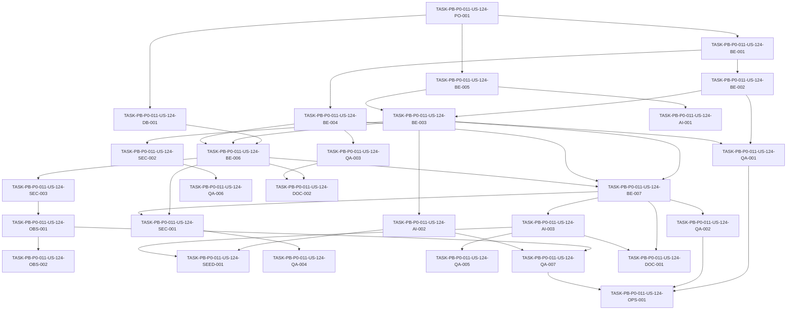

# Development Tasks — PB-P0-011 / US-124: Aplicar validación JSON estricta con un reintento controlado

## 1. Metadata

| Field | Value |
|---|---|
| User Story ID | US-124 |
| Source User Story | `management/user-stories/US-124-ai-json-validation-with-retry.md` |
| Source Technical Specification | `management/technical-specs/P0/PB-P0-011/US-124-technical-spec.md` |
| Decision Resolution Artifact | No aplica - no existe artifact; se usan `PO/BA Decisions Applied`, ADR-AI-007 y docs/17 |
| Priority | P0 |
| Backlog ID | PB-P0-011 |
| Backlog Title | Timeout 60s, fallback Mock en modo demo y validación JSON con 1 reintento |
| Backlog Execution Order | 11 |
| User Story Position in Backlog Item | 2 of 2 |
| Related User Stories in Backlog Item | US-123, US-124 |
| Epic | EPIC-AI-001 |
| Backlog Item Dependencies | PB-P0-009, PB-P0-010 |
| Feature | AI JSON validation + controlled retry |
| Module / Domain | AI Assistance / Output Validation |
| Backlog Alignment Status | Found |
| Task Breakdown Status | Ready for Sprint Planning |
| Created Date | 2026-06-18 |
| Last Updated | 2026-06-18 |

---

## 2. Source Validation

| Source | Found | Used | Notes |
|---|---|---|---|
| User Story | Yes | Yes | Historia aprobada con notas menores y lista para development tasks. |
| Technical Specification | Yes | Yes | Fuente primaria para este desglose. |
| Decision Resolution Artifact | No | No | No existe artifact; la historia y la spec contienen decisiones aplicadas. |
| Product Backlog Prioritized | Yes | Yes | Encontrado como `management/artifacts/4-Product-Backlog-Prioritized.md`. |
| ADRs | Yes | Yes | Usadas vía spec, especialmente ADR-AI-007, ADR-AI-003, ADR-AI-006 y ADR-TEST-003. |

---

## 3. Backlog Execution Context

### Parent Backlog Item

PB-P0-011 entrega resiliencia base para ejecución IA del MVP. US-123 implementa timeout y fallback controlado a `MockAIProvider`; US-124 completa el backlog item con parsing seguro, validación Zod estricta, retry máximo 1 ante output inválido y metadata segura para persistencia downstream.

### Execution Order Rationale

US-124 debe ejecutarse después de PB-P0-009 y PB-P0-010 porque necesita contratos `LLMProvider`/`AIResult<TOutput>`, prompt metadata, `MockAIProvider` y metadata compatible con `AIRecommendation`. También depende de US-123 para delegar timeout/provider failures y fallback demo/test sin duplicar esa lógica.

### Related User Stories in Same Backlog Item

| User Story | Role in Backlog Item | Suggested Order |
|---|---|---|
| US-123 | Implementa timeout 60s y fallback controlado a `MockAIProvider` | 1 |
| US-124 | Implementa validación JSON estricta y un reintento controlado | 2 |

---

## 4. Task Breakdown Summary

| Area | Number of Tasks | Notes |
|---|---:|---|
| Product / Analysis | 1 | Confirmar boundaries con US-123, US-121 y US-122. |
| Database / Prisma | 1 | Verificar mapping de metadata sin migración nueva. |
| Backend | 7 | Parser, errores, validation service, retry policy, registry y metadata. |
| AI / PromptOps | 3 | Schema refs, fixtures Mock y validación de fallback output. |
| Security / Authorization | 3 | No raw output, rejection out-of-contract y boundary backend-only. |
| Observability / Audit | 2 | Eventos validation/retry y métricas opcionales. |
| Seed / Demo Data | 1 | Fixtures demo/mock schema-valid y caso inválido reproducible. |
| QA / Testing | 7 | Unit, integration, contract, security, no retry para provider errors y CI. |
| DevOps / Environment | 1 | CI sin network/secrets y fixtures determinísticas. |
| Documentation / Traceability | 2 | Alineación documental y handoff con US-123/US-122. |
| Frontend | 0 | No aplica. |
| API Contract | 0 | No aplica. |
| **Total** | **28** | Ready for sprint planning. |

---

## 5. Traceability Matrix

| Acceptance Criterion | Technical Spec Section | Task IDs |
|---|---|---|
| AC-01 Provider output parsed and validated | 6, 7, 11, 13, 18, 19 | TASK-PB-P0-011-US-124-BE-001, TASK-PB-P0-011-US-124-BE-002, TASK-PB-P0-011-US-124-BE-003, TASK-PB-P0-011-US-124-BE-005, TASK-PB-P0-011-US-124-QA-001 |
| AC-02 Invalid output not persisted/exposed as success | 6, 7, 10, 11, 12, 18, 19 | TASK-PB-P0-011-US-124-DB-001, TASK-PB-P0-011-US-124-BE-006, TASK-PB-P0-011-US-124-SEC-001, TASK-PB-P0-011-US-124-QA-004 |
| AC-03 Exactly one retry | 6, 7, 11, 13, 17, 18, 19 | TASK-PB-P0-011-US-124-BE-004, TASK-PB-P0-011-US-124-BE-007, TASK-PB-P0-011-US-124-QA-002 |
| AC-04 No retry for timeout/provider failures | 6, 7, 11, 13, 18, 19 | TASK-PB-P0-011-US-124-PO-001, TASK-PB-P0-011-US-124-BE-004, TASK-PB-P0-011-US-124-QA-003, TASK-PB-P0-011-US-124-DOC-002 |
| AC-05 Retry success produces metadata | 6, 7, 10, 11, 13, 18, 19 | TASK-PB-P0-011-US-124-BE-006, TASK-PB-P0-011-US-124-BE-007, TASK-PB-P0-011-US-124-QA-002 |
| AC-06 Retry failure returns controlled behavior | 6, 7, 10, 11, 12, 14, 18, 19 | TASK-PB-P0-011-US-124-BE-001, TASK-PB-P0-011-US-124-BE-006, TASK-PB-P0-011-US-124-SEC-001, TASK-PB-P0-011-US-124-QA-004 |
| AC-07 Demo/test fallback delegated safely | 6, 7, 11, 13, 15, 18, 19 | TASK-PB-P0-011-US-124-AI-003, TASK-PB-P0-011-US-124-QA-005, TASK-PB-P0-011-US-124-SEED-001 |
| AC-08 Reject unsafe/out-of-contract outputs | 6, 7, 11, 12, 13, 18, 19 | TASK-PB-P0-011-US-124-BE-003, TASK-PB-P0-011-US-124-AI-001, TASK-PB-P0-011-US-124-SEC-002, TASK-PB-P0-011-US-124-QA-006 |
| AC-09 Safe observable validation logs | 7, 11, 12, 14, 18, 19 | TASK-PB-P0-011-US-124-SEC-003, TASK-PB-P0-011-US-124-OBS-001, TASK-PB-P0-011-US-124-OBS-002, TASK-PB-P0-011-US-124-QA-007 |
| AC-10 Tests cover validation/retry/no unsafe persistence | 13, 15, 17, 18, 19 | TASK-PB-P0-011-US-124-QA-001, TASK-PB-P0-011-US-124-QA-002, TASK-PB-P0-011-US-124-QA-003, TASK-PB-P0-011-US-124-QA-004, TASK-PB-P0-011-US-124-QA-005, TASK-PB-P0-011-US-124-QA-006, TASK-PB-P0-011-US-124-QA-007, TASK-PB-P0-011-US-124-OPS-001 |

---

## 6. Development Tasks

### TASK-PB-P0-011-US-124-PO-001 — Confirmar boundaries de validación, retry y fallback

| Field | Value |
|---|---|
| Area | Product / Analysis |
| Type | Review |
| Priority | Must |
| Estimate | XS |
| Depends On | None |
| Source AC(s) | AC-04 |
| Technical Spec Section(s) | 2, 3, 4, 6, 16, 18, 19 |
| Backlog ID | PB-P0-011 |
| User Story ID | US-124 |
| Owner Role | Tech Lead |
| Status | To Do |

#### Objective

Confirmar que US-124 implementa sólo validación JSON estricta y retry por output inválido, delegando timeout/fallback a US-123 y persistencia a US-122.

#### Scope

##### Include

- Confirmar dependencia de US-123 para timeout/provider failures.
- Confirmar dependencia de US-121 para schema refs.
- Confirmar dependencia de US-122 para metadata/persistencia.

##### Exclude

- Crear endpoints o UI.
- Implementar providers.
- Crear persistencia desde cero.

#### Implementation Notes

Si existe conflicto con documentos antiguos, conservar la decisión formal de la spec y registrar alineación documental.

#### Acceptance Criteria Covered

AC-04.

#### Definition of Done

- [ ] Boundaries US-123/US-124/US-122 quedan claros.
- [ ] No se agregan tareas de timeout/fallback orchestration dentro de US-124.
- [ ] No se agregan endpoints, UI ni provider adapters.

---

### TASK-PB-P0-011-US-124-DB-001 — Verificar mapping de metadata de validación hacia `AIRecommendation`

| Field | Value |
|---|---|
| Area | Database / Prisma |
| Type | Review |
| Priority | Must |
| Estimate | S |
| Depends On | TASK-PB-P0-011-US-124-PO-001 |
| Source AC(s) | AC-02, AC-05, AC-06 |
| Technical Spec Section(s) | 10, 16, 17, 18, 19 |
| Backlog ID | PB-P0-011 |
| User Story ID | US-124 |
| Owner Role | Backend |
| Status | To Do |

#### Objective

Verificar cómo se mapearán `schemaValid`, `retryCount`, `errorCode`, `status` y `validatedOutputPayload` a contratos existentes de US-122 sin crear migración nueva salvo gap formal.

#### Scope

##### Include

- Revisar campos disponibles en `AIRecommendation`.
- Confirmar enforcement application-level de `retryCount <= 1`.
- Registrar gap si faltan campos críticos.

##### Exclude

- Crear migraciones no previstas.
- Persistir raw invalid output.

#### Implementation Notes

La spec permite safe failure metadata sólo si US-122/schema lo soporta. La ausencia de un campo no debe forzar scope creep sin decisión formal.

#### Acceptance Criteria Covered

AC-02, AC-05, AC-06.

#### Definition of Done

- [ ] Mapping de metadata queda confirmado.
- [ ] No se requiere migración para completar US-124 salvo gap formal.
- [ ] Raw invalid output no se persiste como success.

---

### TASK-PB-P0-011-US-124-BE-001 — Definir errores tipados de output validation

| Field | Value |
|---|---|
| Area | Backend |
| Type | Implementation |
| Priority | Must |
| Estimate | S |
| Depends On | TASK-PB-P0-011-US-124-PO-001 |
| Source AC(s) | AC-01, AC-06 |
| Technical Spec Section(s) | 7, 11, 12, 14, 18, 19 |
| Backlog ID | PB-P0-011 |
| User Story ID | US-124 |
| Owner Role | Backend |
| Status | To Do |

#### Objective

Crear o extender errores/códigos para parsing, schema validation y retry exhausted, sin mezclar errores de timeout/provider de US-123.

#### Scope

##### Include

- `AIInvalidOutputError`.
- `AIInvalidOutputSchemaError`.
- `AIOutputParseError`.
- `AIRetryLimitExceededError`.
- Codes `AI_INVALID_OUTPUT`, `AI_INVALID_OUTPUT_SCHEMA`, `AI_OUTPUT_PARSE_ERROR`, `AI_RETRY_LIMIT_EXCEEDED`.

##### Exclude

- Errores de provider timeout/unavailable.
- Mensajes con raw output.

#### Implementation Notes

Los errores deben exponer summary seguro y bounded, útil para logs/QA y mapeo futuro a error envelope.

#### Acceptance Criteria Covered

AC-01, AC-06.

#### Definition of Done

- [ ] Errores/códigos compilan y son distinguibles.
- [ ] Error classifier puede diferenciarlos de US-123/provider errors.
- [ ] Mensajes no contienen raw output ni prompts.

---

### TASK-PB-P0-011-US-124-BE-002 — Implementar parser seguro de output IA

| Field | Value |
|---|---|
| Area | Backend |
| Type | Implementation |
| Priority | Must |
| Estimate | M |
| Depends On | TASK-PB-P0-011-US-124-BE-001 |
| Source AC(s) | AC-01, AC-02 |
| Technical Spec Section(s) | 6, 7, 11, 13, 18, 19 |
| Backlog ID | PB-P0-011 |
| User Story ID | US-124 |
| Owner Role | Backend |
| Status | To Do |

#### Objective

Parsear outputs del provider de forma segura antes de cualquier validación o persistencia exitosa.

#### Scope

##### Include

- JSON string válido.
- Output ya estructurado si el contrato del provider lo permite.
- Fallo controlado para malformed JSON o contenido no JSON.
- Summary truncado para parse failures.

##### Exclude

- Reparar JSON automáticamente.
- Ejecutar instrucciones contenidas en output.

#### Implementation Notes

No aceptar texto alrededor del JSON salvo que el contrato aprobado lo permita explícitamente.

#### Acceptance Criteria Covered

AC-01, AC-02.

#### Definition of Done

- [ ] Output válido se convierte a objeto validable.
- [ ] Malformed JSON produce error controlado.
- [ ] No se guarda ni loggea raw invalid output.

---

### TASK-PB-P0-011-US-124-BE-003 — Implementar `AIOutputValidationService` con Zod strict

| Field | Value |
|---|---|
| Area | Backend |
| Type | Implementation |
| Priority | Must |
| Estimate | L |
| Depends On | TASK-PB-P0-011-US-124-BE-002, TASK-PB-P0-011-US-124-BE-005 |
| Source AC(s) | AC-01, AC-02, AC-08 |
| Technical Spec Section(s) | 5, 6, 7, 11, 12, 18, 19 |
| Backlog ID | PB-P0-011 |
| User Story ID | US-124 |
| Owner Role | Backend |
| Status | To Do |

#### Objective

Validar outputs IA contra schemas Zod estrictos por feature/schema ref y retornar typed/canonical output.

#### Scope

##### Include

- Uso de `.strict()` o equivalente.
- Rechazo de campos extra.
- Rechazo de tipos, enums, required fields e invariants inválidos.
- Retorno con tipos derivados vía `z.infer` donde aplique.

##### Exclude

- Crear todos los schemas feature-specific de historias futuras.
- Persistir resultado.
- Crear endpoints.

#### Implementation Notes

Si faltan schemas de features posteriores, dejar registry/hook reusable y fixtures mínimos para validar el mecanismo.

#### Acceptance Criteria Covered

AC-01, AC-02, AC-08.

#### Definition of Done

- [ ] Servicio valida con Zod strict.
- [ ] Output validado queda typed/canonical.
- [ ] Output inválido no puede seguir por success path.

---

### TASK-PB-P0-011-US-124-BE-004 — Implementar `AIRetryPolicy` con máximo un retry

| Field | Value |
|---|---|
| Area | Backend |
| Type | Implementation |
| Priority | Must |
| Estimate | M |
| Depends On | TASK-PB-P0-011-US-124-BE-001 |
| Source AC(s) | AC-03, AC-04 |
| Technical Spec Section(s) | 6, 7, 11, 13, 17, 18, 19 |
| Backlog ID | PB-P0-011 |
| User Story ID | US-124 |
| Owner Role | Backend |
| Status | To Do |

#### Objective

Centralizar la decisión de retry para permitir exactamente un retry sólo cuando la falla sea parse/schema validation failure.

#### Scope

##### Include

- Guard `retryCount <= 1`.
- Retry sólo para `AIInvalidOutputError` o equivalente.
- No retry para timeout, provider unavailable, provider not configured, auth, rate-limit o 5xx.

##### Exclude

- Backoff complejo.
- Retry más de una vez.
- Retry por provider errors.

#### Implementation Notes

El classifier debe ser explícito para evitar que errores de US-123 entren al retry JSON.

#### Acceptance Criteria Covered

AC-03, AC-04.

#### Definition of Done

- [ ] Policy permite un solo retry para invalid output.
- [ ] Policy rechaza retries para provider/timeout failures.
- [ ] No existe camino de retry infinito.

---

### TASK-PB-P0-011-US-124-BE-005 — Implementar output schema registry

| Field | Value |
|---|---|
| Area | Backend |
| Type | Implementation |
| Priority | Must |
| Estimate | M |
| Depends On | TASK-PB-P0-011-US-124-PO-001 |
| Source AC(s) | AC-01, AC-08 |
| Technical Spec Section(s) | 7, 11, 13, 18, 19 |
| Backlog ID | PB-P0-011 |
| User Story ID | US-124 |
| Owner Role | Backend |
| Status | To Do |

#### Objective

Crear o integrar un registry para resolver schemas por `featureType`, `schemaName`, `schemaVersion` o `outputSchemaRef` de US-121.

#### Scope

##### Include

- Registro de schemas disponibles.
- Error controlado si falta schema requerido.
- Metadata `schemaName` y `schemaVersion` cuando exista.

##### Exclude

- Definir todos los schemas feature-specific futuros.
- Reemplazar PromptRegistry.

#### Implementation Notes

El registry debe alinearse con las referencias de `AIPromptVersion` sin acoplarse a persistencia.

#### Acceptance Criteria Covered

AC-01, AC-08.

#### Definition of Done

- [ ] Schema se resuelve desde una referencia estable.
- [ ] Missing schema produce error controlado.
- [ ] Metadata del schema queda disponible para logs/persistencia downstream.

---

### TASK-PB-P0-011-US-124-BE-006 — Normalizar metadata de validación y failure segura

| Field | Value |
|---|---|
| Area | Backend |
| Type | Implementation |
| Priority | Must |
| Estimate | M |
| Depends On | TASK-PB-P0-011-US-124-DB-001, TASK-PB-P0-011-US-124-BE-003, TASK-PB-P0-011-US-124-BE-004 |
| Source AC(s) | AC-02, AC-05, AC-06, AC-09 |
| Technical Spec Section(s) | 7, 10, 11, 12, 14, 18, 19 |
| Backlog ID | PB-P0-011 |
| User Story ID | US-124 |
| Owner Role | Backend |
| Status | To Do |

#### Objective

Entregar metadata consistente para success, retry success y failure controlado, consumible por US-122 y observabilidad.

#### Scope

##### Include

- `schemaValid`.
- `retryCount`.
- `errorCode`.
- `schemaName`/`schemaVersion` si aplica.
- `schemaErrorSummary` truncado.
- `correlationId` y `featureType`.

##### Exclude

- Raw invalid output.
- Prompt completo.
- Persistencia directa.

#### Implementation Notes

La metadata de failure debe ser segura y opcional para persistencia, según soporte real de US-122.

#### Acceptance Criteria Covered

AC-02, AC-05, AC-06, AC-09.

#### Definition of Done

- [ ] Success incluye `schemaValid=true`.
- [ ] Retry success incluye `retryCount=1`.
- [ ] Failure incluye sólo summary seguro y bounded.

---

### TASK-PB-P0-011-US-124-BE-007 — Integrar ejecución validada con provider call y retry

| Field | Value |
|---|---|
| Area | Backend |
| Type | Implementation |
| Priority | Must |
| Estimate | L |
| Depends On | TASK-PB-P0-011-US-124-BE-003, TASK-PB-P0-011-US-124-BE-004, TASK-PB-P0-011-US-124-BE-006 |
| Source AC(s) | AC-03, AC-05, AC-06, AC-07 |
| Technical Spec Section(s) | 5, 6, 7, 11, 18, 19 |
| Backlog ID | PB-P0-011 |
| User Story ID | US-124 |
| Owner Role | Backend |
| Status | To Do |

#### Objective

Orquestar provider output, validation service, retry policy y resultado final en un servicio reusable por use cases AI.

#### Scope

##### Include

- Primer intento con validation.
- Segundo intento sólo ante invalid output.
- Resultado validado con metadata.
- Error controlado tras retry exhausted.

##### Exclude

- Timeout/fallback orchestration interna.
- Provider selection.
- Persistence.

#### Implementation Notes

Si fallback demo/test está habilitado, la delegación debe ocurrir por el path de US-123 y el output fallback debe validarse antes de success.

#### Acceptance Criteria Covered

AC-03, AC-05, AC-06, AC-07.

#### Definition of Done

- [ ] Retry ocurre máximo una vez.
- [ ] Retry success retorna typed output y metadata.
- [ ] Retry failure retorna comportamiento controlado.

---

### TASK-PB-P0-011-US-124-AI-001 — Alinear schema refs con PromptRegistry

| Field | Value |
|---|---|
| Area | AI / PromptOps |
| Type | Implementation |
| Priority | Must |
| Estimate | S |
| Depends On | TASK-PB-P0-011-US-124-BE-005 |
| Source AC(s) | AC-01, AC-08 |
| Technical Spec Section(s) | 7, 11, 17, 18, 19 |
| Backlog ID | PB-P0-011 |
| User Story ID | US-124 |
| Owner Role | AI |
| Status | To Do |

#### Objective

Conectar metadata de US-121 (`outputSchemaRef`, schema name/version o equivalente) con el registry de validación.

#### Scope

##### Include

- Resolución por schema ref estable.
- Uso de misma prompt version, language y sanitized input en retry.
- Error controlado ante schema ref inexistente.

##### Exclude

- Crear PromptRegistry desde cero.
- Cambiar prompt versions existentes sin necesidad.

#### Implementation Notes

La retry debe preservar prompt version/contexto salvo que US-123 cambie provider por fallback.

#### Acceptance Criteria Covered

AC-01, AC-08.

#### Definition of Done

- [ ] Schema ref de prompt metadata resuelve schema validable.
- [ ] Retry conserva contexto aprobado.
- [ ] Missing schema ref no produce success falso.

---

### TASK-PB-P0-011-US-124-AI-002 — Crear fixtures mock válidas e inválidas para contract tests

| Field | Value |
|---|---|
| Area | AI / PromptOps |
| Type | Setup |
| Priority | Must |
| Estimate | S |
| Depends On | TASK-PB-P0-011-US-124-BE-003 |
| Source AC(s) | AC-08, AC-10 |
| Technical Spec Section(s) | 11, 13, 15, 17, 18, 19 |
| Backlog ID | PB-P0-011 |
| User Story ID | US-124 |
| Owner Role | AI |
| Status | To Do |

#### Objective

Preparar fixtures determinísticas para validar contratos de `MockAIProvider` contra schemas Zod.

#### Scope

##### Include

- Fixture schema-valid.
- Fixture malformed JSON.
- Fixture con campos extra.
- Fixture con enum/type inválido.

##### Exclude

- Texto literal de recomendaciones como assertion principal.
- Fixtures de features futuras no disponibles.

#### Implementation Notes

Los tests deben validar forma e invariants, no prosa exacta.

#### Acceptance Criteria Covered

AC-08, AC-10.

#### Definition of Done

- [ ] Fixtures válidas pasan schema.
- [ ] Fixtures inválidas fallan de forma controlada.
- [ ] Fixtures no requieren red ni secrets.

---

### TASK-PB-P0-011-US-124-AI-003 — Validar output fallback después de US-123

| Field | Value |
|---|---|
| Area | AI / PromptOps |
| Type | Implementation |
| Priority | Must |
| Estimate | M |
| Depends On | TASK-PB-P0-011-US-124-BE-007 |
| Source AC(s) | AC-07 |
| Technical Spec Section(s) | 6, 7, 11, 13, 18, 19 |
| Backlog ID | PB-P0-011 |
| User Story ID | US-124 |
| Owner Role | AI |
| Status | To Do |

#### Objective

Asegurar que cualquier output obtenido por fallback delegado a US-123 pase por el mismo schema strict antes de ser success.

#### Scope

##### Include

- Fallback result validado.
- Failure controlado si fallback output es inválido.
- Metadata indica retry/fallback/validation según contratos disponibles.

##### Exclude

- Implementar fallback orchestration.
- Fallback a Anthropic o plantilla estática.

#### Implementation Notes

No tratar output fallback como confiable por ser mock; debe pasar el mismo contrato.

#### Acceptance Criteria Covered

AC-07.

#### Definition of Done

- [ ] Fallback output se valida antes de success.
- [ ] Fallback inválido falla de forma controlada.
- [ ] No se duplica lógica de US-123.

---

### TASK-PB-P0-011-US-124-SEC-001 — Bloquear persistencia/exposición de output inválido

| Field | Value |
|---|---|
| Area | Security / Authorization |
| Type | Implementation |
| Priority | Must |
| Estimate | M |
| Depends On | TASK-PB-P0-011-US-124-BE-006, TASK-PB-P0-011-US-124-BE-007 |
| Source AC(s) | AC-02, AC-06 |
| Technical Spec Section(s) | 7, 10, 11, 12, 18, 19 |
| Backlog ID | PB-P0-011 |
| User Story ID | US-124 |
| Owner Role | Backend |
| Status | To Do |

#### Objective

Garantizar que output inválido nunca se persista ni exponga como recomendación exitosa o actionable suggestion.

#### Scope

##### Include

- Guard antes de success path.
- Failure metadata segura si US-122 lo soporta.
- Error controlado `AI_INVALID_OUTPUT`.

##### Exclude

- Persistir raw invalid output.
- Crear UI de error.

#### Implementation Notes

El estado `pending` exitoso sólo aplica a output schema-valid; failure safe metadata no debe confundirse con recomendación accionable.

#### Acceptance Criteria Covered

AC-02, AC-06.

#### Definition of Done

- [ ] Output inválido no llega a success path.
- [ ] Failure no contiene raw output.
- [ ] Error controlado puede mapearse a 422 futuro.

---

### TASK-PB-P0-011-US-124-SEC-002 — Rechazar outputs unsafe o fuera de contrato

| Field | Value |
|---|---|
| Area | Security / Authorization |
| Type | Test |
| Priority | Must |
| Estimate | M |
| Depends On | TASK-PB-P0-011-US-124-BE-003 |
| Source AC(s) | AC-08 |
| Technical Spec Section(s) | 7, 11, 12, 13, 18, 19 |
| Backlog ID | PB-P0-011 |
| User Story ID | US-124 |
| Owner Role | QA |
| Status | To Do |

#### Objective

Validar que prompt-injection-like content, campos extra, enums inválidos, tipos erróneos e invariants inválidos fallan con errores seguros.

#### Scope

##### Include

- Campos inesperados.
- Instrucciones fuera de JSON.
- Wrong currency/language si el schema lo define.
- Arrays inválidos o faltantes.

##### Exclude

- Moderación de contenido general.
- AI review moderation.

#### Implementation Notes

Estos tests prueban contrato estructural y seguridad básica, no evaluación semántica profunda.

#### Acceptance Criteria Covered

AC-08.

#### Definition of Done

- [ ] Outputs out-of-contract fallan.
- [ ] Error summary es bounded.
- [ ] No se loggea raw unsafe output.

---

### TASK-PB-P0-011-US-124-SEC-003 — Implementar safe logs para validation/retry

| Field | Value |
|---|---|
| Area | Security / Authorization |
| Type | Implementation |
| Priority | Must |
| Estimate | S |
| Depends On | TASK-PB-P0-011-US-124-BE-006 |
| Source AC(s) | AC-09 |
| Technical Spec Section(s) | 7, 11, 12, 14, 18, 19 |
| Backlog ID | PB-P0-011 |
| User Story ID | US-124 |
| Owner Role | Backend |
| Status | To Do |

#### Objective

Emitir logs de validation failure/retry/success con whitelist de campos seguros.

#### Scope

##### Include

- `featureType`, `provider`, `schemaName`.
- `retryCount`, `errorCode`.
- `schemaErrorSummary` truncado.
- `correlationId`.

##### Exclude

- Raw provider output.
- Prompt completo.
- Input payload completo.
- Secrets/tokens/cookies/PII innecesaria.

#### Implementation Notes

Preferir construcción explícita de log object seguro sobre sanitización posterior.

#### Acceptance Criteria Covered

AC-09.

#### Definition of Done

- [ ] Logs contienen metadata útil.
- [ ] Logs no contienen payloads sensibles.
- [ ] Error summaries están truncados.

---

### TASK-PB-P0-011-US-124-OBS-001 — Registrar eventos de output validation y retry

| Field | Value |
|---|---|
| Area | Observability / Audit |
| Type | Implementation |
| Priority | Must |
| Estimate | S |
| Depends On | TASK-PB-P0-011-US-124-SEC-003 |
| Source AC(s) | AC-09 |
| Technical Spec Section(s) | 7, 14, 18, 19 |
| Backlog ID | PB-P0-011 |
| User Story ID | US-124 |
| Owner Role | Backend |
| Status | To Do |

#### Objective

Emitir eventos estructurados para validation failed, retry attempted, validation success y retry exhausted.

#### Scope

##### Include

- `ai.output_validation_failed`.
- `ai.output_retry_attempted`.
- `ai.output_validation_success`.
- `ai.output_retry_exhausted`.
- Correlation ID cuando exista.

##### Exclude

- `AdminAction`; no aplica.
- Nueva plataforma de observabilidad.

#### Implementation Notes

Usar logger/telemetry existente y conservar compatibilidad con US-123 correlation metadata.

#### Acceptance Criteria Covered

AC-09.

#### Definition of Done

- [ ] Eventos se emiten en rutas relevantes.
- [ ] Correlation ID se preserva.
- [ ] Eventos respetan safe logging.

---

### TASK-PB-P0-011-US-124-OBS-002 — Añadir métricas opcionales de validation si existe infraestructura

| Field | Value |
|---|---|
| Area | Observability / Audit |
| Type | Implementation |
| Priority | Could |
| Estimate | XS |
| Depends On | TASK-PB-P0-011-US-124-OBS-001 |
| Source AC(s) | AC-09 |
| Technical Spec Section(s) | 14, 17, 18, 19 |
| Backlog ID | PB-P0-011 |
| User Story ID | US-124 |
| Owner Role | Backend |
| Status | To Do |

#### Objective

Agregar métricas de validation/retry sólo si la infraestructura de métricas ya existe.

#### Scope

##### Include

- `ai_schema_validation_failed_total`.
- `ai_output_retry_total`.
- `ai_invalid_output_total`.

##### Exclude

- Introducir stack de métricas nuevo.
- Convertir métricas opcionales en blocker MVP.

#### Implementation Notes

Labels deben limitarse a datos seguros como feature type, retry count y error code.

#### Acceptance Criteria Covered

AC-09.

#### Definition of Done

- [ ] Métricas agregadas si aplica.
- [ ] Si no aplica, queda documentado sin bloquear.
- [ ] Labels no contienen datos sensibles.

---

### TASK-PB-P0-011-US-124-SEED-001 — Validar fixtures demo/mock y caso inválido reproducible

| Field | Value |
|---|---|
| Area | Seed / Demo Data |
| Type | Test |
| Priority | Must |
| Estimate | S |
| Depends On | TASK-PB-P0-011-US-124-AI-002, TASK-PB-P0-011-US-124-AI-003 |
| Source AC(s) | AC-07, AC-10 |
| Technical Spec Section(s) | 13, 15, 18, 19 |
| Backlog ID | PB-P0-011 |
| User Story ID | US-124 |
| Owner Role | QA |
| Status | To Do |

#### Objective

Confirmar que fixtures demo/mock usadas por AI flows son schema-valid y que el escenario de invalid JSON es determinístico.

#### Scope

##### Include

- Fixtures mock válidas pasan schemas.
- Forced invalid JSON dispara retry/error.
- Flags/fixtures aisladas por suite.

##### Exclude

- Crear seed DB nuevo.
- Crear features AI completas.

#### Implementation Notes

Los fixtures deben ser compatibles con demo offline y CI sin red.

#### Acceptance Criteria Covered

AC-07, AC-10.

#### Definition of Done

- [ ] Demo/mock fixtures válidas pasan contrato.
- [ ] Caso inválido reproducible existe.
- [ ] No se requiere seed DB nuevo.

---

### TASK-PB-P0-011-US-124-OPS-001 — Asegurar CI sin network ni provider secrets

| Field | Value |
|---|---|
| Area | DevOps / Environment |
| Type | Setup |
| Priority | Must |
| Estimate | S |
| Depends On | TASK-PB-P0-011-US-124-QA-001, TASK-PB-P0-011-US-124-QA-002, TASK-PB-P0-011-US-124-QA-007 |
| Source AC(s) | AC-10 |
| Technical Spec Section(s) | 13, 15, 18, 19 |
| Backlog ID | PB-P0-011 |
| User Story ID | US-124 |
| Owner Role | DevOps |
| Status | To Do |

#### Objective

Garantizar que tests de validation/retry corren en CI con `MockAIProvider`/fixtures y sin OpenAI, red ni secrets.

#### Scope

##### Include

- Contract tests mock.
- No network.
- No `OPENAI_API_KEY` requerida.
- Fixtures determinísticas.

##### Exclude

- Cambiar pipeline completo sin necesidad.
- Llamadas reales a providers.

#### Implementation Notes

Si ya existe enforcement de no-network para AI tests, reutilizarlo.

#### Acceptance Criteria Covered

AC-10.

#### Definition of Done

- [ ] CI ejecuta suite sin secrets.
- [ ] Tests no hacen network.
- [ ] Falla si una prueba intenta provider real.

---

### TASK-PB-P0-011-US-124-QA-001 — Cubrir unit tests de parser y Zod strict validation

| Field | Value |
|---|---|
| Area | QA / Testing |
| Type | Test |
| Priority | Must |
| Estimate | M |
| Depends On | TASK-PB-P0-011-US-124-BE-002, TASK-PB-P0-011-US-124-BE-003 |
| Source AC(s) | AC-01, AC-10 |
| Technical Spec Section(s) | 13, 18, 19 |
| Backlog ID | PB-P0-011 |
| User Story ID | US-124 |
| Owner Role | QA |
| Status | To Do |

#### Objective

Validar parser, success strict schema y fallas por malformed JSON, campos extra, missing fields, wrong enum/type e invariants.

#### Scope

##### Include

- Output válido.
- Malformed JSON.
- Extra fields.
- Required missing.
- Wrong enum/type.
- Refinement failure.

##### Exclude

- Retry orchestration.

#### Implementation Notes

Usar Vitest y fixtures pequeñas enfocadas en shape.

#### Acceptance Criteria Covered

AC-01, AC-10.

#### Definition of Done

- [ ] Casos válidos pasan.
- [ ] Casos inválidos fallan de forma controlada.
- [ ] `.strict()` queda cubierto.

---

### TASK-PB-P0-011-US-124-QA-002 — Cubrir integration tests de retry success y retry exhausted

| Field | Value |
|---|---|
| Area | QA / Testing |
| Type | Test |
| Priority | Must |
| Estimate | M |
| Depends On | TASK-PB-P0-011-US-124-BE-007 |
| Source AC(s) | AC-03, AC-05, AC-06, AC-10 |
| Technical Spec Section(s) | 13, 17, 18, 19 |
| Backlog ID | PB-P0-011 |
| User Story ID | US-124 |
| Owner Role | QA |
| Status | To Do |

#### Objective

Probar flujo completo donde el primer output es inválido y el segundo es válido, y flujo donde ambos outputs son inválidos.

#### Scope

##### Include

- Retry success con `schemaValid=true`, `retryCount=1`.
- Retry exhausted con `AI_INVALID_OUTPUT`.
- No tercer intento.

##### Exclude

- Timeout/provider failure paths.

#### Implementation Notes

Usar fake provider o `MockAIProvider` configurado con respuestas determinísticas.

#### Acceptance Criteria Covered

AC-03, AC-05, AC-06, AC-10.

#### Definition of Done

- [ ] Retry success produce metadata correcta.
- [ ] Dos fallas producen error controlado.
- [ ] No existe tercer intento.

---

### TASK-PB-P0-011-US-124-QA-003 — Cubrir negative tests de no retry para timeout/provider errors

| Field | Value |
|---|---|
| Area | QA / Testing |
| Type | Test |
| Priority | Must |
| Estimate | M |
| Depends On | TASK-PB-P0-011-US-124-BE-004 |
| Source AC(s) | AC-04, AC-10 |
| Technical Spec Section(s) | 6, 7, 13, 18, 19 |
| Backlog ID | PB-P0-011 |
| User Story ID | US-124 |
| Owner Role | QA |
| Status | To Do |

#### Objective

Verificar que timeout, provider unavailable, provider not configured, auth, rate-limit y 5xx no entran al retry JSON.

#### Scope

##### Include

- `AI_PROVIDER_TIMEOUT`.
- `AI_PROVIDER_UNAVAILABLE`.
- `AI_PROVIDER_NOT_CONFIGURED`.
- Auth/rate-limit/5xx equivalentes si existen.

##### Exclude

- Implementar manejo de timeout.

#### Implementation Notes

Estos errores deben seguir delegados a US-123.

#### Acceptance Criteria Covered

AC-04, AC-10.

#### Definition of Done

- [ ] Provider errors no disparan retry.
- [ ] Timeout no dispara retry.
- [ ] Tests documentan la delegación a US-123.

---

### TASK-PB-P0-011-US-124-QA-004 — Cubrir no persistence/exposure de invalid output

| Field | Value |
|---|---|
| Area | QA / Testing |
| Type | Test |
| Priority | Must |
| Estimate | M |
| Depends On | TASK-PB-P0-011-US-124-SEC-001 |
| Source AC(s) | AC-02, AC-06, AC-10 |
| Technical Spec Section(s) | 10, 12, 13, 18, 19 |
| Backlog ID | PB-P0-011 |
| User Story ID | US-124 |
| Owner Role | QA |
| Status | To Do |

#### Objective

Verificar que output inválido nunca se envía al success persistence path ni a respuesta actionable.

#### Scope

##### Include

- Spy/mock de persistence boundary.
- Failure metadata segura si aplica.
- Ausencia de raw invalid output.

##### Exclude

- Crear repository real de US-122.

#### Implementation Notes

Probar el boundary de application, no endpoints.

#### Acceptance Criteria Covered

AC-02, AC-06, AC-10.

#### Definition of Done

- [ ] Success persistence no se llama con output inválido.
- [ ] Failure metadata es segura.
- [ ] Raw invalid output no aparece en assertions de salida.

---

### TASK-PB-P0-011-US-124-QA-005 — Cubrir fallback delegado y validado

| Field | Value |
|---|---|
| Area | QA / Testing |
| Type | Test |
| Priority | Must |
| Estimate | M |
| Depends On | TASK-PB-P0-011-US-124-AI-003 |
| Source AC(s) | AC-07, AC-10 |
| Technical Spec Section(s) | 11, 13, 15, 18, 19 |
| Backlog ID | PB-P0-011 |
| User Story ID | US-124 |
| Owner Role | QA |
| Status | To Do |

#### Objective

Validar que después de retry failure, fallback demo/test delegado a US-123 produce success sólo si el output fallback pasa schema.

#### Scope

##### Include

- Fallback habilitado.
- Fallback output válido.
- Fallback output inválido.
- Metadata de validation/fallback disponible.

##### Exclude

- Reimplementar fallback en test.
- Fallback Anthropic.

#### Implementation Notes

Usar doubles de US-123/fallback service si la integración completa no está disponible en unit scope.

#### Acceptance Criteria Covered

AC-07, AC-10.

#### Definition of Done

- [ ] Fallback válido se acepta tras schema validation.
- [ ] Fallback inválido falla.
- [ ] No se marca success sin validación.

---

### TASK-PB-P0-011-US-124-QA-006 — Cubrir security tests de outputs out-of-contract

| Field | Value |
|---|---|
| Area | QA / Testing |
| Type | Test |
| Priority | Must |
| Estimate | M |
| Depends On | TASK-PB-P0-011-US-124-SEC-002 |
| Source AC(s) | AC-08, AC-10 |
| Technical Spec Section(s) | 12, 13, 17, 18, 19 |
| Backlog ID | PB-P0-011 |
| User Story ID | US-124 |
| Owner Role | QA |
| Status | To Do |

#### Objective

Probar outputs maliciosos o fuera de contrato y confirmar rechazo seguro.

#### Scope

##### Include

- Prompt-injection-like text.
- Unknown fields.
- Wrong currency/language si schema lo define.
- Invalid arrays.

##### Exclude

- Moderación IA avanzada.

#### Implementation Notes

El objetivo es asegurar contrato estricto, no interpretar intención del modelo.

#### Acceptance Criteria Covered

AC-08, AC-10.

#### Definition of Done

- [ ] Outputs unsafe se rechazan.
- [ ] No hay raw output en logs/resultados.
- [ ] Error summary es truncado.

---

### TASK-PB-P0-011-US-124-QA-007 — Cubrir safe log assertions y contract tests Mock

| Field | Value |
|---|---|
| Area | QA / Testing |
| Type | Test |
| Priority | Must |
| Estimate | M |
| Depends On | TASK-PB-P0-011-US-124-OBS-001, TASK-PB-P0-011-US-124-AI-002 |
| Source AC(s) | AC-09, AC-10 |
| Technical Spec Section(s) | 13, 14, 15, 18, 19 |
| Backlog ID | PB-P0-011 |
| User Story ID | US-124 |
| Owner Role | QA |
| Status | To Do |

#### Objective

Verificar logs seguros y que fixtures de `MockAIProvider` cumplen schemas en CI.

#### Scope

##### Include

- Logs sin raw output/prompt/input/secrets.
- Eventos validation failed/retry/success.
- Contract tests de mock fixtures.
- No OpenAI real.

##### Exclude

- Tests de UI.

#### Implementation Notes

Usar logger spy y no assertar texto literal generado por IA.

#### Acceptance Criteria Covered

AC-09, AC-10.

#### Definition of Done

- [ ] Logs contienen metadata segura.
- [ ] Mock fixtures válidas pasan schema.
- [ ] CI no requiere provider externo.

---

### TASK-PB-P0-011-US-124-DOC-001 — Documentar alineación de validación estricta y fallback técnico

| Field | Value |
|---|---|
| Area | Documentation / Traceability |
| Type | Documentation |
| Priority | Should |
| Estimate | XS |
| Depends On | TASK-PB-P0-011-US-124-BE-007, TASK-PB-P0-011-US-124-AI-003 |
| Source AC(s) | AC-06, AC-07, AC-09 |
| Technical Spec Section(s) | 16, 18, 19 |
| Backlog ID | PB-P0-011 |
| User Story ID | US-124 |
| Owner Role | Tech Lead |
| Status | To Do |

#### Objective

Registrar que US-124 sigue ADR-AI-007 y docs/17: retry máximo 1, fallback delegado a US-123 y sin plantilla estática como implementación activa.

#### Scope

##### Include

- Nota de conflicto con docs antiguas sobre plantilla estática.
- Confirmación de no raw invalid output.
- Mapping de safe failure metadata.

##### Exclude

- Reescribir ADRs aprobados.
- Cambiar scope de US-123.

#### Implementation Notes

Si no se editan docs fuente durante el sprint, registrar follow-up trazable.

#### Acceptance Criteria Covered

AC-06, AC-07, AC-09.

#### Definition of Done

- [ ] Alineación documental queda registrada.
- [ ] Fallback técnico queda documentado como US-123/MockAIProvider.
- [ ] No se contradice ADR-AI-007.

---

### TASK-PB-P0-011-US-124-DOC-002 — Registrar contrato de handoff para features AI consumidoras

| Field | Value |
|---|---|
| Area | Documentation / Traceability |
| Type | Documentation |
| Priority | Should |
| Estimate | XS |
| Depends On | TASK-PB-P0-011-US-124-BE-006, TASK-PB-P0-011-US-124-QA-003 |
| Source AC(s) | AC-04, AC-05, AC-10 |
| Technical Spec Section(s) | 2, 4, 11, 18, 19 |
| Backlog ID | PB-P0-011 |
| User Story ID | US-124 |
| Owner Role | Tech Lead |
| Status | To Do |

#### Objective

Dejar documentado qué contrato entrega US-124 a features AI futuras: validated typed output, retry metadata y errores controlados.

#### Scope

##### Include

- Reglas para feature-specific schemas.
- Retry sólo invalid output.
- No retry para provider/timeout errors.
- Metadata esperada para US-122.

##### Exclude

- Crear tasks de features P1/P2.
- Crear todos los schemas futuros.

#### Implementation Notes

El handoff debe servir para que historias AI consumidoras no dupliquen validation/retry.

#### Acceptance Criteria Covered

AC-04, AC-05, AC-10.

#### Definition of Done

- [ ] Contrato de uso queda claro.
- [ ] Feature stories saben dónde registrar schemas.
- [ ] No se duplica retry logic en consumers.

---

## 7. Required QA Tasks

| Task ID | Test Type | Purpose |
|---|---|---|
| TASK-PB-P0-011-US-124-QA-001 | Unit | Validar parser y strict Zod schemas. |
| TASK-PB-P0-011-US-124-QA-002 | Integration | Validar retry success y retry exhausted. |
| TASK-PB-P0-011-US-124-QA-003 | Negative / Integration | Confirmar no retry para timeout/provider errors. |
| TASK-PB-P0-011-US-124-QA-004 | Contract / Security | Confirmar que output inválido no llega a success persistence/exposure. |
| TASK-PB-P0-011-US-124-QA-005 | AI / Integration | Validar fallback delegado y output fallback schema-valid. |
| TASK-PB-P0-011-US-124-QA-006 | Security | Rechazar outputs unsafe/out-of-contract. |
| TASK-PB-P0-011-US-124-QA-007 | Contract / CI | Safe logs y contract tests de fixtures Mock. |

---

## 8. Required Security Tasks

| Task ID | Security Concern | Purpose |
|---|---|---|
| TASK-PB-P0-011-US-124-SEC-001 | Invalid output persistence/exposure | Bloquear success path para output inválido. |
| TASK-PB-P0-011-US-124-SEC-002 | Out-of-contract output | Rechazar campos extra, prompt-injection-like content y valores inválidos. |
| TASK-PB-P0-011-US-124-SEC-003 | Sensitive data in logs | Emitir sólo metadata segura y bounded. |
| TASK-PB-P0-011-US-124-QA-006 | Security regression | Probar rechazo de outputs unsafe. |
| TASK-PB-P0-011-US-124-QA-007 | Log regression | Probar logs sin raw output ni secrets. |

---

## 9. Required Seed / Demo Tasks

| Task ID | Seed/Demo Concern | Purpose |
|---|---|---|
| TASK-PB-P0-011-US-124-SEED-001 | Demo/mock fixture validity | Confirmar fixtures schema-valid y caso invalid JSON reproducible. |

---

## 10. Observability / Audit Tasks

| Task ID | Concern | Purpose |
|---|---|---|
| TASK-PB-P0-011-US-124-OBS-001 | Structured validation events | Registrar validation failed, retry attempted, success y retry exhausted. |
| TASK-PB-P0-011-US-124-OBS-002 | Optional validation metrics | Agregar métricas si existe infraestructura. |

---

## 11. Documentation / Traceability Tasks

| Task ID | Document / Artifact | Purpose |
|---|---|---|
| TASK-PB-P0-011-US-124-DOC-001 | Documentation alignment | Registrar alineación ADR-AI-007, fallback delegado y no raw invalid output. |
| TASK-PB-P0-011-US-124-DOC-002 | Consumer handoff | Documentar contrato para features AI consumidoras. |

---

## 12. Dependency Graph

---

## 13. Suggested Implementation Order

### Phase 1 — Foundation

1. TASK-PB-P0-011-US-124-PO-001
2. TASK-PB-P0-011-US-124-DB-001
3. TASK-PB-P0-011-US-124-BE-001
4. TASK-PB-P0-011-US-124-BE-005

### Phase 2 — Core Implementation

1. TASK-PB-P0-011-US-124-BE-002
2. TASK-PB-P0-011-US-124-BE-004
3. TASK-PB-P0-011-US-124-BE-003
4. TASK-PB-P0-011-US-124-BE-006
5. TASK-PB-P0-011-US-124-BE-007
6. TASK-PB-P0-011-US-124-AI-001
7. TASK-PB-P0-011-US-124-AI-002
8. TASK-PB-P0-011-US-124-AI-003

### Phase 3 — Validation / Security / QA

1. TASK-PB-P0-011-US-124-SEC-001
2. TASK-PB-P0-011-US-124-SEC-002
3. TASK-PB-P0-011-US-124-SEC-003
4. TASK-PB-P0-011-US-124-OBS-001
5. TASK-PB-P0-011-US-124-SEED-001
6. TASK-PB-P0-011-US-124-QA-001
7. TASK-PB-P0-011-US-124-QA-002
8. TASK-PB-P0-011-US-124-QA-003
9. TASK-PB-P0-011-US-124-QA-004
10. TASK-PB-P0-011-US-124-QA-005
11. TASK-PB-P0-011-US-124-QA-006
12. TASK-PB-P0-011-US-124-QA-007
13. TASK-PB-P0-011-US-124-OPS-001

### Phase 4 — Documentation / Review

1. TASK-PB-P0-011-US-124-OBS-002
2. TASK-PB-P0-011-US-124-DOC-001
3. TASK-PB-P0-011-US-124-DOC-002

---

## 14. Risks & Mitigations

| Risk | Impact | Mitigation | Related Task |
| ---- | ------ | ---------- | ------------ |
| Schemas por feature no existen aún | No se puede validar una feature específica | Crear registry/hook reusable y fixtures mínimas; feature stories completan schemas faltantes | TASK-PB-P0-011-US-124-BE-005, TASK-PB-P0-011-US-124-AI-001 |
| Retry infinito accidental | Costos, latencia y demo inestable | `AIRetryPolicy` central con guard `retryCount <= 1` y tests | TASK-PB-P0-011-US-124-BE-004, TASK-PB-P0-011-US-124-QA-002 |
| Retry sobre timeout/provider errors | Contradice US-123 | Error classifier explícito y negative tests | TASK-PB-P0-011-US-124-BE-004, TASK-PB-P0-011-US-124-QA-003 |
| Raw invalid output en logs | Riesgo de seguridad/privacidad | Safe logs por whitelist, truncation y security assertions | TASK-PB-P0-011-US-124-SEC-003, TASK-PB-P0-011-US-124-QA-007 |
| Mock fixtures divergen de schemas | CI/demo engañosos | Contract tests de fixtures Mock contra Zod schemas | TASK-PB-P0-011-US-124-AI-002, TASK-PB-P0-011-US-124-QA-007 |
| Campos extra aceptados por schema laxo | Prompt injection/out-of-contract | `.strict()` por default y tests de unknown fields | TASK-PB-P0-011-US-124-BE-003, TASK-PB-P0-011-US-124-QA-001, TASK-PB-P0-011-US-124-QA-006 |
| Failure metadata no mapea a schema DB real | Persistencia incompleta | Verificar mapping con US-122 y registrar gap sin crear migración no aprobada | TASK-PB-P0-011-US-124-DB-001, TASK-PB-P0-011-US-124-BE-006 |
| Fallback output no validado | Output unsafe tras fallback | Validar fallback output con el mismo schema antes de success | TASK-PB-P0-011-US-124-AI-003, TASK-PB-P0-011-US-124-QA-005 |

---

## 15. Out of Scope Confirmation

- No implementar timeout/fallback orchestration; cubierto por US-123.
- No implementar `LLMProvider`, `OpenAIProvider`, `MockAIProvider` ni `AnthropicProvider`; cubierto por PB-P0-009.
- No implementar prompt registry; cubierto por US-121.
- No implementar `AIRecommendation` persistence desde cero; cubierto por US-122.
- No crear endpoints REST.
- No crear frontend, MSW, estados UI ni copy.
- No implementar accept/edit/discard/reject.
- No persistir raw invalid provider output como `pending` exitoso.
- No reintentar más de una vez.
- No reintentar timeout, provider unavailable, provider not configured, auth, rate-limit o 5xx.
- No usar Anthropic como fallback.
- No RAG, agents, chatbot, tool calling ni decisiones autónomas.
- No ejecutar provider real en CI.
- No loggear raw output, prompts, input payload completo, secrets, tokens, cookies o PII innecesaria.

---

## 16. Readiness for Sprint Planning

| Check | Status |
|---|---|
| Product Backlog mapping found | Pass |
| Every AC maps to tasks | Pass |
| Technical Spec used when available | Pass |
| QA tasks included | Pass |
| Security tasks included if applicable | Pass |
| Seed/demo tasks included if applicable | Pass |
| Observability tasks included if applicable | Pass |
| Documentation tasks included if applicable | Pass |
| Task dependencies clear | Pass |
| Tasks small enough | Pass |
| Ready for Sprint Planning | Yes |

---

## 17. Final Recommendation

`Ready for Sprint Planning`

US-124 está lista para planificación. Las tareas cubren parsing seguro, validación Zod estricta, retry máximo 1 sólo para invalid output, metadata segura para US-122, fallback output validado tras delegación a US-123, observabilidad sin raw output, contract tests con `MockAIProvider` y CI sin provider real.
