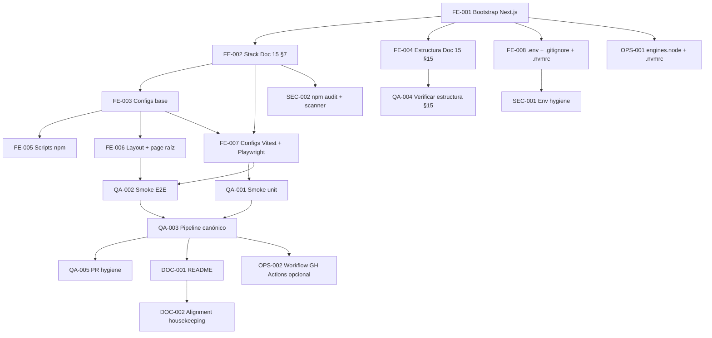

# Development Tasks — PB-P0-012 / US-103: Inicializar la aplicación Next.js (App Router) + TypeScript con el stack frontend MVP

## 1. Metadata

| Field                                  | Value                                                                                                          |
| -------------------------------------- | -------------------------------------------------------------------------------------------------------------- |
| User Story ID                          | US-103                                                                                                         |
| Source User Story                      | `management/user-stories/US-103-bootstrap-nextjs-app-router.md`                                                |
| Source Technical Specification         | `management/technical-specs/P0/PB-P0-012/US-103-technical-spec.md`                                              |
| Decision Resolution Artifact           | No existe — decisiones formalizadas en `PO/BA Decisions Applied` de la historia                                 |
| Priority                               | P0                                                                                                             |
| Backlog ID                             | PB-P0-012                                                                                                      |
| Backlog Title                          | Frontend Next.js Bootstrap & i18n                                                                              |
| Backlog Execution Order                | 12 (de 18 items P0 priorizados)                                                                                |
| User Story Position in Backlog Item    | 1 de 3                                                                                                         |
| Related User Stories in Backlog Item   | US-103 (bootstrap), US-104 (i18n functional), US-105 (route groups por rol)                                    |
| Epic                                   | EPIC-FE-001 — Frontend Next.js Application Foundation                                                          |
| Backlog Item Dependencies              | — (foundation; PB-P0-012 no depende de otros items P0)                                                          |
| Feature                                | Bootstrap Next.js — scaffolding del proyecto frontend MVP                                                       |
| Module / Domain                        | Platform / FE                                                                                                  |
| Backlog Alignment Status               | Found                                                                                                          |
| Task Breakdown Status                  | Ready for Sprint Planning                                                                                      |
| Created Date                           | 2026-06-19                                                                                                     |
| Last Updated                           | 2026-06-19                                                                                                     |

---

## 2. Source Validation

| Source                       | Found | Used | Notes                                                                                                  |
| ---------------------------- | ----- | ---- | ------------------------------------------------------------------------------------------------------ |
| User Story                   | Yes   | Yes  | `Approved with Minor Notes`; 8 AC atómicos                                                             |
| Technical Specification      | Yes   | Yes  | Fuente primaria — `Ready for Task Breakdown`                                                          |
| Decision Resolution Artifact | No    | N/A  | No existe — decisiones incluidas en historia (`PO/BA Decisions Applied`)                                |
| Product Backlog Prioritized  | Yes   | Yes  | PB-P0-012, posición 12 de 18 P0, sin dependencias                                                       |
| ADRs                         | Yes   | Yes  | ADR-FE-001 (Next.js App Router), ADR-FE-002 (REST + TQ), ADR-FE-003 (FE UX-only), ADR-API-001 (REST puro) |

---

## 3. Backlog Execution Context

### Parent Backlog Item

**PB-P0-012 — Frontend Next.js Bootstrap & i18n**. Item P0 foundation que entrega la app Next.js con App Router + TypeScript + Tailwind + next-intl con 4 locales y route groups por rol. Sin dependencias técnicas con otros items P0. Trazabilidad: Doc 15, NFR-A11Y-*, NFR-I18N-*, ADR-FE-001.

### Execution Order Rationale

PB-P0-012 ocupa la **posición 12 de 18** entre los items P0 priorizados pero **no depende** de los items previos — puede ejecutarse en paralelo con el bloque backend (PB-P0-001..PB-P0-011) y con SEC/QA/DevOps. US-103 es la **primera historia** de PB-P0-012 y de EPIC-FE-001: hasta que US-103 esté mergeada, ni US-104 (i18n functional) ni US-105 (route groups) pueden iniciarse porque ambas extienden artefactos (`src/`, `package.json`, `next.config.mjs`, `tsconfig.json`) creados aquí. Las tareas se ordenan internamente por dependencia de implementación: scaffolding → instalación de stack → configuración → estructura → smoke → docs.

### Related User Stories in Same Backlog Item

| User Story | Role in Backlog Item                                                                  | Suggested Order |
| ---------- | ------------------------------------------------------------------------------------- | --------------- |
| US-103     | Bootstrap del proyecto + stack + configuración base + estructura Doc 15 §15           | 1               |
| US-104     | `next-intl` 4 locales + `localeMiddleware` + switcher + catálogos transversales       | 2               |
| US-105     | 4 route groups + `roleGuardMiddleware` componible + SEO baseline                      | 3               |

---

## 4. Task Breakdown Summary

| Area                       | Number of Tasks | Notes                                                                       |
| -------------------------- | --------------: | --------------------------------------------------------------------------- |
| Frontend (FE)              | 8               | Scaffold + stack + config + estructura + root layout + smoke page           |
| QA / Testing               | 5               | Vitest config + Playwright config + smoke unit + smoke E2E + pipeline check |
| Security / Authorization   | 2               | `.env.local.example` + `npm audit` policy + secret scanner                  |
| DevOps / Environment       | 2               | `.nvmrc` + `engines.node`; workflow GitHub Actions (opcional)               |
| Documentation              | 2               | `web/README.md` + housekeeping de alineación documental                     |
| **Total**                  | **19**          |                                                                             |

---

## 5. Traceability Matrix

| Acceptance Criterion                                                       | Technical Spec Section                                              | Task IDs                                                                                                |
| -------------------------------------------------------------------------- | ------------------------------------------------------------------- | ------------------------------------------------------------------------------------------------------- |
| AC-01 Proyecto Next.js + TypeScript creado en `web/`                       | §6, §8 Routes/Pages, §18 Files impacted                              | TASK-PB-P0-012-US-103-FE-001                                                                            |
| AC-02 Stack MVP Doc 15 §7 instalado con versiones acordadas                | §5 Frontend Architecture, §6, §17 Risks                              | TASK-PB-P0-012-US-103-FE-002                                                                            |
| AC-03 Configuración base aplicada                                          | §5, §6, §8, §13 Testing Strategy                                     | TASK-PB-P0-012-US-103-FE-003, TASK-PB-P0-012-US-103-QA-001, TASK-PB-P0-012-US-103-QA-002                |
| AC-04 Estructura de carpetas Doc 15 §15 lista                              | §5 Frontend Architecture, §18 Files impacted                         | TASK-PB-P0-012-US-103-FE-004                                                                            |
| AC-05 Scripts npm operativos y CI verde local                              | §13 Testing Strategy, §6                                             | TASK-PB-P0-012-US-103-FE-005, TASK-PB-P0-012-US-103-QA-005                                              |
| AC-06 Smoke E2E Playwright pasa                                            | §13 E2E Tests                                                        | TASK-PB-P0-012-US-103-FE-007, TASK-PB-P0-012-US-103-QA-004                                              |
| AC-07 `.env.local.example` y secretos                                      | §12 Sensitive Data Handling                                          | TASK-PB-P0-012-US-103-SEC-001                                                                           |
| AC-08 La historia NO incluye artefactos fuera de scope                     | §4 Scope Boundary, §12, §17                                          | TASK-PB-P0-012-US-103-SEC-002, TASK-PB-P0-012-US-103-QA-005                                             |

Cada AC mapea a ≥ 1 tarea. Todas las tareas mapean a ≥ 1 sección del Technical Spec.

---

## 6. Development Tasks

### TASK-PB-P0-012-US-103-FE-001 — Bootstrap del proyecto Next.js + TypeScript + App Router en `web/`

| Field                     | Value                                                              |
| ------------------------- | ------------------------------------------------------------------ |
| Area                      | Frontend                                                            |
| Type                      | Setup                                                               |
| Priority                  | Must                                                                |
| Estimate                  | S                                                                   |
| Depends On                | —                                                                   |
| Source AC(s)              | AC-01                                                               |
| Technical Spec Section(s) | §6 (AC-01), §8 Routes/Pages, §18 Files impacted, §18 Recommended order paso 1 |
| Backlog ID                | PB-P0-012                                                            |
| User Story ID             | US-103                                                              |
| Owner Role                | Frontend                                                            |
| Status                    | To Do                                                               |

#### Objective

Crear el proyecto Next.js 14+ con App Router + TypeScript bajo `web/` en la raíz del repositorio.

#### Scope

##### Include

* Ejecutar `npx create-next-app@latest web --typescript --app --tailwind --eslint --src-dir --import-alias '@/*'` desde la raíz del repo.
* Aceptar Tailwind y ESLint en el wizard; rechazar otras integraciones.
* Verificar que se crean `web/package.json`, `web/tsconfig.json`, `web/next.config.mjs`, `web/tailwind.config.ts`, `web/postcss.config.mjs`, `web/src/app/{layout.tsx,page.tsx}`, `web/.gitignore`.
* Inicializar `web/package.json` con `"private": true` y `"type": "module"`.

##### Exclude

* No instalar el resto del stack (eso es TASK-FE-002).
* No modificar `tsconfig.json` ni `next.config.mjs` aún (eso es TASK-FE-003).
* No crear estructura de carpetas adicional (TASK-FE-004).

#### Implementation Notes

* Repositorio NO debe tener proyecto previo en `web/`, `frontend/` o `apps/web/` (asunción §18).
* Verificar Node 20 LTS antes de ejecutar.
* `create-next-app` puede preguntar por Turbopack — aceptar default.

#### Acceptance Criteria Covered

AC-01.

#### Definition of Done

- [ ] `web/` existe en la raíz del repo con la estructura inicial de `create-next-app`.
- [ ] `web/package.json` tiene `"private": true` y `"type": "module"`.
- [ ] `cd web && npm run dev` arranca la app en `http://localhost:3000` sin errores.
- [ ] Cambios commiteados con `package-lock.json`.

---

### TASK-PB-P0-012-US-103-FE-002 — Instalar el stack frontend MVP Doc 15 §7 con versiones objetivo

| Field                     | Value                                                                                                       |
| ------------------------- | ----------------------------------------------------------------------------------------------------------- |
| Area                      | Frontend                                                                                                     |
| Type                      | Setup                                                                                                        |
| Priority                  | Must                                                                                                         |
| Estimate                  | M                                                                                                            |
| Depends On                | TASK-PB-P0-012-US-103-FE-001                                                                                  |
| Source AC(s)              | AC-02                                                                                                        |
| Technical Spec Section(s) | §5 Frontend Architecture, §6 (AC-02), §17 Risks                                                              |
| Backlog ID                | PB-P0-012                                                                                                    |
| User Story ID             | US-103                                                                                                       |
| Owner Role                | Frontend                                                                                                     |
| Status                    | To Do                                                                                                        |

#### Objective

Instalar el resto del stack frontend MVP cerrado por Doc 15 §7 con versiones objetivo, dejando `package-lock.json` versionado.

#### Scope

##### Include

* Dependencies runtime: `@tanstack/react-query@^5`, `react-hook-form@^7`, `zod@^3`, `@hookform/resolvers`, `next-intl@^3`, `@headlessui/react`, `@radix-ui/react-*` (primitives que el equipo decida cerrar; mínimo `react-slot`), `lucide-react`, `date-fns`.
* Dependencies dev: `vitest`, `@vitest/coverage-v8`, `@testing-library/react`, `@testing-library/jest-dom`, `@testing-library/user-event`, `jsdom`, `@playwright/test`, `msw@^2`, `eslint-config-prettier`, `eslint-plugin-jsx-a11y`, `prettier`.
* Validar que las versiones efectivas instaladas matchean los pins MVP. Documentar versiones efectivas en `web/README.md` § "Stack".

##### Exclude

* No instalar Sentry (Future).
* No instalar TanStack Table 8.x (diferido — Doc 15 §7 "selectivo").
* No instalar librerías de design system completas más allá de Headless UI / Radix primitives.
* No agregar dependencies fuera del stack §7 (cualquier extra requiere ADR — VR-02).

#### Implementation Notes

* Después de `create-next-app`, los pins de Next/React pueden divergir. Validar `package-lock.json` y ajustar con `npm install <pkg>@<version>` si es necesario (§17 risk 1).
* Mantener `engines.node >= 20.0.0`.

#### Acceptance Criteria Covered

AC-02.

#### Definition of Done

- [ ] `package.json` declara todas las deps del stack Doc 15 §7 con versiones objetivo.
- [ ] `package-lock.json` versionado.
- [ ] `npm ci` ejecuta limpio.
- [ ] `web/README.md` § "Stack" lista versiones efectivas.

---

### TASK-PB-P0-012-US-103-FE-003 — Configuración base: TypeScript estricto, Next.js, Tailwind, ESLint, Prettier

| Field                     | Value                                                                                                           |
| ------------------------- | --------------------------------------------------------------------------------------------------------------- |
| Area                      | Frontend                                                                                                         |
| Type                      | Setup                                                                                                            |
| Priority                  | Must                                                                                                             |
| Estimate                  | M                                                                                                                |
| Depends On                | TASK-PB-P0-012-US-103-FE-002                                                                                      |
| Source AC(s)              | AC-03                                                                                                            |
| Technical Spec Section(s) | §5, §6 (AC-03), §8, §13 CI Checks, §18 Recommended order pasos 4–6                                                |
| Backlog ID                | PB-P0-012                                                                                                        |
| User Story ID             | US-103                                                                                                           |
| Owner Role                | Frontend                                                                                                         |
| Status                    | To Do                                                                                                            |

#### Objective

Endurecer la configuración base del proyecto para cumplir Doc 15 + Doc 21 + ADR-FE-001/002/003.

#### Scope

##### Include

* `tsconfig.json`: `strict: true`, `noUncheckedIndexedAccess: true`, `noImplicitOverride: true`, `forceConsistentCasingInFileNames: true`, `paths: { "@/*": ["./src/*"] }`.
* `next.config.mjs`: ESM, `reactStrictMode: true`, sin `experimental.serverActions`, sin rewrites externos.
* `tailwind.config.ts`: `content: ['./src/**/*.{ts,tsx}']`, preset default + extensión mínima.
* `postcss.config.mjs`: Tailwind + autoprefixer.
* ESLint config (`.eslintrc.cjs` o `eslint.config.mjs`): extends `next/core-web-vitals` + `eslint-config-prettier`; plugin `jsx-a11y` activo.
* `.prettierrc`: `singleQuote: true`, `semi: true`, `trailingComma: "all"`, `printWidth: 100`.

##### Exclude

* No agregar reglas de lint anti-hardcoded strings (`react/jsx-no-literals`) — pertenece a US-104.
* No introducir tokens de design system completos en Tailwind — historias UI posteriores.

#### Implementation Notes

* `eslint-config-prettier` al final de `extends` para desactivar reglas conflictivas con Prettier (§17 risk 2).
* `next.config.mjs` debe explícitamente NO incluir `experimental.serverActions: true` (SEC).

#### Acceptance Criteria Covered

AC-03.

#### Definition of Done

- [ ] `npm run typecheck` pasa con `strict + noUncheckedIndexedAccess`.
- [ ] `npm run lint` pasa con `--max-warnings=0`.
- [ ] `npm run build` pasa.
- [ ] Configs commiteadas.

---

### TASK-PB-P0-012-US-103-FE-004 — Crear estructura de carpetas Doc 15 §15 con placeholders

| Field                     | Value                                                                                                         |
| ------------------------- | ------------------------------------------------------------------------------------------------------------- |
| Area                      | Frontend                                                                                                       |
| Type                      | Setup                                                                                                          |
| Priority                  | Must                                                                                                           |
| Estimate                  | S                                                                                                              |
| Depends On                | TASK-PB-P0-012-US-103-FE-001                                                                                    |
| Source AC(s)              | AC-04                                                                                                          |
| Technical Spec Section(s) | §5 Frontend Architecture, §18 Files impacted                                                                   |
| Backlog ID                | PB-P0-012                                                                                                      |
| User Story ID             | US-103                                                                                                         |
| Owner Role                | Frontend                                                                                                       |
| Status                    | To Do                                                                                                          |

#### Objective

Crear toda la estructura de carpetas Doc 15 §15 con `.gitkeep` o `README.md` placeholder describiendo propósito e historia owner.

#### Scope

##### Include

* `web/src/features/.gitkeep` (con README explicando "feature-first; historias futuras llenan").
* `web/src/shared/api-client/.gitkeep`.
* `web/src/shared/design-system/.gitkeep`.
* `web/src/shared/design-tokens/.gitkeep`.
* `web/src/shared/hooks/.gitkeep`.
* `web/src/shared/i18n/.gitkeep` (con README "config de next-intl viene en US-104").
* `web/src/shared/lib/.gitkeep`.
* `web/src/shared/observability/.gitkeep`.
* `web/src/shared/providers/.gitkeep`.
* `web/src/shared/auth-session/.gitkeep`.
* `web/src/shared/authorization/.gitkeep` (con README "frontend UX-only; ADR-FE-003").
* `web/src/shared/error-handling/.gitkeep`.
* `web/src/tests/e2e/.gitkeep`.
* `web/src/tests/unit/.gitkeep`.
* `web/src/tests/integration/.gitkeep`.
* `web/src/tests/msw/.gitkeep` (con README "handlers vienen en US-106").
* `web/src/messages/.gitkeep` (con README "catálogos por locale vienen en US-104").

##### Exclude

* No crear contenido funcional en ninguna de estas carpetas.
* No crear carpetas que no estén en Doc 15 §15.

#### Implementation Notes

* Cada README placeholder debe nombrar la historia owner que la llenará (US-104, US-105, US-106, etc.).
* `.gitkeep` se usa cuando no hay README; preferir README cuando haya algo que explicar.

#### Acceptance Criteria Covered

AC-04.

#### Definition of Done

- [ ] Todas las carpetas Doc 15 §15 existen bajo `web/src/`.
- [ ] Cada carpeta vacía tiene `.gitkeep` o `README.md`.
- [ ] `git status` no muestra carpetas perdidas.

---

### TASK-PB-P0-012-US-103-FE-005 — Declarar scripts npm operativos en `package.json`

| Field                     | Value                                                                                          |
| ------------------------- | ---------------------------------------------------------------------------------------------- |
| Area                      | Frontend                                                                                        |
| Type                      | Setup                                                                                           |
| Priority                  | Must                                                                                            |
| Estimate                  | XS                                                                                              |
| Depends On                | TASK-PB-P0-012-US-103-FE-003                                                                     |
| Source AC(s)              | AC-05                                                                                           |
| Technical Spec Section(s) | §13 CI Checks, §6 (AC-05)                                                                       |
| Backlog ID                | PB-P0-012                                                                                       |
| User Story ID             | US-103                                                                                          |
| Owner Role                | Frontend                                                                                        |
| Status                    | To Do                                                                                           |

#### Objective

Declarar los 11 scripts npm requeridos por el pipeline canónico Doc 21 §9.2 en `web/package.json`.

#### Scope

##### Include

* `"dev": "next dev"`.
* `"build": "next build"`.
* `"start": "next start"`.
* `"lint": "next lint --max-warnings=0"`.
* `"lint:fix": "next lint --fix"`.
* `"format": "prettier --write \"src/**/*.{ts,tsx,js,jsx,json,md}\""`.
* `"typecheck": "tsc --noEmit"`.
* `"test": "vitest run"`.
* `"test:watch": "vitest"`.
* `"test:e2e": "playwright test"`.
* `"test:e2e:install": "playwright install --with-deps chromium"`.

##### Exclude

* No agregar scripts de seed/migrate (no aplica frontend).
* No agregar scripts de Sentry/Amplify (Future / DevOps).

#### Implementation Notes

* `lint --max-warnings=0` para CI estricto (AC-05).
* `playwright install --with-deps chromium` cubre §17 risk 3.

#### Acceptance Criteria Covered

AC-05.

#### Definition of Done

- [ ] Todos los scripts existen y son ejecutables.
- [ ] `npm run typecheck`, `npm run lint`, `npm run test`, `npm run build` exit 0 en local.

---

### TASK-PB-P0-012-US-103-FE-006 — Crear root layout y página raíz mínima como smoke target

| Field                     | Value                                                                  |
| ------------------------- | ---------------------------------------------------------------------- |
| Area                      | Frontend                                                                |
| Type                      | Implementation                                                          |
| Priority                  | Must                                                                    |
| Estimate                  | XS                                                                      |
| Depends On                | TASK-PB-P0-012-US-103-FE-003                                             |
| Source AC(s)              | AC-01, AC-06                                                            |
| Technical Spec Section(s) | §8 Routes/Pages, §8 Components, §8 Accessibility                       |
| Backlog ID                | PB-P0-012                                                               |
| User Story ID             | US-103                                                                  |
| Owner Role                | Frontend                                                                |
| Status                    | To Do                                                                   |

#### Objective

Crear `app/layout.tsx` mínimo Server Component y `app/page.tsx` con `<main>` + `<h1>` como smoke target del E2E.

#### Scope

##### Include

* `src/app/layout.tsx`: Server Component con `<html lang="es-LATAM"><body>{children}</body></html>`.
* `src/app/page.tsx`: Server Component con `<main><h1>EventFlow</h1></main>` (string literal placeholder permitido sólo aquí — documentar excepción en comentario).

##### Exclude

* No envolver con `<NextIntlClientProvider>` (US-104).
* No envolver con `<SessionProvider>` ni `<QueryClientProvider>` (US-105/US-106).
* No introducir `<LocaleSwitcher>` ni componentes adicionales.

#### Implementation Notes

* `<html lang="es-LATAM">` estático en US-103; US-104 lo hará dinámico vía `useLocale()`.
* El `<h1>` con string literal está permitido como excepción documentada — lint anti-hardcoded llega en US-104.

#### Acceptance Criteria Covered

AC-01, AC-06.

#### Definition of Done

- [ ] `app/layout.tsx` y `app/page.tsx` creados.
- [ ] `npm run dev` muestra `<h1>EventFlow</h1>` en `/`.
- [ ] `npm run build` pasa.

---

### TASK-PB-P0-012-US-103-FE-007 — Configurar Vitest + Testing Library + Playwright

| Field                     | Value                                                                                                  |
| ------------------------- | ------------------------------------------------------------------------------------------------------ |
| Area                      | Frontend                                                                                                |
| Type                      | Setup                                                                                                   |
| Priority                  | Must                                                                                                    |
| Estimate                  | S                                                                                                       |
| Depends On                | TASK-PB-P0-012-US-103-FE-002, TASK-PB-P0-012-US-103-FE-003                                                |
| Source AC(s)              | AC-03, AC-06                                                                                            |
| Technical Spec Section(s) | §13 Testing Strategy, §18 Recommended order paso 7                                                      |
| Backlog ID                | PB-P0-012                                                                                                |
| User Story ID             | US-103                                                                                                  |
| Owner Role                | Frontend / QA                                                                                            |
| Status                    | To Do                                                                                                    |

#### Objective

Crear `vitest.config.ts` y `playwright.config.ts` con la configuración mínima requerida por el pipeline.

#### Scope

##### Include

* `vitest.config.ts`: `environment: 'jsdom'`, `setupFiles: ['./vitest.setup.ts']`, alias `@/*`.
* `vitest.setup.ts`: importa `@testing-library/jest-dom/vitest`.
* `playwright.config.ts`: project `chromium`, `webServer` que ejecuta `npm run build && npm run start` (o `npm run dev` en modo CI=false), `baseURL: 'http://localhost:3000'`, `testDir: './src/tests/e2e'`.

##### Exclude

* No agregar matrices multi-browser (Firefox, WebKit) — Future.
* No configurar `coverage.thresholds` estrictos en US-103 (se ajusta cuando haya suites reales).

#### Implementation Notes

* `webServer.reuseExistingServer: !process.env.CI` para DX local.
* `testMatch: ['**/*.spec.ts']` en Playwright para no colisionar con Vitest (`*.test.ts`).

#### Acceptance Criteria Covered

AC-03, AC-06.

#### Definition of Done

- [ ] `vitest.config.ts` y `playwright.config.ts` versionados.
- [ ] `npm run test` y `npm run test:e2e` ejecutan sin errores de configuración.

---

### TASK-PB-P0-012-US-103-FE-008 — Versionar `.env.local.example`, `.gitignore`, `.nvmrc`

| Field                     | Value                                                                       |
| ------------------------- | --------------------------------------------------------------------------- |
| Area                      | Frontend                                                                     |
| Type                      | Setup                                                                        |
| Priority                  | Must                                                                         |
| Estimate                  | XS                                                                           |
| Depends On                | TASK-PB-P0-012-US-103-FE-001                                                  |
| Source AC(s)              | AC-07                                                                        |
| Technical Spec Section(s) | §12 Sensitive Data Handling, §18 Recommended order paso 11                   |
| Backlog ID                | PB-P0-012                                                                    |
| User Story ID             | US-103                                                                       |
| Owner Role                | Frontend                                                                     |
| Status                    | To Do                                                                        |

#### Objective

Versionar `.env.local.example`, ajustar `.gitignore` y crear `.nvmrc` para fijar Node 20.

#### Scope

##### Include

* `web/.env.local.example` con SOLO claves:
  * `NEXT_PUBLIC_API_BASE_URL=http://localhost:3001/api/v1`
  * `NEXT_PUBLIC_APP_ENV=local`
  * `NEXT_PUBLIC_CAPTCHA_SITE_KEY=` (vacío)
* `web/.gitignore`: incluir `.env*` y excluir explícitamente `.env.local.example` (`!.env.local.example`).
* `web/.nvmrc` con `20`.

##### Exclude

* No introducir valores reales en `.env.local.example`.
* No agregar variables sin prefijo `NEXT_PUBLIC_` (Doc 21 §9.3).

#### Implementation Notes

* `nvm use` debe seleccionar Node 20 automáticamente (§17 risk 4).
* Cualquier env nueva en historias futuras debe documentarse aquí.

#### Acceptance Criteria Covered

AC-07.

#### Definition of Done

- [ ] `.env.local.example` versionado sin valores reales.
- [ ] `.gitignore` ignora `.env*` excepto `.env.local.example`.
- [ ] `.nvmrc` con `20`.
- [ ] `git check-ignore .env.local` retorna ignored.

---

### TASK-PB-P0-012-US-103-QA-001 — Tests unit smoke y configuración Vitest funcional

| Field                     | Value                                                                       |
| ------------------------- | --------------------------------------------------------------------------- |
| Area                      | QA / Testing                                                                 |
| Type                      | Test                                                                         |
| Priority                  | Must                                                                         |
| Estimate                  | XS                                                                           |
| Depends On                | TASK-PB-P0-012-US-103-FE-007                                                  |
| Source AC(s)              | AC-03, AC-05                                                                 |
| Technical Spec Section(s) | §13 Unit Tests                                                               |
| Backlog ID                | PB-P0-012                                                                    |
| User Story ID             | US-103                                                                       |
| Owner Role                | QA / Frontend                                                                |
| Status                    | To Do                                                                        |

#### Objective

Crear `tests/unit/smoke.test.ts` placeholder mínimo para mantener `npm run test` verde.

#### Scope

##### Include

* `web/src/tests/unit/smoke.test.ts` con `it('smoke', () => { expect(1 + 1).toBe(2) })`.

##### Exclude

* No agregar tests reales de componentes (no hay componentes funcionales aún).

#### Implementation Notes

* Sirve como guardia anti-regresión en la pipeline; cuando lleguen tests reales puede eliminarse.

#### Acceptance Criteria Covered

AC-03, AC-05.

#### Definition of Done

- [ ] `npm run test` exit 0 con 1 test pasando.

---

### TASK-PB-P0-012-US-103-QA-002 — Smoke E2E Playwright sobre `/`

| Field                     | Value                                                                                       |
| ------------------------- | ------------------------------------------------------------------------------------------- |
| Area                      | QA / Testing                                                                                 |
| Type                      | Test                                                                                         |
| Priority                  | Must                                                                                         |
| Estimate                  | S                                                                                            |
| Depends On                | TASK-PB-P0-012-US-103-FE-006, TASK-PB-P0-012-US-103-FE-007                                    |
| Source AC(s)              | AC-06                                                                                        |
| Technical Spec Section(s) | §13 E2E Tests                                                                                |
| Backlog ID                | PB-P0-012                                                                                    |
| User Story ID             | US-103                                                                                       |
| Owner Role                | QA                                                                                           |
| Status                    | To Do                                                                                        |

#### Objective

Crear `tests/e2e/smoke.spec.ts` que valide que `/` responde 200 y renderiza `<main>` (o `<h1>`).

#### Scope

##### Include

* `web/src/tests/e2e/smoke.spec.ts` con un `test('home smoke', async ({ page }) => { await page.goto('/'); await expect(page.getByRole('main')).toBeVisible(); await expect(page.getByRole('heading', { level: 1 })).toBeVisible(); })`.

##### Exclude

* No agregar tests de routing/role/i18n (US-104/US-105).

#### Implementation Notes

* Confirmar que `webServer` arranca antes de ejecutar el test.
* Verificar que `npx playwright install --with-deps chromium` se ejecuta en CI antes de `test:e2e`.

#### Acceptance Criteria Covered

AC-06.

#### Definition of Done

- [ ] `npm run test:e2e` pasa el smoke test localmente.
- [ ] Test commiteado.

---

### TASK-PB-P0-012-US-103-QA-003 — Validar pipeline canónico Doc 21 §9.2 verde en local

| Field                     | Value                                                                                                  |
| ------------------------- | ------------------------------------------------------------------------------------------------------ |
| Area                      | QA / Testing                                                                                            |
| Type                      | Review                                                                                                  |
| Priority                  | Must                                                                                                    |
| Estimate                  | XS                                                                                                      |
| Depends On                | TASK-PB-P0-012-US-103-QA-001, TASK-PB-P0-012-US-103-QA-002                                                |
| Source AC(s)              | AC-05                                                                                                   |
| Technical Spec Section(s) | §13 CI Checks                                                                                            |
| Backlog ID                | PB-P0-012                                                                                                |
| User Story ID             | US-103                                                                                                  |
| Owner Role                | QA                                                                                                       |
| Status                    | To Do                                                                                                    |

#### Objective

Validar end-to-end que `npm ci && npm run lint && npm run typecheck && npm run test && npm run build && npm run test:e2e` exit 0 desde `web/` en local.

#### Scope

##### Include

* Limpiar `node_modules` y `package-lock.json` (opcional para validar `npm ci` desde cero).
* Ejecutar el pipeline canónico secuencial.
* Documentar tiempo de ejecución por paso en `web/README.md` § "CI Pipeline" (opcional).

##### Exclude

* No reemplaza CI remoto; es validación local pre-PR.

#### Implementation Notes

* Si algún paso falla, no avanzar al siguiente. Abrir issue de seguimiento si es un blocker no resuelto en US-103.

#### Acceptance Criteria Covered

AC-05.

#### Definition of Done

- [ ] Cada paso exit 0 documentado en el PR.
- [ ] No hay warnings de ESLint con `--max-warnings=0`.

---

### TASK-PB-P0-012-US-103-QA-004 — Verificar estructura Doc 15 §15 completa

| Field                     | Value                                                                       |
| ------------------------- | --------------------------------------------------------------------------- |
| Area                      | QA / Testing                                                                 |
| Type                      | Review                                                                       |
| Priority                  | Should                                                                       |
| Estimate                  | XS                                                                           |
| Depends On                | TASK-PB-P0-012-US-103-FE-004                                                  |
| Source AC(s)              | AC-04                                                                        |
| Technical Spec Section(s) | §5 Frontend Architecture, §18 Files impacted                                 |
| Backlog ID                | PB-P0-012                                                                    |
| User Story ID             | US-103                                                                       |
| Owner Role                | QA / Tech Lead                                                                |
| Status                    | To Do                                                                        |

#### Objective

Verificar que todas las carpetas listadas en Doc 15 §15 existen bajo `web/src/` con `.gitkeep` o README placeholder.

#### Scope

##### Include

* Checklist manual o script `ls -R` que valide presencia de cada carpeta.
* Verificar que cada README placeholder nombra la historia owner (US-104/US-105/US-106/etc.).

##### Exclude

* No validar contenido funcional de las carpetas.

#### Implementation Notes

* Opcionalmente añadir un test unit `tests/unit/structure.test.ts` que verifique `fs.existsSync` por carpeta — diferible.

#### Acceptance Criteria Covered

AC-04.

#### Definition of Done

- [ ] Checklist completado en el PR.
- [ ] Todas las carpetas Doc 15 §15 presentes.

---

### TASK-PB-P0-012-US-103-QA-005 — PR hygiene: confirmar no hay artefactos fuera de scope

| Field                     | Value                                                                                                                            |
| ------------------------- | -------------------------------------------------------------------------------------------------------------------------------- |
| Area                      | QA / Testing                                                                                                                      |
| Type                      | Review                                                                                                                            |
| Priority                  | Must                                                                                                                              |
| Estimate                  | XS                                                                                                                                |
| Depends On                | TASK-PB-P0-012-US-103-QA-003                                                                                                       |
| Source AC(s)              | AC-08                                                                                                                             |
| Technical Spec Section(s) | §4 Scope Boundary, §17 Risks, §18 What must not be implemented                                                                    |
| Backlog ID                | PB-P0-012                                                                                                                          |
| User Story ID             | US-103                                                                                                                            |
| Owner Role                | Tech Lead / QA                                                                                                                     |
| Status                    | To Do                                                                                                                              |

#### Objective

Auditar el PR para confirmar que no contiene artefactos fuera de scope (US-104..US-107, Future, prohibidos).

#### Scope

##### Include

* Verificar ausencia de: middleware `next-intl` funcional, route groups `(public)/(auth)/(app)/(admin)`, `QueryClient`/`QueryProvider`, MSW handlers, layouts por rol, design system completo, features de dominio, `apiClient`, Server Actions (`'use server'`), API Routes BFF (`src/app/api/*`), configs Sentry, rewrites a OpenAI o `/api/v1/*`.
* Confirmar que el único string literal es el `<h1>EventFlow</h1>` de la página raíz (excepción documentada).

##### Exclude

* No corregir hallazgos directamente — abrir comentario en PR y dejar al author resolver.

#### Implementation Notes

* Opcional: script grep simple en CI (`grep -r "'use server'" src/` debe devolver 0).

#### Acceptance Criteria Covered

AC-08.

#### Definition of Done

- [ ] Checklist en el PR confirmando que ninguno de los artefactos prohibidos está presente.
- [ ] Comentarios resueltos antes del merge.

---

### TASK-PB-P0-012-US-103-SEC-001 — Garantizar manejo seguro de variables de entorno

| Field                     | Value                                                                       |
| ------------------------- | --------------------------------------------------------------------------- |
| Area                      | Security / Authorization                                                     |
| Type                      | Review                                                                       |
| Priority                  | Must                                                                         |
| Estimate                  | XS                                                                           |
| Depends On                | TASK-PB-P0-012-US-103-FE-008                                                  |
| Source AC(s)              | AC-07                                                                        |
| Technical Spec Section(s) | §12 Sensitive Data Handling                                                  |
| Backlog ID                | PB-P0-012                                                                    |
| User Story ID             | US-103                                                                       |
| Owner Role                | Tech Lead / Security                                                          |
| Status                    | To Do                                                                        |

#### Objective

Auditar que el manejo de env vars cumple Doc 21 §9.3 + SEC-04: solo `NEXT_PUBLIC_*`, sin secretos, `.env.local` ignorado.

#### Scope

##### Include

* Confirmar `.env.local.example` solo con `NEXT_PUBLIC_*` y sin valores reales.
* Confirmar `.gitignore` excluye `.env*` excepto `.env.local.example`.
* Confirmar `next.config.mjs` no expone env vars privadas vía `publicRuntimeConfig` ni `serverRuntimeConfig`.
* Confirmar que ningún archivo committed contiene secrets (correr secret scanner local: `git secrets`, `trufflehog` o equivalente).

##### Exclude

* No introducir secret scanner CI en esta tarea (TASK-SEC-002).

#### Implementation Notes

* Cualquier valor real debe vivir solo en `.env.local` (no versionado).

#### Acceptance Criteria Covered

AC-07.

#### Definition of Done

- [ ] Auditoría documentada en el PR.
- [ ] Sin hallazgos.

---

### TASK-PB-P0-012-US-103-SEC-002 — Política `npm audit` y secret scanner en CI

| Field                     | Value                                                                                                                    |
| ------------------------- | ------------------------------------------------------------------------------------------------------------------------ |
| Area                      | Security / Authorization                                                                                                  |
| Type                      | Setup / Review                                                                                                            |
| Priority                  | Must                                                                                                                      |
| Estimate                  | S                                                                                                                         |
| Depends On                | TASK-PB-P0-012-US-103-FE-002                                                                                               |
| Source AC(s)              | AC-08                                                                                                                     |
| Technical Spec Section(s) | §12 Sensitive Data Handling, §13 Security Tests, §17 Risks                                                                |
| Backlog ID                | PB-P0-012                                                                                                                 |
| User Story ID             | US-103                                                                                                                    |
| Owner Role                | Security / DevOps                                                                                                          |
| Status                    | To Do                                                                                                                      |

#### Objective

Documentar y activar la política de `npm audit --omit=dev` en CI y validar secret scanner.

#### Scope

##### Include

* Documentar en `web/README.md` § "Security" la política: `npm audit --omit=dev` High/Critical sin issue de seguimiento bloquea merge.
* Ejecutar `npm audit --omit=dev` localmente y confirmar 0 vulnerabilidades High/Critical (o abrir issues para las que existan).
* Si el repo tiene secret scanner CI (GitHub secret scanning, gitleaks, trufflehog), confirmar que cubre `web/`. Si no, dejar documentado el TODO en el README.

##### Exclude

* No crear workflow GitHub Actions completo aquí (TASK-OPS-002 opcional).

#### Implementation Notes

* Si surge una vulnerabilidad High/Critical sin fix disponible, abrir issue trackeable; no bloquear US-103 por package upstream sin fix.

#### Acceptance Criteria Covered

AC-08.

#### Definition of Done

- [ ] Política documentada.
- [ ] `npm audit --omit=dev` exit 0 o issues abiertos para hallazgos.

---

### TASK-PB-P0-012-US-103-OPS-001 — Fijar Node 20 vía `engines.node` y `.nvmrc`

| Field                     | Value                                                                                  |
| ------------------------- | -------------------------------------------------------------------------------------- |
| Area                      | DevOps / Environment                                                                    |
| Type                      | Setup                                                                                   |
| Priority                  | Must                                                                                    |
| Estimate                  | XS                                                                                      |
| Depends On                | TASK-PB-P0-012-US-103-FE-001                                                             |
| Source AC(s)              | AC-01, AC-03                                                                            |
| Technical Spec Section(s) | §17 Risks (Node), §18 Recommended order paso 2                                          |
| Backlog ID                | PB-P0-012                                                                                |
| User Story ID             | US-103                                                                                  |
| Owner Role                | DevOps / Frontend                                                                       |
| Status                    | To Do                                                                                    |

#### Objective

Fijar Node 20 LTS como única versión soportada en local y CI.

#### Scope

##### Include

* `web/package.json` con `"engines": { "node": ">=20.0.0" }`.
* `web/.nvmrc` con `20`.
* Documentar `nvm use` en `web/README.md` § "Setup".

##### Exclude

* No agregar matriz multi-Node en CI (Future si aplica).

#### Implementation Notes

* Coordinar con la rama backend si decide otra versión.

#### Acceptance Criteria Covered

AC-01, AC-03.

#### Definition of Done

- [ ] `engines.node` declarado.
- [ ] `.nvmrc` versionado.
- [ ] README documenta `nvm use`.

---

### TASK-PB-P0-012-US-103-OPS-002 — Workflow GitHub Actions para `web/` (opcional)

| Field                     | Value                                                                          |
| ------------------------- | ------------------------------------------------------------------------------ |
| Area                      | DevOps / Environment                                                            |
| Type                      | Setup                                                                           |
| Priority                  | Should                                                                          |
| Estimate                  | M                                                                               |
| Depends On                | TASK-PB-P0-012-US-103-QA-003                                                     |
| Source AC(s)              | AC-05                                                                           |
| Technical Spec Section(s) | §13 CI Checks, §18 Files impacted                                               |
| Backlog ID                | PB-P0-012                                                                        |
| User Story ID             | US-103                                                                          |
| Owner Role                | DevOps                                                                          |
| Status                    | To Do                                                                            |

#### Objective

Agregar workflow GitHub Actions para correr el pipeline canónico sobre `web/` en cada PR.

#### Scope

##### Include

* `.github/workflows/web-ci.yml` con jobs para `lint`, `typecheck`, `test`, `build`, `test:e2e`.
* Setup de Node 20, cache de npm, `npx playwright install --with-deps chromium`.
* Trigger en PRs que toquen `web/**`.

##### Exclude

* No agregar pipeline de deploy Amplify (DevOps separado).
* No agregar matriz multi-OS (Linux only en MVP).

#### Implementation Notes

* Esta tarea es **opcional** en US-103 — puede vivir como sub-tarea DevOps separada si el equipo lo prefiere.
* Si se posterga, abrir issue de seguimiento.

#### Acceptance Criteria Covered

AC-05.

#### Definition of Done

- [ ] Workflow ejecuta verde en un PR de prueba.
- [ ] Tiempo de ejecución < 10 min.

---

### TASK-PB-P0-012-US-103-DOC-001 — Escribir `web/README.md` con setup local, scripts y env vars

| Field                     | Value                                                                                                    |
| ------------------------- | -------------------------------------------------------------------------------------------------------- |
| Area                      | Documentation / Traceability                                                                              |
| Type                      | Documentation                                                                                             |
| Priority                  | Must                                                                                                      |
| Estimate                  | S                                                                                                         |
| Depends On                | TASK-PB-P0-012-US-103-QA-003                                                                               |
| Source AC(s)              | AC-01, AC-03, AC-05, AC-07                                                                                |
| Technical Spec Section(s) | §18 Recommended order paso 13, §16 Documentation Alignment                                                 |
| Backlog ID                | PB-P0-012                                                                                                 |
| User Story ID             | US-103                                                                                                    |
| Owner Role                | Frontend / Tech Lead                                                                                       |
| Status                    | To Do                                                                                                      |

#### Objective

Documentar el setup local del frontend en `web/README.md`.

#### Scope

##### Include

* Sección "Setup" con `nvm use`, `npm ci`, `cp .env.local.example .env.local`.
* Sección "Scripts" listando los 11 scripts npm.
* Sección "Env vars" describiendo las 3 keys públicas.
* Sección "Stack" listando versiones efectivas del stack §7.
* Sección "Security" con política `npm audit`.
* Sección "Out of Scope (US-103)" enumerando lo que llegará en historias siguientes (US-104/US-105/US-106/US-107).

##### Exclude

* No documentar features de dominio.
* No documentar Amplify deploy (DevOps).

#### Implementation Notes

* Lenguaje en español LATAM neutral.

#### Acceptance Criteria Covered

AC-01, AC-03, AC-05, AC-07.

#### Definition of Done

- [ ] `web/README.md` versionado con las 6 secciones.
- [ ] Revisado por Tech Lead.

---

### TASK-PB-P0-012-US-103-DOC-002 — Housekeeping de Documentation Alignment

| Field                     | Value                                                                                                                                          |
| ------------------------- | ---------------------------------------------------------------------------------------------------------------------------------------------- |
| Area                      | Documentation / Traceability                                                                                                                    |
| Type                      | Documentation                                                                                                                                   |
| Priority                  | Should                                                                                                                                          |
| Estimate                  | XS                                                                                                                                              |
| Depends On                | TASK-PB-P0-012-US-103-DOC-001                                                                                                                     |
| Source AC(s)              | AC-08                                                                                                                                           |
| Technical Spec Section(s) | §16 Documentation Alignment Required                                                                                                            |
| Backlog ID                | PB-P0-012                                                                                                                                       |
| User Story ID             | US-103                                                                                                                                          |
| Owner Role                | Tech Lead                                                                                                                                       |
| Status                    | To Do                                                                                                                                            |

#### Objective

Registrar los tres ítems "Documentation Alignment Required" no bloqueantes y coordinar housekeeping con US-104.

#### Scope

##### Include

* Crear issue de seguimiento (o nota en `web/README.md` § "Documentation Alignment") para:
  1. Amender Doc 15 §7 → "npm canónico MVP, pnpm Future".
  2. Decisión locale URL strategy (Doc 15 §17) — coordinar con US-104.
  3. Redacción ADR-FE-007 en Doc 22 — coordinar con US-104.

##### Exclude

* No modificar Doc 15 ni Doc 22 en US-103 (housekeeping post-merge).

#### Implementation Notes

* Los tres ítems son no bloqueantes y no comprometen el merge de US-103.

#### Acceptance Criteria Covered

AC-08.

#### Definition of Done

- [ ] Issue/PR de seguimiento abierto o nota documentada.
- [ ] Referencias cruzadas con US-104 spec.

---

## 7. Required QA Tasks

| Task ID                          | Test Type             | Purpose                                                              |
| -------------------------------- | --------------------- | -------------------------------------------------------------------- |
| TASK-PB-P0-012-US-103-QA-001     | Unit                  | Smoke unit para mantener `npm run test` verde                        |
| TASK-PB-P0-012-US-103-QA-002     | E2E (Playwright)      | Smoke E2E sobre `/` (AC-06)                                          |
| TASK-PB-P0-012-US-103-QA-003     | Pipeline review       | Validar pipeline canónico Doc 21 §9.2 local (AC-05)                  |
| TASK-PB-P0-012-US-103-QA-004     | Structural review     | Verificar estructura Doc 15 §15 (AC-04)                              |
| TASK-PB-P0-012-US-103-QA-005     | PR hygiene review     | Confirmar ausencia de artefactos fuera de scope (AC-08)              |

---

## 8. Required Security Tasks

| Task ID                           | Security Concern                                  | Purpose                                                                                            |
| --------------------------------- | ------------------------------------------------- | -------------------------------------------------------------------------------------------------- |
| TASK-PB-P0-012-US-103-SEC-001     | Env vars + secrets hygiene                        | Confirmar `.env.local.example` sin valores reales y `.gitignore` correcto (AC-07)                  |
| TASK-PB-P0-012-US-103-SEC-002     | Vulnerabilidades en dependencias + secret scanner | Documentar política `npm audit --omit=dev` y validar secret scanner CI (AC-08)                     |

---

## 9. Required Seed / Demo Tasks

`No aplica`. US-103 no toca seed ni demo.

---

## 10. Observability / Audit Tasks

`No aplica`. US-103 no introduce logs estructurados, AdminAction ni métricas. La observability cliente full es Future (Doc 15 §7).

---

## 11. Documentation / Traceability Tasks

| Task ID                          | Document / Artifact                                                | Purpose                                                                |
| -------------------------------- | ------------------------------------------------------------------ | ---------------------------------------------------------------------- |
| TASK-PB-P0-012-US-103-DOC-001    | `web/README.md`                                                    | Setup local + scripts + env vars + stack + security + out of scope     |
| TASK-PB-P0-012-US-103-DOC-002    | Doc 15 §7, Doc 15 §17, Doc 22 ADR-FE-007                            | Registrar 3 Documentation Alignment Required no bloqueantes            |

---

## 12. Dependency Graph

---

## 13. Suggested Implementation Order

### Phase 1 — Foundation

1. TASK-PB-P0-012-US-103-FE-001 (bootstrap `create-next-app`).
2. TASK-PB-P0-012-US-103-OPS-001 (Node 20 + `.nvmrc`).
3. TASK-PB-P0-012-US-103-FE-008 (`.env.local.example` + `.gitignore`).
4. TASK-PB-P0-012-US-103-FE-002 (instalar stack §7).

### Phase 2 — Core Implementation

5. TASK-PB-P0-012-US-103-FE-003 (configs base TS/Next/Tailwind/ESLint).
6. TASK-PB-P0-012-US-103-FE-004 (estructura Doc 15 §15).
7. TASK-PB-P0-012-US-103-FE-005 (scripts npm).
8. TASK-PB-P0-012-US-103-FE-006 (layout + page raíz).
9. TASK-PB-P0-012-US-103-FE-007 (configs Vitest + Playwright).

### Phase 3 — Validation / Security / QA

10. TASK-PB-P0-012-US-103-QA-001 (smoke unit).
11. TASK-PB-P0-012-US-103-QA-002 (smoke E2E).
12. TASK-PB-P0-012-US-103-QA-003 (pipeline canónico).
13. TASK-PB-P0-012-US-103-QA-004 (estructura §15).
14. TASK-PB-P0-012-US-103-SEC-001 (env hygiene).
15. TASK-PB-P0-012-US-103-SEC-002 (npm audit + scanner).
16. TASK-PB-P0-012-US-103-QA-005 (PR hygiene).

### Phase 4 — Documentation / Review

17. TASK-PB-P0-012-US-103-DOC-001 (README).
18. TASK-PB-P0-012-US-103-DOC-002 (Documentation Alignment housekeeping).
19. TASK-PB-P0-012-US-103-OPS-002 (workflow GH Actions — opcional, puede diferirse).

---

## 14. Risks & Mitigations

| Risk                                                                                              | Impact                                       | Mitigation                                                                                                       | Related Task                                  |
| ------------------------------------------------------------------------------------------------- | -------------------------------------------- | ---------------------------------------------------------------------------------------------------------------- | --------------------------------------------- |
| Versiones del stack divergen entre `create-next-app` y los pins Doc 15 §7                          | Build inestable o features no disponibles    | Validar `package-lock.json` y forzar versiones objetivo con `npm install <pkg>@<version>`                        | TASK-FE-002                                   |
| Conflicto ESLint vs Prettier                                                                       | Lint falla, bloqueando merge                 | `eslint-config-prettier` al final del `extends`; sin `--fix` en CI                                               | TASK-FE-003                                   |
| Playwright sin browsers en CI                                                                      | `npm run test:e2e` falla                     | `test:e2e:install` ejecuta `playwright install --with-deps chromium`; CI lo invoca antes                          | TASK-FE-005, TASK-OPS-002                     |
| Node de versión incorrecta en local                                                                | `npm install` falla con errores poco claros  | `engines.node >= 20.0.0` + `.nvmrc` con `20`; README documenta `nvm use`                                          | TASK-OPS-001, TASK-DOC-001                    |
| Drift Doc 15 §15 (`app/middleware.ts`) vs App Router (`src/middleware.ts`)                         | Confusión documental para devs nuevos        | US-103 deja `src/` como source dir; el `middleware.ts` lo crea US-104. Documentation Alignment ya tracked en US-104 spec | TASK-DOC-002                                  |
| Vulnerabilidades High/Critical en deps instaladas                                                  | Bloqueo de merge por `npm audit`             | Política CI documentada; abrir issue de seguimiento o subir versión                                              | TASK-SEC-002                                  |
| Equipo agrega dependencias fuera del stack §7 sin ADR                                              | Scope creep y deuda técnica                  | VR-02 obliga a justificar dep extra con ADR; revisión PR estricta (TASK-QA-005)                                  | TASK-QA-005                                   |
| El `<h1>EventFlow</h1>` literal pueda romper el lint anti-hardcoded de US-104                     | Lint falla cuando US-104 active la regla     | US-104 debe agregar `<h1>EventFlow</h1>` a la allow-list o reemplazarlo con `t('clave')` al mergear US-104          | (coordinación con US-104)                     |

---

## 15. Out of Scope Confirmation

Las siguientes capacidades NO deben implementarse como parte de US-103 (referencia: §4 Out of Scope del Technical Spec):

* Configuración funcional de `next-intl` (middleware, catálogos `messages/*.json`, locale switcher) → **US-104**.
* Route groups por rol `(public)`, `(auth)`, `(app)`, `(admin)` y `middleware.ts` de routing → **US-105**.
* `QueryClient` global, `<QueryProvider>`, `<MSWProvider>`, MSW handlers → **US-106** (PB-P0-013).
* Layouts y navegación por rol (sidebars, headers) → **US-107** (PB-P0-013).
* Design system completo (componentes base, tokens, paleta semántica) → historias UI posteriores.
* `apiClient` Axios/fetch wrapper → primera historia que consuma backend (US-106 o US-AUTH-*).
* Auth, captcha, rate limiting, observabilidad cliente full → historias SEC/Auth/Observability posteriores.
* Pipeline Amplify (provisioning AWS + workflow CD) → tarea DevOps separada.
* Sentry, TanStack Table 8.x, Server Actions, API Routes BFF → Future / prohibido MVP.
* Cualquier feature de dominio (eventos, vendors, quotes, IA, admin).
* Cualquier modificación al backend o a la base de datos.

---

## 16. Readiness for Sprint Planning

| Check                                      | Status      |
| ------------------------------------------ | ----------- |
| Product Backlog mapping found              | Pass        |
| Every AC maps to tasks                     | Pass (AC-01..AC-08 cubiertos en §5) |
| Technical Spec used when available         | Pass        |
| QA tasks included                          | Pass (5 tareas QA) |
| Security tasks included if applicable      | Pass (2 tareas SEC) |
| Seed/demo tasks included if applicable     | N/A         |
| Observability tasks included if applicable | N/A         |
| Documentation tasks included if applicable | Pass (2 tareas DOC) |
| Task dependencies clear                    | Pass (Mermaid §12) |
| Tasks small enough                         | Pass (todas XS/S/M; ninguna L) |
| Ready for Sprint Planning                  | Yes         |

---

## 17. Final Recommendation

**Ready for Sprint Planning**.

El breakdown entrega 19 tareas atómicas (8 FE + 5 QA + 2 SEC + 2 OPS + 2 DOC) trazables a los 8 Acceptance Criteria, todas mapeadas a secciones específicas del Technical Spec y ordenadas por dependencia de implementación. El alcance es quirúrgico (scaffolding del proyecto frontend MVP) con decisiones cerradas (ADR-FE-001/002/003, ADR-API-001, Doc 15 §6/§7/§15, Doc 21 §9.2), sin gaps bloqueantes ni dependencias externas pendientes. Los tres `Documentation Alignment Required` heredados del Technical Spec son housekeeping post-merge (coordinados con US-104) y no comprometen el merge de US-103. La única tarea opcional (TASK-OPS-002 workflow GitHub Actions) puede diferirse a una sub-tarea DevOps separada sin bloquear el cierre de US-103. El backlog item PB-P0-012 desbloqueará US-104 y US-105 al cerrarse.
