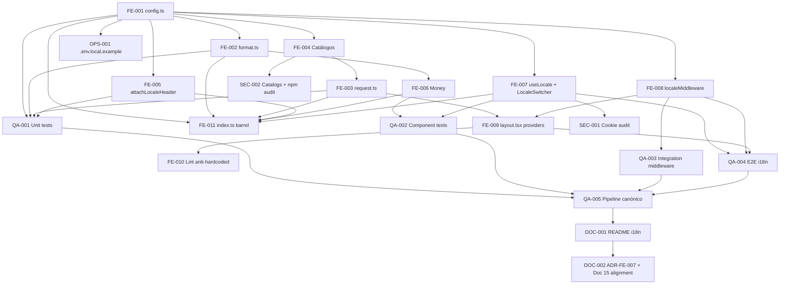

# Development Tasks — PB-P0-012 / US-104: Configurar `next-intl` con 4 locales, detección por cookie + `Accept-Language`, locale switcher y catálogos base por área

## 1. Metadata

| Field                                  | Value                                                                                                                |
| -------------------------------------- | -------------------------------------------------------------------------------------------------------------------- |
| User Story ID                          | US-104                                                                                                               |
| Source User Story                      | `management/user-stories/US-104-i18n-config-4-locales.md`                                                            |
| Source Technical Specification         | `management/technical-specs/P0/PB-P0-012/US-104-technical-spec.md`                                                    |
| Decision Resolution Artifact           | No existe — decisiones formalizadas en `PO/BA Decisions Applied` de la historia                                       |
| Priority                               | P0                                                                                                                   |
| Backlog ID                             | PB-P0-012                                                                                                            |
| Backlog Title                          | Frontend Next.js Bootstrap & i18n                                                                                    |
| Backlog Execution Order                | 12 (de 18 items P0 priorizados)                                                                                      |
| User Story Position in Backlog Item    | 2 de 3                                                                                                               |
| Related User Stories in Backlog Item   | US-103 (bootstrap), US-104 (i18n functional), US-105 (route groups por rol)                                          |
| Epic                                   | EPIC-FE-001 — Frontend Next.js Application Foundation                                                                |
| Backlog Item Dependencies              | — (foundation; PB-P0-012 no depende de otros items P0)                                                                |
| Feature                                | i18n setup — `next-intl` 4 locales + cookie detection + locale switcher + catálogos transversales                    |
| Module / Domain                        | Platform / FE / I18N                                                                                                  |
| Backlog Alignment Status               | Found                                                                                                                |
| Task Breakdown Status                  | Ready for Sprint Planning                                                                                            |
| Created Date                           | 2026-06-19                                                                                                           |
| Last Updated                           | 2026-06-19                                                                                                           |

---

## 2. Source Validation

| Source                       | Found | Used | Notes                                                                                                            |
| ---------------------------- | ----- | ---- | ---------------------------------------------------------------------------------------------------------------- |
| User Story                   | Yes   | Yes  | `Approved with Minor Notes`; 12 AC atómicos                                                                       |
| Technical Specification      | Yes   | Yes  | Fuente primaria — `Ready for Task Breakdown`                                                                     |
| Decision Resolution Artifact | No    | N/A  | No existe; decisiones en `PO/BA Decisions Applied`                                                                |
| Product Backlog Prioritized  | Yes   | Yes  | PB-P0-012, posición 12 de 18 P0, sin dependencias                                                                  |
| ADRs                         | Yes   | Yes  | ADR-FE-001 (Next.js App Router), ADR-FE-003 (FE UX-only), ADR-FE-007 (next-intl + cookie/header sin prefijo URL — pendiente redactar) |

---

## 3. Backlog Execution Context

### Parent Backlog Item

**PB-P0-012 — Frontend Next.js Bootstrap & i18n**. Item P0 foundation que entrega la app Next.js con App Router + TypeScript + Tailwind + next-intl con 4 locales (`es-LATAM`, `es-ES`, `pt`, `en`) y route groups por rol. Sin dependencias técnicas con otros items P0. Trazabilidad: Doc 15, NFR-A11Y-*, NFR-I18N-*, ADR-FE-001/003/007.

### Execution Order Rationale

PB-P0-012 está en la **posición 12 de 18** entre los items P0 (puede ejecutarse en paralelo con backend/SEC/QA/DevOps). US-104 es la **segunda historia** del backlog item y depende exclusivamente de US-103 (bootstrap), que ya está aprobada y especificada. Una vez US-103 mergeada (proyecto Next.js + stack instalado + carpetas `shared/i18n/` y `messages/` vacías + `next-intl@^3` como dep), US-104 puede iniciarse. US-105 (route groups) extenderá el `src/middleware.ts` creado en US-104 con `roleGuardMiddleware`, por lo que la secuencia recomendada es US-103 → US-104 → US-105.

### Related User Stories in Same Backlog Item

| User Story | Role in Backlog Item                                                                                          | Suggested Order |
| ---------- | ------------------------------------------------------------------------------------------------------------- | --------------- |
| US-103     | Bootstrap del proyecto + stack instalado + estructura Doc 15 §15 + `next-intl` como dep + smoke layout         | 1               |
| US-104     | `next-intl` 4 locales + `localeMiddleware` + switcher + catálogos transversales + `<Money>` mínimo + `attachLocaleHeader` | 2               |
| US-105     | 4 route groups + `roleGuardMiddleware` componible con `localeMiddleware` + SEO baseline                       | 3               |

---

## 4. Task Breakdown Summary

| Area                       | Number of Tasks | Notes                                                                                       |
| -------------------------- | --------------: | ------------------------------------------------------------------------------------------- |
| Frontend (FE)              | 11              | Core lib + catálogos + componentes + middleware + layout + lint + env                       |
| QA / Testing               | 5               | Unit + integration + component + E2E + pipeline check                                       |
| Security / Authorization   | 2               | Cookie técnica + secrets/XSS audit + `npm audit`                                            |
| DevOps / Environment       | 1               | Normalización `.env.local.example`                                                          |
| Documentation              | 2               | `web/README.md` § i18n + housekeeping ADR-FE-007 / Doc 15 alignment                         |
| **Total**                  | **21**          |                                                                                             |

---

## 5. Traceability Matrix

| Acceptance Criterion                                                                          | Technical Spec Section                                                | Task IDs                                                                                                |
| --------------------------------------------------------------------------------------------- | --------------------------------------------------------------------- | ------------------------------------------------------------------------------------------------------- |
| AC-01 `next-intl` configurado funcionalmente con 4 locales                                    | §6 (AC-01), §8 i18n, §18 paso 1-9                                     | TASK-PB-P0-012-US-104-FE-001, TASK-PB-P0-012-US-104-FE-002, TASK-PB-P0-012-US-104-FE-003, TASK-PB-P0-012-US-104-FE-006 |
| AC-02 Middleware de locale operativo                                                          | §6 (AC-02), §8 Middleware, §13 Integration                            | TASK-PB-P0-012-US-104-FE-008                                                                            |
| AC-03 `<IntlProvider>` en root layout                                                         | §6 (AC-03), §8 Routes/Pages                                           | TASK-PB-P0-012-US-104-FE-009                                                                            |
| AC-04 Catálogos base por área transversal                                                     | §6 (AC-04), §8 i18n Catalogs                                          | TASK-PB-P0-012-US-104-FE-004                                                                            |
| AC-05 Locale switcher accesible y funcional                                                   | §6 (AC-05), §8 Components, §8 Accessibility                          | TASK-PB-P0-012-US-104-FE-007                                                                            |
| AC-06 Detección por `Accept-Language` cuando la cookie falta                                  | §6 (AC-06), §8 i18n Middleware                                       | TASK-PB-P0-012-US-104-FE-008                                                                            |
| AC-07 Fallback a `es-LATAM` cuando no hay match                                               | §6 (AC-07), §8 i18n Middleware                                       | TASK-PB-P0-012-US-104-FE-008                                                                            |
| AC-08 Propagación de `Accept-Language` al backend                                             | §6 (AC-08), §8 Data Fetching, §9 API Contract                        | TASK-PB-P0-012-US-104-FE-005                                                                            |
| AC-09 Helpers y `<Money>`                                                                     | §6 (AC-09), §8 i18n, §8 Components                                   | TASK-PB-P0-012-US-104-FE-002, TASK-PB-P0-012-US-104-FE-006                                              |
| AC-10 Lint anti-hardcoded strings                                                             | §6 (AC-10), §17 Risks                                                | TASK-PB-P0-012-US-104-FE-010                                                                            |
| AC-11 Tests E2E de i18n                                                                       | §6 (AC-11), §13 E2E Tests                                            | TASK-PB-P0-012-US-104-QA-004                                                                            |
| AC-12 Pipeline canónico verde y sin artefactos fuera de scope                                 | §6 (AC-12), §13 CI Checks, §4 Scope Boundary                          | TASK-PB-P0-012-US-104-QA-005, TASK-PB-P0-012-US-104-SEC-002                                              |

Cada AC mapea a ≥ 1 tarea. Todas las tareas mapean a ≥ 1 sección del Technical Spec.

---

## 6. Development Tasks

### TASK-PB-P0-012-US-104-FE-001 — Crear `shared/i18n/config.ts` con `locales`, `defaultLocale`, `cookieName`, `localeLabels`

| Field                     | Value                                                                                              |
| ------------------------- | -------------------------------------------------------------------------------------------------- |
| Area                      | Frontend                                                                                            |
| Type                      | Implementation                                                                                      |
| Priority                  | Must                                                                                                |
| Estimate                  | XS                                                                                                  |
| Depends On                | — (US-103 mergeada)                                                                                 |
| Source AC(s)              | AC-01                                                                                               |
| Technical Spec Section(s) | §6 (AC-01), §8 i18n, §18 paso 1                                                                     |
| Backlog ID                | PB-P0-012                                                                                            |
| User Story ID             | US-104                                                                                              |
| Owner Role                | Frontend                                                                                            |
| Status                    | To Do                                                                                               |

#### Objective

Declarar las constantes inmutables de configuración i18n consumidas por todo el módulo.

#### Scope

##### Include

* `web/src/shared/i18n/config.ts` con:
  * `export const locales = ['es-LATAM', 'es-ES', 'pt', 'en'] as const`.
  * `export type Locale = (typeof locales)[number]`.
  * `export const defaultLocale: Locale = 'es-LATAM'`.
  * `export const cookieName = 'eventflow_locale'`.
  * `export const localeLabels: Record<Locale, string> = { 'es-LATAM': 'Español (LATAM)', 'es-ES': 'Español (España)', pt: 'Português', en: 'English' } as const`.

##### Exclude

* No invocar `Intl.*` aquí (es responsabilidad de `format.ts`).
* No declarar tipos de `messages` (los carga `request.ts`).

#### Implementation Notes

* Todo debe tipar como `as const` para preservar literal types.

#### Acceptance Criteria Covered

AC-01.

#### Definition of Done

- [ ] Archivo versionado.
- [ ] `npm run typecheck` pasa.
- [ ] Importación `import { locales, defaultLocale, cookieName, localeLabels, type Locale } from '@/shared/i18n/config'` funciona desde cualquier módulo.

---

### TASK-PB-P0-012-US-104-FE-002 — Crear `shared/i18n/format.ts` con helpers `Intl.*` y mapeo `es-LATAM → es-419`

| Field                     | Value                                                                                              |
| ------------------------- | -------------------------------------------------------------------------------------------------- |
| Area                      | Frontend                                                                                            |
| Type                      | Implementation                                                                                      |
| Priority                  | Must                                                                                                |
| Estimate                  | S                                                                                                   |
| Depends On                | TASK-PB-P0-012-US-104-FE-001                                                                         |
| Source AC(s)              | AC-01, AC-09                                                                                        |
| Technical Spec Section(s) | §6 (AC-09), §8 i18n, §16 Documentation Alignment (mapeo `es-419`), §18 paso 2                       |
| Backlog ID                | PB-P0-012                                                                                            |
| User Story ID             | US-104                                                                                              |
| Owner Role                | Frontend                                                                                            |
| Status                    | To Do                                                                                               |

#### Objective

Centralizar el formateo i18n delegando en `Intl.*` y mapear `es-LATAM → es-419` para producir formatos correctos.

#### Scope

##### Include

* `web/src/shared/i18n/format.ts` con:
  * `mapToBcp47(locale: Locale): string` — mapeo `'es-LATAM' → 'es-419'`, resto identidad.
  * `formatDate(date: Date | string, locale: Locale, opts?: Intl.DateTimeFormatOptions): string`.
  * `formatNumber(value: number, locale: Locale, opts?: Intl.NumberFormatOptions): string`.
  * `formatCurrency(amount: number, currency: string, locale: Locale, opts?: Intl.NumberFormatOptions): string`.
* `try/catch` en `formatCurrency` que cae a `${amount} ${currency}` si `currency` es inválida (EC-05).

##### Exclude

* No tocar `Money.tsx` aquí.
* No persistir locale (es responsabilidad del switcher / cookie).

#### Implementation Notes

* Documentar el mapeo `es-LATAM → es-419` en JSDoc de `mapToBcp47` y en `web/README.md` § i18n.

#### Acceptance Criteria Covered

AC-01, AC-09.

#### Definition of Done

- [ ] Archivo versionado.
- [ ] Tests unit cubren mapeo y `try/catch` (cubiertos por TASK-QA-001).
- [ ] `npm run typecheck` pasa.

---

### TASK-PB-P0-012-US-104-FE-003 — Crear `shared/i18n/request.ts` con `getRequestConfig` + merge de áreas + `getMessageFallback`

| Field                     | Value                                                                                              |
| ------------------------- | -------------------------------------------------------------------------------------------------- |
| Area                      | Frontend                                                                                            |
| Type                      | Implementation                                                                                      |
| Priority                  | Must                                                                                                |
| Estimate                  | M                                                                                                   |
| Depends On                | TASK-PB-P0-012-US-104-FE-001, TASK-PB-P0-012-US-104-FE-004                                            |
| Source AC(s)              | AC-01                                                                                               |
| Technical Spec Section(s) | §6 (AC-01), §8 i18n, §18 paso 3                                                                     |
| Backlog ID                | PB-P0-012                                                                                            |
| User Story ID             | US-104                                                                                              |
| Owner Role                | Frontend                                                                                            |
| Status                    | To Do                                                                                               |

#### Objective

Implementar el `getRequestConfig` de `next-intl/server` con carga dinámica de catálogos por área, merge en un objeto único y `getMessageFallback` con comportamiento dev/prod.

#### Scope

##### Include

* `web/src/shared/i18n/request.ts` con:
  * `getRequestConfig(({ locale })) => Promise<{ messages, getMessageFallback, timeZone? }>`.
  * Carga dinámica `import('../../messages/<locale>/common.json')` × 4 áreas (`common`, `navigation`, `errors`, `validation`).
  * Merge en `{ common: {...}, navigation: {...}, errors: {...}, validation: {...} }`.
  * `getMessageFallback({ key, namespace, error }): string`:
    * Dev (`process.env.NODE_ENV !== 'production'`): retorna `[<locale>] <namespace>.<key>` para alertar visualmente.
    * Prod: carga el mismo `key` del catálogo `es-LATAM` y lo retorna sin warn.

##### Exclude

* No registrar `<NextIntlClientProvider>` aquí (es responsabilidad del layout).
* No fallar si un área no existe — log warn en dev solamente.

#### Implementation Notes

* Validar que `locale ∈ locales` antes de cargar — si no, fallback a `defaultLocale`.
* Mantener un dynamic import por área para que tree-shaking funcione.

#### Acceptance Criteria Covered

AC-01.

#### Definition of Done

- [ ] Archivo versionado.
- [ ] Tests unit cubren merge + fallback dev/prod (TASK-QA-001).
- [ ] `npm run build` pasa.

---

### TASK-PB-P0-012-US-104-FE-004 — Crear catálogos `messages/<locale>/{common,navigation,errors,validation}.json`

| Field                     | Value                                                                                                       |
| ------------------------- | ----------------------------------------------------------------------------------------------------------- |
| Area                      | Frontend                                                                                                     |
| Type                      | Implementation                                                                                               |
| Priority                  | Must                                                                                                         |
| Estimate                  | M                                                                                                            |
| Depends On                | TASK-PB-P0-012-US-104-FE-001                                                                                  |
| Source AC(s)              | AC-04                                                                                                        |
| Technical Spec Section(s) | §6 (AC-04), §8 i18n Catalogs, §18 paso 4                                                                     |
| Backlog ID                | PB-P0-012                                                                                                    |
| User Story ID             | US-104                                                                                                       |
| Owner Role                | Frontend                                                                                                     |
| Status                    | To Do                                                                                                        |

#### Objective

Crear los 16 archivos JSON de catálogos (4 locales × 4 áreas) con `es-LATAM` 100% completo y placeholders detectables en `es-ES`/`pt`/`en`.

#### Scope

##### Include

* `web/src/messages/es-LATAM/{common,navigation,errors,validation}.json` con claves enumeradas en AC-04 del User Story (común: `loading`, `error`, `retry`, `cancel`, `confirm`, `save`, etc.; navigation: `localeSwitcher.label`, `localeSwitcher.option`; errors: `envelope.UNEXPECTED`, `envelope.NETWORK`, `forbidden.*`, `notFound.*`; validation: `required`, `email`, `min`, `max`, etc.).
* `web/src/messages/{es-ES,pt,en}/<area>.json`: mismas claves que `es-LATAM`, valores `"[<locale>] <traducción placeholder>"` para detección.
* JSON válido, ICU MessageFormat-compatible donde aplique.

##### Exclude

* No traducir features por dominio (auth/event/vendor) — cada historia aporta su catálogo.
* No introducir claves no listadas en AC-04 del User Story.

#### Implementation Notes

* ICU MessageFormat: cualquier mensaje con interpolación usa `{name}` o plurales `{count, plural, one {#} other {#}}`. Documentar ejemplo en `web/README.md`.
* Mantener orden alfabético por área para revisión de diffs.

#### Acceptance Criteria Covered

AC-04.

#### Definition of Done

- [ ] 16 archivos JSON válidos versionados.
- [ ] `es-LATAM` no contiene strings con prefijo `[<locale>]`.
- [ ] Los otros 3 locales tienen todas las claves de `es-LATAM`.

---

### TASK-PB-P0-012-US-104-FE-005 — Crear `shared/i18n/attachLocaleHeader.ts` (cliente + server)

| Field                     | Value                                                                                              |
| ------------------------- | -------------------------------------------------------------------------------------------------- |
| Area                      | Frontend                                                                                            |
| Type                      | Implementation                                                                                      |
| Priority                  | Must                                                                                                |
| Estimate                  | S                                                                                                   |
| Depends On                | TASK-PB-P0-012-US-104-FE-001                                                                         |
| Source AC(s)              | AC-08                                                                                               |
| Technical Spec Section(s) | §6 (AC-08), §9 API Contract Design, §18 paso 6                                                       |
| Backlog ID                | PB-P0-012                                                                                            |
| User Story ID             | US-104                                                                                              |
| Owner Role                | Frontend                                                                                            |
| Status                    | To Do                                                                                               |

#### Objective

Entregar la utilidad outbound `attachLocaleHeader` lista para que el `httpClient` (US-106) la consuma como interceptor.

#### Scope

##### Include

* `web/src/shared/i18n/attachLocaleHeader.ts` con dos overloads:
  * Cliente: lee cookie `eventflow_locale` con whitelist y retorna `{ 'Accept-Language': <locale BCP-47 mapeado> }`.
  * Server: acepta `locale` directo o lee del request via `getLocale()` (`next-intl/server`) y retorna el header.
* Fallback: si no hay locale resuelto, retorna `{ 'Accept-Language': defaultLocale }`.

##### Exclude

* No invocar `httpClient` aquí (no existe aún; lo cablea US-106).
* No leer la cookie de sesión auth (`eventflow_session`).

#### Implementation Notes

* Usar `mapToBcp47` de `format.ts` para serializar `es-LATAM → es-419` en el header.
* Documentar handoff con US-106 en `web/README.md` § "HTTP client" (placeholder).

#### Acceptance Criteria Covered

AC-08.

#### Definition of Done

- [ ] Archivo versionado.
- [ ] Tests unit cubren cliente y server contexts (TASK-QA-001).
- [ ] Exportada en `shared/i18n/index.ts`.

---

### TASK-PB-P0-012-US-104-FE-006 — Crear `shared/i18n/Money.tsx` (Client Component mínimo Doc 15 §32.2)

| Field                     | Value                                                                                              |
| ------------------------- | -------------------------------------------------------------------------------------------------- |
| Area                      | Frontend                                                                                            |
| Type                      | Implementation                                                                                      |
| Priority                  | Must                                                                                                |
| Estimate                  | XS                                                                                                  |
| Depends On                | TASK-PB-P0-012-US-104-FE-002                                                                         |
| Source AC(s)              | AC-09                                                                                               |
| Technical Spec Section(s) | §6 (AC-09), §8 Components, §18 paso 7                                                                |
| Backlog ID                | PB-P0-012                                                                                            |
| User Story ID             | US-104                                                                                              |
| Owner Role                | Frontend                                                                                            |
| Status                    | To Do                                                                                               |

#### Objective

Renderizar `{ amount, currency }` aplicando `Intl.NumberFormat` con el locale activo, sin conversión automática (Doc 15 §32.1).

#### Scope

##### Include

* `web/src/shared/i18n/Money.tsx` con `'use client'`, recibe `{ amount: number; currency: string; locale?: Locale }`.
* Usa `useLocale()` si `locale` no se provee.
* Delega en `formatCurrency` de `format.ts`.
* `try/catch` que cae a `${amount} ${currency}` si la currency es inválida (EC-05).

##### Exclude

* No introducir UX de selector de currency (Doc 15 §32 — historia evento).
* No mostrar tooltip ni leyenda "moneda original".

#### Implementation Notes

* `` simple sin estilos; las features que lo consuman aportan estilos contextuales.

#### Acceptance Criteria Covered

AC-09.

#### Definition of Done

- [ ] Archivo versionado.
- [ ] Tests component cubren combinaciones de locale × currency + fallback (TASK-QA-002).
- [ ] Exportada en `shared/i18n/index.ts`.

---

### TASK-PB-P0-012-US-104-FE-007 — Crear `shared/i18n/LocaleSwitcher.tsx` (Client Component accesible WCAG 2.1 AA) + `useLocale` hook

| Field                     | Value                                                                                              |
| ------------------------- | -------------------------------------------------------------------------------------------------- |
| Area                      | Frontend                                                                                            |
| Type                      | Implementation                                                                                      |
| Priority                  | Must                                                                                                |
| Estimate                  | M                                                                                                   |
| Depends On                | TASK-PB-P0-012-US-104-FE-001, TASK-PB-P0-012-US-104-FE-004                                            |
| Source AC(s)              | AC-05                                                                                               |
| Technical Spec Section(s) | §6 (AC-05), §8 Components, §8 Accessibility, §18 paso 5+8                                            |
| Backlog ID                | PB-P0-012                                                                                            |
| User Story ID             | US-104                                                                                              |
| Owner Role                | Frontend                                                                                            |
| Status                    | To Do                                                                                               |

#### Objective

Entregar el `<LocaleSwitcher>` y el hook `useLocale()` que permitan cambiar locale persistiendo cookie y disparando `router.refresh()`.

#### Scope

##### Include

* `web/src/shared/i18n/useLocale.ts` (hook cliente):
  * Retorna `{ locale, supportedLocales, setLocale(next) }`.
  * `setLocale` escribe cookie `eventflow_locale` con flags (`SameSite=Lax`, `Secure` en prod, `Max-Age=31536000`, `path=/`, sin HTTP-only) y llama `router.refresh()`.
* `web/src/shared/i18n/LocaleSwitcher.tsx`:
  * `'use client'`.
  * Renderiza `<select>` semántico o `Headless UI Listbox` accesible.
  * Etiqueta `aria-label` desde `t('navigation.localeSwitcher.label')`.
  * Navegación por teclado (Tab, flechas, Enter, Esc).
  * Focus visible.
  * `aria-current="true"` en opción seleccionada.

##### Exclude

* No persistir preferencia en backend (User Profile story).
* No introducir animaciones/dropdown elaborado — Headless UI base es suficiente.

#### Implementation Notes

* Reusar `localeLabels` de `config.ts` para etiquetas visibles.
* `router.refresh()` re-renderiza la página con el nuevo locale (server-side load).

#### Acceptance Criteria Covered

AC-05.

#### Definition of Done

- [ ] Archivos versionados.
- [ ] Tests component cubren navegación por teclado, `aria-label`, `aria-current`, cookie set + refresh (TASK-QA-002).
- [ ] Exportados en `shared/i18n/index.ts`.

---

### TASK-PB-P0-012-US-104-FE-008 — Crear `src/middleware.ts` con `localeMiddleware` componible

| Field                     | Value                                                                                              |
| ------------------------- | -------------------------------------------------------------------------------------------------- |
| Area                      | Frontend                                                                                            |
| Type                      | Implementation                                                                                      |
| Priority                  | Must                                                                                                |
| Estimate                  | M                                                                                                   |
| Depends On                | TASK-PB-P0-012-US-104-FE-001                                                                         |
| Source AC(s)              | AC-02, AC-06, AC-07                                                                                 |
| Technical Spec Section(s) | §6 (AC-02/06/07), §8 i18n Middleware, §18 paso 10                                                    |
| Backlog ID                | PB-P0-012                                                                                            |
| User Story ID             | US-104                                                                                              |
| Owner Role                | Frontend                                                                                            |
| Status                    | To Do                                                                                               |

#### Objective

Crear el middleware Edge de detección de locale con composición preparada para extenderse en US-105.

#### Scope

##### Include

* `web/src/middleware.ts` con:
  * `export const localeMiddleware(req: NextRequest): NextResponse | null` (función pura, exportada para tests unit y para composición en US-105).
  * Reglas: cookie `eventflow_locale` (whitelist contra `locales`) → `Accept-Language` (best match BCP-47 vía `@formatjs/intl-localematcher` o `Negotiator`) → `defaultLocale`.
  * Propaga `x-locale` header al request para que `getRequestConfig` lo lea.
  * No setea cookie automáticamente (solo el switcher escribe).
  * `try/catch` para `Accept-Language` malformado → fallback `defaultLocale`.
* `export default` que ejecuta solamente `localeMiddleware` en US-104 (US-105 compondrá con `roleGuardMiddleware`).
* `export const config = { matcher: ['/((?!_next|static|api|favicon.ico|robots.txt|sitemap.xml).*)'] }`.

##### Exclude

* No introducir `roleGuardMiddleware` ni redirects por rol (US-105).
* No agregar redirect por prefijo URL (Doc 15 §17 / §31.2).
* No decodificar JWT.

#### Implementation Notes

* Instalar `@formatjs/intl-localematcher` si no está ya como dep (es ligero y testeado).
* Loguear solo `i18n.locale.resolved { locale, source: cookie|header|default }` en dev; sin `Accept-Language` completo.

#### Acceptance Criteria Covered

AC-02, AC-06, AC-07.

#### Definition of Done

- [ ] Archivo versionado.
- [ ] Tests integration cubren las 4 reglas (cookie válida / cookie inválida + header / sin cookie ni header / header malformado) — TASK-QA-003.
- [ ] `localeMiddleware` exportada para composición en US-105.

---

### TASK-PB-P0-012-US-104-FE-009 — Modificar `src/app/layout.tsx`: `<NextIntlClientProvider>` + `<html lang>` dinámico + `hreflang` placeholder

| Field                     | Value                                                                                              |
| ------------------------- | -------------------------------------------------------------------------------------------------- |
| Area                      | Frontend                                                                                            |
| Type                      | Implementation                                                                                      |
| Priority                  | Must                                                                                                |
| Estimate                  | S                                                                                                   |
| Depends On                | TASK-PB-P0-012-US-104-FE-003, TASK-PB-P0-012-US-104-FE-008                                            |
| Source AC(s)              | AC-03                                                                                               |
| Technical Spec Section(s) | §6 (AC-03), §8 Routes/Pages, §18 paso 11                                                             |
| Backlog ID                | PB-P0-012                                                                                            |
| User Story ID             | US-104                                                                                              |
| Owner Role                | Frontend                                                                                            |
| Status                    | To Do                                                                                               |

#### Objective

Hidratar el root layout con el provider de `next-intl` y `<html lang>` dinámico.

#### Scope

##### Include

* Modificar `web/src/app/layout.tsx` (creado en US-103):
  * Server Component que lee el locale con `getLocale()` y los mensajes con `getMessages()` de `next-intl/server`.
  * Renderiza `<html lang={locale}>` (dinámico — reemplaza el `<html lang="es-LATAM">` estático de US-103).
  * Monta `<NextIntlClientProvider locale={locale} messages={messages}>{children}</NextIntlClientProvider>`.
  * Agrega `<link rel="alternate" hrefLang="x-default" href="/" />` (placeholder hasta SEO localizado por URL — Future).

##### Exclude

* No envolver con `<SessionProvider>` (US-105).
* No envolver con `<QueryClientProvider>` (US-106).
* No montar `<LocaleSwitcher>` directamente en el root layout — los layouts por área (US-105/US-107) decidirán dónde mostrarlo.

#### Implementation Notes

* El `<h1>EventFlow</h1>` literal de US-103 debe reemplazarse por `t('common.appName')` o agregarse a la allow-list del lint (decidir en PR).

#### Acceptance Criteria Covered

AC-03.

#### Definition of Done

- [ ] `<html lang>` dinámico funciona (verificable en DOM por locale).
- [ ] `npm run build` pasa.
- [ ] No hay errores de hidratación en `npm run dev`.

---

### TASK-PB-P0-012-US-104-FE-010 — Activar lint anti-hardcoded strings con allowList mínima

| Field                     | Value                                                                                                       |
| ------------------------- | ----------------------------------------------------------------------------------------------------------- |
| Area                      | Frontend                                                                                                     |
| Type                      | Setup                                                                                                        |
| Priority                  | Must                                                                                                         |
| Estimate                  | S                                                                                                            |
| Depends On                | TASK-PB-P0-012-US-104-FE-009                                                                                  |
| Source AC(s)              | AC-10                                                                                                        |
| Technical Spec Section(s) | §6 (AC-10), §17 Risks, §18 paso 13                                                                           |
| Backlog ID                | PB-P0-012                                                                                                    |
| User Story ID             | US-104                                                                                                       |
| Owner Role                | Frontend                                                                                                     |
| Status                    | To Do                                                                                                        |

#### Objective

Habilitar regla ESLint que prohíba strings literales en JSX para forzar el uso de `t('clave')`.

#### Scope

##### Include

* Configurar `react/jsx-no-literals` (o `eslint-plugin-formatjs/no-literal-string`) en `eslint.config.mjs`/`.eslintrc.cjs`.
* AllowList mínima: símbolos (`·`, `/`, `&`, `—`, `:`), números puros (`noStrings: false` para Children numéricos), marcas registradas si aplica.
* `npm run lint --max-warnings=0` debe pasar con el código existente (limpiar `<h1>EventFlow</h1>` si no se agrega a la allow-list).

##### Exclude

* No introducir la regla `eslint-plugin-i18n-text` extendida — la base es suficiente en MVP.

#### Implementation Notes

* Decisión final del set en el PR (§17 risk 4). Documentar la regla escogida en `web/README.md` § "i18n".

#### Acceptance Criteria Covered

AC-10.

#### Definition of Done

- [ ] Regla activa.
- [ ] `npm run lint --max-warnings=0` exit 0.
- [ ] README documenta la regla y la allow-list.

---

### TASK-PB-P0-012-US-104-FE-011 — Crear `shared/i18n/index.ts` (barrel export)

| Field                     | Value                                                                                              |
| ------------------------- | -------------------------------------------------------------------------------------------------- |
| Area                      | Frontend                                                                                            |
| Type                      | Implementation                                                                                      |
| Priority                  | Must                                                                                                |
| Estimate                  | XS                                                                                                  |
| Depends On                | TASK-PB-P0-012-US-104-FE-001, FE-002, FE-003, FE-005, FE-006, FE-007                                  |
| Source AC(s)              | AC-01, AC-05, AC-08, AC-09                                                                          |
| Technical Spec Section(s) | §18 paso 9                                                                                          |
| Backlog ID                | PB-P0-012                                                                                            |
| User Story ID             | US-104                                                                                              |
| Owner Role                | Frontend                                                                                            |
| Status                    | To Do                                                                                               |

#### Objective

Exponer un punto de entrada único para el módulo i18n.

#### Scope

##### Include

* `web/src/shared/i18n/index.ts` con re-exports de:
  * `config` (locales, defaultLocale, cookieName, localeLabels, Locale).
  * `format` (formatDate, formatNumber, formatCurrency, mapToBcp47).
  * `useLocale`.
  * `attachLocaleHeader`.
  * `Money`.
  * `LocaleSwitcher`.

##### Exclude

* No re-exportar `request.ts` (es server-only y se consume desde `next-intl/server`).

#### Acceptance Criteria Covered

AC-01, AC-05, AC-08, AC-09.

#### Definition of Done

- [ ] Importación `import { Money, LocaleSwitcher, useLocale, attachLocaleHeader } from '@/shared/i18n'` funciona.

---

### TASK-PB-P0-012-US-104-QA-001 — Tests unit de `config`, `format`, `request`, `attachLocaleHeader`

| Field                     | Value                                                                                                  |
| ------------------------- | ------------------------------------------------------------------------------------------------------ |
| Area                      | QA / Testing                                                                                            |
| Type                      | Test                                                                                                    |
| Priority                  | Must                                                                                                    |
| Estimate                  | M                                                                                                       |
| Depends On                | TASK-PB-P0-012-US-104-FE-001, FE-002, FE-003, FE-005                                                      |
| Source AC(s)              | AC-01, AC-09, AC-08                                                                                     |
| Technical Spec Section(s) | §13 Unit Tests                                                                                          |
| Backlog ID                | PB-P0-012                                                                                                |
| User Story ID             | US-104                                                                                                  |
| Owner Role                | QA / Frontend                                                                                            |
| Status                    | To Do                                                                                                    |

#### Objective

Cubrir con Vitest los módulos puros de `shared/i18n/`.

#### Scope

##### Include

* `tests/unit/i18n/config.test.ts`: `locales`, `defaultLocale`, `cookieName` exportados como `as const`.
* `tests/unit/i18n/request.test.ts`: `getRequestConfig` resuelve `messages` con merge de áreas; `getMessageFallback` devuelve clave anotada en dev (`[<locale>] <key>`) y traducción `es-LATAM` en prod.
* `tests/unit/i18n/format.test.ts`: `formatDate`/`formatNumber`/`formatCurrency` invocan `Intl.*` con el mapeo `es-LATAM → es-419`; `try/catch` en currency inválida.
* `tests/unit/i18n/attachLocaleHeader.test.ts`: cliente (cookie set + whitelist) y server contexts devuelven `{ 'Accept-Language': '<locale BCP-47>' }`; fallback a `defaultLocale`.

##### Exclude

* No cubrir middleware aquí (TASK-QA-003).
* No cubrir componentes aquí (TASK-QA-002).

#### Implementation Notes

* Mockear `process.env.NODE_ENV` para cubrir el fallback dev/prod.
* `vi.spyOn` sobre `Intl.NumberFormat` para validar argumentos.

#### Acceptance Criteria Covered

AC-01, AC-08, AC-09.

#### Definition of Done

- [ ] `npm run test` pasa todos los specs.
- [ ] Cobertura mínima de `shared/i18n/` ≥ 80% líneas.

---

### TASK-PB-P0-012-US-104-QA-002 — Tests component de `<Money>` y `<LocaleSwitcher>`

| Field                     | Value                                                                                                  |
| ------------------------- | ------------------------------------------------------------------------------------------------------ |
| Area                      | QA / Testing                                                                                            |
| Type                      | Test                                                                                                    |
| Priority                  | Must                                                                                                    |
| Estimate                  | M                                                                                                       |
| Depends On                | TASK-PB-P0-012-US-104-FE-006, TASK-PB-P0-012-US-104-FE-007                                                |
| Source AC(s)              | AC-05, AC-09                                                                                            |
| Technical Spec Section(s) | §13 Component Tests, §8 Accessibility                                                                   |
| Backlog ID                | PB-P0-012                                                                                                |
| User Story ID             | US-104                                                                                                  |
| Owner Role                | QA / Frontend                                                                                            |
| Status                    | To Do                                                                                                    |

#### Objective

Cubrir componentes Client con Testing Library + jsdom.

#### Scope

##### Include

* `tests/unit/i18n/LocaleSwitcher.test.tsx`:
  * Renderiza con `aria-label` resuelto vía `t()`.
  * Navegación por teclado (Tab, flechas, Enter).
  * Opción activa tiene `aria-current="true"`.
  * Click setea cookie con flags correctos y llama `router.refresh` (mock).
* `tests/unit/i18n/Money.test.tsx`:
  * Renderiza `{amount, currency}` × locale activo (combinaciones).
  * Verifica que `formatCurrency` se invoca con el mapeo correcto.
  * `try/catch` con currency inválida → fallback `${amount} ${currency}`.

##### Exclude

* No cubrir el middleware (TASK-QA-003).

#### Implementation Notes

* Wrappear con `<NextIntlClientProvider>` de testing con `messages` mínimos.
* Mockear `useRouter` de `next/navigation`.

#### Acceptance Criteria Covered

AC-05, AC-09.

#### Definition of Done

- [ ] Tests pasan.
- [ ] Cobertura ≥ 80% en `LocaleSwitcher.tsx` y `Money.tsx`.

---

### TASK-PB-P0-012-US-104-QA-003 — Tests integration del `localeMiddleware`

| Field                     | Value                                                                                                  |
| ------------------------- | ------------------------------------------------------------------------------------------------------ |
| Area                      | QA / Testing                                                                                            |
| Type                      | Test                                                                                                    |
| Priority                  | Must                                                                                                    |
| Estimate                  | S                                                                                                       |
| Depends On                | TASK-PB-P0-012-US-104-FE-008                                                                             |
| Source AC(s)              | AC-02, AC-06, AC-07                                                                                     |
| Technical Spec Section(s) | §13 Integration Tests                                                                                   |
| Backlog ID                | PB-P0-012                                                                                                |
| User Story ID             | US-104                                                                                                  |
| Owner Role                | QA                                                                                                       |
| Status                    | To Do                                                                                                    |

#### Objective

Cubrir las reglas de detección del middleware contra mocks de `NextRequest`.

#### Scope

##### Include

* `tests/integration/middleware/locale.test.ts`:
  * Cookie válida (`eventflow_locale=pt`) → usa `pt`.
  * Cookie inválida (`eventflow_locale=xx`) + `Accept-Language: pt-PT,pt;q=0.9` → `pt`.
  * Sin cookie + sin `Accept-Language` → `es-LATAM`.
  * `Accept-Language: ""` malformado → `es-LATAM` sin throw.
  * `Accept-Language: fr,de;q=0.9` → `es-LATAM` (sin match en whitelist).
  * Verifica que `x-locale` header se propaga.

##### Exclude

* No probar redirects por rol (US-105).

#### Implementation Notes

* Construir `NextRequest` con `new NextRequest(new URL('http://localhost:3000/'), { headers, cookies })`.

#### Acceptance Criteria Covered

AC-02, AC-06, AC-07.

#### Definition of Done

- [ ] Tests pasan.
- [ ] Cobertura del `localeMiddleware` ≥ 90% de ramas.

---

### TASK-PB-P0-012-US-104-QA-004 — Tests E2E Playwright de i18n (switcher, detección, fallback)

| Field                     | Value                                                                                                    |
| ------------------------- | -------------------------------------------------------------------------------------------------------- |
| Area                      | QA / Testing                                                                                              |
| Type                      | Test                                                                                                      |
| Priority                  | Must                                                                                                      |
| Estimate                  | M                                                                                                         |
| Depends On                | TASK-PB-P0-012-US-104-FE-007, FE-008, FE-009                                                                |
| Source AC(s)              | AC-11                                                                                                     |
| Technical Spec Section(s) | §13 E2E Tests                                                                                              |
| Backlog ID                | PB-P0-012                                                                                                  |
| User Story ID             | US-104                                                                                                    |
| Owner Role                | QA                                                                                                         |
| Status                    | To Do                                                                                                      |

#### Objective

Cubrir end-to-end los flujos de switcher, detección por header y fallback.

#### Scope

##### Include

* `tests/e2e/i18n.switcher.spec.ts`: cambiar idioma vía `<LocaleSwitcher>` persiste cookie `eventflow_locale`, página re-renderiza en nuevo locale, `<html lang>` se actualiza.
* `tests/e2e/i18n.detection.spec.ts`: sin cookie + `Accept-Language: pt-PT,pt;q=0.9,en;q=0.5` → primera visita renderiza en `pt`.
* `tests/e2e/i18n.fallback.spec.ts`: sin cookie + `Accept-Language: fr,de;q=0.9` → renderiza en `es-LATAM`.

##### Exclude

* No probar route groups ni redirects por rol (US-105).

#### Implementation Notes

* Usar `context.setExtraHTTPHeaders({ 'Accept-Language': '...' })` para simular header.
* Usar `context.addCookies(...)` para `eventflow_locale`.

#### Acceptance Criteria Covered

AC-11.

#### Definition of Done

- [ ] `npm run test:e2e` pasa los 3 specs.

---

### TASK-PB-P0-012-US-104-QA-005 — Validar pipeline canónico Doc 21 §9.2 + PR hygiene

| Field                     | Value                                                                                                  |
| ------------------------- | ------------------------------------------------------------------------------------------------------ |
| Area                      | QA / Testing                                                                                            |
| Type                      | Review                                                                                                  |
| Priority                  | Must                                                                                                    |
| Estimate                  | S                                                                                                       |
| Depends On                | TASK-PB-P0-012-US-104-QA-001, QA-002, QA-003, QA-004                                                      |
| Source AC(s)              | AC-12                                                                                                   |
| Technical Spec Section(s) | §13 CI Checks, §4 Scope Boundary, §17 Risks                                                              |
| Backlog ID                | PB-P0-012                                                                                                |
| User Story ID             | US-104                                                                                                  |
| Owner Role                | QA / Tech Lead                                                                                            |
| Status                    | To Do                                                                                                    |

#### Objective

Validar pipeline canónico en local y auditar el PR contra la lista negativa de artefactos.

#### Scope

##### Include

* Ejecutar `npm ci && npm run lint && npm run typecheck && npm run test && npm run build && npm run test:e2e` desde `web/` exit 0.
* Verificar que NO se introducen: route groups, `roleGuardMiddleware`, `<QueryClientProvider>`, MSW handlers, layouts por rol, design system completo, Server Actions, API Routes BFF, `next.config.i18n` legacy, persistencia `users.language_code`, selector idioma evento, SEO localizado por URL, Sentry.

##### Exclude

* No reemplaza el CI remoto; es validación pre-PR.

#### Acceptance Criteria Covered

AC-12.

#### Definition of Done

- [ ] Cada paso exit 0 documentado en el PR.
- [ ] Checklist de artefactos prohibidos vacío.

---

### TASK-PB-P0-012-US-104-SEC-001 — Validar cookie técnica `eventflow_locale` separada de sesión auth

| Field                     | Value                                                                                                      |
| ------------------------- | ---------------------------------------------------------------------------------------------------------- |
| Area                      | Security / Authorization                                                                                    |
| Type                      | Review                                                                                                      |
| Priority                  | Must                                                                                                        |
| Estimate                  | XS                                                                                                          |
| Depends On                | TASK-PB-P0-012-US-104-FE-007                                                                                 |
| Source AC(s)              | AC-05                                                                                                       |
| Technical Spec Section(s) | §12 Sensitive Data Handling, §17 Risks                                                                      |
| Backlog ID                | PB-P0-012                                                                                                    |
| User Story ID             | US-104                                                                                                      |
| Owner Role                | Security / Tech Lead                                                                                         |
| Status                    | To Do                                                                                                        |

#### Objective

Confirmar que la cookie `eventflow_locale` cumple SEC-04 y no colisiona con la cookie de sesión auth de US-108.

#### Scope

##### Include

* Auditar que la cookie escrita por `useLocale.setLocale` tiene: `SameSite=Lax`, `Secure` solo en prod, `Max-Age=31536000`, `path=/`, **sin** `HttpOnly`.
* Confirmar que el naming `eventflow_locale` está documentado en `web/README.md` § "Cookies" y se diferencia explícitamente de la cookie de sesión auth (a definir en US-108).
* Confirmar que la cookie no contiene PII ni firmas.

##### Exclude

* No introducir la cookie de sesión auth (US-108).

#### Implementation Notes

* Si hay duda sobre `Secure` en local dev, usar `process.env.NODE_ENV === 'production'` como discriminante.

#### Acceptance Criteria Covered

AC-05.

#### Definition of Done

- [ ] Auditoría documentada en el PR.
- [ ] `web/README.md` § "Cookies" lista la cookie con flags.

---

### TASK-PB-P0-012-US-104-SEC-002 — Audit secrets/XSS en catálogos + `npm audit` policy

| Field                     | Value                                                                                                       |
| ------------------------- | ----------------------------------------------------------------------------------------------------------- |
| Area                      | Security / Authorization                                                                                     |
| Type                      | Review                                                                                                       |
| Priority                  | Must                                                                                                         |
| Estimate                  | S                                                                                                            |
| Depends On                | TASK-PB-P0-012-US-104-FE-004                                                                                  |
| Source AC(s)              | AC-12                                                                                                        |
| Technical Spec Section(s) | §12 Sensitive Data Handling, §13 Security Tests                                                              |
| Backlog ID                | PB-P0-012                                                                                                    |
| User Story ID             | US-104                                                                                                       |
| Owner Role                | Security / Tech Lead                                                                                          |
| Status                    | To Do                                                                                                        |

#### Objective

Confirmar que catálogos no contienen secrets ni URLs internas y validar `npm audit` policy heredada.

#### Scope

##### Include

* Grep sobre `src/messages/**/*.json` buscando: emails, tokens, URLs internas, captcha keys, IPs privadas.
* Confirmar que los catálogos son JSON estático y nunca se construyen dinámicamente con input usuario (XSS prevention).
* Ejecutar `npm audit --omit=dev` y confirmar 0 High/Critical sin issue de seguimiento.
* Confirmar que el middleware NO imprime el contenido completo de `Accept-Language` (fingerprint risk).

##### Exclude

* No reemplaza secret scanner CI (heredado de US-103).

#### Implementation Notes

* Si surge vuln High/Critical sin fix, abrir issue trackeable.

#### Acceptance Criteria Covered

AC-12.

#### Definition of Done

- [ ] Auditoría documentada en el PR.
- [ ] `npm audit --omit=dev` exit 0 (o issues abiertos).

---

### TASK-PB-P0-012-US-104-OPS-001 — Normalizar `.env.local.example` con `NEXT_PUBLIC_DEFAULT_LOCALE` y `NEXT_PUBLIC_SUPPORTED_LOCALES`

| Field                     | Value                                                                                              |
| ------------------------- | -------------------------------------------------------------------------------------------------- |
| Area                      | DevOps / Environment                                                                                |
| Type                      | Setup                                                                                               |
| Priority                  | Should                                                                                              |
| Estimate                  | XS                                                                                                  |
| Depends On                | TASK-PB-P0-012-US-104-FE-001                                                                         |
| Source AC(s)              | AC-01                                                                                               |
| Technical Spec Section(s) | §4 In Scope, §18 paso 12                                                                            |
| Backlog ID                | PB-P0-012                                                                                            |
| User Story ID             | US-104                                                                                              |
| Owner Role                | DevOps / Frontend                                                                                   |
| Status                    | To Do                                                                                               |

#### Objective

Agregar las variables de entorno públicas relacionadas a i18n al template versionado.

#### Scope

##### Include

* Agregar a `web/.env.local.example`:
  * `NEXT_PUBLIC_DEFAULT_LOCALE=es-LATAM`
  * `NEXT_PUBLIC_SUPPORTED_LOCALES=es-LATAM,es-ES,pt,en`
* Documentar uso (informativo; el runtime usa `config.ts` como fuente de verdad).

##### Exclude

* No introducir env vars privadas (sin prefijo `NEXT_PUBLIC_*`).

#### Implementation Notes

* Las env vars son informativas/diagnóstico — la fuente de verdad es `config.ts`.

#### Acceptance Criteria Covered

AC-01.

#### Definition of Done

- [ ] `.env.local.example` actualizado y versionado.

---

### TASK-PB-P0-012-US-104-DOC-001 — Escribir `web/README.md` § "i18n" con convenciones y ejemplos

| Field                     | Value                                                                                                  |
| ------------------------- | ------------------------------------------------------------------------------------------------------ |
| Area                      | Documentation / Traceability                                                                            |
| Type                      | Documentation                                                                                           |
| Priority                  | Must                                                                                                    |
| Estimate                  | S                                                                                                       |
| Depends On                | TASK-PB-P0-012-US-104-QA-005                                                                             |
| Source AC(s)              | AC-01, AC-04, AC-05, AC-09, AC-10                                                                       |
| Technical Spec Section(s) | §18 paso 17, §16 Documentation Alignment                                                                |
| Backlog ID                | PB-P0-012                                                                                                |
| User Story ID             | US-104                                                                                                  |
| Owner Role                | Frontend / Tech Lead                                                                                     |
| Status                    | To Do                                                                                                    |

#### Objective

Documentar la convención i18n para que el equipo siga el mismo patrón en historias futuras.

#### Scope

##### Include

* `web/README.md` § "i18n":
  * 4 locales soportados + default.
  * Cookie `eventflow_locale` con flags.
  * Detección por cookie → `Accept-Language` → `es-LATAM`.
  * Mapeo `es-LATAM → es-419` para `Intl.*`.
  * Convención de claves jerárquicas (`area.subarea.key`).
  * Ejemplo ICU MessageFormat con plural/género.
  * Cómo agregar un locale nuevo.
  * Fallback dev (`[<locale>] <key>`) vs prod (`es-LATAM`).
  * Lint anti-hardcoded activo + allow-list.
  * Cookies (§ "Cookies" subsección) — separación cookie técnica i18n vs cookie auth.

##### Exclude

* No documentar features de dominio.

#### Implementation Notes

* Lenguaje en español LATAM neutral.

#### Acceptance Criteria Covered

AC-01, AC-04, AC-05, AC-09, AC-10.

#### Definition of Done

- [ ] Sección documentada y revisada por Tech Lead.

---

### TASK-PB-P0-012-US-104-DOC-002 — Housekeeping post-merge: ADR-FE-007 + Doc 15 §17/§15 alignment

| Field                     | Value                                                                                                                      |
| ------------------------- | -------------------------------------------------------------------------------------------------------------------------- |
| Area                      | Documentation / Traceability                                                                                                |
| Type                      | Documentation                                                                                                               |
| Priority                  | Should                                                                                                                      |
| Estimate                  | S                                                                                                                           |
| Depends On                | TASK-PB-P0-012-US-104-DOC-001                                                                                                |
| Source AC(s)              | AC-12                                                                                                                       |
| Technical Spec Section(s) | §16 Documentation Alignment Required                                                                                        |
| Backlog ID                | PB-P0-012                                                                                                                    |
| User Story ID             | US-104                                                                                                                      |
| Owner Role                | Tech Lead                                                                                                                   |
| Status                    | To Do                                                                                                                        |

#### Objective

Cerrar el housekeeping documental no bloqueante derivado del Technical Spec.

#### Scope

##### Include

* Redactar **ADR-FE-007** en `docs/22-Architecture-Decision-Records.md` formalizando "next-intl + cookie/header sin prefijo URL".
* Amender Doc 15 §17 retirando la marca "decisión a confirmar en ADR".
* Amender Doc 15 §15 reflejando `src/middleware.ts` (project-root) en lugar de `app/middleware.ts`.
* Documentar el mapeo `es-LATAM → es-419` también en Doc 15 § i18n.

##### Exclude

* No bloquear el merge de US-104 por esta tarea — es housekeeping post-merge.

#### Implementation Notes

* Coordinar con la tarea equivalente de US-103 (TASK-US-103-DOC-002) que ya levantó los mismos 3 items.

#### Acceptance Criteria Covered

AC-12.

#### Definition of Done

- [ ] ADR-FE-007 redactado.
- [ ] Doc 15 §17 amended.
- [ ] Doc 15 §15 amended.

---

## 7. Required QA Tasks

| Task ID                          | Test Type            | Purpose                                                                          |
| -------------------------------- | -------------------- | -------------------------------------------------------------------------------- |
| TASK-PB-P0-012-US-104-QA-001     | Unit                 | `config`, `format`, `request`, `attachLocaleHeader` (AC-01, AC-08, AC-09)         |
| TASK-PB-P0-012-US-104-QA-002     | Component (RTL)      | `<Money>`, `<LocaleSwitcher>` con A11Y (AC-05, AC-09)                            |
| TASK-PB-P0-012-US-104-QA-003     | Integration          | `localeMiddleware` reglas de detección (AC-02, AC-06, AC-07)                     |
| TASK-PB-P0-012-US-104-QA-004     | E2E (Playwright)     | Switcher + detección + fallback (AC-11)                                          |
| TASK-PB-P0-012-US-104-QA-005     | Pipeline + PR review | Pipeline canónico verde + ausencia de artefactos fuera de scope (AC-12)          |

---

## 8. Required Security Tasks

| Task ID                           | Security Concern                                | Purpose                                                                          |
| --------------------------------- | ----------------------------------------------- | -------------------------------------------------------------------------------- |
| TASK-PB-P0-012-US-104-SEC-001     | Cookie técnica i18n vs cookie auth              | Confirmar flags correctos y separación de naming (AC-05)                          |
| TASK-PB-P0-012-US-104-SEC-002     | Secrets en catálogos + XSS + `npm audit`        | Audit JSON estático sin secrets, `npm audit --omit=dev` (AC-12)                  |

---

## 9. Required Seed / Demo Tasks

`No aplica`. US-104 no toca seed/demo directamente. Coordinación informativa con EPIC-SEED-001 sobre NFR-I18N-006 (seed multi-idioma) — habilitado por esta historia.

---

## 10. Observability / Audit Tasks

`No aplica`. US-104 no introduce `AdminAction` ni métricas. Sentry / observability cliente full es Future. El middleware loguea solo en dev (`i18n.locale.resolved { locale, source }`) sin contenido completo de `Accept-Language` — cubierto por SEC-02.

---

## 11. Documentation / Traceability Tasks

| Task ID                          | Document / Artifact                                                | Purpose                                                                    |
| -------------------------------- | ------------------------------------------------------------------ | -------------------------------------------------------------------------- |
| TASK-PB-P0-012-US-104-DOC-001    | `web/README.md` § "i18n" + § "Cookies"                              | Convenciones, mapeo `es-419`, fallback, lint, agregar locales              |
| TASK-PB-P0-012-US-104-DOC-002    | Doc 22 ADR-FE-007 + Doc 15 §17 + Doc 15 §15                         | Housekeeping post-merge no bloqueante                                       |

---

## 12. Dependency Graph

---

## 13. Suggested Implementation Order

### Phase 1 — Foundation

1. TASK-PB-P0-012-US-104-FE-001 (`config.ts`).
2. TASK-PB-P0-012-US-104-FE-002 (`format.ts`).
3. TASK-PB-P0-012-US-104-FE-004 (catálogos 16 archivos).
4. TASK-PB-P0-012-US-104-OPS-001 (`.env.local.example`).

### Phase 2 — Core Implementation

5. TASK-PB-P0-012-US-104-FE-003 (`request.ts`).
6. TASK-PB-P0-012-US-104-FE-005 (`attachLocaleHeader.ts`).
7. TASK-PB-P0-012-US-104-FE-006 (`Money.tsx`).
8. TASK-PB-P0-012-US-104-FE-007 (`useLocale` + `LocaleSwitcher.tsx`).
9. TASK-PB-P0-012-US-104-FE-008 (`middleware.ts` con `localeMiddleware`).
10. TASK-PB-P0-012-US-104-FE-009 (modificar `layout.tsx`).
11. TASK-PB-P0-012-US-104-FE-011 (`index.ts` barrel).
12. TASK-PB-P0-012-US-104-FE-010 (lint anti-hardcoded).

### Phase 3 — Validation / Security / QA

13. TASK-PB-P0-012-US-104-QA-001 (unit).
14. TASK-PB-P0-012-US-104-QA-002 (component).
15. TASK-PB-P0-012-US-104-QA-003 (integration).
16. TASK-PB-P0-012-US-104-QA-004 (E2E).
17. TASK-PB-P0-012-US-104-SEC-001 (cookie audit).
18. TASK-PB-P0-012-US-104-SEC-002 (catalogs + `npm audit`).
19. TASK-PB-P0-012-US-104-QA-005 (pipeline canónico + PR hygiene).

### Phase 4 — Documentation / Review

20. TASK-PB-P0-012-US-104-DOC-001 (README § i18n).
21. TASK-PB-P0-012-US-104-DOC-002 (ADR-FE-007 + Doc 15 alignment — post-merge).

---

## 14. Risks & Mitigations

| Risk                                                                                                              | Impact                                                            | Mitigation                                                                                                       | Related Task                       |
| ----------------------------------------------------------------------------------------------------------------- | ----------------------------------------------------------------- | ---------------------------------------------------------------------------------------------------------------- | ---------------------------------- |
| Curva App Router + `next-intl`: errores de hidratación Server/Client en `<html lang>` o providers                  | Build inestable o warns en runtime                                | Seguir patrón oficial: `getRequestConfig` server, `<NextIntlClientProvider>` en root layout, `useLocale` cliente  | TASK-FE-003, TASK-FE-009, QA-004    |
| BCP-47 best matcher inconsistente entre Edge y Node                                                                | Detección incorrecta en algunos entornos                          | Usar `@formatjs/intl-localematcher` (estable y testeada); tests integration cubren los casos                     | TASK-FE-008, QA-003                 |
| Cookie `eventflow_locale` colisiona con cookie de sesión auth (US-108)                                             | Confusión de naming o flags inconsistentes                        | Naming explícito, flags diferentes, documentación en README § Cookies                                            | TASK-SEC-001, TASK-DOC-001          |
| `react/jsx-no-literals` produce falsos positivos masivos                                                           | Bloquea desarrollo                                                | AllowList mínima de símbolos + números; decidir el set definitivo en el PR; alternativa `formatjs/no-literal-string` | TASK-FE-010                        |
| `[ES-LATAM]` placeholders quedan en producción si una feature olvida traducir                                       | UX degradada en `es-ES`/`pt`/`en`                                 | `getMessageFallback` en prod devuelve `es-LATAM` (no `[ES-LATAM]`); en dev warn visible. Cobertura i18n diferida   | TASK-FE-003, QA-001, TASK-DOC-001   |
| `Intl.NumberFormat` con currency inválida lanza `RangeError`                                                       | `<Money>` crashea                                                  | `try/catch` que cae a `${amount} ${currency}` (EC-05); cubierto en tests                                          | TASK-FE-002, TASK-FE-006, QA-001/002 |
| `httpClient` no existe aún (US-106 pendiente) — `attachLocaleHeader` queda sin cablear                             | Beneficio outbound no se materializa hasta US-106                  | US-104 entrega utilidad lista, testeada y exportada; US-106 la cableará. Documentar handoff                       | TASK-FE-005, TASK-DOC-001           |
| `Documentation Alignment Required` se olvida post-merge (ADR-FE-007, Doc 15 §17/§15)                                | Inconsistencia documental                                          | Tarea housekeeping explícita en backlog (TASK-DOC-002)                                                            | TASK-DOC-002                        |

---

## 15. Out of Scope Confirmation

Las siguientes capacidades NO deben implementarse como parte de US-104 (referencia: §4 Out of Scope del Technical Spec):

* **Persistencia `users.language_code` en backend** (FR-I18N-002, FR-USER-003, NFR-I18N-002) → historia User Profile.
* **`events.language_code` y UX de selección de idioma del evento** (FR-I18N-003, NFR-I18N-003) → historia de creación de evento.
* **Currency lock visible** (Doc 15 §32.3, selector disabled + tooltip) → historia evento.
* **Traducciones completas por feature** (auth, events, vendors, quotes, IA, admin) → cada historia aporta su catálogo.
* **Route groups por rol** y `roleGuardMiddleware` → **US-105**.
* **`QueryClient`, `<QueryProvider>`, MSW handlers** → **US-106**.
* **Layouts completos por rol** (sidebars, navegación) → **US-107**.
* **SEO localizado por URL** (`/en/...`, `/pt/...`, `hreflang` real, sitemaps multi-locale) → Future (Doc 15 §31.5).
* **Notificaciones reales i18n** (push/email; sin push en MVP).
* **Switcher de currency** (Doc 15 §32) → historia evento.
* **`script` de cobertura i18n** que valide claves en los 4 locales → Future (follow-up).
* **`next.config.i18n` legacy de Pages Router** — prohibido.
* **Server Actions ni API Routes BFF** — prohibidos.
* **Sentry / observability cliente full** → Future.

---

## 16. Readiness for Sprint Planning

| Check                                      | Status      |
| ------------------------------------------ | ----------- |
| Product Backlog mapping found              | Pass        |
| Every AC maps to tasks                     | Pass (AC-01..AC-12 cubiertos en §5) |
| Technical Spec used when available         | Pass        |
| QA tasks included                          | Pass (5 tareas QA: unit, component, integration, E2E, pipeline) |
| Security tasks included if applicable      | Pass (2 tareas SEC) |
| Seed/demo tasks included if applicable     | N/A (coordinación informativa con EPIC-SEED-001 documentada) |
| Observability tasks included if applicable | N/A (logs dev cubiertos por SEC-002) |
| Documentation tasks included if applicable | Pass (2 tareas DOC) |
| Task dependencies clear                    | Pass (Mermaid §12) |
| Tasks small enough                         | Pass (XS/S/M; ninguna L) |
| Ready for Sprint Planning                  | Yes         |

---

## 17. Final Recommendation

**Ready for Sprint Planning**.

El breakdown entrega 21 tareas atómicas (11 FE + 5 QA + 2 SEC + 1 OPS + 2 DOC) trazables a los 12 Acceptance Criteria, todas mapeadas a secciones específicas del Technical Spec y ordenadas por dependencia de implementación. El alcance es quirúrgico (configuración funcional de `next-intl` + 4 locales + middleware + switcher + catálogos transversales + `<Money>` mínimo + `attachLocaleHeader`) con decisiones cerradas (ADR-FE-001/003 invariantes, ADR-FE-007 a redactar como housekeeping). Los cuatro `Documentation Alignment Required` heredados (ADR-FE-007 sin redactar, Doc 15 §17, mapeo `es-419`, ubicación `src/middleware.ts`) son housekeeping post-merge y no bloquean el cierre. El handoff con US-106 (cableado de `attachLocaleHeader` en el `httpClient`) queda explícitamente documentado. Al cerrar US-104, US-105 puede iniciarse extendiendo `src/middleware.ts` con `roleGuardMiddleware` componible.
