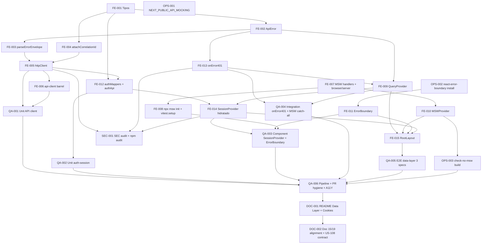

# Development Tasks — PB-P0-013 / US-106: Configurar TanStack Query global + `httpClient` con interceptores + MSW para dev y tests + hidratación real de `<SessionProvider>` vía `GET /me` + `<ErrorBoundary>` raíz

## 1. Metadata

| Field                                  | Value                                                                                                |
| -------------------------------------- | ---------------------------------------------------------------------------------------------------- |
| User Story ID                          | US-106                                                                                               |
| Source User Story                      | `management/user-stories/US-106-tanstack-query-and-msw.md`                                            |
| Source Technical Specification         | `management/technical-specs/P0/PB-P0-013/US-106-technical-spec.md`                                    |
| Decision Resolution Artifact           | No existe — decisiones formalizadas en `PO/BA Decisions Applied` de la historia (22 ítems)            |
| Priority                               | P0                                                                                                   |
| Backlog ID                             | PB-P0-013                                                                                            |
| Backlog Title                          | Frontend Data Layer: TanStack Query + MSW + Layouts                                                  |
| Backlog Execution Order                | 13 (de 18 items P0 priorizados)                                                                      |
| User Story Position in Backlog Item    | 1 de 2                                                                                               |
| Related User Stories in Backlog Item   | US-106 (data layer foundation), US-107 (layouts completos por rol)                                    |
| Epic                                   | EPIC-FE-001 — Frontend Next.js Application Foundation                                                |
| Backlog Item Dependencies              | PB-P0-012 (US-103/104/105 mergeadas)                                                                  |
| Feature                                | Data layer foundation — `QueryClient` global + `httpClient` + MSW + hidratación `SessionContext`     |
| Module / Domain                        | Platform / FE / Data Layer                                                                           |
| Backlog Alignment Status               | Found                                                                                                |
| Task Breakdown Status                  | Ready for Sprint Planning                                                                            |
| Created Date                           | 2026-06-22                                                                                           |
| Last Updated                           | 2026-06-22                                                                                           |

---

## 2. Source Validation

| Source                       | Found | Used | Notes                                                                                          |
| ---------------------------- | ----- | ---- | ---------------------------------------------------------------------------------------------- |
| User Story                   | Yes   | Yes  | `Approved with Minor Notes`; 11 AC, 6 EC, 14 VR, 10 SEC                                         |
| Technical Specification      | Yes   | Yes  | Fuente primaria — `Ready for Task Breakdown`                                                  |
| Decision Resolution Artifact | No    | N/A  | No existe; 22 decisiones en `PO/BA Decisions Applied`                                          |
| Product Backlog Prioritized  | Yes   | Yes  | PB-P0-013, posición 13 de 18, depende de PB-P0-012                                              |
| ADRs                         | Yes   | Yes  | ADR-FE-001, ADR-FE-002, ADR-FE-003, ADR-FE-005 (TanStack Query), ADR-FE-009 (MSW), ADR-FE-015 |

---

## 3. Backlog Execution Context

### Parent Backlog Item

**PB-P0-013 — Frontend Data Layer: TanStack Query + MSW + Layouts**. Item P0 que cierra EPIC-FE-001 foundation. Depende de PB-P0-012 (US-103/104/105 mergeadas). Trazabilidad: Doc 15, ADR-FE-001. Notas backlog: "MSW alineado al contrato OpenAPI de PB-P0-005".

### Execution Order Rationale

PB-P0-013 ocupa la **posición 13 de 18**. US-106 es la **primera historia** del item y bloquea a US-107 (cuyos layouts consumen `useSession()` hidratado por US-106) y a US-AUTH-* (que usa `httpClient` para `/auth/*`). Las tareas se ordenan por dependencia de implementación: tipos → core API client → MSW infra → providers → auth session hidratado → root layout → tests → docs.

### Related User Stories in Same Backlog Item

| User Story | Role in Backlog Item                                                            | Suggested Order |
| ---------- | ------------------------------------------------------------------------------- | --------------- |
| US-106     | Data layer foundation                                                            | 1               |
| US-107     | Layouts completos por rol — consume `useSession()` hidratado                     | 2               |

---

## 4. Task Breakdown Summary

| Area                       | Number of Tasks | Notes                                                                                              |
| -------------------------- | --------------: | -------------------------------------------------------------------------------------------------- |
| Frontend (FE)              | 15              | Tipos + API Client + MSW infra + Providers + Auth Session + Root Layout                            |
| QA / Testing               | 6               | Unit + component + integration + E2E + A11Y + pipeline                                              |
| Security / Authorization   | 1               | Audit SEC-01..SEC-10 + build check MSW                                                              |
| DevOps / Environment       | 3               | `.env.local.example` + `react-error-boundary` dep + `npx msw init` + build check script             |
| Documentation              | 2               | `web/README.md` § "Data Layer" + § "Cookies"; housekeeping Doc 15 §21.2/§23.1 + Doc 19 + US-108     |
| **Total**                  | **27**          |                                                                                                    |

---

## 5. Traceability Matrix

| Acceptance Criterion                                                                                       | Technical Spec Section                              | Task IDs                                                                                                |
| ---------------------------------------------------------------------------------------------------------- | --------------------------------------------------- | ------------------------------------------------------------------------------------------------------- |
| AC-01 `<QueryClientProvider>` montado con defaults seguros + orden providers                              | §6 (AC-01), §8 Providers, §18 paso 9-13              | TASK-PB-P0-013-US-106-FE-009, TASK-PB-P0-013-US-106-FE-015                                              |
| AC-02 `httpClient` con interceptores y `ApiError`                                                          | §6 (AC-02), §8 Data Fetching, §18 paso 2-5           | TASK-PB-P0-013-US-106-FE-002, FE-003, FE-004, FE-005                                                    |
| AC-03 MSW dev + tests con handlers iniciales                                                               | §6 (AC-03), §8 MSW, §18 paso 7                       | TASK-PB-P0-013-US-106-FE-007, TASK-PB-P0-013-US-106-FE-008, TASK-PB-P0-013-US-106-FE-010, TASK-PB-P0-013-US-106-OPS-002 |
| AC-04 `<SessionProvider>` hidratado vía `useQuery(['me'])`                                                | §6 (AC-04), §8 State Management, §18 paso 6, 12     | TASK-PB-P0-013-US-106-FE-012, TASK-PB-P0-013-US-106-FE-014                                              |
| AC-05 `<ErrorBoundary>` raíz con copy i18n                                                                | §6 (AC-05), §8 Error Boundary, §18 paso 11           | TASK-PB-P0-013-US-106-FE-011                                                                            |
| AC-06 Handler global 401 invalida sesión y redirige                                                       | §6 (AC-06), §12 Negative Scenarios, §18 paso 10     | TASK-PB-P0-013-US-106-FE-013                                                                            |
| AC-07 Variables de entorno declaradas                                                                     | §6 (AC-07), §18 paso 14                              | TASK-PB-P0-013-US-106-OPS-001                                                                           |
| AC-08 Patrón `featureApi → mapper → frontend model` documentado                                            | §6 (AC-08), §19 Group J                              | TASK-PB-P0-013-US-106-DOC-001                                                                           |
| AC-09 Tests unit + integration                                                                            | §13 Unit/Component/Integration                       | TASK-PB-P0-013-US-106-QA-001, QA-002, QA-003, QA-004                                                    |
| AC-10 Tests E2E Playwright con MSW                                                                        | §13 E2E Tests                                        | TASK-PB-P0-013-US-106-QA-005                                                                            |
| AC-11 Pipeline canónico verde + sin artefactos fuera de scope                                              | §4 Scope Boundary, §13 CI Checks                    | TASK-PB-P0-013-US-106-QA-006, TASK-PB-P0-013-US-106-SEC-001, TASK-PB-P0-013-US-106-OPS-003              |

Cada AC mapea a ≥ 1 tarea. Todas las tareas mapean a ≥ 1 sección del Technical Spec.

---

## 6. Development Tasks

### TASK-PB-P0-013-US-106-FE-001 — Definir tipos y constantes (`api-client/types.ts`, `auth-session/types.ts`)

| Field                     | Value                                                                                              |
| ------------------------- | -------------------------------------------------------------------------------------------------- |
| Area                      | Frontend                                                                                            |
| Type                      | Implementation                                                                                      |
| Priority                  | Must                                                                                                |
| Estimate                  | XS                                                                                                  |
| Depends On                | — (US-105 mergeada)                                                                                 |
| Source AC(s)              | AC-02, AC-04                                                                                        |
| Technical Spec Section(s) | §4 In Scope, §8 Data Fetching, §18 paso 1                                                            |
| Backlog ID                | PB-P0-013                                                                                            |
| User Story ID             | US-106                                                                                              |
| Owner Role                | Frontend                                                                                            |
| Status                    | To Do                                                                                               |

#### Objective

Declarar los tipos TypeScript base consumidos por el resto del módulo.

#### Scope

##### Include

* `web/src/shared/api-client/types.ts`:
  * `type HttpClientOptions<B = unknown> = { body?: B; query?: Record<string, string | number | boolean | undefined>; signal?: AbortSignal; headers?: Record<string, string>; timeoutMs?: number; isAI?: boolean }`.
  * `type ErrorEnvelope = { error: { code: string; message: string; details?: unknown } }`.
* `web/src/shared/auth-session/types.ts`:
  * `type User = { id: string; email: string; displayName: string }`.
  * `type AuthSessionResponseDTO = { user: User; role: 'organizer' | 'vendor' | 'admin'; locale: string }`.
  * `type AuthSession = { user: User; role: Role; locale: string }`.
  * Re-export de `Role` desde `@/shared/authorization/types` (US-105).

##### Exclude

* No implementar lógica todavía.
* No introducir `permissions` (decisión PO US-106).

#### Implementation Notes

* `AuthSession.locale` se mantiene en el tipo para futuras necesidades pero **no** se expone vía `useSession()` (vive en `useLocale()`).

#### Acceptance Criteria Covered

AC-02, AC-04.

#### Definition of Done

- [ ] Archivos versionados.
- [ ] `npm run typecheck` pasa.

---

### TASK-PB-P0-013-US-106-FE-002 — Implementar `ApiError`

| Field                     | Value                                                                                              |
| ------------------------- | -------------------------------------------------------------------------------------------------- |
| Area                      | Frontend                                                                                            |
| Type                      | Implementation                                                                                      |
| Priority                  | Must                                                                                                |
| Estimate                  | XS                                                                                                  |
| Depends On                | TASK-PB-P0-013-US-106-FE-001                                                                         |
| Source AC(s)              | AC-02                                                                                               |
| Technical Spec Section(s) | §6 (AC-02), §8 Data Fetching, §18 paso 2                                                            |
| Backlog ID                | PB-P0-013                                                                                            |
| User Story ID             | US-106                                                                                              |
| Owner Role                | Frontend                                                                                            |
| Status                    | To Do                                                                                               |

#### Objective

Implementar la clase `ApiError` con `isRetryable` derivado por status.

#### Scope

##### Include

* `web/src/shared/api-client/ApiError.ts`:
  * `class ApiError extends Error` con campos `code: string`, `message: string`, `details?: unknown`, `correlationId?: string`, `status: number`, `isRetryable: boolean`.
  * Constructor `(input: { code: string; message: string; details?: unknown; correlationId?: string; status: number })`.
  * `isRetryable` derivado: `true` para `status === 0` (network/timeout), `status === 408`, `status === 429`, `status >= 500 && status < 600`. `false` para los demás.

##### Exclude

* No implementar parseo de envelope aquí (TASK-FE-003).

#### Acceptance Criteria Covered

AC-02.

#### Definition of Done

- [ ] Archivo versionado.
- [ ] Tests unit (TASK-QA-001) cubren `isRetryable` por status.

---

### TASK-PB-P0-013-US-106-FE-003 — Implementar `parseErrorEnvelope` con Zod

| Field                     | Value                                                                                              |
| ------------------------- | -------------------------------------------------------------------------------------------------- |
| Area                      | Frontend                                                                                            |
| Type                      | Implementation                                                                                      |
| Priority                  | Must                                                                                                |
| Estimate                  | XS                                                                                                  |
| Depends On                | TASK-PB-P0-013-US-106-FE-002                                                                         |
| Source AC(s)              | AC-02                                                                                               |
| Technical Spec Section(s) | §6 (AC-02), §8 Data Fetching, §18 paso 3                                                            |
| Backlog ID                | PB-P0-013                                                                                            |
| User Story ID             | US-106                                                                                              |
| Owner Role                | Frontend                                                                                            |
| Status                    | To Do                                                                                               |

#### Objective

Helper que valida el envelope `{ error: { code, message, details? } }` con Zod y retorna `ApiError`.

#### Scope

##### Include

* `web/src/shared/api-client/parseErrorEnvelope.ts`:
  * Zod schema: `z.object({ error: z.object({ code: z.string(), message: z.string(), details: z.unknown().optional() }) })`.
  * `parseErrorEnvelope(payload: unknown, status: number, correlationId?: string): ApiError`.
  * Si parse falla → `ApiError({ code: 'UNEXPECTED', message: 'Invalid response body', status, correlationId })`.

##### Exclude

* No validar DTOs de éxito aquí (responsabilidad de cada `featureApi`).

#### Acceptance Criteria Covered

AC-02.

#### Definition of Done

- [ ] Archivo versionado.
- [ ] Tests unit cubren válido/inválido (TASK-QA-001).

---

### TASK-PB-P0-013-US-106-FE-004 — Implementar `attachCorrelationId` con fallback

| Field                     | Value                                                                                              |
| ------------------------- | -------------------------------------------------------------------------------------------------- |
| Area                      | Frontend                                                                                            |
| Type                      | Implementation                                                                                      |
| Priority                  | Must                                                                                                |
| Estimate                  | XS                                                                                                  |
| Depends On                | TASK-PB-P0-013-US-106-FE-001                                                                         |
| Source AC(s)              | AC-02                                                                                               |
| Technical Spec Section(s) | §6 (AC-02), §14 Correlation ID, §18 paso 4                                                          |
| Backlog ID                | PB-P0-013                                                                                            |
| User Story ID             | US-106                                                                                              |
| Owner Role                | Frontend                                                                                            |
| Status                    | To Do                                                                                               |

#### Objective

Helper que genera `X-Correlation-Id` UUID v4 client-side con fallback seguro.

#### Scope

##### Include

* `web/src/shared/api-client/attachCorrelationId.ts`:
  * `generateCorrelationId(): string` — usa `crypto.randomUUID()` si está disponible; si no, fallback `Math.random().toString(36).repeat(2)`.
  * Detección segura: `typeof crypto !== 'undefined' && typeof crypto.randomUUID === 'function'`.

##### Exclude

* No introducir dependencia externa (`uuid` package no se instala).

#### Acceptance Criteria Covered

AC-02.

#### Definition of Done

- [ ] Archivo versionado.
- [ ] Tests unit cubren happy path + fallback (TASK-QA-001 / NT-04).

---

### TASK-PB-P0-013-US-106-FE-005 — Implementar `httpClient` (wrapper sobre `fetch` con interceptores)

| Field                     | Value                                                                                              |
| ------------------------- | -------------------------------------------------------------------------------------------------- |
| Area                      | Frontend                                                                                            |
| Type                      | Implementation                                                                                      |
| Priority                  | Must                                                                                                |
| Estimate                  | L                                                                                                   |
| Depends On                | TASK-PB-P0-013-US-106-FE-002, FE-003, FE-004                                                          |
| Source AC(s)              | AC-02                                                                                               |
| Technical Spec Section(s) | §6 (AC-02), §8 Data Fetching, §18 paso 5                                                            |
| Backlog ID                | PB-P0-013                                                                                            |
| User Story ID             | US-106                                                                                              |
| Owner Role                | Frontend                                                                                            |
| Status                    | To Do                                                                                               |

#### Objective

Implementar `httpGet`, `httpPost`, `httpPatch`, `httpPut`, `httpDelete` con todos los interceptores (cookie, `Accept-Language`, `X-Correlation-Id`, timeout, parseo error envelope).

#### Scope

##### Include

* `web/src/shared/api-client/httpClient.ts` con las 5 funciones exportadas, firma `<T, B = unknown>(path: string, opts?: HttpClientOptions<B>): Promise<T>`.
* Flujo:
  1. Concatenar `NEXT_PUBLIC_API_BASE_URL` + `path` + `?query` (serializar query).
  2. Aplicar `credentials: 'include'`.
  3. Headers: mezclar `attachLocaleHeader()` (US-104) + `X-Correlation-Id` (generado o desde `opts.headers`) + `Content-Type: application/json` si hay body + `opts.headers` adicionales.
  4. Si hay body, `JSON.stringify`.
  5. `AbortController` con `setTimeout(timeoutMs ?? (isAI ? 30_000 : 10_000))`. Componer con `opts.signal` si existe.
  6. Si timeout → `ApiError({ code: 'TIMEOUT', status: 0, isRetryable: true })`.
  7. Si network error (`TypeError`) → `ApiError({ code: 'NETWORK', status: 0, isRetryable: true })`.
  8. Si response no OK → intentar `response.json()` + `parseErrorEnvelope` → `ApiError`. Preservar `correlationId` desde response header.
  9. Si OK → `return await response.json() as T`.
* `web/src/shared/api-client/index.ts` (barrel) re-exporta `httpGet/httpPost/httpPatch/httpPut/httpDelete`, `ApiError`, tipos, `parseErrorEnvelope`, `generateCorrelationId`.

##### Exclude

* No reintentar requests (eso lo hace TanStack Query).
* No validar DTOs de éxito.
* No introducir `Bearer` auth (cookies HTTP-only via `credentials: 'include'`).

#### Implementation Notes

* `EC-02`: response no-JSON → captura `SyntaxError` y lanza `ApiError({ code: 'UNEXPECTED', isRetryable: true })`.
* Logs dev: `console.debug('httpClient.request', { method, path, correlationId })` y `console.error('httpClient.error', { method, path, status, code, correlationId })` sin body ni cookies.

#### Acceptance Criteria Covered

AC-02.

#### Definition of Done

- [ ] Archivo versionado.
- [ ] Tests unit cubren todos los escenarios (TASK-QA-001 / TS-02..TS-04, NT-01..NT-03).
- [ ] Exportado en `shared/api-client/index.ts`.

---

### TASK-PB-P0-013-US-106-FE-006 — `shared/api-client/index.ts` barrel

| Field                     | Value                                                                                              |
| ------------------------- | -------------------------------------------------------------------------------------------------- |
| Area                      | Frontend                                                                                            |
| Type                      | Implementation                                                                                      |
| Priority                  | Must                                                                                                |
| Estimate                  | XS                                                                                                  |
| Depends On                | TASK-PB-P0-013-US-106-FE-005                                                                         |
| Source AC(s)              | AC-02, AC-08                                                                                        |
| Technical Spec Section(s) | §4 In Scope, §18 Files impacted                                                                     |
| Backlog ID                | PB-P0-013                                                                                            |
| User Story ID             | US-106                                                                                              |
| Owner Role                | Frontend                                                                                            |
| Status                    | To Do                                                                                               |

#### Objective

Exponer barrel `@/shared/api-client` con la API pública.

#### Scope

##### Include

* `web/src/shared/api-client/index.ts` re-exporta:
  * `httpGet`, `httpPost`, `httpPatch`, `httpPut`, `httpDelete`.
  * `ApiError`.
  * `parseErrorEnvelope`, `generateCorrelationId`.
  * Tipos: `HttpClientOptions`, `ErrorEnvelope`.

##### Exclude

* No re-exportar tipos internos no consumidos por features.

#### Acceptance Criteria Covered

AC-02, AC-08.

#### Definition of Done

- [ ] Importación `import { httpGet, ApiError } from '@/shared/api-client'` funciona desde cualquier `featureApi`.

---

### TASK-PB-P0-013-US-106-FE-007 — Crear handlers MSW iniciales y configurar worker/server

| Field                     | Value                                                                                              |
| ------------------------- | -------------------------------------------------------------------------------------------------- |
| Area                      | Frontend                                                                                            |
| Type                      | Implementation                                                                                      |
| Priority                  | Must                                                                                                |
| Estimate                  | S                                                                                                   |
| Depends On                | —                                                                                                   |
| Source AC(s)              | AC-03                                                                                               |
| Technical Spec Section(s) | §6 (AC-03), §8 MSW, §18 paso 7                                                                      |
| Backlog ID                | PB-P0-013                                                                                            |
| User Story ID             | US-106                                                                                              |
| Owner Role                | Frontend                                                                                            |
| Status                    | To Do                                                                                               |

#### Objective

Implementar la infraestructura MSW: handlers iniciales (`/auth/me`, `/health`, catch-all), worker browser y server Node.

#### Scope

##### Include

* `web/src/tests/msw/handlers/auth.ts`:
  * `http.get('*/api/v1/auth/me', () => HttpResponse.json({ error: { code: 'UNAUTHENTICATED', message: 'No session' } }, { status: 401 }))` (default).
* `web/src/tests/msw/handlers/health.ts`:
  * `http.get('*/api/v1/health', () => HttpResponse.json({ status: 'ok' }))`.
* `web/src/tests/msw/handlers/index.ts`:
  * Exporta array `handlers: HttpHandler[]` con auth + health + catch-all `http.all('*/api/v1/*', ...) → 501 + console.warn`.
* `web/src/tests/msw/browser.ts`: `worker = setupWorker(...handlers)`.
* `web/src/tests/msw/server.ts`: `server = setupServer(...handlers)`.

##### Exclude

* No agregar handlers de features (auth login, events, vendors, etc.) — cada historia owner.

#### Implementation Notes

* Catch-all es el último en el array.
* Confirmar que `process.env.NODE_ENV === 'development'` para warn condicional en catch-all.

#### Acceptance Criteria Covered

AC-03.

#### Definition of Done

- [ ] Archivos versionados.
- [ ] `import { server } from './tests/msw/server'` funciona en `vitest.setup.ts`.

---

### TASK-PB-P0-013-US-106-FE-008 — Generar `public/mockServiceWorker.js` y configurar `vitest.setup.ts`

| Field                     | Value                                                                                              |
| ------------------------- | -------------------------------------------------------------------------------------------------- |
| Area                      | Frontend                                                                                            |
| Type                      | Setup                                                                                               |
| Priority                  | Must                                                                                                |
| Estimate                  | XS                                                                                                  |
| Depends On                | TASK-PB-P0-013-US-106-FE-007                                                                         |
| Source AC(s)              | AC-03                                                                                               |
| Technical Spec Section(s) | §6 (AC-03), §13 Testing Strategy, §18 paso 14                                                       |
| Backlog ID                | PB-P0-013                                                                                            |
| User Story ID             | US-106                                                                                              |
| Owner Role                | Frontend                                                                                            |
| Status                    | To Do                                                                                               |

#### Objective

Generar el worker artefacto público y hookear MSW en la suite Vitest.

#### Scope

##### Include

* Ejecutar `cd web && npx msw init public/` para generar `public/mockServiceWorker.js`. Versionar el archivo.
* Modificar `web/vitest.setup.ts`:
  ```ts
  import { server } from './src/tests/msw/server'
  beforeAll(() => server.listen({ onUnhandledRequest: 'error' }))
  afterEach(() => server.resetHandlers())
  afterAll(() => server.close())
  ```

##### Exclude

* No agregar `import './tests/msw/browser'` global (lo hace `<MSWProvider>` con dynamic import).

#### Acceptance Criteria Covered

AC-03.

#### Definition of Done

- [ ] `public/mockServiceWorker.js` versionado.
- [ ] `npm run test` arranca el server MSW antes de tests.

---

### TASK-PB-P0-013-US-106-FE-009 — Implementar `<QueryProvider>` con defaults y `QueryCache.onError`

| Field                     | Value                                                                                              |
| ------------------------- | -------------------------------------------------------------------------------------------------- |
| Area                      | Frontend                                                                                            |
| Type                      | Implementation                                                                                      |
| Priority                  | Must                                                                                                |
| Estimate                  | M                                                                                                   |
| Depends On                | TASK-PB-P0-013-US-106-FE-002, TASK-PB-P0-013-US-106-FE-013                                            |
| Source AC(s)              | AC-01, AC-06                                                                                        |
| Technical Spec Section(s) | §6 (AC-01/06), §8 State Management, §18 paso 9-10                                                    |
| Backlog ID                | PB-P0-013                                                                                            |
| User Story ID             | US-106                                                                                              |
| Owner Role                | Frontend                                                                                            |
| Status                    | To Do                                                                                               |

#### Objective

Crear `<QueryProvider>` Client Component con `QueryClient` lazy init, defaults seguros, devtools dev-only y `QueryCache.onError` global.

#### Scope

##### Include

* `web/src/shared/providers/QueryProvider.tsx` (`'use client'`):
  * `const [queryClient] = useState(() => new QueryClient({ queryCache: new QueryCache({ onError: onError401Handler }), defaultOptions: { queries: { staleTime: 30_000, gcTime: 5 * 60_000, refetchOnWindowFocus: true, refetchOnReconnect: true, retry: customRetryFn, retryDelay: 1_000 }, mutations: { retry: 0 } } }))`.
  * `customRetryFn(failureCount, error)`: `false` si `failureCount >= 1`; si `error instanceof ApiError`, retorna `error.isRetryable`; default `true`.
  * `<QueryClientProvider client={queryClient}>{children}</QueryClientProvider>`.
  * Devtools con `dynamic(() => import('@tanstack/react-query-devtools').then(m => m.ReactQueryDevtools), { ssr: false })` solo en dev.

##### Exclude

* No introducir hidratación SSR de queries (no requerido en MVP).

#### Implementation Notes

* `onError401Handler` viene de TASK-FE-013 (`onError401.ts`).
* Validar que `useState` lazy garantiza instancia única por request (test unit TS-01).

#### Acceptance Criteria Covered

AC-01, AC-06.

#### Definition of Done

- [ ] Archivo versionado.
- [ ] Tests unit cubren defaults (TASK-QA-001 / TS-01).
- [ ] Exportado en `shared/providers/index.ts`.

---

### TASK-PB-P0-013-US-106-FE-010 — Implementar `<MSWProvider>` con dynamic import

| Field                     | Value                                                                                              |
| ------------------------- | -------------------------------------------------------------------------------------------------- |
| Area                      | Frontend                                                                                            |
| Type                      | Implementation                                                                                      |
| Priority                  | Must                                                                                                |
| Estimate                  | S                                                                                                   |
| Depends On                | TASK-PB-P0-013-US-106-FE-007                                                                         |
| Source AC(s)              | AC-03                                                                                               |
| Technical Spec Section(s) | §6 (AC-03), §8 MSW, §18 paso 8                                                                      |
| Backlog ID                | PB-P0-013                                                                                            |
| User Story ID             | US-106                                                                                              |
| Owner Role                | Frontend                                                                                            |
| Status                    | To Do                                                                                               |

#### Objective

Client Component que arranca el worker MSW solo cuando `NEXT_PUBLIC_API_MOCKING=enabled` via dynamic import (sin inflar bundle prod).

#### Scope

##### Include

* `web/src/shared/providers/MSWProvider.tsx` (`'use client'`):
  * `useEffect` que evalúa `process.env.NEXT_PUBLIC_API_MOCKING === 'enabled'`.
  * Si true, `const { worker } = await import('@/tests/msw/browser'); await worker.start({ onUnhandledRequest: 'warn' })`.
  * Catch error con `console.error('MSW init failed', err)` (EC-04).
  * Retorna `{children}` sin envolvente visible.

##### Exclude

* No bloquear render (no `await` antes de retornar JSX).
* No incluir MSW en prod (dynamic import + condicional garantizan tree-shaking).

#### Acceptance Criteria Covered

AC-03.

#### Definition of Done

- [ ] Archivo versionado.
- [ ] Test de build confirma `msw` no aparece en chunks prod (TASK-OPS-003).

---

### TASK-PB-P0-013-US-106-FE-011 — Implementar `<ErrorBoundary>` con `react-error-boundary` + copy i18n

| Field                     | Value                                                                                              |
| ------------------------- | -------------------------------------------------------------------------------------------------- |
| Area                      | Frontend                                                                                            |
| Type                      | Implementation                                                                                      |
| Priority                  | Must                                                                                                |
| Estimate                  | S                                                                                                   |
| Depends On                | TASK-PB-P0-013-US-106-OPS-002                                                                        |
| Source AC(s)              | AC-05                                                                                               |
| Technical Spec Section(s) | §6 (AC-05), §8 Loading/Error, §18 paso 11                                                            |
| Backlog ID                | PB-P0-013                                                                                            |
| User Story ID             | US-106                                                                                              |
| Owner Role                | Frontend                                                                                            |
| Status                    | To Do                                                                                               |

#### Objective

Crear `<ErrorBoundary>` Client Component basado en `react-error-boundary` con fallback i18n.

#### Scope

##### Include

* `web/src/shared/providers/ErrorBoundary.tsx` (`'use client'`):
  * Importa `ErrorBoundary as ReactErrorBoundary, FallbackProps` de `react-error-boundary`.
  * `Fallback({ error, resetErrorBoundary })`: `<main role="alert"><h1>{t('errors.envelope.UNEXPECTED')}</h1><button type="button" onClick={resetErrorBoundary}>{t('common.retry')}</button></main>` con Tailwind básico.
  * `<ErrorBoundary>` exporta `({ children }) => <ReactErrorBoundary FallbackComponent={Fallback} onError={(error, info) => console.error('ErrorBoundary caught', error, info)}>{children}</ReactErrorBoundary>`.

##### Exclude

* No captura errores de `useQuery` (los maneja TanStack Query).
* No envía a Sentry (Future).

#### Implementation Notes

* `Fallback` consume `useTranslations` (cliente); por eso `<ErrorBoundary>` se anida **dentro** de `<NextIntlClientProvider>`... pero la decisión documentada en US-106 spec coloca `<ErrorBoundary>` como **outermost** wrapper. Reconciliación: `Fallback` debe importar `useTranslations` solo si está disponible; si no, mostrar texto crudo en inglés `'Something went wrong'` + `'Retry'` como fallback de fallback. **Decisión final en PR**: si se prefiere mover `<ErrorBoundary>` adentro de `<NextIntlClientProvider>`, ajustar el orden en `RootLayout` (alternativa válida porque el AC-01 lo permite mientras se preserve providers).

#### Acceptance Criteria Covered

AC-05.

#### Definition of Done

- [ ] Archivo versionado.
- [ ] Tests component (TASK-QA-003) cubren fallback con i18n y reset.
- [ ] Exportado en `shared/providers/index.ts`.

---

### TASK-PB-P0-013-US-106-FE-012 — Implementar `authMappers` + `authApi.me()`

| Field                     | Value                                                                                              |
| ------------------------- | -------------------------------------------------------------------------------------------------- |
| Area                      | Frontend                                                                                            |
| Type                      | Implementation                                                                                      |
| Priority                  | Must                                                                                                |
| Estimate                  | S                                                                                                   |
| Depends On                | TASK-PB-P0-013-US-106-FE-001, TASK-PB-P0-013-US-106-FE-005                                            |
| Source AC(s)              | AC-04, AC-08                                                                                        |
| Technical Spec Section(s) | §6 (AC-04/08), §8 Data Fetching, §18 paso 6                                                          |
| Backlog ID                | PB-P0-013                                                                                            |
| User Story ID             | US-106                                                                                              |
| Owner Role                | Frontend                                                                                            |
| Status                    | To Do                                                                                               |

#### Objective

Implementar el primer cliente `featureApi` real bajo el patrón `DTO → mapper → frontend model`.

#### Scope

##### Include

* `web/src/shared/auth-session/authMappers.ts`:
  * `mapAuthSessionResponseToAuthSession(dto: AuthSessionResponseDTO): AuthSession` — función pura.
* `web/src/shared/auth-session/authApi.ts`:
  * `export const authApi = { me: async (): Promise<AuthSession> => { const dto = await httpGet<AuthSessionResponseDTO>('/auth/me'); return mapAuthSessionResponseToAuthSession(dto) } }`.

##### Exclude

* **NO** implementar `authApi.login`, `authApi.logout`, `authApi.register`, `authApi.forgotPassword` (US-AUTH-*).

#### Acceptance Criteria Covered

AC-04, AC-08.

#### Definition of Done

- [ ] Archivos versionados.
- [ ] Tests unit cubren `authApi.me()` y mapper (TASK-QA-002 / TS-07, TS-08).

---

### TASK-PB-P0-013-US-106-FE-013 — Implementar handler global `onError401`

| Field                     | Value                                                                                              |
| ------------------------- | -------------------------------------------------------------------------------------------------- |
| Area                      | Frontend                                                                                            |
| Type                      | Implementation                                                                                      |
| Priority                  | Must                                                                                                |
| Estimate                  | M                                                                                                   |
| Depends On                | TASK-PB-P0-013-US-106-FE-002                                                                         |
| Source AC(s)              | AC-06                                                                                               |
| Technical Spec Section(s) | §6 (AC-06), §12 Negative Scenarios, §17 Risks (loop), §18 paso 10                                    |
| Backlog ID                | PB-P0-013                                                                                            |
| User Story ID             | US-106                                                                                              |
| Owner Role                | Frontend                                                                                            |
| Status                    | To Do                                                                                               |

#### Objective

Handler global del `QueryCache.onError` que maneja 401 (invalida sesión + redirect condicional) y 403 (solo log).

#### Scope

##### Include

* `web/src/shared/auth-session/onError401.ts`:
  * `createOnError401Handler({ getQueryClient, getRouter, getPathname }): (error: Error, query: Query) => void`.
  * Si `error instanceof ApiError && error.status === 401`:
    * Si `queryKey === ['me']` → no redirect; `queryClient.invalidateQueries(['me'])` only.
    * Si `queryKey !== ['me']` → `queryClient.invalidateQueries(['me'])` + `queryClient.clear()`. Si `pathname` está en `(app)/*` o `(admin)/*` (regex `^/(organizer|vendor|admin)`), `router.replace('/login?from=' + encodeURIComponent(pathname + search))`.
  * Si `error.status === 403` → `console.warn('queryClient.403', { queryKey, pathname })` en dev. Sin redirect.
* Consumido por `<QueryProvider>` (TASK-FE-009).

##### Exclude

* No tocar errors no `ApiError` (los maneja TanStack Query nativo).

#### Implementation Notes

* En App Router, `useRouter`/`usePathname` solo funcionan en Client Components. El handler necesita acceso a ellos a través del `<QueryProvider>` (que es Client) usando hooks dentro del componente. Pattern: el `<QueryProvider>` crea el `QueryClient` en `useState` y monta un effect con `useRouter` para asignar el `onError` adecuado.

#### Acceptance Criteria Covered

AC-06.

#### Definition of Done

- [ ] Archivo versionado.
- [ ] Tests integration cubren 401 `['me']` no redirige, 401 otra query redirige, 403 no redirige (TASK-QA-004 / TS-12, TS-13, NT-05, NT-06).

---

### TASK-PB-P0-013-US-106-FE-014 — Reemplazar `<SessionProvider>` esqueleto US-105 por hidratación real

| Field                     | Value                                                                                              |
| ------------------------- | -------------------------------------------------------------------------------------------------- |
| Area                      | Frontend                                                                                            |
| Type                      | Implementation                                                                                      |
| Priority                  | Must                                                                                                |
| Estimate                  | M                                                                                                   |
| Depends On                | TASK-PB-P0-013-US-106-FE-012, TASK-PB-P0-013-US-106-FE-009                                            |
| Source AC(s)              | AC-04                                                                                               |
| Technical Spec Section(s) | §6 (AC-04), §8 State Management, §18 paso 12                                                         |
| Backlog ID                | PB-P0-013                                                                                            |
| User Story ID             | US-106                                                                                              |
| Owner Role                | Frontend                                                                                            |
| Status                    | To Do                                                                                               |

#### Objective

Reemplazar el `<SessionProvider>` esqueleto de US-105 por una implementación que hidrata vía `useQuery(['me'])`, preservando la API pública de `useSession()` para consumidores.

#### Scope

##### Include

* Modificar `web/src/shared/auth-session/SessionProvider.tsx`:
  * `'use client'`.
  * Internamente: `const { data, isLoading, isError, refetch } = useQuery({ queryKey: ['me'], queryFn: () => authApi.me(), staleTime: 60_000, retry: false })`.
  * 401 (`ApiError({ code: 'UNAUTHENTICATED' })`) → tratar como anónimo: el `useQuery` lanza error pero `<SessionProvider>` convierte a `{ user: null, role: null, isAuthenticated: false, isLoading, isError: false, refetch }`.
  * Errores 5xx, network, timeout → `{ user: null, role: null, isAuthenticated: false, isLoading, isError: true, refetch }`.
* Modificar `web/src/shared/auth-session/useSession.ts`:
  * `useSession(): { user: User | null; role: Role | null; isAuthenticated: boolean; isLoading: boolean; isError: boolean; refetch: () => void }`.
* Actualizar `web/src/shared/auth-session/index.ts` (barrel) re-exporta `SessionProvider`, `useSession`, `authApi`, tipos.

##### Exclude

* No exponer `permissions` ni `locale` (decisión PO US-106).
* No invalidar la cookie de sesión en cliente.

#### Implementation Notes

* Para distinguir 401 anónimo de error real: el `queryFn` puede capturar `ApiError({ code: 'UNAUTHENTICATED' })` y retornar `null`, evitando que TanStack lo marque como error. Alternativa: usar `select` o `meta`. Decisión final en PR; preferido `try/catch` en `queryFn`.

#### Acceptance Criteria Covered

AC-04.

#### Definition of Done

- [ ] Archivos versionados; barrel actualizado.
- [ ] Importaciones existentes de US-105 (`import { useSession } from '@/shared/auth-session'`) siguen funcionando.
- [ ] Tests component cubren 401 anónimo y 200 autenticado (TASK-QA-003 / TS-09, TS-10).

---

### TASK-PB-P0-013-US-106-FE-015 — Modificar `RootLayout` para envolver providers en el orden de AC-01

| Field                     | Value                                                                                              |
| ------------------------- | -------------------------------------------------------------------------------------------------- |
| Area                      | Frontend                                                                                            |
| Type                      | Implementation                                                                                      |
| Priority                  | Must                                                                                                |
| Estimate                  | S                                                                                                   |
| Depends On                | TASK-PB-P0-013-US-106-FE-009, FE-010, FE-011, FE-014                                                  |
| Source AC(s)              | AC-01                                                                                               |
| Technical Spec Section(s) | §6 (AC-01), §8 Routes/Pages, §18 paso 13                                                             |
| Backlog ID                | PB-P0-013                                                                                            |
| User Story ID             | US-106                                                                                              |
| Owner Role                | Frontend                                                                                            |
| Status                    | To Do                                                                                               |

#### Objective

Envolver providers globales en `RootLayout` siguiendo el orden formalizado.

#### Scope

##### Include

* Modificar `web/src/app/layout.tsx` (de US-105):
  * Estructura final:
    ```tsx
    <html lang={locale}>
      <body>
        <ErrorBoundary>
          <QueryProvider>
            <MSWProvider>
              <SessionProvider>
                <NextIntlClientProvider locale={locale} messages={messages}>
                  {children}
                </NextIntlClientProvider>
              </SessionProvider>
            </MSWProvider>
          </QueryProvider>
        </ErrorBoundary>
      </body>
    </html>
    ```
  * Confirmar que `<html lang>` dinámico heredado de US-104 sigue funcionando.

##### Exclude

* No introducir layouts visuales (US-107).
* No mover `<NextIntlClientProvider>` fuera del árbol de providers cliente.

#### Implementation Notes

* Si `<ErrorBoundary>` Fallback requiere `useTranslations`, ajustar orden a `QueryProvider > MSWProvider > SessionProvider > NextIntlClientProvider > ErrorBoundary > children`. Decisión final en PR según implementación de `<ErrorBoundary>` (TASK-FE-011).

#### Acceptance Criteria Covered

AC-01.

#### Definition of Done

- [ ] Layout modificado.
- [ ] `npm run dev` sin errores de hidratación.
- [ ] `npm run build` pasa.

---

### TASK-PB-P0-013-US-106-OPS-001 — Agregar `NEXT_PUBLIC_API_MOCKING` a `.env.local.example`

| Field                     | Value                                                                                              |
| ------------------------- | -------------------------------------------------------------------------------------------------- |
| Area                      | DevOps / Environment                                                                                |
| Type                      | Setup                                                                                               |
| Priority                  | Must                                                                                                |
| Estimate                  | XS                                                                                                  |
| Depends On                | —                                                                                                   |
| Source AC(s)              | AC-07                                                                                               |
| Technical Spec Section(s) | §6 (AC-07), §18 paso 14                                                                             |
| Backlog ID                | PB-P0-013                                                                                            |
| User Story ID             | US-106                                                                                              |
| Owner Role                | DevOps / Frontend                                                                                   |
| Status                    | To Do                                                                                               |

#### Objective

Agregar la variable de entorno pública para activación de MSW.

#### Scope

##### Include

* Agregar a `web/.env.local.example`:
  ```text
  NEXT_PUBLIC_API_MOCKING=disabled
  ```
* Documentar uso en `web/README.md` § "Data Layer" (`'enabled'` activa MSW worker; cualquier otro valor → backend real).

##### Exclude

* No agregar env privadas.

#### Acceptance Criteria Covered

AC-07.

#### Definition of Done

- [ ] `.env.local.example` actualizado.

---

### TASK-PB-P0-013-US-106-OPS-002 — Instalar `react-error-boundary` + actualizar `package.json`

| Field                     | Value                                                                                              |
| ------------------------- | -------------------------------------------------------------------------------------------------- |
| Area                      | DevOps / Environment                                                                                |
| Type                      | Setup                                                                                               |
| Priority                  | Must                                                                                                |
| Estimate                  | XS                                                                                                  |
| Depends On                | —                                                                                                   |
| Source AC(s)              | AC-05                                                                                               |
| Technical Spec Section(s) | §4 In Scope (excepción aprobada al stack), §18 paso 14                                              |
| Backlog ID                | PB-P0-013                                                                                            |
| User Story ID             | US-106                                                                                              |
| Owner Role                | DevOps / Frontend                                                                                   |
| Status                    | To Do                                                                                               |

#### Objective

Agregar `react-error-boundary` al stack como dep runtime (excepción aprobada en el approval gate).

#### Scope

##### Include

* `npm install react-error-boundary` (versión major fija; ej. `^5.0.0` o la actual al momento).
* Confirmar `npm audit --omit=dev` exit 0.
* Documentar la excepción en `web/README.md` § "Stack".

##### Exclude

* No introducir otras deps fuera del stack §7 (cualquier extra requiere ADR).

#### Acceptance Criteria Covered

AC-05.

#### Definition of Done

- [ ] `package-lock.json` actualizado.
- [ ] `npm ci` limpio.

---

### TASK-PB-P0-013-US-106-OPS-003 — Build check `scripts/check-no-msw-in-prod.mjs`

| Field                     | Value                                                                                              |
| ------------------------- | -------------------------------------------------------------------------------------------------- |
| Area                      | DevOps / Environment                                                                                |
| Type                      | Setup                                                                                               |
| Priority                  | Must                                                                                                |
| Estimate                  | S                                                                                                   |
| Depends On                | TASK-PB-P0-013-US-106-FE-010                                                                         |
| Source AC(s)              | AC-11                                                                                               |
| Technical Spec Section(s) | §12 SEC-07, §13 Security Tests (TS-18), §18 paso 15                                                  |
| Backlog ID                | PB-P0-013                                                                                            |
| User Story ID             | US-106                                                                                              |
| Owner Role                | DevOps                                                                                              |
| Status                    | To Do                                                                                               |

#### Objective

Script CI que verifica que `msw` no aparece en chunks de producción.

#### Scope

##### Include

* `web/scripts/check-no-msw-in-prod.mjs` (Node script):
  * Lee `.next/static/chunks/*.js` (después de `npm run build`).
  * Falla con exit 1 si `msw` (case-insensitive) aparece en cualquier chunk.
  * Exit 0 si limpio.
* Agregar script npm: `"check:no-msw": "node scripts/check-no-msw-in-prod.mjs"`.
* Documentar en `web/README.md` § "Security".
* Coordinación con CI: el step `npm run build` debe correr antes; agregar `npm run check:no-msw` después.

##### Exclude

* No bloquear `npm run dev` (solo prod build).

#### Acceptance Criteria Covered

AC-11.

#### Definition of Done

- [ ] Script versionado.
- [ ] Script npm declarado.
- [ ] Ejecutado manualmente al menos una vez con build limpio.

---

### TASK-PB-P0-013-US-106-QA-001 — Tests unit del API client

| Field                     | Value                                                                                              |
| ------------------------- | -------------------------------------------------------------------------------------------------- |
| Area                      | QA / Testing                                                                                        |
| Type                      | Test                                                                                                |
| Priority                  | Must                                                                                                |
| Estimate                  | M                                                                                                   |
| Depends On                | TASK-PB-P0-013-US-106-FE-002 .. FE-006                                                               |
| Source AC(s)              | AC-02                                                                                               |
| Technical Spec Section(s) | §13 Unit Tests (TS-01..TS-06, NT-01..NT-04)                                                          |
| Backlog ID                | PB-P0-013                                                                                            |
| User Story ID             | US-106                                                                                              |
| Owner Role                | QA / Frontend                                                                                       |
| Status                    | To Do                                                                                               |

#### Objective

Cubrir con Vitest los módulos puros del API client (`httpClient`, `ApiError`, `parseErrorEnvelope`, `attachCorrelationId`).

#### Scope

##### Include

* `tests/unit/api-client/queryClient.test.ts` (TS-01) — defaults exactos.
* `tests/unit/api-client/httpClient.test.ts` (TS-02..TS-04, NT-01..NT-03) — interceptores, timeout, parseo error envelope.
* `tests/unit/api-client/ApiError.test.ts` (TS-05) — `isRetryable` por status.
* `tests/unit/api-client/parseErrorEnvelope.test.ts` (TS-06) — Zod válido/inválido.
* `tests/unit/api-client/attachCorrelationId.test.ts` (NT-04) — fallback cuando `crypto.randomUUID` ausente.
* Mockear `fetch` global con `vi.fn()`; usar `MSW` server cuando aplique.

##### Exclude

* No probar `<SessionProvider>` aquí (TASK-QA-003).

#### Acceptance Criteria Covered

AC-02.

#### Definition of Done

- [ ] Tests pasan.
- [ ] Cobertura de `shared/api-client/` ≥ 85 % de líneas.

---

### TASK-PB-P0-013-US-106-QA-002 — Tests unit del auth session

| Field                     | Value                                                                                              |
| ------------------------- | -------------------------------------------------------------------------------------------------- |
| Area                      | QA / Testing                                                                                        |
| Type                      | Test                                                                                                |
| Priority                  | Must                                                                                                |
| Estimate                  | S                                                                                                   |
| Depends On                | TASK-PB-P0-013-US-106-FE-012                                                                         |
| Source AC(s)              | AC-04, AC-08                                                                                        |
| Technical Spec Section(s) | §13 Unit Tests (TS-07, TS-08)                                                                       |
| Backlog ID                | PB-P0-013                                                                                            |
| User Story ID             | US-106                                                                                              |
| Owner Role                | QA / Frontend                                                                                       |
| Status                    | To Do                                                                                               |

#### Objective

Cubrir `authApi.me()` y `mapAuthSessionResponseToAuthSession`.

#### Scope

##### Include

* `tests/unit/auth-session/authApi.test.ts` (TS-07) — invoca `httpGet('/auth/me')`; aplica mapper.
* `tests/unit/auth-session/authMappers.test.ts` (TS-08) — función pura preserva campos.

##### Exclude

* No probar `<SessionProvider>` aquí (TASK-QA-003).

#### Acceptance Criteria Covered

AC-04, AC-08.

#### Definition of Done

- [ ] Tests pasan.

---

### TASK-PB-P0-013-US-106-QA-003 — Tests component de `<SessionProvider>` (con MSW) y `<ErrorBoundary>`

| Field                     | Value                                                                                              |
| ------------------------- | -------------------------------------------------------------------------------------------------- |
| Area                      | QA / Testing                                                                                        |
| Type                      | Test                                                                                                |
| Priority                  | Must                                                                                                |
| Estimate                  | M                                                                                                   |
| Depends On                | TASK-PB-P0-013-US-106-FE-014, TASK-PB-P0-013-US-106-FE-011, TASK-PB-P0-013-US-106-FE-008             |
| Source AC(s)              | AC-04, AC-05                                                                                        |
| Technical Spec Section(s) | §13 Component Tests (TS-09, TS-10, TS-11)                                                            |
| Backlog ID                | PB-P0-013                                                                                            |
| User Story ID             | US-106                                                                                              |
| Owner Role                | QA / Frontend                                                                                       |
| Status                    | To Do                                                                                               |

#### Objective

Cubrir `<SessionProvider>` con MSW override y `<ErrorBoundary>` con fallback i18n.

#### Scope

##### Include

* `tests/unit/auth-session/SessionProvider.test.tsx`:
  * TS-09: con MSW 401 → `useSession()` `{ isAuthenticated: false, isError: false }`.
  * TS-10: con MSW override 200 `{ role: 'organizer' }` → `{ isAuthenticated: true, role: 'organizer' }`.
  * Wrap con `<QueryClientProvider>` + `<NextIntlClientProvider>` en testing.
* `tests/unit/providers/ErrorBoundary.test.tsx`:
  * TS-11: componente hijo lanza → renderiza fallback con copy i18n + botón retry funcional.

##### Exclude

* No probar el listener global 401 aquí (TASK-QA-004).

#### Acceptance Criteria Covered

AC-04, AC-05.

#### Definition of Done

- [ ] Tests pasan.

---

### TASK-PB-P0-013-US-106-QA-004 — Tests integration `onError401` + MSW catch-all

| Field                     | Value                                                                                              |
| ------------------------- | -------------------------------------------------------------------------------------------------- |
| Area                      | QA / Testing                                                                                        |
| Type                      | Test                                                                                                |
| Priority                  | Must                                                                                                |
| Estimate                  | M                                                                                                   |
| Depends On                | TASK-PB-P0-013-US-106-FE-013, TASK-PB-P0-013-US-106-FE-009                                            |
| Source AC(s)              | AC-06                                                                                               |
| Technical Spec Section(s) | §13 Integration Tests (TS-12..TS-14, NT-05, NT-06)                                                   |
| Backlog ID                | PB-P0-013                                                                                            |
| User Story ID             | US-106                                                                                              |
| Owner Role                | QA / Frontend                                                                                       |
| Status                    | To Do                                                                                               |

#### Objective

Cubrir el handler global de 401 / 403 + el catch-all 501 de MSW.

#### Scope

##### Include

* `tests/integration/data-layer/onError-401.test.tsx`:
  * TS-12 / NT-05: query custom retorna 401 → `queryClient.clear()` + `router.replace('/login?from=...')` (mock router).
  * TS-13: 401 sobre `['me']` → NO redirige.
  * NT-06: 403 sobre query custom → NO redirige; expone `ApiError({ status: 403 })`.
* `tests/integration/data-layer/msw-catch-all.test.ts`:
  * TS-14: endpoint sin handler → 501 + `console.warn` capturable.

##### Exclude

* No probar UI components aquí.

#### Acceptance Criteria Covered

AC-06.

#### Definition of Done

- [ ] Tests pasan.
- [ ] Cobertura de `onError401.ts` ≥ 90 %.

---

### TASK-PB-P0-013-US-106-QA-005 — 3 Tests E2E Playwright del data layer

| Field                     | Value                                                                                              |
| ------------------------- | -------------------------------------------------------------------------------------------------- |
| Area                      | QA / Testing                                                                                        |
| Type                      | Test                                                                                                |
| Priority                  | Must                                                                                                |
| Estimate                  | M                                                                                                   |
| Depends On                | TASK-PB-P0-013-US-106-FE-015                                                                         |
| Source AC(s)              | AC-10                                                                                               |
| Technical Spec Section(s) | §13 E2E Tests (TS-15, TS-16, TS-17)                                                                 |
| Backlog ID                | PB-P0-013                                                                                            |
| User Story ID             | US-106                                                                                              |
| Owner Role                | QA                                                                                                  |
| Status                    | To Do                                                                                               |

#### Objective

Cubrir end-to-end los flujos sesión anónima, autenticada y error boundary.

#### Scope

##### Include

* Componente test-only en `(public)/page.tsx` o landing: `<div data-testid="session-state">{isAuthenticated ? 'authenticated' : 'anonymous'}</div>` + `<div data-testid="session-role">{role ?? ''}</div>`. Decidir en PR si es permanente (ligero) o gated por env flag.
* `tests/e2e/data-layer.anonymous.spec.ts` (TS-15): `NEXT_PUBLIC_API_MOCKING=enabled`; landing muestra `session-state="anonymous"`.
* `tests/e2e/data-layer.authenticated.spec.ts` (TS-16): override MSW retornando 200 `{ role: 'organizer' }`; landing muestra `session-state="authenticated"` + `session-role="organizer"`.
* `tests/e2e/data-layer.error-boundary.spec.ts` (TS-17): página gated por `?throw=1` con componente que lanza → fallback con copy i18n visible.

##### Exclude

* No probar layouts completos (US-107).

#### Implementation Notes

* Override MSW en Playwright: usar `worker.use(...)` desde un fixture o exponer un endpoint test-only que cambie el handler dinámicamente.

#### Acceptance Criteria Covered

AC-10.

#### Definition of Done

- [ ] 3 specs verdes en `npm run test:e2e`.

---

### TASK-PB-P0-013-US-106-QA-006 — Pipeline canónico Doc 21 §9.2 + PR hygiene + A11Y

| Field                     | Value                                                                                              |
| ------------------------- | -------------------------------------------------------------------------------------------------- |
| Area                      | QA / Testing                                                                                        |
| Type                      | Review                                                                                              |
| Priority                  | Must                                                                                                |
| Estimate                  | S                                                                                                   |
| Depends On                | TASK-PB-P0-013-US-106-QA-001..QA-005, TASK-PB-P0-013-US-106-OPS-003                                   |
| Source AC(s)              | AC-11                                                                                               |
| Technical Spec Section(s) | §4 Scope Boundary, §13 CI Checks                                                                    |
| Backlog ID                | PB-P0-013                                                                                            |
| User Story ID             | US-106                                                                                              |
| Owner Role                | QA / Tech Lead                                                                                       |
| Status                    | To Do                                                                                               |

#### Objective

Validar pipeline canónico en local + auditar PR contra lista negativa + verificar A11Y baseline.

#### Scope

##### Include

* Ejecutar desde `web/`: `npm ci && npm run lint && npm run typecheck && npm run test && npm run build && npm run test:e2e && npm run check:no-msw` exit 0.
* Verificar absence (VR-08..VR-12, NT-07..NT-12): formularios reales `(auth)/*`, `authApi.login/logout/register`, feature clients (`eventsApi`, etc.), sidebars completos, `<ToastProvider>`, `<ThemeProvider>`, TanStack Table, tokens en localStorage, Sentry, Server Actions, API Routes BFF.
* A11Y assertions (A11Y-TS-01..03): `<ErrorBoundary>` fallback con `<main role="alert">`, `<h1>` único, botón focusable; devtools solo dev.

##### Exclude

* No reemplaza CI remoto.

#### Acceptance Criteria Covered

AC-11.

#### Definition of Done

- [ ] Cada paso exit 0 documentado en el PR.
- [ ] Checklist de artefactos prohibidos vacío.
- [ ] A11Y assertions verdes.

---

### TASK-PB-P0-013-US-106-SEC-001 — Audit SEC-01..SEC-10 + dep audit

| Field                     | Value                                                                                              |
| ------------------------- | -------------------------------------------------------------------------------------------------- |
| Area                      | Security / Authorization                                                                            |
| Type                      | Review                                                                                              |
| Priority                  | Must                                                                                                |
| Estimate                  | S                                                                                                   |
| Depends On                | TASK-PB-P0-013-US-106-FE-005, FE-013, FE-014                                                          |
| Source AC(s)              | AC-11                                                                                               |
| Technical Spec Section(s) | §12 Security & Authorization, §17 Risks                                                              |
| Backlog ID                | PB-P0-013                                                                                            |
| User Story ID             | US-106                                                                                              |
| Owner Role                | Security / Tech Lead                                                                                 |
| Status                    | To Do                                                                                               |

#### Objective

Auditar invariantes de seguridad antes del merge.

#### Scope

##### Include

* SEC-01..SEC-10 checklist en PR:
  * Frontend UX-only (no decide autorización).
  * `httpClient` no decodifica JWT.
  * Sin tokens en localStorage / sessionStorage.
  * `X-Correlation-Id` con `crypto.randomUUID()`.
  * Logs `httpClient` sin body / cookies.
  * `ApiError.message` solo desde envelope backend para mostrar al usuario.
  * MSW prohibido en chunks de prod (TASK-OPS-003).
  * Sin Server Actions ni API Routes BFF.
  * `NEXT_PUBLIC_API_BASE_URL` solo apunta a backend EventFlow.
  * `onError401` ejecuta `queryClient.clear()` antes de redirect.
* `npm audit --omit=dev` exit 0 (incluyendo `react-error-boundary` recién instalado).

##### Exclude

* No auditar políticas backend (US-094..097).

#### Acceptance Criteria Covered

AC-11.

#### Definition of Done

- [ ] Checklist completo en el PR.
- [ ] `npm audit --omit=dev` limpio.

---

### TASK-PB-P0-013-US-106-DOC-001 — `web/README.md` § "Data Layer" + § "Cookies" + § "Stack"

| Field                     | Value                                                                                              |
| ------------------------- | -------------------------------------------------------------------------------------------------- |
| Area                      | Documentation / Traceability                                                                        |
| Type                      | Documentation                                                                                       |
| Priority                  | Must                                                                                                |
| Estimate                  | S                                                                                                   |
| Depends On                | TASK-PB-P0-013-US-106-QA-006                                                                         |
| Source AC(s)              | AC-08                                                                                               |
| Technical Spec Section(s) | §18 paso 18, §19 Group J                                                                            |
| Backlog ID                | PB-P0-013                                                                                            |
| User Story ID             | US-106                                                                                              |
| Owner Role                | Frontend / Tech Lead                                                                                 |
| Status                    | To Do                                                                                               |

#### Objective

Documentar el data layer + patrón `featureApi` + cookies + dep nueva.

#### Scope

##### Include

* `web/README.md` § "Data Layer":
  * `<QueryClientProvider>` defaults (`staleTime`, `gcTime`, `retry`, `refetchOnWindowFocus`).
  * `httpClient` API (`httpGet/httpPost/...`), interceptores, `ApiError`.
  * Patrón `feature/api/<feature>Api.ts → mapper → frontend model` con `authApi` como ejemplo.
  * MSW activation: `NEXT_PUBLIC_API_MOCKING=enabled`.
  * Cómo agregar un nuevo `featureApi` (paso a paso).
  * Cómo agregar un MSW handler.
  * Troubleshooting: `public/mockServiceWorker.js` faltante → `npx msw init public/`.
* `web/README.md` § "Cookies":
  * `eventflow_session` (HTTP-only, Secure, SameSite=Lax) — emitida por US-108.
  * `eventflow_role` (no HTTP-only, Secure, SameSite=Lax) — US-105.
  * `eventflow_locale` (no HTTP-only, US-104).
* `web/README.md` § "Stack":
  * Actualizar lista con `react-error-boundary` (excepción aprobada al stack Doc 15 §7).

##### Exclude

* No reescribir secciones existentes innecesariamente.

#### Acceptance Criteria Covered

AC-08.

#### Definition of Done

- [ ] Secciones versionadas y revisadas por Tech Lead.

---

### TASK-PB-P0-013-US-106-DOC-002 — Housekeeping Documentation Alignment (Doc 15 §21.2 / §23.1, Doc 19 cookies, contrato `/auth/me` con US-108)

| Field                     | Value                                                                                              |
| ------------------------- | -------------------------------------------------------------------------------------------------- |
| Area                      | Documentation / Traceability                                                                        |
| Type                      | Documentation                                                                                       |
| Priority                  | Should                                                                                              |
| Estimate                  | S                                                                                                   |
| Depends On                | TASK-PB-P0-013-US-106-DOC-001                                                                        |
| Source AC(s)              | AC-11                                                                                               |
| Technical Spec Section(s) | §16 Documentation Alignment Required                                                                 |
| Backlog ID                | PB-P0-013                                                                                            |
| User Story ID             | US-106                                                                                              |
| Owner Role                | Tech Lead                                                                                            |
| Status                    | To Do                                                                                               |

#### Objective

Cerrar housekeeping documental no bloqueante.

#### Scope

##### Include

* Amender **Doc 15 §21.2** post-merge: `SessionContext` shape efectiva `{ user, role, isAuthenticated, isLoading, isError, refetch }` (sin `permissions`, sin `locale`).
* Amender **Doc 15 §23.1** post-merge: cookie HTTP-only canónica MVP; rama "Bearer" Future.
* Amender **Doc 19** post-merge: listar `eventflow_session` (HTTP-only), `eventflow_role` (no HTTP-only), `eventflow_locale` (no HTTP-only) con flags y propósito.
* Issue/coordinación con **US-108** sobre contrato exacto `GET /api/v1/auth/me` (`{ user, role, locale }` 200 / `{ error: { code: 'UNAUTHENTICATED' } }` 401) + emisión de cookies en login/logout.

##### Exclude

* No bloquear el merge de US-106.

#### Acceptance Criteria Covered

AC-11.

#### Definition of Done

- [ ] Issues / amends abiertos.
- [ ] Referencias cruzadas a US-107 / US-AUTH-* / US-108 documentadas.

---

## 7. Required QA Tasks

| Task ID                          | Test Type            | Purpose                                                                              |
| -------------------------------- | -------------------- | ------------------------------------------------------------------------------------ |
| TASK-PB-P0-013-US-106-QA-001     | Unit                 | API Client core (httpClient, ApiError, parseErrorEnvelope, attachCorrelationId)       |
| TASK-PB-P0-013-US-106-QA-002     | Unit                 | `authApi.me()` + `mapAuthSessionResponseToAuthSession`                                |
| TASK-PB-P0-013-US-106-QA-003     | Component            | `<SessionProvider>` con MSW + `<ErrorBoundary>` con i18n                              |
| TASK-PB-P0-013-US-106-QA-004     | Integration          | `onError401` (401 `['me']` no redirige; 401 otra redirige; 403 no redirige) + MSW catch-all |
| TASK-PB-P0-013-US-106-QA-005     | E2E (Playwright)     | 3 specs data-layer (anonymous, authenticated, error-boundary)                         |
| TASK-PB-P0-013-US-106-QA-006     | Pipeline + PR hygiene + A11Y | Pipeline canónico + PR review + A11Y baseline                                  |

---

## 8. Required Security Tasks

| Task ID                           | Security Concern                                  | Purpose                                                                                            |
| --------------------------------- | ------------------------------------------------- | -------------------------------------------------------------------------------------------------- |
| TASK-PB-P0-013-US-106-SEC-001     | SEC-01..SEC-10 + dep audit                        | Audit checklist + `npm audit --omit=dev` con `react-error-boundary`                                  |
| TASK-PB-P0-013-US-106-OPS-003     | MSW en chunks prod                                | Build check script `check-no-msw-in-prod.mjs` (compartido como gate de seguridad)                  |

---

## 9. Required Seed / Demo Tasks

`No aplica`. US-106 no toca seed/demo directamente. **Habilita** demo académica con MSW (`NEXT_PUBLIC_API_MOCKING=enabled`) sin backend desplegado. Coordinación informativa con EPIC-SEED-001: cuando handlers de feature lleguen, la demo extiende a entidades reales mockeadas.

---

## 10. Observability / Audit Tasks

`No aplica` como tareas independientes. Los logs dev del `httpClient`, `<MSWProvider>`, `onError401` y `<ErrorBoundary>` están integrados en sus respectivas tareas (TASK-FE-005, FE-010, FE-013, FE-011) con SEC-05 cubierto por TASK-SEC-001. Sin `AdminAction`, sin métricas, sin Sentry (Future).

---

## 11. Documentation / Traceability Tasks

| Task ID                          | Document / Artifact                                                | Purpose                                                                                  |
| -------------------------------- | ------------------------------------------------------------------ | ---------------------------------------------------------------------------------------- |
| TASK-PB-P0-013-US-106-DOC-001    | `web/README.md` § "Data Layer" + § "Cookies" + § "Stack"            | Patrón `featureApi`, defaults, MSW, cookies, dep nueva                                    |
| TASK-PB-P0-013-US-106-DOC-002    | Doc 15 §21.2 + §23.1, Doc 19, coordinación US-108                    | Housekeeping post-merge no bloqueante                                                    |

---

## 12. Dependency Graph



---

## 13. Suggested Implementation Order

### Phase 1 — Foundation

1. TASK-PB-P0-013-US-106-FE-001 (tipos).
2. TASK-PB-P0-013-US-106-OPS-001 (`NEXT_PUBLIC_API_MOCKING`).
3. TASK-PB-P0-013-US-106-OPS-002 (`react-error-boundary` install).
4. TASK-PB-P0-013-US-106-FE-002 (ApiError).
5. TASK-PB-P0-013-US-106-FE-003 (parseErrorEnvelope).
6. TASK-PB-P0-013-US-106-FE-004 (attachCorrelationId).

### Phase 2 — Core Implementation

7. TASK-PB-P0-013-US-106-FE-005 (httpClient).
8. TASK-PB-P0-013-US-106-FE-006 (api-client barrel).
9. TASK-PB-P0-013-US-106-FE-007 (MSW handlers + browser/server).
10. TASK-PB-P0-013-US-106-FE-008 (`npx msw init` + `vitest.setup.ts`).
11. TASK-PB-P0-013-US-106-FE-010 (`<MSWProvider>`).
12. TASK-PB-P0-013-US-106-FE-011 (`<ErrorBoundary>`).
13. TASK-PB-P0-013-US-106-FE-012 (authMappers + authApi).
14. TASK-PB-P0-013-US-106-FE-013 (onError401).
15. TASK-PB-P0-013-US-106-FE-009 (`<QueryProvider>`).
16. TASK-PB-P0-013-US-106-FE-014 (`<SessionProvider>` hidratado).
17. TASK-PB-P0-013-US-106-FE-015 (`RootLayout`).
18. TASK-PB-P0-013-US-106-OPS-003 (build check MSW).

### Phase 3 — Validation / Security / QA

19. TASK-PB-P0-013-US-106-QA-001 (Unit API client).
20. TASK-PB-P0-013-US-106-QA-002 (Unit auth-session).
21. TASK-PB-P0-013-US-106-QA-003 (Component SessionProvider + ErrorBoundary).
22. TASK-PB-P0-013-US-106-QA-004 (Integration onError401 + MSW catch-all).
23. TASK-PB-P0-013-US-106-QA-005 (E2E data-layer).
24. TASK-PB-P0-013-US-106-SEC-001 (audit).
25. TASK-PB-P0-013-US-106-QA-006 (Pipeline + PR hygiene + A11Y).

### Phase 4 — Documentation / Review

26. TASK-PB-P0-013-US-106-DOC-001 (README).
27. TASK-PB-P0-013-US-106-DOC-002 (Doc 15/19 alignment + US-108 contract — post-merge).

---

## 14. Risks & Mitigations

| Risk                                                                                                                              | Impact                                                                | Mitigation                                                                                                                       | Related Task                                |
| --------------------------------------------------------------------------------------------------------------------------------- | --------------------------------------------------------------------- | -------------------------------------------------------------------------------------------------------------------------------- | ------------------------------------------- |
| `QueryClient` compartido entre requests rompe aislamiento de sesión                                                                | Data leak entre usuarios                                              | `useState(() => new QueryClient(...))` (patrón oficial); test unit valida instancia única                                          | TASK-FE-009, QA-001                          |
| MSW se carga en prod                                                                                                              | Bypass del backend; bug de seguridad                                  | `<MSWProvider>` con condicional + dynamic import; build check `check-no-msw-in-prod.mjs`                                          | TASK-FE-010, OPS-003, SEC-001                |
| Loop infinito 401 → `/login` → `/auth/me` → 401                                                                                   | App inservible                                                        | `onError401`: si `queryKey === ['me']`, NO redirige. Middleware US-105 excluye `/login` del guard sin sesión                       | TASK-FE-013, QA-004                          |
| `crypto.randomUUID()` ausente en algunos test runtimes                                                                            | `httpClient` lanza                                                    | `attachCorrelationId` con detección segura + fallback                                                                              | TASK-FE-004, QA-001                          |
| `parseErrorEnvelope` rígido rompe con respuestas backend ligeramente distintas                                                    | `ApiError` mal parseado                                                | Schema flexible (`details` como `z.unknown()`); coordinar con backend (US-094..097, US-108)                                       | TASK-FE-003                                  |
| `<SessionProvider>` causa flash de contenido anónimo                                                                              | UX pobre en primera carga                                              | `isLoading: true` durante primer fetch; layouts US-107 muestran skeleton                                                          | TASK-FE-014, US-107                          |
| `react-error-boundary` introduce dep fuera de stack Doc 15 §7                                                                     | Aprobación de excepción                                               | Excepción aprobada en approval gate; documentar en README § "Stack"                                                                | TASK-OPS-002, TASK-DOC-001                   |
| `onError401` con `queryClient.clear()` borra cache en background refetch no deseado                                              | UX vacía sin razón visible                                            | `clear()` solo se ejecuta junto con redirect a `/login`; en path público solo invalida `['me']`                                  | TASK-FE-013                                  |
| Catch-all MSW colisiona con handlers de feature stories futuras                                                                   | Tests de feature fallan con "NOT_MOCKED"                              | Catch-all es el último en el array; cada feature agrega su handler antes; documentado en README                                  | TASK-FE-007, DOC-001                         |
| `<MSWProvider>` falla con `public/mockServiceWorker.js` ausente                                                                   | App cae a backend real sin aviso                                      | Documentar `npx msw init public/` en setup README; log de error en dev                                                            | TASK-FE-010, FE-008, DOC-001                 |
| Contrato `GET /auth/me` divergente de US-108                                                                                      | Prod rompe al desconectar MSW                                          | Documentar shape esperada en README; mappers aíslan cambios; coordinar con US-108 owner                                            | TASK-DOC-002                                 |
| TASK-FE-005 (httpClient) estimada `L`                                                                                              | Tarea grande, riesgo de underestimation                                | Considerar split en sub-tareas (TDD: tipos + interceptores + timeout + error parsing por separado) durante sprint planning        | TASK-FE-005                                  |
| `<div data-testid="session-state">` placeholder en landing                                                                         | Posible deuda visual residual                                          | Decidir en PR si se mantiene como condicional dev/test o se reemplaza por hook indirecto                                          | TASK-QA-005                                  |

---

## 15. Out of Scope Confirmation

Las siguientes capacidades NO deben implementarse como parte de US-106 (referencia: §4 Out of Scope del Technical Spec):

* **Login/Register/Forgot-password/Logout funcionales** → **US-AUTH-***.
* **Emisión real de cookies** (`eventflow_session`, `eventflow_role`) → **US-108**.
* **Layouts completos por rol** → **US-107**.
* **Feature-specific API clients** (`eventsApi`, `quotesApi`, `vendorsApi`, etc.) → cada historia de feature.
* **Optimistic updates por feature** → historias de feature.
* **Mutaciones globales** (login, logout, etc.) → US-AUTH-*.
* **`<ToastProvider>`** → US-107 / Future.
* **`<ThemeProvider>`** → Future.
* **TanStack Table 8.x** → Future.
* **Sentry / observability cliente full** → Future.
* **OpenAPI codegen / contract tests automatizados** → Future.
* **`permissions` en `useSession()`** → derivado en backend per-request.
* **`locale` en `useSession()`** → vive en `useLocale()` (US-104).
* **Refresh token rotation** → no aplica.
* **Server Actions, API Routes BFF, proxy a OpenAI** → prohibidos.

---

## 16. Readiness for Sprint Planning

| Check                                      | Status      |
| ------------------------------------------ | ----------- |
| Product Backlog mapping found              | Pass        |
| Every AC maps to tasks                     | Pass (AC-01..AC-11 cubiertos en §5) |
| Technical Spec used when available         | Pass        |
| QA tasks included                          | Pass (6 tareas QA: unit, component, integration, E2E, A11Y, pipeline) |
| Security tasks included if applicable      | Pass (SEC-001 + OPS-003 build check)                  |
| Seed/demo tasks included if applicable     | N/A (habilita demo MSW; sin tareas propias) |
| Observability tasks included if applicable | N/A (logs dev cubiertos por SEC-001 y tareas FE)      |
| Documentation tasks included if applicable | Pass (2 tareas DOC) |
| Task dependencies clear                    | Pass (Mermaid §12) |
| Tasks small enough                         | Pass (XS/S/M excepto TASK-FE-005 marcada `L` con propuesta de split) |
| Ready for Sprint Planning                  | Yes         |

---

## 17. Final Recommendation

**Ready for Sprint Planning.**

El breakdown entrega 27 tareas atómicas (15 FE + 6 QA + 1 SEC + 3 OPS + 2 DOC) trazables a los 11 Acceptance Criteria, todas mapeadas a secciones específicas del Technical Spec y ordenadas por dependencia de implementación. El alcance es quirúrgico (7 piezas integradas de data layer foundation) con decisiones cerradas (ADR-FE-001/002/003/005/009/015, Doc 15 §21-26 / §40 / §43, Doc 16, Doc 19), sin gaps bloqueantes ni dependencias externas pendientes.

Los cuatro `Documentation Alignment Required` (Doc 15 §21.2 sin `permissions`/`locale`, Doc 15 §23.1 cookie HTTP-only, Doc 19 cookies, contrato `GET /auth/me`) están encapsulados en TASK-DOC-002 como housekeeping post-merge no bloqueante. La excepción de `react-error-boundary` al stack Doc 15 §7 está aprobada y documentada (TASK-OPS-002 + TASK-DOC-001).

La única tarea estimada `L` (TASK-FE-005 `httpClient`) tiene propuesta de split sugerida durante sprint planning. El contrato esperado con US-108 está documentado y los tests E2E usan MSW para no bloquear US-106 hasta que US-108 esté lista. Al cerrarse US-106 quedará desbloqueada US-107 (segunda historia del item) y todas las historias frontend de feature por dominio.
