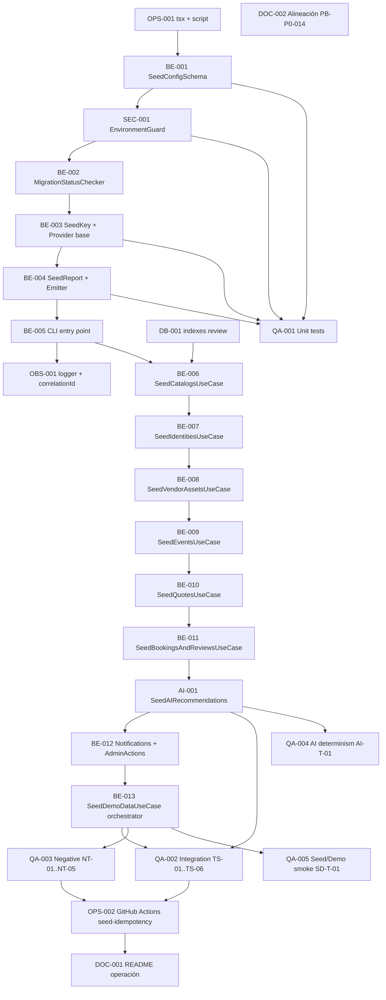

# Development Tasks — PB-P0-014 / US-085: Ejecutar `npm run seed` reproducible e idempotente

## 1. Metadata

| Field                                | Value                                                                                              |
| ------------------------------------ | -------------------------------------------------------------------------------------------------- |
| User Story ID                        | US-085                                                                                             |
| Source User Story                    | `management/user-stories/US-085-run-seed-script.md`                                                |
| Source Technical Specification       | `management/technical-specs/P0/PB-P0-014/US-085-technical-spec.md`                                 |
| Decision Resolution Artifact         | `management/user-stories/decision-resolutions/US-085-decision-resolution.md` (no existe)           |
| Priority                             | P0                                                                                                 |
| Backlog ID                           | PB-P0-014                                                                                          |
| Backlog Title                        | Seed reproducible con organizadores, vendors, eventos, quotes, booking y reseñas                   |
| Backlog Execution Order              | 14 (de 18 items P0)                                                                                |
| User Story Position in Backlog Item  | 1 de 4                                                                                             |
| Related User Stories in Backlog Item | US-085 (CLI runner), US-086 (admin reset endpoint), US-087 (seed event mix), US-088 (seed `confirmed_intent`) |
| Epic                                 | EPIC-SEED-001 — Seed Data & Demo Scenarios                                                         |
| Backlog Item Dependencies            | PB-P0-001 (Database Schema, Migrations & Constraints)                                              |
| Feature                              | Seed reproducible (CLI runner)                                                                     |
| Module / Domain                      | `seed-demo` (Backend, transversal — Doc 14 §10.16)                                                  |
| Backlog Alignment Status             | Found                                                                                              |
| Task Breakdown Status                | Ready for Sprint Planning                                                                          |
| Created Date                         | 2026-06-22                                                                                         |
| Last Updated                         | 2026-06-22                                                                                         |

---

## 2. Source Validation

| Source                       | Found | Used | Notes                                                                                 |
| ---------------------------- | ----- | ---- | ------------------------------------------------------------------------------------- |
| User Story                   | Yes   | Yes  | Refinada y aprobada (2026-06-22).                                                     |
| Technical Specification      | Yes   | Yes  | `Ready for Task Breakdown` con 1 alineación documental no bloqueante.                |
| Decision Resolution Artifact | No    | No   | No requerida; decisiones derivables de FR-SEED/BR-SEED/NFR-DEMO/Doc 11/Doc 14 §10.16. |
| Product Backlog Prioritized  | Yes   | Yes  | PB-P0-014, posición 14 dentro de P0.                                                  |
| ADRs                         | Yes   | Yes  | ADR-DEVOPS-003, ADR-DEVOPS-004, ADR-DEVOPS-006.                                       |

---

## 3. Backlog Execution Context

### Parent Backlog Item

**PB-P0-014 — Seed Script Idempotente + Datos Demo** define el comando único `npm run seed` idempotente, los volúmenes mínimos BR-SEED-002, la marca `is_seed=true`, la coherencia LATAM y la Acceptance Summary (doble ejecución sin duplicados, cobertura de estados, ≥1 `confirmed_intent`, ≥1 reseña verificada). Dependencia explícita: PB-P0-001. Trazabilidad: Doc 11 · BR-SEED-001..009 · ADR-DEVOPS-*.

### Execution Order Rationale

Ejecutar US-085 antes que sus US hermanas porque:

* Provee el runner CLI y los hooks de extensión por dominio que US-087 (event mix) y US-088 (`confirmed_intent`) requieren.
* Depende de PB-P0-001 (schema/migraciones) y de PB-P0-009/010/011 (`MockAIProvider`, `PromptRegistry`, validación JSON), todos previos.
* Habilita la suite E2E sobre seed (PB-P2-016) y el smoke de UC-DEMO-001.

### Related User Stories in Same Backlog Item

| User Story | Role in Backlog Item                                                | Suggested Order |
| ---------- | ------------------------------------------------------------------- | --------------- |
| US-085     | CLI runner `npm run seed` (idempotencia, `SeedReport`, gating env)  | 1               |
| US-087     | Cobertura de event mix `draft/active/completed` en el seed          | 2               |
| US-088     | Garantía de `≥1 BookingIntent.confirmed_intent` + reseña verificada | 3               |
| US-086     | Admin reset demo (endpoint HTTP `SeedDemoController`)               | 4               |

---

## 4. Task Breakdown Summary

| Area                         | Number of Tasks | Notes                                                                                  |
| ---------------------------- | --------------: | -------------------------------------------------------------------------------------- |
| Product / Analysis           |               0 | No aplica — decisiones derivadas de documentación aprobada.                            |
| Backend                      |              12 | Use case orchestrator + 8 seed use cases + foundation (config, key, report, CLI).      |
| Frontend                     |               0 | No aplica.                                                                             |
| API Contract                 |               0 | No aplica — entrega CLI; el endpoint admin pertenece a US-086.                          |
| Database / Prisma            |               1 | Verificación de índices `is_seed` y `seedKey` (sin schema changes).                    |
| AI / PromptOps               |               1 | `SeedAIRecommendationsUseCase` con `MockAIProvider`.                                   |
| Security / Authorization     |               1 | `EnvironmentGuard` (`NODE_ENV` + `SEED_DEMO_ENABLED`).                                 |
| QA / Testing                 |               5 | Unit, integration, negative, AI determinism, seed/demo smoke.                          |
| Seed / Demo Data             |               0 | Cubierto por las tareas BE-006..BE-012 que entregan datasets seed.                     |
| DevOps / Environment         |               2 | `tsx` + script `package.json`; job CI `seed-idempotency`.                              |
| Observability / Audit        |               1 | Logger estructurado + propagación de `correlationId`.                                  |
| Documentation / Traceability |               2 | README de operación + alineación documental PB-P0-014 (`BR-SEED-010` inexistente).     |
| **Total**                    |          **25** |                                                                                        |

---

## 5. Traceability Matrix

| Acceptance Criterion                                       | Technical Spec Section                                              | Task IDs                                                                                                                                                                                                                              |
| ---------------------------------------------------------- | ------------------------------------------------------------------- | ------------------------------------------------------------------------------------------------------------------------------------------------------------------------------------------------------------------------------------- |
| AC-01 (Ejecución idempotente desde estado limpio)          | §3, §6 AC-01, §7 Use Cases, §10 Seed Impact, §13 TS-01               | TASK-PB-P0-014-US-085-OPS-001, BE-001, BE-005, BE-006..BE-012, BE-013, QA-002                                                                                                                                                          |
| AC-02 (Re-ejecución idempotente sin duplicados)            | §6 AC-02, §7 Persistence, §10 Indexes, §13 TS-02                     | TASK-PB-P0-014-US-085-BE-003, BE-006..BE-013, DB-001, QA-002                                                                                                                                                                          |
| AC-03 (Marca `is_seed=true`)                               | §6 AC-03, §10 Fields, §13 TS-03                                      | TASK-PB-P0-014-US-085-BE-006..BE-012, DB-001, QA-002                                                                                                                                                                                  |
| AC-04 (Catálogos cerrados y coherencia LATAM)              | §6 AC-04, §7 SeedCatalogsUseCase, §13 TS-04                          | TASK-PB-P0-014-US-085-BE-006, QA-002                                                                                                                                                                                                  |
| AC-05 (Cobertura `AIRecommendation` determinista)          | §6 AC-05, §11 AI/PromptOps, §13 TS-06 + AI-T-01                      | TASK-PB-P0-014-US-085-AI-001, QA-002, QA-004                                                                                                                                                                                          |
| AC-06 (Reporte de ejecución estructurado)                  | §6 AC-06, §7 Observability, §13 TS-05, §14                           | TASK-PB-P0-014-US-085-BE-004, OBS-001, QA-002                                                                                                                                                                                         |
| EC-01 (Base de datos no disponible)                        | §6 EC-01, §7 Error Handling, §13 NT-03                               | TASK-PB-P0-014-US-085-BE-005, OBS-001, QA-003                                                                                                                                                                                         |
| EC-02 (Migraciones desactualizadas)                        | §6 EC-02, §7 Error Handling, §13 NT-04                               | TASK-PB-P0-014-US-085-BE-002, QA-003                                                                                                                                                                                                  |
| EC-03 (Flag ausente o entorno productivo)                  | §6 EC-03, §12 Security, §13 NT-01/NT-02                              | TASK-PB-P0-014-US-085-SEC-001, QA-001, QA-003                                                                                                                                                                                         |
| EC-04 (Falla parcial durante ejecución)                    | §6 EC-04, §7 Transactions, §13 TS coverage                            | TASK-PB-P0-014-US-085-BE-013, QA-002, QA-003                                                                                                                                                                                          |

Cobertura cruzada del Definition of Done (CI verde, README documentado, smoke E2E): TASK-PB-P0-014-US-085-OPS-002, DOC-001, QA-005.

---

## 6. Development Tasks

### TASK-PB-P0-014-US-085-OPS-001 — Configurar `tsx` y script `seed` en `apps/api/package.json`

| Field                     | Value                                                              |
| ------------------------- | ------------------------------------------------------------------ |
| Area                      | DevOps / Environment                                               |
| Type                      | Setup                                                              |
| Priority                  | Must                                                               |
| Estimate                  | XS                                                                 |
| Depends On                | —                                                                  |
| Source AC(s)              | AC-01                                                              |
| Technical Spec Section(s) | §4 In Scope, §18 Implementation Guidance                           |
| Backlog ID                | PB-P0-014                                                          |
| User Story ID             | US-085                                                             |
| Owner Role                | DevOps                                                             |
| Status                    | To Do                                                              |

#### Objective

Habilitar la ejecución del script CLI vía `npm run seed` con runtime TypeScript.

#### Scope

##### Include

* Agregar dependencia `tsx` (o equivalente runtime TS ya aprobado en el backend) como `devDependency`.
* Agregar el script `"seed": "tsx src/scripts/seed.ts"` en `apps/api/package.json`.

##### Exclude

* Migrar el resto de scripts del backend a `tsx`.
* Cambiar el runtime de producción del backend.

#### Implementation Notes

* Verificar que `tsx` ya esté disponible vía PB-P0-002; reutilizar si existe.
* Mantener el comando exactamente como `npm run seed` para alineación con PB-P0-014.

#### Acceptance Criteria Covered

AC-01.

#### Definition of Done

- [ ] `apps/api/package.json` incluye el script `"seed"`.
- [ ] `npm run seed --help` (o `--dry-run` cuando exista) ejecuta sin error de runtime.
- [ ] Cambio revisado por DevOps.

---

### TASK-PB-P0-014-US-085-BE-001 — Implementar `SeedConfigSchema` (Zod) para envs

| Field                     | Value                                                              |
| ------------------------- | ------------------------------------------------------------------ |
| Area                      | Backend                                                            |
| Type                      | Implementation                                                     |
| Priority                  | Must                                                               |
| Estimate                  | S                                                                  |
| Depends On                | TASK-PB-P0-014-US-085-OPS-001                                      |
| Source AC(s)              | AC-01, EC-03                                                       |
| Technical Spec Section(s) | §7 DTOs / Schemas, §12 Authorization                               |
| Backlog ID                | PB-P0-014                                                          |
| User Story ID             | US-085                                                             |
| Owner Role                | Backend                                                            |
| Status                    | To Do                                                              |

#### Objective

Validar las variables de entorno requeridas por el runner antes de iniciar Prisma.

#### Scope

##### Include

* `SeedConfigSchema` con `DATABASE_URL: z.string().url()`, `SEED_DEMO_ENABLED: z.literal('true')`, `LLM_PROVIDER: z.enum(['mock','openai','anthropic']).default('mock')`, `NODE_ENV: z.enum(['development','test','demo','staging','production'])`.
* Función `loadSeedConfig(env)` que retorna el objeto tipado o lanza `EnvironmentGuardError`.

##### Exclude

* Validaciones específicas de IA (cubiertas por AI-001).
* Persistencia de la config.

#### Implementation Notes

* Ubicación sugerida: `apps/api/src/modules/seed-demo/infrastructure/SeedConfigSchema.ts`.
* Mensajes de error deben citar la variable faltante.

#### Acceptance Criteria Covered

AC-01, EC-03.

#### Definition of Done

- [ ] `SeedConfigSchema` exporta el schema y el tipo inferido.
- [ ] Tests unitarios para valores válidos e inválidos por variable (cubiertos en QA-001).
- [ ] Sin lectura directa de `process.env` fuera del schema.

---

### TASK-PB-P0-014-US-085-SEC-001 — Implementar `EnvironmentGuard` para `NODE_ENV` + `SEED_DEMO_ENABLED`

| Field                     | Value                                                              |
| ------------------------- | ------------------------------------------------------------------ |
| Area                      | Security / Authorization                                           |
| Type                      | Implementation                                                     |
| Priority                  | Must                                                               |
| Estimate                  | S                                                                  |
| Depends On                | TASK-PB-P0-014-US-085-BE-001                                       |
| Source AC(s)              | EC-03                                                              |
| Technical Spec Section(s) | §12 Security & Authorization, §17 Risks                            |
| Backlog ID                | PB-P0-014                                                          |
| User Story ID             | US-085                                                             |
| Owner Role                | Backend                                                            |
| Status                    | To Do                                                              |

#### Objective

Bloquear la ejecución del script cuando el entorno no permite escritura seed.

#### Scope

##### Include

* Verificación: `NODE_ENV !== 'production'` AND `SEED_DEMO_ENABLED === 'true'`.
* Aborta con `process.exit(2)` y mensaje específico antes de inicializar Prisma.

##### Exclude

* Cualquier verificación de roles HTTP.
* Cambios al sistema de configuración runtime del backend.

#### Implementation Notes

* Ubicación: `apps/api/src/modules/seed-demo/infrastructure/EnvironmentGuard.ts`.
* Mensaje exacto: `"Seed disabled for current environment"` cuando `NODE_ENV=production`; `"Seed disabled (SEED_DEMO_ENABLED!=true)"` cuando el flag falta.

#### Acceptance Criteria Covered

EC-03.

#### Definition of Done

- [ ] `EnvironmentGuard` cubre la matriz `NODE_ENV × SEED_DEMO_ENABLED`.
- [ ] Ningún acceso a Prisma ocurre antes del guard.
- [ ] Tests unitarios cubren todos los casos (QA-001).

---

### TASK-PB-P0-014-US-085-BE-002 — Implementar `MigrationStatusChecker`

| Field                     | Value                                                              |
| ------------------------- | ------------------------------------------------------------------ |
| Area                      | Backend                                                            |
| Type                      | Implementation                                                     |
| Priority                  | Must                                                               |
| Estimate                  | S                                                                  |
| Depends On                | TASK-PB-P0-014-US-085-SEC-001                                      |
| Source AC(s)              | EC-02                                                              |
| Technical Spec Section(s) | §7 Error Handling, §10 Migrations Impact                           |
| Backlog ID                | PB-P0-014                                                          |
| User Story ID             | US-085                                                             |
| Owner Role                | Backend                                                            |
| Status                    | To Do                                                              |

#### Objective

Detectar drift entre el schema Prisma y la base de datos antes de sembrar.

#### Scope

##### Include

* Ejecutar `prisma migrate status --json` (o `prisma migrate diff`) y parsear el resultado.
* Abortar con `process.exit(2)` y mensaje accionable cuando hay drift.

##### Exclude

* Aplicar migraciones (responsabilidad de US-100).

#### Implementation Notes

* Ubicación: `apps/api/src/modules/seed-demo/infrastructure/MigrationStatusChecker.ts`.
* Mensaje: `"Run prisma migrate deploy before seeding"`.

#### Acceptance Criteria Covered

EC-02.

#### Definition of Done

- [ ] Drift detectado correctamente en CI con base efímera.
- [ ] El runner no escribe cuando el checker reporta drift.

---

### TASK-PB-P0-014-US-085-BE-003 — Implementar `SeedKey` (value object) y `SeedDataProvider` base

| Field                     | Value                                                              |
| ------------------------- | ------------------------------------------------------------------ |
| Area                      | Backend                                                            |
| Type                      | Implementation                                                     |
| Priority                  | Must                                                               |
| Estimate                  | S                                                                  |
| Depends On                | TASK-PB-P0-014-US-085-BE-002                                       |
| Source AC(s)              | AC-02, AC-03                                                       |
| Technical Spec Section(s) | §7 DTOs / Schemas, §7 Repository / Persistence                     |
| Backlog ID                | PB-P0-014                                                          |
| User Story ID             | US-085                                                             |
| Owner Role                | Backend                                                            |
| Status                    | To Do                                                              |

#### Objective

Proveer una clave estable y determinista por dominio para `upsert` idempotente.

#### Scope

##### Include

* Tipo `SeedKey = ${'category'|'vendor'|'event'|...}:${string}`.
* Builder por dominio con semilla fija (no `Math.random`, no `Date.now`).
* Interfaz `SeedDataProvider<T>` con `list(): T[]` consumida por los `Seed*UseCase`.

##### Exclude

* Datos LATAM concretos (entregados en BE-006..BE-012).

#### Implementation Notes

* Ubicación: `apps/api/src/modules/seed-demo/domain/SeedKey.ts`.
* Cubierto por test unitario en QA-001 (determinismo).

#### Acceptance Criteria Covered

AC-02, AC-03.

#### Definition of Done

- [ ] `SeedKey` y `SeedDataProvider` exportados desde el módulo `seed-demo`.
- [ ] Test unitario verifica determinismo por dominio.

---

### TASK-PB-P0-014-US-085-BE-004 — Implementar `SeedReport` + `SeedReportEmitter`

| Field                     | Value                                                              |
| ------------------------- | ------------------------------------------------------------------ |
| Area                      | Backend                                                            |
| Type                      | Implementation                                                     |
| Priority                  | Must                                                               |
| Estimate                  | S                                                                  |
| Depends On                | TASK-PB-P0-014-US-085-BE-003                                       |
| Source AC(s)              | AC-06                                                              |
| Technical Spec Section(s) | §7 Observability, §14 Observability                                |
| Backlog ID                | PB-P0-014                                                          |
| User Story ID             | US-085                                                             |
| Owner Role                | Backend                                                            |
| Status                    | To Do                                                              |

#### Objective

Producir un reporte estructurado por ejecución con `correlationId`, conteos y duración.

#### Scope

##### Include

* Tipo `SeedReport` (ver §7 del Tech Spec).
* `SeedReportEmitter` que escribe a stdout: tabla markdown legible + línea NDJSON para parseo en CI.

##### Exclude

* Persistencia del reporte en base de datos.
* Publicación a métricas Prometheus.

#### Implementation Notes

* Ubicación: `apps/api/src/modules/seed-demo/domain/SeedReport.ts` y `infrastructure/SeedReportEmitter.ts`.
* `correlationId` generado con UUIDv4.

#### Acceptance Criteria Covered

AC-06.

#### Definition of Done

- [ ] Emisor escribe ambas representaciones (tabla + NDJSON).
- [ ] Test unitario sobre agregación de conteos (QA-001).

---

### TASK-PB-P0-014-US-085-BE-005 — Implementar entry point CLI `apps/api/src/scripts/seed.ts`

| Field                     | Value                                                              |
| ------------------------- | ------------------------------------------------------------------ |
| Area                      | Backend                                                            |
| Type                      | Implementation                                                     |
| Priority                  | Must                                                               |
| Estimate                  | M                                                                  |
| Depends On                | TASK-PB-P0-014-US-085-BE-004                                       |
| Source AC(s)              | AC-01, AC-06, EC-01                                                |
| Technical Spec Section(s) | §3 Executive, §5 Backend, §7 Use Cases                             |
| Backlog ID                | PB-P0-014                                                          |
| User Story ID             | US-085                                                             |
| Owner Role                | Backend                                                            |
| Status                    | To Do                                                              |

#### Objective

Orquestar el pipeline `loadConfig → assertEnvSafety → assertSchemaUpToDate → runSeed → emitReport → process.exit`.

#### Scope

##### Include

* Inicialización mínima del contexto (Prisma client, logger, providers de seed).
* Captura de errores y mapeo a `exit codes` (`0` éxito, `1` error de ejecución, `2` precondición).
* Generación del `correlationId` y propagación al logger y al `SeedReport`.

##### Exclude

* Lógica de dominio por seed (cubierta por BE-006..BE-012).
* Endpoints HTTP.

#### Implementation Notes

* Ubicación: `apps/api/src/scripts/seed.ts`.
* Tras `SeedDemoDataUseCase` se invoca `SeedReportEmitter` y luego `process.exit(report.exitCode)`.

#### Acceptance Criteria Covered

AC-01, AC-06, EC-01.

#### Definition of Done

- [ ] `npm run seed` ejecuta el pipeline completo.
- [ ] Errores no controlados terminan con `exit code 1` y log estructurado.
- [ ] DB inaccesible produce `exit code 1` sin escritura (cubierto por QA-003).

---

### TASK-PB-P0-014-US-085-BE-006 — Implementar `SeedCatalogsUseCase`

| Field                     | Value                                                              |
| ------------------------- | ------------------------------------------------------------------ |
| Area                      | Backend                                                            |
| Type                      | Implementation                                                     |
| Priority                  | Must                                                               |
| Estimate                  | M                                                                  |
| Depends On                | TASK-PB-P0-014-US-085-BE-005, TASK-PB-P0-014-US-085-DB-001         |
| Source AC(s)              | AC-04                                                              |
| Technical Spec Section(s) | §7 Use Cases (Catalogs), §10 Models Impacted, §15 Seed Data        |
| Backlog ID                | PB-P0-014                                                          |
| User Story ID             | US-085                                                             |
| Owner Role                | Backend                                                            |
| Status                    | To Do                                                              |

#### Objective

Sembrar catálogos cerrados: `EventType` (6), `ServiceCategory` (10–15 con jerarquía ≤ 2 niveles), `Language` (`es-LATAM`, `es-ES`, `pt`, `en`), `Currency` (`GTQ`, `USD`, `EUR`, `MXN`, `COP`).

#### Scope

##### Include

* Datos LATAM por categoría (Doc 11 §6).
* `upsert` por `seedKey` (code/slug).
* `is_seed=true` en todas las filas.

##### Exclude

* Eventos, vendors, quotes.

#### Implementation Notes

* Ubicación: `apps/api/src/modules/seed-demo/application/use-cases/SeedCatalogsUseCase.ts` + datasets bajo `infrastructure/data/`.

#### Acceptance Criteria Covered

AC-04, AC-03.

#### Definition of Done

- [ ] Exactamente 6 `EventType` MVP presentes.
- [ ] 10–15 `ServiceCategory` con jerarquía ≤ 2 niveles.
- [ ] Catálogos `Language` y `Currency` activos.
- [ ] Test integración cubre (QA-002).

---

### TASK-PB-P0-014-US-085-BE-007 — Implementar `SeedIdentitiesUseCase`

| Field                     | Value                                                              |
| ------------------------- | ------------------------------------------------------------------ |
| Area                      | Backend                                                            |
| Type                      | Implementation                                                     |
| Priority                  | Must                                                               |
| Estimate                  | M                                                                  |
| Depends On                | TASK-PB-P0-014-US-085-BE-006                                       |
| Source AC(s)              | AC-01, AC-03                                                       |
| Technical Spec Section(s) | §7 Use Cases (Identities), §15 Seed Data                            |
| Backlog ID                | PB-P0-014                                                          |
| User Story ID             | US-085                                                             |
| Owner Role                | Backend                                                            |
| Status                    | To Do                                                              |

#### Objective

Sembrar 1 admin (Product Owner), 5–10 organizadores, 10–20 vendors (estados `active` y `suspended`).

#### Scope

##### Include

* `User`, `OrganizerProfile`, `VendorProfile` (incluye estados `approved`, `pending`, `rejected`, `hidden` para perfiles per Doc 11 §6).
* `upsert` por `email` o equivalente.
* `is_seed=true` en todas las filas.

##### Exclude

* Suscripciones de proveedor (BR-VENDOR-007).
* KYC automático (BR-OOS).

#### Implementation Notes

* Coherencia con BR-AUTH-002, FR-AUTH-007, NFR-DEMO-001.
* Datos LATAM sin PII real.

#### Acceptance Criteria Covered

AC-01, AC-03.

#### Definition of Done

- [ ] Volúmenes BR-SEED-002 cumplidos para identidades.
- [ ] Admin único corresponde al Product Owner.
- [ ] Test integración cubre (QA-002).

---

### TASK-PB-P0-014-US-085-BE-008 — Implementar `SeedVendorAssetsUseCase`

| Field                     | Value                                                              |
| ------------------------- | ------------------------------------------------------------------ |
| Area                      | Backend                                                            |
| Type                      | Implementation                                                     |
| Priority                  | Must                                                               |
| Estimate                  | M                                                                  |
| Depends On                | TASK-PB-P0-014-US-085-BE-007                                       |
| Source AC(s)              | AC-01, AC-03                                                       |
| Technical Spec Section(s) | §7 Use Cases (VendorAssets), §15 Seed Data                          |
| Backlog ID                | PB-P0-014                                                          |
| User Story ID             | US-085                                                             |
| Owner Role                | Backend                                                            |
| Status                    | To Do                                                              |

#### Objective

Sembrar `VendorService`, `Portfolio` (≤10 imágenes por trabajo) y `Attachment` con soft delete.

#### Scope

##### Include

* Catálogo de servicios por categoría (BR-SERVICE-001).
* Portafolio con hasta 10 imágenes (Doc 8.1 §2 #2).
* Attachments con soft delete (Doc 8.1 §6 #19).
* `is_seed=true` en todas las filas.

##### Exclude

* Reseñas y bookings (cubiertos por BE-011).

#### Implementation Notes

* Reutilizar repositorios del bounded context `vendor-management`.

#### Acceptance Criteria Covered

AC-01, AC-03.

#### Definition of Done

- [ ] Servicios y portafolios coherentes con vendors activos.
- [ ] Test integración cubre (QA-002).

---

### TASK-PB-P0-014-US-085-BE-009 — Implementar `SeedEventsUseCase` (base + hook para US-087)

| Field                     | Value                                                              |
| ------------------------- | ------------------------------------------------------------------ |
| Area                      | Backend                                                            |
| Type                      | Implementation                                                     |
| Priority                  | Must                                                               |
| Estimate                  | M                                                                  |
| Depends On                | TASK-PB-P0-014-US-085-BE-008                                       |
| Source AC(s)              | AC-01, AC-03                                                       |
| Technical Spec Section(s) | §7 Use Cases (Events), §18 Out of scope (mix delegado)             |
| Backlog ID                | PB-P0-014                                                          |
| User Story ID             | US-085                                                             |
| Owner Role                | Backend                                                            |
| Status                    | To Do                                                              |

#### Objective

Sembrar 10–15 eventos base con moneda local y USD y cobertura multi-idioma. Exponer hook documentado para que US-087 garantice la distribución exacta del mix de estados.

#### Scope

##### Include

* `Event` con campos base (currency inmutable per BR-EVENT-007).
* Multi-idioma (`es-LATAM`, `es-ES`, `pt`, `en`).
* Hook `EventMixExtensionPoint` documentado en el use case.
* `is_seed=true` en todas las filas.

##### Exclude

* Distribución dura `3/5/3` por estado (US-087).
* `EventTask` y `Budget` (cubiertos en BE-009 derivados, o en use cases dedicados).

#### Implementation Notes

* Ubicación: `apps/api/src/modules/seed-demo/application/use-cases/SeedEventsUseCase.ts`.
* Incluir `EventTask` (50–100) y `Budget`/`BudgetItem` (10–15 / 40–80) en sub-use cases si el alcance crece — split a `L` si excede.

#### Acceptance Criteria Covered

AC-01, AC-03.

#### Definition of Done

- [ ] 10–15 eventos base sembrados.
- [ ] Hook publicado y documentado en JSDoc del use case.
- [ ] Test integración cubre (QA-002).

---

### TASK-PB-P0-014-US-085-BE-010 — Implementar `SeedQuotesUseCase`

| Field                     | Value                                                              |
| ------------------------- | ------------------------------------------------------------------ |
| Area                      | Backend                                                            |
| Type                      | Implementation                                                     |
| Priority                  | Must                                                               |
| Estimate                  | M                                                                  |
| Depends On                | TASK-PB-P0-014-US-085-BE-009                                       |
| Source AC(s)              | AC-01, AC-03                                                       |
| Technical Spec Section(s) | §7 Use Cases (Quotes), §15 Seed Data                                |
| Backlog ID                | PB-P0-014                                                          |
| User Story ID             | US-085                                                             |
| Owner Role                | Backend                                                            |
| Status                    | To Do                                                              |

#### Objective

Sembrar 15–25 `QuoteRequest` y 10–20 `Quote` en estados del lifecycle.

#### Scope

##### Include

* Validity 15 días por defecto (Doc 8.1 §2 #4).
* Límite 5 activas por categoría por evento (Doc 8.1 §6).
* `is_seed=true`.

##### Exclude

* Bookings (cubierto por BE-011).

#### Implementation Notes

* Respetar invariantes BR-QUOTE-001..025.

#### Acceptance Criteria Covered

AC-01, AC-03.

#### Definition of Done

- [ ] Volúmenes BR-SEED-002 cumplidos.
- [ ] Test integración cubre (QA-002).

---

### TASK-PB-P0-014-US-085-BE-011 — Implementar `SeedBookingsAndReviewsUseCase` (base + hook para US-088)

| Field                     | Value                                                              |
| ------------------------- | ------------------------------------------------------------------ |
| Area                      | Backend                                                            |
| Type                      | Implementation                                                     |
| Priority                  | Must                                                               |
| Estimate                  | M                                                                  |
| Depends On                | TASK-PB-P0-014-US-085-BE-010                                       |
| Source AC(s)              | AC-01, AC-03                                                       |
| Technical Spec Section(s) | §7 Use Cases (Bookings/Reviews), §18 Hook for US-088                |
| Backlog ID                | PB-P0-014                                                          |
| User Story ID             | US-085                                                             |
| Owner Role                | Backend                                                            |
| Status                    | To Do                                                              |

#### Objective

Sembrar `BookingIntent` base y 20–40 reseñas (rating 1–5). Exponer hook `ConfirmedIntentExtensionPoint` para que US-088 garantice `≥1 confirmed_intent` y la reseña verificada vinculada.

#### Scope

##### Include

* `BookingIntent` con estados representativos.
* `Review` (`published`, `hidden`, `removed`) con soft delete (BR-REVIEW-005).
* `is_seed=true`.

##### Exclude

* Garantía dura de `≥1 confirmed_intent` (US-088).
* Pagos reales (BR-OOS-001).

#### Implementation Notes

* Hook documentado en JSDoc; firma `(tx, context) => Promise<void>`.

#### Acceptance Criteria Covered

AC-01, AC-03.

#### Definition of Done

- [ ] Volúmenes BR-SEED-002 cumplidos para reseñas.
- [ ] Hook publicado.
- [ ] Test integración cubre (QA-002).

---

### TASK-PB-P0-014-US-085-AI-001 — Implementar `SeedAIRecommendationsUseCase` con `MockAIProvider`

| Field                     | Value                                                              |
| ------------------------- | ------------------------------------------------------------------ |
| Area                      | AI / PromptOps                                                     |
| Type                      | Implementation                                                     |
| Priority                  | Must                                                               |
| Estimate                  | M                                                                  |
| Depends On                | TASK-PB-P0-014-US-085-BE-011                                       |
| Source AC(s)              | AC-05                                                              |
| Technical Spec Section(s) | §11 AI / PromptOps, §15 Seed Data                                  |
| Backlog ID                | PB-P0-014                                                          |
| User Story ID             | US-085                                                             |
| Owner Role                | AI                                                                 |
| Status                    | To Do                                                              |

#### Objective

Sembrar `AIRecommendation` deterministas para AI-001..AI-008 con `accepted=true`, `is_seed=true` y `prompt_version` declarado.

#### Scope

##### Include

* Invocaciones a `MockAIProvider` para cada feature AI-001..AI-008.
* Persistencia en `AIRecommendation` asociada a las entidades correspondientes (`Event`, `EventTask`, `Budget`, `VendorProfile`, etc.).
* Versionado vía `PromptRegistry` (PB-P0-010).

##### Exclude

* Invocaciones a `OpenAIProvider` o `AnthropicProvider` (stub).
* Generación de prompts nuevos.

#### Implementation Notes

* Validar el output JSON contra el schema de la feature (PB-P0-011) antes de persistir.

#### Acceptance Criteria Covered

AC-05.

#### Definition of Done

- [ ] 8 features cubiertas con al menos una `AIRecommendation` por entidad relevante.
- [ ] Determinismo verificado por hash sobre `output_json` (QA-004).
- [ ] Test integración cubre (QA-002, AI-T-01).

---

### TASK-PB-P0-014-US-085-BE-012 — Implementar `SeedNotificationsUseCase` + `SeedAdminActionsUseCase`

| Field                     | Value                                                              |
| ------------------------- | ------------------------------------------------------------------ |
| Area                      | Backend                                                            |
| Type                      | Implementation                                                     |
| Priority                  | Must                                                               |
| Estimate                  | S                                                                  |
| Depends On                | TASK-PB-P0-014-US-085-AI-001                                       |
| Source AC(s)              | AC-01, AC-03                                                       |
| Technical Spec Section(s) | §7 Use Cases (Notifications, AdminActions), §15 Seed Data           |
| Backlog ID                | PB-P0-014                                                          |
| User Story ID             | US-085                                                             |
| Owner Role                | Backend                                                            |
| Status                    | To Do                                                              |

#### Objective

Sembrar `Notification` in-app (15–30) y `AdminAction` representativos con `is_seed=true`.

#### Scope

##### Include

* Notifications cubriendo triggers de quote, booking, vendor, tareas (FR-NOTIF-001..006).
* AdminActions de aprobación, moderación, cambio de catálogo y `view_event`.

##### Exclude

* WhatsApp, SMS, push nativo (BR-OOS-004/006/017).
* `AdminAction` por la ejecución del CLI.

#### Implementation Notes

* Notifications respetan BR-NOTIF-001..007.

#### Acceptance Criteria Covered

AC-01, AC-03.

#### Definition of Done

- [ ] Cobertura mínima de tipos requerida por Doc 11 §6.
- [ ] Test integración cubre (QA-002).

---

### TASK-PB-P0-014-US-085-BE-013 — Implementar `SeedDemoDataUseCase` orquestador + transacciones por dominio

| Field                     | Value                                                              |
| ------------------------- | ------------------------------------------------------------------ |
| Area                      | Backend                                                            |
| Type                      | Implementation                                                     |
| Priority                  | Must                                                               |
| Estimate                  | M                                                                  |
| Depends On                | TASK-PB-P0-014-US-085-BE-012                                       |
| Source AC(s)              | AC-01, AC-02, AC-06, EC-04                                         |
| Technical Spec Section(s) | §3 Executive, §7 Use Cases / Transactions, §17 Risks                |
| Backlog ID                | PB-P0-014                                                          |
| User Story ID             | US-085                                                             |
| Owner Role                | Backend                                                            |
| Status                    | To Do                                                              |

#### Objective

Orquestar la ejecución por dominio con `prisma.$transaction`, acumular métricas en el `SeedReport` y propagar el `correlationId`.

#### Scope

##### Include

* Orden topológico de dominios (catálogos → identidades → vendor assets → eventos → quotes → bookings/reviews → AI recommendations → notifications/admin actions).
* `prisma.$transaction` por dominio (no global).
* Captura de `BatchExecutionError` y mapeo a `exit code 1` con dominio reportado.

##### Exclude

* Lógica específica de cada dominio (cubierta por BE-006..BE-012 y AI-001).

#### Implementation Notes

* Ubicación: `apps/api/src/modules/seed-demo/application/SeedDemoDataUseCase.ts`.

#### Acceptance Criteria Covered

AC-01, AC-02, AC-06, EC-04.

#### Definition of Done

- [ ] Orquestador invoca todos los use cases en orden topológico.
- [ ] Falla parcial revierte sólo el dominio afectado.
- [ ] `SeedReport` agrega métricas correctas por dominio.
- [ ] Test integración cubre (QA-002, QA-003 EC-04).

---

### TASK-PB-P0-014-US-085-DB-001 — Verificar índices `is_seed` + claves naturales (`seedKey`) en Prisma schema

| Field                     | Value                                                              |
| ------------------------- | ------------------------------------------------------------------ |
| Area                      | Database / Prisma                                                  |
| Type                      | Review                                                             |
| Priority                  | Must                                                               |
| Estimate                  | XS                                                                 |
| Depends On                | —                                                                  |
| Source AC(s)              | AC-02, AC-03                                                       |
| Technical Spec Section(s) | §10 Models / Fields / Indexes                                       |
| Backlog ID                | PB-P0-014                                                          |
| User Story ID             | US-085                                                             |
| Owner Role                | Backend                                                            |
| Status                    | To Do                                                              |

#### Objective

Confirmar que el schema Prisma vigente expone `is_seed` y claves naturales únicas usadas como `seedKey` para cada entidad sembrable. Documentar dependencias hacia US-099/US-100/US-101 cuando algún índice falte.

#### Scope

##### Include

* Inventario de modelos vs. índices/uniques requeridos.
* Issue/PR a US-101 cuando falte algún índice.

##### Exclude

* Cambios al schema (responsabilidad de US-099/US-100/US-101).

#### Implementation Notes

* Si el `seedKey` no tiene un `@unique` natural en algún modelo, abrir bloqueo hacia US-101 y documentar en `Documentation Alignment`.

#### Acceptance Criteria Covered

AC-02, AC-03.

#### Definition of Done

- [ ] Inventario aprobado por Tech Lead.
- [ ] Bloqueos abiertos hacia US-101 cuando aplique.

---

### TASK-PB-P0-014-US-085-OBS-001 — Configurar logger estructurado + `correlationId` para el CLI

| Field                     | Value                                                              |
| ------------------------- | ------------------------------------------------------------------ |
| Area                      | Observability / Audit                                              |
| Type                      | Implementation                                                     |
| Priority                  | Must                                                               |
| Estimate                  | S                                                                  |
| Depends On                | TASK-PB-P0-014-US-085-BE-005                                       |
| Source AC(s)              | AC-06, EC-01                                                       |
| Technical Spec Section(s) | §14 Observability, §17 Risks                                       |
| Backlog ID                | PB-P0-014                                                          |
| User Story ID             | US-085                                                             |
| Owner Role                | Backend                                                            |
| Status                    | To Do                                                              |

#### Objective

Reutilizar el logger estructurado del backend, propagar `correlationId` a cada log y al `SeedReport`, mascarar `DATABASE_URL`.

#### Scope

##### Include

* Logger Pino (o el aprobado en PB-P0-003).
* Niveles `info|debug|error` con campos `{ correlationId, domain, phase }`.
* Mascarado de `DATABASE_URL` en stdout/stderr.

##### Exclude

* Publicación de métricas Prometheus.

#### Implementation Notes

* `correlationId` generado en el entry point (BE-005) y propagado como dependencia inyectada.

#### Acceptance Criteria Covered

AC-06, EC-01.

#### Definition of Done

- [ ] Cobertura unitaria del mascarado.
- [ ] Logs visibles en `npm run seed` con `correlationId`.

---

### TASK-PB-P0-014-US-085-QA-001 — Tests unitarios de config, guard, key y emitter

| Field                     | Value                                                              |
| ------------------------- | ------------------------------------------------------------------ |
| Area                      | QA / Testing                                                       |
| Type                      | Test                                                               |
| Priority                  | Must                                                               |
| Estimate                  | S                                                                  |
| Depends On                | TASK-PB-P0-014-US-085-BE-001, SEC-001, BE-003, BE-004              |
| Source AC(s)              | AC-06, EC-03                                                       |
| Technical Spec Section(s) | §13 Unit Tests                                                     |
| Backlog ID                | PB-P0-014                                                          |
| User Story ID             | US-085                                                             |
| Owner Role                | QA                                                                 |
| Status                    | To Do                                                              |

#### Objective

Cubrir los building blocks con tests unitarios deterministas.

#### Scope

##### Include

* `SeedConfigSchema` (valores válidos e inválidos).
* `EnvironmentGuard` (matriz `NODE_ENV × SEED_DEMO_ENABLED`).
* `SeedKey` (determinismo por dominio).
* `SeedReportEmitter` (agregación de conteos y duración).

##### Exclude

* Integración con Prisma (cubierto por QA-002).

#### Implementation Notes

* Vitest; sin acceso a base de datos.

#### Acceptance Criteria Covered

AC-06, EC-03.

#### Definition of Done

- [ ] Cobertura ≥90% sobre los módulos listados.
- [ ] Tests verdes en CI.

---

### TASK-PB-P0-014-US-085-QA-002 — Integration tests TS-01..TS-06 sobre base efímera

| Field                     | Value                                                              |
| ------------------------- | ------------------------------------------------------------------ |
| Area                      | QA / Testing                                                       |
| Type                      | Test                                                               |
| Priority                  | Must                                                               |
| Estimate                  | M                                                                  |
| Depends On                | TASK-PB-P0-014-US-085-BE-013, AI-001                               |
| Source AC(s)              | AC-01, AC-02, AC-03, AC-04, AC-05, AC-06                           |
| Technical Spec Section(s) | §13 Integration Tests                                              |
| Backlog ID                | PB-P0-014                                                          |
| User Story ID             | US-085                                                             |
| Owner Role                | QA                                                                 |
| Status                    | To Do                                                              |

#### Objective

Verificar el runner end-to-end contra una base PostgreSQL real (service container o testcontainers).

#### Scope

##### Include

* TS-01: Ejecución desde DB limpia → volúmenes BR-SEED-002 y `exit code 0`.
* TS-02: Re-ejecución → `created=0` y conteos invariantes.
* TS-03: 100% de filas sembradas con `is_seed=true`.
* TS-04: Catálogos cerrados conformes.
* TS-05: `SeedReport` con `correlationId`, conteos y `durationMs`.
* TS-06: `AIRecommendation` deterministas (8 features).

##### Exclude

* Pruebas negativas (cubiertas por QA-003).

#### Implementation Notes

* Reutilizar el harness de integración del backend (US-089 / PB-P0-002).

#### Acceptance Criteria Covered

AC-01..AC-06.

#### Definition of Done

- [ ] Suite verde en CI sobre base efímera.
- [ ] Aserciones de volúmenes y `is_seed` documentadas.

---

### TASK-PB-P0-014-US-085-QA-003 — Negative tests NT-01..NT-05

| Field                     | Value                                                              |
| ------------------------- | ------------------------------------------------------------------ |
| Area                      | QA / Testing                                                       |
| Type                      | Test                                                               |
| Priority                  | Must                                                               |
| Estimate                  | S                                                                  |
| Depends On                | TASK-PB-P0-014-US-085-BE-013                                       |
| Source AC(s)              | EC-01, EC-02, EC-03, EC-04                                         |
| Technical Spec Section(s) | §13 Security Tests / Integration Tests                              |
| Backlog ID                | PB-P0-014                                                          |
| User Story ID             | US-085                                                             |
| Owner Role                | QA                                                                 |
| Status                    | To Do                                                              |

#### Objective

Asegurar el manejo correcto de envs faltantes, entorno productivo, DB inaccesible, migraciones desactualizadas y falla parcial.

#### Scope

##### Include

* NT-01: `SEED_DEMO_ENABLED` ausente/false → no escribe; `exit code 2`.
* NT-02: `NODE_ENV=production` → no escribe; `exit code 2`.
* NT-03: `DATABASE_URL` inválida → `exit code 1`; log estructurado con `error.code`.
* NT-04: Drift de migraciones → `exit code 2`.
* NT-05: Falla parcial → rollback de dominio + `exit code 1`.

##### Exclude

* Pruebas positivas (cubiertas por QA-002).

#### Implementation Notes

* Mocks/stubs según corresponda; `EC-04` simula `PrismaClientKnownRequestError` sintética.

#### Acceptance Criteria Covered

EC-01..EC-04.

#### Definition of Done

- [ ] Suite verde en CI.
- [ ] `DATABASE_URL` no aparece en logs (assertion explícita).

---

### TASK-PB-P0-014-US-085-QA-004 — AI determinism test AI-T-01

| Field                     | Value                                                              |
| ------------------------- | ------------------------------------------------------------------ |
| Area                      | QA / Testing                                                       |
| Type                      | Test                                                               |
| Priority                  | Must                                                               |
| Estimate                  | S                                                                  |
| Depends On                | TASK-PB-P0-014-US-085-AI-001                                       |
| Source AC(s)              | AC-05                                                              |
| Technical Spec Section(s) | §13 AI Tests                                                       |
| Backlog ID                | PB-P0-014                                                          |
| User Story ID             | US-085                                                             |
| Owner Role                | QA                                                                 |
| Status                    | To Do                                                              |

#### Objective

Asegurar el determinismo byte-a-byte de las `AIRecommendation` sembradas para AI-001..AI-008.

#### Scope

##### Include

* Hash sobre `output_json` entre dos ejecuciones consecutivas.

##### Exclude

* Verificación de contenidos pedagógicos.

#### Implementation Notes

* Comparar SHA-256 por `recommendation.id` semilla.

#### Acceptance Criteria Covered

AC-05.

#### Definition of Done

- [ ] Suite verde en CI.
- [ ] Hash documentado por feature.

---

### TASK-PB-P0-014-US-085-QA-005 — Seed/Demo smoke SD-T-01 (UC-DEMO-001)

| Field                     | Value                                                              |
| ------------------------- | ------------------------------------------------------------------ |
| Area                      | QA / Testing                                                       |
| Type                      | Test                                                               |
| Priority                  | Should                                                             |
| Estimate                  | S                                                                  |
| Depends On                | TASK-PB-P0-014-US-085-BE-013                                       |
| Source AC(s)              | AC-01                                                              |
| Technical Spec Section(s) | §13 Seed / Demo Tests                                              |
| Backlog ID                | PB-P0-014                                                          |
| User Story ID             | US-085                                                             |
| Owner Role                | QA                                                                 |
| Status                    | To Do                                                              |

#### Objective

Validar que tras `npm run seed` el backend soporta el smoke de UC-DEMO-001 sin intervención manual.

#### Scope

##### Include

* Smoke de endpoints clave (login admin/organizer/vendor, listado de eventos, comparación de quotes).

##### Exclude

* Verificación dura `≥1 confirmed_intent` + reseña verificada (delegada a US-088 / SD-T-02).

#### Implementation Notes

* Reutilizar Supertest cuando el backend esté disponible.

#### Acceptance Criteria Covered

AC-01.

#### Definition of Done

- [ ] Smoke verde en CI.

---

### TASK-PB-P0-014-US-085-OPS-002 — GitHub Actions job `seed-idempotency`

| Field                     | Value                                                              |
| ------------------------- | ------------------------------------------------------------------ |
| Area                      | DevOps / Environment                                               |
| Type                      | Setup                                                              |
| Priority                  | Must                                                               |
| Estimate                  | S                                                                  |
| Depends On                | TASK-PB-P0-014-US-085-QA-002, QA-003                               |
| Source AC(s)              | AC-01, AC-02                                                       |
| Technical Spec Section(s) | §13 CI Checks                                                      |
| Backlog ID                | PB-P0-014                                                          |
| User Story ID             | US-085                                                             |
| Owner Role                | DevOps                                                             |
| Status                    | To Do                                                              |

#### Objective

Garantizar la idempotencia del seed en CI sobre base PostgreSQL efímera.

#### Scope

##### Include

* Workflow `.github/workflows/seed-idempotency.yml` o integración al pipeline existente (PB-P0-017).
* Pasos: levantar Postgres, `prisma migrate deploy`, `npm run seed` × 2, aserciones sobre `SeedReport` (segunda corrida con `created=0`).

##### Exclude

* Despliegue a ambientes (responsabilidad de PB-P3-007/008).

#### Implementation Notes

* Reutilizar runners y caché del pipeline base (ADR-DEVOPS-006).

#### Acceptance Criteria Covered

AC-01, AC-02.

#### Definition of Done

- [ ] Job verde en `main` y en PRs.
- [ ] Fallos producen logs claros con `correlationId`.

---

### TASK-PB-P0-014-US-085-DOC-001 — README de operación del seed

| Field                     | Value                                                              |
| ------------------------- | ------------------------------------------------------------------ |
| Area                      | Documentation / Traceability                                       |
| Type                      | Documentation                                                      |
| Priority                  | Must                                                               |
| Estimate                  | XS                                                                 |
| Depends On                | TASK-PB-P0-014-US-085-OPS-002                                      |
| Source AC(s)              | AC-01, EC-03                                                       |
| Technical Spec Section(s) | §18 Implementation Guidance, §19 Documentation Tasks                |
| Backlog ID                | PB-P0-014                                                          |
| User Story ID             | US-085                                                             |
| Owner Role                | Tech Lead                                                          |
| Status                    | To Do                                                              |

#### Objective

Documentar el comando, las variables de entorno requeridas, los exit codes y los prerequisitos para correr el seed localmente y en CI.

#### Scope

##### Include

* Documento `docs/operations/seed.md` (o equivalente) con: requisitos, comando, envs (`SEED_DEMO_ENABLED`, `LLM_PROVIDER`, `DATABASE_URL`, `NODE_ENV`), exit codes, troubleshooting.

##### Exclude

* Documentación del endpoint admin (US-086).

#### Implementation Notes

* Linkear desde el README raíz y desde PB-P0-014 en el backlog.

#### Acceptance Criteria Covered

AC-01, EC-03.

#### Definition of Done

- [ ] Documento publicado.
- [ ] Link agregado al README del repositorio.

---

### TASK-PB-P0-014-US-085-DOC-002 — Alineación documental PB-P0-014 (`BR-SEED-010` inexistente)

| Field                     | Value                                                              |
| ------------------------- | ------------------------------------------------------------------ |
| Area                      | Documentation / Traceability                                       |
| Type                      | Documentation                                                      |
| Priority                  | Should                                                             |
| Estimate                  | XS                                                                 |
| Depends On                | —                                                                  |
| Source AC(s)              | —                                                                  |
| Technical Spec Section(s) | §16 Documentation Alignment Required                                |
| Backlog ID                | PB-P0-014                                                          |
| User Story ID             | US-085                                                             |
| Owner Role                | Tech Lead                                                          |
| Status                    | To Do                                                              |

#### Objective

Actualizar la `Traceability` del item PB-P0-014 en el Product Backlog Prioritized de `BR-SEED-001..010` a `BR-SEED-001..009` (Doc 4 sólo define hasta `BR-SEED-009`).

#### Scope

##### Include

* PR a `management/artifacts/4-Product-Backlog-Prioritized.md` corrigiendo el rango.

##### Exclude

* Cambios a Doc 4 (no es necesario agregar `BR-SEED-010`).

#### Implementation Notes

* No bloquea implementación; coordinación con PO.

#### Acceptance Criteria Covered

—

#### Definition of Done

- [ ] PR mergeado y revisado por PO.

---

## 7. Required QA Tasks

| Task ID                              | Test Type        | Purpose                                                              |
| ------------------------------------ | ---------------- | -------------------------------------------------------------------- |
| TASK-PB-P0-014-US-085-QA-001         | Unit             | Cubrir config, guard, key, report emitter.                           |
| TASK-PB-P0-014-US-085-QA-002         | Integration      | TS-01..TS-06 contra base efímera (volúmenes, idempotencia, `is_seed`).|
| TASK-PB-P0-014-US-085-QA-003         | Integration / Negative | NT-01..NT-05 (envs, drift, falla parcial).                      |
| TASK-PB-P0-014-US-085-QA-004         | AI Determinism   | AI-T-01: hash sobre `output_json`.                                   |
| TASK-PB-P0-014-US-085-QA-005         | Seed / Demo Smoke| SD-T-01: smoke de UC-DEMO-001.                                       |

---

## 8. Required Security Tasks

| Task ID                              | Security Concern                                | Purpose                                                                 |
| ------------------------------------ | ----------------------------------------------- | ----------------------------------------------------------------------- |
| TASK-PB-P0-014-US-085-SEC-001        | Gating por env (`NODE_ENV`, `SEED_DEMO_ENABLED`) | Bloquear escritura en entornos no permitidos antes de tocar Prisma.     |
| TASK-PB-P0-014-US-085-QA-003 (NT-04) | Mascarado de `DATABASE_URL`                     | Asegurar que credenciales no aparecen en logs.                          |

---

## 9. Required Seed / Demo Tasks

Las tareas seed/demo principales se cubren mediante las tareas Backend (`BE-006..BE-013`), AI (`AI-001`) y QA (`QA-002`, `QA-005`). No se requieren tareas SEED adicionales separadas porque esta US es exactamente el implementador del seed; la separación se realiza por dominios bajo el área `Backend` para mantener responsabilidades técnicas claras.

| Task ID                              | Seed/Demo Concern                              | Purpose                                                                 |
| ------------------------------------ | ---------------------------------------------- | ----------------------------------------------------------------------- |
| TASK-PB-P0-014-US-085-BE-006..BE-012 | Datasets por dominio (catalogs..notifications) | Cumplir volúmenes BR-SEED-002 con `is_seed=true` y coherencia LATAM.    |
| TASK-PB-P0-014-US-085-AI-001         | `AIRecommendation` deterministas               | Determinismo `MockAIProvider` (FR-SEED-006).                            |
| TASK-PB-P0-014-US-085-QA-002         | Verificación automatizada del seed             | Volúmenes, idempotencia, `is_seed=true`, catálogos cerrados.             |
| TASK-PB-P0-014-US-085-QA-005         | Smoke de UC-DEMO-001                           | Validar que el seed habilita la demo guiada.                            |

---

## 10. Observability / Audit Tasks

| Task ID                              | Concern                                | Purpose                                                                  |
| ------------------------------------ | -------------------------------------- | ------------------------------------------------------------------------ |
| TASK-PB-P0-014-US-085-OBS-001        | Logger estructurado + `correlationId`  | Trazabilidad por ejecución y mascarado de credenciales.                  |
| TASK-PB-P0-014-US-085-BE-004         | `SeedReport` estructurado               | Reporte legible + NDJSON para CI con conteos por dominio.                |

---

## 11. Documentation / Traceability Tasks

| Task ID                              | Document / Artifact                                       | Purpose                                                                |
| ------------------------------------ | --------------------------------------------------------- | ---------------------------------------------------------------------- |
| TASK-PB-P0-014-US-085-DOC-001        | `docs/operations/seed.md`                                  | Documentar comando, envs, exit codes y troubleshooting.                |
| TASK-PB-P0-014-US-085-DOC-002        | `management/artifacts/4-Product-Backlog-Prioritized.md`    | Corregir `Traceability` PB-P0-014 (`BR-SEED-010` no existe).            |

---

## 12. Dependency Graph

---

## 13. Suggested Implementation Order

### Phase 1 — Foundation

1. TASK-PB-P0-014-US-085-OPS-001 — `tsx` + script en `package.json`.
2. TASK-PB-P0-014-US-085-BE-001 — `SeedConfigSchema`.
3. TASK-PB-P0-014-US-085-SEC-001 — `EnvironmentGuard`.
4. TASK-PB-P0-014-US-085-BE-002 — `MigrationStatusChecker`.
5. TASK-PB-P0-014-US-085-BE-003 — `SeedKey` + provider base.
6. TASK-PB-P0-014-US-085-BE-004 — `SeedReport` + emitter.
7. TASK-PB-P0-014-US-085-BE-005 — CLI entry point.
8. TASK-PB-P0-014-US-085-OBS-001 — Logger + `correlationId`.
9. TASK-PB-P0-014-US-085-DB-001 — Inventario de índices `is_seed`/`seedKey`.

### Phase 2 — Core Implementation

10. TASK-PB-P0-014-US-085-BE-006 — `SeedCatalogsUseCase`.
11. TASK-PB-P0-014-US-085-BE-007 — `SeedIdentitiesUseCase`.
12. TASK-PB-P0-014-US-085-BE-008 — `SeedVendorAssetsUseCase`.
13. TASK-PB-P0-014-US-085-BE-009 — `SeedEventsUseCase` (base + hook US-087).
14. TASK-PB-P0-014-US-085-BE-010 — `SeedQuotesUseCase`.
15. TASK-PB-P0-014-US-085-BE-011 — `SeedBookingsAndReviewsUseCase` (base + hook US-088).
16. TASK-PB-P0-014-US-085-AI-001 — `SeedAIRecommendationsUseCase`.
17. TASK-PB-P0-014-US-085-BE-012 — `SeedNotificationsUseCase` + `SeedAdminActionsUseCase`.
18. TASK-PB-P0-014-US-085-BE-013 — `SeedDemoDataUseCase` orquestador + transacciones.

### Phase 3 — Validation / Security / QA

19. TASK-PB-P0-014-US-085-QA-001 — Unit tests.
20. TASK-PB-P0-014-US-085-QA-002 — Integration TS-01..TS-06.
21. TASK-PB-P0-014-US-085-QA-003 — Negative NT-01..NT-05.
22. TASK-PB-P0-014-US-085-QA-004 — AI determinism.
23. TASK-PB-P0-014-US-085-QA-005 — Seed/Demo smoke.
24. TASK-PB-P0-014-US-085-OPS-002 — Job CI `seed-idempotency`.

### Phase 4 — Documentation / Review

25. TASK-PB-P0-014-US-085-DOC-001 — README de operación.
26. TASK-PB-P0-014-US-085-DOC-002 — Alineación documental PB-P0-014.

---

## 14. Risks & Mitigations

| Risk                                                                                                        | Impact | Mitigation                                                                                                          | Related Task                                              |
| ----------------------------------------------------------------------------------------------------------- | ------ | ------------------------------------------------------------------------------------------------------------------- | --------------------------------------------------------- |
| `seedKey` ambiguo deriva en idempotencia inestable.                                                          | Alto   | Inventario de claves naturales únicas; tests TS-02.                                                                 | DB-001, BE-003, QA-002                                    |
| `MockAIProvider` no determinista por drift de prompt.                                                        | Alto   | Versionado `prompt_version` + hash AI-T-01.                                                                          | AI-001, QA-004                                            |
| Drift de migraciones entre dev/CI/demo.                                                                      | Medio  | `MigrationStatusChecker`; `exit code 2`.                                                                             | BE-002, QA-003                                            |
| Ejecución accidental en producción.                                                                          | Alto   | `EnvironmentGuard`; `exit code 2`.                                                                                  | SEC-001, QA-003                                           |
| Locks largos por una transacción global.                                                                     | Medio  | Transacciones por dominio.                                                                                          | BE-013                                                    |
| Inserción parcial deja la base inconsistente.                                                                | Medio  | Rollback por dominio + `SeedReport` con dominio fallido.                                                            | BE-013, QA-003                                            |
| Tiempo de seed excede el SLA de CI.                                                                          | Bajo   | Volúmenes mínimos BR-SEED-002; paralelización dentro de dominio cuando sea seguro.                                  | BE-013, OPS-002                                           |
| Acoplamiento con US-087/US-088 si no se publican hooks.                                                      | Medio  | Hooks documentados en `SeedEventsUseCase` y `SeedBookingsAndReviewsUseCase`.                                        | BE-009, BE-011                                            |
| `BR-SEED-010` referenciado pero inexistente.                                                                 | Bajo   | Documentation Alignment task.                                                                                       | DOC-002                                                   |

---

## 15. Out of Scope Confirmation

* Endpoint HTTP de reset demo (`POST /api/v1/admin/seed/run|reset`) → US-086.
* Distribución dura del event mix `draft/active/completed` (`3/5/3`) → US-087.
* Garantía dura de `≥1 BookingIntent.confirmed_intent` + reseña verificada vinculada → US-088.
* Aplicación de migraciones Prisma → US-100.
* `SeedResetJob` (job de fondo) → P3.
* Demo Script narrativo (PB-P3-002).
* Conversión real de moneda (BR-OOS-015).
* Pagos, contratos, WhatsApp, push nativo, RAG, multi-tenant enterprise (BR-OOS-001..017).
* Producción de `AdminAction` por la ejecución del CLI (sólo se sembran `AdminAction` históricos).

---

## 16. Readiness for Sprint Planning

| Check                                      | Status |
| ------------------------------------------ | ------ |
| Product Backlog mapping found              | Pass   |
| Every AC maps to tasks                     | Pass   |
| Technical Spec used when available         | Pass   |
| QA tasks included                          | Pass   |
| Security tasks included if applicable      | Pass   |
| Seed/demo tasks included if applicable     | Pass   |
| Observability tasks included if applicable | Pass   |
| Documentation tasks included if applicable | Pass   |
| Task dependencies clear                    | Pass   |
| Tasks small enough                         | Pass   |
| Ready for Sprint Planning                  | Yes    |

---

## 17. Final Recommendation

**Ready for Sprint Planning.**

Las 25 tareas cubren íntegramente las Acceptance Criteria de US-085, mapean a las secciones correspondientes de la Technical Specification y respetan el orden de ejecución del Product Backlog (PB-P0-014). Las dependencias hacia US-099/US-100/US-101 (schema/migrations/indexes), PB-P0-009/010/011 (LLMProvider + Prompt Registry + AI validation) y la separación contra US-086/087/088 están explícitamente documentadas. La única alineación documental pendiente (DOC-002) no es bloqueante.
