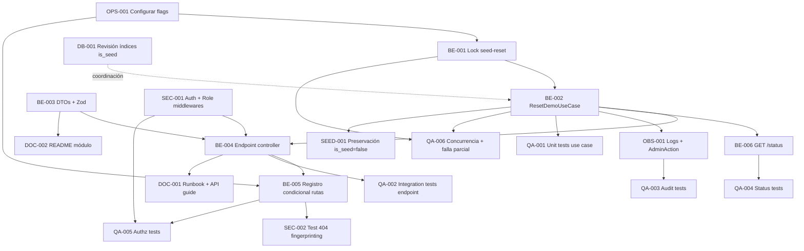

# Development Tasks — PB-P0-014 / US-086: Admin reset surgical del entorno Demo vía endpoint HTTP

## 1. Metadata

| Field | Value |
|---|---|
| User Story ID | US-086 |
| Source User Story | `management/user-stories/US-086-admin-reset-demo.md` |
| Source Technical Specification | `management/technical-specs/P0/PB-P0-014/US-086-technical-spec.md` |
| Decision Resolution Artifact | `management/user-stories/decision-resolutions/US-086-decision-resolution.md` (no existe) |
| Priority | P0 |
| Backlog ID | PB-P0-014 |
| Backlog Title | Seed Script Idempotente + Datos Demo |
| Backlog Execution Order | P0 #14 (foundation MVP) |
| User Story Position in Backlog Item | 2 de 4 (US-085 → **US-086** → US-087 → US-088) |
| Related User Stories in Backlog Item | US-085, US-086, US-087, US-088 |
| Epic | EPIC-SEED-001 — Seed Data & Demo Scenarios |
| Backlog Item Dependencies | PB-P0-001 (schema + migraciones), PB-P0-002 (backend bootstrap) |
| Feature | Reset surgical Demo (endpoint admin) |
| Module / Domain | `seed-demo` (Backend, transversal de escritura controlada) |
| Backlog Alignment Status | Found |
| Task Breakdown Status | Ready for Sprint Planning |
| Created Date | 2026-06-22 |
| Last Updated | 2026-06-22 |

---

## 2. Source Validation

| Source | Found | Used | Notes |
|---|---|---|---|
| User Story | Yes | Yes | `management/user-stories/US-086-admin-reset-demo.md` (Approved 2026-06-22) |
| Technical Specification | Yes | Yes | `management/technical-specs/P0/PB-P0-014/US-086-technical-spec.md` (Ready for Task Breakdown) |
| Decision Resolution Artifact | No | No | No requerido; decisiones derivables de Doc 11/14/16/19 y PB-P0-014 |
| Product Backlog Prioritized | Yes | Yes | PB-P0-014 lista US-086 como Related User Story |
| ADRs | Yes | Yes | ADR-DEVOPS-003/004/006 (App Runner, RDS, GitHub Actions) |

---

## 3. Backlog Execution Context

### Parent Backlog Item

PB-P0-014 (Seed Script Idempotente + Datos Demo) — entrega la base operativa de la demo académica y de la suite QA E2E del MVP. Compuesto por US-085 (CLI runner), **US-086** (endpoint HTTP reset), US-087 (event mix) y US-088 (`confirmed_intent` + reseña verificada). Dependencias: PB-P0-001 (schema Prisma + `is_seed`) y PB-P0-002 (backend bootstrap con middlewares de auth/rol).

### Execution Order Rationale

US-086 se ejecuta inmediatamente después de US-085 dentro de PB-P0-014, porque reusa `SeedDemoDataUseCase` (entregado por US-085) para el repoblado tras la limpieza surgical. US-087 y US-088 dependen del seed ya operativo (CLI + endpoint) para validar el contenido específico exigido por la demo.

### Related User Stories in Same Backlog Item

| User Story | Role in Backlog Item | Suggested Order |
|---|---|---|
| US-085 | CLI runner `npm run seed` (`SeedDemoDataUseCase`) | 1 |
| **US-086** | HTTP endpoint admin reset (`ResetDemoUseCase`) | 2 |
| US-087 | Event mix `draft/active/completed` | 3 |
| US-088 | `BookingIntent.confirmed_intent` + reseña verificada | 4 |

---

## 4. Task Breakdown Summary

| Area | Number of Tasks | Notes |
|---|---:|---|
| Backend (BE) | 6 | Lock, use case, DTOs/schema, controller, registro condicional, `GET /status` reflejando reset |
| Security / Authorization (SEC) | 2 | Middlewares + validaciones negativas; cobertura `404` ante flag off |
| Database / Prisma (DB) | 1 | Verificación de índices parciales sobre `is_seed` (coordina con US-101) |
| Observability / Audit (OBS) | 1 | Logs estructurados, correlation ID, `AdminAction` |
| QA / Testing (QA) | 6 | Unit, integration, API, autorización, concurrencia, falla parcial, surgical |
| Seed / Demo Data (SEED) | 1 | Preservación de `is_seed=false` |
| DevOps / Environment (OPS) | 1 | Configuración por entorno de `SEED_DEMO_ENABLED` y `SEED_BATCH_SIZE` |
| Documentation / Traceability (DOC) | 2 | Runbook de demo y README del módulo + contrato `ResetReportDto` |
| **Total** | **20** | — |

---

## 5. Traceability Matrix

| Acceptance Criterion | Technical Spec Section | Task IDs |
|---|---|---|
| AC-01 — Reset surgical exitoso `202` + `ResetReport` | §6 (AC-01), §7 (use case + controller), §9 (API), §10 (DB) | TASK-PB-P0-014-US-086-BE-001, BE-002, BE-003, BE-004, QA-001, QA-002 |
| AC-02 — Idempotencia ante invocaciones consecutivas | §6 (AC-02), §7 (transactions), §15 | TASK-PB-P0-014-US-086-BE-002, QA-002 |
| AC-03 — `AdminAction` registrado con `SEED_RESET` + correlationId | §6 (AC-03), §7 (observability), §12 (audit), §14 | TASK-PB-P0-014-US-086-BE-002, OBS-001, QA-003 |
| AC-04 — `GET /admin/seed/status` refleja `lastRunAt` y `recordCount` | §6 (AC-04), §7 (status), §9 (API) | TASK-PB-P0-014-US-086-BE-006, QA-004 |
| EC-01 — Flag `SEED_DEMO_ENABLED=false` → `404` | §6 (EC-01), §7 (bootstrap), §12 | TASK-PB-P0-014-US-086-BE-005, SEC-001, QA-005 |
| EC-02 — Falla parcial → `500` + rollback + `AdminAction` `SEED_RESET_FAILED` | §6 (EC-02), §7 (transactions, error handling), §14 | TASK-PB-P0-014-US-086-BE-002, OBS-001, QA-006 |
| EC-03 — Concurrencia → `409 seed_reset_in_progress` | §6 (EC-03), §7 (lock) | TASK-PB-P0-014-US-086-BE-001, BE-002, QA-006 |
| SEC-01..08 (Authz) | §12 (security), §13 (security tests) | TASK-PB-P0-014-US-086-SEC-001, SEC-002, QA-005 |
| Filtro surgical `is_seed=true` (SEC-04) | §7 (transactions), §15, §17 (risks) | TASK-PB-P0-014-US-086-BE-002, SEED-001, QA-002 |

---

## 6. Development Tasks

### TASK-PB-P0-014-US-086-OPS-001 — Configurar `SEED_DEMO_ENABLED` y `SEED_BATCH_SIZE` por entorno

| Field | Value |
|---|---|
| Area | DevOps / Environment |
| Type | Setup |
| Priority | Must |
| Estimate | XS |
| Depends On | PB-P0-002 |
| Source AC(s) | EC-01 |
| Technical Spec Section(s) | §5 (Architecture Alignment), §7 (Bootstrap), §17 (Risks) |
| Backlog ID | PB-P0-014 |
| User Story ID | US-086 |
| Owner Role | DevOps |
| Status | To Do |

#### Objective

Documentar y aplicar la configuración de variables de entorno necesarias para registrar condicionalmente el endpoint de reset.

#### Scope

##### Include

* `SEED_DEMO_ENABLED=true` en entornos `dev`, `qa`, `demo`.
* `SEED_DEMO_ENABLED=false` por defecto en `prod` (Doc 14 §15.2 SEED).
* `SEED_BATCH_SIZE` con default `1000`, override por entorno si necesario.
* Documentar en `.env.example` del backend.

##### Exclude

* Provisión de infraestructura en App Runner/RDS (ya cubierta por ADR-DEVOPS-003/004).
* Pipeline CI/CD (cubierta por ADR-DEVOPS-006).

#### Implementation Notes

* Las variables deben leerse al boot del módulo `seed-demo`; cambios en runtime no son soportados.

#### Acceptance Criteria Covered

* EC-01 (flag apagado → `404`).

#### Definition of Done

- [ ] `.env.example` actualizado con las dos variables.
- [ ] Documentación del runbook de demo menciona la configuración.
- [ ] Configuración aplicada por entorno (`dev`/`qa`/`demo`/`prod`).

---

### TASK-PB-P0-014-US-086-BE-001 — Implementar semáforo `seed-reset.lock` para concurrencia

| Field | Value |
|---|---|
| Area | Backend |
| Type | Implementation |
| Priority | Must |
| Estimate | S |
| Depends On | TASK-PB-P0-014-US-086-OPS-001 |
| Source AC(s) | EC-03 |
| Technical Spec Section(s) | §6 (EC-03), §7 (Use Cases), §17 (Risks) |
| Backlog ID | PB-P0-014 |
| User Story ID | US-086 |
| Owner Role | Backend |
| Status | To Do |

#### Objective

Proveer un mecanismo de exclusión mutua a nivel de aplicación para evitar dos resets concurrentes.

#### Scope

##### Include

* `seed-reset.lock.ts` con API `acquire()` / `release()` y manejo idempotente.
* Error tipado `ConflictError('seed_reset_in_progress')` cuando el lock está ocupado.

##### Exclude

* Lock distribuido (single-instance App Runner para MVP).
* Lock persistente en DB (no requerido en MVP).

#### Implementation Notes

* Semáforo in-memory (`Map<string, Promise<void>>` o `Mutex`) por proceso.
* Garantizar liberación con `try/finally`.

#### Acceptance Criteria Covered

* EC-03.

#### Definition of Done

- [ ] Tests unitarios verifican adquisición, liberación y conflicto.
- [ ] Lock liberado siempre, incluso en error.
- [ ] Code review aprobado.

---

### TASK-PB-P0-014-US-086-BE-002 — Implementar `ResetDemoUseCase` con limpieza surgical + repoblado

| Field | Value |
|---|---|
| Area | Backend |
| Type | Implementation |
| Priority | Must |
| Estimate | L |
| Depends On | TASK-PB-P0-014-US-086-BE-001, US-085 (`SeedDemoDataUseCase`), US-099/100 (`is_seed`) |
| Source AC(s) | AC-01, AC-02, AC-03, EC-02, EC-03 |
| Technical Spec Section(s) | §3, §6, §7 (Use Cases / Transactions / Error Handling), §10, §14 |
| Backlog ID | PB-P0-014 |
| User Story ID | US-086 |
| Owner Role | Backend |
| Status | To Do |

#### Objective

Crear el use case que orquesta la limpieza surgical (solo `is_seed=true`), invoca el repoblado idempotente y registra la auditoría obligatoria.

#### Scope

##### Include

* `ResetDemoCommand { actorAdminId, correlationId, reason? }` y `ResetReport` agregado.
* Adquisición/liberación del lock `seed-reset`.
* `prisma.$transaction` chunked por entidad, en orden FK descendente documentado en §7 del spec.
* Filtro obligatorio `WHERE is_seed = true` en todos los `deleteMany`.
* Invocación de `SeedDemoDataUseCase` para repoblar.
* Inserción de `AdminAction` con `action='SEED_RESET'` (éxito) o `action='SEED_RESET_FAILED'` (error).
* Manejo de errores tipados (`UnauthorizedError`, `ForbiddenError`, `ConflictError`, `InternalError`).

##### Exclude

* Cualquier delete sin `WHERE is_seed = true`.
* Snapshots/backups previos al reset.
* Reset parcial por entidad o por dominio.

#### Implementation Notes

* Orden de deletes documentado en §7 del Technical Spec; respetar grafo FK descendente.
* `SEED_BATCH_SIZE` (default `1000`) configurable vía env.
* `correlationId` se propaga al `AdminAction`, al `ResetReport` y a los logs.
* Reusar `AdminActionRepository` existente (Doc 14 §13).

#### Acceptance Criteria Covered

* AC-01, AC-02, AC-03, EC-02, EC-03.

#### Definition of Done

- [ ] `ResetDemoUseCase` implementado con tests unitarios (Vitest) en aislamiento de repos.
- [ ] Tests verifican filtro `WHERE is_seed = true` en todas las llamadas a repos.
- [ ] Tests verifican orden de deletes FK descendente.
- [ ] Tests verifican adquisición/liberación de lock en happy y error paths.
- [ ] `AdminAction` correctamente persistido para éxito y fallo.
- [ ] Code review aprobado.

---

### TASK-PB-P0-014-US-086-BE-003 — Definir DTO `ResetReport` y schema Zod `ResetRequestSchema`

| Field | Value |
|---|---|
| Area | Backend |
| Type | Implementation |
| Priority | Must |
| Estimate | XS |
| Depends On | — |
| Source AC(s) | AC-01, VR-01 |
| Technical Spec Section(s) | §7 (DTOs / Schemas), §9 (API Contract) |
| Backlog ID | PB-P0-014 |
| User Story ID | US-086 |
| Owner Role | Backend |
| Status | To Do |

#### Objective

Tipar el contrato request/response del endpoint y proveer validación Zod `strict()`.

#### Scope

##### Include

* `ResetRequestSchema` con `reason?: string(1..500)` y `.strict()`.
* `ResetReportDto` tipado en TypeScript.
* Tipo compartido en una capa exportable para reuso futuro (US-140).

##### Exclude

* Generación automática de OpenAPI (tarea separada del backlog).

#### Implementation Notes

* Mantener consistencia con el contrato documentado en Doc 16 §39.2.

#### Acceptance Criteria Covered

* AC-01, VR-01.

#### Definition of Done

- [ ] DTOs definidos y exportados.
- [ ] Tests verifican rechazo de campos desconocidos (Zod strict).
- [ ] Code review aprobado.

---

### TASK-PB-P0-014-US-086-BE-004 — Implementar `POST /api/v1/admin/seed/reset` en `SeedDemoController`

| Field | Value |
|---|---|
| Area | Backend |
| Type | Implementation |
| Priority | Must |
| Estimate | S |
| Depends On | TASK-PB-P0-014-US-086-BE-002, TASK-PB-P0-014-US-086-BE-003, TASK-PB-P0-014-US-086-SEC-001 |
| Source AC(s) | AC-01, AC-03 |
| Technical Spec Section(s) | §7 (Controllers / Routes), §9 (API), §12 |
| Backlog ID | PB-P0-014 |
| User Story ID | US-086 |
| Owner Role | Backend |
| Status | To Do |

#### Objective

Exponer el endpoint HTTP que invoca `ResetDemoUseCase` y mapea errores a códigos HTTP correctos.

#### Scope

##### Include

* Handler thin: `(req, res) => useCase.execute(command)`.
* Mapeo `202 Accepted` con `ResetReportDto`.
* Mapeo de errores a `400 / 401 / 403 / 409 / 500`.
* Propagación de `X-Correlation-Id` en la respuesta.

##### Exclude

* Lógica de negocio en el controller (debe vivir en el use case).

#### Implementation Notes

* Controller thin per Doc 14 §3.
* Reutilizar middlewares `correlationId`, `requireAuth`, `requireRole('admin')`, `validateBody`.

#### Acceptance Criteria Covered

* AC-01, AC-03.

#### Definition of Done

- [ ] Endpoint registrado bajo `/api/v1/admin/seed/reset`.
- [ ] Tests de integración verifican mapeo de cada código HTTP.
- [ ] Code review aprobado.

---

### TASK-PB-P0-014-US-086-BE-005 — Registro condicional de rutas `seed-demo` según `SEED_DEMO_ENABLED`

| Field | Value |
|---|---|
| Area | Backend |
| Type | Implementation |
| Priority | Must |
| Estimate | S |
| Depends On | TASK-PB-P0-014-US-086-OPS-001, TASK-PB-P0-014-US-086-BE-004 |
| Source AC(s) | EC-01 |
| Technical Spec Section(s) | §7 (Bootstrap), §12 (Security) |
| Backlog ID | PB-P0-014 |
| User Story ID | US-086 |
| Owner Role | Backend |
| Status | To Do |

#### Objective

Garantizar que las rutas `seed-demo` solo se registran cuando `SEED_DEMO_ENABLED=true`, para que Express responda `404` natural ante el flag apagado.

#### Scope

##### Include

* Lógica de bootstrap en `seed-demo.module.ts` que evalúa el flag al inicializar.
* Si el flag está apagado: no registrar `/admin/seed/*`.
* Tests de bootstrap que validan ambas configuraciones.

##### Exclude

* Evaluación dinámica del flag en runtime (no soportada en MVP).

#### Implementation Notes

* Mitigación de Doc 19 §THR-012 (fingerprinting).
* No usar `403` ni `503` para flag off — debe ser `404`.

#### Acceptance Criteria Covered

* EC-01.

#### Definition of Done

- [ ] Tests de bootstrap cubren ambos valores del flag.
- [ ] Verificado que con flag off el handler nunca se invoca.
- [ ] Code review aprobado.

---

### TASK-PB-P0-014-US-086-BE-006 — Actualizar `GET /api/v1/admin/seed/status` para reflejar último reset

| Field | Value |
|---|---|
| Area | Backend |
| Type | Implementation |
| Priority | Must |
| Estimate | S |
| Depends On | TASK-PB-P0-014-US-086-BE-002 |
| Source AC(s) | AC-04 |
| Technical Spec Section(s) | §6 (AC-04), §7, §9 (API) |
| Backlog ID | PB-P0-014 |
| User Story ID | US-086 |
| Owner Role | Backend |
| Status | To Do |

#### Objective

Asegurar que `GET /admin/seed/status` devuelva `lastRunAt` actualizado por el reset y `recordCount` por entidad consistente.

#### Scope

##### Include

* Lógica que deriva `lastRunAt` del último `AdminAction` con `action='SEED_RESET'`.
* `recordCount` calculado con `prisma.{entity}.count({ where: { is_seed: true }})`.
* DTO `SeedStatusResponseDto` (Doc 16 §39.3).

##### Exclude

* Cache de `recordCount`.

#### Implementation Notes

* Reusar el handler existente si ya provee `GET /status`; ajustarlo para reflejar el reset.

#### Acceptance Criteria Covered

* AC-04.

#### Definition of Done

- [ ] Tests de integración verifican `lastRunAt` y `recordCount` post-reset.
- [ ] Code review aprobado.

---

### TASK-PB-P0-014-US-086-SEC-001 — Aplicar `requireAuth` + `requireRole('admin')` al endpoint

| Field | Value |
|---|---|
| Area | Security / Authorization |
| Type | Implementation |
| Priority | Must |
| Estimate | XS |
| Depends On | PB-P0-002 (middlewares disponibles) |
| Source AC(s) | SEC-01, VR-03, VR-04 |
| Technical Spec Section(s) | §12 (Security), §7 |
| Backlog ID | PB-P0-014 |
| User Story ID | US-086 |
| Owner Role | Backend / Security |
| Status | To Do |

#### Objective

Garantizar que el endpoint queda protegido por autenticación JWT y por rol `admin`, devolviendo `401` y `403` correctamente.

#### Scope

##### Include

* Middlewares `requireAuth()` y `requireRole('admin')` aplicados a la ruta.
* Tests negativos `401` (sin token), `403` (organizer/vendor), `401` (token expirado).

##### Exclude

* Implementación de los middlewares (existen en PB-P0-002).

#### Implementation Notes

* No introducir excepciones para el rol admin más allá del rol válido.

#### Acceptance Criteria Covered

* SEC-01, VR-03, VR-04.

#### Definition of Done

- [ ] Tests cubren todos los escenarios negativos.
- [ ] Code review aprobado.

---

### TASK-PB-P0-014-US-086-SEC-002 — Verificar respuesta `404` ante flag off sin filtración de información

| Field | Value |
|---|---|
| Area | Security / Authorization |
| Type | Test |
| Priority | Must |
| Estimate | XS |
| Depends On | TASK-PB-P0-014-US-086-BE-005 |
| Source AC(s) | EC-01, SEC-02, SEC-03 |
| Technical Spec Section(s) | §12 (Security), §17 (Risks) |
| Backlog ID | PB-P0-014 |
| User Story ID | US-086 |
| Owner Role | Security / QA |
| Status | To Do |

#### Objective

Validar que con `SEED_DEMO_ENABLED=false` el endpoint responde `404` sin filtrar headers o cuerpos que revelen su existencia.

#### Scope

##### Include

* Test que invoca `POST /api/v1/admin/seed/reset` con flag off.
* Comparación con la respuesta `404` de una ruta inexistente cualquiera.
* Verificación de ausencia de headers `WWW-Authenticate` u otros indicadores.

##### Exclude

* Pen-testing exhaustivo.

#### Acceptance Criteria Covered

* EC-01, SEC-02, SEC-03.

#### Definition of Done

- [ ] Test verifica `404` idéntico al de cualquier ruta inexistente.
- [ ] Code review aprobado.

---

### TASK-PB-P0-014-US-086-DB-001 — Verificar índices parciales sobre `is_seed` en entidades sembradas

| Field | Value |
|---|---|
| Area | Database / Prisma |
| Type | Review |
| Priority | Should |
| Estimate | S |
| Depends On | US-099, US-100, US-101 |
| Source AC(s) | NFR-PERF-001 (no funcional) |
| Technical Spec Section(s) | §5 (Database), §10 (DB / Indexes), §17 (Risks) |
| Backlog ID | PB-P0-014 |
| User Story ID | US-086 |
| Owner Role | Backend / DBA |
| Status | To Do |

#### Objective

Confirmar que las entidades de alta cardinalidad tienen índices que aceleren los deletes filtrados por `is_seed=true`.

#### Scope

##### Include

* Revisión del schema Prisma generado por US-099/100.
* Coordinación con US-101 (índices) si falta cobertura.
* Documentar entidades cubiertas y entidades en seguimiento.

##### Exclude

* Creación de migraciones adicionales (responsabilidad de US-101).

#### Implementation Notes

* Entidades sugeridas con índice parcial: `Event`, `Quote`, `Review`, `BookingIntent`, `AIRecommendation`, `Notification`.

#### Acceptance Criteria Covered

* No mapea directamente a un AC pero soporta NFR-PERF-001.

#### Definition of Done

- [ ] Listado de entidades cubiertas / pendientes documentado.
- [ ] Acuerdo con responsable de US-101 sobre cobertura faltante.

---

### TASK-PB-P0-014-US-086-OBS-001 — Implementar logs estructurados, `correlationId` y métricas opcionales

| Field | Value |
|---|---|
| Area | Observability / Audit |
| Type | Implementation |
| Priority | Must |
| Estimate | S |
| Depends On | TASK-PB-P0-014-US-086-BE-002 |
| Source AC(s) | AC-03, EC-02 |
| Technical Spec Section(s) | §7 (Observability), §14 (Logs / AdminAction) |
| Backlog ID | PB-P0-014 |
| User Story ID | US-086 |
| Owner Role | Backend |
| Status | To Do |

#### Objective

Garantizar trazabilidad operativa del reset mediante logs estructurados, propagación de `correlationId` y `AdminAction` consistente.

#### Scope

##### Include

* Logs `seed.reset.started`, `seed.reset.completed`, `seed.reset.failed`, `seed.reset.conflict`.
* Propagación de `correlationId` desde middleware → use case → `AdminAction` → respuesta.
* Métricas opcionales `seed_reset_total{result}` y `seed_reset_duration_ms` (alineadas con NFR-OBS-006).

##### Exclude

* APM/Sentry enterprise (NFR-OBS-006).

#### Implementation Notes

* Sin secretos en logs (NFR-SEC-008).

#### Acceptance Criteria Covered

* AC-03, EC-02.

#### Definition of Done

- [ ] Logs estructurados emitidos en cada estado.
- [ ] `AdminAction` registrado con `correlation_id`.
- [ ] Code review aprobado.

---

### TASK-PB-P0-014-US-086-QA-001 — Tests unitarios de `ResetDemoUseCase`

| Field | Value |
|---|---|
| Area | QA / Testing |
| Type | Test |
| Priority | Must |
| Estimate | M |
| Depends On | TASK-PB-P0-014-US-086-BE-002 |
| Source AC(s) | AC-01, AC-02, AC-03, EC-02 |
| Technical Spec Section(s) | §13 (Unit Tests), §17 (Risks) |
| Backlog ID | PB-P0-014 |
| User Story ID | US-086 |
| Owner Role | QA / Backend |
| Status | To Do |

#### Objective

Cobertura unitaria del use case con repos mockeados.

#### Scope

##### Include

* Orden de deletes FK descendente.
* Filtro `WHERE is_seed = true` en cada llamada.
* Adquisición/liberación del lock en happy y error paths.
* `AdminAction` con `action` correcto según resultado.
* `correlationId` propagado al `AdminAction` y al `ResetReport`.

##### Exclude

* Integración con DB real (cubierta por QA-002).

#### Acceptance Criteria Covered

* AC-01, AC-02, AC-03, EC-02.

#### Definition of Done

- [ ] Cobertura mínima del use case ≥ 90%.
- [ ] Tests verdes en CI.

---

### TASK-PB-P0-014-US-086-QA-002 — Tests de integración del endpoint con DB efímera

| Field | Value |
|---|---|
| Area | QA / Testing |
| Type | Test |
| Priority | Must |
| Estimate | M |
| Depends On | TASK-PB-P0-014-US-086-BE-004, US-085 (seed runner) |
| Source AC(s) | AC-01, AC-02, SEC-04 |
| Technical Spec Section(s) | §13 (Integration Tests), §15 |
| Backlog ID | PB-P0-014 |
| User Story ID | US-086 |
| Owner Role | QA |
| Status | To Do |

#### Objective

Cubrir el flujo completo del endpoint contra una DB de test efímera con datos mixtos `is_seed=true` y `is_seed=false`.

#### Scope

##### Include

* TS-01 — Happy path con `ResetReport` consistente.
* TS-02 — Idempotencia (doble invocación → mismos conteos).
* TS-05 — Filas `is_seed=false` intactas (sub-test SD-T-02).

##### Exclude

* E2E desde frontend (no aplica).

#### Implementation Notes

* Usar Vitest + Supertest sobre Express + Prisma con DB efímera (PostgreSQL en contenedor o `pg-mem`).

#### Acceptance Criteria Covered

* AC-01, AC-02, SEC-04.

#### Definition of Done

- [ ] Tests verdes en CI.
- [ ] Cobertura de `ResetReport` por entidad afectada.

---

### TASK-PB-P0-014-US-086-QA-003 — Tests de auditoría `AdminAction`

| Field | Value |
|---|---|
| Area | QA / Testing |
| Type | Test |
| Priority | Must |
| Estimate | S |
| Depends On | TASK-PB-P0-014-US-086-OBS-001 |
| Source AC(s) | AC-03 |
| Technical Spec Section(s) | §13, §14 |
| Backlog ID | PB-P0-014 |
| User Story ID | US-086 |
| Owner Role | QA |
| Status | To Do |

#### Objective

Validar la persistencia y consistencia de `AdminAction` tras el reset.

#### Scope

##### Include

* TS-03 — Verifica `action='SEED_RESET'`, `correlation_id`, `admin_id`, `target_type='seed-demo'`.
* Verificación de `SEED_RESET_FAILED` en falla parcial.

##### Exclude

* Auditoría de acciones admin no relacionadas con seed.

#### Acceptance Criteria Covered

* AC-03, EC-02.

#### Definition of Done

- [ ] Tests verdes en CI.

---

### TASK-PB-P0-014-US-086-QA-004 — Tests de `GET /admin/seed/status` post-reset

| Field | Value |
|---|---|
| Area | QA / Testing |
| Type | Test |
| Priority | Must |
| Estimate | S |
| Depends On | TASK-PB-P0-014-US-086-BE-006 |
| Source AC(s) | AC-04 |
| Technical Spec Section(s) | §13 |
| Backlog ID | PB-P0-014 |
| User Story ID | US-086 |
| Owner Role | QA |
| Status | To Do |

#### Objective

Asegurar que el endpoint de status refleja `lastRunAt` y `recordCount` consistentes con el último reset.

#### Scope

##### Include

* TS-04 — `GET /admin/seed/status` tras reset retorna `200` con datos esperados.

##### Exclude

* Tests de status sin reset previo.

#### Acceptance Criteria Covered

* AC-04.

#### Definition of Done

- [ ] Tests verdes en CI.

---

### TASK-PB-P0-014-US-086-QA-005 — Tests de autorización (`401` / `403` / `404`)

| Field | Value |
|---|---|
| Area | QA / Testing |
| Type | Test |
| Priority | Must |
| Estimate | S |
| Depends On | TASK-PB-P0-014-US-086-SEC-001, TASK-PB-P0-014-US-086-BE-005 |
| Source AC(s) | SEC-01..05, EC-01 |
| Technical Spec Section(s) | §13 (API Tests / Security Tests) |
| Backlog ID | PB-P0-014 |
| User Story ID | US-086 |
| Owner Role | QA / Security |
| Status | To Do |

#### Objective

Cobertura completa de los escenarios negativos de autenticación, rol y flag operativo.

#### Scope

##### Include

* NT-01 — Sin token → `401`.
* NT-02 — Token organizer/vendor → `403`.
* NT-03 — `SEED_DEMO_ENABLED=false` → `404`.
* AUTH-TS-01..04 según US-086.

##### Exclude

* Pruebas con tokens manipulados (cubierto por suites de auth genéricas PB-P0-002).

#### Acceptance Criteria Covered

* SEC-01..05, EC-01.

#### Definition of Done

- [ ] Tests verdes en CI.
- [ ] Code review aprobado.

---

### TASK-PB-P0-014-US-086-QA-006 — Tests de concurrencia y falla parcial

| Field | Value |
|---|---|
| Area | QA / Testing |
| Type | Test |
| Priority | Must |
| Estimate | M |
| Depends On | TASK-PB-P0-014-US-086-BE-001, TASK-PB-P0-014-US-086-BE-002 |
| Source AC(s) | EC-02, EC-03 |
| Technical Spec Section(s) | §13, §17 (Risks) |
| Backlog ID | PB-P0-014 |
| User Story ID | US-086 |
| Owner Role | QA |
| Status | To Do |

#### Objective

Validar el manejo de concurrencia (`409`) y de falla parcial (`500` + rollback + `AdminAction` `SEED_RESET_FAILED`).

#### Scope

##### Include

* NT-05 — Falla parcial: inyectar error en un lote intermedio y verificar rollback + `AdminAction` `SEED_RESET_FAILED`.
* NT-06 — Concurrencia: dos invocaciones simultáneas → la segunda recibe `409 seed_reset_in_progress`.

##### Exclude

* Pruebas con cluster multi-instancia (no soportado en MVP single-instance).

#### Acceptance Criteria Covered

* EC-02, EC-03.

#### Definition of Done

- [ ] Tests verdes en CI.
- [ ] Documentación operativa actualizada con el comportamiento esperado.

---

### TASK-PB-P0-014-US-086-SEED-001 — Validar preservación de filas `is_seed=false` (SD-T-02)

| Field | Value |
|---|---|
| Area | Seed / Demo Data |
| Type | Test |
| Priority | Must |
| Estimate | S |
| Depends On | TASK-PB-P0-014-US-086-BE-002 |
| Source AC(s) | SEC-04 |
| Technical Spec Section(s) | §10 (Constraints), §13 (Seed/Demo Tests), §15, §17 (Risks) |
| Backlog ID | PB-P0-014 |
| User Story ID | US-086 |
| Owner Role | QA |
| Status | To Do |

#### Objective

Garantizar que el reset surgical nunca afecta datos operativos (`is_seed=false`).

#### Scope

##### Include

* Sembrar manualmente filas con `is_seed=false` antes del test.
* Invocar el endpoint y verificar que esas filas permanecen intactas.
* Validar conteos finales por entidad.

##### Exclude

* Validación de invariantes BR-SEED-002 sobre conteos seed (cubierta por US-085 / US-087 / US-088).

#### Acceptance Criteria Covered

* SEC-04.

#### Definition of Done

- [ ] Test verde en CI.
- [ ] Code review aprobado.

---

### TASK-PB-P0-014-US-086-DOC-001 — Documentar endpoint en runbook de demo y guía de API

| Field | Value |
|---|---|
| Area | Documentation / Traceability |
| Type | Documentation |
| Priority | Must |
| Estimate | S |
| Depends On | TASK-PB-P0-014-US-086-BE-004 |
| Source AC(s) | AC-01, EC-01 |
| Technical Spec Section(s) | §16, §19 (Required documentation tasks) |
| Backlog ID | PB-P0-014 |
| User Story ID | US-086 |
| Owner Role | Tech Lead / DevOps |
| Status | To Do |

#### Objective

Documentar el endpoint, el flag `SEED_DEMO_ENABLED`, el comportamiento `404` y el flujo operativo para evitar reportes falsos de bug.

#### Scope

##### Include

* Sección en el runbook de demo describiendo cómo invocar el endpoint (curl/Postman).
* Nota en la guía de API: `404` ante flag apagado.
* Mención de la dependencia con `SEED_DEMO_ENABLED`.

##### Exclude

* Generación automática de OpenAPI.

#### Acceptance Criteria Covered

* AC-01, EC-01.

#### Definition of Done

- [ ] Runbook actualizado.
- [ ] PR de documentación mergeado.

---

### TASK-PB-P0-014-US-086-DOC-002 — Actualizar README del módulo `seed-demo` con contrato `ResetReportDto`

| Field | Value |
|---|---|
| Area | Documentation / Traceability |
| Type | Documentation |
| Priority | Should |
| Estimate | XS |
| Depends On | TASK-PB-P0-014-US-086-BE-003 |
| Source AC(s) | AC-01 |
| Technical Spec Section(s) | §16, §19 |
| Backlog ID | PB-P0-014 |
| User Story ID | US-086 |
| Owner Role | Backend |
| Status | To Do |

#### Objective

Facilitar el consumo del contrato por la futura UI admin (PB-P3-001 / US-140) y por el harness QA E2E (PB-P2-016).

#### Scope

##### Include

* README del módulo con tabla de endpoints, DTOs y códigos HTTP.
* Mención al boundary con US-085, US-087, US-088 y PB-P3-001 / US-140.

##### Exclude

* Diagramas Mermaid de arquitectura (opcional, no requerido).

#### Acceptance Criteria Covered

* AC-01.

#### Definition of Done

- [ ] README mergeado.

---

## 7. Required QA Tasks

| Task ID | Test Type | Purpose |
|---|---|---|
| TASK-PB-P0-014-US-086-QA-001 | Unit | Cobertura del use case |
| TASK-PB-P0-014-US-086-QA-002 | Integration | Endpoint contra DB efímera (happy + idempotencia + surgical) |
| TASK-PB-P0-014-US-086-QA-003 | Integration | Auditoría `AdminAction` |
| TASK-PB-P0-014-US-086-QA-004 | Integration | `GET /admin/seed/status` post-reset |
| TASK-PB-P0-014-US-086-QA-005 | API / Security | Autorización (`401`/`403`/`404`) |
| TASK-PB-P0-014-US-086-QA-006 | Integration | Concurrencia y falla parcial |
| TASK-PB-P0-014-US-086-SEED-001 | Seed/Demo | Preservación de `is_seed=false` |

---

## 8. Required Security Tasks

| Task ID | Security Concern | Purpose |
|---|---|---|
| TASK-PB-P0-014-US-086-SEC-001 | Auth + Role | Aplicar `requireAuth` + `requireRole('admin')` |
| TASK-PB-P0-014-US-086-SEC-002 | Fingerprinting (THR-012) | Verificar `404` indistinguible ante flag off |
| TASK-PB-P0-014-US-086-OBS-001 | Audit (BR-ADMIN-004/011) | `AdminAction` obligatorio por invocación |
| TASK-PB-P0-014-US-086-QA-005 | Authorization tests | Cubrir `401`/`403`/`404` |

---

## 9. Required Seed / Demo Tasks

| Task ID | Seed/Demo Concern | Purpose |
|---|---|---|
| TASK-PB-P0-014-US-086-SEED-001 | Filtrado surgical | Preservación de filas `is_seed=false` |
| TASK-PB-P0-014-US-086-QA-002 | Idempotencia | Doble reset → mismos conteos |
| TASK-PB-P0-014-US-086-DOC-001 | Runbook | Procedimiento operativo del reset |

---

## 10. Observability / Audit Tasks

| Task ID | Concern | Purpose |
|---|---|---|
| TASK-PB-P0-014-US-086-OBS-001 | Logs + Correlation ID + `AdminAction` | Trazabilidad completa del reset |
| TASK-PB-P0-014-US-086-QA-003 | Verification | Validar persistencia de `AdminAction` |

---

## 11. Documentation / Traceability Tasks

| Task ID | Document / Artifact | Purpose |
|---|---|---|
| TASK-PB-P0-014-US-086-DOC-001 | Runbook de demo + guía de API | Procedimiento operativo y documentación del `404` |
| TASK-PB-P0-014-US-086-DOC-002 | README del módulo `seed-demo` | Contrato del endpoint y boundaries |

---

## 12. Dependency Graph

---

## 13. Suggested Implementation Order

### Phase 1 — Foundation

* TASK-PB-P0-014-US-086-OPS-001 — Configurar `SEED_DEMO_ENABLED`.
* TASK-PB-P0-014-US-086-DB-001 — Revisar índices `is_seed`.
* TASK-PB-P0-014-US-086-BE-001 — Lock `seed-reset`.
* TASK-PB-P0-014-US-086-BE-003 — DTOs + Zod.

### Phase 2 — Core Implementation

* TASK-PB-P0-014-US-086-BE-002 — `ResetDemoUseCase`.
* TASK-PB-P0-014-US-086-SEC-001 — Middlewares de auth/rol.
* TASK-PB-P0-014-US-086-BE-004 — Endpoint `POST /reset`.
* TASK-PB-P0-014-US-086-BE-005 — Registro condicional de rutas.
* TASK-PB-P0-014-US-086-BE-006 — `GET /status` actualizado.
* TASK-PB-P0-014-US-086-OBS-001 — Logs + correlation ID + `AdminAction`.

### Phase 3 — Validation / Security / QA

* TASK-PB-P0-014-US-086-SEC-002 — Test `404` indistinguible.
* TASK-PB-P0-014-US-086-QA-001 — Unit tests.
* TASK-PB-P0-014-US-086-QA-002 — Integration tests endpoint.
* TASK-PB-P0-014-US-086-QA-003 — Audit tests.
* TASK-PB-P0-014-US-086-QA-004 — Status tests.
* TASK-PB-P0-014-US-086-QA-005 — Authorization tests.
* TASK-PB-P0-014-US-086-QA-006 — Concurrencia + falla parcial.
* TASK-PB-P0-014-US-086-SEED-001 — Preservación `is_seed=false`.

### Phase 4 — Documentation / Review

* TASK-PB-P0-014-US-086-DOC-001 — Runbook + guía de API.
* TASK-PB-P0-014-US-086-DOC-002 — README módulo `seed-demo`.

---

## 14. Risks & Mitigations

| Risk | Impact | Mitigation | Related Task |
|---|---|---|---|
| Borrado accidental de datos `is_seed=false` | Pérdida de datos operativos | Filtro obligatorio + tests SEED-001 + revisión de código | BE-002, SEED-001, QA-002 |
| Endpoint expuesto en `prod` por config errónea | Pérdida de datos en `prod` | Flag por defecto `false` + registro condicional + auditoría | OPS-001, BE-005, OBS-001 |
| Falla parcial deja BD inconsistente | Demo rota | `$transaction` por lote + rollback + `SEED_RESET_FAILED` | BE-002, OBS-001, QA-006 |
| Concurrencia entre resets | Inconsistencia | Lock optimista + `409` | BE-001, BE-002, QA-006 |
| Enum `AdminAction.action` sin valores nuevos | Insert falla en runtime | Coordinar con US-100 | BE-002, DB-001 |
| Timeout HTTP en datasets futuros | `502/504` antes de completar | Volúmenes controlados (BR-SEED-002); promover a job asíncrono en historia posterior si crece | BE-002 |

---

## 15. Out of Scope Confirmation

* UI admin (botón panel) → PB-P3-001 / US-140.
* Limpieza o modificación de filas con `is_seed=false`.
* Resets parciales por entidad o por dominio.
* Snapshots / backups previos al reset.
* Ejecución en `prod` (deshabilitado por defecto).
* Aplicación o reversión de migraciones Prisma (US-100).
* Catálogo OpenAPI generado automáticamente.
* Job de fondo asíncrono / cola.
* RAG / vector DB, IA autónoma, multi-tenant enterprise, push notifications (BR-OOS-*).

---

## 16. Readiness for Sprint Planning

| Check | Status |
|---|---|
| Product Backlog mapping found | Pass |
| Every AC maps to tasks | Pass |
| Technical Spec used when available | Pass |
| QA tasks included | Pass |
| Security tasks included if applicable | Pass |
| Seed/demo tasks included if applicable | Pass |
| Observability tasks included if applicable | Pass |
| Documentation tasks included if applicable | Pass |
| Task dependencies clear | Pass |
| Tasks small enough | Pass |
| Ready for Sprint Planning | Yes |

---

## 17. Final Recommendation

**Ready for Sprint Planning.**

El task breakdown cubre los 4 AC y los 3 EC del User Story con tareas atómicas, mapeadas a secciones específicas del Technical Spec, ordenadas por dependencia y respetando la posición de US-086 en PB-P0-014 (2 de 4). Todas las categorías relevantes están cubiertas: BE, SEC, DB, OBS, QA, SEED, OPS y DOC. No hay tareas mayores a `L` ni tareas demasiado amplias. Próximo paso: incluir las tareas en el sprint planning del MVP P0 — Foundation, coordinando con el responsable de US-085 para el reuso de `SeedDemoDataUseCase`.
