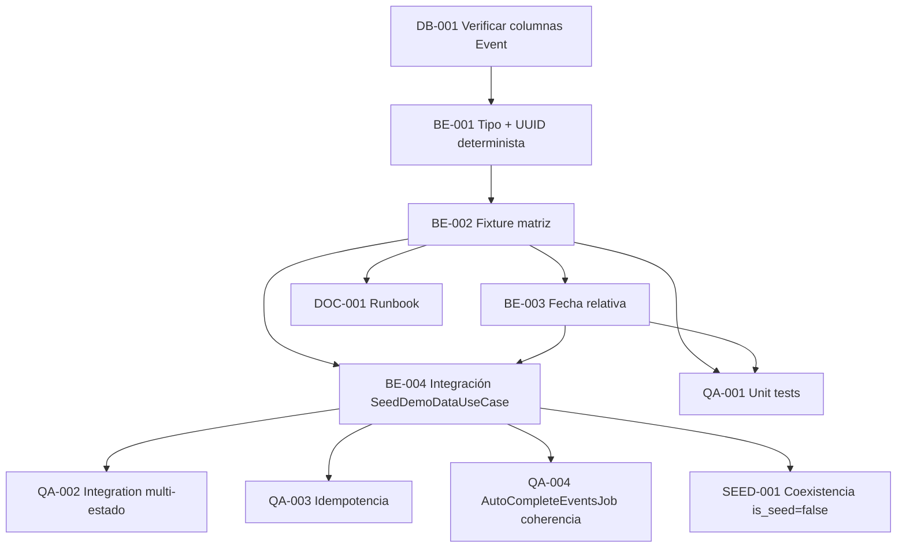

# Development Tasks — PB-P0-014 / US-087: Seed fixture garantiza mix de eventos `draft`/`active`/`completed`

## 1. Metadata

| Field | Value |
|---|---|
| User Story ID | US-087 |
| Source User Story | `management/user-stories/US-087-seed-event-mix.md` |
| Source Technical Specification | `management/technical-specs/P0/PB-P0-014/US-087-technical-spec.md` |
| Decision Resolution Artifact | `management/user-stories/decision-resolutions/US-087-decision-resolution.md` (no existe) |
| Priority | P0 |
| Backlog ID | PB-P0-014 |
| Backlog Title | Seed Script Idempotente + Datos Demo |
| Backlog Execution Order | P0 #14 |
| User Story Position in Backlog Item | 3 de 4 (US-085 → US-086 → **US-087** → US-088) |
| Related User Stories in Backlog Item | US-085, US-086, US-087, US-088 |
| Epic | EPIC-SEED-001 — Seed Data & Demo Scenarios |
| Backlog Item Dependencies | PB-P0-001, PB-P0-002 |
| Feature | Cobertura de estados de evento en seed (content fixture) |
| Module / Domain | `seed-demo` (Backend, content fixture transversal) |
| Backlog Alignment Status | Found |
| Task Breakdown Status | Ready for Sprint Planning |
| Created Date | 2026-06-22 |
| Last Updated | 2026-06-22 |

---

## 2. Source Validation

| Source | Found | Used | Notes |
|---|---|---|---|
| User Story | Yes | Yes | Approved 2026-06-22 |
| Technical Specification | Yes | Yes | Ready for Task Breakdown |
| Decision Resolution Artifact | No | No | No requerido |
| Product Backlog Prioritized | Yes | Yes | PB-P0-014 lista US-087 |
| ADRs | Yes | Yes | ADR-DEVOPS-003/004 |

---

## 3. Backlog Execution Context

### Parent Backlog Item

PB-P0-014 (Seed Script Idempotente + Datos Demo). Dependencias: PB-P0-001, PB-P0-002.

### Execution Order Rationale

US-087 depende de US-085 (runner + use case) y de US-086 (endpoint reset). US-088 consume eventos `completed` de US-087.

### Related User Stories in Same Backlog Item

| User Story | Role in Backlog Item | Suggested Order |
|---|---|---|
| US-085 | Runner CLI | 1 |
| US-086 | Endpoint HTTP reset | 2 |
| **US-087** | Fixture de eventos | 3 |
| US-088 | `confirmed_intent` + reseña | 4 |

---

## 4. Task Breakdown Summary

| Area | Number of Tasks | Notes |
|---|---:|---|
| Backend (BE) | 4 | Tipo, fixture, fecha relativa, integración con US-085 |
| Database / Prisma (DB) | 1 | Verificación de columnas requeridas en `Event` |
| QA / Testing (QA) | 4 | Unit, integration (estados, banderas, multi-currency/locale, idempotencia) |
| Seed / Demo Data (SEED) | 1 | Coexistencia con `is_seed=false` |
| Documentation / Traceability (DOC) | 1 | Runbook con cobertura del fixture |
| **Total** | **11** | — |

---

## 5. Traceability Matrix

| Acceptance Criterion | Technical Spec Section | Task IDs |
|---|---|---|
| AC-01 — Distribución mínima por estado | §6, §7, §10 | TASK-PB-P0-014-US-087-BE-002, BE-004, QA-002 |
| AC-02 — `auto_completed=true` y "cercano a auto-completar" | §6, §7, §17 | TASK-PB-P0-014-US-087-BE-002, BE-003, QA-002 |
| AC-03 — Multi-currency / multi-locale | §6, §7 | TASK-PB-P0-014-US-087-BE-002, QA-002 |
| AC-04 — Referencias relacionales válidas | §6, §7 | TASK-PB-P0-014-US-087-BE-002, BE-004, QA-002 |
| AC-05 — Idempotencia | §6, §7 (transactions), §17 | TASK-PB-P0-014-US-087-BE-002, BE-004, QA-003 |
| EC-01 — Migraciones faltantes | §6, §17 | TASK-PB-P0-014-US-087-DB-001 |
| EC-02 — Coexistencia con `is_seed=false` | §6, §7, §17 | TASK-PB-P0-014-US-087-SEED-001 |
| EC-03 — Fecha relativa | §6, §7 | TASK-PB-P0-014-US-087-BE-003, QA-001 |

---

## 6. Development Tasks

### TASK-PB-P0-014-US-087-DB-001 — Verificar columnas `auto_completed`, `completed_at`, `cancelled_reason` en `Event`

| Field | Value |
|---|---|
| Area | Database / Prisma |
| Type | Review |
| Priority | Must |
| Estimate | XS |
| Depends On | US-099, US-100 |
| Source AC(s) | EC-01 |
| Technical Spec Section(s) | §10, §17 |
| Backlog ID | PB-P0-014 |
| User Story ID | US-087 |
| Owner Role | Backend / DBA |
| Status | To Do |

#### Objective

Confirmar que el schema Prisma incluye las columnas requeridas. Si faltan, escalar a US-100 antes de implementar el fixture.

#### Scope

##### Include

* Revisión del modelo `Event` en `schema.prisma`.
* Confirmación de tipos y nullability esperados.

##### Exclude

* Creación de migraciones nuevas (responsabilidad de US-100).

#### Acceptance Criteria Covered

* EC-01.

#### Definition of Done

- [ ] Columnas confirmadas o escalación abierta a US-100.

---

### TASK-PB-P0-014-US-087-BE-001 — Definir tipo `EventSeedRecord` y namespace UUID determinista

| Field | Value |
|---|---|
| Area | Backend |
| Type | Implementation |
| Priority | Must |
| Estimate | XS |
| Depends On | TASK-PB-P0-014-US-087-DB-001 |
| Source AC(s) | AC-01, AC-05 |
| Technical Spec Section(s) | §7 (DTOs / Schemas), §17 |
| Backlog ID | PB-P0-014 |
| User Story ID | US-087 |
| Owner Role | Backend |
| Status | To Do |

#### Objective

Tipar los registros del fixture y proveer un generador de UUIDs deterministas.

#### Scope

##### Include

* Tipo `EventSeedRecord` (TS spec §7).
* Helper `seedUuid(namespace, key)` con `uuid v5` o equivalente.

##### Exclude

* Tipos para otros fixtures (organizadores, etc.).

#### Acceptance Criteria Covered

* AC-01, AC-05.

#### Definition of Done

- [ ] Tipo exportado y testeado.
- [ ] UUIDs deterministas validados con tests.

---

### TASK-PB-P0-014-US-087-BE-002 — Implementar fixture `events.fixture.ts` con la matriz de Doc 11

| Field | Value |
|---|---|
| Area | Backend |
| Type | Implementation |
| Priority | Must |
| Estimate | M |
| Depends On | TASK-PB-P0-014-US-087-BE-001 |
| Source AC(s) | AC-01, AC-02, AC-03, AC-04 |
| Technical Spec Section(s) | §3, §6, §7, §15 |
| Backlog ID | PB-P0-014 |
| User Story ID | US-087 |
| Owner Role | Backend |
| Status | To Do |

#### Objective

Definir los registros del fixture cubriendo conteos, banderas, multi-currency/locale y referencias relacionales.

#### Scope

##### Include

* Matriz de eventos según Doc 11 §"Matriz de escenarios".
* Distribución: `draft≥2`, `active≥4`, `completed≥2`, `cancelled≥1`, total 10–15.
* Al menos 1 evento con `auto_completed=true`.
* Cobertura `GTQ`/`USD` y `es-LATAM`/`en`.
* Cada evento referencia un `organizerSlug` y `eventTypeCode` definidos en fixtures previos.

##### Exclude

* Cálculo de fecha relativa (BE-003).
* `BookingIntent` y `Review` (US-088).

#### Acceptance Criteria Covered

* AC-01, AC-02, AC-03, AC-04.

#### Definition of Done

- [ ] Matriz validada contra Doc 11.
- [ ] Tests unitarios verifican forma y conteos del array.

---

### TASK-PB-P0-014-US-087-BE-003 — Cálculo dinámico de `event_date` para evento cercano a auto-completar

| Field | Value |
|---|---|
| Area | Backend |
| Type | Implementation |
| Priority | Must |
| Estimate | XS |
| Depends On | TASK-PB-P0-014-US-087-BE-002 |
| Source AC(s) | AC-02, EC-03 |
| Technical Spec Section(s) | §6, §7 |
| Backlog ID | PB-P0-014 |
| User Story ID | US-087 |
| Owner Role | Backend |
| Status | To Do |

#### Objective

Garantizar que la fecha del evento "cercano a auto-completar" se compute en runtime (hoy − 2 días) y no quede como literal vieja.

#### Scope

##### Include

* Función `relativeDate(daysOffset: number): Date` reusable.
* Aplicada al evento específico del fixture.

##### Exclude

* Otras fechas de eventos (pueden ser estáticas).

#### Acceptance Criteria Covered

* AC-02, EC-03.

#### Definition of Done

- [ ] Test verifica que la fecha cambia con el reloj de sistema.

---

### TASK-PB-P0-014-US-087-BE-004 — Integrar fixture en `SeedDemoDataUseCase` con upserts idempotentes

| Field | Value |
|---|---|
| Area | Backend |
| Type | Implementation |
| Priority | Must |
| Estimate | S |
| Depends On | TASK-PB-P0-014-US-087-BE-002, TASK-PB-P0-014-US-087-BE-003, US-085 |
| Source AC(s) | AC-01, AC-04, AC-05 |
| Technical Spec Section(s) | §7 (Use Cases / Persistence) |
| Backlog ID | PB-P0-014 |
| User Story ID | US-087 |
| Owner Role | Backend |
| Status | To Do |

#### Objective

Conectar el fixture con el flujo de inserción del `SeedDemoDataUseCase` mediante upserts por clave natural.

#### Scope

##### Include

* `prisma.event.upsert` por cada registro del fixture.
* Orden FK: organizador → event type → evento.
* `is_seed=true` siempre.

##### Exclude

* Cambios fuera del módulo `seed-demo`.

#### Implementation Notes

* Coordinar con responsable de US-085 para no duplicar la lógica de upsert.

#### Acceptance Criteria Covered

* AC-01, AC-04, AC-05.

#### Definition of Done

- [ ] Upsert idempotente verificado en tests de integración.

---

### TASK-PB-P0-014-US-087-QA-001 — Tests unitarios del fixture y helpers

| Field | Value |
|---|---|
| Area | QA / Testing |
| Type | Test |
| Priority | Must |
| Estimate | S |
| Depends On | TASK-PB-P0-014-US-087-BE-002, TASK-PB-P0-014-US-087-BE-003 |
| Source AC(s) | AC-01, AC-02, EC-03 |
| Technical Spec Section(s) | §13 (Unit Tests) |
| Backlog ID | PB-P0-014 |
| User Story ID | US-087 |
| Owner Role | QA / Backend |
| Status | To Do |

#### Objective

Cobertura unitaria de la matriz del fixture y del cálculo dinámico de fechas.

#### Scope

##### Include

* Verificar que cada registro tiene `isSeed=true`, status válido, referencias válidas.
* Verificar UUIDs deterministas.
* Verificar `relativeDate` con clock mockeado.

##### Exclude

* Integración con DB.

#### Acceptance Criteria Covered

* AC-01, AC-02, EC-03.

#### Definition of Done

- [ ] Tests verdes.

---

### TASK-PB-P0-014-US-087-QA-002 — Tests de integración por estado, currency y locale

| Field | Value |
|---|---|
| Area | QA / Testing |
| Type | Test |
| Priority | Must |
| Estimate | M |
| Depends On | TASK-PB-P0-014-US-087-BE-004 |
| Source AC(s) | AC-01, AC-02, AC-03, AC-04 |
| Technical Spec Section(s) | §13 (Integration Tests), §15 |
| Backlog ID | PB-P0-014 |
| User Story ID | US-087 |
| Owner Role | QA |
| Status | To Do |

#### Objective

Validar contra una DB efímera que tras seed los conteos, banderas, currency y locales cumplen los AC.

#### Scope

##### Include

* TS-01 — Conteos por estado.
* TS-02 — Banderas `auto_completed` y cercano a auto-completar.
* TS-03 — Currency `GTQ`/`USD` y locale `es-LATAM`/`en`.
* TS-04 — Al menos 4 tipos de evento.
* TS-05 — Referencias relacionales válidas.

##### Exclude

* Tests de runner o endpoint.

#### Acceptance Criteria Covered

* AC-01, AC-02, AC-03, AC-04.

#### Definition of Done

- [ ] Tests verdes en CI.

---

### TASK-PB-P0-014-US-087-QA-003 — Tests de idempotencia del fixture

| Field | Value |
|---|---|
| Area | QA / Testing |
| Type | Test |
| Priority | Must |
| Estimate | S |
| Depends On | TASK-PB-P0-014-US-087-BE-004 |
| Source AC(s) | AC-05 |
| Technical Spec Section(s) | §13, §17 |
| Backlog ID | PB-P0-014 |
| User Story ID | US-087 |
| Owner Role | QA |
| Status | To Do |

#### Objective

Doble ejecución del seed deja los mismos conteos sin duplicados.

#### Scope

##### Include

* TS-06 — Idempotencia.

##### Exclude

* Reset (cubierto por US-086).

#### Acceptance Criteria Covered

* AC-05.

#### Definition of Done

- [ ] Test verde en CI.

---

### TASK-PB-P0-014-US-087-QA-004 — Test de coherencia con `AutoCompleteEventsJob` (SD-T-02)

| Field | Value |
|---|---|
| Area | QA / Testing |
| Type | Test |
| Priority | Should |
| Estimate | S |
| Depends On | TASK-PB-P0-014-US-087-BE-004 |
| Source AC(s) | AC-02 |
| Technical Spec Section(s) | §13 (Seed/Demo Tests), §15 |
| Backlog ID | PB-P0-014 |
| User Story ID | US-087 |
| Owner Role | QA |
| Status | To Do |

#### Objective

Verificar que el evento cercano a auto-completar permite QA del job sin time-travel manual.

#### Scope

##### Include

* SD-T-02 — Job procesa el evento esperado tras seed.

##### Exclude

* Implementación del job (otra historia).

#### Acceptance Criteria Covered

* AC-02.

#### Definition of Done

- [ ] Test verde en CI o, si el job no está implementado, test marcado como pendiente con referencia a la historia futura.

---

### TASK-PB-P0-014-US-087-SEED-001 — Test de coexistencia con `is_seed=false` (SD-T-03 / EC-02)

| Field | Value |
|---|---|
| Area | Seed / Demo Data |
| Type | Test |
| Priority | Must |
| Estimate | S |
| Depends On | TASK-PB-P0-014-US-087-BE-004 |
| Source AC(s) | EC-02 |
| Technical Spec Section(s) | §15, §17 |
| Backlog ID | PB-P0-014 |
| User Story ID | US-087 |
| Owner Role | QA |
| Status | To Do |

#### Objective

Garantizar que el fixture no colisiona con datos operativos.

#### Scope

##### Include

* Insertar datos `is_seed=false` simulados, ejecutar seed y verificar coexistencia.

##### Exclude

* Tests fuera del módulo `seed-demo`.

#### Acceptance Criteria Covered

* EC-02.

#### Definition of Done

- [ ] Test verde en CI.

---

### TASK-PB-P0-014-US-087-DOC-001 — Documentar cobertura del fixture en runbook de demo

| Field | Value |
|---|---|
| Area | Documentation / Traceability |
| Type | Documentation |
| Priority | Must |
| Estimate | XS |
| Depends On | TASK-PB-P0-014-US-087-BE-002 |
| Source AC(s) | AC-01, AC-02, AC-03 |
| Technical Spec Section(s) | §15, §19 |
| Backlog ID | PB-P0-014 |
| User Story ID | US-087 |
| Owner Role | Tech Lead |
| Status | To Do |

#### Objective

Listar los eventos disponibles por estado, tipo, currency y locale para uso de la demo guiada.

#### Scope

##### Include

* Tabla con eventos seed por estado.
* Mención del evento cercano a auto-completar y del `auto_completed=true`.

##### Exclude

* Documentación de runner / endpoint (US-085 / US-086).

#### Acceptance Criteria Covered

* AC-01, AC-02, AC-03.

#### Definition of Done

- [ ] Runbook actualizado.

---

## 7. Required QA Tasks

| Task ID | Test Type | Purpose |
|---|---|---|
| TASK-PB-P0-014-US-087-QA-001 | Unit | Validar fixture y helpers |
| TASK-PB-P0-014-US-087-QA-002 | Integration | Conteos, banderas, currency, locale, referencias |
| TASK-PB-P0-014-US-087-QA-003 | Integration | Idempotencia |
| TASK-PB-P0-014-US-087-QA-004 | Integration | Coherencia con `AutoCompleteEventsJob` |
| TASK-PB-P0-014-US-087-SEED-001 | Integration | Coexistencia con `is_seed=false` |

---

## 8. Required Security Tasks

`No aplica`.

---

## 9. Required Seed / Demo Tasks

| Task ID | Seed/Demo Concern | Purpose |
|---|---|---|
| TASK-PB-P0-014-US-087-BE-002 | Cobertura del fixture | Definir la matriz |
| TASK-PB-P0-014-US-087-SEED-001 | Coexistencia | Sin pisado de datos operativos |
| TASK-PB-P0-014-US-087-DOC-001 | Runbook | Documentar cobertura |

---

## 10. Observability / Audit Tasks

`No aplica` directamente. La observabilidad la entregan US-085 y US-086 (logs estructurados, `SeedReport` / `ResetReport`).

---

## 11. Documentation / Traceability Tasks

| Task ID | Document / Artifact | Purpose |
|---|---|---|
| TASK-PB-P0-014-US-087-DOC-001 | Runbook de demo | Cobertura del fixture |

---

## 12. Dependency Graph

---

## 13. Suggested Implementation Order

### Phase 1 — Foundation

* TASK-PB-P0-014-US-087-DB-001
* TASK-PB-P0-014-US-087-BE-001

### Phase 2 — Core Implementation

* TASK-PB-P0-014-US-087-BE-002
* TASK-PB-P0-014-US-087-BE-003
* TASK-PB-P0-014-US-087-BE-004

### Phase 3 — Validation / QA

* TASK-PB-P0-014-US-087-QA-001
* TASK-PB-P0-014-US-087-QA-002
* TASK-PB-P0-014-US-087-QA-003
* TASK-PB-P0-014-US-087-QA-004
* TASK-PB-P0-014-US-087-SEED-001

### Phase 4 — Documentation / Review

* TASK-PB-P0-014-US-087-DOC-001

---

## 14. Risks & Mitigations

| Risk | Impact | Mitigation | Related Task |
|---|---|---|---|
| Drift vs Doc 11 §"Matriz de escenarios" | Demo pierde cobertura | Tests QA-002 validan la matriz | BE-002, QA-002 |
| Colisión clave natural con datos operativos | Pisado accidental | UUIDs deterministas namespace `seed:event:*` | BE-001, SEED-001 |
| Fecha relativa congelada | QA del job falla | Cálculo dinámico + test | BE-003, QA-001 |
| Cambio de schema sin migrar | Runner falla | Dependencia explícita con US-100 | DB-001 |

---

## 15. Out of Scope Confirmation

* Runner CLI → US-085.
* Endpoint HTTP reset → US-086.
* `BookingIntent.confirmed_intent` + reseña verificada → US-088.
* Implementación de `AutoCompleteEventsJob`.
* Transiciones de estado en runtime.
* UI admin / panel demo.
* Migraciones Prisma nuevas (US-100).

---

## 16. Readiness for Sprint Planning

| Check | Status |
|---|---|
| Product Backlog mapping found | Pass |
| Every AC maps to tasks | Pass |
| Technical Spec used when available | Pass |
| QA tasks included | Pass |
| Security tasks included if applicable | N/A |
| Seed/demo tasks included if applicable | Pass |
| Observability tasks included if applicable | N/A |
| Documentation tasks included if applicable | Pass |
| Task dependencies clear | Pass |
| Tasks small enough | Pass |
| Ready for Sprint Planning | Yes |

---

## 17. Final Recommendation

**Ready for Sprint Planning.**

11 tareas atómicas que cubren los 5 AC y los 3 EC del User Story, ordenadas por dependencia. Próximo paso: integrar en sprint planning del MVP P0 — Foundation, coordinando con el responsable de US-085 para la conexión con `SeedDemoDataUseCase`.
