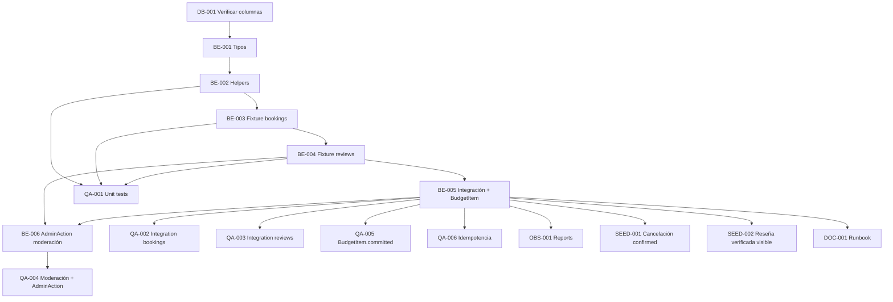

# Development Tasks — PB-P0-014 / US-088: Seed fixture incluye `BookingIntent.confirmed_intent` y reseñas verificadas

## 1. Metadata

| Field | Value |
|---|---|
| User Story ID | US-088 |
| Source User Story | `management/user-stories/US-088-seed-confirmed-booking-intent.md` |
| Source Technical Specification | `management/technical-specs/P0/PB-P0-014/US-088-technical-spec.md` |
| Decision Resolution Artifact | `management/user-stories/decision-resolutions/US-088-decision-resolution.md` (no existe) |
| Priority | P0 |
| Backlog ID | PB-P0-014 |
| Backlog Title | Seed Script Idempotente + Datos Demo |
| Backlog Execution Order | P0 #14 |
| User Story Position in Backlog Item | 4 de 4 (US-085 → US-086 → US-087 → **US-088**) |
| Related User Stories in Backlog Item | US-085, US-086, US-087, US-088 |
| Epic | EPIC-SEED-001 — Seed Data & Demo Scenarios |
| Backlog Item Dependencies | PB-P0-001, PB-P0-002 |
| Feature | BookingIntent confirmado + reseñas verificadas en seed (content fixture) |
| Module / Domain | `seed-demo` (Backend, content fixture transversal) |
| Backlog Alignment Status | Found |
| Task Breakdown Status | Ready for Sprint Planning |
| Created Date | 2026-06-22 |
| Last Updated | 2026-06-22 |

---

## 2. Source Validation

| Source | Found | Used | Notes |
|---|---|---|---|
| User Story | Yes | Yes | Approved 2026-06-22 |
| Technical Specification | Yes | Yes | Ready for Task Breakdown |
| Decision Resolution Artifact | No | No | No requerido |
| Product Backlog Prioritized | Yes | Yes | PB-P0-014 lista US-088 |
| ADRs | Yes | Yes | ADR-DEVOPS-003/004 |

---

## 3. Backlog Execution Context

### Parent Backlog Item

PB-P0-014 (Seed Script Idempotente + Datos Demo). Dependencias: PB-P0-001, PB-P0-002.

### Execution Order Rationale

US-088 depende de US-085 (runner + fixtures previos), US-086 (endpoint reset) y US-087 (eventos `completed`). Es la historia que cierra la base operativa del demo.

### Related User Stories in Same Backlog Item

| User Story | Role in Backlog Item | Suggested Order |
|---|---|---|
| US-085 | Runner CLI | 1 |
| US-086 | Endpoint HTTP reset | 2 |
| US-087 | Fixture de eventos | 3 |
| **US-088** | Fixture de BookingIntent + reseñas | 4 |

---

## 4. Task Breakdown Summary

| Area | Number of Tasks | Notes |
|---|---:|---|
| Backend (BE) | 6 | Tipos, helpers, fixture bookings, fixture reseñas, integración, AdminAction |
| Database / Prisma (DB) | 1 | Verificación de columnas requeridas |
| Observability / Audit (OBS) | 1 | `AdminAction` por moderación seed |
| QA / Testing (QA) | 6 | Unit, integration por AC y EC |
| Seed / Demo Data (SEED) | 2 | Cancelación desde confirmado + cobertura demo |
| Documentation / Traceability (DOC) | 1 | Runbook con cobertura |
| **Total** | **17** | — |

---

## 5. Traceability Matrix

| Acceptance Criterion | Technical Spec Section | Task IDs |
|---|---|---|
| AC-01 — Distribución `BookingIntent` | §3, §6, §7, §10 | BE-003, BE-005, QA-002 |
| AC-02 — Invariantes obligatorias | §6, §7, §10 | BE-003, BE-005, QA-002 |
| AC-03 — Distribución de reseñas + asociación + rating | §6, §7, §10 | BE-004, BE-005, QA-003 |
| AC-04 — Trazabilidad de moderación | §6, §7, §14 | BE-006, OBS-001, QA-004 |
| AC-05 — Coherencia presupuestal | §6, §7 | BE-002, BE-005, QA-005 |
| AC-06 — Idempotencia | §7, §17 | BE-001, BE-005, QA-006 |
| EC-01 — Migraciones faltantes | §6, §10, §17 | DB-001 |
| EC-02 — Quote inválido | §6, §7 | BE-003, QA-002 |
| EC-03 — Fechas coherentes cancelación | §6, §7 | BE-002, BE-003, QA-001 |
| EC-04 — Reseña sin `confirmed_intent` | §6, §7 | BE-004, QA-003 |

---

## 6. Development Tasks

### TASK-PB-P0-014-US-088-DB-001 — Verificar columnas requeridas en `BookingIntent`, `Review`, `BudgetItem`

| Field | Value |
|---|---|
| Area | Database / Prisma |
| Type | Review |
| Priority | Must |
| Estimate | XS |
| Depends On | US-099, US-100 |
| Source AC(s) | EC-01 |
| Technical Spec Section(s) | §10, §17 |
| Backlog ID | PB-P0-014 |
| User Story ID | US-088 |
| Owner Role | Backend / DBA |
| Status | To Do |

#### Objective

Confirmar que el schema incluye las columnas requeridas en las tres tablas. Si faltan, escalar a US-100.

#### Scope

##### Include

* Revisión de `BookingIntent`, `Review`, `BudgetItem` en `schema.prisma`.
* Confirmación de enums (`status` de Booking y Review).

##### Exclude

* Creación de migraciones nuevas.

#### Acceptance Criteria Covered

* EC-01.

#### Definition of Done

- [ ] Columnas confirmadas o escalación abierta a US-100.

---

### TASK-PB-P0-014-US-088-BE-001 — Definir tipos `BookingIntentSeedRecord` y `ReviewSeedRecord` con UUIDs deterministas

| Field | Value |
|---|---|
| Area | Backend |
| Type | Implementation |
| Priority | Must |
| Estimate | XS |
| Depends On | TASK-PB-P0-014-US-088-DB-001 |
| Source AC(s) | AC-01, AC-03, AC-06 |
| Technical Spec Section(s) | §7 (DTOs / Schemas) |
| Backlog ID | PB-P0-014 |
| User Story ID | US-088 |
| Owner Role | Backend |
| Status | To Do |

#### Objective

Tipar los registros de los fixtures y reusar el helper de UUID determinista (compartido con US-087).

#### Scope

##### Include

* Tipos `BookingIntentSeedRecord` y `ReviewSeedRecord`.
* Namespaces UUID `seed:booking:*` y `seed:review:*`.

##### Exclude

* Tipos para otras entidades.

#### Acceptance Criteria Covered

* AC-01, AC-03, AC-06.

#### Definition of Done

- [ ] Tipos exportados y testeados.

---

### TASK-PB-P0-014-US-088-BE-002 — Helpers `relativeDate`, `computeCommitted` y fecha de cancelación posterior a confirmación

| Field | Value |
|---|---|
| Area | Backend |
| Type | Implementation |
| Priority | Must |
| Estimate | S |
| Depends On | TASK-PB-P0-014-US-088-BE-001 |
| Source AC(s) | AC-05, EC-03 |
| Technical Spec Section(s) | §6, §7 |
| Backlog ID | PB-P0-014 |
| User Story ID | US-088 |
| Owner Role | Backend |
| Status | To Do |

#### Objective

Proveer helpers compartidos para fechas relativas y cómputo idempotente de `BudgetItem.committed`.

#### Scope

##### Include

* `relativeDate(daysOffset)` reusable (puede reusar el de US-087).
* `cancelledAfterConfirmed(confirmedAt, deltaDays)` que retorna `Date` con `Δ > 0`.
* `computeCommitted(quote)` que retorna `Quote.total_amount` aplicable a `BudgetItem`.

##### Exclude

* Otros helpers no requeridos por esta historia.

#### Acceptance Criteria Covered

* AC-05, EC-03.

#### Definition of Done

- [ ] Tests verifican `Δ > 0` y consistencia de cómputo.

---

### TASK-PB-P0-014-US-088-BE-003 — Implementar `booking-intents.fixture.ts` con matriz de Doc 11 §21

| Field | Value |
|---|---|
| Area | Backend |
| Type | Implementation |
| Priority | Must |
| Estimate | M |
| Depends On | TASK-PB-P0-014-US-088-BE-002, US-085, US-087 |
| Source AC(s) | AC-01, AC-02, EC-02, EC-03 |
| Technical Spec Section(s) | §3, §6, §7, §15 |
| Backlog ID | PB-P0-014 |
| User Story ID | US-088 |
| Owner Role | Backend |
| Status | To Do |

#### Objective

Definir la matriz de `BookingIntent` cubriendo distribución, invariantes y cancelaciones por origen.

#### Scope

##### Include

* Matriz Doc 11 §21: total 5–8, ≥3 `confirmed_intent`, 1–2 `pending`, 1 cancelado desde `pending`, 1 cancelado desde `confirmed_intent`.
* `is_simulated=true`, `is_seed=true` en todos los registros.
* FKs a `Quote` `accepted` no expirado (validación previa, EC-02).
* Unicidad `(event_id, service_category_id)` para confirmados (BR-BOOKING-007).
* `cancelled_at > confirmed_at` para cancelación desde `confirmed_intent` (BR-BOOKING-009).

##### Exclude

* Reseñas (BE-004).
* `AdminAction` por moderación (BE-006).

#### Acceptance Criteria Covered

* AC-01, AC-02, EC-02, EC-03.

#### Definition of Done

- [ ] Matriz validada contra Doc 11 §21.
- [ ] Tests unitarios verifican forma y conteos.

---

### TASK-PB-P0-014-US-088-BE-004 — Implementar `reviews.fixture.ts` con matriz de Doc 11 §22

| Field | Value |
|---|---|
| Area | Backend |
| Type | Implementation |
| Priority | Must |
| Estimate | M |
| Depends On | TASK-PB-P0-014-US-088-BE-003 |
| Source AC(s) | AC-03, EC-04 |
| Technical Spec Section(s) | §6, §7, §15 |
| Backlog ID | PB-P0-014 |
| User Story ID | US-088 |
| Owner Role | Backend |
| Status | To Do |

#### Objective

Definir la matriz de `Review` cubriendo distribución, asociación a `confirmed_intent` y rating.

#### Scope

##### Include

* Total 20–40 reseñas.
* Distribución ~70 % `published`, ~20 % `hidden`, ~10 % `removed`.
* Asociación obligatoria a `confirmed_intent` (validación previa, EC-04).
* `rating ∈ {1..5}`.
* Cobertura cultural LATAM en textos (BR-SEED-004).
* Cobertura multi-locale al menos `es-LATAM` y `en`.

##### Exclude

* `AdminAction` (BE-006).

#### Acceptance Criteria Covered

* AC-03, EC-04.

#### Definition of Done

- [ ] Matriz validada contra Doc 11 §22.
- [ ] Tests unitarios verifican forma y conteos.

---

### TASK-PB-P0-014-US-088-BE-005 — Integrar fixtures en `SeedDemoDataUseCase` con upserts idempotentes y `BudgetItem.committed`

| Field | Value |
|---|---|
| Area | Backend |
| Type | Implementation |
| Priority | Must |
| Estimate | M |
| Depends On | TASK-PB-P0-014-US-088-BE-003, TASK-PB-P0-014-US-088-BE-004, US-085 |
| Source AC(s) | AC-01, AC-03, AC-05, AC-06 |
| Technical Spec Section(s) | §7 (Use Cases / Persistence) |
| Backlog ID | PB-P0-014 |
| User Story ID | US-088 |
| Owner Role | Backend |
| Status | To Do |

#### Objective

Conectar los fixtures con `SeedDemoDataUseCase`, ejecutar upserts idempotentes y actualizar `BudgetItem.committed` por cada `confirmed_intent`.

#### Scope

##### Include

* `prisma.bookingIntent.upsert` por cada registro.
* `prisma.review.upsert` por cada registro.
* `prisma.budgetItem.update` con `committed` derivado por `computeCommitted(quote)` por cada `confirmed_intent`.
* Orden FK: bookings (dependen de eventos/quotes seed) → reseñas (dependen de bookings).

##### Exclude

* Cambios fuera del módulo `seed-demo`.

#### Implementation Notes

* Coordinar con responsable de US-085 para mantener la atomicidad por lote.

#### Acceptance Criteria Covered

* AC-01, AC-03, AC-05, AC-06.

#### Definition of Done

- [ ] Upserts idempotentes verificados en tests de integración.

---

### TASK-PB-P0-014-US-088-BE-006 — Persistir `AdminAction` por cada reseña `hidden`/`removed`

| Field | Value |
|---|---|
| Area | Backend |
| Type | Implementation |
| Priority | Must |
| Estimate | S |
| Depends On | TASK-PB-P0-014-US-088-BE-004, TASK-PB-P0-014-US-088-BE-005 |
| Source AC(s) | AC-04 |
| Technical Spec Section(s) | §7 (Repository), §12, §14 |
| Backlog ID | PB-P0-014 |
| User Story ID | US-088 |
| Owner Role | Backend |
| Status | To Do |

#### Objective

Garantizar trazabilidad de moderación en reseñas seed `hidden`/`removed`.

#### Scope

##### Include

* Por cada review `hidden`: `AdminAction { action: 'HIDE_REVIEW', target_type: 'review', target_id: review.id, admin_id, reason, correlation_id }`.
* Por cada review `removed`: `AdminAction { action: 'REMOVE_REVIEW', ... }`.
* `Review.moderated_by/at/reason` consistente con la `AdminAction`.

##### Exclude

* Endpoint admin de moderación (otra historia).

#### Acceptance Criteria Covered

* AC-04.

#### Definition of Done

- [ ] Cada review moderada tiene su `AdminAction` correspondiente.

---

### TASK-PB-P0-014-US-088-QA-001 — Tests unitarios de helpers y forma de los fixtures

| Field | Value |
|---|---|
| Area | QA / Testing |
| Type | Test |
| Priority | Must |
| Estimate | S |
| Depends On | TASK-PB-P0-014-US-088-BE-002, TASK-PB-P0-014-US-088-BE-003, TASK-PB-P0-014-US-088-BE-004 |
| Source AC(s) | AC-01, AC-03, EC-03 |
| Technical Spec Section(s) | §13 (Unit Tests) |
| Backlog ID | PB-P0-014 |
| User Story ID | US-088 |
| Owner Role | QA / Backend |
| Status | To Do |

#### Objective

Validar helpers y forma de cada registro del fixture (`is_simulated`, `is_seed`, status válidos, FKs declaradas).

#### Scope

##### Include

* `relativeDate`, `cancelledAfterConfirmed`, `computeCommitted` con clock mockeado.
* Validación de UUIDs deterministas.
* Validación de campos requeridos.

##### Exclude

* Integración con DB.

#### Acceptance Criteria Covered

* AC-01, AC-03, EC-03.

#### Definition of Done

- [ ] Tests verdes en CI.

---

### TASK-PB-P0-014-US-088-QA-002 — Tests de integración para distribución e invariantes de `BookingIntent`

| Field | Value |
|---|---|
| Area | QA / Testing |
| Type | Test |
| Priority | Must |
| Estimate | M |
| Depends On | TASK-PB-P0-014-US-088-BE-005 |
| Source AC(s) | AC-01, AC-02, EC-02 |
| Technical Spec Section(s) | §13 (Integration Tests) |
| Backlog ID | PB-P0-014 |
| User Story ID | US-088 |
| Owner Role | QA |
| Status | To Do |

#### Objective

Verificar contra DB efímera la distribución, invariantes y FKs de `BookingIntent`.

#### Scope

##### Include

* TS-01 — Distribución por estado.
* TS-02 — `is_simulated`, `is_seed`, Quote válido, unicidad `(event, category)`.

##### Exclude

* Reseñas.

#### Acceptance Criteria Covered

* AC-01, AC-02, EC-02.

#### Definition of Done

- [ ] Tests verdes en CI.

---

### TASK-PB-P0-014-US-088-QA-003 — Tests de integración para distribución y referencias de `Review`

| Field | Value |
|---|---|
| Area | QA / Testing |
| Type | Test |
| Priority | Must |
| Estimate | M |
| Depends On | TASK-PB-P0-014-US-088-BE-005 |
| Source AC(s) | AC-03, EC-04 |
| Technical Spec Section(s) | §13 |
| Backlog ID | PB-P0-014 |
| User Story ID | US-088 |
| Owner Role | QA |
| Status | To Do |

#### Objective

Verificar total, proporciones, asociación a `confirmed_intent` y rating.

#### Scope

##### Include

* TS-03 — Total 20–40 y proporciones.
* TS-04 — Asociación + rating 1–5.

##### Exclude

* Moderación (QA-004).

#### Acceptance Criteria Covered

* AC-03, EC-04.

#### Definition of Done

- [ ] Tests verdes en CI.

---

### TASK-PB-P0-014-US-088-QA-004 — Tests de auditoría de moderación de reseñas

| Field | Value |
|---|---|
| Area | QA / Testing |
| Type | Test |
| Priority | Must |
| Estimate | S |
| Depends On | TASK-PB-P0-014-US-088-BE-006 |
| Source AC(s) | AC-04 |
| Technical Spec Section(s) | §13, §14 |
| Backlog ID | PB-P0-014 |
| User Story ID | US-088 |
| Owner Role | QA |
| Status | To Do |

#### Objective

Validar `moderated_*` no nulos y `AdminAction` por cada `hidden`/`removed`.

#### Scope

##### Include

* TS-05 — Moderación trazada en `AdminAction`.

##### Exclude

* Endpoint admin.

#### Acceptance Criteria Covered

* AC-04.

#### Definition of Done

- [ ] Tests verdes en CI.

---

### TASK-PB-P0-014-US-088-QA-005 — Test de coherencia presupuestal con `BudgetItem.committed`

| Field | Value |
|---|---|
| Area | QA / Testing |
| Type | Test |
| Priority | Must |
| Estimate | S |
| Depends On | TASK-PB-P0-014-US-088-BE-005 |
| Source AC(s) | AC-05 |
| Technical Spec Section(s) | §13 |
| Backlog ID | PB-P0-014 |
| User Story ID | US-088 |
| Owner Role | QA |
| Status | To Do |

#### Objective

Validar que `BudgetItem.committed` refleja `Quote.total_amount` por cada `confirmed_intent`.

#### Scope

##### Include

* TS-06 — Coherencia presupuestal.

##### Exclude

* Flujo runtime del use case `ConfirmBookingIntentUseCase`.

#### Acceptance Criteria Covered

* AC-05.

#### Definition of Done

- [ ] Test verde en CI.

---

### TASK-PB-P0-014-US-088-QA-006 — Tests de idempotencia del fixture

| Field | Value |
|---|---|
| Area | QA / Testing |
| Type | Test |
| Priority | Must |
| Estimate | S |
| Depends On | TASK-PB-P0-014-US-088-BE-005 |
| Source AC(s) | AC-06 |
| Technical Spec Section(s) | §13, §17 |
| Backlog ID | PB-P0-014 |
| User Story ID | US-088 |
| Owner Role | QA |
| Status | To Do |

#### Objective

Doble ejecución del seed deja los mismos conteos sin duplicados.

#### Scope

##### Include

* TS-07 — Idempotencia.

##### Exclude

* Reset (cubierto por US-086).

#### Acceptance Criteria Covered

* AC-06.

#### Definition of Done

- [ ] Test verde en CI.

---

### TASK-PB-P0-014-US-088-OBS-001 — Validar conteos por estado en `SeedReport`/`ResetReport`

| Field | Value |
|---|---|
| Area | Observability / Audit |
| Type | Implementation |
| Priority | Should |
| Estimate | XS |
| Depends On | TASK-PB-P0-014-US-088-BE-005, US-085, US-086 |
| Source AC(s) | AC-01, AC-03 |
| Technical Spec Section(s) | §14 |
| Backlog ID | PB-P0-014 |
| User Story ID | US-088 |
| Owner Role | Backend |
| Status | To Do |

#### Objective

Asegurar que el `SeedReport` (US-085) y el `ResetReport` (US-086) incluyen los conteos de `BookingIntent` por estado y de `Review` por status.

#### Scope

##### Include

* Coordinar con responsable de US-085 / US-086 para sumar las keys correspondientes en `entitiesReseeded`.

##### Exclude

* Métricas adicionales no requeridas por NFR-OBS-006.

#### Acceptance Criteria Covered

* AC-01, AC-03.

#### Definition of Done

- [ ] Reports incluyen las keys nuevas.

---

### TASK-PB-P0-014-US-088-SEED-001 — Test demo flujo cancelación desde `confirmed_intent` (SD-T-02)

| Field | Value |
|---|---|
| Area | Seed / Demo Data |
| Type | Test |
| Priority | Should |
| Estimate | S |
| Depends On | TASK-PB-P0-014-US-088-BE-005 |
| Source AC(s) | AC-01 |
| Technical Spec Section(s) | §15 |
| Backlog ID | PB-P0-014 |
| User Story ID | US-088 |
| Owner Role | QA |
| Status | To Do |

#### Objective

Validar que el fixture permite mostrar en demo un booking cancelado desde `confirmed_intent` con razón documentada.

#### Scope

##### Include

* Query por `status='cancelled'`, `confirmed_at` no nulo, `cancelled_at > confirmed_at`, `cancellation_reason` no nulo.

##### Exclude

* UI admin.

#### Acceptance Criteria Covered

* AC-01.

#### Definition of Done

- [ ] Test verde en CI.

---

### TASK-PB-P0-014-US-088-SEED-002 — Test demo flujo reseña verificada con confirmed_intent (SD-T-01)

| Field | Value |
|---|---|
| Area | Seed / Demo Data |
| Type | Test |
| Priority | Should |
| Estimate | S |
| Depends On | TASK-PB-P0-014-US-088-BE-005 |
| Source AC(s) | AC-03 |
| Technical Spec Section(s) | §15 |
| Backlog ID | PB-P0-014 |
| User Story ID | US-088 |
| Owner Role | QA |
| Status | To Do |

#### Objective

Validar que el vendor demo principal tiene al menos una reseña verificada visible.

#### Scope

##### Include

* Query por al menos 1 reseña `published` ligada a un `confirmed_intent` con vendor demo principal.

##### Exclude

* UI pública.

#### Acceptance Criteria Covered

* AC-03.

#### Definition of Done

- [ ] Test verde en CI.

---

### TASK-PB-P0-014-US-088-DOC-001 — Documentar fixtures en runbook de demo

| Field | Value |
|---|---|
| Area | Documentation / Traceability |
| Type | Documentation |
| Priority | Must |
| Estimate | XS |
| Depends On | TASK-PB-P0-014-US-088-BE-005 |
| Source AC(s) | AC-01, AC-03, AC-04 |
| Technical Spec Section(s) | §15, §19 |
| Backlog ID | PB-P0-014 |
| User Story ID | US-088 |
| Owner Role | Tech Lead |
| Status | To Do |

#### Objective

Listar los bookings y reseñas disponibles para uso de la demo guiada.

#### Scope

##### Include

* Tabla con bookings por estado y razones de cancelación.
* Tabla con reseñas por status y casos de moderación.
* Casos de uso para evaluación académica (cierre del flujo, moderación, presupuesto).

##### Exclude

* Documentación del runner / endpoint.

#### Acceptance Criteria Covered

* AC-01, AC-03, AC-04.

#### Definition of Done

- [ ] Runbook actualizado.

---

## 7. Required QA Tasks

| Task ID | Test Type | Purpose |
|---|---|---|
| TASK-PB-P0-014-US-088-QA-001 | Unit | Helpers y forma del fixture |
| TASK-PB-P0-014-US-088-QA-002 | Integration | Distribución e invariantes de `BookingIntent` |
| TASK-PB-P0-014-US-088-QA-003 | Integration | Distribución y referencias de `Review` |
| TASK-PB-P0-014-US-088-QA-004 | Integration | Moderación + `AdminAction` |
| TASK-PB-P0-014-US-088-QA-005 | Integration | Coherencia presupuestal |
| TASK-PB-P0-014-US-088-QA-006 | Integration | Idempotencia |
| TASK-PB-P0-014-US-088-SEED-001 | Integration | Cancelación desde `confirmed_intent` |
| TASK-PB-P0-014-US-088-SEED-002 | Integration | Reseña verificada visible |

---

## 8. Required Security Tasks

`No aplica` directamente. El fixture preserva BR-SEED-010, BR-PRIVACY-010 y NFR-PRIV-004 por construcción (datos ficticios) y BR-BOOKING-004/005 por `is_simulated=true`.

---

## 9. Required Seed / Demo Tasks

| Task ID | Seed/Demo Concern | Purpose |
|---|---|---|
| TASK-PB-P0-014-US-088-BE-003 | Cobertura `BookingIntent` | Matriz Doc 11 §21 |
| TASK-PB-P0-014-US-088-BE-004 | Cobertura `Review` | Matriz Doc 11 §22 |
| TASK-PB-P0-014-US-088-SEED-001 | Cancelación desde `confirmed_intent` | BR-BOOKING-009 |
| TASK-PB-P0-014-US-088-SEED-002 | Reseña verificada visible | BR-REVIEW-001 |
| TASK-PB-P0-014-US-088-DOC-001 | Runbook | Documentar cobertura |

---

## 10. Observability / Audit Tasks

| Task ID | Concern | Purpose |
|---|---|---|
| TASK-PB-P0-014-US-088-BE-006 | Auditoría seed de moderación | `AdminAction` por `hidden`/`removed` |
| TASK-PB-P0-014-US-088-OBS-001 | Reports | Incluir conteos en `SeedReport`/`ResetReport` |
| TASK-PB-P0-014-US-088-QA-004 | Validation | Tests de auditoría |

---

## 11. Documentation / Traceability Tasks

| Task ID | Document / Artifact | Purpose |
|---|---|---|
| TASK-PB-P0-014-US-088-DOC-001 | Runbook de demo | Cobertura de bookings + reseñas |

---

## 12. Dependency Graph

---

## 13. Suggested Implementation Order

### Phase 1 — Foundation

* TASK-PB-P0-014-US-088-DB-001
* TASK-PB-P0-014-US-088-BE-001
* TASK-PB-P0-014-US-088-BE-002

### Phase 2 — Core Implementation

* TASK-PB-P0-014-US-088-BE-003
* TASK-PB-P0-014-US-088-BE-004
* TASK-PB-P0-014-US-088-BE-005
* TASK-PB-P0-014-US-088-BE-006
* TASK-PB-P0-014-US-088-OBS-001

### Phase 3 — Validation / QA

* TASK-PB-P0-014-US-088-QA-001
* TASK-PB-P0-014-US-088-QA-002
* TASK-PB-P0-014-US-088-QA-003
* TASK-PB-P0-014-US-088-QA-004
* TASK-PB-P0-014-US-088-QA-005
* TASK-PB-P0-014-US-088-QA-006
* TASK-PB-P0-014-US-088-SEED-001
* TASK-PB-P0-014-US-088-SEED-002

### Phase 4 — Documentation / Review

* TASK-PB-P0-014-US-088-DOC-001

---

## 14. Risks & Mitigations

| Risk | Impact | Mitigation | Related Task |
|---|---|---|---|
| Drift vs Doc 11 §21/§22 | Demo pierde cobertura | Tests QA validan matriz | BE-003/004, QA-002/003 |
| Cálculo `committed` incorrecto | Demo presupuestal inconsistente | Helper centralizado + test | BE-002, QA-005 |
| `cancelled_at <= confirmed_at` | Inconsistencia temporal | Helper relativo + test | BE-002, BE-003, QA-001 |
| FK a Quote expirado o no aceptado | Runner falla | Validación previa | BE-003 |
| Reseñas asociadas a booking no confirmado | Runner falla | Validación previa | BE-004 |
| Cambio de schema sin migrar | Runner falla | Dependencia explícita con US-100 | DB-001 |
| `AdminAction` no persiste valores correctos | Auditoría rota | Tests específicos | BE-006, QA-004 |

---

## 15. Out of Scope Confirmation

* Runner CLI → US-085.
* Endpoint HTTP reset → US-086.
* Fixture `Event` → US-087.
* Fixtures base (`User`, `VendorProfile`, `Quote`, `QuoteRequest`, `Budget`/`BudgetItem`, `AdminAction` base) → US-085.
* Implementación de `ConfirmBookingIntentUseCase`, `CancelBookingIntentUseCase`, `CreateReviewUseCase`, `HideReviewUseCase`.
* UI admin / panel demo.
* Notificaciones reales (SMTP).
* Pagos reales / contratos firmados.
* Migraciones Prisma nuevas (US-100).

---

## 16. Readiness for Sprint Planning

| Check | Status |
|---|---|
| Product Backlog mapping found | Pass |
| Every AC maps to tasks | Pass |
| Technical Spec used when available | Pass |
| QA tasks included | Pass |
| Security tasks included if applicable | N/A |
| Seed/demo tasks included if applicable | Pass |
| Observability tasks included if applicable | Pass |
| Documentation tasks included if applicable | Pass |
| Task dependencies clear | Pass |
| Tasks small enough | Pass |
| Ready for Sprint Planning | Yes |

---

## 17. Final Recommendation

**Ready for Sprint Planning.**

17 tareas atómicas que cubren los 6 AC y los 4 EC del User Story, ordenadas por dependencia. Próximo paso: integrar en sprint planning del MVP P0 — Foundation, coordinando con el responsable de US-085 para conectar los fixtures en `SeedDemoDataUseCase` y con el de US-087 para reusar los helpers compartidos.
