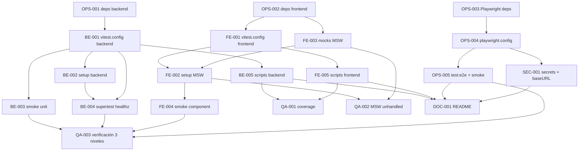

# Development Tasks — PB-P0-015 / US-125: Configurar Vitest + Supertest + Playwright + MSW

## 1. Metadata

| Field | Value |
|---|---|
| User Story ID | US-125 |
| Source User Story | `management/user-stories/US-125-configure-vitest-supertest-playwright-msw.md` |
| Source Technical Specification | `management/technical-specs/P0/PB-P0-015/US-125-technical-spec.md` |
| Decision Resolution Artifact | No existe — decisiones formalizadas en ADR-TEST-001, ADR-TEST-002, Doc 20 |
| Priority | P0 |
| Backlog ID | PB-P0-015 |
| Backlog Title | QA Tooling Setup |
| Backlog Execution Order | 15 (P0) |
| User Story Position in Backlog Item | 1 de 1 |
| Related User Stories in Backlog Item | US-125 |
| Epic | EPIC-QA-001 — Testing & Quality Gates |
| Backlog Item Dependencies | PB-P0-002, PB-P0-012 |
| Feature | Tooling de testing (foundation) |
| Module / Domain | QA / DevOps |
| Backlog Alignment Status | Found |
| Task Breakdown Status | Ready for Sprint Planning |
| Created Date | 2026-06-22 |
| Last Updated | 2026-06-22 |

---

## 2. Source Validation

| Source | Found | Used | Notes |
|---|---|---|---|
| User Story | Yes | Yes | Status `Approved`; 7 AC + 4 EC. |
| Technical Specification | Yes | Yes | Primary source; status `Ready for Task Breakdown`. |
| Decision Resolution Artifact | No | No | No requerido; decisiones cubiertas por ADRs. |
| Product Backlog Prioritized | Yes | Yes | PB-P0-015 mapeado; posición 15 P0. |
| ADRs | Yes | Yes | ADR-TEST-001, ADR-TEST-002, ADR-DEVOPS-001. |

---

## 3. Backlog Execution Context

### Parent Backlog Item

`PB-P0-015 — QA Tooling Setup`. Instala el tooling base de testing del MVP (Vitest, Supertest, Playwright, MSW) con scripts npm compartidos. Dependencias: PB-P0-002 (scaffold backend) y PB-P0-012 (scaffold frontend).

### Execution Order Rationale

US-125 ocupa la posición 15 dentro de P0 según `4-Product-Backlog-Prioritized.md`. Debe completarse después del bootstrap de backend y frontend, y antes de PB-P0-017 (pipeline CI), que consumirá los scripts `test:ci` aquí definidos.

### Related User Stories in Same Backlog Item

| User Story | Role in Backlog Item | Suggested Order |
|---|---|---|
| US-125 | Setup completo del tooling (backend, frontend, E2E, MSW) | 1 |

---

## 4. Task Breakdown Summary

| Area | Number of Tasks | Notes |
|---|---:|---|
| DevOps / Environment (OPS) | 5 | Dependencias, Playwright install, configs E2E, scripts CI. |
| Backend (BE) | 5 | Vitest config, setup, test unit, test Supertest, scripts npm. |
| Frontend (FE) | 5 | Vitest config, setup MSW, mocks, test componente, scripts npm. |
| QA / Testing (QA) | 3 | Coverage, política `onUnhandledRequest`, verificación 3 niveles. |
| Security / Authorization (SEC) | 1 | `.gitignore`, `.env.test`, baseURL no productivo. |
| Documentation / Traceability (DOC) | 1 | Sección Testing en README. |
| **Total** | **20** | |

---

## 5. Traceability Matrix

| Acceptance Criterion | Technical Spec Section | Task IDs |
|---|---|---|
| AC-01 | §7 Backend Technical Design, §13 Testing Strategy | TASK-PB-P0-015-US-125-OPS-001, BE-001, BE-002, BE-003, BE-005, QA-003 |
| AC-02 | §7 Backend, §9 API Contract Design, §13 Testing Strategy | TASK-PB-P0-015-US-125-BE-004, QA-003 |
| AC-03 | §8 Frontend Technical Design, §13 Testing Strategy | TASK-PB-P0-015-US-125-OPS-002, FE-001, FE-002, FE-003, FE-004, FE-005, QA-002, QA-003 |
| AC-04 | §8 Frontend, §13 Testing Strategy, §17 Risks (browsers) | TASK-PB-P0-015-US-125-OPS-003, OPS-004, OPS-005, QA-003 |
| AC-05 | §13 Testing Strategy (CI), §19 Task Generation Notes | TASK-PB-P0-015-US-125-BE-005, FE-005, OPS-005 |
| AC-06 | §8 Frontend, §13 Testing Strategy | TASK-PB-P0-015-US-125-FE-003, QA-002 |
| AC-07 | §18 Implementation Guidance, §19 Task Generation Notes | TASK-PB-P0-015-US-125-DOC-001 |
| EC-01 | §7 Backend (DB efímera), §13 Testing Strategy | TASK-PB-P0-015-US-125-BE-002, DOC-001 |
| EC-02 | §17 Risks (browsers), §13 E2E | TASK-PB-P0-015-US-125-OPS-003, OPS-004 |
| EC-03 | §8 Frontend (MSW policy) | TASK-PB-P0-015-US-125-FE-002, QA-002 |
| EC-04 | §8 Frontend, §17 Risks (puertos) | TASK-PB-P0-015-US-125-OPS-004 |
| SEC-01..04 | §12 Security & Authorization Design | TASK-PB-P0-015-US-125-SEC-001 |

---

## 6. Development Tasks

### TASK-PB-P0-015-US-125-OPS-001 — Instalar dependencias de testing backend

| Field | Value |
|---|---|
| Area | DevOps / Environment |
| Type | Setup |
| Priority | Must |
| Estimate | XS |
| Depends On | — |
| Source AC(s) | AC-01 |
| Technical Spec Section(s) | §4 Scope (In Scope), §18 Implementation Guidance |
| Backlog ID | PB-P0-015 |
| User Story ID | US-125 |
| Owner Role | DevOps |
| Status | To Do |

#### Objective

Instalar las dependencias de testing del backend definidas por ADR-TEST-001.

#### Scope

##### Include

* `vitest`, `@vitest/coverage-v8`, `supertest`, `@types/supertest` como `devDependencies` del paquete backend.

##### Exclude

* Dependencias del frontend.
* Configuración de archivos (cubierto por BE-001).

#### Implementation Notes

* Usar el gestor de paquetes definido por el scaffold (npm o pnpm).
* No tocar `dependencies` de producción.

#### Acceptance Criteria Covered

* AC-01.

#### Definition of Done

- [ ] Paquetes instalados y reflejados en `package.json` y lockfile.
- [ ] `npx vitest --version` retorna versión esperada.
- [ ] PR sin warnings de auditoría de seguridad nuevos.

---

### TASK-PB-P0-015-US-125-OPS-002 — Instalar dependencias de testing frontend

| Field | Value |
|---|---|
| Area | DevOps / Environment |
| Type | Setup |
| Priority | Must |
| Estimate | XS |
| Depends On | — |
| Source AC(s) | AC-03 |
| Technical Spec Section(s) | §4 Scope, §8 Frontend Technical Design, §18 Implementation Guidance |
| Backlog ID | PB-P0-015 |
| User Story ID | US-125 |
| Owner Role | DevOps |
| Status | To Do |

#### Objective

Instalar las dependencias de testing del frontend definidas por ADR-TEST-002.

#### Scope

##### Include

* `vitest`, `@vitest/coverage-v8`, `@testing-library/react`, `@testing-library/jest-dom`, `@testing-library/user-event`, `msw`, `jsdom` (o `happy-dom`) en el paquete frontend.

##### Exclude

* Dependencias del backend.
* Configuración de archivos (cubierto por FE-001/FE-002/FE-003).

#### Implementation Notes

* Confirmar versión compatible de MSW (>= v2) y de Testing Library con la versión de React del scaffold.

#### Acceptance Criteria Covered

* AC-03.

#### Definition of Done

- [ ] Paquetes instalados y reflejados en `package.json` y lockfile.
- [ ] `npx vitest --version` retorna versión esperada en el paquete frontend.

---

### TASK-PB-P0-015-US-125-OPS-003 — Instalar Playwright y descargar browsers

| Field | Value |
|---|---|
| Area | DevOps / Environment |
| Type | Setup |
| Priority | Must |
| Estimate | XS |
| Depends On | — |
| Source AC(s) | AC-04 |
| Technical Spec Section(s) | §4 Scope, §17 Risks, §18 Implementation Guidance |
| Backlog ID | PB-P0-015 |
| User Story ID | US-125 |
| Owner Role | DevOps |
| Status | To Do |

#### Objective

Instalar `@playwright/test` y los browsers requeridos para E2E.

#### Scope

##### Include

* `@playwright/test` como devDependency del paquete que contendrá los E2E (frontend o paquete dedicado).
* Documentar/automatizar `npx playwright install` para entorno local.

##### Exclude

* Configuración `playwright.config.ts` (cubierto por OPS-004).
* Tests E2E (cubierto por OPS-005).

#### Implementation Notes

* Cubrir EC-02: si los browsers faltan, el error debe ser claro y dirigir al comando `npx playwright install`.

#### Acceptance Criteria Covered

* AC-04, EC-02.

#### Definition of Done

- [ ] `@playwright/test` instalado y reflejado en `package.json`.
- [ ] `npx playwright install --dry-run` lista los browsers esperados.
- [ ] Documentado en `README` el paso de instalación.

---

### TASK-PB-P0-015-US-125-BE-001 — Crear `vitest.config.ts` en backend

| Field | Value |
|---|---|
| Area | Backend |
| Type | Implementation |
| Priority | Must |
| Estimate | S |
| Depends On | OPS-001 |
| Source AC(s) | AC-01 |
| Technical Spec Section(s) | §7 Backend Technical Design, §13 Testing Strategy |
| Backlog ID | PB-P0-015 |
| User Story ID | US-125 |
| Owner Role | Backend |
| Status | To Do |

#### Objective

Configurar Vitest en backend con coverage `v8`, entorno `node` y rutas de tests convencionales.

#### Scope

##### Include

* `vitest.config.ts` con `test.environment = 'node'`, `coverage.provider = 'v8'`, `coverage.reportsDirectory = 'coverage'`, `include` apuntando a la convención de carpetas acordada con Tech Lead.

##### Exclude

* Setup de DB efímera (cubierto por BE-002).
* Tests (cubierto por BE-003/BE-004).

#### Implementation Notes

* Confirmar convención de carpetas (`tests/`, `__tests__/` o co-located) — decisión técnica menor.
* Excluir `dist/`, `node_modules/`, generados Prisma del coverage.

#### Acceptance Criteria Covered

* AC-01.

#### Definition of Done

- [ ] `vitest.config.ts` presente y parseable.
- [ ] `npx vitest run --reporter=verbose` arranca sin error de configuración.

---

### TASK-PB-P0-015-US-125-BE-002 — Crear setup global backend con DB efímera opcional

| Field | Value |
|---|---|
| Area | Backend |
| Type | Implementation |
| Priority | Must |
| Estimate | S |
| Depends On | BE-001 |
| Source AC(s) | AC-01, EC-01 |
| Technical Spec Section(s) | §7 Backend Technical Design, §17 Risks |
| Backlog ID | PB-P0-015 |
| User Story ID | US-125 |
| Owner Role | Backend |
| Status | To Do |

#### Objective

Crear `tests/setup.ts` con hooks globales (`beforeAll`, `afterAll`) que preparen el contexto de tests y manejen la ausencia de `DATABASE_URL` sin enmascarar errores.

#### Scope

##### Include

* Archivo de setup registrado en `vitest.config.ts` (`setupFiles`).
* Lógica fail-fast cuando la configuración es inválida.
* Si `DATABASE_URL` no está definida: skip de la suite de integración con warning explícito (no rompe la suite unit).

##### Exclude

* Lógica de seed (responsabilidad de otras historias).
* Implementación productiva (sin código de dominio).

#### Implementation Notes

* Cubre EC-01: mensaje guía hacia la variable `DATABASE_URL` o el contenedor esperado.
* No instalar contenedores: solo consumir la variable.

#### Acceptance Criteria Covered

* AC-01, EC-01.

#### Definition of Done

- [ ] `tests/setup.ts` creado y referenciado por `vitest.config.ts`.
- [ ] Sin `DATABASE_URL`, `npx vitest run` corre la suite unit y muestra el warning de integración.

---

### TASK-PB-P0-015-US-125-BE-003 — Test unit de humo backend

| Field | Value |
|---|---|
| Area | Backend |
| Type | Test |
| Priority | Must |
| Estimate | XS |
| Depends On | BE-001 |
| Source AC(s) | AC-01 |
| Technical Spec Section(s) | §13 Testing Strategy (Unit) |
| Backlog ID | PB-P0-015 |
| User Story ID | US-125 |
| Owner Role | Backend |
| Status | To Do |

#### Objective

Verificar que Vitest backend ejecuta al menos un test unit verde y produce código de salida 0.

#### Scope

##### Include

* `tests/smoke/domain.smoke.test.ts` con un assert trivial sobre un helper puro o expresión determinista.

##### Exclude

* Tests funcionales reales (cubiertos por PB-P2-014).

#### Acceptance Criteria Covered

* AC-01.

#### Definition of Done

- [ ] `npm test` ejecuta y pasa el test de humo backend.

---

### TASK-PB-P0-015-US-125-BE-004 — Test API de humo con Supertest contra `GET /healthz`

| Field | Value |
|---|---|
| Area | Backend |
| Type | Test |
| Priority | Must |
| Estimate | S |
| Depends On | BE-001, BE-002 |
| Source AC(s) | AC-02 |
| Technical Spec Section(s) | §7 Backend, §9 API Contract Design, §13 Testing Strategy (API) |
| Backlog ID | PB-P0-015 |
| User Story ID | US-125 |
| Owner Role | Backend |
| Status | To Do |

#### Objective

Demostrar que Supertest opera contra la `app` Express del scaffold sin levantar puerto.

#### Scope

##### Include

* `tests/api/healthz.api.test.ts` que importa `app` desde `src/http/app.ts` (o equivalente) y ejecuta `request(app).get('/healthz').expect(200)`.

##### Exclude

* Cobertura de endpoints productivos (cubiertos por otras historias).
* `app.listen` o uso de puerto.

#### Implementation Notes

* Si el scaffold no expone `app` separada de `server.listen`, abrir issue/PR mínimo de refactor — registrar como nota en el PR.

#### Acceptance Criteria Covered

* AC-02.

#### Definition of Done

- [ ] Test API verde con Supertest.
- [ ] Sin uso de puertos.

---

### TASK-PB-P0-015-US-125-BE-005 — Scripts npm de testing en backend

| Field | Value |
|---|---|
| Area | Backend |
| Type | Setup |
| Priority | Must |
| Estimate | XS |
| Depends On | BE-001 |
| Source AC(s) | AC-01, AC-05 |
| Technical Spec Section(s) | §13 Testing Strategy (CI Checks), §19 Task Generation Notes |
| Backlog ID | PB-P0-015 |
| User Story ID | US-125 |
| Owner Role | Backend |
| Status | To Do |

#### Objective

Exponer scripts npm estandarizados en el `package.json` del backend.

#### Scope

##### Include

* `test`, `test:watch`, `test:coverage`, `test:ci` (este último con `--reporter=verbose` y orientado a CI).

##### Exclude

* Workflow GitHub Actions (PB-P0-017).

#### Acceptance Criteria Covered

* AC-01, AC-05.

#### Definition of Done

- [ ] `npm run` lista los scripts requeridos.
- [ ] `npm test` y `npm run test:coverage` corren sin errores.

---

### TASK-PB-P0-015-US-125-FE-001 — Crear `vitest.config.ts` en frontend

| Field | Value |
|---|---|
| Area | Frontend |
| Type | Implementation |
| Priority | Must |
| Estimate | S |
| Depends On | OPS-002 |
| Source AC(s) | AC-03 |
| Technical Spec Section(s) | §8 Frontend Technical Design |
| Backlog ID | PB-P0-015 |
| User Story ID | US-125 |
| Owner Role | Frontend |
| Status | To Do |

#### Objective

Configurar Vitest en frontend con entorno DOM y coverage `v8`.

#### Scope

##### Include

* `vitest.config.ts` con `environment: 'jsdom'` (o `happy-dom`), `setupFiles: ['./src/test/setup.ts']`, `coverage.provider = 'v8'`.

##### Exclude

* Setup de MSW (cubierto por FE-002/FE-003).

#### Acceptance Criteria Covered

* AC-03.

#### Definition of Done

- [ ] `vitest.config.ts` presente y parseable.
- [ ] `npx vitest run` arranca sin error de configuración.

---

### TASK-PB-P0-015-US-125-FE-002 — Crear `src/test/setup.ts` frontend con MSW server

| Field | Value |
|---|---|
| Area | Frontend |
| Type | Implementation |
| Priority | Must |
| Estimate | S |
| Depends On | FE-001, FE-003 |
| Source AC(s) | AC-03, EC-03 |
| Technical Spec Section(s) | §8 Frontend Technical Design, §13 Testing Strategy |
| Backlog ID | PB-P0-015 |
| User Story ID | US-125 |
| Owner Role | Frontend |
| Status | To Do |

#### Objective

Inicializar el servidor MSW de Node antes de cada suite y limpiar entre tests, con política `onUnhandledRequest: 'error'`.

#### Scope

##### Include

* `beforeAll(() => server.listen({ onUnhandledRequest: 'error' }))`.
* `afterEach(() => server.resetHandlers())`.
* `afterAll(() => server.close())`.
* Import de `@testing-library/jest-dom` para matchers accesibles.

##### Exclude

* Handlers concretos (cubierto por FE-003).

#### Implementation Notes

* Cubre EC-03: requests no manejadas fallan deterministamente.

#### Acceptance Criteria Covered

* AC-03, EC-03.

#### Definition of Done

- [ ] `src/test/setup.ts` registrado en `vitest.config.ts`.
- [ ] Test que dispara request sin handler falla con error de MSW.

---

### TASK-PB-P0-015-US-125-FE-003 — Crear módulo de mocks MSW (`handlers`, `server`, `browser`)

| Field | Value |
|---|---|
| Area | Frontend |
| Type | Implementation |
| Priority | Must |
| Estimate | S |
| Depends On | OPS-002 |
| Source AC(s) | AC-06 |
| Technical Spec Section(s) | §8 Frontend Technical Design |
| Backlog ID | PB-P0-015 |
| User Story ID | US-125 |
| Owner Role | Frontend |
| Status | To Do |

#### Objective

Exponer la estructura compartida de mocks MSW siguiendo Doc 15: `handlers[]`, `server` (Node) y `worker` (browser, opcional para dev).

#### Scope

##### Include

* `src/mocks/handlers.ts` con `handlers[]` inicial (vacío o un handler de humo).
* `src/mocks/server.ts` (`setupServer(...handlers)`).
* `src/mocks/browser.ts` (`setupWorker(...handlers)`).

##### Exclude

* Handlers para endpoints productivos (cubierto por PB-P2-015).
* Activación del worker en producción.

#### Implementation Notes

* Si PB-P0-013 ya creó parte de este wiring, extender — no duplicar. Documentar la decisión en el PR.

#### Acceptance Criteria Covered

* AC-06.

#### Definition of Done

- [ ] Tres archivos creados y exportando los símbolos esperados.
- [ ] Importable desde `src/test/setup.ts`.

---

### TASK-PB-P0-015-US-125-FE-004 — Test de componente de humo con Testing Library + MSW

| Field | Value |
|---|---|
| Area | Frontend |
| Type | Test |
| Priority | Must |
| Estimate | S |
| Depends On | FE-001, FE-002, FE-003 |
| Source AC(s) | AC-03 |
| Technical Spec Section(s) | §8 Frontend Technical Design, §13 Testing Strategy (Frontend Unit) |
| Backlog ID | PB-P0-015 |
| User Story ID | US-125 |
| Owner Role | Frontend |
| Status | To Do |

#### Objective

Demostrar que Vitest + Testing Library + MSW ejecutan un test de componente verde.

#### Scope

##### Include

* `src/components/__tests__/smoke.test.tsx` que renderiza un componente mínimo (`<SmokeOk />` o equivalente existente) y verifica DOM accesible.

##### Exclude

* Tests de componentes de producción (otras historias).

#### Acceptance Criteria Covered

* AC-03.

#### Definition of Done

- [ ] `npm test` en frontend pasa el test de humo.

---

### TASK-PB-P0-015-US-125-FE-005 — Scripts npm de testing en frontend

| Field | Value |
|---|---|
| Area | Frontend |
| Type | Setup |
| Priority | Must |
| Estimate | XS |
| Depends On | FE-001 |
| Source AC(s) | AC-03, AC-05 |
| Technical Spec Section(s) | §13 Testing Strategy (CI Checks), §19 Task Generation Notes |
| Backlog ID | PB-P0-015 |
| User Story ID | US-125 |
| Owner Role | Frontend |
| Status | To Do |

#### Objective

Exponer scripts npm estandarizados en el `package.json` del frontend.

#### Scope

##### Include

* `test`, `test:watch`, `test:coverage`, `test:ci`.

##### Exclude

* Script `test:e2e` (cubierto por OPS-005).

#### Acceptance Criteria Covered

* AC-03, AC-05.

#### Definition of Done

- [ ] `npm run` lista los scripts requeridos.
- [ ] `npm test` y `npm run test:coverage` corren sin errores en frontend.

---

### TASK-PB-P0-015-US-125-OPS-004 — Crear `playwright.config.ts`

| Field | Value |
|---|---|
| Area | DevOps / Environment |
| Type | Implementation |
| Priority | Must |
| Estimate | S |
| Depends On | OPS-003 |
| Source AC(s) | AC-04, EC-02, EC-04 |
| Technical Spec Section(s) | §8 Frontend Technical Design, §13 Testing Strategy (E2E), §17 Risks |
| Backlog ID | PB-P0-015 |
| User Story ID | US-125 |
| Owner Role | DevOps |
| Status | To Do |

#### Objective

Configurar Playwright con `baseURL` parametrizado y proyecto chromium mínimo, evitando apuntar a producción por defecto.

#### Scope

##### Include

* `playwright.config.ts` con `baseURL: process.env.E2E_BASE_URL ?? 'http://localhost:3000'`.
* `projects: [{ name: 'chromium', use: devices['Desktop Chrome'] }]`.
* `use.trace: 'retain-on-failure'`, `screenshot: 'only-on-failure'`, `video: 'retain-on-failure'`.

##### Exclude

* Wiring CI (PB-P0-017).
* Suite E2E del flujo demo (PB-P2-016).

#### Implementation Notes

* Cubre EC-04 (override por env) y EC-02 (instrucción si faltan browsers).

#### Acceptance Criteria Covered

* AC-04, EC-02, EC-04.

#### Definition of Done

- [ ] `playwright.config.ts` presente y parseable.
- [ ] `npx playwright test --list` no produce error de configuración.

---

### TASK-PB-P0-015-US-125-OPS-005 — Script `test:e2e` + test Playwright de humo

| Field | Value |
|---|---|
| Area | DevOps / Environment |
| Type | Test |
| Priority | Must |
| Estimate | S |
| Depends On | OPS-004 |
| Source AC(s) | AC-04, AC-05 |
| Technical Spec Section(s) | §13 Testing Strategy (E2E, CI Checks) |
| Backlog ID | PB-P0-015 |
| User Story ID | US-125 |
| Owner Role | DevOps |
| Status | To Do |

#### Objective

Exponer `test:e2e` y demostrar Playwright verde con un test de humo.

#### Scope

##### Include

* `e2e/smoke.spec.ts` con `page.goto('/')` y un assert mínimo (título o elemento clave).
* Script `test:e2e` en el `package.json` correspondiente.
* `test:ci` (o ampliación) que encadena unit/integration + API + E2E.

##### Exclude

* Suite E2E del flujo demo (PB-P2-016).

#### Acceptance Criteria Covered

* AC-04, AC-05.

#### Definition of Done

- [ ] `npm run test:e2e` pasa localmente.
- [ ] `npm run test:ci` ejecuta los tres niveles y termina con código 0.

---

### TASK-PB-P0-015-US-125-QA-001 — Validar reporte de `test:coverage`

| Field | Value |
|---|---|
| Area | QA / Testing |
| Type | Test |
| Priority | Must |
| Estimate | XS |
| Depends On | BE-005, FE-005 |
| Source AC(s) | AC-01, AC-03 |
| Technical Spec Section(s) | §13 Testing Strategy, §19 Task Generation Notes |
| Backlog ID | PB-P0-015 |
| User Story ID | US-125 |
| Owner Role | QA |
| Status | To Do |

#### Objective

Confirmar que `test:coverage` genera reporte en backend y frontend (reporting-only, sin umbrales bloqueantes).

#### Scope

##### Include

* Ejecución manual o scripteada de `npm run test:coverage` en backend y frontend.
* Verificación de carpeta `coverage/` generada.

##### Exclude

* Definición de umbrales bloqueantes (fuera de scope P0).

#### Acceptance Criteria Covered

* AC-01, AC-03.

#### Definition of Done

- [ ] Reporte de cobertura generado en ambos paquetes.
- [ ] `coverage/` ignorado por `.gitignore`.

---

### TASK-PB-P0-015-US-125-QA-002 — Validar política MSW `onUnhandledRequest: 'error'`

| Field | Value |
|---|---|
| Area | QA / Testing |
| Type | Test |
| Priority | Must |
| Estimate | XS |
| Depends On | FE-002, FE-003 |
| Source AC(s) | AC-06, EC-03 |
| Technical Spec Section(s) | §8 Frontend Technical Design, §13 Testing Strategy |
| Backlog ID | PB-P0-015 |
| User Story ID | US-125 |
| Owner Role | QA |
| Status | To Do |

#### Objective

Demostrar que una request sin handler MSW hace fallar el test de forma determinista.

#### Scope

##### Include

* Test negativo manual (puede vivir en un branch local) que dispara una request no mockeada y verifica el fallo de MSW.
* Documentar el comportamiento esperado en el `README`.

##### Exclude

* Mantener el test negativo en main si introduce falsos negativos para otras suites.

#### Acceptance Criteria Covered

* AC-06, EC-03.

#### Definition of Done

- [ ] Comportamiento verificado y documentado.
- [ ] Nota en `README` sobre cómo registrar nuevos handlers.

---

### TASK-PB-P0-015-US-125-QA-003 — Verificación local de los tres niveles verdes

| Field | Value |
|---|---|
| Area | QA / Testing |
| Type | Review |
| Priority | Must |
| Estimate | XS |
| Depends On | BE-003, BE-004, FE-004, OPS-005 |
| Source AC(s) | AC-01, AC-02, AC-03, AC-04 |
| Technical Spec Section(s) | §13 Testing Strategy |
| Backlog ID | PB-P0-015 |
| User Story ID | US-125 |
| Owner Role | QA |
| Status | To Do |

#### Objective

Ejecutar localmente `npm test` (backend), `npm test` (frontend) y `npm run test:e2e` y confirmar verde antes del PR.

#### Acceptance Criteria Covered

* AC-01, AC-02, AC-03, AC-04.

#### Definition of Done

- [ ] Evidencia (captura o log) anexada al PR.

---

### TASK-PB-P0-015-US-125-SEC-001 — Endurecer `.gitignore`, secretos en tests y `baseURL` Playwright

| Field | Value |
|---|---|
| Area | Security / Authorization |
| Type | Setup |
| Priority | Must |
| Estimate | XS |
| Depends On | OPS-004 |
| Source AC(s) | SEC-01..04 |
| Technical Spec Section(s) | §12 Security & Authorization Design |
| Backlog ID | PB-P0-015 |
| User Story ID | US-125 |
| Owner Role | DevOps / Security |
| Status | To Do |

#### Objective

Garantizar que el setup de tests no introduce secretos en el repo ni apunta a producción por defecto.

#### Scope

##### Include

* Agregar al `.gitignore`: `.env.test`, `coverage/`, `playwright-report/`, `test-results/`.
* Confirmar que `playwright.config.ts` usa `baseURL` parametrizable y no apunta a producción.
* Verificar que ningún archivo del repo contiene credenciales reales para tests.

##### Exclude

* Reglas de lint anti-secretos (recomendación para PB-P0-017).

#### Acceptance Criteria Covered

* SEC-01, SEC-02, SEC-03, SEC-04 (de la User Story).

#### Definition of Done

- [ ] `.gitignore` actualizado.
- [ ] `baseURL` no apunta a producción.
- [ ] Sin secretos en el repo.

---

### TASK-PB-P0-015-US-125-DOC-001 — Sección "Testing" en `README`

| Field | Value |
|---|---|
| Area | Documentation / Traceability |
| Type | Documentation |
| Priority | Must |
| Estimate | S |
| Depends On | BE-005, FE-005, OPS-005, SEC-001 |
| Source AC(s) | AC-07, EC-01 |
| Technical Spec Section(s) | §18 Implementation Guidance, §19 Task Generation Notes |
| Backlog ID | PB-P0-015 |
| User Story ID | US-125 |
| Owner Role | DevOps |
| Status | To Do |

#### Objective

Documentar cómo correr cada nivel, dónde agregar tests, cómo extender handlers MSW y qué variables de entorno se esperan.

#### Scope

##### Include

* Sección "Testing" en el `README` raíz y/o por paquete.
* Comandos: `npm test`, `npm run test:watch`, `npm run test:coverage`, `npm run test:e2e`, `npm run test:ci`.
* Ubicación de tests y convención de nombres.
* Política MSW y dónde agregar handlers.
* Variable `DATABASE_URL` esperada para integración y consecuencia de su ausencia (cubre EC-01).
* `npx playwright install` para entornos limpios.

##### Exclude

* Documentación del workflow CI (PB-P0-017).

#### Acceptance Criteria Covered

* AC-07, EC-01.

#### Definition of Done

- [ ] `README` actualizado y aprobado en code review.

---

## 7. Required QA Tasks

| Task ID | Test Type | Purpose |
|---|---|---|
| TASK-PB-P0-015-US-125-BE-003 | Backend Unit (Vitest) | Test de humo backend. |
| TASK-PB-P0-015-US-125-BE-004 | Backend API (Supertest) | Validar `app` Express importable y `GET /healthz`. |
| TASK-PB-P0-015-US-125-FE-004 | Frontend Component (Vitest + Testing Library + MSW) | Test de humo frontend. |
| TASK-PB-P0-015-US-125-OPS-005 | E2E (Playwright) | Test E2E de humo. |
| TASK-PB-P0-015-US-125-QA-001 | Coverage | Confirmar reporte de cobertura. |
| TASK-PB-P0-015-US-125-QA-002 | Negative (MSW unhandled) | Verificar política `onUnhandledRequest: 'error'`. |
| TASK-PB-P0-015-US-125-QA-003 | Smoke Review | Verificación local de los 3 niveles verde. |

---

## 8. Required Security Tasks

| Task ID | Security Concern | Purpose |
|---|---|---|
| TASK-PB-P0-015-US-125-SEC-001 | Secretos en repo y `baseURL` Playwright | Cumplir SEC-01..04 de la User Story. |

---

## 9. Required Seed / Demo Tasks

`No aplica`.

---

## 10. Observability / Audit Tasks

`No aplica`. Esta historia no introduce logs runtime de producción; los reporters de Vitest/Playwright son suficientes.

---

## 11. Documentation / Traceability Tasks

| Task ID | Document / Artifact | Purpose |
|---|---|---|
| TASK-PB-P0-015-US-125-DOC-001 | `README` (raíz y/o por paquete) | Sección "Testing" con comandos, convenciones y variables. |

---

## 12. Dependency Graph

---

## 13. Suggested Implementation Order

### Phase 1 — Foundation

* OPS-001 (deps backend)
* OPS-002 (deps frontend)
* OPS-003 (Playwright + browsers)

### Phase 2 — Core Implementation

* BE-001, BE-002, BE-003, BE-004, BE-005 (backend Vitest + Supertest)
* FE-003, FE-001, FE-002, FE-004, FE-005 (frontend Vitest + MSW)
* OPS-004, OPS-005 (Playwright)

### Phase 3 — Validation / Security / QA

* SEC-001 (`.gitignore`, secretos, baseURL)
* QA-001 (coverage)
* QA-002 (política MSW)
* QA-003 (verificación 3 niveles)

### Phase 4 — Documentation / Review

* DOC-001 (`README`)
* Code review + Tech Lead validation (gate de DoD de la User Story).

---

## 14. Risks & Mitigations

| Risk | Impact | Mitigation | Related Task |
| ---- | ------ | ---------- | ------------ |
| Scaffold backend no exporta `app` separable de `server.listen` | Bloquea BE-004 | Refactor mínimo registrado en PR; no rediseñar | BE-004 |
| PB-P0-013 ya inicializó wiring MSW | Duplicación de handlers | Extender en lugar de sobreescribir; nota en PR | FE-003 |
| Browsers Playwright pesados / no cacheados | Tiempo de instalación largo | Documentar `npx playwright install`; cache en CI (PB-P0-017) | OPS-003 |
| `DATABASE_URL` ausente localmente | Suite integración no corre | Skip + warning en setup; documentación en README | BE-002, DOC-001 |
| Adopción de `onUnhandledRequest: 'error'` rompe historias futuras | Tests rotos al agregar features sin handler | Documentar política y proceso para agregar handlers | FE-002, QA-002, DOC-001 |

---

## 15. Out of Scope Confirmation

No se implementará como parte de esta User Story:

* Suites funcionales completas de dominio (PB-P2-014).
* Handlers MSW para todos los endpoints / drift detection (PB-P2-015).
* Suite E2E del flujo demo completo (PB-P2-016).
* Workflow GitHub Actions (PB-P0-017).
* Umbrales bloqueantes de cobertura.
* Visual regression, mutation testing, carga.
* Tests AI funcionales.
* Cambios al esquema de DB o migraciones.

---

## 16. Readiness for Sprint Planning

| Check                                      | Status |
| ------------------------------------------ | ------ |
| Product Backlog mapping found              | Pass   |
| Every AC maps to tasks                     | Pass   |
| Technical Spec used when available         | Pass   |
| QA tasks included                          | Pass   |
| Security tasks included if applicable      | Pass   |
| Seed/demo tasks included if applicable     | N/A    |
| Observability tasks included if applicable | N/A    |
| Documentation tasks included if applicable | Pass   |
| Task dependencies clear                    | Pass   |
| Tasks small enough                         | Pass (XS/S) |
| Ready for Sprint Planning                  | Yes    |

---

## 17. Final Recommendation

`Ready for Sprint Planning`.

El breakdown cubre los siete AC y los cuatro EC con 20 tareas atómicas (XS/S), respeta el orden Foundation → Implementation → Validation → Documentation, y mantiene el alcance "foundation only" definido por la User Story y la Technical Specification. Las dependencias entre tareas están explícitas, todas las decisiones se apoyan en ADR-TEST-001, ADR-TEST-002 y Doc 20. Se recomienda ejecutar antes de PB-P0-017 (CI pipeline), que consumirá los scripts npm aquí definidos.
