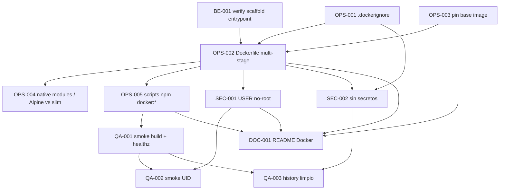

# Development Tasks — PB-P0-016 / US-133: Dockerfile multi-stage para backend

## 1. Metadata

| Field | Value |
|---|---|
| User Story ID | US-133 |
| Source User Story | `management/user-stories/US-133-backend-dockerfile.md` |
| Source Technical Specification | `management/technical-specs/P0/PB-P0-016/US-133-technical-spec.md` |
| Decision Resolution Artifact | No existe — decisiones formalizadas en ADR-DEVOPS-001 y Doc 21 §10 |
| Priority | P0 |
| Backlog ID | PB-P0-016 |
| Backlog Title | Dockerfile Backend |
| Backlog Execution Order | 16 (P0) |
| User Story Position in Backlog Item | 1 de 1 |
| Related User Stories in Backlog Item | US-133 |
| Epic | EPIC-OPS-001 — Deployment & DevOps on AWS |
| Backlog Item Dependencies | PB-P0-002 |
| Feature | Dockerfile multi-stage (foundation deploy) |
| Module / Domain | DevOps |
| Backlog Alignment Status | Found |
| Task Breakdown Status | Ready for Sprint Planning |
| Created Date | 2026-06-22 |
| Last Updated | 2026-06-22 |

---

## 2. Source Validation

| Source | Found | Used | Notes |
|---|---|---|---|
| User Story | Yes | Yes | Status `Approved`; 8 AC + 4 EC. |
| Technical Specification | Yes | Yes | Primary source; `Ready for Task Breakdown`. |
| Decision Resolution Artifact | No | No | No requerido. |
| Product Backlog Prioritized | Yes | Yes | PB-P0-016 mapeado; posición 16 P0. |
| ADRs | Yes | Yes | ADR-DEVOPS-001. |

---

## 3. Backlog Execution Context

### Parent Backlog Item

`PB-P0-016 — Dockerfile Backend`. Acceptance Summary: imagen construye sin warnings; tamaño razonable; container arranca con `/healthz` OK; sin secrets en la imagen. Dependencia: PB-P0-002.

### Execution Order Rationale

US-133 ocupa la posición 16 dentro de P0. Es prerequisito de PB-P0-017 (CI) y PB-P2-023..026 (deploy a App Runner).

### Related User Stories in Same Backlog Item

| User Story | Role in Backlog Item | Suggested Order |
|---|---|---|
| US-133 | Dockerfile + `.dockerignore` + smoke local | 1 |

---

## 4. Task Breakdown Summary

| Area | Number of Tasks | Notes |
|---|---:|---|
| Backend (BE) | 1 | Confirmación de entrypoint y scripts del scaffold. |
| DevOps / Environment (OPS) | 5 | `.dockerignore`, Dockerfile multi-stage, scripts npm, pinning base, smoke build. |
| Security / Authorization (SEC) | 2 | USER no-root, sin secretos / `.dockerignore`. |
| QA / Testing (QA) | 3 | Smoke runtime, no-root, history limpio. |
| Documentation / Traceability (DOC) | 1 | Sección "Docker" en `README`. |
| **Total** | **12** | |

---

## 5. Traceability Matrix

| Acceptance Criterion | Technical Spec Section | Task IDs |
|---|---|---|
| AC-01 | §7 Backend Technical Design, §18 Implementation Guidance | TASK-PB-P0-016-US-133-OPS-002, OPS-005 |
| AC-02 | §4 Scope, §17 Risks | TASK-PB-P0-016-US-133-OPS-002, QA-001 |
| AC-03 | §9 API Contract, §13 Testing Strategy | TASK-PB-P0-016-US-133-BE-001, OPS-002, QA-001 |
| AC-04 | §12 Security & Authorization | TASK-PB-P0-016-US-133-SEC-001, QA-002 |
| AC-05 | §12 Security & Authorization | TASK-PB-P0-016-US-133-OPS-001, SEC-002, QA-003 |
| AC-06 | §4 Scope, §18 Implementation Guidance | TASK-PB-P0-016-US-133-OPS-001 |
| AC-07 | §18 Implementation Guidance (paso 3) | TASK-PB-P0-016-US-133-OPS-002 |
| AC-08 | §7 Backend, §10 Database/Prisma | TASK-PB-P0-016-US-133-OPS-002 |
| EC-01 | §17 Risks | TASK-PB-P0-016-US-133-OPS-002 |
| EC-02 | §17 Risks | TASK-PB-P0-016-US-133-DOC-001 |
| EC-03 | §17 Risks | TASK-PB-P0-016-US-133-OPS-004 |
| EC-04 | §17 Risks | TASK-PB-P0-016-US-133-OPS-002 |
| SEC-01..05 | §12 Security & Authorization | TASK-PB-P0-016-US-133-SEC-001, SEC-002, OPS-004 |

---

## 6. Development Tasks

### TASK-PB-P0-016-US-133-BE-001 — Verificar entrypoint y scripts del scaffold backend

| Field | Value |
|---|---|
| Area | Backend |
| Type | Review |
| Priority | Must |
| Estimate | XS |
| Depends On | — |
| Source AC(s) | AC-03, AC-08 |
| Technical Spec Section(s) | §7 Backend, §17 Risks, §18 Assumptions |
| Backlog ID | PB-P0-016 |
| User Story ID | US-133 |
| Owner Role | Backend |
| Status | To Do |

#### Objective

Confirmar el nombre exacto del archivo de entrada (`dist/server.js` o equivalente), que `npm run build` produce `dist/` válido, que `npm start` arranca la app y que `prisma generate` está disponible.

#### Scope

##### Include

* Inspección de `package.json` del backend.
* Confirmación de salida de `npm run build`.

##### Exclude

* Cambios productivos al scaffold.

#### Acceptance Criteria Covered

* AC-03, AC-08.

#### Definition of Done

- [ ] Entrypoint confirmado y documentado en el PR.
- [ ] `npm run build` y `npm start` válidos en local.

---

### TASK-PB-P0-016-US-133-OPS-001 — Crear `.dockerignore` mínimo

| Field | Value |
|---|---|
| Area | DevOps / Environment |
| Type | Setup |
| Priority | Must |
| Estimate | XS |
| Depends On | — |
| Source AC(s) | AC-05, AC-06 |
| Technical Spec Section(s) | §4 Scope, §12 Security |
| Backlog ID | PB-P0-016 |
| User Story ID | US-133 |
| Owner Role | DevOps |
| Status | To Do |

#### Objective

Crear `.dockerignore` con la lista de Doc 21 §10.3 para evitar filtrar archivos sensibles o pesados a la imagen.

#### Scope

##### Include

* `.dockerignore` con: `node_modules`, `.git`, `.github`, `.env`, `.env.*`, `*.log`, `coverage`, `dist`, `.husky`.

##### Exclude

* Otras carpetas no listadas por Doc 21 §10.3 sin justificación.

#### Acceptance Criteria Covered

* AC-05, AC-06.

#### Definition of Done

- [ ] `.dockerignore` creado en la raíz del paquete backend.
- [ ] Verificación: `docker build --no-cache` no incluye los paths excluidos.

---

### TASK-PB-P0-016-US-133-OPS-002 — Crear `Dockerfile` multi-stage (`deps`, `build`, `runtime`)

| Field | Value |
|---|---|
| Area | DevOps / Environment |
| Type | Implementation |
| Priority | Must |
| Estimate | M |
| Depends On | BE-001, OPS-001, OPS-003 |
| Source AC(s) | AC-01, AC-02, AC-03, AC-07, AC-08, EC-01, EC-04 |
| Technical Spec Section(s) | §7 Backend, §17 Risks, §18 Implementation Guidance |
| Backlog ID | PB-P0-016 |
| User Story ID | US-133 |
| Owner Role | DevOps |
| Status | To Do |

#### Objective

Implementar el `Dockerfile` multi-stage con tres stages, capas cacheables, Prisma client generado en build y stage `runtime` mínima con `ENV PORT=3000`, `EXPOSE 3000` y `CMD` al entrypoint del scaffold.

#### Scope

##### Include

* Stage `deps`: copiar `package*.json` + `prisma/schema.prisma`, ejecutar `npm ci`.
* Stage `build`: copiar resto del código, `npx prisma generate`, `npm run build`, luego `npm prune --production` (o reinstalar prod en stage final).
* Stage `runtime`: `FROM node:<lts>-alpine` (o slim si requerido), copiar `dist/`, `node_modules` productivos, Prisma client; `ENV PORT=3000`; `EXPOSE 3000`; `CMD ["node", "dist/server.js"]` (ajustar al entrypoint real).
* Cacheabilidad: copiar `package*.json` antes que el código fuente (AC-07).

##### Exclude

* `USER` no-root (cubierto por SEC-001 para separar la responsabilidad).
* Push a registros (fuera de scope).

#### Implementation Notes

* Cubre EC-01 (`ENV PORT=3000` por defecto) y EC-04 (sin caches inflados; usar `--no-cache` y limpiar `~/.npm` si aplica).

#### Acceptance Criteria Covered

* AC-01, AC-02, AC-03, AC-07, AC-08, EC-01, EC-04.

#### Definition of Done

- [ ] `Dockerfile` presente.
- [ ] `docker build` sin warnings.
- [ ] Reconstrucción solo con cambios en `src/` reutiliza capa de deps y Prisma generate.

---

### TASK-PB-P0-016-US-133-OPS-003 — Pinnear imagen base oficial por versión

| Field | Value |
|---|---|
| Area | DevOps / Environment |
| Type | Setup |
| Priority | Must |
| Estimate | XS |
| Depends On | — |
| Source AC(s) | SEC-04 (de la User Story) |
| Technical Spec Section(s) | §12 Security & Authorization, §17 Risks |
| Backlog ID | PB-P0-016 |
| User Story ID | US-133 |
| Owner Role | DevOps |
| Status | To Do |

#### Objective

Definir y documentar la base image pinneada (ej. `node:20-alpine`) — evitar tags flotantes (`latest`, `lts`).

#### Scope

##### Include

* Decidir versión LTS de Node a usar (alineada con scaffold backend).
* Documentar en el `Dockerfile` y en `README` la versión y razón.

##### Exclude

* Pinning por SHA salvo que Tech Lead lo solicite.

#### Acceptance Criteria Covered

* SEC-04 (User Story).

#### Definition of Done

- [ ] Versión pinneada en `Dockerfile` (`node:20-alpine` o equivalente LTS vigente).
- [ ] Versión documentada en `README`.

---

### TASK-PB-P0-016-US-133-OPS-004 — Manejar módulos nativos (Alpine vs slim)

| Field | Value |
|---|---|
| Area | DevOps / Environment |
| Type | Implementation |
| Priority | Should |
| Estimate | S |
| Depends On | OPS-002 |
| Source AC(s) | EC-03 |
| Technical Spec Section(s) | §17 Risks |
| Backlog ID | PB-P0-016 |
| User Story ID | US-133 |
| Owner Role | DevOps |
| Status | To Do |

#### Objective

Si surgen módulos nativos que no compilan en Alpine, instalar libs mínimas en stage de build y limpiar, o cambiar base image a `node:LTS-slim` con justificación.

#### Scope

##### Include

* `apk add --no-cache python3 make g++` (Alpine) en stage build, eliminadas en stage final, **solo si** algún módulo lo requiere.
* O cambio justificado a `node:LTS-slim`.

##### Exclude

* Cambios preventivos sin evidencia de problema.

#### Implementation Notes

* Esta tarea es contingente; cierra si el build base funciona sin libs adicionales.

#### Acceptance Criteria Covered

* EC-03.

#### Definition of Done

- [ ] Build verde sin warnings.
- [ ] Si se cambió a `slim`, justificación documentada en `README` y PR.

---

### TASK-PB-P0-016-US-133-OPS-005 — Scripts npm `docker:build` y `docker:run`

| Field | Value |
|---|---|
| Area | DevOps / Environment |
| Type | Setup |
| Priority | Should |
| Estimate | XS |
| Depends On | OPS-002 |
| Source AC(s) | AC-01, AC-03 |
| Technical Spec Section(s) | §4 Scope, §18 Implementation Guidance |
| Backlog ID | PB-P0-016 |
| User Story ID | US-133 |
| Owner Role | DevOps |
| Status | To Do |

#### Objective

Exponer scripts npm opcionales para conveniencia local (`docker:build`, `docker:run`).

#### Scope

##### Include

* `package.json`: `"docker:build": "docker build -t eventflow-backend:local ."`, `"docker:run": "docker run --rm -p 3000:3000 -e PORT=3000 eventflow-backend:local"`.

##### Exclude

* Wiring CI (PB-P0-017).

#### Acceptance Criteria Covered

* AC-01, AC-03 (conveniencia).

#### Definition of Done

- [ ] Scripts disponibles en `npm run`.

---

### TASK-PB-P0-016-US-133-SEC-001 — Declarar `USER` no-root en stage final

| Field | Value |
|---|---|
| Area | Security / Authorization |
| Type | Implementation |
| Priority | Must |
| Estimate | XS |
| Depends On | OPS-002 |
| Source AC(s) | AC-04, SEC-02 (User Story) |
| Technical Spec Section(s) | §12 Security & Authorization |
| Backlog ID | PB-P0-016 |
| User Story ID | US-133 |
| Owner Role | DevOps / Security |
| Status | To Do |

#### Objective

Garantizar que la stage final corre como usuario no-root.

#### Scope

##### Include

* En Alpine: `USER node` (user creado por la imagen oficial) o crear user `app` con `addgroup -S app && adduser -S app -G app`.
* Ajustar permisos de `/app` si fuera necesario.

##### Exclude

* Capabilities Linux (futuro).

#### Acceptance Criteria Covered

* AC-04, SEC-02 (User Story).

#### Definition of Done

- [ ] `USER` declarado en la stage final.
- [ ] `docker exec <id> id -u` distinto de 0.

---

### TASK-PB-P0-016-US-133-SEC-002 — Verificar ausencia de secretos en la imagen

| Field | Value |
|---|---|
| Area | Security / Authorization |
| Type | Test |
| Priority | Must |
| Estimate | XS |
| Depends On | OPS-001, OPS-002 |
| Source AC(s) | AC-05, SEC-01, SEC-03, SEC-05 (User Story) |
| Technical Spec Section(s) | §12 Security & Authorization, §13 Testing Strategy (Security) |
| Backlog ID | PB-P0-016 |
| User Story ID | US-133 |
| Owner Role | Security / DevOps |
| Status | To Do |

#### Objective

Verificar que la imagen no contiene `.env*` ni credenciales en capas y que no se usan `ARG` con secretos.

#### Scope

##### Include

* `docker history --no-trunc eventflow-backend:local | grep -i 'env\|secret'` → sin hallazgos sensibles.
* `docker run --rm eventflow-backend:local sh -c 'find / -maxdepth 4 -name ".env*" 2>/dev/null'` → vacío.
* Revisión de `Dockerfile`: sin `ARG` que reciba secretos.

##### Exclude

* Scan automatizado de vulnerabilidades (futuro).

#### Acceptance Criteria Covered

* AC-05, SEC-01, SEC-03, SEC-05 (User Story).

#### Definition of Done

- [ ] Comandos de verificación documentados en el PR con su salida.

---

### TASK-PB-P0-016-US-133-QA-001 — Smoke runtime: build + run + `/healthz`

| Field | Value |
|---|---|
| Area | QA / Testing |
| Type | Test |
| Priority | Must |
| Estimate | S |
| Depends On | OPS-002, OPS-005 |
| Source AC(s) | AC-01, AC-02, AC-03 |
| Technical Spec Section(s) | §13 Testing Strategy |
| Backlog ID | PB-P0-016 |
| User Story ID | US-133 |
| Owner Role | QA / DevOps |
| Status | To Do |

#### Objective

Ejecutar `docker build` y `docker run` localmente, hacer `curl http://localhost:3000/healthz` y verificar tamaño de imagen.

#### Acceptance Criteria Covered

* AC-01, AC-02, AC-03.

#### Definition of Done

- [ ] Evidencia en el PR (logs + `docker image ls`).

---

### TASK-PB-P0-016-US-133-QA-002 — Smoke security: usuario no-root

| Field | Value |
|---|---|
| Area | QA / Testing |
| Type | Test |
| Priority | Must |
| Estimate | XS |
| Depends On | SEC-001, QA-001 |
| Source AC(s) | AC-04 |
| Technical Spec Section(s) | §13 Testing Strategy (Security) |
| Backlog ID | PB-P0-016 |
| User Story ID | US-133 |
| Owner Role | QA |
| Status | To Do |

#### Objective

Verificar que el proceso del contenedor corre como UID distinto de 0.

#### Acceptance Criteria Covered

* AC-04, AUTH-TS-01 (User Story).

#### Definition of Done

- [ ] `docker exec <id> id -u` retorna ≠ 0; evidencia en el PR.

---

### TASK-PB-P0-016-US-133-QA-003 — Smoke security: `docker history` limpio

| Field | Value |
|---|---|
| Area | QA / Testing |
| Type | Test |
| Priority | Must |
| Estimate | XS |
| Depends On | SEC-002, QA-001 |
| Source AC(s) | AC-05 |
| Technical Spec Section(s) | §13 Testing Strategy (Security) |
| Backlog ID | PB-P0-016 |
| User Story ID | US-133 |
| Owner Role | QA / Security |
| Status | To Do |

#### Objective

Verificar `docker history` y filesystem en runtime sin `.env*` ni credenciales.

#### Acceptance Criteria Covered

* AC-05.

#### Definition of Done

- [ ] Salidas de los comandos en el PR; sin hallazgos.

---

### TASK-PB-P0-016-US-133-DOC-001 — Sección "Docker" en `README`

| Field | Value |
|---|---|
| Area | Documentation / Traceability |
| Type | Documentation |
| Priority | Must |
| Estimate | S |
| Depends On | OPS-002, OPS-003, OPS-005, SEC-001 |
| Source AC(s) | EC-02 |
| Technical Spec Section(s) | §18 Implementation Guidance, §19 Task Generation Notes |
| Backlog ID | PB-P0-016 |
| User Story ID | US-133 |
| Owner Role | DevOps |
| Status | To Do |

#### Objective

Documentar cómo construir y correr la imagen, qué variables esperar (`PORT`, `DATABASE_URL`, `CORS_ALLOWED_ORIGINS`, etc.), comportamiento ante ausencia de `DATABASE_URL` (EC-02) y troubleshooting Alpine/native (EC-03).

#### Scope

##### Include

* Sección "Docker" en `README` raíz y/o backend.
* Comandos `docker build`, `docker run`, `npm run docker:build`, `npm run docker:run`.
* Variables esperadas y referencias a Doc 21 §10.5 (secretos en runtime).
* Aclaración App Runner es el runtime objetivo (ADR-DEVOPS-001).

##### Exclude

* Documentación CI / App Runner (otras historias).

#### Acceptance Criteria Covered

* EC-02 (DATABASE_URL ausente), AC-01..05 (referencia operativa).

#### Definition of Done

- [ ] `README` actualizado y aprobado en code review.

---

## 7. Required QA Tasks

| Task ID | Test Type | Purpose |
|---|---|---|
| TASK-PB-P0-016-US-133-QA-001 | Build & runtime smoke | `docker build`/`run` + `curl /healthz` 200 + tamaño razonable. |
| TASK-PB-P0-016-US-133-QA-002 | Security smoke (USER) | Confirmar UID distinto de 0. |
| TASK-PB-P0-016-US-133-QA-003 | Security smoke (history) | `docker history` sin `.env*` ni credenciales. |

---

## 8. Required Security Tasks

| Task ID | Security Concern | Purpose |
|---|---|---|
| TASK-PB-P0-016-US-133-SEC-001 | USER no-root | Cumplir AC-04 y SEC-02 (User Story). |
| TASK-PB-P0-016-US-133-SEC-002 | Sin secretos / `.dockerignore` | Cumplir AC-05 y SEC-01/03/05 (User Story). |
| TASK-PB-P0-016-US-133-OPS-003 | Base image pinneada por versión | Cumplir SEC-04 (User Story). |

---

## 9. Required Seed / Demo Tasks

`No aplica`.

---

## 10. Observability / Audit Tasks

`No aplica`. La imagen no debe redirigir logs; la app sigue emitiendo a stdout/stderr (App Runner los recoge en CloudWatch; Doc 21 §15).

---

## 11. Documentation / Traceability Tasks

| Task ID | Document / Artifact | Purpose |
|---|---|---|
| TASK-PB-P0-016-US-133-DOC-001 | `README` raíz y/o backend | Sección "Docker" con build, run, variables y troubleshooting. |

---

## 12. Dependency Graph

---

## 13. Suggested Implementation Order

### Phase 1 — Foundation

* BE-001 (verificar scaffold).
* OPS-001 (`.dockerignore`).
* OPS-003 (pinning base image).

### Phase 2 — Core Implementation

* OPS-002 (Dockerfile multi-stage).
* SEC-001 (USER no-root).
* OPS-005 (scripts npm).
* OPS-004 (contingente: native modules).

### Phase 3 — Validation / Security / QA

* SEC-002 (sin secretos).
* QA-001, QA-002, QA-003 (smokes).

### Phase 4 — Documentation / Review

* DOC-001 (`README`).
* Code review + Tech Lead + Security review.

---

## 14. Risks & Mitigations

| Risk | Impact | Mitigation | Related Task |
| ---- | ------ | ---------- | ------------ |
| Módulo nativo no compila en Alpine | Build falla | OPS-004 contingente (libs en build + clean, o cambio a `slim`) | OPS-004 |
| Entrypoint del scaffold incierto | `CMD` incorrecto | BE-001 confirma antes de implementar OPS-002 | BE-001, OPS-002 |
| `prisma generate` requiere internet | Build falla offline | Documentar; en CI permitir egress al endpoint Prisma | OPS-002, DOC-001 |
| Cache de npm infla imagen | Mayor tamaño | OPS-002 limpia caches; `npm ci --no-audit --no-fund` | OPS-002 |
| Pinning con tag flotante | Builds no reproducibles | OPS-003 fuerza pin por versión | OPS-003 |

---

## 15. Out of Scope Confirmation

No se implementará como parte de esta User Story:

* Push a Amazon ECR (PB-P0-017 / PB-P2-023).
* Configuración del servicio AWS App Runner (PB-P2-023..026).
* GitHub Actions workflow (PB-P0-017).
* Dockerfile para el frontend (Amplify).
* `docker-compose` u orquestación local.
* Imagen multi-arch o distroless.
* `prisma migrate deploy` desde la imagen (PB-P0-018).
* Scan automatizado de vulnerabilidades.

---

## 16. Readiness for Sprint Planning

| Check                                      | Status |
| ------------------------------------------ | ------ |
| Product Backlog mapping found              | Pass   |
| Every AC maps to tasks                     | Pass   |
| Technical Spec used when available         | Pass   |
| QA tasks included                          | Pass   |
| Security tasks included if applicable      | Pass   |
| Seed/demo tasks included if applicable     | N/A    |
| Observability tasks included if applicable | N/A    |
| Documentation tasks included if applicable | Pass   |
| Task dependencies clear                    | Pass   |
| Tasks small enough                         | Pass (XS/S/M) |
| Ready for Sprint Planning                  | Yes    |

---

## 17. Final Recommendation

`Ready for Sprint Planning`.

12 tareas atómicas (XS/S/M) cubren los 8 AC y los 4 EC, respetando el orden Foundation → Implementation → Validation → Documentation. Todas las decisiones se apoyan en ADR-DEVOPS-001 y Doc 21 §10. Se recomienda ejecutar antes de PB-P0-017 (CI) y PB-P2-023..026 (deploy).
