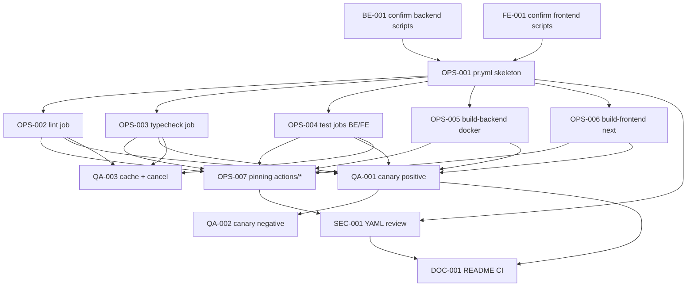

# Development Tasks — PB-P0-017 / US-134: Pipeline GitHub Actions de CI (lint / typecheck / tests / build)

## 1. Metadata

| Field | Value |
|---|---|
| User Story ID | US-134 |
| Source User Story | `management/user-stories/US-134-github-actions-pipeline.md` |
| Source Technical Specification | `management/technical-specs/P0/PB-P0-017/US-134-technical-spec.md` |
| Decision Resolution Artifact | No existe — decisiones formalizadas en ADR-DEVOPS-001, ADR-TEST-001/002 y Doc 21 §§16–17 |
| Priority | P0 |
| Backlog ID | PB-P0-017 |
| Backlog Title | GitHub Actions CI Pipeline (lint/test/build) |
| Backlog Execution Order | 17 (P0) |
| User Story Position in Backlog Item | 1 de 1 |
| Related User Stories in Backlog Item | US-134 |
| Epic | EPIC-OPS-001 — Deployment & DevOps on AWS |
| Backlog Item Dependencies | PB-P0-002, PB-P0-012, PB-P0-015, PB-P0-016 |
| Feature | CI quality gates (foundation) |
| Module / Domain | DevOps |
| Backlog Alignment Status | Found |
| Task Breakdown Status | Ready for Sprint Planning |
| Created Date | 2026-06-22 |
| Last Updated | 2026-06-22 |

---

## 2. Source Validation

| Source | Found | Used | Notes |
|---|---|---|---|
| User Story | Yes | Yes | Status `Approved`; 10 AC + 5 EC. |
| Technical Specification | Yes | Yes | Primary source; `Ready for Task Breakdown`. |
| Decision Resolution Artifact | No | No | No requerido. |
| Product Backlog Prioritized | Yes | Yes | PB-P0-017 mapeado; posición 17 P0. |
| ADRs | Yes | Yes | ADR-DEVOPS-001, ADR-TEST-001, ADR-TEST-002. |

---

## 3. Backlog Execution Context

### Parent Backlog Item

`PB-P0-017 — GitHub Actions CI Pipeline (lint/test/build)`. Acceptance Summary: workflow corre en PR a `main`; lint+typecheck+tests+build verde; cache npm/pnpm; status visible. Notes: deploy en PB-P2-023..026.

### Execution Order Rationale

US-134 = posición 17 (P0). Requiere scaffolds (PB-P0-002 / PB-P0-012), tooling de tests (PB-P0-015 / US-125) y `Dockerfile` (PB-P0-016 / US-133). PB-P0-018 extenderá agregando `prisma migrate diff`.

### Related User Stories in Same Backlog Item

| User Story | Role in Backlog Item | Suggested Order |
|---|---|---|
| US-134 | `pr.yml` con quality gates | 1 |

---

## 4. Task Breakdown Summary

| Area | Number of Tasks | Notes |
|---|---:|---|
| Backend (BE) | 1 | Confirmación de scripts npm del scaffold. |
| Frontend (FE) | 1 | Confirmación de scripts npm del scaffold. |
| DevOps / Environment (OPS) | 7 | Esqueleto, jobs lint/typecheck/test/build (BE+FE), cache, concurrency, permissions, pinning. |
| Security / Authorization (SEC) | 1 | Revisión YAML (permissions, secretos, `pull_request_target`, pinning). |
| QA / Testing (QA) | 3 | PR canario positivo, PR canario negativo, validación cache + concurrency. |
| Documentation / Traceability (DOC) | 1 | Sección "CI / Branch Protection" en `README`/`CONTRIBUTING`. |
| **Total** | **14** | |

---

## 5. Traceability Matrix

| Acceptance Criterion | Technical Spec Section | Task IDs |
|---|---|---|
| AC-01 | §6, §18 | TASK-PB-P0-017-US-134-OPS-001 |
| AC-02 | §6, §18 (paso 2) | TASK-PB-P0-017-US-134-OPS-002 |
| AC-03 | §6, §18 (paso 3) | TASK-PB-P0-017-US-134-OPS-003 |
| AC-04 | §6, §18 (paso 4) | TASK-PB-P0-017-US-134-OPS-004 |
| AC-05 | §6, §18 (paso 5) | TASK-PB-P0-017-US-134-OPS-005 |
| AC-06 | §6, §18 (paso 6) | TASK-PB-P0-017-US-134-OPS-006 |
| AC-07 | §6, §17 | TASK-PB-P0-017-US-134-OPS-002, OPS-003, OPS-004, QA-003 |
| AC-08 | §18, §19 (docs) | TASK-PB-P0-017-US-134-DOC-001 |
| AC-09 | §12 Security, §6 | TASK-PB-P0-017-US-134-OPS-001, OPS-007, SEC-001 |
| AC-10 | §17 Risks | TASK-PB-P0-017-US-134-QA-001 |
| EC-01..05 | §17 Risks, §13 Testing Strategy | TASK-PB-P0-017-US-134-QA-002, OPS-001, OPS-005, SEC-001 |
| SEC-01..05 | §12 Security | TASK-PB-P0-017-US-134-OPS-007, SEC-001 |

---

## 6. Development Tasks

### TASK-PB-P0-017-US-134-BE-001 — Confirmar scripts npm del scaffold backend

| Field | Value |
|---|---|
| Area | Backend |
| Type | Review |
| Priority | Must |
| Estimate | XS |
| Depends On | — |
| Source AC(s) | AC-02, AC-03, AC-04, AC-05 |
| Technical Spec Section(s) | §7 Backend, §18 Assumptions |
| Backlog ID | PB-P0-017 |
| User Story ID | US-134 |
| Owner Role | Backend |
| Status | To Do |

#### Objective

Confirmar que el backend expone `lint`, `typecheck`, `build` y `test` (Vitest) con los nombres exactos a invocar desde el workflow.

#### Definition of Done

- [ ] Nombres exactos documentados en el PR.

---

### TASK-PB-P0-017-US-134-FE-001 — Confirmar scripts npm del scaffold frontend

| Field | Value |
|---|---|
| Area | Frontend |
| Type | Review |
| Priority | Must |
| Estimate | XS |
| Depends On | — |
| Source AC(s) | AC-02, AC-03, AC-04, AC-06 |
| Technical Spec Section(s) | §8 Frontend, §18 Assumptions |
| Backlog ID | PB-P0-017 |
| User Story ID | US-134 |
| Owner Role | Frontend |
| Status | To Do |

#### Objective

Confirmar que el frontend expone `lint`, `typecheck`, `build` (`next build`) y `test` (Vitest).

#### Definition of Done

- [ ] Nombres exactos documentados en el PR.

---

### TASK-PB-P0-017-US-134-OPS-001 — Esqueleto `pr.yml` (triggers, permissions, concurrency)

| Field | Value |
|---|---|
| Area | DevOps / Environment |
| Type | Implementation |
| Priority | Must |
| Estimate | S |
| Depends On | BE-001, FE-001 |
| Source AC(s) | AC-01, AC-09 |
| Technical Spec Section(s) | §6, §12, §18 |
| Backlog ID | PB-P0-017 |
| User Story ID | US-134 |
| Owner Role | DevOps |
| Status | To Do |

#### Objective

Crear `.github/workflows/pr.yml` con `name`, `on: pull_request: branches: [main, qa]` (+ `workflow_dispatch` opcional), `permissions: contents: read` a nivel workflow y `concurrency` con `cancel-in-progress: true`.

#### Scope

##### Include

* Trigger en PR a `main` y `qa`.
* `concurrency.group: pr-${{ github.workflow }}-${{ github.event.pull_request.number || github.ref }}`.
* `permissions: contents: read`.
* `defaults.run.shell: bash`.

##### Exclude

* `main.yml`/`staging.yml`/`smoke.yml`/`seed-reset.yml`.
* `pull_request_target`.
* Secretos de cloud.

#### Acceptance Criteria Covered

* AC-01, AC-09.

#### Definition of Done

- [ ] Workflow presente y parseable por GitHub Actions.

---

### TASK-PB-P0-017-US-134-OPS-002 — Job `lint` (matriz BE/FE) con cache

| Field | Value |
|---|---|
| Area | DevOps / Environment |
| Type | Implementation |
| Priority | Must |
| Estimate | S |
| Depends On | OPS-001 |
| Source AC(s) | AC-02, AC-07 |
| Technical Spec Section(s) | §6 (AC-02, AC-07), §18 |
| Backlog ID | PB-P0-017 |
| User Story ID | US-134 |
| Owner Role | DevOps |
| Status | To Do |

#### Objective

Job `lint` con `strategy.matrix.pkg: [backend, frontend]`; `actions/checkout@v4`; `actions/setup-node@v4` con `node-version` del scaffold y `cache: 'npm'` (o `pnpm`); `working-directory` apuntando al paquete; `npm ci` + `npm run lint`.

#### Acceptance Criteria Covered

* AC-02, AC-07.

#### Definition of Done

- [ ] Job verde con cambios canarios limpios.
- [ ] Cambio canario con error de lint hace fallar el job.

---

### TASK-PB-P0-017-US-134-OPS-003 — Job `typecheck` (matriz BE/FE) con cache

| Field | Value |
|---|---|
| Area | DevOps / Environment |
| Type | Implementation |
| Priority | Must |
| Estimate | S |
| Depends On | OPS-001 |
| Source AC(s) | AC-03, AC-07 |
| Technical Spec Section(s) | §6 (AC-03, AC-07) |
| Backlog ID | PB-P0-017 |
| User Story ID | US-134 |
| Owner Role | DevOps |
| Status | To Do |

#### Objective

Job análogo a OPS-002 para `npm run typecheck` (o `tsc --noEmit`).

#### Acceptance Criteria Covered

* AC-03, AC-07.

#### Definition of Done

- [ ] Job verde en canario limpio; falla en canario con error de tipos.

---

### TASK-PB-P0-017-US-134-OPS-004 — Jobs `test-backend` y `test-frontend` (Vitest) con cache

| Field | Value |
|---|---|
| Area | DevOps / Environment |
| Type | Implementation |
| Priority | Must |
| Estimate | M |
| Depends On | OPS-001 |
| Source AC(s) | AC-04, AC-07, EC-02 |
| Technical Spec Section(s) | §6 (AC-04), §13 Testing Strategy |
| Backlog ID | PB-P0-017 |
| User Story ID | US-134 |
| Owner Role | DevOps |
| Status | To Do |

#### Objective

Dos jobs (uno por paquete) que ejecuten `npm test` (Vitest) reutilizando el setup MSW / Supertest entregado por US-125. Playwright queda **opcional** con `continue-on-error: true` o en un job separado no-bloqueante.

#### Scope

##### Include

* `actions/setup-node@v4` con cache.
* `working-directory` por paquete.
* `npm ci` + `npm test`.
* Convención: integración backend se skip si `DATABASE_URL` no está (EC-02).

##### Exclude

* Suite E2E completa (PB-P2-016).

#### Acceptance Criteria Covered

* AC-04, AC-07, EC-02.

#### Definition of Done

- [ ] Jobs verdes en canario limpio.
- [ ] Canario con test roto hace fallar el job.

---

### TASK-PB-P0-017-US-134-OPS-005 — Job `build-backend` (Docker, sin push)

| Field | Value |
|---|---|
| Area | DevOps / Environment |
| Type | Implementation |
| Priority | Must |
| Estimate | S |
| Depends On | OPS-001 |
| Source AC(s) | AC-05, EC-03 |
| Technical Spec Section(s) | §6 (AC-05), §17 Risks |
| Backlog ID | PB-P0-017 |
| User Story ID | US-134 |
| Owner Role | DevOps |
| Status | To Do |

#### Objective

Job que ejecuta `DOCKER_BUILDKIT=1 docker build -t eventflow-backend:ci .` en el paquete backend, **sin push**.

#### Scope

##### Include

* `actions/checkout@v4`.
* `docker buildx` opcional para BuildKit.
* `--no-cache` no obligatorio; usar `actions/cache` con `type=gha` si Tech Lead lo solicita.

##### Exclude

* Push a ECR (PB-P2-023).
* Credenciales AWS.

#### Acceptance Criteria Covered

* AC-05, EC-03.

#### Definition of Done

- [ ] Build verde con `Dockerfile` de US-133.
- [ ] Canario con `Dockerfile` roto hace fallar el job.

---

### TASK-PB-P0-017-US-134-OPS-006 — Job `build-frontend` (`next build`)

| Field | Value |
|---|---|
| Area | DevOps / Environment |
| Type | Implementation |
| Priority | Must |
| Estimate | S |
| Depends On | OPS-001 |
| Source AC(s) | AC-06 |
| Technical Spec Section(s) | §6 (AC-06) |
| Backlog ID | PB-P0-017 |
| User Story ID | US-134 |
| Owner Role | DevOps |
| Status | To Do |

#### Objective

Job que ejecuta `npm run build` (`next build`) en el paquete frontend.

#### Scope

##### Include

* Cache de npm.
* `working-directory` apuntando al frontend.

##### Exclude

* Trigger de Amplify (PB-P2-023..026).
* Publicación de artefactos.

#### Acceptance Criteria Covered

* AC-06.

#### Definition of Done

- [ ] Build verde; canario con `next build` roto hace fallar el job.

---

### TASK-PB-P0-017-US-134-OPS-007 — Pinning de `actions/*` y política de versionado

| Field | Value |
|---|---|
| Area | DevOps / Environment |
| Type | Setup |
| Priority | Must |
| Estimate | XS |
| Depends On | OPS-002, OPS-003, OPS-004, OPS-005, OPS-006 |
| Source AC(s) | SEC-04 (User Story), VR-05 |
| Technical Spec Section(s) | §12 Security, §17 Risks |
| Backlog ID | PB-P0-017 |
| User Story ID | US-134 |
| Owner Role | DevOps |
| Status | To Do |

#### Objective

Garantizar que todas las acciones referencien al menos un major pinneado (ej. `actions/checkout@v4`, `actions/setup-node@v4`). Opcionalmente, pin por SHA si Tech Lead lo solicita.

#### Definition of Done

- [ ] Inspección del YAML: ningún `actions/*` con tag flotante (`master`, `latest`).

---

### TASK-PB-P0-017-US-134-SEC-001 — Revisión YAML (permisos, secretos, `pull_request_target`)

| Field | Value |
|---|---|
| Area | Security / Authorization |
| Type | Review |
| Priority | Must |
| Estimate | XS |
| Depends On | OPS-001, OPS-007 |
| Source AC(s) | SEC-01..05, AC-09, AUTH-TS-01..03 |
| Technical Spec Section(s) | §12 Security & Authorization |
| Backlog ID | PB-P0-017 |
| User Story ID | US-134 |
| Owner Role | Security / DevOps |
| Status | To Do |

#### Objective

Verificar que el YAML cumple SEC-01..05: `permissions: contents: read` por defecto, sin `pull_request_target`, sin credenciales de cloud, sin `id-token: write`, sin valores que parezcan secretos en logs, `actions/*` pinneados.

#### Definition of Done

- [ ] Checklist registrado en el PR.

---

### TASK-PB-P0-017-US-134-QA-001 — PR canario positivo (todos los gates verdes)

| Field | Value |
|---|---|
| Area | QA / Testing |
| Type | Test |
| Priority | Must |
| Estimate | S |
| Depends On | OPS-002, OPS-003, OPS-004, OPS-005, OPS-006 |
| Source AC(s) | AC-01..06, AC-10 |
| Technical Spec Section(s) | §13 Testing Strategy (CI Checks) |
| Backlog ID | PB-P0-017 |
| User Story ID | US-134 |
| Owner Role | QA / DevOps |
| Status | To Do |

#### Objective

Abrir un PR canario sin cambios funcionales y verificar que los 5+ jobs obligatorios pasan verde dentro del tiempo razonable de referencia (≤15 min con cache cálida).

#### Definition of Done

- [ ] Captura/log del PR canario verde anexada al PR principal.

---

### TASK-PB-P0-017-US-134-QA-002 — PR canario negativo (cada gate falla aislado)

| Field | Value |
|---|---|
| Area | QA / Testing |
| Type | Test |
| Priority | Must |
| Estimate | S |
| Depends On | QA-001 |
| Source AC(s) | AC-02..06, EC-01, EC-03, EC-04 |
| Technical Spec Section(s) | §13 Testing Strategy |
| Backlog ID | PB-P0-017 |
| User Story ID | US-134 |
| Owner Role | QA |
| Status | To Do |

#### Objective

Verificar la negativa de cada gate (lint, typecheck, test, build BE, build FE) y de los EC (lockfile inválido, contexto docker pesado, secreto faltante).

#### Definition of Done

- [ ] Evidencia en el PR de cada gate fallando individualmente.

---

### TASK-PB-P0-017-US-134-QA-003 — Validación de cache y `cancel-in-progress`

| Field | Value |
|---|---|
| Area | QA / Testing |
| Type | Test |
| Priority | Must |
| Estimate | XS |
| Depends On | OPS-002, OPS-003, OPS-004 |
| Source AC(s) | AC-07, AC-09, EC-05 |
| Technical Spec Section(s) | §17 Risks, §6 (AC-07/AC-09) |
| Backlog ID | PB-P0-017 |
| User Story ID | US-134 |
| Owner Role | QA |
| Status | To Do |

#### Objective

Re-run sucesivo del mismo PR para validar reutilización de cache (tiempo de install menor) y verificar que un nuevo push cancela el run anterior.

#### Definition of Done

- [ ] Evidencia (logs) anexada al PR.

---

### TASK-PB-P0-017-US-134-DOC-001 — Sección "CI / Branch Protection" en `README`/`CONTRIBUTING`

| Field | Value |
|---|---|
| Area | Documentation / Traceability |
| Type | Documentation |
| Priority | Must |
| Estimate | S |
| Depends On | OPS-001, OPS-002, OPS-003, OPS-004, OPS-005, OPS-006, SEC-001 |
| Source AC(s) | AC-08, EC-04 |
| Technical Spec Section(s) | §18 Implementation Guidance, §19 Task Generation Notes |
| Backlog ID | PB-P0-017 |
| User Story ID | US-134 |
| Owner Role | DevOps |
| Status | To Do |

#### Objective

Documentar cómo se ejecuta el workflow, qué jobs son obligatorios, cómo configurar branch protection en `main` (Required status checks recomendados), política de secretos (no se usan en este workflow), y troubleshooting (lockfile, cache, Docker context).

#### Scope

##### Include

* Sección "CI / Branch Protection" en `README` raíz y/o `CONTRIBUTING`.
* Comandos locales equivalentes (`npm run lint`, `typecheck`, `test`, `build`).
* Aclaración: deploys/OIDC/ECR se incorporan en PB-P2-023..026.

##### Exclude

* Documentación de deploys (otras historias).

#### Acceptance Criteria Covered

* AC-08, EC-04.

#### Definition of Done

- [ ] `README`/`CONTRIBUTING` actualizado y aprobado en code review.

---

## 7. Required QA Tasks

| Task ID | Test Type | Purpose |
|---|---|---|
| TASK-PB-P0-017-US-134-QA-001 | PR canario positivo | Verificar 5+ gates verdes y tiempo razonable. |
| TASK-PB-P0-017-US-134-QA-002 | PR canario negativo | Verificar bloqueo gate-by-gate y EC. |
| TASK-PB-P0-017-US-134-QA-003 | Cache + concurrency | Validar reutilización de cache y `cancel-in-progress`. |

---

## 8. Required Security Tasks

| Task ID | Security Concern | Purpose |
|---|---|---|
| TASK-PB-P0-017-US-134-SEC-001 | Permisos, secretos, `pull_request_target`, pinning | Cumplir SEC-01..05 y AC-09. |
| TASK-PB-P0-017-US-134-OPS-007 | Pinning de `actions/*` | Cumplir SEC-04 y VR-05. |

---

## 9. Required Seed / Demo Tasks

`No aplica`.

---

## 10. Observability / Audit Tasks

`No aplica`. Los logs de Actions son la evidencia operativa.

---

## 11. Documentation / Traceability Tasks

| Task ID | Document / Artifact | Purpose |
|---|---|---|
| TASK-PB-P0-017-US-134-DOC-001 | `README`/`CONTRIBUTING` raíz | Sección "CI / Branch Protection". |

---

## 12. Dependency Graph

---

## 13. Suggested Implementation Order

### Phase 1 — Foundation

* BE-001, FE-001 (confirm scripts).
* OPS-001 (esqueleto `pr.yml`).

### Phase 2 — Core Implementation

* OPS-002 (lint), OPS-003 (typecheck), OPS-004 (tests), OPS-005 (build-backend docker), OPS-006 (build-frontend next).
* OPS-007 (pinning).

### Phase 3 — Validation / Security / QA

* SEC-001 (review YAML).
* QA-001 (canario positivo), QA-002 (canario negativo), QA-003 (cache + cancel).

### Phase 4 — Documentation / Review

* DOC-001 (`README`/`CONTRIBUTING`).
* Code review + Tech Lead + Security review.

---

## 14. Risks & Mitigations

| Risk | Impact | Mitigation | Related Task |
| ---- | ------ | ---------- | ------------ |
| Scripts npm con nombres distintos en BE vs FE | Workflow rompe | Confirmar antes de implementar; matriz parametrizada | BE-001, FE-001, OPS-002 |
| Tiempo largo de instalación | UX dev pobre | `setup-node` con `cache: 'npm'`; opcional `actions/cache` extra | OPS-002..006 |
| Build Docker pesado en runner hosted | Tiempo total alto | BuildKit (`DOCKER_BUILDKIT=1`); opcional `--cache-to=type=gha` | OPS-005 |
| Cache corrupto | Falsos negativos | Clave por hash exacto de lockfile; fallback install limpio | OPS-002..006, QA-003 |
| Permiso/secret config errónea | Riesgo de seguridad | SEC-001 revisa YAML antes del merge | SEC-001 |
| Branch protection no activada por admin | Merge sin gates | Documentado en `DOC-001`; recomendación operativa | DOC-001 |

---

## 15. Out of Scope Confirmation

No se implementará como parte de esta User Story:

* `main.yml`, `staging.yml`, `smoke.yml`, `seed-reset.yml`.
* Push a ECR / configuración App Runner / Amplify (PB-P2-023..026).
* OIDC GitHub ↔ AWS (PB-P2-023).
* `prisma migrate diff` y validación de migraciones (PB-P0-018).
* Suite E2E completa (PB-P2-016).
* Notifs, security scan, visual regression, mutation testing.
* Self-hosted runners.
* Activación automatizada de branch protection.

---

## 16. Readiness for Sprint Planning

| Check                                      | Status |
| ------------------------------------------ | ------ |
| Product Backlog mapping found              | Pass   |
| Every AC maps to tasks                     | Pass   |
| Technical Spec used when available         | Pass   |
| QA tasks included                          | Pass   |
| Security tasks included if applicable      | Pass   |
| Seed/demo tasks included if applicable     | N/A    |
| Observability tasks included if applicable | N/A    |
| Documentation tasks included if applicable | Pass   |
| Task dependencies clear                    | Pass   |
| Tasks small enough                         | Pass (XS/S/M) |
| Ready for Sprint Planning                  | Yes    |

---

## 17. Final Recommendation

`Ready for Sprint Planning`.

14 tareas atómicas (XS/S/M) cubren los 10 AC y 5 EC, respetando Foundation → Implementation → Validation → Documentation. Decisiones apoyadas en ADR-DEVOPS-001, ADR-TEST-001/002 y Doc 21 §§16–17. Recomendado ejecutar antes de PB-P0-018 (que ampliará el workflow) y PB-P2-023..026 (deploys).
