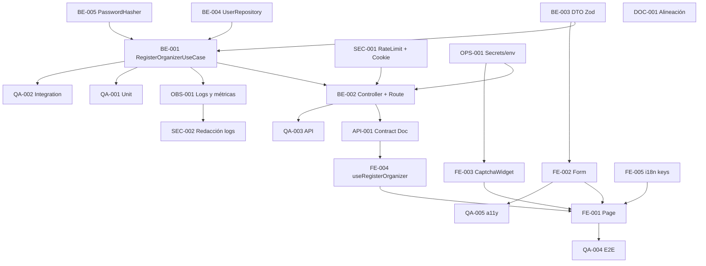

# Development Tasks — PB-P1-001 / US-001: Registrarme como organizador con captcha

## 1. Metadata

| Field | Value |
|---|---|
| User Story ID | US-001 |
| Source User Story | `management/user-stories/US-001-register-organizer-account.md` |
| Source Technical Specification | `management/technical-specs/P1/PB-P1-001/US-001-technical-spec.md` |
| Decision Resolution Artifact | No aplica |
| Priority | P1 |
| Backlog ID | PB-P1-001 |
| Backlog Title | Registro Organizador con captcha |
| Backlog Execution Order | Primer ítem de P1 (EPIC-AUTH-001) |
| User Story Position in Backlog Item | 1 de 1 |
| Related User Stories in Backlog Item | US-001 |
| Epic | EPIC-AUTH-001 — Authentication & User Access |
| Backlog Item Dependencies | PB-P0-004, PB-P0-006 |
| Feature | Registro de usuario con rol Organizador |
| Module / Domain | Auth |
| Backlog Alignment Status | Found |
| Task Breakdown Status | Ready for Sprint Planning |
| Created Date | 2026-06-24 |
| Last Updated | 2026-06-24 |

---

## 2. Source Validation

| Source | Found | Used | Notes |
|---|---|---|---|
| User Story | Yes | Yes | `Approved with Minor Notes`; PO/BA Decisions Applied formalizadas |
| Technical Specification | Yes | Yes | `Ready for Task Breakdown` |
| Decision Resolution Artifact | No | No | No requerido |
| Product Backlog Prioritized | Yes | Yes | PB-P1-001 mapeado |
| ADRs | Yes | Yes | ADR-SEC-001, ADR-SEC-003, ADR-ARCH-001 |

---

## 3. Backlog Execution Context

### Parent Backlog Item

PB-P1-001 abre la franja P1; habilita el resto del MVP (eventos, planes IA, cotizaciones, reseñas). Depende de PB-P0-004 (endpoints REST) y PB-P0-006 (cookies firmadas + captcha) ya entregados.

### Execution Order Rationale

Esta US se ejecuta primero dentro de P1 porque es prerrequisito de US-002 (Vendor) y de toda la rama PB-P1-006..046. Sus dependencias P0 están cerradas.

### Related User Stories in Same Backlog Item

| User Story | Role in Backlog Item | Suggested Order |
|---|---|---|
| US-001 | Único entregable del backlog item | 1 |

---

## 4. Task Breakdown Summary

| Area | Number of Tasks | Notes |
|---|---:|---|
| Backend (BE) | 5 | Use case, controller, DTO, repositorio, password hasher |
| API Contract (API) | 1 | Endpoint REST + error envelope |
| Frontend (FE) | 5 | Página, form, widget captcha, mutation, i18n |
| Security / Authorization (SEC) | 2 | Rate limit + cookie session + redacción de logs |
| QA / Testing (QA) | 5 | Unit, integration, API, E2E, a11y |
| DevOps / Environment (OPS) | 1 | Secrets y configuración por ambiente |
| Observability / Audit (OBS) | 1 | Eventos y métricas de registro |
| Documentation / Traceability (DOC) | 1 | Actualización de Acceptance Summary y catálogo de errores |

**Total: 21 tareas**

---

## 5. Traceability Matrix

| Acceptance Criterion | Technical Spec Section | Task IDs |
|---|---|---|
| AC-01 (registro exitoso) | §7, §8, §9, §10, §12 | TASK-PB-P1-001-US-001-BE-001..005, API-001, FE-001..005, SEC-001, QA-001..004 |
| AC-02 (idioma preferido) | §7 (use case), §8 (i18n), §10 | TASK-PB-P1-001-US-001-BE-001, FE-005, QA-002 |
| AC-03 (email único) | §7 (errors), §9, §10 | TASK-PB-P1-001-US-001-BE-004, API-001, QA-003 |
| EC-01 (captcha inválido) | §7 (middleware), §12, §13 | TASK-PB-P1-001-US-001-BE-001, SEC-001, QA-003, QA-004 |
| EC-02 (password débil) | §7 (Zod), §8 (form), §13 | TASK-PB-P1-001-US-001-BE-003, FE-002, QA-001, QA-003 |
| EC-03 (email mal formado) | §7 (Zod), §8 (form) | TASK-PB-P1-001-US-001-BE-003, FE-002, QA-001 |

---

## 6. Development Tasks

### TASK-PB-P1-001-US-001-BE-001 — Implementar RegisterOrganizerUseCase

| Field | Value |
|---|---|
| Area | Backend |
| Type | Implementation |
| Priority | Must |
| Estimate | M |
| Depends On | TASK-PB-P1-001-US-001-BE-002, BE-003, BE-004, BE-005 |
| Source AC(s) | AC-01, AC-02, EC-01 |
| Technical Spec Section(s) | §7 Backend Technical Design, §12 Security |
| Backlog ID | PB-P1-001 |
| User Story ID | US-001 |
| Owner Role | Backend |
| Status | To Do |

#### Objective

Implementar el caso de uso de aplicación que orquesta captcha → unicidad de email → hash → creación de `User` → emisión de cookie de sesión y emite los logs de auditoría.

#### Scope

##### Include

- `apps/api/src/modules/auth/application/use-cases/RegisterOrganizerUseCase.ts`.
- Resolución de `preferredLanguage` desde `Accept-Language` con fallback `es-LATAM`.
- Forzar `role='organizer'` ignorando el payload entrante.
- Logs `auth.register.success` y `auth.register.failure` con `correlationId`.

##### Exclude

- Verificación de captcha (vive en middleware, BE-002).
- Hashing concreto (vive en `PasswordHasher`, BE-005).
- Cookie issuing (servicio reutilizado de PB-P0-006).

#### Implementation Notes

- Inyectar dependencias por constructor: `UserRepository`, `PasswordHasher`, `SessionCookieIssuer`, `Logger`.
- Wrap `prisma.$transaction` en repositorio cuando se cree el `User`.
- Devolver `RegisterOrganizerResult` con `user` y `sessionCookie` para el controller.

#### Acceptance Criteria Covered

AC-01, AC-02, EC-01.

#### Definition of Done

- [ ] Use case implementado con tipos exportados.
- [ ] Errores tipados (`EmailTakenError`, `WeakPasswordError`, `CaptchaInvalidError`).
- [ ] Unit tests verdes (cubierto por QA-001).

---

### TASK-PB-P1-001-US-001-BE-002 — Wirear controller y ruta POST /api/v1/auth/register

| Field | Value |
|---|---|
| Area | Backend |
| Type | Implementation |
| Priority | Must |
| Estimate | S |
| Depends On | TASK-PB-P1-001-US-001-BE-001, BE-003, SEC-001 |
| Source AC(s) | AC-01, EC-01, EC-02, EC-03 |
| Technical Spec Section(s) | §7 Controllers / Routes, §9 API Contract |
| Backlog ID | PB-P1-001 |
| User Story ID | US-001 |
| Owner Role | Backend |
| Status | To Do |

#### Objective

Registrar la ruta `POST /api/v1/auth/register` con middleware en orden (`rateLimit('register')` → `captcha('register')` → `validateBody` → `noActiveSessionGuard`) y delegar al use case.

#### Scope

##### Include

- `apps/api/src/modules/auth/infrastructure/http/auth.routes.ts`.
- `apps/api/src/modules/auth/infrastructure/http/auth.controller.ts`.
- Mapeo de errores del use case al error envelope estándar.

##### Exclude

- Lógica de negocio (vive en BE-001).
- Lógica de captcha real (vive en middleware compartido).

#### Implementation Notes

- Devolver `201` con `data` proyectado (sin `password_hash`).
- Emitir `Set-Cookie` y `X-Correlation-Id`.

#### Acceptance Criteria Covered

AC-01, EC-01, EC-02, EC-03.

#### Definition of Done

- [ ] Ruta registrada en el router de `auth`.
- [ ] Errores mapeados a `400 VALIDATION_ERROR`, `409 EMAIL_TAKEN`, `429 RATE_LIMIT_EXCEEDED`, `500 INTERNAL_ERROR`.
- [ ] API tests verdes (QA-003).

---

### TASK-PB-P1-001-US-001-BE-003 — Definir RegisterOrganizerDTO con Zod

| Field | Value |
|---|---|
| Area | Backend |
| Type | Implementation |
| Priority | Must |
| Estimate | S |
| Depends On | — |
| Source AC(s) | EC-02, EC-03, AC-01 |
| Technical Spec Section(s) | §7 DTOs / Schemas, §8 Forms |
| Backlog ID | PB-P1-001 |
| User Story ID | US-001 |
| Owner Role | Backend |
| Status | To Do |

#### Objective

Definir el schema Zod canónico `RegisterOrganizerDTO` (alineado con Doc 19 §11.2) y exponerlo como módulo compartido para el frontend.

#### Scope

##### Include

- Schema: `name`, `email`, `password`, `acceptedTerms`, `captchaToken`, `preferredLanguage?`.
- Reglas: longitud, formato RFC, política de contraseñas MVP, diferencia con localpart del email.
- Exportación reutilizable para FE (paquete compartido o copia con lint).

##### Exclude

- Validaciones de DB (constraint funcional `LOWER(email)`).

#### Implementation Notes

- Mantener mensajes neutros para no exponer detalles sensibles.
- Anclar `preferredLanguage` al enum `language_code`.

#### Acceptance Criteria Covered

AC-01, EC-02, EC-03.

#### Definition of Done

- [ ] Schema publicado y consumido por FE-002.
- [ ] Tests unitarios del schema (QA-001).

---

### TASK-PB-P1-001-US-001-BE-004 — Extender UserRepository.createWithRole

| Field | Value |
|---|---|
| Area | Backend |
| Type | Implementation |
| Priority | Must |
| Estimate | S |
| Depends On | — |
| Source AC(s) | AC-01, AC-03 |
| Technical Spec Section(s) | §7 Repository, §10 Database |
| Backlog ID | PB-P1-001 |
| User Story ID | US-001 |
| Owner Role | Backend |
| Status | To Do |

#### Objective

Agregar `createWithRole(payload)` y `findByEmailLower(email)` sobre `UserRepository` reutilizando Prisma y el constraint funcional `LOWER(email)`.

#### Scope

##### Include

- Operaciones case-insensitive sobre `email`.
- Manejo del error de unicidad de Prisma para emitir `EmailTakenError`.

##### Exclude

- Cualquier cambio de schema o migración.

#### Implementation Notes

- Comparación de email en `LOWER()`. Defensa en profundidad: el constraint funcional sigue siendo source of truth.

#### Acceptance Criteria Covered

AC-01, AC-03.

#### Definition of Done

- [ ] Métodos implementados y tipados.
- [ ] Integration test contra Postgres de test (QA-002).

---

### TASK-PB-P1-001-US-001-BE-005 — Implementar PasswordHasher (argon2id)

| Field | Value |
|---|---|
| Area | Backend |
| Type | Implementation |
| Priority | Must |
| Estimate | S |
| Depends On | — |
| Source AC(s) | AC-01 |
| Technical Spec Section(s) | §12 Security |
| Backlog ID | PB-P1-001 |
| User Story ID | US-001 |
| Owner Role | Backend |
| Status | To Do |

#### Objective

Encapsular el hashing con `argon2id` y parámetros mínimos `memoryCost=19MiB`, `timeCost=2`, `parallelism=1` detrás de `PasswordHasher.hash`/`verify`.

#### Scope

##### Include

- Wrapper de la librería argon2.
- Tipos exportados.

##### Exclude

- Política de contraseñas (vive en Zod, BE-003).

#### Implementation Notes

- Mantener `bcrypt(12)` como fallback documentado, no implementado por defecto.

#### Acceptance Criteria Covered

AC-01.

#### Definition of Done

- [ ] Implementación con parámetros correctos.
- [ ] Unit tests verifican algoritmo (QA-001).

---

### TASK-PB-P1-001-US-001-API-001 — Documentar y validar contrato POST /api/v1/auth/register

| Field | Value |
|---|---|
| Area | API Contract |
| Type | Documentation |
| Priority | Must |
| Estimate | S |
| Depends On | TASK-PB-P1-001-US-001-BE-002 |
| Source AC(s) | AC-01, AC-03, EC-01 |
| Technical Spec Section(s) | §9 API Contract Design |
| Backlog ID | PB-P1-001 |
| User Story ID | US-001 |
| Owner Role | Backend |
| Status | To Do |

#### Objective

Publicar el contrato del endpoint en el schema OpenAPI/SDK interno y verificar consistencia con Doc 16.

#### Scope

##### Include

- Inputs, outputs, headers (`Set-Cookie`, `X-Correlation-Id`).
- Errores: `400 VALIDATION_ERROR`, `409 EMAIL_TAKEN`, `429 RATE_LIMIT_EXCEEDED`, `500 INTERNAL_ERROR`.

##### Exclude

- Implementación del contract test (vive en QA-003).

#### Acceptance Criteria Covered

AC-01, AC-03, EC-01.

#### Definition of Done

- [ ] Contrato documentado en el spec source-of-truth.
- [ ] Diff revisado vs Doc 16 §endpoints AUTH.

---

### TASK-PB-P1-001-US-001-FE-001 — Crear página /[locale]/auth/register

| Field | Value |
|---|---|
| Area | Frontend |
| Type | Implementation |
| Priority | Must |
| Estimate | S |
| Depends On | TASK-PB-P1-001-US-001-FE-002 |
| Source AC(s) | AC-01 |
| Technical Spec Section(s) | §8 Routes / Pages |
| Backlog ID | PB-P1-001 |
| User Story ID | US-001 |
| Owner Role | Frontend |
| Status | To Do |

#### Objective

Implementar el segmento `/[locale]/auth/register` (Client Component) que monta el formulario y conecta i18n.

#### Scope

##### Include

- Página y layout asociado.
- Lectura del query `role=organizer`.

##### Exclude

- Lógica del form (FE-002), widget captcha (FE-003), mutation (FE-004), i18n keys (FE-005).

#### Acceptance Criteria Covered

AC-01.

#### Definition of Done

- [ ] Página servida en los cuatro locales.
- [ ] Smoke E2E navega a la ruta (QA-004).

---

### TASK-PB-P1-001-US-001-FE-002 — Implementar RegisterOrganizerForm (RHF + Zod)

| Field | Value |
|---|---|
| Area | Frontend |
| Type | Implementation |
| Priority | Must |
| Estimate | M |
| Depends On | TASK-PB-P1-001-US-001-BE-003 |
| Source AC(s) | AC-01, EC-02, EC-03 |
| Technical Spec Section(s) | §8 Forms |
| Backlog ID | PB-P1-001 |
| User Story ID | US-001 |
| Owner Role | Frontend |
| Status | To Do |

#### Objective

Construir el form con React Hook Form + `zodResolver(RegisterOrganizerSchema)`, focus inicial en `name`, errores accesibles y `PasswordStrengthIndicator`.

#### Scope

##### Include

- Inputs: `name`, `email`, `password`, `acceptedTerms`.
- Asociación de errores con `aria-describedby` y `role="alert"` en banner global.
- Botón con estados de loading y disable.

##### Exclude

- Widget captcha (FE-003), mutation y network (FE-004).

#### Acceptance Criteria Covered

AC-01, EC-02, EC-03.

#### Definition of Done

- [ ] Form valida con el mismo schema del backend.
- [ ] a11y básica revisada (QA-005).

---

### TASK-PB-P1-001-US-001-FE-003 — Integrar CaptchaWidget

| Field | Value |
|---|---|
| Area | Frontend |
| Type | Implementation |
| Priority | Must |
| Estimate | S |
| Depends On | — |
| Source AC(s) | AC-01, EC-01 |
| Technical Spec Section(s) | §8 Components, §12 Security |
| Backlog ID | PB-P1-001 |
| User Story ID | US-001 |
| Owner Role | Frontend |
| Status | To Do |

#### Objective

Integrar el `CaptchaWidget` (provisto por PB-P0-006) con `siteKey` por ambiente y callback `onToken` que inyecta el token en el form.

#### Scope

##### Include

- Lectura de `siteKey` desde config pública.
- Reinicio del widget en error del backend.

##### Exclude

- Implementación del proveedor real (entregable de PB-P0-006).

#### Acceptance Criteria Covered

AC-01, EC-01.

#### Definition of Done

- [ ] Widget funcional con fake provider en test/dev.
- [ ] E2E feliz cubierto (QA-004).

---

### TASK-PB-P1-001-US-001-FE-004 — Mutation useRegisterOrganizer

| Field | Value |
|---|---|
| Area | Frontend |
| Type | Implementation |
| Priority | Must |
| Estimate | S |
| Depends On | TASK-PB-P1-001-US-001-API-001 |
| Source AC(s) | AC-01, AC-03, EC-01, EC-02 |
| Technical Spec Section(s) | §8 Data Fetching, §9 API Contract |
| Backlog ID | PB-P1-001 |
| User Story ID | US-001 |
| Owner Role | Frontend |
| Status | To Do |

#### Objective

Implementar la mutation TanStack Query que llama `authApi.registerOrganizer` y mapea respuestas a estados de UI.

#### Scope

##### Include

- Mapeo `code` → mensaje i18n (`VALIDATION_ERROR`, `EMAIL_TAKEN`, `RATE_LIMIT_EXCEEDED`).
- Redirección a `/[locale]/dashboard` en éxito + toast.

##### Exclude

- Persistencia del token (cookie ya emitida por backend).

#### Acceptance Criteria Covered

AC-01, AC-03, EC-01, EC-02.

#### Definition of Done

- [ ] Mutation tipada.
- [ ] Tests unit/integ FE en MSW (QA-001/004).

---

### TASK-PB-P1-001-US-001-FE-005 — i18n keys auth.register (es-LATAM, es-ES, pt, en)

| Field | Value |
|---|---|
| Area | Frontend |
| Type | Implementation |
| Priority | Must |
| Estimate | XS |
| Depends On | — |
| Source AC(s) | AC-01, AC-02 |
| Technical Spec Section(s) | §8 i18n |
| Backlog ID | PB-P1-001 |
| User Story ID | US-001 |
| Owner Role | Frontend |
| Status | To Do |

#### Objective

Añadir las claves de i18n necesarias para títulos, etiquetas, errores, toast y banner.

#### Scope

##### Include

- `messages/{es-LATAM,es-ES,pt,en}/auth.json`.

##### Exclude

- Otras pantallas de auth (login, reset).

#### Acceptance Criteria Covered

AC-01, AC-02.

#### Definition of Done

- [ ] Claves presentes en los cuatro locales.
- [ ] Build i18n verde.

---

### TASK-PB-P1-001-US-001-SEC-001 — Configurar middleware rateLimit('register') y cookie session por ambiente

| Field | Value |
|---|---|
| Area | Security / Authorization |
| Type | Implementation |
| Priority | Must |
| Estimate | S |
| Depends On | — |
| Source AC(s) | AC-01, EC-01 |
| Technical Spec Section(s) | §12 Security, §17 Risks |
| Backlog ID | PB-P1-001 |
| User Story ID | US-001 |
| Owner Role | Backend |
| Status | To Do |

#### Objective

Registrar el bucket `register` (5/IP/10 min) en `rateLimitMiddleware` y verificar que `SessionCookieIssuer` aplica `HttpOnly`, `Secure` (no-local), `SameSite=Lax` por ambiente.

#### Scope

##### Include

- Config del bucket de rate limit.
- Verificación de flags de cookie en cada ambiente.

##### Exclude

- Cambios al `CaptchaService` (provisto por PB-P0-006).

#### Acceptance Criteria Covered

AC-01, EC-01.

#### Definition of Done

- [ ] Headers `Retry-After` correctos.
- [ ] Test 429 cubre el bucket (QA-003).

---

### TASK-PB-P1-001-US-001-SEC-002 — Garantizar redacción de logs y respuestas

| Field | Value |
|---|---|
| Area | Security / Authorization |
| Type | Review |
| Priority | Must |
| Estimate | XS |
| Depends On | TASK-PB-P1-001-US-001-OBS-001 |
| Source AC(s) | AC-01 |
| Technical Spec Section(s) | §12 Sensitive Data, §14 Logs |
| Backlog ID | PB-P1-001 |
| User Story ID | US-001 |
| Owner Role | Tech Lead |
| Status | To Do |

#### Objective

Revisar que en ningún path se registren `password`, `password_hash`, `captchaToken` ni `set-cookie`; emails redactados en prod.

#### Scope

##### Include

- Auditoría de logs y respuestas.
- Lint/test que verifique campos prohibidos en payloads de log.

##### Exclude

- Implementación de los logs (vive en OBS-001).

#### Acceptance Criteria Covered

AC-01.

#### Definition of Done

- [ ] Test automatizado detecta campos prohibidos.
- [ ] Sin secretos en logs ni snapshots de tests.

---

### TASK-PB-P1-001-US-001-QA-001 — Unit tests (use case, schema, hasher)

| Field | Value |
|---|---|
| Area | QA / Testing |
| Type | Test |
| Priority | Must |
| Estimate | S |
| Depends On | TASK-PB-P1-001-US-001-BE-001, BE-003, BE-005 |
| Source AC(s) | AC-01, EC-02, EC-03 |
| Technical Spec Section(s) | §13 Unit Tests |
| Backlog ID | PB-P1-001 |
| User Story ID | US-001 |
| Owner Role | QA |
| Status | To Do |

#### Objective

Cubrir use case (paths feliz y de error) + schema Zod (VR-01..06) + `PasswordHasher` con Vitest.

#### Definition of Done

- [ ] Suites verdes en CI.
- [ ] Mocks aislados (no DB).

---

### TASK-PB-P1-001-US-001-QA-002 — Integration tests (use case + repo + Postgres test)

| Field | Value |
|---|---|
| Area | QA / Testing |
| Type | Test |
| Priority | Must |
| Estimate | S |
| Depends On | TASK-PB-P1-001-US-001-BE-001, BE-004 |
| Source AC(s) | AC-01, AC-02, AC-03 |
| Technical Spec Section(s) | §13 Integration Tests |
| Backlog ID | PB-P1-001 |
| User Story ID | US-001 |
| Owner Role | QA |
| Status | To Do |

#### Objective

Verificar el flujo extremo a extremo (sin HTTP) contra Postgres de test, incluyendo el constraint funcional `LOWER(email)` y la inferencia de `preferred_language`.

#### Definition of Done

- [ ] Test `email_taken` reproduce `409 EMAIL_TAKEN`.
- [ ] `preferred_language` persistido según header.

---

### TASK-PB-P1-001-US-001-QA-003 — API tests con Supertest

| Field | Value |
|---|---|
| Area | QA / Testing |
| Type | Test |
| Priority | Must |
| Estimate | M |
| Depends On | TASK-PB-P1-001-US-001-BE-002, API-001, SEC-001 |
| Source AC(s) | AC-01, AC-03, EC-01, EC-02 |
| Technical Spec Section(s) | §13 API Tests |
| Backlog ID | PB-P1-001 |
| User Story ID | US-001 |
| Owner Role | QA |
| Status | To Do |

#### Objective

Cubrir 201 happy path (verifica flags de cookie), 400 captcha inválido, 400 password débil, 409 email duplicado, 429 rate limit (clock injectable), intento `role='admin'`.

#### Definition of Done

- [ ] Cobertura de los seis escenarios anteriores.
- [ ] Cookie con `HttpOnly`, `Secure` (en ambiente correspondiente) y `SameSite=Lax`.

---

### TASK-PB-P1-001-US-001-QA-004 — E2E con Playwright + fake captcha

| Field | Value |
|---|---|
| Area | QA / Testing |
| Type | Test |
| Priority | Must |
| Estimate | M |
| Depends On | TASK-PB-P1-001-US-001-FE-001..005, BE-002 |
| Source AC(s) | AC-01 |
| Technical Spec Section(s) | §13 E2E Tests |
| Backlog ID | PB-P1-001 |
| User Story ID | US-001 |
| Owner Role | QA |
| Status | To Do |

#### Objective

E2E del flujo de registro con fake captcha (MSW + provider mock), aterrizando en `/[locale]/dashboard`.

#### Definition of Done

- [ ] Flujo verde en CI en al menos un locale.
- [ ] Captura/trazas en failure.

---

### TASK-PB-P1-001-US-001-QA-005 — Tests de accesibilidad en /auth/register

| Field | Value |
|---|---|
| Area | QA / Testing |
| Type | Test |
| Priority | Must |
| Estimate | S |
| Depends On | TASK-PB-P1-001-US-001-FE-002 |
| Source AC(s) | AC-01 |
| Technical Spec Section(s) | §13 Accessibility Tests |
| Backlog ID | PB-P1-001 |
| User Story ID | US-001 |
| Owner Role | QA |
| Status | To Do |

#### Objective

Ejecutar axe-core sobre la página y verificar navegación por teclado y `aria-live` en errores.

#### Definition of Done

- [ ] Sin violaciones críticas.
- [ ] Tab/Shift+Tab/Enter operativos.

---

### TASK-PB-P1-001-US-001-OPS-001 — Configurar Secrets y env por ambiente

| Field | Value |
|---|---|
| Area | DevOps / Environment |
| Type | Setup |
| Priority | Must |
| Estimate | S |
| Depends On | — |
| Source AC(s) | AC-01, EC-01 |
| Technical Spec Section(s) | §12 Security, §17 Risks |
| Backlog ID | PB-P1-001 |
| User Story ID | US-001 |
| Owner Role | DevOps |
| Status | To Do |

#### Objective

Aprovisionar `SESSION_SECRET`, `CAPTCHA_SITE_KEY`/`CAPTCHA_SECRET` por ambiente (local fake, preview/demo/prod real) en Secrets Manager.

#### Definition of Done

- [ ] Valores presentes y separados por ambiente.
- [ ] `.env.example` actualizado (sin secretos reales).

---

### TASK-PB-P1-001-US-001-OBS-001 — Eventos y métricas de registro

| Field | Value |
|---|---|
| Area | Observability / Audit |
| Type | Implementation |
| Priority | Must |
| Estimate | S |
| Depends On | TASK-PB-P1-001-US-001-BE-001 |
| Source AC(s) | AC-01, EC-01 |
| Technical Spec Section(s) | §14 Observability |
| Backlog ID | PB-P1-001 |
| User Story ID | US-001 |
| Owner Role | Backend |
| Status | To Do |

#### Objective

Emitir `auth.register.success`, `auth.register.failure` (con `reason`), `email_simulated` (welcome) y exponer `auth_register_outcome_total` + `auth_register_latency_ms`.

#### Definition of Done

- [ ] Eventos visibles en logs estructurados.
- [ ] Métricas instrumentadas y verificadas en dashboards locales.

---

### TASK-PB-P1-001-US-001-DOC-001 — Actualizar Acceptance Summary del backlog y notas de alineación

| Field | Value |
|---|---|
| Area | Documentation / Traceability |
| Type | Documentation |
| Priority | Should |
| Estimate | XS |
| Depends On | — |
| Source AC(s) | AC-01 |
| Technical Spec Section(s) | §16 Documentation Alignment Required |
| Backlog ID | PB-P1-001 |
| User Story ID | US-001 |
| Owner Role | Tech Lead |
| Status | To Do |

#### Objective

Actualizar la Acceptance Summary de PB-P1-001 para reflejar `argon2id` como default y dejar nota en Doc 16 si se decide formalizar `CAPTCHA_INVALID` en futuro.

#### Definition of Done

- [ ] PB-P1-001 alineado.
- [ ] Nota agregada en el changelog interno de Doc 16 (si aplica).

---

## 7. Required QA Tasks

| Task ID | Test Type | Purpose |
|---|---|---|
| TASK-PB-P1-001-US-001-QA-001 | Unit | Use case, schema, hasher |
| TASK-PB-P1-001-US-001-QA-002 | Integration | Repo + Postgres test |
| TASK-PB-P1-001-US-001-QA-003 | API | Supertest sobre el endpoint |
| TASK-PB-P1-001-US-001-QA-004 | E2E | Playwright + fake captcha |
| TASK-PB-P1-001-US-001-QA-005 | Accessibility | axe-core en /auth/register |

---

## 8. Required Security Tasks

| Task ID | Security Concern | Purpose |
|---|---|---|
| TASK-PB-P1-001-US-001-SEC-001 | Rate limit + cookie flags | Aplicar bucket `register` y verificar flags por ambiente |
| TASK-PB-P1-001-US-001-SEC-002 | Redacción de logs y respuestas | Evitar fuga de credenciales/captchaToken |

---

## 9. Required Seed / Demo Tasks

No aplica.

---

## 10. Observability / Audit Tasks

| Task ID | Concern | Purpose |
|---|---|---|
| TASK-PB-P1-001-US-001-OBS-001 | Eventos y métricas de auth | Trazabilidad del flujo de registro |

---

## 11. Documentation / Traceability Tasks

| Task ID | Document / Artifact | Purpose |
|---|---|---|
| TASK-PB-P1-001-US-001-DOC-001 | PB-P1-001 Acceptance Summary, Doc 16 nota | Alineación menor con catálogo de errores y default argon2id |

---

## 12. Dependency Graph

---

## 13. Suggested Implementation Order

### Phase 1 — Foundation

- TASK-PB-P1-001-US-001-OPS-001
- TASK-PB-P1-001-US-001-BE-003 (DTO Zod)
- TASK-PB-P1-001-US-001-BE-005 (PasswordHasher)
- TASK-PB-P1-001-US-001-BE-004 (UserRepository extensions)
- TASK-PB-P1-001-US-001-SEC-001 (rateLimit + cookie config)

### Phase 2 — Core Implementation

- TASK-PB-P1-001-US-001-BE-001 (UseCase)
- TASK-PB-P1-001-US-001-BE-002 (Controller + Route)
- TASK-PB-P1-001-US-001-API-001 (contrato)
- TASK-PB-P1-001-US-001-OBS-001 (eventos y métricas)
- TASK-PB-P1-001-US-001-FE-005 (i18n keys)
- TASK-PB-P1-001-US-001-FE-002 (Form)
- TASK-PB-P1-001-US-001-FE-003 (CaptchaWidget)
- TASK-PB-P1-001-US-001-FE-004 (mutation)
- TASK-PB-P1-001-US-001-FE-001 (Page)

### Phase 3 — Validation / Security / QA

- TASK-PB-P1-001-US-001-SEC-002 (redacción)
- TASK-PB-P1-001-US-001-QA-001..005

### Phase 4 — Documentation / Review

- TASK-PB-P1-001-US-001-DOC-001

---

## 14. Risks & Mitigations

| Risk | Impact | Mitigation | Related Task |
|---|---|---|---|
| Cookie falla tras crear el `User` | Cuenta sin sesión | Responder `500` y permitir login posterior; no rollback duro | BE-001, BE-002 |
| Proveedor captcha real aún no elegido | Bloqueo de tests reales | Usar fake provider (PB-P0-006); decisión por config | OPS-001, FE-003 |
| Timing diferente en email taken filtra enumeración | Privacy | Path negativo de tiempo constante cuando sea factible; mensaje UI neutro | BE-001, QA-003 |
| Rate limit por email candidato no formalizado | Gap operativo | Sólo implementar el límite por IP documentado; resto fuera de scope | SEC-001 |
| Cookie `Secure` en local rompe dev | Cookie no se establece | Configuración por ambiente; `Secure=off` sólo en local | OPS-001, SEC-001 |

---

## 15. Out of Scope Confirmation

- Registro Vendor (US-002 / PB-P1-002).
- Login, logout, reset/recover password.
- Confirmación de email obligatoria como bloqueante.
- OAuth Google (Future / Could Have).
- MFA, SSO empresarial, KYC.
- Migraciones de esquema sobre `users`.
- Email real de bienvenida (sigue siendo simulado en MVP).

---

## 16. Readiness for Sprint Planning

| Check | Status |
|---|---|
| Product Backlog mapping found | Pass |
| Every AC maps to tasks | Pass |
| Technical Spec used when available | Pass |
| QA tasks included | Pass |
| Security tasks included if applicable | Pass |
| Seed/demo tasks included if applicable | N/A |
| Observability tasks included if applicable | Pass |
| Documentation tasks included if applicable | Pass |
| Task dependencies clear | Pass |
| Tasks small enough | Pass |
| Ready for Sprint Planning | Yes |

---

## 17. Final Recommendation

`Ready for Sprint Planning` — el desglose cubre AC-01..03 y EC-01..03 con tareas atómicas y dependientes en orden de implementación, sin scope creep ni decisiones reabiertas. Las dependencias del backlog (PB-P0-004 y PB-P0-006) ya están entregadas, por lo que el equipo puede arrancar la Phase 1 de inmediato.
