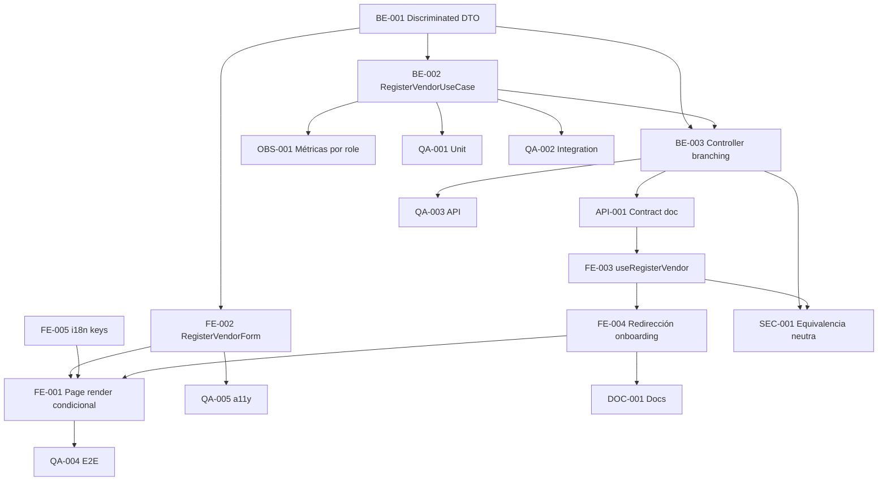

# Development Tasks — PB-P1-002 / US-002: Registrarme como proveedor con captcha

## 1. Metadata

| Field | Value |
|---|---|
| User Story ID | US-002 |
| Source User Story | `management/user-stories/US-002-register-vendor-account.md` |
| Source Technical Specification | `management/technical-specs/P1/PB-P1-002/US-002-technical-spec.md` |
| Decision Resolution Artifact | No aplica |
| Priority | P1 |
| Backlog ID | PB-P1-002 |
| Backlog Title | Registro Vendor con captcha |
| Backlog Execution Order | Segundo ítem de P1 (EPIC-AUTH-001), sigue a PB-P1-001 |
| User Story Position in Backlog Item | 1 de 1 |
| Related User Stories in Backlog Item | US-002 |
| Epic | EPIC-AUTH-001 — Authentication & User Access |
| Backlog Item Dependencies | PB-P0-004, PB-P0-006, PB-P1-001 |
| Feature | Registro de usuario con rol Proveedor |
| Module / Domain | Auth |
| Backlog Alignment Status | Found |
| Task Breakdown Status | Ready for Sprint Planning |
| Created Date | 2026-06-24 |
| Last Updated | 2026-06-24 |

---

## 2. Source Validation

| Source | Found | Used | Notes |
|---|---|---|---|
| User Story | Yes | Yes | `Approved with Minor Notes` |
| Technical Specification | Yes | Yes | `Ready for Task Breakdown` |
| Decision Resolution Artifact | No | No | No requerido |
| Product Backlog Prioritized | Yes | Yes | PB-P1-002 mapeado |
| ADRs | Yes | Yes | ADR-SEC-001, ADR-SEC-003, ADR-ARCH-001 |

---

## 3. Backlog Execution Context

### Parent Backlog Item

PB-P1-002 ejecuta después de PB-P1-001 maximizando el reuso del controller, middlewares, hasher y cookie issuer. Habilita US-040 (creación de `VendorProfile`) y US-074 (aprobación admin).

### Execution Order Rationale

Se aprovecha la infraestructura de PB-P1-001 ya operando y se introducen únicamente las piezas específicas del flujo vendor (DTO discriminado, use case, form, copy, redirección al onboarding).

### Related User Stories in Same Backlog Item

| User Story | Role in Backlog Item | Suggested Order |
|---|---|---|
| US-002 | Único entregable del backlog item | 1 |

---

## 4. Task Breakdown Summary

| Area | Number of Tasks | Notes |
|---|---:|---|
| Backend (BE) | 3 | Schema discriminado, use case vendor, branching del controller |
| API Contract (API) | 1 | Documentar variant `role=vendor` |
| Frontend (FE) | 5 | Render condicional, form vendor, mutation, i18n, redirección onboarding |
| Security / Authorization (SEC) | 1 | Equivalencia de mensajes neutros entre flujos |
| QA / Testing (QA) | 5 | Unit, integration, API, E2E vendor, a11y |
| Observability / Audit (OBS) | 1 | Métricas etiquetadas por `role` |
| Documentation / Traceability (DOC) | 1 | Acceptance Summary del backlog + ruta onboarding |

**Total: 17 tareas**

---

## 5. Traceability Matrix

| Acceptance Criterion | Technical Spec Section | Task IDs |
|---|---|---|
| AC-01 (registro vendor exitoso) | §7, §9, §10, §12 | TASK-PB-P1-002-US-002-BE-001..003, API-001, FE-001..004, QA-001..003 |
| AC-02 (CTA onboarding) | §8 Routes, §12 Authorization | TASK-PB-P1-002-US-002-FE-001, FE-004, DOC-001, QA-004 |
| AC-03 (idioma) | §7 use case, §8 i18n, §10 | TASK-PB-P1-002-US-002-BE-002, FE-005, QA-002 |
| EC-01 (email duplicado cross-role) | §7 errors, §9, §10, §12 | TASK-PB-P1-002-US-002-BE-001..003, SEC-001, QA-003 |
| EC-02 (captcha inválido) | §7 middleware, §12, §13 | TASK-PB-P1-002-US-002-BE-001, QA-003 |
| EC-03 (password débil) | §7 Zod, §8 form, §13 | TASK-PB-P1-002-US-002-BE-001, FE-002, QA-001, QA-003 |

---

## 6. Development Tasks

### TASK-PB-P1-002-US-002-BE-001 — Refactor RegisterUserDTO a discriminated union

| Field | Value |
|---|---|
| Area | Backend |
| Type | Implementation |
| Priority | Must |
| Estimate | S |
| Depends On | — |
| Source AC(s) | AC-01, EC-02, EC-03 |
| Technical Spec Section(s) | §7 DTOs / Schemas |
| Backlog ID | PB-P1-002 |
| User Story ID | US-002 |
| Owner Role | Backend |
| Status | To Do |

#### Objective

Refactorizar el schema entregado por US-001 a un `discriminatedUnion('role', [RegisterOrganizerDTO, RegisterVendorDTO])` con whitelist `organizer | vendor` y mensajes neutros.

#### Scope

##### Include

- `RegisterVendorDTO` con `business_name` (2..150).
- Mantener `RegisterOrganizerDTO` retrocompatible.
- Export del tipo `RegisterUserDTO` consumido por FE.

##### Exclude

- Cualquier soporte para `role=admin`.

#### Implementation Notes

- Mantener un único punto de validación (`validateBody(RegisterUserDTO)`).
- Tests unitarios cubren positivos y negativos por VR.

#### Acceptance Criteria Covered

AC-01, EC-02, EC-03.

#### Definition of Done

- [ ] DTO discriminado expuesto en el módulo `auth`.
- [ ] US-001 sigue verde tras el refactor (regression).

---

### TASK-PB-P1-002-US-002-BE-002 — Implementar RegisterVendorUseCase

| Field | Value |
|---|---|
| Area | Backend |
| Type | Implementation |
| Priority | Must |
| Estimate | M |
| Depends On | TASK-PB-P1-002-US-002-BE-001 |
| Source AC(s) | AC-01, AC-03, EC-01 |
| Technical Spec Section(s) | §7 Use Cases, §12 Security |
| Backlog ID | PB-P1-002 |
| User Story ID | US-002 |
| Owner Role | Backend |
| Status | To Do |

#### Objective

Implementar el use case que orquesta el flujo vendor (espejo de organizer) creando un `User` con `role='vendor'` y emitiendo cookie de sesión.

#### Scope

##### Include

- `apps/api/src/modules/auth/application/use-cases/RegisterVendorUseCase.ts`.
- `users.name` recibe `business_name` en registro.
- Welcome simulado `template='welcome.vendor'`.

##### Exclude

- Creación de `VendorProfile` (US-040).

#### Implementation Notes

- Reutilizar `UserRepository`, `PasswordHasher`, `SessionCookieIssuer`, `CaptchaService`.
- Forzar `role='vendor'` ignorando intentos del payload.

#### Acceptance Criteria Covered

AC-01, AC-03, EC-01.

#### Definition of Done

- [ ] Use case con tipos exportados.
- [ ] Unit tests verdes (QA-001).

---

### TASK-PB-P1-002-US-002-BE-003 — Branching del registerHandler por role

| Field | Value |
|---|---|
| Area | Backend |
| Type | Implementation |
| Priority | Must |
| Estimate | S |
| Depends On | TASK-PB-P1-002-US-002-BE-001, BE-002 |
| Source AC(s) | AC-01, EC-01 |
| Technical Spec Section(s) | §7 Controllers / Routes |
| Backlog ID | PB-P1-002 |
| User Story ID | US-002 |
| Owner Role | Backend |
| Status | To Do |

#### Objective

Extender `authController.registerHandler` para enrutar al use case correspondiente según el `role` del DTO discriminado, manteniendo el contrato del endpoint estable.

#### Scope

##### Include

- Selección de use case por `role`.
- Mapeo de errores idéntico entre flujos.

##### Exclude

- Cualquier cambio al middleware chain.

#### Acceptance Criteria Covered

AC-01, EC-01.

#### Definition of Done

- [ ] Tests API verdes para organizer y vendor (QA-003 + regression de US-001).
- [ ] Códigos de error idénticos cross-flow.

---

### TASK-PB-P1-002-US-002-API-001 — Documentar variant role=vendor del endpoint

| Field | Value |
|---|---|
| Area | API Contract |
| Type | Documentation |
| Priority | Must |
| Estimate | XS |
| Depends On | TASK-PB-P1-002-US-002-BE-003 |
| Source AC(s) | AC-01, EC-01 |
| Technical Spec Section(s) | §9 API Contract Design |
| Backlog ID | PB-P1-002 |
| User Story ID | US-002 |
| Owner Role | Backend |
| Status | To Do |

#### Objective

Actualizar el contrato OpenAPI/SDK del endpoint `POST /api/v1/auth/register` para incluir la variant `role='vendor'` con `business_name`.

#### Definition of Done

- [ ] Contract source-of-truth refleja el discriminated union.
- [ ] Diff revisado contra Doc 16.

---

### TASK-PB-P1-002-US-002-FE-001 — Render condicional de RegisterVendorForm

| Field | Value |
|---|---|
| Area | Frontend |
| Type | Implementation |
| Priority | Must |
| Estimate | S |
| Depends On | TASK-PB-P1-002-US-002-FE-002 |
| Source AC(s) | AC-01, AC-02 |
| Technical Spec Section(s) | §8 Routes / Pages |
| Backlog ID | PB-P1-002 |
| User Story ID | US-002 |
| Owner Role | Frontend |
| Status | To Do |

#### Objective

Renderizar `RegisterVendorForm` cuando la página `/[locale]/auth/register` recibe `role=vendor` (query). Mantener el flujo organizer intacto.

#### Definition of Done

- [ ] Render condicional verificado en los cuatro locales.
- [ ] Smoke E2E para vendor (QA-004).

---

### TASK-PB-P1-002-US-002-FE-002 — Implementar RegisterVendorForm

| Field | Value |
|---|---|
| Area | Frontend |
| Type | Implementation |
| Priority | Must |
| Estimate | M |
| Depends On | TASK-PB-P1-002-US-002-BE-001 |
| Source AC(s) | AC-01, EC-03 |
| Technical Spec Section(s) | §8 Components, Forms |
| Backlog ID | PB-P1-002 |
| User Story ID | US-002 |
| Owner Role | Frontend |
| Status | To Do |

#### Objective

Construir el form con inputs `business_name`, `email`, `password`, `acceptedTerms`, focus inicial en `business_name`, errores accesibles y reuso de `PasswordStrengthIndicator` y `CaptchaWidget`.

#### Definition of Done

- [ ] Form valida con el mismo schema del backend.
- [ ] a11y básica revisada (QA-005).

---

### TASK-PB-P1-002-US-002-FE-003 — Mutation useRegisterVendor

| Field | Value |
|---|---|
| Area | Frontend |
| Type | Implementation |
| Priority | Must |
| Estimate | S |
| Depends On | TASK-PB-P1-002-US-002-API-001 |
| Source AC(s) | AC-01, AC-02, EC-01..03 |
| Technical Spec Section(s) | §8 Data Fetching |
| Backlog ID | PB-P1-002 |
| User Story ID | US-002 |
| Owner Role | Frontend |
| Status | To Do |

#### Objective

Implementar `authApi.registerVendor` + mutation TanStack Query con mapeo `code` → mensaje i18n (vendor namespace) y `onSuccess` redirigiendo al onboarding.

#### Definition of Done

- [ ] Mutation tipada.
- [ ] Mensaje neutro de `EMAIL_TAKEN` idéntico al de US-001.

---

### TASK-PB-P1-002-US-002-FE-004 — Configurar redirección post-registro a /[locale]/vendor/onboarding

| Field | Value |
|---|---|
| Area | Frontend |
| Type | Implementation |
| Priority | Must |
| Estimate | XS |
| Depends On | TASK-PB-P1-002-US-002-FE-003 |
| Source AC(s) | AC-02 |
| Technical Spec Section(s) | §8 Routes, §12 Authorization |
| Backlog ID | PB-P1-002 |
| User Story ID | US-002 |
| Owner Role | Frontend |
| Status | To Do |

#### Objective

Redirigir al onboarding del proveedor tras registro exitoso. Si la ruta concreta cambia en US-040, sincronizar vía DOC-001.

#### Definition of Done

- [ ] Redirección verificada en E2E (QA-004).
- [ ] Si la ruta `/vendor/onboarding` aún no existe, se entrega un placeholder con el CTA "Completar mi perfil" enlazando al formulario de US-040 cuando esté disponible.

---

### TASK-PB-P1-002-US-002-FE-005 — i18n keys auth.register.vendor

| Field | Value |
|---|---|
| Area | Frontend |
| Type | Implementation |
| Priority | Must |
| Estimate | XS |
| Depends On | — |
| Source AC(s) | AC-01, AC-03 |
| Technical Spec Section(s) | §8 i18n |
| Backlog ID | PB-P1-002 |
| User Story ID | US-002 |
| Owner Role | Frontend |
| Status | To Do |

#### Objective

Agregar las claves específicas del flujo vendor (`auth.register.vendor.*`) en los cuatro locales.

#### Definition of Done

- [ ] Claves presentes y build i18n verde.

---

### TASK-PB-P1-002-US-002-SEC-001 — Equivalencia de mensajes neutros entre flujos

| Field | Value |
|---|---|
| Area | Security / Authorization |
| Type | Review |
| Priority | Must |
| Estimate | XS |
| Depends On | TASK-PB-P1-002-US-002-BE-003, FE-003 |
| Source AC(s) | EC-01 |
| Technical Spec Section(s) | §12 Negative Authorization, §17 Risks |
| Backlog ID | PB-P1-002 |
| User Story ID | US-002 |
| Owner Role | Tech Lead |
| Status | To Do |

#### Objective

Verificar que el mensaje y `code` de `EMAIL_TAKEN` sea idéntico entre flujos organizer y vendor para evitar enumeración por rol.

#### Definition of Done

- [ ] Test específico compara payload y latencia entre flujos.
- [ ] Sin divergencia de mensajes en FE.

---

### TASK-PB-P1-002-US-002-QA-001 — Unit tests (RegisterVendorUseCase, schema)

| Field | Value |
|---|---|
| Area | QA / Testing |
| Type | Test |
| Priority | Must |
| Estimate | S |
| Depends On | TASK-PB-P1-002-US-002-BE-001, BE-002 |
| Source AC(s) | AC-01, EC-02, EC-03 |
| Technical Spec Section(s) | §13 Unit Tests |
| Backlog ID | PB-P1-002 |
| User Story ID | US-002 |
| Owner Role | QA |
| Status | To Do |

#### Definition of Done

- [ ] Unit tests verdes (use case + discriminated union).

---

### TASK-PB-P1-002-US-002-QA-002 — Integration tests (use case + repo + Postgres test)

| Field | Value |
|---|---|
| Area | QA / Testing |
| Type | Test |
| Priority | Must |
| Estimate | S |
| Depends On | TASK-PB-P1-002-US-002-BE-002 |
| Source AC(s) | AC-01, AC-03 |
| Technical Spec Section(s) | §13 Integration Tests |
| Backlog ID | PB-P1-002 |
| User Story ID | US-002 |
| Owner Role | QA |
| Status | To Do |

#### Definition of Done

- [ ] `preferred_language` persistido según header.
- [ ] Rol forzado a `vendor` aún si payload contiene `admin`/`organizer`.

---

### TASK-PB-P1-002-US-002-QA-003 — API tests (Supertest) incluido cross-role email_taken

| Field | Value |
|---|---|
| Area | QA / Testing |
| Type | Test |
| Priority | Must |
| Estimate | M |
| Depends On | TASK-PB-P1-002-US-002-BE-003, API-001 |
| Source AC(s) | AC-01, EC-01, EC-02, EC-03 |
| Technical Spec Section(s) | §13 API Tests |
| Backlog ID | PB-P1-002 |
| User Story ID | US-002 |
| Owner Role | QA |
| Status | To Do |

#### Objective

Cubrir 201 happy path (cookie + `role='vendor'`), 400 captcha inválido, 400 password débil, 409 email duplicado entre roles (organizer existente → vendor con mismo email), 429 rate limit, intento `role='admin'` y `role='organizer'` → forzado a vendor.

#### Definition of Done

- [ ] Seis escenarios verdes.
- [ ] Regression de US-001 verde.

---

### TASK-PB-P1-002-US-002-QA-004 — E2E con Playwright (vendor + fake captcha)

| Field | Value |
|---|---|
| Area | QA / Testing |
| Type | Test |
| Priority | Must |
| Estimate | M |
| Depends On | TASK-PB-P1-002-US-002-FE-001..005, BE-003 |
| Source AC(s) | AC-01, AC-02 |
| Technical Spec Section(s) | §13 E2E Tests |
| Backlog ID | PB-P1-002 |
| User Story ID | US-002 |
| Owner Role | QA |
| Status | To Do |

#### Objective

E2E del flujo vendor (form, captcha, mutation, redirección a `/[locale]/vendor/onboarding`).

#### Definition of Done

- [ ] Flujo verde en CI en al menos un locale.

---

### TASK-PB-P1-002-US-002-QA-005 — Tests de accesibilidad en /auth/register?role=vendor

| Field | Value |
|---|---|
| Area | QA / Testing |
| Type | Test |
| Priority | Must |
| Estimate | S |
| Depends On | TASK-PB-P1-002-US-002-FE-002 |
| Source AC(s) | AC-01 |
| Technical Spec Section(s) | §13 Accessibility Tests |
| Backlog ID | PB-P1-002 |
| User Story ID | US-002 |
| Owner Role | QA |
| Status | To Do |

#### Definition of Done

- [ ] axe-core sin violaciones críticas.
- [ ] Navegación por teclado completa.

---

### TASK-PB-P1-002-US-002-OBS-001 — Métricas/logs etiquetados por role

| Field | Value |
|---|---|
| Area | Observability / Audit |
| Type | Implementation |
| Priority | Must |
| Estimate | XS |
| Depends On | TASK-PB-P1-002-US-002-BE-002 |
| Source AC(s) | AC-01 |
| Technical Spec Section(s) | §14 Observability |
| Backlog ID | PB-P1-002 |
| User Story ID | US-002 |
| Owner Role | Backend |
| Status | To Do |

#### Objective

Etiquetar `auth_register_outcome_total{role}` y logs estructurados con `role='vendor'`. Sumar template `welcome.vendor` al evento `email_simulated`.

#### Definition of Done

- [ ] Métricas visibles por `role`.
- [ ] Eventos consistentes entre flujos.

---

### TASK-PB-P1-002-US-002-DOC-001 — Actualizar PB-P1-002 Acceptance Summary y sincronizar ruta de onboarding con US-040

| Field | Value |
|---|---|
| Area | Documentation / Traceability |
| Type | Documentation |
| Priority | Should |
| Estimate | XS |
| Depends On | TASK-PB-P1-002-US-002-FE-004 |
| Source AC(s) | AC-02 |
| Technical Spec Section(s) | §16 Documentation Alignment Required |
| Backlog ID | PB-P1-002 |
| User Story ID | US-002 |
| Owner Role | Tech Lead |
| Status | To Do |

#### Objective

Actualizar la Acceptance Summary del backlog para reflejar `EMAIL_TAKEN` cross-role y dejar nota en US-040 sobre el path concreto del onboarding.

#### Definition of Done

- [ ] Backlog actualizado.
- [ ] US-040 referencia la ruta usada por US-002.

---

## 7. Required QA Tasks

| Task ID | Test Type | Purpose |
|---|---|---|
| TASK-PB-P1-002-US-002-QA-001 | Unit | Use case + schema discriminated |
| TASK-PB-P1-002-US-002-QA-002 | Integration | Repo + Postgres test |
| TASK-PB-P1-002-US-002-QA-003 | API | Supertest cross-role |
| TASK-PB-P1-002-US-002-QA-004 | E2E | Playwright + fake captcha |
| TASK-PB-P1-002-US-002-QA-005 | Accessibility | axe-core en form vendor |

---

## 8. Required Security Tasks

| Task ID | Security Concern | Purpose |
|---|---|---|
| TASK-PB-P1-002-US-002-SEC-001 | Single-role MVP + enumeración | Garantizar mensajes neutros idénticos entre flujos |

---

## 9. Required Seed / Demo Tasks

No aplica.

---

## 10. Observability / Audit Tasks

| Task ID | Concern | Purpose |
|---|---|---|
| TASK-PB-P1-002-US-002-OBS-001 | Eventos y métricas vendor | Trazabilidad y dashboards por `role` |

---

## 11. Documentation / Traceability Tasks

| Task ID | Document / Artifact | Purpose |
|---|---|---|
| TASK-PB-P1-002-US-002-DOC-001 | PB-P1-002 Acceptance Summary, US-040 cross-ref | Alineación con `EMAIL_TAKEN` cross-role y ruta de onboarding |

---

## 12. Dependency Graph

---

## 13. Suggested Implementation Order

### Phase 1 — Foundation

- TASK-PB-P1-002-US-002-BE-001 (discriminated DTO)
- TASK-PB-P1-002-US-002-FE-005 (i18n keys)

### Phase 2 — Core Implementation

- TASK-PB-P1-002-US-002-BE-002 (use case)
- TASK-PB-P1-002-US-002-BE-003 (controller branching)
- TASK-PB-P1-002-US-002-API-001 (contrato)
- TASK-PB-P1-002-US-002-OBS-001 (métricas)
- TASK-PB-P1-002-US-002-FE-002 (form)
- TASK-PB-P1-002-US-002-FE-003 (mutation)
- TASK-PB-P1-002-US-002-FE-004 (redirección)
- TASK-PB-P1-002-US-002-FE-001 (page render)

### Phase 3 — Validation / Security / QA

- TASK-PB-P1-002-US-002-SEC-001
- TASK-PB-P1-002-US-002-QA-001..005

### Phase 4 — Documentation / Review

- TASK-PB-P1-002-US-002-DOC-001

---

## 14. Risks & Mitigations

| Risk | Impact | Mitigation | Related Task |
|---|---|---|---|
| Refactor del schema rompe US-001 | Regression organizer | Mantener compatibilidad y correr suite completa | BE-001, QA-003 |
| Mensajes diferenciales entre flujos exponen enumeración | Privacy | SEC-001 verifica equivalencia con tests | SEC-001 |
| Ruta `/vendor/onboarding` no existe formalmente | CTA cae en 404 | Placeholder en US-002; sincronizar con US-040 vía DOC-001 | FE-004, DOC-001 |
| Convención `User.name = business_name` | Confusión con contacto/operativo | Documentar en spec + DOC-001; la diferenciación llega en US-040 | DOC-001 |

---

## 15. Out of Scope Confirmation

- Creación de `VendorProfile` (US-040 / PB-P1-024).
- Aprobación admin del vendor (US-074 / PB-P1-041).
- KYC, subscription, payouts.
- Multi-rol simultáneo por usuario.
- OAuth / MFA / SSO.
- Migraciones de esquema sobre `users` o `vendor_profiles`.

---

## 16. Readiness for Sprint Planning

| Check | Status |
|---|---|
| Product Backlog mapping found | Pass |
| Every AC maps to tasks | Pass |
| Technical Spec used when available | Pass |
| QA tasks included | Pass |
| Security tasks included if applicable | Pass |
| Seed/demo tasks included if applicable | N/A |
| Observability tasks included if applicable | Pass |
| Documentation tasks included if applicable | Pass |
| Task dependencies clear | Pass |
| Tasks small enough | Pass |
| Ready for Sprint Planning | Yes |

---

## 17. Final Recommendation

`Ready for Sprint Planning` — el desglose cubre AC-01..03 y EC-01..03 con tareas atómicas y dependientes en orden de implementación. Maximiza el reuso de PB-P1-001 (controller, hasher, cookie, captcha, rate limit) y no introduce scope creep. Las notas no bloqueantes del Approval Gate quedan resueltas en SEC-001, FE-004 y DOC-001.
